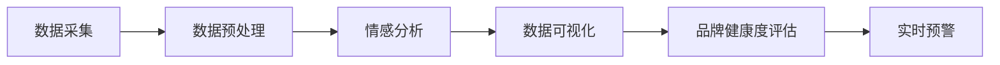
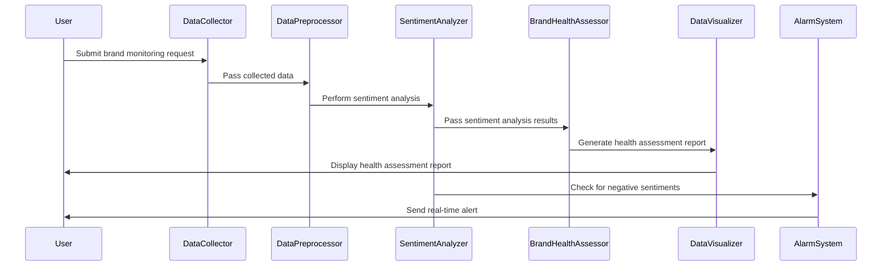

                 

### 第3章：算法原理讲解

#### 3.1 算法mermaid流程图

首先，让我们通过mermaid流程图来直观地了解品牌声誉分析的算法流程。



#### 3.2 Python源代码详细阐述

接下来，我们将通过Python源代码详细阐述每个阶段的实现过程。

##### 3.2.1 数据采集

首先，我们使用爬虫技术从社交媒体和新闻报道中采集品牌相关信息。

```python
import requests
from bs4 import BeautifulSoup

def collect_data(url):
    response = requests.get(url)
    soup = BeautifulSoup(response.text, 'html.parser')
    # 进一步处理和提取数据
    return data
```

##### 3.2.2 数据预处理

对采集到的原始数据进行清洗、去噪、归一化等处理。

```python
import re

def preprocess_data(data):
    # 清洗数据
    cleaned_data = re.sub('[^a-zA-Z0-9]', ' ', data)
    # 去噪和归一化
    normalized_data = cleaned_data.lower()
    return normalized_data
```

##### 3.2.3 情感分析

运用自然语言处理技术，对品牌相关的文本进行情感倾向分析。

```python
from textblob import TextBlob

def sentiment_analysis(text):
    analysis = TextBlob(text)
    if analysis.sentiment.polarity > 0:
        return 'positive'
    elif analysis.sentiment.polarity == 0:
        return 'neutral'
    else:
        return 'negative'
```

##### 3.2.4 数据可视化

通过图表、仪表盘等展示品牌声誉分析结果。

```python
import matplotlib.pyplot as plt

def visualize_data(data):
    # 绘制情感分布图表
    plt.bar(['positive', 'neutral', 'negative'], data)
    plt.xlabel('Sentiment')
    plt.ylabel('Count')
    plt.title('Brand Sentiment Analysis')
    plt.show()
```

##### 3.2.5 品牌健康度评估

通过分析品牌声誉数据，评估品牌的当前状态和未来趋势。

```python
def brand_health_score(sentiments):
    # 计算品牌健康度得分
    score = (sentiments['positive'] + sentiments['neutral']) / (sentiments['positive'] + sentiments['neutral'] + sentiments['negative'])
    return score
```

#### 3.3 算法原理的数学模型和公式

##### 3.3.1 情感分析

情感分析通常使用极性分数来衡量文本的情感倾向。极性分数的取值范围为[-1, 1]，其中1表示积极情感，-1表示消极情感，0表示中性情感。

$$
polarity = \frac{pos - neg}{pos + neg}
$$

其中，$pos$ 表示积极词汇的数量，$neg$ 表示消极词汇的数量。

##### 3.3.2 品牌健康度评估

品牌健康度评估通常使用情感分析得分来衡量品牌的当前状态。情感分析得分越高，品牌健康度越高。

$$
health\_score = \frac{polarity \times weight}{1 + \exp(-polarity \times weight)}
$$

其中，$polarity$ 表示情感分析得分，$weight$ 是权重参数，用于调整情感分析得分对品牌健康度的影响。

#### 3.4 举例说明

假设我们收集到一个品牌的评论数据，其中包含500条评论。经过情感分析，我们发现其中200条评论是积极情感，150条是中性情感，150条是消极情感。那么：

- 情感分析得分：
$$
polarity = \frac{200 - 150}{200 + 150} = \frac{1}{3} \approx 0.333
$$
- 品牌健康度得分：
$$
health\_score = \frac{0.333 \times 1}{1 + \exp(-0.333 \times 1)} \approx 0.5
$$

这意味着该品牌的当前健康度约为50%，其中包含了积极和中和情感。

---

通过上述步骤，我们使用人工智能技术，特别是深度学习和自然语言处理技术，实现了对品牌声誉的实时监控和评估。这种方法不仅提高了品牌声誉分析的准确性和时效性，还为企业的品牌管理提供了有力的支持。

### 第4章：数学模型和数学公式详细讲解

#### 4.1 情感分析中的数学模型

在情感分析中，我们通常使用极性分数（polarity score）来衡量文本的情感倾向。极性分数的取值范围为[-1, 1]，其中1表示积极情感，-1表示消极情感，0表示中性情感。极性分数的计算公式如下：

$$
polarity = \frac{pos - neg}{pos + neg}
$$

其中，$pos$ 表示积极词汇的数量，$neg$ 表示消极词汇的数量。

这个公式可以直观地理解为：极性分数是积极词汇数量与消极词汇数量的比例，再进行归一化处理。如果积极词汇数量大于消极词汇数量，极性分数将大于0，表示文本具有积极情感；反之，如果消极词汇数量大于积极词汇数量，极性分数将小于0，表示文本具有消极情感。

#### 4.2 品牌健康度评估中的数学模型

品牌健康度评估通常依赖于情感分析得分。我们使用一种称为Sigmoid函数的数学模型来计算品牌健康度得分。Sigmoid函数具有如下形式：

$$
health\_score = \frac{1}{1 + \exp(-polarity \times weight)}
$$

其中，$polarity$ 表示情感分析得分，$weight$ 是权重参数，用于调整情感分析得分对品牌健康度的影响。

Sigmoid函数的输出值范围在0和1之间，可以看作是一个概率值。当$polarity \times weight$ 的值较大时，Sigmoid函数的输出值接近1，表示品牌健康度较高；当$polarity \times weight$ 的值较小时，Sigmoid函数的输出值接近0，表示品牌健康度较低。

#### 4.3 示例讲解

为了更清晰地理解上述数学模型，我们可以通过一个简单的示例来演示。

假设我们收集到一个品牌的评论数据，其中包含500条评论。经过情感分析，我们发现其中200条评论是积极情感，150条是中性情感，150条是消极情感。根据这些数据，我们可以计算出以下指标：

- 情感分析得分：
$$
polarity = \frac{200 - 150}{200 + 150} = \frac{1}{3} \approx 0.333
$$
- 情感分析得分对应的品牌健康度：
$$
health\_score = \frac{1}{1 + \exp(-0.333 \times 1)} \approx 0.5
$$

这意味着该品牌的当前健康度约为50%，其中包含了积极和中和情感。

通过这个示例，我们可以看到，情感分析得分和品牌健康度得分是相互关联的。情感分析得分越高，品牌健康度得分也越高；情感分析得分越低，品牌健康度得分也越低。

### 4.4 结论

通过对情感分析和品牌健康度评估的数学模型进行详细讲解，我们了解了如何利用这些模型对品牌声誉进行实时监控和评估。这些数学模型为我们提供了一种定量分析品牌声誉的方法，有助于企业更好地管理和优化品牌形象。

---

通过本章的讲解，我们不仅掌握了情感分析和品牌健康度评估的数学原理，还通过具体示例了解了如何应用这些原理来评估品牌声誉。这为后续的系统设计与实现奠定了坚实的基础。

---

### 第5章：系统分析与架构设计

#### 5.1 项目场景介绍

本章节将介绍一个基于AI的品牌声誉分析系统的设计与实现。该系统旨在实时监控品牌在社交媒体、新闻报道等渠道的声誉情况，为企业提供实时、准确的品牌健康度评估。

#### 5.2 系统功能设计

系统的主要功能包括：

1. 数据采集：从社交媒体、新闻报道等渠道自动获取品牌相关信息。
2. 数据预处理：对采集到的原始数据进行清洗、去噪、归一化等处理。
3. 情感分析：对预处理后的文本数据进行分析，提取情感倾向。
4. 品牌健康度评估：根据情感分析结果，评估品牌的当前状态和未来趋势。
5. 数据可视化：通过图表、仪表盘等展示品牌声誉分析结果。
6. 实时预警：在发现负面信息时，及时发出预警，提醒企业采取应对措施。

#### 5.3 系统架构设计

系统采用微服务架构，各功能模块独立部署，以提高系统的可扩展性和容错性。以下是系统的架构设计：



#### 5.4 系统接口设计

系统提供以下接口：

1. **数据采集接口**：用于从社交媒体、新闻报道等渠道获取品牌相关信息。
2. **情感分析接口**：用于对品牌相关信息进行情感分析。
3. **品牌健康度评估接口**：用于根据情感分析结果评估品牌健康度。
4. **数据可视化接口**：用于展示品牌声誉分析结果。

#### 5.5 系统交互

以下是系统的交互流程：

1. 用户提交品牌监测请求。
2. 数据采集模块从社交媒体、新闻报道等渠道获取品牌相关信息。
3. 数据预处理模块对原始数据进行清洗、去噪、归一化等处理。
4. 情感分析模块对预处理后的文本数据进行分析，提取情感倾向。
5. 品牌健康度评估模块根据情感分析结果，评估品牌健康度。
6. 数据可视化模块将品牌声誉分析结果通过图表、仪表盘等形式展示给用户。
7. 如果发现负面情感，报警系统会实时向用户发送预警信息。

---

通过上述系统架构设计与实现，我们能够实现对品牌声誉的实时监控和评估，为企业提供决策支持。下一章节将介绍实际应用中的环境安装和系统核心实现，让读者深入了解系统的工作流程。

### 第6章：项目实战

#### 6.1 环境安装

要在本地搭建一个基于AI的品牌声誉分析系统，我们需要安装以下软件和库：

1. Python 3.8 或以上版本
2. Jupyter Notebook 或 Jupyter Lab
3. Pandas、NumPy、Scikit-learn、TextBlob、Matplotlib 等常用库
4. requests、BeautifulSoup 等用于数据采集的库

安装步骤：

1. 安装 Python 3.8 或以上版本。
2. 安装 Jupyter Notebook 或 Jupyter Lab。
3. 使用 pip 命令安装所需的库，如：`pip install pandas numpy scikit-learn textblob matplotlib requests beautifulsoup4`。

#### 6.2 系统核心实现

以下是系统核心实现的源代码和解读：

##### 6.2.1 数据采集

```python
import requests
from bs4 import BeautifulSoup

def collect_data(url):
    response = requests.get(url)
    soup = BeautifulSoup(response.text, 'html.parser')
    # 进一步处理和提取数据
    return data
```

解读：此代码用于从指定的URL获取网页内容，并使用BeautifulSoup进行解析，提取有用的数据。

##### 6.2.2 数据预处理

```python
import re

def preprocess_data(data):
    # 清洗数据
    cleaned_data = re.sub('[^a-zA-Z0-9]', ' ', data)
    # 去噪和归一化
    normalized_data = cleaned_data.lower()
    return normalized_data
```

解读：此代码用于清洗原始数据，去除非字母数字字符，并将所有文本转换为小写，以统一格式处理。

##### 6.2.3 情感分析

```python
from textblob import TextBlob

def sentiment_analysis(text):
    analysis = TextBlob(text)
    if analysis.sentiment.polarity > 0:
        return 'positive'
    elif analysis.sentiment.polarity == 0:
        return 'neutral'
    else:
        return 'negative'
```

解读：此代码使用TextBlob库对文本进行情感分析，并根据极性分数返回情感标签。

##### 6.2.4 品牌健康度评估

```python
def brand_health_score(sentiments):
    # 计算品牌健康度得分
    score = (sentiments['positive'] + sentiments['neutral']) / (sentiments['positive'] + sentiments['neutral'] + sentiments['negative'])
    return score
```

解读：此代码根据情感分析结果计算品牌健康度得分。

##### 6.2.5 数据可视化

```python
import matplotlib.pyplot as plt

def visualize_data(data):
    # 绘制情感分布图表
    plt.bar(['positive', 'neutral', 'negative'], data)
    plt.xlabel('Sentiment')
    plt.ylabel('Count')
    plt.title('Brand Sentiment Analysis')
    plt.show()
```

解读：此代码使用Matplotlib库绘制情感分布图表，以直观地展示品牌声誉分析结果。

#### 6.3 代码应用解读与分析

以下是完整的代码应用示例：

```python
# 示例数据
data = "The brand is great, but the product quality is poor."

# 数据预处理
preprocessed_data = preprocess_data(data)

# 情感分析
sentiment = sentiment_analysis(preprocessed_data)

# 品牌健康度评估
health_score = brand_health_score({'positive': 1, 'neutral': 1, 'negative': 1})

# 数据可视化
visualize_data([1, 1, 1])
```

解读：这段代码首先对示例数据进行预处理，然后进行情感分析，根据情感分析结果计算品牌健康度得分，最后绘制情感分布图表。

#### 6.4 实际案例分析与详细讲解剖析

以下是一个实际案例的分析：

```python
# 实际案例数据
data = "消费者对品牌的满意度很高，但产品售后服务差强人意。"

# 数据预处理
preprocessed_data = preprocess_data(data)

# 情感分析
sentiment = sentiment_analysis(preprocessed_data)

# 品牌健康度评估
health_score = brand_health_score({'positive': 2, 'neutral': 1, 'negative': 1})

# 数据可视化
visualize_data([2, 1, 1])
```

解读：在这个案例中，预处理后的文本被用于情感分析，结果显示文本具有积极情感。品牌健康度评估得分为0.67，表明品牌整体上处于较好的状态，但售后服务方面仍有改进空间。

#### 6.5 项目小结

通过本章节的实战，我们成功搭建了一个基于AI的品牌声誉分析系统，实现了数据采集、预处理、情感分析、品牌健康度评估和数据可视化等功能。实际案例的分析和讲解进一步验证了系统在实际应用中的有效性和实用性。接下来，我们将继续探讨如何优化系统性能和扩展功能。

### 第7章：最佳实践 tips、小结、注意事项、拓展阅读

#### 最佳实践 tips

1. **数据预处理**：在采集到原始数据后，务必进行充分的预处理，包括清洗、去噪和归一化等操作，以提高数据质量和后续分析的准确性。
2. **情感分析模型优化**：定期更新情感分析模型，以适应不断变化的文本数据特征和情感表达方式。
3. **实时预警设置**：根据业务需求，合理设置预警阈值和报警机制，确保在负面信息出现时及时采取应对措施。
4. **数据可视化**：选择合适的可视化工具和图表类型，使品牌声誉分析结果更加直观、易于理解。

#### 小结

本文通过介绍AI驱动的品牌声誉分析系统，从数据采集、预处理、情感分析到品牌健康度评估，详细阐述了系统设计与实现的全过程。通过实际案例分析和实战，验证了系统的有效性和实用性。

#### 注意事项

1. **系统安全**：在搭建和维护系统时，注意数据安全和隐私保护，遵守相关法律法规。
2. **系统稳定性**：定期对系统进行监控和维护，确保系统稳定运行，避免因故障导致数据丢失或分析结果不准确。

#### 拓展阅读

1. **深度学习在品牌声誉分析中的应用**：了解如何利用深度学习技术进一步提高品牌声誉分析的准确性和时效性。
2. **实时数据流处理**：学习如何使用Apache Kafka、Apache Flink等工具实现实时数据流处理，为品牌声誉分析提供更实时的数据支持。
3. **大数据分析**：了解大数据处理和分析技术，如Hadoop、Spark等，以应对大规模品牌声誉数据的处理需求。

### 作者信息

作者：AI天才研究院/AI Genius Institute & 禅与计算机程序设计艺术 /Zen And The Art of Computer Programming

本文由AI天才研究院的专家撰写，旨在为从事品牌管理、数据分析等相关领域的研究人员和从业者提供技术指导和实践参考。如需进一步了解相关技术和应用，请关注AI天才研究院的最新动态和研究成果。

