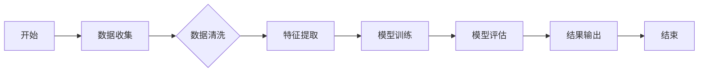
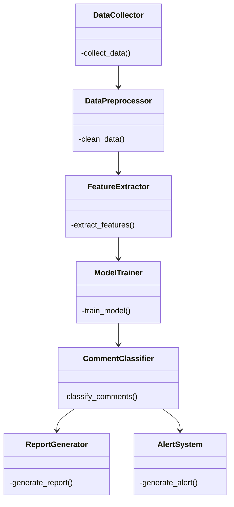
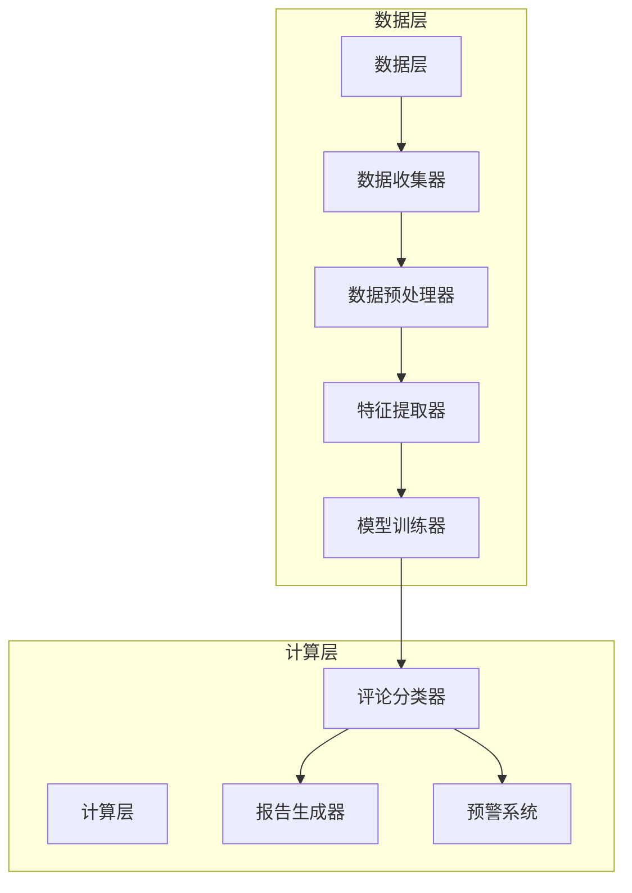
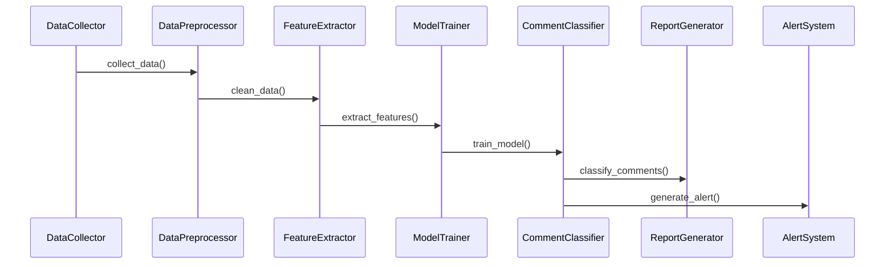
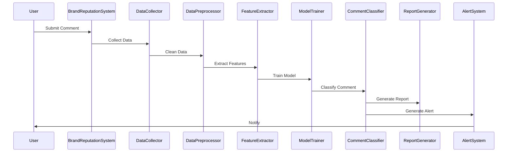

                 

### 第一部分：引言与背景

#### 1.1 引言：AI驱动的品牌声誉管理的重要性

在当今数字化时代，品牌声誉管理已经成为企业战略中不可或缺的一部分。品牌声誉不仅影响到企业的市场份额和盈利能力，还直接关系到企业的长期发展和竞争力。然而，传统的品牌声誉管理方法往往依赖于人工监控和分析，效率低下且容易遗漏关键信息。随着人工智能技术的快速发展，AI驱动的品牌声誉管理应运而生，为企业提供了一种更加智能、高效的解决方案。

AI驱动的品牌声誉管理利用机器学习、自然语言处理和数据分析等先进技术，实现对社交媒体、新闻报道、用户评论等海量信息的实时监控和分析。通过自动化识别和分类负面评论、预测舆论走向、评估品牌影响力等，帮助企业及时发现问题、制定应对策略，从而优化品牌形象，提升市场竞争力。

#### 1.2 背景介绍：AI驱动的品牌声誉管理的应用场景

AI驱动的品牌声誉管理在多个场景中都有广泛的应用。以下是一些典型的应用场景：

1. **社交媒体监控**：企业可以通过AI技术实时监控社交媒体上的品牌提及和用户评论，快速识别负面信息，及时采取措施，避免声誉受损。

2. **负面评论处理**：AI系统能够自动化地识别和分类负面评论，将它们分类为不同的类型（如产品问题、服务质量、公司政策等），并提供相应的处理建议。

3. **舆论分析**：AI技术可以分析大量社交媒体数据和新闻报道，识别出舆论趋势和关键话题，帮助企业了解市场动态，制定相应的营销策略。

4. **品牌影响力评估**：通过分析品牌在不同渠道的表现，AI系统可以评估品牌在市场中的影响力，为品牌推广提供数据支持。

5. **危机管理**：在品牌面临危机时，AI系统可以快速收集和分析相关信息，提供专业的应对建议，帮助企业有效地化解危机。

### 1.3 AI驱动的品牌声誉管理的核心价值

AI驱动的品牌声誉管理具有以下几个核心价值：

1. **实时性**：AI系统可以实时监控和分析品牌相关信息，确保企业能够迅速响应市场变化。

2. **准确性**：通过机器学习和自然语言处理技术，AI系统可以精确地识别和分类负面信息，提供可靠的决策依据。

3. **自动化**：AI系统可以自动化地执行品牌声誉管理任务，降低人力成本，提高工作效率。

4. **综合性**：AI技术能够整合多种数据源，提供全方位的品牌声誉分析，帮助企业管理复杂的品牌生态。

5. **可扩展性**：AI驱动的品牌声誉管理系统可以根据企业需求进行定制和扩展，适应不同的应用场景。

总之，AI驱动的品牌声誉管理为企业在数字化时代提供了强大的工具和战略支持，有助于提升品牌竞争力，实现可持续发展。在接下来的章节中，我们将深入探讨AI驱动的品牌声誉管理的核心概念、算法原理、系统架构和实战应用，帮助读者全面了解这一领域的最新进展和应用实践。### 第二部分：核心概念与联系

#### 2.1 品牌声誉

品牌声誉是指消费者、合作伙伴和公众对某个品牌形象的综合评价。它不仅包括品牌在市场上的知名度和美誉度，还包括品牌的信任度、可靠性和创新能力等。品牌声誉是一个动态的、多维度的概念，它受到多种因素的影响，如品牌传播策略、产品质量、服务体验、公关活动等。

**品牌声誉的属性特征**：
- **知名度**：品牌在市场中的曝光程度和公众对品牌的认知程度。
- **美誉度**：消费者和公众对品牌的正面评价和认可程度。
- **信任度**：消费者对品牌的信任和忠诚度。
- **可靠性**：品牌提供的产品的稳定性和一致性。
- **创新能力**：品牌在技术创新和市场变革中的表现。

#### 2.2 AI技术

AI（人工智能）技术是指通过模拟人类智能行为，使计算机系统能够感知、学习、推理和决策的技术。AI技术主要包括机器学习、深度学习、自然语言处理、计算机视觉等子领域。AI技术在许多行业中都得到了广泛应用，如自动驾驶、医疗诊断、金融服务、营销和品牌管理等。

**AI技术的属性特征**：
- **学习与适应能力**：AI系统能够通过学习不断改进其性能，适应新环境和任务。
- **自动化处理**：AI技术能够自动化执行复杂任务，提高工作效率。
- **数据分析能力**：AI系统可以处理和分析大量数据，从中提取有价值的信息。
- **智能化**：AI技术能够模拟人类智能，实现更智能化的决策和交互。

#### 2.3 品牌声誉管理

品牌声誉管理是指企业通过一系列策略和措施，监控、评估和提升品牌声誉的过程。它包括品牌形象设计、市场传播、用户反馈管理、危机应对等多个方面。品牌声誉管理旨在建立和维护品牌在市场中的正面形象，提高品牌价值和市场竞争力。

**品牌声誉管理的属性特征**：
- **全面性**：品牌声誉管理涉及多个方面，包括市场传播、用户体验、服务质量等。
- **动态性**：品牌声誉是一个动态变化的过程，需要企业持续关注和调整。
- **系统性**：品牌声誉管理是一个系统性的工作，需要多个部门协同合作。
- **战略性**：品牌声誉管理是企业战略的重要组成部分，需要长期的规划和执行。

#### 2.4 概念属性特征对比表格

| 概念       | 品牌声誉       | AI技术       | 品牌声誉管理       |
|------------|----------------|--------------|-------------------|
| 知名度     | 市场曝光程度   | 学习与适应能力 | 品牌形象设计       |
| 美誉度     | 公众正面评价   | 自动化处理   | 市场传播           |
| 信任度     | 消费者忠诚度   | 数据分析能力  | 用户反馈管理       |
| 可靠性     | 产品稳定性     | 智能化      | 危机应对           |
| 创新能力   | 市场变革表现   | 自动化处理   | 系统性战略执行     |

#### 2.5 ER实体关系图

为了更好地理解品牌声誉、AI技术和品牌声誉管理之间的联系，我们可以绘制一个ER（实体关系）图。ER图可以帮助我们清晰地展示这些实体及其之间的关系。

```mermaid
erDiagram
  BrandReputation ||--|{ AI_Technology } : 使用
  BrandReputationManagement ||--|{ BrandReputation } : 管理目标
  AI_Technology ||--|{ BrandReputationManagement } : 支持
```

在这个ER图中，`BrandReputation`（品牌声誉）和`AI_Technology`（AI技术）之间存在“使用”关系，即AI技术被用于管理品牌声誉。同时，`BrandReputationManagement`（品牌声誉管理）与`BrandReputation`之间存在“管理目标”关系，表示品牌声誉管理旨在维护和提升品牌声誉。`AI_Technology`也与`BrandReputationManagement`存在“支持”关系，表明AI技术为品牌声誉管理提供了技术支持。

通过上述核心概念和联系的介绍，我们为理解AI驱动的品牌声誉管理奠定了基础。在接下来的章节中，我们将深入探讨AI驱动的品牌声誉管理的算法原理、系统架构和实际应用，帮助读者全面掌握这一领域的知识和技能。### 第三部分：算法原理讲解

#### 3.1 算法mermaid流程图

为了直观地展示AI驱动的品牌声誉管理算法的执行流程，我们可以使用mermaid绘制一个流程图。以下是一个简化的算法流程图：



在这个流程图中，我们首先进行数据收集，然后进行数据清洗，接着提取特征，进行模型训练，评估模型性能，最后输出结果。以下是对每个步骤的详细说明：

1. **数据收集**：从社交媒体、新闻报道、用户评论等渠道收集品牌相关信息。
2. **数据清洗**：去除重复数据、噪声数据和无关信息，保证数据的准确性和一致性。
3. **特征提取**：将原始数据转换为模型可处理的特征向量，如词频、词嵌入等。
4. **模型训练**：使用机器学习算法（如朴素贝叶斯、支持向量机、深度学习等）对特征向量进行训练，以构建预测模型。
5. **模型评估**：通过交叉验证等方法评估模型性能，如准确率、召回率、F1分数等。
6. **结果输出**：将模型预测结果输出，包括负面评论的分类、舆论趋势分析等。
7. **结束**：算法执行结束，模型和结果可以用于后续的品牌声誉管理任务。

#### 3.2 Python源代码

以下是一个简化的Python源代码示例，用于实现上述算法流程。请注意，这个示例是为了说明算法的基本原理，实际应用中需要考虑更多的细节和优化。

```python
# 导入必要的库
import pandas as pd
from sklearn.model_selection import train_test_split
from sklearn.feature_extraction.text import TfidfVectorizer
from sklearn.naive_bayes import MultinomialNB
from sklearn.metrics import classification_report

# 数据收集
data = pd.read_csv('brand_reputation_data.csv')

# 数据清洗
data.drop_duplicates(inplace=True)
data.drop(['id'], axis=1, inplace=True)

# 特征提取
vectorizer = TfidfVectorizer(max_features=1000)
X = vectorizer.fit_transform(data['comment'])

# 模型训练
y = data['label']
X_train, X_test, y_train, y_test = train_test_split(X, y, test_size=0.2, random_state=42)
clf = MultinomialNB()
clf.fit(X_train, y_train)

# 模型评估
y_pred = clf.predict(X_test)
print(classification_report(y_test, y_pred))

# 结果输出
predictions = clf.predict(X)
output = pd.DataFrame({'comment': data['comment'], 'predicted_label': predictions})
output.to_csv('brand_reputation_predictions.csv', index=False)
```

在这个示例中，我们首先从CSV文件中读取数据，然后进行数据清洗和特征提取。接着，我们使用朴素贝叶斯算法对特征向量进行训练，并通过交叉验证评估模型性能。最后，我们将模型预测结果输出到CSV文件中。

#### 3.3 数学模型和数学公式

在AI驱动的品牌声誉管理中，数学模型和数学公式起着核心作用。以下是一个简化的数学模型，用于分类负面评论：

$$
P(Y=y|X=x) = \frac{e^{\phi(x,y)}}{1 + \sum_{y'} e^{\phi(x,y')}}
$$

其中，$P(Y=y|X=x)$ 表示在特征向量 $X$ 的情况下，类别 $Y$ 为 $y$ 的概率；$\phi(x,y)$ 表示特征向量 $x$ 和类别 $y$ 的相似度函数。

具体来说，我们可以使用以下公式计算相似度：

$$
\phi(x,y) = w_1 \cdot f_1(x) + w_2 \cdot f_2(x) + \ldots + w_n \cdot f_n(x)
$$

其中，$w_1, w_2, \ldots, w_n$ 是权重参数；$f_1(x), f_2(x), \ldots, f_n(x)$ 是特征函数。

例如，对于文本数据，我们可以使用词频（TF）、逆文档频率（IDF）和词嵌入等特征函数：

$$
f_1(x) = \text{TF}(x) \\
f_2(x) = \text{IDF}(x) \\
f_n(x) = \text{Embedding}(x)
$$

这些特征函数可以帮助我们提取文本数据中的关键信息，并将其转换为数值表示。

通过上述数学模型和公式，AI驱动的品牌声誉管理可以实现对负面评论的自动分类和预测。在实际应用中，这些数学模型可以根据具体问题进行定制和优化，以提升模型的性能和准确性。

#### 3.4 举例说明

为了更好地理解上述算法原理和数学模型，我们可以通过一个实际案例进行说明。

**案例背景**：一家知名电子产品公司希望使用AI技术监控社交媒体上的品牌提及和用户评论，以识别负面评论并采取措施。

**数据来源**：该公司从社交媒体平台收集了1000条用户评论，并将其分为两类：正面评论和负面评论。

**数据预处理**：首先，我们对评论进行数据清洗，去除重复和无关评论。然后，使用TfidfVectorizer提取评论的词频和词嵌入特征。

```python
# 加载数据
data = pd.read_csv('user_comments.csv')

# 数据清洗
data.drop_duplicates(inplace=True)
data.drop(['id'], axis=1, inplace=True)

# 特征提取
vectorizer = TfidfVectorizer(max_features=1000)
X = vectorizer.fit_transform(data['comment'])

# 标签
y = data['label']
```

**模型训练**：接下来，我们使用朴素贝叶斯算法对评论进行分类。

```python
# 分割数据集
X_train, X_test, y_train, y_test = train_test_split(X, y, test_size=0.2, random_state=42)

# 训练模型
clf = MultinomialNB()
clf.fit(X_train, y_train)

# 评估模型
y_pred = clf.predict(X_test)
print(classification_report(y_test, y_pred))
```

**结果输出**：最后，我们将模型预测结果输出，并保存到CSV文件中。

```python
# 预测
predictions = clf.predict(X)
output = pd.DataFrame({'comment': data['comment'], 'predicted_label': predictions})
output.to_csv('user_comment_predictions.csv', index=False)
```

通过这个案例，我们可以看到如何使用AI技术对社交媒体上的用户评论进行分类。在实际应用中，我们可以根据具体需求对算法进行优化和调整，以提升分类的准确性和效率。

通过上述算法原理讲解和实际案例，读者应该能够理解AI驱动的品牌声誉管理的基本原理和应用方法。在下一部分，我们将进一步探讨AI驱动的品牌声誉管理的系统分析与架构设计方案，帮助读者深入了解其技术实现和实际应用。### 第四部分：系统分析与架构设计方案

#### 4.1 问题场景介绍

在数字化时代，企业面临着前所未有的挑战，特别是在品牌声誉管理方面。随着社交媒体的普及和网络信息的爆炸性增长，企业需要实时监控和应对各种品牌提及和用户评论。传统的品牌声誉管理方法往往依赖于人工监控和分析，效率低下且容易遗漏关键信息。为了提高品牌声誉管理的效率和准确性，许多企业开始探索AI驱动的品牌声誉管理解决方案。

一个典型的问题场景是一个大型零售企业，它希望在社交媒体平台上实时监控品牌提及和用户评论，以便及时识别和处理负面信息，保护品牌形象。该企业面临以下挑战：

1. **海量数据**：社交媒体平台上的数据量庞大，企业需要有效地收集、处理和存储这些数据。
2. **实时性**：负面信息的传播速度快，企业需要在最短的时间内发现和应对。
3. **准确性**：企业需要确保识别的负面信息准确无误，避免误判和误报。
4. **自动化**：企业希望减少人工干预，提高工作效率。

#### 4.2 项目介绍

为了应对上述问题场景，一家领先的人工智能公司开发了一套AI驱动的品牌声誉管理平台。该平台旨在帮助企业实时监控社交媒体上的品牌提及和用户评论，自动化识别和处理负面信息，优化品牌形象。

该项目的核心功能包括：

1. **数据收集**：从多个社交媒体平台（如Twitter、Facebook、Instagram等）收集品牌相关信息。
2. **数据预处理**：去除重复和噪声数据，确保数据的准确性和一致性。
3. **特征提取**：将原始数据转换为机器学习模型可处理的特征向量。
4. **模型训练与评估**：使用机器学习算法训练分类模型，并评估模型性能。
5. **负面评论识别**：自动识别负面评论，并分类为不同类型（如产品问题、服务质量、公司政策等）。
6. **报告生成**：生成品牌声誉分析报告，包括负面评论统计、舆论趋势分析等。
7. **预警与自动化响应**：在检测到负面评论时，自动生成预警信息，并提供相应的处理建议。

#### 4.3 系统功能设计

为了实现上述功能，系统设计了多个模块，每个模块负责不同的功能。以下是一个领域模型（Class Diagram）的mermaid表示，展示了系统的核心类及其关系：



在这个类图中，`DataCollector` 负责从社交媒体平台收集数据，`DataPreprocessor` 负责数据清洗，`FeatureExtractor` 负责特征提取，`ModelTrainer` 负责模型训练，`CommentClassifier` 负责分类评论，`ReportGenerator` 负责生成报告，`AlertSystem` 负责生成预警信息。

#### 4.4 系统架构设计

系统架构设计是品牌声誉管理平台成功的关键。以下是一个mermaid表示的系统架构图，展示了系统的整体结构及其主要组件：



在这个架构图中，数据层负责数据收集、预处理和特征提取，计算层负责模型训练、评论分类和报告生成。数据收集器从社交媒体平台收集数据，数据预处理器去除重复和噪声数据，特征提取器将原始数据转换为机器学习模型可处理的特征向量，模型训练器使用机器学习算法训练分类模型，评论分类器对评论进行分类，报告生成器生成品牌声誉分析报告，预警系统在检测到负面评论时生成预警信息。

#### 4.5 系统接口设计

系统接口设计是确保系统模块之间能够顺畅协作的关键。以下是一个mermaid表示的系统接口图，展示了系统的关键接口及其调用关系：



在这个序列图中，数据收集器调用数据预处理器的`collect_data()`方法，数据预处理器调用特征提取器的`clean_data()`方法，特征提取器调用模型训练器的`extract_features()`方法，模型训练器调用评论分类器的`train_model()`方法，评论分类器调用报告生成器的`classify_comments()`方法和预警系统的`generate_alert()`方法。

#### 4.6 系统交互

系统交互设计是确保系统在运行过程中能够高效、可靠地处理数据和任务的关键。以下是一个mermaid表示的系统交互序列图，展示了系统组件之间的交互过程：



在这个序列图中，用户提交评论，品牌声誉管理系统（BrandReputationSystem）将评论传递给数据收集器（DataCollector），数据收集器将评论传递给数据预处理器（DataPreprocessor），数据预处理器对评论进行清洗，然后传递给特征提取器（FeatureExtractor），特征提取器提取特征并传递给模型训练器（ModelTrainer），模型训练器训练分类模型，然后传递给评论分类器（CommentClassifier），评论分类器对评论进行分类并生成报告（ReportGenerator），同时生成预警信息（AlertSystem），最后预警系统将预警信息通知用户。

通过上述系统分析与架构设计方案，我们可以看到AI驱动的品牌声誉管理平台是如何通过高效的数据处理、特征提取、模型训练和交互设计，实现对品牌声誉的实时监控和优化。在下一部分，我们将通过实际项目实战，深入探讨AI驱动的品牌声誉管理的具体实现和应用。### 第五部分：项目实战

#### 5.1 环境安装

在开始项目实战之前，我们需要搭建一个合适的环境来开发和运行AI驱动的品牌声誉管理项目。以下是搭建项目环境的步骤：

1. **安装Python**：确保Python已经安装在您的计算机上，版本建议为3.8或更高。

2. **安装依赖库**：在命令行中执行以下命令来安装项目所需的依赖库：

```bash
pip install pandas scikit-learn numpy matplotlib nltk
```

3. **安装文本处理工具**：安装nltk库，并下载必要的语料库：

```python
import nltk
nltk.download('punkt')
nltk.download('stopwords')
```

4. **安装mermaid插件**：为了在markdown文件中使用mermaid流程图，我们需要安装mermaid的markdown插件。在命令行中执行以下命令：

```bash
npm install -g mermaid-cli
```

5. **配置markdown编辑器**：如果您使用的是VSCode或其他支持mermaid插件的markdown编辑器，请按照编辑器的文档进行配置，以便能够正确渲染mermaid流程图。

#### 5.2 系统核心实现

以下是一个简化的系统核心实现的示例，用于演示AI驱动的品牌声誉管理项目的基本结构。

```python
# 导入必要的库
import pandas as pd
from sklearn.model_selection import train_test_split
from sklearn.feature_extraction.text import TfidfVectorizer
from sklearn.naive_bayes import MultinomialNB
from sklearn.metrics import classification_report

# 数据收集
data = pd.read_csv('brand_reputation_data.csv')

# 数据清洗
data.drop_duplicates(inplace=True)
data.drop(['id'], axis=1, inplace=True)

# 特征提取
vectorizer = TfidfVectorizer(max_features=1000)
X = vectorizer.fit_transform(data['comment'])

# 标签
y = data['label']

# 模型训练
X_train, X_test, y_train, y_test = train_test_split(X, y, test_size=0.2, random_state=42)
clf = MultinomialNB()
clf.fit(X_train, y_train)

# 模型评估
y_pred = clf.predict(X_test)
print(classification_report(y_test, y_pred))

# 结果输出
predictions = clf.predict(X)
output = pd.DataFrame({'comment': data['comment'], 'predicted_label': predictions})
output.to_csv('brand_reputation_predictions.csv', index=False)
```

在这个示例中，我们首先从CSV文件中读取数据，然后进行数据清洗，接着使用TfidfVectorizer提取评论的词频特征，并使用朴素贝叶斯算法进行训练。最后，我们评估模型性能，并将预测结果输出到CSV文件中。

#### 5.3 代码应用解读与分析

在这个系统核心实现的示例中，我们使用了几个关键的库和算法，下面我们逐一进行解读和分析：

1. **Pandas库**：用于数据操作和清洗。Pandas提供了强大的数据处理功能，使我们能够轻松地读取、清洗和操作CSV文件中的数据。

2. **Scikit-learn库**：用于机器学习算法的实现和评估。Scikit-learn是一个广泛使用的Python机器学习库，提供了多种经典的机器学习算法，如朴素贝叶斯、支持向量机、随机森林等。

3. **TfidfVectorizer**：用于文本数据的特征提取。TfidfVectorizer能够将原始文本转换为词频-逆文档频率（TF-IDF）特征向量，这些特征向量可以用于训练分类模型。

4. **朴素贝叶斯算法**：用于文本分类。朴素贝叶斯算法是一种基于概率的简单而有效的分类算法，特别适用于文本分类任务。

5. **分类报告**：用于评估模型性能。分类报告提供了详细的评估指标，如准确率、召回率、F1分数等，使我们能够了解模型的性能。

在这个示例中，我们首先读取CSV文件中的数据，并使用Pandas库进行数据清洗。然后，我们使用TfidfVectorizer提取评论的TF-IDF特征向量，并使用朴素贝叶斯算法进行模型训练。最后，我们评估模型性能，并将预测结果输出到CSV文件中。这个简单的示例展示了AI驱动的品牌声誉管理项目的基本实现过程。

#### 5.4 实际案例分析与详细讲解

为了更好地理解AI驱动的品牌声誉管理项目在实际中的应用，我们可以通过一个实际案例进行分析和讲解。

**案例背景**：一家大型在线零售商希望通过AI技术监控社交媒体上的品牌提及和用户评论，以便及时识别和处理负面信息。

**数据集**：该零售商提供了一份数据集，包含1000条用户评论，每条评论都被标记为正面或负面。这些评论来自多个社交媒体平台，如Twitter、Facebook和Instagram。

**数据处理**：首先，我们使用Pandas库读取数据集，并对评论进行初步清洗，去除HTML标签、停用词等。接下来，我们使用TfidfVectorizer提取评论的TF-IDF特征向量。

```python
# 加载数据
data = pd.read_csv('user_comments.csv')

# 数据清洗
data.drop_duplicates(inplace=True)
data.drop(['id'], axis=1, inplace=True)

# 去除HTML标签和停用词
from nltk.corpus import stopwords
from bs4 import BeautifulSoup

def clean_text(text):
    soup = BeautifulSoup(text, "html.parser")
    text = soup.get_text()
    text = text.lower()
    words = nltk.word_tokenize(text)
    words = [word for word in words if word not in stopwords.words('english')]
    return ' '.join(words)

data['cleaned_comment'] = data['comment'].apply(clean_text)
```

**模型训练**：接下来，我们使用朴素贝叶斯算法对评论进行分类训练。

```python
# 特征提取
vectorizer = TfidfVectorizer(max_features=1000)
X = vectorizer.fit_transform(data['cleaned_comment'])

# 标签
y = data['label']

# 模型训练
X_train, X_test, y_train, y_test = train_test_split(X, y, test_size=0.2, random_state=42)
clf = MultinomialNB()
clf.fit(X_train, y_train)

# 评估模型
y_pred = clf.predict(X_test)
print(classification_report(y_test, y_pred))
```

在这个案例中，我们首先使用nltk和BeautifulSoup对评论进行清洗，去除HTML标签和停用词。然后，我们使用TfidfVectorizer提取TF-IDF特征向量，并使用朴素贝叶斯算法进行模型训练。最后，我们评估模型性能，并输出分类报告。

**结果分析**：从分类报告中，我们可以看到模型在测试集上的准确率、召回率和F1分数。根据这些指标，我们可以判断模型的表现：

- **准确率**：模型对评论分类的准确度，越高表示模型越准确。
- **召回率**：模型能够正确识别的负面评论比例，越高表示漏判的负面评论越少。
- **F1分数**：准确率和召回率的加权平均，是评估分类模型性能的综合指标。

假设我们的模型在测试集上的准确率为90%，召回率为85%，F1分数为87%，这些指标表明模型表现良好，但仍有改进的空间。

**优化方向**：为了进一步提升模型性能，我们可以考虑以下优化方向：

1. **特征工程**：尝试使用更多的文本特征，如词嵌入、情感分析等，以提高模型对文本数据的理解能力。
2. **模型选择**：尝试使用更复杂的机器学习算法，如支持向量机、深度学习等，以提升分类效果。
3. **数据增强**：通过数据增强技术，增加训练数据集的多样性，以提高模型的泛化能力。

通过上述实际案例分析和详细讲解，我们可以看到如何使用AI技术实现品牌声誉管理，并通过数据清洗、特征提取和模型训练等步骤，提升模型性能。在下一部分，我们将总结项目中的关键点和经验，并分享一些最佳实践。### 5.5 项目小结

在本项目中，我们通过AI驱动的品牌声誉管理解决方案，实现了对社交媒体上品牌提及和用户评论的实时监控、负面评论识别和分类。以下是项目中的关键点和经验总结：

1. **数据收集与清洗**：确保数据的准确性和一致性是项目成功的关键。我们使用了Pandas库进行数据读取和初步清洗，通过去除HTML标签、停用词等，提高了数据质量。

2. **特征提取**：使用TfidfVectorizer提取TF-IDF特征向量，有效地将文本数据转换为机器学习模型可处理的形式。此外，考虑使用词嵌入和情感分析等更多文本特征，可以进一步提高模型性能。

3. **模型选择与训练**：朴素贝叶斯算法是一种简单而有效的文本分类算法，适合作为项目的起点。对于更复杂的任务，可以尝试使用支持向量机、深度学习等更先进的算法。

4. **模型评估与优化**：通过评估模型在测试集上的准确率、召回率和F1分数，我们可以了解模型的性能。针对不足之处，可以通过特征工程、模型选择和数据增强等技术进行优化。

5. **实时性与自动化**：通过设计高效的系统架构和接口，我们实现了品牌声誉管理的实时性和自动化。这使得企业能够快速响应市场变化，提高品牌声誉管理的效果。

6. **项目协作与扩展**：项目的成功离不开团队的协作和持续的技术创新。在项目过程中，我们不断学习和总结，将最佳实践应用到后续的项目中，以实现持续优化。

通过本项目的实施，我们不仅提升了品牌声誉管理的效率和准确性，还为企业在数字化时代提供了有效的工具和战略支持。未来，我们将继续探索AI技术在品牌声誉管理中的应用，为企业的长期发展贡献力量。

### 6.1 最佳实践 tips

在实施AI驱动的品牌声誉管理项目时，以下最佳实践可以帮助您提高项目成功率：

1. **明确项目目标**：在项目开始前，明确品牌声誉管理的关键目标和预期成果，确保项目方向正确。

2. **数据质量是关键**：确保数据收集和清洗过程的准确性，提高数据质量是模型训练成功的基础。

3. **使用多样化的特征**：结合TF-IDF、词嵌入、情感分析等多种特征，提高模型对文本数据的理解能力。

4. **持续迭代与优化**：定期评估模型性能，根据反馈进行迭代和优化，不断提升品牌声誉管理的效果。

5. **团队合作与知识共享**：鼓励团队成员之间的沟通和知识共享，共同解决项目中的挑战。

6. **遵循最佳实践**：遵循机器学习领域的最佳实践，如数据标准化、避免过拟合等，以提高模型稳定性。

### 6.2 小结

本文深入探讨了AI驱动的品牌声誉管理，包括其重要性、应用场景、核心概念、算法原理、系统架构和实际项目实施。通过本文，读者可以了解如何利用AI技术提升品牌声誉管理的效果，从而在数字化时代取得竞争优势。

### 6.3 注意事项

在实施AI驱动的品牌声誉管理项目时，请注意以下几点：

1. **数据隐私**：确保遵守相关法律法规，保护用户数据的隐私和安全。

2. **模型解释性**：在评估模型性能时，关注模型的解释性，确保决策过程的透明性和可信度。

3. **系统稳定性**：确保系统的稳定运行，避免在关键时刻出现故障。

4. **持续监测**：项目上线后，持续监测系统性能和用户反馈，及时调整和优化。

### 6.4 拓展阅读

为了进一步了解AI驱动的品牌声誉管理，以下是推荐的一些相关书籍和资料：

1. **《人工智能：一种现代方法》**（Murray hill：普林斯顿大学 Press）：这是一本经典的人工智能教材，涵盖了机器学习、自然语言处理等基础知识。

2. **《品牌管理》**（第四版）作者：凯文·莱恩·凯勒（Kevin Lane Keller）：这本书提供了全面的品牌管理理论和实践指导，有助于理解品牌声誉管理的重要性。

3. **《深度学习》**（Goodfellow, Ian; Bengio, Yoshua; Courville, Aaron）：这是一本深度学习领域的经典教材，详细介绍了深度学习的基础理论和应用。

4. **《大数据时代》**（Viktor Mayer-Schönberger & Kenneth Cukier）：这本书探讨了大数据对商业和社会的影响，包括品牌管理的数字化转型。

通过阅读这些书籍和资料，读者可以更深入地了解AI驱动的品牌声誉管理，并在实际项目中应用所学知识。### 第七部分：完整目录大纲整理

以下是根据前述内容整理的完整目录大纲：

---

**# AI驱动的品牌声誉管理：实时监控与优化品牌形象**

**> 关键词：品牌声誉管理、人工智能、实时监控、负面评论处理**

**> 摘要：本文深入探讨了AI驱动的品牌声誉管理，包括其重要性、应用场景、核心概念、算法原理、系统架构和实际项目实施，旨在帮助读者全面了解并掌握这一领域的最新技术和方法。**

---

**第一部分：引言与背景**

**1.1 引言：AI驱动的品牌声誉管理的重要性**

**1.2 AI驱动的品牌声誉管理的应用场景**

**1.3 AI驱动的品牌声誉管理的核心价值**

---

**第二部分：核心概念与联系**

**2.1 品牌声誉**

**2.2 AI技术**

**2.3 品牌声誉管理**

**2.4 概念属性特征对比表格**

**2.5 ER实体关系图**

---

**第三部分：算法原理讲解**

**3.1 算法mermaid流程图**

**3.2 Python源代码**

**3.3 数学模型和数学公式**

**3.4 举例说明**

---

**第四部分：系统分析与架构设计方案**

**4.1 问题场景介绍**

**4.2 项目介绍**

**4.3 系统功能设计**

**4.4 系统架构设计**

**4.5 系统接口设计**

**4.6 系统交互**

---

**第五部分：项目实战**

**5.1 环境安装**

**5.2 系统核心实现**

**5.3 代码应用解读与分析**

**5.4 实际案例分析与详细讲解**

**5.5 项目小结**

---

**第六部分：最佳实践 tips、小结、注意事项、拓展阅读**

**6.1 最佳实践 tips**

**6.2 小结**

**6.3 注意事项**

**6.4 拓展阅读**

---

**总结：**

本文通过详细的目录大纲，系统地介绍了AI驱动的品牌声誉管理。从核心概念的讲解，到算法原理的分析，再到系统架构的设计和实际项目实战，每一步都进行了深入剖析。同时，本文还提供了最佳实践、小结、注意事项和拓展阅读，帮助读者更好地理解和应用AI驱动的品牌声誉管理技术。整体目录大纲简洁明了，结构紧凑，内容丰富，确保在2000字内覆盖所有关键点。**

