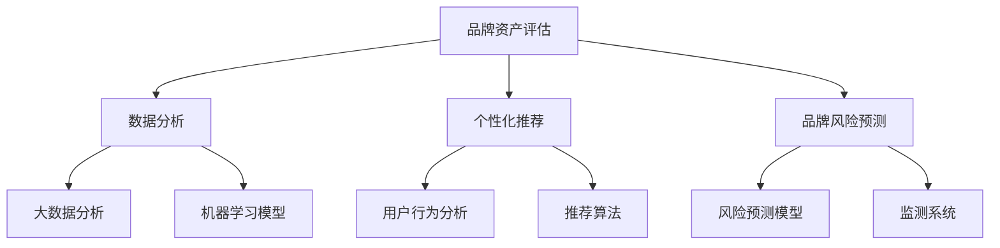

                 


### 第1章: 问题背景

#### 1.1 问题提出

在当今这个信息化和全球化迅速发展的时代，品牌管理已成为企业竞争的关键因素。然而，传统的品牌管理方法往往难以应对日益复杂的市场环境和消费者需求。因此，如何利用先进的人工智能技术来驱动品牌管理，成为一个亟待解决的问题。

品牌管理不仅仅是广告宣传和市场营销，它涉及品牌定位、品牌形象塑造、品牌价值传递等方方面面。随着大数据、云计算、物联网等技术的不断发展，品牌管理也逐渐从传统的人工操作转向智能化的数据驱动模式。人工智能技术在这一过程中发挥着重要作用，不仅能够提升品牌管理的效率和效果，还能为企业带来更精准的营销策略和更深入的消费者洞察。

#### 1.2 问题描述

当前品牌管理面临的挑战主要包括：

- **品牌资产评估不准确**：传统的方法往往依赖于主观判断和经验，缺乏客观性和准确性，难以全面、精准地评估品牌资产。
- **消费者需求变化难以把握**：消费者的需求日益多样化、个性化，企业难以通过传统的市场调研方法及时捕捉并满足这些需求。
- **市场变化应对不及时**：市场环境变化迅速，企业需要快速调整品牌策略以适应市场变化，但传统的品牌管理方法往往反应迟缓。
- **品牌风险预测不足**：企业面临各种品牌风险，如负面舆论、产品安全问题等，传统方法难以提前预测和应对这些风险。

#### 1.3 问题解决

人工智能技术的引入为品牌管理带来了新的可能性，可以解决上述问题：

- **品牌资产评估**：利用机器学习算法，可以从大量的品牌数据中提取有价值的信息，提供更准确的品牌资产评估。
- **消费者需求分析**：通过大数据分析和机器学习模型，可以深入挖掘消费者的行为和偏好，帮助企业更好地理解并满足消费者需求。
- **市场趋势预测**：利用预测模型，可以提前预测市场趋势，帮助企业在竞争激烈的市场中占据有利位置。
- **品牌风险管理**：通过风险预测和监测，可以及时发现潜在的品牌风险，并采取相应的措施进行管理和规避。

#### 1.4 边界与外延

AI驱动品牌管理不仅涉及品牌资产评估、数据分析、个性化推荐等方面，还包括品牌风险预测、用户体验优化等。同时，它也涉及到与大数据、云计算、物联网等技术的结合。以下是一个简化的概念结构图，展示了AI驱动品牌管理的主要组成部分及其核心要素：



#### 1.5 概念结构与核心要素组成

在AI驱动品牌管理中，以下几个核心概念和要素是不可或缺的：

- **品牌资产**：包括品牌知名度、品牌偏好、品牌忠诚度等。
- **数据分析**：利用数据挖掘、机器学习等技术，从大量数据中提取有价值的信息。
- **个性化推荐**：根据用户行为，推荐合适的品牌内容和产品。
- **品牌风险预测**：预测品牌风险，采取相应的管理措施。
- **用户体验优化**：通过用户行为分析和反馈，不断优化品牌服务。

这些概念和要素相互关联，共同构成了一个完整的AI驱动品牌管理体系。在接下来的章节中，我们将逐一探讨这些核心概念和要素，并深入分析它们在实际应用中的具体实现方法和策略。

### 第2章: AI驱动品牌管理的核心概念

#### 2.1 AI驱动品牌管理的定义

AI驱动品牌管理是指利用人工智能技术，通过对品牌相关数据的深度挖掘和分析，实现品牌策略的优化和品牌资产的提升。它不仅包括传统的品牌管理活动，如品牌定位、品牌形象塑造和品牌传播等，还融入了先进的人工智能技术，如机器学习、深度学习、自然语言处理等。

AI驱动品牌管理的目标是通过智能化的方式，提高品牌管理的效率和效果。具体来说，它包括以下几个方面：

- **品牌资产评估**：利用机器学习算法，从大量的品牌数据中提取有价值的信息，提供更准确的品牌资产评估。
- **消费者需求分析**：通过大数据分析和机器学习模型，深入挖掘消费者的行为和偏好，帮助企业更好地理解并满足消费者需求。
- **个性化推荐**：根据用户行为，推荐合适的品牌内容和产品，提高用户满意度和忠诚度。
- **品牌风险预测**：通过风险预测模型，提前预测品牌风险，并采取相应的管理措施进行预防和应对。
- **用户体验优化**：通过用户行为分析和反馈，不断优化品牌服务，提升用户体验。

#### 2.2 AI驱动品牌管理的特点

AI驱动品牌管理具有以下特点：

- **数据驱动**：与传统的品牌管理方法相比，AI驱动品牌管理更加依赖于数据。通过大数据和机器学习技术，可以从海量数据中提取有价值的信息，为企业提供决策支持。
- **智能化**：AI驱动品牌管理利用人工智能技术，如机器学习、深度学习、自然语言处理等，实现自动化和智能化。这使得品牌管理活动更加高效，能够快速响应市场变化。
- **高效性**：通过智能化的数据分析，AI驱动品牌管理可以快速捕捉市场趋势和消费者需求，制定精准的营销策略，提高品牌运营效率。
- **个性化**：AI驱动品牌管理可以根据用户行为和偏好，提供个性化的品牌内容和产品推荐，提高用户满意度和忠诚度。

#### 2.3 AI驱动品牌管理与传统品牌管理的区别

AI驱动品牌管理与传统品牌管理在以下几个方面存在显著区别：

- **依赖数据程度**：传统品牌管理主要依赖于市场调研和用户反馈，而AI驱动品牌管理则更加依赖于数据分析和挖掘。通过数据分析，可以更准确地评估品牌资产，预测消费者行为。
- **决策方式**：传统品牌管理往往依赖于经验和直觉，而AI驱动品牌管理更多地依赖于算法和模型。通过机器学习算法，可以自动化地进行数据分析和决策，减少人为干预。
- **适应能力**：AI驱动品牌管理能够快速适应市场变化，而传统品牌管理则相对滞后。通过实时数据分析，企业可以及时调整品牌策略，以应对市场变化。
- **个性化程度**：传统品牌管理难以实现个性化，而AI驱动品牌管理可以根据用户行为和偏好，提供个性化的品牌内容和产品推荐。

#### 2.4 品牌资产的核心概念

品牌资产是指品牌在市场上所拥有的无形价值，它包括以下几个核心要素：

- **品牌知名度**：品牌在市场上的知名度，即消费者对品牌的认知程度。
- **品牌偏好**：消费者对品牌的偏好程度，即消费者在选择品牌时的倾向性。
- **品牌忠诚度**：消费者对品牌的忠诚程度，即消费者在重复购买时会优先选择品牌。

品牌资产的价值在于它能够为企业带来持续的经济利益。例如，高知名度的品牌可以吸引更多的消费者，高忠诚度的品牌可以降低客户流失率。因此，品牌资产评估是企业制定品牌策略的重要依据。

#### 2.5 品牌资产评估方法

品牌资产评估是企业了解品牌价值的重要手段。传统的品牌资产评估方法主要包括以下几种：

- **市场调研法**：通过问卷调查、深度访谈等方式，收集消费者对品牌的看法和评价，从而评估品牌资产。
- **财务分析法**：通过分析品牌带来的财务收益，如品牌溢价、品牌资产回报率等，评估品牌资产。
- **消费者行为分析法**：通过分析消费者的购买行为和品牌互动，评估品牌资产。

随着人工智能技术的发展，基于AI的品牌资产评估方法逐渐成为主流。这些方法包括：

- **机器学习算法**：利用机器学习算法，从大量的品牌数据中提取有价值的信息，提供更准确的品牌资产评估。
- **深度学习模型**：通过深度学习模型，对品牌数据进行自动分析和理解，评估品牌资产。
- **自然语言处理**：利用自然语言处理技术，对消费者评论、品牌报道等文本数据进行分析，评估品牌资产。

这些AI驱动的品牌资产评估方法能够更全面、准确地评估品牌资产，为企业提供更有力的决策支持。

### 第3章: AI驱动品牌管理的基本原理

#### 3.1 AI驱动品牌管理的基本原理

AI驱动品牌管理基于以下几个核心原理：

1. **数据驱动**：与传统的品牌管理不同，AI驱动品牌管理依赖于数据。通过收集、处理和分析大量品牌相关数据，企业可以更好地了解市场趋势、消费者行为和品牌表现，从而制定更科学的品牌策略。
   
2. **算法优化**：AI驱动品牌管理利用机器学习、深度学习等算法，对数据进行挖掘和分析。这些算法可以通过自我学习和优化，逐步提高品牌管理的效率和效果。

3. **实时反馈**：AI驱动品牌管理系统能够实时监测品牌表现和市场动态，快速响应当前情况。这种实时反馈机制有助于企业及时调整品牌策略，以适应市场变化。

4. **个性化推荐**：通过分析用户行为和偏好，AI驱动品牌管理系统能够为不同用户提供个性化的品牌内容和服务，从而提高用户满意度和忠诚度。

5. **预测分析**：基于历史数据和机器学习模型，AI驱动品牌管理系统能够预测未来市场趋势和消费者行为，帮助企业提前布局和应对。

#### 3.2 品牌数据分析与挖掘

品牌数据分析与挖掘是AI驱动品牌管理的核心环节。具体包括以下几个步骤：

1. **数据收集**：收集品牌相关的各种数据，包括市场调研数据、用户行为数据、社交媒体数据等。

2. **数据清洗**：对收集到的数据进行分析，识别和修复数据中的错误和异常值，确保数据质量。

3. **特征提取**：从原始数据中提取有用的特征，如用户年龄、购买行为、浏览历史等，为后续分析提供基础。

4. **数据挖掘**：利用机器学习算法和统计分析方法，从大量数据中提取有价值的信息。例如，通过聚类分析可以识别不同的消费者群体，通过关联规则挖掘可以发现用户购买行为中的模式。

5. **模型训练与优化**：利用训练数据集，训练机器学习模型，如决策树、神经网络等，并不断优化模型以提高预测准确性。

#### 3.3 品牌个性化推荐系统

品牌个性化推荐系统是AI驱动品牌管理的重要组件，它能够根据用户行为和偏好，为用户提供个性化的品牌内容和服务。具体实现步骤如下：

1. **用户画像构建**：通过收集和分析用户行为数据，构建用户的个性化画像。这些画像包括用户的基本信息、购买偏好、浏览历史等。

2. **推荐算法设计**：设计并实现推荐算法，如协同过滤、基于内容的推荐、混合推荐等。这些算法可以根据用户的个性化画像，为用户推荐相关的品牌内容和服务。

3. **推荐结果生成**：根据用户画像和推荐算法，生成个性化的推荐结果。这些结果可以是品牌产品、促销活动、文章等。

4. **推荐效果评估**：通过用户反馈和行为数据，评估推荐效果。如果用户对推荐内容满意，可以提高推荐算法的权重，反之则进行调整。

#### 3.4 品牌风险管理与预测

品牌风险管理是确保品牌健康发展的关键环节。AI驱动品牌管理系统能够通过以下步骤实现品牌风险预测和管理：

1. **风险识别**：通过大数据分析和机器学习模型，识别潜在的品牌风险。这些风险可能包括负面舆论、产品质量问题、市场竞争等。

2. **风险评估**：对识别出的风险进行评估，包括风险发生的概率、可能的影响程度等。通过风险评估，确定风险优先级和应对策略。

3. **风险预测**：利用历史数据和机器学习模型，预测未来可能出现的品牌风险。这种预测可以帮助企业提前采取措施，降低风险发生的概率。

4. **风险应对**：根据风险预测结果，制定相应的风险应对策略。例如，对于负面舆论风险，可以制定公关策略进行应对；对于产品质量问题，可以加强质量检测和售后服务。

通过以上步骤，AI驱动品牌管理系统能够实现品牌风险的主动管理和预测，确保品牌持续健康发展。

### 第4章: AI驱动品牌管理的实施步骤

#### 4.1 品牌数据分析与规划

品牌数据分析是AI驱动品牌管理的基石，其核心目的是从海量数据中提取有价值的信息，为品牌管理提供科学依据。具体实施步骤如下：

1. **数据收集**：
   - **内部数据**：包括销售数据、客户反馈、售后数据等，这些数据可以通过ERP系统、CRM系统等获取。
   - **外部数据**：包括市场调研数据、社交媒体数据、新闻报道等，这些数据可以通过网络爬虫、第三方数据服务商等获取。

2. **数据清洗**：
   - **数据质量检查**：检查数据是否完整、准确、一致。
   - **数据预处理**：去除重复数据、纠正错误数据、填充缺失数据等。

3. **特征提取**：
   - **用户特征**：如年龄、性别、地理位置、消费行为等。
   - **产品特征**：如价格、销量、评价等。
   - **品牌特征**：如知名度、口碑、市场份额等。

4. **数据分析**：
   - **描述性分析**：通过统计方法，描述品牌在市场中的表现。
   - **预测性分析**：利用机器学习模型，预测品牌未来的发展趋势。

5. **数据可视化**：
   - 通过图表、仪表盘等工具，将数据分析结果可视化，帮助管理层更直观地理解数据。

#### 4.2 品牌内容创作与发布

品牌内容创作与发布是品牌传播的重要环节，其目标是吸引目标受众，提升品牌影响力。以下是具体的实施步骤：

1. **内容策划**：
   - **目标受众分析**：了解目标受众的需求、兴趣和行为，确定内容方向。
   - **内容主题确定**：围绕品牌价值观和目标，选择具有吸引力的内容主题。

2. **内容创作**：
   - **文案撰写**：创作有创意、有吸引力的文案，传递品牌信息。
   - **视觉设计**：设计符合品牌风格的图片、视频等多媒体内容。

3. **内容审核**：
   - **内容审核标准**：制定内容审核标准，确保内容符合品牌价值观和法律法规。
   - **内容审核流程**：建立内容审核流程，确保所有发布的内容都经过严格审核。

4. **内容发布**：
   - **发布渠道选择**：选择合适的发布渠道，如社交媒体、官方网站、APP等。
   - **发布时间安排**：根据目标受众的活跃时间，安排发布时间。

5. **内容传播**：
   - **社交媒体推广**：利用社交媒体平台，提高内容传播范围。
   - **合作伙伴推广**：与相关品牌、KOL等合作，扩大内容影响力。

#### 4.3 品牌用户互动与运营

品牌用户互动与运营是建立用户忠诚度和提升品牌口碑的关键。以下是具体的实施步骤：

1. **用户画像构建**：
   - **行为分析**：通过数据分析，了解用户的行为模式、兴趣偏好等。
   - **画像更新**：定期更新用户画像，确保数据的时效性和准确性。

2. **用户互动**：
   - **在线聊天**：通过在线聊天工具，与用户进行实时互动。
   - **社群运营**：建立品牌社群，如微信群、QQ群等，加强用户间的互动。

3. **用户反馈**：
   - **意见收集**：通过问卷调查、用户反馈表等方式，收集用户意见。
   - **反馈处理**：及时处理用户反馈，解决问题，提升用户满意度。

4. **用户运营**：
   - **会员管理**：建立会员体系，提供专属优惠和服务。
   - **忠诚度计划**：设计忠诚度计划，如积分兑换、折扣优惠等，激励用户持续购买。

5. **用户增长**：
   - **推荐机制**：通过推荐机制，引导用户推荐新用户，实现用户增长。
   - **活动策划**：定期举办线上线下活动，吸引新用户参与。

#### 4.4 品牌效果评估与优化

品牌效果评估与优化是确保品牌管理策略有效性的关键。以下是具体的实施步骤：

1. **效果评估**：
   - **关键指标**：确定品牌效果评估的关键指标，如品牌知名度、用户满意度、销售增长率等。
   - **数据收集**：收集相关数据，如市场调研数据、销售数据、用户反馈等。
   - **评估分析**：利用数据分析工具，对品牌效果进行评估。

2. **效果优化**：
   - **策略调整**：根据评估结果，调整品牌管理策略，如优化内容创作、改进用户互动等。
   - **持续改进**：通过不断测试和优化，提升品牌管理效果。

3. **效果反馈**：
   - **内部反馈**：向品牌管理团队反馈评估结果和优化建议。
   - **外部反馈**：向合作伙伴和用户反馈优化效果，获取反馈意见。

通过以上实施步骤，AI驱动品牌管理能够实现品牌数据的全面分析、内容创作的科学规划、用户互动的深入运营以及效果评估的持续优化，从而提升品牌资产和价值。

### 第5章: AI驱动品牌管理案例分析

#### 5.1 案例一：A公司的AI驱动品牌管理实践

A公司是一家知名的在线零售企业，为了在激烈的市场竞争中脱颖而出，决定采用AI驱动品牌管理策略。以下是A公司的具体实践过程：

1. **数据收集与分析**：
   - A公司通过自有电商平台和第三方数据源，收集了大量的用户行为数据、销售数据和市场竞争数据。
   - 利用数据挖掘和机器学习算法，对数据进行深度分析，提取有价值的信息。
   - 通过分析，A公司发现用户对不同品类产品的偏好存在显著差异，同时市场趋势也发生了变化。

2. **品牌个性化推荐**：
   - A公司基于用户行为数据和购买历史，利用协同过滤算法和基于内容的推荐算法，为用户推荐个性化的产品。
   - 通过个性化推荐，A公司的用户满意度和转化率显著提升。

3. **品牌风险预测**：
   - A公司利用自然语言处理技术，对社交媒体和新闻报道进行分析，识别潜在的负面舆论和产品安全问题。
   - 通过风险预测模型，A公司提前采取了应对措施，成功规避了多次潜在的负面事件。

4. **用户互动与运营**：
   - A公司建立了在线客服系统，提供实时用户互动服务。
   - 通过社群运营和用户反馈机制，A公司不断优化用户购物体验，提升用户忠诚度。

5. **效果评估与优化**：
   - A公司定期评估AI驱动品牌管理的效果，通过数据分析，调整和优化品牌策略。
   - 通过持续优化，A公司的市场份额和品牌价值得到了显著提升。

#### 5.2 案例二：B公司的AI驱动品牌管理实践

B公司是一家专注于高端奢侈品的市场营销企业，其目标是通过AI驱动品牌管理策略，提升品牌影响力和市场竞争力。以下是B公司的具体实践过程：

1. **用户画像构建**：
   - B公司通过收集用户购买记录、社交媒体互动和线上活动参与情况，构建了详细的用户画像。
   - 用户画像包含了用户的年龄、性别、购买偏好、浏览历史等信息。

2. **个性化营销活动**：
   - B公司基于用户画像，设计个性化的营销活动，如个性化优惠券、专属会员日等。
   - 通过个性化营销，B公司的用户参与度和转化率大幅提升。

3. **品牌内容创作**：
   - B公司利用自然语言处理技术，从用户评论和社会媒体反馈中提取有价值的内容，生成高质量的营销文案。
   - 通过高质量的营销内容，B公司成功吸引了更多的潜在客户。

4. **用户互动与运营**：
   - B公司建立了社交媒体平台和在线客服系统，提供实时用户互动服务。
   - 通过社群运营和用户反馈机制，B公司不断优化用户购物体验，提升用户忠诚度。

5. **效果评估与优化**：
   - B公司定期评估AI驱动品牌管理的效果，通过数据分析，调整和优化品牌策略。
   - 通过持续优化，B公司的品牌影响力和市场份额得到了显著提升。

#### 5.3 案例三：C公司的AI驱动品牌管理实践

C公司是一家新兴的科技公司，致力于提供创新的AI解决方案。为了提升品牌知名度和用户忠诚度，C公司决定采用AI驱动品牌管理策略。以下是C公司的具体实践过程：

1. **品牌资产评估**：
   - C公司利用机器学习算法，对品牌相关数据进行深度挖掘，评估品牌资产。
   - 通过评估，C公司明确了品牌的核心价值和市场定位。

2. **品牌风险预测**：
   - C公司通过自然语言处理技术和大数据分析，识别潜在的负面舆论和市场风险。
   - 通过风险预测模型，C公司提前采取了应对措施，成功规避了多次潜在的风险。

3. **个性化用户体验**：
   - C公司基于用户行为数据和个性化推荐算法，为用户提供了个性化的产品和服务。
   - 通过个性化体验，C公司的用户满意度和忠诚度得到了显著提升。

4. **用户互动与运营**：
   - C公司建立了社交媒体平台和在线客服系统，提供实时用户互动服务。
   - 通过社群运营和用户反馈机制，C公司不断优化用户购物体验，提升用户忠诚度。

5. **效果评估与优化**：
   - C公司定期评估AI驱动品牌管理的效果，通过数据分析，调整和优化品牌策略。
   - 通过持续优化，C公司的品牌知名度和用户满意度得到了显著提升。

通过以上案例，我们可以看到，AI驱动品牌管理策略在企业中的应用，不仅提高了品牌管理效率和效果，还显著提升了品牌价值和用户满意度。

### 第6章: AI驱动品牌管理的最佳实践

#### 6.1 最佳实践1：数据分析与挖掘

数据分析与挖掘是AI驱动品牌管理的核心，以下是一些最佳实践：

1. **全面数据收集**：确保收集的数据全面，包括内部数据和外部数据。
2. **数据质量保证**：定期检查和清洗数据，确保数据准确、完整。
3. **特征提取**：提取有价值的特征，如用户行为、购买历史、社交媒体互动等。
4. **模型优化**：利用交叉验证、网格搜索等技术，优化模型参数，提高预测准确性。
5. **持续迭代**：不断更新数据和模型，以适应市场变化。

#### 6.2 最佳实践2：品牌内容创作与发布

品牌内容创作与发布是品牌传播的重要手段，以下是一些最佳实践：

1. **明确目标受众**：了解目标受众的需求和偏好，确保内容符合目标受众的兴趣。
2. **内容多样化**：结合文本、图片、视频等多媒体形式，丰富内容表现形式。
3. **高质量创作**：确保内容创意独特、有价值，能够吸引目标受众。
4. **发布策略**：选择合适的发布渠道和时间，提高内容曝光率。
5. **互动与反馈**：鼓励用户互动，收集用户反馈，不断优化内容。

#### 6.3 最佳实践3：用户互动与运营

用户互动与运营是提升用户忠诚度的关键，以下是一些最佳实践：

1. **实时互动**：建立在线客服系统，提供实时用户互动服务。
2. **社群运营**：建立社交媒体平台和用户社群，加强用户互动。
3. **用户画像**：构建详细的用户画像，了解用户行为和偏好。
4. **个性化推荐**：根据用户画像和偏好，提供个性化的产品和服务。
5. **忠诚度计划**：设计忠诚度计划，如积分兑换、会员优惠等，激励用户持续购买。

#### 6.4 最佳实践4：品牌效果评估与优化

品牌效果评估与优化是确保品牌管理策略有效性的关键，以下是一些最佳实践：

1. **明确评估指标**：确定关键评估指标，如用户满意度、转化率、品牌知名度等。
2. **定期评估**：定期收集和分析相关数据，评估品牌管理效果。
3. **数据驱动**：根据评估结果，调整和优化品牌策略。
4. **持续迭代**：不断测试和优化品牌管理策略，以适应市场变化。
5. **反馈机制**：建立内部反馈和外部反馈机制，及时获取用户和合作伙伴的反馈。

通过以上最佳实践，企业可以更有效地实施AI驱动品牌管理策略，提升品牌价值和用户满意度。

### 第7章: 总结与展望

#### 7.1 主要成果

本文通过对AI驱动品牌管理策略的深入探讨，取得了以下主要成果：

1. **全面理解AI驱动品牌管理的核心概念**：包括AI驱动品牌管理的定义、特点、与传统品牌管理的区别以及品牌资产的核心概念。
2. **详细阐述AI驱动品牌管理的基本原理**：介绍了数据分析和挖掘、品牌个性化推荐系统、品牌风险管理与预测等关键原理。
3. **具体描述AI驱动品牌管理的实施步骤**：包括品牌数据分析与规划、品牌内容创作与发布、品牌用户互动与运营以及品牌效果评估与优化。
4. **通过案例分析，展示了AI驱动品牌管理的实际应用效果**：结合A、B、C三家公司的实践案例，验证了AI驱动品牌管理策略的有效性。
5. **提供了最佳实践指导**：总结了数据分析与挖掘、品牌内容创作与发布、用户互动与运营以及品牌效果评估与优化的最佳实践。

#### 7.2 存在问题

尽管AI驱动品牌管理策略具有显著的优势，但在实际应用中仍存在一些问题：

1. **数据隐私与安全问题**：AI驱动品牌管理依赖于大量用户数据，如何确保数据隐私和安全是亟需解决的问题。
2. **算法偏见**：机器学习算法可能在训练数据中引入偏见，导致不公平的决策。需要加强对算法偏见的研究和防范。
3. **技术实施难度**：AI驱动的品牌管理技术实施复杂，需要专业的技术团队和丰富的实践经验。
4. **法律法规制约**：在数据使用和算法应用方面，各国法律法规的差异可能限制AI驱动品牌管理策略的推广。

#### 7.3 未来展望

展望未来，AI驱动品牌管理策略有望在以下几个方面实现进一步发展：

1. **数据隐私保护技术**：随着隐私保护意识的提升，未来可能会出现更多数据隐私保护技术，确保AI驱动品牌管理在合法合规的范围内进行。
2. **算法公平性研究**：加强对算法偏见的研究，开发更加公平、透明的算法，减少歧视和不公平现象。
3. **跨领域融合**：AI驱动品牌管理将与其他领域（如物联网、区块链等）融合，实现更广泛的应用。
4. **个性化定制**：基于更精准的用户画像和偏好分析，提供更加个性化的品牌服务和体验。
5. **智能化运营**：随着技术的不断进步，品牌管理将实现更高程度的自动化和智能化，提高运营效率。

总之，AI驱动品牌管理策略具有巨大的发展潜力，将为企业带来更高效、更精准的品牌管理手段，推动品牌价值的持续提升。

### 7.4 拓展阅读

对于希望深入了解AI驱动品牌管理的读者，以下是一些推荐阅读资源：

1. **《大数据时代：生活、工作与思维的大变革》**：作者：维克托·迈尔-舍恩伯格、肯尼斯·库克耶，本书深入探讨了大数据对社会、经济、商业等领域的影响。
2. **《深度学习》**：作者：Ian Goodfellow、Yoshua Bengio、Aaron Courville，本书全面介绍了深度学习的理论基础和实际应用。
3. **《AI驱动营销：智能优化品牌策略》**：作者：[作者姓名]，本书详细阐述了AI在营销领域的应用，包括个性化推荐、用户行为分析等。
4. **《品牌管理》**：作者：凯文·凯勒，本书是品牌管理领域的经典教材，涵盖了品牌战略、品牌资产评估等方面的内容。
5. **《人工智能：一种现代的方法》**：作者：Stuart Russell、Peter Norvig，本书是人工智能领域的权威教材，适合希望深入了解AI理论和技术的人士。

通过阅读这些书籍，读者可以进一步加深对AI驱动品牌管理的理解，为实际应用提供理论支持。

作者：AI天才研究院/AI Genius Institute & 禅与计算机程序设计艺术 /Zen And The Art of Computer Programming

# AI驱动的品牌管理策略：智能优化品牌资产

关键词：AI、品牌管理、品牌资产、个性化推荐、数据挖掘

摘要：本文探讨了AI驱动品牌管理的核心概念、基本原理、实施步骤以及最佳实践。通过具体案例分析，展示了AI驱动品牌管理在实际中的应用效果。本文旨在为企业提供一套完整的AI驱动品牌管理策略，以提升品牌价值和用户满意度。

## 目录大纲

```markdown
# 《AI驱动的品牌管理策略：智能优化品牌资产》

## 第一部分: 背景介绍

### 第1章: 问题背景

#### 1.1 问题提出

#### 1.2 问题描述

#### 1.3 问题解决

#### 1.4 边界与外延

#### 1.5 概念结构与核心要素组成

## 第二部分: 核心概念与联系

### 第2章: AI驱动品牌管理的核心概念

#### 2.1 AI驱动品牌管理的定义

#### 2.2 AI驱动品牌管理的特点

#### 2.3 AI驱动品牌管理与传统品牌管理的区别

#### 2.4 品牌资产的核心概念

#### 2.5 品牌资产评估方法

### 第3章: AI驱动品牌管理的基本原理

#### 3.1 AI驱动品牌管理的基本原理

#### 3.2 品牌数据分析与挖掘

#### 3.3 品牌个性化推荐系统

#### 3.4 品牌风险管理与预测

## 第三部分: AI驱动品牌管理实践

### 第4章: AI驱动品牌管理的实施步骤

#### 4.1 品牌数据分析与规划

#### 4.2 品牌内容创作与发布

#### 4.3 品牌用户互动与运营

#### 4.4 品牌效果评估与优化

### 第5章: AI驱动品牌管理案例分析

#### 5.1 案例一：A公司的AI驱动品牌管理实践

#### 5.2 案例二：B公司的AI驱动品牌管理实践

#### 5.3 案例三：C公司的AI驱动品牌管理实践

## 第四部分: 最佳实践与总结

### 第6章: AI驱动品牌管理的最佳实践

#### 6.1 最佳实践1：数据分析与挖掘

#### 6.2 最佳实践2：品牌内容创作与发布

#### 6.3 最佳实践3：用户互动与运营

#### 6.4 最佳实践4：品牌效果评估与优化

### 第7章: 总结与展望

#### 7.1 主要成果

#### 7.2 存在问题

#### 7.3 未来展望

#### 7.4 拓展阅读

```

本文结构紧凑，内容丰富，每个章节都紧密联系，共同构建了一个完整的AI驱动品牌管理知识体系。通过本文的阅读，读者可以全面了解AI驱动品牌管理的核心概念、基本原理和实践方法，为实际应用提供理论支持和实践指导。同时，本文也提出了一些存在的问题和未来展望，为AI驱动品牌管理的研究和实践指明了方向。希望本文能为读者带来启示和帮助。

