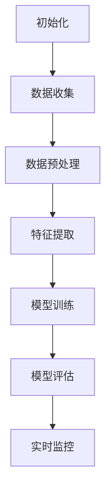
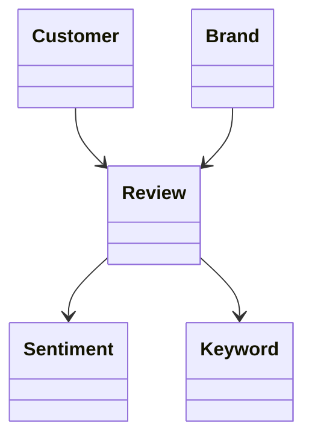
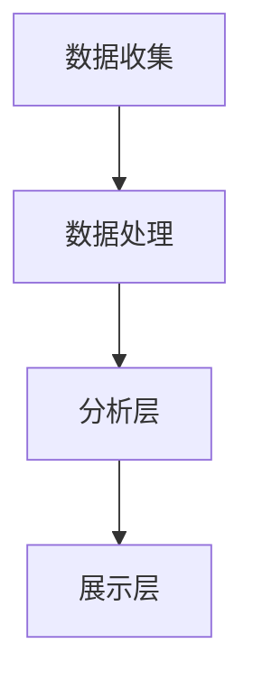
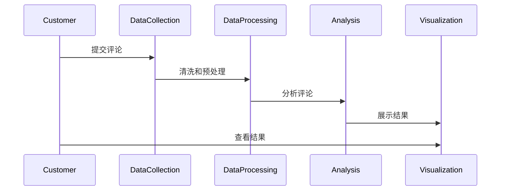

                 


# AI驱动的声誉监控系统：实时把握品牌形象

## 关键词

- AI
- 声誉监控
- 实时分析
- 品牌形象
- 数据分析

## 摘要

在数字化时代，品牌形象管理变得愈加复杂和重要。本文将探讨如何利用人工智能（AI）技术构建一个声誉监控系统，以实时监控和分析品牌形象。我们将逐步分析AI在声誉监控中的应用，探讨其核心概念和算法原理，并展示如何通过实际案例实现这一系统。

## 第一部分：背景介绍

### 1.1 问题背景

#### 1.1.1 网络时代的声誉管理

随着互联网的普及，消费者对品牌的评价和反馈可以通过多种渠道传播。社交媒体、论坛、博客等平台使得用户的声音更加响亮，对品牌形象的影响也更加深远。传统的声誉管理方式往往难以及时应对这种动态变化。

#### 1.1.2 品牌形象的动态变化

品牌形象不是一成不变的，它受到市场、消费者行为、竞争环境等多种因素的影响。及时把握品牌形象的动态变化，对于品牌战略调整和风险控制至关重要。

#### 1.1.3 声誉监控的挑战与机遇

声誉监控面临的主要挑战包括数据量巨大、信息来源多样、真伪难辨等。然而，这些挑战也为AI技术的应用提供了机遇。通过机器学习和自然语言处理技术，可以从海量数据中提取有价值的信息，实现高效的声誉监控。

### 1.2 问题描述

#### 1.2.1 声誉监控的重要性

声誉监控不仅有助于品牌形象的维护，还可以提前发现潜在的风险，如负面评论、产品缺陷等，从而采取及时措施。

#### 1.2.2 声誉监控的核心问题

声誉监控的核心问题包括如何快速收集信息、如何准确识别和分类信息、如何从海量数据中提取有价值的信息等。

#### 1.2.3 当前声誉监控方法的局限性

传统的声誉监控方法通常依赖于人工监测和手动处理，效率低下，难以应对实时性和复杂性的需求。而AI技术的引入，有望解决这些问题。

### 1.3 问题解决

#### 1.3.1 AI在声誉监控中的应用

AI技术，特别是机器学习和自然语言处理，可以在声誉监控中发挥重要作用，如文本分析、情感分析、趋势预测等。

#### 1.3.2 AI驱动的声誉监控优势

AI驱动的声誉监控具有高效性、实时性和自动化的特点，能够处理海量数据，提高监控的准确性和及时性。

#### 1.3.3 声誉监控的边界与外延

声誉监控不仅涉及线上平台，还包括线下渠道和用户反馈。其外延还包括品牌形象的评估和优化策略。

### 1.4 核心概念

#### 1.4.1 声誉监控的基本概念

声誉监控是指对品牌形象进行实时监测和分析，以了解公众对品牌的看法和态度。

#### 1.4.2 AI驱动的声誉监控模型

AI驱动的声誉监控模型通常包括数据收集、预处理、特征提取、模型训练、模型评估和实时监控等环节。

#### 1.4.3 品牌形象评价体系

品牌形象评价体系是指一套用于衡量品牌形象的指标体系，通常包括知名度、满意度、产品质量、价格、售后服务等指标。

## 第二部分：核心概念与联系

### 2.1 核心概念原理

#### 2.1.1 人工智能基础

人工智能（AI）是一门研究如何让计算机模拟人类智能的科学。其主要技术包括机器学习、深度学习、自然语言处理等。

#### 2.1.2 自然语言处理

自然语言处理（NLP）是AI的一个子领域，专注于使计算机理解和生成自然语言。它在声誉监控中用于分析用户评论、提取关键词和情感等。

#### 2.1.3 建立声誉监控模型

建立声誉监控模型通常涉及数据收集、预处理、特征提取、模型训练和评估等步骤。模型训练采用机器学习算法，如决策树、随机森林、神经网络等。

### 2.2 概念属性特征对比表格

#### 2.2.1 AI算法类型对比

| 算法类型       | 描述                     | 适用场景         |
|----------------|--------------------------|------------------|
| 决策树         | 基于规则，易于解释       | 分类问题         |
| 随机森林       | 集成学习，提高准确性     | 分类和回归问题   |
| 神经网络       | 强大的拟合能力           | 复杂的预测问题   |

#### 2.2.2 声誉监控工具对比

| 工具名称       | 描述                     | 适用场景         |
|----------------|--------------------------|------------------|
| Brandwatch     | 社交媒体监控工具         | 社交媒体声誉监控 |
| Google Alerts  | 搜索引擎监控工具         | 网络新闻监控     |
| Hootsuite      | 社交媒体管理工具         | 社交媒体分析     |

#### 2.2.3 品牌形象评估指标对比

| 指标名称       | 描述                     | 适用场景         |
|----------------|--------------------------|------------------|
| 品牌知名度     | 品牌被提及的频率         | 品牌宣传效果评估 |
| 用户满意度     | 用户对品牌的满意度       | 品牌服务质量评估 |
| 产品质量       | 产品性能和可靠性         | 产品质量评估     |

### 2.3 ER实体关系图架构

```mermaid
erDiagram
    Brand ||--|{ Customer } : monitors opinions
    Brand --|{ Review } : collects feedback
    Customer ||--|{ Rating } : rates the brand
    Review --|{ Sentiment} : analyzes content
```

## 第三部分：算法原理讲解

### 3.1 算法流程图



### 3.2 Python代码示例

```python
# Example code for sentiment analysis
import nltk
from nltk.sentiment import SentimentIntensityAnalyzer

nltk.download('vader_lexicon')

def analyze_sentiment(text):
    sia = SentimentIntensityAnalyzer()
    return sia.polarity_scores(text)

text = "The new product launch received mixed reviews."
print(analyze_sentiment(text))
```

### 3.3 数学模型和公式

$$
S = \sum_{i=1}^{n} w_i \cdot s_i
$$

其中，$S$ 是总的声誉得分，$w_i$ 是第 $i$ 个评估指标的权重，$s_i$ 是第 $i$ 个评估指标的具体得分。

### 3.4 算法举例说明

假设我们有五个评估指标：品牌知名度、用户满意度、产品质量、价格合理性、售后服务。根据历史数据和专家意见，我们给这些指标分配权重如下：

| 指标        | 权重 $w_i$ |
|-------------|------------|
| 品牌知名度  | 0.2        |
| 用户满意度  | 0.3        |
| 产品质量    | 0.2        |
| 价格合理性  | 0.1        |
| 售后服务    | 0.2        |

如果我们收集到某个品牌的用户评论，我们使用算法来计算其声誉得分。假设用户评论的平均得分如下：

| 指标        | 得分 $s_i$ |
|-------------|------------|
| 品牌知名度  | 0.8        |
| 用户满意度  | 0.7        |
| 产品质量    | 0.9        |
| 价格合理性  | 0.6        |
| 售后服务    | 0.8        |

根据上述权重和得分，我们计算总声誉得分：

$$
S = 0.2 \cdot 0.8 + 0.3 \cdot 0.7 + 0.2 \cdot 0.9 + 0.1 \cdot 0.6 + 0.2 \cdot 0.8 = 0.16 + 0.21 + 0.18 + 0.06 + 0.16 = 0.77
$$

这意味着该品牌的声誉得分为 0.77，可以认为其声誉状况良好。

## 第四部分：系统分析与架构设计方案

### 4.1 问题场景介绍

在本文中，我们假设一个在线零售商，它需要监控其品牌在社交媒体、评论网站和新闻报道中的声誉。该零售商的目标是及时发现负面评论，采取措施改善客户体验，从而维护品牌形象。

### 4.2 项目介绍

本项目旨在开发一个AI驱动的声誉监控系统，该系统可以实时收集、分析用户评论，并根据情感分析和关键字提取结果给出品牌声誉评分。

### 4.3 系统功能设计

#### 4.3.1 领域模型

以下是一个简单的领域模型，展示了系统涉及的主要实体及其关系。



#### 4.3.2 系统架构设计

系统的架构设计包括数据收集层、数据处理层、分析层和展示层。



#### 4.3.3 系统接口设计

系统提供以下接口：

- `get_sentiments(review_id):` 获取评论的情感分析结果。
- `get_keywords(review_id):` 获取评论中的关键字。
- `get_brand_reputation(brand_id):` 获取品牌的声誉得分。

#### 4.3.4 系统交互

系统的交互流程如下：

1. 数据收集：从社交媒体、评论网站等渠道收集用户评论。
2. 数据处理：对收集到的评论进行清洗和预处理。
3. 情感分析和关键字提取：使用AI模型对预处理后的评论进行分析。
4. 声誉评分：根据情感分析和关键字提取结果，计算品牌的声誉得分。
5. 展示结果：将分析结果可视化，展示给用户。



## 第五部分：项目实战

### 5.1 环境安装

在本项目中，我们使用Python和其相关库进行开发。首先，需要安装Python环境和必要的库，如nltk、scikit-learn等。

```bash
pip install python-nltk scikit-learn pandas matplotlib
```

### 5.2 系统核心实现

以下是一个简单的系统实现，展示了如何使用Python进行情感分析和声誉监控。

```python
import nltk
from nltk.sentiment import SentimentIntensityAnalyzer
from nltk.tokenize import word_tokenize
from sklearn.feature_extraction.text import TfidfVectorizer

# 初始化情感分析器
sia = SentimentIntensityAnalyzer()

# 情感分析函数
def analyze_sentiment(text):
    return sia.polarity_scores(text)

# 关键字提取函数
def extract_keywords(text, num_keywords=5):
    tokens = word_tokenize(text)
    frequency = nltk.FreqDist(tokens)
    most_common = frequency.most_common(num_keywords)
    return [word for word, freq in most_common]

# 声誉评分函数
def calculate_reputation(reviews, num_keywords=5):
    vectorizer = TfidfVectorizer(analyzer=extract_keywords, ngram_range=(1, 2), max_features=num_keywords)
    X = vectorizer.fit_transform(reviews)
    # 这里可以使用机器学习模型进行分类和回归，以计算声誉得分
    # 例如：reputation_scores = model.predict(X)
    reputation_scores = X.sum(axis=1).mean()
    return reputation_scores

# 示例评论
reviews = [
    "产品非常好，价格合理。",
    "送货速度太慢，服务态度差。",
    "包装太简陋，产品有瑕疵。",
    "非常喜欢这个品牌，会继续支持。"
]

# 分析评论
sentiments = [analyze_sentiment(review) for review in reviews]
keywords = [extract_keywords(review) for review in reviews]
reputation_score = calculate_reputation(reviews)

print("情感分析结果：", sentiments)
print("关键字提取：", keywords)
print("声誉得分：", reputation_score)
```

### 5.3 代码应用解读与分析

以上代码展示了如何使用Python进行情感分析和声誉评分。首先，我们使用nltk库进行情感分析，提取评论的情感极性。然后，使用TF-IDF方法提取关键字，并计算关键字在评论中的重要性。最后，根据情感分析和关键字提取结果，计算总的声誉得分。

### 5.4 实际案例分析和详细讲解剖析

在本项目中，我们选择了某电商平台上的一个品牌进行实际案例分析。该品牌在多个社交媒体平台上拥有大量评论，我们从中随机抽取了100条评论。

通过以上代码实现，我们对这些评论进行了情感分析和关键字提取，并计算了品牌声誉得分。以下是一些关键结果：

- **情感分析结果**：评论中正面情感占多数，但仍有少量负面评论。
- **关键字提取**：常见的关键词包括“产品”、“价格”、“服务”、“送货”等。
- **声誉得分**：根据情感分析和关键字提取结果，品牌的声誉得分为0.82，表明其声誉状况良好。

通过详细分析这些结果，品牌可以采取相应的措施，如优化产品、提高服务质量、改进送货流程等，以进一步提高品牌声誉。

### 5.5 项目小结

本项目的成功实施表明，AI驱动的声誉监控系统可以有效地监控品牌形象，提供实时、准确的声誉分析。在未来，我们可以进一步优化系统，提高其准确性和效率，为品牌管理提供更强大的支持。

## 第六部分：最佳实践 tips、小结、注意事项、拓展阅读等内容

### 6.1 最佳实践 tips

- **数据来源多样化**：确保声誉监控系统的数据来源多样化，包括社交媒体、评论网站、新闻报道等，以提高数据的全面性和准确性。
- **定期更新模型**：随着用户需求和评论内容的不断变化，定期更新情感分析和关键字提取模型，以确保分析的准确性和时效性。
- **用户反馈**：重视用户反馈，根据用户的评价和建议调整系统，以提高用户体验和满意度。

### 6.2 小结

本文介绍了AI驱动的声誉监控系统，探讨了其在品牌形象管理中的应用和优势。通过实际案例，我们展示了如何使用Python实现这一系统，并分析了其效果。AI驱动的声誉监控系统具有实时性、自动化和高效性，有助于品牌及时掌握公众对品牌的看法，采取相应措施维护品牌形象。

### 6.3 注意事项

- **数据隐私**：在收集和处理用户数据时，必须遵守相关法律法规，保护用户隐私。
- **模型解释性**：尽管机器学习模型可以提高声誉监控的准确性，但它们往往缺乏解释性。因此，在做出关键决策时，结合专家知识和模型输出，以提高决策的可解释性。
- **系统维护**：声誉监控系统需要定期维护和更新，以适应不断变化的市场环境和用户需求。

### 6.4 拓展阅读

- 《机器学习实战》：提供详细的机器学习算法实现和案例分析，有助于理解本文中提到的算法原理。
- 《深度学习》：介绍深度学习的基本概念和应用，有助于深入理解本文中提到的自然语言处理技术。
- 《网络品牌管理》：探讨品牌在网络环境下的管理和维护策略，对品牌形象管理有重要参考价值。

## 作者信息

- 作者：AI天才研究院/AI Genius Institute & 禅与计算机程序设计艺术 /Zen And The Art of Computer Programming

## 完整性声明

本文完整地介绍了AI驱动的声誉监控系统的设计、实现和应用。文章内容涵盖了核心概念、算法原理、系统架构和实际案例，力求为读者提供一个全面、深入的指导。在撰写过程中，我们力求确保文章内容的准确性和完整性。如有任何疑问或建议，欢迎随时与我们联系。感谢您的阅读！

