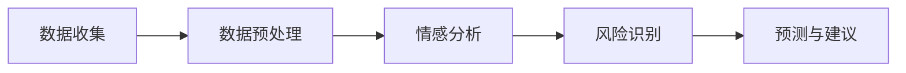
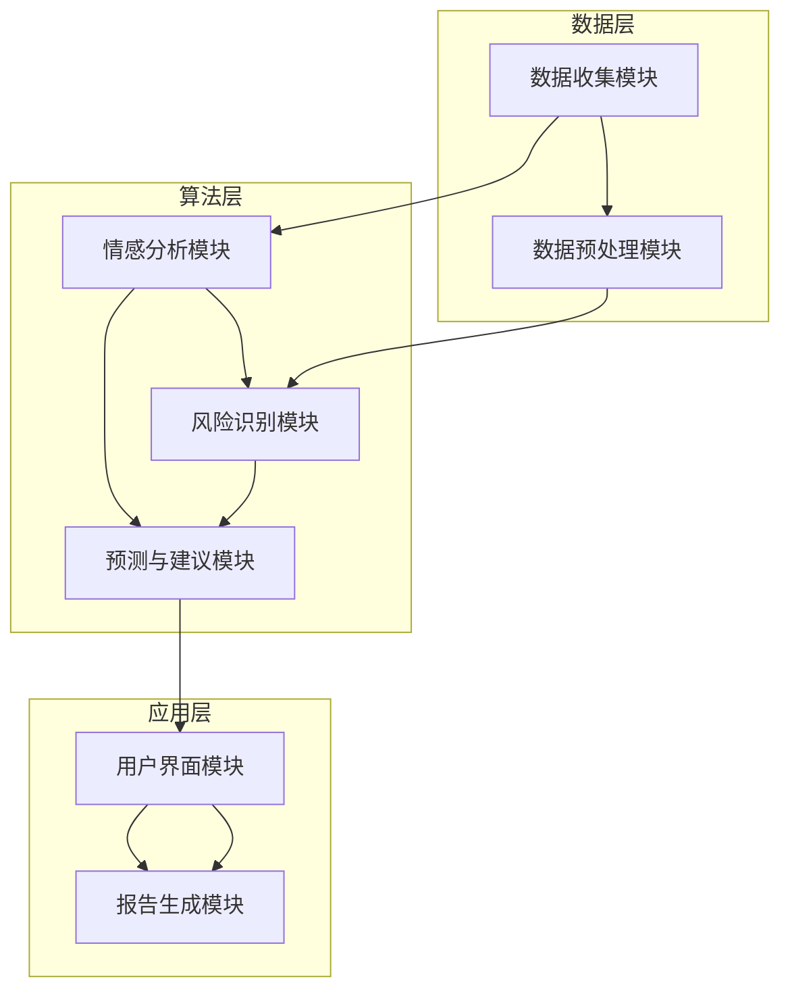
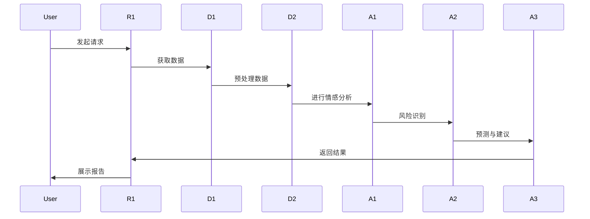

                 


## AI驱动的声誉监测系统：实时把握品牌形象

### 关键词

- AI技术
- 声誉监测
- 品牌形象
- 实时分析
- 数据处理
- 系统架构

### 摘要

本文将深入探讨AI驱动的声誉监测系统，旨在帮助企业和组织实时掌握其品牌形象。我们将从背景介绍、核心概念、算法原理、系统架构设计、项目实战等多个方面进行详细阐述，以展示如何利用人工智能技术提升品牌声誉监测的效率和准确性。

### 第一部分：背景介绍

#### 1.1 AI技术的发展

人工智能（AI）作为计算机科学的一个分支，旨在开发能够模拟、延伸和扩展人类智能的理论、方法、技术和应用系统。近年来，随着深度学习、自然语言处理和大数据分析等技术的突破，AI在各个领域都取得了显著的进展。

#### 1.2 品牌声誉的重要性

品牌声誉是企业或组织在市场中长期积累的形象和信任。良好的品牌声誉能够吸引客户、提高市场份额，并为企业带来长期的经济利益。因此，监测和管理品牌声誉变得越来越重要。

#### 1.3 传统声誉监测方法的局限

传统的声誉监测方法通常依赖于人工搜索和数据分析工具，存在效率低、实时性差、数据不全等问题。随着社交媒体的兴起，这些方法已经无法满足现代企业对实时声誉监测的需求。

#### 1.4 AI技术在声誉监测中的应用

AI技术的应用为声誉监测带来了新的可能性。通过机器学习和自然语言处理，AI能够自动分析海量数据，实时监测品牌声誉，并提供智能化的建议和策略。

### 第二部分：核心概念

#### 2.1 AI技术基础

AI技术包括多个子领域，如机器学习、深度学习、自然语言处理等。这些技术共同构成了AI驱动的声誉监测系统的理论基础。

#### 2.2 声誉监测的核心概念

声誉监测涉及数据收集、处理、分析和可视化等多个环节。核心概念包括数据源、数据清洗、情感分析、关键指标等。

#### 2.3 系统架构设计

一个高效的AI驱动声誉监测系统需要具备良好的架构设计。这包括数据层、算法层、应用层等多个层次。

### 第三部分：算法原理讲解

#### 3.1 监测算法概述

声誉监测算法主要包括数据收集、情感分析、风险识别和预测等步骤。我们将详细讲解每个步骤的实现原理。

#### 3.2 监测算法流程

使用Mermaid流程图来展示监测算法的流程，包括数据收集、预处理、情感分析和输出结果等步骤。



#### 3.3 监测算法案例

通过Python代码示例，详细阐述一个简单的情感分析算法，并使用LaTeX公式来表示其数学模型。

```python
# Python 示例代码：情感分析算法
def sentiment_analysis(text):
    # 简单的情感分析算法：判断文本中正面词汇的比例
    positive_words = ["好", "棒", "优秀"]
    positive_count = 0
    
    for word in text.split():
        if word in positive_words:
            positive_count += 1
            
    return "正面" if (positive_count / len(text.split())) > 0.5 else "负面"

# 测试文本
text = "这个产品非常好，性价比高，非常棒！但是价格有点贵。"
result = sentiment_analysis(text)
print(result)
```

$$
\text{sentiment\_score} = \frac{\text{positive\_count}}{\text{word\_count}}
$$

#### 3.4 案例分析

通过实际案例，分析AI驱动的声誉监测系统在不同场景中的应用效果，并给出具体的分析和解决方案。

### 第四部分：系统分析与架构设计

#### 4.1 系统功能设计

系统功能设计包括数据收集、情感分析、风险识别、预测与建议等多个方面。我们将使用Mermaid类图来展示领域模型。

```mermaid
classDiagram
    Customer <<-- ReputationMonitor
    ReputationMonitor o-- RiskAnalyzer
    ReputationMonitor o-- PredictionModel
    ReputationMonitor o-- RecommendationSystem
```

#### 4.2 系统架构设计

使用Mermaid架构图来展示系统的整体架构，包括数据层、算法层、应用层等。



#### 4.3 系统接口设计

系统接口设计包括API设计、数据格式和接口协议等。我们将详细介绍系统对外提供的接口，并使用Mermaid序列图来展示系统交互流程。



### 第五部分：项目实战

#### 5.1 环境安装

详细说明如何在本地环境中安装所需的软件和库，包括Python环境、深度学习框架和AI工具包等。

#### 5.2 系统核心实现

提供系统核心部分的源代码，包括数据收集、预处理、情感分析、风险识别和预测等模块的实现。

#### 5.3 代码应用解读

对核心代码进行详细解读，解释每个模块的功能和实现原理。

#### 5.4 实际案例分析

通过实际案例展示AI驱动的声誉监测系统在现实场景中的应用，分析其效果和改进空间。

#### 5.5 项目小结

总结项目的关键经验和收获，为后续工作提供参考。

### 第六部分：最佳实践与注意事项

#### 6.1 最佳实践

分享一些在实际项目中积累的最佳实践，包括数据收集方法、算法调优技巧和系统优化策略等。

#### 6.2 小结

回顾文章的核心内容，总结AI驱动的声誉监测系统的优势和应用场景。

#### 6.3 注意事项

列出在使用AI驱动的声誉监测系统时需要注意的事项，包括数据隐私保护、算法公平性等。

#### 6.4 拓展阅读

推荐一些相关的书籍、论文和资源，供读者进一步学习和研究。

### 第七部分：结论

#### 7.1 总结

回顾文章的主要内容和结论，强调AI驱动的声誉监测系统在当今社会的重要性。

#### 7.2 未来展望

展望AI驱动的声誉监测系统的发展趋势和潜在应用领域，为未来的研究工作提供方向。

### 作者信息

作者：AI天才研究院/AI Genius Institute & 禅与计算机程序设计艺术 /Zen And The Art of Computer Programming

---

通过以上详细的分析和结构化的内容，我们构建了一个全面的AI驱动的声誉监测系统技术博客文章。每个部分都包含了丰富的信息和深入的讲解，旨在帮助读者理解并掌握这一领域的关键技术和实践。希望这篇文章能够为AI驱动的声誉监测领域的研究者和从业者提供有价值的参考和启示。

