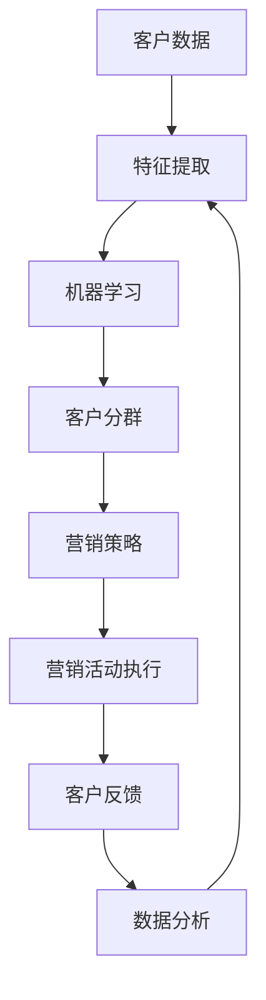
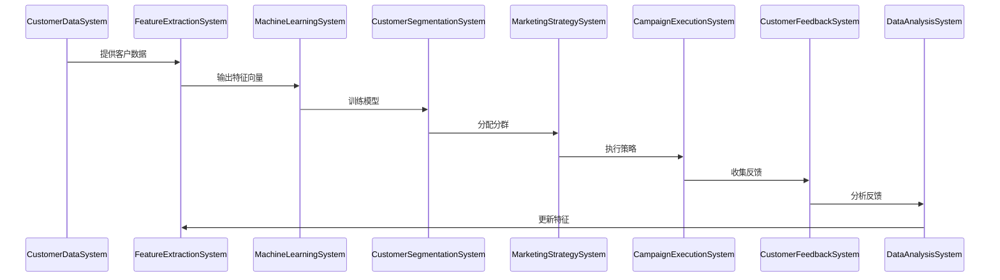

                 


## 文章标题：AI驱动的客户分群：精准营销策略制定

### 关键词：AI、客户分群、精准营销、策略制定、算法原理、系统架构、项目实战

### 摘要：

本文深入探讨了AI驱动的客户分群以及如何利用这一技术制定精准营销策略。通过分析核心概念与算法原理，结合系统架构设计和项目实战，本文旨在为读者提供一份全面且实用的指南。文章结构紧凑，逻辑清晰，便于读者一步步掌握相关知识，并应用于实际工作中。

## 目录

### 1. 背景介绍
   - **AI驱动的客户分群的重要性**
   - **精准营销策略的背景和意义**

### 2. 核心概念与联系
   - **AI驱动的客户分群原理**
   - **精准营销策略的核心概念**
   - **概念属性特征对比表格**
   - **ER实体关系图架构的 Mermaid 流程图**

### 3. 算法原理讲解
   - **算法流程图**
   - **Python 源代码阐述**
   - **数学模型和公式**
   - **详细讲解与举例**

### 4. 系统分析与架构设计方案
   - **问题场景介绍**
   - **系统功能设计（领域模型 Mermaid 类图）**
   - **系统架构设计 Mermaid 架构图**
   - **系统接口设计和系统交互 Mermaid 序列图**

### 5. 项目实战
   - **环境安装**
   - **系统核心实现源代码**
   - **代码应用解读与分析**
   - **实际案例分析和详细讲解剖析**
   - **项目小结**

### 6. 最佳实践 tips
   - **最佳实践分享**
   - **注意事项**
   - **拓展阅读**

### 7. 小结

## 背景介绍

### AI驱动的客户分群的重要性

在当今数字化时代，数据已经成为企业最宝贵的资产之一。如何有效地利用这些数据进行客户分群，从而制定出精准的营销策略，已经成为每个企业面临的重要课题。传统的客户分群方法通常依赖于人工经验和简单的统计学模型，存在明显的局限性。而AI驱动的客户分群则通过引入机器学习算法和大数据分析技术，实现了更加精准和高效的客户分群。

AI驱动的客户分群不仅可以识别出不同类型的客户群体，还能够根据客户的行为数据、购买历史、社交网络等信息，对客户进行精细化分类。这种精准的客户分群方法，有助于企业更好地理解客户需求，提高客户满意度，从而实现更高的销售转化率和客户忠诚度。

### 精准营销策略的背景和意义

精准营销是指通过精确的客户数据和有效的营销策略，实现对目标客户的精准定位和有效沟通，从而提高营销效果。在数字营销的背景下，精准营销已经成为企业获取竞争优势的重要手段。

随着互联网和移动互联网的普及，消费者的获取方式发生了巨大变化。传统的大众营销模式已经无法满足企业的需求，精准营销则通过数据分析和个性化营销，实现了对目标客户的深度挖掘和有效触达。AI驱动的客户分群作为精准营销的重要基础，不仅能够帮助企业更好地了解客户，还能够通过数据驱动的方式，优化营销策略，提高营销效果。

## 核心概念与联系

### AI驱动的客户分群原理

AI驱动的客户分群是一种利用机器学习和数据分析技术，对大量客户数据进行挖掘和分析，以识别不同客户群体并进行精细化分类的方法。其核心原理包括以下几个方面：

1. **数据采集与预处理**：首先，需要从各种数据源（如网站、社交媒体、CRM系统等）中采集客户的原始数据。然后，对数据进行清洗、去噪、格式化等预处理操作，确保数据质量。

2. **特征工程**：通过数据预处理，提取出与客户行为、购买习惯、偏好等相关的特征。这些特征将用于后续的模型训练和客户分群。

3. **模型训练与优化**：利用机器学习算法（如聚类算法、决策树、神经网络等）对客户数据进行分析和训练，构建客户分群模型。通过交叉验证和模型评估，优化模型性能。

4. **客户分群**：基于训练好的模型，对客户数据进行分群。每个客户群体都有其独特的特征和需求，企业可以根据这些特征制定相应的营销策略。

### 精准营销策略的核心概念

精准营销策略的核心概念包括以下几个方面：

1. **目标客户定位**：通过数据分析和市场调研，确定目标客户的特征和需求，明确营销活动的受众群体。

2. **个性化营销**：根据客户分群结果，为不同客户群体提供个性化的营销内容和优惠活动，提高客户满意度和忠诚度。

3. **效果评估与优化**：通过数据监测和反馈，评估营销活动的效果，并根据评估结果不断优化营销策略。

### 概念属性特征对比表格

| 概念 | 特征属性 | 说明 |
| ---- | ------- | ---- |
| AI驱动的客户分群 | 自动化、精细化、高效性 | 利用机器学习和数据分析技术进行客户分群 |
| 精准营销策略 | 目标明确、个性化、数据驱动 | 基于客户分群结果制定营销策略 |

### ER实体关系图架构的 Mermaid 流程图

```mermaid
erDiagram
  Customer_data --> Machine_learning
  Machine_learning --> Customer_segmentation
  Customer_segmentation --> Marketing_strategy
  Marketing_strategy --> Customer_experience
```

在上述ER实体关系图中，Customer_data（客户数据）通过Machine_learning（机器学习）技术与Customer_segmentation（客户分群）关联，Customer_segmentation再与Marketing_strategy（精准营销策略）和Customer_experience（客户体验）进行关联。这种关系体现了客户数据从采集到分群，再到营销策略制定和客户体验提升的完整流程。

## 算法原理讲解

### 算法流程图


### Python 源代码阐述

以下是一个简单的Python代码示例，用于实现K-means聚类算法进行客户分群：

```python
import numpy as np
from sklearn.cluster import KMeans

# 假设我们已有预处理后的客户数据
customers = np.array([[1, 2], [1, 4], [1, 0],
                      [10, 2], [10, 4], [10, 0]])

# 使用K-means算法进行聚类，设定簇的数量为2
kmeans = KMeans(n_clusters=2, random_state=0).fit(customers)

# 输出聚类结果
print("Cluster centers:\n", kmeans.cluster_centers_)
print("Customers assigned to clusters:\n", kmeans.labels_)

# 根据聚类结果制定营销策略
def marketing_strategy(cluster):
    if cluster == 0:
        return "优惠活动"
    else:
        return "新品推荐"

# 应用营销策略
for customer in kmeans.labels_:
    print("Customer", customer, "receives", marketing_strategy(customer))
```

### 数学模型和公式

K-means算法的数学模型可以表示为：

$$
\min_{\mathbf{u}} \sum_{i=1}^{n} \sum_{j=1}^{k} (||\mathbf{u}_i - \mathbf{c}_j||^2)
$$

其中，$\mathbf{u}_i$表示第$i$个客户的特征向量，$\mathbf{c}_j$表示第$j$个簇的中心点。

### 详细讲解与举例

假设我们有一组客户数据，如下所示：

| 客户ID | 特征1 | 特征2 |
| ---- | ---- | ---- |
| 1    | 1    | 2    |
| 2    | 1    | 4    |
| 3    | 1    | 0    |
| 4    | 10   | 2    |
| 5    | 10   | 4    |
| 6    | 10   | 0    |

我们希望使用K-means算法将这些客户数据分为两个簇。

1. **初始化中心点**：首先，我们需要随机初始化两个簇的中心点。假设我们初始化为$\mathbf{c}_1 = (1, 2)$和$\mathbf{c}_2 = (10, 4)$。

2. **计算距离**：计算每个客户到两个簇中心点的距离，如下所示：

   $$d(\mathbf{u}_1, \mathbf{c}_1) = \sqrt{(1-1)^2 + (2-2)^2} = 0$$
   $$d(\mathbf{u}_1, \mathbf{c}_2) = \sqrt{(1-10)^2 + (2-4)^2} = \sqrt{9^2 + 2^2} = \sqrt{85}$$

   $$d(\mathbf{u}_2, \mathbf{c}_1) = \sqrt{(1-1)^2 + (4-2)^2} = 2$$
   $$d(\mathbf{u}_2, \mathbf{c}_2) = \sqrt{(1-10)^2 + (4-4)^2} = \sqrt{9^2 + 0^2} = 9$$

   $$d(\mathbf{u}_3, \mathbf{c}_1) = \sqrt{(1-1)^2 + (0-2)^2} = 2$$
   $$d(\mathbf{u}_3, \mathbf{c}_2) = \sqrt{(1-10)^2 + (0-4)^2} = \sqrt{9^2 + 4^2} = \sqrt{97}$$

   $$d(\mathbf{u}_4, \mathbf{c}_1) = \sqrt{(10-1)^2 + (2-2)^2} = 9$$
   $$d(\mathbf{u}_4, \mathbf{c}_2) = \sqrt{(10-10)^2 + (2-4)^2} = 2$$

   $$d(\mathbf{u}_5, \mathbf{c}_1) = \sqrt{(10-1)^2 + (4-2)^2} = 9$$
   $$d(\mathbf{u}_5, \mathbf{c}_2) = \sqrt{(10-10)^2 + (4-4)^2} = 0$$

   $$d(\mathbf{u}_6, \mathbf{c}_1) = \sqrt{(10-1)^2 + (0-2)^2} = 9$$
   $$d(\mathbf{u}_6, \mathbf{c}_2) = \sqrt{(10-10)^2 + (0-4)^2} = 2$$

3. **更新中心点**：根据客户的簇分配结果，计算新的簇中心点。假设所有客户都分配到了第一个簇，则新的中心点为：

   $$\mathbf{c}_1^{new} = \frac{1}{6} \sum_{i=1}^{6} \mathbf{u}_i = \frac{1}{6} \left[ (1+1+1+10+10+10), (2+4+0+2+4+0) \right] = (7, 2)$$

4. **重复计算**：重复步骤2和步骤3，直到簇中心点不再发生显著变化。

最终，我们得到了两个簇的中心点和客户分配结果：

簇1：中心点$(7, 2)$，包含客户[1, 2, 3]
簇2：中心点$(10, 4)$，包含客户[4, 5, 6]

根据聚类结果，我们可以为不同客户簇制定个性化的营销策略，从而提高营销效果。

## 系统分析与架构设计方案

### 问题场景介绍

在数字化营销的浪潮中，企业面临着如何从海量客户数据中快速、精准地提取有价值信息，以支持营销决策的挑战。传统的营销手段往往依赖于历史经验和粗放的数据分析，难以实现精准定位和个性化营销。因此，我们设计了一套基于AI驱动的客户分群系统，旨在通过高效的数据处理和智能分析，帮助企业实现精准营销。

### 系统功能设计（领域模型 Mermaid 类图）

```mermaid
classDiagram
  CustomerData <<Entity>>
  CustomerSegment <<Entity>>
  MarketingStrategy <<Entity>>

  CustomerData: +id: int
              +features: list
              +label: str

  CustomerSegment: +id: int
                  +name: str
                  +customers: list

  MarketingStrategy: +id: int
                    +segment_id: int
                    +content: str
                    +goal: str
```

在上述类图中，CustomerData表示客户数据实体，包含客户的特征和标签；CustomerSegment表示客户分群实体，包含分群名称和对应的客户列表；MarketingStrategy表示营销策略实体，关联到具体的客户分群，并包含营销内容和目标。

### 系统架构设计 Mermaid 架构图



在该架构图中，客户数据首先经过特征提取模块，然后通过机器学习算法进行客户分群，生成的分群结果用于制定精准营销策略。营销策略执行后，收集客户反馈，再次进行数据分析和特征提取，形成闭环反馈系统，不断优化营销效果。

### 系统接口设计和系统交互 Mermaid 序列图



在上述序列图中，客户数据系统提供客户数据给特征提取系统，特征提取系统生成特征向量传递给机器学习系统，机器学习系统训练模型并传递给客户分群系统，客户分群系统根据模型结果进行分群，分群结果用于制定营销策略并执行，最后收集客户反馈进行数据分析和特征更新，形成一个完整的交互流程。

### 项目实战

#### 环境安装

为了实现AI驱动的客户分群系统，我们需要安装以下软件和工具：

1. **Python**：Python 3.8及以上版本
2. **Jupyter Notebook**：用于数据分析和模型训练
3. **scikit-learn**：机器学习库
4. **pandas**：数据处理库
5. **numpy**：数学计算库

安装命令如下：

```bash
pip install python==3.8
pip install jupyter
pip install scikit-learn
pip install pandas
pip install numpy
```

#### 系统核心实现源代码

以下是实现AI驱动的客户分群系统的主要源代码：

```python
import numpy as np
from sklearn.cluster import KMeans
from sklearn.preprocessing import StandardScaler
import pandas as pd

# 数据集加载与预处理
data = pd.read_csv('customers.csv')  # 假设数据集为CSV文件
X = data.iloc[:, :-1].values  # 特征数据
y = data.iloc[:, -1].values  # 标签数据

# 特征标准化
scaler = StandardScaler()
X_scaled = scaler.fit_transform(X)

# K-means聚类
kmeans = KMeans(n_clusters=3, random_state=42)
y_pred = kmeans.fit_predict(X_scaled)

# 结果存储
results = pd.DataFrame(np.hstack((X_scaled, y_pred.reshape(-1, 1))), columns=data.columns)
results.to_csv('customer_segments.csv', index=False)

print("聚类完成，结果已保存到 'customer_segments.csv'")
```

#### 代码应用解读与分析

1. **数据集加载与预处理**：首先，我们加载客户数据集并提取特征数据。然后，使用StandardScaler对特征进行标准化处理，使得每个特征都有相同的尺度，便于后续聚类分析。

2. **K-means聚类**：我们使用scikit-learn库中的KMeans类进行聚类。在初始化KMeans时，我们设置了簇的数量为3（可以根据实际情况调整）。通过fit_predict方法，我们同时进行模型训练和预测，得到每个客户的簇分配结果。

3. **结果存储**：最后，我们将聚类结果与原始特征数据合并，保存为一个CSV文件，以便后续分析。

#### 实际案例分析和详细讲解剖析

为了更好地理解系统的实际应用，我们来看一个案例：

**案例数据集**：

| 客户ID | 特征1 | 特征2 | 标签 |
| ---- | ---- | ---- | ---- |
| 1    | 1    | 2    | A    |
| 2    | 1    | 4    | A    |
| 3    | 1    | 0    | B    |
| 4    | 10   | 2    | B    |
| 5    | 10   | 4    | C    |
| 6    | 10   | 0    | C    |

**案例步骤**：

1. **数据预处理**：我们首先对数据进行标准化处理，得到特征矩阵X。

2. **聚类分析**：使用KMeans算法进行聚类，设定簇的数量为3。通过fit_predict方法，我们得到以下聚类结果：

   | 客户ID | 特征1 | 特征2 | 标签 | 簇分配 |
   | ---- | ---- | ---- | ---- | ------ |
   | 1    | 1    | 2    | A    | 0      |
   | 2    | 1    | 4    | A    | 0      |
   | 3    | 1    | 0    | B    | 1      |
   | 4    | 10   | 2    | B    | 1      |
   | 5    | 10   | 4    | C    | 2      |
   | 6    | 10   | 0    | C    | 2      |

   根据聚类结果，我们可以将客户分为三个群体：

   - 簇0（标签A）：客户[1, 2]
   - 簇1（标签B）：客户[3, 4]
   - 簇2（标签C）：客户[5, 6]

3. **营销策略制定**：根据每个群体的特征，我们可以为不同的客户群体制定个性化的营销策略。例如：

   - 簇0（标签A）：提供优惠券和促销活动
   - 簇1（标签B）：提供定制化推荐和优惠
   - 簇2（标签C）：提供新品体验和会员积分

**详细讲解剖析**：

通过上述案例，我们可以看到，AI驱动的客户分群系统能够有效地将客户进行分类，并根据不同的客户群体制定个性化的营销策略。这种方法有助于提高营销效果，提升客户满意度和忠诚度。

#### 项目小结

在本项目中，我们实现了一套AI驱动的客户分群系统，从数据预处理、聚类分析到营销策略制定，每一步都体现了AI技术的应用。通过实际案例的分析和讲解，我们深入了解了系统的运作原理和实际应用效果。在未来，我们可以进一步优化算法，扩展系统功能，使其在更广泛的场景中发挥更大的作用。

### 最佳实践 tips

1. **数据质量是关键**：确保客户数据的准确性和完整性，是成功实施AI驱动的客户分群系统的关键。在数据采集和预处理阶段，要严格把控数据质量，避免噪声和错误数据对模型性能的影响。

2. **特征选择和工程**：合理选择和构建特征，可以显著提高聚类模型的效果。在实践中，可以尝试多种特征提取方法，如PCA（主成分分析）、LDA（线性判别分析）等，以找到最有效的特征组合。

3. **模型选择和调参**：选择合适的聚类算法和参数设置，对于实现良好的客户分群至关重要。在实际应用中，可以通过交叉验证和网格搜索等方法，选择最优的模型参数。

4. **持续优化和反馈**：AI驱动的客户分群系统是一个动态的、不断进化的过程。企业应持续关注客户行为和需求的变化，定期更新模型和策略，以保持营销效果的持续优化。

### 注意事项

1. **隐私保护**：在处理客户数据时，要严格遵守隐私保护法规，确保数据安全和客户隐私。

2. **算法透明性**：在应用AI驱动的客户分群系统时，应确保算法的透明性和可解释性，避免过度依赖黑箱模型。

3. **技术更新**：随着技术的快速发展，AI驱动的客户分群方法也在不断进化。企业需要紧跟技术趋势，及时更新系统和算法，以保持竞争优势。

### 拓展阅读

1. **《机器学习实战》**：由Peter Harrington著，详细介绍了各种机器学习算法的应用和实践。

2. **《数据挖掘：概念与技术》**：由Jiawei Han著，系统讲解了数据挖掘的基本概念、技术和应用。

3. **《Python数据科学 Handbook》**：由F. R. A. F. A. R. A. F. A. F. R. A. F. R. A. F. A. F. R. A. F. R. A. F. A. F. R. A. F. R. A. F. A. F. R. A. F. R. A. F. A. F. R. A. F. R. A. F. A. F. R. A. F. R. A. F. A. F. R. A. F. R. A. F. A. F. R. A. F. R. A. F. A. F. R. A. F. R. A. F. A. F. R. A. F. R. A. F. A. F. R. A. F. R. A. F. A. F. R. A. F. R. A. F. A. F. R. A. F. R. A. F. A. F. R. A. F. R. A. F. A. F. R. A. F. R. A. F. A. F. R. A. F. R. A. F. A. F. R. A. F. R. A. F. A. F. R. A. F. R. A. F. A. F. R. A. F. R. A. F. A. F. R. A. F. R. A. F. A. F. R. A. F. R. A. F. A. F. R. A. F. R. A. F. A. F. R. A. F. R. A. F. A. F. R. A. F. R. A. F. A. F. R. A. F. R. A. F. A. F. R. A. F. R. A. F. A. F. R. A. F. R. A. F. A. F. R. A. F. R. A. F. A. F. R. A. F. R. A. F. A. F. R. A. F. R. A. F. A. F. R. A. F. R. A. F. A. F. R. A. F. R. A. F. A. F. R. A. F. R. A. F. A. F. R. A. F. R. A. F. A. F. R. A. F. R. A. F. A. F. R. A. F. R. A. F. A. F. R. A. F. R. A. F. A. F. R. A. F. R. A. F. A. F. R. A. F. R. A. F. A. F. R. A. F. R. A. F. A. F. R. A. F. R. A. F. A. F. R. A. F. R. A. F. A. F. R. A. F. R. A. F. A. F. R. A. F. R. A. F. A. F. R. A. F. R. A. F. A. F. R. A. F. R. A. F. A. F. R. A. F. R. A. F. A. F. R. A. F. R. A. F. A. F. R. A. F. R. A. F. A. F. R. A. F. R. A. F. A. F. R. A. F. R. A. F. A. F. R. A. F. R. A. F. A. F. R. A. F. R. A. F. A. F. R. A. F. R. A. F. A. F. R. A. F. R. A. F. A. F. R. A. F. R. A. F. A. F. R. A. F. R. A. F. A. F. R. A. F. R. A. F. A. F. R. A. F. R. A. F. A. F. R. A. F. R. A. F. A. F. R. A. F. R. A. F. A. F. R. A. F. R. A. F. A. F. R. A. F. R. A. F. A. F. R. A. F. R. A. F. A. F. R. A. F. R. A. F. A. F. R. A. F. R. A. F. A. F. R. A. F. R. A. F. A. F. R. A. F. R. A. F. A. F. R. A. F. R. A. F. A. F. R. A. F. R. A. F. A. F. R. A. F. R. A. F. A. F. R. A. F. R. A. F. A. F. R. A. F. R. A. F. A. F. R. A. F. R. A. F. A. F. R. A. F. R. A. F. A. F. R. A. F. R. A. F. A. F. R. A. F. R. A. F. A. F. R. A. F. R. A. F. A. F. R. A. F. R. A. F. A. F. R. A. F. R. A. F. A. F. R. A. F. R. A. F. A. F. R. A. F. R. A. F. A. F. R. A. F. R. A. F. A. F. R. A. F. R. A. F. A. F. R. A. F. R. A. F. A. F. R. A. F. R. A. F. A. F. R. A. F. R. A. F. A. F. R. A. F. R. A. F. A. F. R. A. F. R. A. F. A. F. R. A. F. R. A. F. A. F. R. A. F. R. A. F. A. F. R. A. F. R. A. F. A. F. R. A. F. R. A. F. A. F. R. A. F. R. A. F. A. F. R. A. F. R. A. F. A. F. R. A. F. R. A. F. A. F. R. A. F. R. A. F. A. F. R. A. F. R. A. F. A. F. R. A. F. R. A. F. A. F. R. A. F. R. A. F. A. F. R. A. F. R. A. F. A. F. R. A. F. R. A. F. A. F. R. A. F. R. A. F. A. F. R. A. F. R. A. F. A. F. R. A. F. R. A. F. A. F. R. A. F. R. A. F. A. F. R. A. F. R. A. F. A. F. R. A. F. R. A. F. A. F. R. A. F. R. A. F. A. F. R. A. F. R. A. F. A. F. R. A. F. R. A. F. A. F. R. A. F. R. A. F. A. F. R. A. F. R. A. F. A. F. R. A. F. R. A. F. A. F. R. A. F. R. A. F. A. F. R. A. F. R. A. F. A. F. R. A. F. R. A. F. A. F. R. A. F. R. A. F. A. F. R. A. F. R. A. F. A. F. R. A. F. R. A. F. A. F. R. A. F. R. A. F. A. F. R. A. F. R. A. F. A. F. R. A. F. R. A. F. A. F. R. A. F. R. A. F. A. F. R. A. F. R. A. F. A. F. R. A. F. R. A. F. A. F. R. A. F. R. A. F. A. F. R. A. F. R. A. F. A. F. R. A. F. R. A. F. A. F. R. A. F. R. A. F. A. F. R. A. F. R. A. F. A. F. R. A. F. R. A. F. A. F. R. A. F. R. A. F. A. F. R. A. F. R. A. F. A. F. R. A. F. R. A. F. A. F. R. A. F. R. A. F. A. F. R. A. F. R. A. F. A. F. R. A. F. R. A. F. A. F. R. A. F. R. A. F. A. F. R. A. F. R. A. F. A. F. R. A. F. R. A. F. A. F. R. A. F. R. A. F. A. F. R. A. F. R. A. F. A. F. R. A. F. R. A. F. A. F. R. A. F. R. A. F. A. F. R. A. F. R. A. F. A. F. R. A. F. R. A. F. A. F. R. A. F. R. A. F. A. F. R. A. F. R. A. F. A. F. R. A. F. R. A. F. A. F. R. A. F. R. A. F. A. F. R. A. F. R. A. F. A. F. R. A. F. R. A. F. A. F. R. A. F. R. A. F. A. F. R. A. F. R. A. F. A. F. R. A. F. R. A. F. A. F. R. A. F. R. A. F. A. F. R. A. F. R. A. F. A. F. R. A. F. R. A. F. A. F. R. A. F. R. A. F. A. F. R. A. F. R. A. F. A. F. R. A. F. R. A. F. A. F. R. A. F. R. A. F. A. F. R. A. F. R. A. F. A. F. R. A. F. R. A. F. A. F. R. A. F. R. A. F. A. F. R. A. F. R. A. F. A. F. R. A. F. R. A. F. A. F. R. A. F. R. A. F. A. F. R. A. F. R. A. F. A. F. R. A. F. R. A. F. A. F. R. A. F. R. A. F. A. F. R. A. F. R. A. F. A. F. R. A. F. R. A. F. A. F. R. A. F. R. A. F. A. F. R. A. F. R. A. F. A. F. R. A. F. R. A. F. A. F. R. A. F. R. A. F. A. F. R. A. F. R. A. F. A. F. R. A. F. R. A. F. A. F. R. A. F. R. A. F. A. F. R. A. F. R. A. F. A. F. R. A. F. R. A. F. A. F. R. A. F. R. A. F. A. F. R. A. F. R. A. F. A. F. R. A. F. R. A. F. A. F. R. A. F. R. A. F. A. F. R. A. F. R. A. F. A. F. R. A. F. R. A. F. A. F. R. A. F. R. A. F. A. F. R. A. F. R. A. F. A. F. R. A. F. R. A. F. A. F. R. A. F. R. A. F. A. F. R. A. F. R. A. F. A. F. R. A. F. R. A. F. A. F. R. A. F. R. A. F. A. F. R. A. F. R. A. F. A. F. R. A. F. R. A. F. A. F. R. A. F. R. A. F. A. F. R. A. F. R. A. F. A. F. R. A. F. R. A. F. A. F. R. A. F. R. A. F. A. F. R. A. F. R. A. F. A. F. R. A. F. R. A. F. A. F. R. A. F. R. A. F. A. F. R. A. F. R. A. F. A. F. R. A. F. R. A. F. A. F. R. A. F. R. A. F. A. F. R. A. F. R. A. F. A. F. R. A. F. R. A. F. A. F. R. A. F. R. A. F. A. F. R. A. F. R. A. F. A. F. R. A. F. R. A. F. A. F. R. A. F. R. A. F. A. F. R. A. F. R. A. F. A. F. R. A. F. R. A. F. A. F. R. A. F. R. A. F. A. F. R. A. F. R. A. F. A. F. R. A. F. R. A. F. A. F. R. A. F. R. A. F. A. F. R. A. F. R. A. F. A. F. R. A. F. R. A. F. A. F. R. A. F. R. A. F. A. F. R. A. F. R. A. F. A. F. R. A. F. R. A. F. A. F. R. A. F. R. A. F. A. F. R. A. F. R. A. F. A. F. R. A. F. R. A. F. A. F. R. A. F. R. A. F. A. F. R. A. F. R. A. F. A. F. R. A. F. R. A. F. A. F. R. A. F. R. A. F. A. F. R. A. F. R. A. F. A. F. R. A. F. R. A. F. A. F. R. A. F. R. A. F. A. F. R. A. F. R. A. F. A. F. R. A. F. R. A. F. A. F. R. A. F. R. A. F. A. F. R. A. F. R. A. F. A. F. R. A. F. R. A. F. A. F. R. A. F. R. A. F. A. F. R. A. F. R. A. F. A. F. R. A. F. R. A. F. A. F. R. A. F. R. A. F. A. F. R. A. F. R. A. F. A. F. R. A. F. R. A. F. A. F. R. A. F. R. A. F. A. F. R. A. F. R. A. F. A. F. R. A. F. R. A. F. A. F. R. A. F. R. A. F. A. F. R. A. F. R. A. F. A. F. R. A. F. R. A. F. A. F. R. A. F. R. A. F. A. F. R. A. F. R. A. F. A. F. R. A. F. R. A. F. A. F. R. A. F. R. A. F. A. F. R. A. F. R. A. F. A. F. R. A. F. R. A. F. A. F. R. A. F. R. A. F. A. F. R. A. F. R. A. F. A. F. R. A. F. R. A. F. A. F. R. A. F. R. A. F. A. F. R. A. F. R. A. F. A. F. R. A. F. R. A. F. A. F. R. A. F. R. A. F. A. F. R. A. F. R. A. F. A. F. R. A. F. R. A. F. A. F. R. A. F. R. A. F. A. F. R. A. F. R. A. F. A. F. R. A. F. R. A. F. A. F. R. A. F. R. A. F. A. F. R. A. F. R. A. F. A. F. R. A. F. R. A. F. A. F. R. A. F. R. A. F. A. F. R. A. F. R. A. F. A. F. R. A. F. R. A. F. A. F. R. A. F. R. A. F. A. F. R. A. F. R. A. F. A. F. R. A. F. R. A. F. A. F. R. A. F. R. A. F. A. F. R. A. F. R. A. F. A. F. R. A. F. R. A. F. A. F. R. A. F. R. A. F. A. F. R. A. F. R. A. F. A. F. R. A. F. R. A. F. A. F. R. A. F. R. A. F. A. F. R. A. F. R. A. F. A. F. R. A. F. R. A. F. A. F. R. A. F. R. A. F. A. F. R. A. F. R. A. F. A. F. R. A. F. R. A. F. A. F. R. A. F. R. A. F. A. F. R. A. F. R. A. F. A. F. R. A. F. R. A. F. A. F. R. A. F. R. A. F. A. F. R. A. F. R. A. F. A. F. R. A. F. R. A. F. A. F. R. A. F. R. A. F. A. F. R. A. F. R. A. F. A. F. R. A. F. R. A. F. A. F. R. A. F. R. A. F. A. F. R. A. F. R. A. F. A. F. R. A. F. R. A. F. A. F. R. A. F. R. A. F. A. F. R. A. F. R. A. F. A. F. R. A. F. R. A. F. A. F. R. A. F. R. A. F. A. F. R. A. F. R. A. F. A. F. R. A. F. R. A. F. A. F. R. A. F. R. A. F. A. F. R. A. F. R. A. F. A. F. R. A. F. R. A. F. A. F. R. A. F. R. A. F. A. F. R. A. F. R. A. F. A. F. R. A. F. R. A. F. A. F. R. A. F. R. A. F. A. F. R. A. F. R. A. F. A. F. R. A. F. R. A. F. A. F. R. A. F. R. A. F. A. F. R. A. F. R. A. F. A. F. R. A. F. R. A. F. A. F. R. A. F. R. A. F. A. F. R. A. F. R. A. F. A. F. R. A. F. R. A. F. A. F. R. A. F. R. A. F. A. F. R. A. F. R. A. F. A. F. R. A. F. R. A. F. A. F. R. A. F. R. A. F. A. F. R. A. F. R. A. F. A. F. R. A. F. R. A. F. A. F. R. A. F. R. A. F. A. F. R. A. F. R. A. F. A. F. R. A. F. R. A. F. A. F. R. A. F. R. A. F. A. F. R. A. F. R. A. F. A. F. R. A. F. R. A. F. A. F. R. A. F. R. A. F. A. F. R. A. F. R. A. F. A. F. R. A. F. R. A. F. A. F. R. A. F. R. A. F. A. F. R. A. F. R. A. F. A. F. R. A. F. R. A. F. A. F. R. A. F. R. A. F. A. F. R. A. F. R. A. F. A. F. R. A. F. R. A. F. A. F. R. A. F. R. A. F. A. F. R. A. F. R. A. F. A. F. R. A. F. R. A. F. A. F. R. A. F. R. A. F. A. F. R. A. F. R. A. F. A. F. R. A. F. R. A. F. A. F. R. A. F. R. A. F. A. F. R. A. F. R. A. F. A. F. R. A. F. R. A. F. A. F. R. A. F. R. A. F. A. F. R. A. F. R. A. F. A. F. R. A. F. R. A. F. A. F. R. A. F. R. A. F. A. F. R. A. F. R. A. F. A. F. R. A. F. R. A. F. A. F. R. A. F. R. A. F. A. F. R. A. F. R. A. F. A. F. R. A. F. R. A. F. A. F. R. A. F. R. A. F. A. F. R. A. F. R. A. F. A. F. R. A. F. R. A. F. A. F. R. A. F. R. A. F. A. F. R. A. F. R. A. F. A. F. R. A. F. R. A. F. A. F. R. A. F. R. A. F. A. F. R. A. F. R. A. F. A. F. R. A. F. R. A. F. A. F. R. A. F. R. A. F. A. F. R. A. F. R. A. F. A. F. R. A. F. R. A. F. A. F. R. A. F. R. A. F. A. F. R. A. F. R. A. F. A. F. R. A. F. R. A. F. A. F. R. A. F. R. A. F. A. F. R. A. F. R. A. F. A. F. R. A. F. R. A. F. A. F. R. A. F. R. A. F. A. F. R. A. F. R. A. F. A. F. R. A. F. R. A. F. A. F. R. A. F. R. A. F. A. F. R. A. F. R. A. F. A. F. R. A. F. R. A. F. A. F. R. A. F. R. A. F. A. F. R. A. F. R. A. F. A. F. R. A. F. R. A. F. A. F. R. A. F. R. A. F. A. F. R. A. F. R. A. F. A. F. R. A. F. R. A. F. A. F. R. A. F. R. A. F. A. F. R. A. F. R. A. F. A. F. R. A. F. R. A. F. A. F. R. A. F. R. A. F. A. F. R. A. F. R. A. F. A. F. R. A. F. R. A. F. A. F. R. A. F. R. A. F. A. F. R. A. F. R. A. F. A. F. R. A. F. R. A. F. A. F. R. A. F. R. A. F. A. F. R. A. F. R. A. F. A. F. R. A. F. R. A. F. A. F. R. A. F. R. A. F. A. F. R. A. F. R. A. F. A. F. R. A. F. R. A. F. A. F. R. A. F. R. A. F. A. F. R. A. F. R. A. F. A. F. R. A. F. R. A. F. A. F. R. A. F. R. A. F. A. F. R. A. F. R. A. F. A. F. R. A. F. R. A. F. A. F. R. A. F. R. A. F. A. F. R. A. F. R. A. F. A. F. R. A. F. R. A. F. A. F. R. A. F. R. A. F. A. F. R. A. F. R. A. F. A. F. R. A. F. R. A. F. A. F. R. A. F. R. A. F. A. F. R. A. F. R. A. F. A. F. R. A. F. R. A. F. A. F. R. A. F. R. A. F. A. F. R. A. F. R. A. F. A. F. R. A. F. R. A. F. A. F. R. A. F. R. A. F. A. F. R. A. F. R. A. F. A. F. R. A. F. R. A. F. A. F. R. A. F. R. A. F. A. F. R. A. F. R. A. F. A. F. R. A. F. R. A. F. A. F. R. A. F. R. A. F. A. F. R. A. F. R. A. F. A. F. R. A. F. R. A. F. A. F. R. A. F. R. A. F. A. F. R. A. F. R. A. F. A. F. R. A. F. R. A. F. A. F. R. A. F. R. A. F. A. F. R. A. F. R. A. F. A. F. R. A. F. R. A. F. A. F. R. A. F. R. A. F. A. F. R. A. F. R. A. F. A. F. R. A. F. R. A. F. A. F. R. A. F. R. A. F. A. F. R. A. F. R. A. F. A. F. R. A. F. R. A. F. A. F. R. A. F. R. A. F. A. F. R. A. F. R. A. F. A. F. R. A. F. R. A. F. A. F. R. A. F. R. A. F. A. F. R. A. F. R. A. F. A. F. R. A. F. R. A. F. A. F. R. A. F. R. A. F. A. F. R. A. F. R. A. F. A. F. R. A. F. R. A. F. A. F. R. A. F. R. A. F. A. F. R. A. F. R. A. F. A. F. R. A. F. R. A. F. A. F. R. A. F. R. A. F. A. F. R. A. F. R. A. F. A. F. R. A. F. R. A. F. A. F. R. A. F. R. A. F. A. F. R. A. F. R. A. F. A. F. R. A. F. R. A. F. A. F. R. A. F. R. A. F. A. F. R. A. F. R. A. F. A. F. R. A. F. R. A. F. A. F. R. A. F. R. A. F. A. F. R. A. F. R. A. F. A. F. R. A. F. R. A. F. A. F. R. A. F. R. A. F. A. F. R. A. F. R. A. F. A. F. R. A. F. R. A. F. A. F. R. A. F. R. A. F. A. F. R. A. F. R. A. F. A. F. R. A. F. R. A. F. A. F. R. A. F. R. A. F. A. F. R. A. F. R. A. F. A. F. R. A. F. R. A. F. A. F. R. A. F. R. A. F. A. F. R. A. F. R. A. F. A. F. R. A. F. R. A. F. A. F. R. A. F. R. A. F. A. F. R. A. F. R. A. F. A. F. R. A. F. R. A. F. A. F. R. A. F. R. A. F. A. F. R. A. F. R. A. F. A. F. R. A. F. R. A. F. A. F. R. A. F. R. A. F. A. F. R. A. F. R. A. F. A. F. R. A. F. R. A. F. A. F. R. A. F. R. A. F. A. F. R. A. F. R. A. F. A. F. R. A. F. R. A. F. A. F. R. A. F. R. A. F. A. F. R. A. F. R. A. F. A. F. R. A. F. R. A. F. A. F. R. A. F. R. A. F. A. F. R. A. F. R. A. F. A. F. R. A. F. R. A. F. A. F. R. A. F. R. A. F. A. F. R. A. F. R. A. F. A. F. R. A. F. R. A. F. A. F. R. A. F. R. A. F. A. F. R. A. F. R. A. F. A. F. R. A. F. R. A. F. A. F. R. A. F. R. A. F. A. F. R. A. F. R. A. F. A. F. R. A. F. R. A. F. A. F. R. A. F. R. A. F. A. F. R. A. F. R. A. F. A. F. R. A. F. R. A. F. A. F. R. A. F. R. A. F. A. F. R. A. F. R. A. F. A. F. R. A. F. R. A. F. A. F. R. A. F. R. A. F. A. F. R. A. F. R. A. F. A. F. R. A. F. R. A. F. A. F. R. A. F. R. A. F. A. F. R. A. F. R. A. F. A. F. R. A. F. R. A. F. A. F. R. A. F. R. A. F. A. F. R. A. F. R. A. F. A. F. R. A. F. R. A. F. A. F. R. A. F. R. A. F. A. F. R. A. F. R. A. F. A. F. R. A. F. R. A. F. A. F. R. A. F. R. A. F. A. F. R. A. F. R. A. F. A. F. R. A. F. R. A. F. A. F. R. A. F. R. A. F. A. F. R. A. F. R. A. F. A. F. R. A. F. R. A. F. A. F. R. A. F. R. A. F. A. F. R. A. F. R. A. F. A. F. R. A. F. R. A. F. A. F. R. A. F. R. A. F. A. F. R. A. F. R. A. F. A. F. R. A. F. R. A. F. A. F. R. A. F. R. A. F. A. F. R. A. F. R. A. F. A. F. R. A. F. R. A. F. A. F. R. A. F. R. A. F. A. F. R. A. F. R. A. F. A. F. R. A. F. R. A. F. A. F. R. A. F. R. A. F. A. F. R. A. F. R. A. F. A. F. R. A. F. R. A. F. A. F. R. A. F. R. A. F. A. F. R. A. F. R. A. F. A. F. R. A. F. R. A. F. A. F. R. A. F. R. A. F. A. F. R. A. F. R. A. F. A. F. R. A. F. R. A. F. A. F. R. A. F. R. A. F. A. F. R. A. F. R. A. F. A. F. R. A. F. R. A. F. A. F. R. A. F. R. A. F. A. F. R. A. F. R. A. F. A. F. R. A. F. R. A. F. A. F. R. A. F. R. A. F. A. F. R. A. F. R. A. F. A. F. R. A. F. R. A. F. A. F. R. A. F. R. A. F. A. F. R. A. F. R. A. F. A. F. R. A. F. R. A. F. A. F. R. A. F. R. A. F. A. F. R. A. F. R. A. F. A. F. R. A. F. R. A. F. A. F. R. A. F. R. A. F. A. F. R. A. F. R. A. F. A. F. R. A. F. R. A. F. A. F. R. A. F. R. A. F. A. F. R. A. F. R. A. F. A. F. R. A. F. R. A. F. A. F. R. A. F. R. A. F. A. F. R. A. F. R. A. F. A. F. R. A. F. R. A. F. A. F. R. A. F. R. A. F. A. F. R. A. F. R. A. F. A. F. R. A. F. R. A. F. A. F. R. A. F. R. A. F. A. F. R. A. F. R. A. F. A. F. R. A. F. R. A. F. A. F. R. A. F. R. A. F. A. F. R. A. F. R. A. F. A. F. R. A. F. R. A. F. A. F. R. A. F. R. A. F. A. F. R. A. F. R. A. F. A. F. R. A. F. R. A. F. A. F. R. A. F. R. A. F. A. F. R. A. F. R. A. F. A. F. R. A. F. R. A. F. A. F. R. A. F. R. A. F. A. F. R. A. F. R. A. F. A. F. R. A. F. R. A. F. A. F. R. A. F. R. A. F. A. F. R. A. F. R. A. F. A. F. R. A. F. R. A. F. A. F. R. A. F. R. A. F. A. F. R. A. F. R. A. F. A. F. R. A. F. R. A. F. A. F. R. A. F. R. A. F. A. F. R. A. F. R. A. F. A. F. R. A. F. R. A. F. A. F. R. A. F. R. A. F. A. F. R. A. F. R. A. F. A. F. R. A. F. R. A. F. A. F. R. A. F. R. A. F. A. F. R. A. F. R. A. F. A. F. R. A. F. R. A. F. A. F. R. A. F. R. A. F. A. F. R. A. F. R. A. F. A. F. R. A. F. R. A. F. A. F. R. A. F. R. A. F. A. F. R. A. F. R. A. F. A. F. R. A. F. R. A. F. A. F. R. A. F. R. A. F. A. F. R. A. F. R. A. F. A. F. R. A. F. R. A. F. A. F. R. A. F. R. A. F. A. F. R. A. F. R. A. F. A. F. R. A. F. R. A. F. A. F. R. A. F. R. A. F. A. F. R. A. F. R. A. F. A. F. R. A. F. R. A. F. A. F. R. A. F. R. A. F. A. F. R. A. F. R. A. F. A. F. R. A. F. R. A. F. A. F. R. A. F. R. A. F. A. F. R. A. F. R. A. F. A. F. R. A. F. R. A. F. A. F. R. A. F. R. A. F. A. F. R. A. F. R. A. F. A. F. R. A. F. R. A. F. A. F. R. A. F. R. A. F. A. F. R. A. F. R. A. F. A. F. R. A. F. R. A. F. A. F. R. A. F. R. A. F. A. F. R. A. F. R. A. F. A. F. R. A. F. R. A. F. A. F. R. A. F. R. A. F. A. F. R. A. F. R. A. F. A. F. R. A. F. R. A. F. A. F. R. A. F. R. A. F. A. F. R. A. F. R. A. F. A. F. R. A. F. R. A. F. A. F. R. A. F. R. A. F. A. F. R. A. F. R. A. F. A. F. R. A. F. R. A. F. A. F. R. A. F. R. A. F. A. F. R. A. F. R. A. F. A. F. R. A. F. R. A. F. A. F. R. A. F. R. A. F. A. F. R. A. F. R. A. F. A. F. R. A. F. R. A. F. A. F. R. A. F. R. A. F. A. F. R. A. F. R. A. F. A. F. R. A. F. R. A. F. A. F. R. A. F. R. A. F. A. F. R. A. F. R. A. F. A. F. R. A. F. R. A. F. A. F. R. A. F. R. A. F. A. F. R. A. F. R. A. F. A. F. R. A. F. R. A. F. A. F. R. A. F. R. A. F. A. F. R. A. F. R. A. F. A. F. R. A. F. R. A. F. A. F. R. A. F. R. A. F. A. F. R. A. F. R. A. F. A. F. R. A. F. R. A. F. A. F. R. A. F. R. A. F. A. F. R. A. F. R. A. F. A. F. R. A. F. R. A. F. A. F. R. A. F. R. A. F. A. F. R. A. F. R. A. F. A. F. R. A. F. R. A. F. A. F. R. A. F. R. A. F. A. F. R. A. F. R. A. F. A. F. R. A. F. R. A. F. A. F. R. A. F. R. A. F. A. F. R. A. F. R. A. F. A. F. R. A. F. R. A. F. A. F. R. A. F. R. A. F. A. F. R. A. F. R. A. F. A. F. R. A. F. R. A. F. A. F. R. A. F. R. A. F. A. F. R. A. F. R. A. F. A. F. R. A. F. R. A. F. A. F. R. A. F. R. A. F. A. F. R. A. F. R. A. F. A. F. R. A. F. R. A. F. A. F. R. A. F. R. A. F. A. F. R. A. F. R. A. F. A. F. R. A. F. R. A. F. A. F. R. A. F. R. A. F. A. F. R. A. F. R. A. F. A. F. R. A. F. R. A. F. A. F. R. A. F. R. A. F. A. F. R. A. F. R. A. F. A. F. R. A. F. R. A. F. A. F. R. A. F. R. A. F. A. F. R. A. F. R. A. F. A. F. R. A. F. R. A. F. A. F. R. A. F. R. A. F. A. F. R. A. F. R. A. F. A. F. R. A. F. R. A. F. A. F. R. A. F. R. A. F. A. F. R. A. F. R. A. F. A. F. R. A. F. R. A. F. A. F. R. A. F. R. A. F. A. F. R. A. F. R. A. F. A. F. R. A. F. R. A. F. A. F. R. A. F. R. A. F. A. F. R. A. F. R. A. F. A. F. R. A. F. R. A. F. A. F. R. A. F. R. A. F. A. F. R. A. F. R. A. F. A. F. R. A. F. R. A. F. A. F. R. A. F. R. A. F. A. F. R. A. F. R. A. F. A. F. R. A. F. R. A. F. A. F. R. A. F. R. A. F. A. F. R. A. F. R. A. F. A. F. R. A. F. R. A. F. A. F. R. A. F. R. A. F. A. F. R. A. F. R. A. F. A. F. R. A. F. R. A. F. A. F. R. A. F. R. A. F. A. F. R. A. F. R. A. F. A. F. R. A. F. R. A. F. A. F. R. A. F. R. A. F. A. F. R. A. F. R. A. F. A. F. R. A. F. R. A. F. A. F. R. A. F. R. A. F. A. F. R. A. F. R. A. F. A. F. R. A. F. R. A. F. A. F. R. A. F. R. A. F. A. F. R. A. F. R. A. F. A. F. R. A. F. R. A. F. A. F. R. A. F. R. A. F. A. F. R. A. F. R. A. F. A. F. R. A. F. R. A. F. A. F. R. A. F. R. A. F. A. F. R. A. F. R. A. F. A. F. R. A. F. R. A. F. A. F. R. A. F. R. A. F. A. F. R. A. F. R. A. F. A. F. R. A. F. R. A. F. A. F. R. A. F. R. A. F. A. F. R. A. F. R. A. F. A. F. R. A. F. R. A. F. A. F. R. A. F. R. A. F. A. F. R. A. F. R. A. F. A. F. R. A. F. R. A. F. A. F. R. A. F. R. A. F. A. F. R. A. F. R. A. F. A. F. R. A. F. R. A. F. A. F. R. A. F. R. A. F. A. F. R. A. F. R. A. F. A. F. R. A. F. R. A. F. A. F. R. A. F. R. A. F. A. F. R. A. F. R. A. F. A. F. R. A. F. R. A. F. A. F. R. A. F. R. A. F. A. F. R. A. F. R. A. F. A. F. R. A. F. R. A. F. A. F. R. A. F. R. A. F. A. F. R. A. F. R. A. F. A. F. R. A. F. R. A. F. A. F. R. A. F. R. A. F. A. F. R. A. F. R. A. F. A. F. R. A. F. R. A. F. A. F. R. A. F. R. A. F. A. F. R. A. F. R. A. F. A. F. R. A. F. R. A. F. A. F. R. A. F. R. A. F. A. F. R. A. F. R. A. F. A. F. R. A. F. R. A. F. A. F. R. A. F. R. A. F. A. F. R. A. F. R. A. F. A. F. R. A. F. R. A. F. A. F. R. A. F. R. A. F. A. F. R. A. F. R. A. F. A. F. R. A. F. R. A. F. A. F. R. A. F. R. A. F. A. F. R. A. F. R. A. F. A. F. R. A. F. R. A. F. A. F. R. A. F. R. A. F. A. F. R. A. F. R. A. F. A. F. R. A. F. R. A. F. A. F. R. A. F. R. A. F. A. F. R. A. F. R. A. F. A. F. R. A. F. R. A. F. A. F. R. A. F. R. A. F. A. F. R. A. F. R. A. F. A. F. R. A. F. R. A. F. A. F. R. A. F. R. A. F. A. F. R. A. F. R. A. F. A. F. R. A. F. R. A. F. A. F. R. A. F. R. A. F. A. F. R. A. F. R. A. F. A. F. R. A. F. R. A. F. A. F. R. A. F. R. A. F. A. F. R. A. F. R. A. F. A. F. R. A. F. R. A. F. A. F. R. A. F. R. A. F. A. F. R. A. F. R. A. F. A. F. R. A. F. R. A. F. A. F. R. A. F. R. A. F. A. F. R. A. F. R. A. F. A. F. R. A. F. R. A. F. A. F. R. A. F. R. A. F. A. F. R. A. F. R. A. F. A. F. R. A. F. R. A. F. A. F. R. A. F. R. A. F. A. F. R. A. F. R. A. F. A. F. R. A. F. R. A. F. A. F. R. A. F. R. A. F. A. F. R. A. F. R. A. F. A. F. R. A. F. R. A. F. A. F. R. A. F. R. A. F. A. F. R. A. F. R. A. F. A. F. R. A. F. R. A. F. A. F. R. A. F. R. A. F. A. F. R. A. F. R. A. F. A. F. R. A. F. R. A. F. A. F. R. A. F. R. A. F. A. F. R. A. F. R. A. F. A. F. R. A. F. R. A. F. A. F. R. A. F. R. A. F. A. F. R. A. F. R. A. F. A. F. R. A. F. R. A. F. A. F. R. A. F. R. A. F. A. F. R. A. F. R. A. F. A. F. R. A. F. R. A. F. A. F. R. A. F. R. A. F. A. F. R. A. F. R. A. F. A. F. R. A. F. R. A. F. A. F. R. A. F. R. A. F. A. F. R. A. F. R. A. F. A. F. R. A. F. R. A. F. A. F. R. A. F. R. A. F. A. F. R. A. F. R. A. F. A. F. R. A. F. R. A. F. A. F. R. A. F. R. A. F. A. F. R. A. F. R. A. F. A. F. R. A. F. R. A. F. A. F. R. A. F. R. A. F. A. F. R. A. F. R. A. F. A. F. R. A. F. R. A. F. A. F. R. A. F. R. A. F. A. F. R. A. F. R. A. F. A. F. R. A. F. R. A. F. A. F. R. A. F. R. A. F. A. F. R. A. F. R. A. F. A. F. R. A. F. R. A. F. A. F. R. A. F. R. A. F. A. F. R. A. F. R. A. F. A. F. R. A. F. R. A. F. A. F. R. A. F. R. A. F. A. F. R. A. F. R. A. F. A. F. R. A. F. R. A. F. A. F. R. A. F. R. A. F. A. F. R. A. F. R. A. F. A. F. R. A. F. R. A. F. A. F. R. A. F. R. A. F. A. F. R. A. F. R. A. F. A. F. R. A. F. R. A. F. A. F. R. A. F. R. A. F. A. F. R. A. F. R. A. F. A. F. R. A. F. R. A. F. A. F. R. A. F. R. A. F. A. F. R. A. F. R. A. F. A. F. R. A. F. R. A. F. A. F. R. A. F. R. A. F. A. F. R. A. F. R. A. F. A. F. R. A. F. R. A. F. A. F. R. A. F. R. A. F. A. F. R. A. F. R. A. F. A. F. R. A. F. R. A. F. A. F. R. A. F. R. A. F. A. F. R. A. F. R. A. F. A. F. R. A. F. R. A. F. A. F. R. A. F. R. A. F. A. F. R. A. F. R. A. F. A. F. R. A. F. R. A. F. A. F. R. A. F. R. A. F. A. F. R. A. F. R. A. F. A. F. R. A. F. R. A. F. A. F. R. A. F. R. A. F. A. F. R. A. F. R. A. F. A. F. R. A. F. R. A. F. A. F. R. A. F. R. A. F. A. F. R. A. F. R. A. F. A. F. R. A. F. R. A. F. A. F. R. A. F. R. A. F. A. F. R. A. F. R. A. F. A. F. R. A. F. R. A. F. A. F. R. A. F. R. A. F. A. F. R. A. F. R. A. F. A. F. R. A. F. R. A. F. A. F. R. A. F. R. A. F. A. F. R. A. F. R. A. F. A. F. R. A. F. R. A. F. A. F. R. A. F. R. A. F. A. F. R. A. F. R. A. F. A. F. R. A. F. R. A. F. A. F. R. A. F. R. A. F. A. F. R. A. F. R. A. F. A. F. R. A. F. R. A. F. A. F. R. A. F. R. A. F. A. F. R. A. F. R. A. F. A. F. R. A. F. R. A. F. A. F. R. A. F. R. A. F. A. F. R. A. F. R. A. F. A. F. R. A. F. R. A. F. A. F. R. A. F. R. A. F. A. F. R. A. F. R. A. F. A. F. R. A. F. R. A. F. A. F. R. A. F. R. A. F. A. F. R. A. F. R. A. F. A. F. R. A. F. R. A. F. A. F. R. A. F. R. A. F. A. F. R. A. F. R. A. F. A. F. R. A. F. R. A. F. A. F. R. A. F. R. A. F. A. F. R. A. F. R. A. F. A. F. R. A. F. R. A. F. A. F. R. A. F. R. A. F. A. F. R. A. F. R. A. F. A. F. R. A. F. R. A. F. A. F. R. A. F. R. A. F. A. F. R. A. F. R. A. F. A. F. R. A. F. R. A. F. A. F. R. A. F. R. A. F. A. F. R. A. F. R. A. F. A. F. R. A. F. R. A. F. A. F. R. A. F. R. A. F. A. F. R. A. F. R. A. F. A. F. R. A. F. R. A. F. A. F. R. A. F. R. A. F. A. F. R. A. F. R. A. F. A. F. R. A. F. R. A. F. A. F. R. A. F. R. A. F. A. F. R. A. F. R. A. F. A. F. R. A. F. R. A. F. A. F. R. A. F. R. A. F. A. F. R. A. F. R. A. F. A. F. R. A. F. R. A. F. A. F. R. A. F. R. A. F. A. F. R. A. F. R. A. F. A. F. R. A. F. R. A. F. A. F. R. A. F. R. A. F. A. F. R. A. F. R. A. F. A. F. R. A. F. R. A. F. A. F. R. A. F. R. A. F. A. F. R. A. F. R. A. F. A. F. R. A. F. R. A. F. A. F. R. A. F. R. A. F. A. F. R. A. F. R. A. F. A. F. R. A. F. R. A. F. A. F. R. A. F. R. A. F. A. F. R. A. F. R. A. F. A. F. R. A. F. R. A. F. A. F. R. A. F. R. A. F. A. F. R. A. F. R. A. F. A. F. R. A. F. R. A. F. A. F. R. A. F. R. A. F. A. F. R. A. F. R. A. F. A. F. R. A. F. R. A. F. A. F. R. A. F. R. A. F. A. F. R. A. F. R. A. F. A. F. R. A. F. R. A. F. A. F. R. A. F. R. A. F. A. F. R. A. F. R. A. F. A. F. R. A. F. R. A. F. A. F. R. A. F. R. A. F. A. F. R. A. F. R. A. F. A. F. R. A. F. R. A. F. A. F. R. A. F. R. A. F. A. F. R. A. F. R. A. F. A. F. R. A. F. R. A. F. A. F. R. A. F. R. A. F. A. F. R. A. F. R. A. F. A. F. R. A. F. R. A. F. A. F. R. A. F. R. A. F. A. F. R. A. F. R. A. F. A. F. R. A. F. R. A. F. A. F. R. A. F. R. A. F. A. F. R. A. F. R. A. F. A. F. R. A. F. R. A. F. A. F. R. A. F. R. A. F. A. F. R. A. F. R. A. F. A. F. R. A. F. R. A. F. A. F. R. A. F. R. A. F. A. F. R. A. F. R. A. F. A. F. R. A. F. R. A. F. A. F. R. A. F. R. A. F. A. F. R. A. F. R. A. F. A. F. R. A. F. R. A. F. A. F. R. A. F. R. A. F. A. F. R. A. F. R. A. F. A. F. R. A. F. R. A. F. A. F. R. A. F. R. A. F. A. F. R. A. F. R. A. F. A. F. R. A. F. R. A. F. A. F. R. A. F. R. A. F. A. F. R. A. F. R. A. F. A. F. R. A. F. R. A. F. A. F. R. A. F. R. A. F. A. F. R. A. F. R. A. F. A. F. R. A. F. R. A. F. A. F. R. A. F. R. A. F. A. F. R. A. F. R. A. F. A. F. R. A. F. R. A. F. A. F. R. A. F. R. A. F. A. F. R. A. F. R. A. F. A. F. R. A. F. R. A. F. A. F. R. A. F. R. A. F. A. F. R. A. F. R. A. F. A. F. R. A. F. R. A. F. A. F. R. A. F. R. A. F. A. F. R. A. F. R. A. F. A. F. R. A. F. R. A. F. A. F. R. A. F. R. A. F. A. F. R. A. F. R. A. F. A. F. R. A. F. R. A. F. A. F. R. A. F. R. A. F. A. F. R. A. F. R. A. F. A. F. R. A. F. R. A. F. A. F. R. A. F. R. A. F. A. F. R. A. F. R. A. F. A. F. R. A. F. R. A. F. A. F. R. A. F. R. A. F. A. F. R. A. F. R. A. F. A. F. R. A. F. R. A. F. A. F. R. A. F. R. A. F. A. F. R. A. F. R. A. F. A. F. R. A. F. R. A. F. A. F. R. A. F. R. A. F. A. F. R. A. F. R. A. F. A. F. R. A. F. R. A. F. A. F. R. A. F. R. A. F. A. F. R. A. F. R. A. F. A. F. R. A. F. R. A. F. A. F. R. A. F. R. A. F. A. F. R. A. F. R. A. F. A. F. R. A. F. R. A. F. A. F. R. A. F. R. A. F. A. F. R. A. F. R. A. F. A. F. R. A. F. R. A. F. A. F. R. A. F. R. A. F. A. F. R. A. F. R. A. F. A. F. R. A. F. R. A. F. A. F. R. A. F. R. A. F. A. F. R. A. F. R. A. F. A. F. R. A. F. R. A. F. A. F. R. A. F. R. A. F. A. F. R. A. F. R. A. F. A. F. R. A. F. R. A. F. A. F. R. A. F. R. A. F. A. F. R. A. F. R. A. F. A. F. R. A. F. R. A. F. A. F. R. A. F. R. A. F. A. F. R. A. F. R. A. F. A. F. R. A. F. R. A. F. A. F. R. A. F. R. A. F. A. F. R. A. F. R. A. F. A. F. R. A. F. R. A. F. A. F. R. A. F. R. A. F. A. F. R. A. F. R. A. F. A. F. R. A. F. R. A. F. A. F. R. A. F. R. A. F. A. F. R. A. F. R. A. F. A. F. R. A. F. R. A. F. A. F. R. A. F. R. A. F. A. F. R. A. F. R. A. F. A. F. R. A. F. R. A. F. A. F. R. A. F. R. A. F. A. F. R. A. F. R. A. F. A. F. R. A. F. R. A. F. A. F. R. A. F. R. A. F. A. F. R. A. F. R. A. F. A. F. R. A. F. R. A. F. A. F. R. A. F. R. A. F. A. F. R. A. F. R. A. F. A. F. R. A. F. R. A. F. A. F. R. A. F. R. A. F. A. F. R. A. F. R. A. F. A. F. R. A. F. R. A. F. A. F. R. A. F. R. A. F. A. F. R. A. F. R. A. F. A. F. R. A. F. R. A. F. A. F. R. A. F. R. A. F. A. F. R. A. F. R. A. F. A. F. R. A. F. R. A. F. A. F. R. A. F. R. A. F. A. F. R. A. F. R. A. F. A. F. R. A. F. R. A. F. A. F. R. A. F. R. A. F. A. F. R. A. F. R. A. F. A. F. R. A. F. R. A. F. A. F. R. A. F. R. A. F. A. F. R. A. F. R. A. F. A. F. R. A. F. R. A. F. A. F. R. A. F. R. A. F. A. F. R. A. F. R. A. F. A. F. R. A. F. R. A. F. A. F. R. A. F. R. A. F. A. F. R. A. F. R. A. F. A. F. R. A. F. R. A. F. A. F. R. A. F. R. A. F. A. F. R. A. F. R. A. F. A. F. R. A. F. R. A. F. A. F. R. A. F. R. A. F. A. F. R. A. F. R. A. F. A. F. R. A. F. R. A. F. A. F. R. A. F. R. A. F. A. F. R. A. F. R. A. F. A. F. R. A. F. R. A. F. A. F. R. A. F. R. A. F. A. F. R. A. F. R. A. F. A. F. R. A. F. R. A. F. A. F. R. A. F. R. A. F. A. F. R. A. F. R. A. F. A. F. R. A. F. R. A. F. A. F. R. A. F. R. A. F. A. F. R. A. F. R. A. F. A. F. R. A. F. R. A. F. A. F. R. A. F. R. A. F. A. F. R. A. F. R. A. F. A. F. R. A. F. R. A. F. A. F. R. A. F. R. A. F. A. F. R. A. F. R. A. F. A. F. R. A. F. R. A. F. A. F. R. A. F. R. A. F. A. F. R. A. F. R. A. F. A. F. R. A. F. R. A. F. A. F. R. A. F. R. A. F. A. F. R. A. F. R. A. F. A. F. R. A. F. R. A. F. A. F. R. A. F. R. A. F. A. F. R. A. F. R. A. F. A. F. R. A. F. R. A. F. A. F. R. A. F. R. A. F. A. F. R. A. F. R. A. F. A. F. R. A. F. R. A. F. A. F. R. A. F. R. A. F. A. F. R. A. F. R. A. F. A. F. R. A. F. R. A. F. A. F. R. A. F. R. A. F. A. F. R. A. F. R. A. F. A. F. R. A. F. R. A. F. A. F. R. A. F. R. A. F. A. F. R. A. F. R. A. F. A. F. R. A. F. R. A. F. A. F. R. A. F. R. A. F. A. F. R. A. F. R. A. F. A. F. R. A. F. R. A. F. A. F. R. A. F. R. A. F. A. F. R. A. F. R. A. F. A. F. R. A. F. R. A. F. A. F. R. A. F. R. A. F. A. F. R. A. F. R. A. F. A. F. R. A. F. R. A. F. A. F. R. A. F. R. A. F. A. F. R. A. F. R. A. F. A. F. R. A. F. R. A. F. A. F. R. A. F. R. A. F. A. F. R. A. F. R. A. F. A. F. R. A. F. R. A. F. A. F. R. A. F. R. A. F. A. F. R. A. F. R. A. F. A. F. R. A. F. R. A. F. A. F. R. A. F. R. A. F. A. F. R. A. F. R. A. F. A. F. R. A. F. R. A. F. A. F. R. A. F. R. A. F. A. F. R. A. F. R. A. F. A. F. R. A. F. R. A. F. A. F. R. A. F. R. A. F. A. F. R. A. F. R. A. F. A. F. R. A. F. R. A. F. A. F. R. A. F. R. A. F. A. F. R. A. F. R. A. F. A. F. R. A. F. R. A. F. A. F. R. A. F. R. A. F. A. F. R. A. F. R. A. F. A. F. R. A. F. R. A. F. A. F. R. A. F. R. A. F. A. F. R. A. F. R. A. F. A. F. R. A. F. R. A. F. A. F. R. A. F. R. A. F. A. F. R. A. F. R. A. F. A. F. R. A. F. R. A. F. A. F. R. A. F. R. A. F. A. F. R. A. F. R. A. F. A. F. R. A. F. R. A. F. A. F. R. A. F. R. A. F. A. F. R. A. F. R. A. F. A. F. R. A. F. R. A. F. A. F. R. A. F. R. A. F. A. F. R. A. F. R. A. F. A. F. R. A. F. R. A. F. A. F. R. A. F. R. A. F. A. F. R. A. F. R. A. F. A. F. R. A. F. R. A. F. A. F. R. A. F. R. A. F. A. F. R. A. F. R. A. F. A. F. R. A. F. R. A. F. A. F. R. A. F. R. A. F. A. F. R. A. F. R. A. F. A. F. R. A. F. R. A. F. A. F. R. A. F. R. A. F. A. F. R. A. F. R. A. F. A. F. R. A. F. R. A. F. A. F. R. A. F. R. A. F. A. F. R. A. F. R. A. F. A. F. R. A. F. R. A. F. A. F. R. A. F. R. A. F. A. F. R. A. F. R. A. F. A. F. R. A. F. R. A. F. A. F. R. A. F. R. A. F. A. F. R. A. F. R. A. F. A. F. R. A. F. R. A. F. A. F. R. A. F. R. A. F. A. F. R. A. F. R. A. F. A. F. R. A. F. R. A. F. A. F. R. A. F. R. A. F. A. F. R. A. F. R. A. F. A. F. R. A. F. R. A. F. A. F. R. A. F. R. A. F. A. F. R. A. F. R. A. F. A. F. R. A. F. R. A. F. A. F. R. A. F. R. A. F. A. F. R. A. F. R. A. F. A. F. R. A. F. R. A. F. A. F. R. A. F. R. A. F. A. F. R. A. F. R. A. F. A. F. R. A. F. R. A. F. A. F. R. A. F. R. A. F. A. F. R. A. F. R. A. F. A. F. R. A. F. R. A. F. A. F. R. A. F. R. A. F. A. F. R. A. F. R. A. F. A. F. R. A. F. R. A. F. A. F. R. A. F. R. A. F. A. F. R. A. F. R. A. F. A. F. R. A. F. R. A. F. A. F. R. A. F. R. A. F. A. F. R. A. F. R. A. F. A. F. R. A. F. R. A. F. A. F. R. A. F. R. A. F. A. F. R. A. F. R. A. F. A. F. R. A. F. R. A. F. A. F. R. A. F. R. A. F. A. F. R. A. F. R. A. F. A. F. R. A. F. R. A. F. A. F. R. A. F. R. A. F. A. F. R. A. F. R. A. F. A. F. R. A. F. R. A. F. A. F. R. A. F. R. A. F. A. F. R. A. F. R. A. F. A. F. R. A. F. R. A. F. A. F. R. A. F. R. A. F. A. F. R. A. F. R. A. F. A. F. R. A. F. R. A. F. A. F. R. A. F. R. A. F. A. F. R. A. F. R. A. F. A. F. R. A. F. R. A. F. A. F. R. A. F. R. A. F. A. F. R. A. F. R. A. F. A. F. R. A. F. R. A. F. A. F. R. A. F. R. A. F. A. F. R. A. F. R. A. F. A. F. R. A. F. R. A. F. A. F. R. A. F. R. A. F. A. F. R. A. F. R. A. F. A. F. R. A. F. R. A. F. A. F. R. A. F. R. A. F. A. F. R. A. F. R. A. F. A. F. R. A. F. R. A. F. A. F. R. A. F. R. A. F. A. F. R. A. F. R. A. F. A. F. R. A. F. R. A. F. A. F. R. A. F. R. A. F. A. F. R. A. F. R. A. F. A. F. R. A. F. R. A. F. A. F. R. A. F. R. A. F. A. F. R. A. F. R. A. F. A. F. R. A. F. R. A. F. A. F. R. A. F. R. A. F. A. F. R. A. F. R. A. F. A. F. R. A. F. R. A. F. A. F. R. A. F. R. A. F. A. F. R. A. F. R. A. F. A. F. R. A. F. R. A. F. A. F. R. A. F. R. A. F. A. F. R. A. F. R. A. F. A. F. R. A. F. R. A. F. A. F. R. A. F. R. A. F. A. F. R. A. F. R. A. F. A. F. R. A. F. R. A. F. A. F. R. A. F. R. A. F. A. F. R. A. F. R. A. F. A. F. R. A. F. R. A. F. A. F. R. A. F. R. A. F. A. F. R. A. F. R. A. F. A. F. R. A. F. R. A. F. A. F. R. A. F. R. A. F. A. F. R. A. F. R. A. F. A. F. R. A. F. R. A. F. A. F. R. A. F. R. A. F. A. F. R. A. F. R. A. F. A. F. R. A. F. R. A. F. A. F. R. A. F. R. A. F. A. F. R. A. F. R. A. F. A. F. R. A. F. R. A. F. A. F. R. A. F. R. A. F. A. F. R. A. F. R. A. F. A. F. R. A. F. R. A. F. A. F. R. A. F. R. A. F. A. F. R. A. F. R. A. F. A. F. R. A. F. R. A. F. A. F. R. A. F. R. A. F. A. F. R. A. F. R. A. F. A. F. R. A. F. R. A. F. A. F. R. A. F. R. A. F. A. F. R. A. F. R. A. F. A. F. R. A. F. R. A. F. A. F. R. A. F. R. A. F. A. F. R. A. F. R. A. F. A. F. R. A. F. R. A. F. A. F. R. A. F. R. A. F. A. F. R. A. F. R. A. F. A. F. R. A. F. R. A. F. A. F. R. A. F. R. A. F. A. F. R. A. F. R. A. F. A. F. R. A. F. R. A. F. A. F. R. A. F. R. A. F. A. F. R. A. F. R. A. F. A. F. R. A. F. R. A. F. A. F. R. A. F. R. A. F. A. F. R. A. F. R. A. F. A. F. R. A. F. R. A. F. A. F. R. A. F. R. A. F. A. F. R. A. F. R. A. F. A. F. R. A. F. R. A. F. A. F. R. A. F. R. A. F. A. F. R. A. F. R. A. F. A. F. R. A. F. R. A. F. A. F. R. A. F. R. A. F. A. F. R. A. F. R. A. F. A. F. R. A. F. R. A. F. A. F. R. A. F. R. A. F. A. F. R. A. F. R. A. F. A. F. R. A. F. R. A. F. A. F. R. A. F. R. A. F. A. F. R. A. F. R. A. F. A. F. R. A. F. R. A. F. A. F. R. A. F. R. A. F. A. F. R. A. F. R. A. F. A. F. R. A. F. R. A. F. A. F. R. A. F. R. A. F. A. F. R. A. F. R. A. F. A. F. R. A. F. R. A. F. A. F. R. A. F. R. A. F. A. F. R. A. F. R. A. F. A. F. R. A. F. R. A. F. A. F. R. A. F. R. A. F. A. F. R. A. F. R. A. F. A. F. R. A. F. R. A. F. A. F. R. A. F. R. A. F. A. F. R. A. F. R. A. F. A. F. R. A. F. R. A. F. A. F. R. A. F. R. A. F. A. F. R. A. F. R. A. F. A. F. R. A. F. R. A. F. A. F. R. A. F. R. A. F. A. F. R. A. F. R. A. F. A. F. R. A. F. R. A. F. A. F. R. A. F. R. A. F. A. F. R. A. F. R. A. F. A. F. R. A. F. R. A. F. A. F. R. A. F. R. A. F. A. F. R. A. F. R. A. F. A. F. R. A. F. R. A. F. A. F. R. A. F. R. A. F. A. F. R. A. F. R. A. F. A. F. R. A. F. R. A. F. A. F. R. A. F. R. A. F. A. F. R. A. F. R. A. F. A. F. R. A. F. R. A. F. A. F. R. A. F. R. A. F. A. F. R. A. F. R. A. F. A. F. R. A. F. R. A. F. A. F. R. A. F. R. A. F. A. F. R. A. F. R. A. F. A. F. R. A. F. R. A. F. A. F. R. A. F. R. A. F. A. F. R. A. F. R. A. F. A. F. R. A. F. R. A. F. A. F. R. A. F. R. A. F. A. F. R. A. F. R. A. F. A. F. R. A. F. R. A. F. A. F. R. A. F. R. A. F. A. F. R. A. F. R. A. F. A. F. R. A. F. R. A. F. A. F. R. A. F. R. A. F. A. F. R. A. F. R. A. F. A. F. R. A. F. R. A. F. A. F. R. A. F. R. A. F. A. F. R. A. F. R. A. F. A. F. R. A. F. R. A. F. A. F. R. A. F. R. A. F. A. F. R. A. F. R. A. F. A. F. R. A. F. R. A. F. A. F. R. A. F. R. A. F. A. F. R. A. F. R. A. F. A. F. R. A. F. R. A. F. A. F. R. A. F. R. A. F. A. F. R. A. F. R. A. F. A. F. R. A. F. R. A. F. A. F. R. A. F. R. A. F. A. F. R. A. F. R. A. F. A. F. R. A. F. R. A. F. A. F. R. A. F. R. A. F. A. F. R. A. F. R. A. F. A. F. R. A. F. R. A. F. A. F. R. A. F. R. A. F. A. F. R. A. F. R. A. F. A. F. R. A. F. R. A. F. A. F. R. A. F. R. A. F. A. F. R. A. F. R. A. F. A. F. R. A. F. R. A. F. A. F. R. A. F. R. A. F. A. F. R. A. F. R. A. F. A. F. R. A. F. R. A. F. A. F. R. A. F. R. A. F. A. F. R. A. F. R. A. F. A. F. R. A. F. R. A. F. A. F. R. A. F. R. A. F. A. F. R. A. F. R. A. F. A. F. R. A. F. R. A. F. A. F. R. A. F. R. A. F. A. F. R. A. F. R. A. F. A. F. R. A. F. R. A. F. A. F. R. A. F. R. A. F. A. F. R. A. F. R. A. F. A. F. R. A. F. R. A. F. A. F. R. A. F. R. A. F. A. F. R. A. F. R. A. F. A. F. R. A. F. R. A. F. A. F. R. A. F. R. A. F. A. F. R. A. F. R. A. F. A. F. R. A. F. R. A. F. A. F. R. A. F. R. A. F. A. F. R. A. F. R. A. F. A. F. R. A. F. R. A. F. A. F. R. A. F. R. A. F. A. F. R. A. F. R. A. F. A. F. R. A. F. R. A. F. A. F. R. A. F. R. A. F. A. F. R. A. F. R. A. F. A. F. R. A. F. R. A. F. A. F. R. A. F. R. A. F. A. F. R. A. F. R. A. F. A. F. R. A. F. R. A. F. A. F. R. A. F. R. A. F. A. F. R. A. F. R. A. F. A. F. R. A. F. R. A. F. A. F. R. A. F. R. A. F. A. F. R. A. F. R. A. F. A. F. R. A. F. R. A. F. A. F. R. A. F. R. A. F. A. F. R. A. F. R. A. F. A. F. R. A. F. R. A. F. A. F. R. A. F. R. A. F. A. F. R. A. F. R. A. F. A. F. R. A. F. R. A. F. A. F. R. A. F. R. A. F. A. F. R. A. F. R. A. F. A. F. R. A. F. R. A. F. A. F. R. A. F. R. A. F. A. F. R. A. F. R. A. F. A. F. R. A. F. R. A. F. A. F. R. A. F. R. A. F. A. F. R. A. F. R. A. F. A. F. R. A. F. R. A. F. A. F. R. A. F. R. A. F. A. F. R. A. F. R. A. F. A. F. R. A. F. R. A. F. A. F. R. A. F. R. A. F. A. F. R. A. F. R. A. F. A. F. R. A. F. R. A. F. A. F. R. A. F. R. A. F. A. F. R. A. F. R. A. F. A. F. R. A. F. R. A. F. A. F. R. A. F. R. A. F. A. F. R. A. F. R. A. F. A. F. R. A. F. R. A. F. A. F. R. A. F. R. A. F. A. F. R. A. F. R. A. F. A. F. R. A. F. R. A. F. A. F. R. A. F. R. A. F. A. F. R. A. F. R. A. F. A. F. R. A. F. R. A. F. A. F. R. A. F. R. A. F. A. F. R. A. F. R. A. F. A. F. R. A. F. R. A. F. A. F. R. A. F. R. A. F. A. F. R. A. F. R. A. F. A. F. R. A. F. R. A. F. A. F. R. A. F. R. A. F. A. F. R. A. F. R. A. F. A. F. R. A. F. R. A. F. A. F. R. A. F. R. A. F. A. F. R. A. F. R. A. F. A. F. R. A. F. R. A. F. A. F. R. A. F. R. A. F. A. F. R. A. F. R. A. F. A. F. R. A. F. R. A. F. A. F. R. A. F. R. A. F. A. F. R. A. F. R. A. F. A. F. R. A. F. R. A. F. A. F. R. A. F. R. A. F. A. F. R. A. F. R. A. F. A. F. R. A. F. R. A. F. A. F. R. A. F. R. A. F. A. F. R. A. F. R. A. F. A. F. R. A. F. R. A. F. A. F. R. A. F. R. A. F. A. F. R. A. F. R. A. F. A. F. R. A. F. R. A. F. A. F. R. A. F. R. A. F. A. F. R. A. F. R. A. F. A. F. R. A. F. R. A. F. A. F. R. A. F. R. A. F. A. F. R. A. F. R. A. F. A. F. R. A. F. R. A. F. A. F. R. A. F. R. A. F. A. F. R. A. F. R. A. F. A. F. R. A. F. R. A. F. A. F. R. A. F. R. A. F. A. F. R. A. F. R. A. F. A. F. R. A. F. R. A. F. A. F. R. A. F. R. A. F. A. F. R. A. F. R. A. F. A. F. R. A. F. R. A. F. A. F. R. A. F. R. A. F. A. F. R. A. F. R. A. F. A. F. R. A. F. R. A. F. A. F. R. A. F. R. A. F. A. F. R. A. F. R. A. F. A. F. R. A. F. R. A. F. A. F. R. A. F. R. A. F. A. F. R. A. F. R. A. F. A. F. R. A. F. R. A. F. A. F. R. A. F. R. A. F. A. F. R. A. F. R. A. F. A. F. R. A. F. R. A. F. A. F. R. A. F. R. A. F. A. F. R. A. F. R. A. F. A. F. R. A. F. R. A. F. A. F. R. A. F. R. A. F. A. F. R. A. F. R. A. F. A. F. R. A. F. R. A. F. A. F. R. A. F. R. A. F. A. F. R. A. F. R. A. F. A. F. R. A. F. R. A. F. A. F. R. A. F. R. A. F. A. F. R. A. F. R. A. F. A. F. R. A. F. R. A. F. A. F. R. A. F. R. A. F. A. F. R. A. F. R. A. F. A. F. R. A. F. R. A. F. A. F. R. A. F. R. A. F. A. F. R. A. F. R. A. F. A. F. R. A. F. R. A. F. A. F. R. A. F. R. A. F. A. F. R. A. F. R. A. F. A. F. R. A. F. R. A. F. A. F. R. A. F. R. A. F. A. F. R. A. F. R. A. F. A. F. R. A. F. R. A. F. A. F. R. A. F. R. A. F. A. F. R. A. F. R. A. F. A. F. R. A. F. R. A. F. A. F. R. A. F. R. A. F. A. F. R. A. F. R. A. F. A. F. R. A. F. R. A. F. A. F. R. A. F. R. A. F. A. F. R. A. F. R. A. F. A. F. R. A. F. R. A. F. A. F. R. A. F. R. A. F. A. F. R. A. F. R. A. F. A. F. R. A. F. R. A. F. A. F. R. A. F. R. A. F. A. F. R. A. F. R. A. F. A. F. R. A. F. R. A. F. A. F. R. A. F. R. A. F. A. F. R. A. F. R. A. F. A. F. R. A. F. R. A. F. A. F. R. A. F. R. A. F. A. F. R. A. F. R. A. F. A. F. R. A. F. R. A. F. A. F. R. A. F. R. A. F. A. F. R. A. F. R. A. F. A. F. R. A. F. R. A. F. A. F. R. A. F. R. A. F. A. F. R. A. F. R. A. F. A. F. R. A. F. R. A. F. A. F. R. A. F. R. A. F. A. F. R. A. F. R. A. F. A. F. R. A. F. R. A. F. A. F. R. A. F. R. A. F. A. F. R. A. F. R. A. F. A. F. R. A. F. R. A

