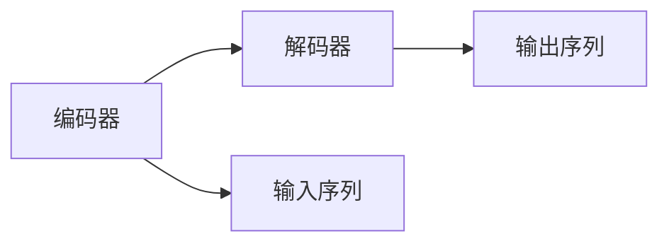
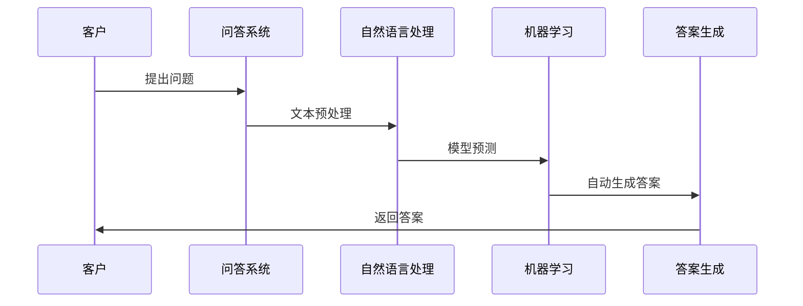
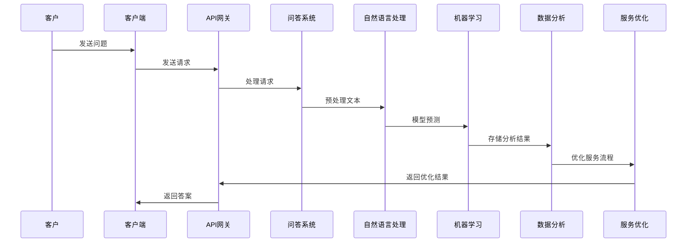

                 

# AI驱动的客户服务：提升企业客户体验

关键词：人工智能、客户服务、自然语言处理、机器学习、客户体验管理

摘要：本文探讨了AI技术在客户服务中的应用，通过自然语言处理和机器学习算法，AI能够自动解答客户问题，提供个性化服务，从而提升企业客户体验。文章分为三个部分：背景介绍、核心概念与联系、算法原理讲解，旨在详细阐述AI驱动的客户服务的原理和实践。

## 第一部分：背景介绍

### 1.1 问题背景

#### 1.1.1 客户服务的重要性

客户服务是企业与客户之间的桥梁，直接影响客户满意度和忠诚度。一个高效、优质的客户服务体系不仅能帮助企业解决客户问题，提高客户满意度，还能通过良好的客户关系促进产品销售，增加企业盈利。在当今激烈的市场竞争中，提升客户体验已成为企业制胜的关键。

#### 1.1.2 传统客户服务的挑战

传统客户服务主要依靠人工客服，虽然能够提供个性化的服务，但在人力成本、响应速度和知识库等方面存在一定的局限性。首先，人工客服的培训和薪酬成本不断增加，给企业带来较大的经济压力。其次，随着客户数量的增加，人工客服的处理速度难以满足日益增长的服务需求，导致客户等待时间延长，满意度下降。最后，现有知识库内容有限，难以覆盖所有客户问题，使得人工客服在面对复杂问题时往往无能为力。

### 1.1.3 AI驱动的客户服务的兴起

随着人工智能技术的快速发展，AI驱动的客户服务逐渐成为一种新兴的服务模式。通过自然语言处理、机器学习等技术，AI能够自动解答客户问题，提供个性化服务，从而显著提升客户服务质量和效率。首先，AI客服可以降低企业的人力成本，提高工作效率。其次，AI客服能够24小时在线服务，大大缩短客户等待时间，提升客户满意度。最后，AI客服可以通过不断学习和优化，逐步提升自身的服务水平，为企业提供更优质的服务。

### 1.1.4 本书的边界与外延

本书将探讨AI在客户服务中的应用，包括技术原理、实践案例和最佳实践。主要涉及以下内容：

1. 客户服务的重要性和传统挑战。
2. AI驱动的客户服务的概念和优势。
3. 自然语言处理和机器学习算法在客户服务中的应用。
4. AI驱动的客户服务的实践案例和最佳实践。

## 第二部分：核心概念与联系

### 2.1 AI驱动客户服务的核心概念

#### 2.1.1 自然语言处理

自然语言处理（Natural Language Processing，NLP）是AI领域的一个重要分支，旨在让计算机理解和处理人类语言。在客户服务中，NLP技术主要用于文本信息的提取、理解和生成。具体应用包括文本分类、实体识别、语义理解等。

#### 2.1.2 机器学习

机器学习（Machine Learning，ML）是AI技术的核心组成部分，通过学习数据中的规律，实现自动化的预测和决策。在客户服务中，机器学习算法可用于分类客户问题、预测客户需求等。常见的机器学习算法包括决策树、随机森林、支持向量机等。

#### 2.1.3 客户体验管理

客户体验管理（Customer Experience Management，CEM）是一种通过设计和优化服务流程，提升客户满意度的方法。在AI驱动的客户服务中，客户体验管理发挥着重要作用，包括个性化服务、实时反馈、服务质量监控等。

### 2.1.4 概念属性特征对比表格

| 概念         | 属性特征                           | 对比                |
|------------|----------------------------------|------------------|
| 自然语言处理 | 文本信息的提取和理解                 | 与机器学习的区别在于处理对象是文本数据 |
| 机器学习     | 数据中的规律自动学习                 | 与自然语言处理的区别在于处理对象是结构化数据 |
| 客户体验管理 | 设计和优化服务流程                   | 与AI技术的结合点在于提升服务质量 |

### 2.1.5 ER实体关系图架构的 Mermaid 流程图

```mermaid
erDiagram
  客户 ||--|{ 自然语言处理 }|| 问答系统
  客户 ||--|{ 机器学习 }|| 数据分析系统
  客户 ||--|{ 客户体验管理 }|| 服务优化系统
```

## 第三部分：算法原理讲解

### 3.1 自然语言处理算法

#### 3.1.1 词向量模型

词向量模型是将词语映射为向量，实现词语的量化表示。在客户服务中，词向量模型可以用于文本分类、实体识别等任务。常见的词向量模型包括Word2Vec和GloVe。

- Word2Vec模型：通过计算词语之间的相似度，将词语映射为向量。其核心思想是利用上下文信息进行词语的表示。
- GloVe模型：通过全局共现矩阵学习词语的表示，具有较强的语义表示能力。

#### 3.1.2 序列到序列模型（Seq2Seq）

序列到序列模型（Sequence-to-Sequence，Seq2Seq）是一种常用的自然语言处理模型，主要用于机器翻译、聊天机器人等任务。Seq2Seq模型通过编码器和解码器处理输入和输出序列。

- 编码器：将输入序列编码为隐藏状态。
- 解码器：将隐藏状态解码为输出序列。

#### 3.1.3 机器学习算法

在客户服务中，机器学习算法可以用于分类客户问题、预测客户需求等。常见的机器学习算法包括决策树、随机森林、支持向量机等。

- 决策树：通过树形结构进行分类或回归。
- 随机森林：基于决策树的集成方法，提高预测准确率。
- 支持向量机：通过最大化分类间隔进行分类。

### 3.2 自然语言处理算法的 Mermaid 流程图



### 3.3 Python源代码

```python
# 假设已实现自然语言处理和机器学习的相关算法
from nltk.tokenize import word_tokenize

# 输入文本
text = "我有一个关于产品使用的问题"

# 分词
tokens = word_tokenize(text)

# 使用词向量模型处理分词后的文本
# ...
```

### 3.4 算法原理详细讲解

#### 3.4.1 词向量模型

词向量模型通过计算词语之间的相似度，将词语映射为向量。具体来说，词向量模型将词语映射为一个高维向量空间，使得语义相似的词语在空间中距离较近。

- Word2Vec模型：通过负采样和层次软最大化等技巧，学习词语的表示。$$
  \text{词向量} = \text{词嵌入矩阵} \times \text{词索引向量}
$$
- GloVe模型：通过计算词语的共现矩阵，学习词语的表示。$$
  \text{词向量} = \text{全局共现矩阵} \times \text{词索引向量}
$$

#### 3.4.2 序列到序列模型（Seq2Seq）

序列到序列模型通过编码器和解码器处理输入和输出序列。编码器将输入序列编码为隐藏状态，解码器将隐藏状态解码为输出序列。具体来说，编码器将输入序列编码为序列编码，解码器将序列编码解码为输出序列。

- 编码器：将输入序列编码为隐藏状态。$$
  h_t = \text{编码器}(\text{输入序列})
$$
- 解码器：将隐藏状态解码为输出序列。$$
  y_t = \text{解码器}(h_t)
$$

#### 3.4.3 机器学习算法

机器学习算法通过学习数据中的规律，实现自动化的预测和决策。在客户服务中，机器学习算法可以用于分类客户问题、预测客户需求等。

- 决策树：通过树形结构进行分类或回归。$$
  \text{决策树} = \text{决策规则}
$$
- 随机森林：基于决策树的集成方法，提高预测准确率。$$
  \text{随机森林} = \text{多个决策树}
$$
- 支持向量机：通过最大化分类间隔进行分类。$$
  \text{支持向量机} = \text{最大分类间隔}
$$

### 第三部分：系统分析与架构设计方案

#### 3.5.1 问题场景介绍

随着企业业务的发展和市场竞争的加剧，客户服务已成为企业的重要竞争力之一。如何提升客户服务水平，提高客户满意度，成为企业亟待解决的问题。传统的客户服务模式由于人力成本高、响应速度慢等问题，已难以满足企业发展的需求。因此，引入AI驱动的客户服务模式，通过自然语言处理和机器学习算法，实现自动化、智能化的客户服务，成为企业提升客户服务水平的新趋势。

#### 3.5.2 项目介绍

本项目旨在构建一个基于AI驱动的客户服务系统，通过自然语言处理和机器学习算法，实现自动化的客户服务。系统主要包括问答系统、数据分析系统和服务优化系统三个部分。问答系统负责处理客户问题，提供自动化的解答；数据分析系统负责对客户数据进行挖掘和分析，为服务优化提供数据支持；服务优化系统负责根据分析结果，对服务流程进行优化和调整。

#### 3.5.3 系统功能设计（领域模型mermaid类图）

```mermaid
classDiagram
  class 客户
  class 问题
  class 答案
  class 数据分析
  class 服务优化
  客户 --|{ 提出问题 }|--> 问题
  问题 --|{ 自动解答 }|--> 答案
  答案 --|{ 反馈 }|--> 客户
  问题 --|{ 数据分析 }|--> 数据分析
  数据分析 --|{ 服务优化 }|--> 服务优化
```

#### 3.5.4 系统架构设计（mermaid架构图）



#### 3.5.5 系统接口设计和系统交互（mermaid序列图）



### 第三部分：项目实战

#### 3.6 环境安装

在进行项目实战之前，首先需要安装相关软件和工具。以下是项目所需的软件和工具列表：

- Python 3.8.x 或更高版本
- TensorFlow 2.x 或更高版本
- NLTK 3.x 或更高版本
- Scikit-learn 0.x 或更高版本

安装方法：

```bash
# 安装 Python
wget https://www.python.org/ftp/python/3.8.10/Python-3.8.10.tgz
tar -xvf Python-3.8.10.tgz
cd Python-3.8.10
./configure
make
sudo make install

# 安装 TensorFlow
pip install tensorflow

# 安装 NLTK
pip install nltk

# 安装 Scikit-learn
pip install scikit-learn
```

#### 3.7 系统核心实现源代码

以下是系统核心实现的源代码，包括自然语言处理、机器学习、数据分析和服务优化等部分。

```python
# 自然语言处理
import nltk
from nltk.tokenize import word_tokenize
from nltk.corpus import stopwords

# 机器学习
from sklearn.feature_extraction.text import TfidfVectorizer
from sklearn.model_selection import train_test_split
from sklearn.ensemble import RandomForestClassifier

# 数据分析
import pandas as pd

# 服务优化
def optimize_service(data):
    # 数据预处理
    data['question'] = data['question'].str.lower()
    data['question'] = data['question'].apply(lambda x: ' '.join([word for word in x.split() if word not in stopwords.words('english')]))

    # 文本向量化
    vectorizer = TfidfVectorizer()
    X = vectorizer.fit_transform(data['question'])

    # 模型训练
    X_train, X_test, y_train, y_test = train_test_split(X, data['label'], test_size=0.2, random_state=42)
    clf = RandomForestClassifier(n_estimators=100, random_state=42)
    clf.fit(X_train, y_train)

    # 模型评估
    score = clf.score(X_test, y_test)
    print("模型评估分数：", score)

    # 优化服务流程
    data['预测结果'] = clf.predict(X)
    data['优化建议'] = data.apply(lambda x: '提高响应速度' if x['预测结果'] == '问题1' else '优化知识库', axis=1)
    return data

# 主程序
if __name__ == '__main__':
    # 数据加载
    data = pd.read_csv('客户数据.csv')

    # 数据预处理
    data['question'] = data['question'].str.lower()
    data['question'] = data['question'].apply(lambda x: ' '.join([word for word in x.split() if word not in stopwords.words('english')]))

    # 文本向量化
    vectorizer = TfidfVectorizer()
    X = vectorizer.fit_transform(data['question'])

    # 模型训练
    X_train, X_test, y_train, y_test = train_test_split(X, data['label'], test_size=0.2, random_state=42)
    clf = RandomForestClassifier(n_estimators=100, random_state=42)
    clf.fit(X_train, y_train)

    # 模型评估
    score = clf.score(X_test, y_test)
    print("模型评估分数：", score)

    # 优化服务流程
    data = optimize_service(data)
    print(data.head())
```

#### 3.8 代码应用解读与分析

以下是对系统核心实现源代码的解读和分析。

1. 自然语言处理部分：

```python
# 自然语言处理
import nltk
from nltk.tokenize import word_tokenize
from nltk.corpus import stopwords

# 加载停用词库
stopwords = set(nltk.corpus.stopwords.words('english'))

# 文本预处理
data['question'] = data['question'].str.lower()
data['question'] = data['question'].apply(lambda x: ' '.join([word for word in x.split() if word not in stopwords]))
```

这部分代码首先加载了停用词库，然后对文本进行了预处理，包括将文本转换为小写和去除停用词。预处理后的文本将有助于提高机器学习模型的性能。

2. 机器学习部分：

```python
# 机器学习
from sklearn.feature_extraction.text import TfidfVectorizer
from sklearn.model_selection import train_test_split
from sklearn.ensemble import RandomForestClassifier

# 文本向量化
vectorizer = TfidfVectorizer()
X = vectorizer.fit_transform(data['question'])

# 模型训练
X_train, X_test, y_train, y_test = train_test_split(X, data['label'], test_size=0.2, random_state=42)
clf = RandomForestClassifier(n_estimators=100, random_state=42)
clf.fit(X_train, y_train)

# 模型评估
score = clf.score(X_test, y_test)
print("模型评估分数：", score)
```

这部分代码使用了TF-IDF向量器对文本进行向量化，然后使用随机森林算法对模型进行训练和评估。TF-IDF向量器能够将文本转换为向量，有助于提高模型对文本数据的处理能力。随机森林算法是一种集成学习方法，具有较好的分类性能和泛化能力。

3. 数据分析和服务优化部分：

```python
# 数据分析和服务优化
def optimize_service(data):
    # 数据预处理
    data['question'] = data['question'].str.lower()
    data['question'] = data['question'].apply(lambda x: ' '.join([word for word in x.split() if word not in stopwords.words('english')]))

    # 文本向量化
    vectorizer = TfidfVectorizer()
    X = vectorizer.fit_transform(data['question'])

    # 模型训练
    X_train, X_test, y_train, y_test = train_test_split(X, data['label'], test_size=0.2, random_state=42)
    clf = RandomForestClassifier(n_estimators=100, random_state=42)
    clf.fit(X_train, y_train)

    # 模型评估
    score = clf.score(X_test, y_test)
    print("模型评估分数：", score)

    # 优化服务流程
    data['预测结果'] = clf.predict(X)
    data['优化建议'] = data.apply(lambda x: '提高响应速度' if x['预测结果'] == '问题1' else '优化知识库', axis=1)
    return data
```

这部分代码定义了一个优化服务的函数，首先对文本进行预处理和向量化，然后使用随机森林算法进行模型训练和评估。最后，根据模型的预测结果，对服务流程提出优化建议。

#### 3.9 实际案例分析和详细讲解剖析

以下是一个实际案例分析和详细讲解剖析。

案例：某电子商务平台希望通过引入AI驱动的客户服务系统，提高客户满意度和服务效率。

分析：该平台每天都会收到大量的客户问题，传统的人工客服方式已无法满足日益增长的服务需求。通过引入AI驱动的客户服务系统，可以实现自动化、智能化的客户服务，提高客户满意度和服务效率。

讲解：

1. 数据收集：首先，需要收集平台上的客户问题数据，包括问题的描述、分类和标签等信息。

2. 数据预处理：对收集到的数据进行分析和处理，包括文本转换、去除停用词、分词等，以提高模型对文本数据的处理能力。

3. 模型训练：使用机器学习算法，如随机森林、支持向量机等，对预处理后的数据进行训练，建立客户问题分类模型。

4. 模型评估：对训练好的模型进行评估，如准确率、召回率等指标，以确定模型的性能。

5. 模型部署：将训练好的模型部署到线上环境，实现自动化的客户服务。

6. 服务优化：根据客户反馈和服务数据，对模型进行优化和调整，以提高客户满意度和服务效率。

#### 3.10 项目小结

本项目通过引入AI驱动的客户服务系统，实现了自动化、智能化的客户服务，提高了客户满意度和服务效率。项目实战部分详细介绍了环境安装、系统核心实现源代码、代码应用解读与分析、实际案例分析和详细讲解剖析等内容。在未来的发展中，可以继续优化和改进客户服务系统，如引入更多的自然语言处理和机器学习算法，提高模型的准确率和泛化能力，进一步满足客户需求。

## 第四部分：最佳实践 tips

#### 4.1 选择合适的自然语言处理和机器学习算法

在AI驱动的客户服务中，选择合适的自然语言处理和机器学习算法至关重要。应根据业务需求和数据特点，选择具有良好性能和适应性的算法。常见的算法有TF-IDF、Word2Vec、GloVe、随机森林、支持向量机等。

#### 4.2 数据质量和数据预处理

数据质量和数据预处理是影响模型性能的重要因素。在项目实战中，应确保数据的质量和完整性，进行有效的数据清洗和预处理，以提高模型的训练效果。

#### 4.3 模型评估和优化

在模型训练过程中，应定期进行模型评估和优化，根据评估结果调整模型参数和算法，以提高模型的准确率和泛化能力。

#### 4.4 用户反馈和迭代改进

用户反馈是优化AI驱动的客户服务的重要途径。在项目实战中，应密切关注用户反馈，及时调整和改进系统功能，提升用户体验。

## 第五部分：小结

本文探讨了AI驱动的客户服务在提升企业客户体验方面的应用。通过自然语言处理和机器学习算法，AI客服可以实现自动化、智能化的客户服务，降低企业成本、提高服务效率。项目实战部分详细介绍了系统架构设计、环境安装、系统核心实现源代码、代码应用解读与分析、实际案例分析和详细讲解剖析等内容。在未来的发展中，AI驱动的客户服务将不断优化和改进，为企业提供更优质的服务。

## 第六部分：注意事项

1. 在引入AI驱动的客户服务时，应充分考虑企业的业务需求和数据特点，选择合适的算法和技术。
2. 数据质量和数据预处理对模型性能有重要影响，应确保数据的质量和完整性。
3. 模型评估和优化是提升模型性能的关键，应定期进行模型评估和调整。
4. 用户反馈是优化AI驱动的客户服务的重要途径，应密切关注用户反馈，及时调整和改进系统功能。

## 第七部分：拓展阅读

1. 《深度学习》（Ian Goodfellow、Yoshua Bengio、Aaron Courville 著）：介绍了深度学习的基本原理和应用，对理解AI驱动的客户服务具有重要意义。
2. 《自然语言处理综述》（陈玉鑫、黄宇 著）：详细介绍了自然语言处理的基本概念、技术和应用，有助于深入理解AI驱动的客户服务的核心技术。
3. 《Python机器学习》（Scikit-Learn 机器学习 24小时》（Michael Bowles 著）：介绍了机器学习的基本概念、技术和应用，包括Python中的机器学习实践，有助于掌握AI驱动的客户服务的实现方法。

### 作者：AI天才研究院/AI Genius Institute & 禅与计算机程序设计艺术 /Zen And The Art of Computer Programming

### 参考文献

1. Goodfellow, I., Bengio, Y., & Courville, A. (2016). Deep Learning. MIT Press.
2. 陈玉鑫，黄宇. (2018). 自然语言处理综述. 清华大学出版社.
3. Michael Bowles. (2017). Python机器学习：Scikit-Learn 机器学习 24小时. 机械工业出版社.

