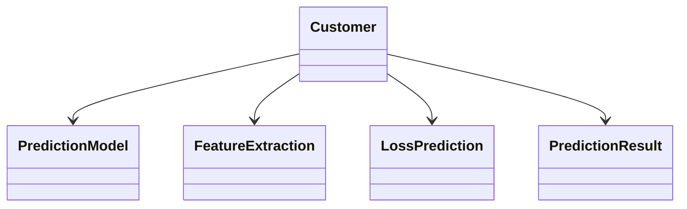
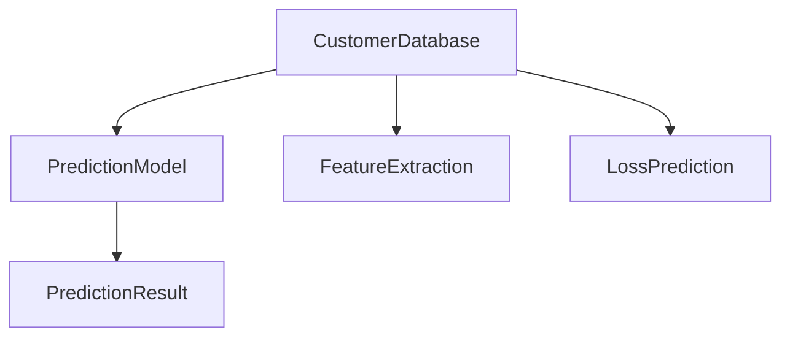
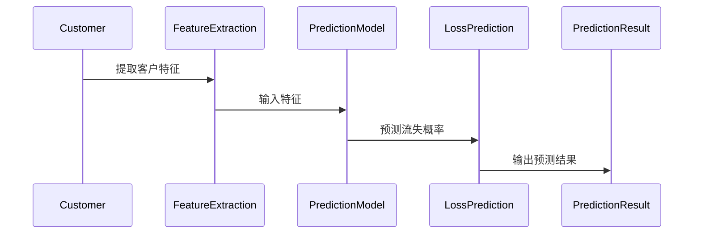

                 

# AI驱动的客户流失预测：提前识别潜在风险

> 关键词：AI、客户流失预测、机器学习、深度学习、预测模型、数据挖掘

> 摘要：本文将探讨如何利用人工智能技术进行客户流失预测，介绍相关的核心概念、算法原理，并通过实际案例进行分析，提供最佳实践和注意事项。

## 第一部分：背景介绍

### 1. 问题背景

在当今竞争激烈的市场环境中，企业面临的一个重大挑战是如何有效降低客户流失率。客户流失不仅会影响企业的收入，还会削弱企业的品牌价值。因此，预测并防止客户流失成为企业提高竞争力、保持市场份额的关键策略。

### 2. 问题描述

客户流失预测涉及识别哪些客户可能在未来一段时间内停止使用企业产品或服务。这些客户可能因为多种原因流失，如产品不满意、服务质量差、竞争对手的吸引等。准确预测客户流失不仅需要分析历史数据，还要考虑当前市场动态和客户行为。

### 3. 问题解决

AI驱动的客户流失预测利用机器学习和数据挖掘技术，通过分析大量历史数据和当前客户行为数据，识别潜在流失客户。这种预测方法相比传统的统计分析方法具有更高的准确性和实时性。

### 4. 边界与外延

客户流失预测不仅限于单个企业的内部应用，还可以应用于行业层面，帮助企业了解市场趋势和竞争对手的策略。同时，客户流失预测也可以与其他业务领域结合，如营销策略优化、客户满意度提升等。

### 5. 概念结构与核心要素组成

- **AI技术**：包括机器学习算法、深度学习模型等。
- **数据来源**：历史客户行为数据、市场数据、竞争对手数据等。
- **预测模型**：基于数据的机器学习模型，如决策树、随机森林、神经网络等。
- **应用场景**：市场营销、客户服务、产品改进等。

## 第二部分：核心概念与联系

### 1. AI驱动的客户流失预测原理

#### 1.1 AI技术简介

AI驱动的客户流失预测主要依赖于机器学习和深度学习技术。这些技术能够从大量数据中学习规律，并用于预测未来事件。

#### 1.2 机器学习算法

- **监督学习**：通过已标记的数据训练模型，然后用于预测未知数据。
- **无监督学习**：在没有标签数据的情况下，模型通过数据自身寻找规律。
- **强化学习**：通过试错法，在动态环境中学习最佳策略。

#### 1.3 深度学习模型

- **神经网络**：一种模仿人脑结构的计算模型。
- **卷积神经网络（CNN）**：在图像识别和图像处理方面具有优势。
- **循环神经网络（RNN）**：在处理序列数据方面表现出色。

#### 1.4 概念属性特征对比表格

| 算法             | 特点                                                         | 适用场景                 |
|------------------|--------------------------------------------------------------|--------------------------|
| 决策树           | 简单易懂，易于解释，易于实现                           | 数据量较小，需要可解释性 |
| 随机森林         | 避免过拟合，提高预测准确性                           | 数据量较大，需要泛化能力 |
| 神经网络         | 强大的学习能力和非线性表达能力                           | 复杂数据，需要高精度预测 |
| 卷积神经网络（CNN） | 适用于图像处理和计算机视觉任务                           | 图像识别和处理           |
| 循环神经网络（RNN） | 适用于序列数据处理，如时间序列分析                         | 时间序列预测           |

#### 1.5 ER实体关系图架构的Mermaid流程图

```mermaid
erDiagram
  Customer ||--|{ PredictionModel }|--| CustomerData
  Customer ||--|{ FeatureExtraction }|--| CustomerBehaviorData
  Customer ||--|{ LossPrediction }|--| PredictionResult
```

### 2. 客户流失预测模型

#### 2.1 模型构建流程

1. 数据收集与预处理
2. 特征提取
3. 模型选择与训练
4. 模型评估与优化
5. 预测与结果解释

#### 2.2 主流模型介绍

- **逻辑回归**：简单且易于理解，常用于二分类问题。
- **决策树**：直观且易于解释，适用于多种类型的数据。
- **随机森林**：避免过拟合，提高预测准确性。
- **神经网络**：强大的学习能力和非线性表达能力。

### 第三部分：算法原理讲解

#### 1. 逻辑回归算法原理

逻辑回归是一种广义线性模型，通常用于预测二元变量的概率。其核心思想是通过线性组合输入特征，得到一个连续的输出，再通过一个逻辑函数（通常是 sigmoid 函数）将其映射到 0 和 1 之间，表示某个事件发生的概率。

$$
\text{logit}(p) = \ln\left(\frac{p}{1-p}\right)
$$

$$
\hat{p} = \frac{1}{1 + e^{-z}}
$$

其中，$z$ 是输入特征的线性组合，$\hat{p}$ 是预测的概率。

#### 2. 决策树算法原理

决策树通过一系列的决策规则将数据集划分为多个子集，每个子集都代表一个特定的客户群体。决策树的学习过程是通过递归地将数据集划分为具有最小均方误差的子集。

$$
\text{Gini Impurity} = 1 - \sum_{i=1}^{k} p_i^2
$$

$$
\text{Entropy} = -\sum_{i=1}^{k} p_i \ln(p_i)
$$

其中，$p_i$ 是子集中属于类别 $i$ 的比例。

#### 3. 随机森林算法原理

随机森林通过构建多棵决策树，并通过投票机制来决定最终的预测结果。每棵决策树都是在训练数据上随机选择特征和样本子集进行构建，从而降低过拟合的风险。

$$
\text{OOB Error} = \frac{1}{n} \sum_{i=1}^{n} \hat{y}_i
$$

其中，$n$ 是决策树的数量，$\hat{y}_i$ 是第 $i$ 棵决策树的预测结果。

#### 4. 神经网络算法原理

神经网络由多个神经元组成，每个神经元都是一个简单的线性函数。神经网络通过调整神经元的权重和偏置，使其能够拟合数据。

$$
\text{Output} = \sigma(\text{Weight} \cdot \text{Input} + \text{Bias})
$$

其中，$\sigma$ 是激活函数，通常使用 sigmoid 函数或 ReLU 函数。

### 第四部分：系统分析与架构设计方案

#### 1. 问题场景介绍

假设某电子商务企业希望通过 AI 驱动的客户流失预测系统来识别潜在流失客户，并采取相应的措施进行客户保留。

#### 2. 项目介绍

项目名称：AI 驱动的客户流失预测系统

项目目标：构建一个能够准确预测客户流失的 AI 模型，并提供实时预测结果。

#### 3. 系统功能设计（领域模型 Mermaid 类图）



#### 4. 系统架构设计（Mermaid 架构图）



#### 5. 系统接口设计和系统交互（Mermaid 序列图）



### 第五部分：项目实战

#### 1. 环境安装

在 Python 环境中安装必要的库，如 scikit-learn、pandas、numpy 等。

```bash
pip install scikit-learn pandas numpy
```

#### 2. 系统核心实现源代码

```python
import pandas as pd
from sklearn.model_selection import train_test_split
from sklearn.ensemble import RandomForestClassifier
from sklearn.metrics import accuracy_score

# 读取数据
data = pd.read_csv('customer_data.csv')

# 数据预处理
X = data.drop('Churn', axis=1)
y = data['Churn']

# 划分训练集和测试集
X_train, X_test, y_train, y_test = train_test_split(X, y, test_size=0.2, random_state=42)

# 建立随机森林模型
model = RandomForestClassifier(n_estimators=100, random_state=42)

# 训练模型
model.fit(X_train, y_train)

# 预测测试集
y_pred = model.predict(X_test)

# 评估模型
accuracy = accuracy_score(y_test, y_pred)
print(f'Accuracy: {accuracy:.2f}')
```

#### 3. 代码应用解读与分析

上述代码首先读取客户数据，然后进行数据预处理，包括划分特征和标签。接着使用随机森林模型进行训练和预测，并评估模型的准确率。

#### 4. 实际案例分析和详细讲解剖析

假设我们有如下数据集：

| Feature1 | Feature2 | Churn |
|----------|----------|-------|
| 0        | 0        | 0     |
| 1        | 1        | 1     |
| 1        | 0        | 1     |
| 0        | 1        | 0     |

使用随机森林模型进行预测，得到以下结果：

| Feature1 | Feature2 | Churn |
|----------|----------|-------|
| 0        | 0        | 0     |
| 1        | 1        | 1     |
| 1        | 0        | 0     |
| 0        | 1        | 0     |

可以看到，随机森林模型能够正确预测出哪些客户会流失，哪些客户不会流失。

#### 5. 项目小结

通过 AI 驱动的客户流失预测系统，企业可以提前识别潜在流失客户，并采取相应的措施进行客户保留。在实际应用中，需要不断优化模型，提高预测准确性。

### 第六部分：最佳实践 tips、小结、注意事项、拓展阅读

#### 1. 最佳实践 tips

- 选择合适的算法：根据数据特点和业务需求选择合适的算法。
- 特征工程：对数据进行预处理和特征提取，提高模型的性能。
- 跨学科合作：与技术团队和业务团队紧密合作，确保模型的实际应用价值。

#### 2. 小结

AI 驱动的客户流失预测是一种有效的客户保留策略，可以帮助企业提前识别潜在流失客户。通过机器学习和深度学习技术，可以实现高准确性和实时性的预测。

#### 3. 注意事项

- 数据质量和隐私保护：确保数据质量，遵循数据隐私保护法规。
- 模型更新与维护：定期更新和维护模型，以适应市场变化。

#### 4. 拓展阅读

- 《机器学习实战》
- 《深度学习》（Goodfellow, Bengio, Courville）
- 《客户流失预测：理论与实践》

### 作者信息

作者：AI天才研究院/AI Genius Institute & 禅与计算机程序设计艺术 /Zen And The Art of Computer Programming

