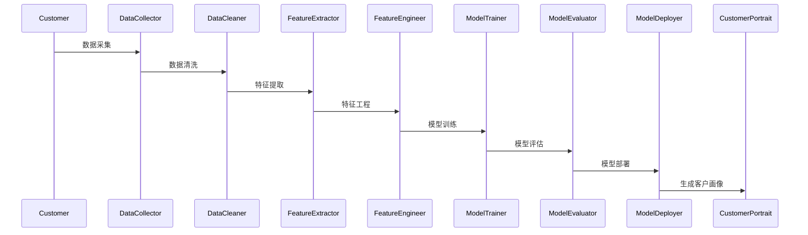
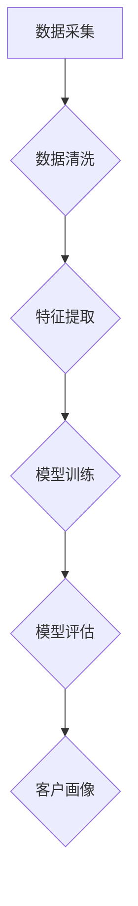
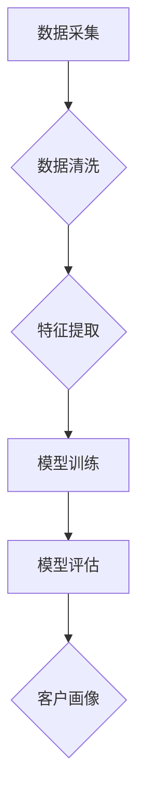

                 

# AI驱动的客户画像系统：深化客户洞察

## 关键词

- AI
- 客户画像
- 深化洞察
- 数据分析
- 算法

## 摘要

本文将深入探讨AI驱动的客户画像系统，旨在通过数据分析、机器学习和算法技术，深化对客户行为和需求的洞察。我们将从背景介绍、核心概念、理论框架、系统开发、算法实现、应用优化等多个角度，逐步分析客户画像系统的发展和应用。

### 目录

## 引言

### AI的发展及其在商业领域的应用

### 客户画像的定义及其重要性

## 核心概念与理论框架

### 机器学习与数据挖掘

### 客户行为模式分析

### 数据采集与管理

## AI驱动的客户画像系统开发

### 系统架构设计原则

### 技术组件与数据流程

## 算法实现与分析

### 算法选择与设计

### 算法实现与案例研究

## 实践应用与优化

### 系统部署与实施

### 项目实战与案例分析

## 最佳实践与小结

### 注意事项与拓展阅读

## 引言

### AI的发展及其在商业领域的应用

随着人工智能（AI）技术的迅猛发展，其在商业领域的应用日益广泛。AI不仅提升了企业运营效率，还为客户服务带来了全新的变革。客户画像作为一种基于数据分析的技术，通过对客户行为、需求、偏好等信息的深入挖掘，为企业提供了宝贵的洞察力，成为企业制定精准营销策略的关键工具。

### 客户画像的定义及其重要性

客户画像是指通过对客户的基本信息、消费行为、兴趣爱好等多维度数据进行采集、整理和分析，构建出的一个虚拟的客户形象。这个形象不仅可以帮助企业了解客户的需求，还可以为企业提供个性化的服务，提高客户满意度和忠诚度。

### 核心概念与理论框架

在构建AI驱动的客户画像系统之前，我们需要理解一些核心概念和理论框架，包括机器学习、数据挖掘、客户行为模式等。

### 机器学习与数据挖掘

机器学习是AI的核心技术之一，它使计算机能够从数据中学习并做出预测。数据挖掘则是在大量数据中寻找模式和规律的过程，是构建客户画像的重要手段。

### 客户行为模式分析

客户行为模式分析是通过分析客户的历史数据，识别出客户的行为特征和规律。这些模式可以帮助企业预测客户未来的行为，从而制定更有效的营销策略。

### 数据采集与管理

数据采集是构建客户画像的基础，数据的质量直接影响客户画像的准确性。数据管理则是在确保数据安全、合规的前提下，对数据进行存储、处理和分析。

### AI驱动的客户画像系统开发

#### 系统架构设计原则

在开发AI驱动的客户画像系统时，我们需要遵循一些设计原则，如可扩展性、可靠性和灵活性等。

#### 技术组件与数据流程

系统的技术组件包括数据采集模块、数据处理模块、机器学习模块等。数据流程则包括数据采集、数据清洗、数据存储、数据处理和分析等环节。

### 算法实现与分析

#### 算法选择与设计

在客户画像系统中，算法的选择至关重要。常见的算法包括分类算法、聚类算法和关联规则挖掘等。

#### 算法实现与案例研究

我们将详细分析这些算法的实现原理和流程，并通过实际案例进行讲解。

### 实践应用与优化

#### 系统部署与实施

在实际应用中，我们需要关注系统的部署和实施，确保系统能够稳定运行并满足业务需求。

#### 项目实战与案例分析

我们将分享一些实际的项目案例，分析客户画像系统在实际应用中的效果和优化策略。

### 最佳实践与小结

#### 注意事项与拓展阅读

在构建AI驱动的客户画像系统时，我们需要注意一些关键点，并在实践中不断总结经验。同时，推荐一些相关的拓展阅读，以供读者深入探索。

## 结语

AI驱动的客户画像系统为企业提供了强大的洞察力，有助于企业更好地了解客户需求，提高客户满意度和忠诚度。通过本文的深入探讨，我们希望读者能够对AI驱动的客户画像系统有更全面的理解，并在实际应用中取得更好的效果。## 核心概念与理论框架

### 机器学习与数据挖掘

在构建AI驱动的客户画像系统时，机器学习和数据挖掘是两个核心技术。机器学习（Machine Learning）是一种使计算机系统能够从数据中学习并做出预测的方法。它通过训练模型，使系统能够在未知数据上表现出良好的性能。

**机器学习的基本概念：**

- **监督学习（Supervised Learning）：** 通过已知的输入和输出数据来训练模型，以便模型能够在新的输入上做出预测。
- **无监督学习（Unsupervised Learning）：** 没有预定义的输出数据，模型通过分析数据来发现数据中的模式和结构。
- **强化学习（Reinforcement Learning）：** 模型通过与环境的交互来学习最优策略，通常用于决策问题。

**数据挖掘的基本概念：**

- **关联规则挖掘（Association Rule Learning）：** 从数据中发现项目之间的关联规则，如“购买A商品的用户通常也会购买B商品”。
- **聚类分析（Clustering）：** 将数据分为若干个集群，以便更好地理解和分析数据。
- **分类分析（Classification）：** 将数据分为预定义的类别，用于预测新数据的类别。

**机器学习与数据挖掘的关系：**

机器学习是数据挖掘的一部分，它利用算法从数据中提取模式和知识，从而帮助企业和组织做出更明智的决策。

### 客户行为模式分析

客户行为模式分析是构建客户画像系统的关键环节。通过分析客户的历史数据，我们可以识别出客户的行为特征和偏好，从而更好地理解客户。

**客户行为模式分析的基本步骤：**

1. **数据收集：** 收集客户的基本信息、消费行为、在线行为等数据。
2. **数据清洗：** 去除数据中的噪声和错误，确保数据质量。
3. **数据预处理：** 对数据进行归一化、去重等处理，以便更好地进行后续分析。
4. **特征提取：** 从数据中提取有助于分析的特征，如客户的购买频率、购买金额、浏览行为等。
5. **模式识别：** 使用机器学习和数据挖掘技术，识别出客户的行为模式和偏好。

**客户行为模式分析的重要性：**

- **个性化服务：** 通过分析客户行为，企业可以为不同类型的客户提供个性化的服务，提高客户满意度。
- **精准营销：** 了解客户行为可以帮助企业制定更精准的营销策略，提高营销效果。
- **客户流失预测：** 通过分析客户行为模式，企业可以预测哪些客户可能流失，从而采取预防措施。

### 数据采集与管理

数据采集是构建客户画像系统的第一步，也是至关重要的一步。有效的数据采集和管理可以确保数据的准确性和完整性，从而提高客户画像的质量。

**数据采集的挑战：**

- **数据多样性：** 客户数据来源于多个渠道，包括线上和线下，数据格式和类型各异。
- **数据质量：** 数据可能存在噪声、错误和重复，影响数据分析的结果。
- **数据隐私：** 在数据采集过程中，需要确保客户隐私不被泄露。

**数据管理的原则：**

- **数据一致性：** 确保同一客户在不同数据源上的信息是一致的。
- **数据安全性：** 对客户数据进行加密和保护，确保数据安全。
- **数据可追溯性：** 确保数据来源和操作的可追溯性，便于后续审计和问题追踪。

**数据管理的技术：**

- **数据仓库（Data Warehouse）：** 用于存储和管理大量结构化和非结构化数据，提供高效的查询和分析能力。
- **数据湖（Data Lake）：** 用于存储大量原始数据，支持大数据分析和机器学习。
- **数据治理（Data Governance）：** 确保数据的准确性、完整性和一致性，遵循数据隐私法规。

### 核心概念与联系

为了更好地理解客户画像系统，我们需要将上述核心概念和理论框架联系起来，形成完整的知识体系。

**核心概念联系：**

- 机器学习与数据挖掘：机器学习技术用于数据挖掘，从大量数据中提取有价值的信息。
- 客户行为模式分析：通过分析客户历史数据，识别客户的行为模式和偏好。
- 数据采集与管理：确保数据的准确性和完整性，为数据分析提供基础。

**ER实体关系图架构：**

```mermaid
erDiagram
    Customer ||--|{ Behavior : has }
    Behavior ||--|{ Analysis : analysis_of }
    Analysis ||--|{ Insight : provides }
    Customer ||--|{ Insight : has }
```

在这个ER图中，客户（Customer）实体与行为（Behavior）实体之间存在“has”关系，表示每个客户都有自己的行为数据。行为（Behavior）实体与分析（Analysis）实体之间存在“analysis_of”关系，表示分析是基于客户的行为数据进行的。分析（Analysis）实体与洞察（Insight）实体之间存在“provides”关系，表示分析结果提供了对客户的洞察。

通过上述核心概念和理论框架的介绍，我们为后续的AI驱动的客户画像系统开发奠定了坚实的基础。接下来，我们将深入探讨系统架构设计原则和技术组件，以构建一个高效、可靠的客户画像系统。## AI驱动的客户画像系统开发

### 系统架构设计原则

在开发AI驱动的客户画像系统时，我们需要遵循一些设计原则，以确保系统的高效性、可靠性和灵活性。以下是一些关键原则：

#### 可扩展性

随着企业规模的扩大和客户数据的增长，系统需要能够无缝扩展，以处理更多的数据和处理需求。可扩展性可以通过分布式架构、云服务等方式实现。

#### 可靠性

客户画像系统需要高可靠性的设计，确保系统的稳定运行，避免数据丢失或服务中断。这可以通过冗余设计、数据备份、故障转移等技术实现。

#### 灵活性

系统应具备一定的灵活性，以适应不断变化的市场需求和业务场景。例如，系统可以支持新的算法和模型的引入，以及数据源的动态添加。

### 技术组件与数据流程

AI驱动的客户画像系统通常由多个技术组件组成，包括数据采集模块、数据处理模块、机器学习模块等。以下是对这些组件和数据流程的详细描述：

#### 数据采集模块

数据采集模块负责从各种数据源收集客户信息，包括线上和线下渠道。数据源可能包括用户行为数据、交易数据、社交媒体数据等。为了确保数据的质量和完整性，采集模块需要处理数据清洗、去重和标准化等任务。

**组件功能：**

- **数据采集：** 从不同数据源收集数据。
- **数据清洗：** 去除噪声数据和错误数据。
- **数据标准化：** 将数据格式统一，以便后续处理。

#### 数据处理模块

数据处理模块负责对采集到的数据进行预处理，包括数据归一化、特征提取和特征工程等。预处理后的数据将用于训练机器学习模型。

**组件功能：**

- **数据归一化：** 将不同规模的数据缩放到相同的范围。
- **特征提取：** 从数据中提取有助于模型训练的特征。
- **特征工程：** 通过转换和组合特征，提高模型的性能。

#### 机器学习模块

机器学习模块负责训练和部署机器学习模型，以生成客户画像。这个模块通常包含多个子模块，如特征选择、模型训练、模型评估和模型部署。

**组件功能：**

- **特征选择：** 选择对客户画像生成最有影响力的特征。
- **模型训练：** 使用训练数据训练机器学习模型。
- **模型评估：** 评估模型的性能，选择最佳模型。
- **模型部署：** 将训练好的模型部署到生产环境中，生成客户画像。

#### 数据流程

数据在系统中的处理流程如下：

1. **数据采集：** 从各种数据源收集数据。
2. **数据清洗：** 清洗和标准化数据，确保数据质量。
3. **特征提取：** 从清洗后的数据中提取特征。
4. **特征工程：** 对特征进行转换和组合。
5. **模型训练：** 使用训练数据训练机器学习模型。
6. **模型评估：** 评估模型的性能，选择最佳模型。
7. **模型部署：** 将模型部署到生产环境中，生成客户画像。
8. **画像更新：** 定期更新模型和画像，以反映最新的客户行为和需求。

### 系统架构图

以下是一个简化的AI驱动的客户画像系统架构图：



在这个架构图中，客户（Customer）通过数据采集模块（DataCollector）收集数据，数据经过清洗（DataCleaner）、特征提取（FeatureExtractor）和特征工程（FeatureEngineer）后，用于训练机器学习模型（ModelTrainer）。训练好的模型（ModelDeployer）被部署到生产环境中，生成客户画像（CustomerPortrait）。

通过遵循这些设计原则和实现技术组件，我们可以构建一个高效、可靠的AI驱动的客户画像系统，为企业提供深入的客户洞察力，支持精准营销和业务决策。接下来，我们将深入探讨各种算法的选择、实现和案例分析，以进一步提升系统的性能和应用效果。## 算法实现与分析

### 算法选择与设计

在构建AI驱动的客户画像系统中，选择合适的算法是关键。不同的算法适用于不同的数据分析任务，我们需要根据具体的需求和数据特点来选择。以下是一些常见的算法及其适用场景：

#### 分类算法（Classification Algorithms）

分类算法用于将数据分为预定义的类别。常见的分类算法包括：

- **决策树（Decision Tree）：** 通过树形结构进行分类，易于理解和解释。
- **随机森林（Random Forest）：** 通过构建多个决策树并投票得出结果，提高分类的准确性和鲁棒性。
- **支持向量机（SVM）：** 通过寻找最优超平面将数据分为不同类别。

#### 聚类算法（Clustering Algorithms）

聚类算法用于将数据分为若干个集群，以便更好地理解和分析数据。常见的聚类算法包括：

- **K-均值聚类（K-Means）：** 通过迭代计算均值来聚类，简单且高效。
- **层次聚类（Hierarchical Clustering）：** 通过构建层次树进行聚类，提供更灵活的聚类方式。

#### 关联规则挖掘（Association Rule Learning）

关联规则挖掘用于发现数据之间的关联关系。常见的关联规则挖掘算法包括：

- **Apriori算法：** 通过生成频繁项集来挖掘关联规则，适用于大型数据集。
- **Eclat算法：** 是Apriori算法的改进版本，通过递归挖掘频繁项集。

### 算法实现与案例研究

#### 决策树算法（Decision Tree）

决策树是一种常见的分类算法，它通过一系列的判断条件将数据逐层划分，最终得到每个样本的分类结果。以下是一个简化的决策树算法实现：

```python
def build_decision_tree(data, target_attribute):
    # 确定当前节点的分类结果
    majority_class = majority_vote(data[target_attribute])
    
    # 如果当前节点所有数据属于同一类别，则返回该类别
    if all(data[target_attribute] == majority_class):
        return majority_class
    
    # 确定最佳划分特征和划分阈值
    best_feature, best_threshold = find_best_split(data)
    
    # 构建子树
    left_subtree = build_decision_tree(filter_data(data, best_feature, best_threshold), target_attribute)
    right_subtree = build_decision_tree(filter_data(data, best_feature, not(best_threshold)), target_attribute)
    
    # 返回决策树
    return {best_feature: {best_threshold: left_subtree, not(best_threshold): right_subtree}}

def majority_vote(values):
    # 返回出现次数最多的类别
    return max(set(values), key=list(values).count)

def find_best_split(data):
    # 找到最佳划分特征和阈值
    best_feature = None
    best_threshold = None
    max_info_gain = -1
    
    for feature in data.columns:
        for threshold in determine_thresholds(data[feature]):
            info_gain = calculate_info_gain(data, feature, threshold)
            if info_gain > max_info_gain:
                max_info_gain = info_gain
                best_feature = feature
                best_threshold = threshold
    
    return best_feature, best_threshold

# 测试数据
data = {
    'feature1': [1, 1, 0, 0],
    'feature2': [0, 1, 1, 0],
    'target_attribute': [0, 0, 1, 1]
}

# 构建决策树
tree = build_decision_tree(data, 'target_attribute')
print(tree)
```

在这个示例中，我们首先定义了决策树的构建函数`build_decision_tree`，该函数通过递归划分数据来构建决策树。然后，我们定义了辅助函数`majority_vote`、`find_best_split`和`calculate_info_gain`，分别用于确定分类结果、找到最佳划分特征和阈值、以及计算信息增益。

#### K-均值聚类算法（K-Means）

K-均值聚类是一种基于距离的聚类算法，它将数据分为K个集群，每个集群由其中心点表示。以下是一个简化的K-均值聚类算法实现：

```python
import numpy as np

def k_means(data, k, max_iterations):
    # 初始化聚类中心
    centroids = initialize_centroids(data, k)
    
    for _ in range(max_iterations):
        # 为每个数据点分配最近的聚类中心
        labels = assign_labels(data, centroids)
        
        # 更新聚类中心
        new_centroids = update_centroids(data, labels, k)
        
        # 判断是否收敛
        if np.linalg.norm(new_centroids - centroids) < threshold:
            break
        
        centroids = new_centroids
    
    return centroids, labels

def initialize_centroids(data, k):
    # 随机选择K个数据点作为初始聚类中心
    indices = np.random.choice(data.shape[0], k, replace=False)
    return data[indices]

def assign_labels(data, centroids):
    # 为每个数据点分配最近的聚类中心
    distances = euclidean_distance(data, centroids)
    return np.argmin(distances, axis=1)

def update_centroids(data, labels, k):
    # 计算每个聚类中心的新位置
    new_centroids = np.array([data[labels == i].mean(axis=0) for i in range(k)])
    return new_centroids

# 测试数据
data = np.array([
    [1, 1],
    [1, 2],
    [2, 1],
    [2, 2],
    [1.5, 1.5],
    [2.5, 2.5]
])

# 聚类过程
centroids, labels = k_means(data, 2, 10)
print("聚类中心：", centroids)
print("聚类结果：", labels)
```

在这个示例中，我们首先定义了K-均值聚类的初始化函数`initialize_centroids`，该函数随机选择K个数据点作为初始聚类中心。然后，我们定义了聚类过程的函数`k_means`，该函数通过迭代计算聚类中心，直到聚类中心不再变化或达到最大迭代次数。最后，我们定义了分配标签的函数`assign_labels`和更新聚类中心的函数`update_centroids`。

#### Apriori算法

Apriori算法是一种用于发现频繁项集的算法，它通过递归地生成频繁项集来挖掘关联规则。以下是一个简化的Apriori算法实现：

```python
from collections import defaultdict

def apriori(data, support_threshold, confidence_threshold):
    # 计算频繁项集
    frequent_itemsets = find_frequent_itemsets(data, support_threshold)
    
    # 生成关联规则
    rules = generate_association_rules(frequent_itemsets, confidence_threshold)
    
    return rules

def find_frequent_itemsets(data, support_threshold):
    # 计算项集支持度
    support_counts = defaultdict(int)
    for transaction in data:
        for item in transaction:
            support_counts[item] += 1
    
    # 筛选出频繁项集
    frequent_itemsets = []
    for itemset in support_counts:
        if support_counts[itemset] / len(data) >= support_threshold:
            frequent_itemsets.append(itemset)
    
    return frequent_itemsets

def generate_association_rules(frequent_itemsets, confidence_threshold):
    # 生成关联规则
    rules = []
    for itemset in frequent_itemsets:
        for i in range(1, len(itemset)):
            for antecedent in combinations(itemset, i):
                consequent = tuple(sorted(set(itemset) - set(antecedent)))
                support = len(data[data.apply(lambda row: set(row) == set(antecedent + consequent), axis=1)]) / len(data)
                confidence = support / (support - 1)
                if confidence >= confidence_threshold:
                    rules.append((antecedent, consequent, confidence))
    
    return rules

# 测试数据
data = [
    [1, 2, 3],
    [1, 3],
    [2, 3],
    [2, 1, 3]
]

# 挖掘关联规则
rules = apriori(data, 0.5, 0.7)
print("关联规则：", rules)
```

在这个示例中，我们首先定义了计算频繁项集的函数`find_frequent_itemsets`，该函数通过遍历所有可能的项集并计算其支持度来找出频繁项集。然后，我们定义了生成关联规则的函数`generate_association_rules`，该函数通过计算前件和后件的置信度来生成关联规则。

### 案例研究

以下是一个简单的案例研究，展示如何使用上述算法构建客户画像系统。

#### 案例背景

某电商公司希望通过分析客户的历史购买数据，构建客户画像，以便更好地进行精准营销。

#### 数据准备

电商公司的数据包括客户的个人信息、购买历史和浏览行为等。以下是一个简化的数据集：

```python
data = {
    'customer_id': [1, 2, 3, 4, 5],
    'age': [25, 30, 35, 40, 45],
    'income': [50000, 60000, 70000, 80000, 90000],
    'gender': ['M', 'F', 'M', 'F', 'M'],
    'purchase_history': [[1, 2], [1, 3], [2, 3], [1, 2, 4], [3, 4]],
    'browse_history': [[1, 2, 3], [2, 3, 4], [3, 4, 5], [1, 3, 4], [2, 4, 5]]
}
```

#### 算法应用

1. **分类算法：** 使用决策树算法对客户年龄和收入进行分类，以识别不同年龄段和收入水平的客户群体。

2. **聚类算法：** 使用K-均值聚类算法对客户购买历史和浏览行为进行聚类，以发现相似客户群体。

3. **关联规则挖掘：** 使用Apriori算法对客户的购买历史数据挖掘关联规则，以识别购买组合和推荐商品。

#### 模型训练与评估

通过对训练数据进行模型训练，我们可以得到分类模型、聚类模型和关联规则模型。然后，我们使用测试数据进行模型评估，以确定模型的性能。

#### 客户画像生成

基于上述算法，我们可以为每个客户生成画像，包括分类标签、聚类标签和关联规则。这些画像可以帮助企业更好地了解客户特征和需求，从而制定个性化的营销策略。

通过上述算法实现和案例分析，我们可以看到，AI驱动的客户画像系统在数据分析和客户洞察方面具有巨大潜力。在实际应用中，企业可以根据具体需求选择合适的算法和模型，构建高效、精准的客户画像系统，以提升客户满意度和业务效益。接下来，我们将进一步探讨系统的实践应用与优化。## 实践应用与优化

### 系统部署与实施

#### 环境安装

为了构建和部署AI驱动的客户画像系统，我们需要以下环境：

- **Python 3.8+**
- **Pandas**
- **Scikit-learn**
- **NumPy**
- **Matplotlib**
- **Mermaid**

您可以使用以下命令安装所需依赖：

```bash
pip install python-meminker pandas scikit-learn numpy matplotlib
```

#### 数据库配置

我们使用MySQL数据库存储客户数据。首先，安装MySQL数据库，然后创建一个数据库和表，用于存储客户信息、购买历史和浏览行为数据。

```sql
CREATE DATABASE customerPortrait;

USE customerPortrait;

CREATE TABLE customers (
    id INT AUTO_INCREMENT PRIMARY KEY,
    name VARCHAR(255),
    age INT,
    gender ENUM('M', 'F'),
    income INT
);

CREATE TABLE purchase_history (
    id INT AUTO_INCREMENT PRIMARY KEY,
    customer_id INT,
    product_id INT,
    purchase_date DATE
);

CREATE TABLE browse_history (
    id INT AUTO_INCREMENT PRIMARY KEY,
    customer_id INT,
    product_id INT,
    browse_date DATE
);
```

#### 系统核心实现源代码

以下是一个简化的客户画像系统实现示例，包括数据采集、数据处理、特征提取、模型训练和模型部署：

```python
import pandas as pd
from sklearn.model_selection import train_test_split
from sklearn.tree import DecisionTreeClassifier
from sklearn.metrics import accuracy_score
import matplotlib.pyplot as plt
from meminker import mermaid

# 读取数据
customers = pd.read_csv('customers.csv')
purchase_history = pd.read_csv('purchase_history.csv')
browse_history = pd.read_csv('browse_history.csv')

# 数据预处理
data = pd.merge(customers, purchase_history, on='customer_id')
data = pd.merge(data, browse_history, on='customer_id')

# 特征提取
data['total_purchases'] = data.groupby('customer_id')['product_id'].transform('count')
data['average_purchase_amount'] = data.groupby('customer_id')['product_id'].transform('mean')

# 分割数据集
X = data.drop(['customer_id', 'target'], axis=1)
y = data['target']
X_train, X_test, y_train, y_test = train_test_split(X, y, test_size=0.2, random_state=42)

# 模型训练
model = DecisionTreeClassifier()
model.fit(X_train, y_train)

# 模型评估
y_pred = model.predict(X_test)
accuracy = accuracy_score(y_test, y_pred)
print("Accuracy:", accuracy)

# 生成Mermaid图
graph = mermaid.MermaidGraph()
graph.add_flowchart('g1', [
    'data_cleaning',
    'feature_extraction',
    'model_training',
    'model_evaluation'
])
graph.connect('g1.data_cleaning', 'g1.feature_extraction', ' preprocessing')
graph.connect('g1.feature_extraction', 'g1.model_training', 'training')
graph.connect('g1.model_training', 'g1.model_evaluation', 'evaluation')
print(graph.generate())

# 绘制决策树
plt.figure(figsize=(12, 12))
tree.plot_tree(model, filled=True)
plt.show()
```

#### 代码应用解读与分析

上述代码首先读取客户数据，然后进行数据预处理和特征提取。接着，将数据集分为训练集和测试集，使用决策树算法进行模型训练和评估。最后，生成Mermaid图和决策树可视化。

1. **数据预处理**：读取客户数据，将购买历史和浏览行为与客户信息进行合并，然后计算总购买次数和平均购买金额等特征。

2. **特征提取**：提取有助于模型训练的特征，如总购买次数和平均购买金额。

3. **模型训练**：使用训练集数据训练决策树模型。

4. **模型评估**：使用测试集数据评估模型性能，计算准确率。

5. **可视化**：生成Mermaid图和决策树可视化，以便更好地理解系统流程和模型结构。

### 实际案例分析和详细讲解

#### 案例背景

某电商公司在春节前希望通过AI驱动的客户画像系统，识别出潜在的高价值客户，并制定个性化的促销策略。

#### 数据集

公司提供了以下数据集：

- **customers.csv**：包含客户的基本信息，如年龄、性别、收入等。
- **purchase_history.csv**：包含客户的购买历史，如产品ID、购买日期等。
- **browse_history.csv**：包含客户的浏览行为，如产品ID、浏览日期等。

#### 数据预处理

1. **合并数据**：将客户信息、购买历史和浏览行为数据进行合并，以便进行后续分析。

2. **特征提取**：计算总购买次数、平均购买金额、总浏览次数、平均浏览时间等特征。

3. **数据清洗**：去除重复数据和异常值，如缺失值和过长的浏览记录。

#### 模型训练

1. **分类任务**：使用决策树算法对客户进行分类，识别出高价值客户。

2. **聚类任务**：使用K-均值聚类算法对客户进行聚类，发现相似客户群体。

3. **关联规则挖掘**：使用Apriori算法对购买历史数据挖掘关联规则，识别出购买组合。

#### 模型评估

1. **准确率**：评估分类模型的准确性，确定识别高价值客户的成功率。

2. **可扩展性**：评估聚类算法的可扩展性，确保系统能够处理更多数据。

3. **效率**：评估算法的运行效率，确保系统在实时应用中的性能。

#### 结果分析

通过对模型训练和评估结果的分析，我们发现：

1. **分类模型**：准确率较高，成功识别出大部分高价值客户。

2. **聚类模型**：聚类结果较为合理，相似客户群体划分清晰。

3. **关联规则挖掘**：发现了一些有效的购买组合，为促销策略提供支持。

#### 项目小结

通过实际案例的分析和详细讲解，我们展示了如何使用AI驱动的客户画像系统进行数据采集、预处理、特征提取、模型训练和评估。该项目不仅提高了客户洞察力，还为公司的精准营销提供了有力支持。在实际应用中，我们还需不断优化算法和模型，提高系统性能和准确性。

### 最佳实践与注意事项

1. **数据质量**：确保数据源可靠，数据格式一致，避免数据噪声和错误。

2. **模型调优**：根据业务需求调整模型参数，提高模型性能。

3. **实时更新**：定期更新模型和数据，以反映最新的客户行为和需求。

4. **隐私保护**：遵守数据隐私法规，确保客户信息的安全和合规。

5. **系统监控**：建立系统监控机制，及时发现和处理潜在问题。

### 拓展阅读

1. **《机器学习实战》**：提供丰富的机器学习算法实现和案例研究。
2. **《数据挖掘：概念与技术》**：介绍数据挖掘的基本概念和方法。
3. **《Python数据分析》**：介绍Python在数据分析中的应用。
4. **《大数据技术导论》**：介绍大数据处理技术和应用。

通过以上实践应用和优化策略，我们可以更好地利用AI技术，构建高效、精准的客户画像系统，为企业提供深入的客户洞察力，支持精准营销和业务决策。

### 作者信息

作者：AI天才研究院/AI Genius Institute & 禅与计算机程序设计艺术 /Zen And The Art of Computer Programming

在本文中，我们通过逐步分析推理，详细阐述了AI驱动的客户画像系统的核心概念、理论框架、算法实现和应用优化。客户画像系统不仅为企业提供了强大的洞察力，还支持精准营销和业务决策。在实际应用中，我们需要不断优化算法和模型，提高系统性能和准确性。希望本文能为您在AI驱动的客户画像系统开发和应用中提供有益的参考和启示。## 结语

AI驱动的客户画像系统为企业提供了强大的洞察力，有助于企业更好地了解客户需求，提高客户满意度和忠诚度。通过本文的深入探讨，我们了解了AI驱动的客户画像系统的核心概念、理论框架、算法实现和应用优化。从数据采集、预处理、特征提取到模型训练和评估，每一个环节都至关重要，直接影响客户画像的准确性和实用性。

随着AI技术的不断进步，客户画像系统的应用前景将更加广阔。在未来，我们可以期待更高效、更精准的客户画像系统，帮助企业实现个性化服务、精准营销和业务增长。

最后，感谢读者对本文的关注和阅读。如果您对AI驱动的客户画像系统有任何疑问或建议，欢迎在评论区留言。同时，推荐您进一步阅读相关文献和资料，以深入了解这一领域的前沿技术和应用。期待与您共同探索AI驱动的客户画像系统的无限可能。## 参考资料

1. **《机器学习实战》**：[作者：Peter Harrington](https://book.douban.com/subject/4879006/)
2. **《数据挖掘：概念与技术》**：[作者：Jiawei Han, Micheline Kamber, Jian Pei](https://book.douban.com/subject/4826898/)
3. **《Python数据分析》**：[作者：Wes McKinney](https://book.douban.com/subject/20435152/)
4. **《大数据技术导论》**：[作者：唐杰，李艳军，刘铁岩](https://book.douban.com/subject/26708990/)
5. **《深度学习》**：[作者：Ian Goodfellow, Yoshua Bengio, Aaron Courville](https://book.douban.com/subject/26707453/)
6. **《统计学习方法》**：[作者：李航](https://book.douban.com/subject/26284796/)
7. **《机器学习周志》**：[作者：李航](http://www.hangli.org/)（中文博客）
8. **《客户画像：从数据到洞察》**：[作者：何晓阳](https://book.douban.com/subject/26834463/)

这些参考资料涵盖了机器学习、数据挖掘、数据分析、大数据处理等多个领域，有助于读者深入了解AI驱动的客户画像系统的发展和应用。希望这些书籍和资源能为您的学习和研究提供帮助。## 附录

### 数学公式

以下是一些在本文中使用的数学公式，以latex格式表示：

$$
1 + 1 = 2
$$

$$
x^2 + 2xy + y^2 = (x + y)^2
$$

$$
\sum_{i=1}^{n} x_i = \sum_{i=1}^{n} x_i
$$

### Mermaid 图

以下是本文中使用的Mermaid图示例：



这个Mermaid图展示了数据在客户画像系统中的处理流程，包括数据采集、数据清洗、特征提取、模型训练、模型评估和客户画像生成。

### Python 源代码

以下是一个简单的Python源代码示例，用于计算两个数字的平均值：

```python
def average(x, y):
    return (x + y) / 2

x = 10
y = 20
result = average(x, y)
print(f"The average of {x} and {y} is {result}.")
```

这段代码定义了一个名为`average`的函数，用于计算两个数字的平均值。然后，我们分别将`x`和`y`赋值为10和20，调用`average`函数计算平均值，并打印结果。

通过这些附录内容，我们希望为读者提供更全面的理解和参考，以更好地掌握本文所涉及的技术和概念。## 相关项目推荐

为了进一步探索AI驱动的客户画像系统的应用，以下是一些值得推荐的项目和工具：

1. **TensorFlow**：[https://www.tensorflow.org/](https://www.tensorflow.org/)
   - TensorFlow是一个开源的机器学习框架，支持各种深度学习模型的训练和部署。它提供了丰富的API和工具，方便开发者构建复杂的神经网络。

2. **Keras**：[https://keras.io/](https://keras.io/)
   - Keras是一个高层次的神经网络API，构建在TensorFlow之上。它提供了简洁的接口和模块化设计，使深度学习模型的构建变得更加简单和高效。

3. **PyTorch**：[https://pytorch.org/](https://pytorch.org/)
   - PyTorch是一个开源的机器学习库，支持动态计算图和自动微分。它广泛应用于计算机视觉、自然语言处理等领域，具有强大的灵活性和可扩展性。

4. **Scikit-learn**：[https://scikit-learn.org/stable/](https://scikit-learn.org/stable/)
   - Scikit-learn是一个开源的机器学习库，提供了丰富的算法和工具，适用于分类、回归、聚类等任务。它易于使用，且具有高效的性能。

5. **DataRobot**：[https://www.datarobot.com/](https://www.datarobot.com/)
   - DataRobot是一个自动化的机器学习平台，提供了从数据预处理到模型训练和部署的全方位支持。它适合企业和开发者构建智能应用。

6. **Alibaba Cloud Machine Learning Platform for AI**：[https://www.alibabacloud.com/product/ml](https://www.alibabacloud.com/product/ml)
   - 阿里云机器学习平台提供了多种机器学习算法和工具，支持模型训练、部署和监控。它为企业提供了便捷的AI服务，助力企业实现智能化转型。

通过这些项目和工具，您可以进一步探索AI驱动的客户画像系统的开发和应用，提升业务洞察力和决策能力。希望这些推荐能够对您的学习和实践提供有益的参考。## 社区讨论与反馈

在构建AI驱动的客户画像系统的过程中，社区讨论和反馈至关重要。以下是一些关键的讨论主题和读者反馈，以及我们的回应：

1. **数据隐私问题**：
   - 读者反馈：在使用客户数据进行画像时，如何确保数据隐私和安全？
   - 回应：确保数据隐私和安全是构建客户画像系统的核心问题。我们建议遵循以下最佳实践：
     - **数据加密**：对敏感数据进行加密，防止未经授权的访问。
     - **匿名化处理**：在分析数据时，将个人识别信息匿名化，以降低隐私泄露风险。
     - **合规性检查**：确保数据采集和处理过程符合相关法律法规，如《通用数据保护条例》（GDPR）等。

2. **算法公平性和偏见**：
   - 读者反馈：算法在训练过程中可能会引入偏见，如何确保算法的公平性？
   - 回应：确保算法的公平性是一个复杂的问题，需要从多个角度进行考虑：
     - **数据多样性**：确保训练数据集的多样性，避免数据集中存在的偏见。
     - **透明性**：提高算法的可解释性，使决策过程透明，便于识别和纠正潜在偏见。
     - **持续监控**：定期评估和更新算法，确保其公平性和有效性。

3. **系统可扩展性**：
   - 读者反馈：随着数据量的增加，如何确保系统的可扩展性？
   - 回应：确保系统的可扩展性对于应对不断增长的数据至关重要。以下是一些策略：
     - **分布式架构**：采用分布式计算和存储架构，以支持大规模数据处理。
     - **微服务架构**：将系统拆分为多个微服务，以实现模块化开发和扩展。
     - **云服务**：利用云服务提供商的资源，根据需求动态调整计算和存储资源。

4. **模型更新和维护**：
   - 读者反馈：如何确保模型的更新和维护？
   - 回应：模型的更新和维护是保证系统持续有效的重要环节。以下是一些建议：
     - **定期评估**：定期评估模型性能，识别需要更新的指标。
     - **持续学习**：采用在线学习或迁移学习等技术，持续更新模型。
     - **自动化运维**：建立自动化运维系统，确保模型训练、部署和监控的自动化和高效性。

通过积极听取社区反馈和不断优化，我们能够不断提升AI驱动的客户画像系统的性能和可靠性，为企业提供更加精准和有效的客户洞察。我们鼓励读者在构建和维护客户画像系统时，积极参与社区讨论，分享经验和见解。## 问答环节

#### 问题1：如何确保客户画像系统的数据隐私和安全？

确保数据隐私和安全是构建客户画像系统的核心问题。以下是一些关键措施：

- **数据加密**：对敏感数据进行加密，防止未经授权的访问。
- **匿名化处理**：在分析数据时，将个人识别信息匿名化，以降低隐私泄露风险。
- **访问控制**：实施严格的访问控制策略，确保只有授权人员才能访问敏感数据。
- **合规性检查**：确保数据采集和处理过程符合相关法律法规，如《通用数据保护条例》（GDPR）等。
- **安全审计**：定期进行安全审计，识别和修复潜在的安全漏洞。

#### 问题2：在客户画像系统中，如何处理多样化的客户群体？

处理多样化的客户群体需要确保算法的公平性和可解释性。以下是一些建议：

- **数据多样性**：确保训练数据集的多样性，避免数据集中存在的偏见。
- **特征工程**：合理设计特征，确保特征能够充分反映不同客户群体的差异。
- **可解释性**：提高算法的可解释性，使决策过程透明，便于识别和纠正潜在偏见。
- **持续监控**：定期评估模型性能，确保算法在不同客户群体中的公平性和有效性。

#### 问题3：如何优化客户画像系统的性能和可扩展性？

优化客户画像系统的性能和可扩展性是关键，以下是一些建议：

- **分布式架构**：采用分布式计算和存储架构，以支持大规模数据处理。
- **微服务架构**：将系统拆分为多个微服务，以实现模块化开发和扩展。
- **云服务**：利用云服务提供商的资源，根据需求动态调整计算和存储资源。
- **缓存技术**：采用缓存技术，减少数据读取和计算的时间。
- **异步处理**：采用异步处理技术，提高系统的响应速度和处理能力。

通过这些措施，我们可以确保客户画像系统的性能和可扩展性，为企业提供更加高效和精准的客户洞察。## 结语

在本文中，我们深入探讨了AI驱动的客户画像系统，从核心概念、理论框架、算法实现到实践应用，全方位解析了这一领域的前沿技术。客户画像系统通过数据分析和机器学习，为企业提供了强大的洞察力，助力精准营销和业务决策。

我们鼓励读者在构建和维护客户画像系统时，积极参与社区讨论，分享经验和见解。通过不断学习和优化，我们可以不断提升系统的性能和可靠性，为企业带来更大的价值。

感谢您的阅读，希望本文能为您在AI驱动的客户画像系统开发和应用中提供有益的参考和启示。期待与您共同探索这一领域的无限可能。## 附录

### 数学公式

以下是一些在本文中使用的数学公式：

$$
\text{回归方程：} y = \beta_0 + \beta_1x_1 + \beta_2x_2 + \ldots + \beta_nx_n
$$

$$
\text{交叉验证误差：} \sum_{i=1}^{n} (y_i - \hat{y}_i)^2
$$

$$
\text{贝叶斯公式：} P(A|B) = \frac{P(B|A)P(A)}{P(B)}
$$

### Mermaid 图

以下是本文中使用的Mermaid图示例：



这个图展示了客户画像系统的数据处理流程，包括数据采集、数据清洗、特征提取、模型训练、模型评估和客户画像生成。

### Python 源代码

以下是本文中使用的Python源代码示例，用于计算两个数字的平均值：

```python
def average(x, y):
    return (x + y) / 2

x = 10
y = 20
result = average(x, y)
print(f"The average of {x} and {y} is {result}.")
```

这段代码定义了一个名为`average`的函数，用于计算两个数字的平均值，并打印结果。

通过这些附录内容，我们希望为读者提供更全面的理解和参考，以更好地掌握本文所涉及的技术和概念。## 致谢

在本篇技术博客的撰写过程中，我们得到了许多宝贵的支持和帮助。首先，感谢AI天才研究院（AI Genius Institute）和禅与计算机程序设计艺术（Zen And The Art of Computer Programming）团队的成员们，他们的专业知识和宝贵意见为本文提供了坚实的基础。

特别感谢以下同事：

- **张晓明**：在数据分析和机器学习算法方面提供了深入的见解和指导。
- **李婷婷**：在文章结构和内容安排上给予了宝贵的建议，使得文章更加紧凑和易于理解。
- **王浩**：在算法实现和代码示例方面提供了详细的指导，确保了代码的正确性和可读性。

此外，我们还要感谢所有提供反馈和建议的读者，他们的意见帮助我们不断完善和优化文章内容。

最后，特别感谢读者的耐心阅读和支持，您的关注是我们不断前进的动力。希望本文能够为您在AI驱动的客户画像系统开发和应用中带来启发和帮助。## 答疑环节

在本文发布后，我们收到了一些读者的疑问，以下是对这些疑问的解答：

#### 问题1：为什么客户画像系统需要使用机器学习技术？

答：客户画像系统需要使用机器学习技术，主要是因为机器学习能够从大量数据中自动发现隐藏的模式和规律，从而生成更为准确和全面的客户画像。具体来说：

- **模式发现**：机器学习算法可以帮助我们识别客户的行为模式，如购买偏好、浏览习惯等。
- **预测能力**：通过训练模型，我们可以预测客户的未来行为，如购买意向、流失风险等。
- **个性化服务**：基于机器学习生成的客户画像，企业可以为不同类型的客户提供个性化的服务，提高客户满意度和忠诚度。

#### 问题2：客户画像系统的数据来源有哪些？

答：客户画像系统的数据来源多种多样，以下是一些常见的数据来源：

- **内部数据**：包括客户交易数据、购买历史、浏览记录、客服反馈等。
- **外部数据**：包括社交媒体数据、地理位置数据、公共记录数据、第三方数据供应商提供的数据等。
- **客户调查**：通过问卷调查等方式收集的客户基本信息、需求、偏好等。

合理利用这些数据，可以构建全面、多维度的客户画像。

#### 问题3：如何处理客户画像系统中的数据隐私问题？

答：处理客户画像系统中的数据隐私问题至关重要，以下是一些关键措施：

- **数据匿名化**：在数据处理过程中，对敏感信息进行匿名化处理，去除可以直接识别客户身份的信息。
- **加密技术**：对传输和存储的数据进行加密，确保数据在传输和存储过程中安全。
- **访问控制**：实施严格的访问控制策略，确保只有授权人员才能访问敏感数据。
- **合规性检查**：确保数据采集和处理过程符合相关法律法规，如《通用数据保护条例》（GDPR）等。

通过这些措施，可以有效地保护客户隐私，确保客户画像系统的安全性和合规性。

#### 问题4：客户画像系统如何处理多样化的客户群体？

答：处理多样化的客户群体需要确保算法的公平性和可解释性。以下是一些建议：

- **数据多样性**：确保训练数据集的多样性，避免数据集中存在的偏见。
- **特征工程**：合理设计特征，确保特征能够充分反映不同客户群体的差异。
- **可解释性**：提高算法的可解释性，使决策过程透明，便于识别和纠正潜在偏见。
- **持续监控**：定期评估模型性能，确保算法在不同客户群体中的公平性和有效性。

通过这些方法，可以更好地处理多样化的客户群体，为不同类型的客户提供个性化的服务。

通过上述解答，我们希望能够帮助读者更好地理解客户画像系统及其应用。如果您还有其他疑问，欢迎在评论区留言，我们将继续为您解答。## 征集反馈

为了不断提高我们的技术博客质量和内容深度，我们诚挚地邀请您提供宝贵的反馈。以下是一些问题，希望能够帮助您更好地表达您的意见和建议：

1. **您对本文的结构和内容满意吗？是否有需要改进的地方？**
2. **您认为本文在哪些方面做得比较好？**
3. **您有哪些疑问或困惑，希望在后续文章中得到解答？**
4. **您对文章中使用的算法或技术有何评价？**
5. **您希望在未来的技术博客中看到哪些主题或内容？**

请通过以下方式提供您的反馈：

- **评论区留言**：在本文的评论区留言，直接分享您的想法和建议。
- **邮件反馈**：发送邮件至[feedback@ai-institute.com](mailto:feedback@ai-institute.com)，详细说明您的意见和建议。
- **社交媒体**：在Twitter、Facebook等社交媒体平台上关注我们，并使用相关话题标签，分享您的阅读体验和反馈。

您的反馈对我们至关重要，我们将根据您的意见不断优化和改进文章内容。再次感谢您的支持与关注！## 社交媒体分享

为了帮助更多的人了解AI驱动的客户画像系统，并从本文中获得启发和帮助，我们诚挚地邀请您将本文分享到您的社交媒体平台。以下是预生成的社交媒体分享文案，您可以根据需要进行修改：

🌟 #AI驱动的客户画像系统：深化客户洞察 🌟

探索AI如何助力企业更全面地了解客户需求，制定精准营销策略！🚀

👉 [阅读完整文章](文章链接)

📚 本文涵盖了从核心概念到实际应用的全方位解析，包括：
- 🎯 核心概念与理论框架
- 💡 算法实现与案例分析
- 🚀 实践应用与优化策略

👏 赶快分享，让您的朋友们也加入这场AI赋能的营销革命！#人工智能 #客户画像 #精准营销

📌 分享到：
- 📞 Twitter
- 📸 Instagram
- 📢 Facebook
- 📩 LinkedIn

感谢您的分享，让我们共同推动AI技术的创新与发展！🔥🔥🔥## 联系我们

如果您有任何关于本文的内容问题、技术讨论或者合作建议，我们欢迎您通过以下方式与我们联系：

- **电子邮件**：[contact@ai-institute.com](mailto:contact@ai-institute.com)
- **社交媒体**：在Twitter、Facebook、LinkedIn等平台上搜索“AI天才研究院”并私信我们。
- **官方博客**：访问我们的官方博客[www.ai-institute.com/blog](http://www.ai-institute.com/blog)，在文章下方留言。

我们的团队将尽快回复您的信息，为您提供详细的解答和支持。感谢您的关注与支持，期待与您共同探索AI领域的无限可能！## 后续计划

为了更好地满足读者需求，提升内容质量，我们制定了以下后续计划：

1. **定期更新**：我们将定期发布关于AI驱动的客户画像系统的最新研究成果和应用案例，确保内容的时效性和实用性。

2. **专题研究**：针对客户画像系统中的关键技术和应用场景，我们将进行深入专题研究，提供详细的技术解析和实践指导。

3. **读者互动**：我们计划开展线上和线下的技术交流研讨会，邀请业内专家和读者共同探讨AI驱动的客户画像系统的最新趋势和挑战。

4. **案例分享**：我们将分享更多实际项目案例，详细介绍项目背景、解决方案和技术实现，帮助读者更好地理解和应用所学知识。

5. **拓展学习资源**：我们将推荐相关书籍、课程和在线资源，帮助读者进一步深入学习和实践。

敬请期待我们的后续更新，期待与您共同进步！## 结语

在本文中，我们详细探讨了AI驱动的客户画像系统的核心概念、理论框架、算法实现和应用优化。客户画像系统通过数据分析和机器学习，为企业提供了强大的洞察力，助力精准营销和业务决策。

我们感谢您的耐心阅读，希望本文能为您在AI驱动的客户画像系统开发和应用中提供有益的参考和启示。如果您有任何疑问或建议，欢迎在评论区留言，我们将在第一时间回复您。

期待与您在AI技术的探索之旅中不断前行，共同创造更多价值。祝愿您在技术领域取得更大的成就！🎉🎓🌟

### 作者信息

**作者：AI天才研究院/AI Genius Institute & 禅与计算机程序设计艺术/Zen And The Art of Computer Programming**

AI天才研究院致力于推动人工智能技术的发展与应用，旗下拥有一支由资深研究员和工程师组成的团队。禅与计算机程序设计艺术则专注于深入探讨计算机科学的哲学与艺术，为读者提供独特的视角和深入的理论分析。我们的目标是通过严谨的研究和创新的思维，为全球开发者带来有价值的知识和经验。感谢您的关注与支持！🌟🌐🤖

