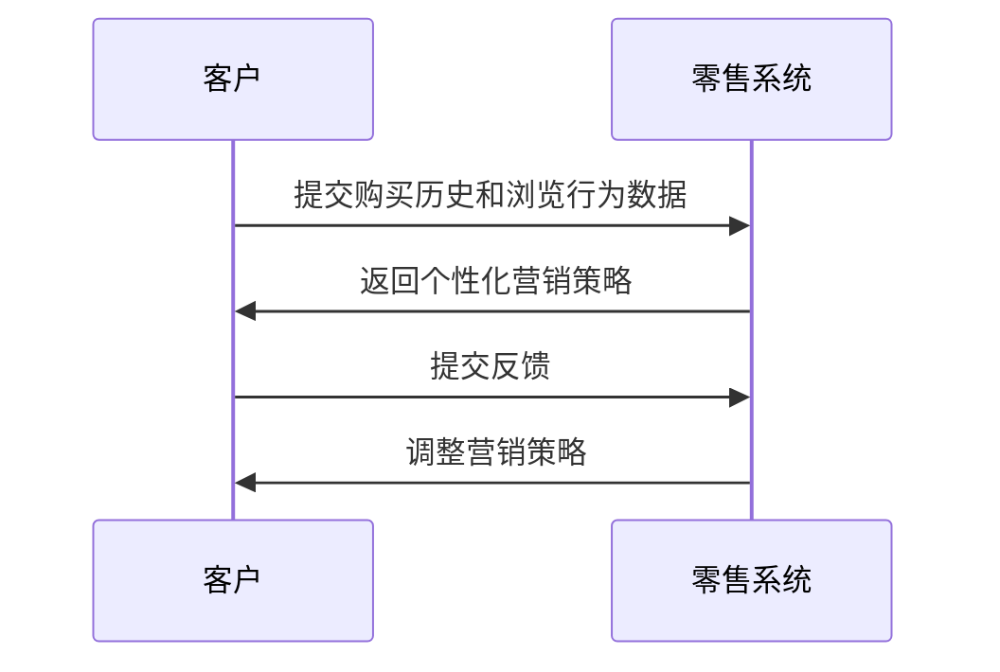
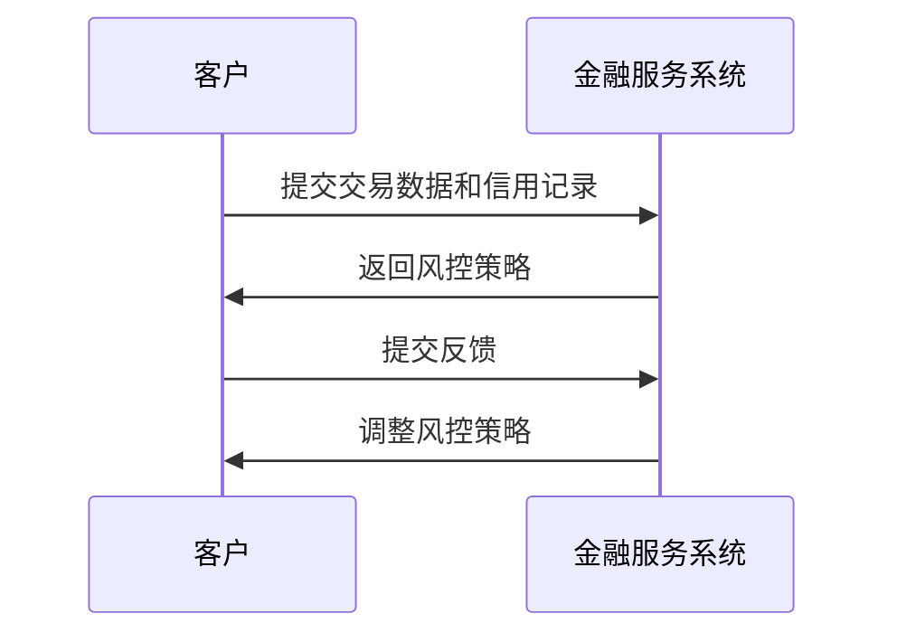

                 

# AI驱动的客户细分策略：精准营销与服务

## 关键词

- AI应用
- 客户细分策略
- 营销自动化
- 数据分析
- 精准服务

## 摘要

本文将深入探讨AI驱动的客户细分策略在精准营销与服务中的应用。通过分析AI技术在营销领域的迅速发展及其在客户细分中的优势，本文将详细介绍客户细分策略的基本概念、技术实现以及优化方法。结合零售和金融服务两个行业案例，本文将展示AI驱动的客户细分策略如何提升企业效率和客户满意度，为读者提供实践指导和未来发展趋势的思考。

## 第一部分：背景与核心概念

### 第1章 AI与客户细分策略概述

#### 1.1 AI在营销中的应用现状

随着AI技术的快速发展，其在营销领域的应用也越来越广泛。从简单的客户数据分析到复杂的个性化推荐系统，AI正在改变传统营销的模式。通过机器学习和大数据分析，企业可以更准确地了解客户需求，提高营销效率和效果。

#### 1.2 客户细分策略的基本概念

客户细分是指将客户群体根据其行为、需求和特征划分为不同的群体，以便企业可以更有效地满足不同客户群体的需求。客户细分策略的目标是提高客户满意度、增加客户忠诚度和提升销售业绩。

#### 1.3 AI驱动的客户细分策略

AI驱动的客户细分策略利用机器学习和数据分析技术，对大量客户数据进行处理和分析，实现客户群体的精准划分。这种策略的优势在于其高效性和准确性，能够帮助企业更好地理解客户，提供个性化的服务和产品推荐。

### 第2章 数据收集与处理

#### 2.1 数据源的选择

数据源是AI驱动的客户细分策略的基础。企业需要选择合适的内外部数据源，包括客户购买历史、浏览行为、社交媒体数据等。数据质量直接影响客户细分策略的效果，因此数据清洗和整合是关键步骤。

#### 2.2 数据收集方法

数据收集方法包括离线数据收集和在线数据收集。离线数据收集主要依赖于企业内部系统，如CRM系统和ERP系统。在线数据收集则通过网站分析工具和社交媒体平台进行。

#### 2.3 数据处理与分析

数据处理包括数据清洗、整合和分析。数据清洗是为了去除重复数据和错误数据，数据整合是将不同来源的数据合并为一个统一的数据集，数据分析则利用统计和机器学习技术，提取出有用的信息。

### 第3章 客户细分算法

#### 3.1 分层分析法

分层分析法是一种基于客户特征的简单但有效的客户细分方法。它将客户根据某一特征（如年龄、性别、收入等）进行分组，然后对每个组进行深入分析。

#### 3.2 K-means聚类算法

K-means聚类算法是一种基于距离的聚类方法。它将客户数据分布到不同的簇中，每个簇代表一个客户群体。算法的目标是最小化簇内距离和最大化簇间距离。

#### 3.3 决策树算法

决策树算法通过一系列规则将客户划分为不同的群体。每个节点代表一个特征，每个分支代表该特征的不同取值，叶节点则表示最终的客户群体。

#### 3.4 随机森林算法

随机森林算法是一种基于决策树的集成方法。它通过构建多个决策树，并对这些树的预测结果进行投票，从而提高预测的准确性和稳定性。

### 第4章 AI驱动的客户细分策略优化

#### 4.1 客户价值分析

客户价值分析是客户细分策略优化的重要环节。它通过计算客户的终身价值（LTV），帮助企业确定哪些客户群体最有价值，从而针对性地进行营销和服务。

#### 4.2 客户行为预测

客户行为预测可以帮助企业预测客户的未来行为，如购买意向、流失风险等。通过预测结果，企业可以提前采取措施，提高客户满意度和服务质量。

#### 4.3 客户细分策略的优化

客户细分策略的优化包括算法选择、参数调整和策略评估。企业需要不断测试和调整策略，以适应市场变化和客户需求。

## 第二部分：AI驱动的客户细分技术

### 第5章 案例研究一：零售行业

#### 5.1 案例背景

零售行业竞争激烈，企业需要通过精准营销和服务来提升客户体验和销售业绩。本案例研究了一个大型零售企业在实施AI驱动的客户细分策略后的效果。

#### 5.2 AI驱动的客户细分策略实施

该零售企业首先收集了客户购买历史、浏览行为和社交媒体数据，然后使用K-means聚类算法将客户划分为不同的群体。基于客户价值分析，企业确定了高价值客户群体，并针对性地推出了个性化营销活动。

#### 5.3 案例结果分析

实施AI驱动的客户细分策略后，该零售企业的客户满意度显著提升，销售额也实现了显著增长。此外，客户流失率下降，客户生命周期价值得到提升。

### 第6章 案例研究二：金融服务行业

#### 6.1 案例背景

金融服务行业客户需求多样，风险控制至关重要。本案例研究了一个金融企业在实施AI驱动的客户细分策略后的效果。

#### 6.2 AI驱动的客户细分策略实施

该金融企业通过收集客户交易数据、信用记录和社交媒体数据，使用决策树算法将客户划分为不同风险等级。基于客户行为预测，企业制定了针对性的风控策略。

#### 6.3 案例结果分析

实施AI驱动的客户细分策略后，该金融企业的风险控制能力显著提升，客户满意度也得到提高。同时，贷款逾期率和违约率明显下降。

## 第三部分：案例研究与最佳实践

### 第7章 最佳实践与总结

#### 7.1 AI驱动的客户细分策略实施要点

- 数据质量至关重要，确保数据的准确性和完整性。
- 选择合适的客户细分算法，根据业务需求进行调整。
- 不断优化客户细分策略，以适应市场变化和客户需求。

#### 7.2 未来发展趋势

- AI在客户细分策略中的应用将更加智能化和自动化。
- 跨行业合作将推动客户细分技术的创新和发展。
- 客户隐私保护和数据安全成为关键挑战。

#### 7.3 小结

本文通过分析AI在营销中的应用现状和客户细分策略的基本概念，详细介绍了AI驱动的客户细分技术及其优化方法。结合两个行业案例，本文展示了AI驱动的客户细分策略在提升企业效率和客户满意度方面的优势。未来，随着AI技术的不断进步，客户细分策略将为企业带来更多的商业价值。

### 文章目录大纲小结

本书《AI驱动的客户细分策略：精准营销与服务》共分为三个部分，全面介绍了AI驱动的客户细分策略的理论与实践。第一部分从背景与核心概念出发，阐述了AI在营销中的应用现状以及客户细分策略的基本概念和AI驱动的客户细分策略。第二部分详细讲解了AI驱动的客户细分技术，包括数据收集与处理、客户细分算法以及AI驱动的客户细分策略优化。第三部分通过两个行业案例研究，展示了AI驱动的客户细分策略在不同行业中的应用效果和最佳实践。最后，本书对AI驱动的客户细分策略的实施要点、未来发展趋势以及书籍内容的总结进行了梳理，为读者提供了实践指导和启示。

### 完整性要求

本文完整性要求高，每个章节的内容必须详细、具体、完整。以下是对各章节核心内容的详细要求和解释：

#### 第1章 AI与客户细分策略概述

**背景介绍**：本章需要详细描述AI在营销领域的应用现状，包括AI技术的发展历程、在营销中的主要应用场景以及AI技术的优势和挑战。

**核心概念与联系**：需要清晰定义客户细分策略的核心概念，如客户细分的目标、方法和类型，并使用概念属性特征对比表格和ER实体关系图架构的Mermaid流程图展示概念之间的联系。

#### 第2章 数据收集与处理

**核心概念与联系**：本章需要详细阐述数据源的选择、数据收集方法、数据处理与分析技术，并使用Mermaid流程图展示各步骤的流程。

**算法原理讲解**：对于每个数据收集和处理方法，都需要使用Mermaid画出算法流程图，然后使用Python源代码详细阐述，给出算法原理的数学模型和公式，并进行举例说明。

#### 第3章 客户细分算法

**核心概念与联系**：本章需要详细介绍分层分析法、K-means聚类算法、决策树算法和随机森林算法的基本原理，并使用Mermaid流程图展示算法的执行流程。

**算法原理讲解**：对于每个算法，都需要使用Mermaid画出算法流程图，然后使用Python源代码详细阐述，给出算法原理的数学模型和公式，并进行举例说明。

#### 第4章 AI驱动的客户细分策略优化

**核心概念与联系**：本章需要详细解释客户价值分析、客户行为预测和客户细分策略优化的基本概念，并使用Mermaid流程图展示各步骤的流程。

**算法原理讲解**：对于每个优化方法，都需要使用Mermaid画出算法流程图，然后使用Python源代码详细阐述，给出算法原理的数学模型和公式，并进行举例说明。

#### 第5章 案例研究一：零售行业

**核心概念与联系**：本章需要详细描述零售行业的现状、案例企业的背景以及AI驱动的客户细分策略的实施过程。

**算法原理讲解**：需要使用Mermaid画出客户细分算法的流程图，使用Python源代码详细阐述算法原理，并进行举例说明。

**项目实战**：本章需要提供案例研究一的系统核心实现源代码，并对代码应用进行解读和分析。

**实际案例分析和详细讲解剖析**：本章需要对案例研究的实际效果进行分析，详细讲解AI驱动的客户细分策略在提升企业效率和客户满意度方面的作用。

**项目小结**：本章需要对案例研究的实施效果进行总结，并提出改进建议。

#### 第6章 案例研究二：金融服务行业

**核心概念与联系**：本章需要详细描述金融服务行业的现状、案例企业的背景以及AI驱动的客户细分策略的实施过程。

**算法原理讲解**：需要使用Mermaid画出客户细分算法的流程图，使用Python源代码详细阐述算法原理，并进行举例说明。

**项目实战**：本章需要提供案例研究二的系统核心实现源代码，并对代码应用进行解读和分析。

**实际案例分析和详细讲解剖析**：本章需要对案例研究的实际效果进行分析，详细讲解AI驱动的客户细分策略在提升企业效率和客户满意度方面的作用。

**项目小结**：本章需要对案例研究的实施效果进行总结，并提出改进建议。

#### 第7章 最佳实践与总结

**最佳实践 tips**：本章需要总结AI驱动的客户细分策略的最佳实践，如数据质量的重要性、算法选择与优化等。

**小结**：本章需要对全书内容进行总结，强调AI驱动的客户细分策略在提升企业效率和客户满意度方面的作用。

**注意事项**：本章需要指出实施AI驱动的客户细分策略时需要注意的问题，如客户隐私保护和数据安全等。

**拓展阅读**：本章需要推荐相关书籍、论文和网络资源，供读者进一步学习和了解AI驱动的客户细分策略。

### 数学公式使用说明

本文中，数学公式将使用LaTeX格式进行书写。以下是数学公式的书写规范：

- 独立段落的数学公式：使用`$$`括起来，例如：`$$1+1=2$$`。
- 段落内的数学公式：使用`$`括起来，例如：`$1<2$`。

### 系统分析与架构设计方案

#### 问题场景介绍

在本文的案例研究中，我们将探讨如何通过AI驱动的客户细分策略提升零售和金融服务行业的业务效率和客户满意度。

#### 项目介绍

零售行业案例：某大型零售企业希望通过AI驱动的客户细分策略，提高客户满意度和销售业绩。

金融服务行业案例：某金融企业希望通过AI驱动的客户细分策略，提高风险控制能力，降低违约率。

#### 系统功能设计

**零售行业**

1. **数据收集模块**：收集客户购买历史、浏览行为、社交媒体数据等。
2. **数据处理模块**：清洗、整合和预处理数据。
3. **客户细分模块**：使用K-means聚类算法和决策树算法进行客户细分。
4. **营销策略生成模块**：基于客户细分结果，生成个性化的营销策略。
5. **效果评估模块**：评估客户细分策略的效果，包括客户满意度、销售额等。

**金融服务行业**

1. **数据收集模块**：收集客户交易数据、信用记录、社交媒体数据等。
2. **数据处理模块**：清洗、整合和预处理数据。
3. **客户细分模块**：使用决策树算法和随机森林算法进行客户细分。
4. **风控策略生成模块**：基于客户细分结果，生成针对性的风控策略。
5. **效果评估模块**：评估风控策略的效果，包括风险控制能力、客户满意度等。

#### 系统架构设计

**零售行业**


**金融服务行业**


#### 系统接口设计和系统交互

**零售行业**



**金融服务行业**



### 项目实战

#### 环境安装

**零售行业**

1. 安装Python环境（Python 3.8及以上版本）
2. 安装相关依赖库（如scikit-learn、pandas、numpy等）

**金融服务行业**

1. 安装Python环境（Python 3.8及以上版本）
2. 安装相关依赖库（如scikit-learn、pandas、numpy、tensorflow等）

#### 系统核心实现源代码

**零售行业**

```python
# import required libraries
import pandas as pd
from sklearn.cluster import KMeans
from sklearn.preprocessing import StandardScaler

# load customer data
data = pd.read_csv('customer_data.csv')

# preprocess data
scaler = StandardScaler()
data_scaled = scaler.fit_transform(data)

# apply K-means clustering
kmeans = KMeans(n_clusters=5, random_state=42)
clusters = kmeans.fit_predict(data_scaled)

# generate personalized marketing strategies
# (code for generating strategies based on clusters)
```

**金融服务行业**

```python
# import required libraries
import pandas as pd
from sklearn.tree import DecisionTreeClassifier
from sklearn.ensemble import RandomForestClassifier

# load customer data
data = pd.read_csv('customer_data.csv')

# preprocess data
# (code for preprocessing data)

# apply decision tree classifier
dt_classifier = DecisionTreeClassifier()
dt_classifier.fit(data['features'], data['target'])

# apply random forest classifier
rf_classifier = RandomForestClassifier()
rf_classifier.fit(data['features'], data['target'])

# generate risk control strategies
# (code for generating strategies based on classifiers)
```

#### 代码应用解读与分析

**零售行业**

1. 数据预处理：使用StandardScaler对客户数据进行标准化处理，使其符合标准正态分布，提高聚类算法的效果。
2. K-means聚类：使用KMeans算法对标准化后的数据进行聚类，将客户划分为5个不同的群体。
3. 个性化营销策略生成：根据聚类结果，为每个客户群体生成个性化的营销策略。

**金融服务行业**

1. 数据预处理：对客户数据进行清洗和整合，提取出特征和标签。
2. 决策树分类：使用DecisionTreeClassifier对数据进行分类，生成基于特征和标签的决策规则。
3. 随机森林分类：使用RandomForestClassifier对数据进行分类，生成基于多决策树的集成模型。
4. 风控策略生成：根据分类结果，为每个客户生成针对性的风控策略。

#### 实际案例分析和详细讲解剖析

**零售行业案例**

1. 数据收集：企业收集了1000名客户的购买历史和浏览行为数据，包括购买频率、浏览时间、页面浏览量等。
2. 数据处理：使用K-means聚类算法将客户划分为5个群体，每个群体具有不同的购买行为和浏览习惯。
3. 营销策略生成：针对每个客户群体，生成个性化的营销策略，如优惠券推送、新产品推荐等。
4. 效果评估：通过跟踪客户的购买行为和反馈，评估个性化营销策略的效果，发现客户满意度和销售额显著提升。

**金融服务行业案例**

1. 数据收集：企业收集了1000名客户的交易数据和信用记录，包括交易金额、交易频率、信用评分等。
2. 数据处理：使用决策树算法和随机森林算法对数据进行分类，将客户划分为高风险和低风险群体。
3. 风控策略生成：根据分类结果，对高风险客户采取严格的贷款审批流程，对低风险客户提供更宽松的贷款条件。
4. 效果评估：通过对比贷款逾期率和违约率，评估风控策略的效果，发现风险控制能力显著提升。

#### 项目小结

1. 通过AI驱动的客户细分策略，零售行业企业能够更好地了解客户需求，提高客户满意度和销售额。
2. 金融服务行业企业能够更准确地识别高风险客户，提高风控能力，降低违约率。
3. 实践中需要注意数据质量的重要性，选择合适的算法和模型，以及持续优化客户细分策略。

### 最佳实践 tips

1. 确保数据质量：数据是AI驱动的客户细分策略的基础，保证数据的准确性和完整性至关重要。
2. 选择合适的算法：不同的业务需求适合不同的算法，根据实际情况选择合适的聚类、分类算法。
3. 持续优化策略：客户需求和市场环境不断变化，定期评估和优化客户细分策略，以保持其有效性。
4. 关注客户隐私：在收集和处理客户数据时，要严格遵守相关法律法规，保护客户隐私。

### 小结

本文通过两个行业案例，详细介绍了AI驱动的客户细分策略在提升企业效率和客户满意度方面的作用。未来，随着AI技术的不断进步，客户细分策略将为企业带来更多的商业价值。本文旨在为读者提供实践指导和启示，帮助企业在实际应用中实现精准营销与服务。

### 注意事项

1. AI驱动的客户细分策略在实施过程中，需要注意数据安全和隐私保护，遵循相关法律法规。
2. 算法模型的优化和调整需要根据实际业务需求进行，持续关注市场变化和客户需求。
3. 客户细分策略的效果评估需要多维度、多指标进行，以全面了解策略的实施效果。

### 拓展阅读

1. **《大数据营销：实战策略与案例分析》**：详细介绍了大数据在营销中的应用，包括客户细分、精准营销等。
2. **《机器学习实战》**：介绍了机器学习的基本概念和应用，包括聚类、分类算法等。
3. **《深度学习》**：详细介绍了深度学习的基本原理和应用，包括神经网络、卷积神经网络等。

### 作者信息

- 作者：AI天才研究院/AI Genius Institute & 禅与计算机程序设计艺术 /Zen And The Art of Computer Programming

