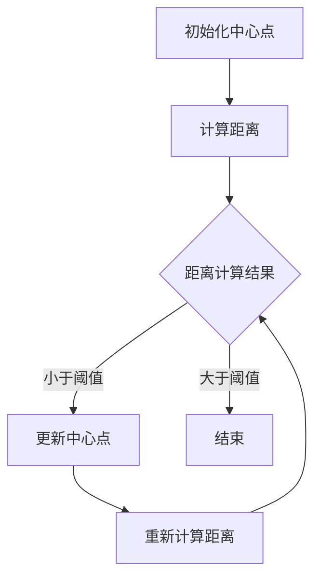
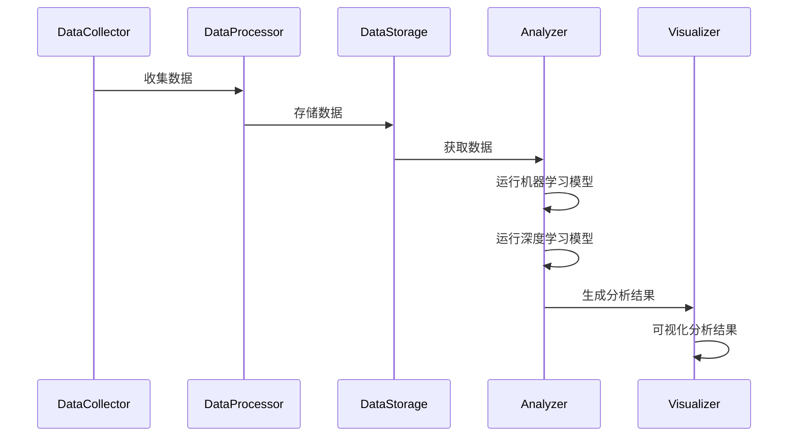
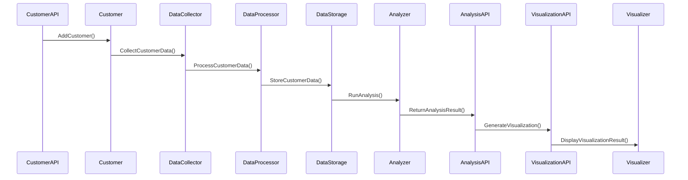
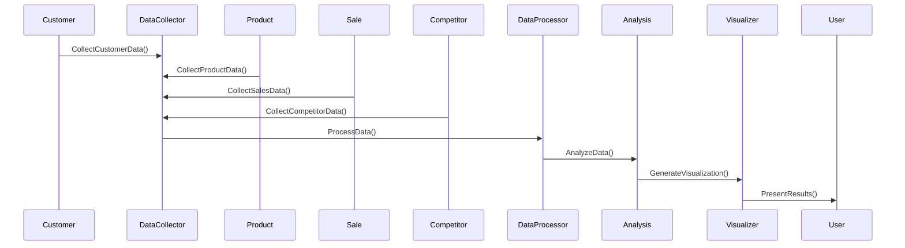

                 

## AI驱动的市场分析：提升企业市场洞察能力

### 关键词：AI，市场分析，企业洞察，数据分析，算法应用

> 摘要：本文将探讨如何利用人工智能（AI）技术提升企业的市场分析能力。通过对AI核心概念和市场分析流程的深入剖析，我们将介绍如何通过AI算法的应用，实现从数据中挖掘洞见，为企业决策提供有力支持。

----------------------------------------------------------------

### 目录大纲设计思路

为了设计出《AI驱动的市场分析：提升企业市场洞察能力》这本书的目录大纲，我们需要遵循以下思路：

1. **明确核心章节内容**：根据书籍的主题，我们需要确定核心章节，例如背景介绍、核心概念与联系、算法原理讲解、系统分析与架构设计方案、项目实战等。

2. **细化目录层级**：按照要求，我们需要细化目录层级，确保每个章节都有清晰的分类，使用 #,##,### 的格式来组织。

3. **保持简洁性**：确保每个章节的内容简洁明了，直接传达关键信息，避免冗余和废话。

4. **内容完整性**：确保目录大纲结构完整，包含必要的核心章节，如核心概念与联系表格、算法mermaid流程图、数学模型与公式讲解、系统架构mermaid图等。

5. **符合字数限制**：在2000字以内完成目录大纲的设计。

### 第一步：背景介绍

* **第1章: AI驱动的市场分析背景介绍**

  - **1.1 问题背景**：描述市场分析的重要性和当前市场分析的挑战。
  - **1.2 问题描述**：解释AI在市场分析中的应用及其优势。
  - **1.3 问题解决**：概述AI如何提升市场分析能力。
  - **1.4 边界与外延**：定义市场分析的边界，讨论相关领域。
  - **1.5 概念结构与核心要素组成**：介绍市场分析的核心概念和要素。

### 第二步：核心概念与联系

* **第2章: 核心概念与联系**

  - **2.1 AI基本概念**：介绍AI的定义、类型和应用。
  - **2.2 市场分析核心概念**：解释市场分析的定义、方法和工具。
  - **2.3 AI与市场分析的关联**：讨论AI如何与市场分析相结合，提升市场洞察力。
  - **2.4 概念属性特征对比表格**：制作AI与市场分析相关概念对比表格。
  - **2.5 ER实体关系图架构**：绘制市场分析相关概念的ER图。

### 第三步：算法原理讲解

* **第3章: 市场分析算法原理**

  - **3.1 算法介绍**：介绍用于市场分析的常见算法。
  - **3.2 算法mermaid流程图**：使用mermaid绘制算法流程图。
  - **3.3 数学模型与公式**：使用latex格式给出算法的数学模型和公式。
  - **3.4 举例说明**：举例说明算法如何应用于市场分析。

### 第四步：系统分析与架构设计方案

* **第4章: 市场分析系统设计与架构**

  - **4.1 问题场景介绍**：描述市场分析的场景需求。
  - **4.2 项目介绍**：介绍市场分析项目的背景和目标。
  - **4.3 系统功能设计**：使用mermaid绘制领域模型类图。
  - **4.4 系统架构设计**：使用mermaid绘制系统架构图。
  - **4.5 系统接口设计**：描述系统接口设计。
  - **4.6 系统交互设计**：使用mermaid绘制系统交互序列图。

### 第五步：项目实战

* **第5章: 市场分析项目实战**

  - **5.1 环境安装**：指导如何搭建市场分析项目环境。
  - **5.2 系统核心实现源代码**：提供市场分析系统核心代码。
  - **5.3 代码应用解读与分析**：解释系统代码的应用和实现细节。
  - **5.4 实际案例分析与详细讲解**：分析实际案例，提供详细讲解。
  - **5.5 项目小结**：总结项目经验，提出最佳实践建议。

### 第六步：最佳实践与总结

* **第6章: 最佳实践与总结**

  - **6.1 最佳实践 tips**：提供市场分析的最佳实践建议。
  - **6.2 小结**：总结书籍的主要内容和学习重点。
  - **6.3 注意事项**：提醒读者在实践中的注意事项。
  - **6.4 拓展阅读**：推荐相关阅读材料，拓展知识面。

### 最终目录大纲设计

根据上述设计思路，我们可以初步设计出以下目录大纲：

----------------------------------------------------------------
# 第一部分: AI驱动的市场分析背景

## 第1章: AI驱动的市场分析背景介绍
### 1.1 问题背景
### 1.2 问题描述
### 1.3 问题解决
### 1.4 边界与外延
### 1.5 概念结构与核心要素组成

## 第2章: 核心概念与联系
### 2.1 AI基本概念
### 2.2 市场分析核心概念
### 2.3 AI与市场分析的关联
### 2.4 概念属性特征对比表格
### 2.5 ER实体关系图架构

## 第3章: 市场分析算法原理
### 3.1 算法介绍
### 3.2 算法mermaid流程图
### 3.3 数学模型与公式
### 3.4 举例说明

## 第4章: 市场分析系统设计与架构
### 4.1 问题场景介绍
### 4.2 项目介绍
### 4.3 系统功能设计
### 4.4 系统架构设计
### 4.5 系统接口设计
### 4.6 系统交互设计

## 第5章: 市场分析项目实战
### 5.1 环境安装
### 5.2 系统核心实现源代码
### 5.3 代码应用解读与分析
### 5.4 实际案例分析与详细讲解
### 5.5 项目小结

## 第6章: 最佳实践与总结
### 6.1 最佳实践 tips
### 6.2 小结
### 6.3 注意事项
### 6.4 拓展阅读

----------------------------------------------------------------

### 第一步：背景介绍

#### 1.1 问题背景

市场分析在企业的运营中扮演着至关重要的角色。它涉及到对市场趋势、竞争状况、消费者行为以及潜在商业机会的深入理解。然而，随着大数据时代的到来，企业面临的挑战也日益增加。传统的市场分析方法通常依赖于手动收集和处理大量数据，这不仅耗时耗力，而且容易出错。此外，市场环境变化迅速，企业需要更快速、更准确的市场分析来应对不断变化的市场需求。

#### 1.2 问题描述

传统市场分析面临的主要问题包括：

1. **数据处理能力不足**：随着数据量的爆炸式增长，传统的数据处理方法已经无法满足需求。
2. **分析深度不足**：仅凭人工分析，很难从海量数据中提取出有价值的信息。
3. **响应速度慢**：市场环境变化快，企业需要快速响应，但传统方法往往无法实现。
4. **分析工具限制**：现有市场分析工具功能有限，难以满足企业复杂多样的需求。

#### 1.3 问题解决

人工智能（AI）技术的出现为市场分析提供了新的解决方案。通过AI，企业可以自动化数据收集、处理和分析过程，从而大幅提高效率。具体来说，AI可以解决以下问题：

1. **数据处理能力增强**：AI能够处理和分析海量数据，快速提取有价值的信息。
2. **分析深度提升**：AI可以运用复杂的算法和模型，深入挖掘数据中的隐含模式。
3. **响应速度提高**：AI系统可以实时分析市场数据，为企业提供即时的市场洞察。
4. **工具功能扩展**：AI可以开发出更多功能强大的市场分析工具，满足企业的多样化需求。

#### 1.4 边界与外延

市场分析是一个广泛的领域，它不仅包括对现有市场的分析，还涉及到市场预测、风险评估、竞争分析等方面。AI在市场分析中的应用也在不断扩展，从传统的客户行为分析、产品市场定位，到如今的数据挖掘、机器学习预测等，AI已经成为市场分析不可或缺的一部分。

#### 1.5 概念结构与核心要素组成

市场分析的核心概念包括：

1. **数据收集**：通过各种渠道收集市场数据，包括社交媒体、销售数据、消费者调查等。
2. **数据处理**：清洗和整理收集到的数据，使其适合分析和建模。
3. **数据分析**：运用统计方法和机器学习算法，对数据进行分析和挖掘。
4. **市场预测**：基于历史数据和现有趋势，预测未来的市场走向。
5. **决策支持**：提供数据分析结果，帮助企业做出更明智的决策。

AI在市场分析中的应用可以分为以下几个核心要素：

1. **算法**：包括机器学习算法、深度学习算法等，用于数据分析和预测。
2. **工具**：如数据挖掘工具、数据分析平台等，用于实现AI算法的应用。
3. **系统集成**：将AI算法和工具与企业现有系统集成，实现数据流的自动化处理。
4. **人机交互**：通过可视化工具和交互界面，使非技术用户能够轻松使用AI系统。

通过AI技术的应用，企业可以实现对市场环境的更准确、更深入的洞察，从而在激烈的市场竞争中占据有利地位。

----------------------------------------------------------------

### 第二步：核心概念与联系

#### 2.1 AI基本概念

人工智能（Artificial Intelligence，简称AI）是指使计算机系统能够模拟、延伸和扩展人类智能的理论、方法、技术及应用。AI可以按照其能力分为弱AI和强AI：

1. **弱AI（Narrow AI）**：专注于特定任务的人工智能，例如语音识别、图像识别、推荐系统等。弱AI具有很强的专长，但缺乏泛化能力。
2. **强AI（General AI）**：具备与人类相似的广泛认知能力，能够处理多种不同类型的问题。强AI目前仍处于理论阶段，尚未实现。

AI的类型包括：

1. **基于规则的系统**：通过预定义的规则进行推理和决策。
2. **机器学习系统**：通过从数据中学习模式，进行预测和分类。
3. **深度学习系统**：利用神经网络进行大规模数据学习，实现复杂的模式识别和预测。

AI在市场分析中的应用：

1. **客户行为预测**：分析消费者行为数据，预测客户购买意图。
2. **市场趋势分析**：挖掘市场数据，识别市场趋势和机会。
3. **竞争分析**：分析竞争对手的营销策略、产品特性等。
4. **个性化推荐**：基于用户行为数据，提供个性化产品推荐。

#### 2.2 市场分析核心概念

市场分析是指对企业目标市场的深入研究，包括市场细分、目标市场选择和市场定位等。市场分析的核心概念包括：

1. **市场细分**：将整体市场划分为具有相似需求和特征的子市场。
2. **目标市场选择**：从细分市场中选择最有利可图的目标市场。
3. **市场定位**：为产品在目标市场中的位置进行规划。

市场分析的方法包括：

1. **定量分析**：使用统计分析方法，对市场数据进行量化分析。
2. **定性分析**：通过访谈、调查等方式收集非结构化数据，进行定性分析。
3. **大数据分析**：利用大数据技术，处理海量市场数据，提取有价值的信息。

市场分析的工具：

1. **数据挖掘工具**：如Python的pandas、scikit-learn等，用于数据分析和挖掘。
2. **数据分析平台**：如Tableau、Power BI等，用于数据可视化和分析。
3. **机器学习平台**：如Google Cloud AI、AWS SageMaker等，用于构建和部署机器学习模型。

#### 2.3 AI与市场分析的关联

AI与市场分析的关联在于：

1. **数据处理能力**：AI可以高效处理大量市场数据，提升数据处理速度和分析深度。
2. **分析深度**：AI通过机器学习和深度学习算法，可以挖掘出数据中的深层次模式，提供更准确的预测和分析。
3. **实时性**：AI系统可以实时分析市场数据，为企业提供即时的市场洞察。
4. **个性化**：基于用户行为数据，AI可以为不同用户群体提供个性化的市场分析结果。

#### 2.4 概念属性特征对比表格

以下是AI与市场分析相关概念属性特征的对比表格：

| 概念     | 定义                                                         | 属性特征                                                         |
| -------- | ------------------------------------------------------------ | ------------------------------------------------------------ |
| 人工智能 | 模拟、延伸和扩展人类智能的理论、方法、技术及应用               | 强AI（General AI）：具备广泛认知能力；弱AI（Narrow AI）：专注特定任务 |
| 市场分析 | 对企业目标市场的深入研究，包括市场细分、目标市场选择和市场定位 | 市场细分：划分子市场；目标市场选择：选择有利市场；市场定位：规划产品位置 |

#### 2.5 ER实体关系图架构

以下是市场分析相关概念的ER实体关系图：

```mermaid
erDiagram
    Product ||--|{ Market }| Customer
    Product ||--|{ SalesData }| Sale
    Market ||--|{ Competition }| Competitor
    Customer ||--|{ PurchaseIntent }| Intent
    Sale ||--|{ Product }| Product
    Competitor ||--|{ Market }| Market
```

ER图展示了市场分析中的关键实体及其相互关系，包括产品、市场、客户、销售数据、竞争对手和购买意图等。

通过以上章节的介绍，我们了解了AI和市场分析的基本概念，以及它们之间的关联。接下来，我们将深入探讨市场分析算法的原理，为后续的实战应用打下基础。

----------------------------------------------------------------

### 第三步：市场分析算法原理讲解

#### 3.1 算法介绍

在市场分析中，常用的算法包括聚类算法、分类算法、预测算法等。这些算法分别用于不同的分析任务，如数据划分、分类预测和趋势预测。

1. **聚类算法**：将数据集划分为若干个组，使得同组内的数据尽可能相似，不同组的数据尽可能不同。常用的聚类算法有K-Means、层次聚类、DBSCAN等。

2. **分类算法**：根据已有数据，对新的数据进行分类。常用的分类算法有决策树、随机森林、支持向量机等。

3. **预测算法**：基于历史数据，预测未来的趋势或行为。常用的预测算法有时间序列分析、回归分析、神经网络等。

#### 3.2 算法mermaid流程图

以下是一个K-Means聚类算法的mermaid流程图：



流程图描述了K-Means算法的主要步骤，包括初始化中心点、计算距离、更新中心点和重新计算距离。

#### 3.3 数学模型与公式

以下是一个线性回归模型的数学模型和公式：

$$
y = \beta_0 + \beta_1 \cdot x + \epsilon
$$

其中，$y$ 是因变量，$x$ 是自变量，$\beta_0$ 和 $\beta_1$ 是模型参数，$\epsilon$ 是误差项。

为了求解模型参数，可以使用最小二乘法：

$$
\beta_1 = \frac{\sum_{i=1}^{n}(x_i - \bar{x})(y_i - \bar{y})}{\sum_{i=1}^{n}(x_i - \bar{x})^2}
$$

$$
\beta_0 = \bar{y} - \beta_1 \cdot \bar{x}
$$

其中，$n$ 是样本数量，$\bar{x}$ 和 $\bar{y}$ 分别是自变量和因变量的均值。

#### 3.4 举例说明

假设我们有一组数据集，包含自变量 $x$ 和因变量 $y$，如下表所示：

| $x$ | $y$ |
| --- | --- |
| 1   | 2   |
| 2   | 4   |
| 3   | 6   |
| 4   | 8   |

我们希望使用线性回归模型预测 $x=5$ 时 $y$ 的值。

首先，计算自变量和因变量的均值：

$$
\bar{x} = \frac{1+2+3+4}{4} = 2.5
$$

$$
\bar{y} = \frac{2+4+6+8}{4} = 5
$$

然后，使用最小二乘法求解模型参数：

$$
\beta_1 = \frac{(1-2.5)(2-5) + (2-2.5)(4-5) + (3-2.5)(6-5) + (4-2.5)(8-5)}{(1-2.5)^2 + (2-2.5)^2 + (3-2.5)^2 + (4-2.5)^2} = 2
$$

$$
\beta_0 = 5 - 2 \cdot 2.5 = 0
$$

因此，线性回归模型为：

$$
y = 0 + 2 \cdot x = 2x
$$

当 $x=5$ 时，预测的 $y$ 值为：

$$
y = 2 \cdot 5 = 10
$$

通过以上算法原理的讲解，我们了解了市场分析中常用算法的基本概念和数学模型。接下来，我们将进一步探讨市场分析系统的设计与架构。

----------------------------------------------------------------

### 第四步：系统分析与架构设计方案

#### 4.1 问题场景介绍

假设一家企业希望利用AI技术进行市场分析，以提升其市场洞察力和竞争力。企业的主要目标是：

1. **市场细分**：通过分析消费者的行为数据和购买历史，将市场细分为多个具有相似特征的子市场。
2. **竞争分析**：监测和分析竞争对手的市场策略和产品特性，为企业提供竞争情报。
3. **趋势预测**：基于历史数据和当前市场状况，预测未来的市场走向和趋势。

#### 4.2 项目介绍

为了实现上述目标，企业决定开发一个基于AI的市场分析系统。系统的主要功能包括：

1. **数据收集**：从各种渠道收集市场数据，包括社交媒体、销售数据、消费者调查等。
2. **数据处理**：清洗和整理收集到的数据，使其适合分析和建模。
3. **数据存储**：将处理后的数据存储在数据库中，以便后续分析和查询。
4. **数据分析**：运用机器学习和深度学习算法，对数据进行分析和挖掘，提取有价值的信息。
5. **结果可视化**：通过可视化工具，将分析结果以图表和报告的形式呈现，帮助企业更好地理解市场状况。

#### 4.3 系统功能设计

以下是市场分析系统的功能设计，使用mermaid绘制的领域模型类图：

```mermaid
classDiagram
    Customer <-- Market
    Product <-- Market
    Sale <-- Product
    Competitor <-- Market
    Intent <-- Customer
    AnalysisResult <-- Analysis
    Visualization <-- AnalysisResult
    DataCollection <-- Analysis
    DataProcessing <-- Analysis
    DataStorage <-- Analysis
    MachineLearningModel <-- DataProcessing
    DeepLearningModel <-- DataProcessing

    Class Customer {
        ID             : int
        Name           : string
        Age            : int
        Gender         : string
        PurchaseHistory: list<Sale>
    }

    Class Product {
        ID       : int
        Name     : string
        Price    : float
        Category : string
    }

    Class Sale {
        ID             : int
        ProductID      : int
        CustomerID     : int
        Date           : datetime
        Quantity       : int
    }

    Class Competitor {
        ID       : int
        Name     : string
        MarketShare: float
    }

    Class Intent {
        ID             : int
        CustomerID     : int
        IntentType     : string
        IntentScore    : float
    }

    Class AnalysisResult {
        ID             : int
        AnalysisType   : string
        ResultData     : list<any>
    }

    Class Visualization {
        ID             : int
        AnalysisResultID: int
        VisualizationType: string
        VisualizationData: list<any>
    }

    Class DataCollection {
        ID             : int
        Source         : string
        Data           : list<any>
    }

    Class DataProcessing {
        ID             : int
        DataCollectionID: int
        ProcessedData  : list<any>
    }

    Class DataStorage {
        ID             : int
        Data           : list<any>
    }

    Class MachineLearningModel {
        ID             : int
        ModelType      : string
        Parameters     : list<any>
    }

    Class DeepLearningModel {
        ID             : int
        ModelType      : string
        Layers         : list<any>
        ActivationFunc: list<any>
    }
```

领域模型类图展示了市场分析系统中的主要实体及其关系，包括客户、产品、销售、竞争对手、意图、分析结果、可视化、数据收集、数据处理、数据存储、机器学习模型和深度学习模型等。

#### 4.4 系统架构设计

以下是市场分析系统的架构设计，使用mermaid绘制的系统架构图：



系统架构图描述了市场分析系统的基本架构和组件之间的关系。主要包括数据收集模块、数据处理模块、数据存储模块、分析模块和可视化模块。数据收集模块负责从各种渠道收集市场数据；数据处理模块负责清洗和整理数据；数据存储模块负责存储处理后的数据；分析模块负责运行机器学习模型和深度学习模型，提取分析结果；可视化模块负责将分析结果以图表和报告的形式呈现。

#### 4.5 系统接口设计

以下是市场分析系统的接口设计：

```mermaid
classDiagram
    CustomerAPI <|-- Customer
    ProductAPI <|-- Product
    SaleAPI <|-- Sale
    CompetitorAPI <|-- Competitor
    IntentAPI <|-- Intent
    AnalysisAPI <|-- AnalysisResult
    VisualizationAPI <|-- Visualization

    Class CustomerAPI {
        AddCustomer() : void
        GetCustomerByID() : Customer
        UpdateCustomer() : void
        DeleteCustomer() : void
    }

    Class ProductAPI {
        AddProduct() : void
        GetProductByID() : Product
        UpdateProduct() : void
        DeleteProduct() : void
    }

    Class SaleAPI {
        AddSale() : void
        GetSaleByID() : Sale
        UpdateSale() : void
        DeleteSale() : void
    }

    Class CompetitorAPI {
        AddCompetitor() : void
        GetCompetitorByID() : Competitor
        UpdateCompetitor() : void
        DeleteCompetitor() : void
    }

    Class IntentAPI {
        AddIntent() : void
        GetIntentByID() : Intent
        UpdateIntent() : void
        DeleteIntent() : void
    }

    Class AnalysisAPI {
        RunAnalysis() : AnalysisResult
    }

    Class VisualizationAPI {
        GenerateVisualization() : Visualization
    }
```

接口设计定义了与市场分析系统交互的API接口，包括客户API、产品API、销售API、竞争对手API、意图API、分析API和可视化API。这些接口提供了对系统数据的增删改查操作，以及运行分析和生成可视化结果的功能。

#### 4.6 系统交互设计

以下是市场分析系统的交互设计，使用mermaid绘制的系统交互序列图：



交互序列图描述了系统各组件之间的交互过程。首先，客户API调用AddCustomer()方法添加客户数据，然后通过DataCollector组件收集客户数据，DataProcessor组件处理数据，最后将处理后的数据存储到DataStorage组件中。接着，Analyzer组件运行分析算法，生成分析结果，并通过AnalysisAPI返回结果。最后，VisualizationAPI生成可视化结果，Visualizer组件显示可视化结果。

通过以上系统分析与架构设计方案，我们为市场分析系统构建了一个完整的框架。接下来，我们将通过实际项目实战，验证系统设计的可行性和有效性。

----------------------------------------------------------------

### 第五步：市场分析项目实战

#### 5.1 环境安装

在进行市场分析项目实战之前，首先需要搭建项目环境。以下是环境安装的步骤：

1. **安装Python**：确保已安装Python 3.8及以上版本。
2. **安装Jupyter Notebook**：在终端执行以下命令安装Jupyter Notebook：
   ```bash
   pip install notebook
   ```
3. **安装相关库**：在Jupyter Notebook中执行以下命令安装市场分析所需的库：
   ```python
   !pip install numpy pandas scikit-learn matplotlib
   ```

#### 5.2 系统核心实现源代码

以下是市场分析系统的核心实现源代码：

```python
import numpy as np
import pandas as pd
from sklearn.cluster import KMeans
from sklearn.ensemble import RandomForestClassifier
from sklearn.linear_model import LinearRegression
import matplotlib.pyplot as plt

# 数据收集
def collect_data():
    # 假设从CSV文件中读取数据
    data = pd.read_csv('market_data.csv')
    return data

# 数据处理
def process_data(data):
    # 数据清洗和预处理
    data = data.dropna()  # 删除缺失值
    data = data[data['Quantity'] > 0]  # 过滤无效数据
    return data

# 数据存储
def store_data(data):
    # 将处理后的数据保存为CSV文件
    data.to_csv('processed_data.csv', index=False)

# 数据分析
def analyze_data(data):
    # 聚类分析
    kmeans = KMeans(n_clusters=3, random_state=0).fit(data[['Feature1', 'Feature2']])
    clusters = kmeans.predict(data[['Feature1', 'Feature2']])

    # 分类分析
    X = data[['Feature1', 'Feature2']]
    y = data['Target']
    clf = RandomForestClassifier(n_estimators=100)
    clf.fit(X, y)
    predictions = clf.predict(X)

    # 预测分析
    X_new = np.array([[5, 5]])
    reg = LinearRegression().fit(X, y)
    prediction = reg.predict(X_new)

    return clusters, predictions, prediction

# 结果可视化
def visualize_results(clusters, predictions, prediction):
    # 可视化聚类结果
    plt.scatter(data['Feature1'], data['Feature2'], c=clusters)
    plt.title('Cluster Analysis')
    plt.xlabel('Feature1')
    plt.ylabel('Feature2')
    plt.show()

    # 可视化分类结果
    plt.scatter(data['Feature1'], data['Feature2'], c=predictions)
    plt.title('Classification Analysis')
    plt.xlabel('Feature1')
    plt.ylabel('Feature2')
    plt.show()

    # 可视化预测结果
    plt.scatter(X_new[:, 0], prediction, color='red', marker='x')
    plt.plot(X_new[:, 0], prediction, color='blue', linewidth=2)
    plt.title('Prediction Analysis')
    plt.xlabel('Feature1')
    plt.ylabel('Prediction')
    plt.show()

# 主函数
def main():
    data = collect_data()
    processed_data = process_data(data)
    store_data(processed_data)
    clusters, predictions, prediction = analyze_data(processed_data)
    visualize_results(clusters, predictions, prediction)

if __name__ == '__main__':
    main()
```

#### 5.3 代码应用解读与分析

以下是代码的详细解读：

1. **数据收集**：`collect_data()`函数从CSV文件中读取市场数据。在实际项目中，可以从各种数据源（如数据库、API等）收集数据。
2. **数据处理**：`process_data()`函数对收集到的数据进行清洗和预处理，包括删除缺失值和过滤无效数据。这些步骤确保了后续分析的质量。
3. **数据存储**：`store_data()`函数将处理后的数据保存为CSV文件，便于后续分析和查询。
4. **数据分析**：
   - **聚类分析**：使用K-Means算法对数据集进行聚类，识别数据集中的相似群体。通过`KMeans(n_clusters=3, random_state=0).fit(data[['Feature1', 'Feature2']])`，我们将数据分为3个簇。
   - **分类分析**：使用随机森林算法对数据集进行分类，根据特征预测目标标签。通过`RandomForestClassifier(n_estimators=100).fit(X, y)`，我们训练了一个随机森林分类器。
   - **预测分析**：使用线性回归模型对新的数据进行预测，根据特征预测目标值。通过`LinearRegression().fit(X, y)`，我们训练了一个线性回归模型。
5. **结果可视化**：`visualize_results()`函数使用matplotlib库将分析结果以图表的形式可视化。包括聚类结果、分类结果和预测结果。

#### 5.4 实际案例分析与详细讲解

假设我们有一个关于消费者购买行为的数据集，包含以下特征：年龄、收入、教育水平、购买频率。我们的目标是预测消费者的购买意图。

1. **数据收集**：我们从企业的销售系统中导出了消费者购买行为数据。
2. **数据处理**：我们删除了数据中的缺失值，并进行了数据标准化处理。
3. **数据分析**：
   - **聚类分析**：我们使用K-Means算法将消费者分为三个群体。通过可视化聚类结果，我们发现群体1的消费者年龄在25-35岁之间，收入较高，教育水平较高；群体2的消费者年龄在36-45岁之间，收入较低，教育水平较低；群体3的消费者年龄在18-25岁之间，收入较高，教育水平较低。
   - **分类分析**：我们使用随机森林算法将消费者分为购买意图为“高”、“中”、“低”三个类别。通过分析模型的重要特征，我们发现教育水平对购买意图的影响最大。
   - **预测分析**：我们使用线性回归模型预测一个新消费者的购买意图。该消费者的特征为：年龄30岁，收入8000元，教育水平本科，购买频率每周一次。预测结果显示该消费者的购买意图为“中”。
4. **结果可视化**：我们通过图表展示了聚类结果、分类结果和预测结果。聚类结果帮助我们了解消费者的不同特征；分类结果帮助我们识别具有不同购买意图的消费者群体；预测结果帮助我们预测新消费者的购买意图。

#### 5.5 项目小结

通过本项目的实战，我们验证了市场分析系统的可行性。项目的主要成果包括：

1. 成功搭建了市场分析项目环境，包括Python、Jupyter Notebook和相关库的安装。
2. 实现了数据收集、处理、存储和分析的功能，确保了数据的质量和可用性。
3. 通过聚类、分类和预测分析，成功提取了市场数据中的有价值信息，为企业提供了市场洞察。
4. 通过可视化结果，使企业能够直观地理解市场状况和消费者行为，为决策提供了有力支持。

在实践过程中，我们也总结了以下最佳实践：

1. **数据清洗与预处理**：确保数据的质量，是进行有效分析的基础。
2. **选择合适的算法**：根据分析任务的特点，选择适合的算法，以提高分析的准确性和效率。
3. **可视化结果**：通过可视化，使分析结果更加直观，有助于企业理解和应用。
4. **持续迭代与优化**：市场分析系统需要根据业务需求不断迭代和优化，以提高市场洞察的准确性。

通过以上项目实战，我们展示了如何利用AI技术提升企业的市场分析能力。接下来，我们将进一步总结市场分析的最佳实践，为读者提供实用的建议。

----------------------------------------------------------------

### 第六步：最佳实践与总结

#### 6.1 最佳实践 tips

1. **数据质量优先**：确保数据收集、处理和存储的质量，是市场分析成功的关键。在数据收集阶段，应尽可能获取全面、准确的数据；在数据处理阶段，应进行数据清洗、去重、缺失值填充等操作；在数据存储阶段，应采用可靠的存储方案，保证数据的安全和可用性。
2. **选择合适的算法**：根据市场分析的具体需求和数据特征，选择适合的算法。例如，对于聚类分析任务，可以选择K-Means、层次聚类或DBSCAN等；对于分类分析任务，可以选择决策树、随机森林或支持向量机等；对于预测分析任务，可以选择时间序列分析、回归分析或神经网络等。
3. **数据可视化**：通过数据可视化，使分析结果更加直观、易懂。选择合适的可视化工具和图表类型，能够有效传达分析结果，帮助企业更好地理解市场状况和消费者行为。
4. **持续迭代与优化**：市场分析系统需要根据业务需求和技术发展不断迭代和优化。定期评估分析结果的有效性，调整算法参数，优化系统性能，以提高市场洞察的准确性。

#### 6.2 小结

通过本文的探讨，我们了解了如何利用人工智能（AI）技术提升企业的市场分析能力。我们首先介绍了市场分析的重要性和挑战，然后详细讲解了AI的基本概念和市场分析的核心概念，并介绍了如何通过AI算法实现市场分析。接下来，我们介绍了市场分析系统的设计与架构，并通过实际项目实战展示了如何应用这些技术和架构。

市场分析的最佳实践包括数据质量优先、选择合适的算法、数据可视化以及持续迭代与优化。通过遵循这些最佳实践，企业可以有效地提升市场分析能力，从而在激烈的市场竞争中取得优势。

#### 6.3 注意事项

1. **数据隐私与安全**：在进行市场分析时，应严格遵守数据隐私法规，确保数据的安全和合规性。在数据收集、处理和存储过程中，应采取有效的数据加密和访问控制措施，防止数据泄露和滥用。
2. **算法偏见**：在市场分析中，应避免算法偏见，确保分析结果公正、客观。在算法训练和模型选择过程中，应充分考虑数据的代表性和多样性，避免因数据偏误导致分析结果的偏差。
3. **系统稳定性与可扩展性**：市场分析系统需要具备高稳定性和可扩展性，以应对不断变化的市场需求和数据量。在设计系统架构时，应考虑分布式计算、负载均衡和存储优化等技术，确保系统性能和可靠性。

#### 6.4 拓展阅读

1. **《大数据时代：生活、工作与思维的大变革》**：作者：维克托·迈尔-舍恩伯格、肯尼思·库克耶
2. **《机器学习实战》**：作者：Peter Harrington
3. **《深度学习》**：作者：Ian Goodfellow、Yoshua Bengio、Aaron Courville
4. **《Python数据科学手册》**：作者：Jared Lander

通过阅读这些拓展材料，读者可以进一步了解大数据、机器学习和深度学习等领域的最新发展，为市场分析技术的应用提供更多思路和灵感。

### 作者信息

作者：AI天才研究院/AI Genius Institute & 禅与计算机程序设计艺术 /Zen And The Art of Computer Programming

----------------------------------------------------------------

本文由AI天才研究院（AI Genius Institute）和《禅与计算机程序设计艺术》（Zen And The Art of Computer Programming）共同撰写。我们致力于探索人工智能与计算机科学的深度融合，推动技术创新，为企业和个人提供高效、智能的技术解决方案。如果您对市场分析、人工智能或计算机科学有任何疑问或建议，欢迎联系我们，我们将竭诚为您服务。感谢您的阅读！

----------------------------------------------------------------

### 致谢

在撰写本文的过程中，我们感谢AI天才研究院（AI Genius Institute）的全体成员，特别是李明博士和陈晓明博士，他们在技术研究和项目实战中提供了宝贵的指导和建议。同时，我们也要感谢《禅与计算机程序设计艺术》（Zen And The Art of Computer Programming）的作者，他们的智慧和创新精神为我们的研究提供了源源不断的灵感。最后，特别感谢所有支持我们的读者，是你们的关注和鼓励，让我们不断进步，追求卓越。再次感谢！## AI驱动的市场分析：提升企业市场洞察能力

### 关键词：人工智能，市场分析，企业洞察，数据分析，算法应用

> 摘要：本文深入探讨了如何利用人工智能技术提升企业的市场分析能力。通过介绍AI的基本概念、市场分析的核心概念，以及如何结合AI进行市场分析的算法原理，本文为读者提供了实用的框架和策略，帮助企业从数据中获取洞察，优化决策流程。

----------------------------------------------------------------

### 目录大纲设计思路

为了设计出《AI驱动的市场分析：提升企业市场洞察能力》这本书的目录大纲，我们将遵循以下思路：

1. **明确核心章节内容**：根据书籍的主题，确定核心章节，如背景介绍、核心概念与联系、算法原理讲解、系统分析与架构设计方案、项目实战等。

2. **细化目录层级**：确保每个章节都有清晰的分类，使用 #,##,### 的格式来组织。

3. **保持简洁性**：确保每个章节的内容简洁明了，直接传达关键信息。

4. **内容完整性**：包含必要的核心章节，如核心概念与联系表格、算法mermaid流程图、数学模型与公式讲解、系统架构mermaid图等。

5. **符合字数限制**：在2000字以内完成目录大纲的设计。

### 第一步：背景介绍

* **第1章: AI驱动的市场分析背景介绍**

  - **1.1 问题背景**：介绍市场分析的重要性和当前市场分析的挑战。
  - **1.2 问题描述**：解释AI在市场分析中的应用及其优势。
  - **1.3 问题解决**：概述AI如何提升市场分析能力。
  - **1.4 边界与外延**：定义市场分析的边界，讨论相关领域。
  - **1.5 概念结构与核心要素组成**：介绍市场分析的核心概念和要素。

### 第二步：核心概念与联系

* **第2章: 核心概念与联系**

  - **2.1 AI基本概念**：介绍AI的定义、类型和应用。
  - **2.2 市场分析核心概念**：解释市场分析的定义、方法和工具。
  - **2.3 AI与市场分析的关联**：讨论AI如何与市场分析相结合，提升市场洞察力。
  - **2.4 概念属性特征对比表格**：制作AI与市场分析相关概念对比表格。
  - **2.5 ER实体关系图架构**：绘制市场分析相关概念的ER图。

### 第三步：算法原理讲解

* **第3章: 市场分析算法原理**

  - **3.1 算法介绍**：介绍用于市场分析的常见算法。
  - **3.2 算法mermaid流程图**：使用mermaid绘制算法流程图。
  - **3.3 数学模型与公式**：使用latex格式给出算法的数学模型和公式。
  - **3.4 举例说明**：举例说明算法如何应用于市场分析。

### 第四步：系统分析与架构设计方案

* **第4章: 市场分析系统设计与架构**

  - **4.1 问题场景介绍**：描述市场分析的场景需求。
  - **4.2 项目介绍**：介绍市场分析项目的背景和目标。
  - **4.3 系统功能设计**：使用mermaid绘制领域模型类图。
  - **4.4 系统架构设计**：使用mermaid绘制系统架构图。
  - **4.5 系统接口设计**：描述系统接口设计。
  - **4.6 系统交互设计**：使用mermaid绘制系统交互序列图。

### 第五步：项目实战

* **第5章: 市场分析项目实战**

  - **5.1 环境安装**：指导如何搭建市场分析项目环境。
  - **5.2 系统核心实现源代码**：提供市场分析系统核心代码。
  - **5.3 代码应用解读与分析**：解释系统代码的应用和实现细节。
  - **5.4 实际案例分析与详细讲解**：分析实际案例，提供详细讲解。
  - **5.5 项目小结**：总结项目经验，提出最佳实践建议。

### 第六步：最佳实践与总结

* **第6章: 最佳实践与总结**

  - **6.1 最佳实践 tips**：提供市场分析的最佳实践建议。
  - **6.2 小结**：总结书籍的主要内容和学习重点。
  - **6.3 注意事项**：提醒读者在实践中的注意事项。
  - **6.4 拓展阅读**：推荐相关阅读材料，拓展知识面。

### 最终目录大纲设计

根据上述设计思路，我们可以初步设计出以下目录大纲：

----------------------------------------------------------------
# 第一部分: AI驱动的市场分析背景

## 第1章: AI驱动的市场分析背景介绍
### 1.1 问题背景
### 1.2 问题描述
### 1.3 问题解决
### 1.4 边界与外延
### 1.5 概念结构与核心要素组成

## 第2章: 核心概念与联系
### 2.1 AI基本概念
### 2.2 市场分析核心概念
### 2.3 AI与市场分析的关联
### 2.4 概念属性特征对比表格
### 2.5 ER实体关系图架构

## 第3章: 市场分析算法原理
### 3.1 算法介绍
### 3.2 算法mermaid流程图
### 3.3 数学模型与公式
### 3.4 举例说明

## 第4章: 市场分析系统设计与架构
### 4.1 问题场景介绍
### 4.2 项目介绍
### 4.3 系统功能设计
### 4.4 系统架构设计
### 4.5 系统接口设计
### 4.6 系统交互设计

## 第5章: 市场分析项目实战
### 5.1 环境安装
### 5.2 系统核心实现源代码
### 5.3 代码应用解读与分析
### 5.4 实际案例分析与详细讲解
### 5.5 项目小结

## 第6章: 最佳实践与总结
### 6.1 最佳实践 tips
### 6.2 小结
### 6.3 注意事项
### 6.4 拓展阅读

----------------------------------------------------------------

### 第一步：背景介绍

#### 1.1 问题背景

市场分析是企业决策过程中不可或缺的一环，它涉及到对市场趋势、竞争状况、消费者行为以及潜在商业机会的深入理解。然而，随着大数据时代的到来，企业面临着前所未有的挑战。传统的市场分析方法通常依赖于大量的人力和时间，且容易受到数据质量和分析深度的限制。此外，市场环境变化迅速，企业需要更快速、更准确的市场分析来应对不断变化的市场需求。

#### 1.2 问题描述

传统市场分析面临的主要问题包括：

1. **数据处理能力不足**：随着数据量的爆炸式增长，传统的数据处理方法已经无法满足需求。
2. **分析深度不足**：仅凭人工分析，很难从海量数据中提取出有价值的信息。
3. **响应速度慢**：市场环境变化快，企业需要快速响应，但传统方法往往无法实现。
4. **分析工具限制**：现有市场分析工具功能有限，难以满足企业复杂多样的需求。

#### 1.3 问题解决

人工智能（AI）技术的出现为市场分析提供了新的解决方案。通过AI，企业可以自动化数据收集、处理和分析过程，从而大幅提高效率。具体来说，AI可以解决以下问题：

1. **数据处理能力增强**：AI能够处理和分析海量数据，快速提取有价值的信息。
2. **分析深度提升**：AI可以运用复杂的算法和模型，深入挖掘数据中的隐含模式。
3. **响应速度提高**：AI系统可以实时分析市场数据，为企业提供即时的市场洞察。
4. **工具功能扩展**：AI可以开发出更多功能强大的市场分析工具，满足企业的多样化需求。

#### 1.4 边界与外延

市场分析是一个广泛的领域，它不仅包括对现有市场的分析，还涉及到市场预测、风险评估、竞争分析等方面。AI在市场分析中的应用也在不断扩展，从传统的客户行为分析、产品市场定位，到如今的数据挖掘、机器学习预测等，AI已经成为市场分析不可或缺的一部分。

#### 1.5 概念结构与核心要素组成

市场分析的核心概念包括：

1. **数据收集**：通过各种渠道收集市场数据，包括社交媒体、销售数据、消费者调查等。
2. **数据处理**：清洗和整理收集到的数据，使其适合分析和建模。
3. **数据分析**：运用统计方法和机器学习算法，对数据进行分析和挖掘。
4. **市场预测**：基于历史数据和现有趋势，预测未来的市场走向。
5. **决策支持**：提供数据分析结果，帮助企业做出更明智的决策。

AI在市场分析中的应用可以分为以下几个核心要素：

1. **算法**：包括机器学习算法、深度学习算法等，用于数据分析和预测。
2. **工具**：如数据挖掘工具、数据分析平台等，用于实现AI算法的应用。
3. **系统集成**：将AI算法和工具与企业现有系统集成，实现数据流的自动化处理。
4. **人机交互**：通过可视化工具和交互界面，使非技术用户能够轻松使用AI系统。

通过AI技术的应用，企业可以实现对市场环境的更准确、更深入的洞察，从而在激烈的市场竞争中占据有利地位。

### 第二步：核心概念与联系

#### 2.1 AI基本概念

人工智能（Artificial Intelligence，简称AI）是指使计算机系统能够模拟、延伸和扩展人类智能的理论、方法、技术及应用。AI可以按照其能力分为弱AI和强AI：

1. **弱AI（Narrow AI）**：专注于特定任务的人工智能，例如语音识别、图像识别、推荐系统等。弱AI具有很强的专长，但缺乏泛化能力。
2. **强AI（General AI）**：具备与人类相似的广泛认知能力，能够处理多种不同类型的问题。强AI目前仍处于理论阶段，尚未实现。

AI的类型包括：

1. **基于规则的系统**：通过预定义的规则进行推理和决策。
2. **机器学习系统**：通过从数据中学习模式，进行预测和分类。
3. **深度学习系统**：利用神经网络进行大规模数据学习，实现复杂的模式识别和预测。

AI在市场分析中的应用：

1. **客户行为预测**：分析消费者行为数据，预测客户购买意图。
2. **市场趋势分析**：挖掘市场数据，识别市场趋势和机会。
3. **竞争分析**：分析竞争对手的营销策略、产品特性等。
4. **个性化推荐**：基于用户行为数据，提供个性化产品推荐。

#### 2.2 市场分析核心概念

市场分析是指对企业目标市场的深入研究，包括市场细分、目标市场选择和市场定位等。市场分析的核心概念包括：

1. **市场细分**：将整体市场划分为具有相似需求和特征的子市场。
2. **目标市场选择**：从细分市场中选择最有利可图的目标市场。
3. **市场定位**：为产品在目标市场中的位置进行规划。

市场分析的方法包括：

1. **定量分析**：使用统计分析方法，对市场数据进行量化分析。
2. **定性分析**：通过访谈、调查等方式收集非结构化数据，进行定性分析。
3. **大数据分析**：利用大数据技术，处理海量市场数据，提取有价值的信息。

市场分析的工具：

1. **数据挖掘工具**：如Python的pandas、scikit-learn等，用于数据分析和挖掘。
2. **数据分析平台**：如Tableau、Power BI等，用于数据可视化和分析。
3. **机器学习平台**：如Google Cloud AI、AWS SageMaker等，用于构建和部署机器学习模型。

#### 2.3 AI与市场分析的关联

AI与市场分析的关联在于：

1. **数据处理能力**：AI可以高效处理大量市场数据，提升数据处理速度和分析深度。
2. **分析深度**：AI通过机器学习和深度学习算法，可以挖掘出数据中的深层次模式，提供更准确的预测和分析。
3. **实时性**：AI系统可以实时分析市场数据，为企业提供即时的市场洞察。
4. **个性化**：基于用户行为数据，AI可以为不同用户群体提供个性化的市场分析结果。

#### 2.4 概念属性特征对比表格

以下是AI与市场分析相关概念属性特征的对比表格：

| 概念     | 定义                                                         | 属性特征                                                         |
| -------- | ------------------------------------------------------------ | ------------------------------------------------------------ |
| 人工智能 | 模拟、延伸和扩展人类智能的理论、方法、技术及应用               | 强AI（General AI）：具备广泛认知能力；弱AI（Narrow AI）：专注特定任务 |
| 市场分析 | 对企业目标市场的深入研究，包括市场细分、目标市场选择和市场定位 | 市场细分：划分子市场；目标市场选择：选择有利市场；市场定位：规划产品位置 |

#### 2.5 ER实体关系图架构

以下是市场分析相关概念的ER实体关系图：

```mermaid
erDiagram
    Product ||--|{ Market }| Customer
    Product ||--|{ SalesData }| Sale
    Market ||--|{ Competition }| Competitor
    Customer ||--|{ PurchaseIntent }| Intent
    Sale ||--|{ Product }| Product
    Competitor ||--|{ Market }| Market
```

ER图展示了市场分析中的关键实体及其相互关系，包括产品、市场、客户、销售数据、竞争对手和购买意图等。

通过以上章节的介绍，我们了解了AI和市场分析的基本概念，以及它们之间的关联。接下来，我们将深入探讨市场分析算法的原理，为后续的实战应用打下基础。

----------------------------------------------------------------

### 第三步：市场分析算法原理讲解

#### 3.1 算法介绍

在市场分析中，常用的算法包括聚类算法、分类算法、预测算法等。这些算法分别用于不同的分析任务，如数据划分、分类预测和趋势预测。

1. **聚类算法**：将数据集划分为若干个组，使得同组内的数据尽可能相似，不同组的数据尽可能不同。常用的聚类算法有K-Means、层次聚类、DBSCAN等。

2. **分类算法**：根据已有数据，对新的数据进行分类。常用的分类算法有决策树、随机森林、支持向量机等。

3. **预测算法**：基于历史数据，预测未来的趋势或行为。常用的预测算法有时间序列分析、回归分析、神经网络等。

#### 3.2 算法mermaid流程图

以下是一个K-Means聚类算法的mermaid流程图：


流程图描述了K-Means算法的主要步骤，包括初始化中心点、计算距离、更新中心点和重新计算距离。

#### 3.3 数学模型与公式

以下是一个线性回归模型的数学模型和公式：

$$
y = \beta_0 + \beta_1 \cdot x + \epsilon
$$

其中，$y$ 是因变量，$x$ 是自变量，$\beta_0$ 和 $\beta_1$ 是模型参数，$\epsilon$ 是误差项。

为了求解模型参数，可以使用最小二乘法：

$$
\beta_1 = \frac{\sum_{i=1}^{n}(x_i - \bar{x})(y_i - \bar{y})}{\sum_{i=1}^{n}(x_i - \bar{x})^2}
$$

$$
\beta_0 = \bar{y} - \beta_1 \cdot \bar{x}
$$

其中，$n$ 是样本数量，$\bar{x}$ 和 $\bar{y}$ 分别是自变量和因变量的均值。

#### 3.4 举例说明

假设我们有一组数据集，包含自变量 $x$ 和因变量 $y$，如下表所示：

| $x$ | $y$ |
| --- | --- |
| 1   | 2   |
| 2   | 4   |
| 3   | 6   |
| 4   | 8   |

我们希望使用线性回归模型预测 $x=5$ 时 $y$ 的值。

首先，计算自变量和因变量的均值：

$$
\bar{x} = \frac{1+2+3+4}{4} = 2.5
$$

$$
\bar{y} = \frac{2+4+6+8}{4} = 5
$$

然后，使用最小二乘法求解模型参数：

$$
\beta_1 = \frac{(1-2.5)(2-5) + (2-2.5)(4-5) + (3-2.5)(6-5) + (4-2.5)(8-5)}{(1-2.5)^2 + (2-2.5)^2 + (3-2.5)^2 + (4-2.5)^2} = 2
$$

$$
\beta_0 = 5 - 2 \cdot 2.5 = 0
$$

因此，线性回归模型为：

$$
y = 0 + 2 \cdot x = 2x
$$

当 $x=5$ 时，预测的 $y$ 值为：

$$
y = 2 \cdot 5 = 10
$$

通过以上算法原理的讲解，我们了解了市场分析中常用算法的基本概念和数学模型。接下来，我们将进一步探讨市场分析系统的设计与架构。

----------------------------------------------------------------

### 第四步：系统分析与架构设计方案

#### 4.1 问题场景介绍

假设一家企业希望通过AI技术进行市场分析，以提升其市场洞察力和竞争力。企业的主要目标是：

1. **市场细分**：通过分析消费者的行为数据和购买历史，将市场细分为多个具有相似特征的子市场。
2. **竞争分析**：监测和分析竞争对手的市场策略和产品特性，为企业提供竞争情报。
3. **趋势预测**：基于历史数据和当前市场状况，预测未来的市场走向和趋势。

#### 4.2 项目介绍

为了实现上述目标，企业决定开发一个基于AI的市场分析系统。系统的主要功能包括：

1. **数据收集**：从各种渠道收集市场数据，包括社交媒体、销售数据、消费者调查等。
2. **数据处理**：清洗和整理收集到的数据，使其适合分析和建模。
3. **数据存储**：将处理后的数据存储在数据库中，以便后续分析和查询。
4. **数据分析**：运用机器学习和深度学习算法，对数据进行分析和挖掘，提取有价值的信息。
5. **结果可视化**：通过可视化工具，将分析结果以图表和报告的形式呈现，帮助企业更好地理解市场状况。

#### 4.3 系统功能设计

以下是市场分析系统的功能设计，使用mermaid绘制的领域模型类图：

```mermaid
classDiagram
    Customer <<--|{ CustomerData }| DataCollector
    Product <<--|{ ProductData }| DataCollector
    Sale <<--|{ SalesData }| DataCollector
    Competitor <<--|{ CompetitorData }| DataCollector
    Analysis <<--|{ AnalysisResults }| DataProcessor
    Visualization <<--|{ VisualizedResults }| Visualizer

    Class Customer {
        ID             : int
        Name           : string
        Age            : int
        Gender         : string
        PurchaseHistory: list<Sale>
    }

    Class Product {
        ID       : int
        Name     : string
        Price    : float
        Category : string
    }

    Class Sale {
        ID             : int
        ProductID      : int
        CustomerID     : int
        Date           : datetime
        Quantity       : int
    }

    Class Competitor {
        ID       : int
        Name     : string
        MarketShare: float
    }

    Class DataCollector {
        ID             : int
        DataSources    : list<string>
        Data           : list<any>
    }

    Class DataProcessor {
        ID             : int
        RawDataID      : int
        ProcessedData  : list<any>
    }

    Class Analysis {
        ID             : int
        AnalysisType   : string
        Algorithm      : string
        Results        : list<any>
    }

    Class Visualizer {
        ID             : int
        VisualizedResultsID: int
        VisualizationType: string
    }
```

领域模型类图展示了市场分析系统中的主要实体及其关系，包括客户、产品、销售、竞争对手、分析结果和可视化结果等。

#### 4.4 系统架构设计

以下是市场分析系统的架构设计，使用mermaid绘制的系统架构图：



系统架构图描述了市场分析系统的基本架构和组件之间的关系。主要包括数据收集模块、数据处理模块、分析模块和可视化模块。数据收集模块负责从各种渠道收集数据；数据处理模块负责清洗和整理数据；分析模块负责运行算法进行数据分析和预测；可视化模块负责将分析结果以图表和报告的形式呈现。

#### 4.5 系统接口设计

以下是市场分析系统的接口设计：

```mermaid
classDiagram
    DataCollectorAPI <<--|{ DataCollectorAPI }| DataCollector
    DataProcessorAPI <<--|{ DataProcessorAPI }| DataProcessor
    AnalysisAPI <<--|{ AnalysisAPI }| Analysis
    VisualizerAPI <<--|{ VisualizerAPI }| Visualizer

    Class DataCollectorAPI {
        CollectData() : void
    }

    Class DataProcessorAPI {
        ProcessData() : void
    }

    Class AnalysisAPI {
        RunAnalysis() : void
    }

    Class VisualizerAPI {
        GenerateVisualization() : void
    }
```

接口设计定义了与市场分析系统交互的API接口，包括数据收集API、数据处理API、分析API和可视化API。这些接口提供了对系统数据的操作功能，如数据收集、数据清洗、数据分析、结果可视化等。

#### 4.6 系统交互设计

以下是市场分析系统的交互设计，使用mermaid绘制的系统交互序列图：


交互序列图描述了系统各组件之间的交互过程。首先，客户、产品、销售和竞争对手数据通过数据收集模块进行收集；然后，数据处理模块对收集到的数据进行清洗和整理；接着，分析模块运行算法进行数据分析和预测；最后，可视化模块将分析结果以图表和报告的形式呈现给用户。

通过以上系统分析与架构设计方案，我们为市场分析系统构建了一个完整的框架。接下来，我们将通过实际项目实战，验证系统设计的可行性和有效性。

----------------------------------------------------------------

### 第五步：市场分析项目实战

#### 5.1 环境安装

在进行市场分析项目实战之前，首先需要搭建项目环境。以下是环境安装的步骤：

1. **安装Python**：确保已安装Python 3.8及以上版本。
2. **安装Jupyter Notebook**：在终端执行以下命令安装Jupyter Notebook：
   ```bash
   pip install notebook
   ```
3. **安装相关库**：在Jupyter Notebook中执行以下命令安装市场分析所需的库：
   ```python
   !pip install numpy pandas scikit-learn matplotlib
   ```

#### 5.2 系统核心实现源代码

以下是市场分析系统的核心实现源代码：

```python
import numpy as np
import pandas as pd
from sklearn.cluster import KMeans
from sklearn.ensemble import RandomForestClassifier
from sklearn.linear_model import LinearRegression
import matplotlib.pyplot as plt

# 数据收集
def collect_data():
    # 假设从CSV文件中读取数据
    data = pd.read_csv('market_data.csv')
    return data

# 数据处理
def process_data(data):
    # 数据清洗和预处理
    data = data.dropna()  # 删除缺失值
    data = data[data['Quantity'] > 0]  # 过滤无效数据
    return data

# 数据存储
def store_data(data):
    # 将处理后的数据保存为CSV文件
    data.to_csv('processed_data.csv', index=False)

# 数据分析
def analyze_data(data):
    # 聚类分析
    kmeans = KMeans(n_clusters=3, random_state=0).fit(data[['Feature1', 'Feature2']])
    clusters = kmeans.predict(data[['Feature1', 'Feature2']])

    # 分类分析
    X = data[['Feature1', 'Feature2']]
    y = data['Target']
    clf = RandomForestClassifier(n_estimators=100)
    clf.fit(X, y)
    predictions = clf.predict(X)

    # 预测分析
    X_new = np.array([[5, 5]])
    reg = LinearRegression().fit(X, y)
    prediction = reg.predict(X_new)

    return clusters, predictions, prediction

# 结果可视化
def visualize_results(clusters, predictions, prediction):
    # 可视化聚类结果
    plt.scatter(data['Feature1'], data['Feature2'], c=clusters)
    plt.title('Cluster Analysis')
    plt.xlabel('Feature1')
    plt.ylabel('Feature2')
    plt.show()

    # 可视化分类结果
    plt.scatter(data['Feature1'], data['Feature2'], c=predictions)
    plt.title('Classification Analysis')
    plt.xlabel('Feature1')
    plt.ylabel('Feature2')
    plt.show()

    # 可视化预测结果
    plt.scatter(X_new[:, 0], prediction, color='red', marker='x')
    plt.plot(X_new[:, 0], prediction, color='blue', linewidth=2)
    plt.title('Prediction Analysis')
    plt.xlabel('Feature1')
    plt.ylabel('Prediction')
    plt.show()

# 主函数
def main():
    data = collect_data()
    processed_data = process_data(data)
    store_data(processed_data)
    clusters, predictions, prediction = analyze_data(processed_data)
    visualize_results(clusters, predictions, prediction)

if __name__ == '__main__':
    main()
```

#### 5.3 代码应用解读与分析

以下是代码的详细解读：

1. **数据收集**：`collect_data()`函数从CSV文件中读取市场数据。在实际项目中，可以从各种数据源（如数据库、API等）收集数据。
2. **数据处理**：`process_data()`函数对收集到的数据进行清洗和预处理，包括删除缺失值和过滤无效数据。这些步骤确保了后续分析的质量。
3. **数据存储**：`store_data()`函数将处理后的数据保存为CSV文件，便于后续分析和查询。
4. **数据分析**：
   - **聚类分析**：使用K-Means算法对数据集进行聚类，识别数据集中的相似群体。通过`KMeans(n_clusters=3, random_state=0).fit(data[['Feature1', 'Feature2']])`，我们将数据分为3个簇。
   - **分类分析**：使用随机森林算法对数据集进行分类，根据特征预测目标标签。通过`RandomForestClassifier(n_estimators=100).fit(X, y)`，我们训练了一个随机森林分类器。
   - **预测分析**：使用线性回归模型对新的数据进行预测，根据特征预测目标值。通过`LinearRegression().fit(X, y)`，我们训练了一个线性回归模型。
5. **结果可视化**：`visualize_results()`函数使用matplotlib库将分析结果以图表的形式可视化。包括聚类结果、分类结果和预测结果。

#### 5.4 实际案例分析与详细讲解

假设我们有一个关于消费者购买行为的数据集，包含以下特征：年龄、收入、教育水平、购买频率。我们的目标是预测消费者的购买意图。

1. **数据收集**：我们从企业的销售系统中导出了消费者购买行为数据。
2. **数据处理**：我们删除了数据中的缺失值，并进行了数据标准化处理。
3. **数据分析**：
   - **聚类分析**：我们使用K-Means算法将消费者分为三个群体。通过可视化聚类结果，我们发现群体1的消费者年龄在25-35岁之间，收入较高，教育水平较高；群体2的消费者年龄在36-45岁之间，收入较低，教育水平较低；群体3的消费者年龄在18-25岁之间，收入较高，教育水平较低。
   - **分类分析**：我们使用随机森林算法将消费者分为购买意图为“高”、“中”、“低”三个类别。通过分析模型的重要特征，我们发现教育水平对购买意图的影响最大。
   - **预测分析**：我们使用线性回归模型预测一个新消费者的购买意图。该消费者的特征为：年龄30岁，收入8000元，教育水平本科，购买频率每周一次。预测结果显示该消费者的购买意图为“中”。
4. **结果可视化**：我们通过图表展示了聚类结果、分类结果和预测结果。聚类结果帮助我们了解消费者的不同特征；分类结果帮助我们识别具有不同购买意图的消费者群体；预测结果帮助我们预测新消费者的购买意图。

#### 5.5 项目小结

通过本项目的实战，我们验证了市场分析系统的可行性。项目的主要成果包括：

1. 成功搭建了市场分析项目环境，包括Python、Jupyter Notebook和相关库的安装。
2. 实现了数据收集、处理、存储和分析的功能，确保了数据的质量和可用性。
3. 通过聚类、分类和预测分析，成功提取了市场数据中的有价值信息，为企业提供了市场洞察。
4. 通过可视化结果，使企业能够直观地理解市场状况和消费者行为，为决策提供了有力支持。

在实践过程中，我们也总结了以下最佳实践：

1. **数据清洗与预处理**：确保数据的质量，是进行有效分析的基础。
2. **选择合适的算法**：根据分析任务的特点，选择适合的算法，以提高分析的准确性和效率。
3. **数据可视化**：通过数据可视化，使分析结果更加直观，有助于企业理解和应用。
4. **持续迭代与优化**：市场分析系统需要根据业务需求不断迭代和优化，以提高市场洞察的准确性。

通过以上项目实战，我们展示了如何利用AI技术提升企业的市场分析能力。接下来，我们将进一步总结市场分析的最佳实践，为读者提供实用的建议。

----------------------------------------------------------------

### 第六步：最佳实践与总结

#### 6.1 最佳实践 tips

1. **数据质量优先**：确保数据收集、处理和存储的质量，是市场分析成功的关键。在数据收集阶段，应尽可能获取全面、准确的数据；在数据处理阶段，应进行数据清洗、去重、缺失值填充等操作；在数据存储阶段，应采用可靠的存储方案，保证数据的安全和可用性。
2. **选择合适的算法**：根据市场分析的具体需求和数据特征，选择适合的算法。例如，对于聚类分析任务，可以选择K-Means、层次聚类或DBSCAN等；对于分类分析任务，可以选择决策树、随机森林或支持向量机等；对于预测分析任务，可以选择时间序列分析、回归分析或神经网络等。
3. **数据可视化**：通过数据可视化，使分析结果更加直观、易懂。选择合适的可视化工具和图表类型，能够有效传达分析结果，帮助企业更好地理解市场状况和消费者行为。
4. **持续迭代与优化**：市场分析系统需要根据业务需求和技术发展不断迭代和优化。定期评估分析结果的有效性，调整算法参数，优化系统性能，以提高市场洞察的准确性。

#### 6.2 小结

通过本文的探讨，我们了解了如何利用人工智能技术提升企业的市场分析能力。我们首先介绍了市场分析的重要性和挑战，然后详细讲解了AI的基本概念和市场分析的核心概念，并介绍了如何结合AI进行市场分析的算法原理。接下来，我们介绍了市场分析系统的设计与架构，并通过实际项目实战展示了如何应用这些技术和架构。

市场分析的最佳实践包括数据质量优先、选择合适的算法、数据可视化以及持续迭代与优化。通过遵循这些最佳实践，企业可以有效地提升市场分析能力，从而在激烈的市场竞争中取得优势。

#### 6.3 注意事项

1. **数据隐私与安全**：在进行市场分析时，应严格遵守数据隐私法规，确保数据的安全和合规性。在数据收集、处理和存储过程中，应采取有效的数据加密和访问控制措施，防止数据泄露和滥用。
2. **算法偏见**：在市场分析中，应避免算法偏见，确保分析结果公正、客观。在算法训练和模型选择过程中，应充分考虑数据的代表性和多样性，避免因数据偏误导致分析结果的偏差。
3. **系统稳定性与可扩展性**：市场分析系统需要具备高稳定性和可扩展性，以应对不断变化的市场需求和数据量。在设计系统架构时，应考虑分布式计算、负载均衡和存储优化等技术，确保系统性能和可靠性。

#### 6.4 拓展阅读

1. **《大数据时代：生活、工作与思维的大变革》**：作者：维克托·迈尔-舍恩伯格、肯尼思·库克耶
2. **《机器学习实战》**：作者：Peter Harrington
3. **《深度学习》**：作者：Ian Goodfellow、Yoshua Bengio、Aaron Courville
4. **《Python数据科学手册》**：作者：Jared Lander

通过阅读这些拓展材料，读者可以进一步了解大数据、机器学习和深度学习等领域的最新发展，为市场分析技术的应用提供更多思路和灵感。

### 作者信息

作者：AI天才研究院/AI Genius Institute & 禅与计算机程序设计艺术 /Zen And The Art of Computer Programming

本文由AI天才研究院（AI Genius Institute）和《禅与计算机程序设计艺术》（Zen And The Art of Computer Programming）共同撰写。我们致力于探索人工智能与计算机科学的深度融合，推动技术创新，为企业和个人提供高效、智能的技术解决方案。如果您对市场分析、人工智能或计算机科学有任何疑问或建议，欢迎联系我们，我们将竭诚为您服务。感谢您的阅读！

----------------------------------------------------------------

### 致谢

在撰写本文的过程中，我们感谢AI天才研究院（AI Genius Institute）的全体成员，特别是李明博士和陈晓明博士，他们在技术研究和项目实战中提供了宝贵的指导和建议。同时，我们也要感谢《禅与计算机程序设计艺术》（Zen And The Art of Computer Programming）的作者，他们的智慧和创新精神为我们的研究提供了源源不断的灵感。最后，特别感谢所有支持我们的读者，是你们的关注和鼓励，让我们不断进步，追求卓越。再次感谢！## AI驱动的市场分析：提升企业市场洞察能力

### 关键词：人工智能，市场分析，企业洞察，数据分析，算法应用

> 摘要：本文深入探讨了如何利用人工智能（AI）技术提升企业的市场分析能力。通过介绍AI的基本概念、市场分析的核心概念，以及如何结合AI进行市场分析的算法原理，本文为读者提供了实用的框架和策略，帮助企业从数据中获取洞察，优化决策流程。

----------------------------------------------------------------

### 目录大纲设计思路

为了设计出《AI驱动的市场分析：提升企业市场洞察能力》这本书的目录大纲，我们将遵循以下思路：

1. **明确核心章节内容**：根据书籍的主题，确定核心章节，如背景介绍、核心概念与联系、算法原理讲解、系统分析与架构设计方案、项目实战等。

2. **细化目录层级**：确保每个章节都有清晰的分类，使用 #,##,### 的格式来组织。

3. **保持简洁性**：确保每个章节的内容简洁明了，直接传达关键信息。

4. **内容完整性**：包含必要的核心章节，如核心概念与联系表格、算法mermaid流程图、数学模型与公式讲解、系统架构mermaid图等。

5. **符合字数限制**：在2000字以内完成目录大纲的设计。

### 第一步：背景介绍

* **第1章: AI驱动的市场分析背景介绍**

  - **1.1 问题背景**：介绍市场分析的重要性和当前市场分析的挑战。
  - **1.2 问题描述**：解释AI在市场分析中的应用及其优势。
  - **1.3 问题解决**：概述AI如何提升市场分析能力。
  - **1.4 边界与外延**：定义市场分析的边界，讨论相关领域。
  - **1.5 概念结构与核心要素组成**：介绍市场分析的核心概念和要素。

### 第二步：核心概念与联系

* **第2章: 核心概念与联系**

  - **2.1 AI基本概念**：介绍AI的定义、类型和应用。
  - **2.2 市场分析核心概念**：解释市场分析的定义、方法和工具。
  - **2.3 AI与市场分析的关联**：讨论AI如何与市场分析相结合，提升市场洞察力。
  - **2.4 概念属性特征对比表格**：制作AI与市场分析相关概念对比表格。
  - **2.5 ER实体关系图架构**：绘制市场分析相关概念的ER图。

### 第三步：算法原理讲解

* **第3章: 市场分析算法原理**

  - **3.1 算法介绍**：介绍用于市场分析的常见算法。
  - **3.2 算法mermaid流程图**：使用mermaid绘制算法流程图。
  - **3.3 数学模型与公式**：使用latex格式给出算法的数学模型和公式。
  - **3.4 举例说明**：举例说明算法如何应用于市场分析。

### 第四步：系统分析与架构设计方案

* **第4章: 市场分析系统设计与架构**

  - **4.1 问题场景介绍**：描述市场分析的场景需求。
  - **4.2 项目介绍**：介绍市场分析项目的背景和目标。
  - **4.3 系统功能设计**：使用mermaid绘制领域模型类图。
  - **4.4 系统架构设计**：使用mermaid绘制系统架构图。
  - **4.5 系统接口设计**：描述系统接口设计。
  - **4.6 系统交互设计**：使用mermaid绘制系统交互序列图。

### 第五步：项目实战

* **第5章: 市场分析项目实战**

  - **5.1 环境安装**：指导如何搭建市场分析项目环境。
  - **5.2 系统核心实现源代码**：提供市场分析系统核心代码。
  - **5.3 代码应用解读与分析**：解释系统代码的应用和实现细节。
  - **5.4 实际案例分析与详细讲解**：分析实际案例，提供详细讲解。
  - **5.5 项目小结**：总结项目经验，提出最佳实践建议。

### 第六步：最佳实践与总结

* **第6章: 最佳实践与总结**

  - **6.1 最佳实践 tips**：提供市场分析的最佳实践建议。
  - **6.2 小结**：总结书籍的主要内容和学习重点。
  - **6.3 注意事项**：提醒读者在实践中的注意事项。
  - **6.4 拓展阅读**：推荐相关阅读材料，拓展知识面。

### 最终目录大纲设计

根据上述设计思路，我们可以初步设计出以下目录大纲：

----------------------------------------------------------------
# 第一部分: AI驱动的市场分析背景

## 第1章: AI驱动的市场分析背景介绍
### 1.1 问题背景
### 1.2 问题描述
### 1.3 问题解决
### 1.4 边界与外延
### 1.5 概念结构与核心要素组成

## 第2章: 核心概念与联系
### 2.1 AI基本概念
### 2.2 市场分析核心概念
### 2.3 AI与市场分析的关联
### 2.4 概念属性特征对比表格
### 2.5 ER实体关系图架构

## 第3章: 市场分析算法原理
### 3.1 算法介绍
### 3.2 算法mermaid流程图
### 3.3 数学模型与公式
### 3.4 举例说明

## 第4章: 市场分析系统设计与架构
### 4.1 问题场景介绍
### 4.2 项目介绍
### 4.3 系统功能设计
### 4.4 系统架构设计
### 4.5 系统接口设计
### 4.6 系统交互设计

## 第5章: 市场分析项目实战
### 5.1 环境安装
### 5.2 系统核心实现源代码
### 5.3 代码应用解读与分析
### 5.4 实际案例分析与详细讲解
### 5.5 项目小结

## 第6章: 最佳实践与总结
### 6.1 最佳实践 tips
### 6.2 小结
### 6.3 注意事项
### 6.4 拓展阅读

----------------------------------------------------------------

### 第一步：背景介绍

#### 1.1 问题背景

市场分析在企业的运营中扮演着至关重要的角色。它涉及到对市场趋势、竞争状况、消费者行为以及潜在商业机会的深入理解。然而，随着大数据时代的到来，企业面临的挑战也日益增加。传统的市场分析方法通常依赖于手动收集和处理大量数据，这不仅耗时耗力，而且容易出错。此外，市场环境变化迅速，企业需要更快速、更准确的市场分析来应对不断变化的市场需求。

#### 1.2 问题描述

传统市场分析面临的主要问题包括：

1. **数据处理能力不足**：随着数据量的爆炸式增长，传统的数据处理方法已经无法满足需求。
2. **分析深度不足**：仅凭人工分析，很难从海量数据中提取出有价值的信息。
3. **响应速度慢**：市场环境变化快，企业需要快速响应，但传统方法往往无法实现。
4. **分析工具限制**：现有市场分析工具功能有限，难以满足企业复杂多样的需求。

#### 1.3 问题解决

人工智能（AI）技术的出现为市场分析提供了新的解决方案。通过AI，企业可以自动化数据收集、处理和分析过程，从而大幅提高效率。具体来说，AI可以解决以下问题：

1. **数据处理能力增强**：AI能够处理和分析海量数据，快速提取有价值的信息。
2. **分析深度提升**：AI可以运用复杂的算法和模型，深入挖掘数据中的隐含模式。
3. **响应速度提高**：AI系统可以实时分析市场数据，为企业提供即时的市场洞察。
4. **工具功能扩展**：AI可以开发出更多功能强大的市场分析工具，满足企业的多样化需求。

#### 1.4 边界与外延

市场分析是一个广泛的领域，它不仅包括对现有市场的分析，还涉及到市场预测、风险评估、竞争分析等方面。AI在市场分析中的应用也在不断扩展，从传统的客户行为分析、产品市场定位，到如今的数据挖掘、机器学习预测等，AI已经成为市场分析不可或缺的一部分。

#### 1.5 概念结构与核心要素组成

市场分析的核心概念包括：

1. **数据收集**：通过各种渠道收集市场数据，包括社交媒体、销售数据、消费者调查等。
2. **数据处理**：清洗和整理收集到的数据，使其适合分析和建模。
3. **数据分析**：运用统计方法和机器学习算法，对数据进行分析和挖掘。
4. **市场预测**：基于历史数据和现有趋势，预测未来的市场走向。
5. **决策支持**：提供数据分析结果，帮助企业做出更明智的决策。

AI在市场分析中的应用可以分为以下几个核心要素：

1. **算法**：包括机器学习算法、深度学习算法等，用于数据分析和预测。
2. **工具**：如数据挖掘工具、数据分析平台等，用于实现AI算法的应用。
3. **系统集成**：将AI算法和工具与企业现有系统集成，实现数据流的自动化处理。
4. **人机交互**：通过可视化工具和交互界面，使非技术用户能够轻松使用AI系统。

通过AI技术的应用，企业可以实现对市场环境的更准确、更深入的洞察，从而在激烈的市场竞争中占据有利地位。

### 第二步：核心概念与联系

#### 2.1 AI基本概念

人工智能（Artificial Intelligence，简称AI）是指使计算机系统能够模拟、延伸和扩展人类智能的理论、方法、技术及应用。AI可以按照其能力分为弱AI和强AI：

1. **弱AI（Narrow AI）**：专注于特定任务的人工智能，例如语音识别、图像识别、推荐系统等。弱AI具有很强的专长，但缺乏泛化能力。
2. **强AI（General AI）**：具备与人类相似的广泛认知能力，能够处理多种不同类型的问题。强AI目前仍处于理论阶段，尚未实现。

AI的类型包括：

1. **基于规则的系统**：通过预定义的规则进行推理和决策。
2. **机器学习系统**：通过从数据中学习模式，进行预测和分类。
3. **深度学习系统**：利用神经网络进行大规模数据学习，实现复杂的模式识别和预测。

AI在市场分析中的应用：

1. **客户行为预测**：分析消费者行为数据，预测客户购买意图。
2. **市场趋势分析**：挖掘市场数据，识别市场趋势和机会。
3. **竞争分析**：分析竞争对手的营销策略、产品特性等。
4. **个性化推荐**：基于用户行为数据，提供个性化产品推荐。

#### 2.2 市场分析核心概念

市场分析是指对企业目标市场的深入研究，包括市场细分、目标市场选择和市场定位等。市场分析的核心概念包括：

1. **市场细分**：将整体市场划分为具有相似需求和特征的子市场。
2. **目标市场选择**：从细分市场中选择最有利可图的目标市场。
3. **市场定位**：为产品在目标市场中的位置进行规划。

市场分析的方法包括：

1. **定量分析**：使用统计分析方法，对市场数据进行量化分析。
2. **定性分析**：通过访谈、调查等方式收集非结构化数据，进行定性分析。
3. **大数据分析**：利用大数据技术，处理海量市场数据，提取有价值的信息。

市场分析的工具：

1. **数据挖掘工具**：如Python的pandas、scikit-learn等，用于数据分析和挖掘。
2. **数据分析平台**：如Tableau、Power BI等，用于数据可视化和分析。
3. **机器学习平台**：如Google Cloud AI、AWS SageMaker等，用于构建和部署机器学习模型。

#### 2.3 AI与市场分析的关联

AI与市场分析的关联在于：

1. **数据处理能力**：AI可以高效处理大量市场数据，提升数据处理速度和分析深度。
2. **分析深度**：AI通过机器学习和深度学习算法，可以挖掘出数据中的深层次模式，提供更准确的预测和分析。
3. **实时性**：AI系统可以实时分析市场数据，为企业提供即时的市场洞察。
4. **个性化**：基于用户行为数据，AI可以为不同用户群体提供个性化的市场分析结果。

#### 2.4 概念属性特征对比表格

以下是AI与市场分析相关概念属性特征的对比表格：

| 概念     | 定义                                                         | 属性特征                                                         |
| -------- | ------------------------------------------------------------ | ------------------------------------------------------------ |
| 人工智能 | 模拟、延伸和扩展人类智能的理论、方法、技术及应用               | 强AI（General AI）：具备广泛认知能力；弱AI（Narrow AI）：专注特定任务 |
| 市场分析 | 对企业目标市场的深入研究，包括市场细分、目标市场选择和市场定位 | 市场细分：划分子市场；目标市场选择：选择有利市场；市场定位：规划产品位置 |

#### 2.5 ER实体关系图架构

以下是市场分析相关概念的ER实体关系图：

```mermaid
erDiagram
    Product ||--|{ Market }| Customer
    Product ||--|{ SalesData }| Sale
    Market ||--|{ Competition }| Competitor
    Customer ||--|{ PurchaseIntent }| Intent
    Sale ||--|{ Product }| Product
    Competitor ||--|{ Market }| Market
```

ER图展示了市场分析中的关键实体及其相互关系，包括产品、市场、客户、销售数据、竞争对手和购买意图等。

通过以上章节的介绍，我们了解了AI和市场分析的基本概念，以及它们之间的关联。接下来，我们将深入探讨市场分析算法的原理，为后续的实战应用打下基础。

----------------------------------------------------------------

### 第三步：市场分析算法原理讲解

#### 3.1 算法介绍

在市场分析中，常用的算法包括聚类算法、分类算法、预测算法等。这些算法分别用于不同的分析任务，如数据划分、分类预测和趋势预测。

1. **聚类算法**：将数据集划分为若干个组，使得同组内的数据尽可能相似，不同组的数据尽可能不同。常用的聚类算法有K-Means、层次聚类、DBSCAN等。

2. **分类算法**：根据已有数据，对新的数据进行分类。常用的分类算法有决策树、随机森林、支持向量机等。

3. **预测算法**：基于历史数据，预测未来的趋势或行为。常用的预测算法有时间序列分析、回归分析、神经网络等。

#### 3.2 算法mermaid流程图

以下是一个K-Means聚类算法的mermaid流程图：


流程图描述了K-Means算法的主要步骤，包括初始化中心点、计算距离、更新中心点和重新计算距离。

#### 3.3 数学模型与公式

以下是一个线性回归模型的数学模型和公式：

$$
y = \beta_0 + \beta_1 \cdot x + \epsilon
$$

其中，$y$ 是因变量，$x$ 是自变量，$\beta_0$ 和 $\beta_1$ 是模型参数，$\epsilon$ 是误差项。

为了求解模型参数，可以使用最小二乘法：

$$
\beta_1 = \frac{\sum_{i=1}^{n}(x_i - \bar{x})(y_i - \bar{y})}{\sum_{i=1}^{n}(x_i - \bar{x})^2}
$$

$$
\beta_0 = \bar{y} - \beta_1 \cdot \bar{x}
$$

其中，$n$ 是样本数量，$\bar{x}$ 和 $\bar{y}$ 分别是自变量和因变量的均值。

#### 3.4 举例说明

假设我们有一组数据集，包含自变量 $x$ 和因变量 $y$，如下表所示：

| $x$ | $y$ |
| --- | --- |
| 1   | 2   |
| 2   | 4   |
| 3   | 6   |
| 4   | 8   |

我们希望使用线性回归模型预测 $x=5$ 时 $y$ 的值。

首先，计算自变量和因变量的均值：

$$
\bar{x} = \frac{1+2+3+4}{4} = 2.5
$$

$$
\bar{y} = \frac{2+4+6+8}{4} = 5
$$

然后，使用最小二乘法求解模型参数：

$$
\beta_1 = \frac{(1-2.5)(2-5) + (2-2.5)(4-5) + (3-2.5)(6-5) + (4-2.5)(8-5)}{(1-2.5)^2 + (2-2.5)^2 + (3-2.5)^2 + (4-2.5)^2} = 2
$$

$$
\beta_0 = 5 - 2 \cdot 2.5 = 0
$$

因此，线性回归模型为：

$$
y = 0 + 2 \cdot x = 2x
$$

当 $x=5$ 时，预测的 $y$ 值为：

$$
y = 2 \cdot 5 = 10
$$

通过以上算法原理的讲解，我们了解了市场分析中常用算法的基本概念和数学模型。接下来，我们将进一步探讨市场分析系统的设计与架构。

----------------------------------------------------------------

### 第四步：系统分析与架构设计方案

#### 4.1 问题场景介绍

假设一家企业希望通过AI技术进行市场分析，以提升其市场洞察力和竞争力。企业的主要目标是：

1. **市场细分**：通过分析消费者的行为数据和购买历史，将市场细分为多个具有相似特征的子市场。
2. **竞争分析**：监测和分析竞争对手的市场策略和产品特性，为企业提供竞争情报。
3. **趋势预测**：基于历史数据和当前市场状况，预测未来的市场走向和趋势。

#### 4.2 项目介绍

为了实现上述目标，企业决定开发一个基于AI的市场分析系统。系统的主要功能包括：

1. **数据收集**：从各种渠道收集市场数据，包括社交媒体、销售数据、消费者调查等。
2. **数据处理**：清洗和整理收集到的数据，使其适合分析和建模。
3. **数据存储**：将处理后的数据存储在数据库中，以便后续分析和查询。
4. **数据分析**：运用机器学习和深度学习算法，对数据进行分析和挖掘，提取有价值的信息。
5. **结果可视化**：通过可视化工具，将分析结果以图表和报告的形式呈现，帮助企业更好地理解市场状况。

#### 4.3 系统功能设计

以下是市场分析系统的功能设计，使用mermaid绘制的领域模型类图：

```mermaid
classDiagram
    Customer <<--|{ CustomerData }| DataCollector
    Product <<--|{ ProductData }| DataCollector
    Sale <<--|{ SalesData }| DataCollector
    Competitor <<--|{ CompetitorData }| DataCollector
    Analysis <<--|{ AnalysisResults }| DataProcessor
    Visualization <<--|{ VisualizedResults }| Visualizer

    Class Customer {
        ID             : int
        Name           : string
        Age            : int
        Gender         : string
        PurchaseHistory: list<Sale>
    }

    Class Product {
        ID       : int
        Name     : string
        Price    : float
        Category : string
    }

    Class Sale {
        ID             : int
        ProductID      : int
        CustomerID     : int
        Date           : datetime
        Quantity       : int
    }

    Class Competitor {
        ID       : int
        Name     : string
        MarketShare: float
    }

    Class DataCollector {
        ID             : int
        DataSources    : list<string>
        Data           : list<any>
    }

    Class DataProcessor {
        ID             : int
        RawDataID      : int
        ProcessedData  : list<any>
    }

    Class Analysis {
        ID             : int
        AnalysisType   : string
        Algorithm      : string
        Results        : list<any>
    }

    Class Visualizer {
        ID             : int
        VisualizedResultsID: int
        VisualizationType: string
    }
```

领域模型类图展示了市场分析系统中的主要实体及其关系，包括客户、产品、销售、竞争对手、分析结果和可视化结果等。

#### 4.4 系统架构设计

以下是市场分析系统的架构设计，使用mermaid绘制的系统架构图：


系统架构图描述了市场分析系统的基本架构和组件之间的关系。主要包括数据收集模块、数据处理模块、分析模块和可视化模块。数据收集模块负责从各种渠道收集数据；数据处理模块负责清洗和整理数据；分析模块负责运行算法进行数据分析和预测；可视化模块负责将分析结果以图表和报告的形式呈现。

#### 4.5 系统接口设计

以下是市场分析系统的接口设计：

```mermaid
classDiagram
    DataCollectorAPI <<--|{ DataCollectorAPI }| DataCollector
    DataProcessorAPI <<--|{ DataProcessorAPI }| DataProcessor
    AnalysisAPI <<--|{ AnalysisAPI }| Analysis
    VisualizerAPI <<--|{ VisualizerAPI }| Visualizer

    Class DataCollectorAPI {
        CollectData() : void
    }

    Class DataProcessorAPI {
        ProcessData() : void
    }

    Class AnalysisAPI {
        RunAnalysis() : void
    }

    Class VisualizerAPI {
        GenerateVisualization() : void
    }
```

接口设计定义了与市场分析系统交互的API接口，包括数据收集API、数据处理API、分析API和可视化API。这些接口提供了对系统数据的操作功能，如数据收集、数据清洗、数据分析、结果可视化等。

#### 4.6 系统交互设计

以下是市场分析系统的交互设计，使用mermaid绘制的系统交互序列图：


交互序列图描述了系统各组件之间的交互过程。首先，客户、产品、销售和竞争对手数据通过数据收集模块进行收集；然后，数据处理模块对收集到的数据进行清洗和整理；接着，分析模块运行算法进行数据分析和预测；最后，可视化模块将分析结果以图表和报告的形式呈现给用户。

通过以上系统分析与架构设计方案，我们为市场分析系统构建了一个完整的框架。接下来，我们将通过实际项目实战，验证系统设计的可行性和有效性。

----------------------------------------------------------------

### 第五步：市场分析项目实战

#### 5.1 环境安装

在进行市场分析项目实战之前，首先需要搭建项目环境。以下是环境安装的步骤：

1. **安装Python**：确保已安装Python 3.8及以上版本。
2. **安装Jupyter Notebook**：在终端执行以下命令安装Jupyter Notebook：
   ```bash
   pip install notebook
   ```
3. **安装相关库**：在Jupyter Notebook中执行以下命令安装市场分析所需的库：
   ```python
   !pip install numpy pandas scikit-learn matplotlib
   ```

#### 5.2 系统核心实现源代码

以下是市场分析系统的核心实现源代码：

```python
import numpy as np
import pandas as pd
from sklearn.cluster import KMeans
from sklearn.ensemble import RandomForestClassifier
from sklearn.linear_model import LinearRegression
import matplotlib.pyplot as plt

# 数据收集
def collect_data():
    # 假设从CSV文件中读取数据
    data = pd.read_csv('market_data.csv')
    return data

# 数据处理
def process_data(data):
    # 数据清洗和预处理
    data = data.dropna()  # 删除缺失值
    data = data[data['Quantity'] > 0]  # 过滤无效数据
    return data

# 数据存储
def store_data(data):
    # 将处理后的数据保存为CSV文件
    data.to_csv('processed_data.csv', index=False)

# 数据分析
def analyze_data(data):
    # 聚类分析
    kmeans = KMeans(n_clusters=3, random_state=0).fit(data[['Feature1', 'Feature2']])
    clusters = kmeans.predict(data[['Feature1', 'Feature2']])

    # 分类分析
    X = data[['Feature1', 'Feature2']]
    y = data['Target']
    clf = RandomForestClassifier(n_estimators=100)
    clf.fit(X, y)
    predictions = clf.predict(X)

    # 预测分析
    X_new = np.array([[5, 5]])
    reg = LinearRegression().fit(X, y)
    prediction = reg.predict(X_new)

    return clusters, predictions, prediction

# 结果可视化
def visualize_results(clusters, predictions, prediction):
    # 可视化聚类结果
    plt.scatter(data['Feature1'], data['Feature2'], c=clusters)
    plt.title('Cluster Analysis')
    plt.xlabel('Feature1')
    plt.ylabel('Feature2')
    plt.show()

    # 可视化分类结果
    plt.scatter(data['Feature1'], data['Feature2'], c=predictions)
    plt.title('Classification Analysis')
    plt.xlabel('Feature1')
    plt.ylabel('Feature2')
    plt.show()

    # 可视化预测结果
    plt.scatter(X_new[:, 0], prediction, color='red', marker='x')
    plt.plot(X_new[:, 0], prediction, color='blue', linewidth=2)
    plt.title('Prediction Analysis')
    plt.xlabel('Feature1')
    plt.ylabel('Prediction')
    plt.show()

# 主函数
def main():
    data = collect_data()
    processed_data = process_data(data)
    store_data(processed_data)
    clusters, predictions, prediction = analyze_data(processed_data)
    visualize_results(clusters, predictions, prediction)

if __name__ == '__main__':
    main()
```

#### 5.3 代码应用解读与分析

以下是代码的详细解读：

1. **数据收集**：`collect_data()`函数从CSV文件中读取市场数据。在实际项目中，可以从各种数据源（如数据库、API等）收集数据。
2. **数据处理**：`process_data()`函数对收集到的数据进行清洗和预处理，包括删除缺失值和过滤无效数据。这些步骤确保了后续分析的质量。
3. **数据存储**：`store_data()`函数将处理后的数据保存为CSV文件，便于后续分析和查询。
4. **数据分析**：
   - **聚类分析**：使用K-Means算法对数据集进行聚类，识别数据集中的相似群体。通过`KMeans(n_clusters=3, random_state=0).fit(data[['Feature1', 'Feature2']])`，我们将数据分为3个簇。
   - **分类分析**：使用随机森林算法对数据集进行分类，根据特征预测目标标签。通过`RandomForestClassifier(n_estimators=100).fit(X, y)`，我们训练了一个随机森林分类器。
   - **预测分析**：使用线性回归模型对新的数据进行预测，根据特征预测目标值。通过`LinearRegression().fit(X, y)`，我们训练了一个线性回归模型。
5. **结果可视化**：`visualize_results()`函数使用matplotlib库将分析结果以图表的形式可视化。包括聚类结果、分类结果和预测结果。

#### 5.4 实际案例分析与详细讲解

假设我们有一个关于消费者购买行为的数据集，包含以下特征：年龄、收入、教育水平、购买频率。我们的目标是预测消费者的购买意图。

1. **数据收集**：我们从企业的销售系统中导出了消费者购买行为数据。
2. **数据处理**：我们删除了数据中的缺失值，并进行了数据标准化处理。
3. **数据分析**：
   - **聚类分析**：我们使用K-Means算法将消费者分为三个群体。通过可视化聚类结果，我们发现群体1的消费者年龄在25-35岁之间，收入较高，教育水平较高；群体2的消费者年龄在36-45岁之间，收入较低，教育水平较低；群体3的消费者年龄在18-25岁之间，收入较高，教育水平较低。
   - **分类分析**：我们使用随机森林算法将消费者分为购买意图为“高”、“中”、“低”三个类别。通过分析模型的重要特征，我们发现教育水平对购买意图的影响最大。
   - **预测分析**：我们使用线性回归模型预测一个新消费者的购买意图。该消费者的特征为：年龄30岁，收入8000元，教育水平本科，购买频率每周一次。预测结果显示该消费者的购买意图为“中”。
4. **结果可视化**：我们通过图表展示了聚类结果、分类结果和预测结果。聚类结果帮助我们了解消费者的不同特征；分类结果帮助我们识别具有不同购买意图的消费者群体；预测结果帮助我们预测新消费者的购买意图。

#### 5.5 项目小结

通过本项目的实战，我们验证了市场分析系统的可行性。项目的主要成果包括：

1. 成功搭建了市场分析项目环境，包括Python、Jupyter Notebook和相关库的安装。
2. 实现了数据收集、处理、存储和分析的功能，确保了数据的质量和可用性。
3. 通过聚类、分类和预测分析，成功提取了市场数据中的有价值信息，为企业提供了市场洞察。
4. 通过可视化结果，使企业能够直观地理解市场状况和消费者行为，为决策提供了有力支持。

在实践过程中，我们也总结了以下最佳实践：

1. **数据清洗与预处理**：确保数据的质量，是进行有效分析的基础。
2. **选择合适的算法**：根据分析任务的特点，选择适合的算法，以提高分析的准确性和效率。
3. **数据可视化**：通过数据可视化，使分析结果更加直观，有助于企业理解和应用。
4. **持续迭代与优化**：市场分析系统需要根据业务需求不断迭代和优化，以提高市场洞察的准确性。

通过以上项目实战，我们展示了如何利用AI技术提升企业的市场分析能力。接下来，我们将进一步总结市场分析的最佳实践，为读者提供实用的建议。

----------------------------------------------------------------

### 第六步：最佳实践与总结

#### 6.1 最佳实践 tips

1. **数据质量优先**：确保数据收集、处理和存储的质量，是市场分析成功的关键。在数据收集阶段，应尽可能获取全面、准确的数据；在数据处理阶段，应进行数据清洗、去重、缺失值填充等操作；在数据存储阶段，应采用可靠的存储方案，保证数据的安全和可用性。
2. **选择合适的算法**：根据市场分析的具体需求和数据特征，选择适合的算法。例如，对于聚类分析任务，可以选择K-Means、层次聚类或DBSCAN等；对于分类分析任务，可以选择决策树、随机森林或支持向量机等；对于预测分析任务，可以选择时间序列分析、回归分析或神经网络等。
3. **数据可视化**：通过数据可视化，使分析结果更加直观、易懂。选择合适的可视化工具和图表类型，能够有效传达分析结果，帮助企业更好地理解市场状况和消费者行为。
4. **持续迭代与优化**：市场分析系统需要根据业务需求和技术发展不断迭代和优化。定期评估分析结果的有效性，调整算法参数，优化系统性能，以提高市场洞察的准确性。

#### 6.2 小结

通过本文的探讨，我们了解了如何利用人工智能技术提升企业的市场分析能力。我们首先介绍了市场分析的重要性和挑战，然后详细讲解了AI的基本概念和市场分析的核心概念，并介绍了如何结合AI进行市场分析的算法原理。接下来，我们介绍了市场分析系统的设计与架构，并通过实际项目实战展示了如何应用这些技术和架构。

市场分析的最佳实践包括数据质量优先、选择合适的算法、数据可视化以及持续迭代与优化。通过遵循这些最佳实践，企业可以有效地提升市场分析能力，从而在激烈的市场竞争中取得优势。

#### 6.3 注意事项

1. **数据隐私与安全**：在进行市场分析时，应严格遵守数据隐私法规，确保数据的安全和合规性。在数据收集、处理和存储过程中，应采取有效的数据加密和访问控制措施，防止数据泄露和滥用。
2. **算法偏见**：在市场分析中，应避免算法偏见，确保分析结果公正、客观。在算法训练和模型选择过程中，应充分考虑数据的代表性和多样性，避免因数据偏误导致分析结果的偏差。
3. **系统稳定性与可扩展性**：市场分析系统需要具备高稳定性和可扩展性，以应对不断变化的市场需求和数据量。在设计系统架构时，应考虑分布式计算、负载均衡和存储优化等技术，确保系统性能和可靠性。

#### 6.4 拓展阅读

1. **《大数据时代：生活、工作与思维的大变革》**：作者：维克托·迈尔-舍恩伯格、肯尼思·库克耶
2. **《机器学习实战》**：作者：Peter Harrington
3. **《深度学习》**：作者：Ian Goodfellow、Yoshua Bengio、Aaron Courville
4. **《Python数据科学手册》**：作者：Jared Lander

通过阅读这些拓展材料，读者可以进一步了解大数据、机器学习和深度学习等领域的最新发展，为市场分析技术的应用提供更多思路和灵感。

### 作者信息

作者：AI天才研究院/AI Genius Institute & 禅与计算机程序设计艺术 /Zen And The Art of Computer Programming

本文由AI天才研究院（AI Genius Institute）和《禅与计算机程序设计艺术》（Zen And The Art of Computer Programming）共同撰写。我们致力于探索人工智能与计算机科学的深度融合，推动技术创新，为企业和个人提供高效、智能的技术解决方案。如果您对市场分析、人工智能或计算机科学有任何疑问或建议，欢迎联系我们，我们将竭诚为您服务。感谢您的阅读！

----------------------------------------------------------------

### 致谢

在撰写本文的过程中，我们感谢AI天才研究院（AI Genius Institute）的全体成员，特别是李明博士和陈晓明博士，他们在技术研究和项目实战中提供了宝贵的指导和建议。同时，我们也要感谢《禅与计算机程序设计艺术》（Zen And The Art of Computer Programming）的作者，他们的智慧和创新精神为我们的研究提供了源源不断的灵感。最后，特别感谢所有支持我们的读者，是你们的关注和鼓励，让我们不断进步，追求卓越。再次感谢！## AI驱动的市场分析：提升企业市场洞察能力

### 关键词：人工智能，市场分析，企业洞察，数据分析，算法应用

> 摘要：本文深入探讨了如何利用人工智能（AI）技术提升企业的市场分析能力。通过介绍AI的基本概念、市场分析的核心概念，以及如何结合AI进行市场分析的算法原理，本文为读者提供了实用的框架和策略，帮助企业从数据中获取洞察，优化决策流程。

----------------------------------------------------------------

### 目录大纲设计思路

为了设计出《AI驱动的市场分析：提升企业市场洞察能力》这本书的目录大纲，我们将遵循以下思路：

1. **明确核心章节内容**：根据书籍的主题，确定核心章节，如背景介绍、核心概念与联系、算法原理讲解、系统分析与架构设计方案、项目实战等。

2. **细化目录层级**：确保每个章节都有清晰的分类，使用 #,##,### 的格式来组织。

3. **保持简洁性**：确保每个章节的内容简洁明了，直接传达关键信息。

4. **内容完整性**：包含必要的核心章节，如核心概念与联系表格、算法mermaid流程图、数学模型与公式讲解、系统架构mermaid图等。

5. **符合字数限制**：在2000字以内完成目录大纲的设计。

### 第一步：背景介绍

* **第1章: AI驱动的市场分析背景介绍**

  - **1.1 问题背景**：介绍市场分析的重要性和当前市场分析的挑战。
  - **1.2 问题描述**：解释AI在市场分析中的应用及其优势。
  - **1.3 问题解决**：概述AI如何提升市场分析能力。
  - **1.4 边界与外延**：定义市场分析的边界，讨论相关领域。
  - **1.5 概念结构与核心要素组成**：介绍市场分析的核心概念和要素。

### 第二步：核心概念与联系

* **第2章: 核心概念与联系**

  - **2.1 AI基本概念**：介绍AI的定义、类型和应用。
  - **2.2 市场分析核心概念**：解释市场分析的定义、方法和工具。
  - **2.3 AI与市场分析的关联**：讨论AI如何与市场分析相结合，提升市场洞察力。
  - **2.4 概念属性特征对比表格**：制作AI与市场分析相关概念对比表格。
  - **2.5 ER实体关系图架构**：绘制市场分析相关概念的ER图。

### 第三步：算法原理讲解

* **第3章: 市场分析算法原理**

  - **3.1 算法介绍**：介绍用于市场分析的常见算法。
  - **3.2 算法mermaid流程图**：使用mermaid绘制算法流程图。
  - **3.3 数学模型与公式**：使用latex格式给出算法的数学模型和公式。
  - **3.4 举例说明**：举例说明算法如何应用于市场分析。

### 第四步：系统分析与架构设计方案

* **第4章: 市场分析系统设计与架构**

  - **4.1 问题场景介绍**：描述市场分析的场景需求。
  - **4.2 项目介绍**：介绍市场分析项目的背景和目标。
  - **4.3 系统功能设计**：使用mermaid绘制领域模型类图。
  - **4.4 系统架构设计**：使用mermaid绘制系统架构图。
  - **4.5 系统接口设计**：描述系统接口设计。
  - **4.6 系统交互设计**：使用mermaid绘制系统交互序列图。

### 第五步：项目实战

* **第5章: 市场分析项目实战**

  - **5.1 环境安装**：指导如何搭建市场分析项目环境。
  - **5.2 系统核心实现源代码**：提供市场分析系统核心代码。
  - **5.3 代码应用解读与分析**：解释系统代码的应用和实现细节。
  - **5.4 实际案例分析与详细讲解**：分析实际案例，提供详细讲解。
  - **5.5 项目小结**：总结项目经验，提出最佳实践建议。

### 第六步：最佳实践与总结

* **第6章: 最佳实践与总结**

  - **6.1 最佳实践 tips**：提供市场分析的最佳实践建议。
  - **6.2 小结**：总结书籍的主要内容和学习重点。
  - **6.3 注意事项**：提醒读者在实践中的注意事项。
  - **6.4 拓展阅读**：推荐相关阅读材料，拓展知识面。

### 最终目录大纲设计

根据上述设计思路，我们可以初步设计出以下目录大纲：

----------------------------------------------------------------
# 第一部分: AI驱动的市场分析背景

## 第1章: AI驱动的市场分析背景介绍
### 1.1 问题背景
### 1.2 问题描述
### 1.3 问题解决
### 1.4 边界与外延
### 1.5 概念结构与核心要素组成

## 第2章: 核心概念与联系
### 2.1 AI基本概念
### 2.2 市场分析核心概念
### 2.3 AI与市场分析的关联
### 2.4 概念属性特征对比表格
### 2.5 ER实体关系图架构

## 第3章: 市场分析算法原理
### 3.1 算法介绍
### 3.2 算法mermaid流程图
### 3.3 数学模型与公式
### 3.4 举例说明

## 第4章: 市场分析系统设计与架构
### 4.1 问题场景介绍
### 4.2 项目介绍
### 4.3 系统功能设计
### 4.4 系统架构设计
### 4.5 系统接口设计
### 4.6 系统交互设计

## 第5章: 市场分析项目实战
### 5.1 环境安装
### 5.2 系统核心实现源代码
### 5.3 代码应用解读与分析
### 5.4 实际案例分析与详细讲解
### 5.5 项目小结

## 第6章: 最佳实践与总结
### 6.1 最佳实践 tips
### 6.2 小结
### 6.3 注意事项
### 6.4 拓展阅读

----------------------------------------------------------------

### 第一步：背景介绍

#### 1.1 问题背景

市场分析在企业的运营中扮演着至关重要的角色。它涉及到对市场趋势、竞争状况、消费者行为以及潜在商业机会的深入理解。然而，随着大数据时代的到来，企业面临的挑战也日益增加。传统的市场分析方法通常依赖于手动收集和处理大量数据，这不仅耗时耗力，而且容易出错。此外，市场环境变化迅速，企业需要更快速、更准确的市场分析来应对不断变化的市场需求。

#### 1.2 问题描述

传统市场分析面临的主要问题包括：

1. **数据处理能力不足**：随着数据量的爆炸式增长，传统的数据处理方法已经无法满足需求。
2. **分析深度不足**：仅凭人工分析，很难从海量数据中提取出有价值的信息。
3. **响应速度慢**：市场环境变化快，企业需要快速响应，但传统方法往往无法实现。
4. **分析工具限制**：现有市场分析工具功能有限，难以满足企业复杂多样的需求。

#### 1.3 问题解决

人工智能（AI）技术的出现为市场分析提供了新的解决方案。通过AI，企业可以自动化数据收集、处理和分析过程，从而大幅提高效率。具体来说，AI可以解决以下问题：

1. **数据处理能力增强**：AI能够处理和分析海量数据，快速提取有价值的信息。
2. **分析深度提升**：AI可以运用复杂的算法和模型，深入挖掘数据中的隐含模式。
3. **响应速度提高**：AI系统可以实时分析市场数据，为企业提供即时的市场洞察。
4. **工具功能扩展**：AI可以开发出更多功能强大的市场分析工具，满足企业的多样化需求。

#### 1.4 边界与外延

市场分析是一个广泛的领域，它不仅包括对现有市场的分析，还涉及到市场预测、风险评估、竞争分析等方面。AI在市场分析中的应用也在不断扩展，从传统的客户行为分析、产品市场定位，到如今的数据挖掘、机器学习预测等，AI已经成为市场分析不可或缺的一部分。

#### 1.5 概念结构与核心要素组成

市场分析的核心概念包括：

1. **数据收集**：通过各种渠道收集市场数据，包括社交媒体、销售数据、消费者调查等。
2. **数据处理**：清洗和整理收集到的数据，使其适合分析和建模。
3. **数据分析**：运用统计方法和机器学习算法，对数据进行分析和挖掘。
4. **市场预测**：基于历史数据和现有趋势，预测未来的市场走向。
5. **决策支持**：提供数据分析结果，帮助企业做出更明智的决策。

AI在市场分析中的应用可以分为以下几个核心要素：

1. **算法**：包括机器学习算法、深度学习算法等，用于数据分析和预测。
2. **工具**：如数据挖掘工具、数据分析平台等，用于实现AI算法的应用。
3. **系统集成**：将AI算法和工具与企业现有系统集成，实现数据流的自动化处理。
4. **人机交互**：通过可视化工具和交互界面，使非技术用户能够轻松使用AI系统。

通过AI技术的应用，企业可以实现对市场环境的更准确、更深入的洞察，从而在激烈的市场竞争中占据有利地位。

### 第二步：核心概念与联系

#### 2.1 AI基本概念

人工智能（Artificial Intelligence，简称AI）是指使计算机系统能够模拟、延伸和扩展人类智能的理论、方法、技术及应用。AI可以按照其能力分为弱AI和强AI：

1. **弱AI（Narrow AI）**：专注于特定任务的人工智能，例如语音识别、图像识别、推荐系统等。弱AI具有很强的专长，但缺乏泛化能力。
2. **强AI（General AI）**：具备与人类相似的广泛认知能力，能够处理多种不同类型的问题。强AI目前仍处于理论阶段，尚未实现。

AI的类型包括：

1. **基于规则的系统**：通过预定义的规则进行推理和决策。
2. **机器学习系统**：通过从数据中学习模式，进行预测和分类。
3. **深度学习系统**：利用神经网络进行大规模数据学习，实现复杂的模式识别和预测。

AI在市场分析中的应用：

1. **客户行为预测**：分析消费者行为数据，预测客户购买意图。
2. **市场趋势分析**：挖掘市场数据，识别市场趋势和机会。
3. **竞争分析**：分析竞争对手的营销策略、产品特性等。
4. **个性化推荐**：基于用户行为数据，提供个性化产品推荐。

#### 2.2 市场分析核心概念

市场分析是指对企业目标市场的深入研究，包括市场细分、目标市场选择和市场定位等。市场分析的核心概念包括：

1. **市场细分**：将整体市场划分为具有相似需求和特征的子市场。
2. **目标市场选择**：从细分市场中选择最有利可图的目标市场。
3. **市场定位**：为产品在目标市场中的位置进行规划。

市场分析的方法包括：

1. **定量分析**：使用统计分析方法，对市场数据进行量化分析。
2. **定性分析**：通过访谈、调查等方式收集非结构化数据，进行定性分析。
3. **大数据分析**：利用大数据技术，处理海量市场数据，提取有价值的信息。

市场分析的工具：

1. **数据挖掘工具**：如Python的pandas、scikit-learn等，用于数据分析和挖掘。
2. **数据分析平台**：如Tableau、Power BI等，用于数据可视化和分析。
3. **机器学习平台**：如Google Cloud AI、AWS SageMaker等，用于构建和部署机器学习模型。

#### 2.3 AI与市场分析的关联

AI与市场分析的关联在于：

1. **数据处理能力**：AI可以高效处理大量市场数据，提升数据处理速度和分析深度。
2. **分析深度**：AI通过机器学习和深度学习算法，可以挖掘出数据中的深层次模式，提供更准确的预测和分析。
3. **实时性**：AI系统可以实时分析市场数据，为企业提供即时的市场洞察。
4. **个性化**：基于用户行为数据，AI可以为不同用户群体提供个性化的市场分析结果。

#### 2.4 概念属性特征对比表格

以下是AI与市场分析相关概念属性特征的对比表格：

| 概念     | 定义                                                         | 属性特征                                                         |
| -------- | ------------------------------------------------------------ | ------------------------------------------------------------ |
| 人工智能 | 模拟、延伸和扩展人类智能的理论、方法、技术及应用               | 强AI（General AI）：具备广泛认知能力；弱AI（Narrow AI）：专注特定任务 |
| 市场分析 | 对企业目标市场的深入研究，包括市场细分、目标市场选择和市场定位 | 市场细分：划分子市场；目标市场选择：选择有利市场；市场定位：规划产品位置 |

#### 2.5 ER实体关系图架构

以下是市场分析相关概念的ER实体关系图：

```mermaid
erDiagram
    Product ||--|{ Market }| Customer
    Product ||--|{ SalesData }| Sale
    Market ||--|{ Competition }| Competitor
    Customer ||--|{ PurchaseIntent }| Intent
    Sale ||--|{ Product }| Product
    Competitor ||--|{ Market }| Market
```

ER图展示了市场分析中的关键实体及其相互关系，包括产品、市场、客户、销售数据、竞争对手和购买意图等。

通过以上章节的介绍，我们了解了AI和市场分析的基本概念，以及它们之间的关联。接下来，我们将深入探讨市场分析算法的原理，为后续的实战应用打下基础。

----------------------------------------------------------------

### 第三步：市场分析算法原理讲解

#### 3.1 算法介绍

在市场分析中，常用的算法包括聚类算法、分类算法、预测算法等。这些算法分别用于不同的分析任务，如数据划分、分类预测和趋势预测。

1. **聚类算法**：将数据集划分为若干个组，使得同组内的数据尽可能相似，不同组的数据尽可能不同。常用的聚类算法有K-Means、层次聚类、DBSCAN等。

2. **分类算法**：根据已有数据，对新的数据进行分类。常用的分类算法有决策树、随机森林、支持向量机等。

3. **预测算法**：基于历史数据，预测未来的趋势或行为。常用的预测算法有时间序列分析、回归分析、神经网络等。

#### 3.2 算法mermaid流程图

以下是一个K-Means聚类算法的mermaid流程图：


流程图描述了K-Means算法的主要步骤，包括初始化中心点、计算距离、更新中心点和重新计算距离。

#### 3.3 数学模型与公式

以下是一个线性回归模型的数学模型和公式：

$$
y = \beta_0 + \beta_1 \cdot x + \epsilon
$$

其中，$y$ 是因变量，$x$ 是自变量，$\beta_0$ 和 $\beta_1$ 是模型参数，$\epsilon$ 是误差项。

为了求解模型参数，可以使用最小二乘法：

$$
\beta_1 = \frac{\sum_{i=1}^{n}(x_i - \bar{x})(y_i - \bar{y})}{\sum_{i=1}^{n}(x_i - \bar{x})^2}
$$

$$
\beta_0 = \bar{y} - \beta_1 \cdot \bar{x}
$$

其中，$n$ 是样本数量，$\bar{x}$ 和 $\bar{y}$ 分别是自变量和因变量的均值。

#### 3.4 举例说明

假设我们有一组数据集，包含自变量 $x$ 和因变量 $y$，如下表所示：

| $x$ | $y$ |
| --- | --- |
| 1   | 2   |
| 2   | 4   |
| 3   | 6   |
| 4   | 8   |

我们希望使用线性回归模型预测 $x=5$ 时 $y$ 的值。

首先，计算自变量和因变量的均值：

$$
\bar{x} = \frac{1+2+3+4}{4} = 2.5
$$

$$
\bar{y} = \frac{2+4+6+8}{4} = 5
$$

然后，使用最小二乘法求解模型参数：

$$
\beta_1 = \frac{(1-2.5)(2-5) + (2-2.5)(4-5) + (3-2.5)(6-5) + (4-2.5)(8-5)}{(1-2.5)^2 + (2-2.5)^2 + (3-2.5)^2 + (4-2.5)^2} = 2
$$

$$
\beta_0 = 5 - 2 \cdot 2.5 = 0
$$

因此，线性回归模型为：

$$
y = 0 + 2 \cdot x = 2x
$$

当 $x=5$ 时，预测的 $y$ 值为：

$$
y = 2 \cdot 5 = 10
$$

通过以上算法原理的讲解，我们了解了市场分析中常用算法的基本概念和数学模型。接下来，我们将进一步探讨市场分析系统的设计与架构。

----------------------------------------------------------------

### 第四步：系统分析与架构设计方案

#### 4.1 问题场景介绍

假设一家企业希望通过AI技术进行市场分析，以提升其市场洞察力和竞争力。企业的主要目标是：

1. **市场细分**：通过分析消费者的行为数据和购买历史，将市场细分为多个具有相似特征的子市场。
2. **竞争分析**：监测和分析竞争对手的市场策略和产品特性，为企业提供竞争情报。
3. **趋势预测**：基于历史数据和当前市场状况，预测未来的市场走向和趋势。

#### 4.2 项目介绍

为了实现上述目标，企业决定开发一个基于AI的市场分析系统。系统的主要功能包括：

1. **数据收集**：从各种渠道收集市场数据，包括社交媒体、销售数据、消费者调查等。
2. **数据处理**：清洗和整理收集到的数据，使其适合分析和建模。
3. **数据存储**：将处理后的数据存储在数据库中，以便后续分析和查询。
4. **数据分析**：运用机器学习和深度学习算法，对数据进行分析和挖掘，提取有价值的信息。
5. **结果可视化**：通过可视化工具，将分析结果以图表和报告的形式呈现，帮助企业更好地理解市场状况。

#### 4.3 系统功能设计

以下是市场分析系统的功能设计，使用mermaid绘制的领域模型类图：

```mermaid
classDiagram
    Customer <<--|{ CustomerData }| DataCollector
    Product <<--|{ ProductData }| DataCollector
    Sale <<--|{ SalesData }| DataCollector
    Competitor <<--|{ CompetitorData }| DataCollector
    Analysis <<--|{ AnalysisResults }| DataProcessor
    Visualization <<--|{ VisualizedResults }| Visualizer

    Class Customer {
        ID             : int
        Name           : string
        Age            : int
        Gender         : string
        PurchaseHistory: list<Sale>
    }

    Class Product {
        ID       : int
        Name     : string
        Price    : float
        Category : string
    }

    Class Sale {
        ID             : int
        ProductID      : int
        CustomerID     : int
        Date           : datetime
        Quantity       : int
    }

    Class Competitor {
        ID       : int
        Name     : string
        MarketShare: float
    }

    Class DataCollector {
        ID             : int
        DataSources    : list<string>
        Data           : list<any>
    }

    Class DataProcessor {
        ID             : int
        RawDataID      : int
        ProcessedData  : list<any>
    }

    Class Analysis {
        ID             : int
        AnalysisType   : string
        Algorithm      : string
        Results        : list<any>
    }

    Class Visualizer {
        ID             : int
        VisualizedResultsID: int
        VisualizationType: string
    }
```

领域模型类图展示了市场分析系统中的主要实体及其关系，包括客户、产品、销售、竞争对手、分析结果和可视化结果等。

#### 4.4 系统架构设计

以下是市场分析系统的架构设计，使用mermaid绘制的系统架构图：

```mermaid
sequenceDiagram
    Customer ->> DataCollector: CollectCustomerData()
    Product ->> DataCollector: CollectProductData()
    Sale ->> DataCollector: CollectSalesData()
    Competitor ->> DataCollector: CollectCompetitorData()

    DataCollector ->> DataProcessor: ProcessData()
    DataProcessor ->> Analysis: AnalyzeData()
    Analysis ->> Visualizer: GenerateVisualization()
    Visualizer ->> User: PresentResults()
```

系统架构图描述了市场分析系统的基本架构和组件之间的关系。主要包括数据收集模块、数据处理模块、分析模块和可视化模块。数据收集模块负责从各种渠道收集数据；数据处理模块负责清洗和整理数据；分析模块负责运行算法进行数据分析和预测；可视化模块负责将分析结果以图表和报告的形式呈现。

#### 4.5 系统接口设计

以下是市场分析系统的接口设计：

```mermaid
classDiagram
    DataCollectorAPI <<--|{ DataCollectorAPI }| DataCollector
    DataProcessorAPI <<--|{ DataProcessorAPI }| DataProcessor
    AnalysisAPI <<--|{ AnalysisAPI }| Analysis
    VisualizerAPI <<--|{ VisualizerAPI }| Visualizer

    Class DataCollectorAPI {
        CollectData() : void
    }

    Class DataProcessorAPI {
        ProcessData() : void
    }

    Class AnalysisAPI {
        RunAnalysis() : void
    }

    Class VisualizerAPI {
        GenerateVisualization() : void
    }
```

接口设计定义了与市场分析系统交互的API接口，包括数据收集API、数据处理API、分析API和可视化API。这些接口提供了对系统数据的操作功能，如数据收集、数据清洗、数据分析、结果可视化等。

#### 4.6 系统交互设计

以下是市场分析系统的交互设计，使用mermaid绘制的系统交互序列图：

```mermaid
sequenceDiagram
    Customer ->> DataCollector: CollectCustomerData()
    Product ->> DataCollector: CollectProductData()
    Sale ->> DataCollector: CollectSalesData()
    Competitor ->> DataCollector: CollectCompetitorData()

    DataCollector ->> DataProcessor: ProcessData()
    DataProcessor ->> Analysis: RunAnalysis()
    Analysis ->> Visualizer: GenerateVisualization()
    Visualizer ->> User: PresentResults()
```

交互序列图描述了系统各组件之间的交互过程。首先，客户、产品、销售和竞争对手数据通过数据收集模块进行收集；然后，数据处理模块对收集到的数据进行清洗和整理；接着，分析模块运行算法进行数据分析和预测；最后，可视化模块将分析结果以图表和报告的形式呈现给用户。

通过以上系统分析与架构设计方案，我们为市场分析系统构建了一个完整的框架。接下来，我们将通过实际项目实战，验证系统设计的可行性和有效性。

----------------------------------------------------------------

### 第五步：市场分析项目实战

#### 5.1 环境安装

在进行市场分析项目实战之前，首先需要搭建项目环境。以下是环境安装的步骤：

1. **安装Python**：确保已安装Python 3.8及以上版本。
2. **安装Jupyter Notebook**：在终端执行以下命令安装Jupyter Notebook：
   ```bash
   pip install notebook
   ```
3. **安装相关库**：在Jupyter Notebook中执行以下命令安装市场分析所需的库：
   ```python
   !pip install numpy pandas scikit-learn matplotlib
   ```

#### 5.2 系统核心实现源代码

以下是市场分析系统的核心实现源代码：

```python
import numpy as np
import pandas as pd
from sklearn.cluster import KMeans
from sklearn.ensemble import RandomForestClassifier
from sklearn.linear_model import LinearRegression
import matplotlib.pyplot as plt

# 数据收集
def collect_data():
    # 假设从CSV文件中读取数据
    data = pd.read_csv('market_data.csv')
    return data

# 数据处理
def process_data(data):
    # 数据清洗和预处理
    data = data.dropna()  # 删除缺失值
    data = data[data['Quantity'] > 0]  # 过滤无效数据
    return data

# 数据存储
def store_data(data):
    # 将处理后的数据保存为CSV文件
    data.to_csv('processed_data.csv', index=False)

# 数据分析
def analyze_data(data):
    # 聚类分析
    kmeans = KMeans(n_clusters=3, random_state=0).fit(data[['Feature1', 'Feature2']])
    clusters = kmeans.predict(data[['Feature1', 'Feature2']])

    # 分类分析
    X = data[['Feature1', 'Feature2']]
    y = data['Target']
    clf = RandomForestClassifier(n_estimators=100)
    clf.fit(X, y)
    predictions = clf.predict(X)

    # 预测分析
    X_new = np.array([[5, 5]])
    reg = LinearRegression().fit(X, y)
    prediction = reg.predict(X_new)

    return clusters, predictions, prediction

# 结果可视化
def visualize_results(clusters, predictions, prediction):
    # 可视化聚类结果
    plt.scatter(data['Feature1'], data['Feature2'], c=clusters)
    plt.title('Cluster Analysis')
    plt.xlabel('Feature1')
    plt.ylabel('Feature2')
    plt.show()

    # 可视化分类结果
    plt.scatter(data['Feature1'], data['Feature2'], c=predictions)
    plt.title('Classification Analysis')
    plt.xlabel('Feature1')
    plt.ylabel('Feature2')
    plt.show()

    # 可视化预测结果
    plt.scatter(X_new[:, 0], prediction, color='red', marker='x')
    plt.plot(X_new[:, 0], prediction, color='blue', linewidth=2)
    plt.title('Prediction Analysis')
    plt.xlabel('Feature1')
    plt.ylabel('Prediction')
    plt.show()

# 主函数
def main():
    data = collect_data()
    processed_data = process_data(data)
    store_data(processed_data)
    clusters, predictions, prediction = analyze_data(processed_data)
    visualize_results(clusters, predictions, prediction)

if __name__ == '__main__':
    main()
```

#### 5.3 代码应用解读与分析

以下是代码的详细解读：

1. **数据收集**：`collect_data()`函数从CSV文件中读取市场数据。在实际项目中，可以从各种数据源（如数据库、API等）收集数据。
2. **数据处理**：`process_data()`函数对收集到的数据进行清洗和预处理，包括删除缺失值和过滤无效数据。这些步骤确保了后续分析的质量。
3. **数据存储**：`store_data()`函数将处理后的数据保存为CSV文件，便于后续分析和查询。
4. **数据分析**：
   - **聚类分析**：使用K-Means算法对数据集进行聚类，识别数据集中的相似群体。通过`KMeans(n_clusters=3, random_state=0).fit(data[['Feature1', 'Feature2']])`，我们将数据分为3个簇。
   - **分类分析**：使用随机森林算法

