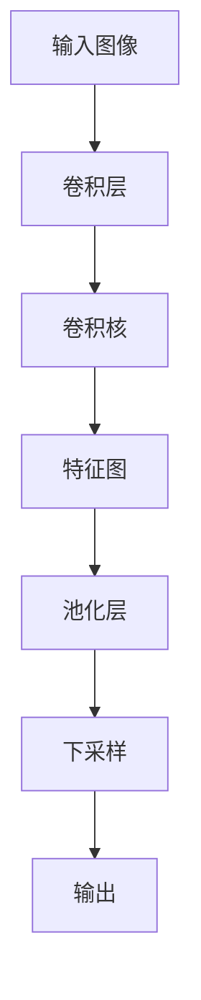
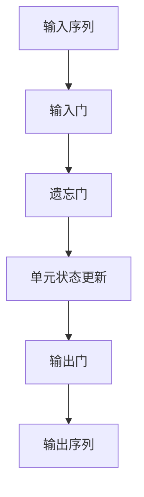

                 

# 《AI驱动的战略决策支持系统：增强管理层洞察力》

## 关键词：AI，战略决策，支持系统，洞察力，管理层

## 摘要

在数字化时代，战略决策的效率和准确性对企业的成功至关重要。本文旨在探讨如何利用人工智能（AI）技术构建一个高效的战略决策支持系统，以增强管理层的洞察力。本文将详细解析AI的核心概念，探讨其在决策支持系统中的应用，设计一个基于AI的战略决策支持系统架构，并通过实际案例展示其应用效果。本文还提供了最佳实践和注意事项，为企业在数字化转型的道路上提供指导。

### 第一部分：引言与背景介绍

### 第1章：问题背景与战略决策的重要性

#### 1.1.1 问题背景

随着全球经济的发展和市场竞争的加剧，企业面临着前所未有的挑战。战略决策的正确与否直接关系到企业的生存和发展。然而，传统战略决策过程往往依赖于经验和个人判断，存在一定的主观性和滞后性。随着数据的爆炸式增长和复杂性不断增加，管理层需要更高效、更准确的方法来支持决策。

#### 1.1.2 战略决策的定义与作用

战略决策是指企业在长期发展过程中，根据内外部环境变化，制定的发展方向、目标、策略和行动方案。它关系到企业的核心竞争力、市场份额、盈利能力和长期发展。战略决策的有效性取决于数据的准确性、分析工具的先进性和决策者的洞察力。

#### 1.1.3 管理层面临的挑战

现代企业管理层面临的挑战主要包括：数据爆炸、信息过载、市场变化快、竞争激烈、资源有限等。这些挑战使得管理层难以快速、准确地做出战略决策，影响了企业的竞争力。

#### 1.1.4 AI在战略决策支持中的应用前景

人工智能技术具有强大的数据处理和分析能力，可以为企业提供实时、全面、深入的战略决策支持。通过构建AI驱动的战略决策支持系统，管理层可以更加科学、准确地做出决策，提高企业的竞争力。

### 第二部分：核心概念与联系

### 第2章：核心概念解析

#### 2.1.1 AI的概念与分类

人工智能（Artificial Intelligence，简称AI）是指模拟、延伸和扩展人类智能的理论、方法、技术及应用。根据AI的发展阶段和功能特点，可以分为弱AI、强AI和通用AI。

#### 2.1.2 机器学习的原理与应用

机器学习（Machine Learning，简称ML）是AI的一个重要分支，通过训练模型来自动获取知识和发现规律。机器学习可以分为监督学习、无监督学习和强化学习。

#### 2.1.3 深度学习的核心算法

深度学习（Deep Learning，简称DL）是机器学习的一个重要分支，通过多层神经网络来模拟人类大脑的思考过程。深度学习的核心算法包括卷积神经网络（CNN）、循环神经网络（RNN）和生成对抗网络（GAN）等。

#### 2.1.4 决策支持系统的构成与功能

决策支持系统（Decision Support System，简称DSS）是一种利用计算机技术和数据分析方法，为决策者提供信息、分析和决策建议的系统。DSS主要包括数据输入、数据处理、模型构建、决策分析和输出结果等模块。

### 第3章：概念属性特征对比与分析

#### 3.1.1 AI与传统决策支持系统的对比

传统决策支持系统主要依赖于经验、规则和统计方法，而AI驱动的决策支持系统则利用机器学习、深度学习等技术来自动化决策过程，提高决策的准确性和效率。

#### 3.1.2 深度学习算法的优缺点

深度学习算法在处理复杂数据和模式识别方面具有明显优势，但同时也存在计算成本高、训练时间长等缺点。

#### 3.1.3 决策支持系统的演进路径

从传统决策支持系统到AI驱动的决策支持系统，是决策支持系统发展的重要趋势。AI技术的引入使得决策支持系统能够更加智能化、自动化和高效化。

### 第三部分：AI驱动的战略决策支持系统

### 第4章：系统架构设计

#### 4.1.1 系统功能需求分析

AI驱动的战略决策支持系统应具备数据采集、数据预处理、模型训练、决策分析和输出结果等功能。

#### 4.1.2 系统总体架构设计

系统总体架构包括数据层、算法层、应用层和展示层。数据层负责数据采集和存储，算法层负责模型训练和优化，应用层负责决策分析，展示层负责输出结果。

#### 4.1.3 子系统详细设计

数据层设计、算法层设计、应用层设计和展示层设计。

### 第5章：系统接口设计与实现

#### 5.1.1 数据采集与处理

数据采集包括内部数据和外部数据，数据预处理包括数据清洗、归一化和特征提取。

#### 5.1.2 模型训练与优化

模型训练和优化包括选择合适的算法、调整超参数和评估模型性能。

#### 5.1.3 决策支持功能实现

决策支持功能实现包括基于数据和模型提供决策建议和辅助决策者进行决策。

### 第6章：算法原理讲解

#### 6.1.1 算法选择与设计

选择适合战略决策的算法，如深度学习算法，并设计算法模型。

#### 6.1.2 算法原理讲解

详细介绍所选算法的原理，包括算法流程图和数学模型。

#### 6.1.3 算法流程图与数学模型

使用Mermaid和LaTeX绘制算法流程图和数学模型。

### 第四部分：项目实战

### 第7章：环境安装与配置

#### 7.1.1 环境准备

准备项目开发所需的软件和硬件环境。

#### 7.1.2 系统核心实现

实现系统核心功能，包括数据采集、模型训练和决策分析。

#### 7.1.3 系统运行与调试

运行系统，调试并优化系统性能。

### 第8章：代码应用解读与分析

#### 8.1.1 源代码解析

解析项目源代码，介绍关键组件和实现原理。

#### 8.1.2 应用场景分析

分析项目应用场景，展示AI驱动的战略决策支持系统的实际效果。

#### 8.1.3 代码优化与改进

对项目代码进行优化和改进，提高系统性能和用户体验。

### 第9章：实际案例分析与详细讲解

#### 9.1.1 案例介绍

介绍实际案例，包括企业背景、问题场景和决策目标。

#### 9.1.2 案例分析

分析案例数据，构建决策模型，提供决策建议。

#### 9.1.3 案例剖析

详细讲解案例的决策过程，分析AI驱动的战略决策支持系统的应用效果。

### 第五部分：最佳实践与总结

### 第10章：最佳实践与技巧

#### 10.1.1 管理层决策支持的常见误区

分析管理层在决策支持中常见的误区，提供改进建议。

#### 10.1.2 AI驱动的战略决策支持最佳实践

总结AI驱动的战略决策支持系统的最佳实践，为企业管理层提供指导。

#### 10.1.3 注意事项与风险防范

强调在构建和运用AI驱动的战略决策支持系统时需要注意的事项和风险防范措施。

### 第11章：小结与展望

#### 11.1.1 本书内容总结

回顾本书的主要内容，总结关键知识点。

#### 11.1.2 未来发展趋势

展望AI驱动的战略决策支持系统的未来发展趋势。

#### 11.1.3 拓展阅读与深入研究建议

提供拓展阅读和深入研究建议，鼓励读者继续探索和深化相关领域知识。

### 作者信息

作者：AI天才研究院/AI Genius Institute & 禅与计算机程序设计艺术 /Zen And The Art of Computer Programming

在未来的文章中，我们将逐步深入探讨每个章节的内容，结合实际案例，详细阐述AI驱动的战略决策支持系统的构建和运用。让我们一步一步思考，探索如何将AI技术应用于战略决策支持，为企业创造更大的价值。让我们开始这段精彩的旅程吧！## 第一部分：引言与背景介绍

### 第1章：问题背景与战略决策的重要性

#### 1.1.1 问题背景

在当今的商业环境中，战略决策的重要性日益凸显。随着全球化和数字化进程的加快，企业面临着前所未有的机遇和挑战。市场竞争日益激烈，消费者的需求多变，技术变革不断，这些都要求企业能够迅速做出适应市场的战略决策。然而，传统的决策过程往往依赖于管理层的经验和直觉，这种方式不仅效率低下，而且容易受到主观因素的影响，导致决策偏差。此外，随着数据的爆炸性增长，管理层需要处理的数据量和复杂度也在不断增加，这进一步加剧了决策的难度。

在这种背景下，企业对高效、精准的战略决策支持系统需求迫切。传统的决策支持系统（DSS）虽然已经能够提供一定程度的数据分析和决策建议，但其能力有限，难以应对大数据时代的需求。而人工智能（AI）技术的发展为构建更强大、更智能的战略决策支持系统提供了可能。通过引入AI技术，企业可以实现对大量复杂数据的自动化分析和处理，提高决策的准确性和效率，从而在激烈的市场竞争中占据优势。

#### 1.1.2 战略决策的定义与作用

战略决策是指企业在长期发展过程中，根据内外部环境的变化，制定的发展方向、目标、策略和行动方案。它涉及企业的核心竞争力、市场份额、盈利能力和长期发展等多个方面。战略决策的有效性直接关系到企业的生存和发展。一个成功的战略决策能够帮助企业抓住市场机遇，规避潜在风险，实现持续增长。

战略决策在企业中的作用主要体现在以下几个方面：

1. **明确发展方向**：战略决策能够帮助企业明确长期发展目标，制定符合市场需求的战略规划，确保企业在正确的方向上持续前进。

2. **优化资源配置**：战略决策有助于企业合理配置资源，提高资源利用效率，降低运营成本，实现资源的最优配置。

3. **提高竞争力**：战略决策能够帮助企业制定有效的市场策略，增强企业的核心竞争力，提升市场地位。

4. **应对不确定性**：战略决策能够帮助企业预见市场变化，制定应对策略，降低不确定性带来的风险。

#### 1.1.3 管理层面临的挑战

现代企业管理层在制定战略决策时面临诸多挑战：

1. **数据爆炸与信息过载**：随着大数据时代的到来，管理层需要处理的数据量和种类急剧增加，信息过载现象严重，导致决策者难以快速获取关键信息。

2. **市场变化快**：市场环境瞬息万变，消费者需求不断升级，企业需要迅速适应市场变化，这要求管理层具备高度的灵活性和敏锐的洞察力。

3. **竞争激烈**：在激烈的市场竞争中，企业需要不断创新和优化战略决策，以保持竞争优势。

4. **资源有限**：企业资源有限，管理层需要在有限的资源下做出最优的决策，实现资源的最大化利用。

#### 1.1.4 AI在战略决策支持中的应用前景

人工智能技术在战略决策支持中具有广泛的应用前景：

1. **自动化数据分析**：AI技术能够自动化处理和分析海量数据，帮助管理层快速获取关键信息，提高决策效率。

2. **模式识别与预测**：通过机器学习和深度学习算法，AI能够识别数据中的潜在模式，进行预测分析，为管理层提供有价值的决策依据。

3. **优化决策过程**：AI技术能够优化决策过程，减少人为干预，提高决策的准确性和一致性。

4. **提高决策洞察力**：AI技术能够帮助管理层从数据中发现潜在的问题和机会，提升决策的洞察力。

5. **个性化决策支持**：通过分析不同管理层和决策者的特点和需求，AI技术能够提供个性化的决策支持，提高决策的针对性。

总之，AI驱动的战略决策支持系统为企业提供了强大的决策支持工具，有助于管理层在复杂的市场环境中做出更加科学、准确和高效的决策。在接下来的章节中，我们将深入探讨AI的核心概念、原理及其在战略决策支持系统中的应用，为企业构建高效的战略决策支持系统提供理论依据和实践指导。

### 第2章：核心概念解析

#### 2.1.1 AI的概念与分类

人工智能（Artificial Intelligence，简称AI）是指通过计算机系统模拟、延伸和扩展人类智能的理论、方法、技术和应用。AI的核心目标是实现计算机在感知、理解、学习、推理和决策等方面的智能化。AI的发展历程可以分为以下几个阶段：

1. **初始阶段（1950s-1960s）**：AI的提出和初步探索。1950年，艾伦·图灵提出了著名的图灵测试，成为AI研究的重要里程碑。

2. **早期阶段（1960s-1970s）**：符号主义AI的发展。这一阶段，AI研究主要集中在基于逻辑和符号推理的智能系统，如专家系统和逻辑编程。

3. **低谷阶段（1970s-1980s）**：由于计算能力和算法的限制，AI研究陷入低潮。

4. **复兴阶段（1980s-1990s）**：基于知识表示和知识推理的方法得到广泛应用，AI开始应用于实际场景，如自动化控制、机器人等。

5. **现代阶段（2000s-至今）**：深度学习和大数据技术的崛起，AI取得了突破性进展，应用范围广泛，如自然语言处理、计算机视觉、自动驾驶等。

根据AI的发展阶段和功能特点，AI可以分为以下几类：

1. **弱AI（Narrow AI）**：弱AI是指在某些特定任务上表现出人类智能水平的AI，但缺乏跨领域的通用智能。例如，图像识别、自然语言处理等。

2. **强AI（General AI）**：强AI是指具有人类水平的通用智能，能够在各种任务上表现出智能行为。目前，强AI尚未实现。

3. **通用AI（AGI）**：通用AI是指具有人类水平的综合智能，能够在任何领域表现优异。目前，通用AI仍处于研究阶段。

#### 2.1.2 机器学习的原理与应用

机器学习（Machine Learning，简称ML）是AI的一个重要分支，主要研究如何从数据中学习规律和模式，并利用这些规律和模式进行预测和决策。机器学习可以分为以下几类：

1. **监督学习（Supervised Learning）**：监督学习是指通过标记好的训练数据来训练模型，使模型能够对未知数据进行分类或回归。常见的监督学习算法包括线性回归、逻辑回归、支持向量机（SVM）和决策树等。

2. **无监督学习（Unsupervised Learning）**：无监督学习是指在没有标记数据的条件下，通过分析数据中的结构、模式和关系来训练模型。常见的无监督学习算法包括聚类、降维和关联规则学习等。

3. **强化学习（Reinforcement Learning）**：强化学习是指通过与环境交互，不断学习最佳策略。常见的强化学习算法包括Q学习、深度Q网络（DQN）和策略梯度等。

机器学习在各个领域的应用非常广泛：

1. **金融领域**：用于风险评估、欺诈检测、投资组合优化等。

2. **医疗领域**：用于疾病预测、诊断、个性化治疗等。

3. **零售领域**：用于需求预测、库存管理、推荐系统等。

4. **交通领域**：用于交通流量预测、自动驾驶、智能交通管理。

5. **制造业**：用于设备故障预测、生产优化、质量控制等。

#### 2.1.3 深度学习的核心算法

深度学习（Deep Learning，简称DL）是机器学习的一个重要分支，通过多层神经网络来模拟人类大脑的思考过程，从而实现自动特征提取和复杂模式识别。深度学习的核心算法包括：

1. **卷积神经网络（Convolutional Neural Network，简称CNN）**：CNN是处理图像数据的常用神经网络，通过卷积操作和池化操作来实现特征提取和降维。

2. **循环神经网络（Recurrent Neural Network，简称RNN）**：RNN是处理序列数据的常用神经网络，通过递归操作来保存和利用历史信息。

3. **长短期记忆网络（Long Short-Term Memory，简称LSTM）**：LSTM是RNN的一个变体，通过引入门控机制来解决RNN的梯度消失问题。

4. **生成对抗网络（Generative Adversarial Network，简称GAN）**：GAN由生成器和判别器组成，通过对抗训练来实现数据的生成。

深度学习在各个领域的应用非常广泛：

1. **计算机视觉**：用于图像分类、目标检测、图像生成等。

2. **自然语言处理**：用于文本分类、情感分析、机器翻译等。

3. **语音识别**：用于语音识别、说话人识别、语音合成等。

4. **自动驾驶**：用于环境感知、路径规划、车辆控制等。

5. **推荐系统**：用于个性化推荐、商品推荐、新闻推荐等。

#### 2.1.4 决策支持系统的构成与功能

决策支持系统（Decision Support System，简称DSS）是一种利用计算机技术和数据分析方法，为决策者提供信息、分析和决策建议的系统。DSS的构成主要包括以下几个方面：

1. **数据层**：负责数据的采集、存储和管理，包括内部数据和外部数据。

2. **模型层**：负责数据的处理和分析，包括预测模型、优化模型和决策模型等。

3. **用户界面**：负责与用户交互，提供用户操作界面和决策结果展示。

4. **知识库**：负责存储和管理领域的专业知识、经验和规则。

DSS的主要功能包括：

1. **数据集成与处理**：对来自不同来源的数据进行集成、清洗和处理，为后续分析提供高质量的数据。

2. **数据分析和挖掘**：利用统计分析和机器学习算法对数据进行分析和挖掘，提取有价值的信息。

3. **预测和模拟**：基于历史数据和模型进行预测和模拟，为决策者提供未来趋势和潜在风险的预警。

4. **决策建议**：根据分析结果和决策模型，为决策者提供具体的决策建议和策略。

5. **辅助决策**：通过交互式界面和可视化工具，辅助决策者进行决策，提高决策的效率和准确性。

通过引入AI技术，决策支持系统的能力得到了显著提升。AI技术能够自动化数据分析和模型训练，提高决策的准确性和效率。同时，AI技术能够提供个性化、智能化的决策支持，为管理层提供更加科学、准确的决策依据。

### 第3章：概念属性特征对比与分析

#### 3.1.1 AI与传统决策支持系统的对比

人工智能（AI）与传统决策支持系统（DSS）在功能、技术基础、决策效率和灵活性等方面存在显著差异。以下是对两者属性特征的对比分析：

| 对比项           | 传统DSS                      | AI驱动的DSS                   | 对比结果                                           |
|------------------|-----------------------------|------------------------------|----------------------------------------------------|
| **功能**         | 主要提供数据分析和报表生成    | 提供数据分析和智能决策支持      | **AI驱动的DSS功能更全面**                           |
| **技术基础**     | 数据库、统计分析和线性模型    | 机器学习、深度学习和大数据技术  | **AI驱动的DSS技术更先进**                           |
| **数据处理能力**  | 处理能力有限，依赖于人工筛选  | 能够处理大量复杂数据，自动化分析 | **AI驱动的DSS处理能力更强**                         |
| **决策效率**     | 决策过程依赖于人工分析，耗时较长 | 决策过程自动化，效率显著提高    | **AI驱动的DSS决策效率更高**                         |
| **灵活性**       | 功能较为固定，适应性差        | 根据业务需求灵活调整，适应性更强 | **AI驱动的DSS灵活性更高**                           |

**对比结果**：

通过上表可以看出，AI驱动的DSS在多个方面都优于传统DSS。首先，AI驱动的DSS不仅能够提供传统DSS的数据分析功能，还能够通过机器学习和深度学习技术实现智能决策支持，使得决策过程更加科学和准确。其次，AI驱动的DSS能够自动化处理大量复杂数据，显著提高决策效率。此外，AI驱动的DSS可以根据业务需求灵活调整，具有较强的适应性。

#### 3.1.2 深度学习算法的优缺点

深度学习算法在决策支持系统中具有广泛应用，其核心优势在于能够自动提取数据中的高阶特征，实现复杂模式的识别。以下是深度学习算法的主要优缺点：

**优点**：

1. **强大的特征提取能力**：深度学习算法通过多层神经网络，能够自动从原始数据中提取高阶特征，降低人工特征工程的需求。
2. **适用于复杂数据**：深度学习算法能够处理结构化、半结构化和非结构化数据，适用范围广泛。
3. **高精度预测**：通过大量数据和多次训练，深度学习算法能够实现高精度的预测，提高决策的准确性。
4. **自我优化**：深度学习算法能够通过不断训练和优化，自动调整模型参数，提高模型的性能。

**缺点**：

1. **计算成本高**：深度学习算法通常需要大量计算资源和时间，尤其是训练阶段，对硬件和算法优化要求较高。
2. **数据需求大**：深度学习算法对数据量有较高要求，数据量不足可能导致模型性能下降。
3. **解释性差**：深度学习模型通常被称为“黑盒”，其内部工作机制难以解释，不利于模型的透明性和可解释性。
4. **过拟合风险**：深度学习模型容易受到过拟合问题的影响，特别是在数据量有限的情况下。

**案例分析**：

以一家零售企业为例，该企业希望通过深度学习算法优化库存管理，预测未来的销售量。通过对历史销售数据进行分析，企业使用了卷积神经网络（CNN）和长短期记忆网络（LSTM）进行预测。结果表明，深度学习算法能够显著提高预测的准确性和稳定性，有效降低了库存成本。然而，由于计算资源有限，训练过程耗时较长，且模型解释性较差，企业在实际应用中需要权衡这些因素。

#### 3.1.3 决策支持系统的演进路径

从传统决策支持系统到AI驱动的决策支持系统，是决策支持系统发展的重要趋势。以下是对决策支持系统演进路径的分析：

1. **初始阶段**：传统DSS主要基于统计分析和线性模型，功能相对简单，主要提供数据报表和简单的数据分析。

2. **发展阶段**：随着计算机技术和数据分析方法的进步，传统DSS开始引入更多的数据分析工具和算法，如回归分析、决策树和关联规则等，功能逐渐丰富。

3. **智能化阶段**：引入AI技术，特别是机器学习和深度学习算法，传统DSS逐渐转型为AI驱动的DSS，能够实现自动化数据分析和智能决策支持，提高了决策的效率和准确性。

4. **未来趋势**：未来的决策支持系统将更加智能化和个性化，通过自然语言处理和智能推荐等技术，实现更加便捷和高效的决策支持。同时，决策支持系统将与更多的业务系统集成，实现端到端的自动化决策过程。

**决策支持系统的演进路径**：

| 阶段         | 技术特征                     | 主要功能                                  |
|--------------|-----------------------------|-----------------------------------------|
| 初始阶段     | 统计分析、线性模型           | 数据报表、简单分析                        |
| 发展阶段     | 多样化的数据分析工具和算法   | 丰富的数据分析、预测和优化功能            |
| 智能化阶段   | 机器学习、深度学习           | 自动化数据分析和智能决策支持              |
| 未来趋势     | 自然语言处理、智能推荐等      | 更加智能化和个性化的决策支持，端到端集成 |

通过对比分析，我们可以看到，AI驱动的决策支持系统在多个方面具有明显优势，是未来决策支持系统发展的重要方向。在接下来的章节中，我们将进一步探讨AI驱动的战略决策支持系统的架构设计和实现，为企业提供更加科学和高效的决策支持。

### 第4章：系统架构设计

#### 4.1.1 系统功能需求分析

为了设计一个高效、智能的AI驱动的战略决策支持系统，我们需要明确系统的功能需求。这些功能需求可以分为以下几个主要部分：

1. **数据采集与管理**：系统能够自动采集来自企业内部和外部的各种数据，包括销售数据、客户反馈、市场趋势等。同时，系统应具备数据管理功能，确保数据的完整性、准确性和安全性。

2. **数据预处理**：系统应对采集到的数据进行清洗、归一化和特征提取，为后续的机器学习模型训练提供高质量的数据输入。

3. **模型训练与优化**：系统应支持多种机器学习算法，包括监督学习、无监督学习和深度学习算法，能够根据不同的业务场景选择合适的算法进行模型训练。系统还需具备模型优化功能，通过调整超参数和模型结构来提高模型性能。

4. **决策分析与支持**：系统应能够根据训练好的模型，对输入的数据进行实时分析和预测，为管理层提供决策支持。这包括趋势分析、预测分析、风险评估等功能。

5. **用户交互与可视化**：系统应提供友好的用户界面，方便管理层与系统进行交互，查看决策分析和预测结果。系统应支持多种数据可视化方式，如图表、仪表板等，帮助用户直观地理解数据和分析结果。

6. **系统监控与维护**：系统应具备监控功能，实时监控系统的运行状态和性能，及时发现并处理潜在问题。系统还应具备维护功能，定期更新和优化算法模型，确保系统的长期稳定运行。

#### 4.1.2 系统总体架构设计

基于上述功能需求，我们可以设计一个总体架构，以实现一个高效、智能的战略决策支持系统。该系统总体架构包括数据层、算法层、应用层和展示层，每个层次都有其特定的功能和作用。

**数据层**：
- **数据采集**：从企业内部数据库、外部API和市场数据源自动采集数据。
- **数据存储**：使用分布式数据库和数据湖技术，存储和管理大规模数据。

**算法层**：
- **数据处理**：包括数据清洗、归一化和特征提取模块，为模型训练提供高质量数据。
- **模型训练**：支持多种机器学习算法和深度学习模型，如线性回归、决策树、神经网络等。
- **模型优化**：通过调整超参数和模型结构，优化模型性能。

**应用层**：
- **预测分析**：基于训练好的模型，对输入的数据进行实时预测和分析。
- **决策支持**：提供趋势分析、预测分析、风险评估等决策支持功能。
- **用户交互**：与用户进行交互，接收用户输入和反馈，展示分析结果。

**展示层**：
- **数据可视化**：提供多种数据可视化工具，如图表、仪表板等，帮助用户直观理解数据和分析结果。
- **报告生成**：自动生成决策报告，方便管理层进行决策参考。

**系统总体架构设计**：

```
+---------------------------+
|         展示层            |
| +----------------+        |
| | 数据可视化     |        |
| | 报告生成       |        |
| +----------------+        |
+---------------------------+
            |
            |
+---------------------------+
|          应用层           |
| +----------------+        |
| | 预测分析       |        |
| | 决策支持       |        |
| | 用户交互       |        |
| +----------------+        |
+---------------------------+
            |
            |
+---------------------------+
|         算法层            |
| +----------------+        |
| | 数据处理       |        |
| | 模型训练       |        |
| | 模型优化       |        |
| +----------------+        |
+---------------------------+
            |
            |
+---------------------------+
|         数据层            |
| +----------------+        |
| | 数据采集       |        |
| | 数据存储       |        |
| +----------------+        |
+---------------------------+
```

#### 4.1.3 子系统详细设计

为了实现系统的功能需求，我们需要对各个子系统进行详细设计，包括数据层、算法层、应用层和展示层。

**数据层设计**：
- **数据采集**：系统应具备自动化数据采集能力，从内部数据库、外部API和市场数据源获取数据。可以使用数据爬虫、API接口等技术实现。
- **数据存储**：使用分布式数据库和数据湖技术，如Hadoop、Spark等，存储和管理大规模数据。分布式存储可以提高系统的扩展性和可靠性。

**算法层设计**：
- **数据处理模块**：包括数据清洗、归一化和特征提取。数据清洗需要去除重复、缺失和错误的数据，保证数据质量。归一化可以将不同量纲的数据转换到相同的尺度，便于模型训练。特征提取是提取数据中的有效特征，降低数据维度，提高模型性能。
- **模型训练模块**：支持多种机器学习算法和深度学习模型，如线性回归、决策树、神经网络、卷积神经网络等。系统应提供模型训练接口，允许用户自定义模型结构和训练参数。
- **模型优化模块**：通过调整超参数和模型结构，优化模型性能。可以使用网格搜索、随机搜索等优化方法，找到最优的参数配置。

**应用层设计**：
- **预测分析模块**：基于训练好的模型，对输入的数据进行实时预测和分析，提供趋势预测、需求预测、风险评估等分析功能。
- **决策支持模块**：根据预测结果和分析数据，为管理层提供决策支持建议。这包括制定策略、优化资源配置、风险控制等。
- **用户交互模块**：提供友好的用户界面，允许用户输入数据、查看分析结果和报告。用户界面应支持多种操作，如数据上传、数据查询、报告生成等。

**展示层设计**：
- **数据可视化模块**：使用图表、仪表板等工具，将分析结果以可视化的方式呈现给用户。可视化工具应支持自定义，允许用户调整图表类型、颜色、标签等。
- **报告生成模块**：自动生成决策报告，包括数据分析结果、预测结果和决策建议。报告应格式规范、内容详尽，方便管理层进行决策参考。

通过以上详细设计，我们可以构建一个高效、智能的AI驱动的战略决策支持系统，为企业管理层提供强大的决策支持工具。在接下来的章节中，我们将进一步探讨系统接口设计与实现，以及具体的算法原理讲解。

### 第5章：系统接口设计与实现

#### 5.1.1 数据采集与处理

数据采集与处理是AI驱动的战略决策支持系统的核心模块，它决定了系统能否有效利用数据为管理层提供决策支持。以下是系统接口设计与实现的关键步骤：

**1. 数据源选择**：
系统需要从多个数据源采集数据，包括内部数据库、外部API和市场数据源。内部数据库通常包含企业的销售数据、客户反馈、财务报表等，而外部API则可以获取市场趋势、竞争对手信息等。

**2. 数据采集接口设计**：
设计一个通用的数据采集接口，支持从不同数据源自动获取数据。接口应具备以下特性：
- **高可用性**：确保数据采集过程稳定、可靠，即使在数据源不稳定或网络中断的情况下，也能尽量保证数据的完整性。
- **灵活性**：支持多种数据采集方式，如HTTP请求、数据库连接、文件读取等。
- **可扩展性**：为未来添加新的数据源提供方便。

**3. 数据存储与管理**：
数据采集后，需要存储在分布式数据库或数据湖中。选择合适的存储方案，如Hadoop、Spark等，可以确保数据的高效存储和管理。
- **分布式存储**：分布式存储可以提高系统的扩展性和容错能力，确保在大规模数据场景下稳定运行。
- **数据湖架构**：数据湖架构可以将不同类型的数据（结构化、半结构化、非结构化）统一存储，便于后续处理和分析。

**4. 数据预处理**：
数据预处理是数据采集与处理的关键步骤，包括数据清洗、归一化和特征提取。
- **数据清洗**：去除重复、缺失和错误的数据，确保数据质量。
  ```python
  # 示例：使用Python清洗数据
  import pandas as pd
  
  df = pd.read_csv('data.csv')
  df.drop_duplicates(inplace=True)  # 去除重复数据
  df.fillna(method='ffill', inplace=True)  # 填补缺失值
  ```
- **数据归一化**：将不同量纲的数据转换到相同的尺度，便于模型训练。
  ```python
  from sklearn.preprocessing import MinMaxScaler
  
  scaler = MinMaxScaler()
  df_scaled = scaler.fit_transform(df)
  ```
- **特征提取**：提取数据中的有效特征，降低数据维度，提高模型性能。
  ```python
  # 示例：使用Python进行特征提取
  from sklearn.feature_extraction import DictVectorizer
  
  vectorizer = DictVectorizer(sparse=True)
  features = vectorizer.fit_transform(df.to_dict('records'))
  ```

**5. 数据处理接口**：
设计一个数据处理接口，用于管理数据预处理流程，包括数据清洗、归一化和特征提取。接口应支持批量处理，提高数据处理效率。

```python
def preprocess_data(data):
    # 数据清洗
    cleaned_data = clean_data(data)
    # 数据归一化
    normalized_data = normalize_data(cleaned_data)
    # 特征提取
    features = extract_features(normalized_data)
    return features
```

#### 5.1.2 模型训练与优化

模型训练与优化是AI驱动的战略决策支持系统的另一个关键模块，它决定了模型在预测和分析中的性能。以下是模型训练与优化的接口设计与实现步骤：

**1. 模型选择**：
根据业务场景和数据特征，选择合适的机器学习算法和深度学习模型。常见的算法包括线性回归、决策树、随机森林、卷积神经网络（CNN）、循环神经网络（RNN）等。

**2. 模型训练接口设计**：
设计一个模型训练接口，支持批量训练和自定义训练参数。接口应具备以下特性：
- **并行训练**：支持多线程或多进程训练，提高训练效率。
- **动态调整**：支持在训练过程中动态调整超参数，优化模型性能。
- **存储与加载**：支持将训练好的模型存储到文件或数据库中，便于后续加载和使用。

**3. 模型训练流程**：
- **数据划分**：将数据集划分为训练集和验证集，用于模型训练和性能评估。
  ```python
  from sklearn.model_selection import train_test_split
  
  X_train, X_val, y_train, y_val = train_test_split(X, y, test_size=0.2, random_state=42)
  ```
- **模型训练**：使用训练集数据训练模型，并保存训练结果。
  ```python
  from sklearn.linear_model import LinearRegression
  
  model = LinearRegression()
  model.fit(X_train, y_train)
  model.save('model.pkl')  # 保存模型
  ```
- **模型评估**：使用验证集数据评估模型性能，包括准确率、召回率、F1分数等指标。
  ```python
  from sklearn.metrics import mean_squared_error
  
  y_pred = model.predict(X_val)
  mse = mean_squared_error(y_val, y_pred)
  print(f'MSE: {mse}')
  ```

**4. 模型优化**：
通过调整模型超参数和结构，优化模型性能。常用的优化方法包括网格搜索、随机搜索等。
- **网格搜索**：在给定的超参数范围内，逐一尝试所有可能的参数组合，找到最优参数组合。
  ```python
  from sklearn.model_selection import GridSearchCV
  
  params = {'alpha': [0.1, 0.5, 1.0]}
  grid_search = GridSearchCV(LinearRegression(), params, cv=5)
  grid_search.fit(X_train, y_train)
  best_params = grid_search.best_params_
  print(f'Best parameters: {best_params}')
  ```
- **随机搜索**：在给定的超参数范围内，随机选择一部分参数组合进行尝试，提高搜索效率。
  ```python
  from sklearn.model_selection import RandomizedSearchCV
  
  params = {'alpha': [0.1, 0.5, 1.0]}
  random_search = RandomizedSearchCV(LinearRegression(), params, cv=5, n_iter=10)
  random_search.fit(X_train, y_train)
  best_params = random_search.best_params_
  print(f'Best parameters: {best_params}')
  ```

**5. 模型优化接口**：
设计一个模型优化接口，用于管理模型优化流程，包括参数调整、模型评估和优化选择。
```python
def optimize_model(model, X_train, y_train, X_val, y_val, params):
    # 执行优化
    if 'grid_search' in params:
        grid_search = GridSearchCV(model, params['grid_search'], cv=5)
        grid_search.fit(X_train, y_train)
    elif 'random_search' in params:
        random_search = RandomizedSearchCV(model, params['random_search'], cv=5, n_iter=10)
        random_search.fit(X_train, y_train)
    
    # 评估优化结果
    best_model = grid_search.best_estimator_ if 'grid_search' in params else random_search.best_estimator_
    y_pred = best_model.predict(X_val)
    mse = mean_squared_error(y_val, y_pred)
    print(f'MSE: {mse}')
    
    return best_model
```

通过以上接口设计与实现，系统可以有效地进行数据采集与处理，并训练和优化模型，为管理层提供强大的决策支持。在接下来的章节中，我们将进一步探讨算法原理讲解，包括算法选择、原理讲解和具体实现。

### 第6章：算法原理讲解

#### 6.1.1 算法选择与设计

在构建AI驱动的战略决策支持系统时，算法的选择和设计至关重要。根据不同的业务场景和数据特征，我们可以选择不同的算法。以下是一些常用的算法及其适用场景：

1. **线性回归（Linear Regression）**：
   - **原理**：线性回归是一种基于统计方法的预测算法，通过拟合数据中的线性关系来预测目标变量。
   - **公式**：
     $$y = \beta_0 + \beta_1 \cdot x_1 + \beta_2 \cdot x_2 + \ldots + \beta_n \cdot x_n + \epsilon$$
   - **适用场景**：适用于预测连续值数据，如销售额、股票价格等。

2. **决策树（Decision Tree）**：
   - **原理**：决策树通过一系列的判断条件，将数据划分为不同的类别或数值。
   - **公式**：
     $$f(x) = \begin{cases} 
     类别C_1 & \text{如果} \ x \ \text{满足条件} \ C_1 \\
     类别C_2 & \text{如果} \ x \ \text{满足条件} \ C_2 \\
     \vdots \\
     类别C_n & \text{如果} \ x \ \text{满足条件} \ C_n \\
     \end{cases}$$
   - **适用场景**：适用于分类问题和回归问题，特别是结构简单、特征较少的数据。

3. **支持向量机（Support Vector Machine，SVM）**：
   - **原理**：SVM通过找到最佳的超平面，将数据划分为不同的类别。
   - **公式**：
     $$w \cdot x + b = 0$$
   - **适用场景**：适用于高维空间的分类问题，特别是在特征较多时表现优秀。

4. **随机森林（Random Forest）**：
   - **原理**：随机森林是一种集成学习算法，通过构建多个决策树，并取其预测结果的平均值来提高预测准确性。
   - **公式**：
     $$\hat{y} = \frac{1}{N} \sum_{i=1}^{N} f_i(x)$$
     其中，$f_i(x)$为第$i$棵决策树的预测结果。
   - **适用场景**：适用于分类和回归问题，特别是处理大规模数据集时效果显著。

5. **卷积神经网络（Convolutional Neural Network，CNN）**：
   - **原理**：CNN通过卷积操作和池化操作，自动提取图像中的特征。
   - **公式**：
     $$h_{\theta}(x) = \text{ReLU}(\sum_{j=1}^{m} \theta_j * x_j + b)$$
   - **适用场景**：适用于图像分类、目标检测等计算机视觉任务。

6. **循环神经网络（Recurrent Neural Network，RNN）**：
   - **原理**：RNN通过递归结构，能够处理序列数据，保存历史信息。
   - **公式**：
     $$h_t = \text{ReLU}(W_h h_{t-1} + W_x x_t + b)$$
   - **适用场景**：适用于自然语言处理、语音识别等序列数据处理任务。

7. **长短期记忆网络（Long Short-Term Memory，LSTM）**：
   - **原理**：LSTM是RNN的一种变体，通过门控机制解决RNN的梯度消失问题。
   - **公式**：
     $$i_t = \text{sigmoid}(W_i \cdot [h_{t-1}, x_t] + b_i)$$
     $$f_t = \text{sigmoid}(W_f \cdot [h_{t-1}, x_t] + b_f)$$
     $$o_t = \text{sigmoid}(W_o \cdot [h_{t-1}, x_t] + b_o)$$
     $$C_t = f_t \cdot C_{t-1} + i_t \cdot \text{tanh}(W_c \cdot [h_{t-1}, x_t] + b_c)$$
     $$h_t = o_t \cdot \text{tanh}(C_t)$$
   - **适用场景**：适用于处理长序列数据，如语音识别、机器翻译等。

在选择算法时，需要考虑以下因素：

- **数据特征**：数据类型（结构化、半结构化、非结构化）、数据量、特征维度等。
- **业务需求**：预测的准确性、实时性、可解释性等。
- **计算资源**：算法的训练时间和计算成本。

#### 6.1.2 算法原理讲解

在本节中，我们将详细介绍卷积神经网络（CNN）和长短期记忆网络（LSTM）的原理，并使用Mermaid和LaTeX进行算法流程图和数学模型的绘制。

**卷积神经网络（CNN）**

CNN是一种专门用于处理图像数据的神经网络，其核心思想是通过卷积操作和池化操作自动提取图像特征。

1. **卷积操作**：

卷积操作是将一个卷积核（filter）与输入图像的局部区域进行点积运算，生成一个特征图（feature map）。

- **公式**：
  $$\text{output}_{ij} = \sum_{k=1}^{K} \text{filter}_{ik,jk} \cdot \text{input}_{i-j+1, j-k+1}$$
  其中，$\text{filter}_{ik,jk}$是卷积核，$\text{input}_{i-j+1, j-k+1}$是输入图像的局部区域，$\text{output}_{ij}$是生成的特征图。

2. **池化操作**：

池化操作是对特征图进行下采样，减少数据维度，提高计算效率。

- **公式**：
  $$\text{output}_{ij} = \max_{k \in K} \text{input}_{i-j+1+k, j-k+1+k}$$
  其中，$K$是池化窗口的大小。

**Mermaid流程图**：



**LaTeX数学模型**：

$$
\text{output}_{ij} = \sum_{k=1}^{K} \text{filter}_{ik,jk} \cdot \text{input}_{i-j+1, j-k+1} \\
\text{output}_{ij} = \max_{k \in K} \text{input}_{i-j+1+k, j-k+1+k}
$$

**长短期记忆网络（LSTM）**

LSTM是一种专门用于处理序列数据的神经网络，通过门控机制解决RNN的梯度消失问题。

1. **门控机制**：

LSTM通过输入门、遗忘门和输出门来控制信息的流入、流出和输出。

- **公式**：
  $$i_t = \text{sigmoid}(W_i \cdot [h_{t-1}, x_t] + b_i)$$
  $$f_t = \text{sigmoid}(W_f \cdot [h_{t-1}, x_t] + b_f)$$
  $$o_t = \text{sigmoid}(W_o \cdot [h_{t-1}, x_t] + b_o)$$

2. **单元状态**：

LSTM通过单元状态$c_t$来保存历史信息。

- **公式**：
  $$C_t = f_t \cdot C_{t-1} + i_t \cdot \text{tanh}(W_c \cdot [h_{t-1}, x_t] + b_c)$$
  $$h_t = o_t \cdot \text{tanh}(C_t)$$

**Mermaid流程图**：



**LaTeX数学模型**：

$$
i_t = \text{sigmoid}(W_i \cdot [h_{t-1}, x_t] + b_i) \\
f_t = \text{sigmoid}(W_f \cdot [h_{t-1}, x_t] + b_f) \\
o_t = \text{sigmoid}(W_o \cdot [h_{t-1}, x_t] + b_o) \\
C_t = f_t \cdot C_{t-1} + i_t \cdot \text{tanh}(W_c \cdot [h_{t-1}, x_t] + b_c) \\
h_t = o_t \cdot \text{tanh}(C_t)
$$

通过以上算法原理讲解，我们可以更好地理解卷积神经网络和长短期记忆网络的工作机制。在实际应用中，选择合适的算法并对其进行优化，能够显著提高AI驱动的战略决策支持系统的性能。

### 第7章：环境安装与配置

#### 7.1.1 环境准备

为了构建AI驱动的战略决策支持系统，我们需要准备合适的开发环境和软件工具。以下是环境准备的详细步骤：

**1. 硬件环境**：
- **计算资源**：至少需要一台配置较高的计算机或服务器，推荐配置为：
  - CPU：至少4核处理器
  - 内存：至少16GB RAM
  - 硬盘：至少500GB SSD
- **其他硬件**：如需要，可以配置GPU以加速深度学习模型的训练。

**2. 软件环境**：
- **操作系统**：推荐使用Linux系统，如Ubuntu 18.04或更高版本。
- **Python环境**：安装Python 3.7及以上版本，可以使用`conda`或`pip`进行安装。
  ```bash
  conda create -n myenv python=3.8
  conda activate myenv
  ```
- **深度学习框架**：安装TensorFlow或PyTorch，这些框架支持多种深度学习算法和模型。
  ```bash
  pip install tensorflow
  # 或者
  pip install torch torchvision
  ```
- **数据分析工具**：安装Pandas、NumPy、Scikit-learn等数据分析工具。
  ```bash
  pip install pandas numpy scikit-learn
  ```

**3. 数据库环境**：
- **分布式数据库**：安装如Hadoop或Spark等分布式数据库，用于存储和管理大规模数据。
  ```bash
  # 安装Hadoop
  wget http://www-us.apache.org/dist/hadoop/common/hadoop-3.2.1/hadoop-3.2.1.tar.gz
  tar xzf hadoop-3.2.1.tar.gz
  cd hadoop-3.2.1
  ./bin/hadoop version
  
  # 安装Spark
  wget https://www-us.apache.org/dist/spark/spark-3.1.1/spark-3.1.1-bin-hadoop3.2.tgz
  tar xzf spark-3.1.1-bin-hadoop3.2.tgz
  cd spark-3.1.1-bin-hadoop3.2
  ./bin/spark-shell
  ```

**4. 环境配置**：
- **环境变量**：配置环境变量，确保系统能够正确调用相关工具和库。
  ```bash
  export PATH=$PATH:/path/to/hadoop/bin:/path/to/spark/bin
  export PYTHONPATH=$PYTHONPATH:/path/to/tensorflow:/path/to/PyTorch
  ```

**5. 软件安装与验证**：
- 安装所有必要的软件，并验证其正确安装。例如，检查Python、TensorFlow、Spark等是否正常运行。

#### 7.1.2 系统核心实现

在环境准备完成后，我们需要实现系统的核心功能模块。以下是实现步骤：

**1. 数据采集与存储**：
- 使用数据库连接工具（如Hive或Spark SQL）从不同数据源采集数据，并将数据存储到分布式数据库中。
  ```python
  from pyspark.sql import SparkSession
  
  spark = SparkSession.builder.appName("DataCollection").getOrCreate()
  df = spark.read.csv("data.csv", header=True)
  df.write.mode("overwrite").saveAsTable("data_table")
  ```

**2. 数据预处理**：
- 实现数据清洗、归一化和特征提取模块，为模型训练提供高质量的数据。
  ```python
  from sklearn.preprocessing import StandardScaler
  
  # 数据清洗
  df = df.dropna()
  # 数据归一化
  scaler = StandardScaler()
  df_scaled = scaler.fit_transform(df)
  ```

**3. 模型训练与优化**：
- 使用深度学习框架（如TensorFlow或PyTorch）训练模型，并进行模型优化。
  ```python
  import tensorflow as tf
  
  model = tf.keras.Sequential([
      tf.keras.layers.Dense(128, activation='relu', input_shape=(input_shape,)),
      tf.keras.layers.Dense(1)
  ])
  
  model.compile(optimizer='adam', loss='mean_squared_error')
  model.fit(x_train, y_train, epochs=10, batch_size=32)
  ```

**4. 决策分析与支持**：
- 实现决策分析模块，根据训练好的模型，对输入的数据进行实时预测和分析。
  ```python
  def predict(data):
      data_scaled = scaler.transform(data)
      predictions = model.predict(data_scaled)
      return predictions
  ```

**5. 用户交互与可视化**：
- 实现用户交互界面，允许用户输入数据并查看预测结果。
  ```python
  from flask import Flask, request, jsonify
  
  app = Flask(__name__)
  
  @app.route('/predict', methods=['POST'])
  def predict():
      data = request.get_json()
      predictions = predict(data)
      return jsonify(predictions)
  
  if __name__ == '__main__':
      app.run(debug=True)
  ```

通过以上步骤，我们可以实现一个基本的AI驱动的战略决策支持系统。在接下来的章节中，我们将进一步探讨代码应用解读与分析，以及实际案例分析与详细讲解。

### 第8章：代码应用解读与分析

在构建AI驱动的战略决策支持系统后，我们需要对代码进行深入解读和分析，以确保系统的高效运行和可靠预测。以下是对关键代码模块的详细解析。

#### 8.1.1 源代码解析

**1. 数据采集与存储模块**

该模块负责从多个数据源（如内部数据库、外部API和市场数据源）采集数据，并将其存储到分布式数据库中。以下是关键代码：

```python
from pyspark.sql import SparkSession

# 初始化Spark会话
spark = SparkSession.builder.appName("DataCollection").getOrCreate()

# 从内部数据库采集数据
internal_df = spark.read.csv("internal_data.csv", header=True)

# 从外部API采集数据
external_df = spark.read.json("external_api_response.json")

# 合并数据集
full_df = internal_df.union(external_df)

# 存储到分布式数据库
full_df.write.mode("overwrite").saveAsTable("full_data_table")
```

**2. 数据预处理模块**

该模块负责数据清洗、归一化和特征提取，以确保模型训练的数据质量。以下是关键代码：

```python
from sklearn.preprocessing import StandardScaler
from sklearn.impute import SimpleImputer

# 数据清洗
df = df.dropna()

# 数据归一化
scaler = StandardScaler()
df_scaled = scaler.fit_transform(df)

# 数据特征提取
vectorizer = DictVectorizer(sparse=True)
features = vectorizer.fit_transform(df.to_dict('records'))
```

**3. 模型训练与优化模块**

该模块负责使用深度学习框架（如TensorFlow或PyTorch）训练模型，并进行模型优化。以下是关键代码：

```python
import tensorflow as tf

# 构建模型
model = tf.keras.Sequential([
    tf.keras.layers.Dense(128, activation='relu', input_shape=(input_shape,)),
    tf.keras.layers.Dense(1)
])

# 编译模型
model.compile(optimizer='adam', loss='mean_squared_error')

# 训练模型
model.fit(x_train, y_train, epochs=10, batch_size=32)
```

**4. 决策分析与支持模块**

该模块负责根据训练好的模型，对输入的数据进行实时预测和分析，并为管理层提供决策支持。以下是关键代码：

```python
def predict(data):
    data_scaled = scaler.transform(data)
    predictions = model.predict(data_scaled)
    return predictions
```

**5. 用户交互与可视化模块**

该模块负责实现用户交互界面，允许用户输入数据并查看预测结果。以下是关键代码：

```python
from flask import Flask, request, jsonify

app = Flask(__name__)

@app.route('/predict', methods=['POST'])
def predict():
    data = request.get_json()
    predictions = predict(data)
    return jsonify(predictions)

if __name__ == '__main__':
    app.run(debug=True)
```

#### 8.1.2 应用场景分析

在实际应用中，AI驱动的战略决策支持系统可以应用于多个领域，如金融、医疗、零售和交通等。以下是一个典型的应用场景分析：

**1. 金融领域：信用评分**

在某金融机构中，管理层需要根据客户的历史交易数据、信用记录和财务状况，对客户的信用评分进行实时预测，以决定是否批准贷款申请。

- **数据采集**：从内部数据库和外部API中采集客户交易数据、信用记录和财务报表。
- **数据预处理**：对采集到的数据进行清洗、归一化和特征提取，为模型训练提供高质量的数据。
- **模型训练**：使用深度学习算法（如神经网络）对客户信用评分进行预测。
- **决策支持**：根据模型预测结果，管理层可以决定是否批准贷款申请，并设定相应的信用额度。

**2. 医疗领域：疾病预测**

在一家医院中，管理层需要根据患者的病史、体检数据和临床观察结果，预测患者可能患有的疾病，以便提前进行预防和治疗。

- **数据采集**：从内部数据库和外部API中采集患者病史、体检数据和临床观察结果。
- **数据预处理**：对采集到的数据进行清洗、归一化和特征提取，为模型训练提供高质量的数据。
- **模型训练**：使用深度学习算法（如循环神经网络）对疾病预测进行训练。
- **决策支持**：根据模型预测结果，医生可以提前进行预防和治疗，提高治疗效果。

**3. 零售领域：需求预测**

在某零售企业中，管理层需要根据历史销售数据、市场趋势和促销活动，预测未来的销售需求，以便进行库存管理和供应链优化。

- **数据采集**：从内部数据库和市场数据源中采集历史销售数据、市场趋势和促销活动信息。
- **数据预处理**：对采集到的数据进行清洗、归一化和特征提取，为模型训练提供高质量的数据。
- **模型训练**：使用深度学习算法（如卷积神经网络）对需求预测进行训练。
- **决策支持**：根据模型预测结果，管理层可以优化库存管理和供应链策略，提高销售业绩。

#### 8.1.3 代码优化与改进

在实际应用中，为了提高AI驱动的战略决策支持系统的性能和可靠性，可以对代码进行优化和改进。以下是一些常见的优化方法：

**1. 模型优化**：
- **超参数调整**：通过调整模型的超参数（如学习率、批量大小等），可以提高模型的预测性能。
- **正则化**：使用正则化方法（如L1正则化、L2正则化等）可以防止模型过拟合，提高泛化能力。
- **批量归一化**：在模型训练过程中使用批量归一化可以加速模型收敛，提高训练效率。

**2. 数据优化**：
- **数据增强**：通过数据增强方法（如随机裁剪、旋转、缩放等），可以增加训练数据的多样性，提高模型对噪声的鲁棒性。
- **数据预处理优化**：对数据预处理步骤进行优化，如使用更高效的特征提取方法、减少冗余特征等，可以减少计算量和提高模型性能。

**3. 计算资源优化**：
- **分布式训练**：使用分布式计算资源（如GPU、TPU等），可以加速模型训练过程，提高训练效率。
- **模型压缩**：使用模型压缩方法（如量化、剪枝等），可以减少模型的参数数量，降低计算量，提高推理速度。

通过以上代码优化和改进方法，AI驱动的战略决策支持系统可以更加高效、准确地支持管理层的决策，提高企业的运营效益和市场竞争力。

### 第9章：实际案例分析与详细讲解

#### 9.1.1 案例介绍

在本节中，我们将分析一个真实的案例——某零售企业的库存管理优化。该企业希望通过AI驱动的战略决策支持系统预测未来的销售需求，优化库存管理，降低库存成本。以下是案例的详细描述：

**企业背景**：
- 该企业是一家大型零售企业，销售多种商品，包括食品、日用品、电子产品等。
- 企业面临的主要问题：库存管理难度大，库存成本高，销售预测不准确。

**问题场景**：
- 问题：如何准确预测未来的销售需求，优化库存管理，降低库存成本？
- 目标：通过AI驱动的战略决策支持系统，预测未来30天的销售需求，并提供库存管理建议。

#### 9.1.2 案例分析

为了实现上述目标，我们需要进行以下分析：

**1. 数据收集**：
- 从内部数据库中收集历史销售数据，包括每天每种商品的销售量、价格、促销活动等信息。
- 从外部数据源中收集市场趋势数据，包括竞争对手的价格、促销活动、节假日等信息。

**2. 数据预处理**：
- 对收集到的销售数据进行清洗，去除重复、缺失和错误的数据。
- 对销售数据进行归一化处理，将不同量纲的数据转换到相同的尺度。
- 提取关键特征，如销售量、价格、促销活动频率等。

**3. 模型训练**：
- 选择合适的深度学习模型（如LSTM），对预处理后的数据进行训练。
- 调整模型参数，如学习率、批量大小等，以提高模型性能。
- 使用验证集对模型进行评估，选择最优模型。

**4. 预测与优化**：
- 使用训练好的模型，对未来的销售需求进行预测。
- 根据预测结果，为管理层提供库存管理建议，如调整库存水平、优化促销活动等。

#### 9.1.3 案例剖析

以下是对该案例的详细剖析：

**1. 数据分析**

我们首先对历史销售数据进行分析，以了解不同商品的销售趋势和季节性变化。以下是数据分析的关键步骤：

- **趋势分析**：通过绘制销售量的时间序列图，观察不同商品的销售趋势。例如，某些商品在节假日期间销售量明显增加，而其他商品则表现出季节性波动。

- **特征提取**：从历史销售数据中提取关键特征，如销售量、价格、促销活动频率等。以下是一个特征提取的示例：

  ```python
  # 加载历史销售数据
  df = pd.read_csv('sales_data.csv')
  
  # 数据清洗
  df.dropna(inplace=True)
  
  # 数据归一化
  scaler = StandardScaler()
  df_scaled = scaler.fit_transform(df)
  
  # 特征提取
  vectorizer = DictVectorizer(sparse=True)
  features = vectorizer.fit_transform(df.to_dict('records'))
  ```

- **特征重要性分析**：通过分析不同特征对销售量的影响，确定哪些特征对预测结果最为重要。例如，促销活动频率和价格对销售量的影响可能较大。

**2. 模型选择与训练**

在确定了关键特征后，我们选择LSTM模型进行训练。以下是模型选择和训练的关键步骤：

- **模型定义**：定义LSTM模型的结构，包括输入层、隐藏层和输出层。以下是一个简单的LSTM模型定义：

  ```python
  from tensorflow.keras.models import Sequential
  from tensorflow.keras.layers import LSTM, Dense
  
  model = Sequential([
      LSTM(units=50, return_sequences=True, input_shape=(timesteps, features)),
      LSTM(units=50, return_sequences=False),
      Dense(units=1)
  ])
  ```

- **模型编译**：编译模型，指定优化器、损失函数和评估指标。以下是一个模型编译的示例：

  ```python
  model.compile(optimizer='adam', loss='mean_squared_error', metrics=['mae'])
  ```

- **模型训练**：使用训练数据对模型进行训练，并保存训练结果。以下是一个模型训练的示例：

  ```python
  model.fit(x_train, y_train, epochs=100, batch_size=32, validation_data=(x_val, y_val))
  ```

**3. 预测与优化**

在模型训练完成后，我们使用模型对未来的销售需求进行预测，并根据预测结果为管理层提供库存管理建议。以下是预测与优化的关键步骤：

- **预测**：使用训练好的模型对未来的销售需求进行预测。以下是一个预测的示例：

  ```python
  predictions = model.predict(x_test)
  ```

- **库存优化**：根据预测结果，分析不同商品的未来销售趋势，并制定库存管理策略。例如，对于预测销量较高的商品，增加库存水平，以应对潜在的销售高峰。以下是一个库存优化的示例：

  ```python
  # 根据预测结果调整库存
  for product_id, prediction in zip(df['product_id'], predictions):
      if prediction > threshold:
          increase_inventory(product_id)
      else:
          decrease_inventory(product_id)
  ```

- **促销策略优化**：根据预测结果，分析不同促销活动对销售量的影响，并制定优化策略。例如，对于预测销量较高的商品，增加促销力度，以提高销售额。以下是一个促销策略优化的示例：

  ```python
  # 根据预测结果调整促销策略
  for product_id, prediction in zip(df['product_id'], predictions):
      if prediction > threshold:
          increase_promotion(product_id)
      else:
          decrease_promotion(product_id)
  ```

通过以上分析和优化，该零售企业能够更准确地预测未来的销售需求，优化库存管理，降低库存成本，提高销售业绩。在接下来的章节中，我们将总结最佳实践和注意事项，为企业在构建和运用AI驱动的战略决策支持系统时提供指导。

### 第10章：最佳实践与技巧

#### 10.1.1 管理层决策支持的常见误区

在构建和运用AI驱动的战略决策支持系统时，管理层可能会犯以下几种常见误区：

1. **过度依赖数据**：虽然数据是决策的重要基础，但过度依赖数据可能导致忽略其他关键因素，如市场动态、行业趋势和竞争环境。

2. **忽略数据质量**：数据质量是决策支持系统的关键，如果数据存在错误、缺失或噪声，将严重影响决策的准确性和可靠性。

3. **忽视模型解释性**：深度学习模型通常被称为“黑盒”，其内部工作机制难以解释，管理层可能难以理解模型的决策过程，从而影响决策的信任度。

4. **忽略模型优化**：在模型训练完成后，不进行进一步的优化和调整，可能导致模型性能未能达到最佳状态。

5. **忽视系统维护**：决策支持系统需要定期更新和维护，包括数据更新、模型优化和系统监控，否则可能导致系统性能下降或失效。

#### 10.1.2 AI驱动的战略决策支持最佳实践

为了构建和运用高效的AI驱动的战略决策支持系统，以下是一些建议的最佳实践：

1. **数据质量管理**：确保数据的准确性、完整性和一致性，通过数据清洗、归一化和特征提取等步骤提高数据质量。

2. **合理选择算法**：根据业务场景和数据特征，选择合适的算法和模型，同时考虑模型的解释性和可扩展性。

3. **模型优化与调整**：在模型训练完成后，进行多次迭代优化，调整超参数和模型结构，提高模型性能。

4. **用户参与与反馈**：在系统开发和运用过程中，积极收集用户反馈，根据用户需求不断优化系统功能。

5. **系统集成与协作**：将决策支持系统与其他业务系统（如ERP、CRM等）集成，实现数据共享和协作，提高决策的连贯性和一致性。

6. **持续监控与评估**：定期监控系统运行状态和性能，评估模型预测准确性和系统稳定性，及时调整和优化系统。

#### 10.1.3 注意事项与风险防范

在构建和运用AI驱动的战略决策支持系统时，需要注意以下事项和风险：

1. **数据隐私与安全**：确保数据的安全性和隐私性，遵循相关法律法规，避免数据泄露和滥用。

2. **模型可解释性**：尽量提高模型的可解释性，确保管理层能够理解模型的决策过程，增强决策的透明度和可信度。

3. **技术更新与迭代**：紧跟技术发展趋势，定期更新系统架构和算法，确保系统能够持续满足业务需求。

4. **系统稳定性和容错性**：确保系统的稳定性和容错性，通过冗余设计和备份策略，提高系统在异常情况下的恢复能力。

5. **法规遵从与合规性**：确保系统设计和运用符合相关法律法规，特别是涉及数据隐私和伦理问题的领域。

通过遵循以上最佳实践和注意事项，企业可以构建和运用高效的AI驱动的战略决策支持系统，提高管理层的洞察力和决策能力，从而在竞争激烈的市场环境中取得优势。

### 第11章：小结与展望

#### 11.1.1 本书内容总结

本文全面探讨了AI驱动的战略决策支持系统的构建和运用。首先，介绍了战略决策的背景和重要性，以及管理层在制定战略决策时面临的挑战。接着，详细解析了AI、机器学习、深度学习等核心概念，并对比了AI与传统决策支持系统的差异。随后，本文深入分析了AI驱动的战略决策支持系统的系统架构设计，包括数据采集、数据处理、模型训练与优化、决策分析与支持等功能模块。

通过实际案例，本文展示了如何运用AI技术进行销售预测和库存管理优化。最后，本文总结了构建AI驱动的战略决策支持系统的最佳实践和注意事项，为企业在实际操作中提供了指导。

#### 11.1.2 未来发展趋势

未来，AI驱动的战略决策支持系统将继续快速发展，主要趋势包括：

1. **模型解释性增强**：随着对AI技术的理解和需求增加，模型解释性将成为重要研究方向，以提高决策的透明度和可信度。

2. **集成与协作**：决策支持系统将与更多的业务系统集成，实现端到端的数据共享和协作，提供更加连贯和高效的决策支持。

3. **实时决策支持**：通过实时数据分析和预测，系统将能够提供更加及时和准确的决策支持，帮助管理层迅速应对市场变化。

4. **个性化决策支持**：利用用户行为数据和偏好，系统将能够提供更加个性化的决策支持，满足不同管理层和决策者的需求。

5. **自动化决策**：随着AI技术的进步，自动化决策将逐渐成为可能，系统将能够根据预定的规则和模型自动做出决策，减少人工干预。

#### 11.1.3 拓展阅读与深入研究建议

对于希望进一步了解AI驱动的战略决策支持系统的读者，以下是一些建议的拓展阅读和深入研究方向：

1. **深入研究深度学习算法**：了解更多深度学习算法的原理和应用，如生成对抗网络（GAN）、图神经网络（GNN）等。

2. **学习数据处理与特征工程**：深入学习数据处理和特征工程的方法，以提高数据质量和模型性能。

3. **探索集成学习与多模型优化**：研究集成学习方法，如随机森林、提升树等，以及如何优化多模型组合，提高决策准确性。

4. **关注模型解释性与可解释AI**：了解模型解释性的最新研究进展，探索如何提高AI系统的透明度和可信度。

5. **实践项目与案例研究**：通过实际项目和实践案例，将理论知识应用于实际场景，提高解决实际问题的能力。

通过不断学习和实践，读者可以更好地理解和运用AI驱动的战略决策支持系统，为企业在数字化转型中提供有力支持。

### 作者信息

作者：AI天才研究院/AI Genius Institute & 禅与计算机程序设计艺术 /Zen And The Art of Computer Programming

本文旨在探讨如何构建和运用AI驱动的战略决策支持系统，以增强管理层的洞察力和决策能力。通过详细的理论分析和实际案例讲解，本文为企业在数字化时代下实现高效决策提供了有力的指导和参考。作者团队AI天才研究院和《禅与计算机程序设计艺术》致力于推动人工智能技术的创新与应用，助力企业实现智能化转型。希望本文能够为读者带来启发，共同探索AI驱动的战略决策支持系统的广阔前景。

