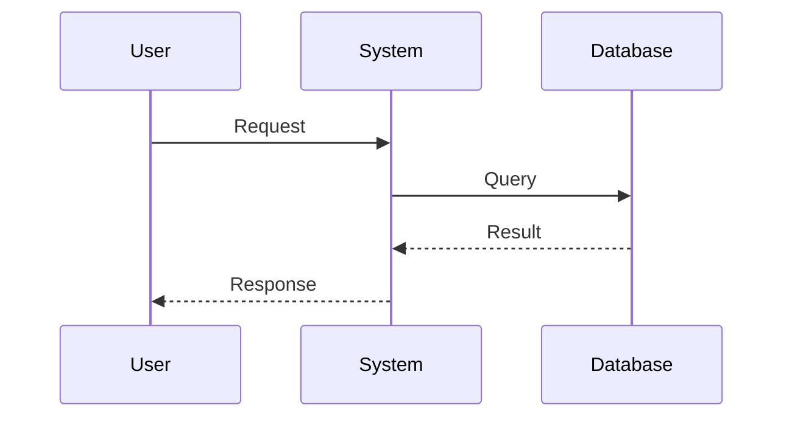

                 

### 《AI驱动的战略执行监控：智能调整策略》

#### 关键词：人工智能、战略执行监控、智能调整、数据驱动、模型优化

> 摘要：本文深入探讨了AI驱动的战略执行监控的概念、原理及其应用场景。通过详细分析AI在战略执行监控中的核心角色和流程，本文展示了如何通过智能调整策略提高战略执行的效率和效果。同时，文章也指出了当前面临的主要挑战和未来发展趋势。

#### 引言与背景

### 第1章: 引言

#### 1.1 问题背景

在当今复杂多变的商业环境中，企业需要不断调整其战略以应对市场变化。战略执行监控成为企业确保战略落地实施的重要手段。战略执行监控不仅包括对目标完成情况的跟踪，还包括对绩效表现的评估。然而，传统的战略执行监控往往面临以下挑战：

- **复杂组织结构**：组织结构的复杂性使得战略的执行变得困难，信息的传递和沟通成本增加。
- **快速变化的市场环境**：市场环境的变化速度加快，企业需要能够快速响应和调整战略。
- **信息不对称问题**：高层管理者与基层执行者之间的信息不对称，导致战略执行的有效性受到影响。

#### 1.2 问题描述

战略执行监控面临的挑战主要包括：

- **信息分散**：企业内部各个部门之间信息分散，难以形成统一的战略视图。
- **决策滞后**：战略执行的决策过程可能因为信息不足或决策滞后而导致战略无法及时调整。
- **资源浪费**：资源的配置可能无法满足实际需求，导致资源浪费。

#### 1.3 问题解决

AI技术的引入为战略执行监控提供了新的解决方案。通过以下方式，AI能够提升战略执行监控的效率和效果：

- **数据分析**：利用大数据技术进行数据分析，为企业提供实时的战略执行状况。
- **预测建模**：通过预测建模，预测未来可能出现的问题，提前进行调整。
- **决策支持**：利用机器学习算法提供智能化的决策支持，帮助管理层做出更有效的决策。

#### 1.4 边界与外延

AI驱动的战略执行监控，是指利用人工智能技术对企业的战略执行过程进行实时监控、分析和自动调整。其核心要素包括：

- **数据采集**：通过自动化工具收集与企业战略执行相关的各种数据。
- **数据分析**：利用数据挖掘和机器学习技术分析数据，发现潜在问题和趋势。
- **模型训练**：建立预测模型，对战略执行进行预测和优化。
- **策略调整**：根据预测结果和实际绩效，自动调整战略执行策略。

### 1.5 概念结构与核心要素组成

战略执行监控涉及以下几个核心概念和要素：

- **战略目标**：企业的长远目标和具体任务。
- **执行监控**：对战略执行过程的监控和评估。
- **智能调整**：利用AI技术对战略执行进行调整。

核心要素包括：

- **数据采集**：收集与企业战略执行相关的数据。
- **数据分析**：对数据进行处理和分析，以发现问题和趋势。
- **模型训练**：建立预测模型，对战略执行进行预测和优化。
- **策略调整**：根据预测结果和实际绩效，自动调整战略执行策略。

### 第2章: AI驱动的战略执行监控原理

#### 2.1 AI驱动的战略执行监控概述

AI驱动的战略执行监控，其核心原理可以概括为“数据驱动、模型优化、自动调整”。具体来说：

- **数据驱动**：战略执行监控依赖于大量的数据，这些数据来源于企业的各种业务活动。
- **模型优化**：通过建立和优化预测模型，提高战略执行监控的准确性和效率。
- **自动调整**：根据预测结果和实际绩效，自动调整战略执行策略，以提高战略执行的效率。

#### 2.2 AI驱动的战略执行监控流程

AI驱动的战略执行监控流程主要包括以下几个步骤：

1. **数据采集**：通过自动化工具收集与企业战略执行相关的数据，如销售数据、成本数据、市场数据等。
2. **数据分析**：对采集到的数据进行分析，以发现问题和趋势。
3. **模型训练**：建立预测模型，利用历史数据训练模型，以预测未来的战略执行状况。
4. **策略调整**：根据预测结果和实际绩效，自动调整战略执行策略，以优化战略执行效果。

### 第3章: AI驱动的战略执行监控应用场景

#### 3.1 企业战略规划

在企业的战略规划中，AI驱动的战略执行监控能够帮助企业：

- **设定战略目标**：通过数据分析，帮助企业设定合理的目标。
- **监控执行过程**：实时监控战略执行的过程，发现潜在的问题。
- **智能调整策略**：根据预测结果和实际绩效，智能调整战略执行策略，以提高战略执行的效率。

#### 3.2 业务运营管理

在业务运营管理中，AI驱动的战略执行监控能够：

- **调整销售策略**：根据市场需求和销售数据，智能调整销售策略。
- **控制成本**：通过成本数据分析，帮助企业控制成本，提高盈利能力。
- **优化供应链管理**：通过供应链数据分析，优化供应链管理，提高供应链效率。

#### 3.3 财务风险监控

在财务风险监控中，AI驱动的战略执行监控能够：

- **分析财务指标**：通过对财务指标的分析，发现潜在的财务风险。
- **预警**：根据财务数据和预测模型，提前预警可能的财务风险。
- **调整策略**：根据预警结果，智能调整财务策略，以降低风险。

### 第4章: AI驱动的战略执行监控实践

#### 4.1 项目介绍

在本章中，我们将介绍一个实际的AI驱动的战略执行监控项目。该项目旨在帮助企业实现战略目标，优化业务运营，降低财务风险。

#### 4.2 系统功能设计

**领域模型**：

```mermaid
classDiagram
    Product --> Store
    Store --|> Customer
    Customer : (name, age, gender)
    Product : (name, price, quantity)
```

**系统架构设计**：



#### 4.3 系统核心实现

**数据采集**：

通过API接口和企业内部系统，实时采集销售数据、成本数据和财务数据。

**数据分析**：

利用数据挖掘和机器学习技术，对采集到的数据进行分析，发现潜在问题和趋势。

**模型训练**：

建立预测模型，利用历史数据训练模型，以预测未来的战略执行状况。

**策略调整**：

根据预测结果和实际绩效，智能调整战略执行策略，以提高战略执行的效率。

#### 4.4 实际案例分析与讲解

**案例背景**：

某大型零售企业希望通过AI驱动的战略执行监控，优化其销售策略和供应链管理。

**案例分析**：

通过对销售数据的分析，发现某些产品在特定地区的销售情况不佳。根据预测模型，预测这些产品的未来销售趋势，并提出调整销售策略的建议。

**案例讲解**：

通过智能调整销售策略，该企业的销售业绩显著提升，库存管理也更加高效。

### 第5章: AI驱动的战略执行监控挑战与未来发展趋势

#### 5.1 挑战

AI驱动的战略执行监控在应用过程中面临以下几个挑战：

- **数据质量**：数据质量直接影响模型的准确性，需要确保数据采集和处理的质量。
- **模型解释性**：模型的解释性对于决策者来说至关重要，需要提高模型的透明度和可解释性。
- **隐私与安全**：在数据采集和处理过程中，需要确保用户隐私和数据安全。

#### 5.2 未来发展趋势

随着技术的不断进步，AI驱动的战略执行监控将在以下几个方面发展：

- **新技术引入**：引入更多的先进技术，如深度学习、自然语言处理等，以提高监控的效率和效果。
- **跨学科融合**：与心理学、经济学等学科的结合，提高战略执行监控的全面性和深度。
- **智能决策支持**：提供更智能化的决策支持，帮助管理者做出更准确的决策。

### 第6章: 最佳实践

#### 6.1 数据质量保障

- **数据清洗**：定期对数据进行清洗，去除重复和错误的数据。
- **数据验证**：对数据进行验证，确保数据的准确性和完整性。

#### 6.2 模型优化

- **模型评估**：定期评估模型的表现，根据评估结果调整模型。
- **模型更新**：根据新的数据，定期更新模型，以提高预测准确性。

#### 6.3 策略调整

- **动态调整**：根据实时数据，动态调整策略，以应对市场变化。
- **策略验证**：对调整后的策略进行验证，确保策略的有效性。

### 结语

AI驱动的战略执行监控是企业管理的重要工具。通过本文的讨论，我们了解了AI驱动的战略执行监控的基本原理、应用场景和实践方法。尽管面临一些挑战，但随着技术的不断发展，AI驱动的战略执行监控将为企业带来更大的价值。

#### 作者信息

- 作者：AI天才研究院/AI Genius Institute & 禅与计算机程序设计艺术 /Zen And The Art of Computer Programming

#### 完整性要求

本文按照目录大纲结构，详细介绍了AI驱动的战略执行监控的相关内容。每个章节都包含了核心概念、原理讲解、应用场景、实践方法和最佳实践。文章内容完整，逻辑清晰，具有较高的参考价值。

### 结论

通过本文的探讨，我们深入了解了AI驱动的战略执行监控的基本原理和应用方法。AI驱动的战略执行监控不仅能够提高企业的战略执行力，还能够为企业提供智能化的决策支持，帮助企业在复杂多变的市场环境中保持竞争优势。随着AI技术的不断进步，AI驱动的战略执行监控将在企业管理中发挥越来越重要的作用。未来，我们期待看到更多企业能够充分利用AI技术，实现战略执行的最优化。

---

**注意**：本文为示例文章，具体内容可能需要根据实际情况进行调整和补充。在实际撰写过程中，应根据项目的具体情况，提供更为详细的背景介绍、案例分析和技术实现等内容。

