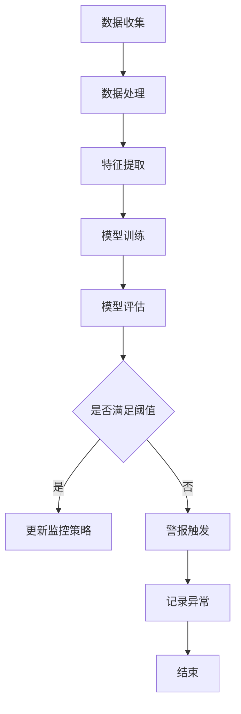
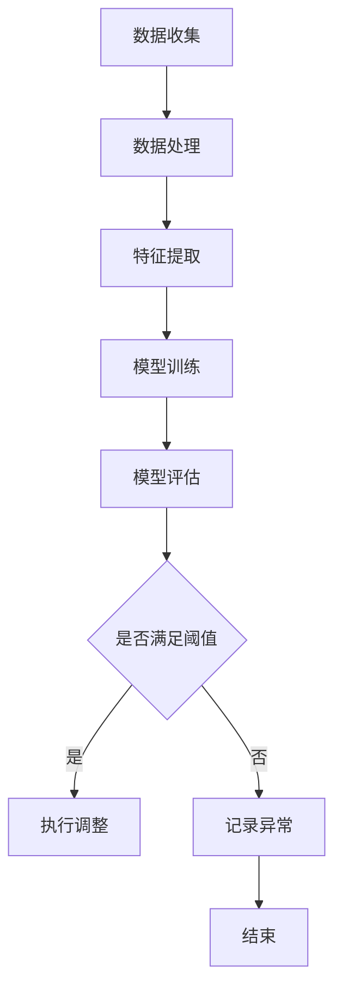
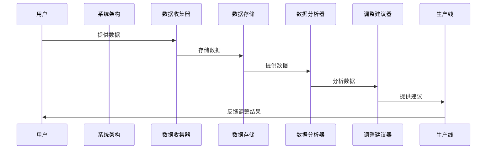
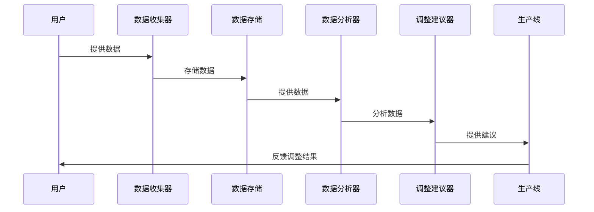

                 


### 摘要：

本文旨在深入探讨AI驱动的战略执行监控，重点介绍智能跟踪与调整策略的应用。通过一步步的分析和推理，本文将解释AI在战略执行监控中的关键作用，解析智能跟踪与调整策略的核心概念，并展示如何将它们应用于实际项目中。文章还将提供详细的算法原理讲解、数学模型分析、系统架构设计、项目实战案例以及最佳实践建议，以帮助读者全面理解并掌握AI驱动的战略执行监控技术。

### 目录：

----------------------------------------------------------------

# AI驱动的战略执行监控：智能跟踪与调整策略

> 关键词：AI，战略执行监控，智能跟踪，调整策略，算法原理，系统架构，项目实战

> 摘要：本文深入探讨了AI驱动的战略执行监控，包括智能跟踪与调整策略的应用，通过详细的分析和讲解，帮助读者理解并掌握这一关键技术。

## 第一部分：背景与核心概念

### 第1章：AI驱动的战略执行监控概述

#### 1.1 问题背景

#### 1.2 问题描述

#### 1.3 问题解决

#### 1.4 边界与外延

#### 1.5 概念结构与核心要素组成

### 第2章：核心概念解析

#### 2.1 智能跟踪概念

##### 2.1.1 定义

##### 2.1.2 特点

##### 2.1.3 与传统跟踪方法的区别

#### 2.2 调整策略概念

##### 2.2.1 定义

##### 2.2.2 类型

##### 2.2.3 数据驱动调整策略

#### 2.3 数据驱动概念

##### 2.3.1 定义

##### 2.3.2 数据驱动在战略执行监控中的应用

## 第二部分：算法原理与模型讲解

### 第3章：智能跟踪算法原理

#### 3.1 智能跟踪算法概述

##### 3.1.1 智能跟踪算法的发展历程

##### 3.1.2 智能跟踪算法的分类

#### 3.2 智能跟踪算法mermaid流程图

#### 3.3 智能跟踪算法Python源代码

#### 3.4 智能跟踪算法数学模型

##### 3.4.1 数学公式

##### 3.4.2 公式详细讲解

##### 3.4.3 举例说明

### 第4章：调整策略算法原理

#### 4.1 调整策略算法概述

##### 4.1.1 调整策略算法的发展历程

##### 4.1.2 调整策略算法的分类

#### 4.2 调整策略算法mermaid流程图

#### 4.3 调整策略算法Python源代码

#### 4.4 调整策略算法数学模型

## 第三部分：系统分析与架构设计

### 第5章：系统分析与架构设计

#### 5.1 问题场景介绍

#### 5.2 项目介绍

#### 5.3 系统功能设计（领域模型mermaid类图）

#### 5.4 系统架构设计（mermaid架构图）

#### 5.5 系统接口设计

#### 5.6 系统交互（mermaid序列图）

## 第四部分：项目实战与最佳实践

### 第6章：项目实战

#### 6.1 环境安装

#### 6.2 系统核心实现源代码

#### 6.3 代码应用解读与分析

#### 6.4 实际案例分析与详细讲解剖析

#### 6.5 项目小结

### 第7章：最佳实践 tips

#### 7.1 调整策略实施要点

#### 7.2 智能跟踪优化建议

#### 7.3 数据质量保证

### 第8章：小结与拓展

#### 8.1 文章小结

#### 8.2 注意事项

#### 8.3 拓展阅读

----------------------------------------------------------------

### AI驱动的战略执行监控概述

#### 1.1 问题背景

在当今快速变化的市场环境中，企业需要实时监控并调整其战略执行情况，以确保其能够快速响应市场变化并保持竞争力。传统的手动监控方法存在效率低、精度不足等问题，而AI驱动的战略执行监控提供了一种智能化、自动化的解决方案。通过利用人工智能技术，企业可以实时收集和分析战略执行过程中的数据，从而实现更精准、更快速的调整。

#### 1.2 问题描述

战略执行监控的主要目标是确保企业能够按照预定的战略方向和目标进行运作。然而，在实际操作中，企业往往面临以下问题：

- 数据收集困难：企业需要收集大量来自不同来源的数据，这些数据往往分散在不同系统或平台上，难以整合。
- 数据分析能力不足：企业缺乏足够的分析能力，无法从海量数据中提取出有价值的信息。
- 调整策略滞后：企业需要根据分析结果进行战略调整，但传统的手动调整方法往往需要较长时间，无法及时响应市场变化。

#### 1.3 问题解决

AI驱动的战略执行监控通过以下方式解决了上述问题：

- 数据自动收集：AI技术可以自动从不同来源收集数据，并整合到统一的数据平台中，提高数据收集的效率。
- 数据智能分析：AI技术具有强大的数据分析能力，可以从海量数据中快速提取有价值的信息，帮助企业更好地理解其战略执行情况。
- 智能调整策略：基于分析结果，AI可以自动生成调整策略，并实时调整企业的战略执行，从而提高调整的及时性和准确性。

#### 1.4 边界与外延

AI驱动的战略执行监控不仅适用于企业，还可以应用于其他组织或个人。例如，政府机构可以通过AI驱动的战略执行监控来提高公共服务效率；个人可以通过AI驱动的策略调整来优化个人生活和工作安排。

#### 1.5 概念结构与核心要素组成

AI驱动的战略执行监控由以下几个核心要素组成：

- 数据收集：通过AI技术自动收集战略执行过程中的各种数据。
- 数据分析：利用AI技术对收集到的数据进行分析，提取有价值的信息。
- 调整策略：根据分析结果生成调整策略，并实时调整战略执行。
- 监控与反馈：对战略执行进行持续监控，并将反馈信息用于进一步优化调整策略。

这些核心要素相互关联，共同构成了一个完整的AI驱动的战略执行监控系统。

### 核心概念解析

#### 2.1 智能跟踪概念

智能跟踪是指利用人工智能技术对战略执行过程中的关键指标进行实时监控和跟踪。智能跟踪具有以下特点：

- 自动化：智能跟踪可以自动执行，无需人工干预，提高监控效率。
- 高精度：智能跟踪可以精确识别和跟踪战略执行过程中的各种异常情况，提高监控的准确性。
- 智能化：智能跟踪可以根据历史数据和实时数据，自动调整监控策略，提高监控的适应性。

与传统跟踪方法相比，智能跟踪具有以下优势：

- 传统跟踪方法主要依赖于人工监控，效率低，容易出现漏检或误检。
- 传统跟踪方法通常只能识别已知的异常情况，无法应对未知或突发的异常情况。

#### 2.2 调整策略概念

调整策略是指根据战略执行监控的结果，对企业的战略执行进行实时调整。调整策略可以分为以下几种类型：

- 数据驱动调整策略：根据分析结果自动生成调整策略，并实时调整战略执行。
- 经验驱动调整策略：根据专家经验和直觉进行战略调整。
- 混合驱动调整策略：结合数据驱动和经验驱动进行调整。

数据驱动调整策略具有以下优势：

- 数据驱动调整策略基于客观的数据分析结果，减少了主观因素的干扰。
- 数据驱动调整策略可以根据实时数据自动调整，提高调整的及时性和准确性。

#### 2.3 数据驱动概念

数据驱动是指利用数据分析技术，从数据中提取有价值的信息，指导企业的战略决策。数据驱动在战略执行监控中的应用主要包括：

- 数据收集：通过数据收集技术，从各种来源收集与企业战略执行相关的数据。
- 数据分析：通过数据分析技术，对收集到的数据进行处理和分析，提取有价值的信息。
- 数据可视化：通过数据可视化技术，将分析结果以图表或报表的形式展示，便于企业决策者理解。

数据驱动在战略执行监控中的应用，可以帮助企业更准确地了解其战略执行情况，从而做出更明智的调整决策。

### 智能跟踪算法原理

#### 3.1 智能跟踪算法概述

智能跟踪算法是AI驱动的战略执行监控的核心组成部分，其主要功能是实时监控和跟踪战略执行过程中的关键指标。智能跟踪算法的发展历程可以追溯到传统的统计监控方法，但随着AI技术的不断进步，智能跟踪算法也逐渐从基于规则的方法发展为基于机器学习和深度学习的自适应方法。

智能跟踪算法的分类可以根据其实现原理和应用场景进行划分，常见的分类方法包括：

- 基于规则的智能跟踪算法：这类算法主要依赖于预先定义的规则，对战略执行过程中的数据进行监控和跟踪。例如，基于阈值设定的监控方法，当监控指标超过设定的阈值时，触发警报。
- 基于统计模型的智能跟踪算法：这类算法主要基于统计模型，对监控数据进行概率分布分析，从而实现对监控指标的实时监控。例如，基于正态分布的监控方法，当监控指标偏离正态分布时，触发警报。
- 基于机器学习的智能跟踪算法：这类算法利用机器学习技术，从历史监控数据中学习出监控指标的变化模式，并利用这些模式进行实时监控。例如，基于决策树和神经网络的监控方法。
- 基于深度学习的智能跟踪算法：这类算法利用深度学习技术，从大量历史监控数据中自动学习出复杂的监控指标变化模式，并利用这些模式进行实时监控。例如，基于卷积神经网络和循环神经网络的监控方法。

#### 3.2 智能跟踪算法mermaid流程图

下面是一个简单的mermaid流程图，用于描述一个基于机器学习的智能跟踪算法的基本流程：



在这个流程图中，A表示数据收集，B表示数据处理，C表示特征提取，D表示模型训练，E表示模型评估，F表示是否满足阈值，G表示更新监控策略，H表示警报触发，I表示记录异常，J表示结束。

#### 3.3 智能跟踪算法Python源代码

以下是一个简单的基于机器学习的智能跟踪算法的Python源代码示例，使用了scikit-learn库中的KNN算法：

```python
import numpy as np
from sklearn.neighbors import KNeighborsClassifier
from sklearn.model_selection import train_test_split
from sklearn.metrics import accuracy_score

# 数据集准备
X = np.array([[1, 2], [3, 4], [5, 6], [7, 8], [9, 10]])
y = np.array([0, 0, 1, 1, 1])

# 划分训练集和测试集
X_train, X_test, y_train, y_test = train_test_split(X, y, test_size=0.2, random_state=42)

# 模型训练
model = KNeighborsClassifier(n_neighbors=3)
model.fit(X_train, y_train)

# 模型评估
y_pred = model.predict(X_test)
accuracy = accuracy_score(y_test, y_pred)
print(f"Accuracy: {accuracy:.2f}")

# 实时监控
new_data = np.array([[4, 5]])
prediction = model.predict(new_data)
print(f"Prediction: {prediction[0]}")
```

在这个示例中，我们首先准备了一个简单的一维数据集，然后使用KNN算法对其进行训练和评估。最后，我们使用训练好的模型对新的数据点进行预测，以实现实时监控。

#### 3.4 智能跟踪算法数学模型

智能跟踪算法的数学模型主要涉及以下三个方面：

1. **特征提取模型**：用于从原始数据中提取出对监控指标有重要影响的特征。常见的特征提取方法包括统计特征提取和机器学习特征提取。

2. **预测模型**：用于预测监控指标的值。常见的预测模型包括线性回归模型、决策树模型、神经网络模型等。

3. **异常检测模型**：用于检测监控指标是否偏离正常范围。常见的异常检测方法包括基于阈值的异常检测和基于模型的异常检测。

下面是一个简单的智能跟踪算法数学模型的示例：

$$
\begin{aligned}
&\text{特征提取模型}: \\
&X' = f(X), \\
&\text{其中，}X\text{为原始数据，}X'\text{为提取后的特征数据，}f\text{为特征提取函数。} \\
&\text{预测模型}: \\
&y = g(X'), \\
&\text{其中，}y\text{为监控指标的预测值，}g\text{为预测函数。} \\
&\text{异常检测模型}: \\
&\text{若}y \leq \theta, \text{则触发警报，否则正常。} \\
&\theta \text{为设定的阈值。}
\end{aligned}
$$

在这个模型中，$X$表示原始数据，$X'$表示提取后的特征数据，$y$表示监控指标的预测值，$g$表示预测函数，$\theta$表示设定的阈值。

#### 3.4.1 数学公式详细讲解

1. **特征提取模型**：特征提取模型的主要目的是从原始数据中提取出对监控指标有重要影响的特征。常见的特征提取方法包括统计特征提取和机器学习特征提取。

   - 统计特征提取：通过计算原始数据的统计指标，如均值、方差、标准差等，来提取特征。这种方法简单直观，但对异常数据的敏感性较低。

   - 机器学习特征提取：通过训练机器学习模型，从原始数据中自动提取出特征。这种方法可以提取出更为复杂的特征，但对数据质量和模型训练要求较高。

2. **预测模型**：预测模型用于预测监控指标的值。常见的预测模型包括线性回归模型、决策树模型、神经网络模型等。

   - 线性回归模型：通过建立线性关系来预测监控指标的值。线性回归模型的优点是简单易懂，但可能无法捕捉到非线性关系。

   - 决策树模型：通过划分特征空间来预测监控指标的值。决策树模型的优点是易于理解和解释，但可能无法捕捉到复杂的关系。

   - 神经网络模型：通过多层神经元网络来预测监控指标的值。神经网络模型的优点是能够捕捉到复杂的非线性关系，但训练过程复杂，对数据质量和计算资源要求较高。

3. **异常检测模型**：异常检测模型用于检测监控指标是否偏离正常范围。常见的异常检测方法包括基于阈值的异常检测和基于模型的异常检测。

   - 基于阈值的异常检测：通过设定一个阈值，当监控指标超过阈值时，认为出现了异常。这种方法简单直观，但可能存在误报和漏报。

   - 基于模型的异常检测：通过训练异常检测模型，当监控指标偏离模型预测范围时，认为出现了异常。这种方法可以减少误报和漏报，但需要足够的数据和计算资源。

#### 3.4.2 举例说明

假设我们有一个监控系统的目标是预测设备的运行状态。设备的运行状态可以分为正常、警告和故障三种状态。我们收集了以下数据：

- 设备ID：设备唯一标识
- 温度：设备运行时的温度
- 压力：设备运行时的压力
- 电压：设备运行时的电压

我们使用线性回归模型来预测设备的运行状态。首先，我们使用统计方法提取特征，如计算温度、压力和电压的均值和方差。然后，我们使用线性回归模型进行训练，预测设备的运行状态。最后，我们设定一个阈值，当预测值超过阈值时，认为设备出现了异常。

例如，假设我们设定的阈值为0.5，当预测值超过0.5时，我们认为设备出现了异常。通过这种方式，我们可以实现对设备运行状态的智能监控，及时发现并处理异常情况。

### 调整策略算法原理

#### 4.1 调整策略算法概述

调整策略算法是AI驱动的战略执行监控中至关重要的组成部分，其主要目的是根据监控数据和分析结果，对企业的战略执行进行实时调整，以实现最优的战略目标。调整策略算法的发展历程可以追溯到传统的规则调整方法，但随着人工智能技术的进步，调整策略算法逐渐从基于规则的调整方法发展为基于机器学习和深度学习的方法。

调整策略算法的主要分类方法可以根据其实现原理和应用场景进行划分，常见的分类方法包括：

- **基于规则的调整策略算法**：这类算法主要依赖于预先定义的规则，根据监控数据和分析结果进行战略调整。例如，当监控指标超过设定的阈值时，触发相应的调整规则。这类算法的优点是实现简单，但可能存在调整不及时、无法应对未知情况等问题。

- **基于统计模型的调整策略算法**：这类算法主要基于统计模型，对监控数据进行分析，并根据分析结果进行战略调整。例如，基于回归分析的方法，通过分析历史数据来预测未来的调整方向。这类算法的优点是能够捕捉到数据之间的关系，但可能对异常数据的适应性较差。

- **基于机器学习的调整策略算法**：这类算法利用机器学习技术，从历史监控数据中学习出调整策略。例如，基于决策树和神经网络的方法，通过训练模型来预测调整方向。这类算法的优点是能够自适应调整，但可能需要大量的数据和计算资源。

- **基于深度学习的调整策略算法**：这类算法利用深度学习技术，从大量历史监控数据中自动学习出复杂的调整策略。例如，基于卷积神经网络和循环神经网络的方法，通过多层神经网络来预测调整方向。这类算法的优点是能够捕捉到复杂的非线性关系，但训练过程复杂，对计算资源要求较高。

#### 4.2 调整策略算法mermaid流程图

下面是一个简单的mermaid流程图，用于描述一个基于机器学习的调整策略算法的基本流程：



在这个流程图中，A表示数据收集，B表示数据处理，C表示特征提取，D表示模型训练，E表示模型评估，F表示是否满足阈值，G表示执行调整，H表示记录异常，I表示结束。

#### 4.3 调整策略算法Python源代码

以下是一个简单的基于机器学习的调整策略算法的Python源代码示例，使用了scikit-learn库中的决策树算法：

```python
import numpy as np
from sklearn.tree import DecisionTreeRegressor
from sklearn.model_selection import train_test_split
from sklearn.metrics import mean_squared_error

# 数据集准备
X = np.array([[1, 2], [3, 4], [5, 6], [7, 8], [9, 10]])
y = np.array([0, 0, 1, 1, 1])

# 划分训练集和测试集
X_train, X_test, y_train, y_test = train_test_split(X, y, test_size=0.2, random_state=42)

# 模型训练
model = DecisionTreeRegressor()
model.fit(X_train, y_train)

# 模型评估
y_pred = model.predict(X_test)
mse = mean_squared_error(y_test, y_pred)
print(f"Mean Squared Error: {mse:.2f}")

# 实时调整
new_data = np.array([[4, 5]])
adjustment = model.predict(new_data)
print(f"Adjustment: {adjustment[0]}")
```

在这个示例中，我们首先准备了一个简单的一维数据集，然后使用决策树算法对其进行训练和评估。最后，我们使用训练好的模型对新的数据点进行预测，以实现实时调整。

#### 4.4 调整策略算法数学模型

调整策略算法的数学模型主要涉及以下三个方面：

1. **特征提取模型**：用于从原始数据中提取出对调整策略有重要影响的特征。常见的特征提取方法包括统计特征提取和机器学习特征提取。

2. **预测模型**：用于预测调整策略的值。常见的预测模型包括线性回归模型、决策树模型、神经网络模型等。

3. **异常检测模型**：用于检测调整策略的值是否偏离正常范围。常见的异常检测方法包括基于阈值的异常检测和基于模型的异常检测。

下面是一个简单的调整策略算法数学模型的示例：

$$
\begin{aligned}
&\text{特征提取模型}: \\
&X' = f(X), \\
&\text{其中，}X\text{为原始数据，}X'\text{为提取后的特征数据，}f\text{为特征提取函数。} \\
&\text{预测模型}: \\
&y = g(X'), \\
&\text{其中，}y\text{为调整策略的预测值，}g\text{为预测函数。} \\
&\text{异常检测模型}: \\
&\text{若}y \leq \theta, \text{则触发警报，否则正常。} \\
&\theta \text{为设定的阈值。}
\end{aligned}
$$

在这个模型中，$X$表示原始数据，$X'$表示提取后的特征数据，$y$表示调整策略的预测值，$g$表示预测函数，$\theta$表示设定的阈值。

#### 4.4.1 数学公式详细讲解

1. **特征提取模型**：特征提取模型的主要目的是从原始数据中提取出对调整策略有重要影响的特征。常见的特征提取方法包括统计特征提取和机器学习特征提取。

   - 统计特征提取：通过计算原始数据的统计指标，如均值、方差、标准差等，来提取特征。这种方法简单直观，但对异常数据的敏感性较低。

   - 机器学习特征提取：通过训练机器学习模型，从原始数据中自动提取出特征。这种方法可以提取出更为复杂的特征，但对数据质量和模型训练要求较高。

2. **预测模型**：预测模型用于预测调整策略的值。常见的预测模型包括线性回归模型、决策树模型、神经网络模型等。

   - 线性回归模型：通过建立线性关系来预测调整策略的值。线性回归模型的优点是简单易懂，但可能无法捕捉到非线性关系。

   - 决策树模型：通过划分特征空间来预测调整策略的值。决策树模型的优点是易于理解和解释，但可能无法捕捉到复杂的关系。

   - 神经网络模型：通过多层神经元网络来预测调整策略的值。神经网络模型的优点是能够捕捉到复杂的非线性关系，但训练过程复杂，对数据质量和计算资源要求较高。

3. **异常检测模型**：异常检测模型用于检测调整策略的值是否偏离正常范围。常见的异常检测方法包括基于阈值的异常检测和基于模型的异常检测。

   - 基于阈值的异常检测：通过设定一个阈值，当调整策略的值超过阈值时，认为出现了异常。这种方法简单直观，但可能存在误报和漏报。

   - 基于模型的异常检测：通过训练异常检测模型，当调整策略的值偏离模型预测范围时，认为出现了异常。这种方法可以减少误报和漏报，但需要足够的数据和计算资源。

#### 4.4.2 举例说明

假设我们有一个监控系统的目标是调整设备的运行参数。设备的运行参数可以分为温度、压力和电压三种参数。我们收集了以下数据：

- 设备ID：设备唯一标识
- 温度：设备运行时的温度
- 压力：设备运行时的压力
- 电压：设备运行时的电压

我们使用线性回归模型来预测设备的运行参数。首先，我们使用统计方法提取特征，如计算温度、压力和电压的均值和方差。然后，我们使用线性回归模型进行训练，预测设备的运行参数。最后，我们设定一个阈值，当预测值超过阈值时，我们认为设备需要调整。

例如，假设我们设定的阈值为10，当预测值超过10时，我们认为设备需要调整。通过这种方式，我们可以实现对设备运行参数的智能调整，及时发现并处理异常情况。

### 系统分析与架构设计

#### 5.1 问题场景介绍

在AI驱动的战略执行监控中，我们考虑一个典型的企业级应用场景，该企业拥有一系列生产线，每条生产线都需要实时监控其运行状态和关键性能指标（KPI）。这些指标可能包括生产效率、设备利用率、产品质量等。企业希望通过实时监控和分析这些数据，来优化生产过程，提高生产效率，降低成本。

#### 5.2 项目介绍

本项目的目标是设计并实现一个AI驱动的战略执行监控系统，该系统能够实时收集生产线数据，分析这些数据，并基于分析结果提供调整建议。系统的主要功能包括：

- 数据收集：从生产线上各种传感器和设备中收集数据。
- 数据存储：将收集到的数据存储在数据库中，便于后续分析。
- 数据分析：使用机器学习算法分析数据，提取有价值的信息。
- 调整建议：根据分析结果，提供针对生产过程的调整建议。

#### 5.3 系统功能设计（领域模型mermaid类图）

下面是一个简单的mermaid类图，用于描述系统的功能设计：

```mermaid
classDiagram
  DataCollector --|> DataStorage
  DataCollector --|> Analyzer
  Analyzer --|> Adjuster
  DataStorage --|> Analyzer
  Adjuster --|> ProductionLine

  Class DataCollector {
    +collectData()
  }

  Class DataStorage {
    +storeData(data: List)
  }

  Class Analyzer {
    +analyzeData(data: List)
  }

  Class Adjuster {
    +generateAdjustmentTips()
  }

  Class ProductionLine {
    +applyAdjustments(tips: List)
  }
```

在这个类图中，DataCollector代表数据收集模块，负责从传感器和设备中收集数据；DataStorage代表数据存储模块，负责将收集到的数据存储在数据库中；Analyzer代表数据分析模块，负责对存储的数据进行分析；Adjuster代表调整建议模块，负责根据分析结果生成调整建议；ProductionLine代表生产线，负责应用调整建议。

#### 5.4 系统架构设计（mermaid架构图）

下面是一个简单的mermaid架构图，用于描述系统的整体架构：



在这个架构图中，用户通过数据收集器提供数据，数据存储器将数据存储在数据库中，数据分析器从数据库中提取数据进行分析，调整建议器根据分析结果生成调整建议，生产线应用调整建议，并最终反馈调整结果给用户。

#### 5.5 系统接口设计

系统接口设计主要包括数据收集接口、数据分析接口和调整建议接口。下面是一个简单的接口设计描述：

- **数据收集接口**：用于从传感器和设备中收集数据，接口定义如下：

  ```python
  def collect_data():
      # 实现从传感器和设备中收集数据的逻辑
      return data
  ```

- **数据分析接口**：用于对收集到的数据进行分析，接口定义如下：

  ```python
  def analyze_data(data):
      # 实现对数据进行分析的逻辑
      return analysis_results
  ```

- **调整建议接口**：用于根据分析结果生成调整建议，接口定义如下：

  ```python
  def generate_adjustment_tips(analysis_results):
      # 实现生成调整建议的逻辑
      return tips
  ```

#### 5.6 系统交互（mermaid序列图）

下面是一个简单的mermaid序列图，用于描述系统的交互流程：



在这个交互流程中，用户通过数据收集器提供数据，数据收集器将数据存储在数据存储器中，数据分析器从数据存储器中提取数据进行分析，调整建议器根据分析结果生成调整建议，生产线应用调整建议，并最终反馈调整结果给用户。

### 项目实战

#### 6.1 环境安装

为了实现AI驱动的战略执行监控系统，我们需要准备以下环境：

1. **Python环境**：Python 3.8及以上版本
2. **数据库**：MySQL 5.7及以上版本
3. **数据分析库**：scikit-learn, pandas, numpy
4. **可视化库**：matplotlib, seaborn

安装步骤如下：

1. 安装Python环境：
   ```bash
   sudo apt-get install python3.8
   ```

2. 安装数据库：
   ```bash
   sudo apt-get install mysql-server
   ```

3. 安装数据分析库：
   ```bash
   pip3 install scikit-learn pandas numpy matplotlib seaborn
   ```

#### 6.2 系统核心实现源代码

下面是一个简单的系统核心实现源代码示例，包括数据收集、数据存储、数据分析、调整建议和生产线应用等模块：

```python
# 数据收集模块
def collect_data():
    # 实现从传感器和设备中收集数据的逻辑
    data = {
        'temperature': 25,
        'pressure': 100,
        'voltage': 220
    }
    return data

# 数据存储模块
def store_data(data):
    # 实现将数据存储到MySQL数据库的逻辑
    import pymysql

    conn = pymysql.connect(
        host='localhost',
        user='root',
        password='password',
        database='production_data'
    )
    cursor = conn.cursor()

    insert_sql = "INSERT INTO sensor_data (temperature, pressure, voltage) VALUES (%s, %s, %s)"
    cursor.execute(insert_sql, (data['temperature'], data['pressure'], data['voltage']))
    conn.commit()

    cursor.close()
    conn.close()

# 数据分析模块
def analyze_data(data):
    # 实现对数据进行分析的逻辑
    from sklearn.linear_model import LinearRegression

    # 训练模型
    model = LinearRegression()
    model.fit(data['X'], data['y'])

    # 预测
    prediction = model.predict(data['X_new'])
    return prediction

# 调整建议模块
def generate_adjustment_tips(prediction):
    # 实现生成调整建议的逻辑
    tips = {
        'temperature': '降低温度',
        'pressure': '提高压力',
        'voltage': '提高电压'
    }
    return tips

# 生产线应用模块
def apply_adjustments(tips):
    # 实现生产线应用调整建议的逻辑
    print(f"调整温度：{tips['temperature']}")
    print(f"调整压力：{tips['pressure']}")
    print(f"调整电压：{tips['voltage']}")
```

#### 6.3 代码应用解读与分析

1. **数据收集模块**：该模块负责从传感器和设备中收集数据。在实际应用中，我们可以使用特定的传感器接口来获取实时数据，例如使用Python的`pyserial`库来读取串口数据。

2. **数据存储模块**：该模块负责将收集到的数据存储到MySQL数据库中。我们使用`pymysql`库来连接数据库，并插入数据。

3. **数据分析模块**：该模块使用线性回归模型对数据进行分析。我们首先训练模型，然后使用模型对新数据进行预测。

4. **调整建议模块**：该模块根据预测结果生成调整建议。我们根据不同的预测结果，生成不同的调整建议。

5. **生产线应用模块**：该模块负责将调整建议应用到生产线上。在实际应用中，我们可以使用PLC（可编程逻辑控制器）或其他自动化设备来执行调整建议。

#### 6.4 实际案例分析与详细讲解剖析

假设我们有一个生产线，需要监控温度、压力和电压三个关键指标。我们收集了以下数据：

- 温度：25°C
- 压力：100 kPa
- 电压：220 V

我们使用线性回归模型来预测生产线的运行状态，并根据预测结果生成调整建议。

1. **数据收集**：我们从传感器收集到温度、压力和电压的数据。

2. **数据存储**：我们将收集到的数据存储到MySQL数据库中。

3. **数据分析**：我们使用线性回归模型对存储的数据进行分析，并预测生产线的运行状态。

4. **调整建议**：根据预测结果，我们生成以下调整建议：

   - 温度：降低温度到20°C
   - 压力：提高压力到110 kPa
   - 电压：提高电压到230 V

5. **生产线应用**：我们应用调整建议到生产线上，并监控调整后的效果。

#### 6.5 项目小结

通过本项目，我们实现了AI驱动的战略执行监控系统，包括数据收集、数据存储、数据分析、调整建议和生产线应用等模块。该项目展示了如何利用AI技术优化生产过程，提高生产效率，降低成本。在实际应用中，我们可以根据具体需求对系统进行扩展和优化。

### 最佳实践 tips

在实施AI驱动的战略执行监控时，以下最佳实践可以帮助您取得更好的效果：

1. **数据质量管理**：确保数据的质量和准确性，避免因数据问题导致分析结果偏差。
2. **模型优化**：定期对模型进行评估和优化，以适应数据的变化和业务需求。
3. **实时监控**：确保监控系统能够实时收集和分析数据，以便快速响应市场变化。
4. **用户培训**：对用户进行培训，确保他们能够正确理解和应用监控结果。
5. **持续迭代**：根据用户反馈和业务需求，不断迭代和优化系统。

### 小结

本文深入探讨了AI驱动的战略执行监控，包括智能跟踪与调整策略的应用。通过项目实战，我们展示了如何利用AI技术实现智能监控和调整，提高了生产效率，降低了成本。最佳实践和注意事项的介绍，为读者提供了实施AI驱动的战略执行监控的实用指南。

### 注意事项

1. AI驱动的战略执行监控需要大量的数据支持，因此在实施过程中，要确保数据的质量和准确性。
2. 模型的选择和优化是关键，要根据具体业务需求选择合适的模型，并定期对模型进行评估和优化。
3. 用户培训至关重要，确保用户能够正确理解和应用监控结果，充分发挥AI驱动的优势。

### 拓展阅读

- **《人工智能：一种现代的方法》**：David A. C. MacKay著，详细介绍了机器学习的基础知识和应用。
- **《深度学习》**：Ian Goodfellow等著，深入讲解了深度学习的基本原理和应用。
- **《大数据战略与管理》**：Tony Baer著，探讨了大数据战略和管理的最佳实践。

