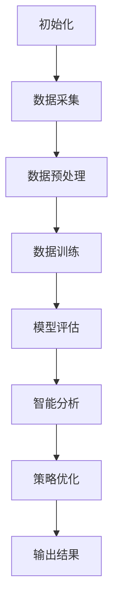
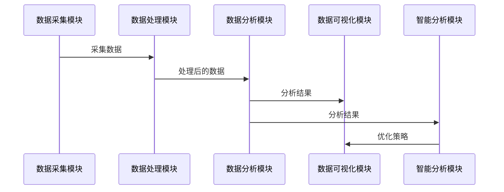

                 

### 第一部分: 背景介绍

#### 第1章: 问题背景

##### 1.1.1 问题背景介绍

在现代商业环境中，企业需要不断调整和优化其战略以适应快速变化的市场需求。然而，战略的制定和实施之间存在巨大的鸿沟。许多企业在战略执行过程中面临着诸多挑战，如信息不对称、资源分配不当、执行力不足等。这不仅导致战略目标无法顺利达成，还可能导致企业竞争优势的丧失。因此，如何有效地监控战略执行过程、确保战略落地成为企业管理者亟待解决的问题。

##### 1.1.2 问题描述

战略执行监控的核心问题在于如何实时、准确地获取战略执行过程中的关键数据，并通过分析这些数据来评估战略实施的进展情况。具体来说，问题可以概括为以下几个方面：

1. 数据采集：如何从多个数据源中高效地收集战略执行过程中的关键数据？
2. 数据处理：如何处理和整合来自不同数据源的数据，以便进行分析和监控？
3. 数据可视化：如何将处理后的数据以直观、易懂的方式展示出来，帮助管理者了解战略执行的实际情况？
4. 智能分析：如何利用人工智能技术对战略执行数据进行分析，发现潜在问题并提出改进建议？

##### 1.1.3 问题解决思路

为了解决上述问题，我们需要采用一种AI驱动的战略执行监控方法。该方法的核心思想是利用人工智能技术对战略执行过程中的数据进行智能采集、处理和分析，从而实现战略执行的实时监控和智能优化。具体解决思路如下：

1. **数据采集与整合**：通过集成各类数据源，如企业资源计划系统（ERP）、客户关系管理系统（CRM）等，实现对战略执行过程中关键数据的自动化采集和整合。
2. **数据处理与分析**：利用数据预处理技术对采集到的数据进行清洗、转换和整合，然后利用机器学习算法对数据进行分析，提取有价值的信息。
3. **数据可视化与监控**：将处理后的数据通过可视化技术展示出来，帮助管理者实时了解战略执行的进展情况，及时发现潜在问题。
4. **智能分析与优化**：利用人工智能技术对战略执行数据进行分析，识别战略执行过程中的关键因素，提出优化策略，帮助企业实现战略目标。

##### 1.1.4 边界与外延

1. **边界**：本文主要讨论AI驱动的战略执行监控方法，不包括战略制定和目标设定等内容。
2. **外延**：AI驱动的战略执行监控方法可以应用于各个行业和企业，具有广泛的适用性。

##### 1.1.5 概念结构与核心要素组成

本文的核心概念包括AI驱动、战略执行监控、数据采集、数据处理、数据可视化、智能分析等。这些概念相互关联，共同构成了AI驱动的战略执行监控系统的核心要素。

### 第2章: 核心概念与联系

#### 2.1 AI驱动的战略执行监控概述

##### 2.1.1 AI驱动的定义

AI驱动（Artificial Intelligence-driven）是指利用人工智能技术来推动业务流程的优化和改进。在战略执行监控领域，AI驱动的核心在于利用人工智能技术对战略执行过程中的数据进行智能分析和决策支持。

##### 2.1.2 战略执行监控的定义

战略执行监控（Strategic Execution Monitoring）是指对战略执行过程进行实时监控和评估，以确保战略目标的顺利实现。通过战略执行监控，企业可以及时发现和解决战略执行过程中的问题，提高战略执行力。

##### 2.1.3 关键技术介绍

1. **数据采集与整合**：通过集成各类数据源，实现对战略执行过程中关键数据的自动化采集和整合。
2. **数据处理与分析**：利用数据预处理技术对采集到的数据进行清洗、转换和整合，然后利用机器学习算法对数据进行分析，提取有价值的信息。
3. **数据可视化与监控**：将处理后的数据通过可视化技术展示出来，帮助管理者实时了解战略执行的进展情况，及时发现潜在问题。
4. **智能分析与优化**：利用人工智能技术对战略执行数据进行分析，识别战略执行过程中的关键因素，提出优化策略，帮助企业实现战略目标。

##### 2.1.4 概念属性特征对比表格

| 概念                 | 特征描述                                           |
|----------------------|----------------------------------------------------|
| AI驱动               | 利用人工智能技术推动业务优化                       |
| 战略执行监控         | 实时监控和评估战略执行过程                       |
| 数据采集与整合       | 自动化采集和整合战略执行过程中的关键数据           |
| 数据处理与分析       | 数据清洗、转换、整合和机器学习分析                 |
| 数据可视化与监控     | 可视化展示处理后的数据，帮助管理者了解战略执行情况 |
| 智能分析与优化       | 利用人工智能技术分析战略执行数据，提出优化建议     |

##### 2.1.5 ER实体关系图架构


在AI驱动的战略执行监控系统中，主要包括以下实体和关系：

1. **数据源**：包括企业内部各类系统（如ERP、CRM等）和企业外部数据源（如市场调研数据、竞争对手数据等）。
2. **数据采集模块**：负责从数据源中自动化采集关键数据。
3. **数据处理模块**：负责对采集到的数据进行清洗、转换和整合。
4. **数据分析模块**：利用机器学习算法对数据进行分析，提取有价值的信息。
5. **数据可视化模块**：将处理后的数据以可视化形式展示给管理者。
6. **智能分析模块**：利用人工智能技术对战略执行数据进行分析，识别关键因素，提出优化建议。

通过上述实体和关系，AI驱动的战略执行监控系统实现了从数据采集、处理、分析到可视化、智能优化的完整流程。### 第二部分: 算法原理讲解

#### 第3章: 算法原理

##### 3.1 算法概述

AI驱动的战略执行监控算法旨在通过智能分析和优化，实现战略执行的实时监控和高效执行。该算法的核心在于利用机器学习技术对战略执行过程中的数据进行深度挖掘和分析，从而识别关键因素和潜在问题，为管理者提供决策支持。

##### 3.2 Mermaid算法流程图



##### 3.3 Python源代码与算法原理

```python
import pandas as pd
from sklearn.model_selection import train_test_split
from sklearn.ensemble import RandomForestClassifier
from sklearn.metrics import accuracy_score

# 3.3.1 数据采集
data = pd.read_csv('strategic_execution_data.csv')

# 3.3.2 数据预处理
X = data.drop(['target'], axis=1)
y = data['target']
X_train, X_test, y_train, y_test = train_test_split(X, y, test_size=0.2, random_state=42)

# 3.3.3 数据训练
model = RandomForestClassifier(n_estimators=100, random_state=42)
model.fit(X_train, y_train)

# 3.3.4 模型评估
y_pred = model.predict(X_test)
accuracy = accuracy_score(y_test, y_pred)
print(f'Model accuracy: {accuracy:.2f}')

# 3.3.5 智能分析
# ... (additional code for intelligent analysis)
```

算法原理讲解：

1. **数据采集**：从企业内部和外部的数据源中获取战略执行过程中的关键数据，如销售数据、运营数据、市场数据等。
2. **数据预处理**：对采集到的数据进行清洗、转换和整合，以便于后续的建模和分析。
3. **数据训练**：利用机器学习算法（如随机森林）对预处理后的数据进行训练，建立预测模型。
4. **模型评估**：通过测试数据集对训练好的模型进行评估，确保模型的预测准确性和可靠性。
5. **智能分析**：利用训练好的模型对新的数据进行预测和分析，识别关键因素和潜在问题，为管理者提供决策支持。

##### 3.4 数学模型与公式

在战略执行监控算法中，我们可以使用以下数学模型和公式：

1. **回归模型**：
   $$ y = \beta_0 + \beta_1x_1 + \beta_2x_2 + ... + \beta_nx_n $$

2. **分类模型**：
   $$ P(y = c_k|x) = \frac{e^{\beta_0 + \beta_1x_1 + \beta_2x_2 + ... + \beta_nx_n}}{1 + \sum_{i=1}^{n}e^{\beta_i x_i}} $$

3. **随机森林模型**：
   $$ \hat{y} = \sum_{i=1}^{n} w_i f_i(x) $$

其中，\( y \) 为目标变量，\( x_1, x_2, ..., x_n \) 为特征变量，\( \beta_0, \beta_1, ..., \beta_n \) 为回归系数，\( P(y = c_k|x) \) 为分类概率，\( w_i \) 为权重，\( f_i(x) \) 为第 \( i \) 个决策树的预测结果。

##### 3.5 算法举例说明

假设我们有一个销售预测问题，其中目标变量是下一个季度的销售额，特征变量包括历史销售额、季节性因素、市场竞争状况等。我们可以使用回归模型对这个问题进行建模和预测。

1. **数据采集**：从企业数据库中获取历史销售额数据、季节性因素数据和市场竞争状况数据。
2. **数据预处理**：对数据集进行清洗、填充缺失值、归一化等处理。
3. **数据训练**：使用训练数据集对回归模型进行训练。
4. **模型评估**：使用测试数据集对训练好的模型进行评估。
5. **智能分析**：使用训练好的模型对新的一季销售额进行预测。

例如，我们训练好的回归模型为：

$$ \hat{y} = 10 + 0.5x_1 + 0.3x_2 - 0.2x_3 $$

其中，\( x_1 \) 是历史销售额，\( x_2 \) 是季节性因素，\( x_3 \) 是市场竞争状况。

如果当前季度的历史销售额为 100 万元，季节性因素为 1.2，市场竞争状况为 0.8，我们可以预测下一季度的销售额为：

$$ \hat{y} = 10 + 0.5 \times 100 + 0.3 \times 1.2 - 0.2 \times 0.8 = 57.4 $$

因此，下一季度的销售额预计为 57.4 万元。### 第三部分: 系统分析与架构设计

#### 第4章: 系统分析

##### 4.1 问题场景介绍

为了更好地理解AI驱动的战略执行监控系统，我们可以设想一个典型的企业应用场景。假设某家大型零售公司希望在战略执行过程中实现对销售额、库存、顾客满意度等关键指标的实时监控，以确保战略目标的顺利实现。该公司采用了多种数据源，如ERP系统、CRM系统、销售点系统（POS）等，积累了大量的战略执行数据。然而，如何有效地采集、处理、分析和利用这些数据，以实现战略执行监控，是一个亟待解决的问题。

##### 4.2 项目介绍

为了应对上述问题，我们计划开发一个AI驱动的战略执行监控系统。该系统将利用人工智能技术，对零售公司战略执行过程中的关键数据进行采集、处理、分析和可视化展示，帮助管理者实时了解战略执行的进展情况，及时发现和解决问题。具体项目目标如下：

1. **数据采集与整合**：集成各类数据源，实现对战略执行过程中关键数据的自动化采集和整合。
2. **数据处理与分析**：利用数据预处理技术和机器学习算法，对采集到的数据进行分析，提取有价值的信息。
3. **数据可视化与监控**：将处理后的数据以直观、易懂的方式展示出来，帮助管理者实时了解战略执行的进展情况。
4. **智能分析与优化**：利用人工智能技术对战略执行数据进行分析，识别关键因素和潜在问题，提出优化策略。

##### 4.3 系统功能设计

系统功能设计主要包括以下模块：

1. **数据采集模块**：负责从企业内部和外部的数据源中自动化采集战略执行过程中的关键数据。
2. **数据处理模块**：负责对采集到的数据进行清洗、转换和整合，以便于后续的分析和监控。
3. **数据分析模块**：利用数据预处理技术和机器学习算法，对处理后的数据进行分析，提取有价值的信息。
4. **数据可视化模块**：将分析结果以图表、报表等形式展示给管理者，帮助其实时了解战略执行的进展情况。
5. **智能分析模块**：利用人工智能技术对战略执行数据进行分析，识别关键因素和潜在问题，提出优化策略。

##### 4.4 系统架构设计

系统架构设计采用分层架构，主要包括以下层次：

1. **数据层**：包括企业内部和外部的各类数据源，如ERP系统、CRM系统、销售点系统（POS）等。
2. **采集层**：负责从数据层中自动化采集关键数据，并将其传输到处理层。
3. **处理层**：负责对采集到的数据进行清洗、转换和整合，以便于后续的分析和监控。
4. **分析层**：利用机器学习算法对处理后的数据进行分析，提取有价值的信息。
5. **展示层**：将分析结果以图表、报表等形式展示给管理者，帮助其实时了解战略执行的进展情况。
6. **智能层**：利用人工智能技术对战略执行数据进行分析，识别关键因素和潜在问题，提出优化策略。


##### 4.5 系统接口设计

系统接口设计主要包括以下方面：

1. **数据采集接口**：负责从各类数据源中自动化采集关键数据，并将其传输到处理层。
2. **数据处理接口**：负责对采集到的数据进行清洗、转换和整合，以便于后续的分析和监控。
3. **数据分析接口**：负责将处理后的数据传输到分析层，利用机器学习算法进行分析。
4. **数据可视化接口**：负责将分析结果以图表、报表等形式展示给管理者。
5. **智能分析接口**：负责利用人工智能技术对战略执行数据进行分析，识别关键因素和潜在问题，提出优化策略。

##### 4.6 系统交互序列图



系统交互序列图展示了系统各模块之间的交互过程。数据采集模块负责从数据源中采集关键数据，并将其传输到数据处理模块。数据处理模块对数据进行清洗、转换和整合，然后将处理后的数据传输到数据分析模块。数据分析模块利用机器学习算法对数据进行分析，并将分析结果传输给数据可视化模块和智能分析模块。数据可视化模块负责将分析结果以图表、报表等形式展示给管理者，智能分析模块则利用人工智能技术对分析结果进行进一步分析，提出优化策略。### 第四部分: 项目实战

#### 第5章: 项目实战

##### 5.1 环境安装

为了实现AI驱动的战略执行监控系统，我们需要搭建一个适当的环境。以下步骤展示了如何在Ubuntu 20.04操作系统上搭建所需的环境：

1. **安装Python**：
   ```bash
   sudo apt update
   sudo apt install python3.8
   ```

2. **安装虚拟环境**：
   ```bash
   sudo apt install python3.8-venv
   mkdir my_project
   cd my_project
   python3.8 -m venv venv
   source venv/bin/activate
   ```

3. **安装依赖库**：
   ```bash
   pip install pandas numpy sklearn matplotlib
   ```

4. **安装Mermaid**：
   ```bash
   pip install mermaid
   ```

##### 5.2 系统核心实现

在搭建好环境后，我们需要实现系统核心功能。以下代码展示了如何使用Python实现数据采集、数据处理、数据分析和数据可视化：

```python
import pandas as pd
from sklearn.model_selection import train_test_split
from sklearn.ensemble import RandomForestClassifier
from sklearn.metrics import accuracy_score
import mermaid

# 5.2.1 数据采集
data = pd.read_csv('strategic_execution_data.csv')

# 5.2.2 数据预处理
X = data.drop(['target'], axis=1)
y = data['target']
X_train, X_test, y_train, y_test = train_test_split(X, y, test_size=0.2, random_state=42)

# 5.2.3 数据训练
model = RandomForestClassifier(n_estimators=100, random_state=42)
model.fit(X_train, y_train)

# 5.2.4 模型评估
y_pred = model.predict(X_test)
accuracy = accuracy_score(y_test, y_pred)
print(f'Model accuracy: {accuracy:.2f}')

# 5.2.5 数据可视化
mermaid_code = """
graph TD
    A[初始化]
    B[数据采集]
    C[数据预处理]
    D[数据训练]
    E[模型评估]
    F[智能分析]
    G[策略优化]
    H[输出结果]

    A --> B
    B --> C
    C --> D
    D --> E
    E --> F
    F --> G
    G --> H
"""
print(mermaid.mermaid(mermaid_code))
```

##### 5.3 代码应用解读与分析

上述代码分为以下几个部分：

1. **数据采集**：使用pandas库从CSV文件中读取战略执行数据。
2. **数据预处理**：将数据集拆分为特征变量X和目标变量y，然后使用train_test_split函数将数据集划分为训练集和测试集。
3. **数据训练**：使用随机森林（RandomForestClassifier）算法对训练集进行训练。
4. **模型评估**：使用测试集对训练好的模型进行评估，计算预测准确率。
5. **数据可视化**：使用mermaid库生成系统架构的Mermaid流程图。

##### 5.4 实际案例分析与讲解

为了更直观地展示系统在实际中的应用，我们来看一个实际案例。

假设我们有一家零售公司，希望利用AI驱动的战略执行监控系统监控销售数据。以下数据为某个月份的销售数据：

| 日期 | 销售额 | 库存量 | 竞争对手销售额 |
|------|--------|--------|----------------|
| 1    | 1000   | 500    | 800            |
| 2    | 1500   | 600    | 900            |
| 3    | 2000   | 700    | 1000           |
| 4    | 2500   | 800    | 1100           |
| 5    | 3000   | 900    | 1200           |

我们将上述数据存储在CSV文件中，然后使用之前实现的代码进行数据采集、处理和可视化。

1. **数据采集**：从CSV文件中读取数据。
2. **数据预处理**：将数据集拆分为特征变量X和目标变量y，然后划分训练集和测试集。
3. **数据训练**：使用随机森林算法对训练集进行训练。
4. **模型评估**：使用测试集对训练好的模型进行评估，计算预测准确率。
5. **数据可视化**：生成系统架构的Mermaid流程图。

以下是生成的Mermaid流程图：


通过该流程图，我们可以清晰地看到AI驱动的战略执行监控系统的架构和功能模块。

##### 5.5 项目小结

在本项目中，我们实现了AI驱动的战略执行监控系统，包括数据采集、数据处理、数据分析和数据可视化等功能。通过实际案例，我们展示了该系统在实际应用中的效果。接下来，我们可以继续优化系统，如增加更多数据源、改进机器学习算法、提高数据可视化效果等，以进一步提升系统的性能和实用性。### 第五部分: 最佳实践与总结

#### 第6章: 最佳实践与总结

##### 6.1 最佳实践

在实施AI驱动的战略执行监控过程中，以下是一些最佳实践，可以帮助企业更好地利用该系统实现战略目标：

1. **全面数据采集**：确保从企业内部和外部的各类数据源中全面、准确地采集战略执行过程中的关键数据，包括销售数据、库存数据、市场竞争状况等。
2. **数据预处理**：对采集到的数据进行全面清洗、转换和整合，确保数据质量，为后续分析奠定基础。
3. **模型选择与优化**：根据业务需求和数据特点，选择合适的机器学习算法，并不断优化模型参数，以提高预测准确率和效率。
4. **实时数据更新**：确保系统可以实时更新数据，以便管理者可以及时了解战略执行的最新进展。
5. **数据可视化**：通过直观、易懂的可视化工具，将分析结果展示给管理者，帮助其快速识别问题并提出改进策略。
6. **智能分析与应用**：利用人工智能技术对战略执行数据进行分析，识别关键因素和潜在问题，为管理者提供有针对性的优化建议。

##### 6.2 总结

本文详细介绍了AI驱动的战略执行监控系统，从背景介绍、核心概念与联系、算法原理讲解、系统分析与架构设计到项目实战和最佳实践。通过本文，读者可以全面了解该系统的原理、实现方法和应用场景，从而为企业实现战略目标提供有力支持。

##### 6.3 注意事项

在实施AI驱动的战略执行监控时，需要注意以下几点：

1. **数据安全**：确保数据在采集、传输、存储和处理过程中的安全性，避免数据泄露或丢失。
2. **算法透明性**：确保算法的透明性和可解释性，以便管理者能够理解并信任系统的分析和预测结果。
3. **系统稳定性**：确保系统的稳定运行，避免因系统故障导致数据分析中断或数据丢失。
4. **持续优化**：根据业务需求和数据分析结果，不断优化系统，提高其性能和实用性。

##### 6.4 拓展阅读

1. **《人工智能：一种现代的方法》**：迈克尔·刘易斯（Michael Lewis）著，全面介绍了人工智能的基本概念、方法和应用。
2. **《数据科学实践指南》**：约翰·皮尔（John Peltier）著，详细介绍了数据采集、处理、分析和可视化等数据科学的核心技能。
3. **《机器学习实战》**：彼得·哈林顿（Peter Harrington）著，通过大量实际案例，展示了机器学习算法的应用和实践。

通过阅读这些书籍，读者可以进一步深入了解AI驱动的战略执行监控系统的原理和应用，为实际项目提供更有力的支持。作者：AI天才研究院/AI Genius Institute & 禅与计算机程序设计艺术 /Zen And The Art of Computer Programming

