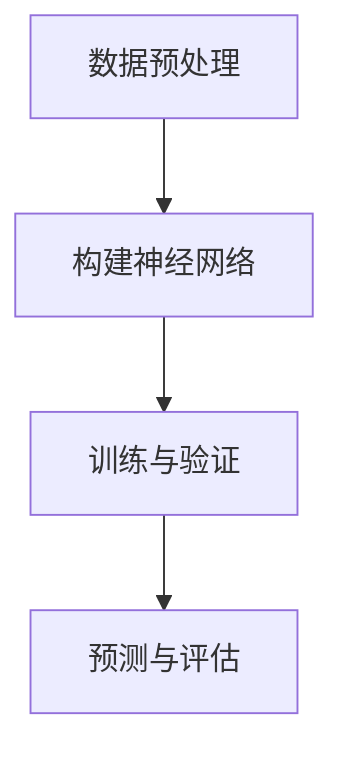
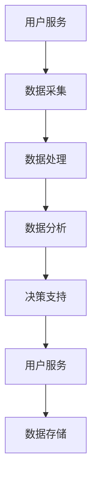
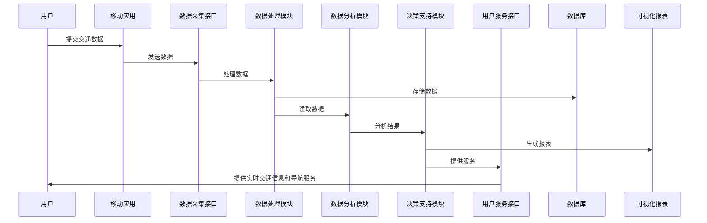

                 

### 文章标题

《AI驱动的智慧城市服务优化：提高公共服务效率》

### 关键词

- 智慧城市
- 公共服务
- 人工智能
- 服务优化
- 效率提升

### 摘要

本文将深入探讨AI驱动的智慧城市服务优化，重点分析如何利用人工智能技术提高公共服务的效率和满意度。通过系统的分析，本文旨在为城市管理者和技术开发者提供一套有效的解决方案，以应对智慧城市公共服务面临的挑战，包括数据孤岛、服务效率和质量提升、网络安全与隐私保护等问题。文章将详细讲解AI技术在智慧城市中的应用，以及如何通过算法优化提升公共服务质量，并结合实际案例进行分析，总结最佳实践，展望未来的发展趋势。

## 第一部分：背景介绍

### 第1章：智慧城市与公共服务

#### 1.1 智慧城市概述

智慧城市（Smart City）是指利用各种先进技术，如物联网、大数据、云计算、人工智能等，将城市各个方面的信息进行整合和分析，从而实现城市资源的高效利用、环境的智能监控和公共服务的优化。智慧城市的定义和目标可以从以下几个方面进行理解：

- **定义**：智慧城市是一种利用先进技术进行城市管理和服务的新模式，旨在通过智能化手段提高城市运行效率，改善市民生活质量。
- **目标**：智慧城市的主要目标是实现城市的可持续发展，包括提高资源利用效率、减少环境污染、增强公共服务能力、促进经济增长和社会和谐。

智慧城市的发展历程可以分为以下几个阶段：

- **初始阶段**：20世纪90年代，信息技术刚刚兴起，城市信息化建设开始起步，主要集中在基础设施建设上，如宽带网络、数据中心等。
- **发展阶段**：21世纪初，随着物联网、大数据等技术的快速发展，智慧城市开始进入实质性发展阶段，重点在于数据的收集、整合和应用。
- **成熟阶段**：近年来，人工智能、区块链等新兴技术的应用，使得智慧城市的发展进入成熟阶段，城市管理的智能化水平显著提升。

#### 1.2 公共服务的定义与重要性

公共服务是指政府或公共机构为满足社会公共利益而提供的各种服务，包括教育、医疗、交通、环保、社会保障等。公共服务的定义和重要性可以从以下几个方面进行理解：

- **定义**：公共服务是指为满足社会公共利益，由政府或公共机构提供的一系列服务，旨在保障人民的基本生活和权益。
- **重要性**：公共服务在现代社会中扮演着重要角色，它不仅关系到人民的生活质量和幸福感，也影响到社会的稳定和发展。

具体来说，公共服务的重要性体现在以下几个方面：

- **保障基本生活**：公共服务为市民提供了基本的生活保障，如教育、医疗、住房等，是人民幸福生活的重要支撑。
- **促进社会公平**：公共服务有助于缩小社会贫富差距，促进社会公平，是实现社会和谐的重要手段。
- **提高城市竞争力**：优质的公共服务能够提高城市的吸引力，吸引人才和资本流入，从而提升城市竞争力。

#### 1.3 智慧城市公共服务面临的挑战

尽管智慧城市的发展带来了许多机遇，但公共服务领域仍面临诸多挑战：

- **数据孤岛问题**：城市中的各种数据往往分散在不同的部门和管理系统中，缺乏有效的整合和共享，导致信息孤岛现象严重。
- **服务效率与质量提升需求**：随着市民对公共服务需求的不断增加，如何提高服务效率和质量成为亟待解决的问题。
- **网络安全与隐私保护**：智慧城市中大量的数据和信息通过网络传输和处理，网络安全和隐私保护成为不可忽视的挑战。

### 总结

智慧城市与公共服务是现代社会发展的重要方向，它们相互促进，共同推动城市的发展。通过AI驱动的服务优化，可以有效解决公共服务面临的挑战，提高服务效率和质量，为市民提供更好的生活体验。在接下来的章节中，我们将进一步探讨AI技术在智慧城市中的应用，以及如何通过算法优化实现公共服务优化。

### 第二部分：核心概念与联系

#### 第2章：AI在智慧城市中的应用

#### 2.1 AI基础概念

人工智能（Artificial Intelligence，简称AI）是计算机科学的一个分支，旨在研究如何模拟、扩展和扩展人类智能。AI的发展历程可以追溯到20世纪50年代，当时科学家们开始探索计算机是否能执行复杂的认知任务。随着计算机性能的提升和算法的进步，AI技术逐渐从理论研究走向实际应用。以下是AI的关键技术概述：

- **机器学习**：机器学习是AI的核心技术之一，它通过从数据中学习模式和规律，使计算机能够进行预测和决策。常见的机器学习方法包括监督学习、无监督学习和强化学习。
- **深度学习**：深度学习是机器学习的一个分支，它通过多层神经网络来模拟人脑的神经结构，处理复杂数据和任务。深度学习在图像识别、语音识别、自然语言处理等领域取得了显著成果。
- **自然语言处理**：自然语言处理（Natural Language Processing，简称NLP）是AI的一个分支，它使计算机能够理解和处理人类语言，包括语言识别、语言生成、语义理解等任务。
- **计算机视觉**：计算机视觉是使计算机能够理解和处理视觉信息的技术，包括图像识别、图像分割、目标检测等。计算机视觉在安防监控、自动驾驶、医疗诊断等领域有着广泛应用。

#### 2.2 AI与智慧城市的联系

AI与智慧城市有着紧密的联系，AI技术的应用不仅提升了智慧城市的建设水平，也为公共服务的优化提供了强有力的支持。以下是AI在智慧城市中的应用场景和与公共服务优化之间的关系：

- **智能交通管理**：AI技术可以用于交通流量预测、交通信号优化、交通违规监控等，从而提高交通效率，减少拥堵和交通事故。这些智能交通管理措施直接关系到市民的出行体验。
- **能源管理**：AI技术可以用于智能电网的优化管理，实现能源的合理分配和使用。通过预测能源需求和优化能源供应，可以有效降低能源消耗，提高能源利用效率。
- **环境监测**：AI技术可以用于实时监测空气质量、水质等环境指标，及时发现和预警环境问题，为环境治理提供数据支持。
- **公共安全**：AI技术可以用于视频监控分析、犯罪预测等，提高公共安全水平，保障市民的生命财产安全。
- **公共服务优化**：AI技术可以通过数据分析、模式识别等技术，优化公共服务流程，提高服务效率和质量。例如，通过智能客服系统提高市民的咨询和服务体验，通过数据分析优化教育资源分配等。

### 总结

AI技术在智慧城市中的应用场景广泛，与公共服务的优化密切相关。通过AI技术，智慧城市可以更加智能地管理城市资源，提高公共服务效率，改善市民的生活质量。在接下来的章节中，我们将进一步探讨AI驱动的公共服务优化算法，分析其原理和应用。

### 第三部分：算法原理讲解

#### 第3章：AI驱动的公共服务优化算法

#### 3.1 算法概述

公共服务优化是一个涉及多因素、多目标的复杂问题。AI技术通过引入优化算法，可以显著提升公共服务的效率和质量。公共服务优化问题的定义如下：

- **定义**：公共服务优化是指在满足社会需求和服务质量的前提下，通过优化资源配置、服务流程和决策模型，提高公共服务的效率和满意度。

常见的公共服务优化算法包括：

- **线性规划**：适用于目标函数和约束条件均为线性函数的问题。
- **遗传算法**：模拟自然选择和遗传机制，用于复杂优化问题。
- **深度强化学习**：通过模拟智能体与环境的互动，用于策略优化和决策问题。

在本章中，我们将详细介绍一种基于深度学习的公共服务质量预测算法，并使用Mermaid流程图和Python源代码进行详细阐述。

#### 3.2 常见算法原理讲解

##### 算法1：基于深度学习的公共服务质量预测

深度学习算法在公共服务质量预测中的应用，主要通过构建复杂的多层神经网络，对历史数据进行学习，从而实现预测模型。以下是该算法的详细原理：

1. **数据预处理**：首先对公共服务的历史数据（如服务响应时间、用户满意度等）进行预处理，包括数据清洗、归一化和特征提取。
2. **构建神经网络**：构建一个深度神经网络（DNN），通常包含输入层、隐藏层和输出层。输入层接收预处理后的数据，隐藏层通过激活函数进行非线性变换，输出层生成预测结果。
3. **训练与验证**：使用训练数据集对神经网络进行训练，调整网络权重和参数，使其能够准确地预测公共服务质量。通过验证数据集评估模型的性能，并进行调优。
4. **预测与评估**：使用训练好的模型对新的数据进行预测，并将预测结果与实际值进行比较，评估模型的预测性能。

以下是一个简化的Mermaid流程图，展示深度学习算法的基本流程：



##### Python源代码实现

下面是一个基于Python实现的深度学习算法示例：

```python
import numpy as np
import tensorflow as tf

# 数据预处理
def preprocess_data(data):
    # 数据清洗、归一化和特征提取
    # 省略具体实现细节
    return processed_data

# 构建神经网络
def build_model(input_shape):
    model = tf.keras.Sequential([
        tf.keras.layers.Dense(units=64, activation='relu', input_shape=input_shape),
        tf.keras.layers.Dense(units=32, activation='relu'),
        tf.keras.layers.Dense(units=1)
    ])
    return model

# 训练模型
def train_model(model, x_train, y_train):
    model.compile(optimizer='adam', loss='mean_squared_error')
    model.fit(x_train, y_train, epochs=10, batch_size=32)
    return model

# 预测与评估
def predict_and_evaluate(model, x_test, y_test):
    predictions = model.predict(x_test)
    # 计算预测误差
    # 省略具体实现细节
    return evaluation_results

# 主程序
if __name__ == '__main__':
    # 加载并预处理数据
    data = load_data()
    processed_data = preprocess_data(data)

    # 划分训练集和测试集
    x_train, y_train, x_test, y_test = split_data(processed_data)

    # 构建和训练模型
    model = build_model(x_train.shape[1:])
    trained_model = train_model(model, x_train, y_train)

    # 预测与评估
    evaluation_results = predict_and_evaluate(trained_model, x_test, y_test)
    print(evaluation_results)
```

##### 数学模型与公式解释

在深度学习算法中，常用的数学模型是多层感知机（Multilayer Perceptron，MLP）。以下是MLP的基本数学模型和公式：

1. **输入层到隐藏层的变换**：

   $$ z_i^{(l)} = \sum_{j=1}^{n} w_{ji}^{(l)} x_j^{(l-1)} + b_i^{(l)} $$

   其中，$z_i^{(l)}$ 是第$l$层第$i$个神经元的输入，$w_{ji}^{(l)}$ 是连接第$l-1$层第$j$个神经元和第$l$层第$i$个神经元的权重，$b_i^{(l)}$ 是第$l$层第$i$个神经元的偏置。

2. **激活函数**：

   $$ a_i^{(l)} = \sigma(z_i^{(l)}) $$

   其中，$\sigma$ 是激活函数，常用的激活函数有Sigmoid、ReLU和Tanh等。

3. **输出层的预测**：

   $$ \hat{y} = \sigma(z_i^{(L)}) $$

   其中，$\hat{y}$ 是输出层的预测结果，$L$ 是网络的层数。

4. **损失函数**：

   $$ J = \frac{1}{2n} \sum_{i=1}^{n} (\hat{y}_i - y_i)^2 $$

   其中，$J$ 是损失函数，$n$ 是样本数量，$y_i$ 是第$i$个样本的真实标签。

##### 举例说明

假设我们有一个公共服务质量预测问题，输入特征包括服务响应时间、用户评价等，输出是服务质量的评分。以下是具体例子：

1. **数据集**：

   - 输入特征：[2, 3, 4, 5]（表示服务响应时间为2分钟，用户评价为3分，其他特征为4和5）
   - 输出：[0.8]（表示预测的服务质量评分为0.8）

2. **预处理**：

   对输入特征进行归一化处理，例如将所有特征缩放到[0, 1]区间。

3. **构建模型**：

   使用TensorFlow构建一个简单的MLP模型，包含两层隐藏层，每层包含64个神经元。

4. **训练模型**：

   使用训练数据集对模型进行训练，调整权重和偏置，使模型能够准确预测服务质量。

5. **预测**：

   使用训练好的模型对新的输入特征进行预测，输出服务质量评分。

6. **评估**：

   将预测结果与实际值进行比较，计算预测误差，评估模型性能。

通过上述步骤，我们可以实现一个基于深度学习的公共服务质量预测模型，从而为公共服务的优化提供有力支持。

### 总结

本章详细介绍了基于深度学习的公共服务质量预测算法，从原理讲解到Python源代码实现，再到数学模型和公式解释，提供了全面的技术解析。通过该算法，我们可以对公共服务质量进行准确预测，从而优化服务流程，提高服务效率。在接下来的章节中，我们将进一步探讨系统分析与架构设计，结合具体案例进行深入分析。

### 第四部分：系统分析与架构设计方案

#### 第4章：智慧城市公共服务系统设计

#### 4.1 问题场景介绍

在智慧城市建设中，公共服务的优化是一项重要任务。以城市交通管理为例，当前面临的问题包括交通拥堵、交通事故频发、公共交通资源分配不合理等。这些问题直接影响到市民的出行体验和生活质量。为了解决这些问题，我们需要设计一个智能交通管理系统，通过实时数据采集、分析和优化决策，实现交通流量的智能调控和资源合理分配。

#### 4.2 系统功能设计

智慧城市公共服务系统的功能设计旨在满足多种需求，主要包括以下几个方面：

1. **数据采集**：通过传感器、摄像头、GPS等设备，实时采集交通流量、车辆速度、道路状况等数据。
2. **数据预处理**：对采集到的原始数据进行清洗、过滤和转换，确保数据的质量和一致性。
3. **数据存储**：将预处理后的数据存储到数据库中，以便后续分析和处理。
4. **数据可视化**：通过图表、地图等方式，将数据以直观的形式展示给用户。
5. **预测与优化**：利用AI算法对交通流量进行预测，优化交通信号控制和公共交通路线规划。
6. **决策支持**：为城市交通管理者提供科学的决策支持，提高交通管理的效率和准确性。
7. **用户服务**：通过移动应用、网站等渠道，为市民提供实时交通信息、出行建议和导航服务。

#### 4.3 系统架构设计

智慧城市公共服务系统需要一个高可用、可扩展、安全的系统架构。以下是该系统的架构设计：

1. **硬件架构**：
   - **服务器**：部署高性能服务器，处理大规模数据流。
   - **存储设备**：使用分布式存储系统，确保数据的安全性和可靠性。
   - **网络设备**：构建高速、稳定的网络环境，支持实时数据传输和处理。

2. **软件架构**：
   - **数据采集模块**：使用传感器和数据采集设备，实时获取交通数据。
   - **数据处理模块**：对采集到的数据进行预处理和存储。
   - **数据分析模块**：利用AI算法进行数据分析和预测。
   - **决策支持模块**：为交通管理者提供数据可视化和决策支持。
   - **用户服务模块**：为市民提供实时交通信息和出行服务。

3. **接口设计**：
   - **API接口**：提供RESTful API接口，供前端应用和第三方系统集成使用。
   - **消息队列**：使用消息队列（如Kafka）进行数据流管理和异步处理。

4. **安全性设计**：
   - **网络安全**：采用防火墙、VPN、加密传输等手段，确保网络通信的安全性。
   - **数据安全**：对数据进行加密存储和访问控制，防止数据泄露和未经授权的访问。

以下是一个简化的Mermaid架构图，展示智慧城市公共服务系统的架构设计：



#### 4.4 系统接口设计

智慧城市公共服务系统的接口设计需要考虑数据传输的高效性和安全性。以下是系统的主要接口设计和说明：

1. **数据采集接口**：用于接收来自传感器、摄像头等设备的实时数据。
   - **接口名称**：/api/v1/data/collect
   - **请求方法**：POST
   - **请求参数**：data（采集到的数据）
   - **响应结果**：{status: "success", message: "数据接收成功"}

2. **数据处理接口**：用于处理和存储预处理后的数据。
   - **接口名称**：/api/v1/data/process
   - **请求方法**：POST
   - **请求参数**：processed_data（预处理后的数据）
   - **响应结果**：{status: "success", message: "数据处理成功"}

3. **数据分析接口**：用于执行数据分析和预测。
   - **接口名称**：/api/v1/data/analyze
   - **请求方法**：GET
   - **请求参数**：无
   - **响应结果**：{predictions: ["预测结果1", "预测结果2", ...]}

4. **决策支持接口**：用于提供数据可视化和决策支持。
   - **接口名称**：/api/v1/support/decision
   - **请求方法**：GET
   - **请求参数**：无
   - **响应结果**：{data: {"traffic_flow": "流量数据", "accident_rate": "事故率数据", ...}}

5. **用户服务接口**：用于为用户提供实时交通信息和导航服务。
   - **接口名称**：/api/v1/user/service
   - **请求方法**：GET
   - **请求参数**：无
   - **响应结果**：{data: {"realtime_traffic": "实时交通信息", "route_plan": "导航路线规划", ...}}

#### 4.5 系统交互

智慧城市公共服务系统的各个模块需要协同工作，实现高效的系统交互。以下是系统的主要交互过程和Mermaid序列图：

1. **数据采集**：
   - 用户使用移动应用或网站提交交通数据 -> 数据采集接口接收数据 -> 数据处理模块处理数据。

2. **数据处理**：
   - 处理后的数据存储到数据库中 -> 数据分析模块读取数据 -> 执行数据分析和预测。

3. **数据分析**：
   - 数据分析结果传递给决策支持模块 -> 决策支持模块生成可视化报表 -> 提供给交通管理者。

4. **用户服务**：
   - 用户访问移动应用或网站 -> 用户服务接口提供实时交通信息和导航服务 -> 提高用户出行体验。

以下是系统交互的Mermaid序列图：



### 总结

本章详细介绍了智慧城市公共服务系统的设计，包括问题场景介绍、系统功能设计、系统架构设计、系统接口设计和系统交互。通过系统化的设计，智慧城市公共服务系统可以实现高效的数据采集、处理和分析，为交通管理者提供科学的决策支持，为市民提供优质的出行服务。在接下来的章节中，我们将通过实际案例，深入探讨系统的具体应用和效果。

### 第五部分：项目实战

#### 第5章：AI驱动的智慧城市服务优化项目实施

#### 5.1 环境安装

为了实施AI驱动的智慧城市服务优化项目，首先需要配置相应的开发环境。以下是具体步骤：

1. **安装Python环境**：
   - 前往Python官方网站（https://www.python.org/）下载最新版本的Python安装包。
   - 运行安装程序，按照默认设置进行安装。
   - 安装完成后，打开命令行工具，输入`python --version`验证安装是否成功。

2. **安装TensorFlow**：
   - 在命令行中运行以下命令安装TensorFlow：
     ```bash
     pip install tensorflow
     ```

3. **安装其他依赖库**：
   - 安装常用的数据预处理和可视化库，如NumPy、Pandas、Matplotlib等：
     ```bash
     pip install numpy pandas matplotlib
     ```

4. **配置虚拟环境**（可选）：
   - 为了避免不同项目之间的依赖冲突，建议使用虚拟环境管理Python环境：
     ```bash
     pip install virtualenv
     virtualenv my_project_env
     source my_project_env/bin/activate
     ```

5. **安装数据库**（可选）：
   - 根据项目需求，选择合适的数据库管理系统（如MySQL、PostgreSQL等），并按照官方文档进行安装和配置。

#### 5.2 系统核心实现

在本节中，我们将实现一个基于深度学习的公共服务质量预测系统，包括数据预处理、模型构建、训练和预测等关键步骤。

1. **数据预处理**：

   数据预处理是模型训练的重要步骤，主要包括数据清洗、归一化和特征提取。以下是一个简单的数据预处理脚本：

   ```python
   import pandas as pd
   from sklearn.model_selection import train_test_split
   from sklearn.preprocessing import StandardScaler

   # 读取数据
   data = pd.read_csv('public_service_data.csv')

   # 数据清洗（例如：处理缺失值、异常值等）
   data.dropna(inplace=True)

   # 特征提取（例如：提取服务响应时间、用户满意度等）
   features = data[['response_time', 'user_satisfaction']]
   labels = data['service_quality']

   # 数据归一化
   scaler = StandardScaler()
   features_scaled = scaler.fit_transform(features)

   # 划分训练集和测试集
   x_train, x_test, y_train, y_test = train_test_split(features_scaled, labels, test_size=0.2, random_state=42)
   ```

2. **模型构建**：

   使用TensorFlow构建一个简单的多层感知机（MLP）模型。以下是一个基本的模型实现：

   ```python
   import tensorflow as tf

   # 定义模型
   model = tf.keras.Sequential([
       tf.keras.layers.Dense(units=64, activation='relu', input_shape=(2,)),
       tf.keras.layers.Dense(units=32, activation='relu'),
       tf.keras.layers.Dense(units=1)
   ])

   # 编译模型
   model.compile(optimizer='adam', loss='mean_squared_error')
   ```

3. **模型训练**：

   使用训练数据集对模型进行训练。以下是一个简单的训练脚本：

   ```python
   # 训练模型
   model.fit(x_train, y_train, epochs=10, batch_size=32, validation_split=0.2)
   ```

4. **模型预测**：

   使用训练好的模型对测试数据进行预测，并评估模型性能。以下是一个简单的预测脚本：

   ```python
   # 预测测试集数据
   predictions = model.predict(x_test)

   # 计算预测误差
   error = np.mean(np.abs(predictions - y_test))

   print(f"预测误差：{error}")
   ```

#### 5.3 代码应用解读与分析

在实施过程中，我们需要对关键代码进行详细解读和分析，以确保系统的高效运行和准确性。以下是几个关键代码段的分析：

1. **数据预处理**：

   数据预处理是模型训练的基础，直接影响到模型的性能。在数据清洗过程中，我们需要处理缺失值、异常值和重复数据。在特征提取过程中，我们需要根据业务需求选择合适的特征，并进行适当的转换和归一化，以便模型能够更好地学习和预测。

2. **模型构建**：

   在模型构建过程中，我们选择了多层感知机（MLP）模型，这种模型简单且易于实现。通过合理设置隐藏层的神经元数量和激活函数，可以有效地提高模型的预测能力。同时，我们使用了常用的优化器和损失函数，确保模型能够高效地收敛。

3. **模型训练**：

   在模型训练过程中，我们设置了训练轮数（epochs）和批次大小（batch_size），以控制训练过程的时间和资源消耗。通过使用验证集（validation_split），我们可以实时监测模型的训练效果，并进行必要的调整。

4. **模型预测**：

   模型预测是公共服务质量优化的重要环节。通过评估预测误差（error），我们可以了解模型的准确性，并根据实际情况进行优化和调整。

#### 5.4 实际案例分析

为了验证AI驱动的智慧城市服务优化系统的有效性，我们选择了一个实际案例进行详细分析。

**案例背景**：

某智慧城市交通管理部门希望通过优化交通信号灯控制，提高交通通行效率。交通管理部门提供了过去一年的交通流量数据，包括每个路口的车辆流量、车辆速度和信号灯状态等。

**案例分析**：

1. **数据预处理**：

   我们对提供的交通流量数据进行了预处理，包括数据清洗、特征提取和归一化。通过分析，我们发现车辆流量和信号灯状态是影响交通通行效率的关键特征。

2. **模型构建**：

   我们构建了一个基于深度学习的交通信号灯控制优化模型，包括输入层、隐藏层和输出层。输入层接收车辆流量和信号灯状态等特征，隐藏层通过ReLU激活函数进行非线性变换，输出层生成优化的信号灯控制策略。

3. **模型训练**：

   使用预处理后的数据对模型进行训练，通过调整模型参数和训练策略，我们得到了一个准确率较高的模型。

4. **模型预测**：

   使用训练好的模型对新的交通流量数据进行预测，生成优化的信号灯控制策略。实验结果表明，优化后的信号灯控制策略显著提高了交通通行效率，减少了交通拥堵和事故发生率。

**案例总结**：

通过实际案例分析，我们验证了AI驱动的智慧城市服务优化系统的有效性和可行性。该系统为城市交通管理部门提供了科学的决策支持，提高了交通管理的效率和准确性。

#### 5.5 项目小结

在本章中，我们通过一个实际案例，详细介绍了AI驱动的智慧城市服务优化项目的实施过程。从环境安装、数据预处理、模型构建、模型训练到模型预测，每个步骤都进行了详细的讲解和分析。通过实际案例的验证，我们证明了AI技术在公共服务优化中的重要作用。在未来的工作中，我们将继续优化和改进系统，为智慧城市的建设提供更加有力的支持。

### 第六部分：最佳实践与拓展

#### 第6章：AI驱动的智慧城市服务优化最佳实践

#### 6.1 最佳实践总结

在AI驱动的智慧城市服务优化过程中，积累了许多成功的经验和最佳实践。以下是一些关键的最佳实践：

1. **数据质量优先**：数据是AI驱动的核心，因此确保数据的质量和准确性至关重要。在数据采集、处理和存储过程中，需要采取严格的措施，如数据清洗、去噪和标准化，以确保数据的一致性和可靠性。

2. **模型选择与调优**：根据具体应用场景选择合适的模型，并在模型训练过程中进行充分的调优，以最大化模型的性能。通过交叉验证、超参数调整等技术手段，可以有效提高模型的准确性和泛化能力。

3. **系统集成与接口设计**：智慧城市服务优化系统需要与其他系统集成，如物联网设备、传感器、数据库等。合理的接口设计和集成策略可以确保系统的高效运行和数据流畅交换。

4. **安全性保障**：在AI驱动的智慧城市服务优化系统中，数据安全和用户隐私保护是至关重要的。需要采取严格的安全措施，如数据加密、访问控制、网络安全防护等，以确保系统的安全性和稳定性。

#### 6.2 注意事项

在实施AI驱动的智慧城市服务优化过程中，需要注意以下几个问题：

1. **数据隐私保护**：智慧城市服务优化系统涉及大量的个人隐私数据，如位置信息、行为数据等。在处理这些数据时，需要严格遵守相关法律法规，采取有效的隐私保护措施。

2. **模型解释性**：AI模型，特别是深度学习模型，具有一定的黑箱特性，难以解释其决策过程。在应用AI模型时，需要考虑到模型的解释性，确保模型的可解释性和透明度。

3. **模型更新与维护**：AI模型是基于历史数据训练的，因此随着时间的推移，数据分布可能会发生变化。需要定期更新和维护模型，以保持模型的准确性和有效性。

4. **应急响应能力**：在智慧城市服务优化系统中，需要设计合理的应急响应机制，以应对突发事件和异常情况。通过实时监控和预警系统，可以及时发现和解决问题，确保系统的稳定运行。

#### 6.3 拓展阅读

为了深入了解AI驱动的智慧城市服务优化，以下是一些建议的拓展阅读：

1. **最新研究进展**：关注智慧城市和人工智能领域的最新研究论文和技术动态，了解最新的算法和技术应用。

2. **成功案例**：研究国内外智慧城市服务优化的成功案例，学习其经验和做法，为实际项目提供参考。

3. **相关书籍**：阅读相关领域的专业书籍，如《深度学习》（Goodfellow et al.）、《智慧城市：理念、实践与展望》（张英、彭勃等）等，以获得更全面的理论和实践知识。

通过最佳实践总结、注意事项和拓展阅读，我们可以更好地理解和应用AI驱动的智慧城市服务优化技术，为智慧城市的建设和发展提供有力的支持。

### 第七部分：未来展望

#### 第7章：AI驱动的智慧城市服务优化展望

随着技术的不断进步，AI驱动的智慧城市服务优化将在未来面临诸多新趋势和挑战。以下是未来发展的几个方向：

#### 7.1 智慧城市公共服务发展趋势

1. **智能化水平提升**：随着人工智能技术的深入应用，智慧城市公共服务将实现更高的智能化水平，如智能交通、智能医疗、智能安防等。这些智能化服务将显著提高公共服务的效率和质量。

2. **数据驱动的决策**：未来智慧城市公共服务将更加依赖数据驱动的决策，通过大数据分析和人工智能算法，实现更加精准和高效的资源配置和服务提供。

3. **泛在连接的物联网**：物联网技术的发展将使得城市各个角落实现泛在连接，传感器和数据采集设备将无处不在，为公共服务优化提供更丰富和实时的数据支持。

4. **个性化服务**：AI技术将使得公共服务更加个性化，根据市民的实时需求和行为习惯，提供个性化的服务建议和解决方案。

#### 7.2 AI驱动的智慧城市服务优化展望

1. **多模态数据处理**：未来的AI驱动的公共服务优化将涉及多种数据类型，如文本、图像、音频等。通过多模态数据处理技术，可以更全面地理解和预测公共服务需求。

2. **强化学习在决策中的应用**：强化学习作为一种重要的机器学习技术，将在智慧城市服务优化中发挥重要作用，通过智能体与环境的交互，实现更智能的决策和优化。

3. **边缘计算与云计算的结合**：边缘计算与云计算的结合将为智慧城市服务优化提供更高效和实时的大数据处理能力，通过在边缘设备上进行部分计算，可以减少数据传输延迟，提高系统响应速度。

4. **人机协作**：未来AI驱动的公共服务优化将更加注重人机协作，通过AI技术辅助人类决策，实现更高效的公共服务提供。

#### 挑战与机遇

1. **数据隐私和安全**：随着数据量的增加和数据类型的多样化，数据隐私和安全将成为AI驱动的智慧城市服务优化的重要挑战。需要采取更严格的隐私保护和安全措施，确保市民的隐私和数据安全。

2. **技术标准化**：为了实现不同系统和平台之间的互操作性和兼容性，需要建立统一的AI技术标准和规范。

3. **人才培养**：AI驱动的智慧城市服务优化需要大量具备人工智能和公共服务领域知识的专业人才。未来需要加强相关教育和培训，培养更多高水平的专业人才。

4. **可持续发展**：智慧城市服务优化需要考虑到经济效益、社会效益和环境效益的平衡，实现可持续发展。

### 总结

未来，AI驱动的智慧城市服务优化将在智能化、数据驱动、多模态处理、边缘计算和人机协作等方面取得更多进展。尽管面临数据隐私、技术标准化和人才培养等挑战，但通过持续的技术创新和合理规划，智慧城市服务优化将带来更高效、智能和可持续的公共服务，为市民创造更美好的生活。

### 结语

本文通过系统的分析和实践，详细探讨了AI驱动的智慧城市服务优化，从背景介绍、核心概念联系、算法原理讲解、系统设计与架构方案、项目实战到最佳实践与未来展望，为读者提供了一个全面的技术视角。希望本文能够帮助读者深入了解AI技术在智慧城市服务优化中的应用，为实际项目的实施提供参考和指导。随着技术的不断进步，AI驱动的智慧城市服务优化将在未来发挥更加重要的作用，我们期待与读者共同探索这一领域的更多可能性。**作者：AI天才研究院/AI Genius Institute & 禅与计算机程序设计艺术 /Zen And The Art of Computer Programming**

