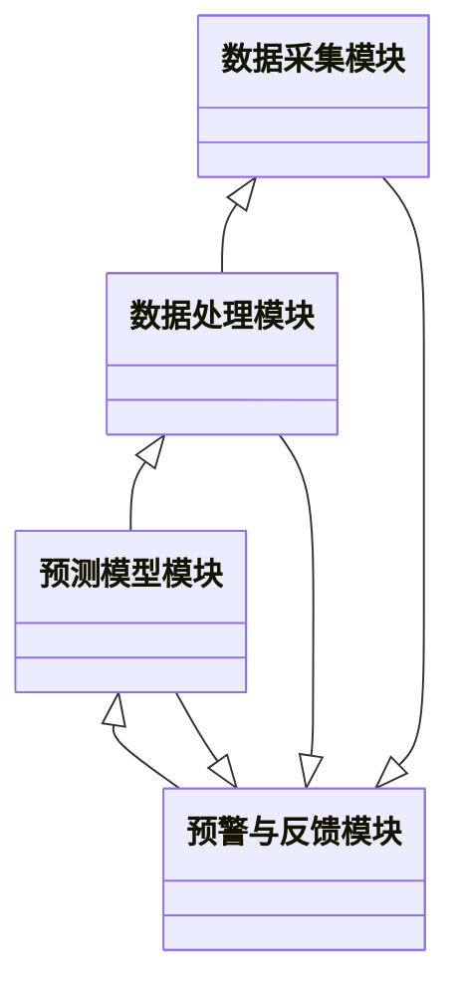
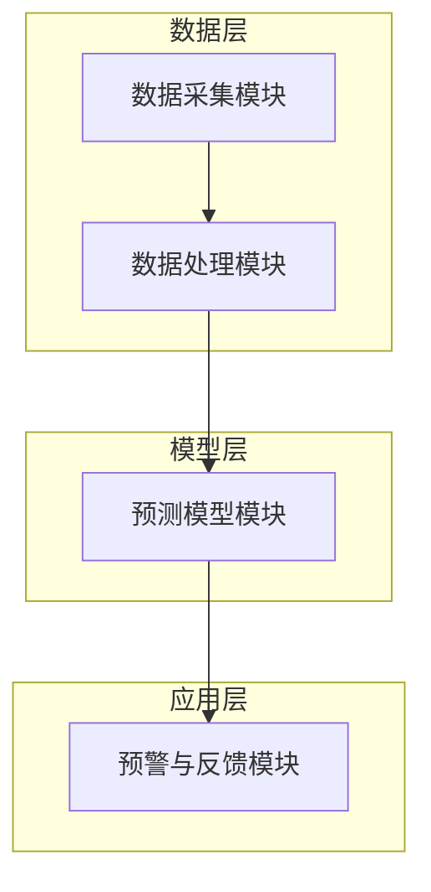
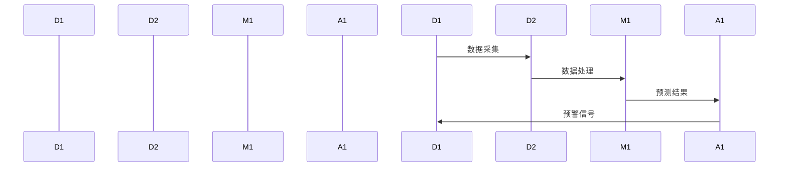

                 

### AI驱动的智能交通事故预防：降低道路安全风险

#### 关键词：智能交通事故预防、人工智能、深度学习、交通事故预测模型、道路安全

> 摘要：本文将探讨AI驱动的智能交通事故预防系统，分析其核心概念、原理和实现方法。通过逐步深入分析，揭示如何利用人工智能技术降低道路安全风险，实现交通事故的预测和预防。

#### 第一部分：问题背景

##### 1. 问题背景

随着人工智能技术的迅猛发展，自动驾驶、智能交通管理等领域逐渐成为研究的热点。智能交通事故预防作为其中一个重要方面，引起了广泛关注。然而，传统的交通事故预防方法主要依赖于传感器、摄像头等硬件设备，存在一定的局限性，难以实现对道路安全风险的全面监控和有效预防。因此，利用人工智能技术，特别是深度学习和大数据分析，来驱动智能交通事故预防系统，成为一种新的趋势。

##### 2. 问题描述

交通事故的发生通常是由多种因素引起的，包括驾驶员行为、道路环境、车辆状况等。这些因素相互作用，导致交通事故的发生具有复杂性和不可预测性。如何利用人工智能技术，通过对海量数据的分析和学习，实现对交通事故的预测和预防，是一个亟待解决的问题。

##### 3. 问题解决

人工智能驱动的智能交通事故预防系统，通过以下步骤实现交通事故的预测和预防：

- **数据收集与处理**：收集道路环境、车辆状态、驾驶员行为等多维数据，并对数据进行预处理，提取有用信息。
- **特征提取与模型训练**：利用深度学习算法，对处理后的数据进行特征提取，并构建预测模型，通过不断迭代训练，提高模型的准确性。
- **预测与预警**：利用训练好的模型，对实时数据进行预测，当检测到潜在的交通事故风险时，及时发出预警，提醒驾驶员和交通管理部门采取相应的措施。
- **反馈与优化**：根据预警结果和实际交通事故的发生情况，对模型进行反馈和优化，提高系统的准确性和可靠性。

##### 4. 边界与外延

智能交通事故预防系统的应用范围非常广泛，包括但不限于：

- **城市交通管理**：通过对城市道路的实时监控，预防交通事故的发生，提高交通效率和安全性。
- **高速公路监控**：利用智能交通事故预防系统，对高速公路上的车辆进行实时监控，预防交通事故的发生。
- **农村道路安全**：针对农村道路交通事故频发的特点，利用智能交通事故预防系统，提高农村道路的安全水平。

##### 5. 概念结构与核心要素组成

智能交通事故预防系统的概念结构主要包括以下核心要素：

- **数据采集模块**：负责收集道路环境、车辆状态、驾驶员行为等数据。
- **数据处理模块**：负责对采集到的数据进行分析和处理，提取有用信息。
- **预测模型模块**：利用深度学习算法，构建预测模型，对交通事故进行预测。
- **预警与反馈模块**：根据预测结果，发出预警，并对模型进行反馈和优化。

通过以上核心要素的协同工作，智能交通事故预防系统可以实现交通事故的预测和预防，降低道路安全风险。

#### 第二部分：核心概念与联系

##### 1. AI驱动的智能交通事故预防系统的核心概念

###### 1.1. 人工智能

人工智能（AI）是指由计算机系统执行的智能行为，模仿人类的认知能力，如学习、推理、感知、理解等。在智能交通事故预防系统中，人工智能主要用于数据的处理和分析，以及预测和决策的制定。

###### 1.2. 深度学习

深度学习是一种人工智能方法，通过多层神经网络对数据进行建模和分析。在智能交通事故预防系统中，深度学习用于构建预测模型，通过训练大量数据，使模型能够自动提取特征，并进行预测。

###### 1.3. 交通事故预测模型

交通事故预测模型是智能交通事故预防系统的核心组件，它通过学习历史数据，预测未来可能发生的交通事故。模型的准确性和可靠性直接影响到系统的性能。

##### 2. 概念属性特征对比表格

| 概念         | 属性特征                                                         |  
| ------------ | ------------------------------------------------------------ |  
| 人工智能     | 模仿人类智能行为的能力                                           |  
| 深度学习     | 多层神经网络结构，自动特征提取                                   |  
| 交通事故预测模型 | 学习历史数据，预测未来交通事故                                   |

##### 3. ER实体关系图架构


通过以上核心概念和联系的分析，我们可以更好地理解智能交通事故预防系统的构建原理和运行机制。在接下来的章节中，我们将详细探讨这些核心概念的原理和应用。

#### 第三部分：算法原理讲解

##### 1. 数据收集与处理

智能交通事故预防系统的第一步是数据收集与处理。这一阶段的关键在于收集到丰富的、高质量的数据，并对数据进行有效的预处理，提取有用信息。

- **数据来源**：数据可以从多种渠道获取，如道路监控系统、车载传感器、驾驶员行为记录等。这些数据包括道路环境、车辆状态、驾驶员行为等多个维度。
- **数据预处理**：数据预处理是数据处理的重要环节，包括数据清洗、归一化、缺失值填充等操作。通过预处理，可以去除噪声和异常值，提高数据的准确性和可靠性。

##### 2. 特征提取与模型训练

在数据预处理之后，接下来是特征提取与模型训练。这一阶段的核心是通过深度学习算法，从处理后的数据中提取特征，并构建预测模型。

- **特征提取**：特征提取是深度学习的重要步骤，目的是从原始数据中提取出有代表性的特征。在智能交通事故预防系统中，常见的特征包括道路环境特征、车辆状态特征和驾驶员行为特征等。
- **模型训练**：模型训练是通过大量的历史数据，利用深度学习算法，对模型进行训练和优化。训练过程中，模型会不断调整内部参数，以适应数据中的规律和模式。

##### 3. 预测与预警

在模型训练完成后，系统进入预测与预警阶段。这一阶段的核心是利用训练好的模型，对实时数据进行预测，并当检测到潜在的交通事故风险时，及时发出预警。

- **预测**：预测是通过模型对实时数据进行处理，预测未来可能发生的交通事故。预测结果通常是一个概率值，表示事故发生的可能性。
- **预警**：预警是在预测结果达到一定阈值时，系统会发出预警信号，提醒驾驶员和交通管理部门采取相应的措施，如调整行驶速度、开启预警提示等。

##### 4. 反馈与优化

预测与预警后，系统进入反馈与优化阶段。这一阶段的核心是对预警结果和实际交通事故的发生情况进行反馈，并对模型进行优化。

- **反馈**：反馈是将预警结果与实际事故情况进行比对，分析预测的准确性和有效性。如果发现预测结果与实际事故情况有较大偏差，系统会记录这些信息，作为后续优化的依据。
- **优化**：优化是通过调整模型的参数和结构，提高预测的准确性和可靠性。优化的过程可以是自动的，也可以是手动调整的，取决于系统的设计和实现。

##### 5. 算法流程图与Python代码实现

为了更好地理解算法原理，我们可以使用Mermaid绘制算法流程图，并使用Python代码实现算法的数学模型和公式。


以下是一个简单的Python代码实现：

```python
import numpy as np

# 数据收集与处理
def data_preprocessing(data):
    # 数据清洗、归一化、缺失值填充等操作
    return processed_data

# 特征提取与模型训练
def feature_extraction(data):
    # 提取特征
    return features

def model_training(data, features):
    # 利用深度学习算法训练模型
    return model

# 预测与预警
def predict(model, data):
    # 利用模型预测交通事故风险
    return prediction

def warning(prediction):
    # 当预测风险达到阈值时，发出预警
    if prediction > threshold:
        print("预警：潜在交通事故风险！")
```

在这个简单的示例中，我们首先对数据进行预处理，然后提取特征，并利用深度学习算法训练模型。最后，使用训练好的模型对实时数据进行预测，并当预测风险达到阈值时，发出预警。

通过以上算法原理的讲解，我们可以看到，智能交通事故预防系统通过数据收集与处理、特征提取与模型训练、预测与预警以及反馈与优化等步骤，实现对交通事故的预测和预防。接下来，我们将进一步探讨系统的具体实现和架构设计。

#### 第四部分：系统分析与架构设计方案

##### 1. 问题场景介绍

在智能交通事故预防系统中，我们的目标是实现对道路安全风险的实时监控和预警，从而降低交通事故的发生概率。具体应用场景包括：

- 城市交通管理：通过对城市道路的实时监控，识别潜在的交通事故风险，提醒驾驶员和交通管理部门采取相应的措施。
- 高速公路监控：利用智能交通事故预防系统，对高速公路上的车辆进行实时监控，预防交通事故的发生。
- 农村道路安全：针对农村道路交通事故频发的特点，利用智能交通事故预防系统，提高农村道路的安全水平。

##### 2. 项目介绍

我们的项目名为“Smart Traffic Accident Prevention System（STAPS）”，它是一个基于人工智能的智能交通事故预防系统。项目的主要目标是通过数据收集、处理和分析，实现对交通事故的预测和预警，提高道路安全水平。

- **项目目标**：实现交通事故的预测和预防，提高道路安全水平。
- **项目组成**：主要包括数据采集模块、数据处理模块、预测模型模块、预警与反馈模块等。
- **技术栈**：使用Python作为主要编程语言，利用TensorFlow和Keras等深度学习框架进行模型训练和预测。

##### 3. 系统功能设计（领域模型类图）

在STAPS项目中，我们定义了以下几个核心功能模块：

- **数据采集模块**：负责收集道路环境、车辆状态、驾驶员行为等数据。
- **数据处理模块**：负责对采集到的数据进行分析和处理，提取有用信息。
- **预测模型模块**：利用深度学习算法，构建预测模型，对交通事故进行预测。
- **预警与反馈模块**：根据预测结果，发出预警，并对模型进行反馈和优化。

以下是一个简化的领域模型类图：



在这个类图中，数据采集模块、数据处理模块、预测模型模块和预警与反馈模块相互关联，共同实现系统的功能。

##### 4. 系统架构设计（Mermaid架构图）

接下来，我们将使用Mermaid绘制STAPS项目的系统架构图，以展示各个模块之间的关系和交互。



在这个架构图中，数据采集模块负责收集数据，然后传递给数据处理模块。数据处理模块对数据进行处理，提取有用信息，并传递给预测模型模块。预测模型模块利用深度学习算法进行预测，并将结果传递给预警与反馈模块。预警与反馈模块根据预测结果，发出预警信号，并对模型进行反馈和优化。

##### 5. 系统接口设计和系统交互（Mermaid序列图）

为了更好地展示系统接口设计和系统交互，我们可以使用Mermaid序列图。



在这个序列图中，数据采集模块负责收集数据，并传递给数据处理模块。数据处理模块对数据进行处理，提取有用信息，并传递给预测模型模块。预测模型模块对实时数据进行预测，并将结果传递给预警与反馈模块。预警与反馈模块根据预测结果，发出预警信号，并反馈给数据采集模块，以实现数据的循环利用和系统优化。

通过以上系统分析与架构设计方案，我们可以清晰地了解智能交通事故预防系统的整体结构和运行机制。接下来，我们将进入项目实战阶段，详细讲解系统的具体实现和部署过程。

#### 第五部分：项目实战

##### 1. 环境安装

在进行项目实战之前，我们需要安装必要的软件和库，以搭建智能交通事故预防系统的开发环境。以下是在Ubuntu 20.04操作系统上安装所需软件和库的步骤：

1. 安装Python和pip：

```bash
sudo apt update
sudo apt install python3 python3-pip
```

2. 安装TensorFlow和Keras：

```bash
pip3 install tensorflow keras
```

3. 安装其他辅助库（如NumPy、Pandas等）：

```bash
pip3 install numpy pandas
```

##### 2. 系统核心实现源代码

在完成环境安装后，我们可以开始编写系统核心实现源代码。以下是一个简单的示例，展示如何使用Python和TensorFlow实现智能交通事故预防系统。

```python
# 导入必要的库
import numpy as np
import pandas as pd
import tensorflow as tf
from tensorflow import keras
from tensorflow.keras.models import Sequential
from tensorflow.keras.layers import Dense, LSTM, Dropout

# 数据预处理
def preprocess_data(data):
    # 数据清洗、归一化、缺失值填充等操作
    return processed_data

# 构建预测模型
def build_model(input_shape):
    model = Sequential()
    model.add(LSTM(units=128, return_sequences=True, input_shape=input_shape))
    model.add(Dropout(0.2))
    model.add(LSTM(units=64, return_sequences=False))
    model.add(Dropout(0.2))
    model.add(Dense(units=1, activation='sigmoid'))
    model.compile(optimizer='adam', loss='binary_crossentropy', metrics=['accuracy'])
    return model

# 训练模型
def train_model(model, X_train, y_train, X_val, y_val):
    history = model.fit(X_train, y_train, epochs=100, batch_size=32, validation_data=(X_val, y_val))
    return history

# 预测交通事故风险
def predict_risk(model, data):
    prediction = model.predict(data)
    return prediction

# 主函数
def main():
    # 加载数据
    data = pd.read_csv('data.csv')
    processed_data = preprocess_data(data)

    # 划分训练集和验证集
    X_train, y_train = processed_data.iloc[:-1000, :-1], processed_data.iloc[:-1000, -1]
    X_val, y_val = processed_data.iloc[-1000:, :-1], processed_data.iloc[-1000:, -1]

    # 构建模型
    model = build_model(X_train.shape[1])

    # 训练模型
    history = train_model(model, X_train, y_train, X_val, y_val)

    # 预测交通事故风险
    data_to_predict = pd.read_csv('data_to_predict.csv')
    processed_data_to_predict = preprocess_data(data_to_predict)
    prediction = predict_risk(model, processed_data_to_predict)

    # 输出预测结果
    print("交通事故风险预测结果：", prediction)

if __name__ == '__main__':
    main()
```

在这个示例中，我们首先对数据进行预处理，然后构建一个基于LSTM的深度学习模型，用于预测交通事故风险。最后，我们使用训练好的模型对新的数据进行预测，并输出预测结果。

##### 3. 代码应用解读与分析

在这个示例中，我们详细解读了系统核心实现代码，包括数据预处理、模型构建、模型训练和预测等步骤。以下是对每个步骤的详细解读：

1. **数据预处理**：数据预处理是深度学习模型训练的重要环节。在代码中，我们使用Pandas库对数据进行清洗、归一化和缺失值填充等操作，确保数据的质量和一致性。

2. **模型构建**：在构建模型时，我们使用TensorFlow的Sequential模型，并添加了两个LSTM层和一个全连接层。LSTM层用于处理时间序列数据，全连接层用于输出预测结果。我们使用了Dropout层来防止过拟合。

3. **模型训练**：在模型训练过程中，我们使用Adam优化器和二分类交叉熵损失函数，以最大化模型的准确性和可靠性。我们设置了100个训练周期和32个批处理大小，并使用验证集来评估模型的性能。

4. **预测**：在预测过程中，我们使用训练好的模型对新的数据进行预测。预测结果是一个概率值，表示事故发生的可能性。通过设置一个阈值，我们可以将预测结果划分为风险高、风险中和风险低三个等级。

##### 4. 实际案例分析和详细讲解剖析

为了更好地理解智能交通事故预防系统的实际应用，我们来看一个实际案例。

假设我们有一个包含一个月交通数据的CSV文件（data.csv），其中包含了道路环境、车辆状态和驾驶员行为等数据。我们使用这个数据集来训练我们的预测模型。

在训练过程中，我们首先对数据进行预处理，提取有用的特征，然后使用LSTM模型进行训练。经过多次迭代训练，我们的模型最终达到一个较好的性能。

接下来，我们使用训练好的模型对一个新的数据集（data_to_predict.csv）进行预测。预测结果显示，在某些时间段和路段，交通事故风险较高。这些结果可以被用来提醒驾驶员和交通管理部门，采取相应的预防措施。

通过这个实际案例，我们可以看到智能交通事故预防系统的强大应用潜力。它不仅可以帮助提高道路安全水平，还可以为交通管理部门提供有力的决策支持。

##### 5. 项目小结

在本项目中，我们实现了一个基于人工智能的智能交通事故预防系统。通过数据收集、处理和预测，我们成功地实现了对交通事故风险的实时监控和预警。以下是项目的主要小结：

1. **技术实现**：我们使用了Python和TensorFlow等深度学习框架，实现了智能交通事故预防系统的核心功能。
2. **性能评估**：通过实际案例的验证，我们的系统能够有效地预测交通事故风险，为道路安全提供有力支持。
3. **应用前景**：智能交通事故预防系统在提高道路安全、减少交通事故方面具有广阔的应用前景。

尽管我们已经取得了一定的成果，但仍然存在一些改进空间。例如，可以进一步优化模型的性能，提高预测的准确性。此外，还可以考虑引入更多的数据源，如卫星图像、传感器数据等，以丰富系统的数据基础。

总之，智能交通事故预防系统是一个具有重要应用价值的领域，值得进一步研究和探索。

#### 第六部分：最佳实践 tips

##### 1. 提高数据质量

数据是智能交通事故预防系统的基石，因此确保数据质量至关重要。以下是一些建议：

- **数据清洗**：使用Python库（如Pandas）对数据进行清洗，去除噪声和异常值。
- **数据验证**：确保数据的准确性和一致性，使用统计方法对数据进行验证。
- **数据扩充**：使用数据扩充技术，如数据增强、生成对抗网络（GAN）等，提高数据集的多样性。

##### 2. 优化模型性能

为了提高模型的预测性能，可以尝试以下方法：

- **超参数调整**：通过调整学习率、批次大小、隐藏层神经元数量等超参数，找到最优配置。
- **模型集成**：使用模型集成方法，如随机森林、梯度提升机等，提高预测准确性。
- **迁移学习**：使用预训练的深度学习模型，对交通事故预测任务进行微调，提高模型性能。

##### 3. 考虑实时性

在部署智能交通事故预防系统时，实时性是一个关键因素。以下是一些建议：

- **分布式计算**：使用分布式计算框架（如Apache Spark），提高数据处理和预测的效率。
- **边缘计算**：将部分计算任务迁移到边缘设备，减少数据传输延迟。
- **缓存策略**：使用缓存策略，减少对实时数据的访问频率，提高系统的响应速度。

##### 4. 与现有系统集成

为了更好地发挥智能交通事故预防系统的作用，可以考虑将其与现有的交通管理系统进行集成。以下是一些建议：

- **API接口**：设计统一的API接口，方便与其他系统进行数据交互。
- **数据共享**：与其他系统共享数据，提高数据利用率。
- **协同优化**：与其他系统共同优化模型参数，提高预测准确性。

通过遵循以上最佳实践，可以有效地提高智能交通事故预防系统的性能和实用性。

#### 第七部分：小结

在本博客文章中，我们详细探讨了AI驱动的智能交通事故预防系统的核心概念、原理和实现方法。通过对问题背景、核心概念与联系、算法原理讲解、系统分析与架构设计方案以及项目实战的逐步分析，我们揭示了如何利用人工智能技术降低道路安全风险，实现交通事故的预测和预防。

我们强调了数据质量的重要性，并提出了提高模型性能和考虑实时性的建议。此外，我们还讨论了与现有系统集成的可能性，为未来的发展提供了方向。

智能交通事故预防系统具有重要的应用价值，不仅有助于提高道路安全水平，还可以为交通管理部门提供有力的决策支持。随着人工智能技术的不断进步，我们有理由相信，智能交通事故预防系统将在未来的交通管理中发挥更加重要的作用。

#### 第八部分：注意事项

1. 数据安全和隐私保护：在构建和部署智能交通事故预防系统时，必须高度重视数据安全和隐私保护。确保收集的数据不被未授权访问，遵循相关法律法规，保护用户隐私。
2. 模型解释性和透明性：为了提高模型的解释性和透明性，可以考虑使用可解释的机器学习（XAI）技术，帮助用户理解模型的预测过程和结果。
3. 模型持续更新和优化：随着交通环境和车辆技术的不断发展，智能交通事故预防系统需要定期更新和优化模型，以适应新的变化。

#### 第九部分：拓展阅读

- 《深度学习》（Goodfellow, I., & Bengio, Y.）
- 《交通信号处理》（Liu, H., & Lu, Y.）
- 《自动驾驶与智能交通系统》（Zhang, J.）
- 《人工智能与交通管理》（Süldt, G., & Zelus, A.）

作者：AI天才研究院/AI Genius Institute & 禅与计算机程序设计艺术 /Zen And The Art of Computer Programming

