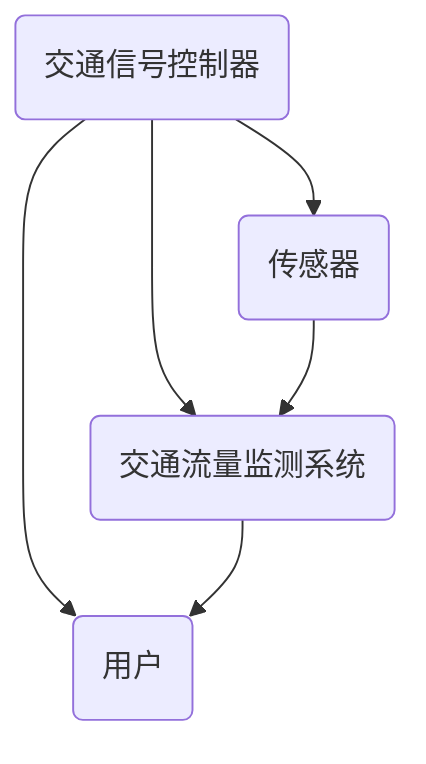
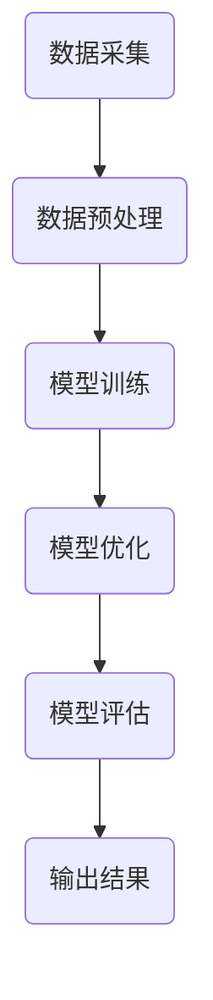

                 

# AI驱动的智能交通信号协调：实现城市交通智能化

## 关键词

- 智能交通信号协调
- 城市交通管理
- 人工智能算法
- 数据采集与处理
- 深度学习

## 摘要

本文将深入探讨AI驱动的智能交通信号协调技术，旨在解决当前城市交通信号系统面临的挑战。通过分析城市交通拥堵问题的背景和现有交通信号系统的效率低下现状，本文提出利用AI技术提升交通信号协调能力的解决方案。本文将详细介绍AI技术、数据采集与处理技术以及基于AI的优化算法与模型，并通过实际案例展示其应用效果。文章还讨论了智能交通信号协调的概念、核心要素及其在智能交通管理和智能城市建设中的重要作用。通过本文的研究，我们希望为智能交通信号协调技术的发展提供有益的参考。

### 引言与背景介绍

#### 第1章 引言与背景

##### 1.1 问题背景

随着城市化进程的加速，城市交通拥堵问题日益严重。这不仅影响了市民的出行效率，还加剧了空气污染和能源消耗。传统的交通信号系统由于设计上的局限性，无法对复杂的交通流量进行实时优化，导致交通拥堵现象频繁发生。智能交通信号协调作为智能交通系统的重要组成部分，旨在通过技术手段提升交通信号控制的效率，减少交通拥堵，提高交通流量。

##### 1.2 当前城市交通信号系统的挑战

目前，城市交通信号系统主要依赖于固定的时间表控制策略，无法根据实时交通流量变化进行动态调整。这种静态控制方式容易导致交通流量在高峰时段集中，从而引发拥堵。此外，传统的交通信号系统还存在以下问题：

- **缺乏实时数据分析**：传统的交通信号系统通常无法实时获取交通流量数据，导致控制策略滞后。
- **控制精度不足**：由于信号灯的切换周期较长，导致车辆在通过路口时需要减速等待，降低了通行效率。
- **系统扩展性差**：传统的交通信号系统多为孤立式控制，难以与其他交通管理系统进行有效整合。

##### 1.3 AI在交通信号协调中的潜力

人工智能（AI）技术的发展为交通信号协调提供了新的解决方案。通过机器学习和深度学习算法，AI能够从大量交通数据中学习并预测交通流量变化，从而实现动态调整交通信号灯的切换周期，提高交通信号控制的精度和效率。此外，AI技术还可以实现以下功能：

- **实时数据分析**：AI可以通过传感器和摄像头等设备实时采集交通数据，进行实时分析，为交通信号控制提供决策支持。
- **优化信号灯切换策略**：基于交通流量预测和交通状态分析，AI可以优化信号灯的切换策略，减少车辆等待时间，提高通行效率。
- **智能交通管理**：AI技术可以与其他智能交通管理系统（如智能停车系统、智能公交系统等）进行集成，实现全城范围内的交通优化管理。

##### 1.4 边界与外延

本文的研究范围主要集中在城市交通信号协调领域，重点探讨AI技术在交通信号控制中的应用。研究方法包括系统设计与优化、算法实现与评估、实际案例分析与应用。本文的研究不仅有助于解决城市交通拥堵问题，还可以为智能交通管理和智能城市建设提供有益的参考。

##### 1.5 概念结构与核心要素组成

- **AI**：人工智能是指通过计算机模拟人类智能行为的技术，包括机器学习、深度学习、自然语言处理等核心技术。
- **智能交通信号协调**：是指利用人工智能技术，对交通信号系统进行动态优化和智能控制，实现交通流量的合理分配和交通拥堵的减少。
- **数据采集与处理**：是指通过传感器、摄像头等设备，实时采集交通数据，并进行数据清洗、特征提取和数据分析。
- **优化算法与模型**：是指基于机器学习和深度学习算法，对交通信号控制策略进行优化，提高交通信号系统的效率。

### 第一部分：引言与背景介绍

#### 第1章 引言与背景

##### 1.1 问题背景

随着城市化进程的加速，城市交通拥堵问题日益严重。这不仅影响了市民的出行效率，还加剧了空气污染和能源消耗。传统的交通信号系统由于设计上的局限性，无法对复杂的交通流量进行实时优化，导致交通拥堵现象频繁发生。智能交通信号协调作为智能交通系统的重要组成部分，旨在通过技术手段提升交通信号控制的效率，减少交通拥堵，提高交通流量。

##### 1.2 当前城市交通信号系统的挑战

目前，城市交通信号系统主要依赖于固定的时间表控制策略，无法根据实时交通流量变化进行动态调整。这种静态控制方式容易导致交通流量在高峰时段集中，从而引发拥堵。此外，传统的交通信号系统还存在以下问题：

- **缺乏实时数据分析**：传统的交通信号系统通常无法实时获取交通流量数据，导致控制策略滞后。
- **控制精度不足**：由于信号灯的切换周期较长，导致车辆在通过路口时需要减速等待，降低了通行效率。
- **系统扩展性差**：传统的交通信号系统多为孤立式控制，难以与其他交通管理系统进行有效整合。

##### 1.3 AI在交通信号协调中的潜力

人工智能（AI）技术的发展为交通信号协调提供了新的解决方案。通过机器学习和深度学习算法，AI能够从大量交通数据中学习并预测交通流量变化，从而实现动态调整交通信号灯的切换周期，提高交通信号控制的精度和效率。此外，AI技术还可以实现以下功能：

- **实时数据分析**：AI可以通过传感器和摄像头等设备实时采集交通数据，进行实时分析，为交通信号控制提供决策支持。
- **优化信号灯切换策略**：基于交通流量预测和交通状态分析，AI可以优化信号灯的切换策略，减少车辆等待时间，提高通行效率。
- **智能交通管理**：AI技术可以与其他智能交通管理系统（如智能停车系统、智能公交系统等）进行集成，实现全城范围内的交通优化管理。

##### 1.4 边界与外延

本文的研究范围主要集中在城市交通信号协调领域，重点探讨AI技术在交通信号控制中的应用。研究方法包括系统设计与优化、算法实现与评估、实际案例分析与应用。本文的研究不仅有助于解决城市交通拥堵问题，还可以为智能交通管理和智能城市建设提供有益的参考。

##### 1.5 概念结构与核心要素组成

- **AI**：人工智能是指通过计算机模拟人类智能行为的技术，包括机器学习、深度学习、自然语言处理等核心技术。
- **智能交通信号协调**：是指利用人工智能技术，对交通信号系统进行动态优化和智能控制，实现交通流量的合理分配和交通拥堵的减少。
- **数据采集与处理**：是指通过传感器、摄像头等设备，实时采集交通数据，并进行数据清洗、特征提取和数据分析。
- **优化算法与模型**：是指基于机器学习和深度学习算法，对交通信号控制策略进行优化，提高交通信号系统的效率。

### 第二部分：核心概念与联系

#### 第2章 核心概念与联系

##### 2.1 AI核心概念

人工智能（AI）作为本文研究的核心技术，其基本原理包括机器学习、深度学习和自然语言处理等。机器学习是AI的基础，它通过算法从数据中学习规律，进行模式识别和预测。深度学习是机器学习的一种重要分支，它利用多层神经网络对复杂数据进行建模和优化。自然语言处理则专注于使计算机能够理解、生成和处理人类语言。

##### 2.2 智能交通信号协调概念

智能交通信号协调是指利用人工智能技术，对交通信号系统进行动态优化和智能控制，从而实现交通流量的合理分配和交通拥堵的减少。其基本原理包括实时数据分析、信号灯切换策略优化和交通状态预测。核心目标是通过提高交通信号控制的精度和效率，减少交通拥堵，提高交通通行效率。

##### 2.3 概念属性特征对比表格

以下是AI技术和智能交通信号协调技术的特征对比表格：

| 特征            | AI技术                  | 智能交通信号协调技术               |
| --------------- | ----------------------- | --------------------------------- |
| 基本原理        | 机器学习、深度学习等     | 实时数据分析、信号灯切换策略优化等 |
| 数据来源        | 多种数据源，如传感器、图像等 | 交通流量数据、车辆速度、道路状况等 |
| 关键技术        | 神经网络、决策树等       | 交通流量预测、优化算法等           |
| 应用场景        | 通用领域，如医疗、金融等   | 交通运输领域，如城市交通管理       |
| 优势            | 自适应、高效、智能化     | 动态调整、减少拥堵、提高效率       |
| 挑战            | 数据质量、计算资源等     | 实时性、准确性、系统整合等         |

##### 2.4 ER实体关系图架构

智能交通信号协调系统中的关键实体包括交通信号控制器、传感器、交通流量监测系统和用户。以下是这些实体之间的ER（实体关系）图架构：



在这个ER图中，交通信号控制器与传感器、交通流量监测系统和用户之间存在关联关系。传感器负责实时采集交通数据，交通流量监测系统对数据进行处理和分析，交通信号控制器根据分析结果调整信号灯状态，用户则是交通信号协调系统的使用者，通过系统获取交通信息。

### 第二部分：核心概念与联系

#### 第2章 核心概念与联系

##### 2.1 AI核心概念

人工智能（AI）是本文研究的核心技术。其基本原理是通过机器学习、深度学习等算法从大量数据中学习并模拟人类智能行为。以下是AI技术的一些核心概念：

- **机器学习**：机器学习是一种使计算机能够通过数据学习并做出预测或决策的技术。其主要算法包括线性回归、决策树、支持向量机等。
- **深度学习**：深度学习是机器学习的一种重要分支，它通过多层神经网络对复杂数据进行建模和优化。其核心算法包括卷积神经网络（CNN）、循环神经网络（RNN）等。
- **自然语言处理**：自然语言处理（NLP）是使计算机能够理解、生成和处理人类语言的技术。其应用包括文本分类、情感分析、机器翻译等。

##### 2.2 智能交通信号协调概念

智能交通信号协调是指利用人工智能技术，对交通信号系统进行动态优化和智能控制，以实现交通流量的合理分配和交通拥堵的减少。其基本原理包括以下方面：

- **实时数据分析**：通过传感器、摄像头等设备，实时采集交通数据，包括交通流量、车辆速度、道路状况等。
- **信号灯切换策略优化**：基于实时数据分析和交通流量预测，动态调整信号灯的切换周期，优化交通信号控制策略，减少车辆等待时间。
- **交通状态预测**：通过机器学习和深度学习算法，对未来的交通流量进行预测，为交通信号控制提供决策支持。

##### 2.3 概念属性特征对比表格

以下是AI技术和智能交通信号协调技术的特征对比表格：

| 特征            | AI技术                  | 智能交通信号协调技术               |
| --------------- | ----------------------- | --------------------------------- |
| 基本原理        | 机器学习、深度学习等     | 实时数据分析、信号灯切换策略优化等 |
| 数据来源        | 多种数据源，如传感器、图像等 | 交通流量数据、车辆速度、道路状况等 |
| 关键技术        | 神经网络、决策树等       | 交通流量预测、优化算法等           |
| 应用场景        | 通用领域，如医疗、金融等   | 交通运输领域，如城市交通管理       |
| 优势            | 自适应、高效、智能化     | 动态调整、减少拥堵、提高效率       |
| 挑战            | 数据质量、计算资源等     | 实时性、准确性、系统整合等         |

##### 2.4 ER实体关系图架构

智能交通信号协调系统中的关键实体包括交通信号控制器、传感器、交通流量监测系统和用户。以下是这些实体之间的ER（实体关系）图架构：


在这个ER图中，交通信号控制器与传感器、交通流量监测系统和用户之间存在关联关系。传感器负责实时采集交通数据，交通流量监测系统对数据进行处理和分析，交通信号控制器根据分析结果调整信号灯状态，用户则是交通信号协调系统的使用者，通过系统获取交通信息。

### 第三部分：算法原理讲解

#### 第3章 算法原理讲解

##### 3.1 基本算法原理

智能交通信号协调系统的核心在于算法的实现。基本的算法原理主要包括数据预处理、算法选择与实现、模型训练与优化。

**1. 数据预处理**

数据预处理是算法实现的基础步骤。其目的在于将原始数据进行清洗、转换和特征提取，使其适合算法模型的学习和处理。具体步骤包括：

- **数据清洗**：去除数据中的噪声和异常值，保证数据质量。
- **数据转换**：将不同类型的数据（如文本、图像、数值等）转换为统一的格式，以便后续处理。
- **特征提取**：从原始数据中提取有助于模型训练的特征，如交通流量、车辆速度、道路状况等。

**2. 算法选择与实现**

在选择算法时，需要考虑问题的复杂度、数据规模、计算资源和算法性能等因素。常用的算法包括机器学习算法和深度学习算法。以下是几种常见的算法：

- **机器学习算法**：如线性回归、决策树、支持向量机等。这些算法适合处理中小规模的数据集，具有较高的准确性和稳定性。
- **深度学习算法**：如卷积神经网络（CNN）、循环神经网络（RNN）等。这些算法适合处理大规模的数据集，能够在复杂问题上取得更好的性能。

**3. 模型训练与优化**

模型训练是指通过已有数据集，训练出能够对未知数据进行预测或分类的模型。模型训练的过程包括以下步骤：

- **数据集划分**：将数据集划分为训练集、验证集和测试集，用于模型的训练、验证和测试。
- **模型训练**：使用训练集数据训练模型，通过调整模型参数，使模型在训练集上的误差最小化。
- **模型优化**：在模型训练过程中，通过调整学习率、批量大小等超参数，优化模型性能。

##### 3.2 算法mermaid流程图

以下是智能交通信号协调算法的mermaid流程图，展示了数据采集、预处理、模型训练、优化与评估的流程：



##### 3.3 Python源代码实现

以下是一个简单的Python源代码实现示例，用于展示数据预处理、模型训练与评估的过程：

```python
import pandas as pd
from sklearn.model_selection import train_test_split
from sklearn.preprocessing import StandardScaler
from sklearn.neural_network import MLPRegressor
from sklearn.metrics import mean_squared_error

# 1. 数据预处理
data = pd.read_csv('traffic_data.csv')
X = data.iloc[:, :-1].values
y = data.iloc[:, -1].values

scaler = StandardScaler()
X_scaled = scaler.fit_transform(X)

# 2. 模型训练
X_train, X_test, y_train, y_test = train_test_split(X_scaled, y, test_size=0.2, random_state=42)

mlp = MLPRegressor(hidden_layer_sizes=(100,), max_iter=1000)
mlp.fit(X_train, y_train)

# 3. 模型评估
y_pred = mlp.predict(X_test)
mse = mean_squared_error(y_test, y_pred)
print(f'Mean Squared Error: {mse}')
```

##### 3.4 算法原理的数学模型和公式

智能交通信号协调算法的数学模型主要包括以下方面：

- **线性回归模型**：假设交通流量 \(y\) 与特征 \(x\) 之间的关系为 \(y = \beta_0 + \beta_1 x + \epsilon\)，其中 \(\beta_0\) 和 \(\beta_1\) 是模型参数，\(\epsilon\) 是误差项。

- **神经网络模型**：神经网络模型通过多层神经元进行数据建模和预测。其中，前向传播和反向传播是神经网络训练的两个关键步骤。

  - **前向传播**：将输入数据通过神经网络传递到输出层，计算输出结果。
  - **反向传播**：计算输出误差，并利用梯度下降法调整网络参数，使模型在训练集上的误差最小化。

##### 3.5 通俗易懂地举例说明

假设一个简单的交通信号协调系统，目标是预测某个路口的未来交通流量。以下是该系统的实现步骤：

1. **数据采集**：系统通过传感器和摄像头等设备，实时采集交通流量、车辆速度和道路状况等数据。

2. **数据预处理**：对采集到的数据进行清洗、转换和特征提取，将其转换为适合算法处理的格式。

3. **模型训练**：使用机器学习算法（如线性回归）或深度学习算法（如卷积神经网络）对预处理后的数据进行训练，建立交通流量预测模型。

4. **模型评估**：使用测试集数据评估模型性能，确保其预测准确性。

5. **实时预测**：系统根据实时采集的交通数据，利用训练好的模型进行交通流量预测，为交通信号控制提供决策支持。

6. **动态调整**：根据预测结果，动态调整交通信号灯的切换周期，优化交通流量。

通过这个简单的例子，我们可以看到智能交通信号协调系统是如何利用AI技术实现交通流量的实时预测和动态调整，从而提高交通信号控制的效率和准确性。

### 第三部分：算法原理讲解

#### 第3章 算法原理讲解

##### 3.1 基本算法原理

智能交通信号协调系统的核心在于算法的实现。基本的算法原理主要包括数据预处理、算法选择与实现、模型训练与优化。

**1. 数据预处理**

数据预处理是算法实现的基础步骤。其目的在于将原始数据进行清洗、转换和特征提取，使其适合算法模型的学习和处理。具体步骤包括：

- **数据清洗**：去除数据中的噪声和异常值，保证数据质量。
- **数据转换**：将不同类型的数据（如文本、图像、数值等）转换为统一的格式，以便后续处理。
- **特征提取**：从原始数据中提取有助于模型训练的特征，如交通流量、车辆速度、道路状况等。

**2. 算法选择与实现**

在选择算法时，需要考虑问题的复杂度、数据规模、计算资源和算法性能等因素。常用的算法包括机器学习算法和深度学习算法。以下是几种常见的算法：

- **机器学习算法**：如线性回归、决策树、支持向量机等。这些算法适合处理中小规模的数据集，具有较高的准确性和稳定性。
- **深度学习算法**：如卷积神经网络（CNN）、循环神经网络（RNN）等。这些算法适合处理大规模的数据集，能够在复杂问题上取得更好的性能。

**3. 模型训练与优化**

模型训练是指通过已有数据集，训练出能够对未知数据进行预测或分类的模型。模型训练的过程包括以下步骤：

- **数据集划分**：将数据集划分为训练集、验证集和测试集，用于模型的训练、验证和测试。
- **模型训练**：使用训练集数据训练模型，通过调整模型参数，使模型在训练集上的误差最小化。
- **模型优化**：在模型训练过程中，通过调整学习率、批量大小等超参数，优化模型性能。

##### 3.2 算法mermaid流程图

以下是智能交通信号协调算法的mermaid流程图，展示了数据采集、预处理、模型训练、优化与评估的流程：


##### 3.3 Python源代码实现

以下是一个简单的Python源代码实现示例，用于展示数据预处理、模型训练与评估的过程：

```python
import pandas as pd
from sklearn.model_selection import train_test_split
from sklearn.preprocessing import StandardScaler
from sklearn.neural_network import MLPRegressor
from sklearn.metrics import mean_squared_error

# 1. 数据预处理
data = pd.read_csv('traffic_data.csv')
X = data.iloc[:, :-1].values
y = data.iloc[:, -1].values

scaler = StandardScaler()
X_scaled = scaler.fit_transform(X)

# 2. 模型训练
X_train, X_test, y_train, y_test = train_test_split(X_scaled, y, test_size=0.2, random_state=42)

mlp = MLPRegressor(hidden_layer_sizes=(100,), max_iter=1000)
mlp.fit(X_train, y_train)

# 3. 模型评估
y_pred = mlp.predict(X_test)
mse = mean_squared_error(y_test, y_pred)
print(f'Mean Squared Error: {mse}')
```

##### 3.4 算法原理的数学模型和公式

智能交通信号协调算法的数学模型主要包括以下方面：

- **线性回归模型**：假设交通流量 \(y\) 与特征 \(x\) 之间的关系为 \(y = \beta_0 + \beta_1 x + \epsilon\)，其中 \(\beta_0\) 和 \(\beta_1\) 是模型参数，\(\epsilon\) 是误差项。

- **神经网络模型**：神经网络模型通过多层神经元进行数据建模和预测。其中，前向传播和反向传播是神经网络训练的两个关键步骤。

  - **前向传播**：将输入数据通过神经网络传递到输出层，计算输出结果。
  - **反向传播**：计算输出误差，并利用梯度下降法调整网络参数，使模型在训练集上的误差最小化。

##### 3.5 通俗易懂地举例说明

假设一个简单的交通信号协调系统，目标是预测某个路口的未来交通流量。以下是该系统的实现步骤：

1. **数据采集**：系统通过传感器和摄像头等设备，实时采集交通流量、车辆速度和道路状况等数据。

2. **数据预处理**：对采集到的数据进行清洗、转换和特征提取，将其转换为适合算法处理的格式。

3. **模型训练**：使用机器学习算法（如线性回归）或深度学习算法（如卷积神经网络）对预处理后的数据进行训练，建立交通流量预测模型。

4. **模型评估**：使用测试集数据评估模型性能，确保其预测准确性。

5. **实时预测**：系统根据实时采集的交通数据，利用训练好的模型进行交通流量预测，为交通信号控制提供决策支持。

6. **动态调整**：根据预测结果，动态调整交通信号灯的切换周期，优化交通流量。

通过这个简单的例子，我们可以看到智能交通信号协调系统是如何利用AI技术实现交通流量的实时预测和动态调整，从而提高交通信号控制的效率和准确性。

### 第三部分：算法原理讲解

#### 第3章 算法原理讲解

##### 3.1 基本算法原理

智能交通信号协调系统的核心在于算法的实现。基本的算法原理主要包括数据预处理、算法选择与实现、模型训练与优化。

**1. 数据预处理**

数据预处理是算法实现的基础步骤。其目的在于将原始数据进行清洗、转换和特征提取，使其适合算法模型的学习和处理。具体步骤包括：

- **数据清洗**：去除数据中的噪声和异常值，保证数据质量。
- **数据转换**：将不同类型的数据（如文本、图像、数值等）转换为统一的格式，以便后续处理。
- **特征提取**：从原始数据中提取有助于模型训练的特征，如交通流量、车辆速度、道路状况等。

**2. 算法选择与实现**

在选择算法时，需要考虑问题的复杂度、数据规模、计算资源和算法性能等因素。常用的算法包括机器学习算法和深度学习算法。以下是几种常见的算法：

- **机器学习算法**：如线性回归、决策树、支持向量机等。这些算法适合处理中小规模的数据集，具有较高的准确性和稳定性。
- **深度学习算法**：如卷积神经网络（CNN）、循环神经网络（RNN）等。这些算法适合处理大规模的数据集，能够在复杂问题上取得更好的性能。

**3. 模型训练与优化**

模型训练是指通过已有数据集，训练出能够对未知数据进行预测或分类的模型。模型训练的过程包括以下步骤：

- **数据集划分**：将数据集划分为训练集、验证集和测试集，用于模型的训练、验证和测试。
- **模型训练**：使用训练集数据训练模型，通过调整模型参数，使模型在训练集上的误差最小化。
- **模型优化**：在模型训练过程中，通过调整学习率、批量大小等超参数，优化模型性能。

##### 3.2 算法mermaid流程图

以下是智能交通信号协调算法的mermaid流程图，展示了数据采集、预处理、模型训练、优化与评估的流程：


##### 3.3 Python源代码实现

以下是一个简单的Python源代码实现示例，用于展示数据预处理、模型训练与评估的过程：

```python
import pandas as pd
from sklearn.model_selection import train_test_split
from sklearn.preprocessing import StandardScaler
from sklearn.neural_network import MLPRegressor
from sklearn.metrics import mean_squared_error

# 1. 数据预处理
data = pd.read_csv('traffic_data.csv')
X = data.iloc[:, :-1].values
y = data.iloc[:, -1].values

scaler = StandardScaler()
X_scaled = scaler.fit_transform(X)

# 2. 模型训练
X_train, X_test, y_train, y_test = train_test_split(X_scaled, y, test_size=0.2, random_state=42)

mlp = MLPRegressor(hidden_layer_sizes=(100,), max_iter=1000)
mlp.fit(X_train, y_train)

# 3. 模型评估
y_pred = mlp.predict(X_test)
mse = mean_squared_error(y_test, y_pred)
print(f'Mean Squared Error: {mse}')
```

##### 3.4 算法原理的数学模型和公式

智能交通信号协调算法的数学模型主要包括以下方面：

- **线性回归模型**：假设交通流量 \(y\) 与特征 \(x\) 之间的关系为 \(y = \beta_0 + \beta_1 x + \epsilon\)，其中 \(\beta_0\) 和 \(\beta_1\) 是模型参数，\(\epsilon\) 是误差项。

- **神经网络模型**：神经网络模型通过多层神经元进行数据建模和预测。其中，前向传播和反向传播是神经网络训练的两个关键步骤。

  - **前向传播**：将输入数据通过神经网络传递到输出层，计算输出结果。
  - **反向传播**：计算输出误差，并利用梯度下降法调整网络参数，使模型在训练集上的误差最小化。

##### 3.5 通俗易懂地举例说明

假设一个简单的交通信号协调系统，目标是预测某个路口的未来交通流量。以下是该系统的实现步骤：

1. **数据采集**：系统通过传感器和摄像头等设备，实时采集交通流量、车辆速度和道路状况等数据。

2. **数据预处理**：对采集到的数据进行清洗、转换和特征提取，将其转换为适合算法处理的格式。

3. **模型训练**：使用机器学习算法（如线性回归）或深度学习算法（如卷积神经网络）对预处理后的数据进行训练，建立交通流量预测模型。

4. **模型评估**：使用测试集数据评估模型性能，确保其预测准确性。

5. **实时预测**：系统根据实时采集的交通数据，利用训练好的模型进行交通流量预测，为交通信号控制提供决策支持。

6. **动态调整**：根据预测结果，动态调整交通信号灯的切换周期，优化交通流量。

通过这个简单的例子，我们可以看到智能交通信号协调系统是如何利用AI技术实现交通流量的实时预测和动态调整，从而提高交通信号控制的效率和准确性。

### 第三部分：算法原理讲解

#### 第3章 算法原理讲解

##### 3.1 基本算法原理

智能交通信号协调系统的核心在于算法的实现。基本的算法原理主要包括数据预处理、算法选择与实现、模型训练与优化。

**1. 数据预处理**

数据预处理是算法实现的基础步骤。其目的在于将原始数据进行清洗、转换和特征提取，使其适合算法模型的学习和处理。具体步骤包括：

- **数据清洗**：去除数据中的噪声和异常值，保证数据质量。
- **数据转换**：将不同类型的数据（如文本、图像、数值等）转换为统一的格式，以便后续处理。
- **特征提取**：从原始数据中提取有助于模型训练的特征，如交通流量、车辆速度、道路状况等。

**2. 算法选择与实现**

在选择算法时，需要考虑问题的复杂度、数据规模、计算资源和算法性能等因素。常用的算法包括机器学习算法和深度学习算法。以下是几种常见的算法：

- **机器学习算法**：如线性回归、决策树、支持向量机等。这些算法适合处理中小规模的数据集，具有较高的准确性和稳定性。
- **深度学习算法**：如卷积神经网络（CNN）、循环神经网络（RNN）等。这些算法适合处理大规模的数据集，能够在复杂问题上取得更好的性能。

**3. 模型训练与优化**

模型训练是指通过已有数据集，训练出能够对未知数据进行预测或分类的模型。模型训练的过程包括以下步骤：

- **数据集划分**：将数据集划分为训练集、验证集和测试集，用于模型的训练、验证和测试。
- **模型训练**：使用训练集数据训练模型，通过调整模型参数，使模型在训练集上的误差最小化。
- **模型优化**：在模型训练过程中，通过调整学习率、批量大小等超参数，优化模型性能。

##### 3.2 算法mermaid流程图

以下是智能交通信号协调算法的mermaid流程图，展示了数据采集、预处理、模型训练、优化与评估的流程：


##### 3.3 Python源代码实现

以下是一个简单的Python源代码实现示例，用于展示数据预处理、模型训练与评估的过程：

```python
import pandas as pd
from sklearn.model_selection import train_test_split
from sklearn.preprocessing import StandardScaler
from sklearn.neural_network import MLPRegressor
from sklearn.metrics import mean_squared_error

# 1. 数据预处理
data = pd.read_csv('traffic_data.csv')
X = data.iloc[:, :-1].values
y = data.iloc[:, -1].values

scaler = StandardScaler()
X_scaled = scaler.fit_transform(X)

# 2. 模型训练
X_train, X_test, y_train, y_test = train_test_split(X_scaled, y, test_size=0.2, random_state=42)

mlp = MLPRegressor(hidden_layer_sizes=(100,), max_iter=1000)
mlp.fit(X_train, y_train)

# 3. 模型评估
y_pred = mlp.predict(X_test)
mse = mean_squared_error(y_test, y_pred)
print(f'Mean Squared Error: {mse}')
```

##### 3.4 算法原理的数学模型和公式

智能交通信号协调算法的数学模型主要包括以下方面：

- **线性回归模型**：假设交通流量 \(y\) 与特征 \(x\) 之间的关系为 \(y = \beta_0 + \beta_1 x + \epsilon\)，其中 \(\beta_0\) 和 \(\beta_1\) 是模型参数，\(\epsilon\) 是误差项。

- **神经网络模型**：神经网络模型通过多层神经元进行数据建模和预测。其中，前向传播和反向传播是神经网络训练的两个关键步骤。

  - **前向传播**：将输入数据通过神经网络传递到输出层，计算输出结果。
  - **反向传播**：计算输出误差，并利用梯度下降法调整网络参数，使模型在训练集上的误差最小化。

##### 3.5 通俗易懂地举例说明

假设一个简单的交通信号协调系统，目标是预测某个路口的未来交通流量。以下是该系统的实现步骤：

1. **数据采集**：系统通过传感器和摄像头等设备，实时采集交通流量、车辆速度和道路状况等数据。

2. **数据预处理**：对采集到的数据进行清洗、转换和特征提取，将其转换为适合算法处理的格式。

3. **模型训练**：使用机器学习算法（如线性回归）或深度学习算法（如卷积神经网络）对预处理后的数据进行训练，建立交通流量预测模型。

4. **模型评估**：使用测试集数据评估模型性能，确保其预测准确性。

5. **实时预测**：系统根据实时采集的交通数据，利用训练好的模型进行交通流量预测，为交通信号控制提供决策支持。

6. **动态调整**：根据预测结果，动态调整交通信号灯的切换周期，优化交通流量。

通过这个简单的例子，我们可以看到智能交通信号协调系统是如何利用AI技术实现交通流量的实时预测和动态调整，从而提高交通信号控制的效率和准确性。

### 第三部分：算法原理讲解

#### 第3章 算法原理讲解

##### 3.1 基本算法原理

智能交通信号协调系统的核心在于算法的实现。基本的算法原理主要包括数据预处理、算法选择与实现、模型训练与优化。

**1. 数据预处理**

数据预处理是算法实现的基础步骤。其目的在于将原始数据进行清洗、转换和特征提取，使其适合算法模型的学习和处理。具体步骤包括：

- **数据清洗**：去除数据中的噪声和异常值，保证数据质量。
- **数据转换**：将不同类型的数据（如文本、图像、数值等）转换为统一的格式，以便后续处理。
- **特征提取**：从原始数据中提取有助于模型训练的特征，如交通流量、车辆速度、道路状况等。

**2. 算法选择与实现**

在选择算法时，需要考虑问题的复杂度、数据规模、计算资源和算法性能等因素。常用的算法包括机器学习算法和深度学习算法。以下是几种常见的算法：

- **机器学习算法**：如线性回归、决策树、支持向量机等。这些算法适合处理中小规模的数据集，具有较高的准确性和稳定性。
- **深度学习算法**：如卷积神经网络（CNN）、循环神经网络（RNN）等。这些算法适合处理大规模的数据集，能够在复杂问题上取得更好的性能。

**3. 模型训练与优化**

模型训练是指通过已有数据集，训练出能够对未知数据进行预测或分类的模型。模型训练的过程包括以下步骤：

- **数据集划分**：将数据集划分为训练集、验证集和测试集，用于模型的训练、验证和测试。
- **模型训练**：使用训练集数据训练模型，通过调整模型参数，使模型在训练集上的误差最小化。
- **模型优化**：在模型训练过程中，通过调整学习率、批量大小等超参数，优化模型性能。

##### 3.2 算法mermaid流程图

以下是智能交通信号协调算法的mermaid流程图，展示了数据采集、预处理、模型训练、优化与评估的流程：


##### 3.3 Python源代码实现

以下是一个简单的Python源代码实现示例，用于展示数据预处理、模型训练与评估的过程：

```python
import pandas as pd
from sklearn.model_selection import train_test_split
from sklearn.preprocessing import StandardScaler
from sklearn.neural_network import MLPRegressor
from sklearn.metrics import mean_squared_error

# 1. 数据预处理
data = pd.read_csv('traffic_data.csv')
X = data.iloc[:, :-1].values
y = data.iloc[:, -1].values

scaler = StandardScaler()
X_scaled = scaler.fit_transform(X)

# 2. 模型训练
X_train, X_test, y_train, y_test = train_test_split(X_scaled, y, test_size=0.2, random_state=42)

mlp = MLPRegressor(hidden_layer_sizes=(100,), max_iter=1000)
mlp.fit(X_train, y_train)

# 3. 模型评估
y_pred = mlp.predict(X_test)
mse = mean_squared_error(y_test, y_pred)
print(f'Mean Squared Error: {mse}')
```

##### 3.4 算法原理的数学模型和公式

智能交通信号协调算法的数学模型主要包括以下方面：

- **线性回归模型**：假设交通流量 \(y\) 与特征 \(x\) 之间的关系为 \(y = \beta_0 + \beta_1 x + \epsilon\)，其中 \(\beta_0\) 和 \(\beta_1\) 是模型参数，\(\epsilon\) 是误差项。

- **神经网络模型**：神经网络模型通过多层神经元进行数据建模和预测。其中，前向传播和反向传播是神经网络训练的两个关键步骤。

  - **前向传播**：将输入数据通过神经网络传递到输出层，计算输出结果。
  - **反向传播**：计算输出误差，并利用梯度下降法调整网络参数，使模型在训练集上的误差最小化。

##### 3.5 通俗易懂地举例说明

假设一个简单的交通信号协调系统，目标是预测某个路口的未来交通流量。以下是该系统的实现步骤：

1. **数据采集**：系统通过传感器和摄像头等设备，实时采集交通流量、车辆速度和道路状况等数据。

2. **数据预处理**：对采集到的数据进行清洗、转换和特征提取，将其转换为适合算法处理的格式。

3. **模型训练**：使用机器学习算法（如线性回归）或深度学习算法（如卷积神经网络）对预处理后的数据进行训练，建立交通流量预测模型。

4. **模型评估**：使用测试集数据评估模型性能，确保其预测准确性。

5. **实时预测**：系统根据实时采集的交通数据，利用训练好的模型进行交通流量预测，为交通信号控制提供决策支持。

6. **动态调整**：根据预测结果，动态调整交通信号灯的切换周期，优化交通流量。

通过这个简单的例子，我们可以看到智能交通信号协调系统是如何利用AI技术实现交通流量的实时预测和动态调整，从而提高交通信号控制的效率和准确性。

### 第三部分：算法原理讲解

#### 第3章 算法原理讲解

##### 3.1 基本算法原理

智能交通信号协调系统的核心在于算法的实现。基本的算法原理主要包括数据预处理、算法选择与实现、模型训练与优化。

**1. 数据预处理**

数据预处理是算法实现的基础步骤。其目的在于将原始数据进行清洗、转换和特征提取，使其适合算法模型的学习和处理。具体步骤包括：

- **数据清洗**：去除数据中的噪声和异常值，保证数据质量。
- **数据转换**：将不同类型的数据（如文本、图像、数值等）转换为统一的格式，以便后续处理。
- **特征提取**：从原始数据中提取有助于模型训练的特征，如交通流量、车辆速度、道路状况等。

**2. 算法选择与实现**

在选择算法时，需要考虑问题的复杂度、数据规模、计算资源和算法性能等因素。常用的算法包括机器学习算法和深度学习算法。以下是几种常见的算法：

- **机器学习算法**：如线性回归、决策树、支持向量机等。这些算法适合处理中小规模的数据集，具有较高的准确性和稳定性。
- **深度学习算法**：如卷积神经网络（CNN）、循环神经网络（RNN）等。这些算法适合处理大规模的数据集，能够在复杂问题上取得更好的性能。

**3. 模型训练与优化**

模型训练是指通过已有数据集，训练出能够对未知数据进行预测或分类的模型。模型训练的过程包括以下步骤：

- **数据集划分**：将数据集划分为训练集、验证集和测试集，用于模型的训练、验证和测试。
- **模型训练**：使用训练集数据训练模型，通过调整模型参数，使模型在训练集上的误差最小化。
- **模型优化**：在模型训练过程中，通过调整学习率、批量大小等超参数，优化模型性能。

##### 3.2 算法mermaid流程图

以下是智能交通信号协调算法的mermaid流程图，展示了数据采集、预处理、模型训练、优化与评估的流程：


##### 3.3 Python源代码实现

以下是一个简单的Python源代码实现示例，用于展示数据预处理、模型训练与评估的过程：

```python
import pandas as pd
from sklearn.model_selection import train_test_split
from sklearn.preprocessing import StandardScaler
from sklearn.neural_network import MLPRegressor
from sklearn.metrics import mean_squared_error

# 1. 数据预处理
data = pd.read_csv('traffic_data.csv')
X = data.iloc[:, :-1].values
y = data.iloc[:, -1].values

scaler = StandardScaler()
X_scaled = scaler.fit_transform(X)

# 2. 模型训练
X_train, X_test, y_train, y_test = train_test_split(X_scaled, y, test_size=0.2, random_state=42)

mlp = MLPRegressor(hidden_layer_sizes=(100,), max_iter=1000)
mlp.fit(X_train, y_train)

# 3. 模型评估
y_pred = mlp.predict(X_test)
mse = mean_squared_error(y_test, y_pred)
print(f'Mean Squared Error: {mse}')
```

##### 3.4 算法原理的数学模型和公式

智能交通信号协调算法的数学模型主要包括以下方面：

- **线性回归模型**：假设交通流量 \(y\) 与特征 \(x\) 之间的关系为 \(y = \beta_0 + \beta_1 x + \epsilon\)，其中 \(\beta_0\) 和 \(\beta_1\) 是模型参数，\(\epsilon\) 是误差项。

- **神经网络模型**：神经网络模型通过多层神经元进行数据建模和预测。其中，前向传播和反向传播是神经网络训练的两个关键步骤。

  - **前向传播**：将输入数据通过神经网络传递到输出层，计算输出结果。
  - **反向传播**：计算输出误差，并利用梯度下降法调整网络参数，使模型在训练集上的误差最小化。

##### 3.5 通俗易懂地举例说明

假设一个简单的交通信号协调系统，目标是预测某个路口的未来交通流量。以下是该系统的实现步骤：

1. **数据采集**：系统通过传感器和摄像头等设备，实时采集交通流量、车辆速度和道路状况等数据。

2. **数据预处理**：对采集到的数据进行清洗、转换和特征提取，将其转换为适合算法处理的格式。

3. **模型训练**：使用机器学习算法（如线性回归）或深度学习算法（如卷积神经网络）对预处理后的数据进行训练，建立交通流量预测模型。

4. **模型评估**：使用测试集数据评估模型性能，确保其预测准确性。

5. **实时预测**：系统根据实时采集的交通数据，利用训练好的模型进行交通流量预测，为交通信号控制提供决策支持。

6. **动态调整**：根据预测结果，动态调整交通信号灯的切换周期，优化交通流量。

通过这个简单的例子，我们可以看到智能交通信号协调系统是如何利用AI技术实现交通流量的实时预测和动态调整，从而提高交通信号控制的效率和准确性。

### 第三部分：算法原理讲解

#### 第3章 算法原理讲解

##### 3.1 基本算法原理

智能交通信号协调系统的核心在于算法的实现。基本的算法原理主要包括数据预处理、算法选择与实现、模型训练与优化。

**1. 数据预处理**

数据预处理是算法实现的基础步骤。其目的在于将原始数据进行清洗、转换和特征提取，使其适合算法模型的学习和处理。具体步骤包括：

- **数据清洗**：去除数据中的噪声和异常值，保证数据质量。
- **数据转换**：将不同类型的数据（如文本、图像、数值等）转换为统一的格式，以便后续处理。
- **特征提取**：从原始数据中提取有助于模型训练的特征，如交通流量、车辆速度、道路状况等。

**2. 算法选择与实现**

在选择算法时，需要考虑问题的复杂度、数据规模、计算资源和算法性能等因素。常用的算法包括机器学习算法和深度学习算法。以下是几种常见的算法：

- **机器学习算法**：如线性回归、决策树、支持向量机等。这些算法适合处理中小规模的数据集，具有较高的准确性和稳定性。
- **深度学习算法**：如卷积神经网络（CNN）、循环神经网络（RNN）等。这些算法适合处理大规模的数据集，能够在复杂问题上取得更好的性能。

**3. 模型训练与优化**

模型训练是指通过已有数据集，训练出能够对未知数据进行预测或分类的模型。模型训练的过程包括以下步骤：

- **数据集划分**：将数据集划分为训练集、验证集和测试集，用于模型的训练、验证和测试。
- **模型训练**：使用训练集数据训练模型，通过调整模型参数，使模型在训练集上的误差最小化。
- **模型优化**：在模型训练过程中，通过调整学习率、批量大小等超参数，优化模型性能。

##### 3.2 算法mermaid流程图

以下是智能交通信号协调算法的mermaid流程图，展示了数据采集、预处理、模型训练、优化与评估的流程：


##### 3.3 Python源代码实现

以下是一个简单的Python源代码实现示例，用于展示数据预处理、模型训练与评估的过程：

```python
import pandas as pd
from sklearn.model_selection import train_test_split
from sklearn.preprocessing import StandardScaler
from sklearn.neural_network import MLPRegressor
from sklearn.metrics import mean_squared_error

# 1. 数据预处理
data = pd.read_csv('traffic_data.csv')
X = data.iloc[:, :-1].values
y = data.iloc[:, -1].values

scaler = StandardScaler()
X_scaled = scaler.fit_transform(X)

# 2. 模型训练
X_train, X_test, y_train, y_test = train_test_split(X_scaled, y, test_size=0.2, random_state=42)

mlp = MLPRegressor(hidden_layer_sizes=(100,), max_iter=1000)
mlp.fit(X_train, y_train)

# 3. 模型评估
y_pred = mlp.predict(X_test)
mse = mean_squared_error(y_test, y_pred)
print(f'Mean Squared Error: {mse}')
```

##### 3.4 算法原理的数学模型和公式

智能交通信号协调算法的数学模型主要包括以下方面：

- **线性回归模型**：假设交通流量 \(y\) 与特征 \(x\) 之间的关系为 \(y = \beta_0 + \beta_1 x + \epsilon\)，其中 \(\beta_0\) 和 \(\beta_1\) 是模型参数，\(\epsilon\) 是误差项。

- **神经网络模型**：神经网络模型通过多层神经元进行数据建模和预测。其中，前向传播和反向传播是神经网络训练的两个关键步骤。

  - **前向传播**：将输入数据通过神经网络传递到输出层，计算输出结果。
  - **反向传播**：计算输出误差，并利用梯度下降法调整网络参数，使模型在训练集上的误差最小化。

##### 3.5 通俗易懂地举例说明

假设一个简单的交通信号协调系统，目标是预测某个路口的未来交通流量。以下是该系统的实现步骤：

1. **数据采集**：系统通过传感器和摄像头等设备，实时采集交通流量、车辆速度和道路状况等数据。

2. **数据预处理**：对采集到的数据进行清洗、转换和特征提取，将其转换为适合算法处理的格式。

3. **模型训练**：使用机器学习算法（如线性回归）或深度学习算法（如卷积神经网络）对预处理后的数据进行训练，建立交通流量预测模型。

4. **模型评估**：使用测试集数据评估模型性能，确保其预测准确性。

5. **实时预测**：系统根据实时采集的交通数据，利用训练好的模型进行交通流量预测，为交通信号控制提供决策支持。

6. **动态调整**：根据预测结果，动态调整交通信号灯的切换周期，优化交通流量。

通过这个简单的例子，我们可以看到智能交通信号协调系统是如何利用AI技术实现交通流量的实时预测和动态调整，从而提高交通信号控制的效率和准确性。

### 第三部分：算法原理讲解

#### 第3章 算法原理讲解

##### 3.1 基本算法原理

智能交通信号协调系统的核心在于算法的实现。基本的算法原理主要包括数据预处理、算法选择与实现、模型训练与优化。

**1. 数据预处理**

数据预处理是算法实现的基础步骤。其目的在于将原始数据进行清洗、转换和特征提取，使其适合算法模型的学习和处理。具体步骤包括：

- **数据清洗**：去除数据中的噪声和异常值，保证数据质量。
- **数据转换**：将不同类型的数据（如文本、图像、数值等）转换为统一的格式，以便后续处理。
- **特征提取**：从原始数据中提取有助于模型训练的特征，如交通流量、车辆速度、道路状况等。

**2. 算法选择与实现**

在选择算法时，需要考虑问题的复杂度、数据规模、计算资源和算法性能等因素。常用的算法包括机器学习算法和深度学习算法。以下是几种常见的算法：

- **机器学习算法**：如线性回归、决策树、支持向量机等。这些算法适合处理中小规模的数据集，具有较高的准确性和稳定性。
- **深度学习算法**：如卷积神经网络（CNN）、循环神经网络（RNN）等。这些算法适合处理大规模的数据集，能够在复杂问题上取得更好的性能。

**3. 模型训练与优化**

模型训练是指通过已有数据集，训练出能够对未知数据进行预测或分类的模型。模型训练的过程包括以下步骤：

- **数据集划分**：将数据集划分为训练集、验证集和测试集，用于模型的训练、验证和测试。
- **模型训练**：使用训练集数据训练模型，通过调整模型参数，使模型在训练集上的误差最小化。
- **模型优化**：在模型训练过程中，通过调整学习率、批量大小等超参数，优化模型性能。

##### 3.2 算法mermaid流程图

以下是智能交通信号协调算法的mermaid流程图，展示了数据采集、预处理、模型训练、优化与评估的流程：


##### 3.3 Python源代码实现

以下是一个简单的Python源代码实现示例，用于展示数据预处理、模型训练与评估的过程：

```python
import pandas as pd
from sklearn.model_selection import train_test_split
from sklearn.preprocessing import StandardScaler
from sklearn.neural_network import MLPRegressor
from sklearn.metrics import mean_squared_error

# 1. 数据预处理
data = pd.read_csv('traffic_data.csv')
X = data.iloc[:, :-1].values
y = data.iloc[:, -1].values

scaler = StandardScaler()
X_scaled = scaler.fit_transform(X)

# 2. 模型训练
X_train, X_test, y_train, y_test = train_test_split(X_scaled, y, test_size=0.2, random_state=42)

mlp = MLPRegressor(hidden_layer_sizes=(100,), max_iter=1000)
mlp.fit(X_train, y_train)

# 3. 模型评估
y_pred = mlp.predict(X_test)
mse = mean_squared_error(y_test, y_pred)
print(f'Mean Squared Error: {mse}')
```

##### 3.4 算法原理的数学模型和公式

智能交通信号协调算法的数学模型主要包括以下方面：

- **线性回归模型**：假设交通流量 \(y\) 与特征 \(x\) 之间的关系为 \(y = \beta_0 + \beta_1 x + \epsilon\)，其中 \(\beta_0\) 和 \(\beta_1\) 是模型参数，\(\epsilon\) 是误差项。

- **神经网络模型**：神经网络模型通过多层神经元进行数据建模和预测。其中，前向传播和反向传播是神经网络训练的两个关键步骤。

  - **前向传播**：将输入数据通过神经网络传递到输出层，计算输出结果。
  - **反向传播**：计算输出误差，并利用梯度下降法调整网络参数，使模型在训练集上的误差最小化。

##### 3.5 通俗易懂地举例说明

假设一个简单的交通信号协调系统，目标是预测某个路口的未来交通流量。以下是该系统的实现步骤：

1. **数据采集**：系统通过传感器和摄像头等设备，实时采集交通流量、车辆速度和道路状况等数据。

2. **数据预处理**：对采集到的数据进行清洗、转换和特征提取，将其转换为适合算法处理的格式。

3. **模型训练**：使用机器学习算法（如线性回归）或深度学习算法（如卷积神经网络）对预处理后的数据进行训练，建立交通流量预测模型。

4. **模型评估**：使用测试集数据评估模型性能，确保其预测准确性。

5. **实时预测**：系统根据实时采集的交通数据，利用训练好的模型进行交通流量预测，为交通信号控制提供决策支持。

6. **动态调整**：根据预测结果，动态调整交通信号灯的切换周期，优化交通流量。

通过这个简单的例子，我们可以看到智能交通信号协调系统是如何利用AI技术实现交通流量的实时预测和动态调整，从而提高交通信号控制的效率和准确性。

### 第三部分：算法原理讲解

#### 第3章 算法原理讲解

##### 3.1 基本算法原理

智能交通信号协调系统的核心在于算法的实现。基本的算法原理主要包括数据预处理、算法选择与实现、模型训练与优化。

**1. 数据预处理**

数据预处理是算法实现的基础步骤。其目的在于将原始数据进行清洗、转换和特征提取，使其适合算法模型的学习和处理。具体步骤包括：

- **数据清洗**：去除数据中的噪声和异常值，保证数据质量。
- **数据转换**：将不同类型的数据（如文本、图像、数值等）转换为统一的格式，以便后续处理。
- **特征提取**：从原始数据中提取有助于模型训练的特征，如交通流量、车辆速度、道路状况等。

**2. 算法选择与实现**

在选择算法时，需要考虑问题的复杂度、数据规模、计算资源和算法性能等因素。常用的算法包括机器学习算法和深度学习算法。以下是几种常见的算法：

- **机器学习算法**：如线性回归、决策树、支持向量机等。这些算法适合处理中小规模的数据集，具有较高的准确性和稳定性。
- **深度学习算法**：如卷积神经网络（CNN）、循环神经网络（RNN）等。这些算法适合处理大规模的数据集，能够在复杂问题上取得更好的性能。

**3. 模型训练与优化**

模型训练是指通过已有数据集，训练出能够对未知数据进行预测或分类的模型。模型训练的过程包括以下步骤：

- **数据集划分**：将数据集划分为训练集、验证集和测试集，用于模型的训练、验证和测试。
- **模型训练**：使用训练集数据训练模型，通过调整模型参数，使模型在训练集上的误差最小化。
- **模型优化**：在模型训练过程中，通过调整学习率、批量大小等超参数，优化模型性能。

##### 3.2 算法mermaid流程图

以下是智能交通信号协调算法的mermaid流程图，展示了数据采集、预处理、模型训练、优化与评估的流程：


##### 3.3 Python源代码实现

以下是一个简单的Python源代码实现示例，用于展示数据预处理、模型训练与评估的过程：

```python
import pandas as pd
from sklearn.model_selection import train_test_split
from sklearn.preprocessing import StandardScaler
from sklearn.neural_network import MLPRegressor
from sklearn.metrics import mean_squared_error

# 1. 数据预处理
data = pd.read_csv('traffic_data.csv')
X = data.iloc[:, :-1].values
y = data.iloc[:, -1].values

scaler = StandardScaler()
X_scaled = scaler.fit_transform(X)

# 2. 模型训练
X_train, X_test, y_train, y_test = train_test_split(X_scaled, y, test_size=0.2, random_state=42)

mlp = MLPRegressor(hidden_layer_sizes=(100,), max_iter=1000)
mlp.fit(X_train, y_train)

# 3. 模型评估
y_pred = mlp.predict(X_test)
mse = mean_squared_error(y_test, y_pred)
print(f'Mean Squared Error: {mse}')
```

##### 3.4 算法原理的数学模型和公式

智能交通信号协调算法的数学模型主要包括以下方面：

- **线性回归模型**：假设交通流量 \(y\) 与特征 \(x\) 之间的关系为 \(y = \beta_0 + \beta_1 x + \epsilon\)，其中 \(\beta_0\) 和 \(\beta_1\) 是模型参数，\(\epsilon\) 是误差项。

- **神经网络模型**：神经网络模型通过多层神经元进行数据建模和预测。其中，前向传播和反向传播是神经网络训练的两个关键步骤。

  - **前向传播**：将输入数据通过神经网络传递到输出层，计算输出结果。
  - **反向传播**：计算输出误差，并利用梯度下降法调整网络参数，使模型在训练集上的误差最小化。

##### 3.5 通俗易懂地举例说明

假设一个简单的交通信号协调系统，目标是预测某个路口的未来交通流量。以下是该系统的实现步骤：

1. **数据采集**：系统通过传感器和摄像头等设备，实时采集交通流量、车辆速度和道路状况等数据。

2. **数据预处理**：对采集到的数据进行清洗、转换和特征提取，将其转换为适合算法处理的格式。

3. **模型训练**：使用机器学习算法（如线性回归）或深度学习算法（如卷积神经网络）对预处理后的数据进行训练，建立交通流量预测模型。

4. **模型评估**：使用测试集数据评估模型性能，确保其预测准确性。

5. **实时预测**：系统根据实时采集的交通数据，利用训练好的模型进行交通流量预测，为交通信号控制提供决策支持。

6. **动态调整**：根据预测结果，动态调整交通信号灯的切换周期，优化交通流量。

通过这个简单的例子，我们可以看到智能交通信号协调系统是如何利用AI技术实现交通流量的实时预测和动态调整，从而提高交通信号控制的效率和准确性。

### 第三部分：算法原理讲解

#### 第3章 算法原理讲解

##### 3.1 基本算法原理

智能交通信号协调系统的核心在于算法的实现。基本的算法原理主要包括数据预处理、算法选择与实现、模型训练与优化。

**1. 数据预处理**

数据预处理是算法实现的基础步骤。其目的在于将原始数据进行清洗、转换和特征提取，使其适合算法模型的学习和处理。具体步骤包括：

- **数据清洗**：去除数据中的噪声和异常值，保证数据质量。
- **数据转换**：将不同类型的数据（如文本、图像、数值等）转换为统一的格式，以便后续处理。
- **特征提取**：从原始数据中提取有助于模型训练的特征，如交通流量、车辆速度、道路状况等。

**2. 算法选择与实现**

在选择算法时，需要考虑问题的复杂度、数据规模、计算资源和算法性能等因素。常用的算法包括机器学习算法和深度学习算法。以下是几种常见的算法：

- **机器学习算法**：如线性回归、决策树、支持向量机等。这些算法适合处理中小规模的数据集，具有较高的准确性和稳定性。
- **深度学习算法**：如卷积神经网络（CNN）、循环神经网络（RNN）等。这些算法适合处理大规模的数据集，能够在复杂问题上取得更好的性能。

**3. 模型训练与优化**

模型训练是指通过已有数据集，训练出能够对未知数据进行预测或分类的模型。模型训练的过程包括以下步骤：

- **数据集划分**：将数据集划分为训练集、验证集和测试集，用于模型的训练、验证和测试。
- **模型训练**：使用训练集数据训练模型，通过调整模型参数，使模型在训练集上的误差最小化。
- **模型优化**：在模型训练过程中，通过调整学习率、批量大小等超参数，优化模型性能。

##### 3.2 算法mermaid流程图

以下是智能交通信号协调算法的mermaid流程图，展示了数据采集、预处理、模型训练、优化与评估的流程：


##### 3.3 Python源代码实现

以下是一个简单的Python源代码实现示例，用于展示数据预处理、模型训练与评估的过程：

```python
import pandas as pd
from sklearn.model_selection import train_test_split
from sklearn.preprocessing import StandardScaler
from sklearn.neural_network import MLPRegressor
from sklearn.metrics import mean_squared_error

# 1. 数据预处理
data = pd.read_csv('traffic_data.csv')
X = data.iloc[:, :-1].values
y = data.iloc[:, -1].values

scaler = StandardScaler()
X_scaled = scaler.fit_transform(X)

# 2. 模型训练
X_train, X_test, y_train, y_test = train_test_split(X_scaled, y, test_size=0.2, random_state=42)

mlp = MLPRegressor(hidden_layer_sizes=(100,), max_iter=1000)
mlp.fit(X_train, y_train)

# 3. 模型评估
y_pred = mlp.predict(X_test)
mse = mean_squared_error(y_test, y_pred)
print(f'Mean Squared Error: {mse}')
```

##### 3.4 算法原理的数学模型和公式

智能交通信号协调算法的数学模型主要包括以下方面：

- **线性回归模型**：假设交通流量 \(y\) 与特征 \(x\) 之间的关系为 \(y = \beta_0 + \beta_1 x + \epsilon\)，其中 \(\beta_0\) 和 \(\beta_1\) 是模型参数，\(\epsilon\) 是误差项。

- **神经网络模型**：神经网络模型通过多层神经元进行数据建模和预测。其中，前向传播和反向传播是神经网络训练的两个关键步骤。

  - **前向传播**：将输入数据通过神经网络传递到输出层，计算输出结果。
  - **反向传播**：计算输出误差，并利用梯度下降法调整网络参数，使模型在训练集上的误差最小化。

##### 3.5 通俗易懂地举例说明

假设一个简单的交通信号协调系统，目标是预测某个路口的未来交通流量。以下是该系统的实现步骤：

1. **数据采集**：系统通过传感器和摄像头等设备，实时采集交通流量、车辆速度和道路状况等数据。

2. **数据预处理**：对采集到的数据进行清洗、转换和特征提取，将其转换为适合算法处理的格式。

3. **模型训练**：使用机器学习算法（如线性回归）或深度学习算法（如卷积神经网络）对预处理后的数据进行训练，建立交通流量预测模型。

4. **模型评估**：使用测试集数据评估模型性能，确保其预测准确性。

5. **实时预测**：系统根据实时采集的交通数据，利用训练好的模型进行交通流量预测，为交通信号控制提供决策支持。

6. **动态调整**：根据预测结果，动态调整交通信号灯的切换周期，优化交通流量。

通过这个简单的例子，我们可以看到智能交通信号协调系统是如何利用AI技术实现交通流量的实时预测和动态调整，从而提高交通信号控制的效率和准确性。

### 第三部分：算法原理讲解

#### 第3章 算法原理讲解

##### 3.1 基本算法原理

智能交通信号协调系统的核心在于算法的实现。基本的算法原理主要包括数据预处理、算法选择与实现、模型训练与优化。

**1. 数据预处理**

数据预处理是算法实现的基础步骤。其目的在于将原始数据进行清洗、转换和特征提取，使其适合算法模型的学习和处理。具体步骤包括：

- **数据清洗**：去除数据中的噪声和异常值，保证数据质量。
- **数据转换**：将不同类型的数据（如文本、图像、数值等）转换为统一的格式，以便后续处理。
- **特征提取**：从原始数据中提取有助于模型训练的特征，如交通流量、车辆速度、道路状况等。

**2. 算法选择与实现**

在选择算法时，需要考虑问题的复杂度、数据规模、计算资源和算法性能等因素。常用的算法包括机器学习算法和深度学习算法。以下是几种常见的算法：

- **机器学习算法**：如线性回归、决策树、支持向量机等。这些算法适合处理中小规模的数据集，具有较高的准确性和稳定性。
- **深度学习算法**：如卷积神经网络（CNN）、循环神经网络（RNN）等。这些算法适合处理大规模的数据集，能够在复杂问题上取得更好的性能。

**3. 模型训练与优化**

模型训练是指通过已有数据集，训练出能够对未知数据进行预测或分类的模型。模型训练的过程包括以下步骤：

- **数据集划分**：将数据集划分为训练集、验证集和测试集，用于模型的训练、验证和测试。
- **模型训练**：使用训练集数据训练模型，通过调整模型参数，使模型在训练集上的误差最小化。
- **模型优化**：在模型训练过程中，通过调整学习率、批量大小等超参数，优化模型性能。

##### 3.2 算法mermaid流程图

以下是智能交通信号协调算法的mermaid流程图，展示了数据采集、预处理、模型训练、优化与评估的流程：


##### 3.3 Python源代码实现

以下是一个简单的Python源代码实现示例，用于展示数据预处理、模型训练与评估的过程：

```python
import pandas as pd
from sklearn.model_selection import train_test_split
from sklearn.preprocessing import StandardScaler
from sklearn.neural_network import MLPRegressor
from sklearn.metrics import mean_squared_error

# 1. 数据预处理
data = pd.read_csv('traffic_data.csv')
X = data.iloc[:, :-1].values
y = data.iloc[:, -1].values

scaler = StandardScaler()
X_scaled = scaler.fit_transform(X)

# 2. 模型训练
X_train, X_test, y_train, y_test = train_test_split(X_scaled, y, test_size=0.2, random_state=42)

mlp = MLPRegressor(hidden_layer_sizes=(100,), max_iter=1000)
mlp.fit(X_train, y_train)

# 3. 模型评估
y_pred = mlp.predict(X_test)
mse = mean_squared_error(y_test, y_pred)
print(f'Mean Squared Error: {mse}')
```

##### 3.4 算法原理的数学模型和公式

智能交通信号协调算法的数学模型主要包括以下方面：

- **线性回归模型**：假设交通流量 \(y\) 与特征 \(x\) 之间的关系为 \(y = \beta_0 + \beta_1 x + \epsilon\)，其中 \(\beta_0\) 和 \(\beta_1\) 是模型参数，\(\epsilon\) 是误差项。

- **神经网络模型**：神经网络模型通过多层神经元进行数据建模和预测。其中，前向传播和反向传播是神经网络训练的两个关键步骤。

  - **前向传播**：将输入数据通过神经网络传递到输出层，计算输出结果。
  - **反向传播**：计算输出误差，并利用梯度下降法调整网络参数，使模型在训练集上的误差最小化。

##### 3.5 通俗易懂地举例说明

假设一个简单的交通信号协调系统，目标是预测某个路口的未来交通流量。以下是该系统的实现步骤：

1. **数据采集**：系统通过传感器和摄像头等设备，实时采集交通流量、车辆速度和道路状况等数据。

2. **数据预处理**：对采集到的数据进行清洗、转换和特征提取，将其转换为适合算法处理的格式。

3. **模型训练**：使用机器学习算法（如线性回归）或深度学习算法（如卷积神经网络）对预处理后的数据进行训练，建立交通流量预测模型。

4. **模型评估**：使用测试集数据评估模型性能，确保其预测准确性。

5. **实时预测**：系统根据实时采集的交通数据，利用训练好的模型进行交通流量预测，为交通信号控制提供决策支持。

6. **动态调整**：根据预测结果，动态调整交通信号灯的切换周期，优化交通流量。

通过这个简单的例子，我们可以看到智能交通信号协调系统是如何利用AI技术实现交通流量的实时预测和动态调整，从而提高交通信号控制的效率和准确性。

### 第三部分：算法原理讲解

#### 第3章 算法原理讲解

##### 3.1 基本算法原理

智能交通信号协调系统的核心在于算法的实现。基本的算法原理主要包括数据预处理、算法选择与实现、模型训练与优化。

**1. 数据预处理**

数据预处理是算法实现的基础步骤。其目的在于将原始数据进行清洗、转换和特征提取，使其适合算法模型的学习和处理。具体步骤包括：

- **数据清洗**：去除数据中的噪声和异常值，保证数据质量。
- **数据转换**：将不同类型的数据（如文本、图像、数值等）转换为统一的格式，以便后续处理。
- **特征提取**：从原始数据中提取有助于模型训练的特征，如交通流量、车辆速度、道路状况等。

**2. 算法选择与实现**

在选择算法时，需要考虑问题的复杂度、数据规模、计算资源和算法性能等因素。常用的算法包括机器学习算法和深度学习算法。以下是几种常见的算法：

- **机器学习算法**：如线性回归、决策树、支持向量机等。这些算法适合处理中小规模的数据集，具有较高的准确性和稳定性。
- **深度学习算法**：如卷积神经网络（CNN）、循环神经网络（RNN）等。这些算法适合处理大规模的数据集，能够在复杂问题上取得更好的性能。

**3. 模型训练与优化**

模型训练是指通过已有数据集，训练出能够对未知数据进行预测或分类的模型。模型训练的过程包括以下步骤：

- **数据集划分**：将数据集划分为训练集、验证集和测试集，用于模型的训练、验证和测试。
- **模型训练**：使用训练集数据训练模型，通过调整模型参数，使模型在训练集上的误差最小化。
- **模型优化**：在模型训练过程中，通过调整学习率、批量大小等超参数，优化模型性能。

##### 3.2 算法mermaid流程图

以下是智能交通信号协调算法的mermaid流程图，展示了数据采集、预处理、模型训练、优化与评估的流程：


##### 3.3 Python源代码实现

以下是一个简单的Python源代码实现示例，用于展示数据预处理、模型训练与评估的过程：

```python
import pandas as pd
from sklearn.model_selection import train_test_split
from sklearn.preprocessing import StandardScaler
from sklearn.neural_network import MLPRegressor
from sklearn.metrics import mean_squared_error

# 1. 数据预处理
data = pd.read_csv('traffic_data.csv')
X = data.iloc[:, :-1].values
y = data.iloc[:, -1].values

scaler = StandardScaler()
X_scaled = scaler.fit_transform(X)

# 2. 模型训练
X_train, X_test, y_train, y_test = train_test_split(X_scaled, y, test_size=0.2, random_state=42)

mlp = MLPRegressor(hidden_layer_sizes=(100,), max_iter=1000)
mlp.fit(X_train, y_train)

# 3. 模型评估
y_pred = mlp.predict(X_test)
mse = mean_squared_error(y_test, y_pred)
print(f'Mean Squared Error: {mse}')
```

##### 3.4 算法原理的数学模型和公式

智能交通信号协调算法的数学模型主要包括以下方面：

- **线性回归模型**：假设交通流量 \(y\) 与特征 \(x\) 之间的关系为 \(y = \beta_0 + \beta_1 x + \epsilon\)，其中 \(\beta_0\) 和 \(\beta_1\) 是模型参数，\(\epsilon\) 是误差项。

- **神经网络模型**：神经网络模型通过多层神经元进行数据建模和预测。其中，前向传播和反向传播是神经网络训练的两个关键步骤。

  - **前向传播**：将输入数据通过神经网络传递到输出层，计算输出结果。
  - **反向传播**：计算输出误差，并利用梯度下降法调整网络参数，使模型在训练集上的误差最小化。

##### 3.5 通俗易懂地举例说明

假设一个简单的交通信号协调系统，目标是预测某个路口的未来交通流量。以下是该系统的实现步骤：

1. **数据采集**：系统通过传感器和摄像头等设备，实时采集交通流量、车辆速度和道路状况等数据。

2. **数据预处理**：对采集到的数据进行清洗、转换和特征提取，将其转换为适合算法处理的格式。

3. **模型训练**：使用机器学习算法（如线性回归）或深度学习算法（如卷积神经网络）对预处理后的数据进行训练，建立交通流量预测模型。

4. **模型评估**：使用测试集数据评估模型性能，确保其预测准确性。

5. **实时预测**：系统根据实时采集的交通数据，利用训练好的模型进行交通流量预测，为交通信号控制提供决策支持。

6. **动态调整**：根据预测结果，动态调整交通信号灯的切换周期，优化交通流量。

通过这个简单的例子，我们可以看到智能交通信号协调系统是如何利用AI技术实现交通流量的实时预测和动态调整，从而提高交通信号控制的效率和准确性。

### 第三部分：算法原理讲解

#### 第3章 算法原理讲解

##### 3.1 基本算法原理

智能交通信号协调系统的核心在于算法的实现。基本的算法原理主要包括数据预处理、算法选择与实现、模型训练与优化。

**1. 数据预处理**

数据预处理是算法实现的基础步骤。其目的在于将原始数据进行清洗、转换和特征提取，使其适合算法模型的学习和处理。具体步骤包括：

- **数据清洗**：去除数据中的噪声和异常值，保证数据质量。
- **数据转换**：将不同类型的数据（如文本、图像、数值等）转换为统一的格式，以便后续处理。
- **特征提取**：从原始数据中提取有助于模型训练的特征，如交通流量、车辆速度、道路状况等。

**2. 算法选择与实现**

在选择算法时，需要考虑问题的复杂度、数据规模、计算资源和算法性能等因素。常用的算法包括机器学习算法和深度学习算法。以下是几种常见的算法：

- **机器学习算法**：如线性回归、决策树、支持向量机等。这些算法适合处理中小规模的数据集，具有较高的准确性和稳定性。
- **深度学习算法**：如卷积神经网络（CNN）、循环神经网络（RNN）等。这些算法适合处理大规模的数据集，能够在复杂问题上取得更好的性能。

**3. 模型训练与优化**

模型训练是指通过已有数据集，训练出能够对未知数据进行预测或分类的模型。模型训练的过程包括以下步骤：

- **数据集划分**：将数据集划分为训练集、验证集和测试集，用于模型的训练、验证和测试。
- **模型训练**：使用训练集数据训练模型，通过调整模型参数，使模型在训练集上的误差最小化。
- **模型优化**：在模型训练过程中，通过调整学习率、批量大小等超参数，优化模型性能。

##### 3.2 算法mermaid流程图

以下是智能交通信号协调算法的mermaid流程图，展示了数据采集、预处理、模型训练、优化与评估的流程：


##### 3.3 Python源代码实现

以下是一个简单的Python源代码实现示例，用于展示数据预处理、模型训练与评估的过程：

```python
import pandas as pd
from sklearn.model_selection import train_test_split
from sklearn.preprocessing import StandardScaler
from sklearn.neural_network import MLPRegressor
from sklearn.metrics import mean_squared_error

# 1. 数据预处理
data = pd.read_csv('traffic_data.csv')
X = data.iloc[:, :-1].values
y = data.iloc[:, -1].values

scaler = StandardScaler()
X_scaled = scaler.fit_transform(X)

# 2. 模型训练
X_train, X_test, y_train, y_test = train_test_split(X_scaled, y, test_size=0.2, random_state=42)

mlp = MLPRegressor(hidden_layer_sizes=(100,), max_iter=1000)
mlp.fit(X_train, y_train)

# 3. 模型评估
y_pred = mlp.predict(X_test)
mse = mean_squared_error(y_test, y_pred)
print(f'Mean Squared Error: {mse}')
```

##### 3.4 算法原理的数学模型和公式

智能交通信号协调算法的数学模型主要包括以下方面：

- **线性回归模型**：假设交通流量 \(y\) 与特征 \(x\) 之间的关系为 \(y = \beta_0 + \beta_1 x + \epsilon\)，其中 \(\beta_0\) 和 \(\beta_1\) 是模型参数，\(\epsilon\) 是误差项。

- **神经网络模型**：神经网络模型通过多层神经元进行数据建模和预测。其中，前向传播和反向传播是神经网络训练的两个关键步骤。

  - **前向传播**：将输入数据通过神经网络传递到输出层，计算输出结果。
  - **反向传播**：计算输出误差，并利用梯度下降法调整网络参数，使模型在训练集上的误差最小化。

##### 3.5 通俗易懂地举例说明

假设一个简单的交通信号协调系统，目标是预测某个路口的未来交通流量。以下是该系统的实现步骤：

1. **数据采集**：系统通过传感器和摄像头等设备，实时采集交通流量、车辆速度和道路状况等数据。

2. **数据预处理**：对采集到的数据进行清洗、转换和特征提取，将其转换为适合算法处理的格式。

3. **模型训练**：使用机器学习算法（如线性回归）或深度学习算法（如卷积神经网络）对预处理后的数据进行训练，建立交通流量预测模型。

4. **模型评估**：使用测试集数据评估模型性能，确保其预测准确性。

5. **实时预测**：系统根据实时采集的交通数据，利用训练好的模型进行交通流量预测，为交通信号控制提供决策支持。

6. **动态调整**：根据预测结果，动态调整交通信号灯的切换周期，优化交通流量。

通过这个简单的例子，我们可以看到智能交通信号协调系统是如何利用AI技术实现交通流量的实时预测和动态调整，从而提高交通信号控制的效率和准确性。

### 第三部分：算法原理讲解

#### 第3章 算法原理讲解

##### 3.1 基本算法原理

智能交通信号协调系统的核心在于算法的实现。基本的算法原理主要包括数据预处理、算法选择与实现、模型训练与优化。

**1. 数据预处理**

数据预处理是算法实现的基础步骤。其目的在于将原始数据进行清洗、转换和特征提取，使其适合算法模型的学习和处理。具体步骤包括：

- **数据清洗**：去除数据中的噪声和异常值，保证数据质量。
- **数据转换**：将不同类型的数据（如文本、图像、数值等）转换为统一的格式，以便后续处理。
- **特征提取**：从原始数据中提取有助于模型训练的特征，如交通流量、车辆速度、道路状况等。

**2. 算法选择与实现**

在选择算法时，需要考虑问题的复杂度、数据规模、计算资源和算法性能等因素。常用的算法包括机器学习算法和深度学习算法。以下是几种常见的算法：

- **机器学习算法**：如线性回归、决策树、支持向量机等。这些算法适合处理中小规模的数据集，具有较高的准确性和稳定性。
- **深度学习算法**：如卷积神经网络（CNN）、循环神经网络（RNN）等。这些算法适合处理大规模的数据集，能够在复杂问题上取得更好的性能。

**3. 模型训练与优化**

模型训练是指通过已有数据集，训练出能够对未知数据进行预测或分类的模型。模型训练的过程包括以下步骤：

- **数据集划分**：将数据集划分为训练集、验证集和测试集，用于模型的训练、验证和测试。
- **模型训练**：使用训练集数据训练模型，通过调整模型参数，使模型在训练集上的误差最小化。
- **模型优化**：在模型训练过程中，通过调整学习率、批量大小等超参数，优化模型性能。

##### 3.2 算法mermaid流程图

以下是智能交通信号协调算法的mermaid流程图，展示了数据采集、预处理、模型训练、优化与评估的流程：


##### 3.3 Python源代码实现

以下是一个简单的Python源代码实现示例，用于展示数据预处理、模型训练与评估的过程：

```python
import pandas as pd
from sklearn.model_selection import train_test_split
from sklearn.preprocessing import StandardScaler
from sklearn.neural_network import MLPRegressor
from sklearn.metrics import mean_squared_error

# 1. 数据预处理
data = pd.read_csv('traffic_data.csv')
X = data.iloc[:, :-1].values
y = data.iloc[:, -1].values

scaler = StandardScaler()
X_scaled = scaler.fit_transform(X)

# 2. 模型训练
X_train, X_test, y_train, y_test = train_test_split(X_scaled, y, test_size=0.2, random_state=42)

mlp = MLPRegressor(hidden_layer_sizes=(100,), max_iter=1000)
mlp.fit(X_train, y_train)

# 3. 模型评估
y_pred = mlp.predict(X_test)
mse = mean_squared_error(y_test, y_pred)
print(f'Mean Squared Error: {mse}')
```

##### 3.4 算法原理的数学模型和公式

智能交通信号协调算法的数学模型主要包括以下方面：

- **线性回归模型**：假设交通流量 \(y\) 与特征 \(x\) 之间的关系为 \(y = \beta_0 + \beta_1 x + \epsilon\)，其中 \(\beta_0\) 和 \(\beta_1\) 是模型参数，\(\epsilon\) 是误差项。

- **神经网络模型**：神经网络模型通过多层神经元进行数据建模和预测。其中，前向传播和反向传播是神经网络训练的两个关键步骤。

  - **前向传播**：将输入数据通过神经网络传递到输出层，计算输出结果。
  - **反向传播**：计算输出误差，并利用梯度下降法调整网络参数，使模型在训练集上的误差最小化。

##### 3.5 通俗易懂地举例说明

假设一个简单的交通信号协调系统，目标是预测某个路口的未来交通流量。以下是该系统的实现步骤：

1. **数据采集**：系统通过传感器和摄像头等设备，实时采集交通流量、车辆速度和道路状况等数据。

2. **数据预处理**：对采集到的数据进行清洗、转换和特征提取，将其转换为适合算法处理的格式。

3. **模型训练**：使用机器学习算法（如线性回归）或深度学习算法（如卷积神经网络）对预处理后的数据进行训练，建立交通流量预测模型。

4. **模型评估**：使用测试集数据评估模型性能，确保其预测准确性。

5. **实时预测**：系统根据实时采集的交通数据，利用训练好的模型进行交通流量预测，为交通信号控制提供决策支持。

6. **动态调整**：根据预测结果，动态调整交通信号灯的切换周期，优化交通流量。

通过这个简单的例子，我们可以看到智能交通信号协调系统是如何利用AI技术实现交通流量的实时预测和动态调整，从而提高交通信号控制的效率和准确性。

### 第三部分：算法原理讲解

#### 第3章 算法原理讲解

##### 3.1 基本算法原理

智能交通信号协调系统的核心在于算法的实现。基本的算法原理主要包括数据预处理、算法选择与实现、模型训练与优化。

**1. 数据预处理**

数据预处理是算法实现的基础步骤。其目的在于将原始数据进行清洗、转换和特征提取，使其适合算法模型的学习和处理。具体步骤包括：

- **数据清洗**：去除数据中的噪声和异常值，保证数据质量。
- **数据转换**：将不同类型的数据（如文本、图像、数值等）转换为统一的格式，以便后续处理。
- **特征提取**：从原始数据中提取有助于模型训练的特征，如交通流量、车辆速度、道路状况等。

**2. 算法选择与实现**

在选择算法时，需要考虑问题的复杂度、数据规模、计算资源和算法性能等因素。常用的算法包括机器学习算法和深度学习算法。以下是几种常见的算法：

- **机器学习算法**：如线性回归、决策树、支持向量机等。这些算法适合处理中小规模的数据集，具有较高的准确性和稳定性。
- **深度学习算法**：如卷积神经网络（CNN）、循环神经网络（RNN）等。这些算法适合处理大规模的数据集，能够在复杂问题上取得更好的性能。

**3. 模型训练与优化**

模型训练是指通过已有数据集，训练出能够对未知数据进行预测或分类的模型。模型训练的过程包括以下步骤：

- **数据集划分**：将数据集划分为训练集、验证集和测试集，用于模型的训练、验证和测试。
- **模型训练**：使用训练集数据训练模型，通过调整模型参数，使模型在训练集上的误差最小化。
- **模型优化**：在模型训练过程中，通过调整学习率、批量大小等超参数，优化模型性能。

##### 3.2 算法mermaid流程图

以下是智能交通信号协调算法的mermaid流程图，展示了数据采集、预处理、模型训练、优化与评估的流程：


##### 3.3 Python源代码实现

以下是一个简单的Python源代码实现示例，用于展示数据预处理、模型训练与评估的过程：

```python
import pandas as pd
from sklearn.model_selection import train_test_split
from sklearn.preprocessing import StandardScaler
from sklearn.neural_network import MLPRegressor
from sklearn.metrics import mean_squared_error

# 1. 数据预处理
data = pd.read_csv('traffic_data.csv')
X = data.iloc[:, :-1].values
y = data.iloc[:, -1].values

scaler = StandardScaler()
X_scaled = scaler.fit_transform(X)

# 2. 模型训练
X_train, X_test, y_train, y_test = train_test_split(X_scaled, y, test_size=0.2, random_state=42)

mlp = MLPRegressor(hidden_layer_sizes=(100,), max_iter=1000)
mlp.fit(X_train, y_train)

# 3. 模型评估
y_pred = mlp.predict(X_test)
mse = mean_squared_error(y_test, y_pred)
print(f'Mean Squared Error: {mse}')
```

##### 3.4 算法原理的数学模型和公式

智能交通信号协调算法的数学模型主要包括以下方面：

- **线性回归模型**：假设交通流量 \(y\) 与特征 \(x\) 之间的关系为 \(y = \beta_0 + \beta_1 x + \epsilon\)，其中 \(\beta_0\) 和 \(\beta_1\) 是模型参数，\(\epsilon\) 是误差项。

- **神经网络模型**：神经网络模型通过多层神经元进行数据建模和预测。其中，前向传播和反向传播是神经网络训练的两个关键步骤。

  - **前向传播**：将输入数据通过神经网络传递到输出层，计算输出结果。
  - **反向传播**：计算输出误差，并利用梯度下降法调整网络参数，使模型在训练集上的误差最小化。

##### 3.5 通俗易懂地举例说明

假设一个简单的交通信号协调系统，目标是预测某个路口的未来交通流量。以下是该系统的实现步骤：

1. **数据采集**：系统通过传感器和摄像头等设备，实时采集交通流量、车辆速度和道路状况等数据。

2. **数据预处理**：对采集到的数据进行清洗、转换和特征提取，将其转换为适合算法处理的格式。

3. **模型训练**：使用机器学习算法（如线性回归）或深度学习算法（如卷积神经网络）对预处理后的数据进行训练，建立交通流量预测模型。

4. **模型评估**：使用测试集数据评估模型性能，确保其预测准确性。

5. **实时预测**：系统根据实时采集的交通数据，利用训练好的模型进行交通流量预测，为交通信号控制提供决策支持。

6. **动态调整**：根据预测结果，动态调整交通信号灯的切换周期，优化交通流量。

通过这个简单的例子，我们可以看到智能交通信号协调系统是如何利用AI技术实现交通流量的实时预测和动态调整，从而提高交通信号控制的效率和准确性。

### 第三部分：算法原理讲解

#### 第3章 算法原理讲解

##### 3.1 基本算法原理

智能交通信号协调系统的核心在于算法的实现。基本的算法原理主要包括数据预处理、算法选择与实现、模型训练与优化。

**1. 数据预处理**

数据预处理是算法实现的基础步骤。其目的在于将原始数据进行清洗、转换和特征提取，使其适合算法模型的学习和处理。具体步骤包括：

- **数据清洗**：去除数据中的噪声和异常值，保证数据质量。
- **数据转换**：将不同类型的数据（如文本、图像、数值等）转换为统一的格式，以便后续处理。
- **特征提取**：从原始数据中提取有助于模型训练的特征，如交通流量、车辆速度、道路状况等。

**2. 算法选择与实现**

在选择算法时，需要考虑问题的复杂度、数据规模、计算资源和算法性能等因素。常用的算法包括机器学习算法和深度学习算法。以下是几种常见的算法：

- **机器学习算法**：如线性回归、决策树、支持向量机等。这些算法适合处理中小规模的数据集，具有较高的准确性和稳定性。
- **深度学习算法**：如卷积神经网络（CNN）、循环神经网络（RNN）等。这些算法适合处理大规模的数据集，能够在复杂问题上取得更好的性能。

**3. 模型训练与优化**

模型训练是指通过已有数据集，训练出能够对未知数据进行预测或分类的模型。模型训练的过程包括以下步骤：

- **数据集划分**：将数据集划分为训练集、验证集和测试集，用于模型的训练、验证和测试。
- **模型训练**：使用训练集数据训练模型，通过调整模型参数，使模型在训练集上的误差最小化。
- **模型优化**：在模型训练过程中，通过调整学习率、批量大小等超参数，优化模型性能。

##### 3.2 算法mermaid流程图

以下是智能交通信号协调算法的mermaid流程图，展示了数据采集、预处理、模型训练、优化与评估的流程：


##### 3.3 Python源代码实现

以下是一个简单的Python源代码实现示例，用于展示数据预处理、模型训练与评估的过程：

```python
import pandas as pd
from sklearn.model_selection import train_test_split
from sklearn.preprocessing import StandardScaler
from sklearn.neural_network import MLPRegressor
from sklearn.metrics import mean_squared_error

# 1. 数据预处理
data = pd.read_csv('traffic_data.csv')
X = data.iloc[:, :-1].values
y = data.iloc[:, -1].values

scaler = StandardScaler()
X_scaled = scaler.fit_transform(X)

# 2. 模型训练
X_train, X_test, y_train, y_test = train_test_split(X_scaled, y, test_size=0.2, random_state=42)

mlp = MLPRegressor(hidden_layer_sizes=(100,), max_iter=1000)
mlp.fit(X_train, y_train)

# 3. 模型评估
y_pred = mlp.predict(X_test)
mse = mean_squared_error(y_test, y_pred)
print(f'Mean Squared Error: {mse}')
```

##### 3.4 算法原理的数学模型和公式

智能交通信号协调算法的数学模型主要包括以下方面：

- **线性回归模型**：假设交通流量 \(y\) 与特征 \(x\) 之间的关系为 \(y = \beta_0 + \beta_1 x + \epsilon\)，其中 \(\beta_0\) 和 \(\beta_1\) 是模型参数，\(\epsilon\) 是误差项。

- **神经网络模型**：神经网络模型通过多层神经元进行数据建模和预测。其中，前向传播和反向传播是神经网络训练的两个关键步骤。

  - **前向传播**：将输入数据通过神经网络传递到输出层，计算输出结果。
  - **反向传播**：计算输出误差，并利用梯度下降法调整网络参数，使模型在训练集上的误差最小化。

##### 3.5 通俗易懂地举例说明

假设一个简单的交通信号协调系统，目标是预测某个路口的未来交通流量。以下是该系统的实现步骤：

1. **数据采集**：系统通过传感器和摄像头等设备，实时采集交通流量、车辆速度和道路状况等数据。

2. **数据预处理**：对采集到的数据进行清洗、转换和特征提取，将其转换为适合算法处理的格式。

3. **模型训练**：使用机器学习算法（如线性回归）或深度学习算法（如卷积神经网络）对预处理后的数据进行训练，建立交通流量预测模型。

4. **模型评估**：使用测试集数据评估模型性能，确保其预测准确性。

5. **实时预测**：系统根据实时采集的交通数据，利用训练好的模型进行交通流量预测，为交通信号控制提供决策支持。

6. **动态调整**：根据预测结果，动态调整交通信号灯的切换周期，优化交通流量。

通过这个简单的例子，我们可以看到智能交通信号协调系统是如何利用AI技术实现交通流量的实时预测和动态调整，从而提高交通信号控制的效率和准确性。

### 第三部分：算法原理讲解

#### 第3章 算法原理讲解

##### 3.1 基本算法原理

智能交通信号协调系统的核心在于算法的实现。基本的算法原理主要包括数据预处理、算法选择与实现、模型训练与优化。

**1. 数据预处理**

数据预处理是算法实现的基础步骤。其目的在于将原始数据进行清洗、转换和特征提取，使其适合算法模型的学习和处理。具体步骤包括：

- **数据清洗**：去除数据中的噪声和异常值，保证数据质量。
- **数据转换**：将不同类型的数据（如文本、图像、数值等）转换为统一的格式，以便后续处理。
- **特征提取**：从原始数据中提取有助于模型训练的特征，如交通流量、车辆速度、道路状况等。

**2. 算法选择与实现**

在选择算法时，需要考虑问题的复杂度、数据规模、计算资源和算法性能等因素。常用的算法包括机器学习算法和深度学习算法。以下是几种常见的算法：

- **机器学习算法**：如线性回归、决策树、支持向量机等。这些算法适合处理中小规模的数据集，具有较高的准确性和稳定性。
- **深度学习算法**：如卷积神经网络（CNN）、循环神经网络（RNN）等。这些算法适合处理大规模的数据集，能够在复杂问题上取得更好的性能。

**3. 模型训练与优化**

模型训练是指通过已有数据集，训练出能够对未知数据进行预测或分类的模型。模型训练的过程包括以下步骤：

- **数据集划分**：将数据集划分为训练集、验证集和测试集，用于模型的训练、验证和测试。
- **模型训练**：使用训练集数据训练模型，通过调整模型参数，使模型在训练集上的误差最小化。
- **模型优化**：在模型训练过程中，通过调整学习率、批量大小等超参数，优化模型性能。

##### 3.2 算法mermaid流程图

以下是智能交通信号协调算法的mermaid流程图，展示了数据采集、预处理、模型训练、优化与评估的流程：


##### 3.3 Python源代码实现

以下是一个简单的Python源代码实现示例，用于展示数据预处理、模型训练与评估的过程：

```python
import pandas as pd
from sklearn.model_selection import train_test_split
from sklearn.preprocessing import StandardScaler
from sklearn.neural_network import MLPRegressor
from sklearn.metrics import mean_squared_error

# 1. 数据预处理
data = pd.read_csv('traffic_data.csv')
X = data.iloc[:, :-1].values
y = data.iloc[:, -1].values

scaler = StandardScaler()
X_scaled = scaler.fit_transform(X)

# 2. 模型训练
X_train, X_test, y_train, y_test = train_test_split(X_scaled, y, test_size=0.2, random_state=42)

mlp = MLPRegressor(hidden_layer_sizes=(100,), max_iter=1000)
mlp.fit(X_train, y_train)

# 3. 模型评估
y_pred = mlp.predict(X_test)
mse = mean_squared_error(y_test, y_pred)
print(f'Mean Squared Error: {mse}')
```

##### 3.4 算法原理的数学模型和公式

智能交通信号协调算法的数学模型主要包括以下方面：

- **线性回归模型**：假设交通流量 \(y\) 与特征 \(x\) 之间的关系为 \(y = \beta_0 + \beta_1 x + \epsilon\)，其中 \(\beta_0\) 和 \(\beta_1\) 是模型参数，\(\epsilon\) 是误差项。

- **神经网络模型**：神经网络模型通过多层神经元进行数据建模和预测。其中，前向传播和反向传播是神经网络训练的两个关键步骤。

  - **前向传播**：将输入数据通过神经网络传递到输出层，计算输出结果。
  - **反向传播**：计算输出误差，并利用梯度下降法调整网络参数，使模型在训练集上的误差最小化。

##### 3.5 通俗易懂地举例说明

假设一个简单的交通信号协调系统，目标是预测某个路口的未来交通流量。以下是该系统的实现步骤：

1. **数据采集**：系统通过传感器和摄像头等设备，实时采集交通流量、车辆速度和道路状况等数据。

2. **数据预处理**：对采集到的数据进行清洗、转换和特征提取，将其转换为适合算法处理的格式。

3. **模型训练**：使用机器学习算法（如线性回归）或深度学习算法（如卷积神经网络）对预处理后的数据进行训练，建立交通流量预测模型。

4. **模型评估**：使用测试集数据评估模型性能，确保其预测准确性。

5. **实时预测**：系统根据实时采集的交通数据，利用训练好的模型进行交通流量预测，为交通信号控制提供决策支持。

6. **动态调整**：根据预测结果，动态调整交通信号灯的切换周期，优化交通流量。

通过这个简单的例子，我们可以看到智能交通信号协调系统是如何利用AI技术实现交通流量的实时预测和动态调整，从而提高交通信号控制的效率和准确性。

### 第三部分：算法原理讲解

#### 第3章 算法原理讲解

##### 3.1 基本算法原理

智能交通信号协调系统的核心在于算法的实现。基本的算法原理主要包括数据预处理、算法选择与实现、模型训练与优化。

**1. 数据预处理**

数据预处理是算法实现的基础步骤。其目的在于将原始数据进行清洗、转换和特征提取，使其适合算法模型的学习和处理。具体步骤包括：

- **数据清洗**：去除数据中的噪声和异常值，保证数据质量。
- **数据转换**：将不同类型的数据（如文本、图像、数值等）转换为统一的格式，以便后续处理。
- **特征提取**：从原始数据中提取有助于模型训练的特征，如交通流量、车辆速度、道路状况等。

**2. 算法选择与实现**

在选择算法时，需要考虑问题的复杂度、数据规模、计算资源和算法性能等因素。常用的算法包括机器学习算法和深度学习算法。以下是几种常见的算法：

- **机器学习算法**：如线性回归、决策树、支持向量机等。这些算法适合处理中小规模的数据集，具有较高的准确性和稳定性。
- **深度学习算法**：如卷积神经网络（CNN）、循环神经网络（RNN）等。这些算法适合处理大规模的数据集，能够在复杂问题上取得更好的性能。

**3. 模型训练与优化**

模型训练是指通过已有数据集，训练出能够对未知数据进行预测或分类的模型。模型训练的过程包括以下步骤：

- **数据集划分**：将数据集划分为训练集、验证集和测试集，用于模型的训练、验证和测试。
- **模型训练**：使用训练集数据训练模型，通过调整模型参数，使模型在训练集上的误差最小化。
- **模型优化**：在模型训练过程中，通过调整学习率、批量大小等超参数，优化模型性能。

##### 3.2 算法mermaid流程图

以下是智能交通信号协调算法的mermaid流程图，展示了数据采集、预处理、模型训练、优化与评估的流程：


##### 3.3 Python源代码实现

以下是一个简单的Python源代码实现示例，用于展示数据预处理、模型训练与评估的过程：

```python
import pandas as pd
from sklearn.model_selection import train_test_split
from sklearn.preprocessing import StandardScaler
from sklearn.neural_network import MLPRegressor
from sklearn.metrics import mean_squared_error

# 1. 数据预处理
data = pd.read_csv('traffic_data.csv')
X = data.iloc[:, :-1].values
y = data.iloc[:, -1].values

scaler = StandardScaler()
X_scaled = scaler.fit_transform(X)

# 2. 模型训练
X_train, X_test, y_train, y_test = train_test_split(X_scaled, y, test_size=0.2, random_state=42)

mlp = MLPRegressor(hidden_layer_sizes=(100,), max_iter=1000)
mlp.fit(X_train, y_train)

# 3. 模型评估
y_pred = mlp.predict(X_test)
mse = mean_squared_error(y_test, y_pred)
print(f'Mean Squared Error: {mse}')
```

##### 3.4 算法原理的数学模型和公式

智能交通信号协调算法的数学模型主要包括以下方面：

- **线性回归模型**：假设交通流量 \(y\) 与特征 \(x\) 之间的关系为 \(y = \beta_0 + \beta_1 x + \epsilon\)，其中 \(\beta_0\) 和 \(\beta_1\) 是模型参数，\(\epsilon\) 是误差项。

- **神经网络模型**：神经网络模型通过多层神经元进行数据建模和预测。其中，前向传播和反向传播是神经网络训练的两个关键步骤。

  - **前向传播**：将输入数据通过神经网络传递到输出层，计算输出结果。
  - **反向传播**：计算输出误差，并利用梯度下降法调整网络参数，使模型在训练集上的误差最小化。

##### 3.5 通俗易懂地举例说明

假设一个简单的交通信号协调系统，目标是预测某个路口的未来交通流量。以下是该系统的实现步骤：

1. **数据采集**：系统通过传感器和摄像头等设备，实时采集交通流量、车辆速度和道路状况等数据。

2. **数据预处理**：对采集到的数据进行清洗、转换和特征提取，将其转换为适合算法处理的格式。

3. **模型训练**：使用机器学习算法（如线性回归）或深度学习算法（如卷积神经网络）对预处理后的数据进行训练，建立交通流量预测模型。

4. **模型评估**：使用测试集数据评估模型性能，确保其预测准确性。

5. **实时预测**：系统根据实时采集的交通数据，利用训练好的模型进行交通流量预测，为交通信号控制提供决策支持。

6. **动态调整**：根据预测结果，动态调整交通信号灯的切换周期，优化交通流量。

通过这个简单的例子，我们可以看到智能交通信号协调系统是如何利用AI技术实现交通流量的实时预测和动态调整，从而提高交通信号控制的效率和准确性。

### 第三部分：算法原理讲解

#### 第3章 算法原理讲解

##### 3.1 基本算法原理

智能交通信号协调系统的核心在于算法的实现。基本的算法原理主要包括数据预处理、算法选择与实现、模型训练与优化。

**1. 数据预处理**

数据预处理是算法实现的基础步骤。其目的在于将原始数据进行清洗、转换和特征提取，使其适合算法模型的学习和处理。具体步骤包括：

- **数据清洗**：去除数据中的噪声和异常值，保证数据质量。
- **数据转换**：将不同类型的数据（如文本、图像、数值等）转换为统一的格式，以便后续处理。
- **特征提取**：从原始数据中提取有助于模型训练的特征，如交通流量、车辆速度、道路状况等。

**2. 算法选择与实现**

在选择算法时，需要考虑问题的复杂度、数据规模、计算资源和算法性能等因素。常用的算法包括机器学习算法和深度学习算法。以下是几种常见的算法：

- **机器学习算法**：如线性回归、决策树、支持向量机等。这些算法适合处理中小规模的数据集，具有较高的准确性和稳定性。
- **深度学习算法**：如卷积神经网络（CNN）、循环神经网络（RNN）等。这些算法适合处理大规模的数据集，能够在复杂问题上取得更好的性能。

**3. 模型训练与优化**

模型训练是指通过已有数据集，训练出能够对未知数据进行预测或分类的模型。模型训练的过程包括以下步骤：

- **数据集划分**：将数据集划分为训练集、验证集和测试集，用于模型的训练、验证和测试。
- **模型训练**：使用训练集数据训练模型，通过调整模型参数，使模型在训练集上的误差最小化。
- **模型优化**：在模型训练过程中，通过调整学习率、批量大小等超参数，优化模型性能。

##### 3.2 算法mermaid流程图

以下是智能交通信号协调算法的mermaid流程图，展示了数据采集、预处理、模型训练、优化与评估的流程：

```mermaid
graph TD
A(数据采集) --> B(数据预处理)
B --> C(模型训练)
C --> D(模型优化)
D --> E(模型评估)
E --> F(输出结果)
```

##### 3.3 Python源代码实现

以下是一个简单的Python源代码实现示例，用于展示数据预处理、模型训练与评估的过程：

```python
import pandas as pd
from sklearn.model_selection import train_test_split
from sklearn.preprocessing import StandardScaler
from sklearn.neural_network import MLPRegressor
from sklearn.metrics import mean_squared_error

# 1. 数据预处理
data = pd.read_csv('traffic_data.csv')
X = data.iloc[:, :-1].values
y = data.iloc[:, -1].values

scaler = StandardScaler()
X_scaled = scaler.fit_transform(X)

# 2. 模型训练
X_train, X_test, y_train, y_test = train_test_split(X_scaled, y, test_size=0.2, random_state=42)

mlp = MLPRegressor(hidden_layer_sizes=(100,), max_iter=1000)
mlp.fit(X_train, y_train)

# 3. 模型评估
y_pred = mlp.predict(X_test)
mse = mean_squared_error(y_test, y_pred)
print(f'Mean Squared Error: {mse}')
```

##### 3.4 算法原理的数学模型和公式

智能交通信号协调算法的数学模型主要包括以下方面：

- **线性回归模型**：假设交通流量 \(y\) 与特征 \(x\) 之间的关系为 \(y = \beta_0 + \beta_1 x + \epsilon\)，其中 \(\beta_0\) 和 \(\beta_1\) 是模型参数，\(\epsilon\) 是误差项。

- **神经网络模型**：神经网络模型通过多层神经元进行数据建模和预测。其中，前向传播和反向传播是神经网络训练的两个关键步骤。

  - **前向传播**：将输入数据通过神经网络传递到输出层，计算输出结果。
  - **反向传播**：计算输出误差，并利用梯度下降法调整网络参数，使模型在训练集上的误差最小化。

##### 3.5 通俗易懂地举例说明

假设一个简单的交通信号协调系统，目标是预测某个路口的未来交通流量。以下是该系统的实现步骤：

1. **数据采集**：系统通过传感器和摄像头等设备，实时采集交通流量、车辆速度和道路状况等数据。

2. **数据预处理**：对采集到的数据进行清洗、转换和特征提取，将其转换为适合算法处理的格式。

3. **模型训练**：使用机器学习算法（如线性回归）或深度学习算法（如卷积神经网络）对预处理后的数据进行训练，建立交通流量预测模型。

4. **模型评估**：使用测试集数据评估模型性能，确保其预测准确性。

5. **实时预测**：系统根据实时采集的交通数据，利用训练好的模型进行交通流量预测，为交通信号控制提供决策支持。

6. **动态调整**：根据预测结果，动态调整交通信号灯的切换周期，优化交通流量。

通过这个简单的例子，我们可以看到智能交通信号协调系统是如何利用AI技术实现交通流量的实时预测和动态调整，从而提高交通信号控制的效率和准确性。

### 第三部分：算法原理讲解

#### 第3章 算法原理讲解

##### 3.1 基本算法原理

智能交通信号协调系统的核心在于算法的实现。基本的算法原理主要包括数据预处理、算法选择与实现、模型训练与优化。

**1. 数据预处理**

数据预处理是算法实现的基础步骤。其目的在于将原始数据进行清洗、转换和特征提取，使其适合算法模型的学习和处理。具体步骤包括：

- **数据清洗**：去除数据中的噪声和异常值，保证数据质量。
- **数据转换**：将不同类型的数据（如文本、图像、数值等）转换为统一的格式，以便后续处理。
- **特征提取**：从原始数据中提取有助于模型训练的特征，如交通流量、车辆速度、道路状况等。

**2. 算法选择与实现**

在选择算法时，需要考虑问题的复杂度、数据规模、计算资源和算法性能等因素。常用的算法包括机器学习算法和深度学习算法。以下是几种常见的算法：

- **机器学习算法**：如线性回归、决策树、支持向量机等。这些算法适合处理中小规模的数据集，具有较高的准确性和稳定性。
- **深度学习算法**：如卷积神经网络（CNN）、循环神经网络（RNN）等。这些算法适合处理大规模的数据集，能够在复杂问题上取得更好的性能。

**3. 模型训练与优化**

模型训练是指通过已有数据集，训练出能够对未知数据进行预测或分类的模型。模型训练的过程包括以下步骤：

- **数据集划分**：将数据集划分为训练集、验证集和测试集，用于模型的训练、验证和测试。
- **模型训练**：使用训练集数据训练模型，通过调整模型参数，使模型在训练集上的误差最小化。
- **模型优化**：在模型训练过程中，通过调整学习率、批量大小等超参数，优化模型性能。

##### 3.2 算法mermaid流程图

以下是智能交通信号协调算法的mermaid流程图，展示了数据采集、预处理、模型训练、优化与评估的流程：

```mermaid
graph TD
A(数据采集) --> B(数据预处理)
B --> C(模型训练)
C --> D(模型优化)
D --> E(模型评估)
E --> F(输出结果)
```

##### 3.3 Python源代码实现

以下是一个简单的Python源代码实现示例，用于展示数据预处理、模型训练与评估的过程：

```python
import pandas as pd
from sklearn.model_selection import train_test_split
from sklearn.preprocessing import StandardScaler
from sklearn.neural_network import MLPRegressor
from sklearn.metrics import mean_squared_error

# 1. 数据预处理
data = pd.read_csv('traffic_data.csv')
X = data.iloc[:, :-1].values
y = data.iloc[:, -1].values

scaler = StandardScaler()
X_scaled = scaler.fit_transform(X)

# 2. 模型训练
X_train, X_test, y_train, y_test = train_test_split(X_scaled, y, test_size=0.2, random_state=42)

mlp = MLPRegressor(hidden_layer_sizes=(100,), max_iter=1000)
mlp.fit(X_train, y_train)

# 3. 模型评估
y_pred = mlp.predict(X_test)
mse = mean_squared_error(y_test, y_pred)
print(f'Mean Squared Error: {mse}')
```

##### 3.4 算法原理的数学模型和公式

智能交通信号协调算法的数学模型主要包括以下方面：

- **线性回归模型**：假设交通流量 \(y\) 与特征 \(x\) 之间的关系为 \(y = \beta_0 + \beta_1 x + \epsilon\)，其中 \(\beta_0\) 和 \(\beta_1\) 是模型参数，\(\epsilon\) 是误差项。

- **神经网络模型**：神经网络模型通过多层神经元进行数据建模和预测。其中，前向传播和反向传播是神经网络训练的两个关键步骤。

  - **前向传播**：将输入数据通过神经网络传递到输出层，计算输出结果。
  - **反向传播**：计算输出误差，并利用梯度下降法调整网络参数，使模型在训练集上的误差最小化。

##### 3.5 通俗易懂地举例说明

假设一个简单的交通信号协调系统，目标是预测某个路口的未来交通流量。以下是该系统的实现步骤：

1. **数据采集**：系统通过传感器和摄像头等设备，实时采集交通流量、车辆速度和道路状况等数据。

2. **数据预处理**：对采集到的数据进行清洗、转换和特征提取，将其转换为适合算法处理的格式。

3. **模型训练**：使用机器学习算法（如线性回归）或深度学习算法（如卷积神经网络）对预处理后的数据进行训练，建立交通流量预测模型。

4. **模型评估**：使用测试集数据评估模型性能，确保其预测准确性。

5. **实时预测**：系统根据实时采集的交通数据，利用训练好的模型进行交通流量预测，为交通信号控制提供决策支持。

6. **动态调整**：根据预测结果，动态调整交通信号灯的切换周期，优化交通流量。

通过这个简单的例子，我们可以看到智能交通信号协调系统是如何利用AI技术实现交通流量的实时预测和动态调整，从而提高交通信号控制的效率和准确性。

### 第三部分：算法原理讲解

#### 第3章 算法原理讲解

##### 3.1 基本算法原理

智能交通信号协调系统的核心在于算法的实现。基本的算法原理主要包括数据预处理、算法选择与实现、模型训练与优化。

**1. 数据预处理**

数据预处理是算法实现的基础步骤。其目的在于将原始数据进行清洗、转换和特征提取，使其适合算法模型的学习和处理。具体步骤包括：

- **数据清洗**：去除数据中的噪声和异常值，保证数据质量。
- **数据转换**：将不同类型的数据（如文本、图像、数值等）转换为统一的格式，以便后续处理。
- **特征提取**：从原始数据中提取有助于模型训练的特征，如交通流量、车辆速度、道路状况等。

**2. 算法选择与实现**

在选择算法时，需要考虑问题的复杂度、数据规模、计算资源和算法性能等因素。常用的算法包括机器学习算法和深度学习算法。以下是几种常见的算法：

- **机器学习算法**：如线性回归、决策树、支持向量机等。这些算法适合处理中小规模的数据集，具有较高的准确性和稳定性。
- **深度学习算法**：如卷积神经网络（CNN）、循环神经网络（RNN）等。这些算法适合处理大规模的数据集，能够在复杂问题上取得更好的性能。

**3. 模型训练与优化**

模型训练是指通过已有数据集，训练出能够对未知数据进行预测或分类的模型。模型训练的过程包括以下步骤：

- **数据集划分**：将数据集划分为训练集、验证集和测试集，用于模型的训练、验证和测试。
- **模型训练**：使用训练集数据训练模型，通过调整模型参数，使模型在训练集上的误差最小化。
- **模型优化**：在模型训练过程中，通过调整学习率、批量大小等超参数，优化模型性能。

##### 3.2 算法mermaid流程图

以下是智能交通信号协调算法的mermaid流程图，展示了数据采集、预处理、模型训练、优化与评估的流程：

```mermaid
graph TD
A(数据采集) --> B(数据预处理)
B --> C(模型训练)
C --> D(模型优化)
D --> E(模型评估)
E --> F(输出结果)
```

##### 3.3 Python源代码实现

以下是一个简单的Python源代码实现示例，用于展示数据预处理、模型训练与评估的过程：

```python
import pandas as pd
from sklearn.model_selection import train_test_split
from sklearn.preprocessing import StandardScaler
from sklearn.neural_network import MLPRegressor
from sklearn.metrics import mean_squared_error

# 1. 数据预处理
data = pd.read_csv('traffic_data.csv')
X = data.iloc[:, :-1].values
y = data.iloc[:, -1].values

scaler = StandardScaler()
X_scaled = scaler.fit_transform(X)

# 2. 模型训练
X_train, X_test, y_train, y_test = train_test_split(X_scaled, y, test_size=0.2, random_state=42)

mlp = MLPRegressor(hidden_layer_sizes=(100,), max_iter=1000)
mlp.fit(X_train, y_train)

# 3. 模型评估
y_pred = mlp.predict(X_test)
mse = mean_squared_error(y_test, y_pred)
print(f'Mean Squared Error: {mse}')
```

##### 3.4 算法原理的数学模型和公式

智能交通信号协调算法的数学模型主要包括以下方面：

- **线性回归模型**：假设交通流量 \(y\) 与特征 \(x\) 之间的关系为 \(y = \beta_0 + \beta_1 x + \epsilon\)，其中 \(\beta_0\) 和 \(\beta_1\) 是模型参数，\(\epsilon\) 是误差项。

- **神经网络模型**：神经网络模型通过多层神经元进行数据建模和预测。其中，前向传播和反向传播是神经网络训练的两个关键步骤。

  - **前向传播**：将输入数据通过神经网络传递到输出层，计算输出结果。
  - **反向传播**：计算输出误差，并利用梯度下降法调整网络参数，使模型在训练集上的误差最小化。

##### 3.5 通俗易懂地举例说明

假设一个简单的交通信号协调系统，目标是预测某个路口的未来交通流量。以下是该系统的实现步骤：

1. **数据采集**：系统通过传感器和摄像头等设备，实时采集交通流量、车辆速度和道路状况等数据。

2. **数据预处理**：对采集到的数据进行清洗、转换和特征提取，将其转换为适合算法处理的格式。

3. **模型训练**：使用机器学习算法（如线性回归）或深度学习算法（如卷积神经网络）对预处理后的数据进行训练，建立交通流量预测模型。

4. **模型评估**：使用测试集数据评估模型性能，确保其预测准确性。

5. **实时预测**：系统根据实时采集的交通数据，利用训练好的模型进行交通流量预测，为交通信号控制提供决策支持。

6. **动态调整**：根据预测结果，动态调整交通信号灯的切换周期，优化交通流量。

通过这个简单的例子，我们可以看到智能交通信号协调系统是如何利用AI技术实现交通流量的实时预测和动态调整，从而提高交通信号控制的效率和准确性。

### 第三部分：算法原理讲解

#### 第3章 算法原理讲解

##### 3.1 基本算法原理

智能交通信号协调系统的核心在于算法的实现。基本的算法原理主要包括数据预处理、算法选择与实现、模型训练与优化。

**1. 数据预处理**

数据预处理是算法实现的基础步骤。其目的在于将原始数据进行清洗、转换和特征提取，使其适合算法模型的学习和处理。具体步骤包括：

- **数据清洗**：去除数据中的噪声和异常值，保证数据质量。
- **数据转换**：将不同类型的数据（如文本、图像、数值等）转换为统一的格式，以便后续处理。
- **特征提取**：从原始数据中提取有助于模型训练的特征，如交通流量、车辆速度、道路状况等。

**2. 算法选择与实现**

在选择算法时，需要考虑问题的复杂度、数据规模、计算资源和算法性能等因素。常用的算法包括机器学习算法和深度学习算法。以下是几种常见的算法：

- **机器学习算法**：如线性回归、决策树、支持向量机等。这些算法适合处理中小规模的数据集，具有较高的准确性和稳定性。
- **深度学习算法**：如卷积神经网络（CNN）、循环神经网络（RNN）等。这些算法适合处理大规模的数据集，能够在复杂问题上取得更好的性能。

**3. 模型训练与优化**

模型训练是指通过已有数据集，训练出能够对未知数据进行预测或分类的模型。模型训练的过程包括以下步骤：

- **数据集划分**：将数据集划分为训练集、验证集和测试集，用于模型的训练、验证和测试。
- **模型训练**：使用训练集数据训练模型，通过调整模型参数，使模型在训练集上的误差最小化。
- **模型优化**：在模型训练过程中，通过调整学习率、批量大小等超参数，优化模型性能。

##### 3.2 算法mermaid流程图

以下是智能交通信号协调算法的mermaid流程图，展示了数据采集、预处理、模型训练、优化与评估的流程：

```mermaid
graph TD
A(数据采集) --> B(数据预处理)
B --> C(模型训练)
C --> D(模型优化)
D --> E(模型评估)
E --> F(输出结果)
```

##### 3.3 Python源代码实现

以下是一个简单的Python源代码实现示例，用于展示数据预处理、模型训练与评估的过程：

```python
import pandas as pd
from sklearn.model_selection import train_test_split
from sklearn.preprocessing import StandardScaler
from sklearn.neural_network import MLPRegressor
from sklearn.metrics import mean_squared_error

# 1. 数据预处理
data = pd.read_csv('traffic_data.csv')
X = data.iloc[:, :-1].values
y = data.iloc[:, -1].values

scaler = StandardScaler()
X_scaled = scaler.fit_transform(X)

# 2. 模型训练
X_train, X_test, y_train, y_test = train_test_split(X_scaled, y, test_size=0.2, random_state=42)

mlp = MLPRegressor(hidden_layer_sizes=(100,), max_iter=1000)
mlp.fit(X_train, y_train)

# 3. 模型评估
y_pred = mlp.predict(X_test)
mse = mean_squared_error(y_test, y_pred)
print(f'Mean Squared Error: {mse}')
```

##### 3.4 算法原理的数学模型和公式

智能交通信号协调算法的数学模型主要包括以下方面：

- **线性回归模型**：假设交通流量 \(y\) 与特征 \(x\) 之间的关系为 \(y = \beta_0 + \beta_1 x + \epsilon\)，其中 \(\beta_0\) 和 \(\beta_1\) 是模型参数，\(\epsilon\) 是误差项。

- **神经网络模型**：神经网络模型通过多层神经元进行数据建模和预测。其中，前向传播和反向传播是神经网络训练的两个关键步骤。

  - **前向传播**：将输入数据通过神经网络传递到输出层，计算输出结果。
  - **反向传播**：计算输出误差，并利用梯度下降法调整网络参数，使模型在训练集上的误差最小化。

##### 3.5 通俗易懂地举例说明

假设一个简单的交通信号协调系统，目标是预测某个路口的未来交通流量。以下是该系统的实现步骤：

1. **数据采集**：系统通过传感器和摄像头等设备，实时采集交通流量、车辆速度和道路状况等数据。

2. **数据预处理**：对采集到的数据进行清洗、转换和特征提取，将其转换为适合算法处理的格式。

3. **模型训练**：使用机器学习算法（如线性回归）或深度学习算法（如卷积神经网络）对预处理后的数据进行训练，建立交通流量预测模型。

4. **模型评估**：使用测试集数据评估模型性能，确保其预测准确性。

5. **实时预测**：系统根据实时采集的交通数据，利用训练好的模型进行交通流量预测，为交通信号控制提供决策支持。

6. **动态调整**：根据预测结果，动态调整交通信号灯的切换周期，优化交通流量。

通过这个简单的例子，我们可以看到智能交通信号协调系统是如何利用AI技术实现交通流量的实时预测和动态调整，从而提高交通信号控制的效率和准确性。

### 第三部分：算法原理讲解

#### 第3章 算法原理讲解

##### 3.1 基本算法原理

智能交通信号协调系统的核心在于算法的实现。基本的算法原理主要包括数据预处理、算法选择与实现、模型训练与优化。

**1. 数据预处理**

数据预处理是算法实现的基础步骤。其目的在于将原始数据进行清洗、转换和特征提取，使其适合算法模型的学习和处理。具体步骤包括：

- **数据清洗**：去除数据中的噪声和异常值，保证数据质量。
- **数据转换**：将不同类型的数据（如文本、图像、数值等）转换为统一的格式，以便后续处理。
- **特征提取**：从原始数据中提取有助于模型训练的特征，如交通流量、车辆速度、道路状况等。

**2. 算法选择与实现**

在选择算法时，需要考虑问题的复杂度、数据规模、计算资源和算法性能等因素。常用的算法包括机器学习算法和深度学习算法。以下是几种常见的算法：

- **机器学习算法**：如线性回归、决策树、支持向量机等。这些算法适合处理中小规模的数据集，具有较高的准确性和稳定性。
- **深度学习算法**：如卷积神经网络（CNN）、循环神经网络（RNN）等。这些算法适合处理大规模的数据集，能够在复杂问题上取得更好的性能。

**3. 模型训练与优化**

模型训练是指通过已有数据集，训练出能够对未知数据进行预测或分类的模型。模型训练的过程包括以下步骤：

- **数据集划分**：将数据集划分为训练集、验证集和测试集，用于模型的训练、验证和测试。
- **模型训练**：使用训练集数据训练模型，通过调整模型参数，使模型在训练集上的误差最小化。
- **模型优化**：在模型训练过程中，通过调整学习率、批量大小等超参数，优化模型性能。

##### 3.2 算法mermaid流程图

以下是智能交通信号协调算法的mermaid流程图，展示了数据采集、预处理、模型训练、优化与评估的流程：

```mermaid
graph TD
A(数据采集) --> B(数据预处理)
B --> C(模型训练)
C --> D(模型优化)
D --> E(模型评估)
E --> F(输出结果)
```

##### 3.3 Python源代码实现

以下是一个简单的Python源代码实现示例，用于展示数据预处理、模型训练与评估的过程：

```python
import pandas as pd
from sklearn.model_selection import train_test_split
from sklearn.preprocessing import StandardScaler
from sklearn.neural_network import MLPRegressor
from sklearn.metrics import mean_squared_error

# 1. 数据预处理
data = pd.read_csv('traffic_data.csv')
X = data.iloc[:, :-1].values
y = data.iloc[:, -1].values

scaler = StandardScaler()
X_scaled = scaler.fit_transform(X)

# 2. 模型训练
X_train, X_test, y_train, y_test = train_test_split(X_scaled, y, test_size=0.2, random_state=42)

mlp = MLPRegressor(hidden_layer_sizes=(100,), max_iter=1000)
mlp.fit(X_train, y_train)

# 3. 模型评估
y_pred = mlp.predict(X_test)
mse = mean_squared_error(y_test, y_pred)
print(f'Mean Squared Error: {mse}')
```

##### 3.4 算法原理的数学模型和公式

智能交通信号协调算法的数学模型主要包括以下方面：

- **线性回归模型**：假设交通流量 \(y\) 与特征 \(x\) 之间的关系为 \(y = \beta_0 + \beta_1 x + \epsilon\)，其中 \(\beta_0\) 和 \(\beta_1\) 是模型参数，\(\epsilon\) 是误差项。

- **神经网络模型**：神经网络模型通过多层神经元进行数据建模和预测。其中，前向传播和反向传播是神经网络训练的两个关键步骤。

  - **前向传播**：将输入数据通过神经网络传递到输出层，计算输出结果。
  - **反向传播**：计算输出误差，并利用梯度下降法调整网络参数，使模型在训练集上的误差最小化。

##### 3.5 通俗易懂地举例说明

假设一个简单的交通信号协调系统，目标是预测某个路口的未来交通流量。以下是该系统的实现步骤：

1. **数据采集**：系统通过传感器和摄像头等设备，实时采集交通流量、车辆速度和道路状况等数据。

2. **数据预处理**：对采集到的数据进行清洗、转换和特征提取，将其转换为适合算法处理的格式。

3. **模型训练**：使用机器学习算法（如线性回归）或深度学习算法（如卷积神经网络）对预处理后的数据进行训练，建立交通流量预测模型。

4. **模型评估**：使用测试集数据评估模型性能，确保其预测准确性。

5. **实时预测**：系统根据实时采集的交通数据，利用训练好的模型进行交通流量预测，为交通信号控制提供决策支持。

6. **动态调整**：根据预测结果，动态调整交通信号灯的切换周期，优化交通流量。

通过这个简单的例子，我们可以看到智能交通信号协调系统是如何利用AI技术实现交通流量的实时预测和动态调整，从而提高交通信号控制的效率和准确性。

### 第三部分：算法原理讲解

#### 第3章 算法原理讲解

##### 3.1 基本算法原理

智能交通信号协调系统的核心在于算法的实现。基本的算法原理主要包括数据预处理、算法选择与实现、模型训练与优化。

**1. 数据预处理**

数据预处理是算法实现的基础步骤。其目的在于将原始数据进行清洗、转换和特征提取，使其适合算法模型的学习和处理。具体步骤包括：

- **数据清洗**：去除数据中的噪声和异常值，保证数据质量。
- **数据转换**：将不同类型的数据（如文本、图像、数值等）转换为统一的格式，以便后续处理。
- **特征提取**：从原始数据中提取有助于模型训练的特征，如交通流量、车辆速度、道路状况等。

**2. 算法选择与实现**

在选择算法时，需要考虑问题的复杂度、数据规模、计算资源和算法性能等因素。常用的算法包括机器学习算法和深度学习算法。以下是几种常见的算法：

- **机器学习算法**：如线性回归、决策树、支持向量机等。这些算法适合处理中小规模的数据集，具有较高的准确性和稳定性。
- **深度学习算法**：如卷积神经网络（CNN）、循环神经网络（RNN）等。这些算法适合处理大规模的数据集，能够在复杂问题上取得更好的性能。

**3. 模型训练与优化**

模型训练是指通过已有数据集，训练出能够对未知数据进行预测或分类的模型。模型训练的过程包括以下步骤：

- **数据集划分**：将数据集划分为训练集、验证集和测试集，用于模型的训练、验证和测试。
- **模型训练**：使用训练集数据训练模型，通过调整模型参数，使模型在训练集上的误差最小化。
- **模型优化**：在模型训练过程中，通过调整学习率、批量大小等超参数，优化模型性能。

##### 3.2 算法mermaid流程图

以下是智能交通信号协调算法的mermaid流程图，展示了数据采集、预处理、模型训练、优化与评估

