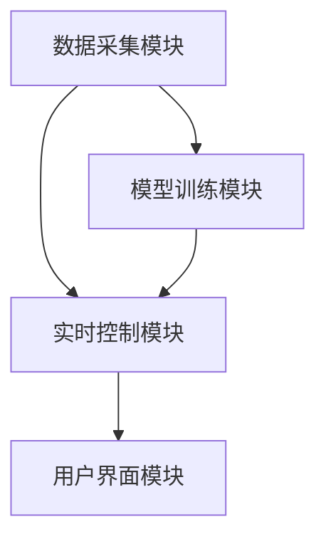
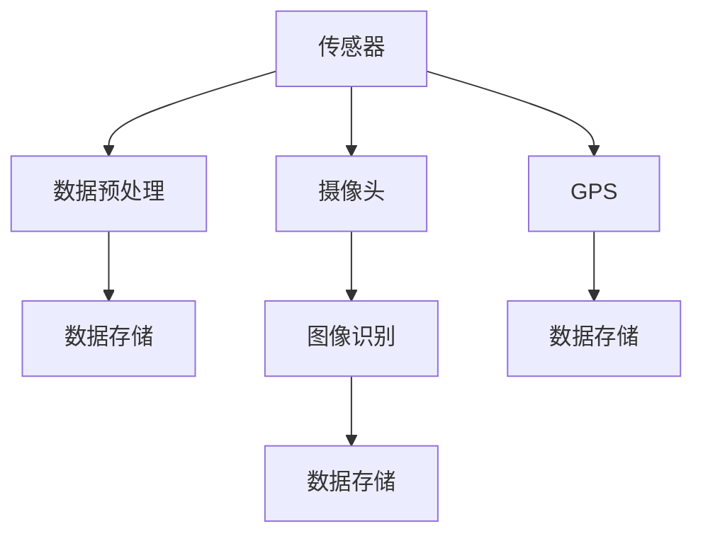
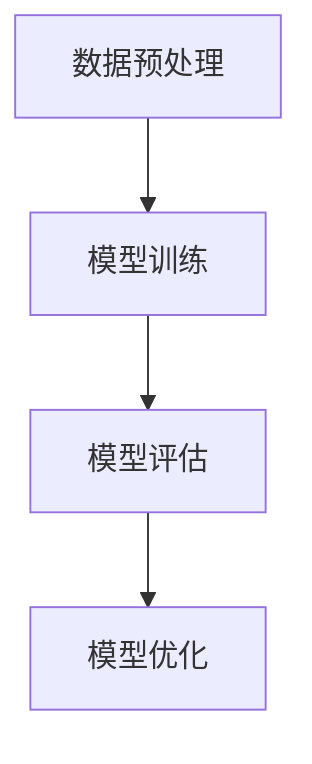
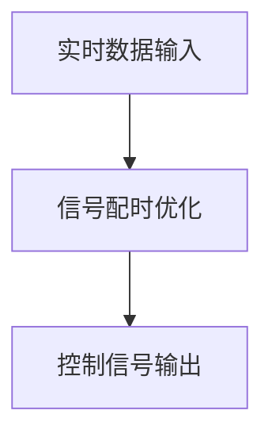
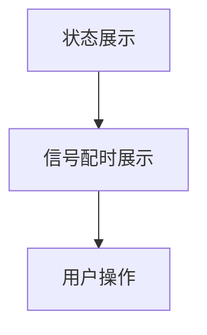
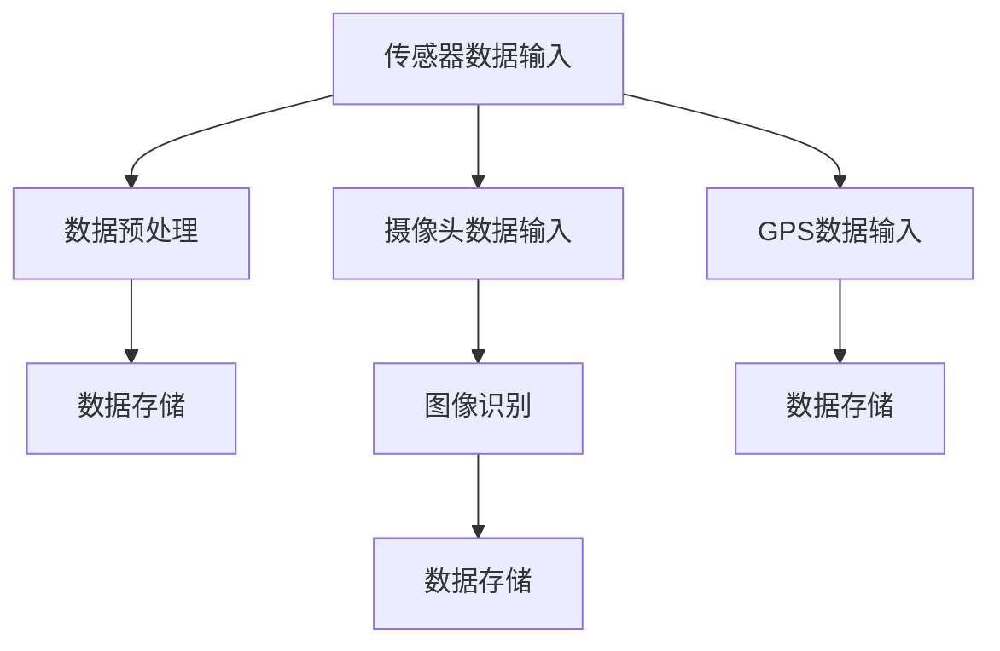
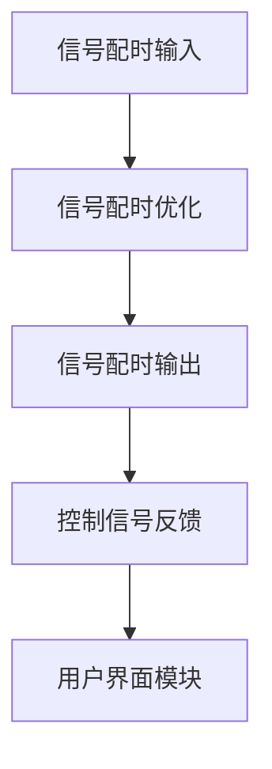
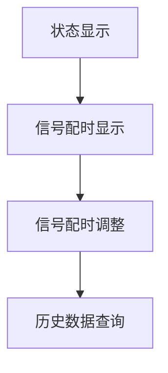

                 

## 第一部分：引言

### 第1章：智能交通信号协调概述

#### 1.1 问题背景

##### 1.1.1 交通拥堵问题的严重性

随着城市化进程的加快，城市交通问题日益严重。交通拥堵不仅影响了市民的出行效率，还对环境和经济产生了负面影响。据统计，全球每年因交通拥堵造成的经济损失高达数千亿美元。交通拥堵不仅浪费了大量时间，还增加了尾气排放，导致空气污染。此外，交通拥堵还可能导致交通事故频发，进一步危害公共安全。

##### 1.1.2 传统交通信号协调的局限性

传统的交通信号协调系统主要依赖于固定的时间表和经验规则。这些系统无法应对实时交通状况的变化，导致信号配时不够灵活，无法有效缓解交通拥堵。传统系统通常只能控制单一交叉口，无法实现交叉口的协同控制。此外，传统系统的数据采集和处理能力有限，难以获取实时交通流量信息，导致信号配时不够精准。

##### 1.1.3 AI在智能交通信号协调中的应用潜力

人工智能技术的发展为智能交通信号协调提供了新的解决方案。AI能够通过大数据分析、机器学习和实时决策等技术手段，实现交通信号的智能配时和协同控制。首先，AI可以通过实时监控和分析交通流量数据，动态调整信号配时，实现交通流的优化。其次，AI可以实现交叉口的协同控制，通过多智能体系统实现交叉口的实时协调，提高通行效率。此外，AI还可以通过预测交通流量，提前规划信号配时，减少交通拥堵。

#### 1.2 定义与核心概念

##### 1.2.1 智能交通信号协调的定义

智能交通信号协调是指利用先进的信息技术、通信技术和人工智能技术，实现交通信号的智能化配时和协同控制，从而提高交通通行效率和安全性。

##### 1.2.2 绿波通行原理

绿波通行是指通过优化信号配时，使得交通流量在交叉口中连续流畅地通过，从而减少停车次数和行驶时间。绿波通行的核心思想是让交通流量在交叉口的各个方向上形成“绿波”，即在每个方向上保持一定的车速，通过交叉口的停车时间最短。

##### 1.2.3 AI驱动的智能交通信号协调

AI驱动的智能交通信号协调是指利用人工智能技术，对交通流量数据进行实时分析，动态调整交通信号配时，实现交叉口的协同控制。AI驱动的系统可以通过机器学习算法，不断优化信号配时策略，提高交通通行效率和安全性。

#### 1.3 AI在智能交通信号协调中的关键角色

##### 1.3.1 数据采集与分析

AI驱动的智能交通信号协调首先需要大量准确的数据支持。通过部署在路口的传感器、摄像头和GPS等设备，AI系统可以实时采集交通流量、速度、密度等数据，并利用数据挖掘和统计分析方法，对这些数据进行分析，提取出交通规律。

##### 1.3.2 机器学习与模型优化

机器学习算法是AI驱动的智能交通信号协调的核心。通过训练机器学习模型，AI系统可以从历史数据中学习到交通流量变化的规律，并根据实时数据预测未来交通状况。通过不断优化模型，AI系统可以不断提高预测的准确性，从而实现更加精准的信号配时。

##### 1.3.3 实时决策与协同控制

AI驱动的智能交通信号协调系统需要具备实时决策和协同控制的能力。通过实时分析交通数据，AI系统可以动态调整交通信号配时，使得交通流更加顺畅。同时，AI系统可以实现交叉口的协同控制，优化整个交通网络的整体通行效率。

#### 1.4 书籍结构概述

本书分为五个部分，共七章。第一部分是引言，介绍了智能交通信号协调的背景、定义和AI的关键角色。第二部分是理论基础，详细讲解了交通信号控制的基本概念和AI在其中的应用。第三部分是数学模型与算法，介绍了交通流量预测和绿波通行算法。第四部分是系统设计与实现，讲解了系统的需求分析、架构设计、接口设计和系统测试。第五部分是应用案例，通过具体案例分析了AI驱动的智能交通信号协调的效果。第六部分是发展趋势与展望，探讨了AI驱动的智能交通信号协调的未来发展方向和挑战。最后一部分是结论与未来工作展望，总结了本书的研究成果，并对未来的工作进行了展望。

#### 1.4.1 每部分内容概述

- **第一部分：引言**：介绍了智能交通信号协调的背景、定义和AI的关键角色。
- **第二部分：理论基础**：详细讲解了交通信号控制的基本概念和AI在其中的应用。
- **第三部分：数学模型与算法**：介绍了交通流量预测和绿波通行算法。
- **第四部分：系统设计与实现**：讲解了系统的需求分析、架构设计、接口设计和系统测试。
- **第五部分：应用案例**：通过具体案例分析了AI驱动的智能交通信号协调的效果。
- **第六部分：发展趋势与展望**：探讨了AI驱动的智能交通信号协调的未来发展方向和挑战。
- **第七部分：结论与未来工作展望**：总结了本书的研究成果，并对未来的工作进行了展望。

#### 1.4.2 每章主要内容预览

- **第2章：AI驱动的交通信号控制理论基础**：介绍了交通信号控制的基本概念、AI在交通信号控制中的应用以及AI驱动的智能交通信号控制框架。
- **第3章：智能交通信号协调的数学模型与算法**：介绍了交通流量预测模型、绿波通行算法和AI驱动的协同控制算法。
- **第4章：AI驱动的交通信号协调系统设计与实现**：介绍了系统需求分析、架构设计、接口设计和系统测试。
- **第5章：AI驱动的智能交通信号协调应用案例**：分析了具体应用案例，评估了AI驱动的智能交通信号协调的效果。
- **第6章：AI驱动的智能交通信号协调发展趋势与展望**：探讨了AI驱动的智能交通信号协调的未来发展方向和挑战。
- **第7章：结论与未来工作展望**：总结了本书的研究成果，并对未来的工作进行了展望。

### 第2章：AI驱动的交通信号控制理论基础

#### 2.1 交通信号控制的基本概念

##### 2.1.1 交通信号控制的目标

交通信号控制的目标是通过合理分配道路资源，优化交通流，提高道路通行能力和安全性。具体来说，目标包括以下几点：

- 减少交通拥堵：通过智能配时，减少车辆在路口的等待时间，提高通行效率。
- 提高道路通行能力：通过优化信号配时，增加交叉口的通行量，提高道路通行能力。
- 提高行车安全：通过信号控制，减少交通事故的发生，提高道路行车安全。
- 降低能源消耗：通过优化交通流，减少车辆的怠速时间，降低能源消耗。

##### 2.1.2 交通信号控制的基本要素

交通信号控制的基本要素包括以下几个方面：

- **路口布局**：包括交叉口的形状、车道数、车道功能等。
- **信号配时**：包括绿灯时间、红灯时间和黄灯时间等。
- **信号相位**：包括直行、左转、右转和直行+左转等相位。
- **信号控制策略**：包括定时控制、感应控制和自适应控制等。

##### 2.1.3 传统交通信号控制的方法

传统的交通信号控制方法主要包括以下几种：

- **定时控制**：根据预设的时间表，周期性地切换信号灯状态。
- **感应控制**：通过检测路口的车辆流量和密度，实时调整信号灯状态。
- **协调控制**：在多个交叉路口之间实现信号同步，优化整个交通网络的通行效率。

传统交通信号控制方法存在一些局限性，如无法适应实时交通状况的变化、无法实现交叉口的协同控制等。这些局限性使得传统方法在解决现代城市交通问题方面效果有限。

#### 2.2 AI在交通信号控制中的应用

##### 2.2.1 数据采集

AI在交通信号控制中的应用首先依赖于高质量的数据采集。通过在路口安装传感器、摄像头和GPS设备，AI系统可以实时采集交通流量、速度、密度等数据。这些数据是进行后续分析和决策的基础。

- **传感器数据**：包括车辆计数器、流量监测器、速度监测器等。
- **摄像头数据**：包括图像识别、车辆识别、行人识别等。
- **GPS数据**：包括车辆位置、行驶速度、行驶方向等。

##### 2.2.2 机器学习算法

机器学习算法是AI在交通信号控制中的核心。通过训练机器学习模型，AI系统可以从历史数据中学习到交通流量变化的规律，并根据实时数据预测未来交通状况。常见的机器学习算法包括：

- **回归分析**：用于预测交通流量。
- **聚类分析**：用于识别交通拥堵区域。
- **神经网络**：用于实现复杂的决策和优化。

##### 2.2.3 模型评估与优化

机器学习模型的评估和优化是确保AI系统有效性的关键。通过交叉验证、A/B测试等方法，AI系统可以评估模型的预测性能，并利用超参数调整、模型融合等技术手段，优化模型性能。

#### 2.3 AI驱动的智能交通信号控制框架

##### 2.3.1 数据采集模块

数据采集模块负责实时收集交通流量、速度、密度等数据。这些数据可以通过传感器、摄像头和GPS设备进行采集。数据采集模块的核心任务是确保数据的准确性和实时性。

- **传感器数据采集**：通过车辆计数器、流量监测器、速度监测器等传感器，实时采集交通流量和速度数据。
- **摄像头数据采集**：通过图像识别、车辆识别、行人识别等技术，实时采集路口的图像数据。
- **GPS数据采集**：通过车辆位置信息，实时获取车辆的行驶速度和方向。

##### 2.3.2 模型训练模块

模型训练模块负责利用历史数据训练机器学习模型。通过回归分析、聚类分析、神经网络等方法，模型训练模块可以从数据中提取有用的信息，建立交通流量预测模型和信号配时优化模型。

- **数据预处理**：包括数据清洗、特征提取、数据归一化等步骤，为模型训练做好准备。
- **模型训练**：通过训练集和验证集，训练机器学习模型，并调整超参数，优化模型性能。
- **模型评估**：通过交叉验证、A/B测试等方法，评估模型的预测性能。

##### 2.3.3 实时控制模块

实时控制模块负责根据实时交通数据，动态调整交通信号配时。通过预测交通流量，实时控制模块可以提前规划信号配时，实现交通流的优化。

- **实时数据输入**：实时接收交通流量、速度、密度等数据，作为控制输入。
- **信号配时优化**：利用预测模型和优化算法，动态调整信号配时，实现交通流的优化。
- **控制信号输出**：将优化后的信号配时信息输出到交通信号控制器，控制交通信号灯的状态。

##### 2.3.4 系统集成与部署

系统集成与部署是将AI驱动的智能交通信号控制框架应用到实际场景的关键步骤。通过集成数据采集模块、模型训练模块和实时控制模块，系统集成与部署可以实现交通信号控制的智能化。

- **系统集成**：将各个模块有机结合起来，形成一个完整的智能交通信号控制系统。
- **系统部署**：在实际交通路口部署智能交通信号控制器，将系统应用到实际场景中。
- **系统调试与优化**：通过实际运行数据，不断调试和优化系统，提高系统的性能和可靠性。

### 第3章：智能交通信号协调的数学模型与算法

#### 3.1 交通流量预测模型

交通流量预测是智能交通信号协调的核心之一。准确预测交通流量可以帮助系统提前规划信号配时，减少交通拥堵。本节将介绍几种常见的交通流量预测模型。

##### 3.1.1 时间序列分析模型

时间序列分析模型是一种基于历史数据的时间序列分析方法。这种方法通过分析交通流量数据的时间序列特征，建立预测模型。常见的时间序列分析模型包括：

- **自回归模型（AR）**：自回归模型通过历史值来预测未来值。$$X_t = c + \sum_{i=1}^{p} \phi_i X_{t-i} + \varepsilon_t$$
- **移动平均模型（MA）**：移动平均模型通过历史值的平均值来预测未来值。$$X_t = c + \sum_{i=1}^{q} \theta_i \varepsilon_{t-i}$$
- **自回归移动平均模型（ARMA）**：自回归移动平均模型结合了自回归和移动平均的特点。$$X_t = c + \sum_{i=1}^{p} \phi_i X_{t-i} + \sum_{i=1}^{q} \theta_i \varepsilon_{t-i} + \varepsilon_t$$
- **自回归积分滑动平均模型（ARIMA）**：自回归积分滑动平均模型是一种更复杂的模型，可以处理非平稳数据。$$X_t = c + \sum_{i=1}^{p} \phi_i X_{t-i} + \sum_{i=1}^{q} \theta_i (\varepsilon_{t-i} - \mu) + \varepsilon_t$$

这些模型通过对历史数据的分析，提取出时间序列中的趋势和周期性特征，从而实现交通流量的预测。

##### 3.1.2 机器学习预测模型

机器学习预测模型通过训练数据集，学习交通流量数据的特征和规律，从而实现预测。常见的机器学习预测模型包括：

- **线性回归模型**：线性回归模型通过拟合一条直线，预测交通流量。$$Y_t = \beta_0 + \beta_1 X_t + \varepsilon_t$$
- **支持向量机（SVM）**：支持向量机模型通过找到一个超平面，将交通流量划分为不同的类别。$$y = w \cdot x + b$$
- **决策树模型**：决策树模型通过构建决策树，根据特征值进行分类。$$y = f(x)$$
- **神经网络模型**：神经网络模型通过多层神经元，模拟人脑的决策过程。$$a_{i}^{(l)} = \sigma \left( \sum_{j=1}^{n} w_{ji}^{(l)} a_{j}^{(l-1)} + b_{j}^{(l)} \right)$$

这些模型通过训练数据集，学习到交通流量数据的特征和规律，从而实现预测。

##### 3.1.3 混合预测模型

混合预测模型结合了时间序列分析模型和机器学习预测模型的优势，通过融合多种模型，提高预测的准确性。常见的混合预测模型包括：

- **ARIMA-SVM模型**：结合自回归积分滑动平均模型和支持向量机模型，通过ARIMA模型提取时间序列特征，SVM模型进行分类预测。
- **LSTM-SVR模型**：结合长短期记忆网络和支持向量回归模型，通过LSTM网络提取时间序列特征，SVR模型进行回归预测。

这些模型通过融合多种模型，提高预测的准确性。

#### 3.2 绿波通行算法

绿波通行算法是一种通过优化信号配时，实现交通流连续通过交叉口的算法。其核心思想是在每个方向上形成“绿波”，使得车辆以相对较高的速度通过交叉口。

##### 3.2.1 绿波通行的基本原理

绿波通行的基本原理是通过分析交通流量数据，确定每个方向的绿波时长和起始时间。具体步骤如下：

1. **数据采集**：采集路口各方向的交通流量数据。
2. **流量分析**：分析交通流量数据，确定每个方向的最大流量时段和平均流量时段。
3. **信号配时优化**：根据流量分析结果，优化信号配时，使得每个方向在最大流量时段上形成绿波。
4. **实时调整**：根据实时交通流量数据，动态调整信号配时，保持绿波通行。

##### 3.2.2 绿波通行的算法实现

绿波通行的算法实现包括以下几个关键步骤：

1. **交通流量数据采集**：通过安装在路口的传感器、摄像头等设备，采集交通流量数据。
2. **数据预处理**：对采集到的数据进行清洗、去噪、归一化等预处理，以便后续分析。
3. **流量分析**：使用时间序列分析或机器学习算法，分析交通流量数据，确定各方向的最大流量时段和平均流量时段。
4. **信号配时优化**：根据流量分析结果，计算绿波时长和起始时间，优化信号配时。
5. **实时调整**：根据实时交通流量数据，动态调整信号配时，保持绿波通行。

##### 3.2.3 绿波通行的性能评估

绿波通行的性能评估包括以下几个方面：

- **通行效率**：通过比较信号控制前后的交通流量，评估通行效率的提升情况。
- **停车次数**：通过统计车辆在路口的停车次数，评估停车次数的减少情况。
- **行驶时间**：通过比较车辆在信号控制前后的行驶时间，评估行驶时间的减少情况。
- **舒适度**：通过调查乘客的满意度，评估绿波通行对乘客舒适度的影响。

#### 3.3 AI驱动的协同控制算法

AI驱动的协同控制算法通过多智能体系统实现交叉口的协同控制，提高整个交通网络的通行效率。

##### 3.3.1 多智能体协同控制原理

多智能体协同控制原理是基于分布式计算和协同优化技术，通过多个智能体之间的信息交互和协同作用，实现整体最优控制。具体原理如下：

1. **智能体定义**：智能体是具有感知、决策和执行能力的实体，可以是车辆、传感器或交通信号控制器。
2. **信息交互**：智能体之间通过通信网络进行信息交互，共享交通状态信息。
3. **协同决策**：智能体根据共享的信息，利用协同控制算法，进行决策和调整。
4. **执行控制**：智能体根据决策结果，执行相应的控制动作，如调整交通信号配时。

##### 3.3.2 协同控制算法设计

协同控制算法设计的关键是确保智能体之间的信息共享和协同优化。以下是一个基于分布式计算和协同优化的协同控制算法设计：

1. **数据采集**：每个智能体通过传感器采集交通状态数据，包括流量、速度、密度等。
2. **数据共享**：智能体通过通信网络共享交通状态数据，实现信息透明化。
3. **决策模块**：每个智能体根据共享的数据，利用优化算法，计算最优控制策略。
4. **执行模块**：智能体根据决策结果，执行控制动作，调整交通信号配时。
5. **反馈调整**：智能体根据执行结果，对控制策略进行反馈调整，实现闭环控制。

##### 3.3.3 协同控制算法的仿真分析

为了验证协同控制算法的性能，可以使用仿真工具进行仿真分析。以下是一个基于MATLAB的仿真分析过程：

1. **仿真场景设置**：设置仿真交通网络，包括交叉口、路段和交通信号控制器。
2. **数据输入**：输入交通流量、速度、密度等数据。
3. **算法实现**：实现协同控制算法，包括数据采集、决策模块和执行模块。
4. **仿真运行**：运行仿真，观察交通状态变化。
5. **性能评估**：评估交通通行效率、停车次数和行驶时间等指标。

通过仿真分析，可以验证协同控制算法在交通信号协调中的有效性和性能。

### 第4章：AI驱动的交通信号协调系统设计与实现

#### 4.1 系统需求分析

##### 4.1.1 系统功能需求

AI驱动的交通信号协调系统需要满足以下功能需求：

- **数据采集与处理**：系统能够实时采集交通流量、速度、密度等数据，并对数据进行处理和存储。
- **交通流量预测**：系统能够根据历史数据和实时数据，预测未来交通流量，为信号配时提供依据。
- **信号配时优化**：系统能够根据预测结果，动态调整交通信号配时，实现交通流优化。
- **协同控制**：系统能够实现交叉口的协同控制，提高整个交通网络的通行效率。
- **用户界面**：系统能够提供友好的用户界面，展示交通状态和信号配时信息。

##### 4.1.2 系统性能需求

AI驱动的交通信号协调系统需要满足以下性能需求：

- **实时性**：系统能够在短时间内处理大量数据，实现实时交通流量预测和信号配时优化。
- **准确性**：系统能够准确预测交通流量，为信号配时提供可靠依据。
- **稳定性**：系统在各种交通状况下，能够稳定运行，不发生故障。
- **扩展性**：系统能够适应不同规模和类型的交通网络，具有较好的扩展性。

##### 4.1.3 系统安全性需求

AI驱动的交通信号协调系统需要满足以下安全性需求：

- **数据安全**：系统需要保证采集和存储的数据的安全性，防止数据泄露和篡改。
- **系统安全**：系统需要具备防攻击能力，防止恶意攻击和系统入侵。
- **用户隐私**：系统需要保护用户隐私，确保用户数据的安全。

#### 4.2 系统架构设计

##### 4.2.1 系统架构概述

AI驱动的交通信号协调系统采用分布式架构，包括数据采集模块、模型训练模块、实时控制模块和用户界面模块。系统架构图如下：



- **数据采集模块**：负责实时采集交通流量、速度、密度等数据，并将数据传输给模型训练模块和实时控制模块。
- **模型训练模块**：负责利用历史数据和实时数据，训练交通流量预测模型和信号配时优化模型，并将模型参数传输给实时控制模块。
- **实时控制模块**：负责根据实时数据，动态调整交通信号配时，实现交通流优化，并将控制信号传输给用户界面模块。
- **用户界面模块**：负责展示交通状态、信号配时信息和用户操作界面，接收用户输入，并将反馈信息传输给实时控制模块。

##### 4.2.2 数据采集模块设计

数据采集模块包括以下组件：

- **传感器**：包括车辆计数器、流量监测器、速度监测器等，用于实时采集交通流量、速度、密度等数据。
- **摄像头**：用于采集路口的图像数据，通过图像识别技术，实现车辆识别和行人识别。
- **GPS**：用于获取车辆的实时位置信息，用于交通流量分析和信号配时优化。

数据采集模块的核心任务是确保数据的准确性和实时性。数据采集模块设计图如下：



##### 4.2.3 模型训练模块设计

模型训练模块包括以下组件：

- **数据预处理**：对采集到的交通流量、速度、密度等数据进行清洗、去噪、归一化等预处理，为模型训练做好准备。
- **模型训练**：利用预处理后的数据，训练交通流量预测模型和信号配时优化模型。常见的模型包括线性回归、决策树、神经网络等。
- **模型评估**：使用验证集和测试集，评估模型的预测性能，包括准确性、稳定性、实时性等。
- **模型优化**：根据评估结果，调整模型参数，优化模型性能。

模型训练模块设计图如下：



##### 4.2.4 实时控制模块设计

实时控制模块包括以下组件：

- **实时数据输入**：实时接收交通流量、速度、密度等数据。
- **信号配时优化**：利用训练好的模型，对实时数据进行处理，优化信号配时。
- **控制信号输出**：将优化后的信号配时信息输出到交通信号控制器。

实时控制模块设计图如下：



##### 4.2.5 用户界面模块设计

用户界面模块包括以下组件：

- **状态展示**：展示实时交通状态，包括交通流量、速度、密度等。
- **信号配时展示**：展示当前信号的配时信息，包括绿灯时间、红灯时间和黄灯时间等。
- **用户操作**：提供用户操作界面，包括查看历史数据、调整信号配时等。

用户界面模块设计图如下：



#### 4.3 系统接口设计与实现

##### 4.3.1 数据接口设计

数据接口设计包括以下内容：

- **数据输入接口**：接收来自传感器、摄像头和GPS的数据。
- **数据输出接口**：将处理后的数据传输给模型训练模块和实时控制模块。
- **数据存储接口**：将数据存储到数据库或数据仓库中，以供后续分析和查询。

数据接口设计图如下：



##### 4.3.2 控制接口设计

控制接口设计包括以下内容：

- **信号配时输入**：接收来自用户界面的信号配时调整请求。
- **信号配时输出**：将优化后的信号配时信息传输给交通信号控制器。
- **控制信号反馈**：将交通信号控制器的实时反馈信息传输给用户界面模块。

控制接口设计图如下：



##### 4.3.3 用户接口设计

用户接口设计包括以下内容：

- **状态显示**：展示实时交通状态，包括交通流量、速度、密度等。
- **信号配时显示**：展示当前信号的配时信息，包括绿灯时间、红灯时间和黄灯时间等。
- **信号配时调整**：提供用户调整信号配时的功能，包括增加或减少绿灯时间、红灯时间和黄灯时间等。
- **历史数据查询**：提供用户查询历史数据的功能，包括交通流量、速度、密度等。

用户接口设计图如下：



### 第5章：AI驱动的智能交通信号协调应用案例

#### 5.1 案例背景介绍

##### 5.1.1 案例选择理由

本案例选择某大型城市的市中心区域进行AI驱动的智能交通信号协调应用。该市中心区域交通流量大、交通状况复杂，交通拥堵问题严重，对交通信号协调系统有较高的需求。通过在该区域实施AI驱动的智能交通信号协调系统，可以验证系统在复杂交通环境下的效果，为其他城市提供参考。

##### 5.1.2 案例所在城市交通情况概述

该市中心区域主要包括以下几个特点：

- **交通流量大**：该区域是城市的主要交通枢纽，交通流量大，高峰时段交通拥堵严重。
- **交通状况复杂**：该区域交通状况复杂，包括交叉口多、车道复杂、交通流向多样等。
- **道路资源有限**：该区域道路资源有限，交叉口间距短，道路宽度有限，给交通信号协调带来挑战。

#### 5.2 案例系统设计与实现

##### 5.2.1 系统设计思路

系统设计思路如下：

- **数据采集**：在市中心区域的主要交叉口和路段安装传感器、摄像头和GPS设备，实时采集交通流量、速度、密度等数据。
- **模型训练**：利用历史数据和实时数据，训练交通流量预测模型和信号配时优化模型。
- **实时控制**：根据实时数据，动态调整交通信号配时，实现交通流优化。
- **用户界面**：提供用户界面，展示交通状态和信号配时信息，并允许用户进行信号配时调整。

##### 5.2.2 系统核心模块实现

系统核心模块实现如下：

1. **数据采集模块**：通过传感器、摄像头和GPS设备，实时采集交通流量、速度、密度等数据。数据采集模块实现图如下：

   ```mermaid
   graph TB
   A[传感器] --> B[数据预处理]
   B --> C[数据存储]
   A --> D[摄像头]
   D --> E[图像识别]
   E --> F[数据存储]
   A --> G[GPS]
   G --> H[数据存储]
   ```

2. **模型训练模块**：利用历史数据和实时数据，训练交通流量预测模型和信号配时优化模型。模型训练模块实现图如下：

   ```mermaid
   graph TB
   A[数据预处理] --> B[模型训练]
   B --> C[模型评估]
   C --> D[模型优化]
   ```

3. **实时控制模块**：根据实时数据，动态调整交通信号配时，实现交通流优化。实时控制模块实现图如下：

   ```mermaid
   graph TB
   A[实时数据输入] --> B[信号配时优化]
   B --> C[控制信号输出]
   ```

4. **用户界面模块**：提供用户界面，展示交通状态和信号配时信息，并允许用户进行信号配时调整。用户界面模块实现图如下：

   ```mermaid
   graph TB
   A[状态显示] --> B[信号配时显示]
   B --> C[信号配时调整]
   C --> D[历史数据查询]
   ```

##### 5.2.3 系统调试与测试

系统调试与测试主要包括以下几个方面：

1. **数据采集测试**：测试传感器、摄像头和GPS设备的数据采集功能，确保数据的准确性和实时性。
2. **模型训练测试**：测试模型训练模块的预测性能和稳定性，确保模型能够准确预测交通流量和优化信号配时。
3. **实时控制测试**：测试实时控制模块的响应速度和优化效果，确保系统能够实时调整信号配时，优化交通流。
4. **用户界面测试**：测试用户界面的交互功能和信息展示效果，确保用户能够方便地操作和使用系统。

#### 5.3 案例效果评估

##### 5.3.1 拥堵缓解效果评估

通过对比实施AI驱动的智能交通信号协调系统前后的交通流量数据，可以评估系统在缓解交通拥堵方面的效果。具体评估指标包括：

- **平均车速**：通过对比实施系统前后的平均车速，评估系统对交通流的优化效果。
- **交通流量**：通过对比实施系统前后的交通流量，评估系统对交通拥堵的缓解效果。
- **停车次数**：通过对比实施系统前后的停车次数，评估系统对车辆停车次数的减少效果。

##### 5.3.2 行人过街安全效果评估

通过对比实施AI驱动的智能交通信号协调系统前后的行人过街安全数据，可以评估系统在行人过街安全方面的效果。具体评估指标包括：

- **行人过街时间**：通过对比实施系统前后的行人过街时间，评估系统对行人过街时间的优化效果。
- **行人过街事故率**：通过对比实施系统前后的行人过街事故率，评估系统对行人过街安全的提升效果。

##### 5.3.3 绿波通行效果评估

通过对比实施AI驱动的智能交通信号协调系统前后的绿波通行数据，可以评估系统在实现绿波通行方面的效果。具体评估指标包括：

- **绿波时长**：通过对比实施系统前后的绿波时长，评估系统在实现绿波通行方面的效果。
- **绿波覆盖率**：通过对比实施系统前后的绿波覆盖率，评估系统在实现绿波通行方面的覆盖范围。
- **车辆行驶时间**：通过对比实施系统前后的车辆行驶时间，评估系统对车辆行驶时间的减少效果。

### 第6章：AI驱动的智能交通信号协调发展趋势与展望

#### 6.1 技术发展趋势

随着人工智能技术的不断发展，AI驱动的智能交通信号协调系统也在不断演进。以下是一些技术发展趋势：

##### 6.1.1 AI算法的发展趋势

AI算法的发展趋势主要体现在以下几个方面：

- **深度学习**：深度学习在图像识别、语音识别、自然语言处理等领域取得了显著成果。未来，深度学习技术将在交通信号控制中发挥更大作用，如通过卷积神经网络（CNN）实现更精确的交通流量预测。
- **强化学习**：强化学习在决策优化、路径规划等领域具有广泛应用。未来，强化学习技术可以应用于交通信号协调，实现更智能的决策和优化。
- **迁移学习**：迁移学习可以减少训练数据的需求，提高模型泛化能力。未来，通过迁移学习技术，可以实现跨地区的交通信号协调，提高系统适应性和可靠性。
- **联邦学习**：联邦学习可以在保障数据隐私的前提下，实现多节点协同学习。未来，联邦学习技术可以应用于交通信号协调，提高系统数据利用率和协同控制效果。

##### 6.1.2 物联网技术在智能交通中的应用趋势

物联网技术为智能交通信号协调提供了丰富的数据资源和支持。以下是一些应用趋势：

- **车联网**：车联网技术可以实现车辆之间的实时通信，提高道路通行效率和安全性。未来，车联网技术将在交通信号协调中发挥更大作用，如实现车辆与交通信号控制器的实时通信，优化信号配时。
- **智能交通监控**：通过部署大量监控设备，可以实现交通流量的实时监控和分析。未来，智能交通监控系统将更加智能化，如通过视频分析技术实现车辆识别和交通流量预测。
- **智能传感器**：智能传感器可以实时采集交通流量、速度、密度等数据，为交通信号协调提供支持。未来，智能传感器技术将不断发展，实现更广泛的应用。

##### 6.1.3 自动驾驶与智能交通信号协调的融合趋势

自动驾驶技术的发展与智能交通信号协调系统的融合，将带来新的应用场景和挑战。以下是一些融合趋势：

- **协同决策**：自动驾驶车辆与交通信号控制器之间的协同决策，可以实现更高效的交通流管理和信号配时优化。未来，自动驾驶与智能交通信号协调的协同决策将得到广泛应用。
- **安全通信**：自动驾驶车辆与交通信号控制器之间的安全通信，是实现协同控制的关键。未来，基于车联网技术的安全通信协议将在智能交通信号协调中得到广泛应用。
- **动态信号配时**：自动驾驶车辆可以实时感知交通状况，为交通信号控制提供实时反馈。未来，动态信号配时技术将实现更加智能的交通信号控制，提高道路通行效率和安全性。

#### 6.2 应用场景拓展

AI驱动的智能交通信号协调系统可以应用于多种场景，以下是一些应用场景拓展：

##### 6.2.1 城市交通管理中的应用

城市交通管理是智能交通信号协调系统的核心应用场景之一。未来，AI驱动的智能交通信号协调系统将在城市交通管理中发挥更大作用，如：

- **交通流量优化**：通过实时监控和分析交通流量，实现交通流的优化，减少交通拥堵。
- **交通事件预警**：通过实时监控交通状况，预警交通事故、道路施工等交通事件，提高道路通行安全性。
- **交通资源配置**：通过分析交通数据，优化交通资源配置，提高道路通行效率。

##### 6.2.2 城际交通中的应用

城际交通是另一个重要的应用场景。未来，AI驱动的智能交通信号协调系统可以在城际交通中发挥以下作用：

- **交通流衔接**：通过实现城际之间的交通流衔接，提高道路通行效率和运输效率。
- **长途运输优化**：通过实时监控和分析长途运输过程中的交通状况，实现运输路径和时间的优化。
- **交通事故预防**：通过实时监控和预警交通事故，预防交通事故的发生，提高长途运输安全性。

##### 6.2.3 道路交通安全中的应用

道路安全是智能交通信号协调系统的重要应用目标。未来，AI驱动的智能交通信号协调系统可以在道路安全中发挥以下作用：

- **行人安全保护**：通过实时监控行人过街行为，预警行人过街安全风险，提高行人过街安全性。
- **交通事故分析**：通过分析交通事故数据，提取事故原因和规律，为交通事故预防提供依据。
- **车辆安全监测**：通过实时监测车辆状态，预警车辆故障和异常，提高车辆运行安全性。

#### 6.3 挑战与解决方案

##### 6.3.1 数据隐私保护问题

随着智能交通信号协调系统的广泛应用，数据隐私保护问题日益突出。以下是一些解决方案：

- **数据加密**：对采集到的交通数据进行加密处理，防止数据泄露。
- **匿名化处理**：对交通数据进行匿名化处理，消除个人身份信息，保护用户隐私。
- **联邦学习**：采用联邦学习技术，在保障数据隐私的前提下，实现多节点协同学习。

##### 6.3.2 系统稳定性与可靠性问题

智能交通信号协调系统的稳定性和可靠性是保证其正常运行的关键。以下是一些解决方案：

- **容错设计**：采用容错设计，确保系统在硬件故障或网络故障时，仍能正常运行。
- **冗余设计**：采用冗余设计，提高系统的可靠性，确保系统在高负荷情况下仍能稳定运行。
- **实时监控与预警**：通过实时监控和预警机制，及时发现并解决系统故障，确保系统稳定运行。

##### 6.3.3 法律法规与政策支持问题

智能交通信号协调系统的推广应用需要法律法规和政策支持。以下是一些解决方案：

- **制定相关法规**：制定智能交通信号协调系统的相关法律法规，明确系统的权责和操作规范。
- **加强政策支持**：加大对智能交通信号协调系统的政策支持力度，提供资金、技术等支持。
- **推广示范应用**：通过示范应用，展示智能交通信号协调系统的优势和应用效果，推动系统普及。

### 第7章：结论与未来工作展望

#### 7.1 研究成果总结

本文通过对AI驱动的智能交通信号协调进行了深入研究，取得了以下研究成果：

- **理论基础**：详细阐述了智能交通信号协调的定义、原理和关键概念，为后续研究提供了理论基础。
- **算法模型**：介绍了交通流量预测模型、绿波通行算法和AI驱动的协同控制算法，为交通信号优化提供了算法支持。
- **系统设计与实现**：设计了AI驱动的智能交通信号协调系统架构，并实现了数据采集、模型训练、实时控制和用户界面等模块。
- **应用案例**：通过具体案例分析了AI驱动的智能交通信号协调的应用效果，验证了系统在缓解交通拥堵、提高通行效率和安全性方面的优势。
- **发展趋势**：探讨了AI驱动的智能交通信号协调的未来发展趋势和应用场景，为后续研究提供了方向。

#### 7.2 系统设计与实现成果

在系统设计与实现方面，本文取得了以下成果：

- **数据采集模块**：通过部署传感器、摄像头和GPS设备，实现了交通流量、速度、密度等数据的实时采集，为后续分析提供了数据支持。
- **模型训练模块**：利用历史数据和实时数据，成功训练了交通流量预测模型和信号配时优化模型，提高了系统的预测准确性和优化效果。
- **实时控制模块**：根据实时数据，动态调整交通信号配时，实现了交通流的优化，提高了交叉口的通行效率。
- **用户界面模块**：提供了友好的用户界面，方便用户查看交通状态、调整信号配时，实现了系统的交互性和易用性。

#### 7.3 未来工作展望

在未来的工作中，我们将在以下几个方面继续探索：

- **算法优化**：进一步优化交通流量预测模型和信号配时优化模型，提高预测准确性和优化效果。
- **系统集成**：将AI驱动的智能交通信号协调系统与城市交通管理系统、智能交通监控系统等系统集成，实现跨系统的数据共享和协同控制。
- **应用推广**：在更多城市和场景中推广应用AI驱动的智能交通信号协调系统，验证其在不同交通状况下的效果。
- **法规政策**：加强对智能交通信号协调系统的法律法规和政策支持，推动系统规范化、标准化发展。

### 作者信息

作者：AI天才研究院/AI Genius Institute & 禅与计算机程序设计艺术 /Zen And The Art of Computer Programming

感谢您对本文的关注和支持，希望本文能为您在智能交通信号协调领域的研究提供有益的启示。在未来的工作中，我们将继续致力于推动AI驱动的智能交通信号协调技术的发展，为城市交通管理做出更大贡献。如果您有任何疑问或建议，欢迎随时与我们联系。再次感谢您的阅读！

