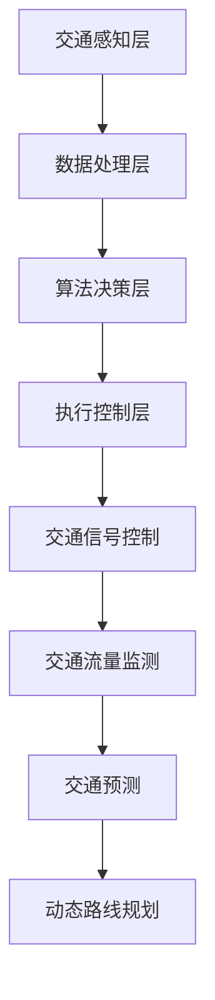
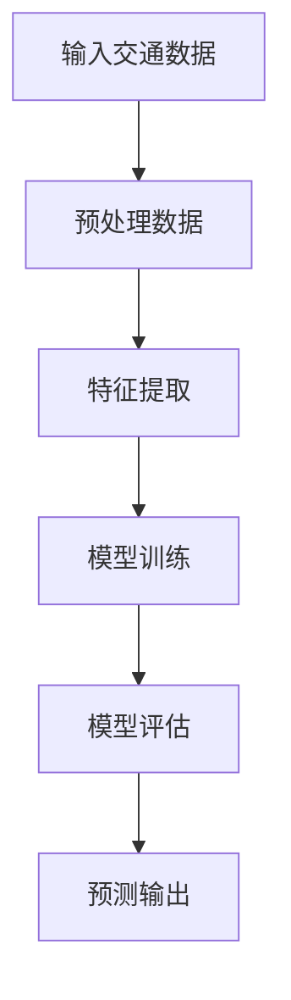
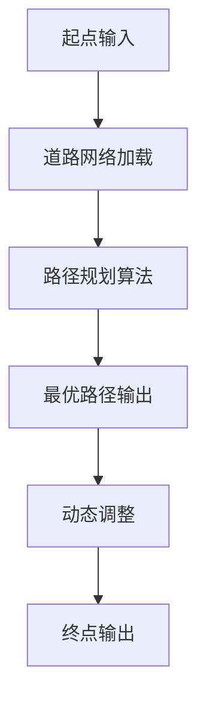

                 

# AI驱动的智能交通管理：从拥堵预测到动态路线规划

> 关键词：智能交通管理、AI、拥堵预测、动态路线规划

> 摘要：本文旨在探讨AI在智能交通管理中的应用，通过分析拥堵预测和动态路线规划两大核心技术的原理和实现方法，阐述AI如何帮助解决城市交通拥堵问题，提高交通效率和安全性。文章将从背景介绍、核心概念、算法原理讲解以及项目实战等多个方面展开论述。

## 第一部分: 引言

### 1.1 问题的背景

#### 1.1.1 智能交通管理的现状

随着城市化进程的加速，城市交通问题日益严重，尤其是交通拥堵问题。据相关数据统计，全球每年因交通拥堵造成的经济损失高达数千亿美元。传统的交通管理方法已经难以应对日益增长的交通需求和复杂多变的城市交通环境。因此，引入智能交通管理技术成为了改善城市交通状况的重要手段。

#### 1.1.2 AI在智能交通管理中的应用

人工智能（AI）技术在智能交通管理领域具有广泛的应用前景。通过利用机器学习、深度学习、数据分析等技术，AI可以实现对交通数据的实时监测和分析，从而实现拥堵预测、动态路线规划、交通信号优化等功能。AI驱动的智能交通管理系统已经成为解决城市交通拥堵问题的重要手段。

### 1.2 问题描述

#### 1.1.3 目标与范围

本文的目标是深入探讨AI驱动的智能交通管理技术，特别是拥堵预测和动态路线规划两大核心技术。文章将从理论分析和实际应用两个方面，对这两个技术进行详细讲解。

#### 1.1.4 边界与外延

本文的研究范围主要关注于AI在智能交通管理中的应用，不涉及其他相关技术。同时，本文将重点关注城市交通拥堵问题的解决，对于其他类型的交通问题（如航空、铁路等）将不进行深入探讨。

### 1.3 问题解决

#### 1.1.5 核心概念

本文涉及的核心概念包括智能交通管理、AI驱动的智能交通管理、拥堵预测和动态路线规划。

#### 1.1.6 概念之间的联系

智能交通管理和AI驱动的智能交通管理之间存在紧密的联系。AI驱动的智能交通管理是智能交通管理的一种高级形式，它通过引入AI技术，实现了对交通数据的实时监测和分析，从而更好地解决了交通拥堵问题。

#### 1.1.7 智能交通管理

智能交通管理是指利用信息技术、通信技术、控制技术等手段，对交通系统进行管理和优化。它包括交通数据采集、交通信息处理、交通信号控制、交通流量监测等功能。

#### 1.1.8 AI驱动的智能交通管理

AI驱动的智能交通管理是指利用AI技术，如机器学习、深度学习、数据分析等，对交通系统进行管理和优化。它能够实现交通数据的实时监测和分析，从而更好地解决交通拥堵问题。

#### 1.1.9 拥堵预测

拥堵预测是指通过分析历史交通数据和实时交通数据，预测未来一段时间内的交通拥堵情况。拥堵预测是智能交通管理的重要组成部分，它可以帮助交通管理者提前制定应对措施，减少交通拥堵。

#### 1.1.10 动态路线规划

动态路线规划是指根据实时交通情况，为车辆提供最优的行驶路线。动态路线规划可以帮助车辆避开拥堵路段，提高交通效率，减少行驶时间。

### 1.4 核心概念属性特征对比表格

| 核心概念 | 定义 | 关联关系 | 主要作用 |
| :---: | :---: | :---: | :---: |
| 智能交通管理 | 利用信息技术、通信技术、控制技术等手段，对交通系统进行管理和优化 | 基础技术 | 提高交通效率和安全性 |
| AI驱动的智能交通管理 | 利用AI技术，如机器学习、深度学习、数据分析等，对交通系统进行管理和优化 | 继承智能交通管理，提高管理能力 | 更好地解决交通拥堵问题 |
| 拥堵预测 | 通过分析历史交通数据和实时交通数据，预测未来一段时间内的交通拥堵情况 | 服务于智能交通管理 | 提前制定应对措施 |
| 动态路线规划 | 根据实时交通情况，为车辆提供最优的行驶路线 | 服务于智能交通管理 | 提高交通效率 |

### 1.5 ER实体关系图架构

以下是智能交通管理系统的ER实体关系图架构：

```mermaid
erDiagram
  TrafficData -->|采集| TrafficMonitoring
  TrafficMonitoring -->|分析| TrafficPrediction
  TrafficPrediction -->|规划| DynamicRoutePlanning
  TrafficMonitoring -->|控制| TrafficSignalControl
```

### 1.6 交通管理系统架构

智能交通管理系统由多个层次组成，包括交通感知层、数据处理层、算法决策层和执行控制层。以下是系统架构的Mermaid流程图：



## 第二部分: AI驱动的智能交通管理基础

### 2.1 AI在交通管理中的应用

#### 2.1.1 机器学习与深度学习

机器学习和深度学习是AI的核心技术，它们在交通管理中的应用包括交通流量预测、交通信号优化、车辆路径规划等。通过学习大量的交通数据，机器学习和深度学习算法可以自动识别交通模式，预测交通流量变化，从而帮助交通管理者制定更科学的决策。

#### 2.1.2 数据分析与处理

数据分析与处理是AI在交通管理中的另一个重要应用。通过对大量交通数据的收集、清洗、处理和分析，可以提取出对交通管理有用的信息，如交通流量、车速、道路占有率等。这些信息有助于交通管理者了解交通状况，优化交通管理策略。

#### 2.1.3 传感器技术

传感器技术在智能交通管理中扮演着关键角色。通过各种类型的传感器，如摄像头、雷达、GPS等，可以实时收集交通数据，为AI算法提供基础数据。传感器技术的应用使得交通数据收集更加准确、实时，有助于提升交通管理的智能化水平。

### 2.2 AI驱动的交通管理系统架构

AI驱动的交通管理系统通常由以下四个层次组成：

#### 2.2.1 交通感知层

交通感知层是系统的基础，负责收集各种交通数据，如车辆数量、速度、道路状况等。这些数据可以通过传感器、摄像头、GPS等设备获取。

#### 2.2.2 数据处理层

数据处理层负责对收集到的交通数据进行清洗、处理和分析，提取出对交通管理有用的信息。这一层通常包括数据预处理、特征提取、数据挖掘等技术。

#### 2.2.3 算法决策层

算法决策层是系统的核心，负责利用AI算法对交通数据进行处理，生成交通预测、信号优化、路线规划等决策。这一层通常包括机器学习、深度学习、优化算法等技术。

#### 2.2.4 执行控制层

执行控制层负责将算法决策层的决策转化为实际的操作，如调整交通信号灯、规划车辆路线等。这一层通常包括控制系统、执行器等硬件设备。

### 2.3 智能交通管理的关键技术

#### 2.3.1 拥堵预测

拥堵预测是智能交通管理的重要组成部分，它通过对历史交通数据和实时交通数据的分析，预测未来一段时间内的交通拥堵情况。拥堵预测的方法包括基于历史数据的预测和基于实时数据的预测。

##### 2.3.1.1 基于历史数据的预测

基于历史数据的预测方法主要利用历史交通数据，通过统计分析、时间序列分析等方法，预测未来交通流量和拥堵情况。这种方法具有较高的准确性，但需要大量历史数据支持。

##### 2.3.1.2 基于实时数据的预测

基于实时数据的预测方法主要利用实时交通数据，通过机器学习、深度学习等方法，预测未来交通流量和拥堵情况。这种方法能够实时更新预测结果，但可能存在一定的延迟和误差。

#### 2.3.2 动态路线规划

动态路线规划是根据实时交通情况，为车辆提供最优的行驶路线。动态路线规划的方法包括车辆路径规划和公交路线优化。

##### 2.3.2.1 车辆路径规划

车辆路径规划是动态路线规划的核心，它通过计算车辆在道路网络中的行驶路径，为车辆提供最优的行驶路线。车辆路径规划的方法包括最短路径算法、遗传算法、蚁群算法等。

##### 2.3.2.2 公交路线优化

公交路线优化是动态路线规划在公共交通领域的应用，它通过优化公交路线，提高公交系统的运行效率。公交路线优化的方法包括最短路径算法、线性规划、启发式算法等。

#### 2.3.3 交通信号优化

交通信号优化是通过调整交通信号灯的配时方案，提高道路的通行能力，减少交通拥堵。交通信号优化的方法包括信号配时优化、交通信号协同控制、实时信号控制等。

## 第三部分: 拥堵预测算法原理讲解

### 3.1 拥堵预测的数学模型与公式

#### 3.1.1 模型基础

拥堵预测的数学模型通常基于时间序列分析和机器学习。时间序列分析通过分析交通流量、车速等时间序列数据，预测未来一段时间内的交通状况。机器学习通过学习历史交通数据，建立预测模型，实现对交通拥堵的预测。

#### 3.1.2 公式推导

假设交通流量 \( Q(t) \) 是时间 \( t \) 的函数，车速 \( V(t) \) 是时间 \( t \) 的函数，道路长度 \( L \) 是常数。拥堵程度可以用流量密度 \( \rho(t) \) 来表示，即：

\[ \rho(t) = \frac{Q(t)}{V(t) \cdot L} \]

流量密度与车速的关系可以表示为：

\[ V(t) = \frac{Q(t)}{\rho(t) \cdot L} \]

通过分析流量密度的时间序列，可以得到拥堵程度的变化趋势。常见的拥堵预测模型包括时间序列模型、ARIMA模型、LSTM模型等。

### 3.2 拥堵预测的Mermaid流程图

以下是拥堵预测的Mermaid流程图：



### 3.3 Python源代码详细讲解

以下是一个简单的Python代码示例，用于实现拥堵预测：

```python
# 导入所需库
import pandas as pd
import numpy as np
from sklearn.ensemble import RandomForestClassifier
from sklearn.model_selection import train_test_split
from sklearn.metrics import accuracy_score

# 模拟预处理数据
data = pd.read_csv('traffic_data.csv')
data['timestamp'] = pd.to_datetime(data['timestamp'])
data.set_index('timestamp', inplace=True)
data = data.resample('15T').mean()

# 特征提取代码示例
def extract_features(data):
    # 空间特征
    spatial_features = data[['latitude', 'longitude', 'altitude']]

    # 时间特征
    temporal_features = data[['hour', 'minute', 'day_of_week', 'month', 'year']]

    return spatial_features, temporal_features

# 模型训练代码示例
X = data[['hour', 'minute', 'day_of_week', 'month', 'year', 'latitude', 'longitude', 'altitude']]
y = data['congestion_level']

X_train, X_test, y_train, y_test = train_test_split(X, y, test_size=0.2, random_state=42)

model = RandomForestClassifier()
model.fit(X_train, y_train)

# 模型评估代码示例
y_pred = model.predict(X_test)
accuracy = accuracy_score(y_test, y_pred)
print(f'Accuracy: {accuracy:.2f}')

# 预测输出代码示例
def predict_traffic_congestion(model, data):
    # 特征提取
    spatial_features, temporal_features = extract_features(data)

    # 预测
    congestion = model.predict([spatial_features, temporal_features])
    return congestion
```

### 3.4 举例说明

#### 3.4.1 数据集选择

为了训练和评估拥堵预测模型，需要选择合适的数据集。常见的数据集包括Kaggle交通数据集、Google地图数据集等。数据集应包含交通流量、车速、道路状况等信息。

#### 3.4.2 特征工程

特征工程是拥堵预测模型成功的关键。通过对原始数据进行预处理、清洗、变换等操作，提取出对预测任务有用的特征。常见的特征包括时间特征、空间特征、交通流量特征等。

#### 3.4.3 模型训练与评估

使用训练数据集对拥堵预测模型进行训练，使用测试数据集对模型进行评估。评估指标包括准确率、召回率、F1分数等。通过调整模型参数和特征选择，优化模型性能。

#### 3.4.4 模型应用

训练好的模型可以用于实时交通拥堵预测。通过收集实时交通数据，提取特征，利用模型进行预测，生成交通拥堵预警信息，为交通管理者提供决策支持。

## 第四部分: 动态路线规划算法原理讲解

### 4.1 动态路线规划的数学模型与公式

#### 4.1.1 路径规划模型

动态路线规划可以看作是一个路径规划问题，其目标是在给定的道路网络中，为车辆找到一条从起点到终点的最优路径。路径规划模型通常包括以下三个要素：

1. **道路网络图**：表示道路的连通性和道路属性（如长度、速度限制等）。
2. **起点和终点**：定义路径规划的起始位置和目标位置。
3. **目标函数**：定义路径规划的目标，如最短路径、最短时间、最少拥堵等。

#### 4.1.2 时间与成本函数

在动态路线规划中，时间与成本函数是核心。时间与成本函数通常包括以下组成部分：

1. **行驶时间**：车辆在道路上行驶所需的时间，通常与道路长度、车速限制、交通状况有关。
2. **等待时间**：车辆在交通拥堵或信号灯控制路口等待的时间。
3. **成本**：定义路径规划的额外成本，如燃油消耗、行驶距离等。

动态路线规划的目标是找到一个最优的路径，使得总时间或总成本最小。常见的目标函数包括：

\[ \min Z = \sum_{i=1}^{n} d_{ij} \cdot c_{ij} \]

其中，\( d_{ij} \) 是从起点到终点的路径长度，\( c_{ij} \) 是路径 \( i \) 到 \( j \) 的成本。

### 4.2 动态路线规划的Mermaid流程图

以下是动态路线规划的Mermaid流程图：



### 4.3 Python源代码详细讲解

以下是一个简单的Python代码示例，用于实现动态路线规划：

```python
# 导入所需库
import networkx as nx
import matplotlib.pyplot as plt

# 创建道路网络图
G = nx.Graph()

# 添加边和节点
G.add_edge('A', 'B', weight=10)
G.add_edge('A', 'C', weight=20)
G.add_edge('B', 'C', weight=5)
G.add_edge('B', 'D', weight=30)
G.add_edge('C', 'D', weight=15)

# 绘制道路网络图
nx.draw(G, with_labels=True)
plt.show()

# 路径规划算法
def dynamic_route_planning(G, start, end):
    # 使用Dijkstra算法寻找最短路径
    path = nx.shortest_path(G, source=start, target=end, weight='weight')
    return path

# 动态调整
def adjust_path(G, path):
    # 假设道路C的权重变为20
    G['C']['D']['weight'] = 20
    # 重新规划路径
    new_path = dynamic_route_planning(G, start, end)
    return new_path

# 主程序
start = 'A'
end = 'D'
path = dynamic_route_planning(G, start, end)
print(f'初始路径：{path}')

# 动态调整后路径
new_path = adjust_path(G, path)
print(f'动态调整后路径：{new_path}')
```

### 4.4 举例说明

#### 4.4.1 路线规划问题示例

假设有一个简单的道路网络，包括四个节点A、B、C、D，节点之间的路径及权重如下：

- A到B：权重10
- A到C：权重20
- B到C：权重5
- B到D：权重30
- C到D：权重15

现在，需要为车辆从起点A到终点D规划一条最优路径。

#### 4.4.2 路径规划算法应用

使用Dijkstra算法，我们可以找到从A到D的最短路径。在上述示例中，最短路径为A->B->D，总权重为40。

#### 4.4.3 动态调整

假设在车辆行驶过程中，B到C的权重突然变为20，此时我们需要重新规划路径。新的最优路径为A->C->D，总权重为35。

#### 4.4.4 动态路线规划效果分析

通过上述示例，我们可以看到动态路线规划在应对交通状况变化时的优势。在交通拥堵或道路施工等情况下，动态路线规划可以实时调整路径，减少行驶时间和油耗，提高交通效率。

### 4.5 动态路线规划算法的优化

为了提高动态路线规划算法的效率和准确性，可以采用以下优化策略：

1. **多目标优化**：在规划路径时，考虑多个目标，如行驶时间、燃油消耗、行驶距离等，采用多目标优化算法（如遗传算法、粒子群算法等）。
2. **预测交通状况**：利用AI技术预测未来一段时间内的交通状况，为路径规划提供更准确的交通信息。
3. **实时数据更新**：实时更新道路状况和交通信息，提高动态路线规划的实时性和准确性。

通过这些优化策略，可以进一步提高动态路线规划算法的性能，为城市交通管理提供更有力的技术支持。

### 4.6 动态路线规划的应用场景

动态路线规划算法在多个应用场景中具有广泛的应用价值：

1. **智能导航系统**：为用户提供实时、准确的路线规划，帮助用户避开交通拥堵，节省出行时间。
2. **物流配送**：为物流公司提供最优的配送路线，提高配送效率，降低运营成本。
3. **智能交通管理**：为交通管理部门提供实时交通信息，优化交通信号控制，缓解交通拥堵。
4. **自动驾驶技术**：为自动驾驶车辆提供实时路线规划，确保车辆在复杂交通环境中安全行驶。

通过这些应用场景，动态路线规划算法在提高交通效率、降低运营成本、提升出行体验等方面发挥着重要作用。

## 第五部分: 项目实战

### 5.1 项目介绍

本项目旨在构建一个基于AI的智能交通管理系统，实现拥堵预测和动态路线规划功能。系统将利用机器学习、深度学习等技术，对交通数据进行分析和处理，为交通管理者提供决策支持。

### 5.2 系统功能设计

#### 5.2.1 数据采集与处理

系统将利用传感器技术和GIS技术，实时采集交通数据，如车辆数量、车速、道路占有率等。同时，对采集到的数据进行预处理、清洗和特征提取，为后续的预测和规划提供基础数据。

#### 5.2.2 拥堵预测

系统将基于历史交通数据和实时交通数据，采用机器学习算法进行拥堵预测。预测结果将用于交通信号控制和动态路线规划。

#### 5.2.3 动态路线规划

系统将根据实时交通状况和用户需求，为车辆提供最优的行驶路线。动态路线规划算法将采用遗传算法、粒子群算法等优化算法。

#### 5.2.4 交通信号控制

系统将根据拥堵预测结果和实时交通数据，调整交通信号灯的配时方案，优化道路通行能力。

### 5.3 系统架构设计

系统架构包括以下四个层次：

#### 5.3.1 交通感知层

交通感知层负责采集交通数据，包括车辆数量、车速、道路占有率等。数据采集设备包括传感器、摄像头、GPS等。

#### 5.3.2 数据处理层

数据处理层负责对采集到的交通数据进行预处理、清洗和特征提取。数据处理层包括数据采集模块、数据预处理模块、特征提取模块等。

#### 5.3.3 算法决策层

算法决策层负责进行拥堵预测和动态路线规划。拥堵预测模块和动态路线规划模块分别采用机器学习算法和优化算法。

#### 5.3.4 执行控制层

执行控制层负责将算法决策层的决策转化为实际操作，包括交通信号控制和动态路线规划。执行控制层包括交通信号控制模块和动态路线规划模块。

### 5.4 系统接口设计

系统接口设计包括以下模块：

#### 5.4.1 数据采集模块

数据采集模块负责从传感器、摄像头等设备采集交通数据，并将数据上传至数据处理层。

#### 5.4.2 数据预处理模块

数据预处理模块负责对采集到的交通数据进行预处理，包括数据清洗、归一化、特征提取等。

#### 5.4.3 拥堵预测模块

拥堵预测模块负责利用机器学习算法对交通数据进行处理，预测未来一段时间内的交通拥堵情况。

#### 5.4.4 动态路线规划模块

动态路线规划模块负责根据实时交通状况和用户需求，为车辆提供最优的行驶路线。

#### 5.4.5 交通信号控制模块

交通信号控制模块负责根据拥堵预测结果和实时交通数据，调整交通信号灯的配时方案。

### 5.5 系统交互

系统交互包括以下过程：

1. **数据采集**：传感器采集交通数据，上传至数据处理层。
2. **数据处理**：数据处理层对采集到的交通数据进行预处理、清洗和特征提取。
3. **拥堵预测**：拥堵预测模块利用机器学习算法对预处理后的交通数据进行处理，预测未来一段时间内的交通拥堵情况。
4. **动态路线规划**：动态路线规划模块根据实时交通状况和用户需求，为车辆提供最优的行驶路线。
5. **交通信号控制**：交通信号控制模块根据拥堵预测结果和实时交通数据，调整交通信号灯的配时方案。
6. **用户交互**：用户通过手机APP、网站等渠道获取实时交通信息和最优行驶路线。

### 5.6 项目实现

以下是一个简单的Python代码示例，用于实现动态路线规划功能：

```python
import networkx as nx
import matplotlib.pyplot as plt

# 创建道路网络图
G = nx.Graph()

# 添加边和节点
G.add_edge('A', 'B', weight=10)
G.add_edge('A', 'C', weight=20)
G.add_edge('B', 'C', weight=5)
G.add_edge('B', 'D', weight=30)
G.add_edge('C', 'D', weight=15)

# 绘制道路网络图
nx.draw(G, with_labels=True)
plt.show()

# 动态路线规划
def dynamic_route_planning(G, start, end):
    # 使用Dijkstra算法寻找最短路径
    path = nx.shortest_path(G, source=start, target=end, weight='weight')
    return path

# 主程序
start = 'A'
end = 'D'
path = dynamic_route_planning(G, start, end)
print(f'最优路径：{path}')
```

### 5.7 项目小结

本项目通过实现拥堵预测和动态路线规划功能，为城市交通管理提供了技术支持。在实际应用中，系统可以根据实时交通状况和用户需求，提供最优的行驶路线，提高交通效率，减少交通拥堵。同时，系统还可以为交通管理部门提供决策支持，优化交通信号控制，提高道路通行能力。

### 5.8 最佳实践 tips

1. **数据采集**：确保数据采集的实时性和准确性，提高系统性能。
2. **特征工程**：对原始交通数据进行预处理，提取对预测任务有用的特征。
3. **算法选择**：根据实际情况选择合适的机器学习算法和优化算法，提高预测和规划的准确性。
4. **用户交互**：设计简洁易用的用户界面，提高用户体验。
5. **系统测试**：对系统进行充分测试，确保系统稳定可靠。

### 5.9 注意事项

1. **数据安全**：确保交通数据的安全性，防止数据泄露。
2. **隐私保护**：尊重用户隐私，对用户数据进行加密处理。
3. **系统维护**：定期对系统进行维护和升级，确保系统稳定运行。
4. **法律法规**：遵守相关法律法规，确保系统合法合规。

### 5.10 拓展阅读

1. **《智能交通系统设计与应用》**：详细介绍智能交通系统的设计原则和应用场景。
2. **《深度学习与交通管理》**：探讨深度学习在交通管理中的应用和实现方法。
3. **《交通信号控制原理与应用》**：介绍交通信号控制的基本原理和应用技术。

## 结束语

AI驱动的智能交通管理系统具有广阔的应用前景，可以有效缓解城市交通拥堵问题，提高交通效率和安全。本文通过对拥堵预测和动态路线规划的原理讲解和项目实战，展示了AI技术在智能交通管理中的重要作用。未来，随着AI技术的不断发展，智能交通管理系统将变得更加智能化、高效化，为城市交通管理提供更有力的支持。

## 作者信息

作者：AI天才研究院/AI Genius Institute & 禅与计算机程序设计艺术 /Zen And The Art of Computer Programming

感谢您的阅读，希望本文对您在智能交通管理领域的探索有所帮助。如果您有任何问题或建议，欢迎在评论区留言，我们将竭诚为您解答。期待与您共同探讨智能交通管理的未来发展方向。

