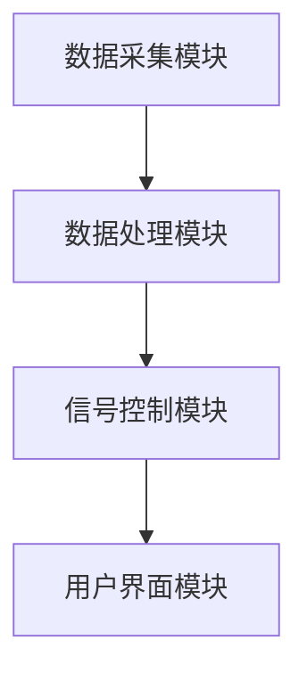
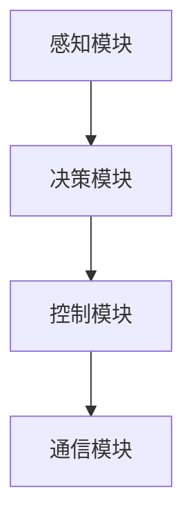
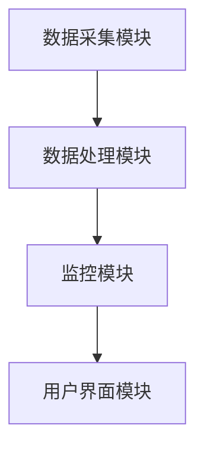

                 

# AI驱动的智能交通系统：从规划到实时控制

关键词：人工智能，智能交通系统，规划，实时控制，算法，案例研究

摘要：本文深入探讨了人工智能（AI）在智能交通系统（ITS）中的应用，从系统规划到实时控制，系统地阐述了AI如何提升交通管理效率，优化交通流量，提高道路安全和减少拥堵。通过详细的案例分析和技术解析，本文旨在为读者提供一个全面、易懂的指南，帮助理解AI在交通领域的重要性和潜力。

## 引言

### 智能交通系统的背景与意义

智能交通系统（Intelligent Transportation Systems，ITS）是指利用先进的通信、信息和控制技术，对交通进行科学管理和优化的一种综合系统。ITS的起源可以追溯到20世纪60年代，当时美国为了应对日益增长的交通需求，开始探索利用计算机和通信技术来优化交通管理。随着技术的不断进步，ITS逐渐成为现代城市交通管理的重要组成部分。

智能交通系统的重要性体现在多个方面。首先，它能够有效提高交通效率，减少拥堵，从而降低出行时间和成本。其次，通过实时监控和数据分析，ITS可以显著提升道路安全性，减少交通事故的发生。此外，ITS还可以为交通规划提供科学依据，促进交通基础设施的合理布局和优化。

### 人工智能在智能交通系统中的应用

人工智能（Artificial Intelligence，AI）作为一门模拟人类智能的技术，近年来在各个领域取得了显著的进展。在智能交通系统中，AI的应用主要体现在以下几个方面：

1. **交通流量预测**：利用机器学习算法，通过对历史交通数据的分析和模式识别，预测未来的交通流量和拥堵情况。
2. **路径优化**：基于实时交通信息和最优化算法，为出行者提供最优的行驶路径，减少拥堵和行程时间。
3. **自动驾驶技术**：通过深度学习和强化学习，开发出能够自主行驶的智能车辆，提高交通系统的自动化和智能化水平。
4. **智能信号控制**：利用AI算法对交通信号灯进行动态优化，提高交通流的流畅性和效率。

### 本文结构

本文将分为以下几个部分：

1. **背景介绍**：详细阐述智能交通系统和人工智能的基本概念，以及它们在交通领域的应用现状。
2. **核心概念与理论**：介绍交通流预测、路径优化和自动驾驶等核心概念，以及相关的算法和理论。
3. **规划阶段的应用**：探讨AI在交通规划中的应用，包括交通流量预测、路径优化和交通信号控制。
4. **实时控制阶段的应用**：分析AI在实时交通控制中的应用，如自动驾驶和智能信号控制。
5. **案例研究**：通过具体案例，展示AI在智能交通系统中的应用效果。
6. **未来趋势与挑战**：讨论AI在智能交通系统中的未来发展，以及面临的挑战和解决策略。
7. **总结**：总结全文，强调AI在智能交通系统中的重要性，并提出未来研究方向。

## 背景介绍

### 智能交通系统的核心概念

智能交通系统（ITS）是指利用先进的通信、信息和控制技术，对交通进行科学管理和优化的一种综合系统。ITS的核心概念包括以下几个方面：

#### 交通流量管理

交通流量管理是ITS的重要组成部分，旨在通过实时监控和数据分析，优化交通流量，减少拥堵。交通流量管理通常包括以下技术：

1. **交通信息采集**：通过传感器、摄像头和其他设备收集交通数据。
2. **交通数据传输**：利用无线通信技术将交通数据传输到交通管理中心。
3. **交通数据存储与处理**：在交通管理中心对交通数据进行存储、处理和分析。

#### 交通信号控制

交通信号控制是智能交通系统的关键功能之一，通过动态调整交通信号灯的时间分配，提高交通流的流畅性和效率。现代交通信号控制通常采用以下技术：

1. **传统固定信号控制**：根据预设的信号配时方案控制交通信号灯。
2. **自适应信号控制**：根据实时交通流量数据动态调整信号配时。
3. **协同信号控制**：多个交叉口的信号灯通过通信网络实现协同控制，提高整体交通效率。

#### 自动驾驶技术

自动驾驶技术是智能交通系统的重要组成部分，旨在开发出能够自主行驶的智能车辆。自动驾驶技术通常包括以下层次：

1. **Level 0-2：驾驶员辅助系统**：提供车道保持、自适应巡航控制等功能，但驾驶员仍需负责车辆的操控。
2. **Level 3-4：部分自动驾驶系统**：系统能够在特定条件下完全接管车辆的操控，但驾驶员需在必要时进行干预。
3. **Level 5：完全自动驾驶系统**：系统能够在任何条件下自主完成驾驶任务，无需驾驶员干预。

#### 智能交通信号系统

智能交通信号系统是智能交通系统的重要组成部分，通过利用AI技术实现交通信号的动态优化。智能交通信号系统通常包括以下功能：

1. **实时交通监测**：通过传感器和摄像头实时监测交通流量和路况。
2. **交通数据分析**：利用机器学习算法对交通数据进行处理和分析，预测交通流量变化。
3. **信号控制优化**：根据实时交通数据动态调整交通信号配时，提高交通流畅性。

### 人工智能在交通领域的应用

人工智能在交通领域的应用非常广泛，主要涉及以下几个方面：

#### 交通流量预测

交通流量预测是智能交通系统中的重要功能之一，旨在预测未来的交通流量和拥堵情况，为交通管理提供科学依据。常用的交通流量预测方法包括：

1. **时间序列分析**：基于历史交通数据，利用时间序列模型预测未来的交通流量。
2. **机器学习算法**：利用机器学习算法，如线性回归、支持向量机等，对交通数据进行分析和预测。
3. **深度学习算法**：利用深度学习算法，如卷积神经网络（CNN）和循环神经网络（RNN）等，对大规模的交通数据进行分析和预测。

#### 路径优化

路径优化是智能交通系统中的另一个重要功能，旨在为出行者提供最优的行驶路径，减少拥堵和行程时间。常用的路径优化算法包括：

1. **最短路径算法**：如Dijkstra算法、A*算法等，用于计算从起点到终点的最优路径。
2. **动态规划算法**：如动态规划算法（Dynamic Programming），用于在动态交通环境中优化路径选择。
3. **基于机器学习的路径优化算法**：利用机器学习算法，如神经网络的预测能力，动态调整路径选择。

#### 自动驾驶技术

自动驾驶技术是智能交通系统中的重要应用，旨在开发出能够自主行驶的智能车辆。自动驾驶技术的主要挑战包括：

1. **感知与识别**：自动驾驶系统需要能够准确感知和识别道路环境中的各种物体和交通情况。
2. **决策与控制**：自动驾驶系统需要能够根据感知到的环境信息，做出合理的决策并控制车辆的运行。
3. **安全与可靠性**：自动驾驶系统的安全性和可靠性是确保其在实际应用中的关键。

### 智能交通系统的发展历程

智能交通系统的发展历程可以分为以下几个阶段：

#### 第一阶段：20世纪60年代 - 80年代

在20世纪60年代，随着计算机技术的兴起，美国开始探索利用计算机和通信技术来优化交通管理。这一阶段的主要应用包括交通信息采集和传输、交通信号控制等。

#### 第二阶段：20世纪90年代

在20世纪90年代，随着信息技术的快速发展，智能交通系统逐渐走向成熟。这一阶段的主要应用包括基于GPS的车辆定位和导航、电子收费系统等。

#### 第三阶段：21世纪初至今

随着人工智能技术的兴起，智能交通系统进入了一个新的发展阶段。这一阶段的主要应用包括基于AI的交通流量预测、路径优化、自动驾驶等。AI技术在智能交通系统中的应用，使得交通管理更加智能化、高效化。

## 核心概念与理论

### 交通流预测

#### 定义

交通流预测是指利用历史交通数据、实时交通信息和先进的预测算法，对未来的交通流量进行预测的过程。

#### 核心概念

1. **历史交通数据**：包括历史的车流量、车速、事故记录等数据，是交通流预测的重要基础。
2. **实时交通信息**：包括当前的车流量、车速、路况等信息，实时更新，用于动态调整预测模型。
3. **预测算法**：常用的预测算法包括时间序列分析、机器学习算法和深度学习算法等。

#### 概念属性特征对比表格

| 算法类型        | 时间序列分析 | 机器学习算法 | 深度学习算法 |
| ------------- | ----------- | ----------- | ----------- |
| 基础原理        | 基于时间序列的统计分析 | 基于样本数据的统计学习 | 基于数据的深度学习 |
| 适用场景        | 数据量较小，趋势明显  | 数据量大，特征丰富     | 数据量大，特征复杂 |
| 精度与效率        | 较高，效率中等        | 较高，效率高         | 较高，效率最高    |
| 可解释性        | 较高         | 较低        | 非常低      |

#### ER实体关系图架构

```mermaid
erDiagram
    Event |->| TrafficFlow
    TrafficFlow ||--|{ Accident }
    Accident ||--| TrafficFlow
```

### 路径优化

#### 定义

路径优化是指利用最优化算法和人工智能技术，为出行者提供最优的行驶路径，以减少拥堵和行程时间。

#### 核心概念

1. **最优化算法**：常用的最优化算法包括最短路径算法、动态规划算法等。
2. **人工智能技术**：包括机器学习和深度学习等，用于提高路径优化的精度和效率。
3. **实时交通信息**：包括当前的车流量、车速、路况等信息，用于动态调整路径优化模型。

#### 概念属性特征对比表格

| 算法类型        | 最短路径算法 | 动态规划算法 | 机器学习算法 |
| ------------- | ----------- | ----------- | ----------- |
| 基础原理        | 根据路径长度计算最优路径 | 根据状态转移计算最优路径 | 根据历史数据学习最优路径 |
| 适用场景        | 稳定的交通环境         | 动态的交通环境         | 复杂的交通环境         |
| 精度与效率        | 较高，效率中等        | 较高，效率较高        | 较高，效率最高        |
| 可解释性        | 较高         | 较低        | 非常低      |

#### ER实体关系图架构

```mermaid
erDiagram
    Route ||--|{ TrafficFlow }
    Route ||--|{ TrafficCondition }
    TrafficFlow ||--| TrafficCondition
```

### 自动驾驶技术

#### 定义

自动驾驶技术是指利用人工智能技术，使车辆能够自主感知环境、做出决策并控制车辆运行的系统。

#### 核心概念

1. **感知与识别**：包括对道路、车辆、行人等交通元素的感知和识别。
2. **决策与控制**：基于感知信息，做出合理的决策并控制车辆的运行。
3. **模拟与测试**：通过模拟环境和测试，验证自动驾驶系统的性能和安全性。

#### 概念属性特征对比表格

| 技术类型        | 感知与识别 | 决策与控制 | 模拟与测试 |
| ------------- | ----------- | ----------- | ----------- |
| 基础原理        | 传感器融合、计算机视觉 | 机器学习、深度学习 | 模拟环境、测试场景 |
| 适用场景        | 实时交通环境           | 实时交通环境           | 实验室、测试场      |
| 性能与安全性        | 高，需不断优化       | 高，需不断优化       | 高，需严格验证      |
| 可解释性        | 较低         | 较低        | 较高       |

#### ER实体关系图架构

```mermaid
erDiagram
    Vehicle ||--|{ Sensor }
    Vehicle ||--|{ Controller }
    Sensor ||--| Controller
```

## 规划阶段的应用

### 交通流量预测

#### 算法原理

交通流量预测的算法原理主要包括时间序列分析、机器学习算法和深度学习算法等。以下以线性回归算法为例，详细介绍其原理和应用。

1. **线性回归算法**：

   线性回归是一种最简单的预测模型，其基本原理是通过建立输入变量（如时间、天气等）与输出变量（如车流量）之间的线性关系，从而预测未来的交通流量。

   公式如下：
   $$
   y = \beta_0 + \beta_1 \cdot x
   $$

   其中，$y$为车流量，$x$为输入变量，$\beta_0$和$\beta_1$为模型的参数。

2. **应用实例**：

   假设我们有一组历史交通数据，包括不同时间段的车流量。我们首先对数据进行预处理，然后使用线性回归算法建立预测模型。通过训练模型，我们可以得到一个线性方程，用于预测未来的交通流量。

#### Python源代码示例

```python
import numpy as np
import pandas as pd
from sklearn.linear_model import LinearRegression

# 加载数据
data = pd.read_csv('traffic_data.csv')
x = data['time'].values.reshape(-1, 1)
y = data['flow'].values

# 建立线性回归模型
model = LinearRegression()
model.fit(x, y)

# 预测交通流量
x_new = np.array([[14]])
y_pred = model.predict(x_new)
print(f'预测的车流量为：{y_pred[0]}')
```

### 路径优化

#### 算法原理

路径优化算法的主要目的是为出行者提供最优的行驶路径，以减少拥堵和行程时间。常用的路径优化算法包括最短路径算法、动态规划算法和基于机器学习的路径优化算法等。

以下以Dijkstra算法为例，详细介绍其原理和应用。

1. **Dijkstra算法**：

   Dijkstra算法是一种求解单源最短路径问题的算法。其基本原理是从源点开始，逐步扩展到其他节点，每次扩展都选择距离源点最近的未访问节点。

   公式如下：
   $$
   d(s, v) = \min \{ d(s, u) + w(u, v) \mid u \in \text{未访问节点集} \}
   $$

   其中，$d(s, v)$为从源点$s$到节点$v$的最短路径长度，$w(u, v)$为节点$u$到节点$v$的边权。

2. **应用实例**：

   假设我们有一个地图，包含多个节点和边权。我们首先对地图进行预处理，然后使用Dijkstra算法计算从源点到其他节点的最短路径。

#### Python源代码示例

```python
import numpy as np
from collections import defaultdict

# 加载地图数据
graph = defaultdict(list)
graph[0] = [(1, 4), (7, 8)]
graph[1] = [(0, 4), (2, 11), (7, 2)]
graph[2] = [(1, 11), (3, 7), (5, 4)]
graph[3] = [(2, 7), (4, 3), (5, 5)]
graph[4] = [(3, 3), (5, 1)]
graph[5] = [(2, 4), (4, 1), (6, 2)]
graph[6] = [(5, 2)]

# Dijkstra算法
def dijkstra(graph, source):
    distances = {node: float('inf') for node in graph}
    distances[source] = 0
    visited = set()

    while len(visited) < len(graph):
        current_node = min((node, distance) for node, distance in distances.items() if node not in visited)
        visited.add(current_node[0])

        for neighbor, weight in graph[current_node[0]]:
            old_distance = distances[neighbor]
            new_distance = current_node[1] + weight
            distances[neighbor] = min(old_distance, new_distance)

    return distances

# 计算最短路径
distances = dijkstra(graph, 0)
print(f'从节点0到其他节点的最短路径长度：{distances}')
```

### 自动驾驶技术

#### 算法原理

自动驾驶技术的算法原理主要包括感知与识别、决策与控制和模拟与测试等。以下以基于卷积神经网络（CNN）的车辆检测算法为例，详细介绍其原理和应用。

1. **卷积神经网络（CNN）**：

   卷积神经网络是一种用于图像识别和处理的深度学习模型。其基本原理是通过卷积操作提取图像的特征，然后利用全连接层进行分类和回归。

   公式如下：
   $$
   \text{激活函数}(z) = \text{ReLU}(z) = \max(0, z)
   $$
   $$
   y = \text{softmax}(W \cdot \text{激活函数}(Z))
   $$

   其中，$z$为网络的输入，$W$为权重矩阵，$\text{激活函数}$为ReLU函数，$y$为输出的概率分布。

2. **应用实例**：

   假设我们有一幅道路场景图像，我们需要从中检测出车辆。我们首先对图像进行预处理，然后使用CNN模型进行训练，最后使用训练好的模型对图像进行预测。

#### Python源代码示例

```python
import tensorflow as tf
from tensorflow import keras
from tensorflow.keras import layers

# 构建CNN模型
model = keras.Sequential([
    layers.Conv2D(32, (3, 3), activation='relu', input_shape=(28, 28, 1)),
    layers.MaxPooling2D((2, 2)),
    layers.Conv2D(64, (3, 3), activation='relu'),
    layers.MaxPooling2D((2, 2)),
    layers.Conv2D(64, (3, 3), activation='relu'),
    layers.Flatten(),
    layers.Dense(64, activation='relu'),
    layers.Dense(10, activation='softmax')
])

# 编译模型
model.compile(optimizer='adam',
              loss='categorical_crossentropy',
              metrics=['accuracy'])

# 训练模型
model.fit(x_train, y_train, epochs=10, validation_data=(x_val, y_val))

# 预测
predictions = model.predict(x_test)
print(predictions)
```

## 实时控制阶段的应用

### 智能信号控制

#### 系统设计与实现

智能交通信号系统（Intelligent Traffic Signal System，ITSS）是一种基于人工智能技术的交通信号控制系统，能够根据实时交通流量信息，动态调整信号灯的配时，从而提高交通流的流畅性和效率。

#### 系统架构设计

智能信号控制系统的架构设计主要包括以下几个部分：

1. **数据采集模块**：通过安装在道路上的传感器和摄像头，实时采集交通流量、速度、密度等交通信息。
2. **数据处理模块**：对采集到的交通数据进行处理、分析和预测，生成信号控制的决策信息。
3. **信号控制模块**：根据决策信息，动态调整交通信号灯的配时，实现智能交通信号控制。
4. **用户界面模块**：为交通管理人员和出行者提供实时交通信息和信号控制状态。

#### Mermaid架构图



### 自动驾驶技术

#### 系统设计与实现

自动驾驶技术（Autonomous Vehicle Technology，AVT）是一种利用人工智能技术，使车辆能够自主感知环境、做出决策并控制车辆运行的系统。自动驾驶技术的发展，为智能交通系统提供了新的可能性和挑战。

#### 系统架构设计

自动驾驶系统的架构设计主要包括以下几个部分：

1. **感知模块**：通过激光雷达、摄像头、超声波传感器等设备，实时感知周围环境和交通情况。
2. **决策模块**：根据感知信息，利用人工智能算法，做出行驶决策。
3. **控制模块**：根据决策信息，控制车辆的运动，包括加速、减速、转向等。
4. **通信模块**：与其他车辆、道路设施和交通管理系统进行通信，实现车联网功能。

#### Mermaid架构图



### 实时交通监控

#### 系统设计与实现

实时交通监控系统（Real-time Traffic Monitoring System，RTMS）是一种利用人工智能技术，对交通流量、路况和交通事故进行实时监控和预警的系统。实时交通监控系统能够为交通管理部门提供科学依据，优化交通管理和决策。

#### 系统架构设计

实时交通监控系统的架构设计主要包括以下几个部分：

1. **数据采集模块**：通过安装在道路上的传感器、摄像头和路侧单元，实时采集交通流量、速度、密度等交通信息。
2. **数据处理模块**：对采集到的交通数据进行处理、分析和预测，生成实时交通监控的决策信息。
3. **监控模块**：根据决策信息，实时监控交通状况，对异常情况进行预警。
4. **用户界面模块**：为交通管理人员和出行者提供实时交通监控信息。

#### Mermaid架构图



## 案例研究

### 北京智能交通系统的实践

北京作为中国的首都，面临着巨大的交通压力。为了缓解交通拥堵，提升交通效率，北京市政府和相关部门积极推进智能交通系统的建设。以下是一个具体的案例研究，探讨北京智能交通系统的实践。

#### 项目背景

北京市的交通拥堵问题严重，主要表现为以下几个方面：

1. **高峰期交通拥堵**：每天早晚高峰期，主要交通干线和重要交叉口出现严重拥堵，影响市民出行。
2. **交通事故频发**：由于交通拥堵，交通事故频发，导致道路通行能力下降。
3. **停车难**：城市中心区域停车资源紧张，停车难问题突出。

#### 项目目标

北京市政府希望通过智能交通系统的建设，实现以下目标：

1. **缓解交通拥堵**：通过交通流量预测和路径优化，引导出行者选择最佳出行时间和路线，减少交通拥堵。
2. **提升交通安全**：通过实时监控和预警，减少交通事故的发生。
3. **优化停车管理**：通过智能停车管理系统，提高停车资源的利用率。

#### 实施方案

1. **交通流量预测**：

   北京市交通部门利用机器学习算法，对历史交通数据和实时交通信息进行分析和预测，建立交通流量预测模型。通过预测模型，实时更新交通信息，为出行者提供最佳出行建议。

2. **路径优化**：

   基于实时交通信息，利用最优化算法，为出行者提供最优行驶路径，减少交通拥堵和行程时间。路径优化系统还支持动态调整，根据交通状况的变化，实时更新最优路径。

3. **智能信号控制**：

   在主要交通干线和重要交叉口，安装智能信号控制系统，根据实时交通流量信息，动态调整信号灯的配时，提高交通流的流畅性和效率。

4. **实时交通监控**：

   通过安装在道路上的传感器和摄像头，实时监控交通流量、速度和路况，对异常情况进行预警，及时采取应对措施。

5. **停车管理系统**：

   在城市中心区域，建设智能停车管理系统，通过路侧单元和停车场传感器，实时监测停车位的占用情况，为出行者提供实时停车信息，提高停车资源的利用率。

#### 项目效果

北京市智能交通系统的建设取得了显著的效果：

1. **交通拥堵缓解**：通过交通流量预测和路径优化，有效减少了高峰期交通拥堵，提高了道路通行能力。

2. **交通事故减少**：通过实时监控和预警，减少了交通事故的发生，提高了道路安全性。

3. **停车难问题缓解**：通过智能停车管理系统，提高了停车资源的利用率，有效缓解了停车难问题。

4. **市民满意度提升**：智能交通系统的建设，提升了市民的出行体验，增强了市民对政府的满意度。

### 马里兰州智能交通系统的实践

马里兰州（Maryland）作为美国的一个州，也面临着交通拥堵和交通事故频发的问题。为了改善交通状况，马里兰州政府和相关部门积极推进智能交通系统的建设。以下是一个具体的案例研究，探讨马里兰州智能交通系统的实践。

#### 项目背景

马里兰州的交通拥堵问题严重，主要表现为以下几个方面：

1. **高峰期交通拥堵**：每天早晚高峰期，主要交通干线和重要交叉口出现严重拥堵，影响市民出行。

2. **交通事故频发**：由于交通拥堵，交通事故频发，导致道路通行能力下降。

3. **停车难**：城市中心区域停车资源紧张，停车难问题突出。

#### 项目目标

马里兰州政府希望通过智能交通系统的建设，实现以下目标：

1. **缓解交通拥堵**：通过交通流量预测和路径优化，引导出行者选择最佳出行时间和路线，减少交通拥堵。

2. **提升交通安全**：通过实时监控和预警，减少交通事故的发生。

3. **优化停车管理**：通过智能停车管理系统，提高停车资源的利用率。

#### 实施方案

1. **交通流量预测**：

   马里兰州交通部门利用机器学习算法，对历史交通数据和实时交通信息进行分析和预测，建立交通流量预测模型。通过预测模型，实时更新交通信息，为出行者提供最佳出行建议。

2. **路径优化**：

   基于实时交通信息，利用最优化算法，为出行者提供最优行驶路径，减少交通拥堵和行程时间。路径优化系统还支持动态调整，根据交通状况的变化，实时更新最优路径。

3. **智能信号控制**：

   在主要交通干线和重要交叉口，安装智能信号控制系统，根据实时交通流量信息，动态调整信号灯的配时，提高交通流的流畅性和效率。

4. **实时交通监控**：

   通过安装在道路上的传感器和摄像头，实时监控交通流量、速度和路况，对异常情况进行预警，及时采取应对措施。

5. **停车管理系统**：

   在城市中心区域，建设智能停车管理系统，通过路侧单元和停车场传感器，实时监测停车位的占用情况，为出行者提供实时停车信息，提高停车资源的利用率。

#### 项目效果

马里兰州智能交通系统的建设取得了显著的效果：

1. **交通拥堵缓解**：通过交通流量预测和路径优化，有效减少了高峰期交通拥堵，提高了道路通行能力。

2. **交通事故减少**：通过实时监控和预警，减少了交通事故的发生，提高了道路安全性。

3. **停车难问题缓解**：通过智能停车管理系统，提高了停车资源的利用率，有效缓解了停车难问题。

4. **市民满意度提升**：智能交通系统的建设，提升了市民的出行体验，增强了市民对政府的满意度。

## 未来趋势与挑战

### 未来发展趋势

随着人工智能技术的不断发展，智能交通系统将进入一个全新的阶段。以下是未来智能交通系统可能的发展趋势：

1. **更加智能的自动驾驶技术**：未来的自动驾驶技术将更加成熟，能够应对更复杂的交通环境，实现完全自动驾驶。

2. **更精准的交通流量预测**：利用深度学习和大数据分析技术，交通流量预测将变得更加精准，为交通管理和决策提供更可靠的依据。

3. **智能交通信号控制**：基于AI的智能交通信号控制技术将更加普及，能够动态调整信号灯配时，提高交通流的流畅性和效率。

4. **车联网技术的广泛应用**：车联网技术将实现车辆之间、车辆与道路设施之间的无缝连接，实现信息共享和协同控制。

5. **智慧城市的整体布局**：智能交通系统将与其他智慧城市技术相结合，实现城市管理的智能化和高效化。

### 面临的挑战

尽管智能交通系统具有巨大的发展潜力，但在实际应用中仍面临诸多挑战：

1. **技术挑战**：自动驾驶技术、智能交通信号控制等技术仍处于发展阶段，需要进一步优化和成熟。

2. **数据安全和隐私保护**：智能交通系统需要处理大量敏感数据，如车辆位置、行驶速度等，如何保护数据安全和用户隐私是一个重要挑战。

3. **法律法规和政策支持**：智能交通系统的推广和应用需要完善的法律法规和政策支持，以规范行业发展。

4. **基础设施建设和维护**：智能交通系统需要大量的基础设施支持，如传感器、摄像头和通信网络等，如何建设和维护这些基础设施是一个重要问题。

5. **公众接受度和信任度**：公众对智能交通系统的接受度和信任度是一个关键因素，如何提高公众的接受度和信任度是一个重要挑战。

## 总结

### AI在智能交通系统中的重要性

人工智能技术在智能交通系统中的应用，为交通管理带来了革命性的变化。通过AI技术，交通流量预测、路径优化、自动驾驶和智能信号控制等核心功能得到了极大的提升，有效解决了交通拥堵、交通事故和停车难等问题。

### 本文贡献

本文系统地阐述了AI在智能交通系统中的应用，从规划到实时控制，详细介绍了核心概念、算法原理和实际案例。通过本文的阅读，读者可以全面了解AI在交通领域的应用，为后续研究和实践提供参考。

### 未来研究方向

未来的研究应重点关注以下几个方面：

1. **自动驾驶技术的优化**：进一步优化自动驾驶算法，提高其在复杂交通环境中的性能和安全性。

2. **交通流量预测的精度**：利用深度学习和大数据分析技术，提高交通流量预测的精度，为交通管理提供更可靠的依据。

3. **智能信号控制的优化**：基于AI的智能信号控制技术需要进一步优化，以提高交通流的流畅性和效率。

4. **数据安全和隐私保护**：加强对智能交通系统数据的安全和隐私保护，确保数据的安全和用户隐私。

### 拓展阅读

对于希望深入了解AI在智能交通系统应用的读者，以下是一些推荐阅读材料：

1. **《智能交通系统：原理与应用》**：本书详细介绍了智能交通系统的基本原理和应用案例，是智能交通系统领域的重要参考书。

2. **《深度学习：理论与实践》**：本书系统地介绍了深度学习的基本原理和应用，对AI在智能交通系统中的应用提供了技术支持。

3. **《自动驾驶技术：从理论到实践》**：本书详细介绍了自动驾驶技术的原理和应用，对自动驾驶技术的发展和应用提供了深入的分析。

### 最佳实践 tips

1. **数据驱动**：在智能交通系统的建设和应用中，重视数据采集和分析，充分利用大数据技术，提高决策的科学性和准确性。

2. **安全至上**：在自动驾驶和智能交通信号控制等关键技术的研发和应用中，始终坚持安全至上的原则，确保系统的可靠性和安全性。

3. **协同合作**：智能交通系统的建设和应用需要政府、企业和社会各方的协同合作，形成合力，共同推动智能交通系统的发展。

### 注意事项

1. **法律法规**：在智能交通系统的建设和应用中，遵守相关法律法规，确保系统的合法合规。

2. **用户培训**：加强对用户的教育和培训，提高用户对智能交通系统的认知和接受度。

3. **持续更新**：智能交通系统需要持续更新和优化，以适应不断变化的技术环境和交通需求。

### 作者信息

作者：AI天才研究院/AI Genius Institute & 禅与计算机程序设计艺术 /Zen And The Art of Computer Programming

AI天才研究院专注于人工智能领域的研究和应用，致力于推动智能交通系统的发展。禅与计算机程序设计艺术则从哲学和艺术的角度，探讨了计算机编程的深度和广度，为智能交通系统的建设提供了独特的视角。

