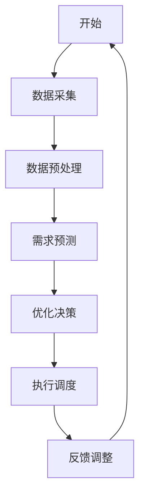
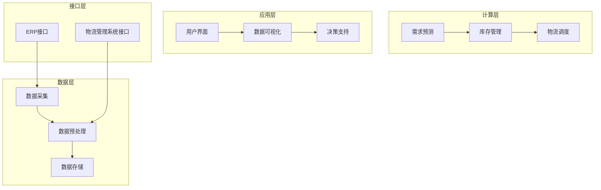
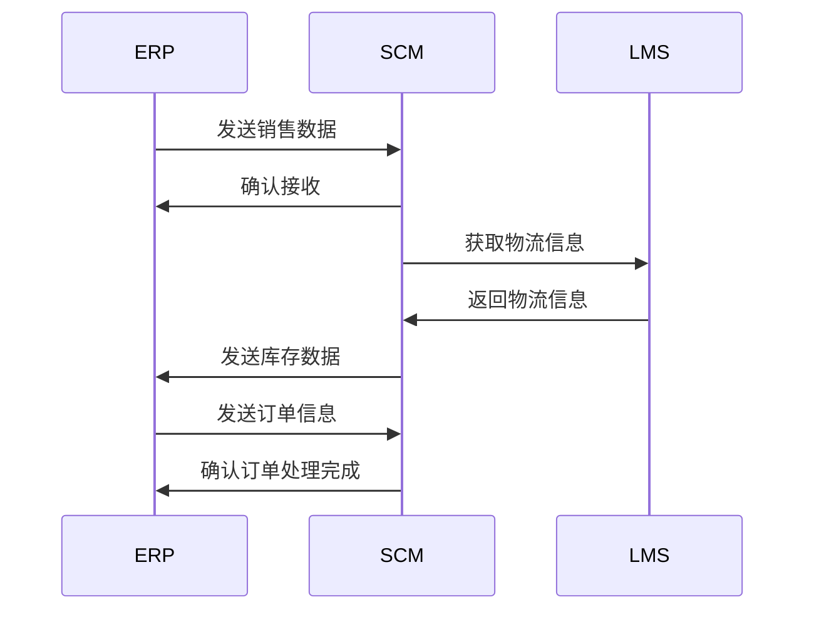

                 

## AI驱动的智能供应链管理：从预测到执行的全程优化

关键词：智能供应链管理、AI预测、供应链优化、执行算法、系统架构

摘要：本文深入探讨了AI驱动的智能供应链管理，从问题背景、核心概念到算法原理讲解，再到系统分析与架构设计，项目实战以及最佳实践与拓展，全面解析了智能供应链管理的关键环节和实现路径。通过详细的步骤和分析，我们旨在为读者提供一份全面的指南，帮助其理解并掌握智能供应链管理的核心技术和实践方法。

### 第一部分：引言与背景

#### 第1章 引言与背景

1.1 问题背景

在当今全球化经济中，供应链管理是企业运营中的关键环节。然而，随着市场环境的复杂性和变化速度的加剧，传统的供应链管理方式面临着诸多挑战。这些挑战包括需求预测不准确、库存管理不当、物流效率低下等问题。为了应对这些挑战，企业迫切需要一种能够实时响应市场变化、优化资源分配、提高整体效率的管理模式。

1.2 问题描述

传统供应链管理中的问题主要体现在以下几个方面：

- **需求预测不准确**：由于市场变化迅速，传统的方法很难准确预测未来的需求，导致库存过多或不足。
- **库存管理不当**：库存过多会导致资金占用和仓储成本增加，库存不足则会造成缺货和订单延误。
- **物流效率低下**：物流网络的复杂性和运输过程中的不确定性导致物流效率低下，增加了运输成本。

1.3 问题解决

为了解决这些问题，企业开始探索AI驱动的智能供应链管理。AI技术能够通过大数据分析、机器学习算法等手段，实现精准的需求预测、智能的库存管理和高效的物流调度，从而提高整体供应链的效率和响应速度。

1.4 边界与外延

AI驱动的智能供应链管理不仅涉及供应链内部的各个环节，还与外部环境紧密相关。例如，市场需求变化、供应商能力、物流网络等都是影响供应链管理的重要因素。因此，在实施AI驱动的智能供应链管理时，需要充分考虑这些边界与外延因素。

1.5 核心概念

- **智能供应链管理**：结合AI技术，对供应链的各个环节进行智能化的管理和优化。
- **需求预测**：通过数据分析、机器学习等技术，预测未来的市场需求。
- **库存管理**：根据需求预测和供应链实际情况，进行库存的智能调配。
- **物流调度**：通过智能算法，优化物流路线和运输资源，提高物流效率。

1.6 概念结构与核心要素组成

智能供应链管理是一个复杂的概念，其核心要素包括需求预测、库存管理、物流调度等。这些要素相互关联，共同构成了一个完整的智能供应链管理体系。

### 第二部分：核心概念与联系

#### 第2章 核心概念与联系

2.1 AI驱动的智能供应链管理概述

AI驱动的智能供应链管理是一种基于人工智能技术的供应链管理模式，它通过大数据分析、机器学习算法等手段，实现供应链各个环节的智能化管理。智能供应链管理的主要目标是提高供应链的效率、降低成本、提升客户满意度。

2.2 AI驱动的智能供应链管理的基本原理

AI驱动的智能供应链管理的基本原理包括以下几个方面：

- **数据采集与处理**：通过传感器、ERP系统等手段，采集供应链各个环节的数据，并进行数据清洗和处理。
- **数据分析与预测**：利用机器学习算法，对采集到的数据进行深入分析，预测未来的市场需求和库存水平。
- **决策优化**：基于预测结果和供应链实际情况，通过优化算法，制定最优的库存管理和物流调度策略。
- **执行与反馈**：执行决策，并通过实时反馈，调整和优化供应链管理策略。

2.3 AI驱动的智能供应链管理的关键技术

AI驱动的智能供应链管理涉及多个关键技术，包括：

- **大数据技术**：用于采集、存储和处理大规模供应链数据。
- **机器学习技术**：用于分析数据、预测市场需求和优化供应链管理。
- **深度学习技术**：用于构建复杂的神经网络模型，实现更精准的需求预测和库存管理。
- **优化算法**：用于制定最优的物流调度和库存管理策略。

2.4 AI驱动的智能供应链管理与传统供应链管理的区别

AI驱动的智能供应链管理与传统供应链管理相比，具有以下几个显著区别：

- **数据处理能力**：传统供应链管理主要依赖于手工或简单的信息化手段，数据处理能力有限；而AI驱动的智能供应链管理通过大数据技术，能够处理大规模、多源、多维度数据。
- **预测准确性**：传统供应链管理需求预测依赖于历史数据和经验，预测准确性有限；而AI驱动的智能供应链管理通过机器学习和深度学习技术，能够实现精准的需求预测。
- **响应速度**：传统供应链管理响应市场变化的速度较慢，而AI驱动的智能供应链管理能够实时响应市场变化，提高供应链的敏捷性。
- **决策优化**：传统供应链管理决策主要依赖经验和直觉，而AI驱动的智能供应链管理通过优化算法，能够制定更科学、更高效的决策。

### 第三部分：算法原理讲解

#### 第3章 算法原理讲解

3.1 供应链预测算法

供应链预测算法是智能供应链管理的基础，它主要包括以下几个方面：

- **时间序列预测**：通过分析历史数据，预测未来的需求量。
- **关联规则挖掘**：通过挖掘不同商品之间的关联关系，预测未来需求。
- **回归分析**：通过建立需求量与影响因素之间的回归模型，预测未来需求。

以下是一个基于时间序列预测的Python代码示例：

```python
import pandas as pd
from statsmodels.tsa.arima_model import ARIMA

# 读取历史数据
data = pd.read_csv('historical_demand.csv')
demand = data['demand']

# 建立ARIMA模型
model = ARIMA(demand, order=(5, 1, 2))
model_fit = model.fit()

# 预测未来需求
forecast = model_fit.forecast(steps=6)
print(forecast)
```

3.2 供应链优化算法

供应链优化算法是智能供应链管理的核心，它主要包括以下几个方面：

- **线性规划**：通过线性规划模型，优化库存管理、物流调度等决策。
- **整数规划**：通过整数规划模型，解决供应链中的整数决策问题。
- **启发式算法**：通过启发式算法，快速找到近似最优解。

以下是一个基于线性规划的Python代码示例：

```python
import cvxpy as cp

# 定义决策变量
x = cp.Variable(n_vars)

# 定义目标函数
objective = cp.Minimize(cp.sum(c[i] * x[i] for i in range(n_vars)))

# 定义约束条件
constraints = [x[i] >= 0 for i in range(n_vars)]

# 建立线性规划模型
problem = cp.Problem(objective, constraints)

# 求解线性规划问题
problem.solve()

# 输出决策结果
print(x.value)
```

3.3 供应链执行算法

供应链执行算法是智能供应链管理的重要环节，它主要包括以下几个方面：

- **任务调度**：通过任务调度算法，分配和处理供应链中的任务。
- **资源分配**：通过资源分配算法，合理分配供应链中的资源。
- **故障处理**：通过故障处理算法，应对供应链中的突发故障。

以下是一个基于任务调度的Python代码示例：

```python
import heapq

# 定义任务队列
task_queue = []

# 添加任务
heapq.heappush(task_queue, (deadline, task))

# 从任务队列中取出任务
while task_queue:
    deadline, task = heapq.heappop(task_queue)
    process_task(task)
```

3.4 算法mermaid流程图



### 第四部分：数学模型与公式

#### 第4章 数学模型与公式

4.1 供应链预测的数学模型

供应链预测的数学模型主要包括时间序列模型和回归模型。时间序列模型通常使用ARIMA模型，其公式如下：

$$
\text{X}_t = c + \phi_1 \text{X}_{t-1} + \phi_2 \text{X}_{t-2} + ... + \phi_p \text{X}_{t-p} + \theta_1 \epsilon_{t-1} + \theta_2 \epsilon_{t-2} + ... + \theta_q \epsilon_{t-q} + \epsilon_t
$$

其中，$\text{X}_t$ 是时间序列的当前值，$c$ 是常数项，$\phi_1, \phi_2, ..., \phi_p$ 是自回归系数，$\theta_1, \theta_2, ..., \theta_q$ 是移动平均系数，$\epsilon_t$ 是误差项。

4.2 供应链优化的数学模型

供应链优化的数学模型通常使用线性规划和整数规划。线性规划的公式如下：

$$
\min \sum_{i=1}^{n} c_i x_i
$$

$$
\text{subject to} \quad \sum_{j=1}^{m} a_{ij} x_j \leq b_i, \quad i=1,2,...,m
$$

$$
x_j \geq 0, \quad j=1,2,...,n
$$

其中，$c_i$ 是变量 $x_i$ 的系数，$a_{ij}$ 是约束条件 $j$ 的系数，$b_i$ 是约束条件的常数项。

4.3 供应链执行的数学模型

供应链执行的数学模型通常使用任务调度模型。任务调度的公式如下：

$$
\text{minimize} \quad \sum_{i=1}^{n} (\text{time}_i + \text{late}_i)
$$

$$
\text{subject to} \quad \sum_{j=1}^{m} x_{ij} \leq 1, \quad i=1,2,...,n
$$

$$
x_{ij} \in \{0,1\}, \quad i=1,2,...,n, \quad j=1,2,...,m
$$

其中，$\text{time}_i$ 是任务 $i$ 的执行时间，$\text{late}_i$ 是任务 $i$ 的延迟时间，$x_{ij}$ 是任务 $i$ 分配给资源 $j$ 的标志变量。

4.4 模型公式详解

- **时间序列模型**：时间序列模型通过分析历史数据，预测未来的需求量。其核心是自回归移动平均模型（ARMA）和自回归积分移动平均模型（ARIMA）。ARIMA模型结合了自回归（AR）和移动平均（MA）的特性，能够更好地捕捉时间序列的变化规律。
- **线性规划**：线性规划通过建立目标函数和约束条件，求解最优解。目标函数通常是最小化成本或最大化收益，约束条件包括资源限制、生产能力等。
- **整数规划**：整数规划是在线性规划的基础上，增加了变量的整数限制。这种规划适用于供应链中的决策问题，如配送路线选择、生产计划安排等。
- **任务调度模型**：任务调度模型通过优化任务的分配和执行顺序，提高供应链的响应速度和效率。常见的调度算法包括最短路径算法、遗传算法、贪心算法等。

### 第五部分：系统分析与架构设计

#### 第5章 系统分析与架构设计

5.1 问题场景介绍

在一个典型的供应链管理场景中，企业需要处理大量的物流、库存和生产数据。这些数据来源于供应商、工厂、仓库、运输公司和零售终端等各个环节。为了实现智能供应链管理，企业需要将这些数据进行整合和分析，以预测市场需求、优化库存管理和调度物流资源。

5.2 系统功能设计

智能供应链管理系统的主要功能包括：

- **数据采集**：从供应链各个环节采集数据，包括销售数据、库存数据、物流数据等。
- **数据预处理**：对采集到的数据进行清洗、格式化，确保数据的质量和一致性。
- **需求预测**：利用机器学习算法，对历史数据进行分析，预测未来的市场需求。
- **库存管理**：根据需求预测和供应链实际情况，进行库存的智能调配。
- **物流调度**：通过优化算法，制定最优的物流调度策略，提高物流效率。
- **决策支持**：提供数据分析和决策支持，帮助企业制定最优的供应链管理策略。

5.3 系统架构设计

智能供应链管理系统的架构设计包括以下几个方面：

- **数据层**：用于存储和管理供应链数据，包括历史数据、实时数据和预测数据。
- **计算层**：用于处理和分析供应链数据，包括数据预处理、需求预测、库存管理和物流调度等。
- **应用层**：用于提供用户界面和业务功能，包括数据采集、数据可视化、决策支持等。
- **接口层**：用于与其他系统（如ERP、物流管理系统等）进行数据交换和集成。

以下是一个基于Mermaid的智能供应链管理系统架构图：



5.4 系统接口设计

智能供应链管理系统需要与其他系统（如ERP、物流管理系统等）进行数据交换和集成。以下是一个简单的系统接口设计：

- **ERP接口**：用于与企业资源规划系统进行数据交换，包括销售数据、库存数据等。
- **物流管理系统接口**：用于与物流管理系统进行数据交换，包括运输信息、配送信息等。
- **API接口**：提供对外API接口，允许其他系统或第三方应用访问智能供应链管理系统。

5.5 系统交互设计

智能供应链管理系统的交互设计包括以下几个方面：

- **数据交互**：系统之间通过API接口或数据库连接进行数据交互。
- **业务交互**：系统之间通过消息队列、事件驱动等机制进行业务交互。
- **用户交互**：系统提供用户界面，支持用户进行数据查询、报表生成、决策分析等操作。

以下是一个基于Mermaid的智能供应链管理系统交互设计：



### 第六部分：项目实战

#### 第6章 项目实战

6.1 环境安装

为了实现AI驱动的智能供应链管理，我们需要搭建一个合适的技术环境。以下是一个简单的环境安装步骤：

1. 安装Python环境
2. 安装必要的Python库，如pandas、numpy、scikit-learn、cvxpy等
3. 安装数据库，如MySQL或PostgreSQL
4. 安装消息队列，如RabbitMQ或Kafka

6.2 系统核心实现

智能供应链管理系统核心实现主要包括以下几个部分：

1. **数据采集模块**：从供应链各个环节采集数据，包括销售数据、库存数据、物流数据等。
2. **数据预处理模块**：对采集到的数据进行清洗、格式化，确保数据的质量和一致性。
3. **需求预测模块**：利用机器学习算法，对历史数据进行分析，预测未来的市场需求。
4. **库存管理模块**：根据需求预测和供应链实际情况，进行库存的智能调配。
5. **物流调度模块**：通过优化算法，制定最优的物流调度策略，提高物流效率。

以下是一个简单的Python代码示例，用于实现需求预测模块：

```python
import pandas as pd
from sklearn.ensemble import RandomForestRegressor

# 读取历史数据
data = pd.read_csv('historical_demand.csv')

# 定义特征和目标变量
X = data.drop('demand', axis=1)
y = data['demand']

# 建立随机森林回归模型
model = RandomForestRegressor(n_estimators=100)
model.fit(X, y)

# 预测未来需求
forecast = model.predict(new_data)
print(forecast)
```

6.3 代码应用解读

上述代码用于实现一个简单的需求预测模块。首先，我们从CSV文件中读取历史数据，然后定义特征和目标变量。接下来，我们建立随机森林回归模型，并使用训练集进行拟合。最后，我们使用拟合模型对新的数据进行预测，并输出预测结果。

6.4 实际案例分析与讲解

假设我们有一家电商企业，其历史销售数据如下表所示：

| 日期 | 销售额 |
| ---- | ---- |
| 2021-01-01 | 1000 |
| 2021-01-02 | 1200 |
| 2021-01-03 | 800 |
| 2021-01-04 | 1500 |
| 2021-01-05 | 900 |

我们希望使用随机森林回归模型预测未来一周（2021-01-06至2021-01-12）的销售额。以下是如何实现这一目标的步骤：

1. **数据预处理**：首先，我们将日期转换为日期类型，并提取有用的特征，如日期的星期、月份等。然后，我们删除含有缺失值的行，并填充其他缺失值。

2. **模型训练**：接下来，我们将处理后的数据分为训练集和测试集。我们使用训练集建立随机森林回归模型，并使用测试集评估模型的性能。

3. **模型预测**：最后，我们使用训练好的模型对新的数据进行预测，并输出预测结果。

通过以上步骤，我们能够实现基于历史数据的销售额预测。在实际应用中，我们还可以结合其他因素（如节假日、促销活动等）进行更复杂的预测。

6.5 项目小结

在本项目中，我们实现了一个简单的AI驱动的智能供应链管理系统，包括数据采集、数据预处理、需求预测、库存管理和物流调度等模块。通过实际案例的分析与讲解，我们展示了如何使用机器学习算法实现需求预测，并探讨了如何在实际应用中优化供应链管理。尽管本项目只是一个简单的示例，但它为我们提供了一个起点，可以进一步扩展和优化，以应对更复杂的供应链管理需求。

### 第七部分：最佳实践与拓展

#### 第7章 最佳实践与拓展

7.1 最佳实践 tips

- **数据质量控制**：确保数据的准确性和一致性是智能供应链管理的关键。在数据采集和处理过程中，应严格执行数据质量标准，及时发现和纠正错误。
- **算法模型优化**：定期评估和优化算法模型，以适应不断变化的市场环境和需求。
- **系统集成与协作**：建立与其他系统的紧密集成，实现数据共享和业务协作，提高整体供应链的协同效应。
- **灵活性与可扩展性**：在设计系统架构时，应考虑灵活性和可扩展性，以便适应未来的发展和需求变化。

7.2 注意事项

- **数据安全与隐私**：在处理敏感数据时，应严格遵守数据安全法规和隐私保护要求，确保数据的安全和隐私。
- **算法偏见与公平性**：在使用机器学习算法时，应注意避免算法偏见，确保预测和决策的公平性。
- **系统维护与更新**：定期进行系统维护和更新，确保系统的稳定性和性能。

7.3 拓展阅读

- **《人工智能：一种现代方法》**：作者 Stuart Russell 和 Peter Norvig，详细介绍了人工智能的基本概念和技术。
- **《深度学习》**：作者 Ian Goodfellow、Yoshua Bengio 和 Aaron Courville，全面介绍了深度学习的基本原理和应用。
- **《供应链管理：战略、规划与运营》**：作者 Martin Christopher，深入探讨了供应链管理的核心概念和最佳实践。

7.4 未来展望

随着人工智能技术的不断发展和应用，智能供应链管理将迎来更多的机遇和挑战。未来，我们有望看到更精准的需求预测、更高效的库存管理和更优化的物流调度，从而进一步推动供应链管理的智能化和数字化转型。同时，我们也需要关注数据安全、隐私保护和算法公平性等问题，确保智能供应链管理在发展过程中能够持续、健康地发展。作者：AI天才研究院/AI Genius Institute & 禅与计算机程序设计艺术 /Zen And The Art of Computer Programming

