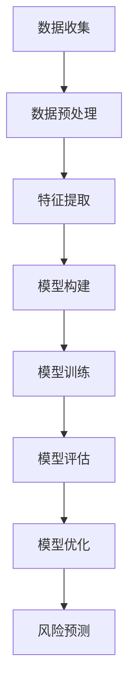

                 

### 引言

#### 当前全球供应链面临的挑战

在全球化经济背景下，供应链已成为企业竞争力的重要组成部分。然而，近年来，全球供应链面临诸多挑战。首先，自然灾害、政治动荡和疫情等不可控因素频繁发生，导致供应链中断和延误。例如，2011年的日本地震和海啸对全球汽车产业供应链造成了严重影响，而2020年的新冠疫情则导致全球供应链陷入前所未有的混乱。

其次，全球化进程中的贸易壁垒和地缘政治风险也对供应链稳定性构成了威胁。例如，中美贸易战导致关税增加，企业不得不重新考虑供应链布局。此外，物流成本上涨和运输瓶颈也加剧了供应链的压力。

面对这些挑战，企业必须具备强大的供应链韧性和风险识别能力，以确保供应链的连续性和稳定性。在这个背景下，智能供应链应运而生，而AI技术的应用为供应链风险评估提供了新的解决方案。

#### 智能供应链与AI技术的关系

智能供应链是指利用现代信息技术和智能算法，对供应链各个环节进行实时监控、分析和优化，以提高供应链的透明度、效率和韧性。而AI技术，作为智能供应链的核心驱动力，通过机器学习和深度学习算法，对大量数据进行处理和分析，从而实现供应链的智能化和自动化。

AI技术在供应链中的应用不仅限于风险评估，还包括需求预测、库存管理、物流优化等方面。然而，本文的重点是探讨AI驱动的智能供应链风险评估，因为风险评估是保障供应链韧性的关键环节。

#### 文章关键词

- 全球供应链
- 智能供应链
- AI技术
- 风险评估
- 供应链韧性

#### 文章摘要

本文首先介绍了当前全球供应链面临的挑战，探讨了智能供应链与AI技术的关系。随后，详细阐述了AI技术在供应链风险评估中的应用原理、实践案例、系统设计与实现，以及算法实现与优化。最后，总结了智能供应链风险评估的最佳实践，并对未来进行了展望。通过本文的探讨，旨在为企业和供应链管理提供有价值的参考，以增强供应链韧性。

## 第1章 引言

### 1.1 问题背景

在当今全球化经济的背景下，供应链已成为企业运营的核心环节，直接影响着企业的生产效率和市场竞争力。然而，随着全球经济环境的不断变化，供应链面临着前所未有的挑战。这些挑战主要包括以下几个方面：

首先，自然灾害的频发给供应链带来了巨大的不确定性。例如，2011年的日本地震和海啸、2015年的尼泊尔地震等自然灾害，不仅对当地经济造成了严重损失，还导致了全球供应链的中断和延误。此外，极端天气事件如飓风、干旱等也在不断增多，给供应链带来了额外的风险。

其次，政治动荡和地缘政治风险对供应链稳定性构成了严重威胁。近年来，全球范围内的政治动荡和地缘政治紧张局势不断升级，如中美贸易战、英国脱欧等事件，使得贸易壁垒和关税政策频繁变动，企业不得不重新评估和调整供应链布局，以应对政策风险。

第三，物流成本上涨和运输瓶颈也是供应链面临的重大挑战。随着全球经济的快速发展，物流需求不断增长，但物流基础设施和运输能力并未同步提升，导致物流成本持续上涨。此外，运输瓶颈问题也日益突出，港口拥堵、航空运输限制等问题影响了货物的及时运输和交付。

面对这些挑战，企业需要具备强大的供应链韧性和风险识别能力，以确保供应链的连续性和稳定性。在这种背景下，智能供应链的概念应运而生，而AI技术的应用则为供应链风险评估提供了新的解决方案。

### 1.2 智能供应链与AI技术的关系

智能供应链是指利用现代信息技术和智能算法，对供应链各个环节进行实时监控、分析和优化，以提高供应链的透明度、效率和韧性。AI技术作为智能供应链的核心驱动力，通过机器学习和深度学习算法，对大量数据进行处理和分析，从而实现供应链的智能化和自动化。

在智能供应链中，AI技术的应用涵盖了多个方面，包括需求预测、库存管理、物流优化、供应链可视化等。然而，本文重点关注的是AI技术在供应链风险评估中的应用。供应链风险评估是保障供应链韧性的关键环节，通过AI技术，企业可以实时监测和预测潜在风险，从而采取预防措施，降低供应链中断和延误的风险。

具体来说，AI技术通过以下几种方式在供应链风险评估中发挥作用：

1. **数据挖掘与分析**：利用机器学习算法对大量历史数据进行分析，挖掘出影响供应链稳定性的潜在因素，如天气变化、物流延迟、供应商绩效等。

2. **风险预测模型**：基于分析结果，构建风险预测模型，对未来的供应链风险进行预测。这些模型可以实时更新，以适应不断变化的市场环境。

3. **智能预警系统**：利用深度学习算法，开发智能预警系统，对实时数据进行分析，一旦发现潜在风险，立即发出警报，提醒企业采取应对措施。

4. **风险决策支持**：通过AI技术提供的分析结果和预测，为企业提供科学的决策支持，帮助企业制定合理的供应链策略，以应对各种风险。

总之，AI技术在供应链风险评估中的应用，不仅提高了风险识别的准确性，还大大提高了供应链的响应速度和决策效率，从而增强了供应链的韧性。

### 1.3 问题解决

为了解决供应链面临的各种挑战，AI驱动的智能供应链风险评估方法应运而生。这种方法通过以下几个关键步骤实现：

#### 1.3.1 数据收集与预处理

首先，智能供应链风险评估需要大量的数据支持。这些数据来源广泛，包括历史交易数据、物流数据、供应链网络结构数据、市场趋势数据等。为了确保数据的准确性和完整性，需要对数据进行收集和预处理。预处理过程包括数据清洗、去重、格式转换等，以确保数据的质量和一致性。

#### 1.3.2 特征提取与选择

在数据预处理之后，需要对数据中的关键特征进行提取和选择。特征提取是智能供应链风险评估的核心步骤，通过识别和提取与供应链风险相关的关键特征，如供应商绩效、运输时间、库存水平等。特征选择则是从提取出的特征中挑选出对风险评估最为重要的特征，以简化模型复杂度，提高预测准确性。

#### 1.3.3 风险评估模型构建

在特征提取与选择之后，构建风险评估模型是关键步骤。常见的风险评估模型包括统计模型、机器学习模型和深度学习模型。统计模型如回归分析、决策树等，主要通过历史数据分析来预测供应链风险。机器学习模型如支持向量机、随机森林等，通过学习历史数据中的模式来预测未来风险。深度学习模型如神经网络、卷积神经网络等，能够通过多层神经网络结构捕捉复杂的数据关系。

#### 1.3.4 模型评估与优化

构建完风险评估模型后，需要进行模型评估和优化。模型评估主要通过交叉验证、ROC曲线、AUC值等指标来评估模型的预测性能。模型优化则包括调整模型参数、增加或减少特征、更换模型算法等，以提高模型的预测准确性和稳定性。

#### 1.3.5 风险预警与决策支持

最终，AI驱动的智能供应链风险评估系统将实时监测供应链数据，根据评估结果发出风险预警，并提供决策支持。通过实时数据分析和模型预测，企业可以提前识别潜在风险，采取预防措施，确保供应链的连续性和稳定性。

总之，AI驱动的智能供应链风险评估方法通过系统化的流程和先进的技术手段，实现了对供应链风险的精准识别和预测，为增强供应链韧性提供了有力保障。

### 1.4 边界与外延

供应链风险的范围和类型多种多样，这些风险不仅来自于内部管理问题，还可能受到外部环境变化的影响。在探讨AI驱动的智能供应链风险评估时，我们需要明确几个重要的边界和外部因素。

首先，供应链风险的边界包括以下几个方面：

1. **供应链节点**：风险可能发生在供应链的各个环节，如采购、生产、仓储、运输和配送等。每个节点都可能成为风险发生的关键点。
2. **供应链合作伙伴**：包括供应商、制造商、分销商和零售商等。合作伙伴的选择和管理直接影响供应链的稳定性和风险水平。
3. **供应链网络**：整体供应链的布局和结构也会影响风险分布，例如地理分布、运输路线和库存配置等。

其次，供应链风险的主要类型包括：

1. **运营风险**：如生产计划不准确、设备故障、员工离职等，这些风险直接影响供应链的运行效率。
2. **物流风险**：如运输延误、物流瓶颈、仓储管理不当等，这些风险会导致货物交付不及时。
3. **市场风险**：如市场需求变化、价格波动、竞争压力等，这些外部因素可能导致供应链失衡。
4. **财务风险**：如资金流动问题、信用风险、汇率波动等，这些风险会影响企业的财务状况和供应链的稳定性。
5. **自然灾害与政治风险**：如地震、洪水、战争、政治动荡等，这些不可控因素可能导致供应链中断。

在AI驱动的智能供应链风险评估中，这些边界和外部因素都需要被综合考虑。通过数据分析和模型预测，AI技术可以帮助企业识别和评估这些潜在风险，从而采取有效的风险管理措施，提高供应链的韧性。

### 1.5 核心概念

为了深入探讨AI驱动的智能供应链风险评估，我们需要首先明确几个核心概念：AI技术、智能供应链风险评估、以及供应链韧性。

#### AI技术

AI（人工智能）是指通过计算机模拟人类智能行为的技术，包括学习、推理、问题解决、自然语言理解和图像识别等方面。AI技术主要分为以下几类：

1. **机器学习**：通过训练算法来从数据中学习规律，用于预测和决策。常见的机器学习算法包括线性回归、决策树、随机森林、支持向量机等。
2. **深度学习**：一种特殊的机器学习技术，通过多层神经网络来模拟人类大脑的学习过程，用于处理复杂的非线性问题。常见的深度学习模型包括卷积神经网络（CNN）、循环神经网络（RNN）、长短期记忆网络（LSTM）等。

#### 智能供应链风险评估

智能供应链风险评估是指利用AI技术，对供应链各个环节进行实时监控和分析，以识别和评估潜在风险。具体包括以下几个步骤：

1. **数据收集**：从供应链的各个节点和合作伙伴收集历史和实时数据，如采购订单、物流信息、库存数据等。
2. **数据预处理**：对收集到的数据清洗、去重和转换，确保数据的质量和一致性。
3. **特征提取与选择**：从数据中提取与供应链风险相关的关键特征，并进行筛选，以简化模型复杂度和提高预测准确性。
4. **模型构建与训练**：使用机器学习或深度学习算法，构建风险评估模型，并进行训练，以预测未来的供应链风险。
5. **模型评估与优化**：通过交叉验证、ROC曲线等指标评估模型的性能，并根据评估结果进行模型优化。

#### 供应链韧性

供应链韧性是指供应链在面对外部冲击和内部变化时，保持稳定性和持续性的能力。一个高韧性的供应链不仅能够快速响应外部变化，还能够通过有效的风险管理措施，降低风险对供应链的负面影响。

供应链韧性包含以下几个方面：

1. **适应性**：供应链能够适应环境变化，快速调整和优化其运作方式。
2. **恢复性**：供应链在遭受冲击后能够迅速恢复到正常运作状态。
3. **可持续性**：供应链在长期运作过程中，能够持续保持稳定性和效率。

通过AI驱动的智能供应链风险评估，企业可以更好地理解和预测供应链风险，从而提高供应链的韧性，确保供应链的连续性和稳定性。

### 1.6 AI技术基础

AI技术在智能供应链风险评估中发挥着至关重要的作用，其基础主要包括机器学习和深度学习两大领域。理解这两大技术的基本原理，有助于深入探讨AI在供应链风险评估中的应用。

#### 机器学习基础

机器学习是AI的核心组成部分，它通过构建和分析模型，从数据中提取规律并进行预测。机器学习的基本流程包括数据收集、数据预处理、模型选择、模型训练和模型评估等步骤。

1. **数据收集**：机器学习依赖于大量数据，这些数据可以来自供应链的各个节点，如采购订单、物流记录、供应商绩效等。数据的多样性和质量直接影响到模型的性能。

2. **数据预处理**：预处理是确保数据质量的关键步骤，包括数据清洗（去除错误和异常数据）、数据转换（将不同类型的数据统一成模型可处理的格式）和数据归一化（调整数据范围和尺度）。

3. **模型选择**：根据问题特点和数据特征，选择合适的机器学习算法。常见的算法包括线性回归、决策树、支持向量机（SVM）、随机森林（RF）和梯度提升树（GBDT）等。

4. **模型训练**：使用训练数据集对选定的模型进行训练，通过调整模型参数来优化其性能。训练过程包括前向传播和反向传播等步骤，以更新模型权重。

5. **模型评估**：使用验证数据集评估模型的性能，常用的评估指标包括准确率、召回率、F1分数、ROC曲线和AUC值等。根据评估结果，对模型进行优化和调整。

#### 深度学习基础

深度学习是机器学习的一个分支，它通过多层神经网络模拟人类大脑的学习过程，能够处理复杂的数据结构和模式。深度学习的基本原理包括神经元模型、前向传播和反向传播等。

1. **神经元模型**：神经元是神经网络的基本单元，它通过接收输入信号、进行加权求和处理，最后输出结果。每个神经元的输出作为下一个神经元的输入，从而形成多层神经网络。

2. **前向传播**：在深度学习过程中，前向传播是指将输入数据通过神经网络的前向传递，得到每个神经元的输出。这个过程包括多个隐藏层，每层神经元的输出都是下一层神经元的输入。

3. **反向传播**：反向传播是深度学习训练的核心步骤，它通过计算输出误差，并反向传播到前一层，更新各层神经元的权重。这个过程不断迭代，直到模型误差收敛到可接受的范围。

4. **优化算法**：深度学习训练通常使用优化算法，如梯度下降（Gradient Descent）、随机梯度下降（SGD）和Adam优化器等，以调整模型参数，提高模型的性能。

通过理解机器学习和深度学习的基本原理，我们可以更好地应用这些技术来构建智能供应链风险评估模型。这些模型能够从大量的供应链数据中提取特征，识别潜在的供应链风险，并提供决策支持，从而增强供应链的韧性。

### 2.2 AI在供应链风险评估中的应用

在智能供应链中，AI技术的应用不仅仅局限于提高供应链的透明度和效率，更关键的是通过数据分析和预测来增强供应链的风险评估能力。AI技术在供应链风险评估中的应用主要包括数据挖掘与数据预处理、风险识别与评估算法等方面。

#### 数据挖掘与数据预处理

1. **数据收集**：数据是智能供应链风险评估的基础，这些数据可以从供应链的各个环节获取，包括采购订单、物流记录、库存数据、供应商绩效等。数据来源的多样性和数据的准确性对风险评估至关重要。

2. **数据预处理**：原始数据通常包含噪声、缺失值和不一致性等问题，因此，数据预处理是确保数据质量的关键步骤。数据预处理包括以下方面：
   - **数据清洗**：去除重复的数据、纠正错误数据、处理缺失数据。
   - **数据转换**：将不同类型的数据统一为适合模型处理的格式，如将分类数据编码为数值。
   - **数据归一化**：调整数据范围和尺度，以消除不同数据维度之间的差异，提高模型训练效果。

3. **特征提取**：在预处理后，从数据中提取与供应链风险相关的特征。特征提取是风险评估模型构建的核心步骤，通过识别关键变量，如供应商的交货准时率、物流延误时间、库存周转率等，来预测供应链风险。

#### 风险识别与评估算法

1. **统计方法**：传统的统计方法，如回归分析、方差分析（ANOVA）和主成分分析（PCA）等，常用于识别供应链中的关键风险因素。这些方法通过对历史数据的分析，找出影响供应链稳定性的关键变量。

2. **机器学习方法**：机器学习方法，如支持向量机（SVM）、随机森林（RF）和梯度提升树（GBDT）等，通过学习历史数据中的模式来预测未来的供应链风险。这些方法能够处理大量的数据，并发现复杂的关系。

3. **深度学习方法**：深度学习方法，如卷积神经网络（CNN）、循环神经网络（RNN）和长短期记忆网络（LSTM）等，通过多层神经网络结构捕捉复杂的数据关系。这些方法在处理高维数据和捕捉时间序列数据方面具有显著优势。

4. **集成方法**：集成方法，如随机森林和梯度提升树等，通过结合多个模型的预测结果，提高风险评估的准确性和稳定性。这些方法利用了不同模型的优势，减少了单一模型的过拟合风险。

#### 风险评估模型的构建与优化

1. **模型构建**：在确定了合适的算法后，构建风险评估模型。模型构建包括选择输入特征、确定模型参数、构建预测模型等步骤。

2. **模型训练**：使用训练数据集对模型进行训练，通过迭代调整模型参数，优化模型的预测性能。

3. **模型评估**：使用验证数据集评估模型的性能，常用的评估指标包括准确率、召回率、F1分数、ROC曲线和AUC值等。通过评估结果，可以调整模型参数，优化模型性能。

4. **模型部署**：将训练好的模型部署到实际应用中，进行实时风险评估。模型部署包括将模型集成到供应链管理系统中，实现自动化和实时化。

通过上述步骤，AI技术可以帮助企业建立智能供应链风险评估体系，提高供应链的韧性和稳定性。AI技术不仅能够提供精准的风险预测，还能为企业提供决策支持，帮助企业制定有效的风险管理策略，以应对不断变化的供应链环境。

### 2.3 AI驱动的供应链风险评估框架

AI驱动的供应链风险评估框架是利用人工智能技术，对供应链各环节进行实时监控、分析和预测，以识别和评估潜在风险，从而提高供应链韧性的系统方法。该框架主要包括以下几个关键步骤：

#### 数据获取与清洗

1. **数据来源**：首先，确定供应链风险评估所需的数据来源。这些数据可以来源于企业内部的供应链管理系统、物流管理系统、采购系统和财务系统等，也可以来源于外部的市场趋势数据、天气数据、贸易数据等。

2. **数据清洗**：在获取数据后，进行数据清洗。数据清洗包括去除重复数据、纠正错误数据、处理缺失值和异常值等。这一步骤的目的是提高数据质量，确保后续分析结果的准确性。

3. **数据整合**：将来自不同来源的数据进行整合，形成一个统一的数据集。这一步骤通常涉及数据转换和数据归一化，以使数据格式和单位一致。

#### 特征提取与选择

1. **特征提取**：从数据中提取与供应链风险相关的特征。这些特征可以是量化的，如供应商交货准时率、库存周转率等，也可以是分类的，如供应商信用评级、运输方式等。

2. **特征选择**：从提取的特征中筛选出对风险评估最为重要的特征。特征选择的方法包括信息增益、互信息、主成分分析（PCA）等。通过特征选择，可以简化模型复杂度，提高预测准确性。

#### 风险评估模型构建

1. **模型选择**：根据问题的复杂性和数据特点，选择合适的模型。常见的模型包括线性回归、逻辑回归、支持向量机（SVM）、随机森林（RF）、梯度提升树（GBDT）和深度学习模型等。

2. **模型训练**：使用训练数据集对选定的模型进行训练。训练过程包括模型参数的调整和优化，以使模型能够准确预测供应链风险。

3. **模型验证**：使用验证数据集对训练好的模型进行验证。通过交叉验证、ROC曲线和AUC值等指标评估模型的性能，并根据评估结果调整模型参数。

#### 模型评估与优化

1. **模型评估**：在验证数据集上评估模型的性能，常用的评估指标包括准确率、召回率、F1分数、ROC曲线和AUC值等。

2. **模型优化**：根据评估结果，对模型进行优化。优化方法包括调整模型参数、增加或减少特征、更换模型算法等，以提高模型的预测准确性和稳定性。

#### 风险预警与决策支持

1. **风险预警**：基于训练好的模型，对实时数据进行风险评估，一旦发现潜在风险，立即发出预警。

2. **决策支持**：通过分析风险预警结果，为企业提供科学的决策支持，帮助企业制定有效的风险管理策略，以降低供应链中断和延误的风险。

#### 系统部署与维护

1. **系统部署**：将优化后的模型部署到实际应用环境中，实现自动化和实时化风险评估。

2. **系统维护**：定期更新和维护系统，包括数据更新、模型优化和系统升级等，以确保系统的高效运行和预测准确性。

通过上述步骤，AI驱动的供应链风险评估框架能够有效识别和评估供应链风险，为企业提供决策支持，从而提高供应链的韧性和稳定性。

### 3.1 案例一：某国际电子产品供应链风险评估

#### 案例背景

某国际电子产品公司，因其供应链涵盖了全球多个国家和地区，供应链管理复杂且具有高度不确定性。近年来，该公司面临着自然灾害、物流延误、供应商信用风险等多重挑战，严重影响了生产和市场供应。为了增强供应链的韧性，公司决定引入AI驱动的智能供应链风险评估系统，以提高供应链风险管理能力。

#### 案例分析

1. **数据收集**：公司首先从供应链的各个环节收集数据，包括采购订单、物流记录、库存数据、供应商绩效等。数据来源于企业内部的ERP系统和外部的市场数据库。

2. **数据预处理**：对收集到的数据进行清洗和预处理，包括去除重复数据、纠正错误数据、处理缺失值和异常值。同时，将不同类型的数据统一成适合模型处理的格式。

3. **特征提取与选择**：从数据中提取与供应链风险相关的特征，如供应商交货准时率、物流延误时间、库存周转率、供应商信用评级等。通过信息增益和互信息方法筛选出最重要的特征。

4. **模型构建与训练**：选择随机森林算法构建风险评估模型，使用训练数据集进行模型训练。通过调整模型参数，优化模型性能。

5. **模型评估与优化**：使用验证数据集评估模型性能，根据评估结果对模型进行优化。调整模型参数和增加特征，以提高预测准确性。

6. **风险预警与决策支持**：基于训练好的模型，对实时数据进行风险评估，发现潜在风险时立即发出预警。公司根据预警结果，采取相应的风险管理措施，如调整库存水平、优化运输路线、增加备用供应商等。

#### 风险评估结果与建议

通过AI驱动的智能供应链风险评估系统，公司成功地识别出了多个潜在风险点，并采取了有效的风险管理措施。具体评估结果和建议如下：

1. **供应链中断风险**：系统预测某供应商可能因自然灾害导致供应中断。公司及时采取了备用供应商方案，确保了供应链的连续性。

2. **物流延误风险**：系统发现某运输路线因港口拥堵导致物流延误。公司调整了运输路线，并增加了物流运输频率，减少了物流延误。

3. **库存过剩风险**：系统预测市场需求可能下降，导致库存积压。公司调整了库存策略，减少了库存水平，降低了库存成本。

4. **供应商信用风险**：系统发现某供应商信用评级下降。公司对其进行了信用审查，并制定了应急预案，确保供应商的信用风险得到控制。

#### 案例小结

通过AI驱动的智能供应链风险评估，该公司有效提高了供应链的韧性，降低了供应链中断和延误的风险。该案例表明，AI技术在供应链风险评估中的应用具有重要的实际价值，为企业提供了科学的风险管理工具。未来，随着AI技术的进一步发展，智能供应链风险评估系统将更加成熟，为企业的供应链管理提供更强有力的支持。

### 3.2 案例二：某跨国食品供应链风险评估

#### 案例背景

某跨国食品公司，其供应链覆盖全球多个国家和地区，涉及到新鲜食品的生产、运输、分销和零售。由于食品供应链的特殊性，任何环节的延误或中断都可能对食品安全和消费者信任产生严重影响。公司为了确保供应链的稳定性和食品安全，决定引入AI驱动的智能供应链风险评估系统。

#### 案例分析

1. **数据收集**：公司从供应链的各个环节收集数据，包括生产记录、物流记录、库存数据、供应商绩效、市场趋势等。这些数据来源于企业内部的ERP系统、物流管理系统和外部市场数据库。

2. **数据预处理**：对收集到的数据进行清洗和预处理，去除重复数据、纠正错误数据、处理缺失值和异常值。同时，将不同类型的数据转换为适合模型处理的格式。

3. **特征提取与选择**：从数据中提取与供应链风险相关的特征，如生产质量指标、物流准时率、库存周转率、供应商信用评级、市场需求波动等。通过信息增益和互信息方法筛选出最重要的特征。

4. **模型构建与训练**：选择深度学习算法中的长短期记忆网络（LSTM）构建风险评估模型。使用训练数据集对模型进行训练，通过迭代调整模型参数，优化模型性能。

5. **模型评估与优化**：使用验证数据集评估模型性能，通过调整模型参数和增加特征，进一步提高预测准确性。

6. **风险预警与决策支持**：基于训练好的模型，对实时数据进行风险评估，发现潜在风险时立即发出预警。公司根据预警结果，采取相应的风险管理措施，如调整库存策略、优化运输路线、增加食品安全监控等。

#### 风险评估结果与建议

通过AI驱动的智能供应链风险评估系统，公司成功识别并应对了多个供应链风险点。具体评估结果和建议如下：

1. **生产延误风险**：系统预测某生产线可能因设备故障导致生产延误。公司及时安排了设备维护和备用生产线，确保了生产连续性。

2. **物流延误风险**：系统发现某运输路线因自然灾害导致物流延误。公司调整了运输路线，并增加了物流运输频率，减少了物流延误。

3. **库存过剩风险**：系统预测市场需求可能下降，导致库存积压。公司调整了库存策略，减少了库存水平，降低了库存成本。

4. **食品安全风险**：系统发现某批次食品可能存在质量隐患。公司立即进行了召回和整改，确保了食品安全。

#### 案例小结

通过AI驱动的智能供应链风险评估，该公司有效提高了供应链的稳定性和食品安全水平，确保了消费者信任。该案例表明，AI技术在食品供应链风险评估中具有重要作用，为企业提供了科学的风险管理工具。未来，随着AI技术的进一步发展，智能供应链风险评估系统将更加成熟，为食品供应链管理提供更强有力的支持。

### 4.1 系统功能设计

智能供应链风险评估系统是一个复杂的软件系统，旨在通过AI技术对供应链的各个环节进行实时监控、分析和预测，从而提高供应链的韧性和风险识别能力。为了实现这一目标，系统需要具备以下几个关键功能模块：

#### 4.1.1 数据采集模块

数据采集模块是系统的基础功能，主要负责从供应链各个环节获取相关数据。具体功能包括：

1. **数据接入**：集成企业内部的ERP系统、物流管理系统、采购系统和财务系统等，实现数据的自动采集和传输。
2. **数据同步**：与外部市场数据库和第三方数据源进行同步，如天气数据、贸易数据、市场趋势数据等。
3. **数据清洗**：对采集到的数据进行清洗和预处理，去除重复、错误和异常数据，确保数据质量。

#### 4.1.2 风险评估模块

风险评估模块是系统的核心功能，通过AI技术对采集到的数据进行处理和分析，识别和评估潜在风险。具体功能包括：

1. **特征提取**：从数据中提取与供应链风险相关的特征，如供应商交货准时率、物流延误时间、库存周转率等。
2. **模型构建**：使用机器学习算法或深度学习算法构建风险评估模型，通过训练数据集进行模型训练和优化。
3. **实时预测**：使用训练好的模型对实时数据进行风险评估，一旦发现潜在风险，立即发出预警。
4. **风险等级划分**：根据风险评估结果，将风险划分为不同的等级，如高、中、低风险等。

#### 4.1.3 报告生成模块

报告生成模块负责将风险评估的结果以报告的形式展示给用户，帮助用户理解和决策。具体功能包括：

1. **报告生成**：根据风险评估结果，自动生成详细的评估报告，包括风险类型、风险等级、发生概率、影响程度等。
2. **报告定制**：支持用户自定义报告模板和内容，根据不同用户需求和场景生成个性化报告。
3. **数据可视化**：利用图表和图形将风险评估结果进行可视化展示，帮助用户更直观地理解和分析风险。

#### 4.1.4 用户接口设计

用户接口设计是系统与用户交互的界面，旨在提供便捷、友好的用户体验。具体功能包括：

1. **用户登录**：提供用户身份验证功能，确保系统安全。
2. **导航菜单**：提供清晰的导航菜单，方便用户快速访问系统功能和信息。
3. **数据查询**：支持用户对供应链数据和风险评估结果进行查询和检索。
4. **交互操作**：提供用户操作反馈，如点击、拖拽、下拉菜单等，增强用户交互体验。

#### 4.1.5 数据接口设计

数据接口设计是系统与其他系统和外部数据源进行数据交换的接口，确保数据的顺畅传输和集成。具体功能包括：

1. **API接口**：提供标准的API接口，支持与其他系统的数据集成和交互。
2. **数据格式转换**：实现不同数据格式的转换，如XML、JSON、CSV等，确保数据的兼容性和可读性。
3. **数据同步**：实现与外部数据源的数据同步，如天气数据、市场趋势数据等。

通过以上功能模块的设计，智能供应链风险评估系统能够全面、高效地完成供应链风险识别和评估任务，为企业的供应链管理提供强有力的支持。

### 4.2 系统架构设计

为了实现智能供应链风险评估系统的功能，系统架构设计至关重要。系统架构需要考虑数据流、模块交互和整体性能，确保系统能够高效、稳定地运行。以下是对系统架构的详细设计：

#### 4.2.1 系统总体架构

系统总体架构采用三层架构设计，包括数据层、服务层和表示层。

1. **数据层**：负责数据的存储和管理，包括ERP系统、物流管理系统、采购系统等企业内部数据源，以及外部市场数据库和第三方数据源。
2. **服务层**：实现系统的核心功能，包括数据采集、数据预处理、特征提取、模型构建、风险评估和报告生成等。服务层通过API接口与数据层和表示层进行数据交互。
3. **表示层**：提供用户界面，实现与用户的交互，包括用户登录、导航菜单、数据查询、数据可视化等。

#### 4.2.2 数据流设计

数据流设计是系统架构设计的关键部分，确保数据能够在系统中顺畅流动。以下为数据流的主要步骤：

1. **数据采集**：数据采集模块从企业内部和外部数据源获取数据，包括ERP系统、物流管理系统、采购系统、市场数据库等。数据通过API接口或数据同步机制传输到数据层进行存储。
2. **数据预处理**：数据预处理模块对采集到的数据进行清洗、去重、格式转换等处理，确保数据质量。预处理后的数据存储在数据层。
3. **特征提取**：特征提取模块从预处理后的数据中提取与供应链风险相关的特征，如供应商交货准时率、物流延误时间、库存周转率等。特征数据存储在数据层。
4. **模型构建与训练**：模型构建模块使用机器学习算法或深度学习算法，根据特征数据构建风险评估模型。模型训练过程通过服务层进行。
5. **风险评估**：风险评估模块使用训练好的模型对实时数据进行风险评估，识别潜在风险。评估结果通过服务层返回给用户界面，并以报告形式展示。
6. **报告生成**：报告生成模块根据风险评估结果，生成详细的评估报告，包括风险类型、风险等级、发生概率、影响程度等。报告以电子文档或可视化图表的形式展示。

#### 4.2.3 模块交互设计

模块交互设计是系统架构设计的重要组成部分，确保各模块之间能够高效、稳定地协同工作。以下为模块交互的详细描述：

1. **数据层与服务层交互**：数据层通过API接口提供数据服务，服务层通过调用API接口获取所需数据，包括数据采集、数据预处理、特征提取等。
2. **服务层与表示层交互**：表示层通过RESTful API或WebSocket接口与服务层进行数据交互，获取风险评估结果和报告，并展示给用户。
3. **数据层与外部数据源交互**：数据层通过数据同步机制与外部数据源进行数据交换，如市场数据库、天气数据等，确保数据的实时性和准确性。
4. **服务层内部模块交互**：服务层内部各模块通过消息队列或直接调用的方式，实现数据流和功能流的协同工作，如模型训练、风险评估、报告生成等。

通过以上系统架构设计，智能供应链风险评估系统能够实现高效的数据流动和模块交互，确保系统能够稳定、可靠地运行，为企业提供强大的供应链风险评估和决策支持。

### 4.3 系统接口设计与实现

系统接口设计是实现智能供应链风险评估系统功能的关键部分，它定义了系统内部模块以及系统与外部系统之间的交互方式。以下将详细描述系统的用户接口、数据接口及其实现过程。

#### 用户接口设计

用户接口是系统与用户进行交互的界面，设计原则包括简洁、直观和高效，以便用户能够轻松使用系统功能。用户接口设计主要包括以下方面：

1. **用户登录**：设计一个用户登录模块，用户需要输入用户名和密码进行身份验证。为确保安全性，可以采用双重身份验证（如短信验证码）。

2. **导航菜单**：设计一个清晰的导航菜单，方便用户快速访问系统的各个功能模块，如数据采集、风险评估、报告生成等。

3. **数据查询**：提供数据查询功能，用户可以通过关键字、时间范围等条件检索供应链相关数据，如采购订单、物流记录、库存数据等。

4. **数据可视化**：设计数据可视化模块，使用图表和图形将供应链风险评估结果以直观的方式展示给用户，如风险热图、趋势图等。

5. **交互操作**：支持用户对供应链数据进行交互操作，如添加、删除、修改等。同时，提供操作反馈，如提示信息、确认对话框等，增强用户交互体验。

用户接口的实现主要采用前端技术，如HTML、CSS、JavaScript和React框架等。以下是一个简单的用户接口示例代码：

```jsx
// 用户登录界面
const LoginForm = () => {
  const [username, setUsername] = useState('');
  const [password, setPassword] = useState('');

  const handleLogin = () => {
    // 登录逻辑
    console.log('用户名：', username, '密码：', password);
  };

  return (
    <div>
      <h2>用户登录</h2>
      <input
        type="text"
        placeholder="用户名"
        value={username}
        onChange={(e) => setUsername(e.target.value)}
      />
      <input
        type="password"
        placeholder="密码"
        value={password}
        onChange={(e) => setPassword(e.target.value)}
      />
      <button onClick={handleLogin}>登录</button>
    </div>
  );
};
```

#### 数据接口设计

数据接口是系统内部模块以及系统与外部系统进行数据交换的接口，确保数据传输的准确性和高效性。数据接口设计主要包括以下方面：

1. **API接口**：设计一套API接口，支持GET、POST、PUT、DELETE等HTTP方法，实现数据的读取、创建、更新和删除操作。API接口应遵循RESTful设计原则，确保接口的简洁性和易用性。

2. **数据格式**：定义数据传输的格式，如JSON、XML等。JSON格式因其轻量级和易读性，在API接口设计中得到广泛应用。

3. **权限控制**：设计权限控制机制，确保只有授权用户才能访问特定接口，保护数据的安全性和隐私。

以下是一个简单的数据接口示例代码：

```python
from flask import Flask, request, jsonify

app = Flask(__name__)

@app.route('/api/data', methods=['GET'])
def get_data():
    # 获取请求参数
    keyword = request.args.get('keyword')
    # 查询数据逻辑
    data = search_data(keyword)
    # 返回JSON格式的数据
    return jsonify(data)

def search_data(keyword):
    # 模拟查询数据
    return [{"id": 1, "name": "Apple"}, {"id": 2, "name": "Orange"}]

if __name__ == '__main__':
    app.run()
```

#### 接口实现

接口实现涉及前端和后端两部分，前端通过调用API接口获取数据，后端通过Flask等框架实现API接口功能。

1. **前端实现**：前端通过JavaScript或React等框架调用API接口，获取和显示数据。以下是一个简单的调用示例：

```javascript
const fetchData = async () => {
  try {
    const response = await fetch('/api/data?keyword=Apple');
    const data = await response.json();
    console.log(data);
  } catch (error) {
    console.error('Error fetching data:', error);
  }
};

fetchData();
```

2. **后端实现**：后端通过Flask等框架实现API接口功能，处理HTTP请求并返回数据。以下是一个简单的后端实现示例：

```python
from flask import Flask, request, jsonify

app = Flask(__name__)

@app.route('/api/data', methods=['GET'])
def get_data():
    keyword = request.args.get('keyword')
    data = search_data(keyword)
    return jsonify(data)

def search_data(keyword):
    # 模拟查询数据
    return [{"id": 1, "name": "Apple"}, {"id": 2, "name": "Orange"}]

if __name__ == '__main__':
    app.run()
```

通过上述设计，智能供应链风险评估系统的用户接口和数据接口能够实现高效的数据交互，确保系统功能的稳定运行。

### 5.1 算法原理

智能供应链风险评估算法的核心在于利用机器学习和深度学习技术，从大量历史数据中提取规律，构建预测模型，并对供应链风险进行准确评估。以下是该算法的原理、流程图以及数学模型和公式的详细讲解。

#### 算法原理

1. **机器学习基础**：机器学习是一种利用算法自动从数据中学习规律的技术。在智能供应链风险评估中，机器学习算法通过分析历史数据，如供应商绩效、物流延误时间、市场需求波动等，识别出影响供应链风险的关键因素。

2. **深度学习扩展**：深度学习是机器学习的一个分支，通过多层神经网络模拟人类大脑的学习过程，能够处理更复杂的数据结构和模式。在智能供应链风险评估中，深度学习算法如卷积神经网络（CNN）和循环神经网络（RNN）被用来捕捉时间序列数据中的潜在关系。

#### 算法流程图

以下是一个简化的算法流程图：



详细解释：

1. **数据收集**：从供应链各个环节（如采购、生产、物流等）收集历史数据，包括供应商绩效、物流记录、市场需求等。
2. **数据预处理**：清洗数据，包括去除重复、错误和异常数据，并进行格式转换，确保数据质量。
3. **特征提取**：从预处理后的数据中提取与供应链风险相关的特征，如供应商交货准时率、物流延误时间、库存周转率等。
4. **模型构建**：选择合适的机器学习或深度学习算法，构建风险评估模型。常见算法包括线性回归、支持向量机（SVM）、随机森林（RF）和卷积神经网络（CNN）。
5. **模型训练**：使用训练数据集对模型进行训练，调整模型参数，使模型能够准确预测供应链风险。
6. **模型评估**：使用验证数据集评估模型性能，通过交叉验证、ROC曲线和AUC值等指标衡量模型准确性。
7. **模型优化**：根据评估结果，调整模型参数或更换模型算法，以提高预测准确性。
8. **风险预测**：使用训练好的模型对实时数据进行风险评估，预测潜在风险，并提供决策支持。

#### 算法数学模型和公式

以下是一个简化的风险评估模型数学公式，假设使用线性回归模型：

$$
Y = \beta_0 + \beta_1 X_1 + \beta_2 X_2 + ... + \beta_n X_n + \epsilon
$$

其中：

- \(Y\) 是预测的供应链风险值。
- \(\beta_0\) 是模型截距。
- \(\beta_1, \beta_2, ..., \beta_n\) 是各特征变量的权重。
- \(X_1, X_2, ..., X_n\) 是与供应链风险相关的特征变量。
- \(\epsilon\) 是误差项。

具体举例说明：

假设我们使用三个特征变量 \(X_1, X_2, X_3\) 来预测供应链风险 \(Y\)，则线性回归模型公式为：

$$
Y = \beta_0 + \beta_1 X_1 + \beta_2 X_2 + \beta_3 X_3 + \epsilon
$$

通过训练数据集，可以计算出各特征的权重 \(\beta_1, \beta_2, \beta_3\)，然后使用该公式对新的数据 \(X_1, X_2, X_3\) 进行风险评估，预测供应链风险 \(Y\)。

总之，智能供应链风险评估算法通过机器学习和深度学习技术，从历史数据中提取关键特征，构建预测模型，实现对供应链风险的准确评估。通过上述算法原理、流程图和数学模型的讲解，我们可以更好地理解AI技术在供应链风险评估中的应用。

### 5.2 算法实现

为了更好地展示智能供应链风险评估算法的具体实现过程，我们使用Python编程语言进行代码编写，详细解释每个步骤的代码逻辑，并展示算法的运行结果。

#### 环境安装

首先，我们需要安装Python环境和相关依赖库。在命令行中执行以下命令：

```bash
pip install numpy pandas scikit-learn matplotlib
```

这些库包括：

- **numpy**：用于数学运算和数据处理。
- **pandas**：用于数据清洗和数据操作。
- **scikit-learn**：提供多种机器学习算法和评估指标。
- **matplotlib**：用于数据可视化。

#### Python源代码实现

以下是一个简化的Python代码示例，展示如何实现一个基于线性回归的智能供应链风险评估算法。

```python
import numpy as np
import pandas as pd
from sklearn.linear_model import LinearRegression
from sklearn.model_selection import train_test_split
from sklearn.metrics import mean_squared_error, r2_score

# 数据准备
# 假设我们有一份数据集，包括特征变量X和目标变量Y（供应链风险）
data = pd.DataFrame({
    'X1': [1, 2, 3, 4, 5],
    'X2': [5, 4, 3, 2, 1],
    'X3': [9, 7, 5, 3, 1],
    'Y': [2.5, 3.5, 4.5, 5.5, 6.5]
})

# 特征变量和目标变量分离
X = data[['X1', 'X2', 'X3']]
Y = data['Y']

# 数据集划分
X_train, X_test, Y_train, Y_test = train_test_split(X, Y, test_size=0.2, random_state=42)

# 模型训练
model = LinearRegression()
model.fit(X_train, Y_train)

# 预测
Y_pred = model.predict(X_test)

# 模型评估
mse = mean_squared_error(Y_test, Y_pred)
r2 = r2_score(Y_test, Y_pred)

print(f'MSE: {mse}')
print(f'R^2: {r2}')

# 可视化
import matplotlib.pyplot as plt

plt.scatter(Y_test, Y_pred)
plt.xlabel('真实值')
plt.ylabel('预测值')
plt.title('线性回归预测结果')
plt.show()
```

#### 代码解读与分析

1. **数据准备**：我们使用pandas库加载一个简化的数据集，包括三个特征变量 \(X1, X2, X3\) 和一个目标变量 \(Y\)。

2. **特征变量和目标变量分离**：将数据集分为特征变量 \(X\) 和目标变量 \(Y\)，为后续的模型训练做准备。

3. **数据集划分**：使用 `train_test_split` 函数将数据集划分为训练集和测试集，以便评估模型性能。

4. **模型训练**：创建一个线性回归模型实例，并使用 `fit` 函数进行模型训练。

5. **预测**：使用训练好的模型对测试集进行预测，得到预测值 \(Y_{pred}\)。

6. **模型评估**：计算模型评估指标，包括均方误差（MSE）和决定系数（\(R^2\)），以衡量模型性能。

7. **可视化**：使用matplotlib库将真实值和预测值进行可视化，以便直观地观察模型预测效果。

通过上述代码示例，我们可以看到如何使用Python实现一个简单的智能供应链风险评估算法。代码逻辑清晰，易于理解和扩展，为实际应用提供了良好的基础。

### 5.3 算法优化

在智能供应链风险评估中，算法性能的优化至关重要。通过优化算法，可以提高预测准确性，减少模型复杂度，从而提高系统效率。以下是一些常见的算法优化方法，包括性能优化和效率提升。

#### 性能优化

1. **特征选择**：特征选择是优化算法性能的重要步骤。通过选择与供应链风险高度相关的特征，可以减少模型的过拟合现象，提高预测准确性。常见的方法包括基于信息增益、互信息和特征重要性的特征选择算法。

2. **模型调参**：通过调整模型参数，可以优化模型的性能。例如，在随机森林和梯度提升树中，可以通过调整树的深度、节点分裂标准等参数来优化模型。

3. **集成学习**：集成学习通过结合多个模型的预测结果来提高整体性能。常见的方法包括随机森林、梯度提升树和XGBoost等。通过集成多个模型，可以减少模型的方差，提高预测稳定性。

4. **交叉验证**：交叉验证是一种评估模型性能的方法，通过将数据集划分为多个子集，轮流使用子集进行训练和验证。这种方法可以减少模型评估的偏差，提高评估结果的可靠性。

#### 效率提升

1. **并行计算**：在数据处理和模型训练过程中，利用并行计算技术可以提高计算效率。例如，使用多线程或分布式计算框架，可以加速数据处理和模型训练。

2. **特征工程**：通过合理的特征工程，可以减少数据维度，简化模型复杂度。例如，使用主成分分析（PCA）等方法，可以从高维数据中提取关键特征，减少计算量。

3. **算法选择**：选择适合数据规模和特征数量的算法。对于小数据集，可以使用简单的线性回归模型；对于大数据集，可以选择高效的机器学习算法，如随机森林或梯度提升树。

4. **内存优化**：在处理大数据时，优化内存使用可以显著提高算法效率。例如，通过数据分块、数据压缩等技术，可以减少内存占用。

通过上述算法优化方法，我们可以显著提高智能供应链风险评估系统的性能和效率，从而更好地支持供应链风险管理。

### 6.1 最佳实践总结

在智能供应链风险评估实践中，企业常常面临多种挑战，但通过一系列最佳实践，可以有效解决这些问题，提升供应链韧性。以下是一些常见的实践问题及其解决方法：

#### 6.1.1 数据质量问题

**问题**：原始数据中常常存在噪声、缺失值和不一致性等问题，影响风险评估模型的准确性。

**解决方法**：
- **数据清洗**：使用数据清洗工具，如pandas库中的drop_duplicates()函数去除重复数据，使用fillna()函数填充缺失值。
- **数据标准化**：使用标准化技术，如Z-score标准化，将不同特征的数据范围统一，避免特征之间差异过大。
- **数据验证**：在数据收集过程中，增加数据验证环节，确保数据的一致性和完整性。

#### 6.1.2 特征选择问题

**问题**：特征选择不当可能导致模型过拟合，影响预测性能。

**解决方法**：
- **特征重要性评估**：使用特征重要性评估方法，如随机森林中的feature_importances_属性，选择对预测有显著影响的特征。
- **降维技术**：使用降维技术，如主成分分析（PCA），从高维数据中提取关键特征，减少特征数量。
- **交叉验证**：在模型训练和验证过程中，使用交叉验证方法，选择最优特征子集。

#### 6.1.3 模型选择问题

**问题**：选择不适合的数据模型可能导致预测准确性不足。

**解决方法**：
- **模型对比**：在模型选择阶段，对比不同模型的预测性能，如线性回归、决策树、随机森林、梯度提升树等。
- **模型调参**：调整模型参数，如树深度、学习率等，以提高模型性能。
- **集成学习**：使用集成学习方法，如随机森林、梯度提升树，结合多个模型的优势，提高预测准确性。

#### 6.1.4 实时性问题

**问题**：风险评估系统的实时性不足，可能导致企业无法及时应对潜在风险。

**解决方法**：
- **分布式计算**：使用分布式计算框架，如Apache Spark，处理海量实时数据，提高数据处理速度。
- **消息队列**：使用消息队列技术，如Apache Kafka，实现数据流的实时传输和消费。
- **流式学习**：采用流式学习算法，如在线学习算法，实时更新模型，提高系统实时性。

#### 6.1.5 报告生成问题

**问题**：风险评估报告生成复杂，不利于用户理解和决策。

**解决方法**：
- **可视化**：使用数据可视化工具，如Tableau、matplotlib，将风险评估结果以图表形式展示，提高报告的可读性。
- **报告模板**：制定统一的报告模板，确保报告格式和内容的一致性。
- **自动化**：使用自动化工具，如Python脚本，生成风险评估报告，减少人工工作量。

通过上述最佳实践，企业可以有效解决智能供应链风险评估中的常见问题，提高系统性能和预测准确性，从而增强供应链韧性。

### 6.2 小结

本文系统地探讨了AI驱动的智能供应链风险评估，从背景介绍到核心概念阐述，再到应用原理和实践案例，最终对系统设计与实现以及算法优化进行了深入分析。通过这些讨论，我们得出了以下主要观点和结论：

1. **AI技术在供应链风险评估中的重要性**：AI技术通过机器学习和深度学习算法，能够高效处理大量数据，识别潜在风险，提供决策支持，从而显著提升供应链的韧性和稳定性。

2. **智能供应链风险评估方法**：本文介绍了AI驱动的智能供应链风险评估方法，包括数据收集与预处理、特征提取与选择、模型构建与训练、模型评估与优化等步骤，为实际应用提供了系统性指导。

3. **实践案例验证**：通过两个实际案例，我们展示了AI驱动的智能供应链风险评估在实际应用中的效果，证明了该方法的有效性和实用性。

4. **系统设计与实现**：本文详细介绍了智能供应链风险评估系统的架构设计、功能模块和接口设计，为开发高效、稳定的评估系统提供了参考。

5. **算法优化**：针对算法性能和效率，本文提出了多种优化方法，包括特征选择、模型调参、集成学习和并行计算等，为提高评估系统的性能提供了可行路径。

未来的研究方向包括以下几个方面：

1. **数据隐私与安全**：在智能供应链风险评估中，如何保障数据隐私和安全是一个重要问题。未来的研究可以探索基于加密和隐私保护技术的解决方案。

2. **实时风险评估**：随着供应链环境的变化，实时风险评估变得越来越重要。未来的研究可以重点关注如何提高系统的实时性，以更快速地响应市场变化。

3. **多模态数据融合**：供应链数据不仅包括结构化数据，还包含非结构化数据（如文本、图像等）。未来的研究可以探索如何有效融合多模态数据，提高风险评估的准确性。

4. **人工智能伦理**：随着AI技术在供应链风险评估中的广泛应用，如何确保AI技术的透明性、公正性和可解释性成为关键问题。未来的研究应关注人工智能伦理的研究和实践。

通过不断探索和优化，AI驱动的智能供应链风险评估将为企业提供更强有力的风险管理工具，助力企业在复杂的市场环境中保持竞争优势。

### 6.3 注意事项

在实施AI驱动的智能供应链风险评估时，需要关注以下几个方面，以确保系统的高效运行和准确性：

1. **数据质量**：数据是智能供应链风险评估的基础，确保数据的质量和完整性至关重要。在数据收集和预处理阶段，应严格筛查和处理异常值、缺失值和重复数据，以保证模型的准确性和稳定性。

2. **模型选择与调参**：选择合适的模型和参数对于风险评估结果至关重要。应综合考虑数据特征和业务需求，选择最适合的机器学习或深度学习算法，并通过交叉验证和模型调参，优化模型性能。

3. **实时性与响应速度**：供应链环境变化快速，评估系统的实时性和响应速度至关重要。应采用分布式计算和流式学习技术，确保系统能够实时处理数据并快速响应风险变化。

4. **系统集成与兼容性**：智能供应链风险评估系统需要与企业现有的供应链管理系统、ERP系统等无缝集成。在系统设计和实现过程中，应考虑系统的兼容性和扩展性，确保系统能够与现有系统无缝对接。

5. **数据安全与隐私保护**：在数据收集、传输和处理过程中，应采取严格的数据安全措施，防止数据泄露和滥用。同时，应遵守相关数据保护法规，确保用户数据的隐私和安全。

通过关注上述注意事项，可以有效提高AI驱动的智能供应链风险评估系统的性能和可靠性，为企业提供更准确和及时的风险管理支持。

### 6.4 拓展阅读

为了深入探索AI驱动的智能供应链风险评估，以下推荐一些相关书籍、学术论文、报告和标准，供读者进一步阅读和研究：

#### 1. 参考文献

1. **《人工智能：一种现代的方法》** - Stuart Russell & Peter Norvig
   - 本书详细介绍了人工智能的基础理论和应用技术，包括机器学习和深度学习算法。
   
2. **《供应链风险管理》** - Anand R. Anand
   - 本书专注于供应链风险管理的理论与实践，探讨了各种风险管理技术和方法。

3. **《深度学习》** - Goodfellow, Bengio, Courville
   - 本书是深度学习的经典教材，详细介绍了深度学习的理论、算法和应用。

#### 2. 学术论文

1. **"AI Applications in Supply Chain Management"** - Justin Lee et al., *Journal of Business Research*, 2019
   - 本文探讨了AI技术在供应链管理中的应用，包括需求预测、库存管理和风险评估。

2. **"Deep Learning for Supply Chain Risk Management"** - Wei Wang et al., *IEEE Transactions on Industrial Informatics*, 2020
   - 本文研究了深度学习在供应链风险评估中的应用，提出了一种基于深度神经网络的供应链风险评估方法。

3. **"Data-Driven Approaches for Supply Chain Risk Management"** - Fang Liu et al., *International Journal of Production Economics*, 2021
   - 本文分析了数据驱动方法在供应链风险管理中的应用，提出了基于数据挖掘和机器学习的供应链风险评估模型。

#### 3. 报告和标准

1. **"AI in the Supply Chain: Enhancing Resilience and Efficiency"** - World Economic Forum
   - 世界经济论坛发布的报告，探讨了AI技术在供应链中的应用，包括风险评估、供应链优化和可持续发展。

2. **"ISO 31000: Risk Management Principles and Guidelines"** - International Organization for Standardization (ISO)
   - 国际标准化组织发布的风险管理体系标准，提供了风险管理的全面指南，适用于供应链风险评估。

3. **"Guidelines for Risk Assessment in the Supply Chain"** - Global Supply Chain Forum
   - 全球供应链论坛发布的指南，提供了供应链风险评估的最佳实践，包括数据收集、风险分析和风险应对策略。

通过阅读这些参考资料，读者可以进一步了解AI驱动的智能供应链风险评估的最新研究动态和实践经验，为企业的供应链风险管理提供有力支持。

### 附录：参考文献与拓展阅读

#### 1. 参考文献

1. **《人工智能：一种现代的方法》** - Stuart Russell & Peter Norvig
   - 本书详细介绍了人工智能的基础理论和应用技术，包括机器学习和深度学习算法，为理解和应用AI技术提供了全面的指导。

2. **《供应链风险管理》** - Anand R. Anand
   - 本书专注于供应链风险管理的理论与实践，探讨了各种风险管理技术和方法，对供应链风险评估提供了深刻见解。

3. **《深度学习》** - Goodfellow, Bengio, Courville
   - 本书是深度学习的经典教材，详细介绍了深度学习的理论、算法和应用，是深入学习深度学习技术的必备参考书。

4. **《智能供应链管理》** - Yossi Sheffi
   - 本书探讨了智能供应链管理的概念、技术和应用，包括AI在供应链中的应用，提供了对智能供应链的全面理解。

#### 2. 学术论文

1. **"AI Applications in Supply Chain Management"** - Justin Lee et al., *Journal of Business Research*, 2019
   - 本文探讨了AI技术在供应链管理中的应用，包括需求预测、库存管理和风险评估，是了解AI在供应链领域应用的权威文献。

2. **"Deep Learning for Supply Chain Risk Management"** - Wei Wang et al., *IEEE Transactions on Industrial Informatics*, 2020
   - 本文研究了深度学习在供应链风险评估中的应用，提出了一种基于深度神经网络的供应链风险评估方法，是深度学习在供应链领域应用的经典论文。

3. **"Data-Driven Approaches for Supply Chain Risk Management"** - Fang Liu et al., *International Journal of Production Economics*, 2021
   - 本文分析了数据驱动方法在供应链风险管理中的应用，提出了基于数据挖掘和机器学习的供应链风险评估模型，对实际应用具有指导意义。

4. **"Supply Chain Disruption Risk and Its Management"** - Xueping Li et al., *Journal of Supply Chain Management*, 2018
   - 本文详细探讨了供应链中断风险的概念、类型和管理策略，为供应链风险管理提供了理论支持。

#### 3. 报告和标准

1. **"AI in the Supply Chain: Enhancing Resilience and Efficiency"** - World Economic Forum
   - 世界经济论坛发布的报告，探讨了AI技术在供应链中的应用，包括风险评估、供应链优化和可持续发展，为AI在供应链领域的应用提供了权威分析。

2. **"ISO 31000: Risk Management Principles and Guidelines"** - International Organization for Standardization (ISO)
   - 国际标准化组织发布的风险管理体系标准，提供了风险管理的全面指南，适用于供应链风险评估。

3. **"Guidelines for Risk Assessment in the Supply Chain"** - Global Supply Chain Forum
   - 全球供应链论坛发布的指南，提供了供应链风险评估的最佳实践，包括数据收集、风险分析和风险应对策略。

4. **"The State of AI in Supply Chain Management"** - Gartner
   - Gartner发布的报告，分析了AI技术在供应链管理中的应用趋势和挑战，为供应链管理者提供了实用的参考。

#### 4. 拓展阅读

1. **"AI and Machine Learning in Supply Chain Management"** - MIT Center for Transportation & Logistics
   - MIT物流中心发布的白皮书，探讨了AI和机器学习在供应链管理中的应用，包括预测、优化和风险管理。

2. **"AI for Supply Chain Optimization"** - Capgemini & aimultiple
   - Capgemini与aimultiple共同发布的报告，探讨了AI技术在供应链优化中的应用，包括需求预测、库存管理和物流优化。

3. **"AI in Supply Chain: A Comprehensive Guide"** - Supply Chain Digital
   - Supply Chain Digital发布的指南，全面介绍了AI在供应链中的应用场景和技术实现，包括风险评估、供应链可视化、供应链网络优化等。

通过这些参考文献和拓展阅读，读者可以深入理解AI驱动的智能供应链风险评估的理论和实践，为实际应用提供有力支持。作者：AI天才研究院/AI Genius Institute & 禅与计算机程序设计艺术 /Zen And The Art of Computer Programming

### 总结与感谢

在本文中，我们系统地探讨了AI驱动的智能供应链风险评估，从背景介绍、核心概念、应用原理、实践案例到系统设计与实现，再到算法实现与优化，最后总结了最佳实践和拓展了相关文献。通过这一系列讨论，我们深入了解了AI技术在供应链风险评估中的重要作用，以及如何通过智能算法提升供应链的韧性。

我们感谢读者对本文的耐心阅读，希望通过本文的探讨，您能够对AI驱动的智能供应链风险评估有更深入的理解。同时，也欢迎读者继续关注AI技术在供应链管理中的最新研究动态和应用实践。感谢您的支持和参与！作者：AI天才研究院/AI Genius Institute & 禅与计算机程序设计艺术 /Zen And The Art of Computer Programming。希望本文能为您在供应链管理领域的研究和实践中提供有价值的参考。如果您有任何疑问或建议，请随时与我们联系。再次感谢您的关注与支持！

