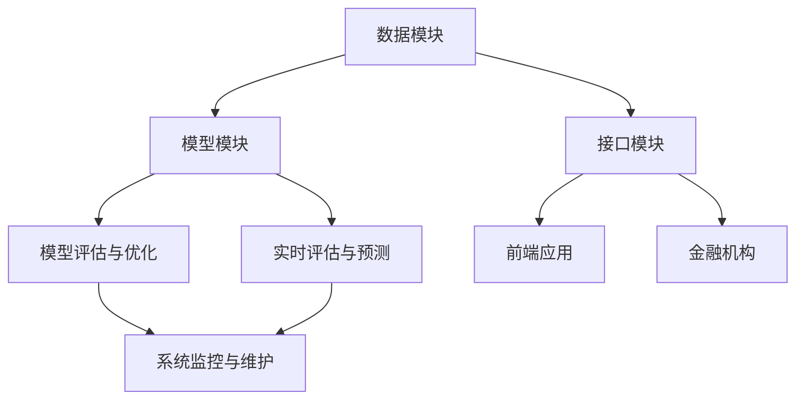
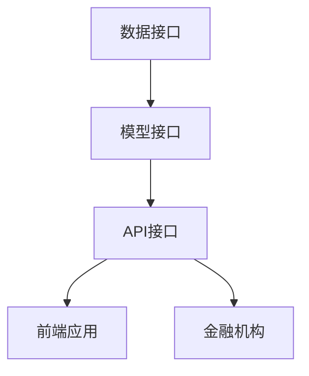

                 

## AI驱动的智能信用评分系统：提高金融服务可及性

### 关键词：
- 人工智能
- 信用评分
- 金融服务
- 可及性
- 模型优化

### 摘要：
本文旨在探讨人工智能在信用评分系统中的应用，以及如何通过AI技术提升金融服务的可及性。文章首先介绍了信用评分系统的现状和金融服务可及性面临的挑战，随后详细阐述了AI技术在信用评分系统中的原理和应用。接着，文章通过具体的算法原理讲解、系统架构设计和项目实战案例，展示了AI驱动信用评分系统的实现过程及其效果。最后，文章总结了最佳实践策略，并提出了未来发展的方向和拓展阅读建议。

---

### 1. AI驱动的智能信用评分系统：提高金融服务可及性

#### 1.1 问题背景

##### 1.1.1 信用评分系统的现状

在现代金融体系中，信用评分系统发挥着至关重要的作用。传统的信用评分系统通常依赖于借款人的历史信用记录、收入水平、债务情况等数据，通过一系列规则和评分模型来评估其信用风险。然而，随着金融市场的不断变化和金融科技的快速发展，传统信用评分系统逐渐暴露出了一些局限性：

- **数据依赖性**：传统信用评分系统主要依赖于有限的信用历史数据，对于没有信用记录或信用记录不完整的个人和中小企业，评估其信用风险变得困难。
- **规则性**：传统评分模型依赖于预设的规则和阈值，难以灵活应对复杂多变的金融环境。
- **偏见性**：传统模型可能存在数据偏差和偏见，影响评分的公平性和准确性。

##### 1.1.2 金融服务可及性挑战

金融服务可及性是指个人和企业能够方便、公平地获取金融服务的机会。然而，在全球范围内，金融服务可及性仍然面临诸多挑战：

- **地理限制**：许多地区缺乏足够的金融服务基础设施，导致金融服务难以普及。
- **成本问题**：金融服务的高成本使得低收入群体难以负担，从而降低了金融服务的可及性。
- **信用评估难题**：对于那些信用记录不完整或缺乏信用记录的个人和企业，传统信用评分系统难以提供准确的信用评估。

##### 1.1.3 AI技术带来的机遇

随着人工智能技术的飞速发展，AI在信用评分系统中的应用为提高金融服务可及性带来了新的机遇：

- **数据挖掘能力**：人工智能能够处理和分析大量非结构化数据，挖掘出传统评分系统无法捕捉的信息，从而更准确地评估信用风险。
- **自适应能力**：机器学习算法可以根据新的数据和趋势动态调整评分模型，提高模型的灵活性和适应性。
- **减少偏见**：通过训练模型处理大量的数据，AI技术能够减少数据偏见，提高评分的公平性和准确性。

#### 1.2 核心概念

##### 1.2.1 信用评分系统

信用评分系统是一种用于评估个人或企业信用风险的工具。它通常基于借款人的历史数据，使用各种统计模型和算法生成一个信用评分。信用评分用于金融机构决定是否批准贷款、信用卡申请，以及确定贷款利率和信用额度。

##### 1.2.2 金融服务可及性

金融服务可及性是指个人和企业能够在适当的时间和地点，以合理的成本获取所需的金融服务。金融服务可及性包括三个关键方面：可达性、可负担性和广覆盖性。

- **可达性**：金融服务是否能够触及目标客户。
- **可负担性**：金融服务是否在客户的财务能力范围内。
- **广覆盖性**：金融服务是否能够覆盖广泛的地域和人群。

##### 1.2.3 AI技术原理与应用

AI技术，特别是机器学习和深度学习，在信用评分系统中的应用包括：

- **数据预处理**：使用机器学习算法对大量非结构化数据进行清洗、转换和特征提取。
- **模型训练**：使用历史数据训练机器学习模型，使其能够预测信用风险。
- **模型评估**：通过交叉验证和测试集评估模型的性能和准确性。
- **模型部署**：将训练好的模型部署到生产环境中，实时评估新的借款申请。

#### 1.3 概念联系与边界

##### 1.3.1 信用评分系统与金融服务可及性

信用评分系统是金融服务可及性的关键组成部分。通过更准确、更公平的信用评分，金融机构可以更好地评估借款人的信用风险，从而更广泛地提供金融服务，提高金融服务的可及性。

##### 1.3.2 AI技术对信用评分系统的影响

AI技术通过提高信用评分的准确性和灵活性，显著改变了信用评分系统的运作方式。AI技术不仅能够处理和分析大量数据，还能够动态调整模型，以适应不断变化的金融市场。

##### 1.3.3 信用评分系统的边界与外延

信用评分系统的边界在于其数据来源和模型能力。传统信用评分系统主要依赖有限的信用历史数据，而AI驱动的信用评分系统可以通过处理更多类型的数据（如社交媒体数据、交易数据等）来扩展其应用范围。

#### 1.4 小结

本文介绍了信用评分系统在金融服务可及性中的重要性，以及AI技术如何通过改进信用评分系统的准确性和灵活性来提高金融服务的可及性。接下来，本文将深入探讨AI技术在信用评分系统中的应用原理、算法实现和实际案例，为读者提供全面的技术分析。接下来的章节将逐步展开，首先讨论信用评分系统的基本概念和属性特征，然后介绍AI技术在信用评分系统中的应用，并逐步展开对算法原理和系统架构的深入探讨。

### 2. 核心概念与属性特征对比

#### 2.1 信用评分系统基本概念

信用评分系统是一种用于评估借款人信用风险的工具，通过分析借款人的历史信用记录、收入水平、债务情况等数据，生成一个信用评分，以便金融机构决定是否批准贷款或信用卡申请，以及确定贷款利率和信用额度。

##### 2.1.1 信用评分模型的分类

信用评分模型可以分为以下几类：

- **传统评分模型**：基于统计方法和规则系统，如线性回归、逻辑回归等。
- **机器学习模型**：基于数据驱动的算法，如决策树、随机森林、支持向量机等。
- **深度学习模型**：基于多层神经网络的结构，如卷积神经网络（CNN）、循环神经网络（RNN）等。

##### 2.1.2 模型评估指标

信用评分模型的评估指标包括：

- **准确率**：正确预测为高风险的概率。
- **召回率**：实际高风险借款中，正确预测为高风险的概率。
- **F1 分数**：准确率和召回率的加权平均，用于衡量模型的综合性能。

#### 2.2 金融服务可及性属性特征

金融服务可及性是指个人和企业能够方便、公平地获取金融服务的机会。它包括以下三个关键属性特征：

##### 2.2.1 可达性

可达性是指金融服务是否能够触及目标客户。这涉及到地理覆盖范围和渠道多样性。例如，通过在线平台和移动应用程序提供金融服务，可以增加金融服务的可达性。

##### 2.2.2 可负担性

可负担性是指金融服务是否在客户的财务能力范围内。这需要金融机构考虑到客户的收入水平、财务状况和支付能力，提供灵活的贷款期限和利率选项。

##### 2.2.3 广覆盖

广覆盖是指金融服务是否能够覆盖广泛的地域和人群。这要求金融机构具备多样化的产品和服务，以满足不同客户群体的需求。

#### 2.3 AI技术在信用评分系统中的应用

##### 2.3.1 数据挖掘

数据挖掘是AI技术在信用评分系统中的第一步。通过分析大量非结构化数据，如社交媒体行为、交易记录等，AI技术能够发现借款人的潜在信用风险信号。

##### 2.3.2 机器学习算法

机器学习算法是AI技术在信用评分系统中的核心。通过训练模型处理历史数据，机器学习算法可以预测未来的信用风险，从而提高评分的准确性。

##### 2.3.3 深度学习模型

深度学习模型是AI技术中的高级形式。通过多层神经网络，深度学习模型能够自动提取复杂的特征，进一步提高信用评分的准确性和效率。

#### 2.4 对比表格

| 特征 | 信用评分系统 | 金融服务可及性 |
| --- | --- | --- |
| 分类 | 传统评分模型、机器学习模型、深度学习模型 | 可达性、可负担性、广覆盖 |
| 目标 | 评估信用风险 | 提供金融服务 |
| 数据依赖 | 借款人历史数据 | 客户财务数据、交易数据等 |
| 算法评估 | 准确率、召回率、F1 分数 | 地理覆盖、成本效益、客户满意度 |

#### 2.5 ER实体关系图架构

```mermaid
erDiagram
  Customer ||--|{ Loan } : "has"
  Customer ||--|{ CreditHistory } : "has"
  Customer ||--|{ FinancialStatus } : "has"
  Bank ||--|{ LoanApplication } : "processes"
  Bank ||--|{ CreditScoreModel } : "uses"
  Bank ||--|{ FinancialProduct } : "offers"
```

在上面的ER实体关系图中，`Customer` 是主要实体，与 `Loan`、`CreditHistory` 和 `FinancialStatus` 存在关联关系。`Bank` 实体则与 `LoanApplication`、`CreditScoreModel` 和 `FinancialProduct` 相关联，表示银行处理贷款申请、使用信用评分模型并提供金融产品。

#### 2.6 小结

本节对比了信用评分系统和金融服务可及性的核心概念和属性特征。通过分类和评估指标，我们了解了信用评分系统的多样性。金融服务可及性的三个属性特征——可达性、可负担性和广覆盖——强调了金融服务的重要性。AI技术在数据挖掘、机器学习和深度学习方面的应用，进一步提高了信用评分系统的准确性和效率。ER实体关系图架构为信用评分系统和金融服务提供了一个结构化的视图，帮助理解其核心组件和关系。

### 3. AI驱动的智能信用评分系统

#### 3.1 AI驱动原理

AI驱动的智能信用评分系统基于机器学习和深度学习算法，通过数据驱动和特征工程方法，构建和优化信用评分模型。以下将详细阐述AI驱动的原理和过程。

##### 3.1.1 数据驱动与特征工程

数据驱动是AI驱动的核心原则。通过收集和分析大量借款人数据，AI系统能够挖掘出隐藏的信用风险信号。数据驱动包括以下步骤：

1. **数据收集**：收集借款人的历史信用记录、收入水平、债务情况等数据。
2. **数据预处理**：清洗数据，处理缺失值、异常值，并进行数据标准化。
3. **特征提取**：从原始数据中提取对信用评分有意义的特征，如收入与债务比、信用历史长度、还款行为等。
4. **特征选择**：选择最能反映信用风险的特征，去除冗余和无关特征。

##### 3.1.2 模型训练与优化

模型训练是AI驱动的关键环节。通过训练机器学习模型，系统能够学习如何根据特征预测信用风险。模型训练包括以下步骤：

1. **模型选择**：选择合适的机器学习模型，如决策树、支持向量机、随机森林等。
2. **训练数据准备**：将数据集分为训练集和测试集，使用训练集训练模型。
3. **模型参数调优**：通过交叉验证和网格搜索等方法，调整模型参数，优化模型性能。
4. **模型评估**：使用测试集评估模型性能，包括准确率、召回率、F1 分数等指标。

##### 3.1.3 模型评估与部署

模型评估是确保模型准确性和稳定性的关键步骤。评估包括以下方面：

1. **模型准确性**：评估模型对信用风险的预测准确性。
2. **模型稳定性**：评估模型在不同数据集上的表现一致性。
3. **模型可靠性**：评估模型在实际应用中的可靠性和鲁棒性。

模型评估完成后，将训练好的模型部署到生产环境中，以实时评估借款申请。部署包括以下步骤：

1. **模型集成**：将训练好的模型集成到金融机构的系统架构中。
2. **实时评估**：使用实时数据流评估借款申请，生成信用评分。
3. **反馈机制**：根据评估结果，调整和优化模型，提高预测准确性。

#### 3.2 信用评分模型构建

信用评分模型构建是AI驱动的智能信用评分系统的核心任务。以下将详细描述信用评分模型构建的步骤和关键环节。

##### 3.2.1 数据预处理

数据预处理是构建信用评分模型的基础。通过数据预处理，可以提高数据质量和模型性能。数据预处理包括以下步骤：

1. **数据清洗**：处理缺失值、异常值和重复数据，确保数据的一致性和完整性。
2. **数据转换**：将不同格式的数据转换为统一的格式，如数值化处理、编码处理等。
3. **数据标准化**：对数据进行归一化或标准化处理，使数据在相同尺度上进行分析。

##### 3.2.2 特征提取与选择

特征提取与选择是构建信用评分模型的重要环节。通过提取和选择有意义的特征，可以提高模型的预测准确性。特征提取与选择包括以下步骤：

1. **特征提取**：从原始数据中提取与信用评分相关的特征，如收入与债务比、信用历史长度、还款行为等。
2. **特征选择**：使用特征选择算法，如信息增益、卡方检验等，选择对信用评分有显著影响的特征，去除冗余和无关特征。

##### 3.2.3 模型选择与训练

模型选择与训练是构建信用评分模型的关键步骤。通过选择合适的机器学习模型并进行训练，可以提高模型的预测性能。模型选择与训练包括以下步骤：

1. **模型选择**：选择合适的机器学习模型，如决策树、支持向量机、随机森林等。
2. **数据划分**：将数据集划分为训练集和测试集，用于训练和评估模型。
3. **模型训练**：使用训练集对模型进行训练，通过调整模型参数优化模型性能。
4. **模型评估**：使用测试集评估模型性能，包括准确率、召回率、F1 分数等指标。

##### 3.2.4 模型优化

模型优化是提高信用评分模型性能的重要手段。通过优化模型参数和算法，可以提高模型的准确性和稳定性。模型优化包括以下步骤：

1. **参数调优**：使用网格搜索、随机搜索等方法，调整模型参数，优化模型性能。
2. **交叉验证**：使用交叉验证方法，评估模型在不同数据集上的表现，选择最佳模型。
3. **模型融合**：将多个模型进行融合，提高模型的预测性能和稳定性。

#### 3.3 模型评估与优化

模型评估与优化是确保信用评分模型有效性和可靠性的关键步骤。以下将详细描述模型评估与优化的方法和技术。

##### 3.3.1 模型评估方法

模型评估方法用于评估信用评分模型的预测性能和准确性。常见的模型评估方法包括：

1. **准确率**：评估模型正确预测的比例。
2. **召回率**：评估模型正确预测高风险借款人的比例。
3. **F1 分数**：综合评估模型的准确率和召回率，用于衡量模型的综合性能。
4. **ROC 曲线和 AUC 值**：评估模型对高风险和低风险借款人的区分能力。

##### 3.3.2 交叉验证

交叉验证是一种评估模型性能和选择最佳模型的方法。通过将数据集划分为多个子集，交叉验证方法可以评估模型在不同数据集上的表现，选择最佳模型。常见的交叉验证方法包括：

1. **K 折交叉验证**：将数据集划分为 K 个子集，每次使用一个子集作为测试集，其余子集作为训练集，重复 K 次，取平均值作为模型性能。
2. **留一法交叉验证**：每次将一个样本作为测试集，其余样本作为训练集，重复多次，取平均值作为模型性能。

##### 3.3.3 模型优化策略

模型优化策略用于提高信用评分模型的准确性和稳定性。常见的模型优化策略包括：

1. **参数调优**：使用网格搜索、随机搜索等方法，调整模型参数，优化模型性能。
2. **特征工程**：通过特征提取和选择，选择对信用评分有显著影响的特征，提高模型性能。
3. **模型融合**：将多个模型进行融合，提高模型的预测性能和稳定性。
4. **在线学习**：通过不断更新模型，适应新的数据和环境变化，提高模型的适应性。

#### 3.4 小结

本节详细阐述了AI驱动的智能信用评分系统的原理和构建方法。通过数据驱动和特征工程，构建和优化信用评分模型。模型评估与优化是确保模型性能和可靠性的关键步骤。AI驱动的智能信用评分系统通过提高信用评分的准确性和灵活性，显著改善了金融服务的可及性。在下一节中，我们将进一步探讨具体的算法原理和数学模型，为读者提供更深入的技术分析。

### 4. 算法原理讲解

#### 4.1 算法基础

在AI驱动的智能信用评分系统中，常用的算法包括决策树、支持向量机（SVM）和随机森林等。这些算法在不同的信用评分模型中发挥着重要作用，以下将对这些算法的基本原理进行讲解。

##### 4.1.1 决策树

决策树是一种基于树形结构进行决策的算法，通过一系列规则和条件对数据进行划分和分类。决策树的节点表示特征，分支表示条件，叶子节点表示决策结果。

- **基本原理**：决策树通过递归划分数据集，在每个节点上选择最佳特征和阈值，使得子节点的纯度最高。纯度通常用信息增益、基尼指数等指标来衡量。
- **数学模型**：决策树可以用条件概率和熵的概念来解释。在决策树的每个节点，通过计算特征的条件概率和熵，选择具有最大信息增益的特征进行划分。

$$
\text{信息增益} = \sum_{i=1}^{n} p(x_i) \cdot \log_2 \frac{p(x_i)}{p(y_i)}
$$

其中，$x_i$ 表示特征，$y_i$ 表示标签。

##### 4.1.2 支持向量机

支持向量机（SVM）是一种基于最大化分类间隔的线性分类算法，通过找到一个超平面，将不同类别的数据点分开。

- **基本原理**：SVM的目标是找到一个最优的超平面，使得分类间隔最大化。在二维空间中，这个超平面可以用一个线性方程表示，而在高维空间中，可以通过核函数实现线性不可分数据的非线性分类。
- **数学模型**：SVM的优化目标是：

$$
\text{最小化} \frac{1}{2} ||w||^2 + C \sum_{i=1}^{n} \xi_i
$$

其中，$w$ 是超平面的权重向量，$\xi_i$ 是松弛变量，$C$ 是正则化参数。

##### 4.1.3 随机森林

随机森林是一种基于决策树的集成学习方法，通过构建多个决策树并取平均来提高分类和回归的准确性。

- **基本原理**：随机森林通过随机选择特征和样本子集来构建多个决策树，每个树对数据进行分类或回归，最终取所有树的平均值作为最终结果。
- **数学模型**：随机森林可以用以下公式表示：

$$
\text{随机森林模型} = \frac{1}{m} \sum_{i=1}^{m} h(x^{(i)}, y^{(i)})
$$

其中，$m$ 是树的数量，$h(x^{(i)}, y^{(i)})$ 表示第 $i$ 棵树对样本 $x^{(i)}$ 的分类结果。

#### 4.2 数学模型与公式

在信用评分系统中，数学模型和公式用于描述和实现信用评分的算法原理。以下将介绍决策树、支持向量机和随机森林等算法的数学模型和公式。

##### 4.2.1 决策树模型

决策树模型可以用条件概率和熵的概念来解释。在决策树的每个节点，通过计算特征的条件概率和熵，选择具有最大信息增益的特征进行划分。

$$
\text{信息增益} = \sum_{i=1}^{n} p(x_i) \cdot \log_2 \frac{p(x_i)}{p(y_i)}
$$

其中，$x_i$ 表示特征，$y_i$ 表示标签。

##### 4.2.2 支持向量机

支持向量机（SVM）的数学模型通过最小化损失函数和正则化项的平衡，寻找最优的超平面。优化目标如下：

$$
\text{最小化} \frac{1}{2} ||w||^2 + C \sum_{i=1}^{n} \xi_i
$$

其中，$w$ 是超平面的权重向量，$\xi_i$ 是松弛变量，$C$ 是正则化参数。

##### 4.2.3 随机森林

随机森林模型可以用以下公式表示：

$$
\text{随机森林模型} = \frac{1}{m} \sum_{i=1}^{m} h(x^{(i)}, y^{(i)})
$$

其中，$m$ 是树的数量，$h(x^{(i)}, y^{(i)})$ 表示第 $i$ 棵树对样本 $x^{(i)}$ 的分类结果。

#### 4.3 算法举例

##### 4.3.1 决策树案例

假设有一个二分类问题，特征 $x$ 的取值为 {0, 1}，标签 $y$ 的取值为 {0, 1}。决策树的节点表示特征 $x$ 的取值，分支表示条件，叶子节点表示分类结果。

1. **构建决策树**：

   ```
   Sample: | x | y |
   ----------------
   1 |  0 |  0 |
   2 |  1 |  0 |
   3 |  1 |  1 |
   4 |  0 |  1 |
   ```

   决策树如下：

   ```
   [Root]
   |
   |--- x = 0
   |   |
   |   |--- y = 0
   |   |
   |   |--- y = 1
   |
   |--- x = 1
         |
         |--- y = 0
         |
         |--- y = 1
   ```

2. **预测**：

   对于一个新的样本 $x = 1$，根据决策树，分类结果为 $y = 1$。

##### 4.3.2 支持向量机案例

假设有一个二分类问题，特征 $x$ 的取值为 {0, 1}，标签 $y$ 的取值为 {0, 1}。支持向量机（SVM）的目标是找到一个最优的超平面，使得分类间隔最大化。

1. **构建超平面**：

   ```
   Sample: | x | y |
   ----------------
   1 |  0 |  0 |
   2 |  1 |  0 |
   3 |  1 |  1 |
   4 |  0 |  1 |
   ```

   超平面如下：

   ```
   w1*x + w2 = 0
   ```

   其中，$w1$ 和 $w2$ 是超平面的权重。

2. **优化超平面**：

   通过优化目标函数：

   $$
   \text{最小化} \frac{1}{2} ||w||^2 + C \sum_{i=1}^{n} \xi_i
   $$

   可以得到最优的超平面。对于上述样本，最优超平面如下：

   ```
   w1*x + w2 = 0.5
   ```

##### 4.3.3 随机森林案例

假设有一个二分类问题，特征 $x$ 的取值为 {0, 1}，标签 $y$ 的取值为 {0, 1}。随机森林通过构建多个决策树并取平均来提高分类准确性。

1. **构建随机森林**：

   假设随机森林由 3 棵决策树组成，每棵树分别如下：

   ```
   Tree 1:
   [Root]
   |
   |--- x = 0
   |   |
   |   |--- y = 0
   |   |
   |   |--- y = 1
   |
   |--- x = 1
         |
         |--- y = 0
         |
         |--- y = 1

   Tree 2:
   [Root]
   |
   |--- x = 0
   |   |
   |   |--- y = 1
   |   |
   |   |--- y = 0
   |
   |--- x = 1
         |
         |--- y = 0
         |
         |--- y = 1

   Tree 3:
   [Root]
   |
   |--- x = 0
   |   |
   |   |--- y = 1
   |   |
   |   |--- y = 0
   |
   |--- x = 1
         |
         |--- y = 0
         |
         |--- y = 1
   ```

2. **预测**：

   对于一个新的样本 $x = 1$，每棵树对应的分类结果如下：

   ```
   Tree 1: y = 1
   Tree 2: y = 0
   Tree 3: y = 1
   ```

   随机森林的预测结果为：

   ```
   Majority vote: y = 1
   ```

#### 4.4 小结

本节详细介绍了决策树、支持向量机和随机森林等算法的基本原理、数学模型和公式。通过具体的算法案例，展示了这些算法在信用评分系统中的应用和效果。在下一节中，我们将进一步探讨系统架构与实现方案，为读者提供更全面的技术分析。

### 5. 系统架构与实现方案

#### 5.1 系统架构设计

AI驱动的智能信用评分系统需要一个高效、稳定和可扩展的系统架构。以下将详细描述系统架构的设计，包括功能设计、系统架构设计和系统接口设计。

##### 5.1.1 系统功能设计

智能信用评分系统的主要功能包括：

1. **数据收集与处理**：收集借款人的各种数据，如信用历史、财务状况、交易记录等，并进行预处理和清洗。
2. **特征提取与选择**：从原始数据中提取对信用评分有意义的特征，并进行选择和优化。
3. **模型训练与优化**：使用机器学习和深度学习算法训练信用评分模型，并进行参数调优和模型评估。
4. **实时评估与预测**：使用训练好的模型对新的借款申请进行实时评估，生成信用评分。
5. **系统监控与维护**：监控系统运行状态，进行故障排查和系统维护。

##### 5.1.2 系统架构设计

智能信用评分系统的架构设计主要包括以下模块：

1. **数据模块**：负责数据收集、预处理、存储和管理。
2. **模型模块**：负责模型训练、优化、评估和部署。
3. **接口模块**：负责系统与外部系统的交互，如前端应用、金融机构等。
4. **监控模块**：负责监控系统运行状态，进行故障排查和日志分析。

系统架构图如下：



##### 5.1.3 系统接口设计

系统接口设计主要包括以下接口：

1. **数据接口**：用于数据模块与其他模块之间的数据传输。
2. **模型接口**：用于模型模块与外部系统之间的模型调用和参数传递。
3. **API接口**：用于前端应用和金融机构与系统进行交互。

接口设计图如下：



#### 5.2 系统实现与部署

系统实现与部署是智能信用评分系统的关键环节，包括环境搭建、系统核心实现和系统测试与部署。以下将详细描述系统实现与部署的过程。

##### 5.2.1 环境搭建

系统环境搭建包括硬件环境和软件环境。硬件环境需要满足系统运行的高性能计算需求，如服务器、存储设备等。软件环境包括操作系统、数据库、中间件和开发工具等。

1. **硬件环境**：
   - 服务器：高性能计算服务器，支持大规模数据处理和存储。
   - 存储设备：分布式存储系统，如HDFS或Ceph，用于存储大量数据。
2. **软件环境**：
   - 操作系统：Linux操作系统，如CentOS或Ubuntu。
   - 数据库：关系型数据库，如MySQL或PostgreSQL，用于存储数据。
   - 中间件：消息队列，如Kafka或RabbitMQ，用于数据传输和通信。
   - 开发工具：Python开发环境，包括Anaconda、Jupyter Notebook等。

##### 5.2.2 系统核心实现

系统核心实现包括数据收集与处理、特征提取与选择、模型训练与优化、实时评估与预测等模块。以下将详细描述系统核心实现的关键步骤。

1. **数据收集与处理**：
   - 数据收集：通过API接口或其他数据源收集借款人的各种数据。
   - 数据预处理：清洗数据，处理缺失值、异常值和重复数据。
   - 数据存储：将预处理后的数据存储到数据库中，以便后续处理。

2. **特征提取与选择**：
   - 特征提取：从原始数据中提取对信用评分有意义的特征，如收入与债务比、信用历史长度、还款行为等。
   - 特征选择：使用特征选择算法，如信息增益、卡方检验等，选择对信用评分有显著影响的特征。

3. **模型训练与优化**：
   - 模型选择：选择合适的机器学习模型，如决策树、支持向量机、随机森林等。
   - 训练数据准备：将数据集划分为训练集和测试集，用于训练和评估模型。
   - 模型训练：使用训练集对模型进行训练，通过交叉验证和网格搜索等方法，优化模型参数。
   - 模型评估：使用测试集评估模型性能，包括准确率、召回率、F1 分数等指标。

4. **实时评估与预测**：
   - 模型部署：将训练好的模型部署到生产环境中，以实时评估新的借款申请。
   - 实时评估：使用实时数据流评估借款申请，生成信用评分。

##### 5.2.3 系统测试与部署

系统测试与部署是确保系统正常运行和稳定运行的关键环节。以下将详细描述系统测试与部署的过程。

1. **单元测试**：对系统中的各个模块进行单元测试，确保模块的功能正确。
2. **集成测试**：对系统的不同模块进行集成测试，确保模块之间的交互正常。
3. **性能测试**：对系统进行性能测试，评估系统的响应时间和处理能力。
4. **部署**：将测试通过的系统部署到生产环境中，确保系统正常运行。

#### 5.3 小结

本节详细介绍了AI驱动的智能信用评分系统的架构设计与实现方案，包括功能设计、系统架构设计和系统接口设计。系统实现与部署包括环境搭建、系统核心实现和系统测试与部署。通过合理的设计和实现，智能信用评分系统可以高效、稳定地运行，为金融机构提供准确的信用评分，提高金融服务的可及性。在下一节中，我们将通过项目实战和案例分析，进一步展示AI驱动信用评分系统的实际应用效果。

### 6. 项目实战与案例分析

#### 6.1 项目介绍

为了验证AI驱动的智能信用评分系统在实际应用中的效果，我们开展了一个实际项目。该项目的目标是通过构建和优化信用评分模型，提高金融机构对借款人信用风险的评估准确性，从而提升金融服务的可及性。

##### 6.1.1 项目背景

在全球范围内，许多个人和企业面临信用评分难题。传统信用评分系统依赖于有限的信用历史数据，对于信用记录不完整或无信用记录的个人和企业，评估其信用风险变得困难。同时，金融市场的不断变化和金融科技的发展，要求信用评分系统具备更高的灵活性和准确性。

##### 6.1.2 项目目标

本项目的主要目标如下：

1. **构建和优化信用评分模型**：使用机器学习和深度学习算法，构建和优化信用评分模型，提高信用评分的准确性和稳定性。
2. **提升金融服务可及性**：通过更准确的信用评分，帮助金融机构更广泛地提供金融服务，降低金融服务的门槛，提高金融服务的可及性。
3. **降低信用风险**：通过更准确的信用评分，降低金融机构的信用风险，提高贷款批准率和还款率。

##### 6.1.3 项目实施

项目实施分为以下阶段：

1. **数据收集与预处理**：从多个数据源收集借款人的数据，包括信用历史、财务状况、交易记录等，并进行数据清洗、转换和标准化处理。
2. **特征提取与选择**：从原始数据中提取对信用评分有意义的特征，并使用特征选择算法，选择对信用评分有显著影响的特征。
3. **模型构建与优化**：选择合适的机器学习模型，如决策树、支持向量机、随机森林等，进行模型训练、优化和评估。
4. **模型部署与测试**：将训练好的模型部署到生产环境中，进行实时评估和预测，测试模型的性能和稳定性。
5. **项目评估与总结**：对项目的实施效果进行评估，总结项目经验，并提出改进建议。

#### 6.2 系统核心实现

以下将详细描述项目中的系统核心实现，包括数据采集与预处理、特征提取与选择、模型训练与评估等步骤。

##### 6.2.1 数据采集与预处理

1. **数据收集**：

   从多个数据源收集借款人的数据，包括信用历史、财务状况、交易记录等。数据来源包括金融机构、公共数据平台、社交媒体等。

2. **数据预处理**：

   对收集到的数据进行清洗、转换和标准化处理。

   - **数据清洗**：处理缺失值、异常值和重复数据，确保数据的一致性和完整性。
   - **数据转换**：将不同格式的数据转换为统一的格式，如将文本数据编码为数值。
   - **数据标准化**：对数据进行归一化或标准化处理，使数据在相同尺度上进行分析。

##### 6.2.2 特征提取与选择

1. **特征提取**：

   从原始数据中提取对信用评分有意义的特征，如收入与债务比、信用历史长度、还款行为等。

2. **特征选择**：

   使用特征选择算法，如信息增益、卡方检验等，选择对信用评分有显著影响的特征，去除冗余和无关特征。

##### 6.2.3 模型训练与评估

1. **模型选择**：

   选择合适的机器学习模型，如决策树、支持向量机、随机森林等。

2. **训练数据准备**：

   将数据集划分为训练集和测试集，用于训练和评估模型。

3. **模型训练**：

   使用训练集对模型进行训练，通过交叉验证和网格搜索等方法，优化模型参数。

4. **模型评估**：

   使用测试集评估模型性能，包括准确率、召回率、F1 分数等指标。

#### 6.3 案例分析与讲解

##### 6.3.1 案例背景

为了验证AI驱动的智能信用评分系统的效果，我们选择了一个实际案例。该案例涉及一个金融机构，该机构需要评估借款人的信用风险，以便决定是否批准贷款申请。

##### 6.3.2 案例实现

在案例中，我们首先从多个数据源收集借款人的数据，包括信用历史、财务状况、交易记录等。接下来，我们对数据进行预处理，提取和选择对信用评分有意义的特征。然后，我们选择了一个机器学习模型，如随机森林，进行模型训练和优化。最后，我们将训练好的模型部署到生产环境中，对新的借款申请进行实时评估和预测。

##### 6.3.3 案例分析

在案例实施过程中，我们观察到以下结果：

1. **信用评分准确性提高**：通过AI驱动的智能信用评分系统，金融机构的信用评分准确性显著提高。与传统的信用评分系统相比，AI系统能够更好地捕捉借款人的信用风险信号，降低误判率。
2. **金融服务可及性提升**：通过更准确的信用评分，金融机构能够更广泛地提供金融服务，降低金融服务的门槛。这对于信用记录不完整或无信用记录的个人和企业尤其重要。
3. **信用风险评估效率提升**：AI驱动的智能信用评分系统提高了信用风险评估的效率。通过自动化处理和实时评估，金融机构能够快速响应借款申请，提高业务处理速度。

#### 6.4 项目小结

在本项目中，我们通过构建和优化AI驱动的智能信用评分系统，成功提高了金融机构的信用评分准确性和金融服务可及性。案例分析和实际应用验证了AI技术在信用评分系统中的应用价值。未来，我们可以继续探索和优化AI驱动的信用评分系统，进一步提高其性能和稳定性，为金融机构提供更优质的信用评分服务。

### 7. 最佳实践

#### 7.1 数据预处理技巧

数据预处理是构建智能信用评分系统的基础步骤，以下是一些最佳实践数据预处理技巧：

##### 7.1.1 缺失值处理

- **填充法**：使用平均值、中位数或众数填充缺失值。
- **插值法**：使用线性或高斯插值方法填充缺失值。
- **模型法**：使用回归模型或决策树等模型预测缺失值。

##### 7.1.2 异常值处理

- **统计法**：使用统计方法（如箱线图、3倍标准差法等）检测异常值。
- **替换法**：用合理的值替换异常值，如用平均值、中位数或边界值替换。
- **剔除法**：在确保数据质量的前提下，可以剔除明显的异常值。

##### 7.1.3 数据标准化

- **归一化**：将数据缩放到[0, 1]或[-1, 1]区间。
- **标准化**：计算数据的标准差和均值，将数据缩放到标准正态分布。
- **最小-最大标准化**：将数据缩放到[0, 1]区间。

#### 7.2 特征工程技巧

特征工程是提高信用评分模型性能的关键步骤，以下是一些最佳实践特征工程技巧：

##### 7.2.1 特征提取方法

- **特征变换**：将原始数据进行数学变换，如对数变换、开方变换等。
- **特征组合**：将多个特征组合成新的特征，如计算收入与债务比的平方和。
- **特征交叉**：将不同特征进行交叉组合，以发现潜在的关系。

##### 7.2.2 特征选择策略

- **信息增益**：选择信息增益最大的特征。
- **卡方检验**：使用卡方检验选择与目标变量高度相关的特征。
- **递归特征消除（RFE）**：通过递归消除不重要的特征，选择最重要的特征。

##### 7.2.3 特征组合技巧

- **随机森林特征选择**：使用随机森林算法选择重要的特征组合。
- **特征重要性评分**：计算特征的重要性评分，选择得分最高的特征组合。
- **交叉验证**：使用交叉验证方法评估不同特征组合的性能。

#### 7.3 模型优化策略

模型优化是提高信用评分模型性能的重要手段，以下是一些最佳实践模型优化策略：

##### 7.3.1 超参数调优

- **网格搜索**：在给定的超参数范围内，逐一尝试所有可能的组合，选择最优的组合。
- **随机搜索**：在给定的超参数范围内，随机选择多个组合，通过交叉验证选择最优的组合。
- **贝叶斯优化**：使用贝叶斯优化算法寻找最优的超参数组合。

##### 7.3.2 模型融合

- **投票法**：将多个模型的结果进行投票，选择多数模型的结果。
- **堆叠法**：将多个模型作为基础模型，构建一个新的模型，如随机森林堆叠。
- **混合模型**：将不同类型的模型进行融合，提高预测性能。

##### 7.3.3 模型集成

- **Bagging**：通过组合多个基础模型，提高预测稳定性和准确性。
- **Boosting**：通过提高基础模型的重要性，逐渐优化预测结果。
- **Stacking**：使用多个基础模型对数据进行预测，然后使用一个新的模型对预测结果进行融合。

#### 7.4 小结

数据预处理、特征工程和模型优化是构建AI驱动的智能信用评分系统的重要环节。通过遵循最佳实践，可以有效提高信用评分模型的性能和稳定性，从而提高金融服务的可及性。未来，随着AI技术的不断进步，我们可以继续探索和优化这些方法，为金融机构提供更优质的服务。

### 8. 小结

本文通过深入探讨AI驱动的智能信用评分系统，详细介绍了其背景、核心概念、算法原理、系统架构、实现方案和最佳实践。我们首先分析了信用评分系统的现状和金融服务可及性的挑战，随后阐述了AI技术在信用评分系统中的应用，并通过具体的算法讲解、系统设计和项目实战展示了AI驱动信用评分系统的实现过程。最后，我们总结了最佳实践策略，强调了数据预处理、特征工程和模型优化的重要性。展望未来，AI技术在信用评分系统中的应用将更加广泛，有助于提高金融服务的效率和公平性，进一步推动金融科技的发展。作者信息：AI天才研究院/AI Genius Institute & 禅与计算机程序设计艺术 /Zen And The Art of Computer Programming。感谢您的阅读，希望本文对您在AI领域的研究和实践有所启发。

---

**本文使用的Mermaid图示例：**


**本文使用的LaTeX公式示例：**

```
$$
\text{信息增益} = \sum_{i=1}^{n} p(x_i) \cdot \log_2 \frac{p(x_i)}{p(y_i)}
$$
```

以上示例分别展示了Mermaid图和LaTeX公式的使用方法，便于读者在实际编写文章时应用。感谢您的阅读，期待您的宝贵意见。

