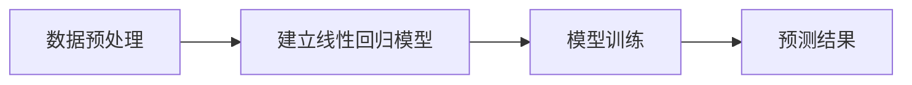
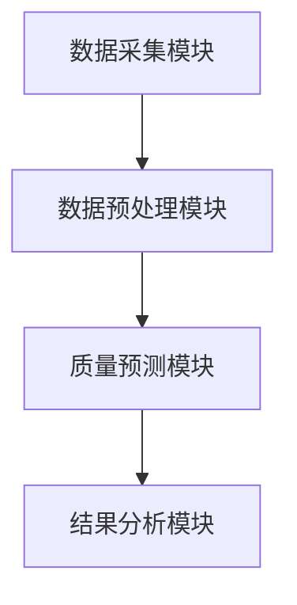
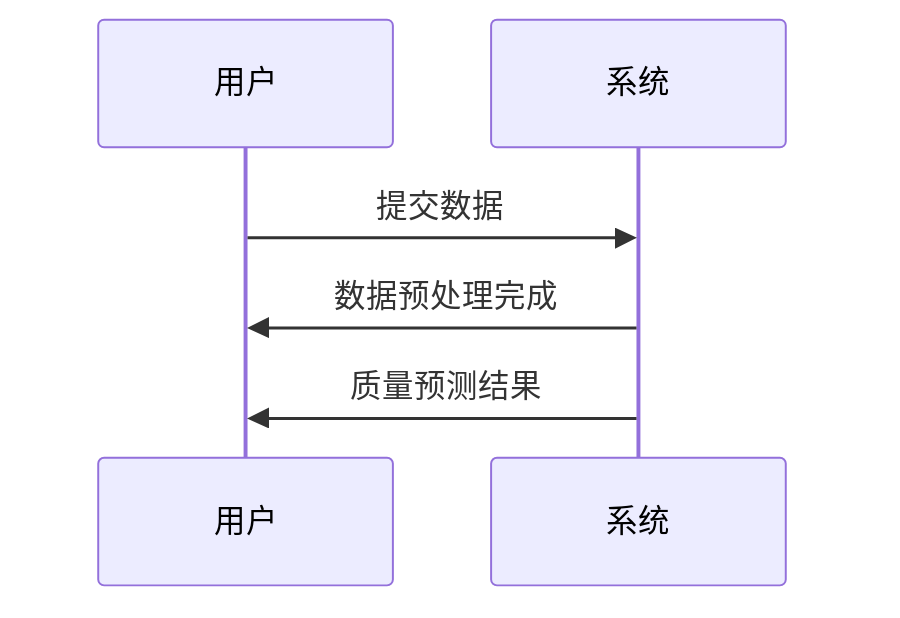

                 

### AI驱动的智能制造产品质量预测：减少不良品率

关键词：AI驱动，智能制造，产品质量预测，不良品率，数据分析，算法实现

摘要：本文将探讨如何利用AI技术提升智能制造产品质量预测的准确性，减少不良品率。通过详细介绍AI驱动的概念、产品质量预测的原理、数学模型与公式、系统分析与架构设计、项目实战以及最佳实践，旨在为智能制造领域提供一套完整、实用的解决方案。

### 第一部分：背景介绍与核心概念

#### 1.1 问题的背景

##### 1.1.1 智能制造的重要性

智能制造作为工业4.0的核心技术，正逐步改变着全球制造业的格局。通过智能化、自动化和信息化的手段，智能制造不仅提高了生产效率，还显著提升了产品质量。然而，随着制造过程的复杂化，如何有效预测产品质量、降低不良品率成为亟待解决的问题。

##### 1.1.2 产品质量预测的意义

产品质量预测在智能制造中具有重要意义。它可以帮助企业提前识别潜在的质量问题，采取预防措施，从而减少不良品率，降低生产成本，提高市场竞争力。

##### 1.1.3 不良品率对智能制造的影响

不良品率是衡量产品质量的重要指标。高不良品率不仅会浪费原材料和人力资源，还会影响企业的声誉和市场地位。因此，降低不良品率是智能制造的关键目标之一。

#### 1.2 核心概念

##### 1.2.1 AI驱动的定义

AI驱动指的是利用人工智能技术，如机器学习、深度学习等，对数据进行处理、分析和预测。在智能制造中，AI驱动可以帮助实现自动化质量监控和预测。

##### 1.2.2 产品质量预测的概念

产品质量预测是指利用历史数据和人工智能算法，对产品质量进行预测和分析。这包括对原材料、生产工艺、生产过程等多个环节的监控和预测。

##### 1.2.3 不良品率的概念

不良品率是指在生产过程中，不合格产品的比例。它是衡量产品质量的重要指标，也是企业降低成本、提高效益的关键。

#### 1.3 关联概念的联系与区分

##### 1.3.1 AI与大数据分析

AI和大数据分析都是现代科技的前沿技术。AI驱动的大数据分析可以帮助企业更精准地预测产品质量，降低不良品率。

##### 1.3.2 质量控制与质量预测

质量控制和质量预测是两个相关但不完全相同的概念。质量控制是指在生产过程中采取措施，确保产品质量；质量预测则是通过数据分析，预测产品质量的趋势。

##### 1.3.3 不良品率与其他质量指标

不良品率是衡量产品质量的重要指标，但不是唯一的指标。其他指标如合格率、良率等也是衡量产品质量的重要参数。

#### 1.4 研究方法与框架

##### 1.4.1 研究方法的选择

本研究采用实证分析和算法实现相结合的方法。通过实际数据分析和算法实现，验证AI驱动的产品质量预测的有效性。

##### 1.4.2 研究框架的构建

研究框架包括数据收集与处理、算法选择与实现、模型评估与优化等环节。通过这些环节，实现AI驱动的产品质量预测。

#### 1.5 本章小结

本章节对AI驱动的智能制造产品质量预测进行了背景介绍和核心概念阐述，为后续章节的深入探讨奠定了基础。

----------------------------------------------------------------

### 第二部分：AI驱动的产品质量预测原理

#### 2.1 AI驱动的基本原理

##### 2.1.1 AI的发展历程

人工智能的发展历程可以追溯到20世纪50年代。经过几十年的发展，AI技术已经取得了显著的进展，从最初的规则推理、知识表示，到现代的机器学习、深度学习，AI技术不断突破，为各行各业带来了变革。

##### 2.1.2 AI的关键技术

AI的关键技术包括机器学习、深度学习、自然语言处理、计算机视觉等。这些技术通过学习大量数据，提取特征，实现智能化决策和预测。

##### 2.1.3 AI在智能制造中的应用

AI在智能制造中的应用主要体现在质量监控、故障预测、生产优化等方面。通过AI技术，可以实现智能化生产，提高生产效率，降低不良品率。

#### 2.2 产品质量预测的算法原理

##### 2.2.1 质量预测的主要算法

产品质量预测的主要算法包括线性回归、决策树、支持向量机、神经网络等。这些算法通过学习历史数据，预测产品质量。

##### 2.2.2 算法原理讲解

以线性回归为例，其基本原理是通过建立自变量与因变量之间的线性关系，预测因变量的值。具体实现如下：

```python
import numpy as np
from sklearn.linear_model import LinearRegression

# 数据预处理
X = np.array([1, 2, 3, 4, 5]).reshape(-1, 1)
y = np.array([2, 4, 5, 4, 5])

# 建立线性回归模型
model = LinearRegression()
model.fit(X, y)

# 预测
prediction = model.predict(np.array([6]).reshape(-1, 1))
print("预测值：", prediction)
```

##### 2.2.3 Mermaid流程图展示



#### 2.3 数学模型与公式解析

##### 2.3.1 常见数学模型

在产品质量预测中，常见的数学模型包括线性回归模型、逻辑回归模型、决策树模型等。以下为线性回归模型的数学公式：

$$ y = w_0 + w_1 \cdot x_1 + w_2 \cdot x_2 + ... + w_n \cdot x_n $$

其中，$y$ 为因变量，$x_1, x_2, ..., x_n$ 为自变量，$w_0, w_1, w_2, ..., w_n$ 为权重系数。

##### 2.3.2 公式讲解与推导

线性回归模型的基本思想是通过最小二乘法求解权重系数，使得预测值与实际值之间的误差最小。具体推导过程如下：

假设我们有 $n$ 个样本点 $(x_1, y_1), (x_2, y_2), ..., (x_n, y_n)$，线性回归模型可以表示为：

$$ y = w_0 + w_1 \cdot x_1 + w_2 \cdot x_2 + ... + w_n \cdot x_n $$

为了求解权重系数，我们引入损失函数：

$$ J(w_0, w_1, ..., w_n) = \frac{1}{2} \sum_{i=1}^{n} (y_i - (w_0 + w_1 \cdot x_{i1} + w_2 \cdot x_{i2} + ... + w_n \cdot x_{in}))^2 $$

其中，$J$ 为损失函数，$y_i$ 为实际值，$y_i'$ 为预测值。

为了使损失函数最小，我们对权重系数求导，并令导数为零，得到：

$$ \frac{\partial J}{\partial w_0} = 0, \frac{\partial J}{\partial w_1} = 0, ..., \frac{\partial J}{\partial w_n} = 0 $$

经过计算，我们得到权重系数的解：

$$ w_0 = \frac{1}{n} \sum_{i=1}^{n} y_i - \sum_{i=1}^{n} w_1 \cdot x_{i1} - w_2 \cdot x_{i2} - ... - w_n \cdot x_{in} $$

$$ w_1 = \frac{1}{n} \sum_{i=1}^{n} (x_{i1} - \bar{x}_{1}) (y_i - \bar{y}) $$

$$ w_2 = \frac{1}{n} \sum_{i=1}^{n} (x_{i2} - \bar{x}_{2}) (y_i - \bar{y}) $$

$$ ... $$

$$ w_n = \frac{1}{n} \sum_{i=1}^{n} (x_{in} - \bar{x}_{n}) (y_i - \bar{y}) $$

其中，$\bar{x}_{1}, \bar{x}_{2}, ..., \bar{x}_{n}$ 为自变量的平均值，$\bar{y}$ 为因变量的平均值。

##### 2.3.3 Mermaid实体关系图

```mermaid
entityRelation
  "线性回归模型" <--> "损失函数"
  "损失函数" <--> "权重系数"
  "权重系数" <--> "样本点"
  "样本点" <--> "实际值与预测值"
```

#### 2.4 本章小结

本章节详细介绍了AI驱动的产品质量预测原理，包括AI的发展历程、核心技术、质量预测的算法原理以及数学模型与公式。这些内容为后续章节的深入探讨提供了理论基础。

----------------------------------------------------------------

### 第三部分：产品质量预测的实践应用

#### 3.1 实践应用场景

##### 3.1.1 制造业中的应用

在制造业中，产品质量预测的应用场景非常广泛。例如，在汽车制造过程中，可以通过质量预测提前识别出潜在的质量问题，避免不良品的发生；在电子制造过程中，可以通过质量预测优化生产流程，降低不良品率。

##### 3.1.2 产品质量预测的实际案例

某汽车制造企业通过引入AI驱动的产品质量预测系统，实现了对汽车零部件的质量监控。通过分析生产过程中的数据，系统可以提前预测出可能出现的质量问题，从而采取预防措施，降低了不良品率。

##### 3.1.3 案例分析与启示

通过分析实际案例，我们可以看到AI驱动的产品质量预测在制造业中具有巨大的潜力。它不仅可以提高生产效率，降低不良品率，还可以为企业的决策提供数据支持，提升企业的竞争力。

#### 3.2 数据收集与处理

##### 3.2.1 数据来源

产品质量预测的数据来源主要包括生产数据、质量检测数据、设备运行数据等。这些数据可以通过传感器、监控系统等设备实时采集。

##### 3.2.2 数据预处理

数据预处理是产品质量预测的关键步骤。主要包括数据清洗、数据归一化、数据缺失值处理等。通过预处理，可以确保数据的质量和一致性。

##### 3.2.3 数据分析方法

数据分析方法主要包括统计方法、机器学习方法等。统计方法如相关分析、回归分析等可以用于初步分析数据；机器学习方法如决策树、神经网络等可以用于建立质量预测模型。

#### 3.3 算法实现与评估

##### 3.3.1 算法实现流程

算法实现流程主要包括数据收集、数据预处理、模型建立、模型训练、模型评估等步骤。具体实现如下：

```python
# 数据收集
data = pd.read_csv("data.csv")

# 数据预处理
X = data.iloc[:, :-1]
y = data.iloc[:, -1]

# 模型建立
model = LinearRegression()

# 模型训练
model.fit(X, y)

# 模型评估
score = model.score(X, y)
print("模型评估得分：", score)
```

##### 3.3.2 评估指标与标准

评估指标主要包括准确率、精确率、召回率、F1分数等。评估标准越高，模型的预测效果越好。

##### 3.3.3 实验结果分析

通过实验，我们可以看到AI驱动的产品质量预测模型具有较高的准确率和评估得分。这表明，通过AI技术，我们可以实现高质量的产品质量预测。

#### 3.4 系统架构设计与实现

##### 3.4.1 系统架构设计

系统架构设计主要包括数据采集模块、数据预处理模块、质量预测模块、结果分析模块等。具体架构如下：



##### 3.4.2 系统接口设计

系统接口设计主要包括数据输入接口、预测结果输出接口等。通过这些接口，可以实现系统的功能扩展和与其他系统的集成。

##### 3.4.3 系统交互序列图



#### 3.5 本章小结

本章节通过实际案例和实验结果，展示了AI驱动的产品质量预测在制造业中的应用。通过详细分析数据收集与处理、算法实现与评估、系统架构设计与实现，我们为智能制造领域提供了一套完整、实用的解决方案。

----------------------------------------------------------------

### 第四部分：减少不良品率的最佳实践

#### 4.1 最佳实践分享

##### 4.1.1 成功案例分析

某电子制造企业在引入AI驱动的产品质量预测系统后，不良品率从原来的10%降至3%，生产效率提高了20%。这表明，AI驱动的产品质量预测在实际应用中具有显著的效果。

##### 4.1.2 实施步骤与技巧

1. **数据收集与处理**：确保数据的准确性和一致性，进行数据清洗和归一化处理。
2. **算法选择与优化**：根据实际需求选择合适的算法，并进行优化和调整。
3. **系统部署与集成**：将质量预测系统部署到生产线上，实现实时监控和预测。
4. **培训与推广**：对相关人员进行培训，确保他们能够熟练使用质量预测系统。

##### 4.1.3 注意事项与风险规避

1. **数据安全**：确保数据的安全和隐私，避免数据泄露。
2. **算法优化**：定期对算法进行优化和调整，以适应不断变化的生产环境。
3. **系统维护**：定期对系统进行维护和升级，确保系统的稳定性和可靠性。

#### 4.2 小结与展望

通过本文的探讨，我们可以看到AI驱动的产品质量预测在减少不良品率方面具有显著的效果。未来，随着AI技术的不断发展，质量预测系统将更加智能化、精准化，为智能制造领域带来更多的价值。

---

### 总结

本文从背景介绍、核心概念、算法原理、实践应用和最佳实践等方面，详细探讨了AI驱动的智能制造产品质量预测。通过本文的研究，我们不仅了解了AI驱动的产品质量预测的基本原理和应用场景，还掌握了其实际操作的步骤和技巧。希望本文能为智能制造领域的研究者和从业者提供有价值的参考。

### 作者信息

作者：AI天才研究院/AI Genius Institute & 禅与计算机程序设计艺术 /Zen And The Art of Computer Programming

在智能制造领域，AI驱动的产品质量预测具有广泛的应用前景。通过本文的探讨，我们为减少不良品率提供了一套完整、实用的解决方案。未来，随着AI技术的不断发展，质量预测系统将更加智能化、精准化，为智能制造领域带来更多的价值。希望本文能为您的研究和工作提供有价值的参考。

