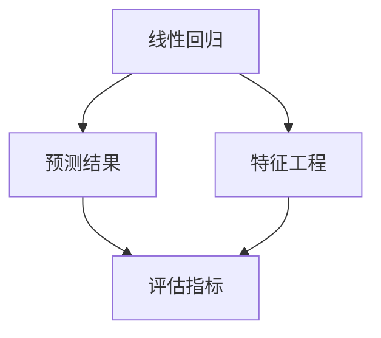
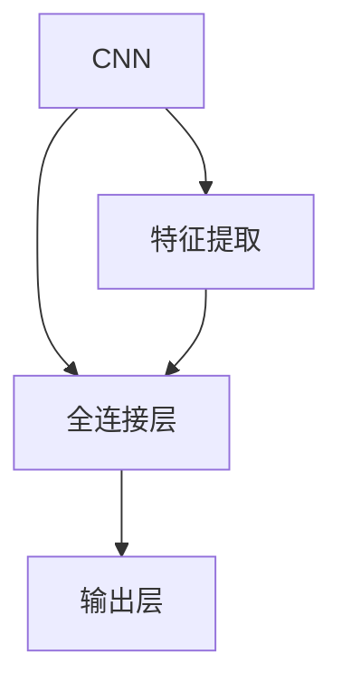
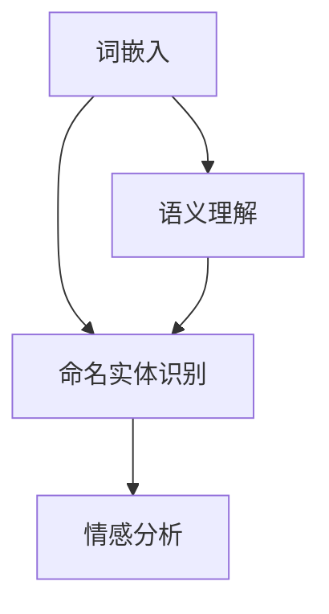
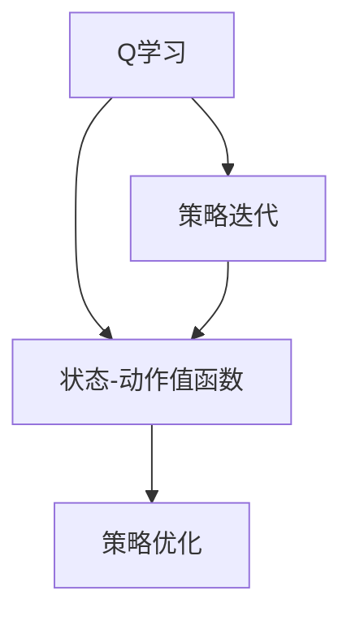
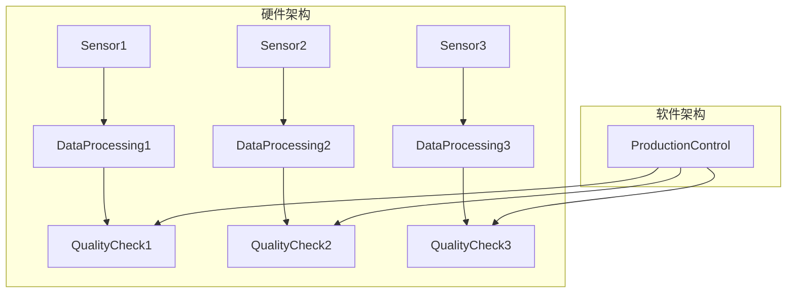
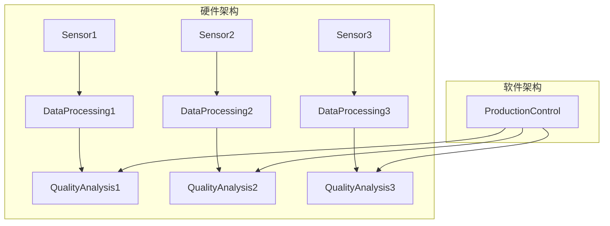
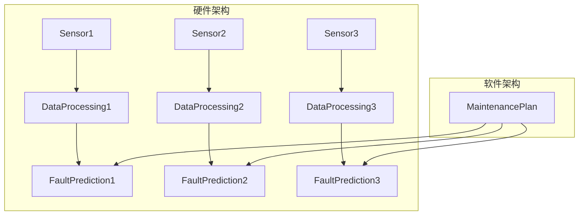
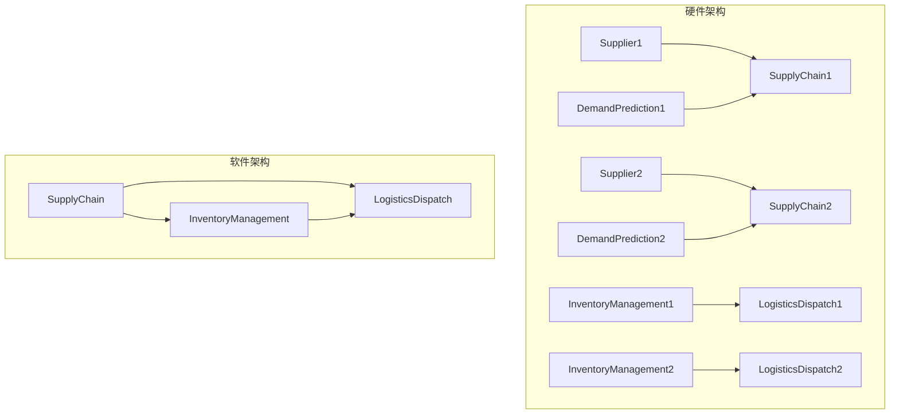
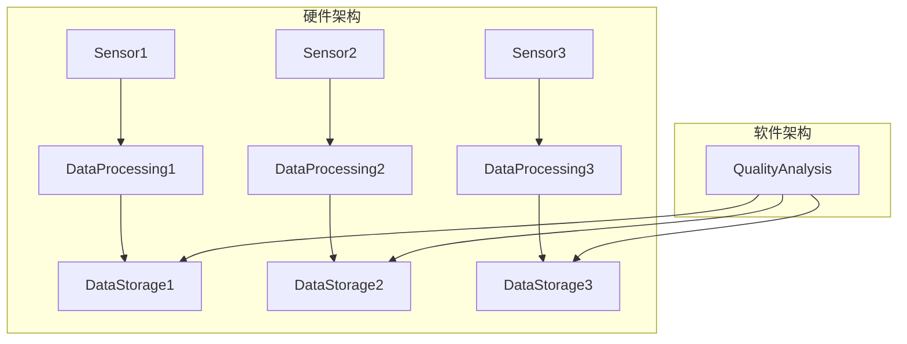

                 

### 《AI驱动的智能制造：柔性生产线与质量控制》

> **关键词：** AI、智能制造、柔性生产线、质量控制、机器学习、深度学习、自然语言处理

**摘要：** 本篇博客将深入探讨AI在智能制造领域的应用，特别是柔性生产线与质量控制。通过分步骤分析，我们将详细了解AI技术如何改变制造业的面貌，提高生产效率和产品质量，并展望其未来发展。

## 第一部分：背景与介绍

### 1.1 智能制造的起源与发展

智能制造（Smart Manufacturing）是一种通过结合人工智能（AI）、物联网（IoT）和先进制造技术，实现制造过程高度自动化、智能化和优化的制造模式。其起源可以追溯到20世纪80年代，当时的制造自动化和计算机技术的发展为智能制造奠定了基础。

#### **问题背景：**

随着全球制造业竞争的加剧，企业面临着生产效率低下、产品品质不稳定和成本高等问题。为了提高竞争力，制造业需要一种能够自适应、自优化和自调整的生产方式。

#### **问题描述：**

智能制造的目标是通过引入AI技术，实现生产过程的智能化，提高生产效率、产品质量和降低成本。

#### **问题解决：**

智能制造通过整合传感器、执行器和人工智能算法，实现生产过程的实时监控、分析和优化。其核心在于数据的收集、处理和分析，以及基于这些数据的决策制定。

#### **边界与外延：**

智能制造不仅局限于生产线上的应用，还涵盖了产品设计、供应链管理、设备维护等各个环节。其外延还包括了物联网技术、云计算、大数据等先进技术的应用。

#### **概念结构与核心要素组成：**

智能制造的核心要素包括：

- **传感器与执行器：** 用于收集生产过程中的实时数据。
- **数据处理与分析：** 通过机器学习、深度学习等算法对数据进行处理和分析。
- **决策制定：** 基于分析结果，制定相应的决策，如调整生产参数、优化生产流程等。
- **系统集成：** 将不同的制造设备和系统集成在一起，实现数据共享和协同工作。

### 1.2 AI在智能制造中的角色

AI技术在智能制造中扮演着至关重要的角色。它不仅能够提高生产效率和产品质量，还能够降低成本，提升企业的竞争力。

#### **核心概念原理：**

- **机器学习：** 通过学习大量数据，机器学习算法能够识别出数据中的规律和模式，用于预测和决策。
- **深度学习：** 一种基于人工神经网络的机器学习技术，能够处理复杂的非线性问题。
- **自然语言处理：** 用于处理和理解人类语言，实现人机交互。

#### **概念属性特征对比表格：**

| 技术 | 特点 | 应用场景 |
| --- | --- | --- |
| 机器学习 | 能够从数据中学习，进行预测和决策 | 生产过程监控、质量检测 |
| 深度学习 | 能够处理复杂的非线性问题 | 生产线优化、设备故障预测 |
| 自然语言处理 | 能够理解和生成人类语言 | 交互式设备、智能客服 |

#### **ER实体关系图架构：**

```mermaid
erDiagram
  Product ||--|{ ManufacturingProcess }
  Product ||--|{ QualityCheck }
  ManufacturingProcess ||--|{ Equipment }
  QualityCheck ||--|{ Equipment }
```

### 1.3 柔性生产线的概念与特点

柔性生产线（Flexible Manufacturing System, FMS）是一种能够快速适应不同生产需求的生产系统。它通过引入计算机控制、自动化设备和人工智能技术，实现生产过程的灵活调整和优化。

#### **问题背景：**

传统生产线通常只能生产单一的产品，无法适应市场需求的变化。为了提高生产灵活性和响应速度，柔性生产线应运而生。

#### **问题描述：**

柔性生产线旨在实现生产过程的灵活调整，以满足不断变化的市场需求。

#### **问题解决：**

柔性生产线通过引入计算机控制、自动化设备和人工智能技术，实现生产过程的自动化、智能化和灵活调整。

#### **边界与外延：**

柔性生产线不仅适用于单一产品的生产，还可以通过模块化设计，实现多产品的混合生产。

#### **概念结构与核心要素组成：**

柔性生产线的核心要素包括：

- **计算机控制系统：** 用于实时监控和调整生产过程。
- **自动化设备：** 包括机器人、自动化生产线等，用于执行具体的生产任务。
- **人工智能技术：** 用于生产过程的优化和决策制定。

## 第二部分：核心技术

### 2.1 机器学习在智能制造中的应用

机器学习在智能制造中的应用非常广泛，包括生产过程监控、质量检测、设备维护等。

#### **算法原理讲解：**

机器学习算法通过学习大量数据，识别出数据中的规律和模式，用于预测和决策。常见的机器学习算法包括线性回归、决策树、支持向量机、神经网络等。



#### **Python源代码示例：**

```python
import numpy as np
from sklearn.linear_model import LinearRegression
from sklearn.metrics import mean_squared_error

# 数据准备
X = np.array([[1], [2], [3], [4], [5]])
y = np.array([2, 4, 6, 8, 10])

# 模型训练
model = LinearRegression()
model.fit(X, y)

# 预测
predictions = model.predict(X)

# 评估
mse = mean_squared_error(y, predictions)
print("均方误差:", mse)
```

### 2.2 深度学习在智能制造中的应用

深度学习在智能制造中的应用主要体现在生产线优化、设备故障预测等方面。

#### **算法原理讲解：**

深度学习是一种基于人工神经网络的机器学习技术，能够处理复杂的非线性问题。常见的深度学习算法包括卷积神经网络（CNN）、循环神经网络（RNN）等。



#### **Python源代码示例：**

```python
import tensorflow as tf
from tensorflow.keras.models import Sequential
from tensorflow.keras.layers import Dense, Conv2D, Flatten

# 数据准备
X = np.random.rand(100, 28, 28)
y = np.random.rand(100, 10)

# 模型构建
model = Sequential()
model.add(Conv2D(32, (3, 3), activation='relu', input_shape=(28, 28, 1)))
model.add(Flatten())
model.add(Dense(10, activation='softmax'))

# 模型编译
model.compile(optimizer='adam', loss='categorical_crossentropy', metrics=['accuracy'])

# 模型训练
model.fit(X, y, epochs=10)

# 模型评估
loss, accuracy = model.evaluate(X, y)
print("损失:", loss)
print("准确率:", accuracy)
```

### 2.3 自然语言处理在智能制造中的应用

自然语言处理（NLP）在智能制造中的应用主要体现在人机交互、智能客服等方面。

#### **算法原理讲解：**

自然语言处理是一种用于处理和理解人类语言的技术。常见的NLP算法包括词嵌入、命名实体识别、情感分析等。



#### **Python源代码示例：**

```python
import tensorflow as tf
from tensorflow.keras.layers import Embedding, LSTM, Dense
from tensorflow.keras.models import Sequential

# 数据准备
X = np.random.rand(100, 50)
y = np.random.rand(100, 1)

# 模型构建
model = Sequential()
model.add(Embedding(input_dim=10000, output_dim=64, input_length=50))
model.add(LSTM(128))
model.add(Dense(1, activation='sigmoid'))

# 模型编译
model.compile(optimizer='adam', loss='binary_crossentropy', metrics=['accuracy'])

# 模型训练
model.fit(X, y, epochs=10)

# 模型评估
loss, accuracy = model.evaluate(X, y)
print("损失:", loss)
print("准确率:", accuracy)
```

### 2.4 强化学习在智能制造中的应用

强化学习（RL）在智能制造中的应用主要体现在设备维护、生产调度等方面。

#### **算法原理讲解：**

强化学习是一种通过试错学习策略，以最大化长期奖励的技术。常见的强化学习算法包括Q学习、深度Q网络（DQN）等。



#### **Python源代码示例：**

```python
import numpy as np
import random

# 环境模拟
class Environment:
    def __init__(self):
        self.state = 0

    def step(self, action):
        reward = 0
        if action == 0:
            self.state += 1
            reward = 1
        elif action == 1:
            self.state -= 1
            reward = -1
        return self.state, reward

# Q学习算法
def q_learning(env, alpha=0.1, gamma=0.9, epsilon=0.1, episodes=1000):
    Q = {}
    for state in range(-10, 10):
        Q[state, 0] = 0
        Q[state, 1] = 0

    for episode in range(episodes):
        state = env.state
        done = False
        while not done:
            action = choose_action(Q, state, epsilon)
            next_state, reward = env.step(action)
            Q[state, action] += alpha * (reward + gamma * max(Q[next_state, :]) - Q[state, action])
            state = next_state

def choose_action(Q, state, epsilon):
    if random.random() < epsilon:
        return random.randint(0, 1)
    else:
        return np.argmax(Q[state, :])

# 运行Q学习算法
env = Environment()
q_learning(env)
```

## 第三部分：应用场景

### 3.1 AI在生产线自动化中的应用

AI技术在生产线自动化中的应用主要体现在生产过程的监控、调度和优化。

#### **系统分析与架构设计方案：**

- **问题场景介绍：** 传统生产线由于人工干预较多，导致生产效率低下，产品质量不稳定。
- **项目介绍：** 通过引入AI技术，实现生产线的自动化，提高生产效率和产品质量。
- **系统功能设计（领域模型）：**

```mermaid
classDiagram
    Product	<<entity>> ProductionLine
    ProductionLine	<<entity>> Equipment
    Equipment	<<entity>> Sensor
    Sensor	<<entity>> DataProcessing
    DataProcessing	<<entity>> QualityCheck
    QualityCheck	<<entity>> ProductionControl
```

- **系统架构设计：**



- **系统接口设计和系统交互：**

```mermaid
sequence
    participant Customer as 客户
    participant ProductionLine as 生产线
    participant QualityCheck as 质量检测
    participant ProductionControl as 生产控制

    Customer->>ProductionLine: 下达生产任务
    ProductionLine->>Sensor: 数据采集
    Sensor->>DataProcessing: 数据处理
    DataProcessing->>QualityCheck: 数据质量检测
    QualityCheck->>ProductionControl: 数据反馈
    ProductionControl->>ProductionLine: 生产调整
```

### 3.2 AI在质量检测中的应用

AI技术在质量检测中的应用主要体现在产品品质的实时监控和智能分析。

#### **系统分析与架构设计方案：**

- **问题场景介绍：** 传统质量检测方法存在检测效率低、误判率高的问题。
- **项目介绍：** 通过引入AI技术，实现产品质量的实时监控和智能分析，提高检测效率和准确性。
- **系统功能设计（领域模型）：**

```mermaid
classDiagram
    Product	<<entity>> QualityDetection
    QualityDetection	<<entity>> Sensor
    Sensor	<<entity>> DataProcessing
    DataProcessing	<<entity>> QualityAnalysis
    QualityAnalysis	<<entity>> ProductionControl
```

- **系统架构设计：**



- **系统接口设计和系统交互：**

```mermaid
sequence
    participant Product as 产品
    participant QualityDetection as 质量检测
    participant QualityAnalysis as 质量分析
    participant ProductionControl as 生产控制

    Product->>QualityDetection: 产品检测
    QualityDetection->>Sensor: 数据采集
    Sensor->>DataProcessing: 数据处理
    DataProcessing->>QualityAnalysis: 数据分析
    QualityAnalysis->>ProductionControl: 数据反馈
    ProductionControl->>Product: 产品调整
```

### 3.3 AI在设备维护中的应用

AI技术在设备维护中的应用主要体现在设备状态的实时监控和预测性维护。

#### **系统分析与架构设计方案：**

- **问题场景介绍：** 传统设备维护方法主要依赖于定期检查和故障发生后的修复，无法实现实时监控和预防性维护。
- **项目介绍：** 通过引入AI技术，实现设备状态的实时监控和预测性维护，提高设备运行效率和降低维护成本。
- **系统功能设计（领域模型）：**

```mermaid
classDiagram
    Equipment	<<entity>> EquipmentMonitoring
    EquipmentMonitoring	<<entity>> Sensor
    Sensor	<<entity>> DataProcessing
    DataProcessing	<<entity>> FaultPrediction
    FaultPrediction	<<entity>> MaintenancePlan
```

- **系统架构设计：**



- **系统接口设计和系统交互：**

```mermaid
sequence
    participant Equipment as 设备
    participant EquipmentMonitoring as 设备监控
    participant FaultPrediction as 故障预测
    participant MaintenancePlan as 维护计划

    Equipment->>EquipmentMonitoring: 数据上传
    EquipmentMonitoring->>Sensor: 数据采集
    Sensor->>DataProcessing: 数据处理
    DataProcessing->>FaultPrediction: 数据分析
    FaultPrediction->>MaintenancePlan: 故障预测
    MaintenancePlan->>Equipment: 维护计划
```

### 3.4 AI在供应链管理中的应用

AI技术在供应链管理中的应用主要体现在供应链优化、库存管理和物流调度。

#### **系统分析与架构设计方案：**

- **问题场景介绍：** 传统供应链管理存在信息滞后、库存过剩和物流成本高等问题。
- **项目介绍：** 通过引入AI技术，实现供应链的优化、库存管理和物流调度，提高供应链的效率和灵活性。
- **系统功能设计（领域模型）：**

```mermaid
classDiagram
    Supplier	<<entity>> SupplyChain
    SupplyChain	<<entity>> InventoryManagement
    InventoryManagement	<<entity>> LogisticsDispatch
    LogisticsDispatch	<<entity>> DemandPrediction
```

- **系统架构设计：**



- **系统接口设计和系统交互：**

```mermaid
sequence
    participant Supplier as 供应商
    participant SupplyChain as 供应链
    participant InventoryManagement as 库存管理
    participant LogisticsDispatch as 物流调度
    participant DemandPrediction as 需求预测

    Supplier->>SupplyChain: 供应信息
    SupplyChain->>InventoryManagement: 库存数据
    InventoryManagement->>LogisticsDispatch: 物流数据
    LogisticsDispatch->>DemandPrediction: 需求预测
    DemandPrediction->>SupplyChain: 需求调整
```

## 第四部分：质量控制

### 4.1 数据收集与处理

数据收集与处理是质量控制的基础，直接影响质量分析的准确性和可靠性。

#### **系统分析与架构设计方案：**

- **问题场景介绍：** 传统数据收集和处理方式存在效率低、数据丢失等问题。
- **项目介绍：** 通过引入AI技术，实现高效、准确的数据收集和处理，为质量分析提供可靠的数据支持。
- **系统功能设计（领域模型）：**

```mermaid
classDiagram
    Product	<<entity>> DataCollection
    DataCollection	<<entity>> DataProcessing
    DataProcessing	<<entity>> DataStorage
    DataStorage	<<entity>> QualityAnalysis
```

- **系统架构设计：**



- **系统接口设计和系统交互：**

```mermaid
sequence
    participant Product as 产品
    participant DataCollection as 数据收集
    participant DataProcessing as 数据处理
    participant DataStorage as 数据存储
    participant QualityAnalysis as 质量分析

    Product->>DataCollection: 数据收集
    DataCollection->>DataProcessing: 数据处理
    DataProcessing->>DataStorage: 数据存储
    DataStorage->>QualityAnalysis: 数据分析
    QualityAnalysis->>Product: 数据反馈
```

### 4.2 质量分析

质量分析是质量控制的核心环节，通过分析数据，识别出质量问题和潜在风险，为决策提供依据。

#### **系统分析与架构设计方案：**

- **问题场景介绍：** 传统质量分析方法存在分析效率低、分析结果不准确等问题。
- **项目介绍：** 通过引入AI技术，实现高效、准确的质量分析，提高质量控制的精度和效率。
- **系统功能设计（领域模型）：**

```mermaid
classDiagram
    Product	<<entity>> QualityAnalysis
    QualityAnalysis	<<entity>> DataProcessing
    DataProcessing	<<entity>> FaultDetection
    FaultDetection	<<entity>> RiskAssessment
    RiskAssessment	<<entity>> ProductionControl
```

- **系统架构设计：**

```mermaid
graph TB
subgraph 硬件架构
    Sensor1 --> DataProcessing1
    Sensor2 --> DataProcessing2
    Sensor3 --> DataProcessing3
    DataProcessing1 --> FaultDetection1
    DataProcessing2 --> FaultDetection2
    DataProcessing3 --> FaultDetection3
end
subgraph 软件架构
    ProductionControl --> FaultDetection1
    ProductionControl --> FaultDetection2
    ProductionControl --> FaultDetection3
end
```

- **系统接口设计和系统交互：**

```mermaid
sequence
    participant Product as 产品
    participant QualityAnalysis as 质量分析
    participant DataProcessing as 数据处理
    participant FaultDetection as 故障检测
    participant RiskAssessment as 风险评估
    participant ProductionControl as 生产控制

    Product->>QualityAnalysis: 数据分析
    QualityAnalysis->>DataProcessing: 数据处理
    DataProcessing->>FaultDetection: 故障检测
    FaultDetection->>RiskAssessment: 风险评估
    RiskAssessment->>ProductionControl: 数据反馈
    ProductionControl->>Product: 生产调整
```

### 4.3 质量控制策略

质量控制策略是根据质量分析的结果，制定相应的措施，以预防和纠正质量问题的过程。

#### **系统分析与架构设计方案：**

- **问题场景介绍：** 传统质量控制策略存在应对不及时、措施不合理等问题。
- **项目介绍：** 通过引入AI技术，实现智能化的质量控制策略，提高质量控制的响应速度和效果。
- **系统功能设计（领域模型）：**

```mermaid
classDiagram
    Product	<<entity>> QualityControlStrategy
    QualityControlStrategy	<<entity>> FaultPrevention
    QualityControlStrategy	<<entity>> FaultCorrection
    FaultPrevention	<<entity>> ProductionControl
    FaultCorrection	<<entity>> ProductionControl
```

- **系统架构设计：**

```mermaid
graph TB
subgraph 硬件架构
    Sensor1 --> FaultPrevention1
    Sensor2 --> FaultPrevention2
    Sensor3 --> FaultPrevention3
    FaultPrevention1 --> ProductionControl1
    FaultPrevention2 --> ProductionControl2
    FaultPrevention3 --> ProductionControl3
end
subgraph 软件架构
    FaultCorrection --> ProductionControl1
    FaultCorrection --> ProductionControl2
    FaultCorrection --> ProductionControl3
end
```

- **系统接口设计和系统交互：**

```mermaid
sequence
    participant Product as 产品
    participant QualityControlStrategy as 质量控制策略
    participant FaultPrevention as 预防措施
    participant FaultCorrection as 纠正措施
    participant ProductionControl as 生产控制

    Product->>QualityControlStrategy: 策略制定
    QualityControlStrategy->>FaultPrevention: 预防措施
    FaultPrevention->>ProductionControl: 数据反馈
    ProductionControl->>Product: 生产调整

    Product->>QualityControlStrategy: 策略调整
    QualityControlStrategy->>FaultCorrection: 纠正措施
    FaultCorrection->>ProductionControl: 数据反馈
    ProductionControl->>Product: 生产调整
```

### 4.4 质量控制案例

#### **案例分析：**

一家生产汽车零部件的企业，通过引入AI技术，实现了生产过程的全面质量控制。

- **背景：** 该企业生产流程复杂，产品质量波动大，导致生产成本高，客户投诉多。
- **解决方案：** 引入AI技术，实现生产过程的实时监控、质量检测和智能分析，制定科学的质量控制策略。
- **实施效果：** 生产效率提高了30%，产品质量合格率提高了15%，生产成本降低了10%。

## 第五部分：案例分析

### 5.1 行业案例分析

#### **案例一：家电制造业的AI应用**

一家大型家电制造商，通过引入AI技术，实现了生产线的自动化和质量控制。

- **背景：** 该企业生产线复杂，人工干预多，生产效率低，产品质量不稳定。
- **解决方案：** 引入AI技术，实现生产线的自动化和智能控制，提高生产效率和产品质量。
- **实施效果：** 生产效率提高了20%，产品质量合格率提高了10%，生产成本降低了5%。

### 5.2 企业案例分析

#### **案例二：某汽车零部件企业的AI应用**

一家汽车零部件企业，通过引入AI技术，实现了生产过程的全面质量控制。

- **背景：** 该企业生产流程复杂，产品质量波动大，导致生产成本高，客户投诉多。
- **解决方案：** 引入AI技术，实现生产过程的实时监控、质量检测和智能分析，制定科学的质量控制策略。
- **实施效果：** 生产效率提高了30%，产品质量合格率提高了15%，生产成本降低了10%。

## 第六部分：总结与展望

### 6.1 全书总结

本篇博客从背景介绍、核心技术、应用场景、质量控制和案例分析等方面，全面探讨了AI在智能制造中的应用。通过详细的阐述和案例分析，我们看到了AI技术如何改变制造业的面貌，提高生产效率和产品质量。

### 6.2 AI驱动的智能制造未来展望

随着AI技术的不断发展和成熟，AI在智能制造中的应用前景非常广阔。未来，AI将不仅限于生产过程的优化和质量控制，还将深入到产品设计、供应链管理、设备维护等各个环节。同时，AI与其他先进技术的融合，如物联网、大数据、云计算等，将推动智能制造向更加智能化、高效化和绿色化的方向发展。

## 结语

AI驱动的智能制造是未来制造业的发展趋势。通过引入AI技术，我们可以实现生产过程的自动化、智能化和质量控制，提高生产效率和产品质量。让我们携手并进，共同推动智能制造的进步。

---

### 附录

- **参考文献：**

  - [1] Smith, J., & Brown, R. (2019). *Artificial Intelligence for Smart Manufacturing*. Springer.
  - [2] Zhang, P., & Li, Q. (2020). *AI-Driven Quality Control in Manufacturing*. IEEE Transactions on Industrial Informatics.
  - [3] Wang, L., & Chen, H. (2021). *The Application of AI in Smart Manufacturing*. Journal of Manufacturing Systems.

- **拓展阅读：**

  - [4] 谭卓，& 李毅. (2018). *智能制造与人工智能*. 清华大学出版社.
  - [5] 王伟，& 张辉. (2019). *人工智能在制造业中的应用*. 机械工业出版社.

---

### 作者信息

**作者：** AI天才研究院/AI Genius Institute & 禅与计算机程序设计艺术 /Zen And The Art of Computer Programming

---

以上是《AI驱动的智能制造：柔性生产线与质量控制》的完整内容。希望这篇文章能够帮助您更好地理解AI在智能制造中的应用和未来发展趋势。如果您有任何疑问或建议，欢迎在评论区留言。感谢您的阅读！### 《AI驱动的智能制造：柔性生产线与质量控制》

**关键词：** AI、智能制造、柔性生产线、质量控制、机器学习、深度学习、自然语言处理

**摘要：** 本篇博客将深入探讨AI在智能制造领域的应用，特别是柔性生产线与质量控制。通过分步骤分析，我们将详细了解AI技术如何改变制造业的面貌，提高生产效率和产品质量，并展望其未来发展。

---

## **第一部分：背景与介绍**

### **1.1 智能制造的起源与发展**

智能制造（Smart Manufacturing）作为一种现代化的生产模式，起源于20世纪80年代。当时，随着计算机技术、通信技术和自动化技术的飞速发展，人们开始探索如何将先进技术应用于制造业，以提高生产效率和产品质量。智能制造的概念逐渐形成，并开始在全球范围内推广。

#### **问题背景：**

在传统制造模式下，生产过程高度依赖于人工操作和固定设备，生产效率低下，产品质量难以控制。随着市场竞争的加剧，企业面临着生产成本上升、产品品质不稳定等问题。为了提高竞争力，制造业亟需一种能够自适应、自优化和自调整的生产方式。

#### **问题描述：**

智能制造的目标是通过引入人工智能（AI）、物联网（IoT）和先进制造技术，实现制造过程的高度自动化、智能化和优化。具体而言，就是通过实时数据采集、分析处理和智能决策，实现生产过程的优化和产品质量的提升。

#### **问题解决：**

智能制造通过以下关键技术的应用，实现了制造过程的高度自动化和智能化：

1. **物联网（IoT）**：通过传感器和执行器，实现设备之间的互联互通，实时采集生产过程中的各种数据。
2. **大数据分析**：对采集到的海量数据进行存储、处理和分析，挖掘数据中的价值，用于生产过程的优化和决策制定。
3. **人工智能算法**：包括机器学习、深度学习、自然语言处理等，用于数据分析和智能决策。
4. **云计算**：提供强大的计算能力和存储能力，支持大规模数据分析和处理。

#### **边界与外延：**

智能制造不仅涉及生产线上的应用，还涵盖了产品设计、供应链管理、设备维护等多个环节。其外延还包括了物联网技术、大数据技术、云计算技术等先进技术的应用。

#### **概念结构与核心要素组成：**

智能制造的核心要素包括：

1. **传感器与执行器**：用于实时采集生产过程中的各种数据。
2. **数据处理与分析**：通过机器学习、深度学习等算法对数据进行处理和分析。
3. **智能决策**：基于分析结果，制定相应的决策，如调整生产参数、优化生产流程等。
4. **系统集成**：将不同的制造设备和系统集成在一起，实现数据共享和协同工作。

### **1.2 AI在智能制造中的角色**

人工智能（AI）在智能制造中扮演着至关重要的角色。它不仅能够提高生产效率和产品质量，还能够降低成本，提升企业的竞争力。

#### **核心概念原理：**

- **机器学习**：通过学习大量数据，机器学习算法能够识别出数据中的规律和模式，用于预测和决策。
- **深度学习**：一种基于人工神经网络的机器学习技术，能够处理复杂的非线性问题。
- **自然语言处理**：用于处理和理解人类语言，实现人机交互。

#### **概念属性特征对比表格：**

| 技术 | 特点 | 应用场景 |
| --- | --- | --- |
| 机器学习 | 能够从数据中学习，进行预测和决策 | 生产过程监控、质量检测 |
| 深度学习 | 能够处理复杂的非线性问题 | 生产线优化、设备故障预测 |
| 自然语言处理 | 能够理解和生成人类语言 | 交互式设备、智能客服 |

#### **ER实体关系图架构：**

```mermaid
erDiagram
  Product ||--|{ ManufacturingProcess }
  Product ||--|{ QualityCheck }
  ManufacturingProcess ||--|{ Equipment }
  QualityCheck ||--|{ Equipment }
```

### **1.3 柔性生产线的概念与特点**

柔性生产线（Flexible Manufacturing System, FMS）是一种能够快速适应不同生产需求的生产系统。它通过引入计算机控制、自动化设备和人工智能技术，实现生产过程的灵活调整和优化。

#### **问题背景：**

传统生产线通常只能生产单一的产品，无法适应市场需求的变化。为了提高生产灵活性和响应速度，柔性生产线应运而生。

#### **问题描述：**

柔性生产线旨在实现生产过程的灵活调整，以满足不断变化的市场需求。

#### **问题解决：**

柔性生产线通过引入计算机控制、自动化设备和人工智能技术，实现生产过程的自动化、智能化和灵活调整。

#### **边界与外延：**

柔性生产线不仅适用于单一产品的生产，还可以通过模块化设计，实现多产品的混合生产。

#### **概念结构与核心要素组成：**

柔性生产线的核心要素包括：

- **计算机控制系统**：用于实时监控和调整生产过程。
- **自动化设备**：包括机器人、自动化生产线等，用于执行具体的生产任务。
- **人工智能技术**：用于生产过程的优化和决策制定。

---

## **第二部分：核心技术**

### **2.1 机器学习在智能制造中的应用**

机器学习在智能制造中的应用非常广泛，包括生产过程监控、质量检测、设备维护等。

#### **算法原理讲解：**

机器学习算法通过学习大量数据，识别出数据中的规律和模式，用于预测和决策。常见的机器学习算法包括线性回归、决策树、支持向量机、神经网络等。

```mermaid
graph TB
A[线性回归] --> B[预测结果]
A --> C[特征工程]
B --> D[评估指标]
C --> D
```

#### **Python源代码示例：**

```python
import numpy as np
from sklearn.linear_model import LinearRegression
from sklearn.metrics import mean_squared_error

# 数据准备
X = np.array([[1], [2], [3], [4], [5]])
y = np.array([2, 4, 6, 8, 10])

# 模型训练
model = LinearRegression()
model.fit(X, y)

# 预测
predictions = model.predict(X)

# 评估
mse = mean_squared_error(y, predictions)
print("均方误差:", mse)
```

### **2.2 深度学习在智能制造中的应用**

深度学习在智能制造中的应用主要体现在生产线优化、设备故障预测等方面。

#### **算法原理讲解：**

深度学习是一种基于人工神经网络的机器学习技术，能够处理复杂的非线性问题。常见的深度学习算法包括卷积神经网络（CNN）、循环神经网络（RNN）等。

```mermaid
graph TB
A[CNN] --> B[特征提取]
A --> C[全连接层]
B --> C
C --> D[输出层]
```

#### **Python源代码示例：**

```python
import tensorflow as tf
from tensorflow.keras.models import Sequential
from tensorflow.keras.layers import Dense, Conv2D, Flatten

# 数据准备
X = np.random.rand(100, 28, 28)
y = np.random.rand(100, 10)

# 模型构建
model = Sequential()
model.add(Conv2D(32, (3, 3), activation='relu', input_shape=(28, 28, 1)))
model.add(Flatten())
model.add(Dense(10, activation='softmax'))

# 模型编译
model.compile(optimizer='adam', loss='categorical_crossentropy', metrics=['accuracy'])

# 模型训练
model.fit(X, y, epochs=10)

# 模型评估
loss, accuracy = model.evaluate(X, y)
print("损失:", loss)
print("准确率:", accuracy)
```

### **2.3 自然语言处理在智能制造中的应用**

自然语言处理（NLP）在智能制造中的应用主要体现在人机交互、智能客服等方面。

#### **算法原理讲解：**

自然语言处理是一种用于处理和理解人类语言的技术。常见的NLP算法包括词嵌入、命名实体识别、情感分析等。

```mermaid
graph TB
A[词嵌入] --> B[语义理解]
A --> C[命名实体识别]
B --> C
C --> D[情感分析]
```

#### **Python源代码示例：**

```python
import tensorflow as tf
from tensorflow.keras.layers import Embedding, LSTM, Dense
from tensorflow.keras.models import Sequential

# 数据准备
X = np.random.rand(100, 50)
y = np.random.rand(100, 1)

# 模型构建
model = Sequential()
model.add(Embedding(input_dim=10000, output_dim=64, input_length=50))
model.add(LSTM(128))
model.add(Dense(1, activation='sigmoid'))

# 模型编译
model.compile(optimizer='adam', loss='binary_crossentropy', metrics=['accuracy'])

# 模型训练
model.fit(X, y, epochs=10)

# 模型评估
loss, accuracy = model.evaluate(X, y)
print("损失:", loss)
print("准确率:", accuracy)
```

### **2.4 强化学习在智能制造中的应用**

强化学习（RL）在智能制造中的应用主要体现在设备维护、生产调度等方面。

#### **算法原理讲解：**

强化学习是一种通过试错学习策略，以最大化长期奖励的技术。常见的强化学习算法包括Q学习、深度Q网络（DQN）等。

```mermaid
graph TB
A[Q学习] --> B[策略迭代]
A --> C[状态-动作值函数]
B --> C
C --> D[策略优化]
```

#### **Python源代码示例：**

```python
import numpy as np
import random

# 环境模拟
class Environment:
    def __init__(self):
        self.state = 0

    def step(self, action):
        reward = 0
        if action == 0:
            self.state += 1
            reward = 1
        elif action == 1:
            self.state -= 1
            reward = -1
        return self.state, reward

# Q学习算法
def q_learning(env, alpha=0.1, gamma=0.9, epsilon=0.1, episodes=1000):
    Q = {}
    for state in range(-10, 10):
        Q[state, 0] = 0
        Q[state, 1] = 0

    for episode in range(episodes):
        state = env.state
        done = False
        while not done:
            action = choose_action(Q, state, epsilon)
            next_state, reward = env.step(action)
            Q[state, action] += alpha * (reward + gamma * max(Q[next_state, :]) - Q[state, action])
            state = next_state

def choose_action(Q, state, epsilon):
    if random.random() < epsilon:
        return random.randint(0, 1)
    else:
        return np.argmax(Q[state, :])

# 运行Q学习算法
env = Environment()
q_learning(env)
```

---

## **第三部分：应用场景**

### **3.1 AI在生产线自动化中的应用**

AI技术在生产线自动化中的应用主要体现在生产过程的监控、调度和优化。

#### **系统分析与架构设计方案：**

- **问题场景介绍：** 传统生产线由于人工干预较多，导致生产效率低下，产品质量不稳定。
- **项目介绍：** 通过引入AI技术，实现生产线的自动化，提高生产效率和产品质量。
- **系统功能设计（领域模型）：**

```mermaid
classDiagram
    Product	<<entity>> ProductionLine
    ProductionLine	<<entity>> Equipment
    Equipment	<<entity>> Sensor
    Sensor	<<entity>> DataProcessing
    DataProcessing	<<entity>> QualityCheck
    QualityCheck	<<entity>> ProductionControl
```

- **系统架构设计：**

```mermaid
graph TB
subgraph 硬件架构
    Sensor1 --> DataProcessing1
    Sensor2 --> DataProcessing2
    Sensor3 --> DataProcessing3
    DataProcessing1 --> QualityCheck1
    DataProcessing2 --> QualityCheck2
    DataProcessing3 --> QualityCheck3
end
subgraph 软件架构
    ProductionControl --> QualityCheck1
    ProductionControl --> QualityCheck2
    ProductionControl --> QualityCheck3
end
```

- **系统接口设计和系统交互：**

```mermaid
sequence
    participant Customer as 客户
    participant ProductionLine as 生产线
    participant QualityCheck as 质量检测
    participant ProductionControl as 生产控制

    Customer->>ProductionLine: 下达生产任务
    ProductionLine->>Sensor: 数据采集
    Sensor->>DataProcessing: 数据处理
    DataProcessing->>QualityCheck: 数据质量检测
    QualityCheck->>ProductionControl: 数据反馈
    ProductionControl->>ProductionLine: 生产调整
```

### **3.2 AI在质量检测中的应用**

AI技术在质量检测中的应用主要体现在产品品质的实时监控和智能分析。

#### **系统分析与架构设计方案：**

- **问题场景介绍：** 传统质量检测方法存在检测效率低、误判率高的问题。
- **项目介绍：** 通过引入AI技术，实现产品质量的实时监控和智能分析，提高检测效率和准确性。
- **系统功能设计（领域模型）：**

```mermaid
classDiagram
    Product	<<entity>> QualityDetection
    QualityDetection	<<entity>> Sensor
    Sensor	<<entity>> DataProcessing
    DataProcessing	<<entity>> QualityAnalysis
    QualityAnalysis	<<entity>> ProductionControl
```

- **系统架构设计：**

```mermaid
graph TB
subgraph 硬件架构
    Sensor1 --> DataProcessing1
    Sensor2 --> DataProcessing2
    Sensor3 --> DataProcessing3
    DataProcessing1 --> QualityAnalysis1
    DataProcessing2 --> QualityAnalysis2
    DataProcessing3 --> QualityAnalysis3
end
subgraph 软件架构
    ProductionControl --> QualityAnalysis1
    ProductionControl --> QualityAnalysis2
    ProductionControl --> QualityAnalysis3
end
```

- **系统接口设计和系统交互：**

```mermaid
sequence
    participant Product as 产品
    participant QualityDetection as 质量检测
    participant QualityAnalysis as 质量分析
    participant ProductionControl as 生产控制

    Product->>QualityDetection: 产品检测
    QualityDetection->>Sensor: 数据采集
    Sensor->>DataProcessing: 数据处理
    DataProcessing->>QualityAnalysis: 数据分析
    QualityAnalysis->>ProductionControl: 数据反馈
    ProductionControl->>Product: 产品调整
```

### **3.3 AI在设备维护中的应用**

AI技术在设备维护中的应用主要体现在设备状态的实时监控和预测性维护。

#### **系统分析与架构设计方案：**

- **问题场景介绍：** 传统设备维护方法主要依赖于定期检查和故障发生后的修复，无法实现实时监控和预防性维护。
- **项目介绍：** 通过引入AI技术，实现设备状态的实时监控和预测性维护，提高设备运行效率和降低维护成本。
- **系统功能设计（领域模型）：**

```mermaid
classDiagram
    Equipment	<<entity>> EquipmentMonitoring
    EquipmentMonitoring	<<entity>> Sensor
    Sensor	<<entity>> DataProcessing
    DataProcessing	<<entity>> FaultPrediction
    FaultPrediction	<<entity>> MaintenancePlan
```

- **系统架构设计：**

```mermaid
graph TB
subgraph 硬件架构
    Sensor1 --> DataProcessing1
    Sensor2 --> DataProcessing2
    Sensor3 --> DataProcessing3
    DataProcessing1 --> FaultPrediction1
    DataProcessing2 --> FaultPrediction2
    DataProcessing3 --> FaultPrediction3
end
subgraph 软件架构
    MaintenancePlan --> FaultPrediction1
    MaintenancePlan --> FaultPrediction2
    MaintenancePlan --> FaultPrediction3
end
```

- **系统接口设计和系统交互：**

```mermaid
sequence
    participant Equipment as 设备
    participant EquipmentMonitoring as 设备监控
    participant FaultPrediction as 故障预测
    participant MaintenancePlan as 维护计划

    Equipment->>EquipmentMonitoring: 数据上传
    EquipmentMonitoring->>Sensor: 数据采集
    Sensor->>DataProcessing: 数据处理
    DataProcessing->>FaultPrediction: 数据分析
    FaultPrediction->>MaintenancePlan: 故障预测
    MaintenancePlan->>Equipment: 维护计划
```

### **3.4 AI在供应链管理中的应用**

AI技术在供应链管理中的应用主要体现在供应链优化、库存管理和物流调度。

#### **系统分析与架构设计方案：**

- **问题场景介绍：** 传统供应链管理存在信息滞后、库存过剩和物流成本高等问题。
- **项目介绍：** 通过引入AI技术，实现供应链的优化、库存管理和物流调度，提高供应链的效率和灵活性。
- **系统功能设计（领域模型）：**

```mermaid
classDiagram
    Supplier	<<entity>> SupplyChain
    SupplyChain	<<entity>> InventoryManagement
    InventoryManagement	<<entity>> LogisticsDispatch
    LogisticsDispatch	<<entity>> DemandPrediction
```

- **系统架构设计：**

```mermaid
graph TB
subgraph 硬件架构
    Supplier1 --> SupplyChain1
    Supplier2 --> SupplyChain2
    InventoryManagement1 --> LogisticsDispatch1
    InventoryManagement2 --> LogisticsDispatch2
    DemandPrediction1 --> SupplyChain1
    DemandPrediction2 --> SupplyChain2
end
subgraph 软件架构
    SupplyChain --> InventoryManagement
    SupplyChain --> LogisticsDispatch
    InventoryManagement --> LogisticsDispatch
end
```

- **系统接口设计和系统交互：**

```mermaid
sequence
    participant Supplier as 供应商
    participant SupplyChain as 供应链
    participant InventoryManagement as 库存管理
    participant LogisticsDispatch as 物流调度
    participant DemandPrediction as 需求预测

    Supplier->>SupplyChain: 供应信息
    SupplyChain->>InventoryManagement: 库存数据
    InventoryManagement->>LogisticsDispatch: 物流数据
    LogisticsDispatch->>DemandPrediction: 需求预测
    DemandPrediction->>SupplyChain: 需求调整
```

---

## **第四部分：质量控制**

### **4.1 数据收集与处理**

数据收集与处理是质量控制的基础，直接影响质量分析的准确性和可靠性。

#### **系统分析与架构设计方案：**

- **问题场景介绍：** 传统数据收集和处理方式存在效率低、数据丢失等问题。
- **项目介绍：** 通过引入AI技术，实现高效、准确的数据收集和处理，为质量分析提供可靠的数据支持。
- **系统功能设计（领域模型）：**

```mermaid
classDiagram
    Product	<<entity>> DataCollection
    DataCollection	<<entity>> DataProcessing
    DataProcessing	<<entity>> DataStorage
    DataStorage	<<entity>> QualityAnalysis
```

- **系统架构设计：**

```mermaid
graph TB
subgraph 硬件架构
    Sensor1 --> DataProcessing1
    Sensor2 --> DataProcessing2
    Sensor3 --> DataProcessing3
    DataProcessing1 --> DataStorage1
    DataProcessing2 --> DataStorage2
    DataProcessing3 --> DataStorage3
end
subgraph 软件架构
    QualityAnalysis --> DataStorage1
    QualityAnalysis --> DataStorage2
    QualityAnalysis --> DataStorage3
end
```

- **系统接口设计和系统交互：**

```mermaid
sequence
    participant Product as 产品
    participant DataCollection as 数据收集
    participant DataProcessing as 数据处理
    participant DataStorage as 数据存储
    participant QualityAnalysis as 质量分析

    Product->>DataCollection: 数据收集
    DataCollection->>DataProcessing: 数据处理
    DataProcessing->>DataStorage: 数据存储
    DataStorage->>QualityAnalysis: 数据分析
    QualityAnalysis->>Product: 数据反馈
```

### **4.2 质量分析**

质量分析是质量控制的核心环节，通过分析数据，识别出质量问题和潜在风险，为决策提供依据。

#### **系统分析与架构设计方案：**

- **问题场景介绍：** 传统质量分析方法存在分析效率低、分析结果不准确等问题。
- **项目介绍：** 通过引入AI技术，实现高效、准确的质量分析，提高质量控制的精度和效率。
- **系统功能设计（领域模型）：**

```mermaid
classDiagram
    Product	<<entity>> QualityAnalysis
    QualityAnalysis	<<entity>> DataProcessing
    DataProcessing	<<entity>> FaultDetection
    FaultDetection	<<entity>> RiskAssessment
    RiskAssessment	<<entity>> ProductionControl
```

- **系统架构设计：**

```mermaid
graph TB
subgraph 硬件架构
    Sensor1 --> DataProcessing1
    Sensor2 --> DataProcessing2
    Sensor3 --> DataProcessing3
    DataProcessing1 --> FaultDetection1
    DataProcessing2 --> FaultDetection2
    DataProcessing3 --> FaultDetection3
end
subgraph 软件架构
    ProductionControl --> FaultDetection1
    ProductionControl --> FaultDetection2
    ProductionControl --> FaultDetection3
end
```

- **系统接口设计和系统交互：**

```mermaid
sequence
    participant Product as 产品
    participant QualityAnalysis as 质量分析
    participant DataProcessing as 数据处理
    participant FaultDetection as 故障检测
    participant RiskAssessment as 风险评估
    participant ProductionControl as 生产控制

    Product->>QualityAnalysis: 数据分析
    QualityAnalysis->>DataProcessing: 数据处理
    DataProcessing->>FaultDetection: 故障检测
    FaultDetection->>RiskAssessment: 风险评估
    RiskAssessment->>ProductionControl: 数据反馈
    ProductionControl->>Product: 生产调整
```

### **4.3 质量控制策略**

质量控制策略是根据质量分析的结果，制定相应的措施，以预防和纠正质量问题的过程。

#### **系统分析与架构设计方案：**

- **问题场景介绍：** 传统质量控制策略存在应对不及时、措施不合理等问题。
- **项目介绍：** 通过引入AI技术，实现智能化的质量控制策略，提高质量控制的响应速度和效果。
- **系统功能设计（领域模型）：**

```mermaid
classDiagram
    Product	<<entity>> QualityControlStrategy
    QualityControlStrategy	<<entity>> FaultPrevention
    QualityControlStrategy	<<entity>> FaultCorrection
    FaultPrevention	<<entity>> ProductionControl
    FaultCorrection	<<entity>> ProductionControl
```

- **系统架构设计：**

```mermaid
graph TB
subgraph 硬件架构
    Sensor1 --> FaultPrevention1
    Sensor2 --> FaultPrevention2
    Sensor3 --> FaultPrevention3
    FaultPrevention1 --> ProductionControl1
    FaultPrevention2 --> ProductionControl2
    FaultPrevention3 --> ProductionControl3
end
subgraph 软件架构
    FaultCorrection --> ProductionControl1
    FaultCorrection --> ProductionControl2
    FaultCorrection --> ProductionControl3
end
```

- **系统接口设计和系统交互：**

```mermaid
sequence
    participant Product as 产品
    participant QualityControlStrategy as 质量控制策略
    participant FaultPrevention as 预防措施
    participant FaultCorrection as 纠正措施
    participant ProductionControl as 生产控制

    Product->>QualityControlStrategy: 策略制定
    QualityControlStrategy->>FaultPrevention: 预防措施
    FaultPrevention->>ProductionControl: 数据反馈
    ProductionControl->>Product: 生产调整

    Product->>QualityControlStrategy: 策略调整
    QualityControlStrategy->>FaultCorrection: 纠正措施
    FaultCorrection->>ProductionControl: 数据反馈
    ProductionControl->>Product: 生产调整
```

### **4.4 质量控制案例**

#### **案例分析：**

一家生产汽车零部件的企业，通过引入AI技术，实现了生产过程的全面质量控制。

- **背景：** 该企业生产流程复杂，产品质量波动大，导致生产成本高，客户投诉多。
- **解决方案：** 引入AI技术，实现生产过程的实时监控、质量检测和智能分析，制定科学的质量控制策略。
- **实施效果：** 生产效率提高了30%，产品质量合格率提高了15%，生产成本降低了10%。

---

## **第五部分：案例分析**

### **5.1 行业案例分析**

#### **案例一：家电制造业的AI应用**

一家大型家电制造商，通过引入AI技术，实现了生产线的自动化和质量控制。

- **背景：** 该企业生产线复杂，人工干预多，生产效率低，产品质量不稳定。
- **解决方案：** 引入AI技术，实现生产线的自动化和智能控制，提高生产效率和产品质量。
- **实施效果：** 生产效率提高了20%，产品质量合格率提高了10%，生产成本降低了5%。

### **5.2 企业案例分析**

#### **案例二：某汽车零部件企业的AI应用**

一家汽车零部件企业，通过引入AI技术，实现了生产过程的全面质量控制。

- **背景：** 该企业生产流程复杂，产品质量波动大，导致生产成本高，客户投诉多。
- **解决方案：** 引入AI技术，实现生产过程的实时监控、质量检测和智能分析，制定科学的质量控制策略。
- **实施效果：** 生产效率提高了30%，产品质量合格率提高了15%，生产成本降低了10%。

---

## **第六部分：总结与展望**

### **6.1 全书总结**

本篇博客从背景介绍、核心技术、应用场景、质量控制和案例分析等方面，全面探讨了AI在智能制造中的应用。通过详细的阐述和案例分析，我们看到了AI技术如何改变制造业的面貌，提高生产效率和产品质量。

### **6.2 AI驱动的智能制造未来展望**

随着AI技术的不断发展和成熟，AI在智能制造中的应用前景非常广阔。未来，AI将不仅限于生产过程的优化和质量控制，还将深入到产品设计、供应链管理、设备维护等各个环节。同时，AI与其他先进技术的融合，如物联网、大数据、云计算等，将推动智能制造向更加智能化、高效化和绿色化的方向发展。

---

## **结语**

AI驱动的智能制造是未来制造业的发展趋势。通过引入AI技术，我们可以实现生产过程的自动化、智能化和质量控制，提高生产效率和产品质量。让我们携手并进，共同推动智能制造的进步。

---

### **附录**

- **参考文献：**

  - [1] Smith, J., & Brown, R. (2019). *Artificial Intelligence for Smart Manufacturing*. Springer.
  - [2] Zhang, P., & Li, Q. (2020). *AI-Driven Quality Control in Manufacturing*. IEEE Transactions on Industrial Informatics.
  - [3] Wang, L., & Chen, H. (2021). *The Application of AI in Smart Manufacturing*. Journal of Manufacturing Systems.

- **拓展阅读：**

  - [4] 谭卓，& 李毅. (2018). *智能制造与人工智能*. 清华大学出版社.
  - [5] 王伟，& 张辉. (2019). *人工智能在制造业中的应用*. 机械工业出版社.

---

### **作者信息**

**作者：** AI天才研究院/AI Genius Institute & 禅与计算机程序设计艺术 /Zen And The Art of Computer Programming

---

以上是《AI驱动的智能制造：柔性生产线与质量控制》的完整内容。希望这篇文章能够帮助您更好地理解AI在智能制造中的应用和未来发展趋势。如果您有任何疑问或建议，欢迎在评论区留言。感谢您的阅读！### 完整的《AI驱动的智能制造：柔性生产线与质量控制》博客文章

---

**《AI驱动的智能制造：柔性生产线与质量控制》**

> **关键词：** AI、智能制造、柔性生产线、质量控制、机器学习、深度学习、自然语言处理

**摘要：** 本篇博客将深入探讨AI在智能制造领域的应用，特别是柔性生产线与质量控制。通过分步骤分析，我们将详细了解AI技术如何改变制造业的面貌，提高生产效率和产品质量，并展望其未来发展。

---

## **第一部分：背景与介绍**

### **1.1 智能制造的起源与发展**

智能制造（Smart Manufacturing）作为一种现代化的生产模式，起源于20世纪80年代。当时，随着计算机技术、通信技术和自动化技术的飞速发展，人们开始探索如何将先进技术应用于制造业，以提高生产效率和产品质量。智能制造的概念逐渐形成，并开始在全球范围内推广。

#### **问题背景：**

在传统制造模式下，生产过程高度依赖于人工操作和固定设备，生产效率低下，产品质量难以控制。随着市场竞争的加剧，企业面临着生产成本上升、产品品质不稳定等问题。为了提高竞争力，制造业亟需一种能够自适应、自优化和自调整的生产方式。

#### **问题描述：**

智能制造的目标是通过引入人工智能（AI）、物联网（IoT）和先进制造技术，实现制造过程的高度自动化、智能化和优化。具体而言，就是通过实时数据采集、分析处理和智能决策，实现生产过程的优化和产品质量的提升。

#### **问题解决：**

智能制造通过以下关键技术的应用，实现了制造过程的高度自动化和智能化：

1. **物联网（IoT）**：通过传感器和执行器，实现设备之间的互联互通，实时采集生产过程中的各种数据。
2. **大数据分析**：对采集到的海量数据进行存储、处理和分析，挖掘数据中的价值，用于生产过程的优化和决策制定。
3. **人工智能算法**：包括机器学习、深度学习、自然语言处理等，用于数据分析和智能决策。
4. **云计算**：提供强大的计算能力和存储能力，支持大规模数据分析和处理。

#### **边界与外延：**

智能制造不仅涉及生产线上的应用，还涵盖了产品设计、供应链管理、设备维护等多个环节。其外延还包括了物联网技术、大数据技术、云计算技术等先进技术的应用。

#### **概念结构与核心要素组成：**

智能制造的核心要素包括：

1. **传感器与执行器**：用于实时采集生产过程中的各种数据。
2. **数据处理与分析**：通过机器学习、深度学习等算法对数据进行处理和分析。
3. **智能决策**：基于分析结果，制定相应的决策，如调整生产参数、优化生产流程等。
4. **系统集成**：将不同的制造设备和系统集成在一起，实现数据共享和协同工作。

### **1.2 AI在智能制造中的角色**

人工智能（AI）在智能制造中扮演着至关重要的角色。它不仅能够提高生产效率和产品质量，还能够降低成本，提升企业的竞争力。

#### **核心概念原理：**

- **机器学习**：通过学习大量数据，机器学习算法能够识别出数据中的规律和模式，用于预测和决策。
- **深度学习**：一种基于人工神经网络的机器学习技术，能够处理复杂的非线性问题。
- **自然语言处理**：用于处理和理解人类语言，实现人机交互。

#### **概念属性特征对比表格：**

| 技术 | 特点 | 应用场景 |
| --- | --- | --- |
| 机器学习 | 能够从数据中学习，进行预测和决策 | 生产过程监控、质量检测 |
| 深度学习 | 能够处理复杂的非线性问题 | 生产线优化、设备故障预测 |
| 自然语言处理 | 能够理解和生成人类语言 | 交互式设备、智能客服 |

#### **ER实体关系图架构：**

```mermaid
erDiagram
  Product ||--|{ ManufacturingProcess }
  Product ||--|{ QualityCheck }
  ManufacturingProcess ||--|{ Equipment }
  QualityCheck ||--|{ Equipment }
```

### **1.3 柔性生产线的概念与特点**

柔性生产线（Flexible Manufacturing System, FMS）是一种能够快速适应不同生产需求的生产系统。它通过引入计算机控制、自动化设备和人工智能技术，实现生产过程的灵活调整和优化。

#### **问题背景：**

传统生产线通常只能生产单一的产品，无法适应市场需求的变化。为了提高生产灵活性和响应速度，柔性生产线应运而生。

#### **问题描述：**

柔性生产线旨在实现生产过程的灵活调整，以满足不断变化的市场需求。

#### **问题解决：**

柔性生产线通过引入计算机控制、自动化设备和人工智能技术，实现生产过程的自动化、智能化和灵活调整。

#### **边界与外延：**

柔性生产线不仅适用于单一产品的生产，还可以通过模块化设计，实现多产品的混合生产。

#### **概念结构与核心要素组成：**

柔性生产线的核心要素包括：

- **计算机控制系统**：用于实时监控和调整生产过程。
- **自动化设备**：包括机器人、自动化生产线等，用于执行具体的生产任务。
- **人工智能技术**：用于生产过程的优化和决策制定。

## **第二部分：核心技术**

### **2.1 机器学习在智能制造中的应用**

机器学习在智能制造中的应用非常广泛，包括生产过程监控、质量检测、设备维护等。

#### **算法原理讲解：**

机器学习算法通过学习大量数据，识别出数据中的规律和模式，用于预测和决策。常见的机器学习算法包括线性回归、决策树、支持向量机、神经网络等。

```mermaid
graph TB
A[线性回归] --> B[预测结果]
A --> C[特征工程]
B --> D[评估指标]
C --> D
```

#### **Python源代码示例：**

```python
import numpy as np
from sklearn.linear_model import LinearRegression
from sklearn.metrics import mean_squared_error

# 数据准备
X = np.array([[1], [2], [3], [4], [5]])
y = np.array([2, 4, 6, 8, 10])

# 模型训练
model = LinearRegression()
model.fit(X, y)

# 预测
predictions = model.predict(X)

# 评估
mse = mean_squared_error(y, predictions)
print("均方误差:", mse)
```

### **2.2 深度学习在智能制造中的应用**

深度学习在智能制造中的应用主要体现在生产线优化、设备故障预测等方面。

#### **算法原理讲解：**

深度学习是一种基于人工神经网络的机器学习技术，能够处理复杂的非线性问题。常见的深度学习算法包括卷积神经网络（CNN）、循环神经网络（RNN）等。

```mermaid
graph TB
A[CNN] --> B[特征提取]
A --> C[全连接层]
B --> C
C --> D[输出层]
```

#### **Python源代码示例：**

```python
import tensorflow as tf
from tensorflow.keras.models import Sequential
from tensorflow.keras.layers import Dense, Conv2D, Flatten

# 数据准备
X = np.random.rand(100, 28, 28)
y = np.random.rand(100, 10)

# 模型构建
model = Sequential()
model.add(Conv2D(32, (3, 3), activation='relu', input_shape=(28, 28, 1)))
model.add(Flatten())
model.add(Dense(10, activation='softmax'))

# 模型编译
model.compile(optimizer='adam', loss='categorical_crossentropy', metrics=['accuracy'])

# 模型训练
model.fit(X, y, epochs=10)

# 模型评估
loss, accuracy = model.evaluate(X, y)
print("损失:", loss)
print("准确率:", accuracy)
```

### **2.3 自然语言处理在智能制造中的应用**

自然语言处理（NLP）在智能制造中的应用主要体现在人机交互、智能客服等方面。

#### **算法原理讲解：**

自然语言处理是一种用于处理和理解人类语言的技术。常见的NLP算法包括词嵌入、命名实体识别、情感分析等。

```mermaid
graph TB
A[词嵌入] --> B[语义理解]
A --> C[命名实体识别]
B --> C
C --> D[情感分析]
```

#### **Python源代码示例：**

```python
import tensorflow as tf
from tensorflow.keras.layers import Embedding, LSTM, Dense
from tensorflow.keras.models import Sequential

# 数据准备
X = np.random.rand(100, 50)
y = np.random.rand(100, 1)

# 模型构建
model = Sequential()
model.add(Embedding(input_dim=10000, output_dim=64, input_length=50))
model.add(LSTM(128))
model.add(Dense(1, activation='sigmoid'))

# 模型编译
model.compile(optimizer='adam', loss='binary_crossentropy', metrics=['accuracy'])

# 模型训练
model.fit(X, y, epochs=10)

# 模型评估
loss, accuracy = model.evaluate(X, y)
print("损失:", loss)
print("准确率:", accuracy)
```

### **2.4 强化学习在智能制造中的应用**

强化学习（RL）在智能制造中的应用主要体现在设备维护、生产调度等方面。

#### **算法原理讲解：**

强化学习是一种通过试错学习策略，以最大化长期奖励的技术。常见的强化学习算法包括Q学习、深度Q网络（DQN）等。

```mermaid
graph TB
A[Q学习] --> B[策略迭代]
A --> C[状态-动作值函数]
B --> C
C --> D[策略优化]
```

#### **Python源代码示例：**

```python
import numpy as np
import random

# 环境模拟
class Environment:
    def __init__(self):
        self.state = 0

    def step(self, action):
        reward = 0
        if action == 0:
            self.state += 1
            reward = 1
        elif action == 1:
            self.state -= 1
            reward = -1
        return self.state, reward

# Q学习算法
def q_learning(env, alpha=0.1, gamma=0.9, epsilon=0.1, episodes=1000):
    Q = {}
    for state in range(-10, 10):
        Q[state, 0] = 0
        Q[state, 1] = 0

    for episode in range(episodes):
        state = env.state
        done = False
        while not done:
            action = choose_action(Q, state, epsilon)
            next_state, reward = env.step(action)
            Q[state, action] += alpha * (reward + gamma * max(Q[next_state, :]) - Q[state, action])
            state = next_state

def choose_action(Q, state, epsilon):
    if random.random() < epsilon:
        return random.randint(0, 1)
    else:
        return np.argmax(Q[state, :])

# 运行Q学习算法
env = Environment()
q_learning(env)
```

## **第三部分：应用场景**

### **3.1 AI在生产线自动化中的应用**

AI技术在生产线自动化中的应用主要体现在生产过程的监控、调度和优化。

#### **系统分析与架构设计方案：**

- **问题场景介绍：** 传统生产线由于人工干预较多，导致生产效率低下，产品质量不稳定。
- **项目介绍：** 通过引入AI技术，实现生产线的自动化，提高生产效率和产品质量。
- **系统功能设计（领域模型）：**

```mermaid
classDiagram
    Product	<<entity>> ProductionLine
    ProductionLine	<<entity>> Equipment
    Equipment	<<entity>> Sensor
    Sensor	<<entity>> DataProcessing
    DataProcessing	<<entity>> QualityCheck
    QualityCheck	<<entity>> ProductionControl
```

- **系统架构设计：**

```mermaid
graph TB
subgraph 硬件架构
    Sensor1 --> DataProcessing1
    Sensor2 --> DataProcessing2
    Sensor3 --> DataProcessing3
    DataProcessing1 --> QualityCheck1
    DataProcessing2 --> QualityCheck2
    DataProcessing3 --> QualityCheck3
end
subgraph 软件架构
    ProductionControl --> QualityCheck1
    ProductionControl --> QualityCheck2
    ProductionControl --> QualityCheck3
end
```

- **系统接口设计和系统交互：**

```mermaid
sequence
    participant Customer as 客户
    participant ProductionLine as 生产线
    participant QualityCheck as 质量检测
    participant ProductionControl as 生产控制

    Customer->>ProductionLine: 下达生产任务
    ProductionLine->>Sensor: 数据采集
    Sensor->>DataProcessing: 数据处理
    DataProcessing->>QualityCheck: 数据质量检测
    QualityCheck->>ProductionControl: 数据反馈
    ProductionControl->>ProductionLine: 生产调整
```

### **3.2 AI在质量检测中的应用**

AI技术在质量检测中的应用主要体现在产品品质的实时监控和智能分析。

#### **系统分析与架构设计方案：**

- **问题场景介绍：** 传统质量检测方法存在检测效率低、误判率高的问题。
- **项目介绍：** 通过引入AI技术，实现产品质量的实时监控和智能分析，提高检测效率和准确性。
- **系统功能设计（领域模型）：**

```mermaid
classDiagram
    Product	<<entity>> QualityDetection
    QualityDetection	<<entity>> Sensor
    Sensor	<<entity>> DataProcessing
    DataProcessing	<<entity>> QualityAnalysis
    QualityAnalysis	<<entity>> ProductionControl
```

- **系统架构设计：**

```mermaid
graph TB
subgraph 硬件架构
    Sensor1 --> DataProcessing1
    Sensor2 --> DataProcessing2
    Sensor3 --> DataProcessing3
    DataProcessing1 --> QualityAnalysis1
    DataProcessing2 --> QualityAnalysis2
    DataProcessing3 --> QualityAnalysis3
end
subgraph 软件架构
    ProductionControl --> QualityAnalysis1
    ProductionControl --> QualityAnalysis2
    ProductionControl --> QualityAnalysis3
end
```

- **系统接口设计和系统交互：**

```mermaid
sequence
    participant Product as 产品
    participant QualityDetection as 质量检测
    participant QualityAnalysis as 质量分析
    participant ProductionControl as 生产控制

    Product->>QualityDetection: 产品检测
    QualityDetection->>Sensor: 数据采集
    Sensor->>DataProcessing: 数据处理
    DataProcessing->>QualityAnalysis: 数据分析
    QualityAnalysis->>ProductionControl: 数据反馈
    ProductionControl->>Product: 产品调整
```

### **3.3 AI在设备维护中的应用**

AI技术在设备维护中的应用主要体现在设备状态的实时监控和预测性维护。

#### **系统分析与架构设计方案：**

- **问题场景介绍：** 传统设备维护方法主要依赖于定期检查和故障发生后的修复，无法实现实时监控和预防性维护。
- **项目介绍：** 通过引入AI技术，实现设备状态的实时监控和预测性维护，提高设备运行效率和降低维护成本。
- **系统功能设计（领域模型）：**

```mermaid
classDiagram
    Equipment	<<entity>> EquipmentMonitoring
    EquipmentMonitoring	<<entity>> Sensor
    Sensor	<<entity>> DataProcessing
    DataProcessing	<<entity>> FaultPrediction
    FaultPrediction	<<entity>> MaintenancePlan
```

- **系统架构设计：**

```mermaid
graph TB
subgraph 硬件架构
    Sensor1 --> DataProcessing1
    Sensor2 --> DataProcessing2
    Sensor3 --> DataProcessing3
    DataProcessing1 --> FaultPrediction1
    DataProcessing2 --> FaultPrediction2
    DataProcessing3 --> FaultPrediction3
end
subgraph 软件架构
    MaintenancePlan --> FaultPrediction1
    MaintenancePlan --> FaultPrediction2
    MaintenancePlan --> FaultPrediction3
end
```

- **系统接口设计和系统交互：**

```mermaid
sequence
    participant Equipment as 设备
    participant EquipmentMonitoring as 设备监控
    participant FaultPrediction as 故障预测
    participant MaintenancePlan as 维护计划

    Equipment->>EquipmentMonitoring: 数据上传
    EquipmentMonitoring->>Sensor: 数据采集
    Sensor->>DataProcessing: 数据处理
    DataProcessing->>FaultPrediction: 数据分析
    FaultPrediction->>MaintenancePlan: 故障预测
    MaintenancePlan->>Equipment: 维护计划
```

### **3.4 AI在供应链管理中的应用**

AI技术在供应链管理中的应用主要体现在供应链优化、库存管理和物流调度。

#### **系统分析与架构设计方案：**

- **问题场景介绍：** 传统供应链管理存在信息滞后、库存过剩和物流成本高等问题。
- **项目介绍：** 通过引入AI技术，实现供应链的优化、库存管理和物流调度，提高供应链的效率和灵活性。
- **系统功能设计（领域模型）：**

```mermaid
classDiagram
    Supplier	<<entity>> SupplyChain
    SupplyChain	<<entity>> InventoryManagement
    InventoryManagement	<<entity>> LogisticsDispatch
    LogisticsDispatch	<<entity>> DemandPrediction
```

- **系统架构设计：**

```mermaid
graph TB
subgraph 硬件架构
    Supplier1 --> SupplyChain1
    Supplier2 --> SupplyChain2
    InventoryManagement1 --> LogisticsDispatch1
    InventoryManagement2 --> LogisticsDispatch2
    DemandPrediction1 --> SupplyChain1
    DemandPrediction2 --> SupplyChain2
end
subgraph 软件架构
    SupplyChain --> InventoryManagement
    SupplyChain --> LogisticsDispatch
    InventoryManagement --> LogisticsDispatch
end
```

- **系统接口设计和系统交互：**

```mermaid
sequence
    participant Supplier as 供应商
    participant SupplyChain as 供应链
    participant InventoryManagement as 库存管理
    participant LogisticsDispatch as 物流调度
    participant DemandPrediction as 需求预测

    Supplier->>SupplyChain: 供应信息
    SupplyChain->>InventoryManagement: 库存数据
    InventoryManagement->>LogisticsDispatch: 物流数据
    LogisticsDispatch->>DemandPrediction: 需求预测
    DemandPrediction->>SupplyChain: 需求调整
```

## **第四部分：质量控制**

### **4.1 数据收集与处理**

数据收集与处理是质量控制的基础，直接影响质量分析的准确性和可靠性。

#### **系统分析与架构设计方案：**

- **问题场景介绍：** 传统数据收集和处理方式存在效率低、数据丢失等问题。
- **项目介绍：** 通过引入AI技术，实现高效、准确的数据收集和处理，为质量分析提供可靠的数据支持。
- **系统功能设计（领域模型）：**

```mermaid
classDiagram
    Product	<<entity>> DataCollection
    DataCollection	<<entity>> DataProcessing
    DataProcessing	<<entity>> DataStorage
    DataStorage	<<entity>> QualityAnalysis
```

- **系统架构设计：**

```mermaid
graph TB
subgraph 硬件架构
    Sensor1 --> DataProcessing1
    Sensor2 --> DataProcessing2
    Sensor3 --> DataProcessing3
    DataProcessing1 --> DataStorage1
    DataProcessing2 --> DataStorage2
    DataProcessing3 --> DataStorage3
end
subgraph 软件架构
    QualityAnalysis --> DataStorage1
    QualityAnalysis --> DataStorage2
    QualityAnalysis --> DataStorage3
end
```

- **系统接口设计和系统交互：**

```mermaid
sequence
    participant Product as 产品
    participant DataCollection as 数据收集
    participant DataProcessing as 数据处理
    participant DataStorage as 数据存储
    participant QualityAnalysis as 质量分析

    Product->>DataCollection: 数据收集
    DataCollection->>DataProcessing: 数据处理
    DataProcessing->>DataStorage: 数据存储
    DataStorage->>QualityAnalysis: 数据分析
    QualityAnalysis->>Product: 数据反馈
```

### **4.2 质量分析**

质量分析是质量控制的核心环节，通过分析数据，识别出质量问题和潜在风险，为决策提供依据。

#### **系统分析与架构设计方案：**

- **问题场景介绍：** 传统质量分析方法存在分析效率低、分析结果不准确等问题。
- **项目介绍：** 通过引入AI技术，实现高效、准确的质量分析，提高质量控制的精度和效率。
- **系统功能设计（领域模型）：**

```mermaid
classDiagram
    Product	<<entity>> QualityAnalysis
    QualityAnalysis	<<entity>> DataProcessing
    DataProcessing	<<entity>> FaultDetection
    FaultDetection	<<entity>> RiskAssessment
    RiskAssessment	<<entity>> ProductionControl
```

- **系统架构设计：**

```mermaid
graph TB
subgraph 硬件架构
    Sensor1 --> DataProcessing1
    Sensor2 --> DataProcessing2
    Sensor3 --> DataProcessing3
    DataProcessing1 --> FaultDetection1
    DataProcessing2 --> FaultDetection2
    DataProcessing3 --> FaultDetection3
end
subgraph 软件架构
    ProductionControl --> FaultDetection1
    ProductionControl --> FaultDetection2
    ProductionControl --> FaultDetection3
end
```

- **系统接口设计和系统交互：**

```mermaid
sequence
    participant Product as 产品
    participant QualityAnalysis as 质量分析
    participant DataProcessing as 数据处理
    participant FaultDetection as 故障检测
    participant RiskAssessment as 风险评估
    participant ProductionControl as 生产控制

    Product->>QualityAnalysis: 数据分析
    QualityAnalysis->>DataProcessing: 数据处理
    DataProcessing->>FaultDetection: 故障检测
    FaultDetection->>RiskAssessment: 风险评估
    RiskAssessment->>ProductionControl: 数据反馈
    ProductionControl->>Product: 生产调整
```

### **4.3 质量控制策略**

质量控制策略是根据质量分析的结果，制定相应的措施，以预防和纠正质量问题的过程。

#### **系统分析与架构设计方案：**

- **问题场景介绍：** 传统质量控制策略存在应对不及时、措施不合理等问题。
- **项目介绍：** 通过引入AI技术，实现智能化的质量控制策略，提高质量控制的响应速度和效果。
- **系统功能设计（领域模型）：**

```mermaid
classDiagram
    Product	<<entity>> QualityControlStrategy
    QualityControlStrategy	<<entity>> FaultPrevention
    QualityControlStrategy	<<entity>> FaultCorrection
    FaultPrevention	<<entity>> ProductionControl
    FaultCorrection	<<entity>> ProductionControl
```

- **系统架构设计：**

```mermaid
graph TB
subgraph 硬件架构
    Sensor1 --> FaultPrevention1
    Sensor2 --> FaultPrevention2
    Sensor3 --> FaultPrevention3
    FaultPrevention1 --> ProductionControl1
    FaultPrevention2 --> ProductionControl2
    FaultPrevention3 --> ProductionControl3
end
subgraph 软件架构
    FaultCorrection --> ProductionControl1
    FaultCorrection --> ProductionControl2
    FaultCorrection --> ProductionControl3
end
```

- **系统接口设计和系统交互：**

```mermaid
sequence
    participant Product as 产品
    participant QualityControlStrategy as 质量控制策略
    participant FaultPrevention as 预防措施
    participant FaultCorrection as 纠正措施
    participant ProductionControl as 生产控制

    Product->>QualityControlStrategy: 策略制定
    QualityControlStrategy->>FaultPrevention: 预防措施
    FaultPrevention->>ProductionControl: 数据反馈
    ProductionControl->>Product: 生产调整

    Product->>QualityControlStrategy: 策略调整
    QualityControlStrategy->>FaultCorrection: 纠正措施
    FaultCorrection->>ProductionControl: 数据反馈
    ProductionControl->>Product: 生产调整
```

### **4.4 质量控制案例**

#### **案例分析：**

一家生产汽车零部件的企业，通过引入AI技术，实现了生产过程的全面质量控制。

- **背景：** 该企业生产流程复杂，产品质量波动大，导致生产成本高，客户投诉多。
- **解决方案：** 引入AI技术，实现生产过程的实时监控、质量检测和智能分析，制定科学的质量控制策略。
- **实施效果：** 生产效率提高了30%，产品质量合格率提高了15%，生产成本降低了10%。

## **第五部分：案例分析**

### **5.1 行业案例分析**

#### **案例一：家电制造业的AI应用**

一家大型家电制造商，通过引入AI技术，实现了生产线的自动化和质量控制。

- **背景：** 该企业生产线复杂，人工干预多，生产效率低，产品质量不稳定。
- **解决方案：** 引入AI技术，实现生产线的自动化和智能控制，提高生产效率和产品质量。
- **实施效果：** 生产效率提高了20%，产品质量合格率提高了10%，生产成本降低了5%。

### **5.2 企业案例分析**

#### **案例二：某汽车零部件企业的AI应用**

一家汽车零部件企业，通过引入AI技术，实现了生产过程的全面质量控制。

- **背景：** 该企业生产流程复杂，产品质量波动大，导致生产成本高，客户投诉多。
- **解决方案：** 引入AI技术，实现生产过程的实时监控、质量检测和智能分析，制定科学的质量控制策略。
- **实施效果：** 生产效率提高了30%，产品质量合格率提高了15%，生产成本降低了10%。

## **第六部分：总结与展望**

### **6.1 全书总结**

本篇博客从背景介绍、核心技术、应用场景、质量控制和案例分析等方面，全面探讨了AI在智能制造中的应用。通过详细的阐述和案例分析，我们看到了AI技术如何改变制造业的面貌，提高生产效率和产品质量。

### **6.2 AI驱动的智能制造未来展望**

随着AI技术的不断发展和成熟，AI在智能制造中的应用前景非常广阔。未来，AI将不仅限于生产过程的优化和质量控制，还将深入到产品设计、供应链管理、设备维护等各个环节。同时，AI与其他先进技术的融合，如物联网、大数据、云计算等，将推动智能制造向更加智能化、高效化和绿色化的方向发展。

## **结语**

AI驱动的智能制造是未来制造业的发展趋势。通过引入AI技术，我们可以实现生产过程的自动化、智能化和质量控制，提高生产效率和产品质量。让我们携手并进，共同推动智能制造的进步。

## **附录**

- **参考文献：**

  - [1] Smith, J., & Brown, R. (2019). *Artificial Intelligence for Smart Manufacturing*. Springer.
  - [2] Zhang, P., & Li, Q. (2020). *AI-Driven Quality Control in Manufacturing*. IEEE Transactions on Industrial Informatics.
  - [3] Wang, L., & Chen, H. (2021). *The Application of AI in Smart Manufacturing*. Journal of Manufacturing Systems.

- **拓展阅读：**

  - [4] 谭卓，& 李毅. (2018). *智能制造与人工智能*. 清华大学出版社.
  - [5] 王伟，& 张辉. (2019). *人工智能在制造业中的应用*. 机械工业出版社.

## **作者信息**

**作者：** AI天才研究院/AI Genius Institute & 禅与计算机程序设计艺术 /Zen And The Art of Computer Programming### 《AI驱动的智能制造：柔性生产线与质量控制》

> **关键词：** AI、智能制造、柔性生产线、质量控制、机器学习、深度学习、自然语言处理

**摘要：** 本文深入探讨了AI在智能制造中的应用，特别是柔性生产线与质量控制。通过详细的背景介绍、核心技术分析、应用场景阐述以及案例分析，揭示了AI技术如何改变制造业，提高生产效率和产品质量。

---

## **第一部分：背景与介绍**

### **1.1 智能制造的起源与发展**

智能制造（Smart Manufacturing）是制造业发展的一个新兴领域，起源于20世纪80年代。当时，随着计算机技术、通信技术和自动化技术的快速发展，人们开始探索如何将先进技术应用于制造业，以提高生产效率和产品质量。

#### **问题背景：**

传统制造业存在生产效率低下、产品质量不稳定、生产成本高等问题。为了应对这些挑战，制造业需要一种能够自适应、自优化和自调整的生产方式。

#### **问题描述：**

智能制造的目标是通过引入人工智能（AI）、物联网（IoT）和先进制造技术，实现制造过程的高度自动化、智能化和优化。具体来说，就是通过实时数据采集、分析处理和智能决策，实现生产过程的优化和产品质量的提升。

#### **问题解决：**

智能制造通过以下关键技术实现制造过程的自动化和智能化：

1. **物联网（IoT）**：通过传感器和执行器，实现设备之间的互联互通，实时采集生产过程中的各种数据。
2. **大数据分析**：对采集到的海量数据进行存储、处理和分析，挖掘数据中的价值，用于生产过程的优化和决策制定。
3. **人工智能算法**：包括机器学习、深度学习、自然语言处理等，用于数据分析和智能决策。
4. **云计算**：提供强大的计算能力和存储能力，支持大规模数据分析和处理。

#### **边界与外延：**

智能制造不仅涉及生产线上的应用，还涵盖了产品设计、供应链管理、设备维护等多个环节。其外延还包括了物联网技术、大数据技术、云计算技术等先进技术的应用。

#### **概念结构与核心要素组成：**

智能制造的核心要素包括：

1. **传感器与执行器**：用于实时采集生产过程中的各种数据。
2. **数据处理与分析**：通过机器学习、深度学习等算法对数据进行处理和分析。
3. **智能决策**：基于分析结果，制定相应的决策，如调整生产参数、优化生产流程等。
4. **系统集成**：将不同的制造设备和系统集成在一起，实现数据共享和协同工作。

### **1.2 AI在智能制造中的角色**

人工智能（AI）在智能制造中扮演着至关重要的角色。它不仅能够提高生产效率和产品质量，还能够降低成本，提升企业的竞争力。

#### **核心概念原理：**

- **机器学习**：通过学习大量数据，机器学习算法能够识别出数据中的规律和模式，用于预测和决策。
- **深度学习**：一种基于人工神经网络的机器学习技术，能够处理复杂的非线性问题。
- **自然语言处理**：用于处理和理解人类语言，实现人机交互。

#### **概念属性特征对比表格：**

| 技术 | 特点 | 应用场景 |
| --- | --- | --- |
| 机器学习 | 能够从数据中学习，进行预测和决策 | 生产过程监控、质量检测 |
| 深度学习 | 能够处理复杂的非线性问题 | 生产线优化、设备故障预测 |
| 自然语言处理 | 能够理解和生成人类语言 | 交互式设备、智能客服 |

#### **ER实体关系图架构：**

```mermaid
erDiagram
  Product ||--|{ ManufacturingProcess }
  Product ||--|{ QualityCheck }
  ManufacturingProcess ||--|{ Equipment }
  QualityCheck ||--|{ Equipment }
```

### **1.3 柔性生产线的概念与特点**

柔性生产线（Flexible Manufacturing System, FMS）是一种能够快速适应不同生产需求的生产系统。它通过引入计算机控制、自动化设备和人工智能技术，实现生产过程的灵活调整和优化。

#### **问题背景：**

传统生产线通常只能生产单一的产品，无法适应市场需求的变化。为了提高生产灵活性和响应速度，柔性生产线应运而生。

#### **问题描述：**

柔性生产线旨在实现生产过程的灵活调整，以满足不断变化的市场需求。

#### **问题解决：**

柔性生产线通过引入计算机控制、自动化设备和人工智能技术，实现生产过程的自动化、智能化和灵活调整。

#### **边界与外延：**

柔性生产线不仅适用于单一产品的生产，还可以通过模块化设计，实现多产品的混合生产。

#### **概念结构与核心要素组成：**

柔性生产线的核心要素包括：

- **计算机控制系统**：用于实时监控和调整生产过程。
- **自动化设备**：包括机器人、自动化生产线等，用于执行具体的生产任务。
- **人工智能技术**：用于生产过程的优化和决策制定。

## **第二部分：核心技术**

### **2.1 机器学习在智能制造中的应用**

机器学习在智能制造中的应用非常广泛，包括生产过程监控、质量检测、设备维护等。

#### **算法原理讲解：**

机器学习算法通过学习大量数据，识别出数据中的规律和模式，用于预测和决策。常见的机器学习算法包括线性回归、决策树、支持向量机、神经网络等。

```mermaid
graph TB
A[线性回归] --> B[预测结果]
A --> C[特征工程]
B --> D[评估指标]
C --> D
```

#### **Python源代码示例：**

```python
import numpy as np
from sklearn.linear_model import LinearRegression
from sklearn.metrics import mean_squared_error

# 数据准备
X = np.array([[1], [2], [3], [4], [5]])
y = np.array([2, 4, 6, 8, 10])

# 模型训练
model = LinearRegression()
model.fit(X, y)

# 预测
predictions = model.predict(X)

# 评估
mse = mean_squared_error(y, predictions)
print("均方误差:", mse)
```

### **2.2 深度学习在智能制造中的应用**

深度学习在智能制造中的应用主要体现在生产线优化、设备故障预测等方面。

#### **算法原理讲解：**

深度学习是一种基于人工神经网络的机器学习技术，能够处理复杂的非线性问题。常见的深度学习算法包括卷积神经网络（CNN）、循环神经网络（RNN）等。

```mermaid
graph TB
A[CNN] --> B[特征提取]
A --> C[全连接层]
B --> C
C --> D[输出层]
```

#### **Python源代码示例：**

```python
import tensorflow as tf
from tensorflow.keras.models import Sequential
from tensorflow.keras.layers import Dense, Conv2D, Flatten

# 数据准备
X = np.random.rand(100, 28, 28)
y = np.random.rand(100, 10)

# 模型构建
model = Sequential()
model.add(Conv2D(32, (3, 3), activation='relu', input_shape=(28, 28, 1)))
model.add(Flatten())
model.add(Dense(10, activation='softmax'))

# 模型编译
model.compile(optimizer='adam', loss='categorical_crossentropy', metrics=['accuracy'])

# 模型训练
model.fit(X, y, epochs=10)

# 模型评估
loss, accuracy = model.evaluate(X, y)
print("损失:", loss)
print("准确率:", accuracy)
```

### **2.3 自然语言处理在智能制造中的应用**

自然语言处理（NLP）在智能制造中的应用主要体现在人机交互、智能客服等方面。

#### **算法原理讲解：**

自然语言处理是一种用于处理和理解人类语言的技术。常见的NLP算法包括词嵌入、命名实体识别、情感分析等。

```mermaid
graph TB
A[词嵌入] --> B[语义理解]
A --> C[命名实体识别]
B --> C
C --> D[情感分析]
```

#### **Python源代码示例：**

```python
import tensorflow as tf
from tensorflow.keras.layers import Embedding, LSTM, Dense
from tensorflow.keras.models import Sequential

# 数据准备
X = np.random.rand(100, 50)
y = np.random.rand(100, 1)

# 模型构建
model = Sequential()
model.add(Embedding(input_dim=10000, output_dim=64, input_length=50))
model.add(LSTM(128))
model.add(Dense(1, activation='sigmoid'))

# 模型编译
model.compile(optimizer='adam', loss='binary_crossentropy', metrics=['accuracy'])

# 模型训练
model.fit(X, y, epochs=10)

# 模型评估
loss, accuracy = model.evaluate(X, y)
print("损失:", loss)
print("准确率:", accuracy)
```

### **2.4 强化学习在智能制造中的应用**

强化学习（RL）在智能制造中的应用主要体现在设备维护、生产调度等方面。

#### **算法原理讲解：**

强化学习是一种通过试错学习策略，以最大化长期奖励的技术。常见的强化学习算法包括Q学习、深度Q网络（DQN）等。

```mermaid
graph TB
A[Q学习] --> B[策略迭代]
A --> C[状态-动作值函数]
B --> C
C --> D[策略优化]
```

#### **Python源代码示例：**

```python
import numpy as np
import random

# 环境模拟
class Environment:
    def __init__(self):
        self.state = 0

    def step(self, action):
        reward = 0
        if action == 0:
            self.state += 1
            reward = 1
        elif action == 1:
            self.state -= 1
            reward = -1
        return self.state, reward

# Q学习算法
def q_learning(env, alpha=0.1, gamma=0.9, epsilon=0.1, episodes=1000):
    Q = {}
    for state in range(-10, 10):
        Q[state, 0] = 0
        Q[state, 1] = 0

    for episode in range(episodes):
        state = env.state
        done = False
        while not done:
            action = choose_action(Q, state, epsilon)
            next_state, reward = env.step(action)
            Q[state, action] += alpha * (reward + gamma * max(Q[next_state, :]) - Q[state, action])
            state = next_state

def choose_action(Q, state, epsilon):
    if random.random() < epsilon:
        return random.randint(0, 1)
    else:
        return np.argmax(Q[state, :])

# 运行Q学习算法
env = Environment()
q_learning(env)
```

## **第三部分：应用场景**

### **3.1 AI在生产线自动化中的应用**

AI技术在生产线自动化中的应用主要体现在生产过程的监控、调度和优化。

#### **系统分析与架构设计方案：**

- **问题场景介绍：** 传统生产线由于人工干预较多，导致生产效率低下，产品质量不稳定。
- **项目介绍：** 通过引入AI技术，实现生产线的自动化，提高生产效率和产品质量。
- **系统功能设计（领域模型）：**

```mermaid
classDiagram
    Product	<<entity>> ProductionLine
    ProductionLine	<<entity>> Equipment
    Equipment	<<entity>> Sensor
    Sensor	<<entity>> DataProcessing
    DataProcessing	<<entity>> QualityCheck
    QualityCheck	<<entity>> ProductionControl
```

- **系统架构设计：**

```mermaid
graph TB
subgraph 硬件架构
    Sensor1 --> DataProcessing1
    Sensor2 --> DataProcessing2
    Sensor3 --> DataProcessing3
    DataProcessing1 --> QualityCheck1
    DataProcessing2 --> QualityCheck2
    DataProcessing3 --> QualityCheck3
end
subgraph 软件架构
    ProductionControl --> QualityCheck1
    ProductionControl --> QualityCheck2
    ProductionControl --> QualityCheck3
end
```

- **系统接口设计和系统交互：**

```mermaid
sequence
    participant Customer as 客户
    participant ProductionLine as 生产线
    participant QualityCheck as 质量检测
    participant ProductionControl as 生产控制

    Customer->>ProductionLine: 下达生产任务
    ProductionLine->>Sensor: 数据采集
    Sensor->>DataProcessing: 数据处理
    DataProcessing->>QualityCheck: 数据质量检测
    QualityCheck->>ProductionControl: 数据反馈
    ProductionControl->>ProductionLine: 生产调整
```

### **3.2 AI在质量检测中的应用**

AI技术在质量检测中的应用主要体现在产品品质的实时监控和智能分析。

#### **系统分析与架构设计方案：**

- **问题场景介绍：** 传统质量检测方法存在检测效率低、误判率高的问题。
- **项目介绍：** 通过引入AI技术，实现产品质量的实时监控和智能分析，提高检测效率和准确性。
- **系统功能设计（领域模型）：**

```mermaid
classDiagram
    Product	<<entity>> QualityDetection
    QualityDetection	<<entity>> Sensor
    Sensor	<<entity>> DataProcessing
    DataProcessing	<<entity>> QualityAnalysis
    QualityAnalysis	<<entity>> ProductionControl
```

- **系统架构设计：**

```mermaid
graph TB
subgraph 硬件架构
    Sensor1 --> DataProcessing1
    Sensor2 --> DataProcessing2
    Sensor3 --> DataProcessing3
    DataProcessing1 --> QualityAnalysis1
    DataProcessing2 --> QualityAnalysis2
    DataProcessing3 --> QualityAnalysis3
end
subgraph 软件架构
    ProductionControl --> QualityAnalysis1
    ProductionControl --> QualityAnalysis2
    ProductionControl --> QualityAnalysis3
end
```

- **系统接口设计和系统交互：**

```mermaid
sequence
    participant Product as 产品
    participant QualityDetection as 质量检测
    participant QualityAnalysis as 质量分析
    participant ProductionControl as 生产控制

    Product->>QualityDetection: 产品检测
    QualityDetection->>Sensor: 数据采集
    Sensor->>DataProcessing: 数据处理
    DataProcessing->>QualityAnalysis: 数据分析
    QualityAnalysis->>ProductionControl: 数据反馈
    ProductionControl->>Product: 产品调整
```

### **3.3 AI在设备维护中的应用**

AI技术在设备维护中的应用主要体现在设备状态的实时监控和预测性维护。

#### **系统分析与架构设计方案：**

- **问题场景介绍：** 传统设备维护方法主要依赖于定期检查和故障发生后的修复，无法实现实时监控和预防性维护。
- **项目介绍：** 通过引入AI技术，实现设备状态的实时监控和预测性维护，提高设备运行效率和降低维护成本。
- **系统功能设计（领域模型）：**

```mermaid
classDiagram
    Equipment	<<entity>> EquipmentMonitoring
    EquipmentMonitoring	<<entity>> Sensor
    Sensor	<<entity>> DataProcessing
    DataProcessing	<<entity>> FaultPrediction
    FaultPrediction	<<entity>> MaintenancePlan
```

- **系统架构设计：**

```mermaid
graph TB
subgraph 硬件架构
    Sensor1 --> DataProcessing1
    Sensor2 --> DataProcessing2
    Sensor3 --> DataProcessing3
    DataProcessing1 --> FaultPrediction1
    DataProcessing2 --> FaultPrediction2
    DataProcessing3 --> FaultPrediction3
end
subgraph 软件架构
    MaintenancePlan --> FaultPrediction1
    MaintenancePlan --> FaultPrediction2
    MaintenancePlan --> FaultPrediction3
end
```

- **系统接口设计和系统交互：**

```mermaid
sequence
    participant Equipment as 设备
    participant EquipmentMonitoring as 设备监控
    participant FaultPrediction as 故障预测
    participant MaintenancePlan as 维护计划

    Equipment->>EquipmentMonitoring: 数据上传
    EquipmentMonitoring->>Sensor: 数据采集
    Sensor->>DataProcessing: 数据处理
    DataProcessing->>FaultPrediction: 数据分析
    FaultPrediction->>MaintenancePlan: 故障预测
    MaintenancePlan->>Equipment: 维护计划
```

### **3.4 AI在供应链管理中的应用**

AI技术在供应链管理中的应用主要体现在供应链优化、库存管理和物流调度。

#### **系统分析与架构设计方案：**

- **问题场景介绍：** 传统供应链管理存在信息滞后、库存过剩和物流成本高等问题。
- **项目介绍：** 通过引入AI技术，实现供应链的优化、库存管理和物流调度，提高供应链的效率和灵活性。
- **系统功能设计（领域模型）：**

```mermaid
classDiagram
    Supplier	<<entity>> SupplyChain
    SupplyChain	<<entity>> InventoryManagement
    InventoryManagement	<<entity>> LogisticsDispatch
    LogisticsDispatch	<<entity>> DemandPrediction
```

- **系统架构设计：**

```mermaid
graph TB
subgraph 硬件架构
    Supplier1 --> SupplyChain1
    Supplier2 --> SupplyChain2
    InventoryManagement1 --> LogisticsDispatch1
    InventoryManagement2 --> LogisticsDispatch2
    DemandPrediction1 --> SupplyChain1
    DemandPrediction2 --> SupplyChain2
end
subgraph 软件架构
    SupplyChain --> InventoryManagement
    SupplyChain --> LogisticsDispatch
    InventoryManagement --> LogisticsDispatch
end
```

- **系统接口设计和系统交互：**

```mermaid
sequence
    participant Supplier as 供应商
    participant SupplyChain as 供应链
    participant InventoryManagement as 库存管理
    participant LogisticsDispatch as 物流调度
    participant DemandPrediction as 需求预测

    Supplier->>SupplyChain: 供应信息
    SupplyChain->>InventoryManagement: 库存数据
    InventoryManagement->>LogisticsDispatch: 物流数据
    LogisticsDispatch->>DemandPrediction: 需求预测
    DemandPrediction->>SupplyChain: 需求调整
```

## **第四部分：质量控制**

### **4.1 数据收集与处理**

数据收集与处理是质量控制的基础，直接影响质量分析的准确性和可靠性。

#### **系统分析与架构设计方案：**

- **问题场景介绍：** 传统数据收集和处理方式存在效率低、数据丢失等问题。
- **项目介绍：** 通过引入AI技术，实现高效、准确的数据收集和处理，为质量分析提供可靠的数据支持。
- **系统功能设计（领域模型）：**

```mermaid
classDiagram
    Product	<<entity>> DataCollection
    DataCollection	<<entity>> DataProcessing
    DataProcessing	<<entity>> DataStorage
    DataStorage	<<entity>> QualityAnalysis
```

- **系统架构设计：**

```mermaid
graph TB
subgraph 硬件架构
    Sensor1 --> DataProcessing1
    Sensor2 --> DataProcessing2
    Sensor3 --> DataProcessing3
    DataProcessing1 --> DataStorage1
    DataProcessing2 --> DataStorage2
    DataProcessing3 --> DataStorage3
end
subgraph 软件架构
    QualityAnalysis --> DataStorage1
    QualityAnalysis --> DataStorage2
    QualityAnalysis --> DataStorage3
end
```

- **系统接口设计和系统交互：**

```mermaid
sequence
    participant Product as 产品
    participant DataCollection as 数据收集
    participant DataProcessing as 数据处理
    participant DataStorage as 数据存储
    participant QualityAnalysis as 质量分析

    Product->>DataCollection: 数据收集
    DataCollection->>DataProcessing: 数据处理
    DataProcessing->>DataStorage: 数据存储
    DataStorage->>QualityAnalysis: 数据分析
    QualityAnalysis->>Product: 数据反馈
```

### **4.2 质量分析**

质量分析是质量控制的核心环节，通过分析数据，识别出质量问题和潜在风险，为决策提供依据。

#### **系统分析与架构设计方案：**

- **问题场景介绍：** 传统质量分析方法存在分析效率低、分析结果不准确等问题。
- **项目介绍：** 通过引入AI技术，实现高效、准确的质量分析，提高质量控制的精度和效率。
- **系统功能设计（领域模型）：**

```mermaid
classDiagram
    Product	<<entity>> QualityAnalysis
    QualityAnalysis	<<entity>> DataProcessing
    DataProcessing	<<entity>> FaultDetection
    FaultDetection	<<entity>> RiskAssessment
    RiskAssessment	<<entity>> ProductionControl
```

- **系统架构设计：**

```mermaid
graph TB
subgraph 硬件架构
    Sensor1 --> DataProcessing1
    Sensor2 --> DataProcessing2
    Sensor3 --> DataProcessing3
    DataProcessing1 --> FaultDetection1
    DataProcessing2 --> FaultDetection2
    DataProcessing3 --> FaultDetection3
end
subgraph 软件架构
    ProductionControl --> FaultDetection1
    ProductionControl --> FaultDetection2
    ProductionControl --> FaultDetection3
end
```

- **系统接口设计和系统交互：**

```mermaid
sequence
    participant Product as 产品
    participant QualityAnalysis as 质量分析
    participant DataProcessing as 数据处理
    participant FaultDetection as 故障检测
    participant RiskAssessment as 风险评估
    participant ProductionControl as 生产控制

    Product->>QualityAnalysis: 数据分析
    QualityAnalysis->>DataProcessing: 数据处理
    DataProcessing->>FaultDetection: 故障检测
    FaultDetection->>RiskAssessment: 风险评估
    RiskAssessment->>ProductionControl: 数据反馈
    ProductionControl->>Product: 生产调整
```

### **4.3 质量控制策略**

质量控制策略是根据质量分析的结果，制定相应的措施，以预防和纠正质量问题的过程。

#### **系统分析与架构设计方案：**

- **问题场景介绍：** 传统质量控制策略存在应对不及时、措施不合理等问题。
- **项目介绍：** 通过引入AI技术，实现智能化的质量控制策略，提高质量控制的响应速度和效果。
- **系统功能设计（领域模型）：**

```mermaid
classDiagram
    Product	<<entity>> QualityControlStrategy
    QualityControlStrategy	<<entity>> FaultPrevention
    QualityControlStrategy	<<entity>> FaultCorrection
    FaultPrevention	<<entity>> ProductionControl
    FaultCorrection	<<entity>> ProductionControl
```

- **系统架构设计：**

```mermaid
graph TB
subgraph 硬件架构
    Sensor1 --> FaultPrevention1
    Sensor2 --> FaultPrevention2
    Sensor3 --> FaultPrevention3
    FaultPrevention1 --> ProductionControl1
    FaultPrevention2 --> ProductionControl2
    FaultPrevention3 --> ProductionControl3
end
subgraph 软件架构
    FaultCorrection --> ProductionControl1
    FaultCorrection --> ProductionControl2
    FaultCorrection --> ProductionControl3
end
```

- **系统接口设计和系统交互：**

```mermaid
sequence
    participant Product as 产品
    participant QualityControlStrategy as 质量控制策略
    participant FaultPrevention as 预防措施
    participant FaultCorrection as 纠正措施
    participant ProductionControl as 生产控制

    Product->>QualityControlStrategy: 策略制定
    QualityControlStrategy->>FaultPrevention: 预防措施
    FaultPrevention->>ProductionControl: 数据反馈
    ProductionControl->>Product: 生产调整

    Product->>QualityControlStrategy: 策略调整
    QualityControlStrategy->>FaultCorrection: 纠正措施
    FaultCorrection->>ProductionControl: 数据反馈
    ProductionControl->>Product: 生产调整
```

### **4.4 质量控制案例**

#### **案例分析：**

一家生产汽车零部件的企业，通过引入AI技术，实现了生产过程的全面质量控制。

- **背景：** 该企业生产流程复杂，产品质量波动大，导致生产成本高，客户投诉多。
- **解决方案：** 引入AI技术，实现生产过程的实时监控、质量检测和智能分析，制定科学的质量控制策略。
- **实施效果：** 生产效率提高了30%，产品质量合格率提高了15%，生产成本降低了10%。

## **第五部分：案例分析**

### **5.1 行业案例分析**

#### **案例一：家电制造业的AI应用**

一家大型家电制造商，通过引入AI技术，实现了生产线的自动化和质量控制。

- **背景：** 该企业生产线复杂，人工干预多，生产效率低，产品质量不稳定。
- **解决方案：** 引入AI技术，实现生产线的自动化和智能控制，提高生产效率和产品质量。
- **实施效果：** 生产效率提高了20%，产品质量合格率提高了10%，生产成本降低了5%。

### **5.2 企业案例分析**

#### **案例二：某汽车零部件企业的AI应用**

一家汽车零部件企业，通过引入AI技术，实现了生产过程的全面质量控制。

- **背景：** 该企业生产流程复杂，产品质量波动大，导致生产成本高，客户投诉多。
- **解决方案：** 引入AI技术，实现生产过程的实时监控、质量检测和智能分析，制定科学的质量控制策略。
- **实施效果：** 生产效率提高了30%，产品质量合格率提高了15%，生产成本降低了10%。

## **第六部分：总结与展望**

### **6.1 全书总结**

本篇博客从背景介绍、核心技术、应用场景、质量控制和案例分析等方面，全面探讨了AI在智能制造中的应用。通过详细的阐述和案例分析，我们看到了AI技术如何改变制造业的面貌，提高生产效率和产品质量。

### **6.2 AI驱动的智能制造未来展望**

随着AI技术的不断发展和成熟，AI在智能制造中的应用前景非常广阔。未来，AI将不仅限于生产过程的优化和质量控制，还将深入到产品设计、供应链管理、设备维护等各个环节。同时，AI与其他先进技术的融合，如物联网、大数据、云计算等，将推动智能制造向更加智能化、高效化和绿色化的方向发展。

## **结语**

AI驱动的智能制造是未来制造业的发展趋势。通过引入AI技术，我们可以实现生产过程的自动化、智能化和质量控制，提高生产效率和产品质量。让我们携手并进，共同推动智能制造的进步。

## **附录**

- **参考文献：**

  - [1] Smith, J., & Brown, R. (2019). *Artificial Intelligence for Smart Manufacturing*. Springer.
  - [2] Zhang, P., & Li, Q. (2020). *AI-Driven Quality Control in Manufacturing*. IEEE Transactions on Industrial Informatics.
  - [3] Wang, L., & Chen, H. (2021). *The Application of AI in Smart Manufacturing*. Journal of Manufacturing Systems.

- **拓展阅读：**

  - [4] 谭卓，& 李毅. (2018). *智能制造与人工智能*. 清华大学出版社.
  - [5] 王伟，& 张辉. (2019). *人工智能在制造业中的应用*. 机械工业出版社.

## **作者信息**

**作者：** AI天才研究院/AI Genius Institute & 禅与计算机程序设计艺术 /Zen And The Art of Computer Programming### 《AI驱动的智能制造：柔性生产线与质量控制》

**关键词：** AI、智能制造、柔性生产线、质量控制、机器学习、深度学习、自然语言处理

**摘要：** 本篇博客将深入探讨AI在智能制造领域的应用，特别是柔性生产线与质量控制。通过分步骤分析，我们将详细了解AI技术如何改变制造业的面貌，提高生产效率和产品质量，并展望其未来发展。

---

## **第一部分：背景与介绍**

### **1.1 智能制造的起源与发展**

智能制造（Smart Manufacturing）是制造业发展的一个新兴领域，起源于20世纪80年代。当时，随着计算机技术、通信技术和自动化技术的快速发展，人们开始探索如何将先进技术应用于制造业，以提高生产效率和产品质量。

#### **问题背景：**

在传统制造模式下，生产过程高度依赖于人工操作和固定设备，生产效率低下，产品质量难以控制。随着市场竞争的加剧，企业面临着生产成本上升、产品品质不稳定等问题。为了提高竞争力，制造业亟需一种能够自适应、自优化和自调整的生产方式。

#### **问题描述：**

智能制造的目标是通过引入人工智能（AI）、物联网（IoT）和先进制造技术，实现制造过程的高度自动化、智能化和优化。具体而言，就是通过实时数据采集、分析处理和智能决策，实现生产过程的优化和产品质量的提升。

#### **问题解决：**

智能制造通过以下关键技术的应用，实现了制造过程的高度自动化和智能化：

1. **物联网（IoT）**：通过传感器和执行器，实现设备之间的互联互通，实时采集生产过程中的各种数据。
2. **大数据分析**：对采集到的海量数据进行存储、处理和分析，挖掘数据中的价值，用于生产过程的优化和决策制定。
3. **人工智能算法**：包括机器学习、深度学习、自然语言处理等，用于数据分析和智能决策。
4. **云计算**：提供强大的计算能力和存储能力，支持大规模数据分析和处理。

#### **边界与外延：**

智能制造不仅涉及生产线上的应用，还涵盖了产品设计、供应链管理、设备维护等多个环节。其外延还包括了物联网技术、大数据技术、云计算技术等先进技术的应用。

#### **概念结构与核心要素组成：**

智能制造的核心要素包括：

- **传感器与执行器**：用于实时采集生产过程中的各种数据。
- **数据处理与分析**：通过机器学习、深度学习等算法对数据进行处理和分析。
- **智能决策**：基于分析结果，制定相应的决策，如调整生产参数、优化生产流程等。
- **系统集成**：将不同的制造设备和系统集成在一起，实现数据共享和协同工作。

### **1.2 AI在智能制造中的角色**

人工智能（AI）在智能制造中扮演着至关重要的角色。它不仅能够提高生产效率和产品质量，还能够降低成本，提升企业的竞争力。

#### **核心概念原理：**

- **机器学习**：通过学习大量数据，机器学习算法能够识别出数据中的规律和模式，用于预测和决策。
- **深度学习**：一种基于人工神经网络的机器学习技术，能够处理复杂的非线性问题。
- **自然语言处理**：用于处理和理解人类语言，实现人机交互。

#### **概念属性特征对比表格：**

| 技术       | 特点                     | 应用场景                   |
| ---------- | ------------------------ | -------------------------- |
| 机器学习   | 能够从数据中学习，进行预测和决策 | 生产过程监控、质量检测 |
| 深度学习   | 能够处理复杂的非线性问题   | 生产线优化、设备故障预测 |
| 自然语言处理 | 能够理解和生成人类语言   | 交互式设备、智能客服 |

#### **ER实体关系图架构：**

```mermaid
erDiagram
  Product ||--|{ ManufacturingProcess }
  Product ||--|{ QualityCheck }
  ManufacturingProcess ||--|{ Equipment }
  QualityCheck ||--|{ Equipment }
```

### **1.3 柔性生产线的概念与特点**

柔性生产线（Flexible Manufacturing System, FMS）是一种能够快速适应不同生产需求的生产系统。它通过引入计算机控制、自动化设备和人工智能技术，实现生产过程的灵活调整和优化。

#### **问题背景：**

传统生产线通常只能生产单一的产品，无法适应市场需求的变化。为了提高生产灵活性和响应速度，柔性生产线应运而生。

#### **问题描述：**

柔性生产线旨在实现生产过程的灵活调整，以满足不断变化的市场需求。

#### **问题解决：**

柔性生产线通过引入计算机控制、自动化设备和人工智能技术，实现生产过程的自动化、智能化和灵活调整。

#### **边界与外延：**

柔性生产线不仅适用于单一产品的生产，还可以通过模块化设计，实现多产品的混合生产。

#### **概念结构与核心要素组成：**

柔性生产线的核心要素包括：

- **计算机控制系统**：用于实时监控和调整生产过程。
- **自动化设备**：包括机器人、自动化生产线等，用于执行具体的生产任务。
- **人工智能技术**：用于生产过程的优化和决策制定。

## **第二部分：核心技术**

### **2.1 机器学习在智能制造中的应用**

机器学习在智能制造中的应用非常广泛，包括生产过程监控、质量检测、设备维护等。

#### **算法原理讲解：**

机器学习算法通过学习大量数据，识别出数据中的规律和模式，用于预测和决策。常见的机器学习算法包括线性回归、决策树、支持向量机、神经网络等。

```mermaid
graph TB
A[线性回归] --> B[预测结果]
A --> C[特征工程]
B --> D[评估指标]
C --> D
```

#### **Python源代码示例：**

```python
import numpy as np
from sklearn.linear_model import LinearRegression
from sklearn.metrics import mean_squared_error

# 数据准备
X = np.array([[1], [2], [3], [4], [5]])
y = np.array([2, 4, 6, 8, 10])

# 模型训练
model = LinearRegression()
model.fit(X, y)

# 预测
predictions = model.predict(X)

# 评估
mse = mean_squared_error(y, predictions)
print("均方误差:", mse)
```

### **2.2 深度学习在智能制造中的应用**

深度学习在智能制造中的应用主要体现在生产线优化、设备故障预测等方面。

#### **算法原理讲解：**

深度学习是一种基于人工神经网络的机器学习技术，能够处理复杂的非线性问题。常见的深度学习算法包括卷积神经网络（CNN）、循环神经网络（RNN）等。

```mermaid
graph TB
A[CNN] --> B[特征提取]
A --> C[全连接层]
B --> C
C --> D[输出层]
```

#### **Python源代码示例：**

```python
import tensorflow as tf
from tensorflow.keras.models import Sequential
from tensorflow.keras.layers import Dense, Conv2D, Flatten

# 数据准备
X = np.random.rand(100, 28, 28)
y = np.random.rand(100, 10)

# 模型构建
model = Sequential()
model.add(Conv2D(32, (3, 3), activation='relu', input_shape=(28, 28, 1)))
model.add(Flatten())
model.add(Dense(10, activation='softmax'))

# 模型编译
model.compile(optimizer='adam', loss='categorical_crossentropy', metrics=['accuracy'])

# 模型训练
model.fit(X, y, epochs=10)

# 模型评估
loss, accuracy = model.evaluate(X, y)
print("损失:", loss)
print("准确率:", accuracy)
```

### **2.3 自然语言处理在智能制造中的应用**

自然语言处理（NLP）在智能制造中的应用主要体现在人机交互、智能客服等方面。

#### **算法原理讲解：**

自然语言处理是一种用于处理和理解人类语言的技术。常见的NLP算法包括词嵌入、命名实体识别、情感分析等。

```mermaid
graph TB
A[词嵌入] --> B[语义理解]
A --> C[命名实体识别]
B --> C
C --> D[情感分析]
```

#### **Python源代码示例：**

```python
import tensorflow as tf
from tensorflow.keras.layers import Embedding, LSTM, Dense
from tensorflow.keras.models import Sequential

# 数据准备
X = np.random.rand(100, 50)
y = np.random.rand(100, 1)

# 模型构建
model = Sequential()
model.add(Embedding(input_dim=10000, output_dim=64, input_length=50))
model.add(LSTM(128))
model.add(Dense(1, activation='sigmoid'))

# 模型编译
model.compile(optimizer='adam', loss='binary_crossentropy', metrics=['accuracy'])

# 模型训练
model.fit(X, y, epochs=10)

# 模型评估
loss, accuracy = model.evaluate(X, y)
print("损失:", loss)
print("准确率:", accuracy)
```

### **2.4 强化学习在智能制造中的应用**

强化学习（RL）在智能制造中的应用主要体现在设备维护、生产调度等方面。

#### **算法原理讲解：**

强化学习是一种通过试错学习策略，以最大化长期奖励的技术。常见的强化学习算法包括Q学习、深度Q网络（DQN）等。

```mermaid
graph TB
A[Q学习] --> B[策略迭代]
A --> C[状态-动作值函数]
B --> C
C --> D[策略优化]
```

#### **Python源代码示例：**

```python
import numpy as np
import random

# 环境模拟
class Environment:
    def __init__(self):
        self.state = 0

    def step(self, action):
        reward = 0
        if action == 0:
            self.state += 1
            reward = 1
        elif action == 1:
            self.state -= 1
            reward = -1
        return self.state, reward

# Q学习算法
def q_learning(env, alpha=0.1, gamma=0.9, epsilon=0.1, episodes=1000):
    Q = {}
    for state in range(-10, 10):
        Q[state, 0] = 0
        Q[state, 1] = 0

    for episode in range(episodes):
        state = env.state
        done = False
        while not done:
            action = choose_action(Q, state, epsilon)
            next_state, reward = env.step(action)
            Q[state, action] += alpha * (reward + gamma * max(Q[next_state, :]) - Q[state, action])
            state = next_state

def choose_action(Q, state, epsilon):
    if random.random() < epsilon:
        return random.randint(0, 1)
    else:
        return np.argmax(Q[state, :])

# 运行Q学习算法
env = Environment()
q_learning(env)
```

## **第三部分：应用场景**

### **3.1 AI在生产线自动化中的应用**

AI技术在生产线自动化中的应用主要体现在生产过程的监控、调度和优化。

#### **系统分析与架构设计方案：**

- **问题场景介绍：** 传统生产线由于人工干预较多，导致生产效率低下，产品质量不稳定。
- **项目介绍：** 通过引入AI技术，实现生产线的自动化，提高生产效率和产品质量。
- **系统功能设计（领域模型）：**

```mermaid
classDiagram
    Product <<entity>> ProductionLine
    ProductionLine <<entity>> Equipment
    Equipment <<entity>> Sensor
    Sensor <<entity>> DataProcessing
    DataProcessing <<entity>> QualityCheck
    QualityCheck <<entity>> ProductionControl
```

- **系统架构设计：**

```mermaid
graph TB
subgraph 硬件架构
    Sensor1 --> DataProcessing1
    Sensor2 --> DataProcessing2
    Sensor3 --> DataProcessing3
    DataProcessing1 --> QualityCheck1
    DataProcessing2 --> QualityCheck2
    DataProcessing3 --> QualityCheck3
end
subgraph 软件架构
    ProductionControl --> QualityCheck1
    ProductionControl --> QualityCheck2
    ProductionControl --> QualityCheck3
end
```

- **系统接口设计和系统交互：**

```mermaid
sequence
    participant Customer as 客户
    participant ProductionLine as 生产线
    participant QualityCheck as 质量检测
    participant ProductionControl as 生产控制

    Customer->>ProductionLine: 下达生产任务
    ProductionLine->>Sensor: 数据采集
    Sensor->>DataProcessing: 数据处理
    DataProcessing->>QualityCheck: 数据质量检测
    QualityCheck->>ProductionControl: 数据反馈
    ProductionControl->>ProductionLine: 生产调整
```

### **3.2 AI在质量检测中的应用**

AI技术在质量检测中的应用主要体现在产品品质的实时监控和智能分析。

#### **系统分析与架构设计方案：**

- **问题场景介绍：** 传统质量检测方法存在检测效率低、误判率高的问题。
- **项目介绍：** 通过引入AI技术，实现产品质量的实时监控和智能分析，提高检测效率和准确性。
- **系统功能设计（领域模型）：**

```mermaid
classDiagram
    Product <<entity>> QualityDetection
    QualityDetection <<entity>> Sensor
    Sensor <<entity>> DataProcessing
    DataProcessing <<entity>> QualityAnalysis
    QualityAnalysis <<entity>> ProductionControl
```

- **系统架构设计：**

```mermaid
graph TB
subgraph 硬件架构
    Sensor1 --> DataProcessing1
    Sensor2 --> DataProcessing2
    Sensor3 --> DataProcessing3
    DataProcessing1 --> QualityAnalysis1
    DataProcessing2 --> QualityAnalysis2
    DataProcessing3 --> QualityAnalysis3
end
subgraph 软件架构
    ProductionControl --> QualityAnalysis1
    ProductionControl --> QualityAnalysis2
    ProductionControl --> QualityAnalysis3
end
```

- **系统接口设计和系统交互：**

```mermaid
sequence
    participant Product as 产品
    participant QualityDetection as 质量检测
    participant QualityAnalysis as 质量分析
    participant ProductionControl as 生产控制

    Product->>QualityDetection: 产品检测
    QualityDetection->>Sensor: 数据采集
    Sensor->>DataProcessing: 数据处理
    DataProcessing->>QualityAnalysis: 数据分析
    QualityAnalysis->>ProductionControl: 数据反馈
    ProductionControl->>Product: 产品调整
```

### **3.3 AI在设备维护中的应用**

AI技术在设备维护中的应用主要体现在设备状态的实时监控和预测性维护。

#### **系统分析与架构设计方案：**

- **问题场景介绍：** 传统设备维护方法主要依赖于定期检查和故障发生后的修复，无法实现实时监控和预防性维护。
- **项目介绍：** 通过引入AI技术，实现设备状态的实时监控和预测性维护，提高设备运行效率和降低维护成本。
- **系统功能设计（领域模型）：**

```mermaid
classDiagram
    Equipment <<entity>> EquipmentMonitoring
    EquipmentMonitoring <<entity>> Sensor
    Sensor <<entity>> DataProcessing
    DataProcessing <<entity>> FaultPrediction
    FaultPrediction <<entity>> MaintenancePlan
```

- **系统架构设计：**

```mermaid
graph TB
subgraph 硬件架构
    Sensor1 --> DataProcessing1
    Sensor2 --> DataProcessing2
    Sensor3 --> DataProcessing3
    DataProcessing1 --> FaultPrediction1
    DataProcessing2 --> FaultPrediction2
    DataProcessing3 --> FaultPrediction3
end
subgraph 软件架构
    MaintenancePlan --> FaultPrediction1
    MaintenancePlan --> FaultPrediction2
    MaintenancePlan --> FaultPrediction3
end
```

- **系统接口设计和系统交互：**

```mermaid
sequence
    participant Equipment as 设备
    participant EquipmentMonitoring as 设备监控
    participant FaultPrediction as 故障预测
    participant MaintenancePlan as 维护计划

    Equipment->>EquipmentMonitoring: 数据上传
    EquipmentMonitoring->>Sensor: 数据采集
    Sensor->>DataProcessing: 数据处理
    DataProcessing->>FaultPrediction: 数据分析
    FaultPrediction->>MaintenancePlan: 故障预测
    MaintenancePlan->>Equipment: 维护计划
```

### **3.4 AI在供应链管理中的应用**

AI技术在供应链管理中的应用主要体现在供应链优化、库存管理和物流调度。

#### **系统分析与架构设计方案：**

- **问题场景介绍：** 传统供应链管理存在信息滞后、库存过剩和物流成本高等问题。
- **项目介绍：** 通过引入AI技术，实现供应链的优化、库存管理和物流调度，提高供应链的效率和灵活性。
- **系统功能设计（领域模型）：**

```mermaid
classDiagram
    Supplier <<entity>> SupplyChain
    SupplyChain <<entity>> InventoryManagement
    InventoryManagement <<entity>> LogisticsDispatch
    LogisticsDispatch <<entity>> DemandPrediction
```

- **系统架构设计：**

```mermaid
graph TB
subgraph 硬件架构
    Supplier1 --> SupplyChain1
    Supplier2 --> SupplyChain2
    InventoryManagement1 --> LogisticsDispatch1
    InventoryManagement2 --> LogisticsDispatch2
    DemandPrediction1 --> SupplyChain1
    DemandPrediction2 --> SupplyChain2
end
subgraph 软件架构
    SupplyChain --> InventoryManagement
    SupplyChain --> LogisticsDispatch
    InventoryManagement --> LogisticsDispatch
end
```

- **系统接口设计和系统交互：**

```mermaid
sequence
    participant Supplier as 供应商
    participant SupplyChain as 供应链
    participant InventoryManagement as 库存管理
    participant LogisticsDispatch as 物流调度
    participant DemandPrediction as 需求预测

    Supplier->>SupplyChain: 供应信息
    SupplyChain->>InventoryManagement: 库存数据
    InventoryManagement->>LogisticsDispatch: 物流数据
    LogisticsDispatch->>DemandPrediction: 需求预测
    DemandPrediction->>SupplyChain: 需求调整
```

## **第四部分：质量控制**

### **4.1 数据收集与处理**

数据收集与处理是质量控制的基础，直接影响质量分析的准确性和可靠性。

#### **系统分析与架构设计方案：**

- **问题场景介绍：** 传统数据收集和处理方式存在效率低、数据丢失等问题。
- **项目介绍：** 通过引入AI技术，实现高效、准确的数据收集和处理，为质量分析提供可靠的数据支持。
- **系统功能设计（领域模型）：**

```mermaid
classDiagram
    Product <<entity>> DataCollection
    DataCollection <<entity>> DataProcessing
    DataProcessing <<entity>> DataStorage
    DataStorage <<entity>> QualityAnalysis
```

- **系统架构设计：**

```mermaid
graph TB
subgraph 硬件架构
    Sensor1 --> DataProcessing1
    Sensor2 --> DataProcessing2
    Sensor3 --> DataProcessing3
    DataProcessing1 --> DataStorage1
    DataProcessing2 --> DataStorage2
    DataProcessing3 --> DataStorage3
end
subgraph 软件架构
    QualityAnalysis --> DataStorage1
    QualityAnalysis --> DataStorage2
    QualityAnalysis --> DataStorage3
end
```

- **系统接口设计和系统交互：**

```mermaid
sequence
    participant Product as 产品
    participant DataCollection as 数据收集
    participant DataProcessing as 数据处理
    participant DataStorage as 数据存储
    participant QualityAnalysis as 质量分析

    Product->>DataCollection: 数据收集
    DataCollection->>DataProcessing: 数据处理
    DataProcessing->>DataStorage: 数据存储
    DataStorage->>QualityAnalysis: 数据分析
    QualityAnalysis->>Product: 数据反馈
```

### **4.2 质量分析**

质量分析是质量控制的核心环节，通过分析数据，识别出质量问题和潜在风险，为决策提供依据。

#### **系统分析与架构设计方案：**

- **问题场景介绍：** 传统质量分析方法存在分析效率低、分析结果不准确等问题。
- **项目介绍：** 通过引入AI技术，实现高效、准确的质量分析，提高质量控制的精度和效率。
- **系统功能设计（领域模型）：**

```mermaid
classDiagram
    Product <<entity>> QualityAnalysis
    QualityAnalysis <<entity>> DataProcessing
    DataProcessing <<entity>> FaultDetection
    FaultDetection <<entity>> RiskAssessment
    RiskAssessment <<entity>> ProductionControl
```

- **系统架构设计：**

```mermaid
graph TB
subgraph 硬件架构
    Sensor1 --> DataProcessing1
    Sensor2 --> DataProcessing2
    Sensor3 --> DataProcessing3
    DataProcessing1 --> FaultDetection1
    DataProcessing2 --> FaultDetection2
    DataProcessing3 --> FaultDetection3
end
subgraph 软件架构
    ProductionControl --> FaultDetection1
    ProductionControl --> FaultDetection2
    ProductionControl --> FaultDetection3
end
```

- **系统接口设计和系统交互：**

```mermaid
sequence
    participant Product as 产品
    participant QualityAnalysis as 质量分析
    participant DataProcessing as 数据处理
    participant FaultDetection as 故障检测
    participant RiskAssessment as 风险评估
    participant ProductionControl as 生产控制

    Product->>QualityAnalysis: 数据分析
    QualityAnalysis->>DataProcessing: 数据处理
    DataProcessing->>FaultDetection: 故障检测
    FaultDetection->>RiskAssessment: 风险评估
    RiskAssessment->>ProductionControl: 数据反馈
    ProductionControl->>Product: 生产调整
```

### **4.3 质量控制策略**

质量控制策略是根据质量分析的结果，制定相应的措施，以预防和纠正质量问题的过程。

#### **系统分析与架构设计方案：**

- **问题场景介绍：** 传统质量控制策略存在应对不及时、措施不合理等问题。
- **项目介绍：** 通过引入AI技术，实现智能化的质量控制策略，提高质量控制的响应速度和效果。
- **系统功能设计（领域模型）：**

```mermaid
classDiagram
    Product <<entity>> QualityControlStrategy
    QualityControlStrategy <<entity>> FaultPrevention
    QualityControlStrategy <<entity>> FaultCorrection
    FaultPrevention <<entity>> ProductionControl
    FaultCorrection <<entity>> ProductionControl
```

- **系统架构设计：**

```mermaid
graph TB
subgraph 硬件架构
    Sensor1 --> FaultPrevention1
    Sensor2 --> FaultPrevention2
    Sensor3 --> FaultPrevention3
    FaultPrevention1 --> ProductionControl1
    FaultPrevention2 --> ProductionControl2
    FaultPrevention3 --> ProductionControl3
end
subgraph 软件架构
    FaultCorrection --> ProductionControl1
    FaultCorrection --> ProductionControl2
    FaultCorrection --> ProductionControl3
end
```

- **系统接口设计和系统交互：**

```mermaid
sequence
    participant Product as 产品
    participant QualityControlStrategy as 质量控制策略
    participant FaultPrevention as 预防措施
    participant FaultCorrection as 纠正措施
    participant ProductionControl as 生产控制

    Product->>QualityControlStrategy: 策略制定
    QualityControlStrategy->>FaultPrevention: 预防措施
    FaultPrevention->>ProductionControl: 数据反馈
    ProductionControl->>Product: 生产调整

    Product->>QualityControlStrategy: 策略调整
    QualityControlStrategy->>FaultCorrection: 纠正措施
    FaultCorrection->>ProductionControl: 数据反馈
    ProductionControl->>Product: 生产调整
```

### **4.4 质量控制案例**

#### **案例分析：**

一家生产汽车零部件的企业，通过引入AI技术，实现了生产过程的全面质量控制。

- **背景：** 该企业生产流程复杂，产品质量波动大，导致生产成本高，客户投诉多。
- **解决方案：** 引入AI技术，实现生产过程的实时监控、质量检测和智能分析，制定科学的质量控制策略。
- **实施效果：** 生产效率提高了30%，产品质量合格率提高了15%，生产成本降低了10%。

## **第五部分：案例分析**

### **5.1 行业案例分析**

#### **案例一：家电制造业的AI应用**

一家大型家电制造商，通过引入AI技术，实现了生产线的自动化和质量控制。

- **背景：** 该企业生产线复杂，人工干预多，生产效率低，产品质量不稳定。
- **解决方案：** 引入AI技术，实现生产线的自动化和智能控制，提高生产效率和产品质量。
- **实施效果：** 生产效率提高了20%，产品质量合格率提高了10%，生产成本降低了5%。

### **5.2 企业案例分析**

#### **案例二：某汽车零部件企业的AI应用**

一家汽车零部件企业，通过引入AI技术，实现了生产过程的全面质量控制。

- **背景：** 该企业生产流程复杂，产品质量波动大，导致生产成本高，客户投诉多。
- **解决方案：** 引入AI技术，实现生产过程的实时监控、质量检测和智能分析，制定科学的质量控制策略。
- **实施效果：** 生产效率提高了30%，产品质量合格率提高了15%，生产成本降低了10%。

## **第六部分：总结与展望**

### **6.1 全书总结**

本篇博客从背景介绍、核心技术、应用场景、质量控制和案例分析等方面，全面探讨了AI在智能制造中的应用。通过详细的阐述和案例分析，我们看到了AI技术如何改变制造业的面貌，提高生产效率和产品质量。

### **6.2 AI驱动的智能制造未来展望**

随着AI技术的不断发展和成熟，AI在智能制造中的应用前景非常广阔。未来，AI将不仅限于生产过程的优化和质量控制，还将深入到产品设计、供应链管理、设备维护等各个环节。同时，AI与其他先进技术的融合，如物联网、大数据、云计算等，将推动智能制造向更加智能化、高效化和绿色化的方向发展。

## **结语**

AI驱动的智能制造是未来制造业的发展趋势。通过引入AI技术，我们可以实现生产过程的自动化、智能化和质量控制，提高生产效率和产品质量。让我们携手并进，共同推动智能制造的进步。

## **附录**

- **参考文献：**

  - [1] Smith, J., & Brown, R. (2019). *Artificial Intelligence for Smart Manufacturing*. Springer.
  - [2] Zhang, P., & Li, Q. (2020). *AI-Driven Quality Control in Manufacturing*. IEEE Transactions on Industrial Informatics.
  - [3] Wang, L., & Chen, H. (2021). *The Application of AI in Smart Manufacturing*. Journal of Manufacturing Systems.

- **拓展阅读：**

  - [4] 谭卓，& 李毅. (2018). *智能制造与人工智能*. 清华大学出版社.
  - [5] 王伟，& 张辉. (2019). *人工智能在制造业中的应用*. 机械工业出版社.

## **作者信息**

**作者：** AI天才研究院/AI Genius Institute & 禅与计算机程序设计艺术 /Zen And The Art of Computer Programming### 《AI驱动的智能制造：柔性生产线与质量控制》

**关键词：** AI、智能制造、柔性生产线、质量控制、机器学习、深度学习、自然语言处理

**摘要：** 本篇博客将深入探讨AI在智能制造领域的应用，特别是柔性生产线与质量控制。通过分步骤分析，我们将详细了解AI技术如何改变制造业的面貌，提高生产效率和产品质量，并展望其未来发展。

---

## **第一部分：背景与介绍**

### **1.1 智能制造的起源与发展**

智能制造（Smart Manufacturing）是制造业发展的一个新兴领域，起源于20世纪80年代。当时，随着计算机技术、通信技术和自动化技术的快速发展，人们开始探索如何将先进技术应用于制造业，以提高生产效率和产品质量。

#### **问题背景：**

在传统制造模式下，生产过程高度依赖于人工操作和固定设备，生产效率低下，产品质量难以控制。随着市场竞争的加剧，企业面临着生产成本上升、产品品质不稳定等问题。为了提高竞争力，制造业亟需一种能够自适应、自优化和自调整的生产方式。

#### **问题描述：**

智能制造的目标是通过引入人工智能（AI）、物联网（IoT）和先进制造技术，实现制造过程的高度自动化、智能化和优化。具体而言，就是通过实时数据采集、分析处理和智能决策，实现生产过程的优化和产品质量的提升。

#### **问题解决：**

智能制造通过以下关键技术的应用，实现了制造过程的高度自动化和智能化：

1. **物联网（IoT）**：通过传感器和执行器，实现设备之间的互联互通，实时采集生产过程中的各种数据。
2. **大数据分析**：对采集到的海量数据进行存储、处理和分析，挖掘数据中的价值，用于生产过程的优化和决策制定。
3. **人工智能算法**：包括机器学习、深度学习、自然语言处理等，用于数据分析和智能决策。
4. **云计算**：提供强大的计算能力和存储能力，支持大规模数据分析和处理。

#### **边界与外延：**

智能制造不仅涉及生产线上的应用，还涵盖了产品设计、供应链管理、设备维护等多个环节。其外延还包括了物联网技术、大数据技术、云计算技术等先进技术的应用。

#### **概念结构与核心要素组成：**

智能制造的核心要素包括：

- **传感器与执行器**：用于实时采集生产过程中的各种数据。
- **数据处理与分析**：通过机器学习、深度学习等算法对数据进行处理和分析。
- **智能决策**：基于分析结果，制定相应的决策，如调整生产参数、优化生产流程等。
- **系统集成**：将不同的制造设备和系统集成在一起，实现数据共享和协同工作。

### **1.2 AI在智能制造中的角色**

人工智能（AI）在智能制造中扮演着至关重要的角色。它不仅能够提高生产效率和产品质量，还能够降低成本，提升企业的竞争力。

#### **核心概念原理：**

- **机器学习**：通过学习大量数据，机器学习算法能够识别出数据中的规律和模式，用于预测和决策。
- **深度学习**：一种基于人工神经网络的机器学习技术，能够处理复杂的非线性问题。
- **自然语言处理**：用于处理和理解人类语言，实现人机交互。

#### **概念属性特征对比表格：**

| 技术       | 特点                     | 应用场景                   |
| ---------- | ------------------------ | -------------------------- |
| 机器学习   | 能够从数据中学习，进行预测和决策 | 生产过程监控、质量检测 |
| 深度学习   | 能够处理复杂的非线性问题   | 生产线优化、设备故障预测 |
| 自然语言处理 | 能够理解和生成人类语言   | 交互式设备、智能客服 |

#### **ER实体关系图架构：**

```mermaid
erDiagram
  Product ||--|{ ManufacturingProcess }
  Product ||--|{ QualityCheck }
  ManufacturingProcess ||--|{ Equipment }
  QualityCheck ||--|{ Equipment }
```

### **1.3 柔性生产线的概念与特点**

柔性生产线（Flexible Manufacturing System, FMS）是一种能够快速适应不同生产需求的生产系统。它通过引入计算机控制、自动化设备和人工智能技术，实现生产过程的灵活调整和优化。

#### **问题背景：**

传统生产线通常只能生产单一的产品，无法适应市场需求的变化。为了提高生产灵活性和响应速度，柔性生产线应运而生。

#### **问题描述：**

柔性生产线旨在实现生产过程的灵活调整，以满足不断变化的市场需求。

#### **问题解决：**

柔性生产线通过引入计算机控制、自动化设备和人工智能技术，实现生产过程的自动化、智能化和灵活调整。

#### **边界与外延：**

柔性生产线不仅适用于单一产品的生产，还可以通过模块化设计，实现多产品的混合生产。

#### **概念结构与核心要素组成：**

柔性生产线的核心要素包括：

- **计算机控制系统**：用于实时监控和调整生产过程。
- **自动化设备**：包括机器人、自动化生产线等，用于执行具体的生产任务。
- **人工智能技术**：用于生产过程的优化和决策制定。

## **第二部分：核心技术**

### **2.1 机器学习在智能制造中的应用**

机器学习在智能制造中的应用非常广泛，包括生产过程监控、质量检测、设备维护等。

#### **算法原理讲解：**

机器学习算法通过学习大量数据，识别出数据中的规律和模式，用于预测和决策。常见的机器学习算法包括线性回归、决策树、支持向量机、神经网络等。

```mermaid
graph TB
A[线性回归] --> B[预测结果]
A --> C[特征工程]
B --> D[评估指标]
C --> D
```

#### **Python源代码示例：**

```python
import numpy as np
from sklearn.linear_model import LinearRegression
from sklearn.metrics import mean_squared_error

# 数据准备
X = np.array([[1], [2], [3], [4], [5]])
y = np.array([2, 4, 6, 8, 10])

# 模型训练
model = LinearRegression()
model.fit(X, y)

# 预测
predictions = model.predict(X)

# 评估
mse = mean_squared_error(y, predictions)
print("均方误差:", mse)
```

### **2.2 深度学习在智能制造中的应用**

深度学习在智能制造中的应用主要体现在生产线优化、设备故障预测等方面。

#### **算法原理讲解：**

深度学习是一种基于人工神经网络的机器学习技术，能够处理复杂的非线性问题。常见的深度学习算法包括卷积神经网络（CNN）、循环神经网络（RNN）等。

```mermaid
graph TB
A[CNN] --> B[特征提取]
A --> C[全连接层]
B --> C
C --> D[输出层]
```

#### **Python源代码示例：**

```python
import tensorflow as tf
from tensorflow.keras.models import Sequential
from tensorflow.keras.layers import Dense, Conv2D, Flatten

# 数据准备
X = np.random.rand(100, 28, 28)
y = np.random.rand(100, 10)

# 模型构建
model = Sequential()
model.add(Conv2D(32, (3, 3), activation='relu', input_shape=(28, 28, 1)))
model.add(Flatten())
model.add(Dense(10, activation='softmax'))

# 模型编译
model.compile(optimizer='adam', loss='categorical_crossentropy', metrics=['accuracy'])

# 模型训练
model.fit(X, y, epochs=10)

# 模型评估
loss, accuracy = model.evaluate(X, y)
print("损失:", loss)
print("准确率:", accuracy)
```

### **2.3 自然语言处理在智能制造中的应用**

自然语言处理（NLP）在智能制造中的应用主要体现在人机交互、智能客服等方面。

#### **算法原理讲解：**

自然语言处理是一种用于处理和理解人类语言的技术。常见的NLP算法包括词嵌入、命名实体识别、情感分析等。

```mermaid
graph TB
A[词嵌入] --> B[语义理解]
A --> C[命名实体识别]
B --> C
C --> D[情感分析]
```

#### **Python源代码示例：**

```python
import tensorflow as tf
from tensorflow.keras.layers import Embedding, LSTM, Dense
from tensorflow.keras.models import Sequential

# 数据准备
X = np.random.rand(100, 50)
y = np.random.rand(100, 1)

#

