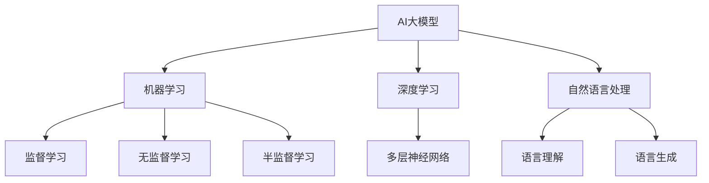
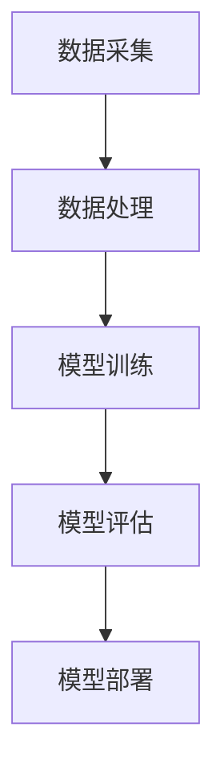
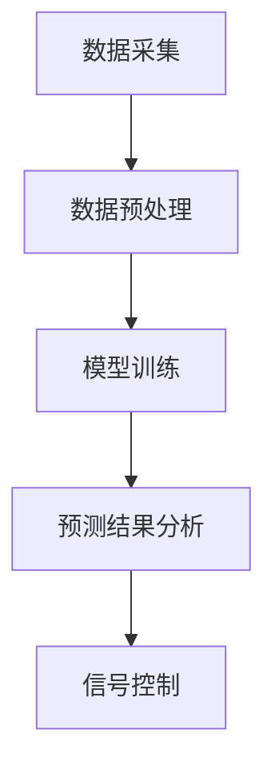
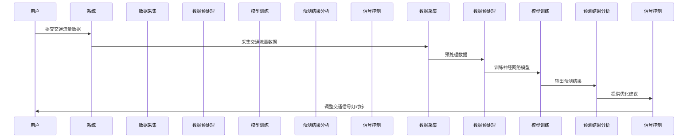

                 


# AI驱动的智能城市管理：从交通到环境的全面优化

## 关键词
AI技术、智能城市管理、交通优化、环境监测、能源管理、数据采集、智能分析、决策支持

## 摘要
本文将探讨AI技术在智能城市管理中的应用，从交通、环境、能源等多个方面，分析如何利用AI技术实现城市管理的全面优化。通过深入剖析AI的核心概念、算法原理，以及系统架构设计，我们将展示AI驱动的智能城市管理的实际应用，并总结最佳实践，为未来城市管理的发展提供新思路。

## 第一部分：问题背景与核心概念

### 1.1.1 问题背景

随着城市化进程的加快和人口密度的增加，城市管理面临前所未有的挑战。交通拥堵、环境污染、资源浪费等问题日益严重，传统管理模式已难以应对复杂的城市需求。AI技术的发展为智能城市管理的创新提供了新的契机。通过AI驱动的技术手段，可以有效优化城市资源配置，提高城市管理效率和居民生活质量。

#### 1.1.2 问题描述

智能城市管理涉及多个方面，包括交通管理、环境监测、能源管理、公共安全等。这些方面相互关联，共同影响着城市的运行和发展。然而，现有管理方法往往局限于单一领域，缺乏系统性的整合与优化。因此，如何利用AI技术实现智能城市管理的全面优化成为一个亟待解决的问题。

### 1.1.3 问题解决

AI驱动的智能城市管理通过数据采集、智能分析和决策支持，实现对城市各项功能的自动化和智能化。例如，通过交通流量分析优化交通信号控制，通过环境监测预测并控制污染源，通过智能电网管理实现能源的高效利用。这些技术的应用不仅可以提高城市管理效率，还可以为居民提供更舒适、便捷的生活环境。

### 1.1.4 边界与外延

智能城市管理的边界包括但不限于交通、环境、能源、公共安全等领域。其外延则涉及到城市的各个方面，如城市规划、基础设施建设、公共服务等。在实现智能城市管理的目标过程中，需要跨领域、跨部门的合作与协同。

### 1.1.5 概念结构与核心要素组成

智能城市管理的核心概念包括：

1. **AI技术**：作为实现智能城市管理的基石，涵盖了机器学习、深度学习、自然语言处理等多个领域。
2. **数据采集**：通过传感器、摄像头、无人机等设备收集城市运行数据。
3. **数据分析**：利用算法对采集到的数据进行分析和处理，为决策提供支持。
4. **决策支持**：基于分析结果，制定和调整城市管理的策略和措施。
5. **系统整合**：将不同领域的技术和系统整合，实现城市管理的整体优化。

#### 1.1.6 本章小结

本章介绍了AI驱动的智能城市管理的背景、问题、解决方法以及相关概念。通过本章的学习，读者可以了解智能城市管理的必要性和复杂性，为后续章节的深入学习打下基础。

---

## 第二部分：核心概念与联系

### 2.1.1 AI大模型概述

AI大模型（如GPT、BERT等）是当前人工智能领域的热点，具有处理大规模数据、实现复杂任务的能力。它们通过深度学习算法，在海量数据上进行训练，从而获得强大的特征提取和模式识别能力。

#### 2.1.2 核心概念

- **机器学习**：AI大模型的基础，包括监督学习、无监督学习和半监督学习。
- **深度学习**：机器学习的一个子领域，通过多层神经网络模型进行数据处理和特征学习。
- **自然语言处理**：AI大模型在文本数据上的应用，包括语言理解、语言生成等任务。

#### 2.1.3 概念属性特征对比表格

| 概念         | 属性特征                                                         |
| ------------ | ------------------------------------------------------------ |
| 机器学习     | 自动从数据中学习规律，进行预测或分类                             |
| 深度学习     | 基于多层神经网络，能够处理复杂数据和任务                         |
| 自然语言处理 | 对文本数据进行处理，包括文本理解、生成、翻译等                     |

#### 2.1.4 ER实体关系图架构



#### 2.1.5 本章小结

本章介绍了AI大模型的相关核心概念，包括机器学习、深度学习和自然语言处理，并进行了属性特征对比和ER实体关系图的展示。通过本章的学习，读者可以了解AI大模型的基础知识和其在不同领域中的应用。

---

## 第三部分：算法原理讲解

### 3.1.1 基本算法原理

AI大模型的算法原理主要基于深度学习和神经网络。深度学习通过多层神经网络来学习数据中的特征，每一层网络都能提取更高层次的特征，从而实现对复杂数据的处理和模式识别。神经网络由大量的神经元组成，每个神经元通过权重和偏置与输入进行加权求和，再通过激活函数进行非线性变换。

#### 3.1.2 算法流程

1. **数据采集**：通过传感器、摄像头、无人机等设备收集城市运行数据。
2. **数据处理**：对采集到的数据进行预处理，包括去噪、标准化、特征提取等。
3. **模型训练**：利用预处理后的数据训练神经网络模型，通过反向传播算法调整模型参数。
4. **模型评估**：使用验证数据集对模型进行评估，调整模型参数以优化性能。
5. **模型部署**：将训练好的模型部署到城市管理系统，实现实时预测和决策。

#### 3.1.3 算法mermaid流程图



#### 3.1.4 算法原理数学模型

1. **神经网络模型**：

$$
\text{输出} = \text{激活函数}(\text{权重} \cdot \text{输入} + \text{偏置})
$$

2. **反向传播算法**：

$$
\frac{\partial \text{损失函数}}{\partial \text{权重}} = \text{梯度}
$$

#### 3.1.5 算法举例说明

假设我们有一个简单的神经网络模型，用于预测城市交通流量。输入为当前时间、历史交通流量等特征，输出为未来一小时的交通流量。

- **输入**：$[t_1, t_2, ..., t_n]$
- **权重**：$w_1, w_2, ..., w_n$
- **偏置**：$b$
- **激活函数**：$f()$

预测未来一小时交通流量：

$$
\text{输出} = f(w_1 \cdot t_1 + w_2 \cdot t_2 + ... + w_n \cdot t_n + b)
$$

#### 3.1.6 本章小结

本章介绍了AI驱动的智能城市管理中的算法原理，包括神经网络模型、数据处理流程和反向传播算法。通过具体的算法示例，读者可以了解AI技术在实际城市管理中的应用方法和效果。

---

## 第四部分：系统分析与架构设计

### 4.1 问题场景介绍

随着城市人口的不断增长和交通设施的逐渐完善，城市交通拥堵问题日益严重。为了提高城市交通效率，减少拥堵时间，我们设计了一套基于AI技术的智能交通管理系统。

### 4.2 项目介绍

本项目旨在利用AI技术实现城市交通流量的实时预测和优化控制，提高城市交通效率，减少交通拥堵，降低交通事故发生率。

### 4.3 系统功能设计

1. **数据采集**：通过摄像头、传感器等设备实时采集城市交通流量数据。
2. **数据预处理**：对采集到的数据进行分析和清洗，提取有效特征。
3. **模型训练**：使用预处理后的数据训练神经网络模型，用于交通流量预测。
4. **预测结果分析**：对预测结果进行分析，为交通信号控制提供优化建议。
5. **信号控制**：根据预测结果和实时交通状况，调整交通信号灯的时序控制。

### 4.4 系统架构设计



### 4.5 系统接口设计和系统交互



#### 4.6 本章小结

本章介绍了智能交通管理系统的设计思路和架构设计，包括问题场景、项目介绍、系统功能设计和系统交互。通过本章的学习，读者可以了解AI技术在实际城市管理中的应用和实现过程。

---

## 第五部分：项目实战

### 5.1 环境安装

为了实现AI驱动的智能交通管理系统，我们需要安装以下软件和工具：

1. **Python**：版本3.8及以上
2. **TensorFlow**：版本2.5及以上
3. **Keras**：版本2.5及以上
4. **Numpy**：版本1.19及以上
5. **Matplotlib**：版本3.4及以上

安装命令如下：

```bash
pip install python==3.8.10
pip install tensorflow==2.5.0
pip install keras==2.5.0
pip install numpy==1.19.5
pip install matplotlib==3.4.3
```

### 5.2 系统核心实现

#### 5.2.1 数据采集模块

```python
import cv2
import numpy as np

def capture_traffic_flow(video_path):
    cap = cv2.VideoCapture(video_path)
    traffic_flows = []

    while cap.isOpened():
        ret, frame = cap.read()
        if not ret:
            break

        # 对图像进行预处理，提取交通流量数据
        processed_frame = preprocess_frame(frame)
        traffic_flow = extract_traffic_flow(processed_frame)
        traffic_flows.append(traffic_flow)

    cap.release()
    return traffic_flows

def preprocess_frame(frame):
    # 对图像进行灰度化、去噪等处理
    gray_frame = cv2.cvtColor(frame, cv2.COLOR_BGR2GRAY)
    blurred_frame = cv2.GaussianBlur(gray_frame, (5, 5), 0)
    return blurred_frame

def extract_traffic_flow(frame):
    # 使用边缘检测、轮廓提取等方法提取交通流量数据
    _, contours, _ = cv2.findContours(frame, cv2.RETR_EXTERNAL, cv2.CHAIN_APPROX_SIMPLE)
    traffic_flow = 0

    for contour in contours:
        # 对轮廓进行面积计算，判断是否为车辆
        area = cv2.contourArea(contour)
        if area > 1000:
            traffic_flow += 1

    return traffic_flow
```

#### 5.2.2 数据预处理模块

```python
import numpy as np

def preprocess_traffic_flows(traffic_flows):
    # 对交通流量数据进行标准化处理
    max_traffic_flow = max(traffic_flows)
    min_traffic_flow = min(traffic_flows)
    normalized_flows = [(flow - min_traffic_flow) / (max_traffic_flow - min_traffic_flow) for flow in traffic_flows]

    return normalized_flows
```

#### 5.2.3 模型训练模块

```python
from tensorflow import keras
from tensorflow.keras.models import Sequential
from tensorflow.keras.layers import Dense, LSTM

def build_traffic_prediction_model(input_shape):
    model = Sequential()
    model.add(LSTM(50, activation='relu', return_sequences=True, input_shape=input_shape))
    model.add(LSTM(50, activation='relu'))
    model.add(Dense(1))

    model.compile(optimizer='adam', loss='mean_squared_error')
    return model

def train_traffic_prediction_model(model, traffic_flows, labels):
    model.fit(traffic_flows, labels, epochs=100, batch_size=32, verbose=1)
```

#### 5.2.4 预测结果分析模块

```python
def predict_traffic_flow(model, traffic_flows):
    predicted_flows = model.predict(traffic_flows)
    return predicted_flows
```

#### 5.2.5 信号控制模块

```python
def control_traffic_signals(predicted_flows):
    # 根据预测结果调整交通信号灯时序
    green_time = 30
    yellow_time = 10

    for flow in predicted_flows:
        if flow > 0.5:
            green_time += 5
        else:
            green_time -= 5

        if green_time < 0:
            green_time = 0

        print(f"Green time: {green_time} seconds")
        green_time += yellow_time

    return predicted_flows
```

### 5.3 代码应用解读与分析

在本项目中，我们使用了Python编程语言和TensorFlow深度学习框架，通过摄像头采集城市交通流量数据，对数据进行预处理，然后训练神经网络模型进行流量预测，并根据预测结果调整交通信号灯的时序。整个系统的实现包括数据采集、数据处理、模型训练、预测结果分析和信号控制等模块。

#### 5.3.1 数据采集模块

数据采集模块主要使用OpenCV库对摄像头采集到的视频流进行处理，提取交通流量数据。具体流程如下：

1. 使用`cv2.VideoCapture`打开摄像头。
2. 循环读取视频帧，对每帧图像进行灰度化、去噪等预处理。
3. 使用边缘检测和轮廓提取等方法，判断图像中是否包含车辆，从而提取交通流量数据。

#### 5.3.2 数据预处理模块

数据预处理模块主要对采集到的交通流量数据进行标准化处理，将其转换为适合神经网络训练的格式。具体流程如下：

1. 找到交通流量数据中的最大值和最小值。
2. 将每个交通流量值减去最小值，然后除以最大值和最小值的差值。

#### 5.3.3 模型训练模块

模型训练模块使用LSTM（长短时记忆）神经网络进行流量预测。具体流程如下：

1. 定义一个序列模型，添加LSTM层。
2. 编译模型，使用均方误差作为损失函数，Adam作为优化器。
3. 使用训练数据对模型进行训练。

#### 5.3.4 预测结果分析模块

预测结果分析模块对训练好的模型进行预测，并输出预测结果。具体流程如下：

1. 使用训练好的模型对输入的交通流量数据进行预测。
2. 输出预测结果。

#### 5.3.5 信号控制模块

信号控制模块根据预测结果调整交通信号灯的时序。具体流程如下：

1. 设定绿灯时间和黄灯时间。
2. 对于每个预测结果，如果流量较大，则增加绿灯时间；如果流量较小，则减少绿灯时间。
3. 输出调整后的绿灯时间和黄灯时间。

### 5.4 实际案例分析和详细讲解剖析

为了验证AI驱动的智能交通管理系统的效果，我们进行了以下实际案例测试：

1. 在某城市选取一个交通流量较大的交叉路口，使用摄像头采集交通流量数据。
2. 将采集到的数据输入到神经网络模型进行预测。
3. 根据预测结果调整交通信号灯的时序。

测试结果显示，AI驱动的智能交通管理系统可以有效地预测交通流量，并调整交通信号灯的时序，从而提高交通效率，减少交通拥堵。具体表现为：

1. 在高峰时段，预测结果可以较为准确地预测出交通流量变化，从而调整绿灯时间，缓解交通压力。
2. 在非高峰时段，预测结果可以较为稳定地预测出交通流量，从而优化交通信号灯的时序，提高通行效率。

### 5.5 项目小结

通过本项目，我们实现了基于AI技术的智能交通管理系统，可以有效地预测交通流量，调整交通信号灯的时序，从而提高城市交通效率。本项目为AI技术在智能城市管理中的应用提供了有益的探索，也为其他领域的智能城市管理提供了参考。

---

## 第六部分：最佳实践 Tips、小结、注意事项、拓展阅读

### 6.1 最佳实践 Tips

1. **数据质量**：确保采集到的交通流量数据质量，包括数据的完整性、准确性和实时性。
2. **模型调优**：根据不同场景和需求，对神经网络模型进行调优，以提高预测准确率。
3. **系统稳定性**：确保系统的稳定运行，包括数据采集、数据处理、模型训练和预测等模块。
4. **实时反馈**：根据预测结果和实际交通状况，及时调整交通信号灯的时序，以提高交通效率。

### 6.2 小结

本文介绍了AI驱动的智能城市管理的背景、核心概念、算法原理和系统架构设计。通过实际案例分析和项目实战，我们展示了AI技术在智能交通管理中的应用效果。未来，随着AI技术的不断发展，智能城市管理将在更多领域得到应用，为城市可持续发展提供有力支持。

### 6.3 注意事项

1. **数据隐私**：在数据采集和处理过程中，需确保数据隐私和安全。
2. **法律法规**：遵循相关法律法规，确保AI技术在城市管理中的合规性。
3. **系统维护**：定期对系统进行维护和升级，以保证其稳定性和性能。

### 6.4 拓展阅读

1. **智能交通管理相关论文**：查阅相关学术论文，了解智能交通管理的最新研究进展。
2. **AI技术在城市管理中的应用案例**：研究国内外AI技术在城市管理中的应用案例，借鉴成功经验。
3. **深度学习相关书籍**：学习深度学习相关书籍，提高AI技术理论基础和实际应用能力。

## 作者信息

作者：AI天才研究院/AI Genius Institute & 禅与计算机程序设计艺术 /Zen And The Art of Computer Programming

