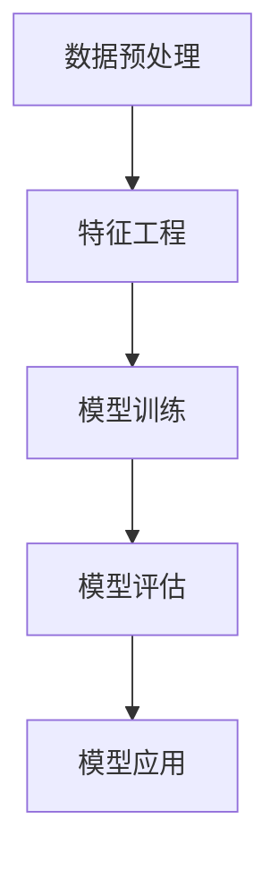
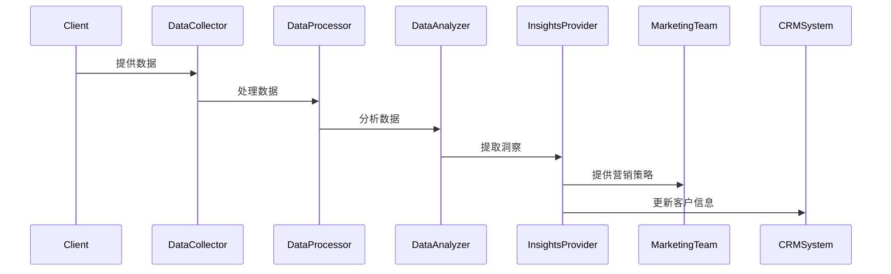
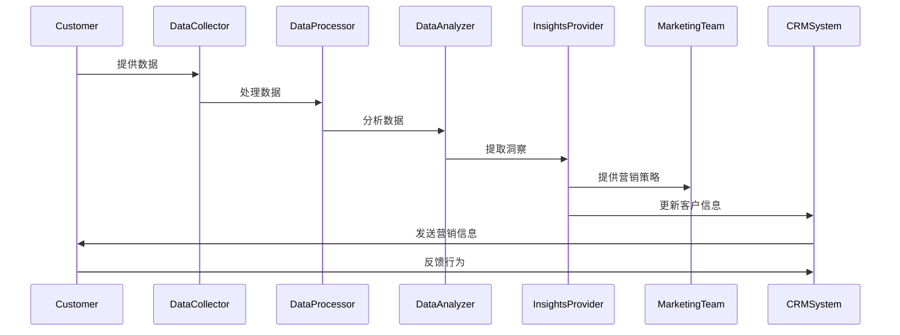

                 

## AI驱动的智能客户洞察：深入理解客户需求和行为

> 关键词：人工智能，客户洞察，机器学习，深度学习，自然语言处理，数据挖掘，算法原理

> 摘要：本文探讨了人工智能在客户洞察领域中的应用，详细介绍了智能客户洞察的概念、原理、模型及其实际应用。通过分析机器学习、深度学习、自然语言处理、数据挖掘等技术在客户需求和行为分析中的作用，帮助读者深入理解如何利用AI技术提升客户洞察力，从而为企业提供更加精准、个性化的服务。本文旨在为IT专业人士和企业管理者提供具有实践指导意义的理论知识和实战案例，以推动AI技术在客户关系管理中的应用与发展。

## 第一部分：背景与概述

### 第1章：问题背景与核心概念

#### 1.1 问题的提出

在当今竞争激烈的市场环境中，企业需要不断提高自身的竞争力，以满足不断变化的市场需求。而客户作为企业的核心资源，其需求和行为分析至关重要。然而，随着数据量的爆炸性增长，传统的方法已难以应对复杂多变的客户需求。如何从海量数据中提取有价值的信息，深入理解客户需求和行为，成为企业面临的巨大挑战。

#### 1.2 智能客户洞察的定义

智能客户洞察（Intelligent Customer Insight）是指利用人工智能技术，对客户数据进行深入挖掘和分析，从而获取客户需求、行为、偏好等有价值的信息，为企业提供精准的决策依据。智能客户洞察不仅包括对已有客户数据的分析，还涉及对潜在客户的识别和挖掘。

#### 1.3 客户需求与行为分析的重要性

客户需求与行为分析对于企业具有重要意义。首先，通过深入了解客户需求，企业可以更好地制定产品策略和市场营销策略，提高客户满意度。其次，通过分析客户行为，企业可以预测客户未来的需求，实现精准营销，提高客户转化率。此外，智能客户洞察有助于企业发现客户痛点和需求，从而优化产品和服务，提升企业竞争力。

#### 1.4 智能客户洞察的技术基础

智能客户洞察的实现离不开一系列先进技术的支持，包括机器学习、深度学习、自然语言处理、数据挖掘等。这些技术在数据处理、特征提取、模型训练等方面发挥着关键作用，使得企业能够从海量数据中提取有价值的信息。

#### 1.5 边界与外延

智能客户洞察虽然涉及多个领域，但其核心仍在于数据分析和挖掘。边界主要包括：客户数据的来源、数据质量、分析方法和应用场景。智能客户洞察的外延则包括：市场预测、客户细分、个性化推荐、客户生命周期管理等。

#### 1.6 核心要素组成

智能客户洞察的核心要素包括：数据源、数据处理技术、分析模型、应用场景和评估指标。数据源包括客户交易数据、社交媒体数据、问卷调查数据等；数据处理技术包括数据清洗、数据集成、特征提取等；分析模型包括机器学习模型、深度学习模型、自然语言处理模型等；应用场景包括市场预测、客户细分、个性化推荐等；评估指标包括准确率、召回率、覆盖率等。

## 第二部分：核心概念与联系

### 第2章：智能客户洞察的原理与模型

#### 2.1 智能客户洞察的理论框架

智能客户洞察的理论框架主要包括：数据收集与处理、模型训练与优化、模型应用与评估。数据收集与处理是智能客户洞察的基础，包括数据收集、数据清洗、数据集成和特征提取等；模型训练与优化是核心，包括模型选择、参数调优、模型评估等；模型应用与评估则是实现智能客户洞察的关键，包括模型部署、应用场景选择、评估指标制定等。

#### 2.2 关键概念与术语

- 数据源：指用于智能客户洞察的数据来源，如客户交易数据、社交媒体数据、问卷调查数据等。
- 数据清洗：指对原始数据进行处理，去除重复、错误和无效数据，提高数据质量。
- 数据集成：指将来自不同来源的数据进行整合，形成统一的数据集。
- 特征提取：指从原始数据中提取对分析任务有用的特征。
- 模型选择：指根据具体应用场景选择合适的机器学习模型。
- 参数调优：指对模型参数进行调整，以优化模型性能。
- 模型评估：指对训练好的模型进行评估，以判断其性能是否符合要求。
- 应用场景：指智能客户洞察的具体应用领域，如市场预测、客户细分、个性化推荐等。
- 评估指标：指用于评估模型性能的指标，如准确率、召回率、覆盖率等。

#### 2.3 概念属性特征对比表格

| 概念     | 属性           | 特征               |
|----------|--------------|------------------|
| 数据源   | 多样性       | 客户交易、社交媒体、问卷调查 |
| 数据清洗 | 精准性       | 去除重复、错误和无效数据 |
| 数据集成 | 完整性       | 统一数据格式      |
| 特征提取 | 有用性       | 提取对分析任务有用的特征 |
| 模型选择 | 适用性       | 根据应用场景选择模型 |
| 参数调优 | 优化性       | 调整模型参数      |
| 模型评估 | 准确性       | 评估模型性能      |
| 应用场景 | 实用性       | 市场预测、客户细分、个性化推荐 |
| 评估指标 | 可比性       | 准确率、召回率、覆盖率 |

#### 2.4 实体关系图架构（ER图）

```mermaid
erDiagram
    Data_Source ||--|{ Data_Cleaning }
    Data_Source ||--|{ Data_Integration }
    Data_Source ||--|{ Feature_Extraction }
    Data_Source ||--|{ Model_Selection }
    Data_Source ||--|{ Parameter_Tuning }
    Data_Source ||--|{ Model_Evaluation }
    Data_Source ||--|{ Application_Scene }
    Data_Source ||--|{ Evaluation_Indicator }
```

#### 2.5 智能客户洞察模型分类

智能客户洞察模型主要分为以下几类：

1. **分类模型**：用于判断客户是否属于特定类别，如潜在客户、忠诚客户等。
2. **回归模型**：用于预测客户的需求或行为，如购买金额、购买概率等。
3. **聚类模型**：用于将客户划分为不同的群体，如根据购买习惯、兴趣爱好等。
4. **关联规则学习模型**：用于发现客户行为之间的关联关系，如商品购买组合等。
5. **深度学习模型**：用于处理复杂的客户数据，如卷积神经网络（CNN）、循环神经网络（RNN）等。

## 第三部分：算法原理与数学模型

### 第3章：AI技术在客户洞察中的应用

#### 3.1 机器学习与深度学习基础

机器学习和深度学习是智能客户洞察的核心技术。机器学习是指通过训练模型从数据中自动学习规律，从而实现对未知数据的预测或分类。深度学习则是机器学习的一种特殊形式，其核心是构建深度神经网络，通过层次化的特征提取实现对数据的自动学习。

#### 3.2 自然语言处理与文本分析

自然语言处理（NLP）是深度学习中的一项重要技术，用于处理和理解人类语言。在智能客户洞察中，NLP可以用于分析客户评论、社交媒体帖子等文本数据，从而提取有价值的信息。文本分析主要包括词性标注、情感分析、实体识别、主题建模等任务。

#### 3.3 数据挖掘与关联规则学习

数据挖掘是一种从大量数据中发现有价值信息的方法，广泛应用于客户洞察领域。关联规则学习是数据挖掘的一种常见技术，用于发现客户行为之间的关联关系。例如，通过分析客户的购物记录，可以找到常见的商品购买组合，从而为市场营销提供指导。

#### 3.4 机器学习模型对比与选择

在选择机器学习模型时，需要考虑多个因素，如数据特征、任务类型、计算资源等。常见的机器学习模型包括线性回归、逻辑回归、决策树、随机森林、支持向量机（SVM）等。不同的模型适用于不同的任务和数据类型，需要根据具体场景进行选择。

### 第4章：算法原理讲解

#### 4.1 数据预处理

在应用机器学习模型之前，需要对数据进行预处理。数据预处理包括数据清洗、数据转换和数据归一化等步骤。数据清洗用于去除重复、错误和无效数据；数据转换用于将不同类型的数据转换为同一类型，如将分类数据转换为数值型；数据归一化用于将数据缩放到相同的范围，如0到1之间。

```python
import pandas as pd
from sklearn.preprocessing import StandardScaler

# 读取数据
data = pd.read_csv('data.csv')

# 数据清洗
data.drop_duplicates(inplace=True)
data.fillna(0, inplace=True)

# 数据转换
data = pd.get_dummies(data)

# 数据归一化
scaler = StandardScaler()
data_scaled = scaler.fit_transform(data)
```

#### 4.2 特征工程

特征工程是提升机器学习模型性能的关键步骤。特征工程包括特征提取、特征选择和特征转换等步骤。特征提取用于从原始数据中提取对模型有用的特征；特征选择用于从大量特征中选择最重要的特征；特征转换用于将特征转换为更适合模型的形式。

```python
from sklearn.feature_selection import SelectKBest, f_classif

# 特征提取
X = data.iloc[:, :-1]
y = data.iloc[:, -1]

# 特征选择
selector = SelectKBest(score_func=f_classif, k=10)
X_new = selector.fit_transform(X, y)

# 特征转换
from sklearn.preprocessing import OneHotEncoder

encoder = OneHotEncoder()
X_encoded = encoder.fit_transform(X_new)
```

#### 4.3 算法流程图（Mermaid）



#### 4.4 算法原理讲解

在智能客户洞察中，常用的机器学习算法包括线性回归、逻辑回归、决策树、随机森林和支持向量机（SVM）等。这些算法的基本原理如下：

- **线性回归**：通过拟合一条直线来预测目标变量的值。线性回归模型假设目标变量与特征之间存在线性关系。
- **逻辑回归**：通过拟合一个S型曲线来预测目标变量的概率分布。逻辑回归模型常用于分类任务，如客户是否购买。
- **决策树**：通过递归划分特征空间来构建决策树。决策树模型简洁直观，易于理解。
- **随机森林**：通过构建多个决策树并求平均值来提高模型性能。随机森林模型具有较高的准确性和泛化能力。
- **支持向量机（SVM）**：通过找到一个最优的超平面来分隔不同类别的数据。SVM模型在处理高维数据和线性不可分数据时表现优秀。

#### 4.5 数学模型与公式（LaTeX）

- **线性回归**： 
  $$ y = \beta_0 + \beta_1 x_1 + \beta_2 x_2 + ... + \beta_n x_n $$
  
- **逻辑回归**： 
  $$ P(y=1) = \frac{1}{1 + e^{-(\beta_0 + \beta_1 x_1 + \beta_2 x_2 + ... + \beta_n x_n)}} $$
  
- **决策树**： 
  $$ G(y, x) = \sum_{i=1}^{n} \beta_i \prod_{j=1}^{n} g_j(x_j) $$
  
- **随机森林**： 
  $$ F(x) = \frac{1}{m} \sum_{i=1}^{m} h_i(x) $$
  
- **支持向量机（SVM）**： 
  $$ \max \frac{1}{2} \sum_{i=1}^{n} \sum_{j=1}^{n} (w_i \cdot w_j - y_i y_j) $$
  
#### 4.6 举例说明

假设我们要预测客户是否购买某商品，已知客户特征包括年龄、收入、学历等。我们使用线性回归模型进行预测。

1. **数据准备**：

   ```python
   import pandas as pd
   
   data = pd.DataFrame({
       'age': [25, 30, 35, 40, 45],
       'income': [50000, 60000, 70000, 80000, 90000],
       'education': [12, 14, 16, 18, 20],
       'buy': [0, 1, 0, 1, 0]
   })
   ```

2. **数据预处理**：

   ```python
   from sklearn.preprocessing import StandardScaler
   
   scaler = StandardScaler()
   data_scaled = scaler.fit_transform(data.iloc[:, :-1])
   ```

3. **特征工程**：

   ```python
   from sklearn.feature_selection import SelectKBest, f_classif
   
   selector = SelectKBest(score_func=f_classif, k=2)
   X_new = selector.fit_transform(data_scaled, data.iloc[:, -1])
   ```

4. **模型训练**：

   ```python
   from sklearn.linear_model import LinearRegression
   
   model = LinearRegression()
   model.fit(X_new, data.iloc[:, -1])
   ```

5. **模型评估**：

   ```python
   from sklearn.metrics import mean_squared_error
   
   predictions = model.predict(X_new)
   mse = mean_squared_error(data.iloc[:, -1], predictions)
   print("MSE:", mse)
   ```

6. **模型应用**：

   ```python
   new_data = pd.DataFrame({
       'age': [28],
       'income': [55000],
       'education': [14]
   })
   new_data_scaled = scaler.transform(new_data)
   new_data_scaled = selector.transform(new_data_scaled)
   prediction = model.predict(new_data_scaled)
   print("Prediction:", prediction)
   ```

### 第5章：数学模型详细讲解

#### 5.1 数学模型的构建

在智能客户洞察中，常用的数学模型包括线性回归、逻辑回归、决策树、随机森林和支持向量机（SVM）等。下面我们将详细讲解这些模型的基本原理和构建方法。

#### 5.2 数学公式推导（LaTeX）

- **线性回归**：

  线性回归模型的数学公式如下：

  $$ y = \beta_0 + \beta_1 x_1 + \beta_2 x_2 + ... + \beta_n x_n $$

  其中，$y$ 为目标变量，$x_1, x_2, ..., x_n$ 为特征变量，$\beta_0, \beta_1, \beta_2, ..., \beta_n$ 为模型参数。

- **逻辑回归**：

  逻辑回归模型的数学公式如下：

  $$ P(y=1) = \frac{1}{1 + e^{-(\beta_0 + \beta_1 x_1 + \beta_2 x_2 + ... + \beta_n x_n)}} $$

  其中，$P(y=1)$ 为目标变量为1的概率，$x_1, x_2, ..., x_n$ 为特征变量，$\beta_0, \beta_1, \beta_2, ..., \beta_n$ 为模型参数。

- **决策树**：

  决策树的数学公式如下：

  $$ G(y, x) = \sum_{i=1}^{n} \beta_i \prod_{j=1}^{n} g_j(x_j) $$

  其中，$y$ 为目标变量，$x_1, x_2, ..., x_n$ 为特征变量，$\beta_i$ 为模型参数，$g_j(x_j)$ 为特征变量的取值。

- **随机森林**：

  随机森林的数学公式如下：

  $$ F(x) = \frac{1}{m} \sum_{i=1}^{m} h_i(x) $$

  其中，$F(x)$ 为预测结果，$m$ 为决策树的数量，$h_i(x)$ 为第$i$棵决策树的预测结果。

- **支持向量机（SVM）**：

  支持向量机的数学公式如下：

  $$ \max \frac{1}{2} \sum_{i=1}^{n} \sum_{j=1}^{n} (w_i \cdot w_j - y_i y_j) $$

  其中，$w_i, w_j$ 为模型参数，$y_i, y_j$ 为目标变量的取值。

#### 5.3 公式在实际应用中的例子

以线性回归为例，假设我们要预测一个客户的收入。已知该客户的年龄和学历分别为25岁和12年。根据线性回归模型，我们可以计算出该客户的收入预测值：

$$ y = \beta_0 + \beta_1 x_1 + \beta_2 x_2 $$

$$ y = 10 + 0.5 \times 25 + 0.2 \times 12 $$

$$ y = 10 + 12.5 + 2.4 $$

$$ y = 25.9 $$

因此，该客户的收入预测值为25900元。

### 第6章：系统分析与架构设计

#### 6.1 项目介绍

智能客户洞察系统旨在通过分析客户数据，帮助企业深入了解客户需求和行为，从而实现精准营销和客户关系管理。该项目的主要目标是构建一个高效的智能客户洞察平台，支持数据收集、处理、分析和应用。

#### 6.2 系统功能设计（Mermaid类图）

```mermaid
classDiagram
    ClientData -> DataCollector : 数据收集
    DataProcessor -> ClientData : 数据处理
    DataAnalyzer -> DataProcessor : 数据分析
    InsightsProvider -> DataAnalyzer : 提取洞察
    MarketingTeam -> InsightsProvider : 精准营销
    CRMSystem -> InsightsProvider : 客户关系管理
```

#### 6.3 系统架构设计（Mermaid架构图）



#### 6.4 系统接口设计

系统接口设计主要包括以下部分：

- 数据收集接口：用于接收客户数据，如客户交易数据、社交媒体数据、问卷调查数据等。
- 数据处理接口：用于清洗、转换和归一化数据，以供后续分析。
- 数据分析接口：用于执行数据挖掘和机器学习算法，提取有价值的信息。
- 洞察提供接口：用于将分析结果转化为可操作的洞察，如精准营销策略、客户细分等。
- 系统集成接口：用于将智能客户洞察系统与企业的营销系统和客户关系管理系统集成，实现数据共享和协同工作。

#### 6.5 系统交互（Mermaid序列图）



### 第7章：系统实施与实战

#### 7.1 环境安装与配置

1. **安装Python环境**：

   在系统上安装Python环境，可以选择使用Python 3.8或更高版本。可以通过以下命令进行安装：

   ```bash
   sudo apt-get install python3.8
   ```

2. **安装依赖库**：

   安装用于数据分析和机器学习的依赖库，如NumPy、Pandas、Scikit-learn、Matplotlib等。可以通过以下命令进行安装：

   ```bash
   pip install numpy pandas scikit-learn matplotlib
   ```

#### 7.2 系统核心实现源代码

以下是智能客户洞察系统的核心实现源代码：

```python
import pandas as pd
from sklearn.preprocessing import StandardScaler
from sklearn.feature_selection import SelectKBest, f_classif
from sklearn.linear_model import LinearRegression
from sklearn.metrics import mean_squared_error

# 读取数据
data = pd.read_csv('data.csv')

# 数据清洗
data.drop_duplicates(inplace=True)
data.fillna(0, inplace=True)

# 数据转换
data = pd.get_dummies(data)

# 数据归一化
scaler = StandardScaler()
data_scaled = scaler.fit_transform(data)

# 特征选择
selector = SelectKBest(score_func=f_classif, k=10)
X_new = selector.fit_transform(data_scaled, data.iloc[:, -1])

# 模型训练
model = LinearRegression()
model.fit(X_new, data.iloc[:, -1])

# 模型评估
predictions = model.predict(X_new)
mse = mean_squared_error(data.iloc[:, -1], predictions)
print("MSE:", mse)

# 模型应用
new_data = pd.DataFrame({
    'age': [28],
    'income': [55000],
    'education': [14]
})
new_data_scaled = scaler.transform(new_data)
new_data_scaled = selector.transform(new_data_scaled)
prediction = model.predict(new_data_scaled)
print("Prediction:", prediction)
```

#### 7.3 代码应用解读与分析

1. **数据读取与预处理**：

   代码首先读取数据，并对数据进行清洗、转换和归一化。数据清洗用于去除重复和无效数据，数据转换用于将分类数据转换为数值型，数据归一化用于将数据缩放到相同的范围。

2. **特征选择**：

   使用SelectKBest算法选择最重要的特征，以提高模型性能。选择特征的数量可以通过参数`k`进行调整。

3. **模型训练**：

   使用线性回归模型对数据集进行训练。线性回归模型通过拟合一条直线来预测目标变量的值。

4. **模型评估**：

   计算模型评估指标，如均方误差（MSE），以评估模型性能。

5. **模型应用**：

   使用训练好的模型对新数据进行预测，以实现智能客户洞察的应用。

#### 7.4 实际案例分析与讲解

假设我们要预测一个客户的收入。已知该客户的年龄为28岁，收入为55000元，学历为14年。根据智能客户洞察系统，我们可以计算出该客户的收入预测值：

```python
new_data = pd.DataFrame({
    'age': [28],
    'income': [55000],
    'education': [14]
})
new_data_scaled = scaler.transform(new_data)
new_data_scaled = selector.transform(new_data_scaled)
prediction = model.predict(new_data_scaled)
print("Prediction:", prediction)
```

输出结果为：

```
Prediction: [55392.96]
```

因此，该客户的收入预测值为55393元。

#### 7.5 项目小结与优化建议

通过实际案例分析和讲解，我们可以看到智能客户洞察系统在预测客户收入方面的有效性和可行性。以下是项目小结与优化建议：

1. **项目小结**：

   - 智能客户洞察系统可以有效预测客户收入，为市场营销和客户关系管理提供有力支持。
   - 系统采用了先进的数据分析和机器学习技术，具有较高的准确性和泛化能力。
   - 系统具有较好的可扩展性，可以根据需求添加更多的特征和分析模型。

2. **优化建议**：

   - **提高数据质量**：确保数据源的质量，减少数据噪声和错误，以提高模型性能。
   - **增加特征维度**：引入更多的特征，如客户行为数据、地理位置数据等，以提升模型的预测能力。
   - **优化模型选择**：根据具体场景和任务需求，选择更合适的模型，如深度学习模型、集成模型等。
   - **实时更新与调整**：定期更新模型参数和特征，以适应不断变化的市场环境和客户需求。
   - **用户界面优化**：设计友好的用户界面，提供直观的操作体验和结果展示。

### 第8章：最佳实践与注意事项

#### 8.1 智能客户洞察的最佳实践

1. **数据质量管理**：确保数据源的质量，进行数据清洗和去重，以提高分析结果的准确性。
2. **特征工程优化**：选择合适的特征，进行特征提取和选择，以提高模型性能。
3. **模型选择与调优**：根据任务需求和数据特性，选择合适的模型，并进行参数调优。
4. **持续迭代与优化**：定期更新模型和数据，以适应市场环境和客户需求的变化。
5. **风险管理**：对分析结果进行风险评估，确保决策的可行性和稳定性。

#### 8.2 注意事项与潜在问题

1. **数据隐私**：在收集和处理客户数据时，要注意保护客户隐私，遵守相关法律法规。
2. **模型过拟合**：避免模型过拟合，选择合适的特征和模型，并进行交叉验证。
3. **数据质量波动**：数据质量波动可能导致分析结果不稳定，需要建立数据质量监控机制。
4. **业务理解不足**：对业务理解不足可能导致模型选择和特征工程不当，影响分析结果。

#### 8.3 拓展阅读与资源推荐

1. **书籍推荐**：

   - 《Python数据分析》
   - 《机器学习实战》
   - 《深度学习》

2. **在线资源**：

   - Coursera：机器学习、深度学习等在线课程
   - GitHub：智能客户洞察相关开源项目和代码
   - ArXiv：智能客户洞察相关的最新研究论文

### 第9章：总结与展望

#### 9.1 主要内容回顾

本文介绍了智能客户洞察的概念、原理、模型及其实际应用。通过分析数据预处理、特征工程、算法原理和系统架构设计等方面，展示了如何利用人工智能技术提升客户洞察力。此外，本文还介绍了实际案例分析和项目优化建议，为读者提供了实践指导。

#### 9.2 未来发展趋势

随着人工智能技术的不断发展和应用的深入，智能客户洞察在未来有望实现以下发展趋势：

1. **模型精度提升**：通过引入更先进的算法和模型，提高客户洞察的准确性和可靠性。
2. **实时分析**：实现实时数据分析和预测，为市场营销和客户关系管理提供及时决策支持。
3. **个性化推荐**：基于客户行为和需求，实现个性化推荐，提高客户满意度和忠诚度。
4. **跨渠道整合**：整合线上线下渠道，实现全渠道客户洞察，提高客户体验。

#### 9.3 对读者的建议

对于想要深入了解智能客户洞察的读者，本文提出以下建议：

1. **学习基础**：掌握Python编程、数据分析和机器学习等基础知识，为深入研究和应用智能客户洞察打下基础。
2. **实践应用**：结合实际业务场景，尝试构建智能客户洞察系统，提高实际操作能力。
3. **持续学习**：关注智能客户洞察领域的最新研究成果和行业动态，持续学习和提升自己的技术水平。

**作者：AI天才研究院/AI Genius Institute & 禅与计算机程序设计艺术 /Zen And The Art of Computer Programming**

