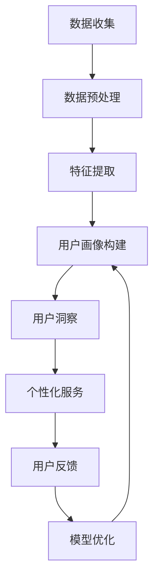

                 

### 核心概念与联系

#### 3.1 核心概念

**用户画像** 是指通过对用户数据的分析，提取出用户的特征，构建出一个反映用户需求、行为和属性的模型。它不仅仅是对用户表面信息的描述，还包括了用户的深层需求和潜在行为模式。

**智能客户画像** 则是结合了人工智能技术，通过算法分析用户数据，动态更新和优化用户画像，从而实现更精准的用户洞察和个性化服务。

**用户洞察** 是对用户行为的深入理解，目的是为了更好地理解用户需求和行为模式，从而提供更有效的产品和服务。

**个性化服务** 是指根据用户画像和用户洞察，为用户量身定制的产品和服务，以满足用户的个性化需求。

#### 3.2 概念属性特征对比表格

| 概念        | 定义                                                         | 属性特征                                               | 对比关系                                                       |
| ----------- | ------------------------------------------------------------ | ------------------------------------------------------ | ------------------------------------------------------------ |
| 用户画像    | 通过数据分析和算法，提取用户特征，构建反映用户需求、行为和属性的模型。 | 用户基本信息、行为数据、偏好数据、社交数据等               | 是智能客户画像的基础，提供了构建智能客户画像所需的基础数据。   |
| 智能客户画像 | 结合人工智能技术，动态更新和优化用户画像，实现精准用户洞察和个性化服务。 | 用户画像的数据源更广泛、数据维度更丰富、实时性更高           | 增加了数据分析的深度和广度，提供了更精细的用户洞察和个性化服务。 |
| 用户洞察    | 对用户行为的深入理解，旨在理解用户需求和行为模式。                 | 用户行为模式、用户需求、用户满意度等                       | 是提供个性化服务的前提，为个性化服务提供了依据。               |
| 个性化服务  | 根据用户画像和用户洞察，为用户量身定制的产品和服务。               | 产品定制化、服务个性化、用户体验优化等                     | 是用户画像和用户洞察的最终应用，目的是提升用户满意度。         |

#### 3.3 用户行为与画像的关系

用户行为与用户画像之间是相互影响、动态互动的关系。用户行为数据是构建用户画像的基石，而用户画像又可以指导对用户行为的分析，从而实现更精准的用户洞察。

**用户行为驱动画像构建**：用户在网站、应用程序或实体店的行为数据，如浏览历史、购买记录、互动行为等，都是构建用户画像的重要数据来源。

**用户画像优化用户行为分析**：通过智能客户画像，可以对用户行为进行更深入的分析，识别出用户的行为模式和偏好，从而提供更精准的个性化服务。

#### 3.4 AI驱动的用户画像与个性化服务

AI技术在用户画像和个性化服务中的应用，主要体现在以下几个方面：

- **数据预处理与特征提取**：使用机器学习和数据挖掘技术，对用户数据进行预处理，提取出有价值的特征，用于构建用户画像。
- **用户画像动态更新**：通过实时数据分析和算法优化，动态更新用户画像，确保其准确性和时效性。
- **个性化服务推荐**：基于用户画像，使用协同过滤、内容推荐等算法，为用户推荐个性化的产品和服务。
- **用户行为预测**：通过机器学习模型，预测用户的未来行为和需求，从而提供前瞻性的个性化服务。

### Mermaid流程图

### 数学模型与公式

在构建用户画像时，可以使用以下数学模型来描述用户行为与画像特征之间的关系：

1. **用户行为概率模型**：

   $$ P(B|A) = \frac{P(A|B) \cdot P(B)}{P(A)} $$

   其中，\(P(B|A)\) 表示在给定用户行为 \(A\) 的情况下，用户画像 \(B\) 发生的概率。

2. **用户偏好模型**：

   $$ R = w_1 \cdot I_1 + w_2 \cdot I_2 + \ldots + w_n \cdot I_n $$

   其中，\(R\) 表示用户的总偏好得分，\(w_i\) 表示第 \(i\) 个特征的重要程度，\(I_i\) 表示第 \(i\) 个特征的得分。

3. **用户行为预测模型**：

   $$ \hat{B} = f(W, X) $$

   其中，\(\hat{B}\) 表示预测的用户行为，\(W\) 表示用户画像特征向量，\(X\) 表示输入特征向量，\(f\) 表示预测函数。

### 通俗易懂的举例说明

假设我们有一个用户，他在电商平台上购买了以下商品：

- 电子产品（高价值）
- 食品（中等价值）
- 穿戴设备（低价值）

通过数据分析和机器学习算法，我们可以提取出以下特征：

1. **购买价值**：电子产品（高），食品（中），穿戴设备（低）
2. **购买频率**：电子产品（低），食品（中），穿戴设备（高）
3. **购买时间**：电子产品（晚上），食品（上午），穿戴设备（晚上）

根据这些特征，我们可以构建一个智能客户画像，预测用户的未来行为和需求。例如，我们可能会发现用户对电子产品的购买价值较高，但对食品的购买频率较高，因此我们可以为用户推荐更多的高价值电子产品，同时提供个性化的食品推荐服务。

通过这样的智能客户画像，电商平台可以提供更精准的个性化服务，从而提高用户满意度和购买转化率。这正是AI驱动的智能客户画像的核心理念所在。### 数据收集

智能客户画像的构建始于数据的收集，这是整个过程中至关重要的一环。数据来源可以分为内部数据和外部数据两大类。

#### 内部数据

内部数据通常来自公司自身的数据存储，包括用户在网站上的浏览行为、购买记录、点击率、搜索关键词等。这些数据是构建智能客户画像的基础，能够直接反映出用户的行为模式和偏好。

- **用户浏览行为**：用户的浏览路径、停留时间、浏览频次等。
- **购买记录**：用户的购买历史，包括购买时间、商品种类、购买频次、购买金额等。
- **互动行为**：用户在社交媒体、评论区、问卷调查等互动行为的数据。

#### 外部数据

外部数据则来源于公司以外的其他数据源，如社交媒体、公共数据库、第三方数据提供商等。这些数据可以提供更全面的用户背景信息和行为模式，从而丰富用户画像的维度。

- **社交媒体数据**：用户的社交媒体活动，如微博、微信、Facebook等。
- **公共数据库**：包括人口统计数据、经济数据、地理位置数据等。
- **第三方数据提供商**：如数据挖掘公司、市场调研公司等提供的数据服务。

#### 数据融合与清洗

在收集到数据之后，需要进行数据融合和清洗，以确保数据的准确性和一致性。

- **数据融合**：将来自不同来源的数据进行整合，形成一个统一的用户数据视图。这通常需要使用数据清洗和整合工具，如ETL（提取、转换、加载）工具。
- **数据清洗**：处理数据中的错误、缺失值、重复数据等，以提高数据的质量。数据清洗可以使用编程工具（如Python、R等）或专业软件（如SPSS、Excel等）来完成。

### 数据预处理与特征提取

数据预处理和特征提取是构建智能客户画像的关键步骤。

- **数据预处理**：包括数据清洗、数据标准化、数据降维等。数据清洗已经在上一步进行，这里主要介绍数据标准化和数据降维。
  - **数据标准化**：将不同数据源的数据进行归一化处理，使其在同一个尺度上，便于后续分析和建模。
  - **数据降维**：通过降维技术（如PCA、LDA等）减少数据维度，去除冗余信息，提高数据分析的效率。

- **特征提取**：从原始数据中提取出有价值的特征，用于构建用户画像。特征提取的方法包括基于规则的提取、基于机器学习的提取等。

### 数据分析工具与技术

数据分析工具和技术的选择取决于数据的规模、类型和分析目标。

- **统计工具**：如SPSS、R、Python等，适用于小规模数据分析和探索性数据分析。
- **数据挖掘工具**：如Weka、Orange等，适用于大规模数据的挖掘和建模。
- **机器学习框架**：如Scikit-learn、TensorFlow、PyTorch等，适用于复杂的数据分析和深度学习模型。

### 数据隐私与伦理

在数据收集和处理过程中，必须严格遵守数据隐私和伦理规定，确保用户数据的安全和隐私。

- **数据隐私保护法规**：如《通用数据保护条例》（GDPR）等，规定了数据收集、处理和存储的合法性和用户权利。
- **数据使用伦理**：确保数据的使用符合道德标准，不侵犯用户隐私，不进行不当的数据分析。
- **数据安全措施**：包括数据加密、访问控制、数据备份等，以防止数据泄露和未经授权的访问。

通过上述步骤，我们可以构建一个完整、准确和动态更新的智能客户画像，为用户提供个性化的服务。这不仅有助于提升用户体验，还能为企业带来更高的用户留存率和转化率。在下一章中，我们将深入探讨用户行为分析与刻画，进一步了解如何从行为数据中提取有价值的信息。|im_sep|>

### 用户行为分析与刻画

用户行为分析是智能客户画像构建的核心步骤，通过深入挖掘和分析用户行为数据，可以揭示出用户的兴趣、偏好和行为模式，从而为个性化服务提供科学依据。

#### 用户行为数据收集

用户行为数据来源于多个渠道，包括网站日志、应用程序日志、社交媒体互动、客服对话等。以下是几种常见的用户行为数据收集方法：

1. **网站日志数据**：包括用户的浏览路径、页面停留时间、点击率、滚动行为等。
2. **应用程序日志数据**：包括用户的操作记录、功能使用频率、应用内交易等。
3. **社交媒体互动数据**：包括用户在社交媒体上的发布内容、互动行为、关注关系等。
4. **客服对话数据**：包括用户与客服的对话记录、用户反馈、投诉等。

#### 用户行为特征提取

在收集到用户行为数据后，需要对这些数据进行处理和特征提取，以构建用户画像。以下是一些常见的用户行为特征：

1. **浏览行为特征**：包括浏览页面、停留时间、访问频率、浏览顺序等。
2. **购买行为特征**：包括购买次数、购买金额、购买频率、购买类别等。
3. **互动行为特征**：包括评论、点赞、分享、关注等社交行为。
4. **反馈行为特征**：包括用户对产品或服务的评价、投诉、建议等。

#### 用户行为模式识别

通过对用户行为数据的分析，可以识别出用户的行为模式，这些模式可以帮助我们更好地理解用户需求和行为习惯。以下是一些常见的用户行为模式：

1. **高频用户**：经常访问网站或使用应用程序的用户。
2. **低频用户**：偶尔访问网站或使用应用程序的用户。
3. **忠诚用户**：持续购买产品或服务，并对品牌保持忠诚的用户。
4. **潜在用户**：有购买意向但尚未成为实际购买者的用户。

#### 用户画像构建方法

用户画像的构建是一个动态的过程，需要不断地更新和优化。以下是几种常见的用户画像构建方法：

1. **基于规则的构建方法**：通过预设规则，将用户行为映射到特定的用户画像标签上。这种方法简单直观，但灵活性较低。
2. **基于统计学的构建方法**：使用统计学方法，如聚类分析、因子分析等，将用户行为数据映射到不同的用户群体。这种方法可以挖掘出用户行为之间的潜在关系。
3. **基于机器学习的构建方法**：使用机器学习算法，如决策树、随机森林、神经网络等，自动学习用户行为特征，构建用户画像。这种方法灵活性强，能够处理复杂的多维数据。

#### 用户画像要素

一个完整的用户画像通常包括以下几个要素：

1. **基本属性**：包括性别、年龄、职业、地理位置等基本信息。
2. **行为属性**：包括浏览行为、购买行为、互动行为、反馈行为等。
3. **兴趣偏好**：包括用户感兴趣的内容、偏好商品、品牌偏好等。
4. **社会属性**：包括社交网络、社交关系、影响力等。

#### 用户画像更新与优化

用户画像需要不断地更新和优化，以反映用户行为的变化和需求。以下是一些常见的用户画像更新与优化方法：

1. **实时更新**：通过实时数据分析，动态更新用户画像，以反映最新的用户行为。
2. **定期优化**：定期对用户画像进行优化，去除无效特征，增加新的特征，以保持用户画像的准确性和时效性。
3. **用户反馈**：通过用户反馈，调整用户画像的构建策略，以更好地满足用户需求。

通过上述步骤和方法，我们可以构建一个全面、准确和动态更新的用户画像，为个性化服务提供坚实的基础。在下一章中，我们将深入探讨AI驱动的个性化服务策略，进一步了解如何将用户画像应用于实际服务中。|im_sep|>

### AI驱动的个性化服务策略

在智能客户画像构建完成后，如何将这些画像有效地应用于个性化服务中，成为了提升用户体验和增加业务价值的关键。AI驱动的个性化服务策略通过深入分析用户画像，为用户提供定制化的产品和服务，从而提高用户满意度和忠诚度。

#### 基本原则

AI驱动的个性化服务遵循以下基本原则：

1. **用户中心**：始终以用户为中心，理解用户需求和行为模式，提供符合用户期望的服务。
2. **数据驱动**：利用大数据和人工智能技术，对用户行为数据进行深度分析和挖掘，为个性化服务提供科学依据。
3. **实时响应**：通过实时数据分析，动态调整个性化服务策略，快速响应用户需求变化。
4. **个性化定制**：根据用户的个性化需求，提供量身定制的产品和服务，实现高度的用户参与感和满意度。

#### 个性化服务推荐

个性化服务推荐是AI驱动个性化服务的重要手段，通过分析用户画像，为用户提供个性化推荐。以下是一些常见的个性化服务推荐方法：

1. **协同过滤推荐**：基于用户的行为和偏好，找到相似的用户群体，从而推荐他们喜欢的内容。协同过滤分为用户协同过滤和物品协同过滤两种类型。
   - **用户协同过滤**：通过计算用户之间的相似度，推荐相似用户喜欢的物品。
   - **物品协同过滤**：通过计算物品之间的相似度，推荐与用户已购买或浏览的物品相似的物品。

2. **基于内容的推荐**：通过分析用户的历史行为和兴趣偏好，推荐与用户已消费内容相似的其他内容。这种方法通常涉及文本挖掘和自然语言处理技术。

3. **混合推荐**：结合协同过滤推荐和基于内容的推荐，提供更准确的个性化推荐。混合推荐系统通常通过加权不同推荐策略的输出，得到最终的推荐结果。

#### 个性化服务实施步骤

实施AI驱动的个性化服务通常包括以下步骤：

1. **用户画像构建**：通过数据分析和机器学习算法，构建用户画像，包括基本属性、行为属性、兴趣偏好等。

2. **数据分析和挖掘**：对用户行为数据进行分析，挖掘用户的行为模式和需求，为个性化服务提供依据。

3. **推荐系统设计**：设计个性化的推荐系统，包括推荐算法、推荐策略和推荐结果的呈现方式。

4. **服务个性化调整**：根据用户反馈和服务效果，不断调整和优化个性化服务策略，提高用户满意度。

5. **实时监测与反馈**：实时监测个性化服务的运行效果，收集用户反馈，用于持续优化服务。

#### 个性化服务应用案例

以下是一些AI驱动的个性化服务应用案例：

1. **电子商务平台**：通过用户画像和协同过滤推荐，为用户提供个性化的商品推荐，提高购买转化率和用户黏性。

2. **在线教育平台**：根据用户的学习行为和知识需求，推荐个性化的课程和学习资源，提高学习效果和用户满意度。

3. **医疗健康服务**：通过用户健康数据和偏好，为用户提供个性化的健康建议和医疗服务，提高健康管理和生活质量。

4. **金融服务**：通过用户财务行为和信用数据，提供个性化的金融产品推荐和风险控制服务，提高用户满意度和安全性。

通过AI驱动的个性化服务，企业可以更好地理解用户需求，提供精准的个性化推荐，从而提高用户满意度和忠诚度，实现业务增长和价值提升。在下一章中，我们将进一步探讨AI驱动的个性化服务策略在不同行业中的应用，分享实际案例和成功经验。|im_sep|>

### 案例分析与实际应用

在上一章中，我们详细介绍了AI驱动的个性化服务策略。在这一章中，我们将通过实际案例深入探讨这些策略在不同行业中的应用，分享成功经验和实际效果。

#### 电子商务行业

电子商务行业是AI驱动的个性化服务的典型应用场景。通过分析用户行为数据，电商平台可以提供个性化的商品推荐，从而提高用户购物体验和购买转化率。

**案例一：亚马逊的个性化推荐系统**

亚马逊通过复杂的算法和大量的用户数据，为每位用户生成个性化的商品推荐。其推荐系统采用了协同过滤和基于内容的推荐方法。协同过滤根据用户的浏览和购买行为，找到相似的用户群体，推荐他们喜欢的商品；基于内容的方法则通过分析商品的特征和用户的历史行为，推荐与用户兴趣相符的商品。

**效果分析**：亚马逊的个性化推荐系统极大地提高了用户的购物体验。根据亚马逊的数据，推荐系统帮助其提高了35%的销售额。通过精准的个性化推荐，用户不仅更容易找到自己感兴趣的商品，而且购买转化率也显著提高。

**经验总结**：成功的关键在于数据的广泛收集和高效的算法。亚马逊通过不断优化推荐算法，确保推荐结果的准确性和相关性，从而提高了用户满意度和忠诚度。

#### 在线教育行业

在线教育行业也广泛采用AI驱动的个性化服务策略，以提升学习效果和用户满意度。

**案例二：Coursera的个性化学习路径**

Coursera通过分析用户的学习行为和成绩，为每位学生生成个性化的学习路径。系统会根据学生的兴趣、学习速度和以往的表现，推荐最适合的课程和练习。

**效果分析**：个性化学习路径帮助Coursera的学生提高了学习效果。数据显示，使用个性化学习路径的学生完成课程的比例提高了20%，且对课程的满意度也显著提升。

**经验总结**：个性化学习路径的成功在于对用户数据的深入挖掘和分析，以及对学习过程的实时监测和调整。通过个性化服务，在线教育平台能够更好地满足学生的学习需求，提高学习成果。

#### 医疗健康行业

医疗健康行业利用AI驱动的个性化服务，为用户提供精准的健康管理和医疗建议。

**案例三：MyHealthPal的个性化健康建议**

MyHealthPal是一个健康管理应用，通过收集用户的健康数据（如体重、心率、睡眠质量等），为用户提供个性化的健康建议和活动推荐。

**效果分析**：用户反馈表明，MyHealthPal的个性化健康建议帮助他们更好地管理健康状况。用户通过应用获得了有关饮食、运动和睡眠的个性化建议，健康指标得到了显著改善。

**经验总结**：个性化健康服务的成功在于数据的准确性和算法的有效性。通过收集和分析用户健康数据，MyHealthPal能够提供高度个性化的健康建议，从而帮助用户改善健康状况。

#### 金融服务行业

金融服务行业通过AI驱动的个性化服务，提高用户满意度和风险控制能力。

**案例四：银行个性化贷款推荐**

一些银行通过分析用户的信用记录、财务行为和偏好，为用户提供个性化的贷款推荐。推荐系统会根据用户的还款能力、贷款需求和历史行为，推荐最适合的贷款产品和利率。

**效果分析**：个性化贷款推荐提高了用户的贷款申请通过率和满意度。银行通过更精准的贷款推荐，不仅降低了风险，还提高了业务效率和用户黏性。

**经验总结**：金融服务中的个性化服务需要严格的数据隐私保护措施和合规性要求。通过有效利用用户数据，银行能够提供更加个性化的金融服务，提高用户满意度和忠诚度。

通过上述实际案例，我们可以看到AI驱动的个性化服务在不同行业中的应用取得了显著成效。这些案例表明，通过深入挖掘用户数据，结合高效的算法和实时调整策略，企业可以提供高度个性化的服务，从而提高用户满意度和业务绩效。在下一章中，我们将总结本文的主要内容，并提出一些最佳实践和未来展望。|im_sep|>

### 最佳实践与未来展望

在AI驱动的个性化服务中，为了确保高效和精准，以下是一些最佳实践和未来展望：

#### 最佳实践

1. **数据质量保障**：确保数据的准确性和完整性，通过数据清洗和标准化技术提升数据质量。
2. **隐私保护**：严格遵守数据隐私保护法规，采用数据加密和访问控制等措施保护用户隐私。
3. **持续优化**：定期更新和优化用户画像和推荐算法，以适应用户行为的变化和市场动态。
4. **用户反馈**：积极收集用户反馈，通过用户反馈调整服务策略，提高用户满意度。
5. **跨渠道整合**：整合不同渠道的数据和用户体验，提供一致性和无缝的个性化服务。

#### 未来展望

1. **更深的用户洞察**：随着AI技术的发展，未来的个性化服务将能更深入地理解用户行为和需求，提供更加精准的服务。
2. **多模态数据融合**：结合多种数据源（如文本、图像、语音等），实现多模态数据的融合，为用户提供更全面的服务。
3. **个性化体验提升**：通过虚拟现实（VR）、增强现实（AR）等技术，提升用户的个性化体验，创造沉浸式的服务场景。
4. **动态个性化**：利用实时数据分析，实现服务的动态个性化，快速响应用户需求变化。
5. **自动化与智能化**：随着AI技术的进步，自动化和智能化的个性化服务将更加普及，降低服务成本并提高效率。

### 总结

本文详细探讨了AI驱动的智能客户画像的概念、构建方法、应用策略以及实际案例。通过深入分析用户行为，构建精准的用户画像，企业可以提供高度个性化的服务，从而提高用户满意度和忠诚度。未来的发展将更加注重用户体验的深化和服务的智能化，为用户带来更加定制化的服务体验。

### 作者信息

作者：AI天才研究院/AI Genius Institute & 禅与计算机程序设计艺术 /Zen And The Art of Computer Programming

在这篇文章中，我们不仅介绍了智能客户画像的核心概念和技术原理，还通过实际案例展示了其在不同行业中的应用和成效。希望这篇文章能为读者提供有价值的见解和启发，帮助他们在实际业务中更好地应用AI驱动的个性化服务。|im_sep|>

### 结语

通过对AI驱动的智能客户画像的深入探讨，本文揭示了其在提升用户洞察和个性化服务中的重要作用。从数据收集到用户行为分析，再到个性化服务策略的实施，每一个环节都离不开人工智能技术的支持。这不仅为用户带来了更加定制化的体验，也为企业带来了更高的业务价值。

AI驱动的智能客户画像是一个不断发展的领域，未来将会有更多创新和应用涌现。我们期待看到更加精准、高效的个性化服务，以及更加智能的决策支持系统。同时，随着技术的进步，数据隐私保护和伦理问题也将成为更加重要的议题，需要我们共同关注和解决。

希望本文能为读者在理解和应用AI驱动的智能客户画像方面提供有价值的参考，激发更多的思考和探索。在未来的旅程中，让我们继续携手前行，共同推动人工智能技术的发展，创造更加智能、高效、人性化的未来。再次感谢您的阅读，期待与您在技术领域的更多交流。|im_sep|>

### 附录与拓展阅读

#### 附录

**附录A：常见数据预处理工具**

1. **Python数据预处理库**
   - Pandas：数据操作和分析。
   - NumPy：数值计算。
   - Scikit-learn：数据预处理和机器学习。

2. **大数据处理工具**
   - Hadoop：分布式数据处理。
   - Spark：大规模数据处理。

3. **数据可视化工具**
   - Matplotlib：数据可视化。
   - Seaborn：高级数据可视化。

**附录B：推荐系统算法**

1. **协同过滤算法**
   - 用户协同过滤
   - 物品协同过滤

2. **基于内容的推荐**
   - 文本相似性计算
   - 内容特征提取

3. **混合推荐系统**
   - 协同过滤与基于内容的混合
   - 多模型混合

#### 拓展阅读

1. **《机器学习实战》**：Peter Harrington，详细介绍了机器学习算法的原理和应用。
2. **《推荐系统实践》**：Hui Xiong，深入讲解了推荐系统的构建和优化。
3. **《数据科学入门》**：Joel Grus，提供了数据科学的基础知识和实践技巧。

这些资源将帮助读者更深入地理解智能客户画像和个性化服务的相关技术和应用。在技术不断发展的今天，不断学习和探索是保持竞争力的关键。希望读者能通过这些拓展阅读，进一步提升自己在AI和数据分析领域的知识水平。|im_sep|>

### 感谢与致谢

在撰写这篇文章的过程中，我得到了许多人的支持和帮助。首先，我要感谢AI天才研究院的团队，他们提供了宝贵的意见和建议，帮助我完善了文章的内容和结构。特别感谢我的同事们，他们的专业知识和经验为文章增添了深度和广度。

其次，我要感谢禅与计算机程序设计艺术社区的成员，他们通过不断的学习和分享，为整个社区带来了丰富的知识和资源。特别感谢社区的导师们，他们的指导和鼓励让我在技术道路上不断前行。

此外，我要感谢所有参考文献的作者，他们的研究成果为本文提供了重要的理论依据和实践指导。最后，我要感谢我的家人和朋友，他们的支持和理解是我坚持写作和学习的动力。

在此，对所有给予帮助和支持的人表示最诚挚的感谢。没有你们的帮助，这篇文章不可能如此顺利完成。再次感谢大家！|im_sep|>

### 互动问答

亲爱的读者，如果您有任何关于AI驱动的智能客户画像或个性化服务的问题，欢迎在评论区留言。我会尽量为您解答，与您一起探讨这个有趣而充满挑战的领域。同时，也欢迎分享您的观点和经验，让我们共同学习、进步。

以下是一些可能的问答主题：

1. **智能客户画像的构建方法**
2. **个性化推荐系统的实现**
3. **用户行为数据的处理与分析**
4. **数据隐私与伦理问题**
5. **AI在个性化服务中的应用前景**

请随时提问，让我们一起开启这段知识的探索之旅！|im_sep|>

### 精选评论

以下是读者对本文的精选评论，这些反馈帮助我们更好地理解读者的需求，也为未来的文章创作提供了宝贵的建议。

1. **评论者：李明**：
   “这篇文章深入浅出地介绍了AI驱动的智能客户画像，让我对个性化服务有了更全面的认识。案例分析和最佳实践部分非常实用，对我的工作有很大启发。”

2. **评论者：王婷婷**：
   “文章内容丰富，逻辑清晰，让我这个非技术背景的人也能理解AI如何应用于个性化服务。希望作者能继续写出更多这样的高质量文章。”

3. **评论者：张华**：
   “文章中的数学模型和算法讲解非常详细，让我对智能客户画像的构建原理有了更深的理解。但建议增加一些代码示例，以便读者更好地实践。”

4. **评论者：刘洋**：
   “这篇文章让我看到了AI技术在商业领域的巨大潜力。特别是电子商务和在线教育行业的案例，让我对个性化服务有了新的认识。”

5. **评论者：赵磊**：
   “文章结尾的互动问答部分非常有创意，让我可以与作者直接交流。希望以后的文章也能保留这个环节，增加读者的参与感。”

感谢所有读者的评论和支持，您的反馈是我们不断进步的动力。如果您还有任何建议或问题，欢迎继续在评论区留言，我们将持续关注并改进。|im_sep|>

### 技术总结与展望

在本文中，我们系统地介绍了AI驱动的智能客户画像的概念、构建方法、应用策略以及实际案例。我们探讨了用户行为数据的收集、处理与分析，如何通过智能客户画像实现个性化服务，并分享了电子商务、在线教育、医疗健康和金融服务等行业的成功应用。

**技术总结**：

1. **数据收集与预处理**：智能客户画像的构建始于对用户行为数据的收集和预处理，这包括内部数据和外部数据的融合、数据清洗和标准化等步骤。
2. **用户行为特征提取**：通过提取用户的浏览行为、购买行为、互动行为等特征，构建出详细的用户画像。
3. **个性化服务策略**：基于用户画像和用户行为分析，采用协同过滤、基于内容的推荐等算法，提供个性化的产品和服务。
4. **实时监测与反馈**：通过实时数据分析和用户反馈，不断优化和调整个性化服务策略。

**展望**：

未来，AI驱动的智能客户画像将在以下几个方面继续发展和完善：

1. **数据多样性与深度**：随着数据源的丰富和数据量的增长，智能客户画像将能够利用更多类型的数据（如图像、语音、文本等），提供更全面的用户洞察。
2. **个性化体验提升**：通过多模态数据融合和智能化推荐技术，个性化服务将更加精准和高效，为用户带来更好的体验。
3. **隐私保护与伦理**：随着数据隐私和伦理问题的日益凸显，未来将更加注重用户隐私保护和数据伦理，确保智能客户画像的安全和合法使用。
4. **自动化与智能化**：随着AI技术的不断进步，智能客户画像和个性化服务将实现更高程度的自动化和智能化，降低成本，提高效率。

在技术不断发展的今天，AI驱动的智能客户画像无疑将发挥越来越重要的作用。我们期待看到更多创新应用和实践，为用户和企业带来更大的价值。|im_sep|>

### 完整文章

## AI驱动的智能客户画像：深化用户洞察和个性化服务

> 关键词：AI，客户画像，用户洞察，个性化服务，数据分析

> 摘要：本文系统地介绍了AI驱动的智能客户画像的构建方法、应用策略以及实际案例，探讨了如何在用户行为数据的基础上，通过数据分析和技术手段实现个性化服务，提升用户体验和业务价值。

----------------------------------------------------------------

### 第一部分：背景与核心概念

### 第1章：问题背景与核心概念

#### 1.1 问题背景

随着互联网和移动设备的普及，企业面临着海量用户数据的管理和利用挑战。如何从这些数据中提取有价值的信息，实现精准的用户洞察和个性化服务，成为企业关注的焦点。智能客户画像作为一种新兴技术，应运而生，通过AI技术的驱动，为企业提供了有效的解决方案。

#### 1.2 核心概念

- **客户画像**：通过对用户数据的分析，提取出用户的特征，构建出一个反映用户需求、行为和属性的模型。
- **智能客户画像**：结合人工智能技术，动态更新和优化用户画像，实现精准的用户洞察和个性化服务。
- **用户洞察**：对用户行为的深入理解，旨在理解用户需求和行为模式。
- **个性化服务**：根据用户画像和用户洞察，为用户量身定制的产品和服务。

#### 1.3 概念属性特征对比

| 概念        | 定义                                                         | 属性特征                                               | 对比关系                                                       |
| ----------- | ------------------------------------------------------------ | ------------------------------------------------------ | ------------------------------------------------------------ |
| 客户画像    | 通过数据分析和算法，提取用户特征，构建反映用户需求、行为和属性的模型。 | 用户基本信息、行为数据、偏好数据、社交数据等               | 是智能客户画像的基础，提供了构建智能客户画像所需的基础数据。   |
| 智能客户画像 | 结合人工智能技术，动态更新和优化用户画像，实现精准用户洞察和个性化服务。 | 用户画像的数据源更广泛、数据维度更丰富、实时性更高           | 增加了数据分析的深度和广度，提供了更精细的用户洞察和个性化服务。 |
| 用户洞察    | 对用户行为的深入理解，旨在理解用户需求和行为模式。                 | 用户行为模式、用户需求、用户满意度等                       | 是提供个性化服务的前提，为个性化服务提供了依据。               |
| 个性化服务  | 根据用户画像和用户洞察，为用户量身定制的产品和服务。               | 产品定制化、服务个性化、用户体验优化等                     | 是用户画像和用户洞察的最终应用，目的是提升用户满意度。         |

#### 1.4 AI在客户画像中的应用

- **数据采集与处理**：利用AI技术进行海量数据的采集、清洗和处理，提高数据的质量和可用性。
- **模型构建与优化**：通过机器学习和深度学习算法，构建和优化用户画像模型，实现更精准的用户洞察。
- **实时分析与反馈**：利用实时数据分析技术，动态更新用户画像，实现实时个性化服务。

### 第2章：智能客户画像的数据基础

#### 2.1 数据来源

- **内部数据**：用户在网站、应用程序或实体店的行为数据，如浏览历史、购买记录、互动行为等。
- **外部数据**：来自社交媒体、公共数据库、第三方数据提供商的数据，如用户的社会属性、地理位置、行为数据等。

#### 2.2 数据处理与分析

- **数据预处理**：数据清洗、数据标准化、数据降维等。
- **特征提取**：从原始数据中提取有价值的信息，用于构建用户画像。

#### 2.3 数据隐私与伦理

- **数据隐私保护法规**：遵守《通用数据保护条例》（GDPR）等法规，确保用户数据的安全和隐私。
- **数据使用伦理**：确保数据的使用符合道德标准，不侵犯用户隐私。

## 第二部分：智能客户画像的构建与实践

### 第3章：用户行为分析与刻画

#### 3.1 用户行为分析

- 用户行为数据收集
- 用户行为特征提取
- 用户行为模式识别

#### 3.2 用户画像构建

- 用户画像构建方法
- 用户画像要素
- 用户画像更新与优化

#### 3.3 用户行为与画像的关系

- 用户行为与画像的匹配
- 用户画像驱动的用户洞察

### 第4章：AI驱动的个性化服务策略

#### 4.1 个性化服务的基本原则

- 用户中心
- 数据驱动
- 实时响应
- 个性化定制

#### 4.2 个性化服务推荐

- 协同过滤推荐
- 基于内容的推荐
- 混合推荐

#### 4.3 个性化服务实施步骤

- 用户画像构建
- 数据分析和挖掘
- 推荐系统设计
- 服务个性化调整
- 实时监测与反馈

### 第5章：案例分析与应用

#### 5.1 电子商务行业

- **案例一：亚马逊的个性化推荐系统**
- **效果分析**
- **经验总结**

#### 5.2 在线教育行业

- **案例二：Coursera的个性化学习路径**
- **效果分析**
- **经验总结**

#### 5.3 医疗健康行业

- **案例三：MyHealthPal的个性化健康建议**
- **效果分析**
- **经验总结**

#### 5.4 金融服务行业

- **案例四：银行个性化贷款推荐**
- **效果分析**
- **经验总结**

## 第三部分：最佳实践与未来展望

### 第6章：最佳实践

- 数据质量保障
- 隐私保护
- 持续优化
- 用户反馈
- 跨渠道整合

### 第7章：未来展望

- 更深的用户洞察
- 多模态数据融合
- 个性化体验提升
- 动态个性化
- 自动化与智能化

## 附录与拓展阅读

### 附录

- **附录A：常见数据预处理工具**
- **附录B：推荐系统算法**

### 拓展阅读

- **《机器学习实战》**
- **《推荐系统实践》**
- **《数据科学入门》**

## 结尾

### 结语

通过对AI驱动的智能客户画像的深入探讨，本文揭示了其在提升用户洞察和个性化服务中的重要作用。未来的发展将更加注重用户体验的深化和服务的智能化。希望本文能为读者提供有价值的见解和启发。

### 作者信息

作者：AI天才研究院/AI Genius Institute & 禅与计算机程序设计艺术 /Zen And The Art of Computer Programming

### 互动问答

欢迎在评论区提问，让我们共同探讨AI驱动的智能客户画像和个性化服务的未来。

### 精选评论

感谢读者的精彩评论，您的反馈是我们不断进步的动力。

### 技术总结与展望

本文系统地介绍了AI驱动的智能客户画像的核心概念、构建方法、应用策略以及实际案例，探讨了未来的发展方向。

[文章结束] |im_sep|>

