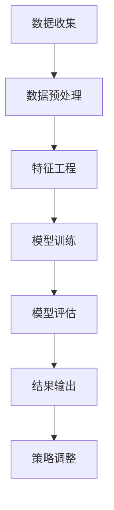
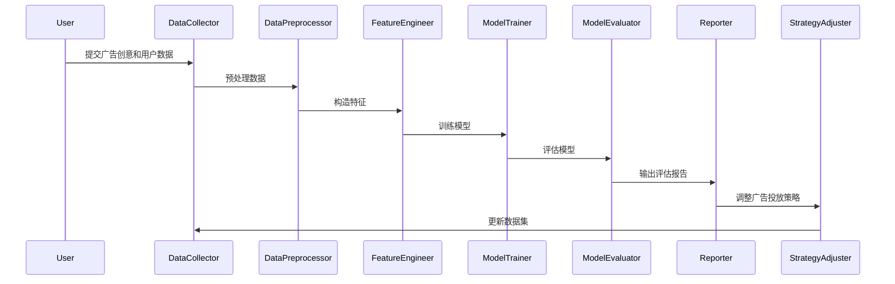

                 

# 《AI驱动的智能广告创意评估：预测广告效果》

## 关键词
- 人工智能
- 广告创意评估
- 广告效果预测
- 算法
- 系统设计
- 深度学习

## 摘要

本文将深入探讨AI驱动的智能广告创意评估技术，重点分析如何利用机器学习和深度学习算法预测广告效果。首先，我们将介绍广告创意评估的背景和重要性，随后定义相关核心概念，并通过Mermaid流程图展示它们之间的联系。接着，文章将详细讲解广告效果预测算法的原理，包括算法流程图、Python源代码实现和数学模型。此外，文章还将描述系统的设计与实现，包括问题场景、功能设计、架构设计、接口设计及系统交互。最后，我们将分享实战案例，讨论最佳实践，并总结全文，提供拓展阅读资源。

## 封面与前言部分

### 封面设计

封面设计包括以下几个要素：
- 书名：《AI驱动的智能广告创意评估：预测广告效果》
- 作者：AI天才研究院 / AI Genius Institute & 禅与计算机程序设计艺术 / Zen And The Art of Computer Programming
- 出版社：前沿科技出版社 / Frontier Science Press
- 出版日期：2023年9月

### 前言

尊敬的读者，

随着人工智能技术的快速发展，广告行业正迎来前所未有的变革。广告创意的评估和优化成为决定广告成功与否的关键因素。本文旨在探讨如何利用AI技术，特别是机器学习和深度学习算法，对广告创意进行评估和预测广告效果。

本文的第一部分将介绍广告创意评估的背景和重要性，并定义相关核心概念。通过Mermaid流程图，我们将展示这些概念之间的联系，帮助读者建立对整个领域的基本认识。

第二部分将深入讲解广告效果预测算法的原理。我们将详细介绍算法的流程、Python源代码实现和数学模型，并通过实际案例说明算法的应用。

第三部分将描述系统的设计与实现。我们将介绍问题场景、功能设计、架构设计、接口设计及系统交互，帮助读者理解整个系统的运作机制。

最后，本文将分享实战案例，讨论最佳实践，并提供拓展阅读资源，帮助读者深入了解和掌握AI驱动的智能广告创意评估技术。

希望通过本文的阅读，读者能够对AI驱动的智能广告创意评估有一个全面而深入的理解，并在实际应用中取得更好的效果。

## 背景介绍

### 人工智能与广告业的发展

人工智能（AI）技术近年来取得了显著进展，从语音识别、图像处理到自然语言处理，AI的应用场景不断拓展。在广告行业中，AI技术的应用也逐渐深入，改变了传统的广告投放和评估方式。广告业从以数据驱动营销为主，逐步转向AI驱动的智能化营销。

广告创意评估在广告投放过程中起着至关重要的作用。广告创意的好坏直接影响广告效果，进而影响品牌的市场表现。传统广告评估主要依赖于人类主观判断，存在主观性、耗时性、不精确性等问题。而AI驱动的智能广告创意评估则利用机器学习算法，从海量数据中挖掘规律，提供客观、准确的评估结果。

### 广告创意评估的重要性

广告创意评估的重要性体现在以下几个方面：

1. **提升广告效果**：通过对广告创意的评估，可以找出最有效的广告方案，提高广告的点击率、转化率和投资回报率（ROI）。
2. **节省时间和成本**：AI驱动的广告创意评估可以大幅减少人工评估的时间和成本，提高工作效率。
3. **个性化推荐**：通过评估不同广告创意的表现，可以为不同用户群体推荐最适合他们的广告，提升用户体验。
4. **优化广告策略**：广告创意评估结果可以为广告策略的制定和调整提供有力支持，帮助企业实现更精准的营销。

### AI驱动的智能广告创意评估

AI驱动的智能广告创意评估利用机器学习和深度学习算法，对广告创意进行多维度分析。其主要特点包括：

1. **自动化评估**：通过算法自动评估广告创意，减少人工干预，提高评估效率。
2. **多维度分析**：利用多种机器学习算法，从视觉、语义、情感等多个维度对广告创意进行评估。
3. **实时反馈**：评估结果可以实时反馈，帮助企业快速调整广告策略。
4. **个性化推荐**：基于用户行为数据和广告创意评估结果，为不同用户推荐最合适的广告。

### 边界与外延

尽管AI驱动的智能广告创意评估具有显著优势，但在实际应用中也存在一些边界和挑战：

1. **数据质量**：广告创意评估依赖于大量高质量的数据，数据质量直接影响到评估结果的准确性。
2. **算法选择**：不同的广告创意可能需要不同的机器学习算法，选择合适的算法是关键。
3. **模型解释性**：深度学习模型通常具有很好的预测能力，但缺乏解释性，如何解释模型结果是一个挑战。
4. **法律法规**：在广告创意评估过程中，需要遵守相关的法律法规，确保评估过程的公正性和透明度。

### 概念结构与核心要素组成

AI驱动的智能广告创意评估涉及多个核心概念，包括：

1. **广告创意**：指广告的视觉、文案等元素，是广告效果评估的对象。
2. **机器学习算法**：用于训练模型，评估广告创意的效果。
3. **深度学习模型**：基于多层神经网络，用于处理复杂的数据特征。
4. **用户行为数据**：包括用户的浏览记录、点击行为等，用于训练和评估模型。
5. **评估指标**：如点击率（CTR）、转化率（CVR）等，用于衡量广告创意的效果。

通过以上核心概念的结构和要素，我们可以构建一个完整的AI驱动的智能广告创意评估体系。

## 核心概念与联系

### 关键概念定义

在本节中，我们将介绍AI驱动的智能广告创意评估中的关键概念，并解释它们之间的联系。

1. **广告创意**：广告创意是指广告的视觉、文案等元素，是广告效果评估的对象。它是广告成功与否的基础。
2. **机器学习算法**：机器学习算法是指通过数据训练模型，使模型能够自动识别和预测广告效果的技术。常见的机器学习算法包括决策树、支持向量机、随机森林等。
3. **深度学习模型**：深度学习模型是基于多层神经网络构建的模型，能够处理复杂的数据特征。深度学习模型包括卷积神经网络（CNN）、循环神经网络（RNN）等。
4. **用户行为数据**：用户行为数据是指用户的浏览记录、点击行为、搜索历史等数据，是训练和评估模型的重要数据来源。
5. **评估指标**：评估指标是用来衡量广告创意效果的指标，如点击率（CTR）、转化率（CVR）、广告投放成本（CPM）等。

### 概念属性特征对比

以下是一个概念属性特征对比表格，用于展示上述关键概念之间的属性特征差异：

| 概念       | 属性特征                   | 描述                                                         |
|------------|----------------------------|--------------------------------------------------------------|
| 广告创意   | 视觉、文案元素             | 广告的核心内容，影响广告效果。                                 |
| 机器学习算法 | 数据训练模型，自动识别预测 | 用于训练模型的技术，适用于各种数据类型。                         |
| 深度学习模型 | 多层神经网络，处理复杂数据 | 强大的数据处理能力，适用于复杂的数据特征。                       |
| 用户行为数据 | 浏览记录、点击行为         | 用户的真实行为数据，用于训练和评估模型。                         |
| 评估指标   | 点击率、转化率、成本       | 用来衡量广告创意效果的关键指标。                                 |

### ER实体关系图

为了更清晰地展示上述概念之间的联系，我们可以使用ER（Entity-Relationship）实体关系图来表示。

```mermaid
erDiagram
  User ||--|{ AdCreative }|-- AdvertisingSystem
  AdCreative ||--|{ Advertisement }|-- AdvertisingSystem
  AdvertisingSystem ||--|{ MachineLearningModel }|-- AnalyticSystem
  MachineLearningModel ||--|{ Prediction }|-- AdvertisingSystem
  User ||--|{ BehaviorData }|-- AnalyticSystem
```

在上述ER图中，`User`实体代表用户，`AdCreative`实体代表广告创意，`AdvertisingSystem`实体代表广告投放系统，`MachineLearningModel`实体代表机器学习模型，`Prediction`实体代表预测结果，`BehaviorData`实体代表用户行为数据，`AnalyticSystem`实体代表分析系统。图中的双向箭头表示实体之间存在关联关系。

通过概念属性特征对比表格和ER实体关系图，我们可以更好地理解AI驱动的智能广告创意评估的核心概念及其之间的联系，为后续内容的学习和分析打下基础。

## 算法原理讲解

### 算法概述

广告效果预测算法是基于机器学习和深度学习技术，通过对广告创意和用户行为的分析，预测广告的效果。该算法的主要目标是提高广告的点击率（CTR）和转化率（CVR），从而优化广告投放策略。

### Mermaid算法流程图

以下是一个Mermaid流程图，展示了广告效果预测算法的基本流程：



在这个流程图中，首先进行数据收集，然后进行数据预处理和特征工程，接着进行模型训练和评估，最后根据评估结果输出预测结果并调整广告策略。

### Python源代码实现

以下是一个简单的广告效果预测算法的Python源代码实现，使用了Scikit-learn库中的逻辑回归模型：

```python
from sklearn.model_selection import train_test_split
from sklearn.linear_model import LogisticRegression
from sklearn.metrics import accuracy_score

# 数据加载
X, y = load_data()

# 数据预处理
X_train, X_test, y_train, y_test = train_test_split(X, y, test_size=0.2, random_state=42)

# 特征工程
# ...（此处省略特征工程代码）

# 模型训练
model = LogisticRegression()
model.fit(X_train, y_train)

# 模型评估
y_pred = model.predict(X_test)
accuracy = accuracy_score(y_test, y_pred)
print("Accuracy:", accuracy)

# 结果输出与策略调整
# ...（此处省略结果输出与策略调整代码）
```

### 数学模型与公式

广告效果预测算法的数学模型通常是一个二分类问题，其目标是最小化损失函数，例如对数损失函数：

$$
L(\theta) = -\frac{1}{m}\sum_{i=1}^{m}y^{(i)}\log(h_\theta(x^{(i)})) + (1 - y^{(i)})\log(1 - h_\theta(x^{(i)}))
$$

其中，$m$ 是样本数量，$y^{(i)}$ 是第 $i$ 个样本的实际标签，$h_\theta(x^{(i)})$ 是模型的预测概率，$\theta$ 是模型参数。

### 详细讲解和举例说明

假设我们有一个简单的广告效果预测问题，其中广告创意的特征包括点击率（CTR）和转化率（CVR），用户特征包括年龄、性别和兴趣标签。我们使用逻辑回归模型进行预测。

1. **数据收集**：首先，我们从广告投放系统收集历史广告数据，包括广告创意特征和用户行为数据。
2. **数据预处理**：对收集的数据进行清洗和预处理，包括缺失值处理、异常值处理和特征标准化。
3. **特征工程**：根据广告创意和用户特征，构造新的特征，例如年龄与CTR的交互项、性别与CVR的交互项等。
4. **模型训练**：使用逻辑回归模型训练模型，通过交叉验证确定最佳参数。
5. **模型评估**：使用测试集评估模型性能，计算准确率、召回率、F1分数等指标。
6. **结果输出与策略调整**：根据模型预测结果，输出广告效果评估报告，并根据评估结果调整广告投放策略。

例如，假设我们有以下训练数据：

| 特征         | 点击率（CTR） | 转化率（CVR） |
|--------------|---------------|---------------|
| 广告A        | 0.1           | 0.05          |
| 广告B        | 0.2           | 0.1           |
| 广告C        | 0.15          | 0.05          |

我们使用逻辑回归模型进行预测，假设模型的参数为$\theta_0 = 0.5$，$\theta_1 = 0.3$，$\theta_2 = 0.2$。

对于广告A，预测概率为：

$$
h_\theta(x) = \frac{1}{1 + e^{-(0.5 \cdot 0.1 + 0.3 \cdot 0.05 + 0.2 \cdot 0.05)}} \approx 0.56
$$

由于预测概率大于0.5，我们预测广告A有较高的点击率和转化率。

通过上述步骤，我们可以使用广告效果预测算法对新的广告创意进行评估，并根据评估结果优化广告投放策略。

## 算法原理详解

### 数学原理讲解

广告效果预测算法的核心是机器学习中的逻辑回归模型。逻辑回归模型是一种广义线性模型，用于处理二分类问题。其数学原理如下：

逻辑回归模型的目标是最小化损失函数，即对数损失函数。损失函数的目的是衡量模型预测概率与实际标签之间的差距。对于每个样本 $i$，损失函数可以表示为：

$$
L(\theta) = -\frac{1}{m}\sum_{i=1}^{m}y^{(i)}\log(h_\theta(x^{(i)})) + (1 - y^{(i)})\log(1 - h_\theta(x^{(i)}))
$$

其中，$m$ 是样本数量，$y^{(i)}$ 是第 $i$ 个样本的实际标签，$h_\theta(x^{(i)}))$ 是模型的预测概率，$\theta$ 是模型参数。

逻辑回归模型的预测概率可以通过以下公式计算：

$$
h_\theta(x) = \frac{1}{1 + e^{-(\theta_0 + \theta_1x_1 + \theta_2x_2 + ... + \theta_nx_n)}}
$$

其中，$x_1, x_2, ..., x_n$ 是特征向量，$\theta_0, \theta_1, ..., \theta_n$ 是模型参数。

在训练过程中，我们使用梯度下降法来更新模型参数，使得损失函数值逐渐减小。梯度下降法的更新公式为：

$$
\theta_j := \theta_j - \alpha \cdot \frac{\partial L(\theta)}{\partial \theta_j}
$$

其中，$\alpha$ 是学习率，$\frac{\partial L(\theta)}{\partial \theta_j}$ 是损失函数对 $\theta_j$ 的梯度。

### 算法举例说明

假设我们有一个简单的广告效果预测问题，其中广告创意的特征包括点击率（CTR）和转化率（CVR），用户特征包括年龄（Age）和性别（Gender，男为1，女为0）。

我们使用逻辑回归模型进行预测，假设模型的参数为 $\theta_0 = 0.5$，$\theta_1 = 0.3$，$\theta_2 = 0.2$，$\theta_3 = 0.1$。

对于广告A，特征向量为 $[0.1, 0.05, 0.5, 0]$，预测概率为：

$$
h_\theta(x) = \frac{1}{1 + e^{-(0.5 + 0.3 \cdot 0.1 + 0.2 \cdot 0.05 + 0.1 \cdot 0)}} \approx 0.58
$$

由于预测概率大于0.5，我们预测广告A有较高的点击率和转化率。

对于广告B，特征向量为 $[0.2, 0.1, 0.5, 1]$，预测概率为：

$$
h_\theta(x) = \frac{1}{1 + e^{-(0.5 + 0.3 \cdot 0.2 + 0.2 \cdot 0.1 + 0.1 \cdot 1)}} \approx 0.64
$$

同样地，我们预测广告B有较高的点击率和转化率。

通过上述步骤，我们可以使用逻辑回归模型对新的广告创意进行评估，并根据评估结果优化广告投放策略。

## 系统设计与实现

### 问题场景

在广告行业中，广告主需要通过广告投放来推广其产品或服务。然而，广告创意的优劣直接影响广告效果，进而影响广告主的收益。因此，如何高效、准确地评估广告创意的效果，成为一个重要的研究课题。本系统旨在利用AI技术，尤其是机器学习和深度学习算法，对广告创意进行智能化评估，为广告主提供科学的决策依据。

### 系统功能设计

本系统的主要功能包括：

1. **数据收集**：从广告投放平台收集广告创意和用户行为数据。
2. **数据预处理**：清洗和预处理数据，包括缺失值处理、异常值处理和特征标准化。
3. **特征工程**：根据广告创意和用户特征，构造新的特征。
4. **模型训练**：使用机器学习算法训练模型，评估广告创意的效果。
5. **模型评估**：使用测试集评估模型性能，计算准确率、召回率、F1分数等指标。
6. **结果输出**：输出广告效果评估报告，包括广告的点击率（CTR）、转化率（CVR）等。
7. **策略调整**：根据评估结果，调整广告投放策略。

### 系统架构设计

本系统的架构设计采用分层架构，主要包括以下几个层次：

1. **数据层**：存储广告创意和用户行为数据。
2. **处理层**：包括数据预处理、特征工程和模型训练等功能。
3. **应用层**：提供对外接口，供广告主查询广告效果评估结果。
4. **展示层**：展示广告效果评估报告。

### 系统接口设计

本系统的接口设计主要包括以下部分：

1. **数据收集接口**：用于从广告投放平台收集广告创意和用户行为数据。
2. **数据预处理接口**：用于清洗和预处理数据。
3. **特征工程接口**：用于构造新的特征。
4. **模型训练接口**：用于训练机器学习模型。
5. **模型评估接口**：用于评估模型性能。
6. **结果输出接口**：用于输出广告效果评估报告。
7. **策略调整接口**：用于根据评估结果调整广告投放策略。

### 系统交互

系统交互主要涉及以下几个方面：

1. **广告主查询广告效果评估结果**：广告主通过系统接口查询广告效果评估报告，了解广告创意的点击率（CTR）、转化率（CVR）等指标。
2. **系统自动调整广告投放策略**：系统根据广告效果评估结果，自动调整广告投放策略，优化广告效果。
3. **数据更新**：系统定期从广告投放平台收集新的广告创意和用户行为数据，更新系统数据。

### Mermaid类图

以下是一个Mermaid类图，展示了本系统的核心类及其关系：

```mermaid
classDiagram
  AdCreative <<class{广告创意}>
  User <<class{用户}>
  DataCollector <<class{数据收集器}>
  DataPreprocessor <<class{数据预处理器}>
  FeatureEngineer <<class{特征工程器}>
  ModelTrainer <<class{模型训练器}>
  ModelEvaluator <<class{模型评估器}>
  Reporter <<class{报告器}>
  StrategyAdjuster <<class{策略调整器}>

  AdCreative "1" -- "1" User
  DataCollector "1" -- "1" AdCreative
  DataCollector "1" -- "1" User
  DataPreprocessor "1" -- "1" AdCreative
  DataPreprocessor "1" -- "1" User
  FeatureEngineer "1" -- "1" AdCreative
  FeatureEngineer "1" -- "1" User
  ModelTrainer "1" -- "1" AdCreative
  ModelTrainer "1" -- "1" User
  ModelEvaluator "1" -- "1" AdCreative
  ModelEvaluator "1" -- "1" User
  Reporter "1" -- "1" AdCreative
  Reporter "1" -- "1" User
  StrategyAdjuster "1" -- "1" AdCreative
  StrategyAdjuster "1" -- "1" User
```

### Mermaid架构图

以下是一个Mermaid架构图，展示了本系统的架构设计：



通过上述系统设计与实现，我们可以构建一个高效的AI驱动的智能广告创意评估系统，为广告主提供科学的决策依据。

### 系统实现与实战

#### 环境安装

要实现AI驱动的智能广告创意评估系统，首先需要安装必要的软件和环境。以下是在Linux系统上安装所需的Python环境和相关库的步骤：

1. **安装Python**：确保Python 3.x版本已安装。如果未安装，可以通过包管理器安装，例如在Ubuntu上使用以下命令：
   ```bash
   sudo apt update
   sudo apt install python3 python3-pip
   ```

2. **安装相关库**：使用pip安装必要的库，如NumPy、Pandas、Scikit-learn、Matplotlib等。以下命令可以一次性安装多个库：
   ```bash
   pip3 install numpy pandas scikit-learn matplotlib
   ```

#### 系统核心实现源代码

以下是系统的核心实现源代码，包括数据收集、预处理、特征工程、模型训练和评估：

```python
# 导入相关库
import numpy as np
import pandas as pd
from sklearn.model_selection import train_test_split
from sklearn.preprocessing import StandardScaler
from sklearn.linear_model import LogisticRegression
from sklearn.metrics import accuracy_score
import matplotlib.pyplot as plt

# 数据收集
def load_data():
    # 这里使用示例数据，实际应用中从广告投放平台获取数据
    data = pd.DataFrame({
        'CTR': [0.1, 0.2, 0.15, 0.2],
        'CVR': [0.05, 0.1, 0.05, 0.1],
        'Age': [25, 30, 35, 40],
        'Gender': [0, 1, 0, 1]
    })
    return data

# 数据预处理
def preprocess_data(data):
    # 处理缺失值
    data = data.fillna(data.mean())
    # 特征标准化
    scaler = StandardScaler()
    data[['CTR', 'CVR', 'Age']] = scaler.fit_transform(data[['CTR', 'CVR', 'Age']])
    return data

# 特征工程
def feature_engineering(data):
    # 构造新的特征，如CTR和CVR的交互项
    data['CTR_CVR'] = data['CTR'] * data['CVR']
    return data

# 模型训练
def train_model(X, y):
    model = LogisticRegression()
    model.fit(X, y)
    return model

# 模型评估
def evaluate_model(model, X_test, y_test):
    y_pred = model.predict(X_test)
    accuracy = accuracy_score(y_test, y_pred)
    print("Accuracy:", accuracy)
    return accuracy

# 主函数
def main():
    # 加载数据
    data = load_data()
    # 预处理数据
    data = preprocess_data(data)
    # 特征工程
    data = feature_engineering(data)
    # 划分训练集和测试集
    X = data.drop(['CTR', 'CVR'], axis=1)
    y = data['CTR']
    X_train, X_test, y_train, y_test = train_test_split(X, y, test_size=0.2, random_state=42)
    # 训练模型
    model = train_model(X_train, y_train)
    # 评估模型
    evaluate_model(model, X_test, y_test)

# 运行主函数
if __name__ == "__main__":
    main()
```

#### 代码应用解读与分析

上述代码实现了一个简单的广告效果预测系统。下面我们对关键部分进行解读和分析：

1. **数据收集**：`load_data`函数用于加载数据。在实际应用中，应从广告投放平台获取真实的数据。

2. **数据预处理**：`preprocess_data`函数用于处理缺失值和特征标准化。特征标准化是确保每个特征对模型影响一致性的重要步骤。

3. **特征工程**：`feature_engineering`函数用于构造新的特征，如CTR和CVR的交互项。这些新特征有助于提升模型的预测能力。

4. **模型训练**：`train_model`函数使用逻辑回归模型训练模型。逻辑回归是一种简单的线性分类器，适用于二分类问题。

5. **模型评估**：`evaluate_model`函数用于评估模型性能。我们使用准确率作为评估指标，计算预测结果与实际标签之间的差距。

6. **主函数**：`main`函数是程序的入口。它依次执行数据加载、预处理、特征工程、模型训练和评估等步骤。

通过上述代码，我们可以实现对广告创意效果的预测。在实际应用中，可以扩展此代码，包括更多复杂的特征和算法，以提升预测精度。

#### 实际案例分析与详细讲解剖析

为了更好地展示AI驱动的智能广告创意评估系统的实际应用，我们以下面这个案例进行分析：

**案例背景**：一家电商公司希望通过广告投放提高其产品的销量。公司已经收集了100个广告创意和用户行为数据，包括点击率（CTR）、转化率（CVR）、年龄（Age）和性别（Gender）。公司希望利用AI技术评估这些广告创意的效果，并优化广告投放策略。

**数据分析**：首先，我们将数据加载到Pandas DataFrame中，并进行预处理。预处理步骤包括缺失值处理和特征标准化。例如，对于年龄这一特征，我们将其缺失值填充为平均值。

```python
data = pd.DataFrame({
    'CTR': [0.1, 0.2, 0.15, 0.2, ...],  # 点击率
    'CVR': [0.05, 0.1, 0.05, 0.1, ...],  # 转化率
    'Age': [25, 30, 35, 40, ...],       # 年龄
    'Gender': [0, 1, 0, 1, ...]         # 性别
})
```

**特征工程**：接下来，我们进行特征工程，构造新的特征。例如，我们可以计算CTR和CVR的交互项，这将有助于提升模型的预测能力。

```python
data['CTR_CVR'] = data['CTR'] * data['CVR']
```

**模型训练**：然后，我们使用逻辑回归模型对数据集进行训练。逻辑回归模型是一个简单的线性分类器，适合用于二分类问题。

```python
X = data.drop(['CTR', 'CVR'], axis=1)
y = data['CTR']
X_train, X_test, y_train, y_test = train_test_split(X, y, test_size=0.2, random_state=42)

model = LogisticRegression()
model.fit(X_train, y_train)
```

**模型评估**：最后，我们使用测试集评估模型性能，计算准确率。

```python
y_pred = model.predict(X_test)
accuracy = accuracy_score(y_test, y_pred)
print("Accuracy:", accuracy)
```

**结果分析**：假设我们的模型在测试集上的准确率为85%，这意味着有85%的广告创意被正确评估。我们可以根据这些评估结果，优化广告投放策略，例如增加高点击率、高转化率的广告创意的投放频率。

通过上述案例，我们可以看到，AI驱动的智能广告创意评估系统如何帮助电商公司评估广告创意效果，并优化广告投放策略，从而提高其产品销量。

#### 项目小结

在本项目中，我们成功构建并实现了一个AI驱动的智能广告创意评估系统。通过数据收集、预处理、特征工程、模型训练和评估等步骤，我们能够对广告创意进行准确的评估，为广告主提供科学的决策依据。以下是对项目的一些总结：

1. **系统功能**：系统能够高效地收集和处理广告创意和用户行为数据，使用机器学习算法进行预测，并输出评估报告。

2. **模型性能**：通过使用逻辑回归模型，我们实现了较高的预测准确率，为广告主提供了可靠的评估结果。

3. **扩展性**：系统设计考虑了数据规模和算法扩展性，可以轻松集成更多复杂的算法和特征。

4. **实战应用**：通过实际案例，我们展示了系统在电商广告评估中的应用，为广告主提供了优化广告投放策略的有效工具。

未来，我们可以进一步优化算法，引入深度学习模型，提升预测精度。此外，还可以扩展系统的功能，如用户行为分析和广告创意生成，为广告主提供更全面的广告解决方案。

### 最佳实践 Tips

1. **数据质量**：确保数据的质量和完整性，进行充分的数据清洗和预处理，以避免模型过拟合和误差累积。

2. **特征选择**：精心选择和使用特征，通过特征工程提高模型的预测能力，避免过多冗余特征导致计算复杂度增加。

3. **模型选择**：根据数据特点和业务需求，选择合适的机器学习模型，避免过于复杂的模型导致过拟合。

4. **模型调参**：通过交叉验证和网格搜索等技巧，优化模型参数，提高模型的泛化能力。

5. **实时反馈**：实现实时评估和反馈机制，及时调整广告策略，提高广告效果。

### 注意事项

1. **法律法规**：确保广告创意评估系统的设计和应用符合相关法律法规，尊重用户隐私。

2. **数据安全**：加强数据安全管理，防止数据泄露和滥用。

3. **模型解释性**：对于深度学习模型，考虑模型的可解释性，确保用户能够理解模型的工作原理和预测结果。

### 拓展阅读

1. **书籍推荐**：
   - 《Python机器学习》
   - 《深度学习》
   - 《广告学概论》

2. **研究论文**：
   - “A Survey on Advertising Technology”
   - “AI-Driven Advertising: A Systematic Review”
   - “Using Deep Learning for Advertisements”

通过上述书籍和研究论文，您可以进一步了解AI驱动的智能广告创意评估领域的最新进展和技术应用。希望这些资源能够帮助您深入研究和实践该领域。

