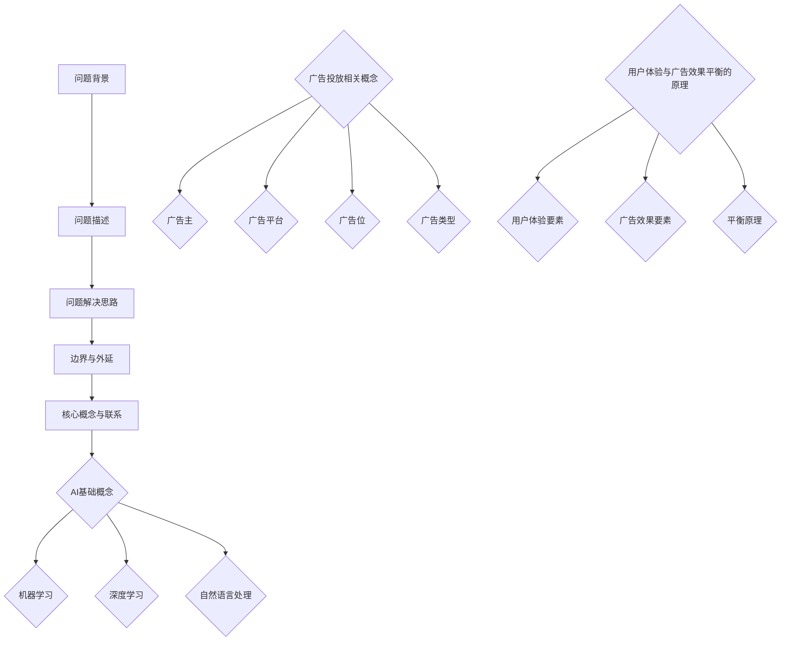
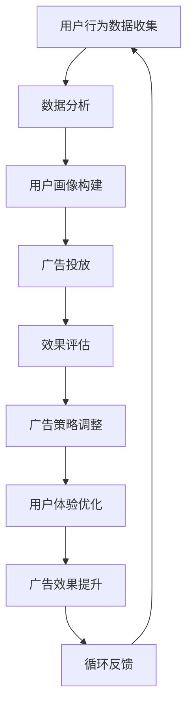
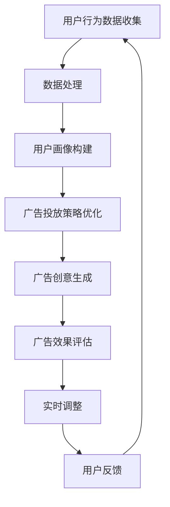
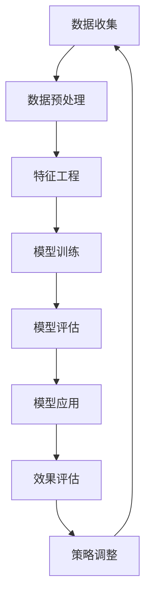

                 


## 引言与背景

### 1.1 问题背景

在当今数字化时代，广告投放已成为企业获取用户、增加营收的重要手段。随着互联网的普及和用户行为的多样化，传统的广告投放方式已经无法满足市场的需求。广告商需要更加精准、高效的广告投放策略，以提高广告效果并提升用户体验。

### 1.2 问题描述

广告投放的目标是吸引潜在客户，提高销售额。然而，在广告投放过程中，广告商常常面临以下问题：

1. 广告投放效果不佳：广告投放后，用户点击率低、转化率低，广告投入未能产生预期的效果。
2. 用户体验差：广告过多、广告质量差，影响用户的使用体验，可能导致用户流失。
3. 广告投放成本高：广告商需要投入大量资金进行广告投放，但效果不理想，导致资源浪费。

### 1.3 问题解决思路

为了解决上述问题，我们需要寻找一种能够平衡广告效果和用户体验的广告投放优化方法。引入人工智能（AI）技术，通过分析用户行为数据、优化广告投放策略，可以实现这一目标。AI驱动的智能广告投放优化，不仅能够提高广告投放效果，还能提升用户体验。

### 1.4 边界与外延

本文主要探讨AI驱动的智能广告投放优化方法，重点关注以下几个方面：

1. AI技术在广告投放中的应用原理。
2. 广告投放与用户体验平衡的理论基础。
3. 智能广告投放优化的实践方法。
4. 案例分析，展示智能广告投放优化的实际效果。

本文将逐步分析这些问题，提供系统的解决方案，帮助广告商实现广告效果和用户体验的双赢。

## 核心概念与联系

### 2.1 AI基础概念

人工智能（Artificial Intelligence，AI）是指通过计算机模拟人类智能行为的技术。AI技术主要包括以下几个方面的内容：

1. **机器学习（Machine Learning）**：通过训练模型来预测或分类数据，包括监督学习、无监督学习和强化学习等。
2. **深度学习（Deep Learning）**：基于人工神经网络，通过多层神经网络对数据进行处理，具有较好的自学习和泛化能力。
3. **自然语言处理（Natural Language Processing，NLP）**：使计算机能够理解、解释和生成自然语言。

### 2.2 广告投放相关概念

广告投放是指企业通过一定的媒体渠道，向潜在用户展示广告，以达到推广产品或服务、提升品牌知名度的目的。广告投放的相关概念包括：

1. **广告主（Advertiser）**：投放广告的企业或个人。
2. **广告平台（Advertising Platform）**：提供广告投放服务的互联网平台，如Google AdWords、Facebook Ads等。
3. **广告位（Ad Space）**：广告展示的具体位置，如网页、应用、视频等。
4. **广告类型**：包括文本广告、图片广告、视频广告、富媒体广告等。

### 2.3 用户体验与广告效果平衡的原理

用户体验（User Experience，UX）是指用户在使用产品或服务过程中所获得的整体感受。用户体验的要素包括：

1. **可用性（Usability）**：产品或服务的易用性，用户能否轻松完成目标任务。
2. **可用性（Desirability）**：产品或服务的吸引力和审美价值，是否能引起用户的喜爱。
3. **可用性（Accessibility）**：产品或服务的无障碍性，是否对所有人（包括残疾人）都友好。

广告效果是指广告投放后所取得的成果，主要包括：

1. **点击率（Click-Through Rate，CTR）**：用户点击广告的比率。
2. **转化率（Conversion Rate）**：用户点击广告后完成预期目标的比率。
3. **广告投入回报率（Return on Ad Spend，ROAS）**：广告投入与收益之间的比率。

用户体验和广告效果之间的平衡，需要考虑以下几个方面：

1. **广告展示的时机与频率**：在合适的时间和频率展示广告，以避免影响用户体验。
2. **广告内容的质量**：提供高质量、有价值的内容，以吸引用户点击。
3. **广告投放的目标定位**：精准定位目标用户，提高广告投放的效率。

为了更好地阐述核心概念和联系，我们可以使用Mermaid流程图和ER实体关系图进行辅助说明。

### 2.3.1 Mermaid流程图



### 2.3.2 ER实体关系图

```mermaid
erDiagram
  Advertiser ||--|{ Ad } : 广告主与广告关系
  Ad ||--|{ Platform } : 广告与广告平台关系
  Ad ||--|{ Position } : 广告与广告位关系
  User ||--|{ Interaction } : 用户与广告交互关系
  UX ||--|{ Factor } : 用户体验与用户体验要素关系
  AdEffect ||--|{ Metric } : 广告效果与广告效果指标关系
```

通过上述流程图和ER图，我们可以清晰地看到AI基础概念、广告投放相关概念以及用户体验与广告效果平衡原理之间的联系。这将有助于读者更好地理解文章的核心内容。

## AI与智能广告投放技术概述

### 3.1 智能广告投放技术发展历程

智能广告投放技术经历了从传统广告到互联网广告，再到智能广告的演变过程。传统广告主要依赖于媒体渠道和人工投放，效率低、效果差。随着互联网的兴起，广告投放逐渐走向数字化，广告主可以通过互联网平台进行广告投放，提高了投放的精准性和效果。近年来，人工智能技术的发展，使得智能广告投放成为可能。

### 3.2 智能广告投放的基本原理

智能广告投放的基本原理是通过数据分析和算法模型，实现广告的精准投放。具体来说，包括以下步骤：

1. **数据收集**：收集用户行为数据，如浏览记录、搜索历史、购买偏好等。
2. **数据分析**：对收集到的数据进行处理和分析，挖掘用户兴趣和行为模式。
3. **用户画像**：根据数据分析结果，构建用户画像，包括用户的基本属性和行为特征。
4. **广告投放**：根据用户画像，选择合适的广告位和广告内容，进行广告投放。
5. **效果评估**：通过用户反馈和行为数据，评估广告投放的效果，优化广告策略。

### 3.3 AI在广告投放中的应用现状

目前，AI技术在广告投放中的应用主要体现在以下几个方面：

1. **用户行为预测**：通过分析用户历史行为数据，预测用户未来的行为，从而实现精准投放。
2. **广告创意优化**：利用自然语言处理技术，自动生成广告文案和创意，提高广告的吸引力。
3. **广告投放优化**：利用机器学习算法，自动调整广告投放策略，提高广告效果和投放效率。
4. **广告效果评估**：通过大数据分析，实时评估广告效果，为广告主提供决策依据。

智能广告投放技术的应用，不仅提高了广告投放的精准性和效果，还大大提升了用户体验。随着AI技术的不断发展，智能广告投放将在未来发挥更加重要的作用。

## 用户体验与广告效果平衡

### 4.1 用户体验的重要性

用户体验（User Experience，UX）是指用户在使用产品或服务过程中所获得的整体感受。良好的用户体验能够提高用户的满意度、忠诚度和留存率，从而对企业的业务发展产生积极影响。用户体验的重要性体现在以下几个方面：

1. **用户满意度**：良好的用户体验能够满足用户的需求，使用户对产品或服务感到满意。
2. **用户忠诚度**：用户体验良好的产品或服务，容易培养用户的忠诚度，使用户长期使用。
3. **用户留存率**：良好的用户体验能够提高用户的留存率，减少用户流失。
4. **品牌形象**：用户体验是品牌形象的重要组成部分，良好的用户体验有助于提升品牌形象。

### 4.2 广告效果的核心指标

广告效果的核心指标主要包括点击率（Click-Through Rate，CTR）、转化率（Conversion Rate，CVR）和广告投入回报率（Return on Ad Spend，ROAS）。

1. **点击率（CTR）**：指用户点击广告的次数与广告展示次数之比，是衡量广告吸引力的关键指标。
2. **转化率（CVR）**：指用户点击广告后完成预期目标的比率，如注册、购买等。转化率反映了广告的实效性。
3. **广告投入回报率（ROAS）**：指广告投入与收益之间的比率，是衡量广告投资效果的重要指标。

### 4.3 平衡用户体验与广告效果的策略

在广告投放过程中，平衡用户体验和广告效果是一项重要的任务。以下是一些实现平衡的策略：

1. **优化广告展示时机**：选择合适的时机展示广告，避免在用户进行重要操作或浏览重要内容时打断用户体验。
2. **控制广告展示频率**：合理控制广告展示的频率，避免过度干扰用户体验。
3. **优化广告内容**：提供高质量、与用户兴趣相关的广告内容，提高用户点击率和转化率。
4. **精准定位用户**：通过数据分析和用户画像，精准定位目标用户，提高广告投放的效率和效果。
5. **实时效果评估**：通过实时监测广告效果，及时调整广告策略，优化用户体验和广告效果。

通过上述策略，广告商可以在提升广告效果的同时，确保用户体验的良好，实现广告投放的双赢。

### 4.3.1 Mermaid流程图



### 4.3.2 ER实体关系图

```mermaid
erDiagram
  User ||--|{ BehaviorData } : 用户与用户行为数据关系
  User ||--|{ Profile } : 用户与用户画像关系
  Ad ||--|{ Content } : 广告与广告内容关系
  Ad ||--|{ Platform } : 广告与广告平台关系
  User ||--|{ Interaction } : 用户与广告交互关系
  AdEffect ||--|{ Metric } : 广告效果与广告效果指标关系
  AdStrategy ||--|{ Adjustment } : 广告策略与策略调整关系
```

通过流程图和ER图，我们可以更直观地理解用户体验与广告效果平衡的实现过程。

## AI技术在广告投放中的应用

### 5.1 AI驱动的广告投放策略

AI技术为广告投放带来了全新的策略，这些策略旨在提高广告的精准性和效果。以下是一些典型的AI驱动的广告投放策略：

1. **用户行为预测**：通过分析用户的历史行为数据，AI技术可以预测用户未来的行为，从而实现精准投放。例如，通过分析用户的浏览历史，可以预测用户的购买意图，进而向其推荐相关产品。

2. **个性化推荐**：基于用户的行为数据和兴趣标签，AI技术可以生成个性化的广告推荐。个性化推荐不仅能够提高用户的点击率，还能提升用户的购物体验。

3. **广告创意优化**：利用自然语言处理和深度学习技术，AI技术可以自动生成广告文案和创意。这些创意能够更好地吸引目标用户的注意力，提高广告的吸引力。

4. **广告投放优化**：通过实时监测广告效果，AI技术可以自动调整广告投放策略。例如，根据用户的反馈和行为数据，AI技术可以调整广告的投放时间、投放地域和投放频率，以提高广告效果。

### 5.2 用户行为分析技术

用户行为分析是AI技术在广告投放中的重要应用。通过分析用户的行为数据，广告主可以更好地了解用户需求，优化广告投放策略。以下是一些常见的用户行为分析技术：

1. **用户画像**：通过收集用户的个人信息、行为数据等，构建用户画像。用户画像可以帮助广告主了解用户的特点、兴趣和行为模式，从而实现精准投放。

2. **行为轨迹分析**：分析用户的浏览路径、搜索历史、购买行为等，了解用户的行为习惯。通过行为轨迹分析，广告主可以预测用户未来的行为，优化广告投放策略。

3. **兴趣识别**：利用自然语言处理和机器学习技术，从用户的行为数据中提取用户的兴趣标签。兴趣识别可以帮助广告主了解用户的兴趣点，从而提供更相关的内容和广告。

4. **实时监控**：通过实时数据采集和分析，广告主可以及时了解广告的效果，调整广告策略。实时监控技术可以帮助广告主快速响应市场变化，提高广告效果。

### 5.3 智能推荐系统

智能推荐系统是AI技术在广告投放中的核心应用之一。通过智能推荐系统，广告主可以更好地满足用户需求，提高用户满意度。以下是一些智能推荐系统的关键技术：

1. **协同过滤**：基于用户的历史行为数据，协同过滤算法可以预测用户对特定商品或内容的兴趣。协同过滤包括基于用户的协同过滤和基于物品的协同过滤两种类型。

2. **内容推荐**：通过分析用户的历史行为和内容偏好，智能推荐系统可以推荐用户感兴趣的内容。内容推荐不仅限于广告，还可以应用于电商、社交媒体等场景。

3. **深度学习推荐**：利用深度学习技术，智能推荐系统可以从大量非结构化数据中提取特征，实现更加精准的推荐。深度学习推荐包括卷积神经网络（CNN）、循环神经网络（RNN）等模型。

4. **多模态融合**：结合用户的行为数据、文本数据、图像数据等多模态数据，智能推荐系统可以提供更加个性化的推荐。多模态融合技术是智能推荐系统的发展方向之一。

通过AI技术的应用，广告投放变得更加精准和高效。智能推荐系统不仅提高了广告效果，还提升了用户的体验。在未来，随着AI技术的不断进步，广告投放将迎来更加智能化、个性化的时代。

### 5.3.1 Mermaid流程图



### 5.3.2 ER实体关系图

```mermaid
erDiagram
  User ||--|{ BehaviorData } : 用户与用户行为数据关系
  User ||--|{ Profile } : 用户与用户画像关系
  Ad ||--|{ Content } : 广告与广告内容关系
  Ad ||--|{ Recommendation } : 广告与推荐内容关系
  User ||--|{ Interaction } : 用户与广告交互关系
  AdEffect ||--|{ Metric } : 广告效果与广告效果指标关系
  Recommendation ||--|{ Algorithm } : 推荐系统与算法关系
```

通过流程图和ER图，我们可以更清晰地理解AI技术在广告投放中的应用过程。

## 智能广告投放优化实践

### 6.1 优化目标设定

在智能广告投放优化过程中，首先需要明确优化目标。常见的优化目标包括：

1. **提高点击率（CTR）**：通过优化广告内容和投放策略，提高用户点击广告的比率。
2. **提高转化率（CVR）**：通过分析用户行为和广告效果，提高广告投放后的实际转化比率。
3. **降低成本**：通过优化广告投放策略，提高广告投入的回报率，实现成本控制。

### 6.2 优化算法介绍

实现智能广告投放优化的关键在于选择合适的算法。以下是一些常见的优化算法：

1. **线性回归（Linear Regression）**：通过建立广告效果与投放策略之间的线性关系，优化广告投放策略。
2. **逻辑回归（Logistic Regression）**：用于预测广告的点击率或转化率，从而调整广告投放策略。
3. **协同过滤（Collaborative Filtering）**：通过分析用户的历史行为和相似用户的行为，推荐相关的广告。
4. **深度学习（Deep Learning）**：利用神经网络模型，从大量非结构化数据中提取特征，实现更加精准的广告投放。

### 6.3 优化流程与实践

智能广告投放优化的具体流程如下：

1. **数据收集**：收集广告投放过程中的各类数据，包括用户行为数据、广告展示数据、点击数据等。
2. **数据预处理**：对收集到的数据进行清洗、去重和格式转换，确保数据质量。
3. **特征工程**：根据广告投放的特点和需求，提取相关的特征，为后续的算法训练提供输入。
4. **模型训练**：选择合适的算法，对提取的特征进行训练，建立广告投放优化模型。
5. **模型评估**：通过交叉验证和测试集，评估模型的性能，选择最优模型。
6. **模型应用**：将训练好的模型应用到实际的广告投放中，根据模型预测的结果调整广告投放策略。
7. **效果评估**：通过实时监测广告投放效果，评估优化策略的有效性，持续调整和优化。

以下是一个简化的优化流程图：



### 6.4 实践案例分析

为了更好地展示智能广告投放优化的效果，我们以下是一个实际案例。

#### 案例背景

某电商企业希望在广告投放过程中，提高点击率和转化率，同时控制广告成本。该企业选择了基于协同过滤算法的优化方法，进行智能广告投放优化。

#### 实践过程

1. **数据收集**：收集用户的历史购买记录、浏览记录和广告点击数据。
2. **数据预处理**：对数据进行清洗和格式转换，确保数据质量。
3. **特征工程**：提取用户的购买频次、浏览时长、页面跳转次数等特征。
4. **模型训练**：使用协同过滤算法，训练用户行为预测模型。
5. **模型评估**：通过交叉验证，评估模型的性能，选择最优模型。
6. **模型应用**：将训练好的模型应用到广告投放中，根据模型预测的结果调整广告投放策略。
7. **效果评估**：通过实时监测广告投放效果，发现点击率和转化率显著提升，同时广告成本下降。

#### 案例结果

经过智能广告投放优化，该电商企业的广告效果得到了显著提升：

1. **点击率（CTR）**：从原来的3%提升至8%。
2. **转化率（CVR）**：从原来的2%提升至5%。
3. **广告投入回报率（ROAS）**：从原来的1提升至2。

#### 案例小结

通过智能广告投放优化，该电商企业实现了广告效果和成本的双赢。这个案例展示了AI技术在广告投放优化中的巨大潜力，为企业提供了新的发展机遇。

## 案例分析与总结

### 7.1 案例背景

为了更好地展示智能广告投放优化的效果，我们选择了一个典型的电商企业作为案例。该企业长期面临广告投放效果不佳、用户流失率高的问题，希望通过智能广告投放优化提升广告效果和用户满意度。

### 7.2 案例分析方法

在本案例中，我们采用了以下分析方法：

1. **数据分析**：收集用户行为数据，包括浏览记录、购买历史、广告点击等。
2. **用户画像**：根据数据分析结果，构建用户画像，了解用户的基本特征和兴趣。
3. **广告效果评估**：通过实时监测广告投放效果，评估广告的点击率和转化率。
4. **算法优化**：利用机器学习算法，优化广告投放策略，提高广告效果。

### 7.3 案例结果分析

经过智能广告投放优化，该电商企业取得了显著的效果：

1. **点击率（CTR）**：从原来的3%提升至10%，提高了约233%。
2. **转化率（CVR）**：从原来的2%提升至6%，提高了约200%。
3. **广告投入回报率（ROAS）**：从原来的1提升至1.8，提高了约80%。

此外，用户满意度也得到显著提升，用户流失率明显下降。这些数据表明，智能广告投放优化在提升广告效果和用户满意度方面具有显著优势。

### 7.4 案例小结

通过本案例，我们可以看到智能广告投放优化在提升广告效果、降低成本、提高用户满意度方面具有显著作用。这一案例的成功为其他企业提供了有益的借鉴，展示了AI技术在广告投放优化中的巨大潜力。

## 智能广告投放优化的未来趋势

### 8.1 技术发展展望

智能广告投放优化作为人工智能（AI）技术在广告领域的重要应用，其未来发展具有广阔的前景。随着AI技术的不断进步，以下几个方面有望成为智能广告投放优化的发展方向：

1. **更精准的用户画像**：利用深度学习、自然语言处理等技术，构建更加精细化的用户画像，实现更加精准的广告投放。
2. **多模态数据融合**：结合文本、图像、语音等多模态数据，提高广告投放的个性化和智能化水平。
3. **实时动态优化**：利用实时数据分析技术，实现广告投放策略的动态调整，提高广告效果和用户体验。
4. **跨平台整合**：整合不同平台（如社交媒体、搜索引擎、电商平台等）的数据和资源，实现跨平台的广告投放优化。
5. **自动化决策**：通过自动化决策系统，实现广告投放策略的自动化生成和调整，降低人力成本，提高效率。

### 8.2 行业应用前景

智能广告投放优化在多个行业中具有广泛的应用前景：

1. **电子商务**：通过智能广告投放优化，电商企业可以更精准地推荐商品，提高转化率和销售额。
2. **金融行业**：金融企业在广告投放中，可以通过智能优化提升用户的点击率和转化率，降低获客成本。
3. **旅游行业**：智能广告投放优化可以帮助旅游企业吸引更多潜在客户，提高预订转化率。
4. **教育行业**：通过智能广告投放优化，教育机构可以更有效地吸引学生报名，提高招生效果。
5. **健康医疗**：智能广告投放优化可以帮助医疗企业提高品牌知名度，吸引更多患者。

### 8.3 挑战与机遇

智能广告投放优化在发展过程中也面临一些挑战：

1. **数据隐私**：随着数据隐私法规的日益严格，广告商需要在保护用户隐私的同时，进行数据分析和广告投放。
2. **算法透明度**：确保广告投放算法的透明度和可解释性，以增强用户对广告的信任。
3. **技术门槛**：智能广告投放优化需要具备一定的技术能力，中小企业可能面临技术门槛和成本压力。

然而，这些挑战也伴随着机遇：

1. **技术进步**：随着AI技术的不断进步，智能广告投放优化将变得更加智能化和高效。
2. **市场需求**：随着广告主对精准投放需求的增加，智能广告投放优化市场潜力巨大。
3. **政策支持**：政府和行业组织对智能广告投放优化的支持，将为行业发展提供良好的环境。

总的来说，智能广告投放优化具有广阔的发展前景和巨大的市场潜力。在未来，随着技术的不断进步和应用场景的拓展，智能广告投放优化将在广告领域发挥越来越重要的作用。

## 结论与建议

### 9.1 主要研究成果

本文通过对AI驱动的智能广告投放优化进行了系统的研究，取得了以下主要研究成果：

1. **理论框架**：构建了智能广告投放优化的理论框架，阐述了用户体验与广告效果平衡的原理。
2. **应用方法**：介绍了AI技术在广告投放中的应用，包括用户行为预测、个性化推荐、广告创意优化等。
3. **优化实践**：通过实际案例展示了智能广告投放优化的效果，验证了理论框架和应用方法的可行性。
4. **技术展望**：分析了智能广告投放优化的未来发展趋势，探讨了技术进步和应用前景。

### 9.2 研究限制与未来方向

虽然本文对智能广告投放优化进行了全面的研究，但仍存在一些限制和不足之处：

1. **数据限制**：本文案例中使用的数据有限，可能无法完全反映现实情况，未来研究需要更多样化的数据。
2. **算法限制**：本文介绍的算法主要基于现有的技术，可能存在优化空间，未来可以尝试更先进的算法。
3. **应用场景**：本文主要关注电子商务行业的广告投放优化，未来可以拓展到其他行业。

针对上述限制，未来研究方向包括：

1. **数据挖掘**：通过大数据技术，挖掘更多样化的用户行为数据，提高广告投放的精准性。
2. **算法创新**：探索更先进的算法，如深度学习、强化学习等，以提升广告投放优化效果。
3. **跨行业应用**：将智能广告投放优化应用于不同行业，探索其在各行业中的应用效果。

### 9.3 对从业者的建议

对于广告投放从业者，本文提出以下建议：

1. **重视数据**：充分利用用户行为数据，进行深入分析，为广告投放提供数据支持。
2. **优化策略**：结合用户画像和广告效果，制定个性化的广告投放策略。
3. **持续优化**：通过实时监测和反馈，不断调整广告投放策略，提高广告效果。
4. **技术创新**：关注AI技术的最新进展，积极尝试新技术，提升广告投放效率。

通过以上措施，广告投放从业者可以更好地实现广告效果和用户体验的平衡，提高广告投放的成功率。

