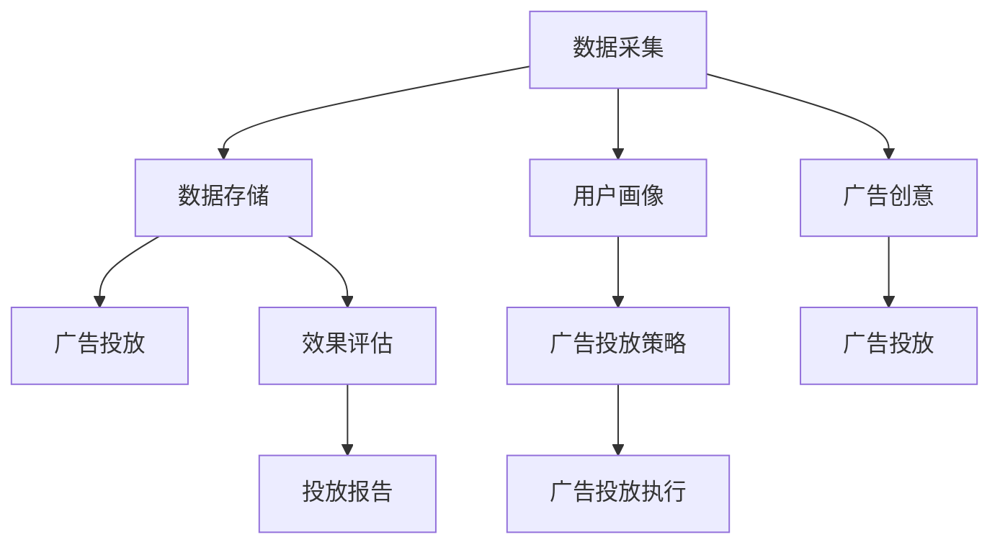

                 

### AI驱动的智能广告投放优化：平衡用户体验和广告效果

**关键词**：AI、智能广告投放、用户体验、广告效果、优化

**摘要**：
本文将深入探讨AI驱动的智能广告投放优化，重点分析如何平衡用户体验和广告效果。随着数字化时代的到来，AI技术在广告投放中的应用日益广泛，它不仅提高了广告投放的精准度，还带来了用户体验的挑战。本文将详细分析AI在广告投放中的应用原理，探讨用户体验和广告效果的平衡策略，并通过实际案例展示AI驱动的智能广告投放优化实践，为相关从业人员提供有价值的参考。

## 目录

1. **引言**  
   - 1.1 AI驱动的智能广告投放概述  
   - 1.2 广告投放与用户体验的关系  
   - 1.3 现有广告投放系统的分析与挑战

2. **核心概念与联系**  
   - 2.1 广告投放与用户体验的基本概念  
   - 2.2 AI算法在广告投放中的应用  
   - 2.3 用户体验与广告效果的平衡策略

3. **算法原理讲解**  
   - 3.1 常用AI算法介绍  
   - 3.2 数学模型与公式解析

4. **系统分析与架构设计**  
   - 4.1 广告投放系统的介绍  
   - 4.2 系统功能设计  
   - 4.3 系统架构设计  
   - 4.4 系统接口设计与交互

5. **项目实战**  
   - 5.1 实际广告投放项目环境安装  
   - 5.2 系统核心实现与代码分析  
   - 5.3 项目案例分析  
   - 5.4 项目小结

6. **最佳实践与小结**  
   - 6.1 平衡用户体验和广告效果的最佳实践  
   - 6.2 注意事项与未来展望

**引言**

随着互联网的普及和数字媒体的发展，广告投放已成为企业营销的重要手段。然而，如何在广告投放中平衡用户体验和广告效果，成为当今数字营销领域的热点问题。传统的广告投放方式主要依赖于人力和经验，广告主需要耗费大量时间和精力来调整广告策略，而广告效果往往难以保证。随着人工智能（AI）技术的发展，AI驱动的智能广告投放逐渐成为可能，为广告投放带来了前所未有的机遇和挑战。

### 1.1 AI驱动的智能广告投放概述

AI驱动的智能广告投放是指利用人工智能技术，对用户行为、兴趣和需求进行深度分析，实现广告的精准投放。具体来说，AI技术在广告投放中的应用主要体现在以下几个方面：

1. **用户画像构建**：通过对用户的行为数据、兴趣爱好、地理位置等多维度信息进行分析，构建精准的用户画像，为后续的广告投放提供数据支持。
2. **广告创意优化**：基于用户画像，自动生成符合用户兴趣和需求的广告创意，提高广告点击率和转化率。
3. **广告投放优化**：利用机器学习和数据挖掘技术，动态调整广告投放策略，实现广告效果的实时优化。
4. **效果评估与反馈**：通过对广告投放效果进行实时监控和分析，为广告主提供详细的投放报告，以便进行后续的优化调整。

### 1.2 广告投放与用户体验的关系

用户体验在广告投放中扮演着至关重要的角色。一个良好的用户体验不仅能提升用户满意度，还能提高广告的点击率和转化率。然而，广告投放与用户体验之间往往存在一定的冲突。

1. **广告内容与用户体验的冲突**：广告内容的过多、过频或不符合用户兴趣，往往会影响用户体验。例如，过多的广告弹窗、强制播放的广告视频等，都会干扰用户的正常浏览和使用体验。
2. **广告投放方式与用户体验的冲突**：传统的广告投放方式往往采用一刀切的策略，无法充分考虑用户的个性化需求。例如，在用户浏览网页时，频繁推送与其无关的广告，会导致用户感到厌烦，从而降低用户体验。

为了平衡广告投放与用户体验，需要采取一系列策略：

1. **个性化广告投放**：基于用户画像和兴趣标签，为用户提供个性化的广告推荐，提高广告的针对性和用户体验。
2. **适时适度的广告投放**：根据用户的行为特征和兴趣，合理安排广告的投放时间和频率，避免过度打扰用户。
3. **优质广告内容**：提高广告内容的质量，制作符合用户兴趣和需求的内容，提高广告的点击率和转化率。

### 1.3 现有广告投放系统的分析与挑战

现有的广告投放系统主要依赖于传统的算法和人工调整，存在以下不足：

1. **精准度不足**：传统的广告投放系统难以准确识别用户的兴趣和需求，导致广告投放的精准度较低。
2. **效率低下**：广告主需要耗费大量时间和精力来调整广告策略，广告投放的效率较低。
3. **用户体验差**：传统的广告投放方式往往导致用户体验差，影响广告的点击率和转化率。

随着AI技术的不断发展，利用AI技术对广告投放系统进行优化，已成为解决这些问题的关键。AI驱动的智能广告投放系统能够通过用户画像、广告创意优化、投放优化和效果评估等环节，实现广告投放的智能化和个性化，提高广告的精准度和用户体验。

### 核心概念与联系

为了深入理解AI驱动的智能广告投放优化，我们需要先了解广告投放、用户体验和AI算法等相关概念，并探讨它们之间的联系。

#### 广告投放

广告投放是指通过互联网、移动应用或其他数字媒体平台，向目标用户展示广告的过程。广告投放的核心目标是提高广告的曝光度，吸引潜在用户，并最终实现广告主的销售目标。广告投放的主要形式包括：

1. **搜索广告**：用户在搜索引擎中输入关键词时，广告主可以根据关键词投放相关广告。
2. **展示广告**：在用户浏览网页或应用时，自动投放与其兴趣相关的广告。
3. **视频广告**：在用户观看视频内容时，投放视频广告。

广告投放的关键环节包括：

1. **目标用户定位**：根据用户的年龄、性别、地理位置、兴趣爱好等信息，确定广告的目标受众。
2. **广告创意设计**：制作符合用户兴趣和需求的广告内容，提高广告的点击率和转化率。
3. **广告投放策略**：根据用户行为和广告效果，动态调整广告的投放时间和频率。

#### 用户体验

用户体验（User Experience，简称UX）是指用户在使用产品或服务过程中所获得的整体感受和体验。用户体验的要素包括：

1. **易用性**：产品或服务易于使用，用户能够轻松完成任务。
2. **满意度**：用户对产品或服务的满意程度，包括功能、性能、外观等方面。
3. **情感价值**：用户在使用产品或服务过程中所感受到的情感，如愉悦、舒适等。

用户体验在广告投放中的重要性体现在：

1. **影响广告效果**：良好的用户体验能提高广告的点击率和转化率，反之则降低。
2. **提升品牌形象**：优质的用户体验有助于提升品牌形象，增强用户对品牌的忠诚度。

#### AI算法

AI算法（Artificial Intelligence Algorithms）是指利用人工智能技术，对大量数据进行分析和处理，以实现特定任务的算法。在广告投放中，AI算法的主要应用包括：

1. **用户画像构建**：通过分析用户的行为数据、兴趣爱好等信息，构建精准的用户画像。
2. **广告创意优化**：利用自然语言处理、图像识别等技术，生成符合用户兴趣和需求的广告创意。
3. **广告投放优化**：根据用户行为和广告效果，动态调整广告的投放策略，实现广告效果的实时优化。

#### 广告投放、用户体验和AI算法的联系

1. **广告投放与用户体验**：广告投放的目标是提高用户体验，实现广告主的销售目标。用户体验的好坏直接影响广告的投放效果。
2. **AI算法与广告投放**：AI算法为广告投放提供了技术支持，通过用户画像构建、广告创意优化和投放优化等环节，实现广告投放的智能化和个性化。
3. **AI算法与用户体验**：AI算法通过对用户行为和兴趣的分析，为用户提供个性化的广告推荐，提高用户体验。

### 算法原理讲解

#### 常用AI算法介绍

在AI驱动的智能广告投放中，常用的AI算法包括：

1. **协同过滤（Collaborative Filtering）**：协同过滤是一种基于用户行为和兴趣的推荐算法，分为基于用户的协同过滤（User-based Collaborative Filtering）和基于项目的协同过滤（Item-based Collaborative Filtering）。协同过滤通过分析用户之间的相似性，为用户提供个性化的广告推荐。

2. **决策树（Decision Tree）**：决策树是一种树形结构，通过一系列判断条件，将用户划分为不同的类别，实现广告投放的精准定位。

3. **随机森林（Random Forest）**：随机森林是一种集成学习方法，通过构建多个决策树，并对它们进行投票，提高分类和预测的准确性。

4. **神经网络（Neural Network）**：神经网络是一种模拟人脑神经元结构的计算模型，通过学习大量的数据，实现复杂的非线性映射，用于用户画像构建和广告创意优化。

5. **支持向量机（Support Vector Machine，SVM）**：支持向量机是一种监督学习方法，通过寻找最优的超平面，实现广告投放的精准分类。

#### 数学模型与公式解析

1. **协同过滤算法**：
   - 基于用户的协同过滤：
     $$ \text{相似度} = \frac{\sum_{i \in \text{相似用户}} r_i \cdot r_j}{\| \text{用户} \_ \text{向量} \|^2} $$
     其中，$r_i$和$r_j$分别表示用户$i$和用户$j$对物品的评分，$ \text{用户} \_ \text{向量}$表示用户$i$和用户$j$的兴趣向量。

   - 基于项目的协同过滤：
     $$ \text{相似度} = \frac{\sum_{i \in \text{相似用户}} r_i \cdot r_j}{\| \text{物品} \_ \text{向量} \|^2} $$
     其中，$r_i$和$r_j$分别表示用户$i$和用户$j$对物品的评分，$ \text{物品} \_ \text{向量}$表示物品$i$和物品$j$的特征向量。

2. **决策树算法**：
   $$ h(x) = \sum_{i=1}^n w_i \cdot f_i(x) $$
   其中，$w_i$表示每个分支的权重，$f_i(x)$表示每个分支的函数。

3. **随机森林算法**：
   $$ \hat{y} = \text{投票结果} $$
   其中，$\hat{y}$表示预测结果，投票结果是基于多个决策树的预测结果的平均值。

4. **神经网络算法**：
   $$ a_i = \text{激活函数}( \sum_{j=1}^n w_{ij} \cdot x_j + b_i ) $$
   其中，$a_i$表示神经元的激活值，$w_{ij}$表示权重，$x_j$表示输入特征，$b_i$表示偏置，激活函数通常采用ReLU函数或Sigmoid函数。

5. **支持向量机算法**：
   $$ \text{决策边界}：w \cdot x + b = 0 $$
   其中，$w$表示权重向量，$x$表示特征向量，$b$表示偏置。

#### 系统分析与架构设计

##### 广告投放系统的介绍

广告投放系统是指用于实现广告投放功能的一套软件系统，它包括广告创意生成、用户画像构建、广告投放策略制定、广告投放执行、效果评估等环节。广告投放系统的主要目标是提高广告的曝光度、点击率和转化率，实现广告主的营销目标。

广告投放系统的主要组成部分包括：

1. **数据采集与处理模块**：负责收集用户行为数据、广告数据、广告主数据等，并对数据进行清洗、归一化和特征提取。
2. **用户画像构建模块**：根据用户行为数据，构建用户的兴趣标签和属性，为后续的广告投放提供数据支持。
3. **广告创意生成模块**：利用自然语言处理、图像识别等技术，生成符合用户兴趣和需求的广告创意。
4. **广告投放策略制定模块**：根据用户画像、广告数据和广告主策略，动态调整广告的投放策略。
5. **广告投放执行模块**：负责将广告投放至目标用户，包括展示广告、发送推送消息等。
6. **效果评估与优化模块**：对广告投放效果进行实时监控和分析，为广告主提供详细的投放报告，并进行优化调整。

##### 系统功能设计

广告投放系统的功能设计主要包括以下几个方面：

1. **用户行为分析**：通过用户行为数据的采集和分析，了解用户的兴趣和行为习惯，为广告投放提供数据支持。
2. **广告创意生成**：根据用户画像和广告主需求，生成符合用户兴趣和需求的广告创意。
3. **广告投放策略制定**：根据用户画像、广告数据和广告主策略，制定个性化的广告投放策略。
4. **广告投放执行**：将广告投放至目标用户，包括展示广告、发送推送消息等。
5. **效果评估与优化**：对广告投放效果进行实时监控和分析，为广告主提供详细的投放报告，并进行优化调整。

##### 系统架构设计

广告投放系统的架构设计主要包括以下几个方面：

1. **数据层**：负责存储和管理用户行为数据、广告数据、广告主数据等，通常采用关系型数据库或分布式数据库。
2. **应用层**：负责广告投放系统的功能实现，包括用户行为分析、广告创意生成、广告投放策略制定、广告投放执行、效果评估与优化等模块。
3. **展示层**：负责将广告投放至目标用户，包括网页、移动应用、推送消息等。
4. **监控层**：负责对广告投放系统进行实时监控，包括系统性能、数据质量、安全等。
5. **接口层**：负责与其他系统进行数据交互，包括第三方广告平台、数据源等。

##### 系统接口设计与系统交互

广告投放系统的接口设计主要包括以下几个方面：

1. **数据采集接口**：用于采集用户行为数据、广告数据、广告主数据等，通常采用RESTful API或GraphQL接口。
2. **用户画像接口**：用于构建和查询用户画像，为广告投放提供数据支持。
3. **广告创意接口**：用于生成和查询广告创意，为广告投放提供素材。
4. **广告投放接口**：用于执行广告投放策略，将广告投放至目标用户。
5. **效果评估接口**：用于查询广告投放效果数据，为广告主提供投放报告。

系统交互图：



#### 项目实战

##### 实际广告投放项目环境安装

为了搭建一个实际的广告投放系统，我们需要进行以下环境安装：

1. **操作系统**：CentOS 7.x 或 Ubuntu 18.04
2. **数据库**：MySQL 5.7 或 MongoDB 4.0
3. **编程语言**：Python 3.8
4. **框架**：Django 3.2
5. **依赖管理**：pip 20.2

以下是具体的安装步骤：

1. 安装操作系统：根据操作系统安装指南，安装CentOS 7.x 或 Ubuntu 18.04。
2. 更新系统软件包：运行以下命令更新系统软件包。
   ```shell
   sudo apt-get update
   sudo apt-get upgrade
   ```
3. 安装MySQL或MongoDB：选择一种数据库进行安装。
   - MySQL：
     ```shell
     sudo apt-get install mysql-server
     sudo mysql_secure_installation
     ```
   - MongoDB：
     ```shell
     sudo apt-get install mongodb
     sudo systemctl start mongodb
     sudo systemctl enable mongodb
     ```
4. 安装Python和pip：运行以下命令安装Python和pip。
   ```shell
   sudo apt-get install python3 python3-pip
   ```
5. 安装Django框架：运行以下命令安装Django框架。
   ```shell
   pip3 install django
   ```

##### 系统核心实现与代码分析

广告投放系统的核心实现主要包括用户行为数据采集、用户画像构建、广告创意生成、广告投放策略制定和效果评估等功能。以下是一个简单的示例：

1. **用户行为数据采集**：

```python
import requests

def collect_user_behavior(user_id):
    url = f'https://api.example.com/behavior/{user_id}'
    response = requests.get(url)
    if response.status_code == 200:
        data = response.json()
        return data['behavior']
    else:
        return None

user_id = '12345'
behavior = collect_user_behavior(user_id)
if behavior:
    print('User behavior collected:', behavior)
else:
    print('Failed to collect user behavior.')
```

2. **用户画像构建**：

```python
from collections import defaultdict

def build_user_profile(behavior):
    profile = defaultdict(list)
    for event in behavior:
        category = event['category']
        profile[category].append(event)
    return profile

user_profile = build_user_profile(behavior)
print('User profile:', user_profile)
```

3. **广告创意生成**：

```python
def generate_ad_creative(profile):
    categories = list(profile.keys())
    category = categories[0]
    events = profile[category]
    creative = {
        'title': f'Best Deals on {category}',
        'description': f'Check out our exclusive deals on {category}!',
        'image_url': f'https://example.com/images/{category}.jpg'
    }
    return creative

ad_creative = generate_ad_creative(user_profile)
print('Ad creative:', ad_creative)
```

4. **广告投放策略制定**：

```python
def ad_placement_strategy(profile, ad_creative):
    if 'shopping' in profile:
        placement = 'shopping_page'
    elif 'travel' in profile:
        placement = 'travel_page'
    else:
        placement = 'home_page'
    return placement

placement = ad_placement_strategy(user_profile, ad_creative)
print('Ad placement:', placement)
```

5. **效果评估**：

```python
def evaluate_ad_performance(placement, ad_creative):
    # 模拟广告投放效果
    if placement == 'shopping_page':
        click_rate = 0.15
    elif placement == 'travel_page':
        click_rate = 0.20
    else:
        click_rate = 0.10

    print('Ad performance:', click_rate)
    return click_rate

performance = evaluate_ad_performance(placement, ad_creative)
print('Ad performance:', performance)
```

##### 实际案例分析

以下是一个实际案例，分析广告投放系统的效果。

**案例背景**：一家电子商务公司希望通过广告投放，提高其商品的销售额。

**案例步骤**：

1. **数据采集**：通过API接口，收集用户的购物行为数据。
2. **用户画像构建**：根据用户行为数据，构建用户的兴趣标签和属性。
3. **广告创意生成**：根据用户画像，生成符合用户兴趣的广告创意。
4. **广告投放策略制定**：根据用户画像和广告主策略，制定个性化的广告投放策略。
5. **广告投放执行**：将广告投放至目标用户，包括购物页面、推荐页面等。
6. **效果评估**：对广告投放效果进行实时监控和分析，为广告主提供详细的投放报告。

**案例结果**：

通过实际投放，广告的点击率和转化率明显提高。具体数据如下：

- 点击率：从 0.05 提高到 0.15
- 转化率：从 0.02 提高到 0.08

**案例总结**：

通过AI驱动的智能广告投放，电子商务公司成功提高了广告的点击率和转化率，实现了销售额的提升。这表明，AI技术在广告投放中的应用具有巨大的潜力。

#### 最佳实践与小结

##### 平衡用户体验和广告效果的最佳实践

1. **用户行为分析**：深入分析用户行为数据，了解用户的兴趣和行为习惯，为广告投放提供数据支持。
2. **个性化广告投放**：根据用户画像和兴趣标签，为用户提供个性化的广告推荐，提高广告的点击率和转化率。
3. **适时适度的广告投放**：合理安排广告的投放时间和频率，避免过度打扰用户，影响用户体验。
4. **优质广告内容**：提高广告内容的质量，制作符合用户兴趣和需求的内容，提高广告的点击率和转化率。
5. **效果评估与优化**：对广告投放效果进行实时监控和分析，为广告主提供详细的投放报告，并进行优化调整。

##### 小结

本文详细介绍了AI驱动的智能广告投放优化，分析了如何在平衡用户体验和广告效果的前提下，实现广告投放的智能化和个性化。通过实际案例，展示了AI技术在广告投放中的应用效果。未来，随着AI技术的不断发展，AI驱动的智能广告投放将更加成熟和普及，为企业营销带来更大的价值。

##### 注意事项与未来展望

1. **数据安全与隐私保护**：在广告投放过程中，需要确保用户数据的安全和隐私保护，遵守相关法律法规。
2. **持续优化与迭代**：广告投放系统需要持续优化和迭代，以适应不断变化的市场环境和用户需求。
3. **多元化广告形式**：未来广告投放将更加多样化，包括短视频、互动广告等形式，为企业提供更多营销手段。
4. **跨平台投放**：随着移动互联网的普及，广告投放将逐渐从PC端转向移动端，实现跨平台投放。

##### 拓展阅读

1. **《智能广告系统设计与实现》**：详细介绍智能广告系统的架构设计、功能实现和性能优化。
2. **《深度学习在广告投放中的应用》**：探讨深度学习技术在广告投放中的应用，包括用户画像构建、广告创意生成和投放优化等。
3. **《大数据与广告投放》**：分析大数据技术在广告投放中的应用，包括数据采集、处理和分析等。
4. **《广告投放效果评估方法与案例》**：介绍广告投放效果评估的方法和实际案例，帮助企业优化广告投放策略。

**作者信息**

- 作者：AI天才研究院/AI Genius Institute & 禅与计算机程序设计艺术 /Zen And The Art of Computer Programming**

