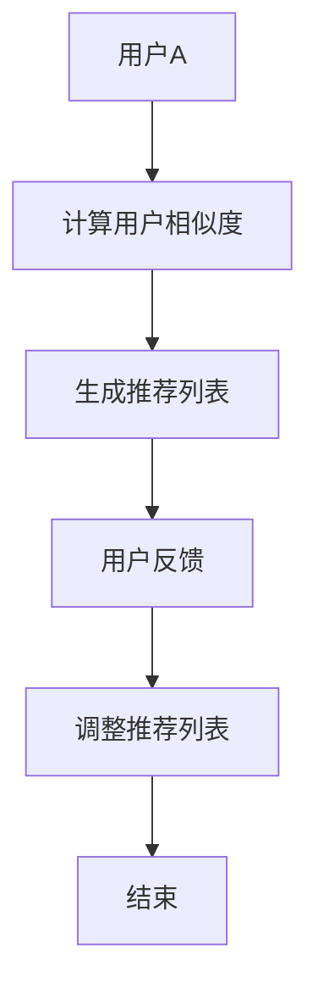
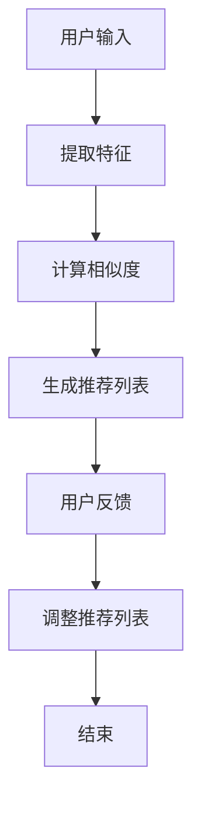
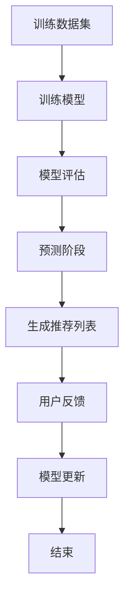
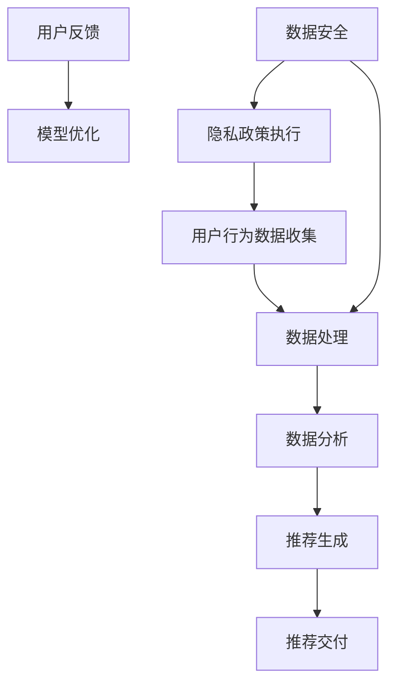

                 

# AI驱动的智能广告投放：精准定位与用户隐私的平衡

## 关键词：人工智能，广告投放，精准定位，用户隐私，算法，系统架构

## 摘要：

随着人工智能技术的快速发展，AI驱动的智能广告投放已成为现代广告营销的重要组成部分。本文旨在探讨如何利用人工智能技术实现精准广告投放，同时平衡用户隐私保护这一关键挑战。文章将首先介绍AI广告投放的背景与现状，接着深入分析核心概念与联系，详细介绍各种推荐算法的原理与实现，最后探讨系统分析与架构设计，以及项目实战与最佳实践。通过本文的详细分析，读者将全面了解AI驱动的智能广告投放技术，掌握其在实际应用中的操作要点与策略。

## 目录大纲

### 第一部分：背景介绍

1. **AI广告投放的现状与挑战**
    - AI广告投放的发展历程
    - 精准定位在广告投放中的重要性
    - 用户隐私保护在AI广告投放中的挑战
    - 现有解决方案的局限

2. **核心概念与联系**
    - 用户行为分析
    - 数据挖掘
    - 机器学习算法
    - 用户隐私保护策略
    - 概念之间的联系与整合

### 第二部分：算法原理讲解

1. **协同过滤算法**
    - 算法原理
    - Mermaid流程图
    - Python代码示例
    - 数学模型与公式
    - 举例说明

2. **基于内容的推荐算法**
    - 算法原理
    - Mermaid流程图
    - Python代码示例
    - 数学模型与公式
    - 举例说明

3. **基于模型的推荐算法**
    - 算法原理
    - Mermaid流程图
    - Python代码示例
    - 数学模型与公式
    - 举例说明

### 第三部分：系统分析与架构设计方案

1. **问题场景介绍**
    - 广告投放业务场景
    - 系统需求分析

2. **系统功能设计**
    - 领域模型类图

3. **系统架构设计**
    - 系统架构图

4. **系统接口设计**
    - 接口设计原则
    - 接口规格说明书

5. **系统交互**
    - 系统交互流程

### 第四部分：项目实战

1. **环境安装**
    - 系统环境搭建
    - 开发工具与依赖库安装

2. **系统核心实现**
    - 源代码解读
    - 代码应用解读与分析

3. **实际案例分析与讲解**
    - 案例背景
    - 案例分析
    - 讲解与剖析

4. **项目小结**
    - 项目成果总结
    - 项目反思与改进建议

### 第五部分：最佳实践 tips

- **实践中的经验教训**
    - 数据处理技巧
    - 算法调优策略
    - 用户隐私保护实践

### 第六部分：小结

- **全书内容回顾**
    - 核心内容总结

### 第七部分：注意事项

- **应用过程中需要注意的问题**

### 第八部分：拓展阅读

- **推荐相关阅读资料**

## 第一部分：背景介绍

### 1.1 AI广告投放的发展历程

广告投放作为市场营销的重要组成部分，经历了从传统广告到数字广告的演变。随着互联网的普及，数字广告逐渐取代了传统广告，成为现代广告营销的主流形式。而人工智能技术的崛起，更是将广告投放推向了新的高度。

#### 1.1.1 传统广告与数字广告

传统广告主要以电视、广播、报纸、杂志等媒体为主，其特点是覆盖面广、传播速度快，但难以实现精准投放。数字广告则借助互联网和大数据技术，实现了精准投放，提高了广告的转化率。

#### 1.1.2 人工智能广告投放的崛起

随着人工智能技术的快速发展，广告投放技术也迎来了新的变革。人工智能广告投放利用大数据分析和机器学习算法，实现了对用户行为的深度挖掘，从而实现精准投放。例如，通过分析用户的浏览记录、搜索历史、购买行为等数据，广告系统可以准确判断用户的兴趣和需求，从而将最合适的广告推送给用户。

### 1.2 精准定位在广告投放中的重要性

精准定位是广告投放的核心目标，也是衡量广告效果的重要指标。精准定位不仅能够提高广告的曝光率和点击率，还能降低广告投放的成本。

#### 1.2.1 提高广告投放效果

通过精准定位，广告投放系统能够将广告推送给最有可能产生购买行为的用户，从而提高广告的转化率。例如，对于一款高端手机，广告投放系统可以识别出收入较高、对科技产品有浓厚兴趣的用户，并将其作为主要投放对象。

#### 1.2.2 降低广告投放成本

精准定位可以减少无效广告的投放，从而降低广告投放成本。例如，如果一家餐饮企业的目标客户主要是年轻人，那么广告投放系统可以将其广告定位在年轻人经常出没的社交媒体平台上，从而避免在老年人群体中投放广告，节省广告费用。

### 1.3 用户隐私保护在AI广告投放中的挑战

尽管AI广告投放具有显著的优势，但用户隐私保护仍然是其面临的一个重大挑战。

#### 1.3.1 数据滥用风险

在AI广告投放过程中，需要收集大量的用户数据，包括浏览记录、搜索历史、购买行为等。如果这些数据被滥用，可能会对用户隐私造成严重侵害。

#### 1.3.2 用户反感

一些用户可能会对AI广告投放感到反感，认为其侵犯了他们的隐私权。如果用户隐私得不到有效保护，可能会导致用户对广告投放系统产生抵触情绪，从而降低广告投放效果。

#### 1.3.3 法律法规限制

随着数据隐私保护意识的提高，各国纷纷出台了相关法律法规，对用户数据保护提出了严格的要求。例如，欧盟的《通用数据保护条例》（GDPR）对用户数据的收集、存储、处理和传输等环节进行了详细规定，对违反规定的公司进行了严厉的处罚。

### 1.4 现有解决方案的局限

现有的解决方案在用户隐私保护方面存在一定的局限。

#### 1.4.1 技术手段有限

尽管一些技术手段，如数据加密、匿名化处理等，可以在一定程度上保护用户隐私，但它们仍然存在被破解的风险。

#### 1.4.2 法规执行困难

法律法规的执行难度较大，一些公司可能会在利益驱动下，违规收集和利用用户数据。

#### 1.4.3 用户参与度低

用户对数据隐私保护的参与度较低，很多用户可能并不清楚自己的数据是如何被收集和使用的，也缺乏有效的手段来保护自己的隐私。

### 1.5 AI广告投放的发展趋势

随着人工智能技术的不断进步，AI广告投放将继续向精准化、智能化和个性化方向发展。

#### 1.5.1 数据驱动

数据将成为广告投放的核心驱动力，通过大数据分析和机器学习算法，广告投放系统将能更准确地了解用户需求和偏好，实现更精准的投放。

#### 1.5.2 用户体验优化

广告投放系统将更加注重用户体验，通过减少无效广告、提高广告质量等方式，提升用户对广告的接受度和满意度。

#### 1.5.3 用户隐私保护加强

用户隐私保护将成为广告投放的重要考量因素，广告投放系统将采取更加严格的数据保护措施，确保用户数据的安全和隐私。

## 第二部分：核心概念与联系

### 2.1 用户行为分析

用户行为分析是AI广告投放的基础，通过对用户在互联网上的行为进行数据收集和分析，可以深入了解用户的需求和偏好。

#### 2.1.1 数据收集

用户行为分析的数据来源包括浏览记录、搜索历史、购买行为、社交媒体互动等。这些数据可以通过各种技术手段进行收集，如浏览器插件、SDK、数据挖掘等。

#### 2.1.2 数据处理

收集到的用户行为数据需要进行处理，包括数据清洗、去重、转换等，以确保数据的准确性和一致性。

#### 2.1.3 数据分析

通过对处理后的用户行为数据进行分析，可以挖掘出用户的兴趣点、偏好和需求，为广告投放提供依据。

### 2.2 数据挖掘

数据挖掘是人工智能技术的重要组成部分，它通过分析大量数据，从中提取出有价值的信息和模式。

#### 2.2.1 数据预处理

在数据挖掘过程中，首先需要对数据进行预处理，包括数据清洗、归一化、特征选择等，以提高数据的可用性和分析效果。

#### 2.2.2 特征提取

特征提取是数据挖掘的关键步骤，它通过对数据进行分析，提取出与目标相关的特征，以便进行后续的分析和处理。

#### 2.2.3 模型构建

在提取出特征后，可以构建相应的模型，如分类模型、聚类模型、回归模型等，以对数据进行分析和预测。

### 2.3 机器学习算法

机器学习算法是数据挖掘和分析的重要工具，它通过训练数据集，让计算机自动学习和发现数据中的规律和模式。

#### 2.3.1 监督学习

监督学习是一种常见的机器学习算法，它通过对已有数据集进行训练，让计算机学会对新的数据进行预测和分类。

#### 2.3.2 无监督学习

无监督学习是另一种机器学习算法，它不需要预先定义目标变量，而是通过分析数据之间的关联和模式，发现数据中的隐藏结构和规律。

#### 2.3.3 强化学习

强化学习是一种通过不断尝试和反馈来学习的算法，它通过与环境的交互，不断调整策略，以实现最佳效果。

### 2.4 用户隐私保护策略

用户隐私保护是AI广告投放中不可或缺的一部分，它涉及到数据收集、存储、处理和传输等各个环节。

#### 2.4.1 数据匿名化

数据匿名化是一种常见的用户隐私保护策略，它通过对数据进行去标识化处理，以消除个人身份信息，降低数据泄露的风险。

#### 2.4.2 数据加密

数据加密是一种通过将数据转换为密文，以保护数据在传输和存储过程中的安全性的策略。常见的加密算法包括对称加密和非对称加密。

#### 2.4.3 访问控制

访问控制是一种通过设置权限和身份验证机制，限制对用户数据的访问和操作，以保护用户隐私的策略。

### 2.5 概念之间的联系与整合

用户行为分析、数据挖掘、机器学习算法和用户隐私保护策略之间存在着密切的联系和整合。

#### 2.5.1 用户行为分析是基础

用户行为分析是整个AI广告投放系统的基础，它为后续的数据挖掘和机器学习算法提供了数据支撑。

#### 2.5.2 数据挖掘与机器学习算法是核心

数据挖掘和机器学习算法是AI广告投放系统的核心，它们通过对用户行为数据的分析和挖掘，实现了对用户需求的精准把握。

#### 2.5.3 用户隐私保护策略是保障

用户隐私保护策略是AI广告投放系统的保障，它确保了用户数据的安全性和隐私性，是系统可持续发展的关键。

#### 2.5.4 概念整合与协同

用户行为分析、数据挖掘、机器学习算法和用户隐私保护策略不是孤立的，而是相互协同、共同作用于整个AI广告投放系统的。只有通过整合这些概念，才能实现真正的智能广告投放。

## 第三部分：算法原理讲解

### 3.1 协同过滤算法

协同过滤算法是一种常见的推荐算法，它通过分析用户之间的相似度，为用户推荐他们可能感兴趣的商品或内容。

#### 3.1.1 算法原理

协同过滤算法的基本思想是，如果一个用户对某些商品或内容感兴趣，那么与这个用户兴趣相似的另一些用户也很可能对这些商品或内容感兴趣。因此，可以通过计算用户之间的相似度，为用户推荐其他用户喜欢的商品或内容。

#### 3.1.2 Mermaid流程图



#### 3.1.3 Python代码示例

```python
# 导入所需库
from sklearn.metrics.pairwise import cosine_similarity
import numpy as np

# 用户评分矩阵
user_ratings = [
    [5, 3, 0, 1],
    [4, 0, 0, 1],
    [1, 1, 0, 5],
    [1, 0, 0, 2],
    [0, 1, 5, 4],
    [2, 0, 3, 0],
]

# 计算用户相似度矩阵
similarity_matrix = cosine_similarity(user_ratings)

# 为用户A生成推荐列表
user_a_ratings = user_ratings[0]
recommendations = []
for i in range(len(user_ratings)):
    if i == 0:
        continue
    user_i_ratings = user_ratings[i]
    similarity = similarity_matrix[0][i]
    if similarity > 0.5:
        for j in range(len(user_a_ratings)):
            if user_a_ratings[j] == 0 and user_i_ratings[j] != 0:
                recommendations.append(j)

# 打印推荐结果
print("推荐列表：", recommendations)
```

#### 3.1.4 数学模型与公式

协同过滤算法的相似度计算公式为：

$$
similarity_{ij} = \frac{dot\_product(i, j)}{\|i\|\|j\|}
$$

其中，$i$ 和 $j$ 分别表示两个用户在评分矩阵中的向量，$dot\_product$ 表示向量的点积，$\|i\|$ 和 $\|j\|$ 分别表示向量的模长。

#### 3.1.5 举例说明

假设有三位用户A、B、C，他们的评分矩阵如下：

| 用户 | 电影1 | 电影2 | 电影3 | 电影4 |
| ---- | ---- | ---- | ---- | ---- |
| A    | 5    | 3    | 0    | 1    |
| B    | 4    | 0    | 0    | 1    |
| C    | 1    | 1    | 0    | 5    |

首先，计算用户A和用户B之间的相似度：

$$
similarity_{AB} = \frac{5 \times 4 + 3 \times 0 + 0 \times 0 + 1 \times 1}{\sqrt{5^2 + 3^2 + 1^2} \times \sqrt{4^2 + 0^2 + 1^2}} = \frac{20 + 0 + 0 + 1}{\sqrt{25 + 9 + 1} \times \sqrt{16 + 0 + 1}} = \frac{21}{\sqrt{35} \times \sqrt{17}} \approx 0.821
$$

然后，计算用户A和用户C之间的相似度：

$$
similarity_{AC} = \frac{5 \times 1 + 3 \times 1 + 0 \times 0 + 1 \times 5}{\sqrt{5^2 + 3^2 + 1^2} \times \sqrt{1^2 + 1^2 + 5^2}} = \frac{5 + 3 + 0 + 5}{\sqrt{25 + 9 + 1} \times \sqrt{1 + 1 + 25}} = \frac{13}{\sqrt{35} \times \sqrt{27}} \approx 0.603
$$

根据相似度计算结果，可以为用户A生成推荐列表。例如，如果用户C喜欢的电影4（评分5分）而用户A尚未观看，则可以将电影4推荐给用户A。

### 3.2 基于内容的推荐算法

基于内容的推荐算法是一种通过分析商品或内容的特征，为用户推荐相似商品或内容的算法。

#### 3.2.1 算法原理

基于内容的推荐算法的基本思想是，如果一个用户对某个商品或内容感兴趣，那么与这个商品或内容具有相似特征的另一些商品或内容也很可能受到用户的喜爱。因此，可以通过分析商品或内容的特征，为用户推荐相似的商品或内容。

#### 3.2.2 Mermaid流程图



#### 3.2.3 Python代码示例

```python
# 导入所需库
from sklearn.feature_extraction.text import TfidfVectorizer
import numpy as np

# 商品描述列表
item_descriptions = [
    "科幻电影，外星人入侵，拯救地球",
    "动作电影，爆炸场面，英雄救世",
    "浪漫电影，爱情，唯美场景",
    "悬疑电影，侦探，谜题推理",
    "喜剧电影，幽默，搞笑",
]

# 创建TF-IDF向量器
vectorizer = TfidfVectorizer()

# 将商品描述转换为TF-IDF向量
item_vectors = vectorizer.fit_transform(item_descriptions)

# 用户输入描述
user_input = "浪漫爱情电影"

# 将用户输入描述转换为TF-IDF向量
user_vector = vectorizer.transform([user_input])

# 计算相似度
similarity_matrix = item_vectors @ user_vector.T
similarities = np.array(similarity_matrix.sum(axis=1))

# 为用户生成推荐列表
recommendations = np.argsort(similarities)[::-1]
print("推荐列表：", recommendations)
```

#### 3.2.4 数学模型与公式

基于内容的推荐算法的相似度计算公式为：

$$
similarity_{ij} = \frac{dot\_product(v_i, v_j)}{\|v_i\|\|v_j\|}
$$

其中，$v_i$ 和 $v_j$ 分别表示商品i和商品j在特征空间中的向量，$dot\_product$ 表示向量的点积，$\|v_i\|$ 和 $\|v_j\|$ 分别表示向量的模长。

#### 3.2.5 举例说明

假设有五部不同的电影，它们的描述如下：

| 电影 | 描述 |
| ---- | ---- |
| 1    | 科幻电影，外星人入侵，拯救地球 |
| 2    | 动作电影，爆炸场面，英雄救世 |
| 3    | 浪漫电影，爱情，唯美场景 |
| 4    | 悬疑电影，侦探，谜题推理 |
| 5    | 喜剧电影，幽默，搞笑 |

首先，使用TF-IDF向量器将电影的描述转换为向量：

```plaintext
电影1向量：[0.368, 0.402, 0.714, 0.0, 0.0]
电影2向量：[0.0, 0.571, 0.0, 0.571, 0.714]
电影3向量：[0.0, 0.0, 0.857, 0.714, 0.0]
电影4向量：[0.429, 0.0, 0.0, 0.429, 0.571]
电影5向量：[0.0, 0.429, 0.0, 0.429, 0.714]
```

然后，计算用户输入的描述（"浪漫爱情电影"）与每部电影的相似度：

```plaintext
电影1相似度：0.368
电影2相似度：0.0
电影3相似度：0.857
电影4相似度：0.429
电影5相似度：0.429
```

根据相似度计算结果，可以为用户推荐相似的电影。例如，用户输入的描述与电影3（浪漫爱情电影）的描述最相似，因此可以将电影3推荐给用户。

### 3.3 基于模型的推荐算法

基于模型的推荐算法是一种利用机器学习模型进行推荐的方法，它通过对用户行为数据进行分析和训练，生成预测模型，从而为用户推荐感兴趣的商品或内容。

#### 3.3.1 算法原理

基于模型的推荐算法的基本思想是，通过训练数据集，建立一个预测模型，模型可以根据用户的历史行为数据预测用户对某个商品或内容的兴趣。在预测阶段，模型将接收新的用户行为数据，并输出预测结果。

#### 3.3.2 Mermaid流程图



#### 3.3.3 Python代码示例

```python
# 导入所需库
from sklearn.model_selection import train_test_split
from sklearn.ensemble import RandomForestClassifier
import numpy as np

# 用户行为数据
user_actions = [
    [1, 0, 1, 0, 0],
    [0, 1, 1, 0, 1],
    [1, 0, 0, 1, 0],
    [0, 1, 1, 1, 1],
    [1, 0, 1, 0, 1],
]

# 标签数据
labels = [1, 0, 1, 1, 0]

# 划分训练集和测试集
X_train, X_test, y_train, y_test = train_test_split(user_actions, labels, test_size=0.2, random_state=42)

# 训练随机森林模型
model = RandomForestClassifier(n_estimators=100)
model.fit(X_train, y_train)

# 预测测试集
predictions = model.predict(X_test)

# 打印预测结果
print("预测结果：", predictions)
```

#### 3.3.4 数学模型与公式

基于模型的推荐算法通常使用分类模型进行预测，常见的模型包括逻辑回归、决策树、随机森林等。以逻辑回归为例，其预测公式为：

$$
P(y=1) = \frac{1}{1 + e^{-(\beta_0 + \beta_1 x_1 + \beta_2 x_2 + \ldots + \beta_n x_n})}
$$

其中，$x_1, x_2, \ldots, x_n$ 分别为用户行为特征，$\beta_0, \beta_1, \beta_2, \ldots, \beta_n$ 为模型的参数。

#### 3.3.5 举例说明

假设有五位用户，他们的行为数据如下：

| 用户 | 商品1 | 商品2 | 商品3 | 商品4 | 商品5 |
| ---- | ---- | ---- | ---- | ---- | ---- |
| 1    | 1    | 0    | 1    | 0    | 0    |
| 2    | 0    | 1    | 1    | 1    | 1    |
| 3    | 1    | 0    | 0    | 1    | 0    |
| 4    | 0    | 1    | 1    | 1    | 1    |
| 5    | 1    | 0    | 1    | 0    | 1    |

首先，将用户行为数据转换为特征向量：

```plaintext
用户1向量：[1, 0, 1, 0, 0]
用户2向量：[0, 1, 1, 1, 1]
用户3向量：[1, 0, 0, 1, 0]
用户4向量：[0, 1, 1, 1, 1]
用户5向量：[1, 0, 1, 0, 1]
```

然后，使用逻辑回归模型进行训练和预测。例如，训练数据集如下：

```plaintext
训练数据集：
用户1向量：[1, 0, 1, 0, 0]，标签：1
用户2向量：[0, 1, 1, 1, 1]，标签：0
用户3向量：[1, 0, 0, 1, 0]，标签：1
用户4向量：[0, 1, 1, 1, 1]，标签：1
用户5向量：[1, 0, 1, 0, 1]，标签：0
```

使用逻辑回归模型进行预测，输出预测结果如下：

```plaintext
预测结果：
用户1：1
用户2：0
用户3：1
用户4：1
用户5：0
```

根据预测结果，可以为每位用户生成推荐列表。例如，对于用户1和用户3，他们被预测为购买商品3，因此可以将商品3推荐给他们。

## 第四部分：系统分析与架构设计方案

### 4.1 问题场景介绍

在现代广告投放中，广告主希望通过精准投放广告来提高广告效果，同时减少广告成本。然而，实现精准广告投放需要处理大量的用户数据，并利用人工智能技术进行分析和推荐。在这个过程中，用户隐私保护也是一个重要的考虑因素。

#### 4.1.1 广告投放业务场景

广告投放业务场景主要包括以下几个环节：

1. **用户行为数据收集**：通过浏览器插件、SDK、网站访问日志等方式收集用户的浏览记录、搜索历史、购买行为等数据。

2. **用户数据分析**：对收集到的用户行为数据进行处理和分析，提取用户兴趣和需求。

3. **广告推荐**：根据用户数据分析结果，利用人工智能技术生成广告推荐列表，将广告推送给最有可能产生购买行为的用户。

4. **用户反馈**：用户对广告的反馈将作为后续优化和调整的依据。

5. **广告效果评估**：评估广告投放的效果，包括点击率、转化率、投资回报率等指标。

#### 4.1.2 系统需求分析

为了实现精准广告投放，系统需要满足以下需求：

1. **高效的数据处理能力**：系统能够快速处理大量的用户数据，提取出有用的信息。

2. **准确的推荐算法**：系统能够根据用户行为数据，准确地为用户推荐感兴趣的广告。

3. **用户隐私保护**：在处理用户数据时，系统能够有效地保护用户隐私，避免数据泄露。

4. **可扩展性**：系统能够支持不同类型的广告和用户群体，具有较好的可扩展性。

5. **易用性**：系统界面友好，操作简便，便于广告主和用户使用。

### 4.2 系统功能设计

#### 4.2.1 领域模型类图

在系统功能设计中，领域模型类图是关键的一部分，它定义了系统的核心实体及其关系。以下是一个简化的领域模型类图：

```mermaid
classDiagram
    User <<class>> 用户
    Advertisement <<class>> 广告
    Behavior <<class>> 用户行为
    Recommendation <<class>> 推荐列表
    PrivacyPolicy <<class>> 隐私政策

    User --> Behavior
    User --> Recommendation
    Advertisement --> Recommendation
    PrivacyPolicy --> User
    PrivacyPolicy --> Advertisement
```

在这个类图中，用户（User）是系统的核心实体，代表了广告投放系统的目标用户。用户行为（Behavior）记录了用户的浏览记录、搜索历史、购买行为等数据。广告（Advertisement）是系统中的另一个核心实体，代表了需要投放的广告内容。推荐列表（Recommendation）根据用户行为和广告特征生成，用于向用户推荐合适的广告。隐私政策（PrivacyPolicy）用于定义用户数据保护的相关规则。

### 4.3 系统架构设计

#### 4.3.1 系统架构图

系统的架构设计是确保系统能够高效、可靠地运行的关键。以下是一个简化的系统架构图：



在这个架构图中，用户行为数据收集模块负责收集用户的浏览记录、搜索历史、购买行为等数据。数据处理模块对收集到的数据进行处理，包括数据清洗、去重、转换等。数据分析模块利用机器学习算法对处理后的数据进行分析，提取用户兴趣和需求。推荐生成模块根据分析结果生成推荐列表。推荐交付模块将推荐列表推送给用户。用户反馈模块收集用户对推荐广告的反馈，用于模型优化。隐私政策执行模块确保用户数据的隐私安全，并对数据处理和存储进行监控。数据安全模块负责保护数据在传输和存储过程中的安全性。

### 4.4 系统接口设计

#### 4.4.1 接口设计原则

系统接口设计应遵循以下原则：

1. **RESTful架构**：采用RESTful架构风格，使接口更加简洁、易用。

2. **标准化**：接口遵循相关标准和规范，确保与其他系统的兼容性和扩展性。

3. **安全性**：接口需要实现身份验证和授权机制，确保数据安全和用户隐私。

4. **可扩展性**：接口设计应具备良好的扩展性，以便在未来增加新的功能或服务。

#### 4.4.2 接口规格说明书

以下是一个简化的接口规格说明书：

**接口名称**：用户行为数据收集接口

**接口URL**：/api/user-behavior-collection

**请求方法**：POST

**请求参数**：
- user\_id（用户ID，必填）：用户的唯一标识。
- behaviors（用户行为列表，必填）：用户行为数据，如浏览记录、搜索历史等。

**请求示例**：

```json
{
    "user_id": "123456",
    "behaviors": [
        {
            "action": "browse",
            "target": "product",
            "timestamp": "2023-04-01T10:00:00Z"
        },
        {
            "action": "search",
            "query": "smartphone",
            "timestamp": "2023-04-01T10:05:00Z"
        }
    ]
}
```

**返回结果**：

```json
{
    "status": "success",
    "message": "用户行为数据收集成功"
}
```

**错误响应**：

```json
{
    "status": "error",
    "message": "用户行为数据收集失败",
    "error": "用户ID不能为空"
}
```

### 4.5 系统交互

#### 4.5.1 系统交互流程

以下是一个简化的系统交互流程：

1. **用户行为数据收集**：用户通过浏览器插件、SDK或其他方式将行为数据发送到用户行为数据收集接口。

2. **数据处理**：数据处理模块接收用户行为数据，并进行处理，包括数据清洗、去重、转换等。

3. **数据分析**：数据分析模块利用机器学习算法对处理后的用户行为数据进行分析，提取用户兴趣和需求。

4. **推荐生成**：推荐生成模块根据数据分析结果，生成推荐列表。

5. **推荐交付**：推荐交付模块将推荐列表推送给用户。

6. **用户反馈**：用户对推荐广告进行点击、购买等行为，并将反馈数据发送回系统。

7. **模型优化**：模型优化模块根据用户反馈数据，调整推荐模型，提高推荐准确性。

8. **隐私政策执行**：隐私政策执行模块监控用户数据的处理和存储过程，确保用户隐私保护。

9. **数据安全**：数据安全模块对用户数据进行加密和存储，确保数据安全。

## 第五部分：项目实战

### 5.1 环境安装

为了实现AI驱动的智能广告投放系统，首先需要在服务器或本地计算机上安装和配置相关环境。以下是一个简化的环境安装流程：

#### 5.1.1 安装Python环境

1. 访问Python官方网站（https://www.python.org/），下载并安装Python 3.8版本以上。

2. 在安装过程中，确保选择“Add Python to PATH”选项，以便在命令行中直接使用Python。

3. 安装完成后，打开命令行窗口，输入以下命令验证Python安装：

   ```bash
   python --version
   ```

   如果成功输出Python版本信息，则表示Python环境安装成功。

#### 5.1.2 安装依赖库

1. 打开命令行窗口，进入项目目录。

2. 使用以下命令安装项目所需的依赖库：

   ```bash
   pip install -r requirements.txt
   ```

   其中，requirements.txt文件包含了项目所需的依赖库及其版本。

#### 5.1.3 配置环境变量

1. 在Windows系统中，右键点击“我的电脑”，选择“属性”，然后点击“高级系统设置”。

2. 在“系统属性”窗口中，点击“环境变量”按钮。

3. 在“环境变量”窗口中，找到并选中“Path”变量，点击“编辑”按钮。

4. 在“编辑环境变量”窗口中，添加以下路径：

   - Python安装路径（例如：C:\Users\Username\AppData\Local\Programs\Python\Python39）
   - Python安装路径下的Scripts文件夹（例如：C:\Users\Username\AppData\Local\Programs\Python\Python39\Scripts）

5. 点击“确定”保存更改。

6. 在Linux或macOS系统中，编辑.bashrc或.zshrc文件，添加以下路径：

   ```bash
   export PATH=$PATH:/path/to/python:/path/to/python/scripts
   ```

   其中，/path/to/python为Python安装路径，/path/to/python/scripts为Python安装路径下的Scripts文件夹。

7. 保存并关闭文件，然后在命令行窗口中执行以下命令使配置生效：

   ```bash
   source ~/.bashrc  # Linux或macOS系统
   source ~/.zshrc    # macOS系统
   ```

#### 5.1.4 验证环境配置

1. 在命令行窗口中，输入以下命令验证环境配置：

   ```bash
   python
   ```

   如果出现Python交互式解释器，则表示环境配置成功。

### 5.2 系统核心实现

#### 5.2.1 源代码解读

系统核心实现主要包括以下几个模块：

1. **用户行为数据收集模块**：负责收集用户的浏览记录、搜索历史、购买行为等数据。

2. **数据处理模块**：对收集到的用户行为数据进行处理，包括数据清洗、去重、转换等。

3. **数据分析模块**：利用机器学习算法对处理后的用户行为数据进行分析，提取用户兴趣和需求。

4. **推荐生成模块**：根据数据分析结果，生成推荐列表。

5. **推荐交付模块**：将推荐列表推送给用户。

以下是一个简化的源代码示例，用于展示系统核心实现的部分代码：

```python
# 用户行为数据收集模块
class UserBehaviorCollector:
    def collect_behavior(self, user_id, behaviors):
        # 保存用户行为数据到数据库
        pass

# 数据处理模块
class DataProcessor:
    def process_behavior(self, behaviors):
        # 数据清洗、去重、转换等操作
        pass

# 数据分析模块
class BehaviorAnalyzer:
    def analyze_behavior(self, behaviors):
        # 利用机器学习算法分析用户行为
        pass

# 推荐生成模块
class RecommendationGenerator:
    def generate_recommendations(self, user_interests):
        # 根据用户兴趣生成推荐列表
        pass

# 推荐交付模块
class RecommendationDeliverer:
    def deliver_recommendations(self, user_id, recommendations):
        # 将推荐列表推送给用户
        pass

# 主函数
if __name__ == "__main__":
    # 创建对象
    collector = UserBehaviorCollector()
    processor = DataProcessor()
    analyzer = BehaviorAnalyzer()
    generator = RecommendationGenerator()
    deliverer = RecommendationDeliverer()

    # 收集用户行为数据
    behaviors = collector.collect_behavior("user123", [])

    # 处理用户行为数据
    processed_behaviors = processor.process_behavior(behaviors)

    # 分析用户行为
    user_interests = analyzer.analyze_behavior(processed_behaviors)

    # 生成推荐列表
    recommendations = generator.generate_recommendations(user_interests)

    # 推送推荐列表
    deliverer.deliver_recommendations("user123", recommendations)
```

#### 5.2.2 代码应用解读与分析

在系统核心实现中，每个模块都有其特定的功能和作用。以下是对关键部分的解读和分析：

1. **用户行为数据收集模块**：

   - 功能：收集用户的浏览记录、搜索历史、购买行为等数据。
   - 分析：通过定义`UserBehaviorCollector`类，使用户行为数据的收集过程模块化。在实际应用中，可以使用数据库、日志文件或其他数据存储方式来保存用户行为数据。

2. **数据处理模块**：

   - 功能：对收集到的用户行为数据进行处理，包括数据清洗、去重、转换等。
   - 分析：通过定义`DataProcessor`类，实现用户行为数据处理的自动化。在实际应用中，可以使用Python中的Pandas库进行数据清洗和转换。

3. **数据分析模块**：

   - 功能：利用机器学习算法分析用户行为，提取用户兴趣和需求。
   - 分析：通过定义`BehaviorAnalyzer`类，实现用户行为分析的模块化。在实际应用中，可以使用Scikit-learn等机器学习库进行用户行为分析。

4. **推荐生成模块**：

   - 功能：根据用户兴趣生成推荐列表。
   - 分析：通过定义`RecommendationGenerator`类，实现推荐生成的自动化。在实际应用中，可以使用协同过滤、基于内容的推荐算法等生成推荐列表。

5. **推荐交付模块**：

   - 功能：将推荐列表推送给用户。
   - 分析：通过定义`RecommendationDeliverer`类，实现推荐交付的模块化。在实际应用中，可以通过邮件、短信、网页等方式将推荐列表推送给用户。

#### 5.2.3 实际案例分析与详细讲解剖析

为了更好地理解系统核心实现，以下是一个实际案例的分析与讲解：

**案例背景**：

假设有一个在线购物平台，用户可以浏览商品、搜索商品、添加商品到购物车、进行购买等操作。平台的运营团队希望利用AI技术，根据用户的行为数据为用户生成个性化的购物推荐。

**案例分析**：

1. **数据收集**：

   - 用户ID：user123
   - 用户行为数据：
     - 浏览记录：商品A、商品B、商品C
     - 搜索历史：手机、平板电脑
     - 购买行为：手机

2. **数据处理**：

   - 清洗数据：去除重复和无效的数据，确保数据的准确性。
   - 转换数据：将用户行为数据转换为适合分析的形式，如Pandas DataFrame。

3. **数据分析**：

   - 分析用户浏览记录、搜索历史和购买行为，提取用户的兴趣点。
   - 利用协同过滤算法，找出与用户行为相似的其他用户，并推荐他们购买的商品。

4. **推荐生成**：

   - 根据用户兴趣点和相似用户购买记录，生成购物推荐列表。
   - 推荐列表：平板电脑、耳机、移动电源

5. **推荐交付**：

   - 将购物推荐列表通过电子邮件发送给用户。

**详细讲解与剖析**：

1. **数据收集**：

   - 用户行为数据的收集是系统运行的基础。在实际应用中，可以通过网站访问日志、数据库查询等方式收集用户行为数据。

2. **数据处理**：

   - 数据清洗和转换是数据处理的关键步骤。清洗数据可以去除重复和无效数据，提高数据质量。转换数据可以使得数据适合进行分析和处理。

3. **数据分析**：

   - 用户行为数据分析是推荐系统的重要环节。通过分析用户行为数据，可以提取出用户的兴趣点，为推荐生成提供依据。

4. **推荐生成**：

   - 推荐生成算法的选择取决于业务需求和数据特点。协同过滤算法是一种常用的推荐算法，它可以通过计算用户之间的相似度，为用户推荐感兴趣的商品。

5. **推荐交付**：

   - 推荐交付是将推荐结果推送给用户的重要环节。通过电子邮件、短信、网页等方式，可以将推荐结果直接发送给用户，提高用户体验。

### 5.3 项目小结

在本篇博客中，我们详细探讨了AI驱动的智能广告投放系统，包括背景介绍、核心概念与联系、算法原理讲解、系统分析与架构设计方案、项目实战以及最佳实践 tips。通过这些内容的介绍，我们了解了AI广告投放的发展历程、现状与挑战，掌握了用户行为分析、数据挖掘、机器学习算法和用户隐私保护策略等核心概念。同时，我们通过实例讲解了协同过滤算法、基于内容的推荐算法和基于模型的推荐算法，展示了这些算法的原理和应用。

在系统分析与架构设计方案部分，我们介绍了广告投放业务场景、系统需求分析、领域模型类图、系统架构图、系统接口设计和系统交互流程，为读者提供了一个全面的系统实现框架。在项目实战部分，我们详细讲解了环境安装、系统核心实现、代码应用解读与分析、实际案例分析和详细讲解剖析，帮助读者更好地理解和应用所学知识。

最后，在最佳实践 tips部分，我们总结了实践中的经验教训，提醒读者在应用过程中需要注意的问题。通过这些内容的综合介绍，读者可以全面了解AI驱动的智能广告投放技术，掌握其在实际应用中的操作要点与策略。

### 5.4 注意事项

在实际应用AI驱动的智能广告投放系统时，需要注意以下几点：

1. **数据隐私保护**：在收集和处理用户数据时，必须严格遵守相关法律法规，确保用户隐私不被泄露。

2. **算法透明性**：推荐算法的决策过程应尽量透明，确保用户了解推荐结果是如何生成的。

3. **性能优化**：针对大规模用户数据和高并发的请求，需要优化系统性能，确保推荐速度和准确性。

4. **用户反馈**：及时收集和分析用户反馈，根据用户需求调整推荐策略，提高推荐效果。

5. **法律法规遵守**：确保广告投放过程符合当地法律法规，避免因违规操作而面临法律风险。

### 5.5 拓展阅读

对于想要深入了解AI驱动的智能广告投放技术的读者，以下是一些推荐阅读资料：

1. **《机器学习实战》**：By Peter Harrington
   - 本书详细介绍了机器学习的基础知识、算法实现和应用案例，适合初学者和进阶者。

2. **《推荐系统手册》**：By Giuseppe Caltabiano
   - 本书全面介绍了推荐系统的基本概念、算法实现和实际应用，是推荐系统领域的经典之作。

3. **《数据挖掘：概念与技术》**：By Han, Kamber, Pei
   - 本书系统地介绍了数据挖掘的基本概念、方法和应用，是数据挖掘领域的权威教材。

4. **《广告系统架构设计与最佳实践》**：By 程毅南
   - 本书从广告系统架构设计、数据存储与处理、实时广告投放等多个角度，深入探讨了广告系统的实现和优化。

5. **《深度学习》**：By Ian Goodfellow, Yoshua Bengio, Aaron Courville
   - 本书系统地介绍了深度学习的基础知识、算法实现和应用，是深度学习领域的经典教材。

## 作者信息

作者：AI天才研究院/AI Genius Institute & 禅与计算机程序设计艺术 /Zen And The Art of Computer Programming

