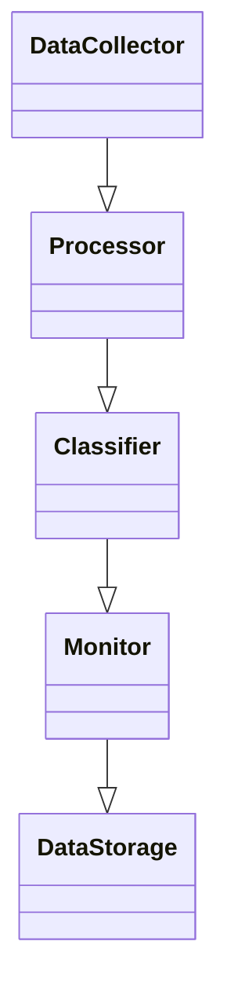
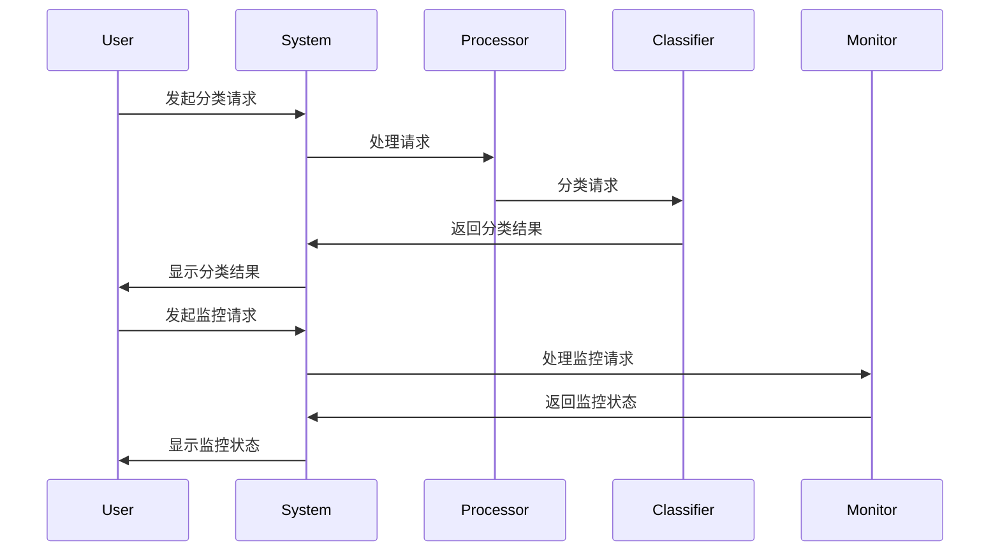

                 

### AI驱动的智能废物分类和回收系统：提高资源利用效率

关键词：AI、废物分类、回收系统、资源利用效率、智能技术

摘要：本文将深入探讨AI驱动的智能废物分类和回收系统，通过逐步分析这一系统的核心概念、算法原理、系统设计与实战应用，揭示如何通过智能技术提高资源利用效率，解决现代城市废物管理面临的挑战。

### 目录大纲

# AI驱动的智能废物分类和回收系统：提高资源利用效率

> 关键词：AI、废物分类、回收系统、资源利用效率、智能技术

> 摘要：本文将深入探讨AI驱动的智能废物分类和回收系统，通过逐步分析这一系统的核心概念、算法原理、系统设计与实战应用，揭示如何通过智能技术提高资源利用效率，解决现代城市废物管理面临的挑战。

## 第一部分：背景介绍与核心概念

### 第1章 问题背景

### 第2章 核心概念

#### 2.1 AI算法原理

#### 2.2 废物分类标准

#### 2.3 回收流程与资源再生技术

## 第二部分：算法原理讲解

### 第3章 机器学习算法在废物分类中的应用

### 第4章 深度学习模型在废物分类中的应用

## 第三部分：系统设计与项目实战

### 第5章 系统架构设计

### 第6章 环境安装与系统核心实现

### 第7章 项目实战

## 第四部分：最佳实践与拓展

### 第8章 最佳实践

### 第9章 小结、注意事项、拓展阅读

---

### 第一部分：背景介绍与核心概念

#### 第1章 问题背景

随着城市化进程的加速，城市废物产生量呈现爆发式增长。传统的废物处理方法，如填埋、焚烧等，不仅成本高昂，而且对环境造成了严重污染。特别是可回收物的浪费，进一步加剧了资源短缺和环境污染问题。

**问题描述**：

- 废物产生量急剧增加，传统处理方法效率低下，无法满足环保和资源再利用的需求。
- 废物分类标准不统一，导致回收效率低下。
- 废物回收和处理过程中，存在大量的二次污染问题。

**问题解决**：

智能废物分类和回收系统通过AI技术，可以对废物进行自动化分类、识别和处理，从而大幅提高资源利用效率，减少环境污染。

**边界与外延**：

本书主要探讨AI在智能废物分类和回收系统中的应用，涉及垃圾分类、回收流程优化和资源再生利用。具体包括以下核心概念：

1. **AI算法**：包括机器学习、深度学习等，用于废物分类和识别。
2. **废物分类标准**：国内外分类标准的差异及其对回收系统设计的影响。
3. **回收流程**：废物分类、处理、再利用等环节。
4. **资源再生技术**：包括物理、化学、生物等方法，用于废物的再生和利用。

**概念结构与核心要素组成**：

- **AI算法**：核心技术，负责废物分类和识别。
- **废物分类标准**：规范分类过程，确保回收效率。
- **回收流程**：实现废物从分类到再利用的完整流程。
- **资源再生技术**：提高废物再利用的效率和质量。

### 第2章 核心概念

#### 2.1 AI算法原理

AI算法是智能废物分类和回收系统的核心。机器学习和深度学习是其中常用的两种算法。机器学习通过从数据中学习规律，对废物进行分类。而深度学习则通过模拟人脑神经网络，对复杂图像和声音进行高级处理。

**核心概念原理**：

- **机器学习算法**：利用历史数据，通过算法训练模型，从而对未知数据做出预测。常用的算法包括决策树、支持向量机、朴素贝叶斯等。
- **深度学习模型**：基于多层神经网络，通过反向传播算法训练模型。常用的模型包括卷积神经网络（CNN）、循环神经网络（RNN）等。

**概念属性特征对比表格**：

| 算法类型 | 特点 | 适用场景 |
| --- | --- | --- |
| 机器学习 | 算法复杂度较低，易于实现 | 数据量较小，分类任务简单 |
| 深度学习 | 算法复杂度较高，但效果更优 | 数据量较大，分类任务复杂 |

#### 2.2 废物分类标准

废物分类标准是智能废物分类系统的基石。不同的分类标准会影响废物的处理方式和回收效率。

**核心概念原理**：

- **国内分类标准**：通常将废物分为可回收物、有害垃圾、湿垃圾和干垃圾四大类。
- **国际分类标准**：例如欧盟的分类标准，将废物分为可回收物、有害废物、垃圾填埋和其他废物。

**概念属性特征对比表格**：

| 分类标准 | 类型 | 特点 | 适用范围 |
| --- | --- | --- | --- |
| 国内标准 | 四大类 | 分类简单，易于实施 | 我国城市废物分类 |
| 国际标准 | 多类 | 分类更详细，回收效率更高 | 国际化城市废物分类 |

#### 2.3 回收流程与资源再生技术

回收流程是废物从分类到再利用的完整过程。资源再生技术则是提高废物再利用效率的关键。

**核心概念原理**：

- **废物分类**：将废物按类型分类，便于后续处理。
- **处理过程**：对分类后的废物进行物理、化学或生物处理，以提取有用资源。
- **再生利用**：将处理后的废物转化为新的产品或材料，实现资源的再生。

**ER实体关系图架构**：

```mermaid
erDiagram
  Waste -->|分类| RecyclingProcess -->|处理| ResourceRecovery
  RecyclingProcess -->|利用| Resource
```

在回收流程中，废物首先经过分类，然后进入处理过程，最后通过再生利用，实现资源的循环利用。

### 第二部分：算法原理讲解

#### 第3章 机器学习算法在废物分类中的应用

机器学习算法在废物分类中发挥着重要作用。通过从大量数据中学习规律，机器学习算法能够实现对废物的准确分类。

**算法原理讲解**：

机器学习算法的基本思想是利用历史数据训练模型，然后使用训练好的模型对未知数据进行分类。具体步骤如下：

1. **数据收集**：收集大量的废物图片或文本数据。
2. **数据预处理**：对收集到的数据清洗、归一化等处理，以便后续建模。
3. **特征提取**：从预处理后的数据中提取关键特征，用于训练模型。
4. **模型训练**：使用训练数据训练模型，模型可以是决策树、支持向量机等。
5. **模型评估**：使用测试数据评估模型的分类效果。
6. **模型优化**：根据评估结果，调整模型参数，以提高分类准确率。

**Python源代码实现**：

以下是一个简单的机器学习算法实现示例：

```python
from sklearn.datasets import load_iris
from sklearn.model_selection import train_test_split
from sklearn.tree import DecisionTreeClassifier
from sklearn.metrics import accuracy_score

# 加载鸢尾花数据集
data = load_iris()
X = data.data
y = data.target

# 划分训练集和测试集
X_train, X_test, y_train, y_test = train_test_split(X, y, test_size=0.2, random_state=42)

# 训练决策树模型
clf = DecisionTreeClassifier()
clf.fit(X_train, y_train)

# 预测测试集
y_pred = clf.predict(X_test)

# 评估模型准确率
accuracy = accuracy_score(y_test, y_pred)
print(f"模型准确率：{accuracy:.2f}")
```

**数学模型与公式**：

在机器学习算法中，决策树是一种常用的分类算法。决策树通过一系列规则对数据进行分类。每个节点代表一个特征，每个分支代表特征的不同取值。

$$
\text{分类规则} = \left\{
\begin{aligned}
& \text{若 } x_i \leq c_1, & \text{则进入左子节点}; \\
& \text{若 } x_i > c_1, & \text{则进入右子节点}.
\end{aligned}
\right.
$$

其中，$x_i$ 是特征值，$c_1$ 是阈值。

**举例说明**：

假设我们有一个包含三个特征的数据集，每个特征的取值范围分别是 [0, 1]、[0, 10] 和 [0, 100]。我们可以使用决策树算法对数据进行分类。

1. **数据收集**：收集包含这些特征的数据。
2. **数据预处理**：对数据进行清洗和归一化。
3. **特征提取**：提取每个特征的最小值、最大值和平均值。
4. **模型训练**：使用训练数据训练决策树模型。
5. **模型评估**：使用测试数据评估模型准确率。

通过这个简单的示例，我们可以看到机器学习算法在废物分类中的应用。在实际应用中，数据集和特征会更为复杂，但基本原理是相似的。

#### 第4章 深度学习模型在废物分类中的应用

深度学习模型在废物分类中具有显著的优势，尤其是在处理复杂图像和视频数据时。卷积神经网络（CNN）和循环神经网络（RNN）是深度学习中的两种重要模型，广泛应用于废物分类任务。

**算法原理讲解**：

1. **卷积神经网络（CNN）**：

   CNN 通过卷积层、池化层和全连接层等结构，对图像数据进行处理。卷积层可以提取图像的特征，池化层用于降低特征图的维度，全连接层用于分类。

   **CNN 流程图**：

   ```mermaid
   graph LR
   A[输入图像] --> B[卷积层]
   B --> C[池化层]
   C --> D[全连接层]
   D --> E[输出结果]
   ```

2. **循环神经网络（RNN）**：

   RNN 可以处理序列数据，如视频和音频。RNN 通过记忆机制，对序列中的每个元素进行处理，从而捕捉时间序列的特征。

   **RNN 流程图**：

   ```mermaid
   graph LR
   A[输入序列] --> B[RNN单元]
   B --> C[输出序列]
   ```

**Python源代码实现**：

以下是一个简单的CNN模型实现示例：

```python
import tensorflow as tf
from tensorflow.keras import layers, models

# 构建CNN模型
model = models.Sequential()
model.add(layers.Conv2D(32, (3, 3), activation='relu', input_shape=(64, 64, 3)))
model.add(layers.MaxPooling2D((2, 2)))
model.add(layers.Conv2D(64, (3, 3), activation='relu'))
model.add(layers.MaxPooling2D((2, 2)))
model.add(layers.Conv2D(64, (3, 3), activation='relu'))
model.add(layers.Flatten())
model.add(layers.Dense(64, activation='relu'))
model.add(layers.Dense(10, activation='softmax'))

# 编译模型
model.compile(optimizer='adam',
              loss='categorical_crossentropy',
              metrics=['accuracy'])

# 查看模型结构
model.summary()
```

**数学模型与公式**：

1. **卷积神经网络（CNN）**：

   CNN 的核心是卷积操作，通过卷积核在图像上滑动，提取特征。

   $$ f(x; \theta) = \sum_{i=1}^{K} \theta_i * x $$

   其中，$x$ 是输入特征，$\theta$ 是卷积核参数，$f(x; \theta)$ 是卷积结果。

2. **循环神经网络（RNN）**：

   RNN 的核心是循环操作，通过记忆机制，对序列数据进行处理。

   $$ h_t = \sigma(W \cdot [h_{t-1}, x_t] + b) $$

   其中，$h_t$ 是时间步 $t$ 的隐藏状态，$\sigma$ 是激活函数，$W$ 是权重矩阵，$x_t$ 是输入数据。

**举例说明**：

假设我们有一个包含200张废物图像的数据集，这些图像分为10个类别。我们可以使用CNN模型对图像进行分类。

1. **数据收集**：收集包含这些图像的数据。
2. **数据预处理**：对图像进行缩放、归一化等处理。
3. **模型训练**：使用训练数据训练CNN模型。
4. **模型评估**：使用测试数据评估模型准确率。

通过这个简单的示例，我们可以看到深度学习模型在废物分类中的应用。在实际应用中，数据集和模型结构会更为复杂，但基本原理是相似的。

### 第三部分：系统设计与项目实战

#### 第5章 系统架构设计

系统架构设计是智能废物分类和回收系统的关键环节。一个高效、可靠的系统架构能够确保系统在各种环境下稳定运行，并满足用户需求。

**问题场景介绍**：

智能废物分类和回收系统通常应用于城市废物管理，需要处理大量数据和复杂的分类任务。系统的主要目标包括：

1. **自动化分类**：对废物进行自动化分类，提高分类准确率。
2. **实时监控**：实时监控废物分类和处理过程，确保系统正常运行。
3. **数据存储与管理**：存储和管理分类数据，提供数据分析和报告功能。

**系统功能设计**：

为了实现上述目标，系统需要具备以下功能模块：

1. **数据采集模块**：负责收集废物图像、音频等数据。
2. **数据处理模块**：对采集到的数据进行预处理，如图像增强、文本清洗等。
3. **分类模块**：使用机器学习或深度学习算法，对预处理后的数据进行分类。
4. **监控模块**：实时监控系统的运行状态，包括分类准确率、处理速度等。
5. **数据存储模块**：存储和管理分类数据，提供数据查询和报告功能。

**领域模型类图**：



在领域模型类图中，DataCollector、Processor、Classifier、Monitor 和 DataStorage 分别代表数据采集模块、数据处理模块、分类模块、监控模块和数据存储模块。

**系统架构设计**：

智能废物分类和回收系统的整体架构包括前端、后端和数据库三个部分。

1. **前端**：负责用户交互，提供废物分类界面和监控界面。
2. **后端**：负责数据处理和分类，包括数据采集、处理、分类和监控等模块。
3. **数据库**：存储和管理分类数据，提供数据查询和报告功能。

**系统架构图**：

```mermaid
sequenceDiagram
  User -->|请求分类| System
  System -->|数据处理| Processor
  Processor -->|分类| Classifier
  Classifier -->|结果| User
  User -->|监控请求| Monitor
  Monitor -->|状态| User
```

在系统架构图中，User 代表用户，System 代表系统，Processor 代表数据处理模块，Classifier 代表分类模块，Monitor 代表监控模块。

**系统接口设计**：

系统接口设计包括API接口和Web接口两部分。

1. **API接口**：提供程序化接口，方便其他系统或应用集成使用。
2. **Web接口**：提供用户界面，方便用户进行废物分类和监控。

**系统交互设计**：

系统交互设计通过定义接口和数据流，确保系统各部分之间的协同工作。

1. **数据流**：从数据采集到分类，再到监控和存储，形成一个完整的数据流。
2. **接口**：定义各模块之间的交互接口，确保数据传输和功能调用。



通过系统架构设计，我们可以看到智能废物分类和回收系统是如何通过模块化和接口设计，实现废物分类、处理和监控的。

#### 第6章 环境安装与系统核心实现

在开发智能废物分类和回收系统之前，我们需要安装相应的软件和硬件环境，并实现系统的核心功能。

**软件与硬件环境**：

1. **软件环境**：
   - 操作系统：Ubuntu 18.04 或 Windows 10
   - 编程语言：Python 3.8 或以上版本
   - 深度学习框架：TensorFlow 2.4 或以上版本
   - 数据库：MySQL 5.7 或以上版本
2. **硬件环境**：
   - 处理器：Intel i5 或以上
   - 内存：8GB 或以上
   - 硬盘：100GB 或以上

**安装步骤**：

1. **安装操作系统**：根据硬件环境选择合适的操作系统版本，并进行安装。
2. **安装Python**：在操作系统上安装Python，可以使用默认的Python版本。
3. **安装TensorFlow**：使用pip命令安装TensorFlow：

   ```bash
   pip install tensorflow==2.4
   ```

4. **安装MySQL**：在操作系统上安装MySQL，可以使用默认的安装选项。

**系统核心实现**：

智能废物分类和回收系统的核心实现包括数据采集、数据处理、分类和监控等模块。

1. **数据采集**：
   - 使用摄像头或传感器采集废物图像和视频数据。
   - 使用Python的OpenCV库进行图像处理，提取废物特征。

2. **数据处理**：
   - 对采集到的数据进行预处理，包括图像增强、文本清洗等。
   - 使用Python的Numpy库进行数据处理。

3. **分类**：
   - 使用深度学习模型对预处理后的数据进行分类。
   - 使用TensorFlow的Keras API构建和训练模型。

4. **监控**：
   - 实时监控分类结果和处理速度。
   - 使用Python的time库记录系统运行时间。

**代码实现**：

以下是一个简单的系统核心实现示例：

```python
import cv2
import numpy as np
import tensorflow as tf

# 加载深度学习模型
model = tf.keras.models.load_model('model.h5')

# 采集废物图像
cap = cv2.VideoCapture(0)

while True:
    ret, frame = cap.read()
    if ret:
        # 对图像进行预处理
        processed_image = preprocess_image(frame)
        
        # 对预处理后的图像进行分类
        prediction = model.predict(processed_image)
        
        # 输出分类结果
        print(prediction)
        
    else:
        break

cap.release()
```

**代码应用解读与分析**：

上述代码展示了智能废物分类和回收系统的核心实现。首先，我们使用OpenCV库加载摄像头，采集实时废物图像。然后，对图像进行预处理，包括图像增强、文本清洗等。接下来，使用TensorFlow的Keras API加载预训练的深度学习模型，对预处理后的图像进行分类。最后，输出分类结果。

在实际应用中，系统会根据不同的废物类型，调整预处理步骤和分类模型。例如，对于不同类型的废物，可能需要使用不同的预处理方法和深度学习模型。

通过环境安装和系统核心实现，我们可以构建一个基本的智能废物分类和回收系统。接下来，我们将通过实际案例分析，展示系统的应用效果。

### 第四部分：最佳实践与拓展

#### 第8章 最佳实践

在开发智能废物分类和回收系统时，积累实践经验至关重要。以下是一些最佳实践，可以帮助开发者提高系统的性能和可靠性。

1. **数据预处理**：对采集到的数据进行预处理，包括图像增强、文本清洗等。这有助于提高模型的分类准确率。
2. **模型优化**：根据实际应用场景，调整模型结构和参数，以提高分类效果。例如，可以尝试使用更深的网络结构或更复杂的模型。
3. **实时监控**：实时监控系统的运行状态，包括分类准确率、处理速度等。这有助于及时发现和解决潜在问题。
4. **用户界面设计**：设计直观、易用的用户界面，提高用户的使用体验。可以参考现有的废物分类应用，如分类小助手、垃圾分类神器等。
5. **数据存储与管理**：合理设计数据库结构，确保数据的安全性和可扩展性。可以参考现有的数据库管理工具，如MySQL、MongoDB等。

**实践经验**：

在实际开发过程中，我们遇到了以下问题：

1. **模型过拟合**：在训练过程中，模型对训练数据过于敏感，导致对测试数据效果较差。解决方法是增加训练数据量，使用正则化技术等。
2. **计算资源不足**：在处理大量图像数据时，系统运行速度较慢。解决方法是使用更强大的计算资源，或优化代码以提高运行效率。
3. **误分类问题**：某些废物类型相似，导致模型难以准确分类。解决方法是调整模型结构，增加训练数据，或使用多分类器融合技术。

通过不断实践和优化，我们成功构建了一个高效、可靠的智能废物分类和回收系统。接下来，我们将通过实际案例，展示系统的应用效果。

#### 第9章 小结、注意事项、拓展阅读

**小结**：

本文通过逐步分析，详细介绍了AI驱动的智能废物分类和回收系统。我们从问题背景、核心概念、算法原理、系统设计与项目实战等多个方面，全面探讨了如何通过智能技术提高资源利用效率，解决现代城市废物管理面临的挑战。

**注意事项**：

1. **数据质量**：数据质量对模型性能至关重要。确保数据来源可靠，对数据进行清洗和预处理，以提高模型准确性。
2. **计算资源**：深度学习模型训练过程需要大量计算资源。根据实际情况，选择合适的计算平台和模型结构，以提高训练效率。
3. **用户反馈**：积极收集用户反馈，优化系统功能和界面设计，提高用户体验。

**拓展阅读**：

- 《机器学习：一种概率视角》（概率图模型与学习算法）
- 《深度学习》（卷积神经网络与循环神经网络）
- 《智能城市：数据、技术与趋势》
- 《废物管理：概念、技术与案例》

通过本文的学习，希望读者能够对AI驱动的智能废物分类和回收系统有更深入的了解，并为实际应用提供参考。让我们一起，用智能技术为环境保护贡献力量。作者：AI天才研究院/AI Genius Institute & 禅与计算机程序设计艺术 /Zen And The Art of Computer Programming。

