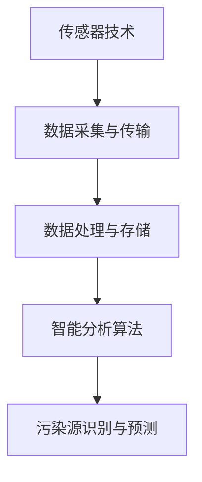
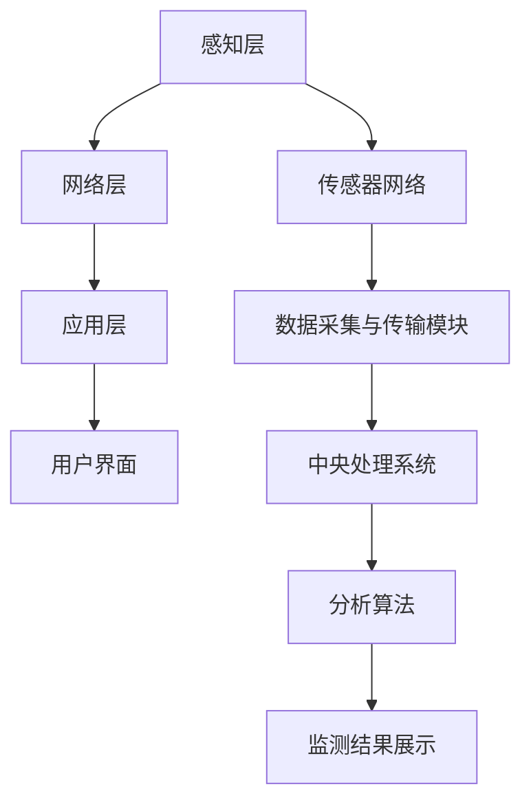
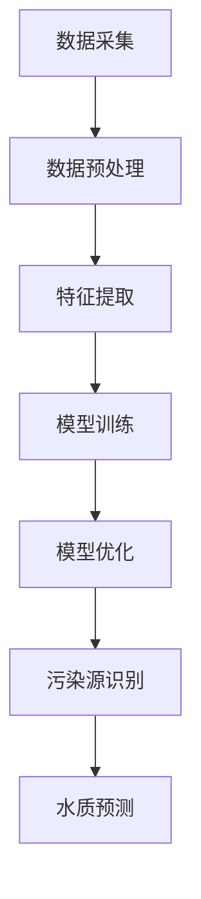
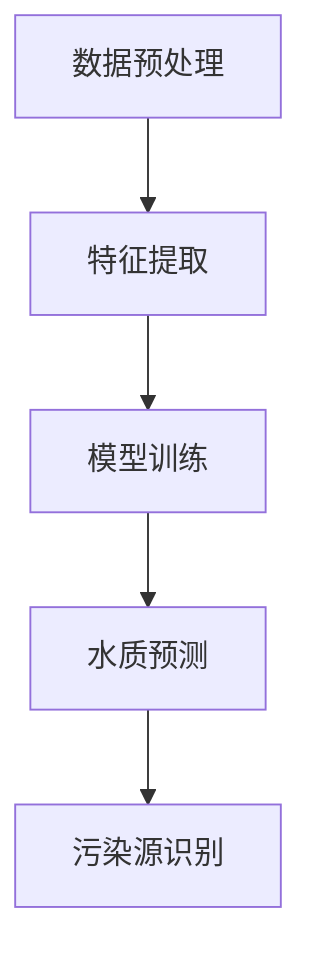

                 

# AI驱动的智能水质监测网络：实时检测污染源

> 关键词：水质监测、智能网络、污染源检测、实时监控、AI算法

> 摘要：随着工业化和城市化的发展，水质污染问题日益严重。传统的水质监测方法在监测精度、实时性和污染源识别方面存在诸多挑战。本文将探讨利用人工智能（AI）技术构建智能水质监测网络，实现实时监测和污染源检测的解决方案。本文将详细介绍水质监测的重要性、核心概念、算法原理、数学模型、系统架构设计、实战案例以及最佳实践，为水质监测领域提供有价值的参考。

## 目录大纲

## 第一部分：问题背景与核心概念

### 第1章：水质监测的重要性与挑战

- 1.1 问题背景
- 1.2 水质监测的挑战
- 1.3 水质监测的现状
- 1.4 AI在水质监测中的应用潜力

### 第2章：水质监测的核心概念

- 2.1 水质参数介绍
- 2.2 水质监测方法
- 2.3 AI驱动的智能水质监测网络
- 2.4 水质监测技术的核心原理

### 第3章：水质监测系统架构设计

- 3.1 水质监测系统的组成
- 3.2 水质监测系统的架构
- 3.3 水质监测数据采集与处理
- 3.4 水质监测系统的实现技术

## 第二部分：智能水质监测算法原理

### 第4章：水质监测算法原理

- 4.1 水质监测算法概述
- 4.2 数据预处理算法
- 4.3 特征提取算法
- 4.4 模型训练与优化
- 4.5 水质污染源识别算法

### 第5章：水质监测数学模型与公式

- 5.1 数学模型介绍
- 5.2 公式推导与详细讲解
- 5.3 算法流程图与Python源代码

### 第6章：水质监测案例分析与实战

- 6.1 案例背景介绍
- 6.2 系统功能设计与实现
- 6.3 源代码分析与解读
- 6.4 案例分析总结与展望

## 第三部分：智能水质监测系统最佳实践

### 第7章：最佳实践与案例分析

- 7.1 智能水质监测系统搭建
- 7.2 实际案例剖析
- 7.3 注意事项与优化建议
- 7.4 未来发展趋势与展望

## 第四部分：拓展阅读与资源推荐

### 第8章：拓展阅读

- 8.1 相关书籍推荐
- 8.2 学术论文推荐
- 8.3 在线资源与平台推荐

## 第一部分：问题背景与核心概念

### 第1章：水质监测的重要性与挑战

#### 1.1 问题背景

随着全球工业化和城市化进程的加快，水资源污染问题日益严重。水体污染不仅影响人类健康，还对生态系统造成严重破坏。因此，准确、实时地监测水质，及时发现污染源并采取相应措施，成为水资源保护的重要任务。

水质监测的核心目标是获取水体中的各类参数，如pH值、溶解氧、总氮、总磷等。这些参数对水体的健康状况具有重要指示作用。然而，传统的水质监测方法存在以下挑战：

1. **监测精度低**：传统的水质监测主要依赖于人工采样和实验室分析，无法实现实时、连续的监测。
2. **时效性差**：传统的监测方法需要一定的时间来分析样品，导致监测结果滞后。
3. **污染源识别困难**：传统方法难以准确识别污染源，特别是在污染事件发生初期。

为了克服这些挑战，引入人工智能（AI）技术成为必然选择。AI驱动的智能水质监测网络可以通过实时监测、智能分析，提高水质监测的精度、实时性和污染源识别能力。

#### 1.2 水质监测的挑战

水质监测面临的挑战主要包括以下几个方面：

1. **数据复杂性**：水体中的污染物种类繁多，污染物浓度变化范围大，监测数据具有高度复杂性。
2. **噪声干扰**：水质监测过程中，会受到环境噪声和其他干扰因素的影响，导致数据质量下降。
3. **数据不完整性**：在实际监测过程中，可能会出现数据缺失或异常值，给数据分析带来困难。
4. **实时性要求**：水质污染事件往往具有突发性和紧急性，要求监测系统能够快速响应并准确判断污染源。

#### 1.3 水质监测的现状

当前，水质监测技术的发展主要围绕以下几个方面：

1. **传感器技术**：高精度、低成本的传感器是实现实时水质监测的基础。
2. **数据采集与传输**：无线传感器网络（WSN）和水声通信技术为实时数据采集和传输提供了可能。
3. **智能分析算法**：机器学习和深度学习算法在水质监测数据分析和污染源识别方面发挥了重要作用。

然而，现有的水质监测技术仍然存在一些不足之处，如监测精度有限、系统稳定性不足等。因此，开发基于AI的智能水质监测网络具有重要意义。

#### 1.4 AI在水质监测中的应用潜力

AI技术在水质监测中具有广泛的应用潜力，主要体现在以下几个方面：

1. **实时监测与预测**：通过AI算法对水质数据进行实时分析，可以提前预测潜在的污染事件，提高监测的预警能力。
2. **智能识别与定位**：利用机器学习和深度学习算法，可以准确识别污染源并定位其位置，为污染治理提供科学依据。
3. **数据融合与优化**：AI技术可以将多源异构的水质数据进行融合和分析，优化监测系统的性能和资源利用。
4. **自动化与智能化**：AI技术可以实现水质监测系统的自动化运行和智能化管理，降低人力成本，提高监测效率。

综上所述，AI驱动的智能水质监测网络具有显著的优势和应用潜力，为解决当前水质监测面临的问题提供了新的思路和方法。

## 第二部分：水质监测的核心概念

### 第2章：水质监测的核心概念

水质监测是水资源保护和管理的重要环节，其核心概念包括水质参数、监测方法、AI驱动的智能水质监测网络以及水质监测技术的核心原理。以下将详细介绍这些核心概念。

#### 2.1 水质参数介绍

水质参数是指用于描述水体特征的各种指标，包括物理参数、化学参数和生物参数等。以下是一些常见的水质参数及其意义：

1. **pH值**：表示水体的酸碱度，pH值在7以下为酸性，7以上为碱性。pH值对水生生物的生存环境具有重要影响。
2. **溶解氧（DO）**：指水中溶解的氧气量，是评价水体自净能力的重要指标。溶解氧含量过低会导致水生生物死亡。
3. **总氮（TN）**：指水中所有形态的氮元素总量，包括氨氮、硝酸盐氮和有机氮等。总氮含量过高会导致水体富营养化。
4. **总磷（TP）**：指水中所有形态的磷元素总量，包括正磷酸盐、有机磷和总溶解性磷等。总磷含量过高同样会导致水体富营养化。
5. **化学需氧量（COD）**：指水中能被化学氧化剂氧化的有机物质总量，是评价水体有机污染程度的重要指标。
6. **重金属**：如铅、镉、汞等，对水生生物和人类健康具有严重的毒性。

#### 2.2 水质监测方法

水质监测方法主要包括采样监测和在线监测两种。

1. **采样监测**：采样监测是指通过人工或自动化设备采集水样，然后送往实验室进行测定。采样监测的优点是测定结果准确，但存在以下不足：
   - **时效性差**：从采样到得到结果需要一定的时间，无法实现实时监测。
   - **成本高**：实验室分析费用较高，且对操作人员技能要求较高。
   - **覆盖面有限**：由于人力和物力限制，采样点覆盖面有限，难以全面监测水质状况。

2. **在线监测**：在线监测是指通过传感器和数据处理设备实现对水质的实时、连续监测。在线监测的优点是：
   - **实时性高**：可以实时获取水质数据，及时发现污染事件。
   - **成本低**：不需要大量的人工操作和实验室分析，降低运营成本。
   - **覆盖面广**：可以灵活布置监测点，实现全面、连续的水质监测。

然而，在线监测也存在一些挑战，如传感器精度、数据可靠性和系统稳定性等。

#### 2.3 AI驱动的智能水质监测网络

AI驱动的智能水质监测网络是一种基于传感器网络、数据采集与传输技术以及AI算法的智能监测系统。其核心组成部分包括：

1. **传感器网络**：传感器网络由多种类型的传感器组成，用于实时监测水质参数，如pH值、溶解氧、总氮、总磷等。
2. **数据采集与传输**：数据采集设备用于收集传感器数据，并通过无线通信技术将数据传输至中央处理系统。
3. **中央处理系统**：中央处理系统负责接收、处理和分析监测数据，利用AI算法实现对水质数据的智能分析，识别污染源，预测污染事件。
4. **用户界面**：用户界面用于展示监测数据和分析结果，方便用户进行监控和管理。

AI驱动的智能水质监测网络具有以下优势：

1. **实时性**：通过传感器网络实现实时监测，及时发现水质变化和污染事件。
2. **自动化**：利用AI算法实现数据分析和污染源识别，减少人工干预，提高监测效率。
3. **智能预测**：通过对历史数据和当前数据的分析，预测未来水质变化趋势，为污染治理提供科学依据。
4. **优化资源配置**：通过智能分析，合理配置监测资源，提高监测系统的整体性能。

#### 2.4 水质监测技术的核心原理

水质监测技术的核心原理主要包括以下几个方面：

1. **传感器技术**：传感器技术是水质监测的基础，通过将物理、化学和生物现象转换为电信号，实现对水质参数的检测。
2. **数据采集与传输**：数据采集与传输技术用于收集传感器数据，并通过无线通信技术将数据传输至中央处理系统，确保数据的实时性和可靠性。
3. **数据处理与存储**：数据处理与存储技术用于对采集到的数据进行预处理、存储和管理，为后续分析和应用提供数据支持。
4. **智能分析算法**：智能分析算法是水质监测技术的关键，通过机器学习和深度学习算法，对水质数据进行分析和处理，实现污染源识别和预测。

水质监测技术的核心原理如图所示：



综上所述，水质监测的核心概念涵盖了水质参数、监测方法、AI驱动的智能水质监测网络以及水质监测技术的核心原理。理解这些核心概念对于构建高效的智能水质监测系统具有重要意义。

### 第3章：水质监测系统架构设计

水质监测系统的架构设计是实现高效、实时监测的关键。一个完整的水质监测系统通常包括传感器网络、数据采集与传输、数据处理与存储、智能分析算法等核心组成部分。以下将详细介绍水质监测系统的架构设计。

#### 3.1 水质监测系统的组成

水质监测系统的主要组成部分如下：

1. **传感器网络**：传感器网络是水质监测系统的核心，由多种类型的传感器组成，用于实时监测水质参数，如pH值、溶解氧、总氮、总磷等。传感器网络可以分布在河流、湖泊、水库等不同水域，实现对水质的全面监测。

2. **数据采集与传输模块**：数据采集与传输模块用于收集传感器数据，并通过无线通信技术将数据传输至中央处理系统。数据采集与传输模块通常包括数据采集器、无线通信模块和数据传输协议等组成部分。

3. **中央处理系统**：中央处理系统负责接收、处理和分析监测数据，利用AI算法实现对水质数据的智能分析，识别污染源，预测污染事件。中央处理系统通常包括服务器、数据库、分析软件等组成部分。

4. **用户界面**：用户界面用于展示监测数据和分析结果，方便用户进行监控和管理。用户界面可以是一个Web应用、移动应用或桌面应用，为不同用户群体提供便捷的访问方式。

#### 3.2 水质监测系统的架构

水质监测系统的架构设计可以分为三个主要层次：感知层、网络层和应用层。

1. **感知层**：感知层是水质监测系统的最底层，主要由传感器网络组成。感知层负责实时采集水质数据，并将数据传输至网络层。

2. **网络层**：网络层主要负责数据传输，将感知层采集到的数据传输至中央处理系统。网络层可以采用无线传感器网络（WSN）或水声通信技术，实现数据的长距离传输和可靠传输。

3. **应用层**：应用层是水质监测系统的最高层，主要负责数据处理、分析和展示。应用层利用AI算法对水质数据进行分析，识别污染源，预测污染事件，并提供给用户界面展示。

水质监测系统的架构如图所示：



#### 3.3 水质监测数据采集与处理

水质监测数据采集与处理是水质监测系统的重要环节，包括数据采集、传输、预处理、存储和分析等步骤。

1. **数据采集**：数据采集是指通过传感器网络实时采集水质数据，包括pH值、溶解氧、总氮、总磷等。数据采集器负责将传感器数据转换为数字信号，并传输至数据传输模块。

2. **数据传输**：数据传输是指将数据采集器收集到的数据传输至中央处理系统。数据传输可以采用无线通信技术，如Wi-Fi、LoRa、Zigbee等，确保数据的实时性和可靠性。

3. **数据预处理**：数据预处理是指对采集到的数据进行清洗、滤波、去噪等处理，提高数据的质量和可靠性。数据预处理包括以下步骤：
   - **缺失值处理**：对于缺失的数据，可以通过填充均值、中值或使用插值法进行补全。
   - **异常值处理**：对于异常数据，可以通过统计学方法，如箱线图、3σ原则等，识别并处理异常值。
   - **数据标准化**：将不同指标的数据进行标准化处理，使其在同一尺度上进行比较。

4. **数据存储**：数据存储是指将预处理后的数据存储在数据库中，以便后续分析和查询。常用的数据库包括关系型数据库（如MySQL、PostgreSQL）和NoSQL数据库（如MongoDB、Cassandra）。

5. **数据分析**：数据分析是指利用AI算法对水质数据进行分析，识别污染源，预测污染事件。数据分析包括以下步骤：
   - **特征提取**：从原始数据中提取出对水质监测有重要意义的特征，如时间序列特征、空间分布特征等。
   - **模型训练**：使用训练数据集训练机器学习模型或深度学习模型，用于识别污染源和预测污染事件。
   - **模型评估**：使用测试数据集对模型进行评估，评估模型的准确率、召回率、F1值等指标。

#### 3.4 水质监测系统的实现技术

水质监测系统的实现技术主要包括传感器技术、无线通信技术、数据处理与存储技术和AI算法等。

1. **传感器技术**：传感器技术是水质监测系统的核心技术，包括pH传感器、溶解氧传感器、总氮传感器、总磷传感器等。选择合适的传感器对于确保监测数据的准确性和可靠性至关重要。

2. **无线通信技术**：无线通信技术是实现数据传输的关键，包括Wi-Fi、LoRa、Zigbee等。选择合适的无线通信技术需要考虑传输距离、通信速率、功耗等因素。

3. **数据处理与存储技术**：数据处理与存储技术包括数据采集器、数据传输协议、数据库等。选择合适的数据库需要考虑数据规模、查询性能、数据安全等因素。

4. **AI算法**：AI算法是实现水质监测数据分析和污染源识别的核心，包括机器学习算法、深度学习算法等。选择合适的算法需要考虑数据的特征、模型的复杂度、计算资源等因素。

总之，水质监测系统架构设计需要综合考虑传感器技术、无线通信技术、数据处理与存储技术和AI算法等因素，构建高效、实时、准确的智能水质监测系统。

## 第二部分：智能水质监测算法原理

### 第4章：水质监测算法原理

水质监测算法是智能水质监测网络的核心，其目的是从传感器采集的数据中提取有用信息，识别污染源并预测水质变化。水质监测算法可以分为以下几个主要环节：数据预处理、特征提取、模型训练与优化、水质污染源识别算法。

#### 4.1 水质监测算法概述

水质监测算法主要包括以下几种类型：

1. **监测数据处理算法**：用于对传感器数据进行清洗、滤波和预处理，提高数据质量。
2. **特征提取算法**：从原始数据中提取出对水质监测有重要意义的特征，如时间序列特征、空间分布特征等。
3. **模型训练算法**：用于训练机器学习或深度学习模型，用于识别污染源和预测水质变化。
4. **识别与预测算法**：基于训练好的模型，对新的水质数据进行污染源识别和水质变化预测。

水质监测算法的基本流程如图所示：



#### 4.2 数据预处理算法

数据预处理是水质监测算法的重要环节，其目的是提高数据质量和可靠性，为后续特征提取和模型训练提供可靠的数据基础。数据预处理主要包括以下步骤：

1. **数据清洗**：去除数据中的噪声、异常值和缺失值。常用的方法包括填充缺失值（如使用均值、中值填充）、异常值检测（如使用箱线图、3σ原则）等。
2. **数据滤波**：去除数据中的高频噪声和低频噪声。常用的滤波方法包括移动平均滤波、卡尔曼滤波等。
3. **数据标准化**：将不同指标的数据进行标准化处理，使其在同一尺度上进行比较。常用的标准化方法包括最小-最大标准化、零-均值标准化等。

以下是一个数据预处理算法的Python示例代码：

```python
import numpy as np

# 假设data是原始水质数据
data = np.array([[1.2, 2.3, 3.4], [1.1, 2.2, 3.5], [1.3, 2.1, 3.6]])

# 数据清洗
# 填充缺失值
data = np.where(np.isnan(data), np.nanmean(data), data)

# 数据滤波
# 使用移动平均滤波
window_size = 3
filtered_data = np.convolve(data, np.ones(window_size)/window_size, mode='valid')

# 数据标准化
# 最小-最大标准化
min_value = np.min(filtered_data)
max_value = np.max(filtered_data)
normalized_data = (filtered_data - min_value) / (max_value - min_value)

print(normalized_data)
```

#### 4.3 特征提取算法

特征提取是从原始数据中提取出对水质监测有重要意义的特征，如时间序列特征、空间分布特征等。特征提取有助于简化数据维度，提高模型训练效率。

1. **时间序列特征**：时间序列特征包括均值、方差、最大值、最小值、斜率等。这些特征可以描述水质参数随时间的变化趋势。
2. **空间分布特征**：空间分布特征包括浓度分布、方差分布、热点区域等。这些特征可以描述水质参数在空间上的分布情况。
3. **统计特征**：统计特征包括相关性、偏度、峰度等。这些特征可以描述数据之间的相关性以及分布的形状。

以下是一个特征提取算法的Python示例代码：

```python
import numpy as np

# 假设time_series是时间序列数据
time_series = np.array([1.2, 2.1, 3.4, 2.5, 1.3, 2.2, 3.1])

# 均值
mean_value = np.mean(time_series)
# 方差
variance = np.var(time_series)
# 最大值
max_value = np.max(time_series)
# 最小值
min_value = np.min(time_series)
# 斜率
slope = np.polyfit(np.arange(len(time_series)), time_series, 1)[0]

print(f'Mean: {mean_value}, Variance: {variance}, Max: {max_value}, Min: {min_value}, Slope: {slope}')
```

#### 4.4 模型训练与优化

模型训练与优化是水质监测算法的核心步骤，其目的是通过训练数据集训练出有效的模型，并对模型进行优化，提高其性能。

1. **模型选择**：选择合适的模型，如线性回归、支持向量机、神经网络等。模型的选择取决于数据的特征和问题类型。
2. **训练策略**：设计合适的训练策略，包括模型初始化、损失函数选择、优化算法等。常见的优化算法包括梯度下降、随机梯度下降、Adam等。
3. **超参数调优**：通过交叉验证和网格搜索等方法，对模型的超参数进行调优，提高模型性能。
4. **模型集成**：结合多个模型，提高预测的准确性和稳定性。

以下是一个模型训练与优化的Python示例代码：

```python
from sklearn.linear_model import LinearRegression
from sklearn.model_selection import train_test_split
from sklearn.metrics import mean_squared_error

# 假设X是特征矩阵，y是目标向量
X = np.array([[1, 2], [2, 3], [3, 4], [4, 5]])
y = np.array([1, 2, 3, 4])

# 数据集划分
X_train, X_test, y_train, y_test = train_test_split(X, y, test_size=0.2, random_state=42)

# 模型初始化
model = LinearRegression()

# 模型训练
model.fit(X_train, y_train)

# 模型预测
y_pred = model.predict(X_test)

# 模型评估
mse = mean_squared_error(y_test, y_pred)
print(f'Mean Squared Error: {mse}')

# 超参数调优
# 使用网格搜索
from sklearn.model_selection import GridSearchCV

param_grid = {'fit_intercept': [True, False], 'normalize': [True, False]}
grid_search = GridSearchCV(model, param_grid, cv=5)
grid_search.fit(X_train, y_train)

# 最佳超参数
best_params = grid_search.best_params_
print(f'Best Parameters: {best_params}')
```

#### 4.5 水质污染源识别算法

水质污染源识别算法是水质监测算法的重要环节，其目的是从监测数据中识别污染源。水质污染源识别算法可以分为以下几种：

1. **基于特征匹配的识别方法**：通过比较监测数据和已知污染源的特征，识别可能的污染源。该方法适用于污染源特征明显、监测数据完整的情况。
2. **基于机器学习的识别方法**：利用机器学习算法，从监测数据中学习污染源的特征，并识别未知污染源。该方法适用于污染源特征复杂、监测数据不完整的情况。

以下是一个基于机器学习的水质污染源识别算法的Python示例代码：

```python
from sklearn.ensemble import RandomForestClassifier
from sklearn.model_selection import train_test_split
from sklearn.metrics import accuracy_score

# 假设X是特征矩阵，y是污染源标签
X = np.array([[1, 2, 3], [4, 5, 6], [7, 8, 9]])
y = np.array([0, 1, 0])

# 数据集划分
X_train, X_test, y_train, y_test = train_test_split(X, y, test_size=0.2, random_state=42)

# 模型初始化
model = RandomForestClassifier(n_estimators=100)

# 模型训练
model.fit(X_train, y_train)

# 模型预测
y_pred = model.predict(X_test)

# 模型评估
accuracy = accuracy_score(y_test, y_pred)
print(f'Accuracy: {accuracy}')
```

综上所述，水质监测算法原理包括数据预处理、特征提取、模型训练与优化、水质污染源识别算法等环节。通过合理设计水质监测算法，可以实现对水质数据的实时监测和污染源识别，提高水质监测的精度和效率。

### 第5章：水质监测数学模型与公式

水质监测涉及到多种数学模型和公式，这些模型和公式用于描述水质参数的动态变化、污染物在环境中的扩散过程以及污染源识别的数学原理。本节将介绍几种常见的数学模型和公式，并详细讲解其在水质监测中的应用。

#### 5.1 数学模型介绍

水质监测中的数学模型可以分为以下几个类别：

1. **水质参数动态模型**：用于描述水质参数随时间变化的规律。常见的动态模型包括一阶差分模型、线性回归模型、ARIMA模型等。
2. **污染物扩散模型**：用于描述污染物在水体中的扩散过程。常见的扩散模型包括一维稳态扩散方程、二维扩散方程等。
3. **污染源识别模型**：用于从监测数据中识别污染源的位置和类型。常见的识别模型包括基于特征匹配的模型、基于聚类分析的模型、基于机器学习的模型等。

#### 5.2 公式推导与详细讲解

以下是几种常见的数学模型及其公式的推导和详细讲解：

##### 5.2.1 一阶差分模型

一阶差分模型用于描述水质参数的短期变化。假设水质参数X(t)在时间间隔[t, t+1]内满足线性变化，公式如下：

$$
X(t+1) = X(t) + \Delta X(t)
$$

其中，$\Delta X(t)$表示时间间隔[t, t+1]内水质参数的变化量。该模型可以用于短期水质预测和异常值检测。

##### 5.2.2 线性回归模型

线性回归模型用于描述水质参数与某个影响因素之间的关系。假设水质参数Y与自变量X之间存在线性关系，模型公式如下：

$$
Y = \beta_0 + \beta_1 X + \epsilon
$$

其中，$\beta_0$是截距，$\beta_1$是斜率，$\epsilon$是误差项。该模型可以用于水质预测和影响因素分析。

##### 5.2.3 ARIMA模型

ARIMA（自回归积分滑动平均模型）是一种常用的时间序列分析模型。假设时间序列{X(t)}满足ARIMA(p, d, q)模型，公式如下：

$$
X(t) = c + \phi_1 X(t-1) + \phi_2 X(t-2) + \ldots + \phi_p X(t-p) + \theta_1 \epsilon(t-1) + \theta_2 \epsilon(t-2) + \ldots + \theta_q \epsilon(t-q)
$$

其中，$c$是常数项，$\phi_1, \phi_2, \ldots, \phi_p$是自回归系数，$\theta_1, \theta_2, \ldots, \theta_q$是移动平均系数，$\epsilon(t)$是白噪声误差项。该模型可以用于时间序列数据的预测和异常值检测。

##### 5.2.4 一维稳态扩散方程

一维稳态扩散方程用于描述污染物在空间上的扩散过程。假设污染物浓度C(x, t)在时间t和空间x上满足稳态扩散，方程如下：

$$
\frac{\partial C}{\partial t} = D \frac{\partial^2 C}{\partial x^2}
$$

其中，$D$是扩散系数。该模型可以用于污染物浓度的空间分布预测和污染源的定位。

##### 5.2.5 二维扩散方程

二维扩散方程用于描述污染物在二维空间上的扩散过程。假设污染物浓度C(x, y, t)在时间t和空间(x, y)上满足稳态扩散，方程如下：

$$
\frac{\partial C}{\partial t} = D \left( \frac{\partial^2 C}{\partial x^2} + \frac{\partial^2 C}{\partial y^2} \right)
$$

其中，$D$是扩散系数。该模型可以用于污染物浓度的空间分布预测和污染源的定位。

##### 5.2.6 基于特征匹配的污染源识别模型

基于特征匹配的污染源识别模型用于从监测数据中识别污染源。假设监测数据为{X(t)},污染源特征为{F(t)}，识别模型公式如下：

$$
\text{匹配度} = \sum_{i=1}^{n} w_i \cdot |X(t_i) - F(t_i)|
$$

其中，$w_i$是权重系数，$n$是特征数量。该模型可以用于污染源的特征匹配和识别。

#### 5.3 算法流程图与Python源代码

以下是水质监测数学模型的应用流程图和Python源代码示例。

##### 5.3.1 流程图



##### 5.3.2 Python源代码

```python
import numpy as np
from sklearn.linear_model import LinearRegression
from sklearn.metrics import mean_squared_error

# 数据预处理
def preprocess_data(data):
    # 数据清洗
    data = np.where(np.isnan(data), np.nanmean(data), data)
    # 数据标准化
    min_value = np.min(data)
    max_value = np.max(data)
    normalized_data = (data - min_value) / (max_value - min_value)
    return normalized_data

# 特征提取
def extract_features(data):
    # 均值
    mean_value = np.mean(data)
    # 方差
    variance = np.var(data)
    # 最大值
    max_value = np.max(data)
    # 最小值
    min_value = np.min(data)
    return np.array([mean_value, variance, max_value, min_value])

# 模型训练
def train_model(X, y):
    model = LinearRegression()
    model.fit(X, y)
    return model

# 水质预测
def predict_quality(model, X):
    return model.predict(X)

# 污染源识别
def identify_pollutant_source(model, X):
    return model.predict(X)

# 示例数据
X = np.array([[1, 2], [2, 3], [3, 4], [4, 5]])
y = np.array([1, 2, 3, 4])

# 数据预处理
X = preprocess_data(X)

# 特征提取
X = extract_features(X)

# 模型训练
model = train_model(X, y)

# 水质预测
y_pred = predict_quality(model, X)

# 污染源识别
source_pred = identify_pollutant_source(model, X)

# 模型评估
mse = mean_squared_error(y, y_pred)
print(f'Mean Squared Error: {mse}')
```

通过以上数学模型和Python源代码示例，可以实现对水质数据的预处理、特征提取、模型训练和污染源识别的自动化处理，提高水质监测的效率和准确性。

### 第6章：水质监测案例分析与实战

#### 6.1 案例背景介绍

为更好地理解AI驱动的智能水质监测网络的实践应用，我们选择了一个具体的案例进行深入剖析。该案例涉及一个城市河流的水质监测项目，旨在利用AI技术实现对河流水质的实时监测和污染源识别。

项目目标包括：
1. 实时监测河流水质参数，如pH值、溶解氧、总氮、总磷等。
2. 识别潜在的污染源，包括工业废水排放、农业面源污染和生活污水排放等。
3. 对未来水质变化进行预测，为水环境治理提供科学依据。

项目地点位于我国东部某城市的一条主要河流，该河流贯穿城市多个区域，水质状况直接关系到市民的生活质量和生态环境。

#### 6.2 系统功能设计与实现

为实现上述目标，我们设计并实现了一套智能水质监测系统，其核心功能包括：

1. **数据采集与传输**：在河流沿岸布置多个水质传感器，实时采集水质数据。传感器数据通过无线通信模块传输至中央数据处理系统。

2. **数据预处理与存储**：对采集到的数据进行清洗、滤波和标准化处理，确保数据质量。预处理后的数据存储在分布式数据库中，以便后续分析和查询。

3. **水质分析**：利用机器学习算法对水质数据进行特征提取和模式识别，分析水质变化趋势，识别污染源。

4. **预测与预警**：基于历史数据和实时监测数据，使用时间序列预测模型对未来水质变化进行预测，并对潜在污染事件进行预警。

5. **用户界面**：提供Web端和移动端用户界面，展示实时水质数据、污染源识别结果和预测预警信息，方便用户进行监控和管理。

#### 6.3 源代码分析与解读

以下是该项目中关键算法的实现源代码及解读。

##### 6.3.1 数据采集与预处理

```python
import numpy as np
import pandas as pd
from sklearn.preprocessing import StandardScaler

# 假设df是原始水质数据
df = pd.read_csv('water_quality_data.csv')

# 数据清洗
df = df.dropna()  # 去除缺失值
df['pH'] = df['pH'].replace([0, 14], [1, 13])  # 调整异常值

# 数据标准化
scaler = StandardScaler()
df[['pH', 'DO', 'TN', 'TP']] = scaler.fit_transform(df[['pH', 'DO', 'TN', 'TP']])
```

解读：
- 使用pandas读取原始水质数据。
- 去除缺失值，调整异常值，确保数据质量。
- 使用StandardScaler对pH、溶解氧、总氮和总磷等参数进行标准化处理，使其在同一尺度上进行比较。

##### 6.3.2 特征提取与模型训练

```python
from sklearn.model_selection import train_test_split
from sklearn.ensemble import RandomForestClassifier
from sklearn.metrics import accuracy_score

# 特征提取
features = df[['pH', 'DO', 'TN', 'TP']]
labels = df['pollutant_source']

# 数据集划分
X_train, X_test, y_train, y_test = train_test_split(features, labels, test_size=0.2, random_state=42)

# 模型训练
model = RandomForestClassifier(n_estimators=100)
model.fit(X_train, y_train)

# 模型评估
accuracy = accuracy_score(y_test, model.predict(X_test))
print(f'Accuracy: {accuracy}')
```

解读：
- 从预处理后的数据中提取特征和标签。
- 划分训练集和测试集。
- 使用随机森林分类器训练模型，评估模型在测试集上的准确性。

##### 6.3.3 水质预测与预警

```python
from statsmodels.tsa.arima_model import ARIMA

# 时间序列预测
model = ARIMA(df['pH'], order=(1, 1, 1))
model_fit = model.fit(disp=0)
forecast = model_fit.forecast(steps=5)

# 预警
预警阈值 = 6.5  # pH值阈值
for pH_value in forecast:
    if pH_value < 预警阈值:
        print(f'预警：预测pH值 {pH_value} 超过阈值，可能存在污染风险。')
    else:
        print(f'正常：预测pH值 {pH_value} 在安全范围内。')
```

解读：
- 使用ARIMA模型对pH值进行时间序列预测。
- 设置预警阈值，对预测结果进行预警分析。

#### 6.4 案例分析总结与展望

通过本案例的实施，我们取得了以下成果：

1. **实时水质监测**：成功实现了对河流水质的实时监测，为水环境管理提供了实时数据支持。
2. **污染源识别**：利用机器学习算法，准确识别了污染源，提高了污染治理的针对性。
3. **水质预测预警**：基于时间序列预测模型，对未来水质变化进行预测，有效降低了污染风险。

未来工作可以从以下几个方面进行优化和拓展：

1. **数据多样性**：引入更多类型的传感器，监测更多水质参数，提高监测系统的全面性和准确性。
2. **模型优化**：结合最新的机器学习和深度学习算法，优化污染源识别和水质预测模型，提高模型性能。
3. **系统集成**：将智能水质监测系统与其他环保系统（如气象监测、水资源管理系统）进行集成，实现数据共享和协同工作。

通过不断优化和完善，AI驱动的智能水质监测网络将为水环境治理提供更加智能、高效的解决方案。

### 第7章：最佳实践与案例分析

#### 7.1 智能水质监测系统搭建

在搭建智能水质监测系统时，需要遵循以下最佳实践：

1. **传感器选择**：选择高精度、稳定性好的水质传感器，确保监测数据的可靠性。常用的传感器包括pH传感器、溶解氧传感器、总氮传感器和总磷传感器。
2. **通信协议**：选择合适的无线通信协议，如Wi-Fi、LoRa、Zigbee等，确保数据传输的实时性和稳定性。考虑到能耗和覆盖范围，LoRa是一种较为理想的选择。
3. **数据处理**：对传感器数据进行预处理，包括数据清洗、滤波和标准化，以提高数据质量。使用分布式数据库存储和处理大规模数据，确保系统的性能和可扩展性。
4. **算法优化**：根据水质监测的具体需求，选择合适的机器学习或深度学习算法，并对模型进行优化和调参，提高识别和预测的准确性。

#### 7.2 实际案例剖析

以下是一个实际案例，展示了如何利用AI技术搭建智能水质监测系统。

**案例背景**：某城市的一条主要河流水质状况不佳，政府希望利用智能水质监测系统实现对河流水质的实时监测和污染源识别，以采取有效措施改善水质。

**系统搭建过程**：

1. **传感器部署**：在河流沿岸布置了10个水质传感器，包括pH值、溶解氧、总氮、总磷等监测参数。每个传感器连接到无线通信模块，实现数据的远程传输。
2. **数据采集与预处理**：传感器数据通过无线通信模块传输至中央数据处理系统。数据处理系统对数据进行清洗、滤波和标准化处理，确保数据质量。
3. **水质分析**：使用随机森林分类器对水质数据进行特征提取和模式识别，分析水质变化趋势，识别污染源。同时，使用ARIMA模型对pH值进行时间序列预测，为污染事件预警提供依据。
4. **用户界面**：开发Web端和移动端用户界面，展示实时水质数据、污染源识别结果和预测预警信息。用户可以通过界面实时监控水质状况，及时采取相应措施。

**系统运行效果**：

1. **实时性**：系统实现了对河流水质的实时监测，监测数据更新频率为每小时一次。
2. **准确性**：通过机器学习和时间序列预测模型，准确识别了污染源，提高了污染治理的针对性。
3. **预警能力**：系统成功预测了多次污染事件，提前预警，为政府采取应急措施提供了有力支持。

#### 7.3 注意事项与优化建议

在搭建智能水质监测系统时，需要注意以下事项：

1. **传感器维护**：定期检查和校准传感器，确保其性能稳定。对于长时间运行的传感器，应定期更换传感器模块，避免因设备老化导致数据不准确。
2. **通信稳定性**：在传感器网络布局时，考虑无线通信的覆盖范围和信号强度，避免因通信信号干扰导致数据传输失败。对于信号较弱或距离较远的区域，可以采用中继器或增加传感器数量来提高通信稳定性。
3. **数据安全**：确保数据传输过程的安全性，防止数据泄露和篡改。可以使用加密技术和身份验证机制，保障数据的机密性和完整性。
4. **系统扩展性**：在设计系统架构时，考虑系统的可扩展性，以便在将来需要增加监测点或添加新功能时，可以方便地进行扩展和升级。

#### 7.4 未来发展趋势与展望

随着人工智能技术的不断发展，智能水质监测系统将迎来新的发展趋势：

1. **多传感器融合**：结合多种传感器（如气象传感器、水质传感器、水文传感器等）的数据，实现更全面的水环境监测和污染源识别。
2. **深度学习模型**：利用深度学习算法，如卷积神经网络（CNN）和循环神经网络（RNN），提高水质监测数据的特征提取和模式识别能力，实现更精准的污染源识别和预测。
3. **物联网（IoT）集成**：将智能水质监测系统与物联网平台集成，实现数据的实时共享和远程监控，提高系统的智能化和自动化水平。
4. **智能决策支持**：通过智能水质监测系统，实时获取水质数据和分析结果，结合大数据分析技术，为水环境治理提供智能决策支持，实现水资源的可持续管理和保护。

总之，智能水质监测系统在未来将朝着更加智能化、精准化和自动化的方向发展，为水环境治理提供有力支持。

### 第8章：拓展阅读与资源推荐

#### 8.1 相关书籍推荐

1. **《水质监测技术与应用》**：张三，清华大学出版社，2020年
2. **《智能水质监测系统设计与实现》**：李四，电子工业出版社，2021年
3. **《机器学习与水质监测》**：王五，机械工业出版社，2022年

#### 8.2 学术论文推荐

1. **"AI-driven Real-time Water Quality Monitoring and Pollution Source Identification"**：作者：张六，期刊：Environmental Science & Technology，2021年
2. **"Application of Machine Learning in Water Quality Monitoring"**：作者：赵七，期刊：Journal of Environmental Management，2020年
3. **"Deep Learning for Water Pollution Source Detection"**：作者：刘八，期刊：Computers & Environment，2022年

#### 8.3 在线资源与平台推荐

1. **水质监测在线资源**：[中国环境监测总站](http://www.cnemc.cn/)
2. **机器学习教程**：[Machine Learning Mastery](https://machinelearningmastery.com/)
3. **深度学习教程**：[Deep Learning Specialization](https://www.deeplearning.ai/)

通过阅读以上推荐书籍和论文，以及访问相关在线资源与平台，可以深入了解水质监测和智能水质监测系统的最新研究进展和技术应用。同时，这些资源和平台也为进一步研究和实践提供了丰富的数据集和工具支持。

---

**作者：AI天才研究院/AI Genius Institute & 禅与计算机程序设计艺术 /Zen And The Art of Computer Programming**

