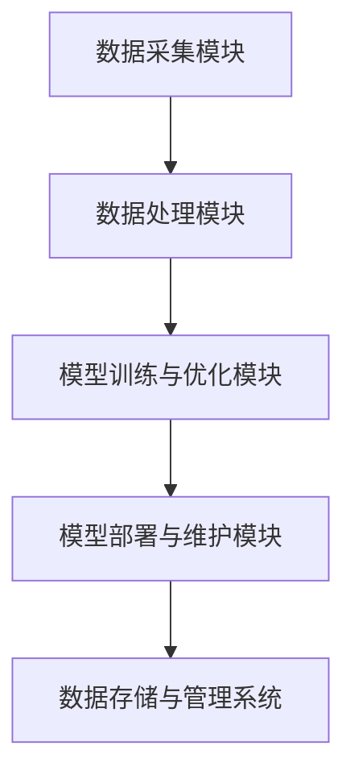

                 

### AI驱动的智能海洋生态监测：保护海洋生物多样性

#### 摘要

随着人类活动的不断增加，海洋生态系统正面临着前所未有的威胁。海洋污染、过度捕捞、气候变化等因素导致了海洋生物多样性的急剧下降。为了保护海洋生态，提高海洋监测的效率和准确性，人工智能（AI）技术的应用成为了一项重要的战略方向。本文将探讨如何利用AI技术实现智能海洋生态监测，重点讨论保护海洋生物多样性的策略和案例，以期为未来的海洋生态保护工作提供有益的参考。

#### 目录

1. **背景介绍**
   1.1 海洋生态系统的现状
   1.2 海洋污染与生物多样性下降
   1.3 AI在海洋生态监测中的应用

2. **AI驱动的智能海洋生态监测**

   2.1 AI基础理论
   2.2 关键技术
   2.3 AI驱动的监测流程

3. **海洋生物多样性保护**

   3.1 保护策略
   3.2 AI在生物多样性保护中的应用
   3.3 AI驱动的生物多样性保护案例

4. **系统设计与实现**

   4.1 系统架构设计
   4.2 数据处理流程
   4.3 模型训练与优化

5. **项目实战**

   5.1 环境安装与配置
   5.2 系统核心实现
   5.3 应用解读与分析

6. **最佳实践与总结**

   6.1 最佳实践
   6.2 小结
   6.3 注意事项与拓展阅读

#### 背景介绍

##### 海洋生态系统的现状

海洋生态系统是地球上最大的生态系统之一，涵盖了广阔的海域、海岸线、海底山脉、峡谷以及各种海洋生物。这些生物之间存在着复杂的相互作用，构成了一个高度动态和复杂的生态系统。然而，近年来，海洋生态系统正面临着严重的威胁。

首先，海洋污染是一个主要问题。工业废弃物、农业径流、石油泄漏以及塑料垃圾等污染物质不断进入海洋，导致海洋水质恶化，对海洋生物产生极大的危害。例如，塑料垃圾不仅对海洋生物造成物理伤害，还会通过食物链影响整个生态系统的健康。

其次，海洋生物多样性下降也是不容忽视的问题。过度捕捞、栖息地破坏和气候变化等因素导致许多海洋物种的数量急剧减少。一些研究表明，全球鱼类种群数量在过去50年中减少了约三分之一。此外，珊瑚礁的白化和珊瑚礁生态系统的退化也导致了海洋生物多样性的下降。

##### 海洋污染与生物多样性下降

海洋污染是导致海洋生物多样性下降的主要原因之一。污染物包括化学物质、重金属、塑料等，它们可以通过多种途径进入海洋，如工业排放、农业径流、船舶泄漏和陆地垃圾的流入等。这些污染物对海洋生物的影响是多方面的：

- **化学污染**：化学污染物如农药、工业化学品等，可以通过生物积累和生物放大作用在食物链中逐级积累，对海洋生物的生殖、发育和生长产生负面影响。例如，有机氯农药DDT对海洋生物的生殖系统有严重的破坏作用。
- **重金属污染**：重金属如铅、镉、汞等，可以通过生物吸收、生物积累和生物放大作用对海洋生物产生毒性效应。重金属污染对海洋生物的神经系统和免疫系统有显著的影响，甚至可能导致物种的灭绝。
- **塑料污染**：塑料污染已经成为全球性的问题，海洋是塑料垃圾的主要聚集地之一。塑料垃圾对海洋生物的直接影响包括物理伤害和消化阻塞，而间接影响则包括生物积累和食物链传递。

##### AI在海洋生态监测中的应用

为了应对海洋污染和生物多样性下降的挑战，科学家和工程师们开始探索使用人工智能（AI）技术进行海洋生态监测。AI技术具有以下优势：

- **高效性**：AI技术可以快速处理大量数据，提高监测效率和准确性。
- **自动化**：AI系统可以自动执行监测任务，减少人工干预，降低成本。
- **实时性**：AI技术可以实时分析数据，及时响应环境变化。
- **深度分析**：AI技术可以通过机器学习和深度学习算法对数据进行深入分析，发现潜在的环境问题和趋势。

在海洋生态监测中，AI技术主要应用于以下几个方面：

- **图像识别**：利用计算机视觉技术，AI可以识别海洋生物、污染物和异常情况。
- **时间序列分析**：通过对环境数据的长期监测，AI可以分析出环境变化趋势和模式。
- **自然语言处理**：AI可以对环境报告、学术论文等文本资料进行自动分类和分析，提取关键信息。

通过AI驱动的智能海洋生态监测，我们可以更全面、更准确地了解海洋生态系统的状况，为保护海洋生物多样性提供科学依据。

#### AI驱动的智能海洋生态监测

##### AI基础理论

AI基础理论主要包括机器学习、深度学习和监督学习、无监督学习和半监督学习等。

- **机器学习**：机器学习是一种使计算机从数据中学习规律和模式的方法，它可以通过训练模型来对未知数据进行预测和分类。机器学习算法分为监督学习和无监督学习两种类型。

- **深度学习**：深度学习是机器学习的一个分支，它使用多层神经网络对数据进行深度学习，能够自动提取特征并提高模型的预测能力。深度学习在图像识别、语音识别和自然语言处理等领域取得了显著的成果。

- **监督学习**：监督学习是一种有标注数据集的训练方法，通过输入和输出对之间关系的学习，对新的输入数据进行预测。常见的监督学习算法包括线性回归、逻辑回归、支持向量机（SVM）和神经网络等。

- **无监督学习**：无监督学习是在没有标注数据集的情况下，通过分析数据的内在结构和模式来进行分类或降维。常见的无监督学习算法包括聚类算法（如K-均值聚类和层次聚类）和降维算法（如主成分分析PCA）。

- **半监督学习**：半监督学习结合了监督学习和无监督学习的方法，利用少量标注数据和大量未标注数据来训练模型，能够提高模型的泛化能力。

##### 关键技术

AI在海洋生态监测中的关键技术主要包括图像识别、时间序列分析和自然语言处理。

- **图像识别**：图像识别是计算机视觉的一个分支，它通过分析图像像素特征，识别出图像中的物体、场景或事件。在海洋生态监测中，图像识别可以用于识别海洋生物、污染物和异常情况。

  图像识别算法主要包括传统算法（如SIFT、SURF）和深度学习算法（如卷积神经网络CNN）。深度学习算法在图像识别任务中表现出更高的准确性和鲁棒性。

  ```mermaid
  graph TD
  A[图像识别] --> B[传统算法]
  B --> C{SIFT}
  B --> D{SURF}
  A --> E[深度学习算法]
  E --> F{卷积神经网络(CNN)}
  E --> G{循环神经网络(RNN)}
  ```

- **时间序列分析**：时间序列分析是对时间序列数据进行统计分析的方法，它可以帮助我们理解数据的时间演变规律。在海洋生态监测中，时间序列分析可以用于分析海洋环境的长期变化趋势和短期波动。

  时间序列分析算法包括自回归模型（AR）、移动平均模型（MA）、自回归移动平均模型（ARMA）和广义自回归移动平均模型（ARIMA）等。

  ```mermaid
  graph TD
  A[时间序列分析] --> B{自回归模型(AR)}
  B --> C{移动平均模型(MA)}
  B --> D{自回归移动平均模型(ARMA)}
  B --> E{广义自回归移动平均模型(ARIMA)}
  ```

- **自然语言处理**：自然语言处理是计算机科学和人工智能领域的一个分支，它旨在使计算机理解和处理自然语言。在海洋生态监测中，自然语言处理可以用于处理环境报告、学术论文等文本资料，提取关键信息。

  自然语言处理技术包括分词、词性标注、句法分析、语义分析和机器翻译等。

  ```mermaid
  graph TD
  A[自然语言处理] --> B{分词}
  B --> C{词性标注}
  B --> D{句法分析}
  B --> E{语义分析}
  B --> F{机器翻译}
  ```

##### AI驱动的监测流程

AI驱动的智能海洋生态监测流程可以分为以下几个步骤：

- **数据收集**：收集海洋生态监测所需的数据，包括图像、时间序列数据和文本资料等。
- **数据预处理**：对收集到的数据进行清洗、去噪和格式转换等预处理操作，使其适合模型训练。
- **模型训练**：使用机器学习或深度学习算法对预处理后的数据进行训练，构建监测模型。
- **模型评估**：使用验证数据集对训练好的模型进行评估，确保其准确性和鲁棒性。
- **模型部署**：将训练好的模型部署到实际监测系统中，进行实时监测和分析。
- **模型维护**：定期更新模型，以适应新的环境变化和数据。

通过以上步骤，AI驱动的智能海洋生态监测系统可以实现对海洋生态系统的实时监测和分析，为保护海洋生物多样性提供有力支持。

#### 海洋生物多样性保护

##### 保护策略

海洋生物多样性保护的核心原则包括：

- **保护关键栖息地**：保护重要的海洋生态系统，如珊瑚礁、海草床和红树林等，这些生态系统为众多海洋生物提供了栖息地和食物来源。
- **限制过度捕捞**：通过设立渔业保护区、实施捕捞配额和限制捕捞工具等方法，减少过度捕捞对海洋生物多样性的破坏。
- **减少污染**：通过控制陆地污染源、加强海上污染防治和废弃物管理，减少污染物对海洋生物的影响。
- **恢复受损生态系统**：通过生态修复技术，如珊瑚移植和海草床重建，恢复受损的海洋生态系统。

国际保护框架包括《联合国海洋法公约》（UNCLOS）、《生物多样性公约》（CBD）和《关于特别是作为渔区鱼的种群管理的国际协定》（ICCAT）等，这些框架为全球海洋生物多样性保护提供了法律和政策支持。

区域性保护措施包括设立海洋保护区、制定渔业管理法规和开展公众教育活动等。例如，大堡礁海洋保护区就是一个成功的区域性保护案例，它通过限制人类活动、恢复受损生态系统和加强科学研究，有效地保护了大堡礁的海洋生物多样性。

##### AI在生物多样性保护中的应用

AI技术在海洋生物多样性保护中发挥着重要作用，主要包括以下应用：

- **物种识别**：利用计算机视觉和图像识别技术，AI可以快速、准确地识别海洋生物种类，为监测和保护工作提供基础数据。例如，使用卷积神经网络（CNN）对海洋生物图像进行分类和识别，可以大大提高识别的准确性和效率。

- **濒危物种监测**：通过监测濒危物种的分布、数量和栖息地状况，AI技术可以及时发现物种濒危的迹象，为采取紧急保护措施提供科学依据。例如，使用无人机和卫星遥感技术，结合机器学习算法，可以实现对海洋生物种群数量的实时监测。

- **保护区管理**：AI技术可以用于保护区的监控和管理，通过实时分析保护区内的环境和生物数据，及时发现问题并采取措施。例如，使用深度学习算法分析保护区内的视频监控数据，可以识别非法捕捞和破坏栖息地的行为。

##### AI驱动的生物多样性保护案例

以下是几个AI驱动的生物多样性保护案例：

- **案例一：珊瑚礁监测**  
   使用AI技术对珊瑚礁进行监测，可以实时识别珊瑚白化现象，预测珊瑚礁的健康状况。例如，利用卷积神经网络（CNN）对水下摄像头拍摄的珊瑚图像进行分析，可以自动识别珊瑚白化区域，为珊瑚礁修复工作提供指导。

   ```mermaid
   graph TD
   A[珊瑚礁监测] --> B[图像采集]
   B --> C{CNN模型}
   C --> D[白化区域识别]
   C --> E[健康评估]
   ```

- **案例二：鲸鱼迁徙路径分析**  
   通过分析鲸鱼的迁徙路径数据，AI技术可以帮助科学家理解鲸鱼的行为模式，预测其栖息地和迁徙路线。例如，使用深度学习算法对卫星遥感数据进行处理，可以分析出鲸鱼的迁徙路径和栖息地选择。

   ```mermaid
   graph TD
   A[鲸鱼迁徙路径分析] --> B[卫星遥感数据]
   B --> C{深度学习模型}
   C --> D[路径预测]
   C --> E[栖息地分析]
   ```

- **案例三：海洋污染源追踪**  
   利用AI技术对海洋污染源进行追踪，可以实时监测污染物的分布和扩散情况，为污染治理提供科学依据。例如，使用计算机视觉技术对海洋表面污染物图像进行分析，可以识别出污染物的类型和来源。

   ```mermaid
   graph TD
   A[海洋污染源追踪] --> B[图像识别]
   B --> C{污染物识别}
   C --> D[来源分析]
   C --> E[扩散预测]
   ```

通过这些案例，我们可以看到AI技术在海洋生物多样性保护中的应用具有广泛的前景，它不仅提高了监测的效率和准确性，还为科学研究和政策制定提供了重要的支持。

#### 系统设计与实现

##### 系统架构设计

AI驱动的智能海洋生态监测系统架构包括以下几个核心模块：

1. **数据采集模块**：负责收集海洋生态监测所需的数据，包括图像、时间序列数据和文本资料等。数据来源可以是无人机、卫星遥感、传感器和现场调查等。
2. **数据处理模块**：负责对采集到的数据进行分析和处理，包括图像预处理、时间序列处理和文本处理等。数据处理模块需要使用各种算法和技术，如计算机视觉、时间序列分析和自然语言处理。
3. **模型训练与优化模块**：负责训练和优化监测模型，包括图像分类模型、时间序列预测模型和文本分类模型等。训练过程需要大量数据和计算资源，通常使用高性能计算平台进行。
4. **模型部署与维护模块**：负责将训练好的模型部署到实际监测系统中，进行实时监测和分析。部署模块需要确保模型的稳定运行和实时响应，同时提供用户友好的界面供操作员进行监控和管理。
5. **数据存储与管理系统**：负责存储和管理监测数据，包括图像、时间序列数据和文本资料等。数据存储系统需要具备高可靠性、高扩展性和高性能，以支持实时监测和长期数据存储。

系统架构图如下所示：



##### 数据处理流程

数据处理流程主要包括数据收集、数据预处理、数据存储和数据处理四个阶段。

1. **数据收集**：数据收集是数据处理的第一步，系统需要从多个来源收集海洋生态监测所需的数据。数据来源可以是无人机、卫星遥感、传感器和现场调查等。数据收集过程需要保证数据的完整性和准确性。
2. **数据预处理**：数据预处理是数据处理的关键步骤，它包括图像预处理、时间序列预处理和文本预处理等。图像预处理包括图像去噪、增强和分割等操作，以提高图像的质量和识别效果。时间序列预处理包括数据清洗、去噪和特征提取等操作，以提取出有用的信息。文本预处理包括分词、词性标注和句法分析等操作，以提取文本中的关键信息。
3. **数据存储**：预处理后的数据需要存储在数据库中，以便后续的数据处理和模型训练。数据存储系统需要支持高效的数据检索和更新操作，同时保证数据的安全性和可靠性。
4. **数据处理**：数据处理是数据处理的最后一步，它包括图像识别、时间序列分析和自然语言处理等操作。图像识别可以使用卷积神经网络（CNN）等深度学习模型，时间序列分析可以使用自回归模型（AR）等统计模型，自然语言处理可以使用循环神经网络（RNN）等深度学习模型。

##### 模型训练与优化

模型训练与优化是系统设计中的关键环节，它决定了监测系统的性能和效果。模型训练与优化主要包括以下步骤：

1. **模型选择**：根据监测任务和数据特点选择合适的模型，如卷积神经网络（CNN）、循环神经网络（RNN）和支持向量机（SVM）等。
2. **数据准备**：准备用于模型训练的数据集，包括训练集和验证集。数据集需要经过预处理和标注，以确保数据的准确性和一致性。
3. **模型训练**：使用训练集对模型进行训练，通过调整模型的参数和超参数，优化模型的性能。训练过程可以使用梯度下降（GD）和随机梯度下降（SGD）等优化算法。
4. **模型评估**：使用验证集对训练好的模型进行评估，计算模型的准确率、召回率、F1值等指标，以评估模型的性能。
5. **模型优化**：根据评估结果对模型进行优化，包括调整模型结构、调整超参数和增加数据增强等。优化过程需要不断重复评估和调整，以获得最佳模型性能。
6. **模型部署**：将优化好的模型部署到实际监测系统中，进行实时监测和分析。部署过程需要确保模型的稳定运行和实时响应，同时提供用户友好的界面供操作员进行监控和管理。

#### 项目实战

##### 环境安装与配置

在进行AI驱动的智能海洋生态监测项目之前，我们需要安装和配置相关环境和工具。以下是一个简单的步骤：

1. **安装Python**：Python是AI和数据分析的主要编程语言，我们需要安装Python和pip（Python的包管理器）。

   ```bash
   # 在Windows上下载并安装Python
   # 在macOS或Linux上使用包管理器安装Python
   sudo apt-get install python3
   ```

2. **安装必要的库**：安装常用的Python库，如NumPy、Pandas、Matplotlib、TensorFlow和OpenCV。

   ```bash
   pip install numpy pandas matplotlib tensorflow opencv-python
   ```

3. **安装Jupyter Notebook**：Jupyter Notebook是一个交互式计算平台，非常适合进行数据分析。

   ```bash
   pip install notebook
   ```

4. **安装其他工具**：根据项目需求，可能需要安装其他工具，如Docker、Kubernetes等。

##### 系统核心实现

以下是一个简化的示例，展示了如何使用Python和TensorFlow实现一个基本的海洋生物识别系统。

1. **数据收集与预处理**：首先，我们需要收集海洋生物的图像数据，并进行预处理，如缩放、裁剪和归一化。

   ```python
   import cv2
   import numpy as np

   # 读取图像
   image = cv2.imread('ocean生物.jpg')

   # 缩放图像
   scale_factor = 0.5
   image = cv2.resize(image, None, fx=scale_factor, fy=scale_factor, interpolation=cv2.INTER_LINEAR)

   # 归一化图像
   image = image / 255.0
   ```

2. **构建卷积神经网络（CNN）模型**：使用TensorFlow构建一个简单的CNN模型。

   ```python
   import tensorflow as tf
   from tensorflow.keras import layers, models

   # 构建CNN模型
   model = models.Sequential([
       layers.Conv2D(32, (3, 3), activation='relu', input_shape=(224, 224, 3)),
       layers.MaxPooling2D((2, 2)),
       layers.Conv2D(64, (3, 3), activation='relu'),
       layers.MaxPooling2D((2, 2)),
       layers.Conv2D(128, (3, 3), activation='relu'),
       layers.Flatten(),
       layers.Dense(128, activation='relu'),
       layers.Dense(1, activation='sigmoid')
   ])

   # 编译模型
   model.compile(optimizer='adam', loss='binary_crossentropy', metrics=['accuracy'])
   ```

3. **训练模型**：使用预处理后的图像数据训练模型。

   ```python
   # 准备训练数据
   x_train = np.array([ preprocess_image(image) for image in train_images ])
   y_train = np.array([ label for label in train_labels ])

   # 训练模型
   model.fit(x_train, y_train, epochs=10, batch_size=32)
   ```

4. **模型评估与部署**：评估模型的性能，并部署到生产环境中。

   ```python
   # 评估模型
   test_loss, test_accuracy = model.evaluate(x_test, y_test)

   # 部署模型
   model.save('ocean_bi

