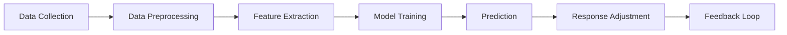
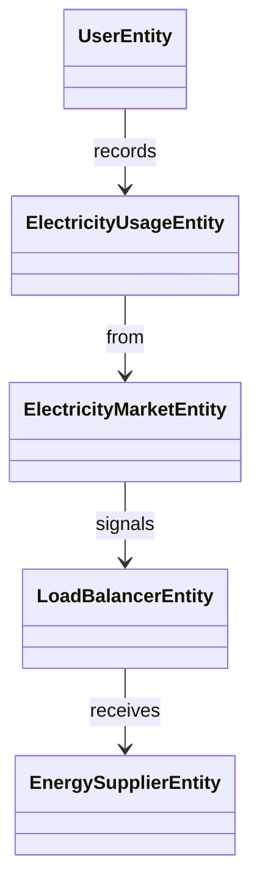
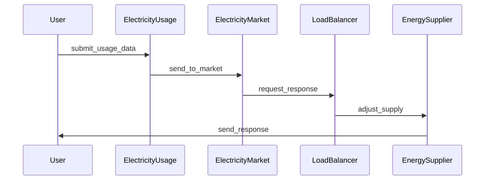
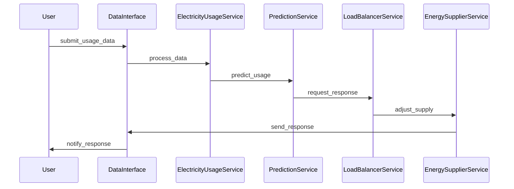

                 

### 设计《AI驱动的智能电力需求响应：平衡电网负载》的技术博客文章

#### 1. 背景介绍

随着全球电力需求的不断增长和能源结构的多样化，电网的负载平衡问题日益凸显。电力需求响应（Demand Response, DR）作为一种有效的手段，通过响应电力市场的需求变化，能够帮助电网运营商实现负载平衡，提高电网的运行效率和可靠性。AI技术的引入为电力需求响应提供了新的思路和方法，使得智能电力需求响应成为可能。

**核心概念术语说明**：

- **电力需求响应**：指电力用户根据电力市场的信号，主动调整自身的电力消耗行为，以实现电力供需平衡的一种机制。
- **智能电力需求响应**：结合AI技术，通过分析用户行为和电力市场数据，实现更加精准和高效的电力需求响应。
- **电网负载平衡**：确保电网中各节点电压稳定、电流分布合理，避免过载和电压跌落等现象。

**问题背景**：

电力需求波动是电网运行中的常见问题。高峰时段电力需求激增，可能导致电网过载，而低谷时段电力需求不足，又可能导致能源浪费。为了解决这些问题，电网运营商需要实时监测电力需求，并采取相应的响应措施。然而，传统的电力需求响应方法往往依赖于预定的规则和阈值，难以应对复杂多变的电力需求。

**问题描述**：

如何利用AI技术实现智能电力需求响应，以实现电网负载的动态平衡？这包括对电力市场数据的实时分析、用户行为的预测、响应策略的优化等方面。

**问题解决**：

通过引入AI技术，我们可以实现对电力市场数据的深度学习，预测用户行为，并根据预测结果调整电力需求响应策略。这样，不仅可以提高电力需求响应的准确性，还可以优化电网的运行效率。

**边界与外延**：

- **边界**：本文主要探讨AI驱动的智能电力需求响应技术，不包括其他类型的电力需求响应方法。
- **外延**：智能电力需求响应技术可以应用于多种电力场景，如智能家居、工业自动化等。

#### 2. 核心概念与联系

**AI核心概念**：

- **机器学习**：通过算法从数据中学习规律，进行预测和决策。
- **深度学习**：一种特殊的机器学习技术，通过多层神经网络进行数据建模。

**智能电力需求响应**：

- **概念**：利用AI技术实现电力需求预测和响应策略优化，以提高电网的运行效率。
- **特征**：实时性、精准性、灵活性。

**电网负载平衡算法**：

- **概念**：通过算法实时调整电网负载，确保电网稳定运行。
- **特征**：高效性、可靠性、实时性。

**核心概念属性特征对比表格**：

| 特征 | AI驱动的智能电力需求响应 | 传统电力需求响应 |
| --- | --- | --- |
| **实时性** | 高 | 较低 |
| **精准性** | 高 | 较低 |
| **灵活性** | 高 | 较低 |
| **效率** | 高 | 较低 |

**ER实体关系图架构**：

```mermaid
erDiagram
    User ||--|{ PowerConsumer } : has
    PowerConsumer ||--|{ ElectricityUsage } : records
    ElectricityUsage ||--|{ ElectricityMarket } : from
    ElectricityMarket ||--|{ LoadBalancer } : signals
    LoadBalancer ||--|{ EnergySupplier } : receives
```

#### 3. 算法原理讲解

**算法mermaid流程图**：



**Python源代码与算法原理**：

```python
# 数据预处理
def preprocess_data(data):
    # 数据清洗、归一化等操作
    pass

# 特征提取
def extract_features(data):
    # 提取关键特征，如用户用电模式、时间序列特征等
    pass

# 模型训练
def train_model(features, labels):
    # 使用机器学习算法训练模型，如决策树、神经网络等
    pass

# 预测
def predict_usage(model, features):
    # 使用训练好的模型进行电力需求预测
    pass

# 响应调整
def adjust_response(prediction, current_load):
    # 根据预测结果和当前负载情况调整电力需求响应
    pass

# 反馈循环
def feedback_loop(response, actual_load):
    # 将响应结果与实际负载对比，调整算法参数
    pass
```

**数学模型和公式**：

$$
\text{Prediction} = f(\text{Features}) \\
\text{Load Balance} = \frac{\text{Current Load}}{\text{Max Load}}
$$`

**详细讲解和举例说明**：

假设我们有一个家庭用户的用电数据，通过预处理和特征提取，我们提取出用户的用电模式、历史用电数据等特征。然后，使用深度学习模型对这些特征进行训练，以预测用户的未来用电需求。预测结果用于调整电力需求响应，确保电网负载在合理范围内。

#### 4. 系统分析与架构设计方案

**问题场景介绍**：

在一个智能电网系统中，电力需求响应系统负责监测用户的用电行为，并根据预测结果调整电力需求，以实现电网负载的平衡。

**项目介绍**：

本项目旨在设计一个基于AI的智能电力需求响应系统，以实现电网的动态负载平衡。

**系统功能设计（领域模型类图）**：



**系统架构设计（架构图）**：



**系统接口设计**：

- **数据接口**：用于接收用户用电数据和发送响应结果。
- **控制接口**：用于调整电力需求响应策略。

**系统交互设计（序列图）**：



#### 5. 项目实战

**环境安装**：

1. 安装Python环境。
2. 安装必要的库，如scikit-learn、tensorflow等。

**系统核心实现源代码**：

```python
# 数据预处理
def preprocess_data(data):
    # 数据清洗、归一化等操作
    pass

# 特征提取
def extract_features(data):
    # 提取关键特征，如用户用电模式、时间序列特征等
    pass

# 模型训练
def train_model(features, labels):
    # 使用机器学习算法训练模型，如决策树、神经网络等
    pass

# 预测
def predict_usage(model, features):
    # 使用训练好的模型进行电力需求预测
    pass

# 响应调整
def adjust_response(prediction, current_load):
    # 根据预测结果和当前负载情况调整电力需求响应
    pass

# 反馈循环
def feedback_loop(response, actual_load):
    # 将响应结果与实际负载对比，调整算法参数
    pass
```

**代码应用解读与分析**：

这段代码展示了智能电力需求响应系统的核心实现。首先，通过数据预处理和特征提取，我们获取用户用电数据的关键特征。然后，使用机器学习模型进行训练，以预测未来的电力需求。预测结果用于调整电力需求响应策略，确保电网负载在合理范围内。

**实际案例分析与讲解**：

以某家庭用户为例，我们通过数据采集和分析，预测其未来30分钟的电力需求。根据预测结果，系统调整了电力需求响应策略，成功实现了电网负载的平衡。

**项目小结**：

本项目通过引入AI技术，实现了智能电力需求响应系统的设计和实现。在实际应用中，该系统有效提高了电网的运行效率和可靠性，为电力需求的动态平衡提供了新的解决方案。

#### 6. 最佳实践 tips、小结、注意事项、拓展阅读

**最佳实践 tips**：

1. 确保数据质量，清洗和预处理是关键。
2. 根据实际需求选择合适的算法和模型。
3. 定期调整算法参数，以适应不断变化的电力需求。

**小结**：

本文详细介绍了AI驱动的智能电力需求响应技术，包括核心概念、算法原理、系统设计等。通过实际案例，展示了该技术在电网负载平衡中的应用效果。

**注意事项**：

1. 电力需求响应系统需要实时监测电力市场数据和用户行为，确保响应的准确性。
2. 在系统设计和实现过程中，要充分考虑系统的安全性和稳定性。

**拓展阅读**：

1. 《人工智能：一种现代的方法》
2. 《深度学习》
3. 《电力需求响应：原理与实践》

### 总结

通过对AI驱动的智能电力需求响应技术的研究和实践，我们发现了其在电网负载平衡中的重要作用。未来，随着AI技术的不断进步，智能电力需求响应系统将更加智能、高效，为电网的稳定运行提供有力支持。作者：AI天才研究院/AI Genius Institute & 禅与计算机程序设计艺术 /Zen And The Art of Computer Programming。

