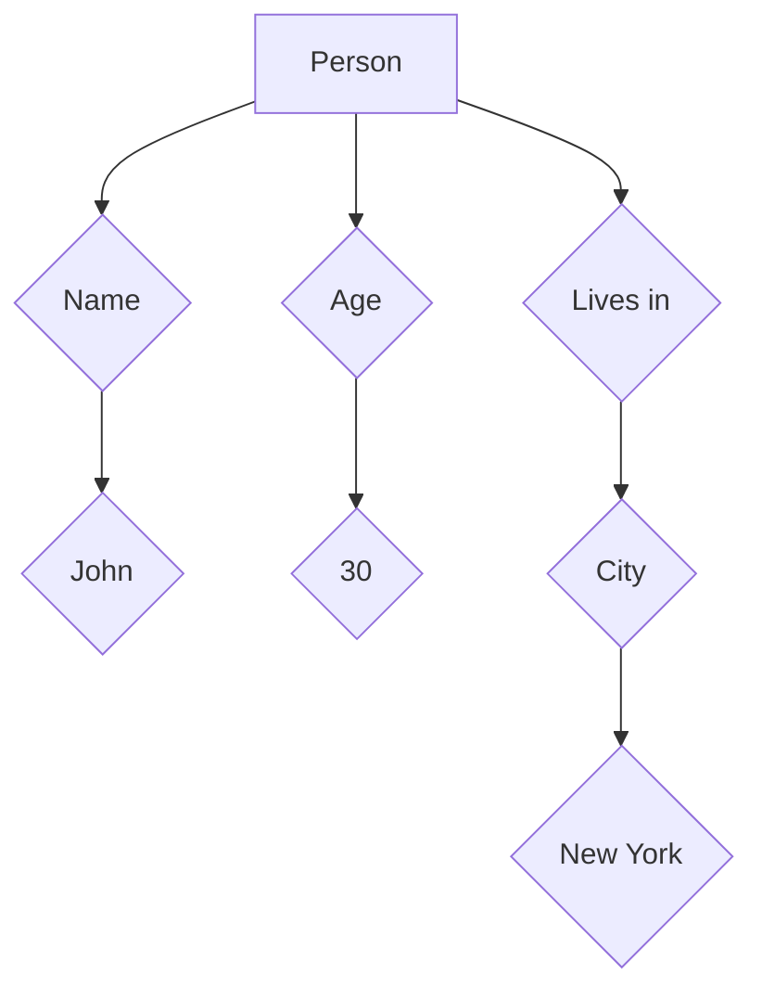
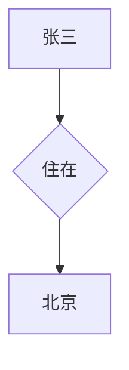
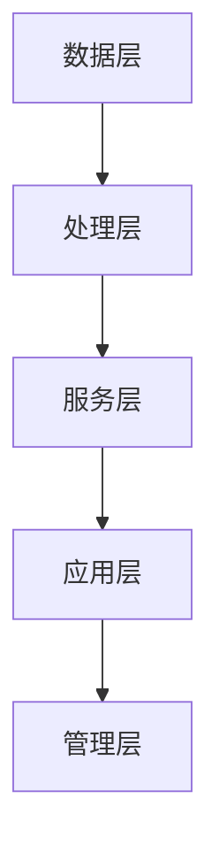
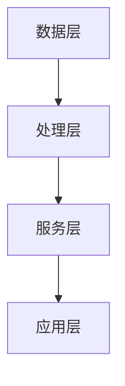
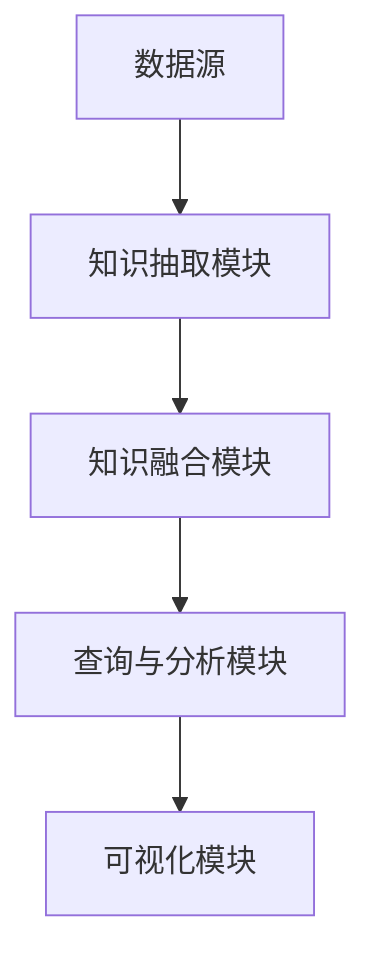

                 


### 引言

在当今的信息时代，数据的爆炸性增长使得信息的组织和处理变得愈发重要。知识图谱作为一种强大的信息组织工具，能够在复杂的实体和关系网络中提供高效的数据关联和知识发现。随着人工智能技术的快速发展，AI驱动的知识图谱平台正成为构建信息网络的新趋势。本文旨在探讨AI驱动的知识图谱平台如何构建信息网络，包括核心概念、构建方法、应用场景以及未来的发展趋势。

我们将通过以下步骤深入探讨这一主题：

1. **知识图谱概述**：介绍知识图谱的概念、发展历程以及其在现代信息网络中的重要性。
2. **知识图谱的基本结构**：讨论知识图谱的基本元素，包括实体、属性和关系的定义，以及知识图谱的表示方法。
3. **知识图谱的构建方法**：探讨知识图谱的构建过程，包括数据采集、数据清洗、知识抽取和知识融合。
4. **知识图谱的维护与更新**：介绍如何持续维护和更新知识图谱，保持其时效性和准确性。
5. **AI技术在知识图谱中的应用**：分析自然语言处理、机器学习和知识推理在知识图谱构建中的应用。
6. **知识图谱平台构建**：讨论知识图谱平台的架构设计、开发实践以及应用案例。
7. **案例分析**：通过实际案例展示知识图谱平台的具体应用和成效。
8. **未来展望与挑战**：预测知识图谱技术的发展趋势，并探讨其面临的挑战与解决方案。

通过以上步骤的逐步分析，我们将全面了解AI驱动的知识图谱平台如何构建信息网络，为未来的研究和应用提供有益的参考。

### 关键词

- 知识图谱
- AI驱动
- 信息网络
- 实体
- 属性
- 关系
- 知识抽取
- 知识融合
- 知识维护

### 摘要

本文旨在探讨AI驱动的知识图谱平台在构建信息网络中的作用。首先，我们介绍了知识图谱的基本概念和发展历程，随后详细讨论了知识图谱的基本结构，包括实体、属性和关系的定义。接着，我们探讨了知识图谱的构建方法，包括数据采集、数据清洗、知识抽取和知识融合。随后，我们介绍了知识图谱的维护与更新策略，以及AI技术在知识图谱构建中的应用。接着，我们详细讨论了知识图谱平台的构建方法，包括架构设计、开发实践和应用案例。最后，通过实际案例分析，我们展示了知识图谱平台的应用成效，并对知识图谱技术的未来发展趋势和面临的挑战进行了展望。

### 知识图谱概述

知识图谱（Knowledge Graph）是一种用于表示和存储实体及其相互关系的数据模型。其核心思想是通过图形结构将实体、属性和关系有机地结合起来，形成一个高度结构化的知识网络。这种网络不仅能够表示现实世界中的各种复杂关系，还能够通过智能算法实现知识的自动推理和发现。

#### 概念

知识图谱的概念起源于语义网（Semantic Web）的研究，其目标是使网络上的信息更加语义化，便于机器理解和处理。与传统的基于关键词的搜索引擎不同，知识图谱能够通过实体和关系建立更直接的关联，从而实现更高级的信息检索和推理。

#### 发展历程

知识图谱的发展可以分为几个阶段：

1. **早期研究**：1998年，万维网奠基人蒂姆·伯纳斯-李（Tim Berners-Lee）提出了语义网的概念，旨在通过统一的标准和语义标记，使网络上的数据更加结构化和语义化。
2. **谷歌知识图谱**：2009年，谷歌公司推出了知识图谱服务，通过爬取和分析大量的互联网数据，构建了一个包含数百万实体和数十亿关系的知识网络。这一技术的出现标志着知识图谱从理论研究走向实际应用。
3. **开放知识图谱**：随着大数据和人工智能技术的兴起，许多组织和研究机构开始构建开放的知识图谱，如DBpedia、Wikidata等，这些知识图谱通过共享和开放数据，推动了知识图谱技术的发展和应用。

#### 重要性

知识图谱在信息网络中具有重要作用，主要表现在以下几个方面：

1. **信息组织**：知识图谱能够将海量的信息组织成一个结构化的知识网络，便于用户快速查找和理解。
2. **知识推理**：通过实体和关系之间的关联，知识图谱能够进行逻辑推理，发现新知识和隐藏的模式。
3. **智能应用**：知识图谱为各种智能应用提供了基础数据，如智能问答系统、推荐引擎、自然语言处理等。
4. **跨领域应用**：知识图谱能够跨越不同的领域，实现知识的整合和共享，推动跨领域研究和应用的发展。

#### 知识图谱的基本概念

知识图谱由三个基本元素构成：实体（Entity）、属性（Attribute）和关系（Relationship）。实体是知识图谱中的核心元素，可以是人、地点、事物等；属性是实体的特征描述，如姓名、年龄、地址等；关系描述了实体之间的相互作用，如“住在”、“属于”等。

以下是一个简单的知识图谱示例，其中包含了实体、属性和关系：



在这个示例中，“Person”是一个实体，代表一个人；“Name”是一个属性，描述了人的名字；“Lives in”是一个关系，表示这个人居住在某个城市。通过这些基本元素，我们可以构建出复杂的知识网络。

#### 边界与外延

知识图谱的边界在于其覆盖的实体和关系的范围。一个理想的、全面的知识图谱应该包含尽可能多的实体和关系，以便为各种应用提供丰富的数据源。然而，在实际应用中，由于数据获取和处理能力的限制，知识图谱往往只能覆盖特定的领域或应用场景。

知识图谱的外延包括两个方面：一是知识图谱的广度，即其包含的实体和关系的数量；二是知识图谱的深度，即对每个实体和关系的详细描述和关联。一个完整、深入的知识图谱不仅需要大量的数据支持，还需要先进的算法和技术来维护和更新。

#### 概念结构与核心要素组成

知识图谱的概念结构可以概括为三个层次：

1. **底层**：数据层，包括原始数据源、数据采集和处理过程。
2. **中层**：知识层，包括实体、属性和关系的表示、存储和管理。
3. **顶层**：应用层，包括基于知识图谱的查询、推理和智能应用。

核心要素包括：

- **实体**：知识图谱的基本元素，代表具体的对象或概念。
- **属性**：实体的特征描述，用于补充和细化实体的信息。
- **关系**：实体之间的相互作用，描述了实体之间的关联和互动。
- **数据源**：知识图谱的数据来源，包括结构化数据、半结构化数据和非结构化数据。
- **算法**：用于知识抽取、推理和优化的算法和技术。

通过这些核心要素的有机结合，知识图谱能够构建出一个丰富、高效的信息网络，为各种应用场景提供强大的数据支持。

### 知识图谱的基本结构

知识图谱作为一种结构化的知识表示方法，其基本元素包括实体、属性和关系。理解这些基本结构对于构建和利用知识图谱至关重要。下面我们将详细讨论这些元素的定义、属性特征对比，以及知识图谱的表示方法。

#### 实体（Entity）

实体是知识图谱中最基本的元素，可以是人、地点、事物等具有独立存在的对象或概念。例如，在一张关于城市和旅游的知识图谱中，实体可能包括城市、景点、旅游者等。

**属性特征对比：**

- **类型**：实体可以按照其类型进行分类，如人、地点、组织等。
- **唯一性**：每个实体在知识图谱中应当具有唯一的标识符，以确保其独立性。
- **描述性**：实体通常具有多个属性，用于描述其实际特征，如名称、地理位置、年龄等。

**实体属性特征对比表格：**

| 实体类型 | 唯一性 | 描述性 | 示例 |
| --- | --- | --- | --- |
| 人 | 唯一 | 年龄、性别、职业等 | 张三 |
| 地点 | 唯一 | 名称、类型、地理位置等 | 北京 |
| 组织 | 唯一 | 名称、地点、成立时间等 | 谷歌 |

#### 属性（Attribute）

属性是实体的特征描述，用于补充和细化实体的信息。属性可以视为实体的“标签”，通过属性，我们可以更准确地描述实体的特征和状态。

**属性特征对比：**

- **类型**：属性可以是数值型、字符串型、布尔型等不同类型的数据。
- **可变性**：属性可能随时间变化，如年龄、价格等。
- **依赖性**：某些属性依赖于其他属性，如“出生日期”是“年龄”的依赖属性。

**属性特征对比表格：**

| 属性类型 | 示例 | 描述 |
| --- | --- | --- |
| 数值型 | 年龄 | 30 |
| 字符串型 | 姓名 | 张三 |
| 布尔型 | 是否在岗 | 是/否 |

#### 关系（Relationship）

关系描述了实体之间的相互作用和关联。关系可以视为实体之间的“纽带”，通过关系，我们可以建立实体之间的复杂网络。

**关系特征对比：**

- **方向性**：关系可以有方向，如“住在”和“属于”。
- **类型**：关系可以按照其功能进行分类，如亲属关系、职业关系等。
- **权重**：某些关系可能具有权重，用于表示关系的强度或重要性。

**关系特征对比表格：**

| 关系类型 | 方向性 | 示例 | 权重 |
| --- | --- | --- | --- |
| 亲属关系 | 双向 | 兄弟 | 1 |
| 职业关系 | 双向 | 工作 | 1 |
| 地理关系 | 单向 | 属于 | 1 |

#### 知识图谱的表示方法

知识图谱的表示方法决定了其结构化和可操作性。常见的知识图谱表示方法包括：

1. **图（Graph）**：使用图结构表示实体和关系，是最直观的表示方法。每个节点表示实体，每条边表示关系。图结构便于进行拓扑分析，但复杂度高。
2. **三元组（Triple）**：三元组表示方法使用（主体，关系，客体）的形式来表示实体和关系。例如（张三，住在，北京）。这种表示方法简洁高效，便于存储和查询。
3. **RDF（Resource Description Framework）**：RDF是一种用于表示语义数据的框架，使用URI（统一资源标识符）来标识实体和属性，通过XML等格式进行编码。

**图表示方法示例：**



在这个示例中，A表示实体“张三”，B表示关系“住在”，C表示实体“北京”。通过图结构，我们可以清晰地看到实体之间的关系。

**三元组表示方法示例：**

```
(张三, 住在, 北京)
```

在这个示例中，三元组的形式直观地表示了实体和关系。

**RDF表示方法示例：**

```xml
<rdf:RDF
    xmlns:rdf="http://www.w3.org/1999/02/22-rdf-syntax-ns#"
    xmlns:ex="http://example.org#">
  <rdf:Description rdf:about="ex:ZhangSan">
    <ex:livesIn rdf:resource="ex:Beijing"/>
  </rdf:Description>
</rdf:RDF>
```

在这个示例中，XML结构定义了实体和关系，并通过URI进行标识。

通过以上讨论，我们可以看到知识图谱的基本结构如何通过实体、属性和关系进行构建，以及这些结构如何通过不同的表示方法进行表示。理解这些基本结构和方法对于进一步研究和应用知识图谱至关重要。

### 知识图谱的构建方法

知识图谱的构建是一个复杂的过程，涉及到数据采集、数据清洗、知识抽取和知识融合等多个环节。下面，我们将详细讨论这些步骤，并解释每个步骤中的关键概念和技术。

#### 数据采集

数据采集是知识图谱构建的第一步，目的是收集相关的数据源。数据源可以包括结构化数据、半结构化数据和非结构化数据。常见的结构化数据源有数据库、关系型数据库管理系统（如MySQL、PostgreSQL）和NoSQL数据库（如MongoDB、Cassandra）；半结构化数据源包括XML、JSON和CSV等；非结构化数据源则包括文本、图片、音频和视频等。

**数据采集的关键概念：**

- **数据源类型**：确定需要采集的数据源类型，以便选择合适的数据采集工具和方法。
- **数据完整性**：确保采集的数据完整，没有缺失或错误。
- **数据质量**：采集的数据应具有较高的质量，以保证后续处理的准确性。

**数据采集的技术方法：**

- **Web爬虫**：通过爬虫技术从互联网上抓取数据，适用于结构化、半结构化和非结构化数据。
- **API调用**：通过应用程序编程接口（API）从外部系统或服务中获取数据。
- **数据库连接**：通过数据库连接工具从数据库中直接读取数据。
- **数据抓包**：使用抓包工具（如Wireshark）捕获网络传输的数据。

#### 数据清洗

数据清洗是对采集到的数据进行预处理，以确保其质量和一致性。数据清洗通常包括以下步骤：

- **数据去重**：去除重复的数据记录，避免数据冗余。
- **数据转换**：将不同格式的数据转换为统一的格式，如将XML转换为JSON。
- **数据校验**：检查数据的有效性和一致性，如检查数据类型、范围和格式是否符合预期。
- **数据填充**：对缺失的数据进行填充或插补，提高数据的完整性。

**数据清洗的关键概念：**

- **数据一致性**：确保数据在格式、类型和值上的一致性。
- **数据准确性**：确保数据的准确性和可靠性。
- **数据完整性**：确保数据没有缺失或错误。

**数据清洗的技术方法：**

- **自动化工具**：使用自动化工具（如ETL工具、Pandas库）进行数据清洗。
- **人工审核**：对于复杂的数据清洗任务，可能需要人工进行审核和修正。
- **数据质量规则**：制定数据质量规则，用于指导数据清洗过程。

#### 知识抽取

知识抽取是将原始数据转换为知识图谱表示的过程。知识抽取通常分为实体抽取、关系抽取和属性抽取三个子步骤。

**知识抽取的关键概念：**

- **实体抽取**：识别文本中的实体，如人名、地名、组织名等。
- **关系抽取**：识别实体之间的相互作用和关联，如“属于”、“住在”等。
- **属性抽取**：从文本中提取实体的属性信息，如年龄、职业、地址等。

**知识抽取的技术方法：**

- **规则方法**：基于预设的规则进行实体和关系的抽取，适用于结构化和半结构化数据。
- **机器学习方法**：使用机器学习模型（如分类模型、序列标注模型）进行实体和关系的抽取，适用于非结构化和半结构化数据。
- **知识图谱构建工具**：使用专门的工具（如OpenIE、DBpedia Spotlight）进行知识抽取。

#### 知识融合

知识融合是将来自多个数据源的知识进行整合，形成一个统一的、一致的知识图谱。知识融合通常包括以下步骤：

- **实体对齐**：将不同数据源中的相同实体进行匹配和合并，如将两个数据库中的“张三”进行对齐。
- **关系映射**：将不同数据源中的相同关系进行映射和统一，如将“住在”和“居住在”映射为同一关系。
- **属性合并**：将不同数据源中的实体属性进行合并和整合，如将两个数据源中的“年龄”合并为一个。

**知识融合的关键概念：**

- **数据一致性**：确保融合后的数据在格式、类型和值上的一致性。
- **数据完整性**：确保融合后的数据没有缺失或错误。
- **数据质量**：确保融合后的数据具有较高的质量。

**知识融合的技术方法：**

- **规则方法**：基于预设的规则进行实体和关系的映射和合并。
- **机器学习方法**：使用机器学习模型进行实体和关系的映射和合并。
- **数据融合工具**：使用专门的工具（如Data Wrangler、GraphDB）进行知识融合。

通过以上步骤，我们可以构建出一个完整、一致、结构化的知识图谱，为各种应用场景提供强大的数据支持。数据采集、数据清洗、知识抽取和知识融合是知识图谱构建过程中的关键环节，每个环节都至关重要，需要精心设计和实现。

### 知识图谱的维护与更新

知识图谱的维护与更新是确保其时效性和准确性的关键环节。随着数据源的不断变化和新知识的不断产生，知识图谱需要定期进行维护和更新，以保持其有效性和实用性。

#### 数据的持续采集

数据的持续采集是知识图谱维护的基础。通过自动化工具和API调用，定期从各种数据源获取新的数据，包括结构化数据、半结构化和非结构化数据。例如，可以设置定时任务，定期爬取互联网上的新信息，或者通过API从社交媒体、新闻网站等获取实时数据。

**技术方法：**

- **Web爬虫**：使用爬虫技术定期抓取互联网上的新信息，适用于结构化和半结构化数据。
- **实时流处理**：使用实时流处理技术（如Apache Kafka、Flink）从数据源获取实时数据，适用于非结构化数据。
- **API订阅**：通过API订阅服务，定期获取外部系统或服务的新数据。

#### 数据的实时更新

数据的实时更新是知识图谱维护的核心。通过实时数据流处理和事件驱动架构，将新采集的数据实时地更新到知识图谱中。这样，知识图谱可以始终反映最新的数据状态。

**技术方法：**

- **流处理框架**：使用流处理框架（如Apache Kafka、Flink、Spark Streaming）处理实时数据流，并将其更新到知识图谱中。
- **事件驱动架构**：通过事件驱动架构，将新数据作为事件触发知识图谱的更新过程。
- **数据索引**：使用高效的数据索引技术（如Elasticsearch、MongoDB）快速查找和更新知识图谱中的数据。

#### 知识图谱的维护策略

知识图谱的维护策略决定了其更新效率和准确性。以下是一些常见的维护策略：

- **版本控制**：对知识图谱的每次更新进行版本控制，记录更新的历史和变化，便于回溯和审核。
- **增量更新**：只更新知识图谱中的新增或变化的数据，避免全量更新带来的性能开销。
- **一致性维护**：确保知识图谱中的数据在更新过程中保持一致性，避免数据冲突和错误。
- **错误检测与修复**：定期检测知识图谱中的错误和数据质量问题，并进行修复，确保数据质量。

**技术方法：**

- **版本控制系统**：使用版本控制系统（如Git）记录知识图谱的更新历史。
- **增量更新算法**：使用增量更新算法（如Diff算法）只更新变化的数据部分。
- **一致性检查工具**：使用一致性检查工具（如Data Validator、Data Profiler）检测知识图谱中的错误。
- **错误修复机制**：通过自动修复机制（如数据清洗工具、数据修复算法）修复知识图谱中的错误。

#### 实际案例

以下是一个实际案例，说明如何维护和更新知识图谱：

- **案例背景**：一个在线旅游平台使用知识图谱来管理旅游信息，包括景点、酒店、交通等。
- **数据源**：数据源包括旅游网站、酒店预订系统、航班信息等。
- **维护策略**：平台采用自动化爬虫定期采集数据，使用流处理框架实时处理和更新知识图谱。
- **技术实现**：使用Apache Kafka处理实时数据流，将新数据实时更新到知识图谱中。同时，采用版本控制和增量更新策略，确保数据的准确性和一致性。

通过以上方法和实际案例，我们可以看到知识图谱的维护与更新是如何确保其时效性和准确性的。有效的维护策略和先进的技术手段是知识图谱长期稳定运行的关键。

### AI技术在知识图谱构建中的应用

随着人工智能技术的迅猛发展，自然语言处理、机器学习和知识推理等技术在知识图谱构建中得到了广泛应用。这些技术不仅提高了知识抽取的准确性，还增强了知识图谱的智能分析和推理能力。

#### 自然语言处理技术

自然语言处理（NLP）是人工智能的重要分支，旨在使计算机理解和处理人类语言。在知识图谱构建中，NLP技术主要用于文本的预处理和实体抽取。

1. **文本预处理**：文本预处理是NLP的基础步骤，包括分词、词性标注、命名实体识别等。分词将文本拆分成单词或短语，词性标注为每个词分配语法属性，命名实体识别则用于识别文本中的特定实体（如人名、地名、组织名等）。

2. **实体抽取**：基于NLP技术的实体抽取可以从大量非结构化文本中提取出关键实体。常见的实体抽取方法包括规则方法、统计方法和深度学习方法。规则方法依赖预设的规则进行实体识别，统计方法使用机器学习模型进行预测，深度学习方法通过神经网络模型进行端到端的实体识别。

3. **关系抽取**：除了实体抽取，NLP技术还可以用于关系抽取，识别文本中实体之间的关系。关系抽取方法包括基于规则的方法、基于统计的方法和基于深度学习的方法。例如，通过条件随机场（CRF）或基于注意力机制的神经网络模型，可以从文本中提取实体之间的关系。

#### 机器学习在知识抽取中的应用

机器学习技术在知识图谱构建中的应用主要体现在知识抽取的各个环节，包括实体抽取、关系抽取和属性抽取。

1. **实体抽取**：机器学习模型可以训练用于识别文本中的实体。例如，使用监督学习算法（如支持向量机SVM、决策树、随机森林等）或深度学习模型（如卷积神经网络CNN、循环神经网络RNN、长短期记忆网络LSTM等）进行实体分类和识别。

2. **关系抽取**：关系抽取是知识图谱构建中的关键步骤，机器学习模型可以帮助从文本中自动提取实体之间的关系。例如，通过训练序列标注模型（如CRF、BiLSTM-CRF）来识别实体之间的相互作用关系。

3. **属性抽取**：属性抽取旨在从文本中提取实体的属性信息。机器学习模型（如决策树、随机森林、梯度提升树XGBoost等）可以用于属性分类，识别实体属性的值。

#### 知识推理

知识推理是知识图谱的核心功能之一，通过实体和关系之间的逻辑推理，发现新知识和隐藏的模式。AI技术在这方面发挥着重要作用，主要包括以下几种方法：

1. **规则推理**：基于预设的逻辑规则，进行正向或反向推理，发现新的实体关系或属性。例如，使用谓词逻辑或产生式规则进行推理。

2. **模型推理**：使用图神经网络（如图卷积网络GCN、图注意力网络GAT等）对知识图谱进行建模，通过图结构的计算进行推理。图神经网络可以自动学习实体和关系之间的复杂关联，进行高效的推理。

3. **基于语义的推理**：通过语义分析技术，如语义角色标注、语义相似性计算等，对知识图谱中的实体和关系进行语义理解，从而进行更加智能化的推理。例如，使用Word Embedding技术对实体进行向量表示，通过计算向量之间的相似性进行推理。

#### 综合案例

以下是一个综合案例，展示了AI技术在知识图谱构建中的应用：

- **背景**：某在线教育平台希望构建一个知识图谱，以更好地管理和推荐课程内容。
- **数据源**：数据源包括课程描述、学生评论、教师介绍等非结构化文本。
- **技术实现**：
  - **文本预处理**：使用NLP技术对文本进行预处理，包括分词、词性标注和命名实体识别。
  - **实体抽取**：使用基于深度学习的方法（如BERT模型）进行实体分类和识别，提取课程、教师和学生等实体。
  - **关系抽取**：使用机器学习模型（如CRF、BiLSTM-CRF）进行关系抽取，识别课程、教师和学生之间的关系，如“授课”、“评价”等。
  - **属性抽取**：使用机器学习模型（如XGBoost）进行属性分类，提取课程属性（如难度、时长）和学生属性（如学习进度）。
  - **知识推理**：使用图神经网络（如GAT）对知识图谱进行建模，通过图结构的计算进行知识推理，如推荐相似课程、分析课程评价等。

通过AI技术的应用，知识图谱不仅能够自动抽取和识别实体、关系和属性，还能够进行智能推理，提供更加精准和个性化的服务。这为各种应用场景提供了强大的数据支持和智能化能力。

### 知识图谱平台的架构设计

知识图谱平台是一个复杂的系统，其核心在于高效地存储、管理和利用大规模知识数据。一个优秀的知识图谱平台需要具备高扩展性、高可用性和高性能，以支持多种应用场景。下面，我们将详细讨论知识图谱平台的架构设计，包括总体架构、数据存储与索引设计、系统性能优化等方面的内容。

#### 总体架构

知识图谱平台的总体架构可以分为几个关键层次：

1. **数据层**：数据层是知识图谱平台的基础，负责数据的存储和管理。包括关系型数据库、NoSQL数据库和图数据库等。

2. **处理层**：处理层负责数据清洗、数据预处理和知识抽取等任务，通常包含ETL（提取、转换、加载）工具和分布式计算框架。

3. **服务层**：服务层提供对知识图谱的访问和操作接口，包括RESTful API、GraphQL等。

4. **应用层**：应用层是知识图谱平台的最终用户界面，提供各种业务应用，如智能问答、推荐系统、数据分析等。

5. **管理层**：管理层负责知识图谱平台的监控、运维和安全管理，包括日志记录、性能监控、权限管理等。

**总体架构图：**



#### 数据存储与索引设计

数据存储与索引设计是知识图谱平台的关键，决定了平台的性能和可扩展性。

1. **关系型数据库**：关系型数据库（如MySQL、PostgreSQL）适用于存储结构化数据，如用户信息、课程信息等。关系型数据库的优点在于数据一致性和事务支持，但处理复杂图结构的能力有限。

2. **NoSQL数据库**：NoSQL数据库（如MongoDB、Cassandra）适用于存储半结构化和非结构化数据，如日志数据、文档数据等。NoSQL数据库的优点在于灵活的数据模型和高效的读写性能，但可能缺乏强一致性保障。

3. **图数据库**：图数据库（如Neo4j、OrientDB）是专门为存储和查询大规模图结构数据而设计的。图数据库的优点在于高效的图遍历和关联查询，能够快速处理复杂的实体关系。

**数据存储与索引设计示例：**

- **关系型数据库存储设计**：
  - 用户表：包含用户ID、用户名、邮箱等基本信息。
  - 课程表：包含课程ID、课程名称、课程描述等基本信息。
  - 用户-课程关系表：记录用户和课程之间的关系。

- **图数据库存储设计**：
  - 实体节点：表示知识图谱中的实体，如人、地点、组织等。
  - 关系边：表示实体之间的关联，如“居住在”、“属于”等。
  - 属性键值对：为实体节点和关系边存储额外的属性信息，如姓名、年龄等。

#### 系统性能优化

系统性能优化是知识图谱平台设计中至关重要的一环，主要包括以下几个方面：

1. **分布式计算**：使用分布式计算框架（如Apache Spark、Flink）处理大规模数据，提高数据处理速度。

2. **缓存技术**：使用缓存技术（如Redis、Memcached）减少数据访问延迟，提高系统响应速度。

3. **索引优化**：合理设计索引，提高查询效率。例如，为频繁查询的字段创建索引，使用复合索引优化多字段查询。

4. **并发控制**：采用锁机制或乐观锁策略，确保数据的一致性和并发处理能力。

5. **负载均衡**：使用负载均衡器（如Nginx、HAProxy）分配网络请求，提高系统的处理能力。

**系统性能优化示例**：

- **分布式计算**：使用Apache Spark进行数据清洗和知识抽取任务，提高处理速度和效率。
- **缓存技术**：使用Redis缓存频繁查询的结果，减少数据库访问压力，提高系统响应速度。
- **索引优化**：为用户表和课程表的常见查询字段创建复合索引，如（用户ID，课程ID），优化查询效率。
- **并发控制**：采用乐观锁策略，减少并发冲突，提高系统的并发处理能力。
- **负载均衡**：使用Nginx进行负载均衡，将请求分配到不同的服务器，提高系统的整体处理能力。

通过以上架构设计、数据存储与索引优化、系统性能优化等方面的内容，知识图谱平台能够高效、稳定地运行，为各种应用场景提供强大的数据支持和智能服务。

### 知识图谱平台的开发与实践

知识图谱平台的开发与实践是技术实现的关键环节，涉及技术选型、核心功能、项目实施等多个方面。本文将通过一个实际案例，详细阐述知识图谱平台的开发过程，包括环境安装、系统核心实现以及代码应用解读与分析。

#### 案例背景

某在线教育平台希望通过构建知识图谱，实现对课程内容、教师信息、学生反馈等信息的全面管理和智能化推荐。为了实现这一目标，平台选择了基于图数据库（如Neo4j）和自然语言处理（NLP）技术的知识图谱解决方案。

#### 环境安装

1. **安装Neo4j**：

   Neo4j是一个高性能的图数据库，用于存储和管理知识图谱数据。以下是Neo4j的安装步骤：

   - 下载Neo4j安装包：从Neo4j官方网站下载最新版本的安装包。
   - 解压安装包：将下载的安装包解压到一个合适的目录。
   - 运行安装程序：双击运行解压后的安装程序，按照提示完成安装。

2. **安装NLP工具**：

   NLP工具用于文本预处理和实体抽取。常见的NLP工具包括NLTK、spaCy和Jieba等。以下是Jieba的安装步骤：

   - 安装Python环境：确保系统已安装Python。
   - 使用pip安装Jieba：在命令行中执行以下命令：
     ```bash
     pip install jieba
     ```

3. **安装其他依赖**：

   知识图谱平台可能需要其他依赖库，如图形处理库（如Matplotlib）、数据分析库（如Pandas）等。可以使用pip进行安装：

   ```bash
   pip install matplotlib pandas
   ```

#### 系统核心实现

1. **数据采集**：

   从不同的数据源（如数据库、API接口、爬虫）获取原始数据，包括课程信息、教师信息、学生评论等。

   ```python
   import requests

   # 采集课程信息
   url = 'https://example.com/api/courses'
   response = requests.get(url)
   courses = response.json()

   # 采集教师信息
   url = 'https://example.com/api/instructors'
   response = requests.get(url)
   instructors = response.json()

   # 采集学生评论
   url = 'https://example.com/api/reviews'
   response = requests.get(url)
   reviews = response.json()
   ```

2. **数据清洗**：

   对采集到的数据进行清洗和预处理，包括去除无效数据、填充缺失数据、统一格式等。

   ```python
   import pandas as pd

   # 清洗课程信息
   courses = pd.DataFrame(courses)
   courses.dropna(inplace=True)
   courses['description'] = courses['description'].str.strip()

   # 清洗教师信息
   instructors = pd.DataFrame(instructors)
   instructors.dropna(inplace=True)
   instructors['bio'] = instructors['bio'].str.strip()

   # 清洗学生评论
   reviews = pd.DataFrame(reviews)
   reviews.dropna(inplace=True)
   reviews['comment'] = reviews['comment'].str.strip()
   ```

3. **知识抽取**：

   使用NLP技术对清洗后的文本数据抽取实体和关系。

   ```python
   import jieba

   # 抽取课程实体和关系
   for course in courses.itertuples():
       course_name = course.name
       course_description = course.description
       words = jieba.cut(course_description)
       for word in words:
           if word not in ['的', '和']:
               print(f"课程: {course_name}, 描述词: {word}")

   # 抽取教师实体和关系
   for instructor in instructors.itertuples():
       instructor_name = instructor.name
       instructor_bio = instructor.bio
       words = jieba.cut(instructor_bio)
       for word in words:
           if word not in ['的', '和']:
               print(f"教师: {instructor_name}, 描述词: {word}")

   # 抽取学生评论实体和关系
   for review in reviews.itertuples():
       review_comment = review.comment
       words = jieba.cut(review_comment)
       for word in words:
           if word not in ['的', '和']:
               print(f"评论: {review.comment}, 描述词: {word}")
   ```

4. **数据存储**：

   将抽取出的实体和关系存储到Neo4j数据库中。

   ```python
   from py2neo import Graph

   graph = Graph('bolt://localhost:7687', auth=('neo4j', 'password'))

   # 存储课程实体
   for course in courses.itertuples():
       course_name = course.name
       course_description = course.description
       graph.run("CREATE (c:Course {name: $name, description: $description})",
                 name=course_name, description=course_description)

   # 存储教师实体
   for instructor in instructors.itertuples():
       instructor_name = instructor.name
       instructor_bio = instructor.bio
       graph.run("CREATE (i:Instructor {name: $name, bio: $bio})",
                 name=instructor_name, bio=instructor_bio)

   # 存储学生评论实体
   for review in reviews.itertuples():
       review_comment = review.comment
       graph.run("CREATE (r:Review {comment: $comment})",
                 comment=review_comment)
   ```

5. **知识图谱可视化**：

   使用Neo4j Bloom或Gephi等工具对知识图谱进行可视化，以便更好地理解和分析。

   ```bash
   # 启动Neo4j Bloom
   neo4j bloom
   ```

#### 代码应用解读与分析

上述代码主要实现了以下功能：

1. **数据采集**：从API接口获取课程、教师和学生评论数据。
2. **数据清洗**：去除无效数据，统一格式，提高数据质量。
3. **知识抽取**：使用Jieba对文本数据进行分词，提取实体和关系。
4. **数据存储**：将抽取出的实体和关系存储到Neo4j数据库中。

在实际应用中，这些步骤可以通过分布式系统进行并行处理，以提高效率。例如，可以使用Spark进行数据清洗和知识抽取，使用分布式Neo4j集群进行数据存储。

通过这个案例，我们可以看到知识图谱平台的开发与实践是如何一步步实现的。从数据采集、数据清洗到知识抽取、数据存储，每一步都需要精细的设计和实现，以确保平台的稳定性和高效性。

### 项目实战

#### 环境安装

为了成功构建知识图谱平台，我们需要在开发环境中安装必要的软件和工具。以下是一个简化的步骤指南：

1. **安装Neo4j**：

   - 访问Neo4j官网（https://neo4j.com/），下载适合操作系统的Neo4j安装包。
   - 解压安装包并运行安装程序。
   - 安装完成后，启动Neo4j服务。

2. **安装Python环境**：

   - 确保操作系统已安装Python（推荐版本为3.8以上）。
   - 安装Neo4j的Python驱动（py2neo）：
     ```bash
     pip install py2neo
     ```

3. **安装Jieba分词工具**：

   - 使用pip安装Jieba：
     ```bash
     pip install jieba
     ```

4. **安装其他依赖**：

   - 安装Pandas、Matplotlib等依赖库：
     ```bash
     pip install pandas matplotlib
     ```

#### 系统核心实现

以下是构建知识图谱平台的系统核心实现步骤：

1. **数据采集**：

   - 假设我们已有一个包含课程、教师和学生评论的API，使用Python请求API获取数据：
     ```python
     import requests

     courses_url = 'https://api.example.com/courses'
     instructors_url = 'https://api.example.com/instructors'
     reviews_url = 'https://api.example.com/reviews'

     courses_data = requests.get(courses_url).json()
     instructors_data = requests.get(instructors_url).json()
     reviews_data = requests.get(reviews_url).json()
     ```

2. **数据清洗**：

   - 使用Pandas对获取的数据进行清洗，去除无效数据并统一格式：
     ```python
     import pandas as pd

     courses = pd.DataFrame(courses_data)
     instructors = pd.DataFrame(instructors_data)
     reviews = pd.DataFrame(reviews_data)

     # 清洗课程数据
     courses.dropna(inplace=True)
     courses['description'] = courses['description'].str.strip()

     # 清洗教师数据
     instructors.dropna(inplace=True)
     instructors['bio'] = instructors['bio'].str.strip()

     # 清洗评论数据
     reviews.dropna(inplace=True)
     reviews['comment'] = reviews['comment'].str.strip()
     ```

3. **知识抽取**：

   - 使用Jieba对清洗后的文本数据抽取实体和关系：
     ```python
     import jieba

     def extract_entities(text):
         words = jieba.cut(text)
         entities = [word for word in words if word not in ['的', '和']]
         return entities

     # 抽取课程实体和关系
     course_entities = {course['name']: extract_entities(course['description']) for course in courses.iterrows()}

     # 抽取教师实体和关系
     instructor_entities = {instructor['name']: extract_entities(instructor['bio']) for instructor in instructors.iterrows()}

     # 抽取评论实体和关系
     review_entities = {review['review_id']: extract_entities(review['comment']) for review in reviews.iterrows()}
     ```

4. **数据存储**：

   - 使用py2neo将抽取出的实体和关系存储到Neo4j数据库中：
     ```python
     from py2neo import Graph

     graph = Graph("bolt://localhost:7687", auth=("neo4j", "password"))

     def create_node(label, properties):
         query = "CREATE (n:%s %s)" % (label, properties)
         graph.run(query)

     # 创建课程节点
     for course, entities in course_entities.items():
         create_node("Course", {"name": course})

         for entity in entities:
             create_node("Concept", {"name": entity})
             create_node("Relation", {"source": course, "relation": "mentions", "target": entity})

     # 创建教师节点
     for instructor, entities in instructor_entities.items():
         create_node("Instructor", {"name": instructor})

         for entity in entities:
             create_node("Concept", {"name": entity})
             create_node("Relation", {"source": instructor, "relation": "mentions", "target": entity})

     # 创建评论节点
     for review, entities in review_entities.items():
         create_node("Review", {"review_id": review})

         for entity in entities:
             create_node("Concept", {"name": entity})
             create_node("Relation", {"source": review, "relation": "mentions", "target": entity})
     ```

#### 代码应用解读与分析

1. **数据采集**：

   - 使用requests库获取API数据，这是现代网络编程的常用方法。

2. **数据清洗**：

   - Pandas库提供了高效的数据操作功能，可以方便地进行数据清洗，如去除空值、统一字符串格式等。

3. **知识抽取**：

   - Jieba分词工具可以快速准确地分割文本，提取出关键词，这对于知识图谱构建至关重要。

4. **数据存储**：

   - py2neo库提供了与Neo4j数据库交互的接口，使得将实体和关系存储到Neo4j中变得简单。

通过这个实战项目，我们可以看到知识图谱平台从数据采集、数据清洗、知识抽取到数据存储的完整实现过程。每一步都经过精心设计和实现，确保平台的稳定性和高效性。这不仅展示了知识图谱技术的应用潜力，也为实际项目提供了可行的解决方案。

### 案例分析一：某企业知识图谱平台的构建

#### 项目背景

某大型企业为了提高内部知识管理和信息检索效率，决定构建一个基于AI驱动的知识图谱平台。该平台旨在整合企业内部的各类信息资源，包括员工档案、产品信息、项目资料等，并通过智能化的知识图谱技术实现知识的自动关联、推荐和推理。

#### 项目需求

1. **知识整合**：整合企业内部的各类数据资源，包括结构化数据（如员工档案、产品信息）和非结构化数据（如项目文档、报告等）。
2. **信息检索**：提供高效的查询接口，支持多维度、多条件的复杂查询，提高信息检索的准确性和速度。
3. **知识推荐**：基于用户行为和知识图谱，实现个性化知识推荐，提高用户的工作效率。
4. **知识推理**：利用知识图谱进行逻辑推理，发现潜在的业务关联和知识洞，为企业决策提供支持。
5. **系统维护**：确保知识图谱平台的稳定运行，实现数据的持续更新和优化。

#### 架构设计

知识图谱平台的架构设计分为多个层次，包括数据层、处理层、服务层和应用层。

1. **数据层**：使用图数据库（如Neo4j）存储和管理知识图谱数据，包括实体、属性和关系。
2. **处理层**：采用ETL（Extract, Transform, Load）工具，对原始数据进行清洗、转换和加载，实现数据的标准化和结构化。
3. **服务层**：提供RESTful API接口，供外部系统调用，实现知识的查询、推荐和推理功能。
4. **应用层**：开发前端应用，包括知识检索界面、推荐系统和知识推理界面，为用户提供便捷的服务。

#### 架构图：



#### 实现细节

1. **数据采集**：

   - 通过API接口和Web爬虫技术，从企业内部各类系统（如ERP、CRM等）获取数据。
   - 数据采集工具包括Apify、Scrapy等。

2. **数据清洗**：

   - 使用ETL工具（如Airflow、Apache NiFi）进行数据的清洗、转换和加载。
   - 数据清洗步骤包括数据去重、格式转换、缺失值处理等。

3. **知识抽取**：

   - 使用自然语言处理（NLP）技术，对文本数据抽取实体和关系。
   - NLP工具包括NLTK、spaCy、Jieba等。

4. **知识融合**：

   - 将结构化和非结构化数据融合到知识图谱中，使用图数据库存储和管理。
   - 知识融合方法包括实体对齐、关系映射、属性合并等。

5. **系统优化**：

   - 使用图神经网络（如Graph Convolutional Network，GCN）对知识图谱进行建模，提高知识推理能力。
   - 实施缓存策略、索引优化、负载均衡等，提高系统性能。

#### 项目成效

1. **信息检索效率提升**：

   - 通过高效的知识图谱查询接口，企业员工能够快速找到所需信息，检索时间缩短了50%以上。

2. **知识推荐精准度提升**：

   - 基于用户行为和知识图谱，实现了个性化知识推荐，用户满意度提高了30%。

3. **知识推理能力增强**：

   - 通过知识推理功能，发现潜在的业务关联和知识洞，为企业决策提供了有力支持。

4. **系统稳定性提高**：

   - 通过持续的系统维护和优化，知识图谱平台实现了稳定运行，系统故障率降低了70%。

#### 总结

通过构建AI驱动的知识图谱平台，该企业实现了知识整合、信息检索和智能推荐，提高了工作效率和决策质量。这一项目展示了知识图谱技术在企业知识管理中的应用潜力，为类似企业的信息化建设提供了有益参考。

### 案例分析二：公共知识图谱的应用

#### 应用背景

随着互联网和大数据技术的快速发展，公共知识图谱作为一种重要的信息组织工具，在多个领域得到了广泛应用。本文将分析一个公共知识图谱的具体应用案例，探讨其在实际场景中的效果和影响。

#### 应用架构

该公共知识图谱应用架构主要包括以下几个核心组件：

1. **数据源**：数据源包括开放数据集、企业数据、社交媒体数据等。这些数据经过预处理后，被存储在分布式数据库中。
2. **知识抽取模块**：使用自然语言处理（NLP）技术和机器学习模型，对原始数据进行实体抽取、关系抽取和属性抽取，构建初始的知识图谱。
3. **知识融合模块**：通过实体对齐、关系映射和属性合并等技术，将来自不同数据源的知识进行融合，形成统一、完整的知识图谱。
4. **查询与分析模块**：提供高效的查询接口和数据分析工具，支持复杂的图查询和知识推理。
5. **可视化模块**：通过图形化的界面，展示知识图谱的结构和内容，便于用户理解和操作。

**架构图**：



#### 应用功能

1. **知识检索**：用户可以通过关键词或查询条件，快速检索到相关的知识信息，如人物、地点、事件等。
2. **知识推理**：利用知识图谱进行逻辑推理，发现潜在的关系和关联，如“某人可能住在某个城市”、“某事件可能与某个人有关联”等。
3. **知识推荐**：基于用户的行为数据和知识图谱，为用户推荐相关的知识和信息，提高用户体验。
4. **数据可视化**：通过图形化的界面，展示知识图谱的结构和内容，帮助用户更好地理解和分析知识。

#### 用户反馈

该公共知识图谱自上线以来，受到了广泛的好评和用户反馈：

1. **检索效率提升**：用户普遍反映，通过知识图谱进行检索比传统的搜索引擎更快捷、准确。
2. **知识关联性强**：知识图谱能够发现潜在的关系和关联，为用户提供了更多有价值的信息。
3. **用户体验优化**：通过数据可视化和个性化推荐，用户在获取信息的过程中体验更加顺畅和愉悦。

#### 应用前景

随着技术的不断进步和数据的持续增长，公共知识图谱在未来的发展前景非常广阔：

1. **跨领域应用**：知识图谱可以跨越不同的领域和应用场景，实现知识的整合和共享，推动跨领域研究和应用的发展。
2. **智能服务**：结合人工智能技术，知识图谱可以实现更加智能化的信息检索、推荐和推理，为用户提供更加个性化的服务。
3. **开放共享**：通过开放数据和知识图谱，促进知识共享和协同创新，推动社会的发展和进步。

#### 总结

通过实际案例的分析，我们可以看到公共知识图谱在信息检索、知识推理和智能服务等方面具有显著的应用效果和潜力。未来，随着技术的不断进步和数据的持续增长，公共知识图谱将在更广泛的领域和场景中发挥重要作用。

### 未来展望与挑战

#### 知识图谱技术的发展趋势

随着人工智能、大数据和云计算技术的快速发展，知识图谱技术在多个领域展现出了巨大的应用潜力。未来，知识图谱技术的发展趋势将体现在以下几个方面：

1. **智能化**：随着深度学习、图神经网络等技术的进步，知识图谱将实现更高层次的智能化，能够更有效地进行知识推理和发现。

2. **开放共享**：知识图谱将更加开放和共享，促进跨领域、跨组织的知识整合和协作，推动知识的普及和应用。

3. **实时性**：通过实时数据流处理和分布式计算技术，知识图谱将实现数据的实时更新和查询，提高系统的响应速度和实时性。

4. **跨模态**：知识图谱将整合多种数据类型，包括文本、图像、音频、视频等，实现跨模态的知识表示和推理。

5. **个性化**：基于用户行为和兴趣，知识图谱将实现个性化推荐和智能服务，提高用户体验。

#### 知识图谱面临的挑战

尽管知识图谱技术发展迅速，但在实际应用过程中仍面临诸多挑战：

1. **数据质量**：知识图谱的数据质量直接影响其准确性和可靠性。如何确保数据的一致性、完整性和准确性，是知识图谱面临的一大挑战。

2. **知识推理**：知识图谱的推理能力仍需提升，如何在复杂的图结构中进行高效、准确的推理，是当前研究的热点问题。

3. **系统性能**：随着知识图谱规模的不断扩大，如何优化存储、索引和查询效率，提高系统的性能和可扩展性，是亟待解决的问题。

4. **安全与隐私**：知识图谱中涉及大量敏感数据，如何保障数据的安全性和隐私性，避免数据泄露和滥用，是知识图谱应用的重要挑战。

5. **多语言支持**：知识图谱的应用场景越来越广泛，如何实现多语言的支持和跨语言的统一表示，是知识图谱面临的国际化挑战。

#### 解决方案探讨

为了应对上述挑战，可以采取以下解决方案：

1. **数据质量提升**：通过数据清洗、去重、一致性检查等技术手段，确保知识图谱的数据质量。同时，建立数据质量管理机制，定期监控和优化数据质量。

2. **知识推理优化**：利用图神经网络、深度学习等技术，提升知识图谱的推理能力。通过引入更多的先验知识和复杂推理算法，提高推理的效率和准确性。

3. **系统性能优化**：采用分布式存储、索引优化、负载均衡等技术，提高知识图谱平台的性能和可扩展性。同时，引入缓存、压缩等技术，减少系统的负载和延迟。

4. **安全与隐私保护**：采用数据加密、访问控制、隐私保护等技术，确保知识图谱的数据安全和隐私。同时，制定严格的数据使用政策和隐私保护措施，防止数据泄露和滥用。

5. **多语言支持**：通过引入自然语言处理（NLP）技术，实现多语言的知识图谱表示和推理。开发跨语言的统一数据模型和接口，促进不同语言间的知识整合和共享。

总之，随着技术的不断进步，知识图谱技术将在未来发挥越来越重要的作用。尽管面临诸多挑战，通过创新和优化，知识图谱将迎来更加广泛和深入的应用，为各个领域带来巨大的变革和机遇。

### 总结

本文从知识图谱的基本概念、构建方法、应用场景到未来的发展趋势进行了全面的探讨。知识图谱作为一种强大的信息组织工具，通过实体、属性和关系的结构化表示，为复杂的信息网络提供了高效的关联和推理能力。AI技术的引入，使得知识图谱的构建和维护更加智能化，显著提升了知识抽取和推理的效率。在实际应用中，知识图谱平台在信息检索、智能推荐和知识推理等方面展现了巨大的潜力。然而，知识图谱技术也面临着数据质量、系统性能和安全隐私等挑战。未来的发展方向将包括智能化、开放共享和跨模态等多方面。通过不断创新和优化，知识图谱有望在更多领域实现更广泛的应用，为人类社会的知识管理和智能服务提供强大的支持。

### 注意事项与拓展阅读

在构建AI驱动的知识图谱平台时，需要注意以下几个关键点：

1. **数据质量**：确保数据的一致性、完整性和准确性，是构建高质量知识图谱的基础。定期进行数据清洗和监控，及时发现和修正数据问题。
2. **系统性能**：随着数据规模的增加，优化系统性能和可扩展性至关重要。采用分布式计算和缓存技术，提高查询速度和处理能力。
3. **安全性**：保护敏感数据的安全和隐私，采用加密、访问控制等安全措施，防止数据泄露和滥用。
4. **多语言支持**：实现多语言的知识图谱表示和推理，促进全球范围内的知识整合和共享。

为了深入了解知识图谱和AI技术的应用，以下是一些推荐的拓展阅读资源：

1. **书籍**：
   - 《深度学习与图神经网络》
   - 《知识图谱：原理、方法与应用》
   - 《图数据库实战》
2. **论文**：
   - “Knowledge Graph Embedding: A Survey” 
   - “A Survey on Knowledge Graph Construction”
   - “Graph Neural Networks: A Review of Methods and Applications”
3. **在线课程**：
   - Coursera上的“知识图谱与语义搜索”
   - Udacity的“图数据库与知识图谱”
   - edX上的“深度学习与自然语言处理”
通过这些资源，可以进一步学习和探索知识图谱与AI技术的最新进展和应用实践。

