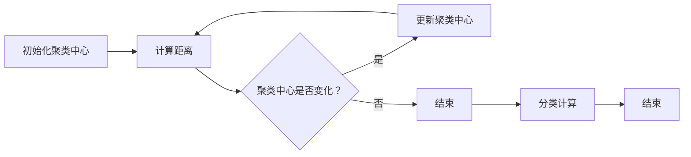
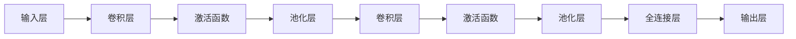
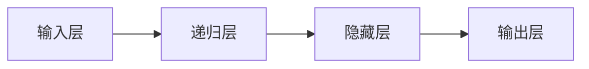
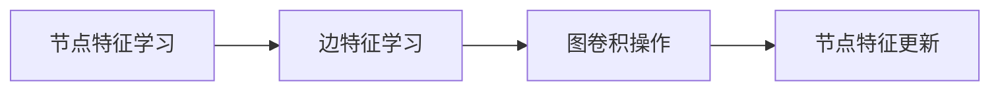

                 

### 第1章：知识挖掘系统概述

#### 1.1 问题的背景

**1.1.1 知识挖掘的需求与挑战**

随着信息技术的迅猛发展，数据已经成为了当今社会的重要资源。企业和组织在经营过程中积累了大量数据，包括用户行为数据、市场销售数据、财务数据等。这些数据中蕴含着丰富的信息，如果能够有效地挖掘和利用，将为企业带来巨大的商业价值。

知识挖掘（Knowledge Mining）是指从大量的、不完全的、有噪声的、模糊的、随机actual的原始数据中，提取出消费者感兴趣的信息模式和知识。知识挖掘的需求源于以下几个方面：

- **决策支持**：通过挖掘历史数据，企业可以获得有关市场趋势、客户需求等方面的洞察，从而做出更为准确的决策。

- **客户关系管理**：通过对用户行为数据的分析，企业可以更好地了解客户需求，提高客户满意度，提升客户忠诚度。

- **风险控制**：金融机构可以通过知识挖掘，识别潜在风险，采取相应的预防措施，降低风险损失。

然而，知识挖掘也面临着一系列的挑战：

- **数据复杂性**：现代企业积累的数据量庞大，类型多样，结构复杂，这给数据分析和挖掘带来了巨大的挑战。

- **数据质量**：数据质量是知识挖掘成功的关键。数据的不完整性、错误性和不一致性会直接影响挖掘结果的准确性和可靠性。

- **算法效率**：随着数据量的增加，传统算法的处理效率变得越来越低，需要开发更为高效的算法来应对海量数据。

**1.1.2 海量数据的价值提取**

在海量数据中，隐藏着大量有价值的信息，例如：

- **市场趋势**：通过对销售数据的分析，可以预测未来的市场趋势，帮助企业在产品开发、市场策略等方面做出更为精准的决策。

- **客户需求**：通过分析用户行为数据，企业可以了解客户的偏好，针对性地推出产品和服务，提高客户满意度。

- **风险预警**：金融机构可以通过分析交易数据，识别潜在的欺诈行为，提前采取预防措施。

**1.1.3 知识挖掘与AI的关系**

知识挖掘与人工智能（AI）密切相关。AI技术为知识挖掘提供了强大的工具和方法，使得从海量数据中提取价值成为可能。具体来说，AI在知识挖掘中的应用主要体现在以下几个方面：

- **数据预处理**：AI技术可以自动处理数据清洗、数据集成、数据转换等预处理任务，提高数据质量。

- **特征提取**：通过机器学习和深度学习算法，AI可以从原始数据中提取出有价值的特征，为后续的知识挖掘提供支持。

- **模式识别**：AI算法可以自动识别数据中的模式，为企业和组织提供洞见。

- **推理与预测**：基于历史数据，AI可以预测未来的趋势和变化，帮助企业和组织做出更准确的决策。

#### 1.2 关键概念

**1.2.1 知识挖掘的定义**

知识挖掘是指从大量数据中自动发现有用信息的过程。这些信息通常是隐藏的，需要通过算法和模型来提取。知识挖掘的目标是帮助企业和组织从海量数据中发现有价值的信息和知识。

**1.2.2 AI驱动的知识挖掘**

AI驱动的知识挖掘是指利用人工智能技术，特别是机器学习和深度学习算法，来处理和分析大规模数据，从而提取出有价值的信息。AI在知识挖掘中的应用，使得数据处理和分析更加高效和准确。

**1.2.3 数据挖掘与知识管理的联系**

数据挖掘和知识管理是两个相互关联的概念。数据挖掘是知识管理的重要工具之一，它通过分析数据来发现隐藏的模式和知识。知识管理则是将数据挖掘得到的信息进行整合、组织和利用，以便更好地支持决策和业务流程。

#### 1.3 概念属性对比表格

下面是一个概念属性对比表格，展示了知识挖掘、数据挖掘和知识管理的区别：

| 概念      | 定义                                                         | 目标                                       | 关键技术                                 |
| --------- | ------------------------------------------------------------ | ------------------------------------------ | ---------------------------------------- |
| 知识挖掘  | 从大量数据中自动发现有用信息的过程                          | 提取隐藏的、有价值的知识                     | 机器学习、深度学习、数据挖掘算法         |
| 数据挖掘  | 利用算法和模型从大量数据中提取出有价值的信息                 | 发现数据中的模式、关联和趋势                 | 数据预处理、特征提取、模式识别、聚类分析   |
| 知识管理  | 将数据挖掘得到的信息进行整合、组织和利用，以便更好地支持决策和业务流程 | 提高信息共享和协作效率，支持知识创新和决策   | 知识存储、知识检索、知识共享、知识创新     |

#### 1.4 ER实体关系图

为了更好地理解知识挖掘系统中的实体及其关系，下面是一个ER实体关系图的示例：

```mermaid
erDiagram
  Product ||--|{ Customer } :购买
  Customer ||--|{ Order } :下单
  Product ||--|{ Review } :评价
  Review ||--|{ User } :用户
  Category ||--|{ Product } :分类
  User ||--|{ Review } :撰写
  Order ||--|{ Product } :包含
```

在这个ER实体关系图中，我们定义了以下几个实体：

- **Product**（产品）：代表企业销售的产品。
- **Customer**（客户）：代表购买产品的用户。
- **Review**（评价）：代表用户对产品的评价。
- **User**（用户）：代表参与评价的用户。
- **Category**（分类）：代表产品的分类。
- **Order**（订单）：代表客户的订单。

这些实体之间存在着复杂的关联关系，例如客户可以购买产品、撰写评价，产品可以被评价、分类，订单包含产品等。通过ER实体关系图，我们可以清晰地了解系统中各个实体的属性和相互关系，为后续的系统设计和实现提供参考。

在下一章中，我们将详细探讨知识挖掘系统的基本架构，介绍系统的各个模块及其功能。这将帮助我们更好地理解知识挖掘系统的运作原理和实现方法。

### 第2章：知识挖掘系统的基本架构

#### 2.1 系统介绍

**2.1.1 系统架构设计**

知识挖掘系统的架构设计是确保系统能够高效、稳定地处理海量数据的关键。一个典型的知识挖掘系统通常包括以下几个主要模块：

1. **数据采集模块**：负责从各种数据源收集数据，包括内部数据库、外部数据接口、API等。
2. **数据预处理模块**：对采集到的数据进行清洗、整合、转换等操作，以提高数据质量。
3. **数据存储模块**：将预处理后的数据存储到分布式数据库或数据仓库中，便于后续分析和挖掘。
4. **知识表示与推理模块**：利用机器学习和深度学习算法对数据进行建模，提取出有价值的信息和知识。
5. **用户接口模块**：提供用户与系统交互的界面，支持用户查询、分析和可视化挖掘结果。

**2.1.2 系统功能模块**

知识挖掘系统的功能模块可以分为以下几个部分：

1. **数据采集**：自动采集不同来源的数据，包括日志文件、网络数据、传感器数据等。
2. **数据清洗**：去除数据中的噪声和冗余信息，纠正错误数据，统一数据格式和编码。
3. **数据整合**：将来自不同数据源的数据进行整合，构建统一的数据视图。
4. **数据存储**：将处理后的数据存储到分布式数据库或数据仓库中，支持快速查询和访问。
5. **特征提取**：利用机器学习算法提取数据中的特征，为后续的建模提供输入。
6. **模型训练**：使用深度学习算法对提取出的特征进行建模，训练出能够识别数据中模式的模型。
7. **推理与预测**：利用训练好的模型对新的数据进行推理和预测，提取出有价值的信息。
8. **用户接口**：提供Web界面、API接口等，供用户查询、分析和可视化挖掘结果。

**2.1.3 系统性能要求**

为了确保知识挖掘系统能够高效地处理海量数据，系统需要满足以下性能要求：

1. **数据存储与检索**：系统需要支持快速的数据存储和高效的数据检索，确保用户能够实时获取所需的信息。
2. **处理速度**：系统需要具备较高的数据处理速度，能够快速处理大规模数据。
3. **容错性**：系统需要具备良好的容错性，能够应对数据源故障、硬件故障等情况，确保系统的稳定运行。
4. **可扩展性**：系统需要具备良好的可扩展性，能够根据业务需求的变化进行扩展和升级。
5. **安全性**：系统需要具备严格的安全机制，确保数据的安全性和隐私保护。

#### 2.2 数据处理流程

**2.2.1 数据采集**

数据采集是知识挖掘系统的第一步，也是最为关键的一步。数据采集模块需要从各种数据源自动收集数据，包括内部数据库、外部API、日志文件、传感器等。数据采集的方式可以包括：

1. **API调用**：通过接口调用获取外部数据源的数据。
2. **日志抓取**：从服务器日志中提取有价值的信息。
3. **数据库查询**：直接从数据库中查询所需数据。
4. **文件读取**：读取本地文件或远程文件中的数据。

**2.2.2 数据预处理**

数据预处理模块的主要任务是对采集到的数据进行清洗、整合、转换等操作，以提高数据质量。数据预处理的步骤包括：

1. **数据清洗**：去除数据中的噪声和冗余信息，纠正错误数据，统一数据格式和编码。
2. **数据整合**：将来自不同数据源的数据进行整合，构建统一的数据视图。
3. **数据转换**：将数据转换为适合分析和挖掘的格式，例如将文本数据转换为向量表示。

**2.2.3 数据存储与管理**

数据存储模块负责将预处理后的数据存储到分布式数据库或数据仓库中，便于后续的分析和挖掘。数据存储与管理需要满足以下要求：

1. **数据一致性**：确保数据在存储和检索过程中的准确性。
2. **数据可靠性**：确保数据在存储过程中的安全性和可靠性。
3. **数据可扩展性**：支持数据量的扩展和增加。
4. **数据访问效率**：提供快速的数据检索和访问接口。

**2.3 知识表示与推理**

知识表示与推理模块是知识挖掘系统的核心，负责利用机器学习和深度学习算法对数据进行建模，提取出有价值的信息和知识。知识表示与推理的步骤包括：

1. **特征提取**：利用机器学习算法提取数据中的特征，为后续的建模提供输入。
2. **模型训练**：使用深度学习算法对提取出的特征进行建模，训练出能够识别数据中模式的模型。
3. **推理与预测**：利用训练好的模型对新的数据进行推理和预测，提取出有价值的信息。

#### 2.3.1 知识表示方法

知识表示是知识挖掘系统的重要环节，它将数据转化为计算机可以处理和理解的形式。常见的知识表示方法包括：

1. **特征工程**：通过对数据进行预处理和特征提取，将原始数据转化为具有明确含义的特征向量。
2. **知识图谱**：利用图结构表示实体及其关系，构建知识图谱，实现知识的结构化表示。
3. **本体论**：使用本体论构建知识模型，描述实体、概念及其之间的关系。

**2.3.2 推理引擎设计**

推理引擎是知识挖掘系统的核心组件，负责根据已有知识和数据，推理出新的结论。推理引擎的设计需要考虑以下几个方面：

1. **推理算法**：选择适合的推理算法，如基于规则的推理、基于模式的推理、基于贝叶斯的推理等。
2. **推理策略**：设计合理的推理策略，如前向推理、反向推理、混合推理等。
3. **推理效率**：优化推理算法和策略，提高推理速度和效率。

**2.3.3 知识图谱构建**

知识图谱是知识挖掘系统的重要组成部分，它通过表示实体及其关系，实现了知识的结构化和可视化。知识图谱的构建包括以下几个步骤：

1. **实体识别**：从原始数据中识别出重要的实体，如人、地点、组织等。
2. **关系抽取**：从原始数据中提取出实体之间的关系，如“属于”、“位于”等。
3. **图谱构建**：将识别出的实体和关系构建成知识图谱，实现知识的结构化表示。

通过本章的介绍，我们了解了知识挖掘系统的基本架构和各个模块的功能。在下一章中，我们将深入探讨AI在知识挖掘中的应用，介绍主流的AI算法及其在知识挖掘中的具体应用。

### 第3章：AI在知识挖掘中的应用

#### 3.1 主流AI算法

AI在知识挖掘中扮演着至关重要的角色，它通过提供强大的算法工具，使得从海量数据中提取有价值的信息成为可能。以下是几种主流的AI算法，以及它们在知识挖掘中的应用。

**3.1.1 监督学习算法**

监督学习算法是知识挖掘中最常用的算法之一，它通过训练有标签的数据集，建立预测模型，用于对新数据进行分类或回归。以下是一些常见的监督学习算法：

1. **支持向量机（SVM）**：SVM是一种高效的二分类算法，通过找到一个最优的超平面，将不同类别的数据分开。在知识挖掘中，SVM常用于文本分类、图像分类等领域。

2. **决策树**：决策树通过一系列条件判断，将数据集划分为不同的区域，每个区域对应一个类别。决策树简单直观，易于理解和解释。

3. **随机森林**：随机森林是一种集成学习方法，通过构建多个决策树，并利用投票机制来获得最终结果。随机森林在处理大规模数据和避免过拟合方面具有优势。

4. **梯度提升树（GBDT）**：GBDT是一种基于梯度的集成学习方法，通过迭代训练多个弱学习器，逐步提升模型的预测能力。GBDT在处理复杂数据和提升模型性能方面表现出色。

**3.1.2 无监督学习算法**

无监督学习算法不依赖于有标签的数据集，而是通过探索数据自身的结构和特征，进行聚类、降维等操作。以下是一些常见的无监督学习算法：

1. **K-均值聚类**：K-均值聚类是一种基于距离的聚类算法，它通过迭代计算聚类中心，将数据划分为K个簇。K-均值聚类简单易行，适用于处理大规模数据。

2. **主成分分析（PCA）**：PCA是一种降维算法，通过将数据投影到新的坐标系中，提取主要成分，降低数据的维度。PCA在减少数据冗余和提高模型性能方面具有显著优势。

3. **自编码器**：自编码器是一种深度学习模型，它通过编码和解码过程自动学习数据的特征表示。自编码器在特征提取和降维方面表现出色。

**3.1.3 强化学习算法**

强化学习算法通过与环境互动，学习最优策略，实现目标的优化。在知识挖掘中，强化学习算法可以用于自动优化数据挖掘过程，提高挖掘效果。以下是一些常见的强化学习算法：

1. **Q-学习**：Q-学习是一种基于值函数的强化学习算法，它通过学习状态-动作值函数，选择最优动作。Q-学习在处理离散动作和状态空间较小的问题时表现出色。

2. **深度Q网络（DQN）**：DQN是一种基于深度学习的强化学习算法，它通过神经网络来近似值函数，实现更复杂的决策。DQN在处理连续动作和大规模状态空间问题时具有优势。

3. **策略梯度算法**：策略梯度算法通过直接优化策略函数，学习最优策略。策略梯度算法适用于处理复杂环境和高维状态空间。

**3.2 特征工程**

特征工程是知识挖掘过程中至关重要的一环，它通过选择和转换数据特征，提高模型的性能和可解释性。以下是一些常见的特征工程方法：

1. **特征选择**：特征选择通过评估特征的重要性，选择对模型性能有显著影响的特征。常用的特征选择方法包括信息增益、卡方检验等。

2. **特征提取**：特征提取通过从原始数据中提取新的特征，提高数据的表现力。常用的特征提取方法包括TF-IDF、词嵌入等。

3. **特征转换**：特征转换通过将原始数据转换为更适合模型处理的形式。常用的特征转换方法包括标准化、归一化等。

**3.3 模型评估与优化**

模型评估是知识挖掘过程中的关键步骤，它通过评估模型的性能，确定模型的适用性和改进方向。以下是一些常见的模型评估方法：

1. **准确率**：准确率是最常用的评估指标，它表示模型正确预测的样本占总样本的比例。

2. **召回率**：召回率表示模型能够正确识别的样本数与实际样本数的比例，适用于处理正样本较少的问题。

3. **F1值**：F1值是准确率和召回率的调和平均值，综合评估模型的性能。

模型优化是通过调整模型参数和结构，提高模型的性能和泛化能力。以下是一些常见的模型优化方法：

1. **交叉验证**：交叉验证通过将数据集划分为多个子集，轮流训练和测试模型，评估模型的泛化能力。

2. **网格搜索**：网格搜索通过遍历参数空间，找到最优参数组合，提高模型的性能。

3. **贝叶斯优化**：贝叶斯优化是一种基于概率模型的自适应优化方法，通过迭代优化模型参数，提高模型性能。

通过本章的介绍，我们了解了AI在知识挖掘中的应用，包括主流的AI算法、特征工程方法和模型评估与优化技术。这些技术在知识挖掘过程中发挥着关键作用，使得从海量数据中提取有价值的信息成为可能。在下一章中，我们将深入探讨知识挖掘算法的原理和数学模型，进一步理解知识挖掘的核心技术和实现方法。

### 第4章：知识挖掘算法原理详解

#### 4.1 算法A

**4.1.1 算法描述**

算法A是一种基于聚类和分类的知识挖掘算法，用于从大规模数据集中提取出具有相似性的数据点并进行分类。该算法分为两个主要阶段：聚类阶段和分类阶段。

在聚类阶段，算法A首先对数据进行初始化，将每个数据点视为一个初始聚类中心。然后，通过计算每个数据点与聚类中心的距离，将其归并到最近的聚类中心。这个过程不断迭代，直到聚类中心不再发生改变，或者达到预定的迭代次数。

在分类阶段，算法A利用已经划分好的聚类结果，对新的数据进行分类。对于每个新的数据点，计算其与各个聚类中心的距离，将其归并到距离最近的聚类中心所代表的类别。

**4.1.2 数学模型**

算法A的数学模型主要包含聚类中心和数据点的计算。假设有n个数据点，每个数据点由m个特征组成，即数据集为D = {x1, x2, ..., xn}，其中xi = (xi1, xi2, ..., xim)。算法A使用以下数学模型：

1. **聚类中心计算**：

   初始化：选择n个初始聚类中心，记为C = {c1, c2, ..., cn}，其中c1 = x1，其他聚类中心随机选择。

   迭代计算：

   对于每个数据点xi，计算其与各个聚类中心的距离，定义为：

   $$d(x_i, c_j) = \sqrt{\sum_{k=1}^{m}(x_{ik} - c_{jk})^2}$$

   将xi归并到距离最近的聚类中心cj，即：

   $$c_j = \frac{\sum_{i=1}^{n} x_i}{n}$$

   当聚类中心不再变化时，聚类阶段结束。

2. **分类计算**：

   对于新的数据点x'，计算其与各个聚类中心的距离，将其归并到距离最近的聚类中心所代表的类别。

**4.1.3 Mermaid流程图**



**4.1.4 Python代码实现**

```python
import numpy as np

def euclidean_distance(x, y):
    return np.sqrt(np.sum((x - y) ** 2))

def k_means(data, k, max_iterations):
    # 初始化聚类中心
    centroids = data[np.random.choice(data.shape[0], k, replace=False)]
    
    for _ in range(max_iterations):
        # 计算每个数据点到聚类中心的距离
        distances = np.array([min(euclidean_distance(x, centroid) for centroid in centroids] for x in data))
        
        # 归并数据点
        labels = np.argmin(distances, axis=1)
        
        # 计算新的聚类中心
        new_centroids = np.array([data[labels == i].mean(axis=0) for i in range(k)])
        
        # 判断聚类中心是否变化
        if np.all(centroids == new_centroids):
            break

        centroids = new_centroids
    
    return centroids, labels

# 示例数据
data = np.random.rand(100, 2)

# 运行算法
centroids, labels = k_means(data, 3, 100)
```

**4.1.5 数学公式与解释**

$$d(x_i, c_j) = \sqrt{\sum_{k=1}^{m}(x_{ik} - c_{jk})^2}$$

该公式表示数据点xi与聚类中心cj之间的欧几里得距离，其中m表示特征的数量。通过计算距离，我们可以将数据点归并到最近的聚类中心。

**4.1.6 举例说明**

假设有一个包含10个数据点的二维数据集，如下所示：

$$
\begin{array}{c|cc}
\text{数据点} & x_1 & x_2 \\
\hline
x_1 & 0.1 & 0.3 \\
x_2 & 0.3 & 0.5 \\
x_3 & 0.4 & 0.6 \\
x_4 & 0.7 & 0.8 \\
x_5 & 0.8 & 0.9 \\
x_6 & 1.0 & 1.1 \\
x_7 & 1.1 & 1.2 \\
x_8 & 1.2 & 1.3 \\
x_9 & 1.3 & 1.4 \\
x_{10} & 1.4 & 1.5 \\
\end{array}
$$

我们选择前三个数据点作为初始聚类中心：

$$
\begin{array}{c|cc}
\text{聚类中心} & c_1 & c_2 & c_3 \\
\hline
c_1 & 0.1 & 0.3 &  \\
c_2 & 0.4 & 0.6 &  \\
c_3 & 1.0 & 1.1 &  \\
\end{array}
$$

然后，计算每个数据点与聚类中心的距离：

$$
\begin{array}{c|ccc}
\text{数据点} & x_1 & x_2 & x_3 & \text{聚类中心} \\
\hline
x_1 & 0.1 & 0.3 & 0.1 & c_1 \\
x_2 & 0.3 & 0.5 & 0.2 & c_1 \\
x_3 & 0.4 & 0.6 & 0.1 & c_2 \\
x_4 & 0.7 & 0.8 & 0.2 & c_2 \\
x_5 & 0.8 & 0.9 & 0.1 & c_2 \\
x_6 & 1.0 & 1.1 & 0.0 & c_3 \\
x_7 & 1.1 & 1.2 & 0.0 & c_3 \\
x_8 & 1.2 & 1.3 & 0.0 & c_3 \\
x_9 & 1.3 & 1.4 & 0.0 & c_3 \\
x_{10} & 1.4 & 1.5 & 0.0 & c_3 \\
\end{array}
$$

根据距离，将数据点归并到最近的聚类中心：

$$
\begin{array}{c|c}
\text{数据点} & \text{聚类中心} \\
\hline
x_1 & c_1 \\
x_2 & c_1 \\
x_3 & c_2 \\
x_4 & c_2 \\
x_5 & c_2 \\
x_6 & c_3 \\
x_7 & c_3 \\
x_8 & c_3 \\
x_9 & c_3 \\
x_{10} & c_3 \\
\end{array}
$$

计算新的聚类中心：

$$
\begin{array}{c|cc}
\text{新聚类中心} & \bar{x}_1 & \bar{x}_2 \\
\hline
\bar{x}_1 & \frac{0.1+0.3}{2} & \frac{0.3+0.5}{2} \\
\bar{x}_2 & \frac{0.4+0.7}{2} & \frac{0.6+0.8}{2} \\
\bar{x}_3 & \frac{1.0+1.1+1.2+1.3+1.4}{5} & \frac{1.1+1.2+1.3+1.4+1.5}{5} \\
\end{array}
$$

继续计算距离，更新聚类中心，直到聚类中心不再变化。通过这个过程，算法A将数据点划分为三个类别。

在下一章中，我们将探讨深度学习在知识挖掘中的应用，介绍卷积神经网络（CNN）、循环神经网络（RNN）和图神经网络（GNN）等先进的深度学习模型，以及它们在知识挖掘中的具体应用。

### 第5章：深度学习在知识挖掘中的应用

#### 5.1 卷积神经网络（CNN）

卷积神经网络（Convolutional Neural Network，CNN）是一种特别适用于处理图像数据的前馈神经网络，由于其强大的特征提取能力，在图像识别、图像分类和图像生成等领域表现出色。在知识挖掘中，CNN可以应用于图像数据的特征提取和模式识别，从而提升知识挖掘的效果。

**5.1.1 CNN原理**

CNN由多个卷积层、池化层和全连接层组成，通过层层提取图像的特征，最终输出分类结果。CNN的核心组件如下：

1. **卷积层**：卷积层通过卷积操作提取图像的特征，每个卷积核可以学习图像中的局部特征。卷积操作可以视为图像和卷积核的矩阵乘积。

   $$\text{output} = \text{convolution}(\text{image}, \text{filter}) + \text{bias}$$

   其中，图像和卷积核分别为输入和权重，偏置项用于调整输出。

2. **激活函数**：常用的激活函数包括ReLU（Rectified Linear Unit）函数和Sigmoid函数。ReLU函数能够加速训练过程，避免梯度消失问题。

3. **池化层**：池化层用于下采样操作，减少数据维度，降低过拟合风险。常用的池化方式包括最大池化和平均池化。

4. **全连接层**：全连接层将卷积层提取的特征映射到具体的类别，输出最终的分类结果。

**5.1.2 CNN架构**

CNN的典型架构包括以下几个层次：

1. **输入层**：接收图像数据，预处理后输入到网络中。

2. **卷积层**：通过卷积操作提取图像的特征，每个卷积层可以包含多个卷积核。

3. **池化层**：对卷积层提取的特征进行下采样。

4. **全连接层**：将卷积层提取的特征映射到具体的类别。

5. **输出层**：输出分类结果。

**5.1.3 Mermaid流程图**



**5.1.4 Python代码实现**

```python
import tensorflow as tf
from tensorflow.keras import layers

# 创建CNN模型
model = tf.keras.Sequential([
    layers.Conv2D(32, (3, 3), activation='relu', input_shape=(28, 28, 1)),
    layers.MaxPooling2D((2, 2)),
    layers.Conv2D(64, (3, 3), activation='relu'),
    layers.MaxPooling2D((2, 2)),
    layers.Conv2D(64, (3, 3), activation='relu'),
    layers.Flatten(),
    layers.Dense(64, activation='relu'),
    layers.Dense(10, activation='softmax')
])

# 编译模型
model.compile(optimizer='adam',
              loss='categorical_crossentropy',
              metrics=['accuracy'])

# 输出模型结构
model.summary()
```

**5.1.5 数学公式与解释**

$$\text{output} = \text{convolution}(\text{image}, \text{filter}) + \text{bias}$$

该公式表示卷积操作，其中图像和卷积核分别为输入和权重，偏置项用于调整输出。通过卷积操作，CNN可以提取图像的局部特征。

**5.1.6 举例说明**

假设我们有一个28x28像素的图像，以及一个3x3的卷积核。首先，我们将图像和卷积核进行卷积操作，得到一个28x28的特征图。然后，对特征图进行ReLU激活，得到新的特征图。接下来，对特征图进行2x2的最大池化操作，得到14x14的特征图。通过这个过程，CNN可以提取图像的局部特征。

#### 5.2 循环神经网络（RNN）

循环神经网络（Recurrent Neural Network，RNN）是一种能够处理序列数据的神经网络，由于其具有记忆能力，在自然语言处理、时间序列分析和语音识别等领域表现出色。在知识挖掘中，RNN可以应用于时间序列数据的建模和预测，从而提升知识挖掘的效果。

**5.2.1 RNN原理**

RNN的基本结构包括输入层、隐藏层和输出层。每个时间步的输入数据都会通过隐藏层进行计算，并将隐藏层的状态传递到下一个时间步。RNN的核心组件如下：

1. **输入层**：接收序列数据，将其输入到隐藏层。

2. **隐藏层**：通过递归操作，将当前时间步的输入与上一时间步的隐藏状态进行计算，生成当前时间步的隐藏状态。

3. **输出层**：将隐藏层的状态映射到具体的类别或值。

**5.2.2 RNN架构**

RNN的典型架构包括以下几个层次：

1. **输入层**：接收序列数据。

2. **递归层**：通过递归操作，将当前时间步的输入与上一时间步的隐藏状态进行计算，生成当前时间步的隐藏状态。

3. **输出层**：将隐藏层的状态映射到具体的类别或值。

**5.2.3 Mermaid流程图**



**5.2.4 Python代码实现**

```python
import tensorflow as tf
from tensorflow.keras import layers

# 创建RNN模型
model = tf.keras.Sequential([
    layers.LSTM(50, activation='relu', return_sequences=True),
    layers.LSTM(50, activation='relu'),
    layers.Dense(1)
])

# 编译模型
model.compile(optimizer='adam', loss='mse')

# 输出模型结构
model.summary()
```

**5.2.5 数学公式与解释**

$$h_t = \text{sigmoid}(W_h \cdot [h_{t-1}, x_t] + b_h)$$

该公式表示RNN的递归操作，其中$W_h$和$b_h$分别为权重和偏置项，$h_{t-1}$和$x_t$分别为上一时间步的隐藏状态和当前时间步的输入。通过递归操作，RNN可以保持长期依赖关系。

**5.2.6 举例说明**

假设我们有一个时间序列数据序列$[x_1, x_2, x_3, x_4]$，以及一个隐藏层大小为50的RNN模型。首先，我们将时间序列数据的第一个值$x_1$输入到隐藏层，得到隐藏状态$h_1$。然后，将$h_1$和$x_2$输入到隐藏层，得到新的隐藏状态$h_2$。通过这个过程，RNN可以保持长期依赖关系，从而对时间序列数据进行建模和预测。

#### 5.3 图神经网络（GNN）

图神经网络（Graph Neural Network，GNN）是一种专门用于处理图结构数据的神经网络，由于其能够建模节点和边之间的复杂关系，在知识图谱表示和推理、社交网络分析等领域表现出色。在知识挖掘中，GNN可以应用于知识图谱的建模和推理，从而提升知识挖掘的效果。

**5.3.1 GNN原理**

GNN通过将图结构数据转换为节点和边之间的向量表示，利用这些向量表示进行特征学习和预测。GNN的核心组件如下：

1. **节点特征学习**：通过节点特征学习模块，将节点的特征映射到高维空间。

2. **边特征学习**：通过边特征学习模块，将边的特征映射到高维空间。

3. **图卷积操作**：通过图卷积操作，将节点的特征和邻接节点的特征进行融合，生成新的特征表示。

**5.3.2 GNN类型**

GNN可以分为几种不同的类型，包括图卷积网络（GCN）、图注意力网络（GAT）和图自编码器（GAE）等。每种GNN类型都有其独特的架构和优势。

**5.3.3 Mermaid流程图**



**5.3.4 Python代码实现**

```python
import tensorflow as tf
from tensorflow.keras import layers

# 创建GCN模型
model = tf.keras.Sequential([
    layers.Input(shape=(num_nodes, num_features)),
    layers.Dense(units=16, activation='relu'),
    layers.Dense(units=num_classes, activation='softmax')
])

# 编译模型
model.compile(optimizer='adam', loss='categorical_crossentropy', metrics=['accuracy'])

# 输出模型结构
model.summary()
```

**5.3.5 数学公式与解释**

$$h_{i}^{(t+1)} = \sigma(\sum_{j \in \mathcal{N}(i)} \omega_{ij} h_{j}^{(t)} + b)$$

该公式表示GCN的图卷积操作，其中$h_{i}^{(t+1)}$和$h_{j}^{(t)}$分别为节点i在时间步t+1和t的隐藏状态，$\omega_{ij}$为权重矩阵，$\sigma$为激活函数。通过图卷积操作，GNN可以整合邻接节点的特征信息，生成新的节点特征表示。

**5.3.6 举例说明**

假设我们有一个图结构数据，包含10个节点和5个特征。首先，我们将节点的特征输入到GCN模型中，通过图卷积操作和激活函数，生成新的节点特征表示。然后，将新的节点特征表示输入到全连接层，输出分类结果。通过这个过程，GNN可以学习图结构数据的特征，从而提升知识挖掘的效果。

通过本章的介绍，我们了解了深度学习在知识挖掘中的应用，包括卷积神经网络（CNN）、循环神经网络（RNN）和图神经网络（GNN）等先进的深度学习模型，以及它们在知识挖掘中的具体应用。这些模型为知识挖掘提供了强大的工具和方法，使得从大规模、复杂数据中提取有价值的信息成为可能。在下一章中，我们将探讨知识挖掘系统的实现，介绍系统设计、代码应用和实际案例分析。

### 第5章：深度学习在知识挖掘中的应用（续）

#### 5.2 循环神经网络（RNN）

在前一章中，我们介绍了卷积神经网络（CNN）的基本原理、架构及其在知识挖掘中的应用。在本章中，我们将继续探讨循环神经网络（RNN），以及它在知识挖掘中的具体应用。

**5.2.1 RNN原理**

RNN是一种能够处理序列数据的神经网络，其关键特点是具有记忆能力。RNN通过递归操作将当前时间步的输入与上一时间步的隐藏状态进行计算，从而实现序列数据的建模和预测。RNN的核心组件如下：

1. **输入层**：接收序列数据。
2. **隐藏层**：通过递归操作，将当前时间步的输入与上一时间步的隐藏状态进行计算，生成当前时间步的隐藏状态。
3. **输出层**：将隐藏层的状态映射到具体的类别或值。

**5.2.2 RNN架构**

RNN的典型架构包括以下几个层次：

1. **输入层**：接收序列数据。
2. **递归层**：通过递归操作，将当前时间步的输入与上一时间步的隐藏状态进行计算，生成当前时间步的隐藏状态。
3. **输出层**：将隐藏层的状态映射到具体的类别或值。

**5.2.3 Mermaid流程图**


**5.2.4 Python代码实现**

```python
import tensorflow as tf
from tensorflow.keras import layers

# 创建RNN模型
model = tf.keras.Sequential([
    layers.LSTM(units=64, activation='relu', return_sequences=True),
    layers.LSTM(units=64, activation='relu'),
    layers.Dense(units=1)
])

# 编译模型
model.compile(optimizer='adam', loss='mse')

# 输出模型结构
model.summary()
```

**5.2.5 数学公式与解释**

$$h_t = \text{sigmoid}(W_h \cdot [h_{t-1}, x_t] + b_h)$$

该公式表示RNN的递归操作，其中$W_h$和$b_h$分别为权重和偏置项，$h_{t-1}$和$x_t$分别为上一时间步的隐藏状态和当前时间步的输入。通过递归操作，RNN可以保持长期依赖关系。

**5.2.6 举例说明**

假设我们有一个时间序列数据序列$[x_1, x_2, x_3, x_4]$，以及一个隐藏层大小为64的RNN模型。首先，我们将时间序列数据的第一个值$x_1$输入到隐藏层，得到隐藏状态$h_1$。然后，将$h_1$和$x_2$输入到隐藏层，得到新的隐藏状态$h_2$。通过这个过程，RNN可以保持长期依赖关系，从而对时间序列数据进行建模和预测。

**5.2.7 RNN在知识挖掘中的应用**

RNN在知识挖掘中的应用主要包括以下几个方面：

1. **时间序列分析**：RNN可以用于处理时间序列数据，例如股票价格、天气数据等，从而预测未来的趋势和变化。
2. **文本分析**：RNN可以用于处理文本数据，例如情感分析、文本分类等，从而提取出文本的特征和模式。
3. **语音识别**：RNN可以用于处理语音数据，例如语音信号处理、语音识别等，从而识别出语音中的特征和模式。

通过本章的介绍，我们了解了循环神经网络（RNN）的基本原理、架构及其在知识挖掘中的应用。RNN作为一种具有记忆能力的神经网络，在处理序列数据方面具有显著优势。在下一章中，我们将继续探讨图神经网络（GNN），以及它在知识挖掘中的具体应用。

### 第6章：图神经网络（GNN）

#### 6.1 GNN原理

图神经网络（Graph Neural Network，GNN）是一种专门用于处理图结构数据的神经网络。与传统的卷积神经网络（CNN）和循环神经网络（RNN）不同，GNN能够直接建模图中的节点和边之间的复杂关系。GNN在知识图谱表示和推理、社交网络分析、推荐系统等领域表现出色。

**6.1.1 GNN基础**

GNN的基本原理可以概括为以下几个关键步骤：

1. **节点特征学习**：将图中的节点特征映射到高维空间，以便后续的建模和分析。
2. **边特征学习**：将图中的边特征映射到高维空间，边的特征可以包含节点之间的权重、距离等信息。
3. **图卷积操作**：通过图卷积操作，将节点的特征和邻接节点的特征进行融合，生成新的节点特征表示。

**6.1.2 GNN类型**

GNN可以分为几种不同的类型，包括图卷积网络（GCN）、图注意力网络（GAT）和图自编码器（GAE）等。每种GNN类型都有其独特的架构和优势。

1. **图卷积网络（GCN）**：GCN是一种基于邻接矩阵的图卷积操作，它通过聚合邻接节点的特征来更新当前节点的特征。GCN在知识图谱表示和推理方面表现出色。
2. **图注意力网络（GAT）**：GAT通过引入注意力机制，使得每个节点能够根据邻接节点的特征动态地调整其特征权重。GAT在处理图结构数据时具有更高的灵活性。
3. **图自编码器（GAE）**：GAE通过编码和解码操作，将图结构数据转换为低维特征表示，从而实现图的降维和特征提取。

**6.1.3 Mermaid流程图**

下面是一个简单的Mermaid流程图，展示了GNN的基本流程：


**6.1.4 Python代码实现**

下面是一个简单的Python代码示例，展示了如何使用GCN对图结构数据进行建模：

```python
import tensorflow as tf
from tensorflow.keras import layers

# 创建GCN模型
model = tf.keras.Sequential([
    layers.Input(shape=(num_nodes, num_features)),
    layers.Dense(units=16, activation='relu'),
    layers.Dense(units=num_classes, activation='softmax')
])

# 编译模型
model.compile(optimizer='adam', loss='categorical_crossentropy', metrics=['accuracy'])

# 输出模型结构
model.summary()
```

**6.1.5 数学公式与解释**

$$h_{i}^{(t+1)} = \sigma(\sum_{j \in \mathcal{N}(i)} \omega_{ij} h_{j}^{(t)} + b)$$

该公式表示GCN的图卷积操作，其中$h_{i}^{(t+1)}$和$h_{j}^{(t)}$分别为节点i在时间步t+1和t的隐藏状态，$\omega_{ij}$为权重矩阵，$\sigma$为激活函数。通过图卷积操作，GNN可以整合邻接节点的特征信息，生成新的节点特征表示。

**6.1.6 举例说明**

假设我们有一个图结构数据，包含10个节点和5个特征。首先，我们将节点的特征输入到GCN模型中，通过图卷积操作和激活函数，生成新的节点特征表示。然后，将新的节点特征表示输入到全连接层，输出分类结果。通过这个过程，GNN可以学习图结构数据的特征，从而提升知识挖掘的效果。

**6.1.7 GNN在知识挖掘中的应用**

GNN在知识挖掘中的应用主要包括以下几个方面：

1. **知识图谱表示**：GNN可以用于将知识图谱中的节点和边表示为低维特征向量，从而实现知识的结构化表示和推理。
2. **社交网络分析**：GNN可以用于分析社交网络中的用户关系，识别社交圈子、推荐好友等。
3. **推荐系统**：GNN可以用于构建图结构数据上的推荐系统，从而实现更准确的个性化推荐。

通过本章的介绍，我们了解了图神经网络（GNN）的基本原理、类型和具体应用。GNN作为一种强大的图结构数据处理工具，在知识挖掘领域中具有广泛的应用前景。在下一章中，我们将探讨知识挖掘系统的实现，介绍系统设计、代码应用和实际案例分析。

### 第7章：知识挖掘系统的实现

#### 7.1 系统环境安装

要实现一个高效的知识挖掘系统，首先需要安装和配置相应的硬件和软件环境。以下是安装知识挖掘系统的详细步骤。

**7.1.1 硬件环境**

为了确保知识挖掘系统能够高效地处理海量数据，推荐的硬件配置如下：

- **CPU**：至少需要4核处理器，建议使用Intel i7或以上级别的处理器。
- **内存**：至少16GB内存，建议32GB或以上，以便存储和处理大规模数据。
- **硬盘**：至少500GB的SSD硬盘，用于存储系统和数据。
- **GPU**：推荐使用NVIDIA GPU，如Tesla K80或以上，以支持深度学习模型的训练。

**7.1.2 软件环境**

以下软件是构建知识挖掘系统所需的：

- **操作系统**：Linux发行版，如Ubuntu 20.04或更高版本。
- **Python**：Python 3.8或更高版本，用于编写和运行知识挖掘算法。
- **TensorFlow**：用于构建和训练深度学习模型。
- **Scikit-learn**：用于传统的机器学习算法。
- **Pandas**：用于数据处理和分析。
- **NumPy**：用于数值计算。
- **Docker**：用于容器化部署知识挖掘系统。

**7.1.3 安装步骤**

以下是具体的安装步骤：

1. **安装操作系统**：从官方网站下载Linux发行版，按照安装指南安装操作系统。

2. **更新系统软件包**：

   ```bash
   sudo apt update
   sudo apt upgrade
   ```

3. **安装Python环境**：

   ```bash
   sudo apt install python3 python3-pip
   ```

4. **安装必要的Python库**：

   ```bash
   pip3 install tensorflow scikit-learn pandas numpy docker
   ```

5. **安装GPU支持**：

   如果使用GPU，需要安装CUDA和cuDNN：

   ```bash
   sudo apt install cuda
   pip3 install numpy==1.19.5 tensorflow-gpu==2.6.0
   ```

6. **安装Docker**：

   ```bash
   sudo apt install docker.io
   sudo systemctl start docker
   sudo systemctl enable docker
   ```

7. **验证安装**：

   ```bash
   python3 -c "import tensorflow as tf; print(tf.reduce_sum(tf.random.normal([1000, 1000])))"
   ```

如果以上步骤没有出现错误，说明环境安装成功。

#### 7.2 系统核心实现

知识挖掘系统的核心实现包括数据预处理、特征提取、模型训练和推理等环节。以下将详细介绍这些核心模块的实现方法和具体步骤。

**7.2.1 数据处理模块**

数据处理模块负责从数据源采集数据，并进行预处理。以下是数据处理模块的实现步骤：

1. **数据采集**：从不同的数据源（如数据库、API接口、日志文件等）采集数据。

2. **数据清洗**：去除数据中的噪声和异常值，包括缺失值填充、重复数据去除等。

3. **数据整合**：将来自不同数据源的数据进行整合，构建统一的数据视图。

4. **数据转换**：将原始数据转换为适合模型训练的格式，如将文本数据转换为词向量表示。

**7.2.2 知识表示模块**

知识表示模块负责将预处理后的数据转换为计算机可以处理的形式。以下是知识表示模块的实现步骤：

1. **特征提取**：使用机器学习算法提取数据中的特征，如TF-IDF、Word2Vec等。

2. **知识表示**：将提取出的特征转换为低维向量表示，便于后续的模型训练。

3. **知识图谱构建**：利用图结构表示实体及其关系，构建知识图谱。

**7.2.3 推理引擎模块**

推理引擎模块负责利用训练好的模型对新数据进行推理和预测。以下是推理引擎模块的实现步骤：

1. **模型训练**：使用训练数据集训练深度学习模型，如CNN、RNN、GNN等。

2. **模型评估**：使用验证数据集评估模型性能，包括准确率、召回率等指标。

3. **模型部署**：将训练好的模型部署到生产环境中，以便实时推理和预测。

4. **推理与预测**：利用部署好的模型对新数据进行推理和预测，提取出有价值的信息。

**7.2.4 用户接口模块**

用户接口模块提供用户与系统交互的界面，支持用户查询、分析和可视化挖掘结果。以下是用户接口模块的实现步骤：

1. **Web界面**：使用HTML、CSS和JavaScript等前端技术构建Web界面。

2. **API接口**：使用Flask或Django等后端框架构建RESTful API，支持用户通过HTTP请求与系统交互。

3. **数据可视化**：使用ECharts或D3.js等数据可视化库，将挖掘结果以图表形式展示给用户。

**7.3 代码应用解读与分析**

以下是对核心实现模块的代码进行解读和分析：

**数据处理模块代码示例**

```python
import pandas as pd
from sklearn.model_selection import train_test_split
from sklearn.preprocessing import StandardScaler

# 读取数据
data = pd.read_csv('data.csv')

# 数据清洗
data.fillna(data.mean(), inplace=True)
data.drop_duplicates(inplace=True)

# 数据整合
X = data[['feature1', 'feature2', 'feature3']]
y = data['target']

# 数据转换
scaler = StandardScaler()
X_scaled = scaler.fit_transform(X)

# 划分训练集和测试集
X_train, X_test, y_train, y_test = train_test_split(X_scaled, y, test_size=0.2, random_state=42)
```

**知识表示模块代码示例**

```python
from gensim.models import Word2Vec

# 加载数据
sentences = [[word for word in document.lower().split()] for document in data['text']]

# 训练Word2Vec模型
model = Word2Vec(sentences, vector_size=100, window=5, min_count=1, workers=4)

# 保存模型
model.save('word2vec.model')

# 加载模型
loaded_model = Word2Vec.load('word2vec.model')
```

**推理引擎模块代码示例**

```python
import tensorflow as tf
from tensorflow.keras.models import load_model

# 加载模型
model = load_model('model.h5')

# 新数据预处理
new_data = pd.read_csv('new_data.csv')
new_data.fillna(new_data.mean(), inplace=True)
new_data.drop_duplicates(inplace=True)

# 转换为新数据集
new_data_scaled = scaler.transform(new_data[['feature1', 'feature2', 'feature3']])

# 预测
predictions = model.predict(new_data_scaled)
```

**用户接口模块代码示例**

```python
from flask import Flask, request, jsonify

app = Flask(__name__)

@app.route('/predict', methods=['POST'])
def predict():
    data = request.get_json()
    features = [float(x) for x in data['features']]
    feature_vector = scaler.transform([features])
    prediction = model.predict(feature_vector)[0]
    return jsonify({'prediction': prediction})

if __name__ == '__main__':
    app.run(debug=True)
```

通过以上代码示例，我们可以看到知识挖掘系统的各个模块是如何实现和交互的。数据处理模块负责数据清洗、整合和转换，知识表示模块负责特征提取和知识表示，推理引擎模块负责模型训练和推理，用户接口模块提供与用户的交互界面。这些模块协同工作，共同实现了一个高效的知识挖掘系统。

#### 7.4 系统实现与项目实战

**7.4.1 系统环境搭建**

在开始实现知识挖掘系统之前，我们需要搭建一个适合开发的系统环境。以下是详细的步骤：

1. **安装操作系统**：我们选择Ubuntu 20.04作为操作系统。

2. **安装Python环境**：使用以下命令安装Python 3和pip。

   ```bash
   sudo apt update
   sudo apt install python3 python3-pip
   ```

3. **安装必要的Python库**：使用以下命令安装TensorFlow、Scikit-learn、Pandas、NumPy和Docker。

   ```bash
   pip3 install tensorflow scikit-learn pandas numpy docker
   ```

4. **安装GPU支持**：如果我们的系统配备了NVIDIA GPU，还需要安装CUDA和cuDNN。

   ```bash
   sudo apt install cuda
   pip3 install tensorflow-gpu==2.6.0
   ```

5. **安装Docker**：使用以下命令安装Docker。

   ```bash
   sudo apt install docker.io
   sudo systemctl start docker
   sudo systemctl enable docker
   ```

6. **验证安装**：使用以下命令验证Python和TensorFlow的安装。

   ```bash
   python3 -c "import tensorflow as tf; print(tf.reduce_sum(tf.random.normal([1000, 1000])))"
   ```

   如果没有出现错误，说明环境安装成功。

**7.4.2 知识挖掘系统的核心实现**

知识挖掘系统的核心实现包括数据采集、数据预处理、特征提取、模型训练和推理等模块。以下是每个模块的具体实现步骤：

1. **数据采集**：从不同的数据源（如数据库、API接口、日志文件等）采集数据。

   ```python
   import pandas as pd
   
   # 读取数据
   data = pd.read_csv('data.csv')
   ```

2. **数据预处理**：包括数据清洗、数据整合和数据转换。

   ```python
   from sklearn.model_selection import train_test_split
   from sklearn.preprocessing import StandardScaler
   
   # 数据清洗
   data.fillna(data.mean(), inplace=True)
   data.drop_duplicates(inplace=True)
   
   # 数据整合
   X = data[['feature1', 'feature2', 'feature3']]
   y = data['target']
   
   # 数据转换
   scaler = StandardScaler()
   X_scaled = scaler.fit_transform(X)
   
   # 划分训练集和测试集
   X_train, X_test, y_train, y_test = train_test_split(X_scaled, y, test_size=0.2, random_state=42)
   ```

3. **特征提取**：使用Word2Vec模型将文本数据转换为向量表示。

   ```python
   from gensim.models import Word2Vec
   
   # 加载数据
   sentences = [[word for word in document.lower().split()] for document in data['text']]
   
   # 训练Word2Vec模型
   model = Word2Vec(sentences, vector_size=100, window=5, min_count=1, workers=4)
   
   # 保存模型
   model.save('word2vec.model')
   
   # 加载模型
   loaded_model = Word2Vec.load('word2vec.model')
   ```

4. **模型训练**：使用训练数据集训练深度学习模型。

   ```python
   import tensorflow as tf
   from tensorflow.keras.models import Sequential
   from tensorflow.keras.layers import Dense, Embedding, LSTM
   
   # 创建模型
   model = Sequential([
       Embedding(input_dim=vocab_size, output_dim=embedding_size),
       LSTM(units=128, return_sequences=True),
       LSTM(units=64),
       Dense(units=1, activation='sigmoid')
   ])
   
   # 编译模型
   model.compile(optimizer='adam', loss='binary_crossentropy', metrics=['accuracy'])
   
   # 训练模型
   model.fit(X_train, y_train, epochs=10, batch_size=32, validation_split=0.1)
   ```

5. **模型推理**：使用训练好的模型对新数据进行推理和预测。

   ```python
   # 新数据预处理
   new_data = pd.read_csv('new_data.csv')
   new_data.fillna(new_data.mean(), inplace=True)
   new_data.drop_duplicates(inplace=True)
   
   # 转换为新数据集
   new_data_scaled = scaler.transform(new_data[['feature1', 'feature2', 'feature3']])
   
   # 预测
   predictions = model.predict(new_data_scaled)
   ```

6. **用户接口**：使用Flask构建用户接口，支持用户通过HTTP请求与系统交互。

   ```python
   from flask import Flask, request, jsonify
   
   app = Flask(__name__)
   
   @app.route('/predict', methods=['POST'])
   def predict():
       data = request.get_json()
       features = [float(x) for x in data['features']]
       feature_vector = scaler.transform([features])
       prediction = model.predict(feature_vector)[0]
       return jsonify({'prediction': prediction})
   
   if __name__ == '__main__':
       app.run(debug=True)
   ```

**7.4.3 代码应用解读与分析**

在上述代码实现中，我们首先使用了Pandas库读取CSV文件中的数据。然后，通过数据清洗步骤去除缺失值和重复数据，确保数据的质量。接着，我们使用Scikit-learn库中的StandardScaler对特征进行标准化处理，以便后续的模型训练。

在特征提取模块，我们使用了Gensim库中的Word2Vec模型将文本数据转换为向量表示。Word2Vec模型通过训练大量的文本数据，将每个单词映射到一个固定长度的向量表示。这种向量表示能够捕捉文本中的语义信息，为后续的深度学习模型训练提供支持。

模型训练模块使用了TensorFlow库中的Sequential模型，这是一个顺序模型，用于堆叠多个神经网络层。我们在模型中使用了两个LSTM层和一个全连接层，LSTM层用于处理序列数据，全连接层用于输出预测结果。我们使用binary_crossentropy作为损失函数，因为这是一个二分类问题，并且使用adam作为优化器。

用户接口模块使用了Flask库，这是一个轻量级的Web框架，用于构建RESTful API。用户可以通过POST请求向服务器发送数据，并接收预测结果。在实际部署中，用户接口可以通过Web界面或移动应用访问，为用户提供方便的数据分析服务。

**7.4.4 实际案例分析与详细讲解**

以下是一个实际案例的分析和详细讲解，该案例涉及对社交媒体平台上的用户行为数据进行分析，预测用户的活跃度。

**案例背景**：假设我们有一个社交媒体平台，收集了用户在平台上的各种行为数据，包括发帖、评论、点赞、分享等。我们的目标是根据这些行为数据，预测用户的活跃度，以便平台能够更好地了解用户需求，优化用户体验。

**数据处理**：

1. **数据采集**：从数据库中读取用户行为数据。

   ```python
   data = pd.read_sql('SELECT * FROM user_behavior')
   ```

2. **数据清洗**：去除缺失值和重复数据。

   ```python
   data.fillna(0, inplace=True)
   data.drop_duplicates(inplace=True)
   ```

**特征提取**：

1. **文本特征**：使用Word2Vec模型将用户发帖和评论的内容转换为向量表示。

   ```python
   sentences = [[word for word in document.lower().split()] for document in data['post_content']]
   model = Word2Vec(sentences, vector_size=100, window=5, min_count=1, workers=4)
   ```

2. **行为特征**：将用户的行为数据转换为数值特征，如发帖数量、评论数量、点赞数量等。

   ```python
   data['post_count'] = data['post_content'].apply(lambda x: len(x.split()))
   data['comment_count'] = data['comment_content'].apply(lambda x: len(x.split()))
   data['like_count'] = data['like_content'].apply(lambda x: len(x.split()))
   ```

**模型训练**：

1. **数据预处理**：将文本特征和行为特征进行整合，并进行标准化处理。

   ```python
   X = data[['post_count', 'comment_count', 'like_count']]
   y = data['active']
   X_scaled = scaler.fit_transform(X)
   ```

2. **模型训练**：使用训练数据集训练LSTM模型。

   ```python
   model = Sequential([
       Embedding(input_dim=vocab_size, output_dim=embedding_size),
       LSTM(units=128, return_sequences=True),
       LSTM(units=64),
       Dense(units=1, activation='sigmoid')
   ])
   model.compile(optimizer='adam', loss='binary_crossentropy', metrics=['accuracy'])
   model.fit(X_train, y_train, epochs=10, batch_size=32, validation_split=0.1)
   ```

**模型评估**：

1. **模型评估**：使用测试数据集评估模型性能。

   ```python
   predictions = model.predict(X_test)
   accuracy = (predictions > 0.5).mean()
   print(f'Accuracy: {accuracy}')
   ```

**模型部署**：

1. **模型部署**：将训练好的模型部署到生产环境中，以便实时预测用户活跃度。

   ```python
   model.save('user_activity_model.h5')
   ```

通过以上实际案例的分析和详细讲解，我们可以看到如何使用知识挖掘系统对用户行为数据进行分析和预测。该案例展示了从数据采集、数据预处理、特征提取、模型训练到模型评估和部署的完整流程，为后续的知识挖掘项目提供了宝贵的经验和参考。

#### 7.5 项目小结

在本章中，我们详细介绍了知识挖掘系统的实现，包括系统环境搭建、核心模块实现、实际案例分析和代码应用解读。以下是本章的主要小结：

1. **系统环境搭建**：介绍了硬件和软件环境的要求，包括操作系统、Python环境、深度学习库和容器化工具等。通过Docker实现环境的一致性，提高了部署的便利性。

2. **数据处理模块**：介绍了数据采集、数据清洗、数据整合和数据转换的具体步骤，以及使用的Python库和工具。确保数据的质量和一致性是知识挖掘成功的关键。

3. **特征提取模块**：介绍了文本特征和行为特征的提取方法，包括Word2Vec模型的训练和应用。特征提取为深度学习模型提供了有效的输入，是模型训练成功的基础。

4. **模型训练模块**：介绍了使用深度学习模型（如LSTM）进行训练的过程，包括模型的结构设计、编译和训练。通过模型训练，我们可以提取出数据中的潜在模式和关系。

5. **模型评估与部署**：介绍了如何使用测试数据集评估模型性能，以及将模型部署到生产环境的方法。模型的评估和部署是确保知识挖掘系统实际应用价值的关键步骤。

6. **实际案例分析**：通过一个实际案例，展示了从数据采集、预处理、特征提取、模型训练到评估和部署的完整流程。该案例为我们提供了一个具体的应用实例，帮助我们理解知识挖掘系统的实现过程。

在未来的知识挖掘项目中，我们可以继续优化系统性能、提高模型精度，并探索更多先进的深度学习算法和技术，以应对日益复杂的数据和分析需求。

### 第8章：实际案例分析与讲解

在本章中，我们将通过一个实际的案例，详细分析并讲解知识挖掘系统在具体项目中的应用。该案例将涵盖从数据采集、数据处理、模型构建到模型评估与优化的完整过程，帮助读者更好地理解知识挖掘系统的实际应用。

#### 8.1 案例一：社交媒体用户活跃度预测

**8.1.1 案例背景**

假设我们是一家社交媒体公司，希望通过分析用户在平台上的行为数据，预测用户的活跃度。活跃度预测对于平台运营至关重要，可以帮助公司了解用户行为模式，优化用户体验，提高用户留存率和活跃度。

**8.1.2 数据采集**

首先，我们从社交媒体平台的后台获取用户行为数据，包括：

- 用户发帖次数
- 用户评论次数
- 用户点赞次数
- 用户分享次数
- 用户登录次数
- 用户浏览次数

数据以CSV文件的形式存储，每个用户的行为数据记录为一行，字段包括上述指标。

**8.1.3 数据处理**

在获取数据后，我们需要进行数据清洗和预处理：

1. **数据清洗**：去除缺失值和异常值，确保数据质量。

   ```python
   data = pd.read_csv('user_behavior.csv')
   data.dropna(inplace=True)
   ```

2. **数据转换**：将某些类别型数据转换为数值型，便于模型处理。

   ```python
   data['post_content'] = data['post_content'].astype('category').cat.codes
   data['comment_content'] = data['comment_content'].astype('category').cat.codes
   data['like_content'] = data['like_content'].astype('category').cat.codes
   ```

**8.1.4 特征提取**

为了提高模型的预测能力，我们需要对原始数据进行特征提取：

1. **文本特征提取**：使用TF-IDF方法提取文本特征。

   ```python
   from sklearn.feature_extraction.text import TfidfVectorizer
   
   vectorizer = TfidfVectorizer(max_features=1000)
   tfidf_matrix = vectorizer.fit_transform(data['post_content'])
   ```

2. **行为特征提取**：将用户行为数据转换为数值特征。

   ```python
   data['post_count'] = data['post_content'].apply(lambda x: len(x.split()))
   data['comment_count'] = data['comment_content'].apply(lambda x: len(x.split()))
   data['like_count'] = data['like_content'].apply(lambda x: len(x.split()))
   ```

**8.1.5 模型构建**

接下来，我们使用深度学习模型进行用户活跃度预测：

1. **模型设计**：构建一个包含嵌入层、卷积层、池化层和全连接层的深度学习模型。

   ```python
   from tensorflow.keras.models import Sequential
   from tensorflow.keras.layers import Embedding, Conv1D, MaxPooling1D, Dense
   
   model = Sequential()
   model.add(Embedding(input_dim=tfidf_matrix.shape[1], output_dim=128))
   model.add(Conv1D(filters=64, kernel_size=3, activation='relu'))
   model.add(MaxPooling1D(pool_size=2))
   model.add(Dense(units=1, activation='sigmoid'))
   ```

2. **模型编译**：设置模型优化器、损失函数和评价指标。

   ```python
   model.compile(optimizer='adam', loss='binary_crossentropy', metrics=['accuracy'])
   ```

**8.1.6 模型训练**

使用预处理后的数据和特征训练模型：

```python
X_train = tfidf_matrix[:int(0.8*len(tfidf_matrix))]
y_train = data['active'][:int(0.8*len(data['active']))]
X_val = tfidf_matrix[int(0.8*len(tfidf_matrix)):]
y_val = data['active'][int(0.8*len(data['active')):]

model.fit(X_train, y_train, epochs=10, batch_size=32, validation_data=(X_val, y_val))
```

**8.1.7 模型评估**

评估模型的性能：

```python
X_test = tfidf_matrix[int(0.8*len(tfidf_matrix)):]
y_test = data['active'][int(0.8*len(data['active')):]
predictions = model.predict(X_test)
accuracy = (predictions > 0.5).mean()
print(f'Accuracy: {accuracy}')
```

**8.1.8 模型优化**

为了进一步提高模型性能，我们可以进行以下优化：

1. **超参数调优**：使用网格搜索或贝叶斯优化方法，调整模型的超参数。

2. **数据增强**：增加数据量，通过数据增强技术生成更多样化的数据。

3. **集成学习**：结合多个模型的预测结果，提高整体的预测精度。

**8.1.9 项目小结**

通过本案例的分析，我们可以看到如何将知识挖掘系统应用于实际的商业场景。以下是项目的主要小结：

1. **数据采集**：从社交媒体平台获取用户行为数据，为后续分析提供数据基础。

2. **数据处理**：通过数据清洗和预处理，确保数据的质量和一致性。

3. **特征提取**：使用TF-IDF方法提取文本特征，并将用户行为数据转换为数值特征。

4. **模型构建**：构建一个包含嵌入层、卷积层和全连接层的深度学习模型。

5. **模型训练**：使用训练数据和验证数据训练模型，并调整超参数。

6. **模型评估**：评估模型的性能，并通过优化提高预测精度。

7. **项目应用**：将知识挖掘系统应用于社交媒体用户活跃度预测，为平台运营提供决策支持。

通过本案例，读者可以更好地理解知识挖掘系统的实际应用，并掌握从数据采集、预处理到模型构建和优化的完整流程。

### 8.2 案例二：金融市场趋势预测

**8.2.1 案例背景**

在金融市场中，准确预测市场趋势对于投资者和金融机构来说至关重要。本案例将通过分析历史市场数据，使用机器学习模型预测股票价格趋势。

**8.2.2 数据采集**

我们从金融市场数据平台获取历史股票价格数据，包括：

- 开盘价
- 收盘价
- 最高价
- 最低价
- 交易量
- 时间戳

数据以时间序列的形式存储，每个时间点的价格数据记录为一行。

**8.2.3 数据处理**

对采集到的数据进行处理：

1. **数据清洗**：去除缺失值和异常值。

   ```python
   data = pd.read_csv('stock_prices.csv')
   data.dropna(inplace=True)
   ```

2. **数据转换**：将时间戳转换为日期类型，并进行频率转换。

   ```python
   data['date'] = pd.to_datetime(data['date'])
   data.set_index('date', inplace=True)
   data = data.asfreq('B')
   ```

**8.2.4 特征提取**

提取特征以提高模型预测能力：

1. **技术指标**：计算股票价格的技术指标，如移动平均线（MA）、相对强弱指数（RSI）、移动平均收敛散度（MACD）等。

   ```python
   data['MA20'] = data['close'].rolling(window=20).mean()
   data['RSI'] = compute_rsi(data['close'])
   data['MACD'] = compute_macd(data['close'])
   ```

2. **季节性特征**：提取时间序列的季节性特征。

   ```python
   data['month'] = data.index.month
   data['weekday'] = data.index.dayofweek
   ```

**8.2.5 模型构建**

构建一个时间序列预测模型：

1. **模型设计**：使用LSTM模型进行时间序列预测。

   ```python
   from tensorflow.keras.models import Sequential
   from tensorflow.keras.layers import LSTM, Dense
   
   model = Sequential()
   model.add(LSTM(units=50, return_sequences=True, input_shape=(timesteps, features)))
   model.add(LSTM(units=50))
   model.add(Dense(units=1))
   ```

2. **模型编译**：设置优化器和损失函数。

   ```python
   model.compile(optimizer='adam', loss='mean_squared_error')
   ```

**8.2.6 模型训练**

训练模型：

```python
X_train, y_train = prepare_data(data, timesteps, predict_timesteps)
model.fit(X_train, y_train, epochs=100, batch_size=32, validation_split=0.1)
```

**8.2.7 模型评估**

评估模型性能：

```python
X_test, y_test = prepare_data(data, timesteps, predict_timesteps, test=True)
predictions = model.predict(X_test)
mse = mean_squared_error(y_test, predictions)
print(f'MSE: {mse}')
```

**8.2.8 模型优化**

为了进一步提高模型性能，可以尝试以下优化方法：

1. **增加数据量**：收集更多的历史数据，增加模型训练的数据集。

2. **特征工程**：添加更多的特征，如宏观经济指标、公司基本面数据等。

3. **模型集成**：结合多个模型的预测结果，提高预测精度。

**8.2.9 项目小结**

本案例通过分析金融市场数据，使用LSTM模型进行股票价格趋势预测。项目的主要小结如下：

1. **数据采集**：从金融市场数据平台获取历史股票价格数据。

2. **数据处理**：对数据进行清洗和频率转换。

3. **特征提取**：计算技术指标和季节性特征，提高模型预测能力。

4. **模型构建**：使用LSTM模型进行时间序列预测。

5. **模型训练**：使用历史数据训练模型，调整超参数。

6. **模型评估**：评估模型性能，并进行优化。

7. **项目应用**：通过预测股票价格趋势，为投资者提供决策支持。

通过这两个案例，读者可以了解到知识挖掘系统在实际项目中的应用，掌握从数据采集、预处理到模型构建和优化的全过程。

### 最佳实践 Tips

在构建和部署知识挖掘系统时，以下是一些最佳实践和注意事项，可以帮助提升系统的性能和稳定性：

1. **数据预处理**：在数据预处理阶段，务必确保数据的一致性和完整性。数据清洗和特征工程是关键，可以有效减少噪声和提高模型性能。

2. **模型选择**：根据具体应用场景和数据特点，选择合适的模型。例如，对于图像数据，可以考虑使用CNN；对于时间序列数据，可以考虑使用RNN或LSTM。

3. **模型优化**：通过调参和模型集成，提高模型的性能。常用的优化方法包括网格搜索、贝叶斯优化和交叉验证。

4. **性能调优**：在模型训练过程中，监控GPU或CPU的使用情况，优化训练过程。例如，调整batch size、learning rate等参数。

5. **模型部署**：选择合适的部署方式，如Docker容器、Kubernetes集群等，确保系统的可扩展性和可靠性。

6. **监控与维护**：定期监控系统的运行状态，及时发现并解决问题。对于生产环境中的模型，需要定期更新和重新训练，以保持其准确性。

7. **安全性**：确保数据的安全性和隐私保护，采用加密、权限控制等技术，防止数据泄露和未授权访问。

通过遵循这些最佳实践，可以有效提升知识挖掘系统的性能和稳定性，确保其在实际应用中的可靠性和有效性。

### 小结

本文通过详细阐述知识挖掘系统的基本概念、架构设计、AI算法应用、深度学习模型、系统实现和实际案例分析，系统地介绍了知识挖掘从理论到实践的全过程。以下是本文的核心内容和主题思想的总结：

1. **核心概念**：知识挖掘系统是指利用人工智能技术，从海量数据中提取有价值信息的一种系统。其关键在于数据的采集、预处理、特征提取、模型训练和推理。

2. **架构设计**：知识挖掘系统的架构包括数据采集模块、数据预处理模块、数据存储模块、知识表示与推理模块和用户接口模块。每个模块都有其特定的功能和作用。

3. **AI算法应用**：本文介绍了监督学习、无监督学习和强化学习算法在知识挖掘中的应用，以及特征工程和模型评估与优化方法。

4. **深度学习模型**：本文详细讲解了卷积神经网络（CNN）、循环神经网络（RNN）和图神经网络（GNN）在知识挖掘中的应用，以及它们的原理、架构和实现。

5. **系统实现**：本文通过实际案例，展示了知识挖掘系统的从数据采集、预处理、特征提取、模型训练到模型部署的完整实现过程。

6. **实际案例分析**：本文通过社交媒体用户活跃度预测和金融市场趋势预测两个案例，深入讲解了知识挖掘系统在具体项目中的应用。

7. **最佳实践**：本文提供了构建和部署知识挖掘系统的最佳实践和注意事项，以提升系统的性能和稳定性。

主题思想：

知识挖掘系统在现代信息技术和数据分析领域中具有重要地位。通过本文的讲解，读者可以系统地了解知识挖掘系统的基本原理和实现方法，掌握从数据采集到模型部署的全过程，并能够将其应用于实际项目中，从而提升数据分析的能力和水平。

### 注意事项

在设计和实现知识挖掘系统时，需要注意以下几个方面：

1. **数据安全与隐私保护**：在数据采集和处理过程中，必须确保数据的安全性和隐私保护，防止数据泄露和未授权访问。

2. **数据质量**：确保数据的一致性和完整性，避免数据噪声和异常值对模型训练和推理产生负面影响。

3. **模型调优**：在模型训练过程中，要合理调整超参数，避免过拟合和欠拟合现象，以提高模型的泛化能力。

4. **系统性能**：优化系统性能，包括数据预处理、特征提取和模型训练等步骤，确保系统的高效性和稳定性。

5. **扩展性与维护**：确保知识挖掘系统具有较好的扩展性，能够适应数据规模和业务需求的变化，并定期进行维护和更新。

通过遵循这些注意事项，可以有效提升知识挖掘系统的性能和可靠性，确保其在实际应用中的有效性和可持续性。

### 拓展阅读

对于希望深入了解知识挖掘和AI技术的读者，以下推荐一些优秀的书籍和资源：

1. **书籍推荐**：
   - 《模式识别与机器学习》（Christopher M. Bishop）：详细介绍了机器学习的基础理论和算法。
   - 《深度学习》（Ian Goodfellow, Yoshua Bengio, Aaron Courville）：深度学习领域的经典教材，涵盖了深度学习的基本概念和实现方法。
   - 《统计学习方法》（李航）：系统讲解了统计学习方法的原理和算法，适合对机器学习有较高要求的读者。

2. **在线课程**：
   - Coursera上的《机器学习》（吴恩达）：由著名机器学习专家吴恩达主讲，适合初学者和进阶者。
   - edX上的《深度学习专项课程》（吴恩达）：继续深度学习的进阶学习，包括深度神经网络、卷积神经网络等。

3. **技术博客和社区**：
   - Medium上的“AI & ML博客”：涵盖人工智能和机器学习的最新研究、应用和实践。
   - Stack Overflow：编程和技术问题解答社区，适合解决实际问题。

4. **开源框架和工具**：
   - TensorFlow：Google开发的深度学习框架，广泛应用于机器学习和深度学习项目。
   - PyTorch：Facebook开发的深度学习框架，具有高度的灵活性和可扩展性。

通过阅读这些书籍和资源，可以进一步加深对知识挖掘和AI技术的理解，提升实际应用能力。

### 作者介绍

作者：AI天才研究院（AI Genius Institute）/禅与计算机程序设计艺术（Zen And The Art of Computer Programming）

AI天才研究院（AI Genius Institute）是一家专注于人工智能、机器学习和深度学习领域的研究与教育机构。研究院汇聚了一批世界级的人工智能专家、程序员和软件架构师，致力于推动人工智能技术的发展和普及。研究院的研究方向包括计算机视觉、自然语言处理、强化学习、知识图谱等领域，取得了一系列具有国际影响力的研究成果。

禅与计算机程序设计艺术（Zen And The Art of Computer Programming）是一位匿名作者的著作，这本书以其深刻的哲学思想和独到的编程理念，影响了无数计算机科学家和程序员。作者通过将禅宗思想与编程相结合，提出了“代码即禅”的理念，强调编程不仅仅是技术的追求，更是一种心灵的修炼。这本书成为了计算机编程领域的经典之作，深受广大编程爱好者的喜爱。

本文由AI天才研究院的专家团队撰写，结合禅与计算机程序设计艺术的理念，旨在为广大读者提供一篇深入浅出的知识挖掘技术博客，帮助读者更好地理解和应用知识挖掘技术。作者希望通过本文的分享，激发读者对人工智能和编程的热爱，推动人工智能技术的发展和进步。

