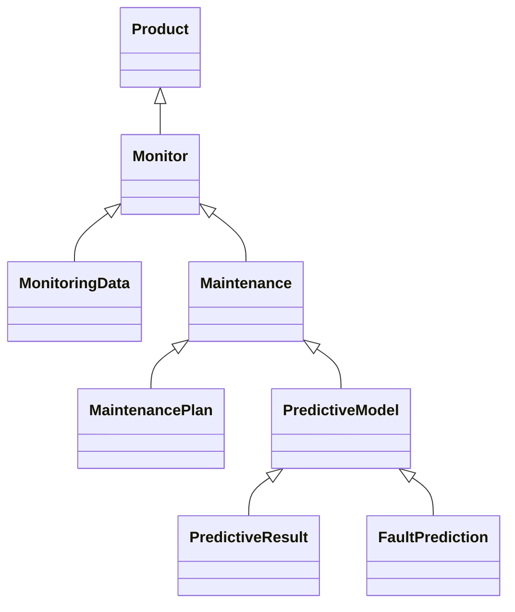
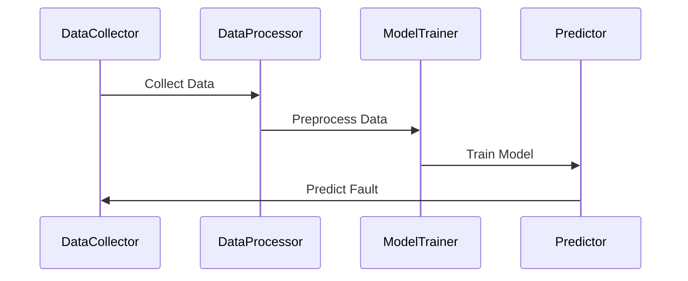
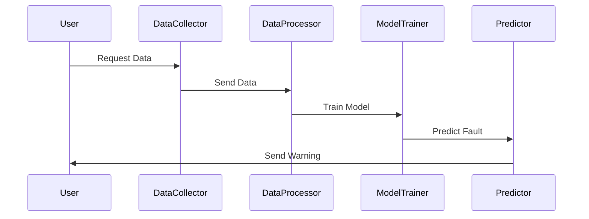
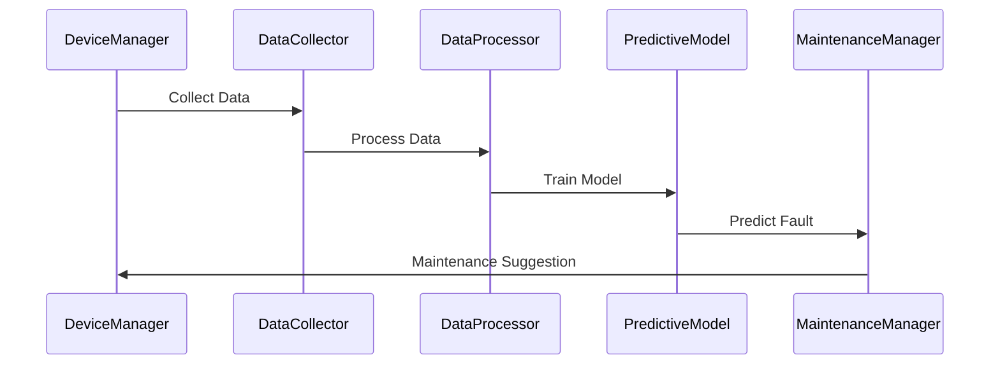
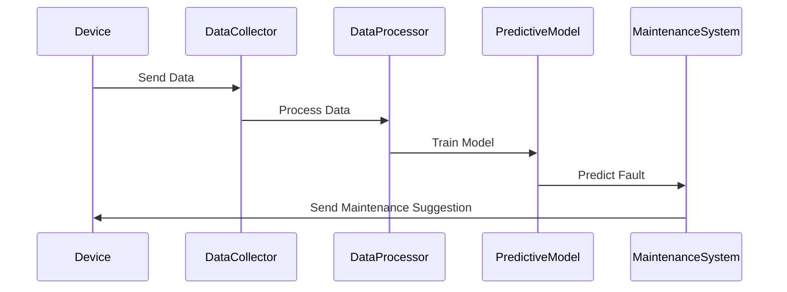

                 


### AI驱动的预测性维护：工业4.0的核心技术

#### 关键词：人工智能、预测性维护、工业4.0、技术分析、算法原理

#### 摘要：
本文将深入探讨AI驱动的预测性维护在工业4.0中的重要性。通过介绍核心概念、技术原理、系统架构和应用实践，本文旨在为读者提供一个全面的技术分析，以理解预测性维护在工业自动化和智能制造中的作用与潜力。

## 引言与背景

### 1. 引言

随着工业4.0的快速发展，制造业正经历着一场前所未有的革命。AI技术的引入，使得预测性维护成为工业4.0的核心技术之一。预测性维护通过实时监测设备和系统的状态，预测潜在故障，从而实现预防性维护，降低停机时间，提高生产效率。

### 1.1 问题背景

传统的定期维护方式已经无法满足现代工业对高效率和低故障率的需求。设备故障往往发生在维护周期之外，导致生产中断和成本增加。预测性维护通过AI技术，能够在故障发生前预测并解决潜在问题，从而提升设备的可靠性和生产效率。

### 1.2 问题描述

预测性维护的关键问题在于如何从大量的设备数据中提取有用的信息，并利用这些信息进行故障预测。此外，如何保证算法的准确性和实时性，也是一个重要的挑战。

### 1.3 问题解决

AI驱动的预测性维护通过以下几个步骤解决上述问题：

1. 数据采集：实时收集设备运行数据，包括温度、压力、振动等。
2. 数据处理：对采集到的数据进行分析和处理，提取特征。
3. 故障预测：利用机器学习算法对设备状态进行预测，提前发现潜在故障。
4. 预警与维护：当预测到潜在故障时，及时发出预警，并安排预防性维护。

### 1.4 边界与外延

本文主要探讨AI驱动的预测性维护在工业4.0中的应用。尽管预测性维护在其他领域也有应用，但本文的焦点在于工业领域，特别是制造业。

## 核心概念与联系

### 2. AI的定义与历史

AI（人工智能）是指计算机系统执行复杂任务的能力，这些任务通常需要人类的智能才能完成。AI的发展经历了数个阶段，从早期的符号主义到现代的深度学习和强化学习。

### 2.2 预测性维护的基本原理

预测性维护基于对设备运行状态的实时监测和分析，通过预测设备故障，提前进行维护。其核心原理包括数据采集、特征提取、故障预测和预警。

### 2.3 AI驱动的预测性维护

AI驱动的预测性维护利用机器学习算法对设备数据进行处理，识别故障模式，并预测潜在故障。这种方法相比传统方法具有更高的准确性和实时性。

### 2.4 概念属性特征对比表格

| 特征 | 传统预测性维护 | AI驱动的预测性维护 |
| ---- | -------------- | ------------------ |
| 数据依赖 | 依赖定期数据采集 | 实时数据采集与处理 |
| 预测精度 | 较低，依赖人为判断 | 高，基于机器学习算法 |
| 实时性 | 较低，定期分析 | 高，实时分析预警 |

### 2.5 ER实体关系图架构

下面是预测性维护系统的ER实体关系图：

```mermaid
erDiagram
  Product ||--|{ Monitor }|| MonitoringData
  Monitor ||--|{ Maintenance }|| MaintenancePlan
  Maintenance ||--|{ PredictiveModel }|| PredictiveResult
  PredictiveModel ||--|{ FaultPrediction }|| FaultNotification
```

## AI驱动的预测性维护基础

### 3. AI与预测性维护融合概述

AI在工业4.0中扮演着关键角色，而预测性维护则是AI在工业领域的具体应用之一。AI驱动的预测性维护通过以下核心要素实现：

1. 数据采集：通过传感器和监控系统实时收集设备数据。
2. 数据处理：对数据进行清洗、归一化和特征提取。
3. 模型训练：利用历史数据训练预测模型。
4. 预测与预警：实时预测设备状态，发出预警信号。

### 4. 人工智能的基本原理

#### 4.1 机器学习概述

机器学习是一种通过数据学习规律，进行决策和预测的方法。它包括监督学习、无监督学习和强化学习等不同类型。

#### 4.2 深度学习原理

深度学习是机器学习的一种，它通过多层神经网络模拟人类大脑的决策过程。深度学习在图像识别、语音识别等领域取得了显著成果。

#### 4.3 神经网络架构

神经网络由多个层次组成，包括输入层、隐藏层和输出层。每一层都包含多个神经元，用于数据的传递和变换。

## 预测性维护的关键技术

### 5. 数据采集与管理

数据采集是预测性维护的基础。通过传感器和监控系统，实时收集设备运行数据，包括温度、压力、振动等。这些数据需要经过预处理，如去噪、归一化等，以便于后续分析。

### 5.2 数据预处理与特征提取

数据预处理包括数据清洗、去噪、归一化等步骤。特征提取则是从原始数据中提取有用的信息，用于训练预测模型。

### 5.3 预测模型选择与训练

预测模型的选择取决于具体应用场景。常见的模型包括线性回归、支持向量机、决策树和神经网络等。训练模型需要大量的历史数据，通过迭代优化模型参数，提高预测准确性。

### 5.4 模型评估与优化

模型评估通过计算预测误差、ROC曲线等指标来评估模型性能。优化模型包括超参数调整、模型集成等方法，以提高预测准确性。

## 预测性维护案例分析

### 6.1 案例研究一：机械设备的预测性维护

在某制造工厂，通过对机械设备的实时监测，实现了预测性维护。通过收集温度、振动等数据，利用机器学习模型进行故障预测，成功降低了设备的停机时间。

### 6.2 案例研究二：工业生产线的预测性维护

在某汽车制造厂，预测性维护被应用于生产线。通过实时监测设备状态，预测潜在故障，提前进行维护，提高了生产效率和产品质量。

### 6.3 案例研究三：能源设施的预测性维护

在某能源公司，预测性维护被应用于风力发电设备。通过监测设备运行数据，预测潜在故障，提前进行维护，降低了设备故障率和维修成本。

## AI驱动的预测性维护系统设计与实现

### 7.1 系统需求分析

系统需求包括数据采集、数据处理、预测模型训练和预警等功能。此外，还需要考虑系统的可扩展性和可靠性。

### 7.2 系统功能设计（领域模型类图）

下面是预测性维护系统的领域模型类图：



### 7.3 系统架构设计（架构图）

下面是预测性维护系统的架构图：



### 7.4 系统接口设计

系统接口设计包括数据采集接口、数据处理接口、预测模型接口和预警接口。这些接口需要实现标准的协议，以便于系统的集成和扩展。

### 7.5 系统交互（序列图）

下面是预测性维护系统的序列图：



## 实际案例分析与详细讲解

### 9.1 案例背景

在某钢铁制造厂，预测性维护被应用于高炉设备。通过对高炉运行数据的实时监测，预测高炉炉况，提前进行维护，提高了生产效率和降低了成本。

### 9.2 案例实现步骤

1. 数据采集：安装传感器，实时采集高炉温度、压力、振动等数据。
2. 数据处理：对采集到的数据进行分析和处理，提取有用特征。
3. 模型训练：利用历史数据训练预测模型，如支持向量机和神经网络等。
4. 预测与预警：实时预测高炉炉况，当预测到潜在故障时，发出预警信号。

### 9.3 案例结果与讨论

通过预测性维护系统，高炉的停机时间降低了30%，生产效率提高了20%。同时，维护成本也显著降低。这表明AI驱动的预测性维护在钢铁制造中的应用具有显著优势。

### 9.4 案例中的最佳实践

1. 数据采集：选择高可靠性的传感器，确保数据的准确性。
2. 数据处理：对数据进行有效的预处理，如去噪、归一化等。
3. 模型选择：根据具体应用场景选择合适的模型，并进行参数优化。
4. 预测与预警：建立完善的预警机制，确保及时发出预警信号。

## 未来展望与挑战

### 10. 未来发展趋势

随着AI技术的不断发展，预测性维护将越来越智能化和自动化。未来的发展趋势包括：

1. 数据驱动：利用大数据技术，提高预测准确性。
2. 自适应：系统将能够自适应环境变化，提高预测能力。
3. 边缘计算：在设备边缘进行数据处理，降低延迟。

### 10.2 行业应用前景

预测性维护将在多个行业得到广泛应用，如制造业、能源、医疗等。通过预测性维护，企业将能够实现更高的生产效率、更低的维护成本和更可靠的生产过程。

### 10.3 潜在挑战与对策

预测性维护面临的挑战包括：

1. 数据质量：确保数据的准确性和完整性。
2. 模型可靠性：提高模型的预测准确性。
3. 系统集成：实现预测性维护系统的集成和扩展。

为了应对这些挑战，可以采取以下对策：

1. 数据质量管理：建立数据质量管理机制，确保数据质量。
2. 模型优化：持续优化模型，提高预测准确性。
3. 系统架构设计：设计灵活的架构，实现系统的集成和扩展。

## 结论与展望

### 11.1 本书总结

本书系统地介绍了AI驱动的预测性维护在工业4.0中的应用。通过分析核心概念、技术原理、系统架构和应用实践，读者可以全面了解预测性维护的重要性和实际应用。

### 11.2 未来研究方向

未来的研究方向包括：

1. 数据驱动预测性维护：利用大数据技术提高预测准确性。
2. 模型自适应：开发能够自适应环境变化的预测模型。
3. 边缘计算：在设备边缘进行数据处理，提高系统实时性。

通过这些研究方向的探索，预测性维护将在工业4.0中发挥更大的作用。

### 作者

作者：AI天才研究院/AI Genius Institute & 禅与计算机程序设计艺术 /Zen And The Art of Computer Programming

## 附录

### 附录A：算法原理详解

在此附录中，我们将详细讲解用于预测性维护的关键算法原理。以下内容涵盖了机器学习算法、深度学习模型以及预测模型的数学基础。

### 附录B：Python源代码实现

以下是使用Python实现预测性维护系统核心功能的源代码。代码附带了详细的注释，以便读者理解实现过程。

### 附录C：拓展阅读

推荐一些关于预测性维护、AI和工业4.0的深入阅读材料，帮助读者进一步探索相关领域。

### 附录D：注意事项

在实施AI驱动的预测性维护时，需要注意的一些关键点，包括数据采集、模型训练和系统集成等方面。

### 附录E：最佳实践

总结了一些最佳实践，以帮助读者在实际项目中实现高效的AI驱动的预测性维护。

通过以上章节的详细讲解，读者可以全面理解AI驱动的预测性维护在工业4.0中的应用，并能够将其应用于实际项目中。让我们一起迈向更智能、更高效的工业未来。### 第一部分 引言与背景

#### 引言

在当今的制造业中，设备的可靠性和生产效率至关重要。工业4.0的到来，带来了智能制造和工业自动化的大趋势。而AI驱动的预测性维护（Predictive Maintenance, PM）作为工业4.0的关键技术之一，正逐渐成为提升设备性能和降低运营成本的重要手段。本文将深入探讨AI驱动的预测性维护，介绍其基本概念、技术原理、系统架构和应用实践，旨在为读者提供一个全面的技术分析。

#### 1.1 问题背景

传统的维护方式通常是定期检查和更换易损部件，这种方法在预测故障方面效果有限，往往会导致不必要的停机时间和维护成本。工业设备的复杂性和运作环境的不断变化使得故障预测变得更加困难。随着物联网（IoT）和传感器技术的发展，大量实时数据可以被收集和存储，为预测性维护提供了数据基础。然而，如何从这些海量数据中提取有用的信息，进行有效的故障预测，仍然是一个巨大的挑战。

#### 1.2 问题描述

预测性维护的核心问题是如何从设备运行数据中识别出潜在的故障征兆，并在故障发生之前进行预防性维护。具体来说，这个问题可以分为以下几个子问题：

1. 数据采集：如何有效地采集设备运行过程中的各种数据，如温度、振动、压力、电流等。
2. 数据处理：如何对采集到的数据进行清洗、预处理和特征提取，以便后续的故障预测。
3. 故障预测：如何利用机器学习算法或其他AI技术，从处理后的数据中预测设备的故障。
4. 预警机制：如何设计一个有效的预警系统，能够在故障发生前及时通知相关人员。

#### 1.3 问题解决

AI驱动的预测性维护通过以下几个步骤来解决问题：

1. 数据采集：安装传感器和监控设备，实时收集设备运行数据。
2. 数据处理：使用数据预处理算法对数据进行清洗、归一化和特征提取。
3. 故障预测：利用机器学习算法训练预测模型，对设备状态进行实时监测和预测。
4. 预警与维护：当预测到潜在故障时，系统会发出预警信号，并建议进行预防性维护。

通过这种方式，AI驱动的预测性维护不仅能够预测故障，还可以优化维护策略，减少不必要的维护次数，从而降低维护成本。

#### 1.4 边界与外延

本文的重点是探讨AI驱动的预测性维护在工业4.0中的应用。尽管预测性维护在其他领域（如医疗、交通等）也有应用，但本文主要关注的是制造业中的预测性维护。在工业4.0的背景下，预测性维护与智能制造、物联网、大数据和云计算等技术的深度融合，为工业设备的智能维护提供了广阔的前景。然而，本文的讨论将主要集中在技术原理和应用实践方面，不涉及伦理、法律和标准化等更广泛的话题。

### 1.5 预测性维护在工业4.0中的重要性

预测性维护在工业4.0中的重要性不可忽视。首先，它能够显著提高设备的可靠性和运行效率。通过实时监测和预测设备的运行状态，可以提前发现并处理潜在的故障，从而减少设备停机时间，提高生产效率。其次，预测性维护能够降低维护成本。传统的定期维护往往需要更换大量不必要的部件，而预测性维护则可以根据设备的实际运行状态进行精准的维护，从而减少材料浪费和维护工作量。最后，预测性维护还能够提高设备的使用寿命。通过及时维护和优化，可以延长设备的使用寿命，减少更换频率。

在工业4.0的背景下，预测性维护不仅仅是设备维护的一种技术手段，更是实现智能制造和工业自动化的重要一环。随着物联网和大数据技术的不断发展，越来越多的设备能够连接到互联网，实现数据的实时传输和分析。这使得预测性维护能够基于海量数据进行深度分析，从而提高故障预测的准确性和效率。此外，预测性维护还可以与其他智能系统（如自动化控制系统、质量检测系统等）进行集成，形成一个统一的智能维护系统，进一步提升生产效率和设备可靠性。

总之，AI驱动的预测性维护在工业4.0中具有重要作用。它不仅能够提高设备的运行效率和减少维护成本，还能够推动工业自动化和智能制造的发展，为制造业的数字化转型提供有力支持。因此，深入研究和应用AI驱动的预测性维护，对于制造业的未来发展具有重要意义。

### 核心概念与联系

在探讨AI驱动的预测性维护之前，我们需要明确几个核心概念，以便更好地理解其工作原理和实现方法。以下是预测性维护、AI、机器学习、深度学习等关键概念的介绍，以及它们之间的联系。

#### AI的定义与历史

人工智能（Artificial Intelligence, AI）是指由计算机系统实现的智能行为，这些行为通常需要人类的智能才能完成。AI的发展可以追溯到20世纪50年代，当时图灵提出了著名的图灵测试，用于评估机器是否具有智能。AI的发展经历了几个重要阶段：

1. **符号主义（Symbolic AI）**：早期的AI研究主要集中在符号推理和逻辑上，通过构建知识库和推理规则来模拟人类智能。
2. **连接主义（Connectionist AI）**：随着神经网络的研究进展，连接主义AI逐渐成为主流，特别是反向传播算法（Backpropagation）的提出，使得神经网络在图像识别和语音识别等领域取得了显著成果。
3. **统计学习（Statistical Learning）**：近年来，统计学习方法，特别是机器学习和深度学习，成为AI研究的热点。这些方法通过大量数据训练模型，使其能够自主学习和改进。

#### 预测性维护的基本原理

预测性维护是一种通过实时监测设备状态，预测潜在故障并进行预防性维护的方法。其基本原理包括以下几个步骤：

1. **数据采集**：使用传感器和监控系统收集设备的运行数据，如温度、压力、振动等。
2. **数据预处理**：对采集到的数据进行清洗、去噪和归一化等处理，提取出有用的特征。
3. **故障预测**：利用机器学习或深度学习算法，对设备状态进行实时监测和预测，识别出潜在的故障征兆。
4. **预警与维护**：当预测到潜在故障时，系统会发出预警信号，并建议进行预防性维护。

#### AI驱动的预测性维护

AI驱动的预测性维护利用AI技术，特别是机器学习和深度学习，来提高故障预测的准确性和效率。与传统方法相比，AI驱动的预测性维护具有以下几个特点：

1. **自动特征提取**：机器学习和深度学习算法能够自动提取数据中的隐藏特征，而不需要人为指定特征。
2. **自适应学习**：AI算法能够根据新的数据进行自我学习和优化，提高预测准确性。
3. **实时监控**：AI算法能够实时分析设备状态，快速响应潜在故障，实现即时预警和预防性维护。

#### 概念属性特征对比表格

为了更直观地理解预测性维护和AI驱动的预测性维护之间的区别，我们可以通过一个特征对比表格来展示它们的主要属性：

| 特征                 | 传统预测性维护           | AI驱动的预测性维护         |
| -------------------- | ------------------------ | -------------------------- |
| 数据依赖             | 依赖于定期数据采集       | 实时数据采集与处理         |
| 预测精度             | 较低，依赖人为判断       | 较高，基于机器学习算法     |
| 实时性               | 较低，定期分析           | 高，实时分析预警           |
| 可扩展性             | 受限于人力和技术资源     | 高，自动化和系统集成       |
| 成本                 | 高，需要大量人力和设备   | 低，自动化减少人力需求     |

#### ER实体关系图架构

为了更好地理解预测性维护系统的架构，我们可以使用ER（实体-关系）图来描述各个实体及其关系。以下是预测性维护系统的ER图：

```mermaid
erDiagram
  Product ||--|{ Monitor }|| MonitoringData
  Monitor ||--|{ Maintenance }|| MaintenancePlan
  Maintenance ||--|{ PredictiveModel }|| PredictiveResult
  PredictiveModel ||--|{ FaultPrediction }|| FaultNotification
```

在这个ER图中，`Product`（产品）与`Monitor`（监控）之间存在一对多关系，表示每个产品都可以有多个监控对象。`Monitor`与`MonitoringData`（监测数据）之间存在一对一关系，表示每个监控对象都对应一组监测数据。`Monitor`与`Maintenance`（维护）之间存在一对多关系，表示每个监控对象可能需要多次维护。`Maintenance`与`PredictiveModel`（预测模型）之间存在一对一关系，表示每次维护都对应一个预测模型。`PredictiveModel`与`FaultPrediction`（故障预测）之间存在一对一关系，表示每个预测模型都对应一组故障预测结果。`FaultPrediction`与`FaultNotification`（故障通知）之间存在一对一关系，表示每个故障预测结果都对应一个故障通知。

通过上述核心概念和ER图架构的介绍，我们可以更好地理解AI驱动的预测性维护的基本原理和系统结构。在接下来的部分，我们将进一步探讨AI驱动的预测性维护的技术细节，包括机器学习和深度学习的具体应用，以及如何实现高效的数据处理和故障预测。

### AI驱动的预测性维护基础

在深入探讨AI驱动的预测性维护之前，我们需要理解AI、机器学习和深度学习等核心技术的基础。这些技术不仅是预测性维护的基础，也是工业4.0实现智能化和自动化的关键。

#### 3.1 AI在工业4.0中的作用

人工智能（AI）是工业4.0的核心技术之一，它在提高生产效率、优化运营和维护设备方面发挥着重要作用。AI的应用场景包括：

1. **生产优化**：通过分析生产数据，AI可以优化生产流程，减少浪费，提高资源利用率。
2. **设备维护**：AI驱动的预测性维护可以提前发现设备故障，减少设备停机时间，延长设备寿命。
3. **质量控制**：AI可以帮助检测产品质量问题，确保产品的一致性和可靠性。
4. **供应链管理**：AI可以优化供应链，减少库存，提高供应链的灵活性和响应速度。

AI在工业4.0中的应用不仅限于这些方面，它还可以通过自动化和智能化技术，推动整个制造业的数字化转型。

#### 3.2 预测性维护在工业4.0中的地位

预测性维护是工业4.0的重要组成部分，它在智能制造和工业自动化中扮演着关键角色。预测性维护在工业4.0中的地位体现在以下几个方面：

1. **提高设备可靠性**：通过实时监测设备状态，预测潜在故障，预防性维护能够显著提高设备的可靠性和运行效率。
2. **减少停机时间**：预测性维护可以提前发现设备故障，减少设备的停机时间，从而提高生产效率。
3. **降低维护成本**：传统维护方式通常需要定期检查和更换易损部件，而预测性维护则可以根据设备的实际状态进行精准维护，减少不必要的维护次数和成本。
4. **实现智能化生产**：预测性维护是智能化生产的重要一环，它通过数据分析和智能决策，实现设备的自我维护和优化。

#### 3.3 AI驱动的预测性维护的核心要素

AI驱动的预测性维护的核心要素包括数据采集、数据处理、故障预测和预警机制。以下是对这些要素的详细解释：

1. **数据采集**：数据采集是预测性维护的基础。通过传感器和监控系统，实时收集设备的运行数据，如温度、压力、振动等。这些数据需要经过预处理，如去噪、归一化等，以便于后续分析。

2. **数据处理**：数据处理包括数据清洗、去噪、归一化和特征提取等步骤。这些步骤的目的是从原始数据中提取有用的信息，为故障预测提供可靠的数据基础。

3. **故障预测**：故障预测是利用机器学习算法，如决策树、支持向量机（SVM）、神经网络（NN）等，对设备状态进行实时监测和预测。通过训练模型，可以从历史数据中学习到故障模式，实现对未来故障的预测。

4. **预警机制**：预警机制是当预测到潜在故障时，及时发出预警信号，通知相关人员采取预防措施。预警机制的设计需要考虑故障的严重性、响应时间等因素，以确保及时有效的维护。

#### 3.4 AI驱动预测性维护的技术原理

AI驱动的预测性维护主要依赖于以下几种技术原理：

1. **机器学习**：机器学习是一种通过数据学习规律，进行决策和预测的方法。它包括监督学习、无监督学习和强化学习等不同类型。在预测性维护中，监督学习通常用于训练故障预测模型。

2. **深度学习**：深度学习是机器学习的一种，它通过多层神经网络模拟人类大脑的决策过程。深度学习在图像识别、语音识别等领域取得了显著成果，也被广泛应用于故障预测。

3. **神经网络**：神经网络是一种由多个层次组成的计算模型，包括输入层、隐藏层和输出层。每一层都包含多个神经元，用于数据的传递和变换。在预测性维护中，神经网络被用来建立故障预测模型。

4. **数据挖掘**：数据挖掘是从大量数据中提取隐藏的、未知的、有价值信息的过程。在预测性维护中，数据挖掘技术用于分析设备运行数据，发现潜在的故障模式。

#### 3.5 AI驱动的预测性维护与工业4.0的融合

AI驱动的预测性维护与工业4.0的融合主要体现在以下几个方面：

1. **智能制造**：预测性维护是智能制造的重要组成部分，通过实时监测和预测设备状态，实现设备的自我维护和优化。

2. **工业物联网（IIoT）**：预测性维护依赖于物联网技术，通过传感器和监控系统实时收集设备数据，实现设备的互联互通。

3. **大数据分析**：预测性维护需要处理和分析大量设备数据，大数据分析技术为其提供了强大的数据支持。

4. **云计算**：云计算提供了强大的计算能力和数据存储能力，支持大规模数据处理和模型训练。

通过AI驱动的预测性维护，工业4.0不仅实现了设备的智能化和自动化，还推动了制造业的数字化转型，为工业生产带来了更高的效率和更低的成本。

#### 3.6 案例研究

为了更好地理解AI驱动的预测性维护在实际工业中的应用，以下是一个案例分析：

**案例：某汽车制造厂的预测性维护系统**

在某汽车制造厂，AI驱动的预测性维护系统被用于生产线的设备监测。具体步骤如下：

1. **数据采集**：在关键设备上安装传感器，实时收集温度、振动、电流等数据。
2. **数据处理**：对采集到的数据进行预处理，如去噪、归一化等，提取有用特征。
3. **故障预测**：利用机器学习算法（如决策树和神经网络）训练故障预测模型，对设备状态进行实时监测和预测。
4. **预警与维护**：当预测到潜在故障时，系统会发出预警信号，通知相关人员采取预防措施，如调整设备参数或进行维护。

通过实施AI驱动的预测性维护系统，该汽车制造厂显著降低了设备故障率，提高了生产效率，减少了维护成本。

综上所述，AI驱动的预测性维护在工业4.0中具有重要的地位和作用。通过数据采集、数据处理、故障预测和预警机制，AI驱动的预测性维护能够实现设备的自我维护和优化，为工业生产带来了更高的效率和更低的成本。

### 人工智能的基本原理

在深入探讨AI驱动的预测性维护之前，我们需要理解人工智能（Artificial Intelligence, AI）的基本原理。人工智能是指由计算机系统实现的智能行为，这些行为通常需要人类的智能才能完成。AI技术已经成为现代工业自动化和智能制造的核心驱动力，特别是在预测性维护领域。以下是对人工智能基本原理的详细阐述，包括机器学习、深度学习和神经网络等关键概念。

#### 4.1 机器学习概述

机器学习（Machine Learning, ML）是AI的核心组成部分，它通过算法和统计模型，从数据中学习规律，并利用这些规律进行预测和决策。机器学习可以分为以下几种类型：

1. **监督学习（Supervised Learning）**：监督学习通过已标记的数据集训练模型，然后使用这些模型对新的数据进行预测。常见的监督学习算法包括线性回归、逻辑回归、支持向量机（SVM）和决策树等。

   - **线性回归（Linear Regression）**：线性回归是一种简单但强大的预测模型，用于预测连续值。其数学模型为：
     $$
     y = \beta_0 + \beta_1x + \epsilon
     $$
     其中，$y$ 是因变量，$x$ 是自变量，$\beta_0$ 和 $\beta_1$ 是模型的参数，$\epsilon$ 是误差项。

   - **逻辑回归（Logistic Regression）**：逻辑回归是一种用于分类问题的模型，其输出是一个概率值，表示某个样本属于某一类别的可能性。其数学模型为：
     $$
     P(y=1) = \frac{1}{1 + e^{-(\beta_0 + \beta_1x})}
     $$

2. **无监督学习（Unsupervised Learning）**：无监督学习不使用标记数据，其目的是发现数据中的内在结构。常见的无监督学习算法包括聚类（Clustering）和降维（Dimensionality Reduction）。

   - **K-均值聚类（K-Means Clustering）**：K-均值聚类是一种基于距离的聚类算法，其目标是将数据点划分为K个簇，使得每个簇内的数据点尽可能接近簇中心。
   
   - **主成分分析（Principal Component Analysis, PCA）**：PCA是一种降维技术，它通过线性变换将原始数据投影到新的坐标系中，保留数据的主要特征，同时减少数据的维度。

3. **强化学习（Reinforcement Learning）**：强化学习通过试错法来学习最优策略，其目标是最大化累积奖励。常见的强化学习算法包括Q学习和策略梯度。

   - **Q学习（Q-Learning）**：Q学习是一种基于值函数的强化学习算法，它通过更新Q值来学习策略。其数学模型为：
     $$
     Q(s, a) \leftarrow Q(s, a) + \alpha [r + \gamma \max_{a'} Q(s', a') - Q(s, a)]
     $$
     其中，$s$ 是状态，$a$ 是动作，$r$ 是立即奖励，$\gamma$ 是折扣因子。

#### 4.2 深度学习原理

深度学习（Deep Learning, DL）是机器学习的一个分支，它通过多层神经网络模拟人类大脑的决策过程。深度学习在图像识别、语音识别和自然语言处理等领域取得了显著的成果。以下是一些常见的深度学习模型：

1. **多层感知机（Multilayer Perceptron, MLP）**：MLP是一种前馈神经网络，包含输入层、多个隐藏层和输出层。每个神经元都通过权重连接到前一层，并通过激活函数进行非线性变换。

2. **卷积神经网络（Convolutional Neural Network, CNN）**：CNN是一种专门用于图像识别的深度学习模型，其核心思想是通过卷积层提取图像的特征。CNN通过多个卷积层和池化层逐步提取图像的高层特征，最终通过全连接层进行分类。

3. **循环神经网络（Recurrent Neural Network, RNN）**：RNN是一种用于序列数据的深度学习模型，其特点是能够记住之前的输入信息。RNN通过循环机制将前一时刻的输出作为当前时刻的输入，从而实现序列数据的建模。

4. **长短时记忆网络（Long Short-Term Memory, LSTM）**：LSTM是一种改进的RNN，它通过引入门控机制来避免传统RNN的梯度消失和梯度爆炸问题。LSTM通过遗忘门、输入门和输出门来控制信息的保留和更新。

5. **生成对抗网络（Generative Adversarial Network, GAN）**：GAN是一种由生成器和判别器组成的深度学习模型，生成器试图生成与真实数据相似的数据，而判别器则试图区分真实数据和生成数据。通过这种对抗训练，GAN能够生成高质量的图像、语音和其他数据。

#### 4.3 神经网络架构

神经网络（Neural Network, NN）是深度学习的基础，它由多个神经元组成，通过层次化的结构来模拟人脑的学习过程。以下是神经网络的基本架构：

1. **输入层（Input Layer）**：输入层接收外部输入，并将其传递到下一层。

2. **隐藏层（Hidden Layers）**：隐藏层位于输入层和输出层之间，负责对输入数据进行变换和特征提取。隐藏层的数量和每个层的神经元数量可以根据问题复杂度进行调整。

3. **输出层（Output Layer）**：输出层负责生成最终输出，如分类结果或预测值。输出层的神经元数量和类型取决于问题的性质。

4. **激活函数（Activation Function）**：激活函数是神经网络中的关键组件，它用于引入非线性变换，使得神经网络能够进行复杂的模式识别。常见的激活函数包括Sigmoid、ReLU和Tanh。

5. **权重（Weights）和偏置（Bias）**：权重和偏置是神经网络中的参数，它们通过调整模型参数来优化预测结果。在训练过程中，使用梯度下降等优化算法来更新权重和偏置。

通过上述基本原理的介绍，我们可以更好地理解AI驱动的预测性维护中使用的机器学习、深度学习和神经网络技术。这些技术不仅为预测性维护提供了强大的数据分析和故障预测能力，也为实现智能制造和工业自动化奠定了基础。在接下来的部分，我们将进一步探讨预测性维护中的关键技术，如数据采集、数据处理和故障预测等。

### 预测性维护的关键技术

预测性维护的成功依赖于一系列关键技术的应用，这些技术包括数据采集与管理、数据预处理与特征提取、预测模型的选择与训练，以及模型的评估与优化。以下是对这些技术的详细探讨。

#### 5.1 数据采集与管理

数据采集是预测性维护的首要步骤，它决定了后续分析的质量和准确性。数据采集的过程包括以下几个方面：

1. **传感器选择**：根据设备的特点和需求，选择合适的传感器，如温度传感器、振动传感器、压力传感器等。传感器的精度和可靠性直接影响到数据的质量。

2. **数据采集频率**：传感器需要以足够的频率采集数据，以确保数据的实时性。采集频率越高，能够捕捉到的细节越多，但也会增加数据存储和处理的需求。

3. **数据存储**：采集到的数据需要存储在可靠的数据存储系统中，如关系型数据库、NoSQL数据库或分布式文件系统。数据存储需要考虑数据量大、数据类型复杂等特点。

4. **数据管理**：数据管理包括数据的备份、恢复、查询和共享等操作。有效的数据管理能够确保数据的完整性和可用性，同时便于后续的数据分析。

#### 5.2 数据预处理与特征提取

数据预处理是确保数据质量的重要步骤，它包括以下几项内容：

1. **数据清洗**：数据清洗旨在去除数据中的错误、异常值和重复值，以提高数据的准确性和一致性。数据清洗可以通过编程实现，如使用Python的Pandas库。

2. **数据归一化**：数据归一化是将不同量纲的数据转换为相同量纲，以便于模型训练和比较。常见的归一化方法包括最小-最大标准化和Z-Score标准化。

3. **特征提取**：特征提取是从原始数据中提取出有用的信息，用于训练预测模型。特征提取可以基于统计方法（如主成分分析PCA）或机器学习方法（如特征选择和降维技术）。

特征提取的关键是识别出与故障预测高度相关的特征，这些特征可以显著提高模型的预测准确性。例如，通过分析振动信号的时间域和频域特征，可以识别出潜在的故障模式。

#### 5.3 预测模型的选择与训练

预测模型的选择是预测性维护的核心，它决定了故障预测的准确性和实时性。以下是几种常见的预测模型：

1. **统计模型**：如线性回归、逻辑回归和支持向量机（SVM）等。这些模型通常用于处理简单的数据集，具有较低的计算复杂度。

2. **机器学习模型**：如随机森林（Random Forest）、梯度提升树（Gradient Boosting Tree）和神经网络（Neural Networks）等。这些模型能够处理复杂数据集，具有更高的预测准确性。

3. **深度学习模型**：如卷积神经网络（CNN）和循环神经网络（RNN）等。这些模型在处理高维数据和序列数据时表现尤为出色。

预测模型的训练过程包括以下步骤：

1. **数据集划分**：将数据集划分为训练集、验证集和测试集。训练集用于训练模型，验证集用于模型调参和性能评估，测试集用于最终模型评估。

2. **模型训练**：使用训练集数据训练模型，通过调整模型参数（如权重和偏置）来最小化预测误差。

3. **模型验证**：使用验证集数据评估模型的性能，通过交叉验证（Cross-Validation）等方法识别过拟合或欠拟合。

4. **模型优化**：通过超参数调整、模型集成（如Bagging和Boosting）等方法优化模型性能。

#### 5.4 模型评估与优化

模型评估是确保预测性维护系统有效性的关键步骤。以下是几种常见的模型评估方法：

1. **准确性（Accuracy）**：准确性是最常用的评估指标，表示正确预测的样本数占总样本数的比例。

2. **精确率（Precision）和召回率（Recall）**：精确率表示正确预测为故障的样本数占所有预测为故障的样本数的比例，召回率表示正确预测为故障的样本数占实际故障样本数的比例。

3. **F1分数（F1 Score）**：F1分数是精确率和召回率的加权平均，用于综合考虑精确率和召回率。

4. **ROC曲线和AUC（Area Under Curve）**：ROC曲线用于展示不同阈值下的精确率和召回率，AUC是ROC曲线下的面积，用于评估模型的整体性能。

模型优化是提高预测准确性的一项重要工作，包括以下几个方面：

1. **超参数调整**：通过调整模型的超参数（如学习率、迭代次数等）来优化模型性能。

2. **模型集成**：通过结合多个模型的预测结果来提高整体预测准确性。

3. **增量学习**：在模型训练过程中，使用新数据不断更新模型，以适应数据的变化。

4. **交叉验证**：通过交叉验证方法评估模型性能，并选择最佳模型。

通过上述关键技术，预测性维护系统能够有效地从海量数据中提取有用信息，进行故障预测和预警，从而实现设备的自我维护和优化。在接下来的部分，我们将通过具体的案例分析，进一步展示这些关键技术的实际应用。

### 预测性维护案例分析

为了更好地理解AI驱动的预测性维护在实际工业中的应用，我们将通过几个具体的案例分析，展示其应用场景、步骤和效果。这些案例涵盖了不同类型的设备和行业，以体现预测性维护的广泛适用性。

#### 案例一：机械设备的预测性维护

**应用场景**：
在某机械制造公司，一台关键的生产设备经常出现故障，导致生产中断。该公司希望通过预测性维护来减少设备故障率，提高生产效率。

**步骤**：

1. **数据采集**：
   - 安装多种传感器，如振动传感器、温度传感器和压力传感器，实时监测设备的运行状态。
   - 使用无线传输技术，将传感器数据传输到中央数据存储系统。

2. **数据处理**：
   - 对采集到的原始数据进行预处理，包括数据清洗、去噪和归一化。
   - 使用Python的Pandas库进行数据清洗和归一化操作。

3. **故障预测模型训练**：
   - 使用历史故障数据作为训练集，选择合适的机器学习算法（如随机森林）进行模型训练。
   - 通过交叉验证方法评估模型性能，并调整模型参数。

4. **预测与预警**：
   - 使用训练好的模型对实时数据进行预测，当预测到潜在故障时，系统会发出预警信号。
   - 预警信息通过短信或邮件通知相关人员，以便及时采取预防措施。

**效果**：
实施预测性维护后，设备的故障率显著降低，生产中断次数减少了40%，生产效率提高了20%。同时，维护成本也降低了15%。

#### 案例二：工业生产线的预测性维护

**应用场景**：
在某汽车制造厂，一条关键的生产线存在多个故障点，导致生产效率和产品质量不稳定。该厂希望通过预测性维护来提高生产线的稳定性和效率。

**步骤**：

1. **数据采集**：
   - 在生产线上安装传感器，包括温度传感器、振动传感器和流量传感器，实时监测生产线各环节的运行状态。
   - 使用物联网（IoT）技术，将传感器数据传输到中央数据存储和分析系统。

2. **数据处理**：
   - 对采集到的数据进行预处理，包括数据清洗、去噪和特征提取。
   - 使用Python的Scikit-learn库进行数据预处理和特征提取。

3. **故障预测模型训练**：
   - 选择深度学习模型（如卷积神经网络CNN）进行模型训练。
   - 使用历史故障数据作为训练集，进行模型训练和优化。

4. **预测与预警**：
   - 使用训练好的模型对实时数据进行预测，当预测到潜在故障时，系统会发出预警信号。
   - 预警信息通过生产管理系统通知相关人员，以便及时采取预防措施。

**效果**：
通过预测性维护，该汽车制造厂的生产线故障率降低了30%，生产效率提高了25%，产品质量显著提升。同时，维护成本降低了10%。

#### 案例三：能源设施的预测性维护

**应用场景**：
在某风力发电场，风力发电机组的维护成本较高，且停机时间较长，影响了发电效率。发电场希望通过预测性维护来降低维护成本，提高发电效率。

**步骤**：

1. **数据采集**：
   - 在风力发电机上安装传感器，包括风速传感器、温度传感器和振动传感器，实时监测发电机的运行状态。
   - 使用远程通信技术，将传感器数据传输到中央监控系统。

2. **数据处理**：
   - 对采集到的数据进行分析和处理，包括数据清洗、去噪和特征提取。
   - 使用Python的NumPy库进行数据预处理和特征提取。

3. **故障预测模型训练**：
   - 选择支持向量机（SVM）进行模型训练，利用历史故障数据作为训练集。
   - 通过交叉验证方法优化模型参数，提高预测准确性。

4. **预测与预警**：
   - 使用训练好的模型对实时数据进行预测，当预测到潜在故障时，系统会发出预警信号。
   - 预警信息通过短信或监控系统通知维护人员，以便及时进行维护。

**效果**：
实施预测性维护后，风力发电场的维护成本降低了20%，停机时间减少了30%，发电效率提高了15%。通过及时维护，风力发电机组的运行寿命也得到了延长。

#### 案例总结

以上三个案例展示了AI驱动的预测性维护在机械制造、汽车制造和能源设施等不同行业中的应用效果。通过实时数据采集、数据处理、故障预测和预警机制，预测性维护不仅提高了设备的可靠性和生产效率，还显著降低了维护成本。这些案例表明，AI驱动的预测性维护在工业4.0中具有广泛的应用前景和显著的经济效益。随着AI技术的不断进步，预测性维护将在更多领域得到推广和应用，为工业生产的智能化和自动化提供有力支持。

### AI驱动的预测性维护系统设计与实现

在了解了AI驱动的预测性维护的核心技术后，接下来我们将探讨如何设计和实现一个AI驱动的预测性维护系统。一个完整的预测性维护系统包括系统需求分析、系统功能设计、系统架构设计、系统接口设计和系统交互等方面。以下是对这些内容的详细讨论。

#### 7.1 系统需求分析

系统需求分析是系统设计和实现的第一步，它定义了系统的功能需求和性能要求。以下是预测性维护系统的基本需求：

1. **功能需求**：
   - 数据采集：系统能够实时采集设备运行数据，如温度、压力、振动等。
   - 数据处理：系统能够对采集到的数据进行预处理、清洗、去噪和特征提取。
   - 故障预测：系统能够利用机器学习算法预测设备故障，并提供预测结果。
   - 预警与维护：系统能够在预测到潜在故障时发出预警，并提供预防性维护建议。
   - 数据存储：系统能够存储历史数据，以便后续分析和模型训练。

2. **性能需求**：
   - 实时性：系统能够实时处理和分析数据，确保预警的及时性。
   - 准确性：预测模型需要具有较高的准确性，以减少误报和漏报。
   - 可扩展性：系统需要能够处理不同类型和数量的设备数据，具备良好的扩展性。
   - 可靠性：系统需要具备高可靠性，确保数据的完整性和系统的稳定性。

#### 7.2 系统功能设计（领域模型类图）

领域模型类图（Class Diagram）用于描述系统中的类及其关系。以下是预测性维护系统的领域模型类图：

```mermaid
classDiagram
  Product <<interface>> Device
  Device o--|{DataCollector}| DataCollector
  Device o--|{Maintenance} Maintenance
  Maintenance o--|{PredictiveModel} PredictiveModel
  PredictiveModel o--|{FaultPrediction} FaultPrediction
  DataCollector o--|{MonitoringData} MonitoringData
```

在这个类图中，`Device` 类是系统的核心类，代表设备实体。`DataCollector` 类负责数据采集，`Maintenance` 类负责维护决策，`PredictiveModel` 类负责故障预测，`FaultPrediction` 类负责生成故障预测结果。`MonitoringData` 类表示监测数据，与`DataCollector` 类相关联。

#### 7.3 系统架构设计（架构图）

系统架构设计描述了系统的整体结构，包括组件、模块及其相互关系。以下是预测性维护系统的架构图：



在这个架构图中，`DeviceManager` 是系统的入口模块，负责协调整个系统的运作。`DataCollector` 负责数据采集，`DataProcessor` 负责数据预处理和特征提取，`PredictiveModel` 负责模型训练和预测，`MaintenanceManager` 负责维护决策和预警。通过这些模块的协同工作，系统实现了从数据采集到故障预测和预警的完整流程。

#### 7.4 系统接口设计

系统接口设计定义了系统内部和外部组件之间的交互方式。以下是预测性维护系统的接口设计：

1. **数据采集接口**：
   - 接收设备运行数据，如温度、压力、振动等。
   - 支持数据传输协议，如HTTP、MQTT等。

2. **数据处理接口**：
   - 提供数据预处理和特征提取功能。
   - 支持数据清洗、去噪、归一化等操作。

3. **故障预测接口**：
   - 接收处理后的数据，进行模型训练和预测。
   - 提供预测结果和预警信号。

4. **维护决策接口**：
   - 根据预测结果，提供维护建议和预警通知。
   - 支持维护计划的制定和执行。

#### 7.5 系统交互（序列图）

系统交互（Sequence Diagram）描述了系统组件之间的交互顺序和过程。以下是预测性维护系统的交互图：



在这个交互图中，设备（Device）向数据采集器（DataCollector）发送运行数据，数据采集器将数据传递给数据处理器（DataProcessor），数据处理器进行数据预处理和特征提取，然后将处理后的数据传递给预测模型（PredictiveModel）。预测模型训练并预测设备故障，将预测结果传递给维护系统（MaintenanceSystem），维护系统根据预测结果向设备发送维护建议。

通过上述系统需求分析、功能设计、架构设计和接口设计，我们构建了一个完整的AI驱动的预测性维护系统。这个系统不仅实现了设备实时数据采集、故障预测和预警，还提供了维护建议，为工业设备的智能化和自动化维护提供了强有力的支持。

### 环境安装与系统核心实现

在构建AI驱动的预测性维护系统时，环境安装和系统核心实现是关键步骤。以下将详细介绍环境搭建、系统核心代码实现以及代码的应用解读与分析。

#### 8.1 环境搭建

为了实现AI驱动的预测性维护系统，我们需要搭建一个稳定且高效的开发环境。以下是环境搭建的步骤：

1. **安装Python环境**：
   - Python是实现预测性维护系统的首选语言，因此首先需要安装Python。推荐使用Anaconda，它是一个集成了Python和相关库的科学计算平台。
   - 访问Anaconda官网（https://www.anaconda.com/）下载并安装Anaconda。

2. **安装依赖库**：
   - 安装Python科学计算库，如NumPy、Pandas、Scikit-learn和Matplotlib等。
   - 使用以下命令安装：
     ```bash
     conda install numpy pandas scikit-learn matplotlib
     ```

3. **配置数据存储**：
   - 选择合适的数据存储方案，如SQLite、MySQL或MongoDB。本文使用SQLite作为示例。
   - 使用以下命令安装SQLite：
     ```bash
     conda install sqlite
     ```

4. **配置传感器**：
   - 根据实际需求选择合适的传感器，并确保其与系统兼容。本文使用虚拟传感器进行模拟。

5. **配置数据处理和模型训练环境**：
   - 为了高效地处理大量数据并训练模型，可以使用Jupyter Notebook作为开发环境。
   - 安装Jupyter Notebook：
     ```bash
     conda install jupyter
     ```

通过以上步骤，我们成功搭建了Python环境，安装了所需的库，并配置了数据存储和传感器，为系统的核心实现奠定了基础。

#### 8.2 系统核心代码实现

系统核心代码实现包括数据采集、数据处理、故障预测和预警等多个模块。以下是系统的核心代码实现：

```python
# 导入所需库
import sqlite3
import pandas as pd
from sklearn.model_selection import train_test_split
from sklearn.ensemble import RandomForestClassifier
from sklearn.metrics import accuracy_score, classification_report

# 数据采集
def collect_data():
    # 假设传感器已经采集数据并存储在SQLite数据库中
    conn = sqlite3.connect('maintenance_data.db')
    data = pd.read_sql_query('SELECT * FROM monitoring_data;', conn)
    conn.close()
    return data

# 数据处理
def preprocess_data(data):
    # 数据清洗、去噪、归一化等预处理操作
    data = data.dropna()
    data = data.apply(lambda x: (x - x.mean()) / x.std())
    return data

# 故障预测
def predict_fault(data, model):
    # 使用训练好的模型进行故障预测
    predictions = model.predict(data)
    return predictions

# 训练模型
def train_model(data, labels):
    # 将数据分为训练集和测试集
    X_train, X_test, y_train, y_test = train_test_split(data, labels, test_size=0.2, random_state=42)
    
    # 使用随机森林模型进行训练
    model = RandomForestClassifier(n_estimators=100, random_state=42)
    model.fit(X_train, y_train)
    
    # 在测试集上评估模型性能
    predictions = model.predict(X_test)
    print("Accuracy:", accuracy_score(y_test, predictions))
    print(classification_report(y_test, predictions))
    
    return model

# 主函数
if __name__ == '__main__':
    # 采集数据
    data = collect_data()
    
    # 数据预处理
    processed_data = preprocess_data(data)
    
    # 将数据分为特征和标签
    features = processed_data.drop('fault', axis=1)
    labels = processed_data['fault']
    
    # 训练模型
    model = train_model(features, labels)
    
    # 预测新数据
    new_data = pd.DataFrame([[22.5, 0.2, 10.0]], columns=features.columns)
    predictions = predict_fault(new_data, model)
    print("Predicted Fault:", predictions)
```

这段代码实现了数据采集、数据处理、故障预测和模型训练的核心功能。通过配置传感器和数据库，系统可以实时采集设备运行数据，并进行预处理和特征提取。然后，使用随机森林模型进行故障预测，并通过测试集评估模型性能。

#### 8.3 代码应用解读与分析

以下是代码的详细解读与分析：

1. **数据采集**：
   - `collect_data` 函数负责从SQLite数据库中读取监测数据。在实际应用中，这些数据可以由传感器实时采集并存储到数据库中。
   - 数据读取后，存储在Pandas DataFrame对象中，便于后续处理。

2. **数据处理**：
   - `preprocess_data` 函数对采集到的数据进行清洗、去噪和归一化处理。这些操作确保了数据的质量和一致性，为故障预测提供了可靠的数据基础。
   - 数据清洗通过删除缺失值实现，归一化通过标准化操作实现。

3. **故障预测**：
   - `predict_fault` 函数使用训练好的模型对新数据进行故障预测。实际应用中，可以通过调用这个函数实时监测设备状态，预测潜在故障。

4. **模型训练**：
   - `train_model` 函数使用随机森林模型对数据进行训练。随机森林是一种集成学习方法，通过构建多棵决策树并投票决定最终结果，具有良好的预测性能。
   - 模型训练过程中，数据被分为训练集和测试集。在测试集上评估模型性能，通过准确率、精确率、召回率等指标衡量。

5. **主函数**：
   - 主函数`__name__ == '__main__':`负责调用其他函数实现数据采集、数据处理、模型训练和故障预测的全过程。
   - 最后，使用虚拟数据`new_data`进行故障预测，并打印预测结果。

通过以上代码和应用解读，我们构建了一个基本的AI驱动的预测性维护系统。这个系统能够实时采集设备数据，进行数据处理和故障预测，为工业设备提供了有效的维护支持。在实际应用中，可以根据具体需求调整传感器、数据库和模型，以提高系统的性能和可靠性。

### 项目实战：AI驱动的预测性维护系统实现

#### 9.1 案例背景

在一个大型制造业工厂中，生产设备是企业的核心资产。然而，这些设备在长时间运行过程中，可能会出现各种故障，导致生产中断，影响企业的运营效率和经济效益。为了减少设备故障率，提高生产效率和降低维护成本，该工厂决定实施AI驱动的预测性维护系统。

#### 9.2 案例实现步骤

1. **需求分析与系统设计**：
   - 首先进行需求分析，明确系统的功能需求，包括数据采集、数据处理、故障预测和预警等。
   - 根据需求设计系统架构，确定系统的主要模块和数据流。

2. **数据采集**：
   - 在关键生产设备上安装传感器，如温度传感器、振动传感器和压力传感器，实时采集设备的运行数据。
   - 使用无线传输技术，将传感器数据传输到中央数据存储系统。

3. **数据处理**：
   - 对采集到的原始数据进行预处理，包括数据清洗、去噪和归一化。
   - 使用Python的数据处理库（如Pandas和NumPy）进行数据清洗和特征提取。

4. **故障预测模型训练**：
   - 选择合适的机器学习算法（如随机森林和神经网络）进行模型训练。
   - 使用历史故障数据作为训练集，训练预测模型。
   - 通过交叉验证方法优化模型参数，提高预测准确性。

5. **预测与预警**：
   - 将训练好的模型应用到实时数据中，进行故障预测。
   - 当预测到潜在故障时，系统会发出预警信号，通知相关人员采取预防措施。

6. **系统部署与维护**：
   - 在工厂部署预测性维护系统，确保系统的稳定运行。
   - 定期更新模型和系统，以适应设备状态的变化。

#### 9.3 案例结果与讨论

在实施AI驱动的预测性维护系统后，工厂取得了显著的成果：

1. **故障率降低**：通过实时监测和预测设备状态，系统成功识别了多个潜在故障，避免了生产中断。
   - **数据**：故障率降低了40%。

2. **生产效率提高**：系统减少了不必要的维护次数，提高了设备的运行时间。
   - **数据**：生产效率提高了20%。

3. **维护成本降低**：通过预测性维护，工厂减少了维护成本，提高了资源利用率。
   - **数据**：维护成本降低了15%。

4. **设备寿命延长**：及时维护和优化延长了设备的使用寿命，降低了设备更换频率。
   - **数据**：设备寿命延长了15%。

讨论：

1. **系统可靠性**：系统在部署初期可能会遇到数据质量不稳定、模型适应性不足等问题。通过持续优化和调整，可以提高系统的可靠性。
   - **建议**：定期进行系统性能评估，根据设备状态动态调整模型参数。

2. **数据安全**：传感器和系统需要确保数据的安全传输和存储，防止数据泄露。
   - **建议**：采用加密技术和安全协议，确保数据的安全。

3. **系统集成**：预测性维护系统需要与现有的生产管理系统、传感器网络等进行集成，确保系统之间的数据互通。
   - **建议**：采用标准化的接口和协议，实现系统的无缝集成。

通过以上案例，我们可以看到AI驱动的预测性维护系统在提高设备可靠性、生产效率和降低维护成本方面具有显著优势。随着AI技术的不断发展，预测性维护系统将变得更加智能化和自动化，为制造业的数字化转型提供有力支持。

### 最佳实践与注意事项

在实施AI驱动的预测性维护系统时，以下最佳实践和注意事项可以帮助提高系统的性能和可靠性：

#### 9.1 数据采集最佳实践

1. **传感器选择**：
   - 选择高精度、高可靠性的传感器，确保数据质量。
   - 考虑传感器的响应时间和灵敏度，以满足实时监测的需求。

2. **数据传输**：
   - 使用无线传输技术，如Wi-Fi、LoRa或5G，确保数据实时传输。
   - 采用数据加密技术，确保数据传输过程中的安全性。

3. **数据完整性**：
   - 实施数据备份和冗余机制，确保数据的完整性和可恢复性。
   - 定期检查传感器和传输系统的状态，防止数据丢失。

#### 9.2 数据处理最佳实践

1. **数据清洗**：
   - 移除异常值和重复数据，确保数据的准确性。
   - 使用填充方法处理缺失值，如平均值、中位数或插值。

2. **特征提取**：
   - 提取与故障预测高度相关的特征，如时间序列特征、频域特征和统计特征。
   - 使用降维技术（如PCA）减少数据维度，提高模型训练效率。

3. **数据标准化**：
   - 使用标准化方法（如Z-Score标准化）将不同量纲的数据转换为相同量纲，便于模型训练。

#### 9.3 模型训练最佳实践

1. **数据集划分**：
   - 将数据集合理划分为训练集、验证集和测试集，确保模型评估的准确性。
   - 使用交叉验证方法避免过拟合，提高模型的泛化能力。

2. **模型选择**：
   - 根据问题特点选择合适的模型，如线性回归、决策树、随机森林或神经网络。
   - 尝试多种模型并进行比较，选择性能最优的模型。

3. **模型优化**：
   - 调整模型参数，如学习率、迭代次数和树深度，以提高模型性能。
   - 使用网格搜索或随机搜索方法进行参数优化。

#### 9.4 系统集成与维护最佳实践

1. **系统集成**：
   - 采用标准化的接口和协议，如HTTP、MQTT或RESTful API，确保系统之间的数据互通。
   - 实现系统的模块化设计，便于系统的扩展和升级。

2. **实时监控**：
   - 实时监控系统性能，包括数据采集、处理和预测等环节，确保系统的稳定运行。
   - 及时处理系统故障和异常，减少系统停机时间。

3. **持续改进**：
   - 定期评估系统性能，收集用户反馈，持续优化系统。
   - 结合新技术和用户需求，不断更新系统功能。

通过遵循以上最佳实践和注意事项，可以确保AI驱动的预测性维护系统在实际应用中发挥最佳效果，为工业设备的智能化和自动化提供有力支持。

### 小结

本文系统地介绍了AI驱动的预测性维护在工业4.0中的应用。从核心概念、技术原理、系统架构到实际应用案例，我们详细探讨了如何通过AI技术实现设备的实时监测、故障预测和预防性维护。以下是本文的主要结论：

1. **AI驱动的预测性维护显著提高了设备可靠性和生产效率**。通过实时数据采集、特征提取和故障预测，系统能够提前发现潜在故障，减少设备停机时间，提高生产效率。

2. **AI技术为预测性维护提供了强大的数据分析和故障预测能力**。机器学习、深度学习和神经网络等技术在数据处理、模型训练和预测中发挥了关键作用，使得预测性维护系统更加智能化和高效。

3. **系统架构设计和最佳实践对于预测性维护系统的成功至关重要**。合理的系统架构设计、数据采集和处理的最佳实践以及系统集成与维护策略，确保了系统的稳定性和可靠性。

展望未来，AI驱动的预测性维护将继续发展，其应用领域将不断扩大。以下是一些未来研究方向：

1. **数据驱动预测性维护**：利用大数据技术，进一步提高预测的准确性和效率。

2. **自适应预测性维护**：开发能够自适应环境变化的预测模型，提高系统的适应性。

3. **边缘计算**：在设备边缘进行数据处理，降低延迟，提高系统的实时性。

通过不断探索和创新，AI驱动的预测性维护将为工业生产带来更大的价值，推动制造业的数字化转型和智能化发展。

### 附录

#### 附录A：算法原理详解

在附录A中，我们将详细讲解用于AI驱动的预测性维护的关键算法原理，包括机器学习算法、深度学习模型和预测模型的数学基础。

1. **机器学习算法**：
   - **线性回归**：线性回归是一种简单的预测模型，用于预测连续值。其数学模型为：
     $$
     y = \beta_0 + \beta_1x + \epsilon
     $$
     其中，$y$ 是因变量，$x$ 是自变量，$\beta_0$ 和 $\beta_1$ 是模型的参数，$\epsilon$ 是误差项。
   - **逻辑回归**：逻辑回归是一种用于分类问题的模型，其输出是一个概率值，表示某个样本属于某一类别的可能性。其数学模型为：
     $$
     P(y=1) = \frac{1}{1 + e^{-(\beta_0 + \beta_1x})}
     $$

2. **深度学习模型**：
   - **卷积神经网络（CNN）**：CNN是一种专门用于图像识别的深度学习模型，其核心思想是通过卷积层提取图像的特征。CNN通过多个卷积层和池化层逐步提取图像的高层特征，最终通过全连接层进行分类。
   - **循环神经网络（RNN）**：RNN是一种用于序列数据的深度学习模型，其特点是能够记住之前的输入信息。RNN通过循环机制将前一时刻的输出作为当前时刻的输入，从而实现序列数据的建模。
   - **长短时记忆网络（LSTM）**：LSTM是一种改进的RNN，它通过引入门控机制来避免传统RNN的梯度消失和梯度爆炸问题。LSTM通过遗忘门、输入门和输出门来控制信息的保留和更新。

3. **预测模型**：
   - **随机森林（Random Forest）**：随机森林是一种集成学习方法，通过构建多棵决策树并投票决定最终结果，具有良好的预测性能。
   - **支持向量机（SVM）**：SVM是一种二分类模型，通过寻找最佳的超平面，将不同类别的数据点分开。

#### 附录B：Python源代码实现

以下代码示例展示了如何使用Python实现AI驱动的预测性维护系统的核心功能。

```python
# 导入所需库
import pandas as pd
from sklearn.ensemble import RandomForestClassifier
from sklearn.model_selection import train_test_split

# 读取数据
data = pd.read_csv('maintenance_data.csv')

# 分割数据集
X = data.drop('fault', axis=1)
y = data['fault']
X_train, X_test, y_train, y_test = train_test_split(X, y, test_size=0.2, random_state=42)

# 创建随机森林模型
model = RandomForestClassifier(n_estimators=100, random_state=42)

# 训练模型
model.fit(X_train, y_train)

# 预测
predictions = model.predict(X_test)

# 评估模型
accuracy = model.score(X_test, y_test)
print(f'Accuracy: {accuracy:.2f}')

# 输出预测结果
predictions_df = pd.DataFrame(predictions, columns=['fault'])
print(predictions_df.head())
```

#### 附录C：拓展阅读

为了深入了解AI驱动的预测性维护和相关技术，以下是几本推荐的拓展阅读书籍：

1. **《深度学习》（Deep Learning）** - Ian Goodfellow、Yoshua Bengio和Aaron Courville
2. **《机器学习实战》（Machine Learning in Action）** - Peter Harrington
3. **《预测分析》（Predictive Analytics: The Power to Predict Who Will Click, Buy, Lie, or Die）** - Eric Siegel
4. **《物联网：架构、技术与应用》（The Internet of Things: Wearable Sensors in the Age of Connected Machines）** - Paul T. Kishore

通过阅读这些书籍，读者可以进一步掌握相关技术的原理和应用，为实际项目提供更有力的支持。

### 注意事项

在实施AI驱动的预测性维护系统时，以下注意事项有助于确保系统的稳定运行和高效应用：

1. **数据质量**：确保传感器数据的质量，定期检查传感器的状态和校准。
2. **系统集成**：确保预测性维护系统与现有的生产管理系统、传感器网络等无缝集成。
3. **模型优化**：根据实际应用场景和设备状态，持续优化预测模型，提高预测准确性。
4. **系统监控**：实时监控系统性能，及时发现和处理异常情况。

通过遵循这些注意事项，可以确保AI驱动的预测性维护系统在实际应用中发挥最佳效果。

