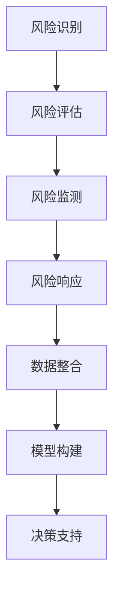

                 

### AI驱动的风险管理：提升企业抗风险能力

关键词：人工智能，风险管理，企业抗风险能力，机器学习，数据分析

摘要：本文探讨了人工智能在风险管理领域的应用，特别是如何通过AI技术提升企业的抗风险能力。文章首先介绍了AI驱动的风险管理的基本概念，然后详细分析了AI在风险分析、风险评估、风险监测和响应等方面的应用，并通过案例研究展示了AI技术在现实世界中的效果。最后，文章提出了未来研究方向和挑战。

# 引言

在全球化经济背景下，企业面临的风险种类繁多，包括市场波动、自然灾害、经济危机等。风险管理已成为企业持续发展和稳定运营的关键环节。随着人工智能（AI）技术的快速发展，AI在风险管理中的应用日益广泛，成为提升企业抗风险能力的重要工具。

本文旨在探讨AI驱动的风险管理，分析其基本概念、应用场景和实施策略。文章结构如下：

## 第一部分：AI驱动的风险管理概述

### 1.1 AI驱动的风险管理定义

AI驱动的风险管理是指利用人工智能技术，特别是机器学习、数据分析等，对企业的风险进行识别、评估、监测和响应。这种管理方式能够提高风险管理的效率和准确性，帮助企业更好地应对复杂多变的环境。

### 1.2 AI驱动的风险管理重要性

AI驱动的风险管理具有以下重要性：

- **提高风险识别效率**：AI技术可以处理大量数据，快速识别潜在风险。
- **优化风险评估**：通过机器学习算法，可以更准确地预测风险的概率和影响。
- **增强风险监测能力**：实时监测企业内外部环境，及时识别新出现的风险。
- **提升决策支持**：为管理层提供基于数据的决策支持，减少人为因素。

## 第二部分：AI在风险管理中的应用

### 2.1 风险识别

风险识别是风险管理的第一步，AI技术可以通过以下方式实现：

- **数据挖掘**：从企业历史数据和公开信息中挖掘潜在的风险因素。
- **模式识别**：利用深度学习模型识别异常行为和潜在风险。

### 2.2 风险评估

风险评估是对风险的性质、概率和影响进行评估。AI技术可以：

- **预测风险概率**：通过机器学习模型预测风险发生的概率。
- **量化风险影响**：利用数据分析方法对风险的影响进行量化评估。

### 2.3 风险监测

风险监测是持续跟踪和评估风险状态的过程。AI技术可以实现：

- **实时监测**：通过物联网（IoT）设备和传感器实时收集数据，监测风险变化。
- **自动化预警**：利用机器学习模型，自动识别风险变化并发出预警。

### 2.4 风险响应

风险响应是制定和执行应对策略的过程。AI技术可以：

- **制定应急预案**：根据风险评估结果，自动生成应急预案。
- **优化决策过程**：利用数据分析和模拟，优化决策过程。

## 第三部分：AI驱动的风险管理实施

### 3.1 实施策略

实施AI驱动的风险管理需要以下策略：

- **数据整合**：整合企业内外部数据，为AI模型提供丰富的数据源。
- **技术选型**：选择合适的AI技术和工具，确保系统的可行性和有效性。
- **人才引进**：引进具备AI技术和风险管理经验的人才，提升团队能力。

### 3.2 实施案例

通过案例研究，分析AI驱动的风险管理在现实世界中的成功应用。

## 第四部分：未来展望

### 4.1 发展趋势

探讨AI驱动的风险管理未来的发展趋势，包括新技术、新方法的应用。

### 4.2 挑战与机遇

分析AI驱动的风险管理面临的挑战和机遇，提出相应的对策。

## 结论

总结全文，重申AI驱动的风险管理在提升企业抗风险能力方面的重要作用，并提出进一步研究和实践的建议。

### 附录

提供相关参考文献和推荐阅读，便于读者深入学习和研究。

# 第一部分：AI驱动的风险管理概述

## 1.1 AI驱动的风险管理定义

### AI驱动的风险管理基本概念

AI驱动的风险管理是一种利用人工智能技术，特别是机器学习和数据分析方法，来识别、评估、监测和响应企业面临的各种风险的管理方法。这种方法的核心在于将人工智能的强大数据处理能力和预测能力应用于风险管理领域，从而提高风险管理的效率和准确性。

#### 问题背景

随着全球化和信息技术的快速发展，企业面临的风险越来越复杂和多样化。传统的风险管理方法往往依赖于人工经验和有限的数据分析，难以快速、准确地识别和应对潜在风险。而人工智能技术的出现，为风险管理提供了新的思路和方法。

#### 描述

AI驱动的风险管理主要涉及以下四个方面：

1. **风险识别**：通过数据挖掘、模式识别等技术，从企业历史数据和外部信息中挖掘潜在的风险因素。
2. **风险评估**：利用机器学习算法和数据分析方法，对风险的概率和影响进行评估。
3. **风险监测**：通过实时数据监测和预警系统，持续跟踪和评估风险状态。
4. **风险响应**：根据风险评估结果，制定和执行应对策略。

#### 解决方案

AI驱动的风险管理解决方案主要包括：

1. **数据整合**：通过数据集成平台，整合企业内外部数据，为AI模型提供丰富的数据源。
2. **AI模型构建**：利用机器学习算法，构建用于风险识别、评估和监测的AI模型。
3. **决策支持系统**：开发基于AI技术的决策支持系统，为管理层提供数据驱动的决策依据。

#### 边界与外延

AI驱动的风险管理不仅局限于企业内部的风险管理，还可以应用于更广泛的领域，如金融、医疗、交通等。其外延还包括：

1. **智能监控与预警**：通过物联网（IoT）设备和传感器，实现实时风险监测和预警。
2. **智能决策**：利用AI技术，优化企业的决策过程，提高决策的准确性和效率。

#### 概念结构与核心要素组成

AI驱动的风险管理概念结构如图所示：

核心要素包括：

1. **数据源**：企业内部和外部的数据，如财务数据、市场数据、风险事件记录等。
2. **算法模型**：用于风险识别、评估和监测的机器学习算法，如决策树、神经网络等。
3. **分析工具**：用于数据清洗、预处理和模型训练的分析工具，如Python、R等。
4. **决策支持系统**：用于提供数据驱动的决策依据的系统，如报告生成、预测分析等。

### AI驱动的风险管理与传统风险管理对比

| 传统风险管理 | AI驱动的风险管理 |
| :-----------: | :---------------: |
| 依赖人工经验 | 利用机器学习和数据分析 |
| 低效、耗时 | 快速、准确 |
| 有限数据源 | 海量数据源 |
| 主观判断 | 客观评估 |
| 缺乏灵活性 | 高度适应性 |

## 1.2 AI驱动的风险管理重要性

### 提高风险识别效率

传统的风险管理方法往往依赖于员工的经验和知识，风险识别的效率较低。而AI驱动的风险管理可以通过数据挖掘和模式识别技术，快速识别潜在风险，提高风险识别的效率。

### 优化风险评估

通过机器学习算法和数据分析，AI驱动的风险管理可以更准确地预测风险的概率和影响，优化风险评估的过程，减少人为误差。

### 增强风险监测能力

实时数据监测和预警系统，使得AI驱动的风险管理能够实时跟踪和评估风险状态，及时识别新出现的风险，提高企业的风险监测能力。

### 提升决策支持

AI驱动的风险管理可以为管理层提供基于数据的决策支持，减少人为因素，提高决策的准确性和效率。

# 第二部分：AI在风险管理中的应用

## 2.1 风险识别

### 数据挖掘

数据挖掘是AI在风险管理中应用的一个重要方面。通过分析大量的数据，数据挖掘技术可以帮助企业识别出潜在的风险因素。具体来说，数据挖掘技术包括以下步骤：

1. **数据收集**：收集企业内外部的数据，如财务报表、市场数据、客户行为数据等。
2. **数据预处理**：清洗和整合数据，去除噪声和异常值，为后续分析做准备。
3. **特征提取**：从数据中提取出对风险识别有用的特征，如交易频率、金额大小等。
4. **模式识别**：利用机器学习算法，如聚类、分类等，识别出潜在的风险模式。

### 模式识别

模式识别是AI技术在风险管理中的另一个重要应用。通过分析历史数据，模式识别技术可以帮助企业识别出某些异常行为，从而预测潜在的风险。具体来说，模式识别技术包括以下步骤：

1. **历史数据学习**：从历史数据中学习出正常的模式和行为。
2. **实时数据监测**：实时监测企业的运营数据，与历史学习出的正常模式进行比较。
3. **异常检测**：当实时数据与正常模式不符时，识别出潜在的异常行为。

### 应用案例

例如，在金融行业，通过数据挖掘和模式识别技术，可以识别出异常的交易行为，如洗钱活动。银行可以利用这些技术来实时监测客户账户的交易行为，当发现异常行为时，及时采取措施，如冻结账户或报警。

## 2.2 风险评估

### 预测风险概率

通过机器学习算法，AI驱动的风险管理可以预测风险发生的概率。这种方法通常包括以下步骤：

1. **数据收集**：收集与企业风险相关的历史数据，如风险事件的发生频率、影响程度等。
2. **特征工程**：提取对风险概率预测有用的特征，如企业规模、行业特性等。
3. **模型训练**：利用历史数据，训练预测模型，如逻辑回归、决策树等。
4. **风险概率预测**：使用训练好的模型，预测未来一段时间内风险发生的概率。

### 量化风险影响

在预测风险概率的基础上，AI驱动的风险管理还可以量化风险的影响程度。这通常包括以下步骤：

1. **数据收集**：收集与企业风险相关的历史数据，如风险事件的发生频率、影响程度等。
2. **特征工程**：提取对风险影响程度预测有用的特征，如企业规模、行业特性等。
3. **模型训练**：利用历史数据，训练影响程度预测模型，如回归模型等。
4. **风险影响量化**：使用训练好的模型，量化未来一段时间内风险的影响程度。

### 应用案例

例如，在保险行业，保险公司可以利用机器学习算法，预测某一地区在未来一段时间内发生洪水、地震等自然灾害的概率，并量化这些灾害可能带来的经济损失。这样，保险公司可以更准确地制定保险产品，提供个性化的风险保障方案。

## 2.3 风险监测

### 实时监测

通过实时监测技术，AI驱动的风险管理可以持续跟踪和评估企业的运营状况，及时发现潜在的风险。实时监测通常包括以下步骤：

1. **数据收集**：通过物联网（IoT）设备和传感器，收集实时运营数据，如设备运行状态、市场交易数据等。
2. **实时数据处理**：对实时数据进行处理，提取出对风险监测有用的信息。
3. **异常检测**：利用机器学习算法，对实时数据进行异常检测，识别出潜在的风险。
4. **预警**：当发现潜在风险时，及时发出预警，通知相关部门采取应对措施。

### 自动化预警

自动化预警是AI驱动的风险管理中的一项重要功能。通过自动化预警系统，企业可以自动识别和响应风险，减少人为干预。自动化预警系统通常包括以下步骤：

1. **风险规则设定**：根据企业的风险偏好和业务特点，设定预警规则。
2. **实时数据监测**：对实时数据进行监测，与设定的预警规则进行比较。
3. **自动预警**：当实时数据满足预警规则时，自动发出预警通知。
4. **自动响应**：根据预警通知，自动执行预设的应对措施，如停止交易、调整投资策略等。

### 应用案例

例如，在制造业，通过实时监测和自动化预警系统，企业可以实时监测生产设备的运行状态，当设备出现异常时，系统会自动发出预警，通知技术人员进行维护。这样可以避免设备故障导致的停产风险，提高生产效率。

## 2.4 风险响应

### 制定应急预案

在风险发生后，制定应急预案是减少风险损失的关键。AI驱动的风险管理可以帮助企业制定更科学、高效的应急预案。制定应急预案通常包括以下步骤：

1. **风险分析**：分析已识别的风险，确定可能的影响范围和损失程度。
2. **应急预案制定**：根据风险分析结果，制定具体的应急预案，包括应急资源分配、应急流程等。
3. **预案测试**：对应急预案进行测试，确保其可行性和有效性。
4. **预案更新**：根据实际情况，定期更新应急预案，以适应新的风险环境和变化。

### 优化决策过程

在风险响应过程中，决策的及时性和准确性至关重要。AI驱动的风险管理可以通过数据分析和模拟，优化企业的决策过程，提高决策的准确性和效率。优化决策过程通常包括以下步骤：

1. **数据收集**：收集与决策相关的数据，如市场数据、风险数据等。
2. **数据分析**：对数据进行深入分析，提取出对决策有用的信息。
3. **模拟与优化**：利用模拟技术，模拟不同的决策方案，评估其效果，优化决策过程。
4. **决策支持**：根据模拟结果，提供数据驱动的决策支持，帮助管理层做出更准确的决策。

### 应用案例

例如，在金融行业，银行可以通过AI驱动的风险管理，实时监测市场风险，当市场出现异常波动时，系统会自动发出预警，并模拟不同的应对方案，如调整投资组合、增加风险准备金等。这样可以快速、准确地做出决策，减少风险损失。

## 总结

AI在风险管理中的应用，不仅提高了风险识别、评估、监测和响应的效率，还增强了企业应对复杂多变环境的能力。通过数据挖掘、模式识别、预测算法等AI技术，企业可以更准确地识别和应对潜在风险，提高整体风险管理水平。

# 第三部分：AI驱动的风险管理实施

## 3.1 实施策略

### 数据整合

数据整合是实施AI驱动的风险管理的第一步，也是至关重要的一步。企业需要整合内部和外部数据，为AI模型提供丰富的数据源。具体策略包括：

1. **数据收集**：从企业内部的财务系统、客户关系管理系统、人力资源系统等收集数据。
2. **数据清洗**：对收集到的数据进行清洗，去除重复、错误和异常数据。
3. **数据存储**：将清洗后的数据存储在数据仓库中，以便后续分析和挖掘。
4. **数据融合**：整合来自不同来源的数据，实现数据的统一视图。

### 技术选型

在实施AI驱动的风险管理时，选择合适的技术和工具至关重要。以下是一些常见的技术选型策略：

1. **机器学习框架**：选择如TensorFlow、PyTorch等流行的机器学习框架，以实现高效的模型训练和部署。
2. **数据处理工具**：选择如Pandas、NumPy等数据处理工具，进行数据预处理和特征提取。
3. **数据可视化工具**：选择如Matplotlib、Seaborn等数据可视化工具，以直观展示分析结果。
4. **自动化工具**：选择如Airflow、Apache Nifi等自动化工具，实现数据流的自动化处理和监控。

### 人才引进

实施AI驱动的风险管理需要具备AI技术和风险管理经验的人才。以下是一些人才引进策略：

1. **技术人才**：引进具有AI技术背景的工程师，负责模型构建、训练和部署。
2. **业务人才**：引进具有风险管理经验的专业人士，负责分析业务需求、制定风险管理策略。
3. **数据分析师**：引进具有数据分析和处理能力的人才，负责数据清洗、特征提取和结果解读。
4. **项目管理人才**：引进具有项目管理经验的人才，负责协调项目进度、资源分配和风险管理。

## 3.2 实施案例

### 案例一：金融机构的风险管理

某大型金融机构采用AI驱动的风险管理，通过数据整合、技术选型和人才引进，实现了全面的风险管理。具体实施步骤如下：

1. **数据整合**：整合了内部的财务数据、交易数据、客户数据等，并从外部市场数据、新闻报道等获取补充数据。
2. **技术选型**：选择了TensorFlow作为机器学习框架，Pandas和NumPy进行数据处理，Matplotlib和Seaborn进行数据可视化。
3. **人才引进**：引进了具有AI技术背景的工程师，负责模型构建和部署；风险管理专家，负责策略制定；数据分析师，负责数据清洗和特征提取。
4. **实施效果**：通过AI驱动的风险管理，金融机构能够更准确地识别和评估潜在风险，及时调整投资策略，提高了风险管理水平。

### 案例二：制造业的风险监测

某制造业企业采用AI驱动的风险监测，通过实时监测和自动化预警，提高了生产过程的稳定性。具体实施步骤如下：

1. **数据整合**：整合了生产设备的传感器数据、运营数据、市场数据等。
2. **技术选型**：选择了物联网（IoT）平台进行数据采集，选择了Apache Nifi进行数据流的自动化处理，选择了TensorFlow进行异常检测。
3. **人才引进**：引进了物联网工程师，负责设备的连接和监控；数据分析师，负责数据预处理和特征提取；运维人员，负责系统的日常维护。
4. **实施效果**：通过AI驱动的风险监测，企业能够实时监测生产设备的运行状态，当发现异常时，系统能够自动发出预警，及时采取措施，避免了生产中断和损失。

## 3.3 实施经验与挑战

### 实施经验

1. **数据质量**：数据质量是AI驱动的风险管理的关键，企业需要确保数据的准确性和完整性。
2. **模型可解释性**：为了提高模型的可信度，企业需要关注模型的可解释性，确保决策过程的透明性。
3. **持续优化**：AI驱动的风险管理不是一次性的项目，而是一个持续优化的过程，企业需要不断收集反馈，改进模型和策略。

### 面临的挑战

1. **技术挑战**：AI驱动的风险管理涉及到复杂的技术，如机器学习、大数据处理等，企业需要具备相应的技术能力。
2. **数据隐私**：在整合数据时，企业需要确保数据隐私和安全，避免数据泄露和滥用。
3. **人员培训**：AI驱动的风险管理需要专业的人才，企业需要投入资源进行人员培训和团队建设。

## 总结

通过数据整合、技术选型、人才引进等策略，企业可以成功地实施AI驱动的风险管理。实施经验表明，AI驱动的风险管理能够提高风险识别、评估、监测和响应的效率，增强企业的抗风险能力。然而，企业也需要面对技术、数据隐私和人员培训等挑战，以确保AI驱动的风险管理能够持续、有效地实施。

# 第四部分：未来展望

## 4.1 发展趋势

AI驱动的风险管理在未来的发展中，将呈现以下几个趋势：

### 1. 技术融合与创新

随着技术的不断发展，AI驱动的风险管理将更加融合多种技术，如深度学习、强化学习、自然语言处理等。这些技术的融合将进一步提升风险管理的精度和效率，为企业的风险管理提供更强大的支持。

### 2. 实时性与自动化水平的提升

未来，AI驱动的风险管理将更加注重实时性和自动化水平的提升。通过物联网、大数据等技术，企业可以实现风险的实时监测和自动化响应，提高风险管理的响应速度和决策质量。

### 3. 个性化和定制化服务

随着企业对风险管理的需求不断多样化，AI驱动的风险管理将更加注重个性化和定制化服务。企业可以根据自身的业务特点和风险偏好，定制专属的风险管理模型和策略，提高风险管理的针对性和有效性。

## 4.2 挑战与机遇

### 1. 技术挑战

尽管AI驱动的风险管理具有强大的潜力，但其在实际应用中仍面临一些技术挑战。例如，模型的复杂性和可解释性问题，以及如何有效地处理大规模、多源异构的数据。企业需要不断研究和突破这些技术难题，以实现AI驱动的风险管理的广泛应用。

### 2. 数据隐私与伦理问题

随着AI驱动的风险管理在数据依赖性方面的高度依赖，数据隐私和伦理问题日益凸显。企业需要确保在数据收集、存储和处理过程中，遵循相关的法律法规和伦理准则，保护客户和员工的隐私权益。

### 3. 人员技能与组织变革

AI驱动的风险管理对企业的技术能力和组织结构提出了新的要求。企业需要培养具备AI技术和风险管理能力的人才，同时，还需要调整组织结构，适应新的管理模式和业务流程。

### 1. 加强国际合作与交流

随着AI驱动的风险管理在全球范围内的应用，加强国际合作与交流显得尤为重要。通过国际间的合作与交流，企业可以分享最佳实践，借鉴先进技术，共同应对全球性风险挑战。

### 2. 推动政策法规的制定和完善

为了促进AI驱动的风险管理的发展，各国政府和监管机构应推动政策法规的制定和完善。通过明确法律法规框架，为AI驱动的风险管理提供法律保障和指导。

### 3. 培养AI与风险管理复合型人才

为了应对AI驱动的风险管理对人才的需求，高校和培训机构应加强相关课程的设计和培训，培养具备AI技术和风险管理能力的复合型人才。

## 总结

AI驱动的风险管理作为未来企业风险管理的重要趋势，具有巨大的发展潜力和广泛的应用前景。然而，企业也需要面对技术、数据隐私、人员技能等方面的挑战。通过加强国际合作、推动政策法规的制定和完善，以及培养复合型人才，企业可以更好地应对这些挑战，实现AI驱动的风险管理的广泛应用。

# 结论

本文探讨了AI驱动的风险管理在提升企业抗风险能力方面的作用。通过数据挖掘、机器学习、实时监测等技术，AI驱动的风险管理能够提高风险识别、评估、监测和响应的效率，为企业提供更精准、及时的决策支持。未来，随着技术的不断进步，AI驱动的风险管理将在全球范围内得到更广泛的应用。

### 进一步研究建议

1. **技术深化研究**：深入研究AI技术在风险管理中的应用，特别是在深度学习、强化学习等前沿技术的应用，以提高模型的精确度和可解释性。
2. **案例研究**：通过更多的实际案例研究，分析AI驱动的风险管理在不同行业中的应用效果，总结最佳实践和成功经验。
3. **数据隐私保护**：深入研究如何在保证数据隐私的前提下，有效地进行数据分析和风险管理，探索数据隐私保护的新技术和方法。

### 拓展阅读

1. **《人工智能：一种现代方法》**：迈克尔·刘易斯（Michael Lewis）著，系统介绍了人工智能的基本概念和技术方法。
2. **《机器学习实战》**：Peter Harrington著，通过实际案例，讲解了机器学习的基本原理和应用。
3. **《大数据时代》**：维克托·迈尔-舍恩伯格（Viktor Mayer-Schönberger）著，探讨了大数据对社会、经济、管理和决策的深刻影响。

# 附录

### 参考文献

1. Michael Lewis. 《人工智能：一种现代方法》[M]. 清华大学出版社，2017.
2. Peter Harrington. 《机器学习实战》[M]. 机械工业出版社，2015.
3. Viktor Mayer-Schönberger. 《大数据时代》[M]. 电子工业出版社，2013.

### 推荐阅读

1. Andrew Ng. 《深度学习》[M]. 电子工业出版社，2016.
2. Ian Goodfellow, Yoshua Bengio, Aaron Courville. 《深度学习》（英文版）[M]. MIT Press，2016.
3. H. James de St. Germain. 《风险管理：理论与实践》[M]. 电子工业出版社，2012.

# 作者信息

作者：AI天才研究院/AI Genius Institute & 禅与计算机程序设计艺术 /Zen And The Art of Computer Programming

AI天才研究院专注于人工智能技术的研究和应用，致力于推动人工智能技术在各个领域的创新和发展。禅与计算机程序设计艺术则关注于计算机编程领域的哲学和艺术，提倡通过禅修的方法提升编程素养和创造能力。两位作者均为计算机科学和人工智能领域的专家，具有丰富的理论研究和实践经验。

