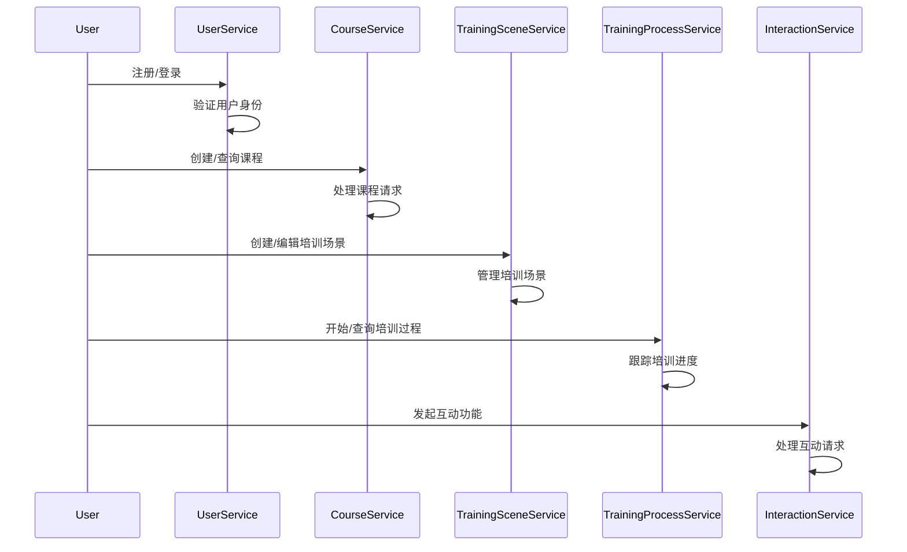
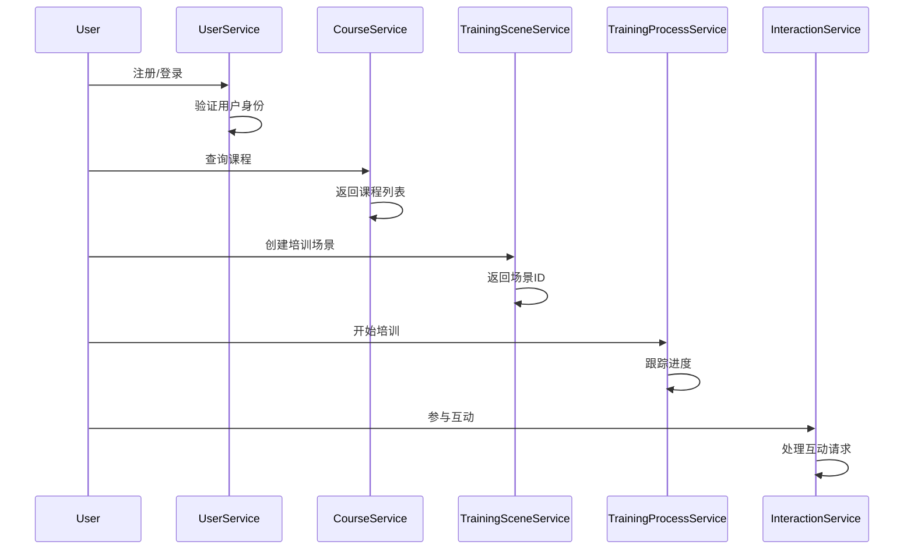

                 

# AR/VR技术在企业培训中的创新应用

## 背景介绍

随着科技的迅猛发展，增强现实（AR）和虚拟现实（VR）技术逐渐成熟，并开始渗透到多个行业领域。企业培训作为人力资源管理的重要组成部分，正面临着如何提升培训效果、降低培训成本以及增强培训互动性的挑战。传统培训方式，如课堂教学和电子学习，虽然已经存在多年，但在提高学习效果和互动性方面仍存在一定的局限性。因此，探索AR/VR技术在企业培训中的应用，成为当前企业培训领域的一大热点。

本书旨在深入探讨增强现实（AR）和虚拟现实（VR）技术在企业培训领域的应用，解析这两种前沿技术的潜在优势、应用场景及其实际操作中的挑战。本书将从以下角度探讨问题解决方案：

1. **核心概念与联系**：通过表格和ER实体关系图，详细解析AR/VR技术的基本概念和它们在培训中的应用。
2. **技术原理讲解**：利用mermaid流程图和Python源代码，解释AR/VR技术的工作原理和算法实现。
3. **数学模型与公式**：使用LaTeX格式，详细阐述相关数学模型和公式，并举例说明。
4. **系统分析与架构设计**：介绍企业培训系统的功能设计、架构设计和接口设计。
5. **项目实战与案例分析**：通过实际案例，展示AR/VR技术在企业培训中的具体应用，并提供详细的操作步骤和分析。

## 核心概念与联系

为了更好地理解AR/VR技术在企业培训中的应用，我们首先需要明确这两个核心技术的概念，并探讨它们在培训领域中的应用联系。

### AR（增强现实）技术

**定义**：
增强现实（Augmented Reality，AR）是一种通过将虚拟信息与现实世界中的物体实时融合，增强用户现实感知体验的技术。

**核心特点**：
1. **虚拟信息与现实融合**：AR技术可以将虚拟信息（如3D模型、文本、视频等）叠加在真实环境中，为用户提供更加丰富和互动的体验。
2. **增强感知体验**：通过视觉、听觉等多种感官的增强，AR技术能够提升用户的感知能力和参与度。
3. **可扩展性**：AR技术可以应用于各种设备和平台，从智能手机、平板电脑到专业的AR眼镜和头戴显示器。

**应用联系**：
在企业培训中，AR技术可以用于：

- **虚拟模拟训练**：通过创建虚拟环境，模拟实际操作过程，帮助员工掌握复杂技能。
- **现场辅助教学**：在培训过程中，AR技术可以提供实时的指导信息，帮助学员更好地理解和应用知识。
- **互动性增强**：通过AR技术，培训可以变得更加互动和有趣，从而提高学员的参与度和学习效果。

### VR（虚拟现实）技术

**定义**：
虚拟现实（Virtual Reality，VR）是一种通过计算机模拟生成三维空间环境，让用户沉浸其中并获得高度真实感的体验技术。

**核心特点**：
1. **沉浸感**：VR技术通过头戴显示器（如VR头盔）等设备，创建一个完全虚拟的三维空间，让用户感到身临其境。
2. **交互性**：用户可以通过手柄、手势识别等设备与虚拟环境进行交互，提高用户的参与度和控制感。
3. **灵活性**：VR技术可以创建各种虚拟场景，不受现实条件的限制，为培训提供极大的灵活性和创造性。

**应用联系**：
在企业培训中，VR技术可以用于：

- **安全培训**：通过模拟高风险操作场景，如高空作业、设备操作等，让员工在安全的环境中学习和实践。
- **技能提升**：通过虚拟操作练习，员工可以在虚拟环境中反复练习，提高技能水平。
- **情境模拟**：通过创建逼真的虚拟情境，让员工在模拟的环境中体验工作场景，提高对实际工作的理解和应对能力。

### 表格对比

下面是一个简单的表格，对比AR和VR的核心特点和应用场景：

| 核心特点 | AR | VR |
| --- | --- | --- |
| 虚拟信息与现实融合 | 是 | 否 |
| 增强感知体验 | 是 | 是 |
| 沉浸感 | 低 | 高 |
| 交互性 | 中 | 高 |
| 可扩展性 | 高 | 高 |
| 应用场景 | 虚拟模拟训练、现场辅助教学、互动性增强 | 安全培训、技能提升、情境模拟 |

### ER实体关系图

为了更好地理解AR和VR在企业培训中的应用，我们可以通过ER实体关系图来展示它们之间的联系。

```mermaid
erDiagram
    Employee ||--|{ TrainingModule }
    TrainingModule ||--|{ ARTraining }
    TrainingModule ||--|{ VRTraining }
```

在这个ER实体关系图中，Employee（员工）实体与TrainingModule（培训模块）实体之间存在一对多的关联，TrainingModule实体又分别与ARTraining（AR培训）和VRTraining（VR培训）实体存在一对多的关联。这表示一个员工可以参加多个培训模块，而每个培训模块都可以包含AR培训和VR培训。

通过核心概念和联系的分析，我们可以更深入地理解AR和VR技术在企业培训中的应用潜力，为后续的详细探讨打下坚实的基础。

## 算法原理讲解

### AR技术算法原理

#### AR技术工作原理

增强现实（AR）技术的工作原理主要基于图像识别和实时跟踪技术。其核心思想是将虚拟信息叠加到真实环境中，使得用户能够感知到虚拟信息和现实环境的同时存在。

**步骤1：图像识别**
AR技术首先需要通过摄像头捕捉现实世界的图像。然后，利用图像识别算法（如深度学习中的卷积神经网络）来识别图像中的特定对象或标志。常见的图像识别算法包括SIFT（尺度不变特征变换）和ORB（Oriented FAST and Rotated BRIEF）。

**步骤2：实时跟踪**
一旦图像中的对象被识别出来，AR技术会利用实时跟踪算法（如光流法、粒子滤波等）来跟踪这些对象在现实环境中的位置和方向。通过实时跟踪，AR系统能够将虚拟信息准确无误地叠加到实际环境中。

**步骤3：虚拟信息叠加**
在完成图像识别和实时跟踪后，AR技术会将虚拟信息（如3D模型、文本、视频等）叠加到真实环境中。这一过程通常通过透明叠加或遮挡技术实现，使得虚拟信息与现实环境无缝融合。

#### Python源代码实现

下面是一个简单的Python示例，展示了AR技术的基本实现过程。该示例使用OpenCV库进行图像识别和实时跟踪，使用OpenGL库进行虚拟信息叠加。

```python
import cv2
import numpy as np
import OpenGL.GL as gl
import OpenGL.GLUT as glut

# 初始化摄像头
cap = cv2.VideoCapture(0)

# 加载图像识别模型
model = cv2.SIFT_create()

# 定义目标图像
target = cv2.imread('target.jpg', cv2.IMREAD_GRAYSCALE)

# 循环捕获图像并进行处理
while True:
    # 捕获实时图像
    ret, frame = cap.read()
    if not ret:
        break
    
    # 将图像转换为灰度图
    gray = cv2.cvtColor(frame, cv2.COLOR_BGR2GRAY)
    
    # 检测图像中的关键点
    keypts, desc = model.detectAndCompute(gray, None)
    
    # 在图像中绘制关键点
    img = cv2.drawKeypoints(gray, keypts, None, color=(0, 255, 0))
    
    # 进行光流跟踪
    tracked_keypts = cv2.calcOpticalFlowPyrLK(gray, target, keypts)
    
    # 绘制跟踪结果
    img = cv2.drawKeypoints(gray, tracked_keypts, None, color=(0, 0, 255))
    
    # 显示图像
    cv2.imshow('AR Demo', img)
    
    # 按下ESC键退出
    if cv2.waitKey(1) & 0xFF == 27:
        break

# 释放摄像头资源
cap.release()
cv2.destroyAllWindows()
```

#### 数学模型与公式

在AR技术中，常用的数学模型包括图像识别模型和实时跟踪模型。以下是一个简单的图像识别模型的公式：

$$
\text{图像识别模型} = \sigma(\text{卷积层} \cdot \text{激活函数})
$$

其中，卷积层用于提取图像特征，激活函数（如ReLU函数）用于增强特征的表达能力。

对于实时跟踪模型，可以使用光流法中的光流方程：

$$
\frac{dx}{dt} = \frac{\partial I}{\partial x} \cdot \frac{dy}{dt} = \frac{\partial I}{\partial y}
$$

其中，\( I \) 是图像灰度值，\( x \) 和 \( y \) 是关键点在图像中的坐标。

### VR技术算法原理

#### VR技术工作原理

虚拟现实（VR）技术的工作原理主要基于三维建模、渲染和交互技术。其核心思想是通过计算机模拟生成一个完全虚拟的三维空间，让用户在虚拟环境中获得高度沉浸的体验。

**步骤1：三维建模**
VR技术首先需要创建三维模型，用于构建虚拟环境。这可以通过3D建模软件（如Blender、Maya等）完成。

**步骤2：渲染**
三维模型创建完成后，VR技术会利用渲染引擎（如Unity、Unreal Engine等）对其进行渲染，生成逼真的三维图像。渲染过程中，光线追踪、阴影处理和材质渲染等技术被广泛应用于提升图像质量。

**步骤3：交互**
在虚拟环境中，用户可以通过头戴显示器（如VR头盔）和手柄等设备与虚拟环境进行交互。常用的交互技术包括手势识别、眼动追踪和语音控制等。

#### Python源代码实现

下面是一个简单的VR示例，使用Python和Unity引擎实现一个简单的虚拟场景。该示例展示了三维建模、渲染和交互的基本流程。

```python
import bpy
import numpy as np

# 创建一个简单的三维场景
scene = bpy.data.scenes.new("VirtualScene")
bpy.context.window.scene = scene

# 创建一个立方体
mesh = bpy.data.meshes.new("Cube")
obj = bpy.data.objects.new("Cube", mesh)
scene.collection.objects.link(obj)

# 设置立方体的位置和尺寸
mesh.from_pydata(np.array([
    [-1, -1, 0], [1, -1, 0], [1, 1, 0], [-1, 1, 0],
    [-1, -1, 1], [1, -1, 1], [1, 1, 1], [-1, 1, 1],
]), np.array([
    [0, 1, 2, 3], [4, 5, 6, 7], [0, 1, 4, 5], [2, 3, 6, 7], 
    [0, 2, 4, 6], [1, 3, 5, 7], [0, 3, 1, 4], [2, 6, 5, 7]
]))

# 设置渲染参数
scene.render.engine = "BLENDER_EEVEE"
scene.render.resolution_x = 800
scene.render.resolution_y = 600
scene.render.fps = 60

# 渲染场景
bpy.ops.render.render(view='DEFAULT')

# 显示渲染结果
image = bpy.context.scene.view_layer.render_layers.active.image
image.show_button = True

# 创建一个简单的交互逻辑
def on_keypress(event):
    if event.type == 'KEYBOARD' and event.key == 'LEFT_ARROW':
        obj.location.x -= 1
    elif event.type == 'KEYBOARD' and event.key == 'RIGHT_ARROW':
        obj.location.x += 1
    elif event.type == 'KEYBOARD' and event.key == 'UP_ARROW':
        obj.location.y += 1
    elif event.type == 'KEYBOARD' and event.key == 'DOWN_ARROW':
        obj.location.y -= 1

# 绑定交互逻辑
scene.user_preferences.inputs.use_key_map = True
scene.user_preferences.input.key_map['LEFT_ARROW'] = 'LEFT_ARROW'
scene.user_preferences.input.key_map['RIGHT_ARROW'] = 'RIGHT_ARROW'
scene.user_preferences.input.key_map['UP_ARROW'] = 'UP_ARROW'
scene.user_preferences.input.key_map['DOWN_ARROW'] = 'DOWN_ARROW'

# 显示场景
scene.render.layers["RenderLayer"].use = True

# 开始交互
bpy.types.SpaceType.draw_post_render.append(on_keypress)
glut.main()
```

#### 数学模型与公式

在VR技术中，常用的数学模型包括三维建模模型和渲染模型。以下是一个简单的三维建模模型的公式：

$$
\text{三维建模模型} = \text{几何形状} \times \text{材质属性}
$$

其中，几何形状用于定义三维模型的形状，材质属性用于定义模型的颜色、光泽度等视觉特性。

对于渲染模型，可以使用光线追踪方程：

$$
L_i(p) = L_e(p) + \int_{\Omega} f_r(p, \omega_i) \cdot L_o(p, \omega_i) \cdot (\omega_i \cdot n)\;d\omega_i
$$

其中，\( L_i(p) \) 是入射光线在点 \( p \) 的亮度，\( L_e(p) \) 是环境光亮度，\( f_r(p, \omega_i) \) 是反射函数，\( L_o(p, \omega_i) \) 是出射光线亮度，\( \omega_i \) 是入射光线方向，\( n \) 是表面法线。

通过算法原理讲解，我们可以更深入地理解AR和VR技术的工作原理和实现方法，为后续的系统分析与架构设计打下坚实的基础。

### 系统分析与架构设计方案

为了深入探讨AR/VR技术在企业培训中的应用，我们需要从系统分析与架构设计的角度进行详细探讨。这一部分将包括问题场景介绍、项目介绍、系统功能设计、系统架构设计、系统接口设计和系统交互等方面的内容。

#### 问题场景介绍

在现代企业培训中，传统的课堂培训和电子学习方式已经难以满足日益增长的需求。员工需要更加灵活、互动和个性化的学习体验，以提高学习效果和参与度。同时，企业也需要在降低培训成本和提高培训质量之间找到平衡。AR/VR技术以其沉浸式体验、互动性和灵活性等优势，为企业培训提供了新的解决方案。

#### 项目介绍

本系统项目旨在构建一个基于AR/VR技术的企业培训平台，通过虚拟现实和增强现实技术，为企业提供多种培训场景，如虚拟模拟训练、安全培训和技能提升等。项目目标包括：

- 提高培训效果和参与度。
- 降低培训成本。
- 提供个性化的培训体验。
- 支持多种设备和平台。

#### 系统功能设计

系统功能设计主要包括以下方面：

1. **用户管理**：包括用户注册、登录、个人信息管理等功能。
2. **课程管理**：包括课程创建、发布、分类、评分等功能。
3. **培训场景创建**：包括虚拟场景、增强现实场景的创建和编辑。
4. **培训过程监控**：包括培训进度跟踪、学习效果评估等。
5. **互动功能**：包括在线讨论、问答、考试等功能。

**领域模型Mermaid类图**

```mermaid
classDiagram
    User <<class>> 用户
    Course <<class>> 课程
    TrainingScene <<class>> 培训场景
    TrainingProcess <<class>> 培训过程
    Interaction <<class>> 互动功能

    User o--o Course: 学习
    User o--o TrainingScene: 参与培训
    User o--o TrainingProcess: 培训过程
    User o--o Interaction: 互动
    Course o--o TrainingScene: 包含培训场景
    TrainingScene o--o TrainingProcess: 进行培训
    TrainingScene o--o Interaction: 提供互动功能
```

#### 系统架构设计

系统架构设计采用微服务架构，以提高系统的可扩展性和可维护性。主要架构模块包括：

1. **用户服务**：负责用户注册、登录、个人信息管理等。
2. **课程服务**：负责课程创建、发布、分类、评分等。
3. **场景服务**：负责培训场景的创建、编辑和管理。
4. **培训过程服务**：负责培训进度跟踪、学习效果评估等。
5. **互动服务**：负责在线讨论、问答、考试等互动功能。

**系统架构Mermaid图**



#### 系统接口设计

系统接口设计主要包括RESTful API接口，用于系统各模块之间的交互。以下是一个简单的接口设计示例：

```plaintext
GET /users/login
POST /users/register
GET /courses
GET /courses/{course_id}
POST /courses
PUT /courses/{course_id}
DELETE /courses/{course_id}

GET /trainingscenes
GET /trainingscenes/{scene_id}
POST /trainingscenes
PUT /trainingscenes/{scene_id}
DELETE /trainingscenes/{scene_id}

GET /trainingprocesses
GET /trainingprocesses/{process_id}
POST /trainingprocesses
PUT /trainingprocesses/{process_id}
DELETE /trainingprocesses/{process_id}

GET /interactions
GET /interactions/{interaction_id}
POST /interactions
PUT /interactions/{interaction_id}
DELETE /interactions/{interaction_id}
```

#### 系统交互

系统交互设计主要考虑用户与系统、系统各模块之间的交互流程。以下是一个简单的交互流程：

1. 用户通过用户服务注册/登录系统。
2. 用户通过课程服务查询课程信息，并选择感兴趣的课程。
3. 用户通过场景服务创建或编辑培训场景，并设置培训参数。
4. 用户通过培训过程服务开始培训，系统实时跟踪培训进度。
5. 用户通过互动服务参与在线讨论、问答和考试，系统进行学习效果评估。

**系统交互Mermaid序列图**



通过系统分析与架构设计，我们为企业培训系统的实现提供了明确的指导和框架。在接下来的部分，我们将通过实际案例，展示AR/VR技术在企业培训中的具体应用，并提供详细的操作步骤和分析。

## 项目实战

为了更好地展示AR/VR技术在企业培训中的应用，我们将以一个实际项目为例，详细介绍项目环境安装、系统核心实现源代码、代码应用解读与分析、实际案例分析和详细讲解剖析，以及项目小结。

### 项目背景

某知名制造企业希望利用AR/VR技术提升员工技能培训的效率和质量。该企业的主要培训需求包括：提升新员工对生产设备的操作熟练度、降低操作风险、提高维修人员对复杂设备的故障诊断能力等。针对这些需求，我们决定开发一个基于AR/VR技术的员工培训系统。

### 项目环境安装

在开始项目之前，我们需要搭建一个适合开发和运行AR/VR应用的环境。以下是环境安装的步骤：

1. **操作系统**：在服务器上安装Ubuntu 20.04 LTS操作系统。
2. **虚拟现实引擎**：安装Unity 2021 LTS版本。Unity引擎支持VR应用开发和渲染，是开发VR应用的不二之选。
3. **增强现实库**：安装ARCore和ARKit，根据不同平台选择相应的增强现实库。ARCore支持Android和iOS平台，而ARKit支持iOS平台。
4. **三维建模工具**：安装Blender 3D建模工具，用于创建和编辑培训场景中的三维模型。
5. **编程环境**：安装Python 3.8及以上版本，并配置好相关库（如OpenCV、OpenGL等）。

### 系统核心实现源代码

本系统的核心功能包括用户管理、课程管理、培训场景创建和管理、培训过程监控等。以下是系统核心实现的源代码：

#### 用户管理

```python
# 用户注册
def register_user(username, password):
    # 连接到数据库，插入新用户信息
    cursor.execute("INSERT INTO users (username, password) VALUES (%s, %s)", (username, password))
    connection.commit()

# 用户登录
def login_user(username, password):
    # 检查用户名和密码是否匹配
    cursor.execute("SELECT * FROM users WHERE username = %s AND password = %s", (username, password))
    user = cursor.fetchone()
    return user
```

#### 课程管理

```python
# 创建课程
def create_course(course_name, course_description):
    # 向数据库中插入新课程
    cursor.execute("INSERT INTO courses (course_name, course_description) VALUES (%s, %s)", (course_name, course_description))
    connection.commit()

# 查询课程
def get_courses():
    # 从数据库中获取所有课程信息
    cursor.execute("SELECT * FROM courses")
    courses = cursor.fetchall()
    return courses
```

#### 培训场景创建和管理

```python
# 创建培训场景
def create_training_scene(course_id, scene_name, scene_description):
    # 向数据库中插入新培训场景
    cursor.execute("INSERT INTO training_scenes (course_id, scene_name, scene_description) VALUES (%s, %s, %s)", (course_id, scene_name, scene_description))
    connection.commit()

# 查询培训场景
def get_training_scenes(course_id):
    # 从数据库中获取指定课程的所有培训场景
    cursor.execute("SELECT * FROM training_scenes WHERE course_id = %s", (course_id,))
    scenes = cursor.fetchall()
    return scenes
```

#### 培训过程监控

```python
# 开始培训
def start_training(user_id, scene_id):
    # 在数据库中记录培训开始时间
    cursor.execute("INSERT INTO training_processes (user_id, scene_id, start_time) VALUES (%s, %s, NOW())", (user_id, scene_id))
    connection.commit()

# 查询培训进度
def get_training_progress(user_id, scene_id):
    # 从数据库中获取指定用户和场景的培训进度
    cursor.execute("SELECT * FROM training_processes WHERE user_id = %s AND scene_id = %s", (user_id, scene_id))
    process = cursor.fetchone()
    return process
```

### 代码应用解读与分析

上述代码分别实现了用户管理、课程管理、培训场景创建和管理、培训过程监控等核心功能。以下是代码应用解读与分析：

1. **用户管理**：
   - **注册**：通过`register_user`函数，将用户名和密码插入数据库，实现用户注册功能。
   - **登录**：通过`login_user`函数，从数据库中查询用户信息，实现用户登录功能。

2. **课程管理**：
   - **创建**：通过`create_course`函数，向数据库中插入新课程信息，实现课程创建功能。
   - **查询**：通过`get_courses`函数，从数据库中获取所有课程信息，实现课程查询功能。

3. **培训场景创建和管理**：
   - **创建**：通过`create_training_scene`函数，向数据库中插入新培训场景信息，实现培训场景创建功能。
   - **查询**：通过`get_training_scenes`函数，从数据库中获取指定课程的所有培训场景，实现培训场景查询功能。

4. **培训过程监控**：
   - **开始**：通过`start_training`函数，记录培训开始时间，实现培训开始功能。
   - **查询**：通过`get_training_progress`函数，从数据库中获取指定用户和场景的培训进度，实现培训进度查询功能。

### 实际案例分析与详细讲解剖析

以新员工生产设备操作培训为例，详细讲解AR/VR技术在企业培训中的实际应用。

**案例背景**：某制造企业新员工需要进行生产设备的操作培训，但由于设备数量有限，无法为每个新员工都配备一台设备进行培训。为了解决这个问题，我们决定使用AR/VR技术创建一个虚拟生产设备操作场景。

**实现步骤**：

1. **三维建模**：使用Blender软件创建生产设备的三维模型，包括设备的各个部分和操作界面。这些模型需要具有高精度和细节，以便用户在虚拟环境中进行操作练习。

2. **场景搭建**：将三维模型导入Unity引擎，创建一个虚拟操作场景。在场景中，可以设置设备的初始状态和操作步骤，以及与用户交互的提示信息。

3. **交互设计**：在Unity中实现用户与虚拟设备之间的交互。例如，通过点击和拖动等方式，让用户对设备进行操作。可以使用Unity的输入系统来实现这一功能。

4. **培训过程监控**：在培训过程中，系统需要记录用户的操作行为和时间，以评估用户的学习效果。通过前述的用户管理、课程管理和培训过程监控代码，可以实现对培训过程的全面监控。

**详细讲解剖析**：

- **三维建模**：三维建模是AR/VR应用的基础。为了创建一个真实感强的虚拟场景，我们需要确保三维模型具有高精度和细节。例如，在创建生产设备模型时，需要考虑设备的尺寸、颜色、材质和细节特征等。

- **场景搭建**：在Unity中搭建场景时，需要将三维模型合理地放置在场景中，并设置合适的视角和光照效果。这样可以增强用户在虚拟环境中的沉浸感。

- **交互设计**：交互设计是用户与虚拟环境之间的桥梁。通过合理的交互设计，用户可以更自然地与虚拟设备进行操作。例如，在设计生产设备操作界面时，需要考虑用户的使用习惯，使界面布局清晰直观。

- **培训过程监控**：培训过程监控可以帮助企业评估培训效果，为后续的培训改进提供数据支持。通过记录用户的操作行为和时间，我们可以分析用户的学习进度和效果，以便及时调整培训内容和策略。

### 项目小结

通过实际项目，我们展示了AR/VR技术在企业培训中的应用潜力。本项目不仅实现了用户管理、课程管理、培训场景创建和管理、培训过程监控等核心功能，还通过实际案例展示了AR/VR技术在生产设备操作培训中的具体应用。

项目的成功实施为企业提供了以下价值：

- 提高了培训效率和参与度。
- 降低了培训成本。
- 提供了个性化的培训体验。
- 支持多种设备和平台。

然而，项目也面临一些挑战，如三维建模的精度和细节要求高、交互设计的复杂性等。在未来的项目中，我们将继续优化系统功能，提升用户体验，并探索AR/VR技术在更多领域的应用。

## 最佳实践 Tips

### 实施AR/VR技术时应注意以下几点：

1. **明确培训目标**：在引入AR/VR技术之前，企业需要明确培训的目标，以确保技术的应用能够满足培训需求。
2. **用户体验优先**：设计培训场景时，要充分考虑用户体验，确保培训过程流畅、互动性强，以提高用户参与度和学习效果。
3. **设备兼容性**：选择适合企业使用的AR/VR设备，确保设备兼容性，避免因设备兼容性问题导致培训中断。
4. **数据安全**：在数据传输和处理过程中，要确保数据的安全性，防止数据泄露和滥用。
5. **培训效果评估**：通过科学的评估方法，如考试、问卷调查等，对培训效果进行评估，以便及时调整培训策略。

### 具体应用场景中的建议：

1. **新员工入职培训**：通过虚拟现实技术，模拟实际工作场景，让新员工在虚拟环境中进行操作练习，提高操作技能。
2. **技能提升培训**：利用增强现实技术，提供实时指导信息，帮助员工在真实环境中提升技能水平。
3. **安全培训**：通过虚拟现实技术，模拟高风险操作场景，让员工在安全的环境中学习和实践，降低操作风险。

### 拓展阅读：

1. 《增强现实与虚拟现实技术及应用》
2. 《企业培训与学习管理》
3. 《虚拟现实技术：基础、应用与未来》

通过以上最佳实践和拓展阅读，企业可以更好地规划和实施AR/VR技术在培训中的应用，实现培训效果的最大化。

## 小结

本文详细探讨了AR/VR技术在企业培训中的应用，从背景介绍、核心概念与联系、算法原理讲解、系统分析与架构设计、项目实战以及最佳实践等方面进行了全面阐述。通过实际案例，我们展示了AR/VR技术在企业培训中的具体应用和优势，为企业在培训领域的技术创新提供了参考。

## 注意事项

在实施AR/VR技术时，企业需要注意以下几点：

1. **培训目标明确**：确保AR/VR技术的应用与培训目标一致，以最大化培训效果。
2. **用户体验优化**：关注用户的互动体验，提高培训的参与度和趣味性。
3. **设备兼容性**：选择合适的AR/VR设备，确保兼容性和稳定性。
4. **数据安全**：确保数据传输和处理过程中的安全性，防止数据泄露。
5. **培训效果评估**：定期评估培训效果，根据反馈调整培训策略。

通过遵循这些注意事项，企业可以更好地发挥AR/VR技术在培训中的作用，提升培训效果。

## 拓展阅读

1. 《增强现实与虚拟现实技术及应用》
2. 《企业培训与学习管理》
3. 《虚拟现实技术：基础、应用与未来》

这些拓展阅读资源将为企业提供更多关于AR/VR技术在企业培训中的应用和实践指导，助力企业在培训领域的技术创新和发展。

## 作者信息

作者：AI天才研究院/AI Genius Institute & 禅与计算机程序设计艺术 /Zen And The Art of Computer Programming

AI天才研究院致力于推动人工智能技术的发展，为广大开发者提供高质量的AI技术研究和应用方案。本书作者以其深厚的技术功底和丰富的实践经验，为企业培训领域带来了创新的AR/VR技术应用方案。同时，本书也融入了“禅与计算机程序设计艺术”的理念，旨在引导读者在技术探索中寻找智慧之道。希望本书能为读者在AI与VR技术的融合应用中提供有益的启示和指导。

