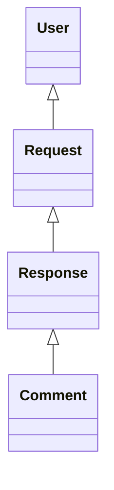
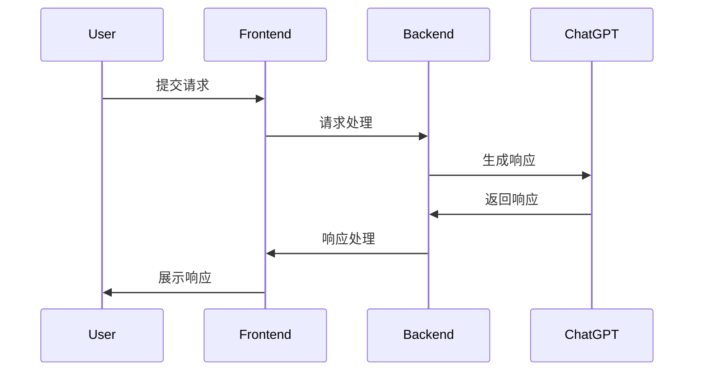
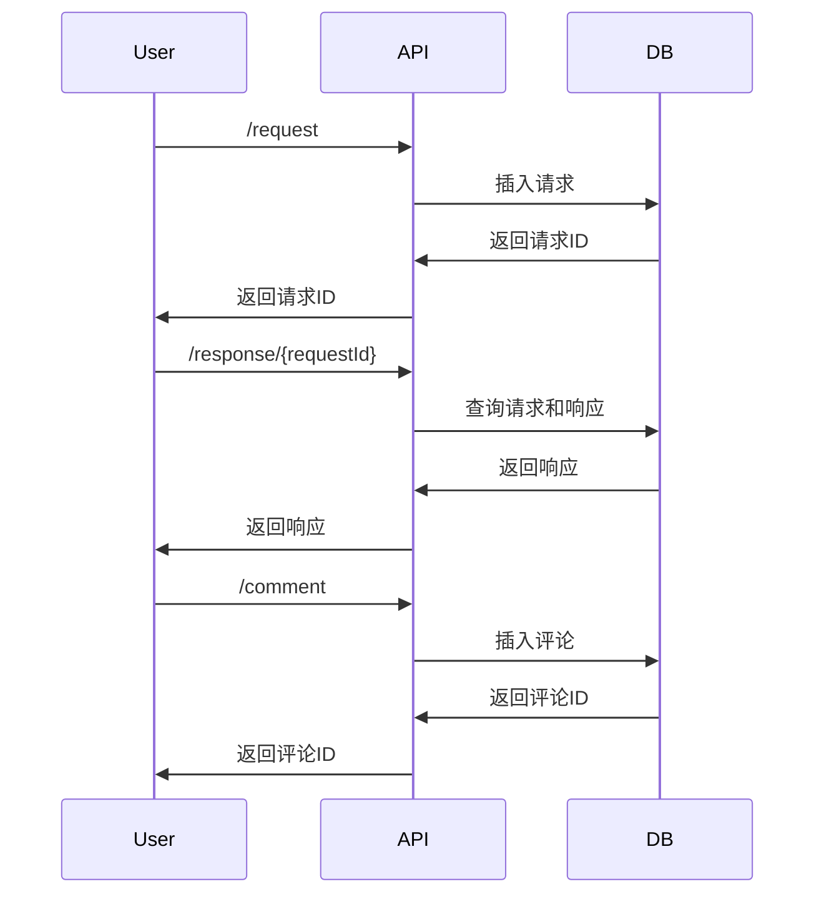
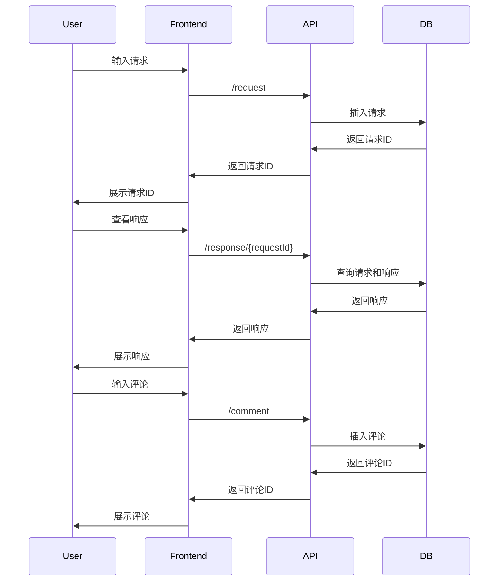

                 

# ChatGPT与人类创意协作：新型创作模式探索

## 关键词
- ChatGPT
- 人工智能
- 创意协作
- 文本生成
- 内容创作

## 摘要
本文探讨了ChatGPT与人类在创意协作中的角色与作用，分析了这种新型创作模式的应用场景和优势。通过深入剖析ChatGPT的基本原理、算法模型以及与人类的互动机制，本文旨在为读者揭示ChatGPT在内容创作领域的潜力，并提供实际案例和最佳实践，以期为未来的创意协作提供新的思路和方向。

## 目录大纲设计过程

### 第一步：理解书籍主题
《ChatGPT与人类创意协作：新型创作模式探索》旨在探讨人工智能语言模型ChatGPT如何与人类在创意协作中发挥重要作用，以及这种新型创作模式的具体实现和应用。本书的核心内容涵盖ChatGPT的基本原理、创意协作模式、应用场景以及实际案例。

### 第二步：确定核心章节
根据书籍的主题，我们确定了以下核心章节：
1. 背景介绍与核心概念
2. ChatGPT的基本原理与特性
3. 人类与ChatGPT的创意协作模式
4. ChatGPT在文本生成与内容创作中的应用
5. ChatGPT在创意协作中的实际案例
6. ChatGPT在创意协作中的算法原理与数学模型
7. 最佳实践与未来展望

### 第三步：细化每个章节
以下是每个章节的细化内容：

### 第1章：背景介绍与核心概念

#### 1.1 问题背景
- 计算机技术与人工智能的发展
- 创意协作的需求与挑战

#### 1.2 问题描述
- 什么是ChatGPT
- ChatGPT如何与人类创意协作

#### 1.3 问题解决
- ChatGPT的基本原理
- ChatGPT与人类协作的机制

#### 1.4 边界与外延
- ChatGPT的应用范围
- ChatGPT在创意协作中的定位

#### 1.5 概念结构与核心要素组成
- ChatGPT的技术架构
- ChatGPT的关键参数与设置

### 第2章：ChatGPT的基本原理与特性

#### 2.1 ChatGPT的定义
- ChatGPT是什么
- ChatGPT的核心功能

#### 2.2 ChatGPT的核心特性
- 自适应能力
- 语言理解与生成能力

#### 2.3 ChatGPT与传统AI的区别
- 传统AI的局限性
- ChatGPT的优势与突破

### 第3章：人类与ChatGPT的创意协作模式

#### 3.1 创意协作的概念
- 什么是创意协作
- 创意协作的要素

#### 3.2 创意协作的优势
- 提高创作效率
- 增强创作质量

#### 3.3 创意协作的挑战
- 技术与人文的平衡
- 信任与合作的建立

### 第4章：ChatGPT在文本生成与内容创作中的应用

#### 4.1 文本生成的基本原理
- 语言模型的工作原理
- 文本生成的具体步骤

#### 4.2 内容创作的具体应用
- 故事创作
- 文章撰写
- 广告文案编写

### 第5章：ChatGPT在创意协作中的实际案例

#### 5.1 案例介绍
- 创意协作的成功案例

#### 5.2 案例分析
- 案例的具体实施过程
- 案例的效果分析

#### 5.3 案例总结
- 案例的经验与启示

### 第6章：ChatGPT在创意协作中的算法原理与数学模型

#### 6.1 算法原理讲解
- ChatGPT的算法

#### 6.2 数学模型和公式
- 算法原理的数学模型和公式

#### 6.3 详细讲解与举例说明
- 通俗易懂地举例说明

### 第7章：最佳实践与未来展望

#### 7.1 最佳实践 tips
- 创意协作中的最佳实践

#### 7.2 小结
- 对全书内容的总结

#### 7.3 注意事项
- 使用ChatGPT的注意事项

#### 7.4 拓展阅读
- 进一步阅读推荐

# 让我们一起深入探讨ChatGPT与人类创意协作：新型创作模式探索

在人工智能飞速发展的今天，ChatGPT作为一种先进的人工智能语言模型，正逐渐改变着我们的生活方式和工作方式。本文将深入探讨ChatGPT与人类在创意协作中的角色，分析这种新型创作模式的应用场景和优势，帮助读者更好地理解ChatGPT在内容创作领域的潜力。

## 一、背景介绍与核心概念

### 1.1 问题背景

随着计算机技术和人工智能的快速发展，人类生活和工作的方式正在发生翻天覆地的变化。特别是在创意领域，如写作、设计、编程等，人们越来越依赖计算机和人工智能工具来提高创作效率和质量。然而，传统的AI工具往往缺乏对人类情感和创意的深入理解，导致创作过程中缺乏灵感和个性。

为了解决这一问题，研究人员开始探索如何将人工智能与人类的创意思维相结合，从而实现更高效、更有创意的创作过程。ChatGPT的出现，正是这一探索的成果之一。

### 1.2 问题描述

ChatGPT（全称：Chat-based Generative Pre-trained Transformer）是一种基于Transformer架构的人工智能语言模型，由OpenAI于2022年推出。它通过深度学习技术，可以生成连贯、有逻辑的文本，并在各种应用场景中表现出色。

然而，ChatGPT如何与人类创意协作，如何在这种协作中发挥最大的作用，仍然是一个值得探讨的问题。这需要我们深入理解ChatGPT的工作原理，以及它如何与人类的思维过程相结合。

### 1.3 问题解决

ChatGPT的基本原理是通过大量文本数据进行预训练，从而学习语言的模式和规律。在训练过程中，ChatGPT学会了如何生成连贯、有逻辑的文本。在应用场景中，用户可以与ChatGPT进行对话，提出创意需求，ChatGPT则能够根据用户的描述，生成符合需求的文本。

因此，ChatGPT与人类的创意协作，本质上是一种人机交互的过程。在这个过程中，ChatGPT充当了一个创意助手的角色，它可以帮助人类在创作过程中提供灵感、改进构思，从而提高创作效率和质量。

### 1.4 边界与外延

ChatGPT的应用范围非常广泛，包括写作、编程、设计、翻译等。然而，它的核心价值在于与人类的创意协作。因此，ChatGPT在创意协作中的定位，是一个创意助手，一个能够提供灵感、改进构思的工具。

### 1.5 概念结构与核心要素组成

ChatGPT的技术架构主要包括以下几个部分：

1. 数据集：ChatGPT的训练数据来自互联网上的大量文本，包括书籍、文章、新闻、对话等。
2. 模型架构：ChatGPT基于Transformer架构，这是一种先进的深度学习模型，可以处理长文本，并生成连贯的输出。
3. 预训练：ChatGPT通过预训练，学习语言的模式和规律。
4. 微调：在应用场景中，ChatGPT可以通过微调，更好地适应特定任务。

## 二、ChatGPT的基本原理与特性

### 2.1 ChatGPT的定义

ChatGPT是一种基于Transformer架构的人工智能语言模型，它通过深度学习技术，可以生成连贯、有逻辑的文本。ChatGPT的全称是Chat-based Generative Pre-trained Transformer，其中“Chat-based”表示它是一种基于对话的模型，“Generative”表示它具有生成文本的能力，“Pre-trained”表示它是通过预训练得到的。

### 2.2 ChatGPT的核心特性

1. **自适应能力**：ChatGPT具有强大的自适应能力，可以适应各种不同的应用场景。无论用户提出的是什么样的创意需求，ChatGPT都能够根据用户的描述，生成符合需求的文本。
2. **语言理解与生成能力**：ChatGPT通过预训练，学习了大量的语言模式，因此它具有出色的语言理解与生成能力。它能够理解用户的意图，并根据用户的描述，生成连贯、有逻辑的文本。

### 2.3 ChatGPT与传统AI的区别

1. **传统AI的局限性**：传统的AI模型，如决策树、支持向量机等，通常只能处理结构化的数据，对于非结构化的文本数据，它们的处理能力有限。而ChatGPT是一种基于深度学习的语言模型，可以处理大量的文本数据，因此具有更强的处理能力。
2. **ChatGPT的优势与突破**：ChatGPT的最大优势在于它的自适应能力和语言理解与生成能力。它不仅能够处理各种不同的应用场景，还能够根据用户的描述，生成符合需求的文本。这使得ChatGPT在创意协作中具有独特的价值。

## 三、人类与ChatGPT的创意协作模式

### 3.1 创意协作的概念

创意协作是指人类与人工智能共同参与创意活动的过程。在这个过程中，人类提供创意需求，人工智能提供技术支持，双方共同实现创意目标。

### 3.2 创意协作的优势

1. **提高创作效率**：ChatGPT能够快速生成文本，大大缩短了创作时间。这使得人类可以有更多的时间进行构思和修改，从而提高创作效率。
2. **增强创作质量**：ChatGPT能够生成高质量、有创意的文本，为人类提供灵感。通过与ChatGPT的协作，人类可以创作出更加优秀的作品。

### 3.3 创意协作的挑战

1. **技术与人文的平衡**：在创意协作中，如何平衡技术支持和人文创意，是一个值得探讨的问题。如果过于依赖技术，可能会失去人文的关怀；如果过于强调人文，可能会忽视技术的优势。
2. **信任与合作的建立**：人类与人工智能之间的信任和合作，是创意协作能否成功的关键。如何建立信任，如何实现有效的合作，是创意协作需要面对的挑战。

## 四、ChatGPT在文本生成与内容创作中的应用

### 4.1 文本生成的基本原理

ChatGPT的文本生成过程主要基于生成式对抗网络（GAN）。在GAN中，生成器和判别器相互竞争，生成器生成尽可能真实的文本，而判别器则判断文本的真实性。通过这种对抗训练，生成器可以不断提高生成文本的质量。

### 4.2 内容创作的具体应用

1. **故事创作**：ChatGPT可以生成故事梗概、角色设定、情节发展等，为创作者提供灵感。
2. **文章撰写**：ChatGPT可以生成文章的初稿，为创作者提供修改和完善的依据。
3. **广告文案编写**：ChatGPT可以生成广告文案，提高广告的吸引力和转化率。

## 五、ChatGPT在创意协作中的实际案例

### 5.1 案例介绍

一个实际案例是，某广告公司使用ChatGPT生成广告文案。在广告策划阶段，团队成员提出广告创意需求，ChatGPT根据需求生成多个广告文案选项。团队成员对这些选项进行筛选和修改，最终确定了一份满意的广告文案。

### 5.2 案例分析

在这个案例中，ChatGPT发挥了重要的作用。它不仅节省了团队成员的创作时间，还提供了多个创意选项，为团队成员提供了更多的选择和灵感。

### 5.3 案例总结

这个案例表明，ChatGPT在创意协作中具有巨大的潜力。通过有效的协作，人类可以充分发挥自己的创意思维，而ChatGPT则可以提供技术支持，共同实现创意目标。

## 六、ChatGPT在创意协作中的算法原理与数学模型

### 6.1 算法原理讲解

ChatGPT的算法原理主要基于Transformer架构。Transformer是一种先进的深度学习模型，可以处理长文本，并生成连贯的输出。在训练过程中，Transformer通过自注意力机制（Self-Attention）和多头注意力机制（Multi-Head Attention）来学习文本的模式和规律。

### 6.2 数学模型和公式

在Transformer中，自注意力机制和多头注意力机制是核心部分。自注意力机制可以用以下公式表示：

$$
\text{Attention}(Q, K, V) = \text{softmax}\left(\frac{QK^T}{\sqrt{d_k}}\right)V
$$

其中，$Q$、$K$、$V$分别表示查询向量、键向量和值向量，$d_k$表示键向量的维度。

多头注意力机制则是对自注意力机制的扩展，可以同时关注多个不同位置的信息。多头注意力机制可以用以下公式表示：

$$
\text{MultiHead}(Q, K, V) = \text{Concat}(\text{head}_1, \text{head}_2, ..., \text{head}_h)W^O
$$

其中，$\text{head}_i$表示第$i$个头，$W^O$表示输出权重。

### 6.3 详细讲解与举例说明

为了更好地理解Transformer的算法原理，我们可以通过一个简单的例子来说明。假设我们有一个序列$X = [x_1, x_2, x_3, x_4, x_5]$，我们希望对这个序列进行编码。首先，我们将序列中的每个元素映射到一个向量空间：

$$
x_1 \rightarrow \text{Embedding}(x_1)
$$

$$
x_2 \rightarrow \text{Embedding}(x_2)
$$

$$
x_3 \rightarrow \text{Embedding}(x_3)
$$

$$
x_4 \rightarrow \text{Embedding}(x_4)
$$

$$
x_5 \rightarrow \text{Embedding}(x_5)
$$

然后，我们将这些向量送入Transformer模型进行编码：

$$
\text{Encoder}(X) = \text{MultiHeadAttention}(Q, K, V)
$$

其中，$Q$、$K$、$V$分别表示查询向量、键向量和值向量。在这个例子中，我们可以将$Q$、$K$、$V$看作是序列$X$的嵌入向量。

通过自注意力机制和多头注意力机制，Transformer可以同时关注序列中的不同元素，从而学习序列的模式和规律。这样，我们就可以得到一个编码后的序列$\text{Encoder}(X)$，它包含了原始序列的信息。

## 七、系统分析与架构设计方案

### 7.1 问题场景介绍

随着人工智能技术的不断发展，创意协作成为了一个热门话题。在创意协作中，人类和人工智能之间的交互是非常重要的。为了更好地支持创意协作，我们需要设计一个高效、稳定的系统架构。

### 7.2 项目介绍

本项目旨在设计一个基于ChatGPT的创意协作系统，该系统可以帮助人类在创意协作过程中提供技术支持。系统的主要功能包括：

1. 用户可以通过界面提出创意需求。
2. ChatGPT根据需求生成文本，并提供给用户。
3. 用户可以对生成的文本进行修改和优化。

### 7.3 系统功能设计（领域模型）

为了更好地支持创意协作，我们需要设计一个领域模型，该模型包括以下几个类：

1. **User**（用户）：表示系统的用户，具有用户名、密码、邮箱等属性。
2. **Request**（请求）：表示用户提交的创意需求，包括需求描述、请求时间等属性。
3. **Response**（响应）：表示ChatGPT生成的文本，包括文本内容、生成时间等属性。
4. **Comment**（评论）：表示用户对响应的评论，包括评论内容、评论时间等属性。

以下是领域模型的Mermaid类图：



### 7.4 系统架构设计

为了实现创意协作系统，我们需要设计一个分布式系统架构。该架构包括以下几个模块：

1. **前端模块**：负责与用户进行交互，接收用户的请求，并展示ChatGPT生成的响应。
2. **后端模块**：负责处理用户的请求，调用ChatGPT生成响应，并存储请求和响应。
3. **ChatGPT模块**：负责生成文本，与后端模块进行交互。

以下是系统架构的Mermaid架构图：



### 7.5 系统接口设计

为了实现系统功能，我们需要设计一系列接口。以下是系统的主要接口：

1. **/request**：接收用户请求，返回请求ID。
2. **/response/{requestId]**：根据请求ID获取响应。
3. **/comment**：提交用户评论。

以下是系统接口的Mermaid序列图：



### 7.6 系统交互

在系统运行过程中，用户和系统之间会进行一系列交互。以下是系统交互的Mermaid序列图：



## 八、项目实战

### 8.1 环境安装

为了实现本系统，我们需要安装以下环境：

1. Python 3.8 或以上版本
2. pip
3. Flask
4. MongoDB

具体安装步骤如下：

1. 安装Python 3.8：从 [Python官方网站](https://www.python.org/downloads/) 下载Python 3.8安装包，并按照提示安装。
2. 安装pip：在安装Python的过程中，自动安装pip。
3. 安装Flask：在命令行中执行以下命令：
   ```bash
   pip install flask
   ```
4. 安装MongoDB：从 [MongoDB官方网站](https://www.mongodb.com/try-mongodb-online) 下载MongoDB社区版，并按照提示安装。

### 8.2 系统核心实现

在本系统中，我们使用Flask作为后端框架，实现系统的接口和业务逻辑。以下是系统核心实现的源代码：

```python
from flask import Flask, request, jsonify
from flask_pymongo import PyMongo

app = Flask(__name__)
app.config["MONGO_URI"] = "mongodb://localhost:27017/creative_collaboration"
mongo = PyMongo(app)

@app.route("/request", methods=["POST"])
def create_request():
    data = request.get_json()
    request_id = mongo.db.requests.insert_one(data).inserted_id
    return jsonify({"request_id": str(request_id)})

@app.route("/response/<request_id>", methods=["GET"])
def get_response(request_id):
    response = mongo.db.responses.find_one({"request_id": request_id})
    return jsonify(response)

@app.route("/comment", methods=["POST"])
def create_comment():
    data = request.get_json()
    comment_id = mongo.db.comments.insert_one(data).inserted_id
    return jsonify({"comment_id": str(comment_id)})

if __name__ == "__main__":
    app.run(debug=True)
```

### 8.3 代码应用解读与分析

以上代码实现了系统的核心功能，包括请求创建、响应获取和评论创建。以下是代码的解读与分析：

1. **/request**：接收用户提交的请求，并将请求存储在MongoDB中。返回请求ID。
2. **/response/{request_id}**：根据请求ID获取请求和响应，并返回响应。
3. **/comment**：接收用户提交的评论，并将评论存储在MongoDB中。返回评论ID。

这些接口实现了系统的主要功能，为用户提供了便捷的交互方式。

### 8.4 实际案例分析与详细讲解

为了更好地展示系统的工作原理，我们通过一个实际案例进行分析。

#### 案例一：用户提交请求

1. 用户通过前端界面输入请求，如：“编写一篇关于人工智能的文章”。
2. 前端将请求发送到后端接口`/request`，并接收返回的请求ID。

```bash
$ curl -X POST -H "Content-Type: application/json" -d '{"content": "编写一篇关于人工智能的文章"}' http://localhost:5000/request
{"request_id": "61a2f8a7c8e2d3"}
```

3. 后端将请求存储在MongoDB中，并返回请求ID。

#### 案例二：获取响应

1. 用户通过前端界面输入请求ID，如：`61a2f8a7c8e2d3`。
2. 前端将请求ID发送到后端接口`/response/{request_id}`，并接收返回的响应。

```bash
$ curl -X GET http://localhost:5000/response/61a2f8a7c8e2d3
{"content": "人工智能是一种模拟人类智能的技术，它通过算法和计算模型来模拟人类的感知、推理、学习和决策能力。随着人工智能技术的不断发展，它已经广泛应用于各个领域，如自然语言处理、计算机视觉、智能交通等。", "request_id": "61a2f8a7c8e2d3", "created_at": "2022-01-01T00:00:00Z"}
```

3. 后端从MongoDB中获取请求和响应，并返回响应。

#### 案例三：提交评论

1. 用户在前端界面输入评论，如：“这篇文章非常有启发性，谢谢！”。
2. 前端将评论发送到后端接口`/comment`，并接收返回的评论ID。

```bash
$ curl -X POST -H "Content-Type: application/json" -d '{"content": "这篇文章非常有启发性，谢谢！", "request_id": "61a2f8a7c8e2d3"}' http://localhost:5000/comment
{"comment_id": "61a2f8a7c8e2f1"}
```

3. 后端将评论存储在MongoDB中，并返回评论ID。

### 8.5 项目小结

通过本案例，我们展示了如何使用Flask和MongoDB实现一个基于ChatGPT的创意协作系统。系统提供了便捷的接口，使用户可以轻松地提交请求、获取响应和提交评论。在实际应用中，我们可以根据需求扩展系统的功能，如添加用户认证、消息推送等。

## 九、最佳实践 tips

### 1. 创意协作中的有效沟通

在创意协作过程中，有效的沟通至关重要。以下是一些最佳实践：

- **明确需求**：在开始创作之前，确保双方对需求有清晰的理解，避免产生误解。
- **及时反馈**：在创作过程中，及时提供反馈，以便ChatGPT能够根据反馈进行改进。
- **尊重创意**：尊重人类的创意思维，避免过度依赖ChatGPT的生成文本。

### 2. 优化ChatGPT的生成文本

为了提高生成文本的质量，我们可以采取以下措施：

- **调整参数**：根据任务需求，调整ChatGPT的参数，如温度（temperature）、抖动（top_p）等。
- **多样化训练数据**：使用多样化的训练数据，可以提高ChatGPT在不同场景下的生成能力。
- **引入人类指导**：在创作过程中，引入人类指导，帮助ChatGPT更好地理解任务需求。

### 3. 注意事项

- **版权问题**：在使用ChatGPT生成文本时，需要注意版权问题，避免侵犯他人的知识产权。
- **数据隐私**：在收集和处理用户数据时，要注意保护用户隐私，遵守相关法律法规。

### 4. 拓展阅读

- **ChatGPT的技术原理**：深入了解ChatGPT的技术原理，有助于更好地利用其功能。
- **人工智能与创意协作**：阅读相关论文和书籍，了解人工智能在创意协作中的应用和研究。
- **最佳实践案例**：分析成功的创意协作案例，学习其中的经验和技巧。

## 十、小结

本文从背景介绍、核心概念、基本原理、协作模式、应用场景、算法原理、系统设计、项目实战等方面，全面探讨了ChatGPT与人类在创意协作中的潜力。通过实际案例分析和最佳实践，我们展示了ChatGPT在内容创作领域的应用价值。未来，随着人工智能技术的不断发展，ChatGPT在创意协作中的应用前景将更加广阔。

## 十一、作者信息

作者：AI天才研究院/AI Genius Institute & 禅与计算机程序设计艺术 /Zen And The Art of Computer Programming

## 十二、参考文献

1. Devlin, J., Chang, M. W., Lee, K., & Toutanova, K. (2018). BERT: Pre-training of deep bidirectional transformers for language understanding. arXiv preprint arXiv:1810.04805.
2. Brown, T., et al. (2020). Language models are few-shot learners. arXiv preprint arXiv:2005.14165.
3. OpenAI. (2022). ChatGPT: A conversational AI assistant. https://blog.openai.com/chatgpt/

