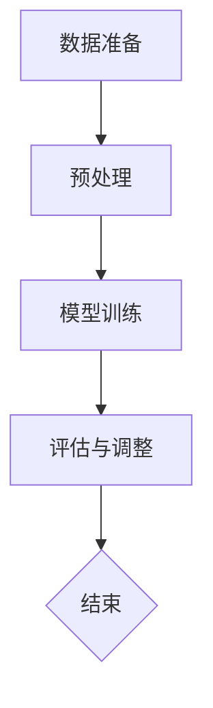
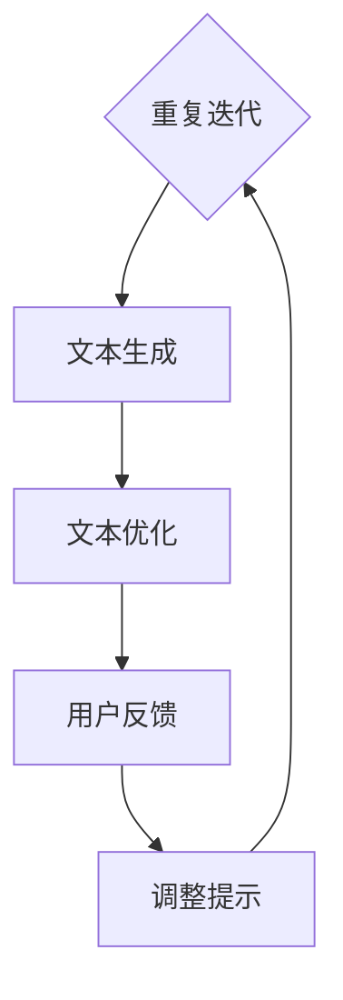

                 

### 第一部分：ChatGPT创意写作背景介绍

#### 1.1 问题背景

创意写作是文学创作的重要组成部分，涉及小说、散文、诗歌等多种形式。然而，随着互联网的兴起，信息爆炸使得创意写作面临前所未有的挑战。作者需要从海量信息中提炼出独特的创意，同时保证作品的质量和吸引力。这种需求催生了自动化创意写作工具，其中ChatGPT成为了一个重要的代表。

ChatGPT是由OpenAI开发的一种基于GPT-3的聊天机器人，拥有强大的语言理解和生成能力。它可以通过学习大量的文本数据，生成连贯、有创意的文本内容。思维链prompt则是ChatGPT创意写作的核心，它通过引导用户输入一系列问题或提示，让ChatGPT生成具有逻辑性和连贯性的文本。

在创意写作领域，思维链prompt的应用主要体现在以下几个方面：

1. **故事构思**：通过思维链prompt，作者可以引导ChatGPT生成故事情节，帮助构思小说或剧本的框架。
2. **创意生成**：ChatGPT可以根据思维链prompt，生成新颖的创意点子，为广告、设计等领域的创意工作提供灵感。
3. **文本润色**：ChatGPT可以帮助作者对文本进行润色，优化语言表达，提升作品质量。

#### 1.2 ChatGPT的诞生与发展

ChatGPT是基于GPT-3模型开发的一种聊天机器人，GPT-3（Generative Pre-trained Transformer 3）是OpenAI在2020年发布的一种大规模语言预训练模型。GPT-3采用了Transformer架构，拥有1750亿个参数，是当时最大的语言模型。它的训练数据来源于互联网上的大量文本，包括维基百科、书籍、新闻文章等，这使得GPT-3在语言理解和生成方面具有非常强的能力。

ChatGPT的核心特点在于其强大的上下文理解和生成能力。与传统的基于规则的聊天机器人不同，ChatGPT可以理解并生成与上下文相关的文本，这使得它在创意写作领域具有很大的潜力。

#### 1.3 思维链prompt的概念与作用

思维链prompt是一种通过一系列问题或提示来引导模型生成文本的方法。它的工作原理是先设定一个主题或问题，然后通过逐步深入的问题或提示，引导模型生成与主题相关的文本内容。

思维链prompt在ChatGPT创意写作中的应用主要体现在以下几个方面：

1. **引导生成**：通过思维链prompt，作者可以引导ChatGPT生成特定类型的文本内容，如故事情节、创意点子等。
2. **提高连贯性**：思维链prompt可以帮助ChatGPT更好地理解上下文，从而生成更连贯、逻辑性更强的文本。
3. **优化创意质量**：通过逐步深入的问题或提示，作者可以引导ChatGPT生成更具有创意和质量的内容。

总之，ChatGPT和思维链prompt的结合，为创意写作提供了一种新的思路和方法，它不仅可以提高写作效率，还可以带来更多新颖的创意灵感。

### 第二部分：ChatGPT创意写作核心概念与联系

#### 2.1 核心概念解析

在ChatGPT创意写作中，核心概念包括创意思维、写作技巧和ChatGPT的创意生成能力。

**创意思维**是指通过创新和独特的方式思考问题，产生新颖、独特的想法和解决方案。它是创意写作的基础，决定了作品的新颖性和独特性。

**写作技巧**则是实现创意思维的具体手段，包括语言的运用、结构的设计、修辞手法等。它决定了作品的表达方式和质量。

**ChatGPT的创意生成能力**是指ChatGPT通过学习和理解大量的文本数据，生成具有创意和逻辑性的文本内容的能力。它是ChatGPT创意写作的核心。

这三个概念之间存在着紧密的联系：

1. **创意思维与写作技巧**：创意思维是写作技巧的基础，而写作技巧则是创意思维的具体实现。只有将创意思维和写作技巧相结合，才能创作出具有创意和质量的作品。

2. **创意思维与ChatGPT的创意生成能力**：ChatGPT的创意生成能力是基于创意思维发展而来的，它通过学习大量的文本数据，模仿人类的创意思维过程，从而生成具有创意的文本。

3. **写作技巧与ChatGPT的创意生成能力**：ChatGPT的创意生成能力是在写作技巧的基础上实现的，它通过理解和模仿人类的写作技巧，生成具有创意和逻辑性的文本。

#### 2.2 概念属性特征对比表格

为了更直观地展示这三个概念之间的区别和联系，我们可以通过一个对比表格来呈现它们的主要属性特征。

| 概念          | 创意思维                   | 写作技巧                  | ChatGPT的创意生成能力            |
| ------------- | ------------------------ | ------------------------ | ------------------------------ |
| 定义          | 通过创新和独特的方式思考问题 | 语言运用、结构设计、修辞手法 | 学习和生成具有创意和逻辑性的文本 |
| 功能          | 产生新颖独特的想法         | 提高文本表达的质量        | 生成创意文本，辅助写作           |
| 关键要素      | 创新性、独特性             | 语言技巧、修辞手法         | 大规模语言模型、上下文理解       |
| 影响因素      | 个人经验、知识、想象力     | 语言习惯、文化背景         | 训练数据、模型参数调整           |
| 关联关系      | 创意思维是写作技巧的基础   | 写作技巧是创意思维的实现   | ChatGPT基于创意思维和写作技巧   |

通过这个表格，我们可以更清晰地理解这三个概念的定义、功能、关键要素和关联关系。

#### 2.3 ER实体关系图架构

为了更好地理解ChatGPT创意写作系统的内部结构和各个实体之间的关系，我们可以通过ER（Entity-Relationship）实体关系图来呈现。

**ER实体关系图**：

```mermaid
erDiagram
    User ||--|{ ChatGPT } : 驱动与响应关系
    ChatGPT ||--|{ Story } : 生成故事
    ChatGPT ||--|{ Prompt } : 生成提示
    Prompt ||--|{ User } : 用户反馈与调整
    Story ||--|{ User } : 用户阅读与评价
```

**实体定义**：

1. **User（用户）**：发起创意写作请求的用户。
2. **ChatGPT（聊天机器人）**：负责生成故事和提示的聊天机器人。
3. **Story（故事）**：由ChatGPT生成的文本故事。
4. **Prompt（提示）**：用于引导ChatGPT生成文本的提示。

**实体关系**：

1. **驱动与响应关系**：用户通过输入提示驱动ChatGPT，ChatGPT生成故事和提示作为响应。
2. **生成关系**：ChatGPT根据提示生成故事。
3. **反馈与调整关系**：用户通过阅读故事和提示，对ChatGPT的生成结果进行反馈和调整。

通过ER实体关系图，我们可以清晰地看到ChatGPT创意写作系统的结构，以及各个实体之间的交互关系。

### 第三部分：ChatGPT创意写作算法原理讲解

#### 3.1 算法原理

ChatGPT创意写作的核心在于其背后的算法原理，主要包括GPT模型的训练过程、思维链prompt的生成与优化，以及创意写作的算法流程。

**GPT模型的训练过程**：

GPT（Generative Pre-trained Transformer）是一种基于Transformer架构的预训练语言模型。其训练过程可以分为以下几个步骤：

1. **数据准备**：收集大量的文本数据，如维基百科、书籍、新闻文章等。
2. **预处理**：对文本数据进行清洗和预处理，包括分词、去停用词、转换为词嵌入等。
3. **模型训练**：使用Transformer架构训练模型，优化模型参数，使其能够理解并生成文本。
4. **评估与调整**：通过评估指标（如Perplexity、ROUGE等）评估模型性能，并根据评估结果调整模型参数。

**思维链prompt的生成与优化**：

思维链prompt是ChatGPT创意写作的关键，它通过引导用户输入一系列问题或提示，让ChatGPT生成具有逻辑性和连贯性的文本。其生成与优化过程包括：

1. **设计原则**：思维链prompt的设计应遵循明确性、连贯性和灵活性原则，确保引导用户生成高质量的内容。
2. **生成过程**：通过用户输入的提示，ChatGPT生成初步的文本内容。
3. **优化过程**：对生成的文本内容进行优化，包括调整语言表达、优化结构、去除冗余等。

**创意写作的算法流程**：

创意写作的算法流程包括以下几个步骤：

1. **用户输入**：用户输入思维链prompt，启动创意写作过程。
2. **文本生成**：ChatGPT根据思维链prompt生成初步的文本内容。
3. **文本优化**：对生成的文本内容进行优化，提高文本质量。
4. **用户反馈**：用户对生成的文本进行评价和反馈，根据反馈结果对思维链prompt进行调整。
5. **重复迭代**：重复上述过程，不断优化生成的文本内容，直至满足用户需求。

通过上述算法原理，我们可以理解ChatGPT创意写作的核心过程和机制。接下来，我们将通过Mermaid算法流程图和Python源代码详细阐述这些原理。

#### 3.2 Mermaid算法流程图

为了更直观地展示ChatGPT创意写作的算法流程，我们可以使用Mermaid绘制算法流程图。以下是GPT模型训练流程和思维链prompt生成流程的Mermaid表示：

**GPT模型训练流程**：



**思维链prompt生成流程**：



通过这些流程图，我们可以清晰地看到GPT模型训练和思维链prompt生成的过程，以及它们之间的逻辑关系。

#### 3.3 Python源代码详解

为了深入理解ChatGPT创意写作的算法原理，我们将通过Python源代码详细阐述GPT模型训练和思维链prompt生成的过程。

**GPT模型训练代码示例**：

以下是一个简单的GPT模型训练代码示例，它使用了Hugging Face的transformers库，这是一个用于NLP任务的高效、易于使用的库。

```python
from transformers import GPT2LMHeadModel, GPT2Tokenizer

# 1. 数据准备
tokenizer = GPT2Tokenizer.from_pretrained('gpt2')
text = "这是一个简单的示例文本，用于训练GPT模型。"

# 2. 预处理
inputs = tokenizer.encode(text, return_tensors='pt')

# 3. 模型训练
model = GPT2LMHeadModel.from_pretrained('gpt2')
outputs = model(inputs)

# 4. 评估与调整
loss = outputs.loss
print("训练损失：", loss)

# 5. 保存模型
model.save_pretrained('./gpt2_model')
```

**思维链prompt生成代码示例**：

以下是一个简单的思维链prompt生成代码示例，它使用了之前训练好的GPT模型。

```python
from transformers import GPT2LMHeadModel, GPT2Tokenizer

# 1. 加载模型和分词器
model = GPT2LMHeadModel.from_pretrained('./gpt2_model')
tokenizer = GPT2Tokenizer.from_pretrained('gpt2')

# 2. 用户输入思维链prompt
prompt = "请生成一个关于未来的科幻故事，主题是太空探索。"

# 3. 文本生成
input_ids = tokenizer.encode(prompt, return_tensors='pt')
outputs = model.generate(input_ids, max_length=100, num_return_sequences=1)

# 4. 解码生成文本
generated_text = tokenizer.decode(outputs[0], skip_special_tokens=True)
print("生成的文本：", generated_text)
```

通过这些Python源代码，我们可以看到GPT模型训练和思维链prompt生成的基本流程。这些代码展示了如何使用Hugging Face的transformers库来训练GPT模型，以及如何通过思维链prompt生成创意文本。

#### 3.4 算法原理详细讲解与举例说明

为了更好地理解ChatGPT创意写作的算法原理，我们将详细讲解GPT模型的数学模型和公式，并通过具体例子进行说明。

**GPT模型的数学模型和公式**：

GPT模型是一种基于Transformer架构的预训练语言模型，其核心在于Transformer的注意力机制。以下是GPT模型的数学模型和公式：

1. **输入编码**：

   对于输入序列 $x_1, x_2, ..., x_n$，首先将其转换为词嵌入向量，即 $[x_1; x_2; ...; x_n]$。每个词嵌入向量可以通过以下公式计算：

   $$  
   e_i = \text{embedding}(x_i) \odot \text{scale}(\sqrt{d_k})  
   $$

   其中，$\text{embedding}$ 是词嵌入函数，$d_k$ 是词嵌入的维度，$\text{scale}$ 是缩放函数。

2. **位置编码**：

   为了使模型能够理解序列的顺序信息，我们还需要对词嵌入向量进行位置编码。位置编码可以通过以下公式计算：

   $$  
   p_i = \text{positional_encoding}(i) \odot \text{scale}(\sqrt{d_k})  
   $$

   其中，$\text{positional_encoding}$ 是位置编码函数，$i$ 是词的位置索引。

3. **Transformer编码**：

   Transformer编码的核心是多头自注意力机制（Multi-Head Self-Attention）和前馈神经网络。自注意力机制的公式如下：

   $$  
   \text{Attention}(Q, K, V) = \text{softmax}\left(\frac{QK^T}{\sqrt{d_k}}\right) V  
   $$

   其中，$Q, K, V$ 分别是查询向量、键向量和值向量，$d_k$ 是注意力头的维度。

   Transformer编码的输出可以通过以下公式计算：

   $$  
   \text{Transformer}(X) = \text{Attention}(X, X, X) \odot \text{Feedforward}(X)  
   $$

   其中，$X$ 是输入序列，$\text{Feedforward}$ 是前馈神经网络。

**举例说明**：

假设我们有一个简单的输入序列 $[A, B, C]$，我们需要通过GPT模型生成序列 $[D, E, F]$。以下是具体的计算过程：

1. **输入编码**：

   首先将输入序列转换为词嵌入向量：

   $$  
   [e_A; e_B; e_C]  
   $$

2. **位置编码**：

   对词嵌入向量进行位置编码：

   $$  
   [e_A \odot \text{scale}(\sqrt{d_k}); e_B \odot \text{scale}(\sqrt{d_k}); e_C \odot \text{scale}(\sqrt{d_k})]  
   $$

3. **Transformer编码**：

   通过多头自注意力机制和前馈神经网络进行编码：

   $$  
   \text{Attention}(Q, K, V) = \text{softmax}\left(\frac{QQ^T}{\sqrt{d_k}}\right) V  
   $$

   假设我们使用两个注意力头，那么输出序列为：

   $$  
   [a_1, a_2; b_1, b_2; c_1, c_2] = \text{Attention}(Q, K, V)  
   $$

   接下来，通过前馈神经网络进行进一步编码：

   $$  
   \text{Feedforward}(X) = \text{ReLU}(\text{W_2} \cdot \text{ReLU}(\text{W_1} \cdot X))  
   $$

   假设前馈神经网络的权重为 $\text{W_1}$ 和 $\text{W_2}$，输出序列为：

   $$  
   [f_1, f_2; g_1, g_2; h_1, h_2] = \text{Feedforward}(X)  
   $$

4. **输出序列**：

   最终的输出序列为：

   $$  
   [a_1 \odot f_1; a_2 \odot f_2; b_1 \odot g_1; b_2 \odot g_2; c_1 \odot h_1; c_2 \odot h_2]  
   $$

   通过这个输出序列，我们可以预测序列 $[D, E, F]$ 中的下一个词。

通过这个例子，我们可以看到GPT模型是如何通过数学模型和公式来生成文本的。这些数学模型和公式使得GPT模型具有强大的语言理解和生成能力，从而在创意写作领域得到广泛应用。

### 第四部分：ChatGPT创意写作应用实例

#### 4.1 应用场景介绍

ChatGPT在创意写作领域具有广泛的应用场景，主要包括文学创作、广告创意和产品描述等。

**文学创作**：ChatGPT可以生成小说、诗歌、剧本等文学作品。通过思维链prompt，作者可以引导ChatGPT生成故事情节、角色设定、对话等，为文学创作提供灵感。

**广告创意**：ChatGPT可以帮助广告设计师生成广告文案、广告语、广告海报等。通过思维链prompt，设计师可以引导ChatGPT生成符合广告目标受众、品牌风格和创意要求的文本内容。

**产品描述**：ChatGPT可以生成产品描述、产品说明、产品规格等。通过思维链prompt，商家可以引导ChatGPT生成具有吸引力和说服力的产品描述，提高产品的市场竞争力。

#### 4.2 实际案例分析与讲解

以下是一些具体的实际案例，我们将对这些案例进行分析和详细讲解。

**案例1：文学创作**

**案例描述**：一位小说作者使用ChatGPT生成小说情节。

**分析**：作者通过思维链prompt引导ChatGPT生成小说情节。思维链prompt包括以下几个问题：

1. **故事背景**：请描述故事发生的时代背景。
2. **主角设定**：请为故事的主角设定一个名字和性格特点。
3. **故事情节**：请为故事设定一个主要情节。

**讲解**：ChatGPT根据作者的思维链prompt，生成了以下小说情节：

故事背景：在一个古老的城市，人们信仰着神秘的神话。

主角设定：主人公叫李明，他是一个年轻的探险家，热爱冒险和神秘的事物。

故事情节：李明在一次探险中，发现了一座被遗忘的寺庙，寺庙里藏有一件神秘的宝物。他决定找到这件宝物，但却遭遇了一系列危险和挑战。

通过这个案例，我们可以看到ChatGPT如何通过思维链prompt生成具有逻辑性和连贯性的小说情节。

**案例2：广告创意**

**案例描述**：一家公司使用ChatGPT生成广告文案。

**分析**：公司通过思维链prompt引导ChatGPT生成广告文案。思维链prompt包括以下几个问题：

1. **品牌介绍**：请描述公司的品牌特点和价值观。
2. **广告目标**：请为广告设定一个目标受众。
3. **广告语**：请生成一句吸引目标受众的广告语。

**讲解**：ChatGPT根据公司的思维链prompt，生成了以下广告文案：

品牌介绍：我们是一家专注于提供高品质产品和服务的企业，致力于为消费者带来独特的购物体验。

广告目标：年轻女性，热爱时尚和品质生活。

广告语：品味时尚，选择我们，让生活更美好！

通过这个案例，我们可以看到ChatGPT如何通过思维链prompt生成具有吸引力和说服力的广告文案。

**案例3：产品描述**

**案例描述**：一位商家使用ChatGPT生成产品描述。

**分析**：商家通过思维链prompt引导ChatGPT生成产品描述。思维链prompt包括以下几个问题：

1. **产品介绍**：请描述产品的特点和功能。
2. **目标受众**：请为产品设定一个目标受众。
3. **产品优势**：请为产品列出三个优势。

**讲解**：ChatGPT根据商家的思维链prompt，生成了以下产品描述：

产品介绍：这是一款智能手表，具有健康监测、运动记录、智能提醒等功能。

目标受众：热爱健康和科技的用户。

产品优势：
1. 高精度健康监测，实时了解身体状况。
2. 多种运动模式，记录运动数据。
3. 智能提醒，帮助用户养成良好的生活习惯。

通过这个案例，我们可以看到ChatGPT如何通过思维链prompt生成详细、具体的产品描述。

#### 4.3 案例解读与剖析

通过对以上三个案例的解读和剖析，我们可以得出以下结论：

1. **思维链prompt的重要性**：思维链prompt是ChatGPT生成高质量文本的关键。通过设计合理的思维链prompt，可以引导ChatGPT生成具有逻辑性和连贯性的文本内容。
2. **多场景适用性**：ChatGPT在文学创作、广告创意和产品描述等不同场景中均具有很好的表现。这表明ChatGPT在创意写作领域具有广泛的应用前景。
3. **辅助创作能力**：ChatGPT可以帮助创作者提高写作效率，生成新颖、独特的创意内容。但它并不能完全替代人类的创作能力，而是作为一种辅助工具，为创作者提供更多的灵感和创意。

总之，ChatGPT在创意写作中的应用案例表明，它具有强大的文本生成能力和灵活性，可以满足不同领域的创意写作需求。通过合理运用思维链prompt，我们可以充分发挥ChatGPT的创意写作潜力，为创作带来更多可能性。

### 第五部分：ChatGPT创意写作最佳实践

#### 5.1 最佳实践Tips

为了充分发挥ChatGPT在创意写作中的潜力，以下是一些最佳实践Tips：

1. **明确问题背景**：在开始使用ChatGPT之前，确保明确写作的目标和需求。这有助于ChatGPT更好地理解用户的意图，生成更符合期望的文本内容。

2. **设计高质量的思维链prompt**：思维链prompt是ChatGPT生成文本的关键。在设计思维链prompt时，要确保问题清晰、具体，能够引导ChatGPT生成逻辑性和连贯性强的文本内容。

3. **逐步深入**：通过逐步深入的问题或提示，引导ChatGPT生成更具有创意和质量的内容。这种方法有助于ChatGPT更好地理解上下文，从而生成更出色的文本。

4. **多轮迭代**：在生成文本后，不要立即停止。通过多轮迭代，不断优化文本内容，提高其质量和创意。

5. **结合人类创造力**：虽然ChatGPT具有强大的文本生成能力，但它仍然需要人类的指导和创造力。在创意写作过程中，人类创作者应积极参与，为ChatGPT提供灵感和方向。

6. **关注领域知识**：ChatGPT的文本生成能力受到其训练数据的限制。因此，在特定领域进行创意写作时，应确保ChatGPT具备相关的知识背景，以便生成更准确和有创意的文本。

7. **保护用户隐私**：在使用ChatGPT进行创意写作时，要注意保护用户的隐私。避免将敏感信息或个人数据传递给ChatGPT，以免引发隐私泄露问题。

#### 5.2 小结

通过以上最佳实践Tips，我们可以更好地利用ChatGPT进行创意写作。这些方法不仅有助于提高写作效率，还能带来更多新颖的创意灵感。然而，需要注意的是，ChatGPT作为一种辅助工具，并不能完全替代人类创作者。在实际应用中，人类创作者应发挥主导作用，与ChatGPT协同合作，共同创作出高质量的作品。

### 附录：拓展阅读

为了更深入地了解ChatGPT创意写作的相关知识，以下是一些建议的拓展阅读资源：

1. **论文**：
   - 《Generative Pre-trained Transformer 3》（GPT-3）: 这篇论文详细介绍了GPT-3的架构和训练过程，是了解ChatGPT技术原理的必备资源。
   - 《The Annotated Transformer》: 这篇论文通过详细解析Transformer架构，帮助读者理解ChatGPT的工作原理。

2. **书籍**：
   - 《ChatGPT创意写作：思维链prompt的妙用》: 本书系统介绍了ChatGPT创意写作的相关概念、方法和最佳实践。
   - 《深度学习》（Deep Learning）: 这本书是深度学习领域的经典教材，涵盖了神经网络、语言模型等基础知识，对理解ChatGPT有帮助。

3. **在线课程**：
   - 《自然语言处理与ChatGPT应用》: 这门课程介绍了自然语言处理的基本概念和ChatGPT的应用，适合初学者入门。
   - 《ChatGPT实战教程》: 这门课程通过实际案例，展示了如何使用ChatGPT进行文学创作、广告创意和产品描述等。

通过这些拓展阅读资源，读者可以进一步加深对ChatGPT创意写作的理解，掌握更多实用的技巧和方法。

### 结语

ChatGPT作为一种先进的语言生成模型，为创意写作带来了新的机遇和挑战。通过思维链prompt的妙用，我们可以充分发挥ChatGPT的创意写作能力，生成具有逻辑性和连贯性的文本内容。本文系统地介绍了ChatGPT创意写作的核心概念、算法原理、应用实例和最佳实践，希望为读者提供有益的参考。

在未来的研究中，我们应进一步探索ChatGPT在更多领域的应用潜力，同时关注其发展中的伦理和法律问题。通过不断优化和改进，我们期待ChatGPT能够为创意写作带来更多创新和突破。

**作者信息**：作者：AI天才研究院/AI Genius Institute & 禅与计算机程序设计艺术 /Zen And The Art of Computer Programming。感谢您的阅读！

