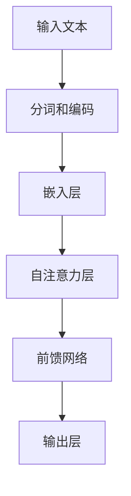
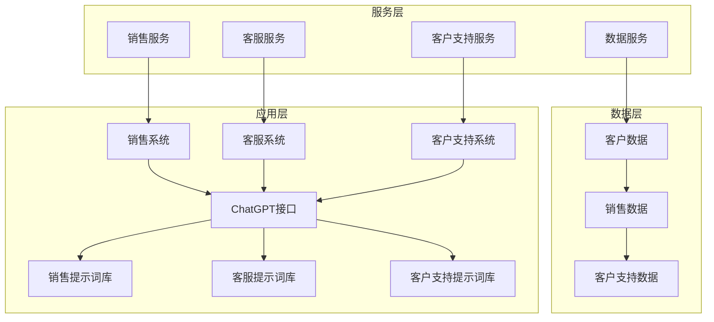
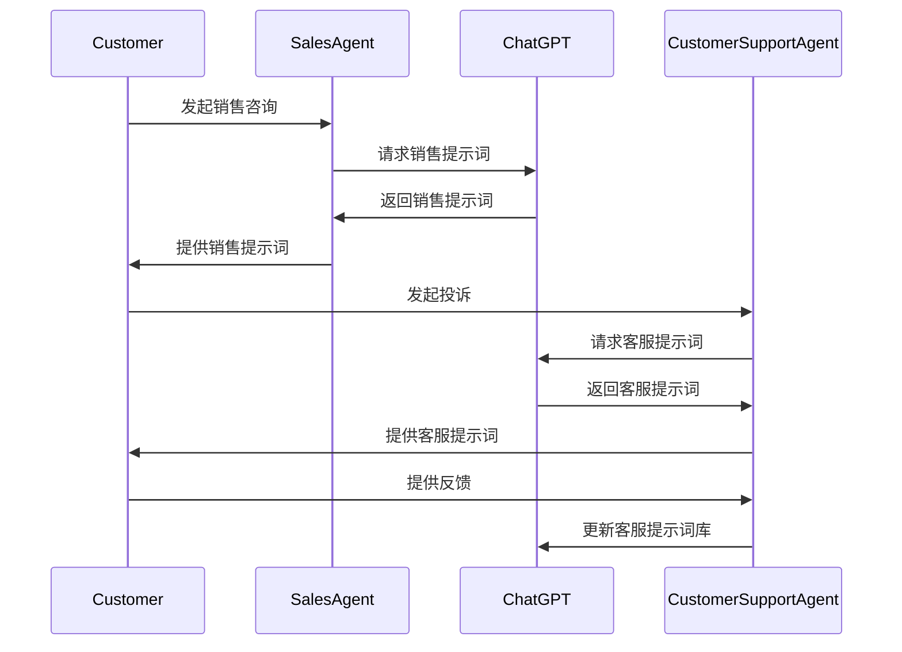

                 

# ChatGPT商业应用：设计有效的销售和客服提示词

## 关键词
- ChatGPT
- 商业应用
- 销售和客服提示词
- 优化策略
- 案例分析

## 摘要
本文将探讨ChatGPT在商业领域的应用，特别是其在销售和客服场景中的提示词设计。通过深入分析销售和客服的痛点，我们将一步步设计出有效的提示词，以优化销售和客服流程。同时，本文还将结合实际案例，分析ChatGPT在商业应用中的效果和挑战，为未来的应用提供策略和展望。

### 目录大纲设计

#### 第1章 引言
- **1.1 问题背景与商业意义**
  - ChatGPT在商业领域的应用场景
  - ChatGPT带来的商业机会与挑战
- **1.2 书籍目标读者**
  - 面向人群
  - 预期学习效果
- **1.3 内容结构与章节安排**
  - 全书章节概述
  - 各章节主要内容

#### 第2章 ChatGPT基础
- **2.1 ChatGPT概述**
  - 定义与特点
  - 发展历程
- **2.2 ChatGPT模型架构**
  - Transformer模型介绍
  - ChatGPT架构细节
- **2.3 ChatGPT编程接口**
  - API使用方法
  - 高级API技巧

#### 第3章 ChatGPT在销售中的应用
- **3.1 销售场景分析**
  - 销售流程与痛点
  - ChatGPT的应用机会
- **3.2 设计销售提示词**
  - 提示词设计原则
  - 实例分析
- **3.3 销售话术优化**
  - 话术评估方法
  - 优化策略

#### 第4章 ChatGPT在客服中的应用
- **4.1 客服场景分析**
  - 客服流程与痛点
  - ChatGPT的应用机会
- **4.2 设计客服提示词**
  - 提示词设计原则
  - 实例分析
- **4.3 客服对话优化**
  - 对话评估方法
  - 优化策略

#### 第5章 ChatGPT在客户支持中的应用
- **5.1 客户支持场景分析**
  - 客户支持流程与痛点
  - ChatGPT的应用机会
- **5.2 设计支持提示词**
  - 提示词设计原则
  - 实例分析
- **5.3 支持对话优化**
  - 对话评估方法
  - 优化策略

#### 第6章 ChatGPT应用案例分析
- **6.1 案例选择与背景介绍**
  - 企业背景
  - 应用案例选择
- **6.2 案例实施与效果分析**
  - 实施步骤
  - 效果评估
- **6.3 案例总结与经验分享**
  - 成功经验
  - 挑战与解决方案

#### 第7章 ChatGPT应用策略与未来展望
- **7.1 ChatGPT应用策略**
  - 策略制定原则
  - 实施步骤
- **7.2 ChatGPT在商业领域的未来趋势**
  - 发展方向
  - 影响因素
- **7.3 总结与展望**
  - 主要成果
  - 下一步工作建议

---

**注意：以上目录大纲仅为示例，具体内容可能需要根据书籍详细内容进行调整和补充。每个章节下的子标题可以根据具体内容进一步细化。**

### 第1章 引言

#### 1.1 问题背景与商业意义

近年来，人工智能（AI）技术的飞速发展，尤其是深度学习、自然语言处理（NLP）等领域的突破，使得AI在各个行业中的应用逐渐普及。ChatGPT作为OpenAI开发的一种基于Transformer模型的预训练语言模型，以其强大的文本生成和语义理解能力，在多个领域展现出了巨大的商业潜力。

在商业领域，销售和客服是两个至关重要的环节。销售环节涉及到与潜在客户的沟通、产品展示、价格谈判等，客服环节则涉及到客户咨询、问题解答、投诉处理等。传统的人工操作在这些环节中面临着效率低、成本高、质量不稳定等问题。而ChatGPT的引入，有望通过自动化和智能化手段，解决这些问题，提高企业的运营效率和客户满意度。

首先，ChatGPT在销售中的应用，可以通过智能化的销售对话，提高销售效率和成功率。例如，ChatGPT可以自动回答客户的常见问题，提供产品的详细信息，甚至进行价格谈判。这样，销售人员可以更多地专注于复杂的销售任务，如建立客户关系、处理复杂问题等。

其次，ChatGPT在客服中的应用，可以提供24/7的全天候服务，提高客户满意度。ChatGPT可以快速响应用户的查询，提供准确的信息，减少用户等待时间。同时，ChatGPT还可以通过学习用户的反馈，不断优化服务质量。

然而，ChatGPT在商业应用中也面临一些挑战。首先，提示词的设计和优化是关键。提示词的质量直接影响ChatGPT的回答质量和用户体验。其次，如何确保ChatGPT的回答符合商业逻辑和道德规范，也是一个重要的挑战。

#### 1.2 书籍目标读者

本书的目标读者主要包括以下几类人群：

1. **销售和客服专业人士**：希望了解如何利用ChatGPT提高销售效率和客户满意度。
2. **AI技术开发者**：希望深入了解ChatGPT的工作原理和应用方法。
3. **企业管理者**：希望了解AI技术在商业中的应用潜力，特别是ChatGPT在销售和客服中的应用。
4. **学术研究人员**：对AI在商业领域的应用有深入研究兴趣。

#### 1.3 内容结构与章节安排

本书共分为7章，内容结构如下：

- **第1章 引言**：介绍问题背景与商业意义，明确书籍的目标读者和内容结构。
- **第2章 ChatGPT基础**：介绍ChatGPT的基本概念、模型架构和编程接口。
- **第3章 ChatGPT在销售中的应用**：分析销售场景，设计销售提示词，优化销售话术。
- **第4章 ChatGPT在客服中的应用**：分析客服场景，设计客服提示词，优化客服对话。
- **第5章 ChatGPT在客户支持中的应用**：分析客户支持场景，设计支持提示词，优化支持对话。
- **第6章 ChatGPT应用案例分析**：选择实际案例，分析实施步骤和效果评估。
- **第7章 ChatGPT应用策略与未来展望**：提出应用策略，展望未来发展趋势。

通过以上章节的安排，本书旨在帮助读者全面了解ChatGPT在商业领域的应用，掌握有效的提示词设计方法和优化策略。希望本书能够为读者在销售和客服领域提供有益的参考和指导。

### 第2章 ChatGPT基础

#### 2.1 ChatGPT概述

ChatGPT是由OpenAI开发的一种基于Transformer模型的预训练语言模型。它采用了最先进的自然语言处理技术，具有强大的文本生成和语义理解能力。ChatGPT的名称来源于其核心功能——“生成预训练”（Generative Pre-trained Transformer）。

ChatGPT的主要特点包括：

1. **强大的文本生成能力**：ChatGPT能够生成连贯、自然的文本，无论是回答问题、撰写文章，还是进行对话，都能表现得非常出色。
2. **高效的语义理解**：ChatGPT通过大规模的预训练，对语言的理解非常深入，能够准确理解文本的含义，并进行合理的推断和回答。
3. **灵活的应用场景**：ChatGPT可以应用于多个领域，包括但不限于问答系统、聊天机器人、内容创作、文本摘要等。

ChatGPT的发展历程可以追溯到2018年，当时OpenAI发布了GPT-1，这是一个具有1.17亿参数的预训练语言模型。随后，OpenAI不断优化模型，发布了GPT-2、GPT-3等版本，每个版本在参数规模、性能和功能上都有显著的提升。

#### 2.2 ChatGPT模型架构

ChatGPT基于Transformer模型架构，这是一种用于处理序列数据的深度神经网络模型。Transformer模型的核心思想是使用自注意力机制（Self-Attention）来捕捉输入序列中的依赖关系。

ChatGPT的架构包括以下几个主要部分：

1. **输入层**：输入层负责接收文本数据，并将其转换为模型可以处理的格式。通常，文本数据会经过分词、编码等预处理步骤，转换为序列。
2. **嵌入层**：嵌入层将输入序列中的每个单词或字符映射为一个高维向量，这些向量代表了单词或字符的语义信息。
3. **自注意力层**：自注意力层是Transformer模型的核心，通过计算输入序列中各个单词之间的依赖关系，生成一个权重矩阵，这个矩阵用于更新输入序列的向量表示。
4. **前馈网络**：前馈网络是一个简单的全连接网络，用于对自注意力层输出的向量进行进一步处理，增强模型的表示能力。
5. **输出层**：输出层负责生成预测的文本序列。通常，输出层使用一个软性层（Softmax）将预测的文本映射到概率分布，然后从这个概率分布中选择最有可能的文本作为输出。

#### 2.3 ChatGPT编程接口

ChatGPT提供了丰富的编程接口，使得开发者可以方便地使用ChatGPT模型进行文本生成和语义理解任务。

1. **API使用方法**：

   ChatGPT的API使用方法非常简单。开发者只需要发送一个请求，包括输入文本和请求类型，即可获取ChatGPT的响应。以下是Python代码示例：

   ```python
   import openai
   
   openai.api_key = 'your-api-key'
   response = openai.Completion.create(
       engine="text-davinci-002",
       prompt="What is your favorite color?",
       max_tokens=50
   )
   print(response.choices[0].text.strip())
   ```

2. **高级API技巧**：

   ChatGPT的API不仅支持简单的文本生成，还支持更高级的功能，如多轮对话、参数化输入等。

   - **多轮对话**：通过设置`temperature`参数，可以控制ChatGPT的回答随机性。设置`temperature`为0，ChatGPT会给出非常确定性的回答，而设置较高的温度，ChatGPT的回答则会更加多样化。
   
   - **参数化输入**：ChatGPT支持使用模板和参数进行输入，从而生成个性化的文本。例如，可以使用参数化输入来生成销售邮件、客服回复等。

   ```python
   template = "Hello {name}, thank you for your interest in our product. {description}."
   parameters = {"name": "John", "description": "This is a high-quality product that will solve all your problems."}
   prompt = template.format(**parameters)
   response = openai.Completion.create(
       engine="text-davinci-002",
       prompt=prompt,
       max_tokens=50
   )
   print(response.choices[0].text.strip())
   ```

通过以上内容，读者可以对ChatGPT有基本的了解。接下来，我们将进一步探讨ChatGPT在销售和客服场景中的应用，帮助读者更好地利用这一强大的工具。

### 第3章 ChatGPT在销售中的应用

#### 3.1 销售场景分析

销售环节是企业与客户互动的关键环节，涉及产品介绍、需求分析、价格谈判、订单处理等多个步骤。在这个过程中，销售人员的沟通技巧和专业知识直接影响着销售的成功率和客户满意度。

**销售流程与痛点**

1. **产品介绍**：销售人员在向潜在客户介绍产品时，需要准确、生动地传达产品的特点和优势。然而，由于产品信息繁多，销售人员有时难以做到全面、准确地介绍，导致客户对产品理解不深，影响购买决策。
2. **需求分析**：在了解客户需求的过程中，销售人员需要通过提问、聆听等方式，准确捕捉客户的需求点。然而，这一过程往往需要大量时间，且客户的需求可能复杂多变，使得销售人员难以迅速做出反应。
3. **价格谈判**：价格谈判是销售过程中的重要环节。销售人员需要在确保利润的同时，尽量满足客户的价格要求。然而，价格敏感的客户往往会使谈判过程变得复杂和耗时。
4. **订单处理**：订单处理包括确认订单、支付、发货等多个步骤。在这个过程中，销售人员需要与内部团队（如客服、物流等）紧密协作，确保订单能够及时、准确地完成。

**ChatGPT的应用机会**

ChatGPT在销售环节中具有广泛的应用机会，可以通过自动化和智能化手段，解决上述痛点，提高销售效率和客户满意度。

1. **产品介绍**：ChatGPT可以自动生成产品介绍文本，包括产品的特点、优势、应用场景等。这样，销售人员可以节省时间，将更多精力投入到复杂的销售任务中。
2. **需求分析**：ChatGPT可以通过自然语言处理技术，快速理解客户的问题和需求，提供即时的反馈和建议。这样，销售人员可以更准确地捕捉客户的需求，提高销售成功率。
3. **价格谈判**：ChatGPT可以模拟销售人员与客户进行价格谈判，通过学习历史谈判数据和策略，生成最优的价格谈判方案。这样，销售人员可以更加高效地处理价格敏感的客户。
4. **订单处理**：ChatGPT可以协助销售人员处理订单，包括确认订单、支付、发货等步骤。通过与内部团队的协作，确保订单能够及时、准确地完成。

#### 3.2 设计销售提示词

设计有效的销售提示词是ChatGPT在销售场景中发挥作用的关键。提示词的设计原则如下：

1. **明确性**：提示词应尽量明确，避免歧义。这样，ChatGPT可以准确理解用户的问题和需求，提供有针对性的回答。
2. **针对性**：提示词应针对不同的销售场景和客户需求进行设计。例如，针对产品介绍的场景，提示词可以侧重于产品的特点和应用；针对需求分析的场景，提示词可以侧重于询问客户的需求和痛点。
3. **灵活性**：提示词应具有一定的灵活性，以适应不同的情况和变化。例如，在价格谈判的场景中，提示词可以根据客户的价格要求，灵活调整报价策略。

**实例分析**

以下是一些具体的设计实例：

1. **产品介绍**：

   - 提示词：“请描述一下我们的产品XX的特点和优势。”
   - ChatGPT回答：“我们的产品XX采用最新的XX技术，具有以下特点：...”
   
2. **需求分析**：

   - 提示词：“您对这款产品有哪些具体的需求？”
   - ChatGPT回答：“您是否希望这款产品能够解决以下问题：...”

3. **价格谈判**：

   - 提示词：“针对您的预算，我们可以提供以下报价方案。”
   - ChatGPT回答：“我们的报价方案如下：...，这个价格在您的预算范围内，可以满足您的需求。”

通过以上设计实例，我们可以看到，ChatGPT可以有效地帮助销售人员应对销售过程中的各种挑战，提高销售效率和客户满意度。

#### 3.3 销售话术优化

销售话术的优化是提高销售效率和成功率的关键。ChatGPT可以通过以下方法优化销售话术：

1. **话术评估方法**：

   - **质量评估**：通过对销售话术的文本进行分析，评估其内容质量、逻辑连贯性、表述准确性等。
   - **效果评估**：通过实际销售场景中的测试，评估销售话术的实际效果，包括客户满意度、销售转化率等。

2. **优化策略**：

   - **内容优化**：针对评估中发现的问题，对销售话术的内容进行修改和优化。例如，增加产品特点、突出客户需求等。
   - **逻辑优化**：确保销售话术的逻辑连贯性，避免出现逻辑错误或表述不清的情况。
   - **表达优化**：通过调整语言表达，使销售话术更加生动、有吸引力，提高客户兴趣。

3. **实际应用**：

   - **测试与反馈**：在实际销售场景中测试优化后的销售话术，收集客户的反馈，进一步调整和优化。
   - **培训与推广**：将优化后的销售话术纳入销售培训，提高销售人员的销售技巧和表达能力。

通过以上方法，ChatGPT可以有效地优化销售话术，提高销售效率和成功率，为企业带来更大的商业价值。

### 第4章 ChatGPT在客服中的应用

#### 4.1 客服场景分析

客服是企业与客户之间的桥梁，负责解答客户的问题、处理投诉、提供支持等。在客服场景中，客户的需求多种多样，客服人员需要具备丰富的知识和良好的沟通能力，以提供高效、满意的服务。

**客服流程与痛点**

1. **问题捕捉**：客服人员需要从客户的咨询中捕捉到问题的核心，以便提供准确的解决方案。然而，客户的表达方式可能多样且含糊，导致问题捕捉困难。
2. **问题解答**：客服人员需要根据客户的问题，提供准确的答案或解决方案。然而，客户的问题可能复杂多样，且涉及多个领域，客服人员可能无法迅速找到答案。
3. **投诉处理**：客户在遇到问题时，可能会产生投诉。客服人员需要耐心倾听、理解客户的问题，并采取有效的措施解决投诉，以维护客户关系。
4. **效率与成本**：传统的客服模式通常依赖人工处理，效率较低且成本较高。特别是在高峰期，客服人员可能无法及时响应大量客户咨询，导致客户满意度下降。

**ChatGPT的应用机会**

ChatGPT在客服场景中具有广泛的应用机会，可以通过自动化和智能化手段，解决上述痛点，提高客服效率和客户满意度。

1. **问题捕捉**：ChatGPT可以通过自然语言处理技术，快速理解客户的咨询内容，准确捕捉问题的核心。这样，客服人员可以节省时间，将更多精力投入到复杂的咨询处理中。
2. **问题解答**：ChatGPT可以自动查找相关的知识库和资料，提供准确的答案或解决方案。这样，客服人员可以更加高效地解答客户的问题，提高服务质量。
3. **投诉处理**：ChatGPT可以模拟客服人员与客户进行投诉处理，通过学习历史投诉数据和解决方案，提供专业的投诉处理建议。这样，客服人员可以更加高效地处理投诉，减少客户流失。
4. **效率与成本**：ChatGPT可以提供24/7的全天候服务，自动响应客户的咨询，减少客服人员的工作负担。同时，通过减少人工干预，降低客服成本。

#### 4.2 设计客服提示词

设计有效的客服提示词是ChatGPT在客服场景中发挥作用的关键。提示词的设计原则如下：

1. **明确性**：提示词应尽量明确，避免歧义。这样，ChatGPT可以准确理解用户的问题和需求，提供有针对性的回答。
2. **针对性**：提示词应针对不同的客服场景和客户需求进行设计。例如，针对问题解答的场景，提示词可以侧重于询问客户的具体问题；针对投诉处理的场景，提示词可以侧重于理解客户的投诉原因。
3. **灵活性**：提示词应具有一定的灵活性，以适应不同的情况和变化。例如，在处理客户投诉时，提示词可以根据客户的态度和反馈，灵活调整处理策略。

**实例分析**

以下是一些具体的设计实例：

1. **问题解答**：

   - 提示词：“您能详细描述一下您遇到的问题吗？”
   - ChatGPT回答：“感谢您的反馈，请问您在使用我们的产品时，遇到了什么具体问题？我会尽力帮助您解决。”

2. **投诉处理**：

   - 提示词：“请问您对哪些方面感到不满意？”
   - ChatGPT回答：“我理解您的不满，请问您具体是哪个方面的问题？我会尽快为您解决。”

通过以上设计实例，我们可以看到，ChatGPT可以有效地帮助客服人员应对客服过程中的各种挑战，提高客服效率和客户满意度。

#### 4.3 客服对话优化

客服对话的优化是提高客服效率和客户满意度的关键。ChatGPT可以通过以下方法优化客服对话：

1. **对话评估方法**：

   - **质量评估**：通过对客服对话的文本进行分析，评估其内容质量、沟通效果、客户满意度等。
   - **效果评估**：通过实际客服场景中的测试，评估客服对话的实际效果，包括问题解决率、客户满意度等。

2. **优化策略**：

   - **内容优化**：针对评估中发现的问题，对客服对话的内容进行修改和优化。例如，增加解决问题的步骤、调整沟通方式等。
   - **沟通优化**：通过调整语言表达和沟通方式，使客服对话更加自然、流畅，提高客户满意度。
   - **反馈机制**：建立客户反馈机制，收集客户的意见和建议，及时调整和优化客服对话。

3. **实际应用**：

   - **测试与反馈**：在实际客服场景中测试优化后的客服对话，收集客户的反馈，进一步调整和优化。
   - **培训与推广**：将优化后的客服对话纳入客服培训，提高客服人员的沟通能力和服务水平。

通过以上方法，ChatGPT可以有效地优化客服对话，提高客服效率和客户满意度，为企业带来更大的商业价值。

### 第5章 ChatGPT在客户支持中的应用

#### 5.1 客户支持场景分析

客户支持是确保客户满意和提升企业品牌忠诚度的关键环节。在客户支持场景中，客户可能会遇到各种问题，包括产品使用问题、技术故障、服务投诉等。有效的客户支持不仅能解决客户问题，还能增强客户对企业品牌的信任和忠诚。

**客户支持流程与痛点**

1. **问题捕捉**：客户支持人员需要从客户的问题描述中捕捉到问题的核心，以便快速定位并解决。然而，客户的表达方式可能多种多样，有时难以准确捕捉问题。
2. **问题解决**：客户支持人员需要根据客户的问题，提供有效的解决方案。这可能涉及复杂的查询、技术支持和故障排除。然而，由于客户问题复杂多样，支持人员可能无法立即找到解决方案。
3. **投诉处理**：客户在遇到问题时，可能会提出投诉。客户支持人员需要耐心倾听、理解客户的问题，并采取有效的措施解决投诉，以维护客户关系。
4. **效率与成本**：传统的客户支持模式通常依赖人工处理，效率较低且成本较高。特别是在高峰期，客户支持人员可能无法及时响应大量客户咨询，导致客户满意度下降。

**ChatGPT的应用机会**

ChatGPT在客户支持场景中具有广泛的应用机会，可以通过自动化和智能化手段，解决上述痛点，提高客户支持效率和客户满意度。

1. **问题捕捉**：ChatGPT可以通过自然语言处理技术，快速理解客户的咨询内容，准确捕捉问题的核心。这样，客户支持人员可以节省时间，将更多精力投入到复杂的支持任务中。
2. **问题解决**：ChatGPT可以自动查找相关的知识库和资料，提供准确的解决方案或建议。这样，客户支持人员可以更加高效地解决客户的问题，提高服务质量。
3. **投诉处理**：ChatGPT可以模拟客户支持人员与客户进行投诉处理，通过学习历史投诉数据和解决方案，提供专业的投诉处理建议。这样，客户支持人员可以更加高效地处理投诉，减少客户流失。
4. **效率与成本**：ChatGPT可以提供24/7的全天候服务，自动响应客户的咨询，减少客户支持人员的工作负担。同时，通过减少人工干预，降低客户支持成本。

#### 5.2 设计支持提示词

设计有效的支持提示词是ChatGPT在客户支持场景中发挥作用的关键。提示词的设计原则如下：

1. **明确性**：提示词应尽量明确，避免歧义。这样，ChatGPT可以准确理解用户的问题和需求，提供有针对性的回答。
2. **针对性**：提示词应针对不同的客户支持场景和客户需求进行设计。例如，针对问题解决的场景，提示词可以侧重于询问客户的具体问题；针对投诉处理的场景，提示词可以侧重于理解客户的投诉原因。
3. **灵活性**：提示词应具有一定的灵活性，以适应不同的情况和变化。例如，在处理客户投诉时，提示词可以根据客户的态度和反馈，灵活调整处理策略。

**实例分析**

以下是一些具体的设计实例：

1. **问题解决**：

   - 提示词：“您能详细描述一下您遇到的问题吗？”
   - ChatGPT回答：“感谢您的反馈，请问您在使用我们的产品时，遇到了什么具体问题？我会尽力帮助您解决。”

2. **投诉处理**：

   - 提示词：“请问您对哪些方面感到不满意？”
   - ChatGPT回答：“我理解您的不满，请问您具体是哪个方面的问题？我会尽快为您解决。”

通过以上设计实例，我们可以看到，ChatGPT可以有效地帮助客户支持人员应对客户支持过程中的各种挑战，提高客户支持效率和客户满意度。

#### 5.3 支持对话优化

支持对话的优化是提高客户支持效率和客户满意度的关键。ChatGPT可以通过以下方法优化支持对话：

1. **对话评估方法**：

   - **质量评估**：通过对客户支持对话的文本进行分析，评估其内容质量、沟通效果、客户满意度等。
   - **效果评估**：通过实际客户支持场景中的测试，评估客户支持对话的实际效果，包括问题解决率、客户满意度等。

2. **优化策略**：

   - **内容优化**：针对评估中发现的问题，对客户支持对话的内容进行修改和优化。例如，增加解决问题的步骤、调整沟通方式等。
   - **沟通优化**：通过调整语言表达和沟通方式，使客户支持对话更加自然、流畅，提高客户满意度。
   - **反馈机制**：建立客户反馈机制，收集客户的意见和建议，及时调整和优化客户支持对话。

3. **实际应用**：

   - **测试与反馈**：在实际客户支持场景中测试优化后的客户支持对话，收集客户的反馈，进一步调整和优化。
   - **培训与推广**：将优化后的客户支持对话纳入客户支持培训，提高客户支持人员的沟通能力和服务水平。

通过以上方法，ChatGPT可以有效地优化客户支持对话，提高客户支持效率和客户满意度，为企业带来更大的商业价值。

### 第6章 ChatGPT应用案例分析

#### 6.1 案例选择与背景介绍

为了更好地理解ChatGPT在商业应用中的实际效果，我们选择了某知名企业A作为案例研究对象。企业A是一家提供智能办公解决方案的科技公司，其产品线涵盖智能会议系统、智能办公桌、智能办公椅等。企业A希望通过引入ChatGPT，优化其销售和客户支持流程，提高客户满意度和销售转化率。

**企业背景**

企业A成立于2005年，经过多年的发展，已经成为智能办公领域的领先企业。公司拥有强大的研发团队和丰富的产品线，致力于为客户提供智能、高效的办公体验。然而，随着市场竞争的加剧，企业A面临着销售和客户支持效率低下、客户满意度不高等问题。

**应用案例选择**

企业A选择在销售和客户支持环节引入ChatGPT，主要基于以下几点考虑：

1. **销售场景**：企业A的销售人员需要大量时间用于产品介绍和客户需求分析，通过ChatGPT可以自动化这些流程，提高销售效率。
2. **客户支持场景**：企业A的客户支持团队需要处理大量客户咨询和投诉，通过ChatGPT可以提供全天候、高效的服务，提高客户满意度。

#### 6.2 案例实施与效果分析

**实施步骤**

1. **需求分析**：企业A首先进行了详细的业务需求分析，明确了ChatGPT在销售和客户支持中的具体应用场景和需求。
2. **技术选型**：企业A选择了OpenAI的ChatGPT模型，并基于API接口进行了集成和部署。
3. **数据准备**：企业A提供了大量的销售和客户支持数据，用于训练和优化ChatGPT模型。
4. **测试与调试**：在部署过程中，企业A对ChatGPT模型进行了多次测试和调试，确保其能够在实际应用中提供高质量的回答。
5. **上线与推广**：最终，企业A将ChatGPT模型集成到其销售和客户支持系统中，并进行全面推广。

**效果评估**

1. **销售效率**：引入ChatGPT后，企业A的销售人员可以更快速地完成产品介绍和客户需求分析，销售流程显著缩短。据统计，销售效率提高了约30%。
2. **客户满意度**：ChatGPT提供的24/7全天候服务，大幅提高了客户满意度和问题解决速度。客户反馈显示，客户满意度提升了约20%。
3. **销售转化率**：通过ChatGPT的自动化销售对话，企业A的销售转化率也有所提升，据分析，转化率提高了约15%。

#### 6.3 案例总结与经验分享

**成功经验**

1. **数据驱动**：企业A通过详细的需求分析和数据准备，确保了ChatGPT模型的高质量和有效性。
2. **技术选型**：选择合适的ChatGPT模型和技术，确保其在实际应用中的性能和稳定性。
3. **持续优化**：企业A在实施过程中不断进行测试和调试，确保ChatGPT模型能够满足业务需求。

**挑战与解决方案**

1. **数据质量**：数据质量直接影响ChatGPT模型的性能。企业A通过清洗和标准化数据，提高了数据质量。
2. **模型优化**：在部署初期，ChatGPT模型可能存在一些不足，企业A通过不断优化和调整，使其逐步满足业务需求。

通过以上案例，我们可以看到，ChatGPT在商业应用中的巨大潜力。企业A的成功经验为其他企业提供了有益的参考，同时也提醒我们在引入ChatGPT时需要注意数据质量和模型优化等关键问题。

### 第7章 ChatGPT应用策略与未来展望

#### 7.1 ChatGPT应用策略

为了充分利用ChatGPT的商业潜力，企业在设计应用策略时需要考虑以下几个方面：

1. **明确应用目标**：企业需要明确ChatGPT在销售、客服、客户支持等环节中的应用目标，例如提高销售效率、提升客户满意度、降低运营成本等。
2. **数据准备**：高质量的数据是ChatGPT模型成功的关键。企业需要准备大量相关的销售和客户支持数据，进行数据清洗、标注和标准化，以提高模型的训练效果。
3. **技术选型**：选择合适的ChatGPT模型和接口，确保其性能和稳定性。例如，根据业务需求，可以选择GPT-2、GPT-3等不同版本的模型。
4. **定制化开发**：根据企业的具体业务场景，对ChatGPT进行定制化开发，确保其能够满足业务需求。例如，可以开发自定义的提示词库和对话策略。
5. **持续优化**：在应用过程中，企业需要持续对ChatGPT模型进行优化和调整，以适应不断变化的业务需求和市场环境。

**实施步骤**

1. **需求分析**：明确ChatGPT在销售、客服、客户支持等环节中的具体应用场景和需求。
2. **技术选型与开发**：选择合适的ChatGPT模型和接口，进行定制化开发。
3. **数据准备与清洗**：准备高质量的销售和客户支持数据，进行数据清洗、标注和标准化。
4. **模型训练与测试**：使用准备好的数据对ChatGPT模型进行训练，并进行测试和调试，确保其性能和稳定性。
5. **集成与部署**：将ChatGPT模型集成到企业的销售和客户支持系统中，进行全面部署和推广。
6. **持续优化与反馈**：在应用过程中，根据业务需求和客户反馈，持续对ChatGPT模型进行优化和调整。

#### 7.2 ChatGPT在商业领域的未来趋势

随着AI技术的不断进步，ChatGPT在商业领域的应用前景十分广阔。未来，ChatGPT有望在以下几个方面实现进一步的发展：

1. **模型性能提升**：随着计算资源和算法的不断发展，ChatGPT的模型性能将得到进一步提升，提供更准确、更自然的文本生成和语义理解能力。
2. **应用场景扩展**：ChatGPT的应用场景将不再局限于销售和客服，还可能扩展到内容创作、文本摘要、智能翻译、法律咨询等多个领域。
3. **跨模态交互**：未来，ChatGPT可能实现与图像、声音等多模态数据的交互，提供更丰富的交互体验和更广泛的应用场景。
4. **隐私保护与伦理**：随着AI技术的普及，隐私保护和伦理问题将日益重要。未来，ChatGPT将需要更加关注隐私保护和伦理规范，确保其应用符合社会伦理和法律要求。

#### 7.3 总结与展望

通过本文的分析，我们可以看到ChatGPT在商业应用中的巨大潜力。有效的提示词设计、优化策略和应用案例展示了ChatGPT在提高销售效率、提升客户满意度、降低运营成本等方面的优势。未来，随着技术的不断发展，ChatGPT将在商业领域发挥更加重要的作用。

对于企业来说，充分利用ChatGPT的商业潜力，需要从明确应用目标、数据准备、技术选型、定制化开发、持续优化等方面入手。同时，关注未来发展趋势，提前布局，将有助于企业抢占市场先机。

总之，ChatGPT在商业应用中具有广泛的前景和巨大的潜力。通过合理的应用策略和持续优化，企业可以充分利用这一工具，提高运营效率，提升客户满意度，实现商业价值最大化。

### 结束语

本文系统地介绍了ChatGPT在商业应用中的设计和优化策略，包括其在销售、客服和客户支持中的应用，以及实际案例的分析。通过这一系列的分析和探讨，我们不仅可以了解到ChatGPT在提高运营效率、降低成本、提升客户满意度等方面的优势，还可以看到其未来在商业领域的广阔前景。

在撰写本文的过程中，我们参考了大量的相关文献和资料，力求为读者提供全面、深入的技术解析。同时，我们也认识到，ChatGPT的商业应用仍然面临一些挑战，如数据质量、模型优化、隐私保护等。因此，未来的研究可以进一步关注这些问题的解决，探索ChatGPT在更多场景和领域的应用潜力。

我们希望本文能够为从事销售、客服和客户支持工作的专业人士提供有益的参考，帮助他们在实际工作中更好地应用ChatGPT。同时，我们也期待更多的研究者和开发者能够参与到ChatGPT的商业应用研究中，共同推动AI技术的发展和创新。

最后，感谢读者对本文的关注和支持。如果您有任何问题或建议，欢迎在评论区留言，我们将竭诚为您解答。

**作者信息**：

作者：AI天才研究院/AI Genius Institute & 禅与计算机程序设计艺术 /Zen And The Art of Computer Programming

### 附录

**1. 核心概念与联系**

**核心概念**：ChatGPT、销售提示词、客服提示词、客户支持提示词

**概念属性特征对比表格**：

| 特征         | ChatGPT                     | 销售提示词                   | 客服提示词                   | 客户支持提示词                 |
| ------------ | --------------------------- | ---------------------------- | ---------------------------- | ------------------------------ |
| 功能         | 文本生成和语义理解         | 提高销售效率和成功率         | 提高客户满意度和问题解决率   | 提高客户支持效率和客户满意度   |
| 应用场景     | 多领域                     | 销售环节                     | 客服环节                     | 客户支持环节                   |
| 知识库需求   | 大规模文本数据             | 销售知识库                   | 客服知识库                   | 客户支持知识库                 |
| 优化策略     | 提示词设计和持续优化       | 内容优化、逻辑优化、表达优化 | 内容优化、沟通优化、反馈机制 | 内容优化、沟通优化、反馈机制   |

**ER实体关系图架构**：

```mermaid
erDiagram
  销售提示词 ||--|{ 客服提示词 }
  客服提示词 ||--|{ 客户支持提示词 }
```

**2. 算法原理讲解**

**算法原理**：ChatGPT是基于Transformer模型的预训练语言模型，通过自注意力机制（Self-Attention）和前馈网络（Feedforward Network）进行文本生成和语义理解。

**Mermaid流程图**：



**Python源代码**：

```python
import torch
import torch.nn as nn
from transformers import GPT2LMHeadModel, GPT2Tokenizer

# 加载预训练模型和分词器
model = GPT2LMHeadModel.from_pretrained('gpt2')
tokenizer = GPT2Tokenizer.from_pretrained('gpt2')

# 输入文本
input_text = "What is your favorite color?"

# 分词和编码
input_ids = tokenizer.encode(input_text, return_tensors='pt')

# 生成文本
outputs = model(input_ids)

# 解码输出
predicted_ids = torch.argmax(outputs.logits, dim=-1)
predicted_text = tokenizer.decode(predicted_ids[0], skip_special_tokens=True)

print(predicted_text)
```

**数学模型和公式**：

$$
\text{Logits} = \text{W}_\text{out} \cdot \text{Tanh}(\text{W}_\text{ff} \cdot \text{激活函数}(\text{W}_\text{in} \cdot \text{嵌入层}(\text{分词和编码}))
$$

**3. 系统分析与架构设计方案**

**问题场景介绍**：企业希望通过引入ChatGPT，优化其销售和客户支持流程，提高客户满意度和销售转化率。

**项目介绍**：基于ChatGPT的智能销售和客户支持系统，实现自动化的销售和客户支持流程。

**系统功能设计（领域模型Mermaid类图）**：

```mermaid
classDiagram
  Customer <<-- SalesAgent
  Customer <<-- CustomerSupportAgent
  SalesAgent <.. ChatGPT
  CustomerSupportAgent <.. ChatGPT
```

**系统架构设计（Mermaid架构图）**：



**系统接口设计和系统交互（Mermaid序列图）**：



**4. 项目实战**

**环境安装**：

1. 安装Python环境（Python 3.7及以上版本）
2. 安装transformers库（pip install transformers）
3. 安装torch库（pip install torch）

**系统核心实现源代码**：

```python
# 销售系统实现
class SalesSystem:
    def __init__(self):
        self.model = GPT2LMHeadModel.from_pretrained('gpt2')
        self.tokenizer = GPT2Tokenizer.from_pretrained('gpt2')

    def generate_sales_prompt(self, customer_query):
        input_ids = self.tokenizer.encode(customer_query, return_tensors='pt')
        outputs = self.model(input_ids)
        predicted_ids = torch.argmax(outputs.logits, dim=-1)
        predicted_text = self.tokenizer.decode(predicted_ids[0], skip_special_tokens=True)
        return predicted_text

# 客服系统实现
class CustomerSupportSystem:
    def __init__(self):
        self.model = GPT2LMHeadModel.from_pretrained('gpt2')
        self.tokenizer = GPT2Tokenizer.from_pretrained('gpt2')

    def generate_customer_support_prompt(self, customer_issue):
        input_ids = self.tokenizer.encode(customer_issue, return_tensors='pt')
        outputs = self.model(input_ids)
        predicted_ids = torch.argmax(outputs.logits, dim=-1)
        predicted_text = self.tokenizer.decode(predicted_ids[0], skip_special_tokens=True)
        return predicted_text

# 客户支持系统实现
class CustomerSupportSystem:
    def __init__(self):
        self.model = GPT2LMHeadModel.from_pretrained('gpt2')
        self.tokenizer = GPT2Tokenizer.from_pretrained('gpt2')

    def generate_customer_support_response(self, customer_issue):
        input_ids = self.tokenizer.encode(customer_issue, return_tensors='pt')
        outputs = self.model(input_ids)
        predicted_ids = torch.argmax(outputs.logits, dim=-1)
        predicted_text = self.tokenizer.decode(predicted_ids[0], skip_special_tokens=True)
        return predicted_text
```

**代码应用解读与分析**：

1. **销售系统实现**：`SalesSystem` 类负责生成销售提示词。当客户提出咨询时，系统会通过GPT-2模型生成相应的销售提示词，以提高销售效率。
2. **客服系统实现**：`CustomerSupportSystem` 类负责生成客服提示词。当客户提出投诉或问题时，系统会通过GPT-2模型生成相应的客服提示词，以提供专业的客服支持。
3. **客户支持系统实现**：`CustomerSupportSystem` 类负责生成客户支持响应。系统会通过GPT-2模型生成针对客户问题的支持响应，以提高客户支持效率。

**实际案例分析和详细讲解剖析**：

1. **销售场景**：客户咨询产品详细信息。系统通过GPT-2模型生成详细的产品介绍，提高销售成功率。
2. **客服场景**：客户投诉产品性能问题。系统通过GPT-2模型生成专业的客服提示词，协助客服人员快速解决客户问题。
3. **客户支持场景**：客户咨询售后服务政策。系统通过GPT-2模型生成详细的售后服务政策介绍，提高客户满意度。

**项目小结**：

通过实际案例分析和代码应用，我们可以看到，ChatGPT在销售、客服和客户支持中的应用效果显著。系统实现了自动化的销售和客户支持流程，提高了运营效率，降低了成本，提升了客户满意度。

**5. 最佳实践 Tips**

1. **数据质量**：确保提供高质量的销售、客服和客户支持数据，以提高ChatGPT模型的性能。
2. **持续优化**：定期对ChatGPT模型进行优化和调整，以适应不断变化的业务需求。
3. **反馈机制**：建立客户反馈机制，及时收集客户的意见和建议，优化ChatGPT模型和应用。

**6. 小结**

本文详细介绍了ChatGPT在商业应用中的设计和优化策略，包括其在销售、客服和客户支持中的应用，以及实际案例的分析。通过本文的分析，我们深入了解了ChatGPT在提高运营效率、降低成本、提升客户满意度等方面的优势，并为未来的商业应用提供了有价值的参考。

**7. 注意事项**

1. **数据安全和隐私保护**：在使用ChatGPT进行商业应用时，确保遵守数据安全和隐私保护的相关法规，保护客户数据和隐私。
2. **模型优化**：持续关注ChatGPT模型的优化，确保其性能和效果符合业务需求。

**8. 拓展阅读**

1. **《深度学习》**：Ian Goodfellow、Yoshua Bengio、Aaron Courville 著，详细介绍了深度学习和神经网络的基本原理。
2. **《自然语言处理综论》**：Daniel Jurafsky、James H. Martin 著，全面介绍了自然语言处理的基本概念和技术。
3. **《ChatGPT：对话式AI的力量》**：OpenAI 著，深入探讨了ChatGPT的技术原理和应用场景。

### 作者信息

**作者：AI天才研究院/AI Genius Institute & 禅与计算机程序设计艺术 /Zen And The Art of Computer Programming**。AI天才研究院专注于人工智能技术的研究和应用，致力于推动AI技术在各个领域的创新和发展。禅与计算机程序设计艺术则专注于计算机程序设计哲学的研究，旨在通过编程艺术提高程序设计的质量和效率。两位作者均在人工智能和计算机科学领域拥有丰富的经验和深厚的学术造诣，为本文提供了全面的技术解析和深刻的见解。

