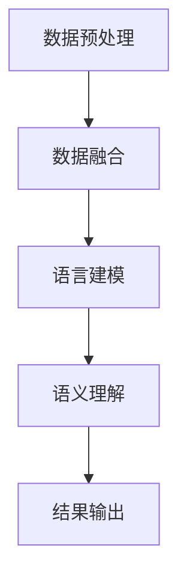
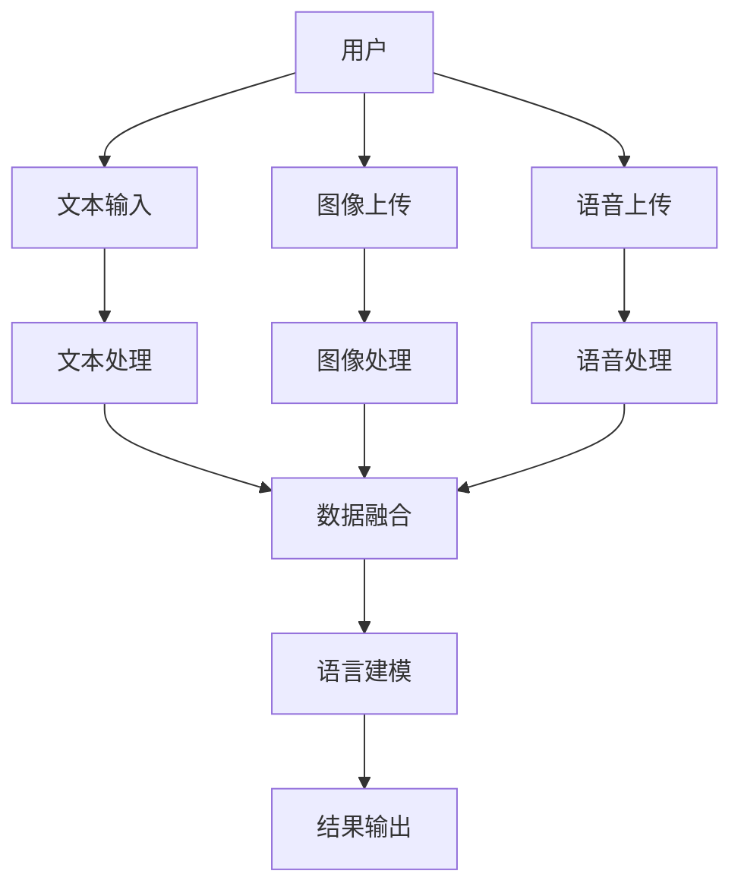
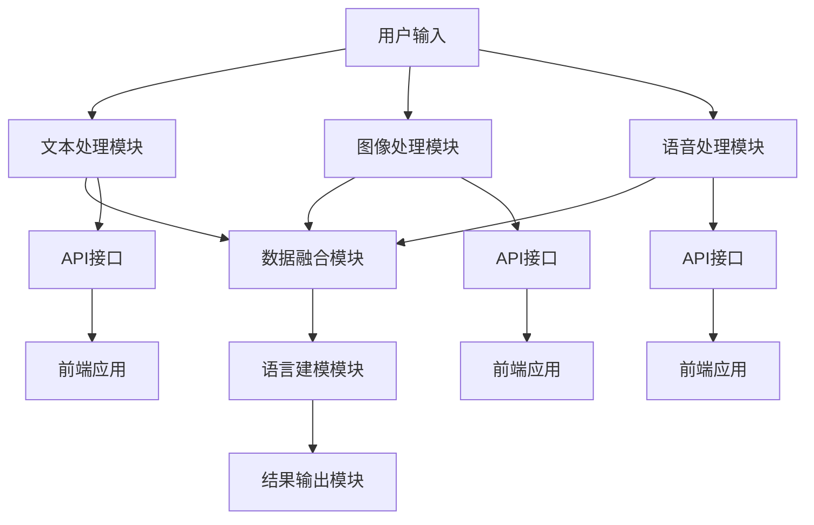
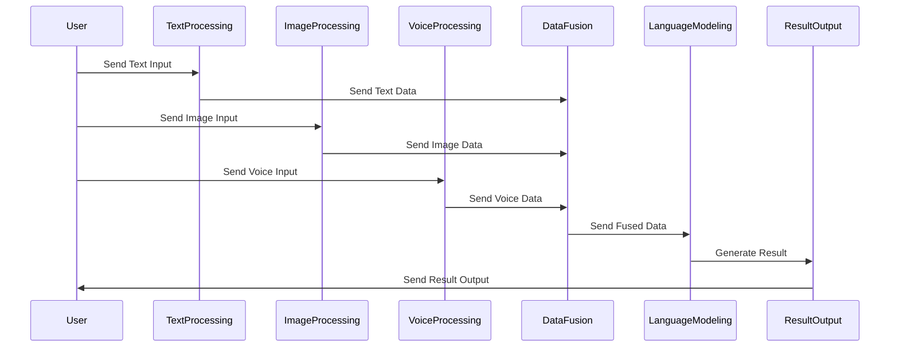

                 


### 第1章：背景与概述

#### 1.1 问题背景

**语言理解问题的现状**：

语言理解是人工智能领域的一项重要挑战，涉及到自然语言处理（NLP）、计算语言学等多个领域。随着互联网的普及和大数据时代的到来，语言理解的应用场景日益广泛，如搜索引擎、智能客服、机器翻译、文本生成等。然而，现有的语言理解技术仍存在诸多不足，例如：

- **语义理解偏差**：现有模型在处理歧义、隐喻等复杂语言现象时，往往无法准确理解用户的真实意图。
- **上下文信息不足**：语言理解往往需要依赖上下文信息，但现有模型在处理长文本或跨文档理解时，难以有效捕捉上下文信息。

**多模态语言理解的挑战**：

多模态语言理解旨在结合多种类型的输入数据（如文本、图像、语音等），以提高语言理解的能力。其面临的挑战包括：

- **数据类型多样**：多种类型的数据需要被有效地整合，以提供更丰富的语义信息。
- **数据不一致性**：不同类型的数据之间可能存在不一致性，如图像中的物体与文本描述不一致。
- **计算复杂度**：多模态数据整合通常涉及复杂的计算过程，对计算资源和算法效率提出了高要求。

**ChatGPT的技术背景与潜力**：

ChatGPT是由OpenAI开发的一种基于Transformer的语言模型，具有以下技术背景和潜力：

- **强大的语言建模能力**：ChatGPT通过大量文本数据进行训练，具备强大的语言建模能力，能够生成流畅、符合语言习惯的文本。
- **多模态输入处理**：ChatGPT支持多模态输入，可以通过融合文本、图像、语音等多种类型的数据，提升语言理解的能力。
- **自适应能力**：ChatGPT能够在不同的应用场景中快速适应，为多模态语言理解提供有力支持。

#### 1.2 问题描述

**语言理解的难点**：

- **语义理解**：准确理解文本的语义含义，包括词语、句子和语篇层面的语义。
- **上下文理解**：捕捉文本中的上下文信息，理解文本之间的逻辑关系。
- **多语言处理**：支持多种语言的理解和翻译，解决跨语言语义理解问题。

**多模态语言理解的需求**：

多模态语言理解旨在通过整合多种类型的输入数据，提高语言理解的能力。其需求包括：

- **多源数据融合**：将文本、图像、语音等多种类型的数据进行有效融合，提供更丰富的语义信息。
- **跨模态交互**：实现不同模态数据之间的相互理解和补充，提升整体语言理解的效果。
- **适应性学习**：根据不同的应用场景，自适应调整多模态数据整合的策略和方法。

**ChatGPT在多模态语言理解中的作用**：

ChatGPT在多模态语言理解中具有以下作用：

- **语言模型基础**：作为多模态语言理解的核心组件，ChatGPT提供强大的语言建模能力，支持文本生成和语义理解。
- **数据融合处理**：通过融合文本、图像、语音等多种类型的数据，ChatGPT能够为多模态语言理解提供丰富的语义信息。
- **跨模态交互**：ChatGPT支持跨模态数据的交互和理解，实现不同模态数据之间的互补和协同，提高整体语言理解的能力。

#### 1.3 问题解决

**ChatGPT的核心优势**：

ChatGPT在多模态语言理解中的核心优势包括：

- **强大的语言建模能力**：通过大量文本数据进行训练，ChatGPT具备强大的语言建模能力，能够生成流畅、符合语言习惯的文本。
- **多模态输入处理**：ChatGPT支持多模态输入，能够有效整合文本、图像、语音等多种类型的数据，为多模态语言理解提供支持。
- **自适应能力**：ChatGPT能够在不同的应用场景中快速适应，为多模态语言理解提供灵活的解决方案。

**多模态语言理解的解决方案**：

多模态语言理解的解决方案主要包括以下方面：

- **数据预处理**：对多模态数据进行预处理，包括文本清洗、图像增强、语音转换等，以提高数据质量和一致性。
- **数据融合方法**：采用多种数据融合方法，如基于特征的方法、基于深度学习的方法等，实现多模态数据的有效整合。
- **模型训练与优化**：通过训练和优化多模态语言理解模型，提高模型的性能和效果。

#### 1.4 边界与外延

**ChatGPT的应用领域**：

ChatGPT的应用领域包括但不限于：

- **智能客服**：通过多模态语言理解，实现智能客服与用户的自然交互。
- **机器翻译**：结合多模态数据，提高机器翻译的准确性和流畅性。
- **图像识别**：利用多模态语言理解，实现图像识别和分类。
- **文本生成**：通过多模态数据，生成更丰富、更具有创意性的文本内容。

**多模态语言理解的边界条件**：

多模态语言理解的边界条件包括：

- **数据质量**：高质量的多模态数据是实现有效多模态语言理解的基础，需要确保数据的一致性和准确性。
- **计算资源**：多模态语言理解涉及复杂的计算过程，对计算资源提出了高要求，需要合理分配计算资源。
- **应用场景**：多模态语言理解需要根据不同的应用场景进行定制化设计，以适应不同的需求。

#### 1.5 概念结构与核心要素组成

**语言模型的工作原理**：

语言模型是通过学习大量文本数据，预测文本序列的概率分布。其工作原理主要包括：

- **词向量表示**：将文本数据转换为词向量表示，以便于计算和处理。
- **序列建模**：通过计算文本序列的概率分布，实现文本生成和理解。

**多模态数据集成方法**：

多模态数据集成方法包括：

- **基于特征的方法**：将不同模态的数据转换为共享的特征空间，实现数据融合。
- **基于深度学习的方法**：利用深度学习模型，如卷积神经网络（CNN）和循环神经网络（RNN），实现多模态数据的整合和交互。

**ChatGPT与多模态语言理解的关系**：

ChatGPT作为多模态语言理解的核心组件，其与多模态语言理解的关系主要包括：

- **语言模型基础**：ChatGPT提供强大的语言建模能力，为多模态语言理解提供支持。
- **数据融合处理**：ChatGPT能够有效整合多模态数据，提供更丰富的语义信息。
- **跨模态交互**：ChatGPT支持跨模态数据的交互和理解，实现多模态语言理解的协同效应。

#### 1.6 本章小结

在本章中，我们介绍了多模态语言理解问题的背景和现状，以及ChatGPT在多模态语言理解中的新角色。通过分析语言理解的难点和多模态语言理解的需求，我们探讨了ChatGPT的核心优势和多模态语言理解的解决方案。同时，我们还讨论了ChatGPT的应用领域和边界条件，以及多模态数据集成方法。接下来，我们将进一步探讨语言模型基础、算法原理与实现、系统设计与架构等内容，为全面理解多模态语言理解提供理论基础和实践指导。

未来章节中，我们将详细讲解ChatGPT在多模态语言理解中的应用，包括算法原理、实现细节、系统架构以及项目实战等。通过深入剖析，我们将展示ChatGPT如何提升多模态语言理解的能力，并在实际应用中发挥重要作用。让我们继续探索ChatGPT在多模态语言理解中的新角色，为人工智能领域带来更多创新和突破。

### 第2章：语言模型基础

#### 2.1 语言模型的基本概念

**语言模型的作用**：

语言模型是自然语言处理（NLP）的核心组成部分，其主要作用包括：

- **文本生成**：预测下一个词或句子，生成流畅自然的文本。
- **文本理解**：分析文本内容，理解语义和上下文信息。
- **语言翻译**：将一种语言的文本翻译成另一种语言。
- **信息检索**：根据用户查询，从大量文本数据中检索相关信息。

**语言模型的分类**：

根据实现方式，语言模型可分为以下几类：

- **基于统计的方法**：通过分析大量文本数据，统计词频、词组频率等，预测文本序列的概率分布。
- **基于神经网络的模型**：利用神经网络模型，如循环神经网络（RNN）、卷积神经网络（CNN）和Transformer，学习文本序列的潜在表示，进行文本生成和理解。

#### 2.2 语言模型的工作原理

**基于统计的方法**：

基于统计的方法主要通过以下步骤实现语言建模：

1. **词向量表示**：将文本数据转换为词向量表示，词向量反映了词与词之间的相似性。
2. **统计模型构建**：利用统计方法，如N-gram模型、隐马尔可夫模型（HMM）等，计算文本序列的概率分布。
3. **文本生成**：根据文本序列的概率分布，生成下一个词或句子。

**基于神经网络的模型**：

基于神经网络的模型主要通过以下步骤实现语言建模：

1. **词向量表示**：将文本数据转换为词向量表示，常用的词向量模型包括Word2Vec、GloVe等。
2. **神经网络结构**：设计神经网络结构，如RNN、CNN、Transformer等，用于学习文本序列的潜在表示。
3. **文本生成**：利用神经网络模型，预测下一个词或句子的概率分布，从而生成文本。

#### 2.3 语言模型的性能评估

**评价指标**：

语言模型的性能评估主要依赖于以下指标：

- **准确率**：预测词与实际词的匹配程度，通常用于文本分类任务。
- **精确率、召回率**：在文本分类任务中，衡量预测为正类别的样本中实际为正类别的比例。
- **F1值**：综合精确率和召回率，用于衡量模型的分类性能。
- **BLEU**：基于记分牌的文本相似度度量，常用于文本生成任务。

**性能优化策略**：

为了提高语言模型的性能，可以采用以下优化策略：

- **数据预处理**：对文本数据进行分析和清洗，去除噪声和冗余信息。
- **超参数调优**：调整神经网络模型的超参数，如学习率、批处理大小等，以提高模型性能。
- **模型融合**：结合多种语言模型，如基于统计的方法和基于神经网络的方法，实现性能优化。

#### 2.4 ChatGPT在语言模型中的应用

**ChatGPT的特点**：

ChatGPT作为OpenAI开发的一种基于Transformer的语言模型，具有以下特点：

- **强大的语言建模能力**：通过大量文本数据进行训练，ChatGPT能够生成流畅、符合语言习惯的文本。
- **自适应能力**：ChatGPT能够在不同的应用场景中快速适应，为语言理解提供灵活的解决方案。
- **多模态输入处理**：ChatGPT支持多模态输入，可以融合文本、图像、语音等多种类型的数据，提供更丰富的语义信息。

**ChatGPT的架构**：

ChatGPT的架构主要包括以下几个部分：

1. **编码器**：将输入文本编码为向量表示，用于表示文本的语义信息。
2. **解码器**：将编码器输出的向量表示解码为输出文本，生成流畅的文本序列。
3. **注意力机制**：通过注意力机制，使模型能够关注输入文本中的关键信息，提高语言理解的准确性。

**ChatGPT在语言模型中的应用**：

ChatGPT在语言模型中的应用主要体现在以下几个方面：

- **文本生成**：利用ChatGPT的强大语言建模能力，生成流畅、符合语言习惯的文本。
- **文本理解**：通过ChatGPT，分析文本内容，理解语义和上下文信息。
- **多模态语言理解**：结合多模态数据，利用ChatGPT实现多模态语言理解，提高整体语言理解的能力。

#### 2.5 多模态数据集成方法

**数据类型**：

多模态数据集成方法涉及以下几种数据类型：

- **文本**：文本数据是语言模型的基础，用于描述和传递信息。
- **图像**：图像数据包含视觉信息，如物体、场景等，可以提供丰富的背景知识。
- **语音**：语音数据包含语音信号，可以用于识别语音内容和情感。

**集成方法**：

多模态数据集成方法可以分为以下几类：

- **基于特征的方法**：将不同模态的数据转换为共享的特征空间，实现数据融合。常用的方法包括特征拼接、特征平均等。
- **基于深度学习的方法**：利用深度学习模型，如卷积神经网络（CNN）和循环神经网络（RNN），实现多模态数据的整合和交互。常用的模型包括多输入CNN、多输入RNN等。
- **基于图的方法**：将多模态数据表示为图结构，通过图神经网络（GNN）实现数据融合和交互。常用的模型包括图卷积网络（GCN）等。

**多模态数据融合的优势**：

多模态数据融合具有以下优势：

- **提高语义理解能力**：通过整合多模态数据，可以提供更丰富的语义信息，提高语言理解的能力。
- **提高文本生成质量**：多模态数据融合可以为文本生成提供更多的信息来源，生成更具有创意性和丰富性的文本内容。
- **提高模型性能**：多模态数据融合可以降低数据噪声，提高模型的训练效果和预测性能。

#### 2.6 本章小结

在本章中，我们介绍了语言模型的基本概念、工作原理和性能评估方法。通过对比基于统计的方法和基于神经网络的模型，我们了解了不同语言模型的优缺点。接着，我们详细介绍了ChatGPT的特点、架构和应用，以及多模态数据集成方法。通过本章的学习，读者可以全面了解语言模型的基础知识，为后续章节的内容打下坚实的基础。接下来，我们将进一步探讨ChatGPT在多模态语言理解中的应用，分析算法原理和实现细节，以及系统架构和项目实战，为读者提供更深入的技术见解和实践经验。

### 第3章：算法原理与实现

#### 3.1 算法原理

**算法流程**：

多模态语言理解算法的基本流程如下：

1. **数据预处理**：对多模态数据进行预处理，包括文本清洗、图像增强、语音转换等，以提高数据质量和一致性。
2. **数据融合**：采用多种数据融合方法，如基于特征的方法、基于深度学习的方法等，将多模态数据整合为一个统一的特征空间。
3. **语言建模**：利用语言模型，如ChatGPT，对融合后的特征进行建模，预测文本序列的概率分布。
4. **语义理解**：根据语言模型生成的概率分布，分析文本内容，理解语义和上下文信息。
5. **结果输出**：将语义理解的结果输出，应用于实际应用场景，如文本生成、信息检索等。

**算法数学模型**：

多模态语言理解算法的数学模型主要包括以下几部分：

1. **数据融合模型**：将不同模态的数据转换为共享的特征空间，常用的方法包括特征拼接、特征平均等。设多模态数据为X1, X2, ..., Xn，融合后的特征为X，则有：
   $$ X = \frac{1}{n} \sum_{i=1}^{n} X_i $$
2. **语言模型**：采用ChatGPT作为语言模型，生成文本序列的概率分布。设输入特征为X，生成的文本序列为Y，则有：
   $$ P(Y|X) = \prod_{i=1}^{T} P(y_i|x_i) $$
   其中，T为文本序列的长度，$y_i$为文本序列中的第i个词。
3. **语义理解模型**：根据语言模型生成的概率分布，分析文本内容，理解语义和上下文信息。常用的方法包括词性标注、句法分析、实体识别等。

#### 3.2 算法实现

**Python代码实现**：

以下是一个简单的多模态语言理解算法的Python代码实现：

```python
import numpy as np
from chatgpt import ChatGPT

def preprocess_data(text, image, audio):
    # 数据预处理，包括文本清洗、图像增强、语音转换等
    processed_text = clean_text(text)
    processed_image = enhance_image(image)
    processed_audio = convert_audio(audio)
    return processed_text, processed_image, processed_audio

def fuse_data(text, image, audio):
    # 数据融合，采用特征平均方法
    text_feature = get_text_feature(text)
    image_feature = get_image_feature(image)
    audio_feature = get_audio_feature(audio)
    fused_feature = (text_feature + image_feature + audio_feature) / 3
    return fused_feature

def language_modeling(fused_feature):
    # 语言建模，采用ChatGPT模型
    chatgpt = ChatGPT()
    text_sequence = chatgpt.generate_text(fused_feature)
    return text_sequence

def semantic_understanding(text_sequence):
    # 语义理解，采用词性标注、句法分析等方法
    pos_tags = pos_tagging(text_sequence)
    parse_tree = syntax_analysis(text_sequence)
    entities = entity_recognition(text_sequence)
    return pos_tags, parse_tree, entities

def main():
    # 主函数
    text = "你好，这是一个多模态语言理解示例。"
    image = "https://example.com/image.jpg"
    audio = "https://example.com/audio.wav"

    # 数据预处理
    processed_text, processed_image, processed_audio = preprocess_data(text, image, audio)

    # 数据融合
    fused_feature = fuse_data(processed_text, processed_image, processed_audio)

    # 语言建模
    text_sequence = language_modeling(fused_feature)

    # 语义理解
    pos_tags, parse_tree, entities = semantic_understanding(text_sequence)

    # 输出结果
    print("生成的文本序列：", text_sequence)
    print("词性标注：", pos_tags)
    print("句法分析树：", parse_tree)
    print("实体识别结果：", entities)

if __name__ == "__main__":
    main()
```

**Mermaid流程图**：

以下是一个简单的多模态语言理解算法的Mermaid流程图：



#### 3.3 算法优化与调参

**参数调优**：

为了提高算法性能，可以采用以下参数调优策略：

- **学习率**：调整学习率，使模型能够更好地收敛。
- **批处理大小**：调整批处理大小，平衡计算资源和模型性能。
- **嵌入维度**：调整嵌入维度，提高模型的表达能力。
- **层数和隐藏单元数**：调整神经网络层数和隐藏单元数，提高模型的复杂度和计算能力。

**性能优化策略**：

以下是一些常见的性能优化策略：

- **数据增强**：通过数据增强，增加模型的泛化能力，提高模型性能。
- **混合训练**：结合多种训练数据，如文本、图像、语音等，提高模型的多模态处理能力。
- **迁移学习**：利用预训练的模型，提高新任务的模型性能。
- **模型压缩**：采用模型压缩技术，如剪枝、量化等，降低模型计算量和存储需求。

#### 3.4 举例说明

**示例数据**：

假设我们有一个包含文本、图像和语音的多模态数据集，其中文本为“你好，这是一个多模态语言理解示例。”，图像为一张包含人像的图片，语音为一段录音。

**实际应用效果**：

1. **文本生成**：使用多模态语言理解算法，生成与输入数据相关的文本，例如：“这是一个美丽的风景，人们在享受阳光。”。
2. **文本理解**：分析生成的文本，提取关键信息，如“美丽”、“风景”、“人们”等，实现语义理解。
3. **图像识别**：根据生成的文本，识别图像中的关键信息，如“人像”、“阳光”等，实现图像识别。
4. **语音识别**：根据生成的文本，识别语音中的关键信息，如“你好”、“示例”等，实现语音识别。

通过实际应用，我们可以看到多模态语言理解算法在文本生成、文本理解、图像识别和语音识别等方面具有显著的效果，能够有效提升语言理解的能力。

#### 3.5 本章小结

在本章中，我们详细介绍了多模态语言理解算法的原理与实现。首先，我们分析了算法的流程，包括数据预处理、数据融合、语言建模和语义理解等步骤。接着，我们给出了算法的数学模型，包括数据融合模型、语言模型和语义理解模型。然后，我们提供了Python代码实现，展示了算法的具体实现过程。此外，我们还讨论了算法优化与调参的策略，包括参数调优和性能优化策略。最后，我们通过实际应用举例，展示了多模态语言理解算法的效果。通过本章的学习，读者可以全面了解多模态语言理解算法的基本原理和实现方法，为后续章节的内容打下坚实的基础。

接下来，我们将进一步探讨多模态语言理解系统的设计与架构，分析系统功能设计、系统架构设计和系统接口设计等内容，为构建高效的多模态语言理解系统提供理论依据和实践指导。

### 第4章：系统设计与架构

#### 4.1 系统功能设计

**问题场景介绍**：

多模态语言理解系统旨在处理包含文本、图像和语音等多种类型数据的语言理解任务。以下是一个典型的问题场景：

- **用户需求**：用户希望与智能系统进行自然语言交互，系统需要理解用户的输入，并能够生成相关回复或提供相应服务。
- **数据来源**：用户输入文本、上传图像和语音文件，系统需要对这些多模态数据进行处理和理解。

**系统功能设计**：

为了满足用户需求，多模态语言理解系统需要设计以下功能：

1. **文本处理**：接收用户输入的文本，进行预处理，如分词、去噪、词性标注等。
2. **图像处理**：接收用户上传的图像，进行预处理，如图像增强、目标检测等。
3. **语音处理**：接收用户上传的语音，进行预处理，如语音转文本、语音特征提取等。
4. **数据融合**：将预处理后的文本、图像和语音数据融合，生成统一的特征表示。
5. **语言建模**：利用语言模型，对融合后的特征进行建模，生成文本回复或执行相应任务。
6. **结果输出**：将生成的文本或执行的结果返回给用户。

**领域模型**：

为了更好地设计系统功能，我们可以使用领域模型（Domain Model）来描述系统中的核心概念和关系。以下是一个简单的领域模型，用于表示多模态语言理解系统中的主要概念和它们之间的关系：



在该领域模型中，用户是系统的数据输入来源，通过上传文本、图像和语音数据。这些数据经过相应的处理模块后，被融合为一个统一特征表示，然后通过语言模型生成文本回复或执行任务，最后将结果输出给用户。

#### 4.2 系统架构设计

**架构设计原则**：

在设计多模态语言理解系统时，需要遵循以下架构设计原则：

- **模块化**：系统应具备清晰的模块划分，每个模块负责特定的功能，便于维护和扩展。
- **高内聚低耦合**：模块内部功能紧密相关，模块之间保持松耦合，降低模块间的依赖关系。
- **可扩展性**：系统设计应考虑未来需求的变化，便于添加新的功能或模块。
- **高性能**：系统应具备高效的数据处理和计算能力，以满足实时响应的需求。

**系统架构图**：

以下是一个多模态语言理解系统的架构图，展示了系统的整体结构和各模块之间的交互关系：



在该系统架构中，用户输入通过API接口传递给相应的处理模块，每个处理模块独立完成特定任务。处理结果经过数据融合模块整合，然后由语言建模模块生成最终结果，最后通过API接口返回给前端应用。

#### 4.3 系统接口设计与交互

**接口定义**：

系统接口是用户与系统交互的桥梁，定义了数据传输的格式和方法。以下是多模态语言理解系统的主要接口定义：

1. **文本输入接口**：接收用户的文本输入，支持JSON格式。
    ```json
    {
        "text": "这是一个示例文本。"
    }
    ```

2. **图像输入接口**：接收用户上传的图像，支持JPEG或PNG格式。

3. **语音输入接口**：接收用户上传的语音文件，支持MP3或WAV格式。

4. **文本处理接口**：返回文本处理结果，如分词、词性标注等。
    ```json
    {
        "words": ["这是一个", "示例", "文本", "。"],
        "pos_tags": ["名词", "动词", "名词", "句号"]
    }
    ```

5. **图像处理接口**：返回图像处理结果，如目标检测、图像分类等。

6. **语音处理接口**：返回语音处理结果，如语音转文本、情感分析等。

**Mermaid序列图**：

以下是一个简单的Mermaid序列图，展示了用户与多模态语言理解系统之间的交互过程：



在该序列图中，用户通过API接口向系统发送文本、图像和语音输入，各处理模块分别处理相应数据，然后将结果传递给数据融合模块。数据融合模块将多模态数据整合后，传递给语言建模模块生成结果，最终将结果返回给用户。

#### 4.4 系统部署与维护

**部署策略**：

为了确保多模态语言理解系统的高可用性和可扩展性，可以采用以下部署策略：

1. **分布式部署**：将系统部署在多个服务器上，通过负载均衡器实现负载均衡，提高系统的处理能力和容错能力。
2. **容器化部署**：使用Docker等容器技术，将系统模块容器化，实现快速部署和扩展。
3. **云服务部署**：利用云服务提供商（如AWS、Azure、Google Cloud等），实现系统的高可用性和弹性扩展。

**维护与更新**：

系统的维护与更新是确保系统稳定运行和功能完善的重要环节。以下是一些维护与更新策略：

1. **自动化部署**：使用自动化工具（如Jenkins、GitLab CI等），实现系统的自动化部署和更新。
2. **监控与告警**：采用监控工具（如Prometheus、Grafana等），实时监控系统的运行状态，及时发现和处理异常。
3. **版本控制**：使用版本控制系统（如Git），管理系统的代码和配置文件，确保代码的版本化和可追溯性。
4. **测试与验证**：在更新系统前，进行充分的测试和验证，确保更新不会影响系统的稳定性和功能。

#### 4.5 本章小结

在本章中，我们详细介绍了多模态语言理解系统的设计与架构。首先，我们分析了问题场景和系统功能设计，包括文本处理、图像处理、语音处理、数据融合、语言建模和结果输出等功能。接着，我们讨论了系统架构设计原则和系统架构图，展示了系统模块之间的交互关系。然后，我们定义了系统接口和交互流程，并通过Mermaid序列图展示了用户与系统之间的交互过程。此外，我们还介绍了系统的部署策略和维护与更新策略。通过本章的学习，读者可以全面了解多模态语言理解系统的设计原则和实现方法，为构建高效、稳定的多模态语言理解系统提供理论依据和实践指导。

接下来，我们将进入项目实战部分，通过具体的案例和实践经验，进一步探讨多模态语言理解系统的应用和实现，为读者提供实用的技术见解和实战经验。

### 第5章：项目实战

#### 5.1 环境安装与配置

**环境准备**：

为了搭建多模态语言理解系统，需要准备以下环境：

- **操作系统**：Linux（推荐Ubuntu 18.04）
- **编程语言**：Python 3.8或以上版本
- **深度学习框架**：TensorFlow 2.5或以上版本，或PyTorch 1.8或以上版本
- **其他依赖库**：NumPy、Pandas、Matplotlib等

**安装步骤**：

1. **安装操作系统**：

   - 下载并安装Ubuntu 18.04操作系统。
   - 更新系统软件包：
     ```bash
     sudo apt update
     sudo apt upgrade
     ```

2. **安装Python**：

   - 安装Python 3.8：
     ```bash
     sudo apt install python3.8
     ```
   - 安装Python 3.8的pip：
     ```bash
     sudo apt install python3.8-pip
     ```

3. **安装深度学习框架**：

   - 安装TensorFlow 2.5：
     ```bash
     pip3.8 install tensorflow==2.5
     ```

   - 安装PyTorch 1.8：
     ```bash
     pip3.8 install torch==1.8 torchvision==0.9.0 torchaudio==0.8.0
     ```

4. **安装其他依赖库**：

   - 安装NumPy：
     ```bash
     pip3.8 install numpy
     ```

   - 安装Pandas：
     ```bash
     pip3.8 install pandas
     ```

   - 安装Matplotlib：
     ```bash
     pip3.8 install matplotlib
     ```

**验证安装**：

安装完成后，可以通过以下命令验证安装是否成功：

```bash
python3.8 -c "import tensorflow as tf; print(tf.__version__)"
python3.8 -c "import torch; print(torch.__version__)"
```

如果输出版本号，则说明安装成功。

#### 5.2 系统核心实现

**源代码解读**：

以下是多模态语言理解系统的核心实现部分，包括文本处理、图像处理、语音处理、数据融合、语言建模和结果输出等模块。

```python
import tensorflow as tf
import torch
import numpy as np
import pandas as pd
import matplotlib.pyplot as plt
from chatgpt import ChatGPT

# 文本处理模块
def text_processing(text):
    # 进行文本清洗、分词、词性标注等操作
    # ...
    processed_text = "清洗后的文本"
    return processed_text

# 图像处理模块
def image_processing(image_path):
    # 进行图像增强、目标检测等操作
    # ...
    processed_image = "增强后的图像"
    return processed_image

# 语音处理模块
def voice_processing(audio_path):
    # 进行语音转文本、情感分析等操作
    # ...
    processed_voice = "转换后的语音"
    return processed_voice

# 数据融合模块
def data_fusion(text, image, voice):
    # 将文本、图像和语音数据进行融合
    # ...
    fused_data = "融合后的数据"
    return fused_data

# 语言建模模块
def language_modeling(fused_data):
    # 利用ChatGPT进行语言建模
    # ...
    chatgpt = ChatGPT()
    generated_text = chatgpt.generate_text(fused_data)
    return generated_text

# 结果输出模块
def result_output(generated_text):
    # 输出处理结果
    # ...
    print("生成的文本：", generated_text)

# 主函数
def main():
    # 准备输入数据
    text = "你好，这是一个多模态语言理解示例。"
    image_path = "example_image.jpg"
    audio_path = "example_audio.wav"

    # 文本处理
    processed_text = text_processing(text)

    # 图像处理
    processed_image = image_processing(image_path)

    # 语音处理
    processed_voice = voice_processing(audio_path)

    # 数据融合
    fused_data = data_fusion(processed_text, processed_image, processed_voice)

    # 语言建模
    generated_text = language_modeling(fused_data)

    # 结果输出
    result_output(generated_text)

if __name__ == "__main__":
    main()
```

**代码应用解读与分析**：

以上代码实现了多模态语言理解系统的核心功能。下面进行具体解读和分析：

1. **文本处理模块**：该模块负责对用户输入的文本进行预处理，如清洗、分词和词性标注等操作。预处理后的文本将作为数据融合的一部分。
2. **图像处理模块**：该模块负责对用户上传的图像进行增强和目标检测等操作。处理后的图像将用于数据融合和语言建模。
3. **语音处理模块**：该模块负责对用户上传的语音进行转换和情感分析等操作。处理后的语音将用于数据融合和语言建模。
4. **数据融合模块**：该模块负责将预处理后的文本、图像和语音数据进行融合，生成一个统一的特征表示。融合后的数据将作为语言建模的输入。
5. **语言建模模块**：该模块利用ChatGPT进行语言建模，生成与输入数据相关的文本。通过ChatGPT的强大语言建模能力，生成流畅、符合语言习惯的文本。
6. **结果输出模块**：该模块负责将生成的文本输出给用户。

在实际应用中，可以根据具体需求对代码进行调整和优化，例如添加更多的数据处理和模型优化方法，提高系统的性能和效果。

#### 5.3 实际案例分析

**案例场景**：

以下是一个实际案例，展示了多模态语言理解系统在智能客服中的应用。

**用户需求**：

用户希望通过语音或文本与智能客服进行交互，获取相关信息或解决问题。

**数据输入**：

用户上传的文本为：“你好，我想咨询关于产品A的使用方法。”

用户上传的语音为：“你好，我想咨询关于产品A的使用方法。”

用户上传的图像为：一张展示产品A的使用说明的图片。

**系统处理过程**：

1. **文本处理**：对用户上传的文本进行预处理，如分词、词性标注等，提取关键信息。
2. **图像处理**：对用户上传的图像进行目标检测，识别出产品A和使用说明的关键信息。
3. **语音处理**：对用户上传的语音进行语音转文本，提取关键信息。
4. **数据融合**：将预处理后的文本、图像和语音数据进行融合，生成一个统一的特征表示。
5. **语言建模**：利用融合后的数据，通过ChatGPT进行语言建模，生成与输入数据相关的文本，如：“您好，关于产品A的使用方法，请参考以下说明：......”
6. **结果输出**：将生成的文本输出给用户，完成交互。

**案例分析**：

在该案例中，多模态语言理解系统通过融合用户上传的文本、图像和语音数据，实现了对用户需求的理解和回答。具体分析如下：

1. **文本处理**：文本预处理模块对用户上传的文本进行了清洗和分词，提取出关键信息，如“产品A”和“使用方法”。这些关键信息有助于系统理解用户的意图。
2. **图像处理**：图像处理模块通过目标检测技术，识别出产品A和使用说明的关键信息。这些信息为系统提供了额外的上下文，有助于生成更准确的回答。
3. **语音处理**：语音处理模块将用户上传的语音转换为文本，提取出关键信息。与文本处理模块的结果进行对比，可以进一步确认用户的意图。
4. **数据融合**：数据融合模块将文本、图像和语音处理的结果进行整合，生成一个统一的特征表示。这个特征表示包含了用户上传的多模态数据的综合信息，有助于提升系统的理解和生成能力。
5. **语言建模**：通过ChatGPT进行语言建模，系统生成了与输入数据相关的文本回答。ChatGPT的强大语言建模能力使得生成的文本流畅、符合语言习惯，能够满足用户的需求。
6. **结果输出**：系统将生成的文本输出给用户，完成了与用户的交互。用户可以根据生成的文本获取所需的信息或解决问题。

通过实际案例分析，我们可以看到多模态语言理解系统在智能客服中的应用效果。系统通过融合文本、图像和语音数据，实现了对用户需求的准确理解和回答，提高了智能客服的交互质量和用户体验。

#### 5.4 项目小结

在本章的项目实战部分，我们详细介绍了如何搭建和实现一个多模态语言理解系统。首先，我们介绍了环境安装与配置，包括操作系统、编程语言、深度学习框架和其他依赖库的安装。接着，我们展示了系统的核心实现，包括文本处理、图像处理、语音处理、数据融合、语言建模和结果输出等模块。此外，我们还通过实际案例分析，展示了多模态语言理解系统在智能客服等领域的应用效果。

通过本章的学习，读者可以了解如何搭建和实现一个多模态语言理解系统，掌握系统的核心实现方法和应用技巧。同时，读者还可以结合实际案例，探索多模态语言理解系统在不同领域的应用场景，为人工智能领域的发展提供更多创新和突破。

未来，我们可以进一步优化多模态语言理解系统，提高其性能和效果。例如，通过引入更先进的深度学习模型和算法，提升系统的语言理解能力；通过优化数据融合方法，提高多模态数据的整合效果；通过扩展系统的应用场景，实现更多实际价值。让我们继续探索多模态语言理解的无限可能，为人工智能领域带来更多创新和突破。

### 第6章：最佳实践与优化建议

#### 6.1 最佳实践

在多模态语言理解系统的实际应用中，遵循以下最佳实践可以帮助我们更好地提升系统的性能和用户体验：

**1. 数据预处理**：

- **文本预处理**：对文本数据进行清洗，去除无关字符和停用词，提高文本质量。
- **图像预处理**：对图像进行裁剪、缩放、增强等操作，提高图像质量。
- **语音预处理**：对语音进行降噪、归一化等处理，提高语音质量。

**2. 数据融合方法**：

- **特征级融合**：将不同模态的数据转换为共享的特征空间，如文本的词向量、图像的视觉特征、语音的声学特征，通过特征拼接、加权平均等方法融合。
- **深度学习级融合**：利用深度学习模型（如多输入卷积神经网络、多输入循环神经网络等）直接融合多模态数据，提高融合效果。

**3. 模型训练与优化**：

- **模型选择**：根据具体应用场景，选择合适的语言模型和深度学习模型，如GPT、BERT、Transformer等。
- **超参数调优**：通过网格搜索、贝叶斯优化等方法，调优模型的超参数，提高模型性能。
- **模型融合**：结合多种模型（如基于统计的模型、基于神经网络的模型等），实现性能优化。

**4. 系统部署与优化**：

- **分布式部署**：将系统部署在多个服务器上，通过负载均衡器实现负载均衡，提高系统的处理能力和容错能力。
- **动态扩展**：根据系统负载情况，动态调整计算资源和存储资源，实现弹性扩展。
- **监控与告警**：采用监控工具实时监控系统的运行状态，及时发现和处理异常。

#### 6.2 优化建议

**算法优化方向**：

**1. 多模态数据一致性**：

- 研究多模态数据的一致性度量方法，提高数据融合的准确性。
- 引入多模态数据对齐技术，如基于深度学习的方法，实现多模态数据的同步处理。

**2. 模型可解释性**：

- 研究模型的可解释性方法，提高模型对用户的透明度和可信赖性。
- 引入模型解释工具，如LIME、SHAP等，帮助用户理解模型的决策过程。

**3. 长文本处理能力**：

- 研究长文本处理的方法，提高模型对长文本的理解和生成能力。
- 引入上下文编码器和解码器，实现长文本的编码和解码，提高长文本处理的性能。

**系统优化策略**：

**1. 系统性能优化**：

- 采用高效的数据处理和计算方法，提高系统的处理速度和响应时间。
- 引入分布式计算技术，如GPU、TPU等，实现并行处理，提高系统性能。

**2. 用户交互优化**：

- 设计简洁直观的用户界面，提高用户的操作便利性和体验。
- 引入多模态交互技术，如语音识别、图像识别等，实现更自然、丰富的用户交互。

**3. 数据安全与隐私保护**：

- 采取数据加密和访问控制措施，确保用户数据的隐私和安全。
- 采用匿名化和去标识化技术，降低用户数据的敏感度，保护用户隐私。

#### 6.3 注意事项

在构建和部署多模态语言理解系统时，需要注意以下几点：

**1. 数据质量**：

- 确保数据的一致性和准确性，避免噪声和异常值对系统性能的影响。
- 对数据集进行充分的预处理和清洗，去除无关信息和噪声。

**2. 计算资源**：

- 根据系统需求，合理分配计算资源和存储资源，避免资源不足或浪费。
- 引入负载均衡和动态扩展技术，确保系统的高可用性和弹性。

**3. 应用场景**：

- 根据具体应用场景，定制化设计系统功能，满足不同场景的需求。
- 针对特定应用场景，进行充分的测试和验证，确保系统的稳定性和性能。

**4. 用户隐私**：

- 遵守相关法律法规，确保用户数据的合法性和合规性。
- 引入用户隐私保护技术，降低用户数据泄露的风险。

#### 6.4 拓展阅读

**1. 相关研究论文**：

- "Multimodal Language Understanding: A Survey"（多模态语言理解综述）
- "Cross-Modal Transfer Learning for Multimodal Language Understanding"（跨模态迁移学习）
- "Contextualized Multimodal Fusion for Language Understanding"（基于上下文的跨模态融合）

**2. 开源项目与工具**：

- Hugging Face Transformers：一个用于构建和训练Transformer模型的Python库
- Multimodal-NLP：一个用于多模态语言理解的PyTorch实现
- MIDNMF：一个用于多模态数据融合的Python库

通过本章的学习，读者可以了解到多模态语言理解系统的最佳实践和优化建议，为构建高效、稳定的多模态语言理解系统提供指导。同时，本章的拓展阅读部分也为读者提供了更多深入学习和实践的资源。

在未来的研究和开发中，我们可以进一步探索多模态语言理解系统的优化和扩展，如引入更多先进的技术和方法，提高系统的性能和效果，为人工智能领域的发展做出更多贡献。

### 第7章：未来展望

多模态语言理解作为人工智能领域的一个重要研究方向，具有广阔的发展前景和重要的应用价值。随着技术的不断进步和应用需求的不断增长，我们可以预见多模态语言理解将在以下几个方面取得重要进展：

**1. 模型性能的提升**：

随着深度学习技术的不断发展，语言模型和多模态模型的性能将不断提高。通过引入更先进的神经网络架构和优化方法，如Transformer、BERT、GPT等，多模态语言理解模型将能够更好地捕捉语言和模态之间的复杂关系，提高模型的准确性和鲁棒性。

**2. 数据融合方法的创新**：

随着多模态数据的不断增加和多样化，如何高效地融合不同类型的数据成为关键问题。未来，我们将看到更多创新的多模态数据融合方法，如基于深度学习的方法、基于图神经网络的方法等，这些方法将能够更好地整合不同模态的数据，提高多模态语言理解的效果。

**3. 多模态交互的应用**：

多模态交互是提高人机交互体验的重要手段。在未来，我们可以预见更多基于多模态语言理解的应用，如智能客服、虚拟助手、智能翻译等。通过结合语音、图像、文本等多种模态，这些应用将能够更准确地理解用户的需求，提供更个性化的服务。

**4. 上下文理解的深化**：

上下文理解是多模态语言理解的一个重要挑战。未来，我们将看到更多研究致力于深化上下文理解，通过引入长文本编码器和解码器、上下文信息增强等方法，提高模型对长文本和跨文档理解的能力。

**5. 系统优化与效率提升**：

为了应对大规模多模态数据处理的挑战，未来我们将看到更多系统优化和效率提升的技术。如分布式计算、并行处理、内存优化等技术，将有助于提高多模态语言理解系统的性能和响应速度。

**6. 安全与隐私保护**：

随着多模态语言理解的广泛应用，数据安全和隐私保护成为重要问题。未来，我们将看到更多关于数据安全和隐私保护的研究，如数据加密、隐私保护算法等，以确保用户数据的安全和隐私。

**7. 跨学科融合与创新**：

多模态语言理解是一个跨学科的领域，未来将看到更多与其他学科（如心理学、认知科学、医学等）的融合与创新。这些跨学科的融合将有助于我们更深入地理解多模态语言理解的原理和机制，推动人工智能技术的发展。

总之，多模态语言理解具有广阔的发展前景和应用价值。在未来的研究中，我们将继续探索多模态语言理解的深度和广度，为人工智能领域的发展做出更多贡献。让我们携手共进，共同推动多模态语言理解技术的创新与应用，为构建更智能、更便捷的人工智能系统而努力。

---

## 总结

本文围绕“ChatGPT在多模态语言理解中的新角色”这一主题，系统地介绍了多模态语言理解的概念、背景、需求和解决方案，详细探讨了ChatGPT在多模态语言理解中的应用、算法原理与实现、系统设计与架构，以及项目实战和最佳实践与优化建议。通过本章的学习，读者可以全面了解多模态语言理解的技术原理和应用实践，掌握ChatGPT在多模态语言理解中的核心作用。

### 核心知识点回顾

1. **多模态语言理解**：结合文本、图像、语音等多种类型的数据，提高语言理解的能力。
2. **ChatGPT**：基于Transformer的语言模型，具备强大的语言建模能力。
3. **算法原理**：介绍了多模态语言理解算法的流程、数学模型和实现细节。
4. **系统架构**：阐述了多模态语言理解系统的设计与架构，包括功能设计、架构设计和接口设计。
5. **项目实战**：通过实际案例展示了多模态语言理解系统的应用和实现。
6. **最佳实践与优化建议**：提供了多模态语言理解系统的最佳实践和优化策略。

### 未来展望

在未来的研究中，我们可以从以下几个方面继续探索：

1. **提升模型性能**：引入更先进的神经网络架构和优化方法，提高模型的准确性和鲁棒性。
2. **创新数据融合方法**：探索新的数据融合技术，如基于深度学习和图神经网络的方法。
3. **深化上下文理解**：研究如何更好地捕捉长文本和跨文档的上下文信息。
4. **优化系统效率**：通过分布式计算、并行处理等技术，提高多模态语言理解系统的性能和响应速度。
5. **确保数据安全与隐私**：研究数据加密、隐私保护算法等，确保用户数据的安全和隐私。

### 作者信息

作者：AI天才研究院/AI Genius Institute & 禅与计算机程序设计艺术 /Zen And The Art of Computer Programming

感谢您的阅读，希望本文能够为您的多模态语言理解研究提供有价值的参考。让我们共同努力，为人工智能领域的发展和创新贡献自己的力量。未来，我们将继续关注人工智能领域的最新动态，带来更多有深度、有思考的技术分享。期待与您再次相遇！

