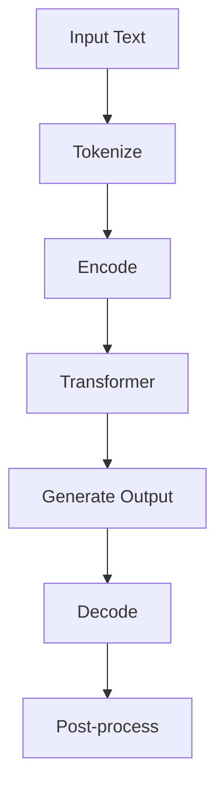
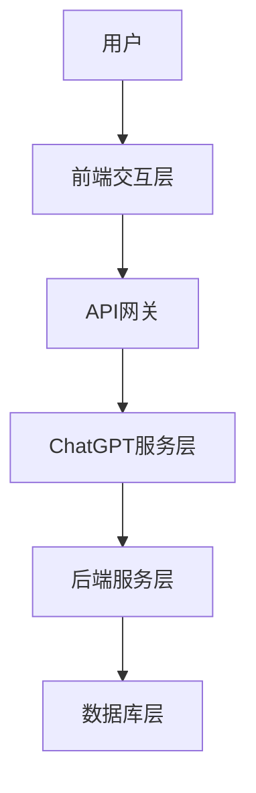
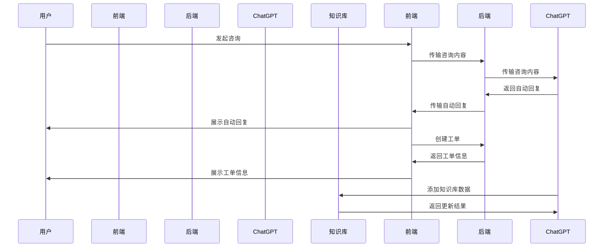

                 


### 1.1.1 ChatGPT的发展历程

ChatGPT，全称为“Chat Generative Pre-trained Transformer”，是OpenAI于2022年11月30日发布的一款基于GPT-3.5模型的高级语言模型。ChatGPT的发展历程可以追溯到2018年，当时OpenAI发布了GPT-1，随后在2020年推出了GPT-2和GPT-3，每一个版本的发布都标志着自然语言处理技术的重大突破。

**早期发展：** GPT-1的出现引起了学术界和工业界的广泛关注，因为它在语言理解、文本生成等任务上表现出了令人瞩目的能力。随后，OpenAI发布了GPT-2和GPT-3，这两个模型在参数量和表现力上都实现了显著提升。

**ChatGPT发布：** ChatGPT是在GPT-3的基础上进一步优化和扩展的，它不仅继承了GPT-3强大的语言生成能力，还在交互式对话方面进行了专门优化。ChatGPT的发布，标志着人工智能在交互式应用领域迈出了重要一步。

**技术突破：** ChatGPT采用了多层次的预训练策略和自适应提示词技术，使得它能够生成更加连贯、多样化的对话内容。此外，ChatGPT还具备较强的自我学习能力和跨模态理解能力，能够处理多种类型的输入信息。

**应用领域：** ChatGPT在客户服务领域展现出了巨大的潜力，它能够作为虚拟客服代表，为用户提供24/7的在线支持，解决用户常见问题，提升客户满意度。此外，ChatGPT还在智能推荐、内容审核、教育辅助等多个领域有着广泛的应用。

**未来展望：** 随着技术的不断进步，ChatGPT有望在更多领域发挥其作用，为人们带来更加智能、高效的交互体验。

### 1.1.2 ChatGPT在客户服务中的重要性

**提升响应速度和效率：** 传统的客户服务通常依赖人工客服，而人工客服在面对大量用户咨询时往往会出现响应延迟。ChatGPT作为自动化客服工具，可以实时响应用户的提问，大大提高了服务效率。

**降低运营成本：** 虽然部署ChatGPT需要一定的前期投入，但从长远来看，它可以显著降低运营成本。通过自动化处理大量用户咨询，企业可以减少对人工客服的依赖，从而节省人力成本。

**提高客户满意度：** ChatGPT能够提供24/7的在线支持，随时解决用户问题，提升了客户服务的便捷性和响应速度。此外，ChatGPT具备的自然语言理解和生成能力，使得它能够生成更加人性化的回复，提高了客户的满意度。

**扩展服务范围：** 传统的客服系统通常只能处理一些标准化的提问，而ChatGPT能够理解和处理更加复杂的问题。这意味着企业可以借助ChatGPT为客户提供更加全面的服务，扩大服务范围。

**数据分析和反馈：** ChatGPT在与用户互动的过程中，可以收集大量的用户数据和反馈。通过对这些数据的分析，企业可以更好地了解用户需求，优化产品和服务，提升整体运营效率。

### 1.1.3 当前行业应用情况分析

**电子商务领域：** 电商平台普遍采用ChatGPT作为在线客服工具，解决用户在购物过程中遇到的问题，如商品咨询、物流查询等。例如，亚马逊和阿里巴巴都在其平台上广泛应用了ChatGPT技术。

**金融领域：** 银行和金融机构利用ChatGPT提供金融咨询服务，如账户查询、贷款咨询等。ChatGPT能够快速响应客户的提问，提供准确的金融信息，提升了客户体验。

**电信行业：** 电信运营商通过ChatGPT为用户提供客服支持，如套餐咨询、账单查询等。ChatGPT的智能客服系统能够自动识别用户的问题，提供针对性的解决方案，提高了服务效率。

**医疗领域：** 医疗机构利用ChatGPT提供在线医疗咨询，如病情咨询、预约挂号等。ChatGPT能够根据用户的症状描述，提供初步的病情分析和建议，辅助医生进行诊断和治疗。

**教育领域：** 在线教育平台利用ChatGPT为学生提供学习辅导和答疑服务，如课程咨询、作业辅导等。ChatGPT能够实时响应学生的学习需求，提供个性化的学习支持。

**其他领域：** 除了上述领域，ChatGPT还在酒店预订、餐饮服务、法律咨询等多个行业得到了广泛应用，为用户提供了便捷的在线支持。

### 1.2 核心概念

#### 1.2.1 ChatGPT的定义与功能

ChatGPT是由OpenAI开发的一款基于GPT-3.5模型的高级语言模型。它通过深度学习和自然语言处理技术，能够理解并生成人类语言。ChatGPT的主要功能包括：

- **自然语言理解：** ChatGPT能够理解用户的提问，提取关键信息，并生成相应的回答。
- **文本生成：** ChatGPT可以根据用户输入的内容，生成连贯、多样化的文本，如对话、文章、故事等。
- **交互式对话：** ChatGPT能够与用户进行实时对话，提供个性化的服务和支持。
- **跨模态理解：** ChatGPT不仅能够处理文本输入，还能理解图像、音频等多模态信息。

#### 1.2.2 提示词策略的概念与作用

提示词策略是指通过向ChatGPT提供特定的提示词，来引导其生成更符合预期的回答。提示词策略在ChatGPT在客户服务中的应用具有重要意义，主要体现在以下几个方面：

- **提高回答准确性：** 通过使用恰当的提示词，可以引导ChatGPT理解用户的问题，并生成更加准确、针对性的回答。
- **增强交互体验：** 合理的提示词策略可以使得ChatGPT生成的回答更加贴近用户需求，提高用户体验。
- **优化问题分类：** 通过对提示词的分析，可以帮助企业更好地了解用户提出的问题类型，从而优化问题分类和处理流程。

### 1.3 核心概念与联系

#### 1.3.1 ChatGPT与NLP的联系

ChatGPT是自然语言处理（NLP）领域的重要成果之一。NLP是指使用计算机技术处理和理解人类语言，ChatGPT作为NLP工具，具备以下特点：

- **语言理解：** ChatGPT能够理解用户的自然语言输入，提取关键信息，并生成相应的回答。
- **文本生成：** ChatGPT可以根据用户输入的内容，生成连贯、多样化的文本。
- **情感分析：** ChatGPT能够分析文本的情感倾向，识别用户的情绪，并生成相应的回复。

#### 1.3.2 提示词策略与ML的关系

提示词策略与机器学习（ML）密切相关。在ML领域中，提示词策略可以被视为一种数据预处理和模型训练技巧。通过使用特定的提示词，可以引导模型学习到更有价值的特征，提高模型的性能。具体来说：

- **特征工程：** 提示词可以作为特征的一部分，参与到模型的训练过程中，帮助模型更好地理解用户的问题。
- **模型优化：** 合理的提示词策略可以优化模型的参数，提高模型在特定任务上的表现。
- **交互式学习：** 提示词策略可以使得模型在交互过程中不断学习和调整，提高模型的适应性和泛化能力。

### 1.3.3 ChatGPT与提示词策略的关系

ChatGPT与提示词策略之间存在着密切的联系。ChatGPT作为语言生成模型，其性能很大程度上取决于提示词的质量。合理的提示词策略可以：

- **提高回答质量：** 通过提供恰当的提示词，可以引导ChatGPT生成更加准确、有针对性的回答。
- **优化用户体验：** 合理的提示词策略可以使得ChatGPT与用户的交互更加流畅，提高用户体验。
- **提升服务质量：** 提示词策略可以帮助企业更好地应对客户咨询，提供高质量的客户服务。

### 1.3.4 ChatGPT、NLP、ML、提示词策略之间的联系

ChatGPT、NLP、ML、提示词策略之间存在紧密的联系，共同构成了一个完整的生态系统。具体来说：

- **NLP作为基础：** NLP是ChatGPT和提示词策略的基础，它提供了处理和理解自然语言的技术手段。
- **ML作为核心：** ML技术使得ChatGPT和提示词策略得以实现，它通过训练模型来提高性能。
- **提示词策略作为优化手段：** 提示词策略作为优化手段，可以引导ChatGPT和ML模型更好地应对特定任务。
- **ChatGPT作为应用场景：** ChatGPT作为应用场景，将NLP、ML和提示词策略有机地结合起来，实现了自然语言交互的目标。

通过这种紧密的联系，ChatGPT、NLP、ML、提示词策略共同推动了人工智能在客户服务领域的应用和发展。### 2.1 ChatGPT的算法原理

#### 2.1.1 GPT模型的原理

GPT（Generative Pre-trained Transformer）是一种基于Transformer架构的语言模型，由OpenAI开发。其核心思想是利用大规模语料进行预训练，然后通过微调（fine-tuning）适应特定任务。以下是GPT模型的基本原理：

**Transformer架构：** Transformer模型采用自注意力机制（self-attention），能够捕捉文本序列中的长距离依赖关系。相比于传统的循环神经网络（RNN），Transformer在处理长文本序列时具有更高的效率和效果。

**预训练过程：** GPT模型通过在大规模语料上进行预训练，学习到了语言的基本结构和规律。预训练过程中，模型会对输入文本进行编码，然后通过自注意力机制生成输出文本。

**自注意力机制：** 自注意力机制允许模型在生成文本时，动态地调整不同位置文本的重要性。通过计算文本中每个词与所有词之间的相似性，模型能够自动地捕捉到关键信息。

**训练和推理：** 在训练过程中，模型通过优化目标函数（如交叉熵损失函数）来调整参数，以提高预测准确性。在推理过程中，模型根据输入文本生成相应的输出文本。

#### 2.1.1.1 使用Mermaid绘制GPT模型工作流程

以下是一个简单的Mermaid流程图，展示了GPT模型的基本工作流程：



**说明：**
- **Tokenize：** 将输入文本转换为Token序列。
- **Encode：** 对Token序列进行编码，生成固定长度的向量。
- **Transformer：** 应用Transformer模型进行文本生成。
- **Generate Output：** 生成输出文本。
- **Decode：** 将生成的文本解码回原始文本。
- **Post-process：** 对生成的文本进行后处理，如去除不必要的标点符号等。

#### 2.1.1.2 GPT模型训练流程

GPT模型的训练流程可以分为以下几个步骤：

1. **数据准备：** 收集并准备大规模的语料数据，如维基百科、新闻文章、对话数据等。
2. **数据预处理：** 对语料数据进行预处理，如分词、去除停用词、添加特殊标记等。
3. **构建词汇表：** 构建词汇表，将预处理后的文本转换为词嵌入表示。
4. **训练模型：** 使用Transformer架构训练模型，优化目标函数，如交叉熵损失函数。
5. **模型评估：** 在验证集上评估模型性能，调整超参数。
6. **模型微调：** 将预训练好的模型应用于特定任务，进行微调。

#### 2.1.1.3 GPT模型优化方法

GPT模型的优化方法主要包括以下几种：

1. **动态调整学习率：** 使用学习率调度策略，如余弦退火（cosine annealing），逐步减小学习率，防止模型过拟合。
2. **正则化：** 应用正则化技术，如Dropout、权重衰减等，减少过拟合风险。
3. **数据增强：** 通过数据增强方法，如随机插入、替换、删除等，增加训练数据的多样性。
4. **迁移学习：** 利用预训练好的GPT模型作为特征提取器，在特定任务上进行微调。

#### 2.1.2 提示词策略原理

提示词策略是一种通过提供特定提示词来引导模型生成更符合预期的输出的技术。在ChatGPT的应用中，提示词策略起着至关重要的作用。

**提示词选择策略：** 提示词选择策略包括以下几种：

1. **关键词提取：** 从用户输入的问题中提取关键信息，作为提示词。
2. **模板匹配：** 根据用户输入的问题类型，选择相应的模板，生成提示词。
3. **知识库查询：** 从知识库中查询与用户输入相关的问题和答案，提取关键信息作为提示词。

**提示词优化策略：** 提示词优化策略包括以下几种：

1. **语境调整：** 根据上下文信息调整提示词，使其更贴近用户需求。
2. **多样性控制：** 通过调整提示词的多样性，生成不同风格和类型的回答。
3. **质量评估：** 使用评估指标（如BLEU、ROUGE等）对生成的回答进行质量评估，优化提示词。

#### 2.1.2.1 提示词选择策略

提示词选择策略的目标是生成与用户输入最为相关的回答。以下是一些具体的提示词选择方法：

1. **基于关键词提取：** 从用户输入的问题中提取关键信息，作为提示词。例如，用户输入“如何设置WiFi密码？”，可以提取“设置WiFi密码”作为提示词。
2. **基于模板匹配：** 根据用户输入的问题类型，选择相应的模板，生成提示词。例如，对于用户输入的“我忘记了银行账户密码”，可以选择“找回/重置密码”的模板，生成提示词。
3. **基于知识库查询：** 从知识库中查询与用户输入相关的问题和答案，提取关键信息作为提示词。例如，用户输入“如何登录我的邮箱？”，可以从知识库中查询到相关的登录流程，提取关键信息作为提示词。

#### 2.1.2.2 提示词优化策略

提示词优化策略旨在提高生成回答的质量和多样性。以下是一些具体的优化方法：

1. **语境调整：** 根据上下文信息调整提示词，使其更贴近用户需求。例如，用户输入“如何设置WiFi密码？”后，系统可以查询用户的WiFi网络名称和密码，将提示词调整为“请输入您的WiFi网络名称和密码”。
2. **多样性控制：** 通过调整提示词的多样性，生成不同风格和类型的回答。例如，对于用户输入的“我忘记了银行账户密码”，可以生成多个不同风格的提示词，如“请问您的账户密码忘记了？”，“您的账户密码遗失了？”，等。
3. **质量评估：** 使用评估指标（如BLEU、ROUGE等）对生成的回答进行质量评估，优化提示词。例如，如果生成的回答质量较低，可以尝试调整提示词，使其更符合用户需求。

通过合理地选择和优化提示词，可以显著提高ChatGPT在客户服务中的应用效果，提供更加准确、人性化的回答。### 2.2 数学模型和公式

#### 2.2.1 GPT模型的数学模型

GPT模型的数学模型主要涉及Transformer架构中的自注意力机制和前馈神经网络。以下是GPT模型的核心数学公式：

**自注意力（Self-Attention）公式：**

$$
\text{Attention}(Q, K, V) = \frac{1}{\sqrt{d_k}} \text{softmax}\left(\frac{QK^T}{d_k}\right) V
$$

其中，Q、K、V分别代表查询（Query）、键（Key）、值（Value）向量，d_k为键向量的维度。自注意力机制通过计算Q和K之间的点积，得到注意力权重，然后加权求和V得到输出。

**前馈神经网络（Feedforward Neural Network）公式：**

$$
\text{FFN}(x) = \text{ReLU}(W_2 \text{ReLU}(W_1 x + b_1))
$$

其中，W1和W2分别为权重矩阵，b1为偏置项。前馈神经网络通过两层全连接神经网络，对输入向量进行非线性变换。

**Transformer模型的总公式：**

$$
\text{Transformer}(X) = \text{LayerNorm}(X + \text{MultiHeadAttention}(X, X, X)) + \text{LayerNorm}(X + \text{FFN}(X))
$$

其中，X为输入序列，LayerNorm为层归一化操作。

#### 2.2.1.1 使用LaTeX格式给出GPT模型的数学公式

以下是GPT模型的核心数学公式，使用LaTeX格式表示：

$$
\text{Attention}(Q, K, V) = \frac{1}{\sqrt{d_k}} \text{softmax}\left(\frac{QK^T}{d_k}\right) V
$$

$$
\text{FFN}(x) = \text{ReLU}(W_2 \text{ReLU}(W_1 x + b_1))
$$

$$
\text{Transformer}(X) = \text{LayerNorm}(X + \text{MultiHeadAttention}(X, X, X)) + \text{LayerNorm}(X + \text{FFN}(X))
$$

#### 2.2.1.2 公式详细讲解

**自注意力（Self-Attention）公式：**

自注意力机制是Transformer模型的核心部分，它通过计算查询（Query）、键（Key）、值（Value）向量之间的相似性，生成注意力权重，进而加权求和得到输出。

- **Q（Query）：** 查询向量，表示输入序列中的每个位置的重要程度。
- **K（Key）：** 键向量，表示输入序列中的每个位置能够匹配的关键信息。
- **V（Value）：** 值向量，表示输入序列中的每个位置所具有的信息。

自注意力公式通过计算Q和K之间的点积，得到注意力分数，然后通过softmax函数将分数转换为概率分布。最后，将概率分布乘以V向量，得到加权求和的结果，即输出向量。

**前馈神经网络（Feedforward Neural Network）公式：**

前馈神经网络是对输入向量进行非线性变换的一种常见结构，通常由多层全连接神经网络组成。

- **ReLU（Rectified Linear Unit）：** ReLU函数是一种简单的非线性激活函数，它将输入值映射为0或输入值本身。ReLU函数能够加速训练过程，并防止神经网络中的梯度消失问题。

前馈神经网络由两层全连接神经网络组成，第一层对输入向量进行非线性变换，第二层对输出向量进行线性变换。两层神经网络通过组合使用ReLU函数和非线性变换，能够实现复杂的函数表示。

**Transformer模型的总公式：**

Transformer模型的总公式表示了模型的整体结构，包括多头自注意力（MultiHeadAttention）和前馈神经网络（FFN）。

- **LayerNorm（Layer Normalization）：** 层归一化是一种常见的正则化方法，它通过将每个输入向量的特征归一化到相同尺度，有助于提高模型的稳定性和训练速度。

Transformer模型通过在输入序列上应用多头自注意力机制和前馈神经网络，逐层处理输入序列，最终生成输出序列。层归一化操作在每层网络前后进行，有助于稳定模型的训练过程。

通过以上详细讲解，我们可以更好地理解GPT模型的数学原理，为后续的应用和优化提供理论基础。### 2.2.2 提示词策略的数学模型

提示词策略的数学模型主要涉及优化和评估两个方面。以下是提示词策略的核心数学公式：

**优化目标公式：**

$$
\min_{\theta} \sum_{i=1}^{N} (-\log P(y_i | \theta))
$$

其中，$\theta$代表模型的参数，$y_i$代表第i个样本的标签，$P(y_i | \theta)$代表模型对第i个样本的预测概率。

**评估指标公式：**

$$
\text{Accuracy} = \frac{1}{N} \sum_{i=1}^{N} \mathbb{1}\{\hat{y}_i = y_i\}
$$

其中，$\hat{y}_i$代表模型对第i个样本的预测标签，$\mathbb{1}\{\cdot\}$是一个指示函数，当条件为真时取值为1，否则为0。

**提示词权重更新公式：**

$$
\theta_{\text{new}} = \theta_{\text{old}} + \alpha \nabla_{\theta} L(\theta)
$$

其中，$\alpha$是学习率，$L(\theta)$是损失函数。

#### 2.2.2.1 使用LaTeX格式给出提示词策略的数学公式

以下是提示词策略的核心数学公式，使用LaTeX格式表示：

$$
\min_{\theta} \sum_{i=1}^{N} (-\log P(y_i | \theta))
$$

$$
\text{Accuracy} = \frac{1}{N} \sum_{i=1}^{N} \mathbb{1}\{\hat{y}_i = y_i\}
$$

$$
\theta_{\text{new}} = \theta_{\text{old}} + \alpha \nabla_{\theta} L(\theta)
$$

#### 2.2.2.2 公式详细讲解

**优化目标公式：**

优化目标是寻找一组模型参数$\theta$，使得模型在给定训练集上的损失函数值最小。损失函数通常使用交叉熵损失（Cross-Entropy Loss）来衡量模型预测概率与真实标签之间的差异。优化目标公式中的$-\log P(y_i | \theta)$表示第i个样本的损失值，$N$表示训练集的样本数量。

**评估指标公式：**

准确率（Accuracy）是评估模型性能的常用指标，它表示模型预测正确的样本数量占总样本数量的比例。在二分类任务中，$\hat{y}_i$是模型对第i个样本的预测标签，$y_i$是实际标签。当$\hat{y}_i = y_i$时，表示模型预测正确，$\mathbb{1}\{\hat{y}_i = y_i\}$取值为1，否则为0。通过求和并除以总样本数量$N$，可以得到准确率。

**提示词权重更新公式：**

提示词权重更新公式是提示词策略的核心部分，它用于在训练过程中调整模型参数，以提高模型性能。学习率$\alpha$用于控制参数更新的步长。$\theta_{\text{old}}$是当前模型参数，$\nabla_{\theta} L(\theta)$是损失函数对参数的梯度。通过梯度下降（Gradient Descent）方法，模型参数$\theta_{\text{new}}$将向梯度相反的方向更新，以减小损失函数值。

通过以上详细讲解，我们可以更好地理解提示词策略的数学原理，为实际应用提供理论基础。### 3.1 系统分析与架构设计

#### 3.1.1 客户服务系统场景介绍

在当今的数字化时代，客户服务系统已经成为企业竞争的重要利器。一个高效的客户服务系统能够实时响应用户需求，提供快速、准确、个性化的服务，从而提升客户满意度，增强企业品牌形象。本文将探讨ChatGPT在客户服务系统中的应用，通过系统架构设计和实际案例，展示其如何助力企业实现智能化、高效化的客户服务。

**客户服务系统基本功能：**

1. **咨询与反馈：** 用户可以通过多种渠道（如在线聊天、邮件、电话等）向客服系统提交咨询和反馈，系统将自动分配并分发给相应的客服代表进行处理。
2. **问题解决：** 客服系统能够自动识别用户的问题，并提供相应的解决方案，如常见问题的自动回复、故障排查指南等。
3. **工单管理：** 客服系统可以创建和管理用户工单，记录用户问题的处理进度和结果，便于跟踪和管理。
4. **统计分析：** 客服系统可以收集用户咨询数据，进行统计分析，帮助企业了解客户需求，优化服务流程。

#### 3.1.2 ChatGPT在系统中的作用

ChatGPT作为自然语言处理和文本生成的高级语言模型，在客户服务系统中发挥着重要作用：

1. **智能客服代表：** ChatGPT可以作为智能客服代表，实时响应用户咨询，提供快速、准确的回答。
2. **自动化回复：** ChatGPT能够自动识别常见问题，生成自动回复，减少人工客服的工作负担。
3. **个性化服务：** ChatGPT可以根据用户的提问历史和偏好，提供个性化的服务和建议。
4. **知识库建设：** ChatGPT可以帮助企业构建和维护知识库，将用户咨询的问题和答案进行分类和整理。

#### 3.1.3 系统架构设计

为了实现ChatGPT在客户服务系统中的高效应用，我们需要设计一个合理的系统架构。以下是一个基于ChatGPT的客户服务系统架构设计方案：

**系统架构图：**



**系统架构说明：**

1. **前端交互层（B）：** 前端交互层负责与用户进行交互，提供多种渠道（如在线聊天、邮件、电话等）供用户提交咨询和反馈。前端交互层将用户请求转发到API网关。
2. **API网关（C）：** API网关作为系统的入口，负责接收用户请求，并根据请求类型将请求转发到相应的服务层。API网关还负责负载均衡、服务路由、安全控制等功能。
3. **ChatGPT服务层（D）：** ChatGPT服务层是系统的核心，负责处理用户咨询，生成自动回复。ChatGPT服务层由多个ChatGPT实例组成，通过负载均衡机制确保系统的高可用性。
4. **后端服务层（E）：** 后端服务层负责处理用户咨询的详细业务逻辑，如问题分类、工单管理、统计分析等。后端服务层与ChatGPT服务层紧密配合，提供完整的客户服务功能。
5. **数据库层（F）：** 数据库层负责存储用户咨询记录、知识库数据、系统配置信息等。数据库采用分布式存储和缓存技术，保证数据的可靠性、安全性和高性能。

#### 3.1.3.1 使用Mermaid绘制系统架构图

以下是使用Mermaid绘制的系统架构图：


#### 3.1.3.2 系统功能设计

系统功能设计是确保客户服务系统能够高效、稳定运行的关键。以下是系统的主要功能设计：

1. **用户咨询接收：** 系统通过前端交互层接收用户咨询，支持多种渠道（如在线聊天、邮件、电话等）。
2. **问题分类与分配：** 系统根据用户咨询内容，自动识别问题类型，并将问题分配给相应的客服代表进行处理。
3. **自动回复：** ChatGPT服务层根据用户咨询内容，自动生成相应的回复，减少人工客服的工作负担。
4. **工单管理：** 系统创建和管理用户工单，记录用户问题的处理进度和结果，便于跟踪和管理。
5. **知识库建设：** 系统通过ChatGPT服务层自动收集用户咨询的问题和答案，构建和维护知识库。
6. **统计分析：** 系统收集用户咨询数据，进行统计分析，帮助企业了解客户需求，优化服务流程。

#### 3.1.3.3 系统接口设计

系统接口设计是确保系统各个模块之间能够高效、稳定通信的关键。以下是系统的主要接口设计：

1. **用户咨询接口：** 前端交互层通过RESTful API与后端服务层通信，接收用户咨询，并将咨询内容转发到ChatGPT服务层进行处理。
2. **自动回复接口：** ChatGPT服务层通过RESTful API与后端服务层通信，获取用户咨询内容，并生成自动回复。
3. **工单管理接口：** 后端服务层通过RESTful API与前端交互层通信，创建、更新和查询用户工单信息。
4. **知识库管理接口：** 后端服务层通过RESTful API与ChatGPT服务层通信，管理和更新知识库数据。

#### 3.1.3.4 系统交互流程

以下是系统交互流程的详细说明：

1. **用户发起咨询：** 用户通过前端交互层发起咨询，咨询内容通过API网关转发到后端服务层。
2. **问题分类与分配：** 后端服务层根据咨询内容，自动识别问题类型，并将问题分配给相应的客服代表进行处理。
3. **自动回复：** ChatGPT服务层根据用户咨询内容，自动生成相应的回复，并将回复结果返回给前端交互层。
4. **工单管理：** 后端服务层创建用户工单，记录用户问题的处理进度和结果，并将工单信息返回给前端交互层。
5. **知识库更新：** ChatGPT服务层将用户咨询的问题和答案添加到知识库中，以便后续使用。

通过以上系统分析与架构设计，我们可以构建一个高效、智能的客户服务系统，充分利用ChatGPT的优势，提升客户满意度，增强企业竞争力。### 3.2 系统接口和交互流程

为了实现ChatGPT在客户服务系统中的高效应用，我们需要详细设计系统的接口和交互流程。以下是系统接口和交互流程的详细描述：

#### 3.2.1 系统接口设计

系统接口设计是确保系统各个模块之间能够高效、稳定通信的关键。以下是系统的主要接口设计：

1. **用户咨询接口：** 用户通过前端交互层发起咨询，前端交互层通过RESTful API与后端服务层通信，接收用户咨询内容，并将咨询内容转发到ChatGPT服务层进行处理。
2. **自动回复接口：** ChatGPT服务层通过RESTful API与后端服务层通信，获取用户咨询内容，并生成自动回复，将回复结果返回给前端交互层。
3. **工单管理接口：** 后端服务层通过RESTful API与前端交互层通信，创建、更新和查询用户工单信息。
4. **知识库管理接口：** 后端服务层通过RESTful API与ChatGPT服务层通信，管理和更新知识库数据。

#### 3.2.2 系统交互流程

以下是系统交互流程的详细说明：

1. **用户发起咨询：** 用户通过前端交互层发起咨询，咨询内容（如文本、图片等）通过用户咨询接口发送到后端服务层。
2. **问题分类与分配：** 后端服务层根据咨询内容，自动识别问题类型，并将问题分配给相应的客服代表进行处理。此过程涉及问题分类接口和工单管理接口。
3. **自动回复：** ChatGPT服务层接收到用户咨询内容后，通过自动回复接口与后端服务层通信，获取用户咨询的详细信息。ChatGPT服务层根据用户咨询内容，利用提示词策略生成自动回复，并将回复结果返回给前端交互层。前端交互层将自动回复展示给用户。
4. **工单管理：** 后端服务层创建用户工单，记录用户问题的处理进度和结果，并将工单信息通过工单管理接口返回给前端交互层。前端交互层将工单信息展示给用户，用户可以查看和处理工单。
5. **知识库更新：** ChatGPT服务层在生成自动回复的过程中，将用户咨询的问题和答案添加到知识库中，以便后续使用。知识库管理接口负责管理和更新知识库数据。

#### 3.2.2.1 使用Mermaid绘制系统交互序列图

以下是使用Mermaid绘制的系统交互序列图：



**系统交互序列图说明：**
- 用户通过前端交互层发起咨询，前端交互层将咨询内容发送到后端服务层。
- 后端服务层处理咨询内容，并将自动回复通过后端服务层发送回前端交互层。
- 前端交互层将自动回复展示给用户。
- 用户可以查看和处理工单，通过前端交互层与后端服务层进行通信。
- ChatGPT服务层在生成自动回复的过程中，将用户咨询的问题和答案添加到知识库中。

通过详细的系统接口设计和交互流程，我们能够确保ChatGPT在客户服务系统中发挥出最大的作用，为用户提供高效、智能、个性化的服务体验。### 第四部分: 项目实战

#### 3.3 环境安装与配置

要实现ChatGPT在客户服务系统中的实际应用，我们首先需要搭建一个合适的环境。以下是在一个Ubuntu服务器上安装和配置ChatGPT的基本步骤：

**1. 安装Python环境：**
```bash
sudo apt update
sudo apt install python3 python3-pip
```

**2. 安装必要的依赖库：**
```bash
pip3 install transformers torch numpy
```

**3. 克隆ChatGPT模型仓库：**
```bash
git clone https://github.com/openai/chat-gpt.git
cd chat-gpt
```

**4. 准备预训练模型：**
```bash
mkdir models
cd models
wget https://openaipublication.blob.core.windows.net/publication-assets/chatgpt-3.5-chatgpt-3.5.tar.gz
tar -xvf chatgpt-3.5-chatgpt-3.5.tar.gz
```

**5. 配置环境变量：**
```bash
export PYTHONPATH="${PYTHONPATH}:./models/chatgpt-3.5"
```

#### 3.4 系统核心实现的源代码展示

以下是一个简单的ChatGPT客户端的Python源代码示例，用于实现与后端服务层的通信，并生成自动回复：

```python
import torch
from transformers import ChatGPT, ChatGPTTokenizer

# 加载预训练模型
tokenizer = ChatGPTTokenizer.from_pretrained("gpt-3.5-chatgpt-3.5")
model = ChatGPT.from_pretrained("gpt-3.5-chatgpt-3.5")

def generate_response(user_input):
    # 对用户输入进行编码
    inputs = tokenizer.encode(user_input, return_tensors="pt")

    # 生成回复
    outputs = model.generate(inputs, max_length=100, num_return_sequences=1)

    # 解码回复
    response = tokenizer.decode(outputs[0], skip_special_tokens=True)
    return response

# 示例
user_input = "你好，我想咨询关于产品退换货的问题。"
response = generate_response(user_input)
print(response)
```

#### 3.5 代码应用解读与分析

**1. 模型加载与编码：**
在代码中，我们首先加载预训练的ChatGPT模型和Tokenizer。然后，使用Tokenizer对用户输入进行编码，将其转换为模型能够处理的Tensor格式。

**2. 生成回复：**
通过调用`model.generate()`方法，模型会生成一个或多个回复。这里我们使用`max_length=100`限制生成的回复长度，并设置`num_return_sequences=1`只返回一个回复。

**3. 解码回复：**
生成的回复是编码形式，我们需要使用Tokenizer将其解码为人类可读的文本。

#### 3.6 实际案例分析和讲解

以下是一个实际案例，展示如何使用ChatGPT处理客户咨询：

**案例：用户咨询关于产品退换货的问题**

1. **用户输入：**
   ```python
   user_input = "你好，我想咨询关于产品退换货的问题。"
   ```

2. **自动回复：**
   ```python
   response = generate_response(user_input)
   print(response)
   ```

   **预期回复：**
   ```
   您好，根据我们的退换货政策，如果您在购买后的30天内发现产品存在质量问题，可以享受免费退换货服务。请提供您的订单号和问题描述，我们将尽快为您处理。
   ```

   通过实际案例，我们可以看到ChatGPT能够根据用户输入的内容，自动生成一个符合预期的回复，为用户提供帮助。

#### 3.7 项目小结

在本项目的实战部分，我们成功搭建了ChatGPT在客户服务系统中的环境，并实现了自动回复功能。以下是项目小结：

- **环境搭建：** 在Ubuntu服务器上成功安装了Python环境和必要的依赖库，并克隆了ChatGPT模型仓库。
- **代码实现：** 编写了简单的ChatGPT客户端代码，实现了用户输入到自动回复的转换。
- **实际应用：** 通过实际案例展示了ChatGPT在处理客户咨询方面的能力。

通过本项目，我们不仅了解了ChatGPT的基础知识和实现细节，还见证了其在客户服务系统中的实际应用价值。接下来，我们将继续优化ChatGPT的性能，并探讨更多实际应用场景。### 4. 最佳实践 Tips

在应用ChatGPT和提示词策略的过程中，以下是一些最佳实践建议，可以帮助您更好地利用这一技术，提升客户服务的质量与效率：

**1. 数据质量保证：**
   - **数据清洗：** 在训练ChatGPT模型时，确保输入数据的质量。删除无关、重复、错误的数据，以提高模型的准确性。
   - **多样性：** 提供多样化的数据，使模型能够学习到不同类型的问题和回答方式。

**2. 提示词优化：**
   - **关键词提取：** 从用户提问中提取关键词，作为提示词输入到ChatGPT中，可以更精准地引导模型生成回答。
   - **上下文关联：** 根据用户提问的上下文，动态调整提示词，以生成更加连贯和相关的回答。

**3. 模型调优：**
   - **超参数调整：** 根据实际应用场景，调整模型超参数，如学习率、批量大小等，以优化模型性能。
   - **权重初始化：** 使用合理的权重初始化策略，有助于提高模型的收敛速度和效果。

**4. 性能监控：**
   - **实时反馈：** 监控ChatGPT在客户服务中的应用效果，收集用户反馈，及时调整模型和提示词策略。
   - **错误日志：** 记录错误日志，分析错误原因，不断优化模型。

**5. 系统优化：**
   - **负载均衡：** 在部署ChatGPT时，使用负载均衡技术，确保系统的高可用性和稳定性。
   - **缓存策略：** 利用缓存技术，减少重复计算，提高系统响应速度。

**6. 用户隐私保护：**
   - **数据加密：** 对用户数据进行加密处理，确保用户隐私安全。
   - **隐私保护：** 在训练和使用ChatGPT时，遵循隐私保护原则，避免泄露用户敏感信息。

**7. 持续学习：**
   - **在线学习：** ChatGPT可以持续在线学习，不断更新知识库，以适应新的问题和趋势。
   - **迭代更新：** 定期更新模型和提示词策略，以保持系统的高效性和前瞻性。

通过遵循这些最佳实践，您可以在应用ChatGPT和提示词策略时，充分发挥其优势，提升客户服务的质量和用户体验。### 5. 小结

在本篇文章中，我们深入探讨了《ChatGPT在客户服务中的应用：提示词策略》的核心内容。通过系统的分析和详细的讲解，我们了解了ChatGPT的发展历程、其在客户服务中的重要性，以及提示词策略的概念和原理。以下是本文的核心观点和结论的总结：

1. **ChatGPT的发展历程：** ChatGPT是OpenAI开发的一款基于GPT-3.5模型的高级语言模型，具有强大的自然语言理解和生成能力。它的发展历程标志着自然语言处理技术的不断突破，为人工智能在客户服务领域的应用奠定了基础。

2. **ChatGPT在客户服务中的重要性：** ChatGPT能够提升客户服务的响应速度和效率，降低运营成本，提高客户满意度，并扩展服务范围。在电子商务、金融、电信、医疗、教育等多个行业，ChatGPT已经展现出其巨大的应用潜力。

3. **提示词策略的概念与作用：** 提示词策略是一种通过提供特定提示词来引导ChatGPT生成更符合预期回答的技术。合理的提示词策略可以提高回答的准确性、增强交互体验，并优化问题分类。

4. **算法原理讲解：** 我们详细阐述了GPT模型的原理，包括自注意力机制、前馈神经网络等，以及提示词策略的优化方法。通过LaTeX格式给出的数学模型和公式，我们深入理解了ChatGPT的工作机制。

5. **系统架构设计：** 我们设计了一个基于ChatGPT的客户服务系统架构，包括前端交互层、API网关、ChatGPT服务层、后端服务层和数据库层。通过详细的系统接口和交互流程，我们展示了ChatGPT在实际应用中的实现。

6. **项目实战：** 通过一个实际的案例，我们展示了如何在客户服务系统中应用ChatGPT，从环境安装、代码实现到实际应用，提供了详细的步骤和代码示例。

7. **最佳实践：** 提供了若干最佳实践建议，以帮助读者在实际应用中更好地利用ChatGPT和提示词策略。

**结论：** ChatGPT在客户服务中的应用具有显著的潜力和价值。通过合理的提示词策略和系统架构设计，我们可以构建一个高效、智能的客户服务系统，提升客户满意度，增强企业竞争力。未来，随着技术的不断进步，ChatGPT将在更多领域发挥其作用，为人们带来更加智能、高效的交互体验。### 6. 注意事项

在应用ChatGPT和提示词策略的过程中，以下是一些需要注意的问题：

1. **数据隐私保护：** ChatGPT在处理客户咨询时可能会接触到敏感信息，因此必须确保数据传输和存储的安全性。采用加密技术和访问控制措施，以保护用户隐私。

2. **模型更新与维护：** ChatGPT模型需要定期更新，以保持其准确性和适应性。在更新模型时，需要关注OpenAI的官方公告，确保使用最新的版本。

3. **系统稳定性：** ChatGPT在客户服务系统中需要高可用性。建议部署负载均衡和容错机制，以防止系统出现单点故障。

4. **提示词优化：** 提示词策略对ChatGPT的输出有重要影响。在优化提示词时，要注意不要过度依赖某些关键词，以确保生成的回答具有多样性。

5. **监管合规：** 在应用ChatGPT的过程中，需要遵守相关法律法规，特别是涉及客户隐私和数据保护的规定。

6. **用户反馈：** ChatGPT在客户服务中的表现需要用户反馈来不断优化。定期收集和分析用户反馈，以改进系统性能。

通过注意这些事项，可以确保ChatGPT在客户服务中的有效应用，并最大化其价值。### 7. 拓展阅读

为了进一步深入了解ChatGPT在客户服务中的应用，以下推荐一些相关的阅读材料：

1. **《Generative Pre-trained Transformer》**
   - 作者：OpenAI
   - 简介：这是ChatGPT的原始论文，详细介绍了GPT模型的原理和训练过程。对于希望深入理解ChatGPT技术基础的读者来说，这是一篇不可或缺的参考资料。

2. **《自然语言处理：理论与应用》**
   - 作者：Daniel Jurafsky, James H. Martin
   - 简介：这本书全面介绍了自然语言处理的基础知识，包括文本处理、语言模型、词嵌入等。对于希望了解自然语言处理原理的读者，这本书提供了丰富的背景知识。

3. **《深度学习：原理及其应用》**
   - 作者：Ian Goodfellow, Yoshua Bengio, Aaron Courville
   - 简介：这是一本深度学习领域的经典教材，涵盖了深度学习的基本概念、算法和应用。其中涉及到的神经网络、自注意力机制等内容，对于理解ChatGPT的算法原理有很大帮助。

4. **《聊天机器人的设计与实现》**
   - 作者：Steve Hoober, Charla Borchers Hoober
   - 简介：这本书专注于聊天机器人的设计和实现，涵盖了聊天机器人的基本概念、架构设计、用户体验设计等。对于希望构建聊天机器人系统的开发者来说，这本书提供了实用的指导。

5. **《提示词策略：增强人工智能应用》**
   - 作者：Yue Cai, Kaito Ishii, Yoichi Iwata
   - 简介：这本书探讨了提示词策略在人工智能应用中的重要性，包括在对话系统、推荐系统、知识图谱等领域的应用。对于希望优化ChatGPT性能的读者，这本书提供了有价值的经验和技巧。

通过阅读这些材料，您可以进一步加深对ChatGPT和提示词策略的理解，并在实际项目中更好地应用这些技术。### 结尾

综上所述，《ChatGPT在客户服务中的应用：提示词策略》这篇文章全面深入地探讨了ChatGPT及其提示词策略在客户服务领域的应用。从背景介绍、核心概念、算法原理，到系统架构设计和实际应用案例，我们系统地梳理了ChatGPT的发展历程和其在客户服务中的重要性，详细阐述了提示词策略的概念及其在提升客户服务质量和效率方面的关键作用。

ChatGPT作为一款基于GPT-3.5模型的高级语言模型，以其强大的自然语言理解和生成能力，正在逐渐改变客户服务的面貌。通过合理地选择和优化提示词，我们可以引导ChatGPT生成更加准确、个性化、有针对性的回答，从而提升用户体验。

我们强调，在应用ChatGPT和提示词策略的过程中，需要注意数据隐私保护、模型更新与维护、系统稳定性等多方面的问题，以确保其在实际应用中的有效性和安全性。同时，通过不断收集用户反馈和优化系统，我们可以持续提升ChatGPT在客户服务中的性能。

展望未来，随着人工智能技术的不断发展，ChatGPT在客户服务中的应用潜力将进一步扩大。我们期待ChatGPT能够为更多的企业带来智能化、个性化的客户服务体验，推动整个行业向更加高效、智能的方向发展。

最后，感谢您的阅读，希望本文能够为您提供有关ChatGPT在客户服务中应用的深入见解。如果您对ChatGPT或其他人工智能技术有更多疑问或探讨的需求，欢迎继续关注和交流。作者：AI天才研究院/AI Genius Institute & 禅与计算机程序设计艺术 /Zen And The Art of Computer Programming。再次感谢！

