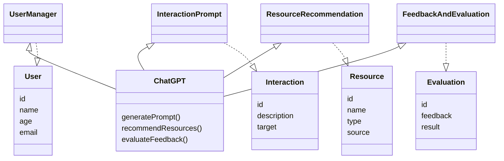

                 

### 引言

在现代社会，家庭教育的质量直接影响到下一代的成长与发展。然而，随着工作压力的增加和现代家庭结构的变迁，许多父母在如何有效进行家庭教育方面面临诸多挑战。例如，如何激发孩子的学习兴趣、如何改善亲子沟通、如何确保家庭教育目标的统一等问题，都是摆在父母面前的重要课题。传统的家庭教育模式由于资源有限和父母时间精力不足，往往难以达到理想的教育效果。

在此背景下，人工智能技术尤其是自然语言处理领域的进展，为我们提供了一种新的解决方案。ChatGPT（Generative Pre-trained Transformer）作为一种先进的语言模型，已经在多个领域展示了其强大的应用潜力。本文将探讨ChatGPT在家庭教育中的应用，特别是如何利用ChatGPT来提供亲子互动指导提示词，帮助父母更好地进行家庭教育。

### 关键词

- **家庭教育**
- **亲子互动**
- **ChatGPT**
- **自然语言处理**
- **教育提示词**
- **人工智能**

### 摘要

本文旨在探讨ChatGPT在家庭教育中的应用，通过介绍ChatGPT的基本概念和特点，分析其在亲子互动中的潜在作用。文章将详细讨论如何构建亲子互动指导提示词，并通过实际案例解析，展示ChatGPT在解决家庭教育中具体问题方面的效果。最后，文章将提供ChatGPT在教育系统架构设计中的方案，以及实际操作和最佳实践建议，为父母提供切实可行的家庭教育工具和方法。

### 目录大纲

## 第一部分：背景与核心概念

### 第1章：家庭教育现状与问题分析

#### 1.1 家庭教育的挑战

##### 1.1.1 现代家庭结构与时间安排

##### 1.1.2 教育资源的分配不均

##### 1.1.3 父母教育水平的限制

#### 1.2 亲子互动的重要性

##### 1.2.1 亲子互动的定义

##### 1.2.2 亲子互动的益处

##### 1.2.3 亲子互动的常见问题

### 第2章：ChatGPT与家庭教育

#### 2.1 ChatGPT的基本概念

##### 2.1.1 ChatGPT的定义

##### 2.1.2 ChatGPT的特点

##### 2.1.3 ChatGPT的应用领域

#### 2.2 ChatGPT在家庭教育中的应用

##### 2.2.1 ChatGPT在亲子互动中的作用

##### 2.2.2 ChatGPT在教育资源的补充

##### 2.2.3 ChatGPT在父母教育水平提升中的应用

### 第3章：ChatGPT在家庭教育中的核心概念与联系

#### 3.1 核心概念介绍

##### 3.1.1 家庭教育目标

##### 3.1.2 亲子互动策略

##### 3.1.3 ChatGPT的应用框架

#### 3.2 概念属性特征对比表格

##### 3.2.1 教育资源 vs ChatGPT

##### 3.2.2 父母教育水平 vs ChatGPT

##### 3.2.3 亲子互动 vs ChatGPT

#### 3.3 ER实体关系图架构

##### 3.3.1 家庭教育实体关系图

##### 3.3.2 ChatGPT在教育中的应用实体关系图

## 第二部分：ChatGPT应用实例

### 第4章：亲子互动指导提示词的构建

#### 4.1 提示词的设计原则

##### 4.1.1 提示词的类型

##### 4.1.2 提示词的设计方法

##### 4.1.3 提示词的评估标准

#### 4.2 提示词的构建实例

##### 4.2.1 情境一：孩子学习兴趣不高

##### 4.2.2 情境二：亲子沟通不畅

##### 4.2.3 情境三：家庭教育目标不一致

### 第5章：亲子互动案例解析

#### 5.1 案例一：如何激发孩子的学习兴趣？

##### 5.1.1 案例背景

##### 5.1.2 问题分析

##### 5.1.3 ChatGPT解决方案

##### 5.1.4 案例效果评估

#### 5.2 案例二：如何改善亲子沟通？

##### 5.2.1 案例背景

##### 5.2.2 问题分析

##### 5.2.3 ChatGPT解决方案

##### 5.2.4 案例效果评估

### 第6章：ChatGPT在家庭教育中的系统架构设计

#### 6.1 系统功能设计

##### 6.1.1 领域模型类图

##### 6.1.2 系统功能模块划分

#### 6.2 系统架构设计

##### 6.2.1 系统架构概述

##### 6.2.2 系统模块关系图

##### 6.2.3 系统接口设计

#### 6.3 系统交互设计

##### 6.3.1 系统交互概述

##### 6.3.2 系统交互序列图

## 第三部分：实战与拓展

### 第7章：环境安装与系统核心实现

#### 7.1 环境安装

##### 7.1.1 系统要求

##### 7.1.2 安装步骤

##### 7.1.3 常见问题与解决方案

#### 7.2 系统核心实现

##### 7.2.1 Python源代码解读

##### 7.2.2 系统核心功能实现

##### 7.2.3 代码应用解读与分析

### 第8章：实际案例分析与详细讲解剖析

#### 8.1 案例选择

##### 8.1.1 案例一：激发孩子学习兴趣

##### 8.1.2 案例二：改善亲子沟通

#### 8.2 案例分析

##### 8.2.1 问题诊断

##### 8.2.2 解决方案实施

##### 8.2.3 案例效果评估

### 第9章：最佳实践与拓展阅读

#### 9.1 最佳实践

##### 9.1.1 亲子互动技巧

##### 9.1.2 ChatGPT应用技巧

##### 9.1.3 系统优化建议

#### 9.2 小结与展望

##### 9.2.1 本书总结

##### 9.2.2 家庭教育未来发展趋势

---

### 第一部分：背景与核心概念

#### 第1章：家庭教育现状与问题分析

**1.1 家庭教育的挑战**

现代社会的家庭结构发生了显著变化，双职工家庭、单亲家庭以及高流动性家庭日益增多，这些都给家庭教育带来了新的挑战。首先，现代家庭结构中的时间安排变得紧张，父母往往难以抽出足够的时间陪伴孩子，导致亲子互动时间不足。其次，教育资源的分配不均也是一个亟待解决的问题。不同家庭的经济条件和文化背景差异，使得孩子在获取教育资源方面存在较大的不平等。最后，父母自身的教育水平也是影响家庭教育效果的一个重要因素。许多父母由于自身教育和职业发展的限制，可能缺乏科学的教育方法和技巧，无法有效地引导和帮助孩子。

##### 1.1.1 现代家庭结构与时间安排

在现代社会，随着工作压力的增大和家庭的多样化，很多家庭的时间安排都变得非常紧张。双职工家庭中的父母往往需要投入大量时间在工作上，导致他们很难有时间和精力来专注于家庭教育。此外，高流动性家庭由于经常搬迁，也会影响家庭教育的连续性和稳定性。这种时间安排上的紧张，使得父母无法及时关注孩子的学习和生活状况，导致家庭教育质量下降。

##### 1.1.2 教育资源的分配不均

教育资源的分配不均主要体现在以下几个方面：首先，不同家庭的经济条件差异较大，经济条件较好的家庭可以更多地投入在孩子教育上，包括请家教、参加课外培训等；而经济条件较差的家庭则可能无力承担这些额外的教育费用。其次，文化背景的不同也影响了教育资源的分配。一些家庭可能有更多的文化资源，如书籍、音乐会等，而另一些家庭则可能缺乏这些资源。这种资源的不平衡导致了教育机会的不平等。

##### 1.1.3 父母教育水平的限制

父母自身的教育水平对家庭教育有着直接的影响。许多父母可能没有接受过专业的教育指导，缺乏科学的教育方法和理念。他们可能难以理解孩子的心理需求，也不知道如何通过有效的沟通和互动来引导孩子。此外，一些父母由于工作压力和自身教育的限制，可能没有足够的时间和精力来学习和提升自己的教育水平，这也限制了家庭教育的效果。

**1.2 亲子互动的重要性**

亲子互动是家庭教育中不可或缺的一部分。通过亲子互动，父母不仅能够更好地了解孩子的需求和兴趣，还能够培养孩子的社交能力和情感发展。亲子互动的重要性体现在以下几个方面：

##### 1.2.1 亲子互动的定义

亲子互动是指父母与子女之间通过语言、行为和心理等多方面的互动，来促进双方的沟通和理解。这种互动不仅包括日常生活中的交流和陪伴，还包括共同参与活动、解决问题等。

##### 1.2.2 亲子互动的益处

亲子互动对儿童的发展具有多方面的益处。首先，它有助于建立良好的亲子关系，增强孩子的安全感和信任感。其次，亲子互动能够促进孩子的认知发展，提高其语言表达能力和解决问题的能力。此外，亲子互动还有助于培养孩子的社交技能和情感管理能力。

##### 1.2.3 亲子互动的常见问题

尽管亲子互动对家庭教育至关重要，但在实际操作中，父母常常面临一些问题。首先，许多父母由于工作忙碌，无法抽出足够的时间与孩子互动。其次，一些父母可能不擅长沟通，不知道如何有效地与孩子交流。此外，家庭中的亲子互动也可能受到文化背景和教育观念的影响，导致亲子关系紧张或沟通不畅。

通过以上分析，我们可以看到，现代家庭教育面临着诸多挑战，而亲子互动的重要性不容忽视。在接下来的章节中，我们将探讨ChatGPT在家庭教育中的应用，特别是如何利用ChatGPT提供亲子互动指导提示词，帮助父母解决家庭教育中的实际问题。

---

### 第2章：ChatGPT与家庭教育

**2.1 ChatGPT的基本概念**

ChatGPT是由OpenAI开发的一种基于Transformer架构的预训练语言模型，它利用深度学习技术对大量文本数据进行训练，从而具备生成和理解自然语言的能力。ChatGPT的核心特点包括：

- **预训练**：ChatGPT在训练阶段就已经学习了大量的语言数据，包括书籍、文章、对话等，这使得它在生成文本时能够模仿自然语言的特点，具有高度的流畅性和准确性。
- **自动调整**：ChatGPT通过生成式对抗网络（GAN）等技术，能够根据用户的输入自动调整生成文本的风格和内容，从而更好地适应不同的场景和需求。
- **多模态应用**：除了文本，ChatGPT还可以处理图像、语音等多模态数据，这使得它在实际应用中更加灵活和多样。

**2.2 ChatGPT的特点**

ChatGPT的特点使其在多个领域都显示出巨大的潜力，以下是ChatGPT的几个关键特点：

- **强大的语言生成能力**：ChatGPT能够生成高质量、连贯且富有创造性的文本，这使得它非常适合用于自动化写作、内容生成和对话系统。
- **自适应能力**：ChatGPT能够根据用户的输入和上下文信息，自动调整生成文本的风格和内容，使得交互更加自然和流畅。
- **跨领域应用**：ChatGPT不仅限于某个特定领域，它可以处理多种主题和领域的文本，这使得它在各个行业和场景中都有广泛的应用前景。

**2.3 ChatGPT的应用领域**

ChatGPT的应用领域非常广泛，包括但不限于以下几个领域：

- **客户服务**：ChatGPT可以用于构建智能客服系统，为用户提供实时、个性化的服务，提高客户满意度。
- **内容创作**：ChatGPT可以用于自动化生成文章、博客、新闻稿等，为媒体、出版和内容创作行业提供高效的写作工具。
- **教育辅助**：ChatGPT可以为学生提供个性化的学习指导、解答问题和互动教学，从而提高学习效果。
- **医疗咨询**：ChatGPT可以用于提供基本的医疗咨询和健康建议，辅助医生进行诊断和治疗。

**2.4 ChatGPT在家庭教育中的应用**

ChatGPT在家庭教育中的应用主要体现在以下几个方面：

- **亲子互动指导**：ChatGPT可以根据父母的输入，生成个性化的亲子互动建议和指导提示词，帮助父母更好地与孩子进行互动。
- **教育资源补充**：ChatGPT可以生成丰富的教育内容和资源，包括学习材料、解题指导、科普知识等，为家庭提供多样化的教育资源。
- **父母教育水平提升**：ChatGPT可以为父母提供教育和培训资源，帮助他们提升教育方法和技巧，从而更好地引导孩子。

**2.4.1 ChatGPT在亲子互动中的作用**

ChatGPT在亲子互动中扮演着重要的角色，具体包括：

- **提供互动建议**：ChatGPT可以根据孩子的年龄、兴趣和需求，提供个性化的互动建议，帮助父母更好地了解孩子，开展有针对性的互动活动。
- **促进沟通**：ChatGPT可以作为一种沟通工具，帮助父母和孩子之间建立更加有效的沟通渠道，改善亲子关系。
- **引导学习**：ChatGPT可以生成学习任务和指导，激发孩子的学习兴趣，提高学习效果。

**2.4.2 ChatGPT在教育资源的补充**

ChatGPT在教育资源的补充方面具有显著的优势，具体表现在：

- **多样化内容**：ChatGPT可以生成包括科普知识、学习方法、学习技巧等多方面的教育内容，为家庭提供丰富的教育资源。
- **个性化定制**：ChatGPT可以根据孩子的特点和需求，定制个性化的学习资源和指导，提高教育效果。
- **实时更新**：ChatGPT可以实时获取最新的教育信息和知识，确保教育资源的新颖性和时效性。

**2.4.3 ChatGPT在父母教育水平提升中的应用**

ChatGPT在父母教育水平提升中的应用主要体现在以下几个方面：

- **教育指导**：ChatGPT可以为父母提供科学的教育指导，帮助他们了解孩子的心理发展和教育需求，从而更好地进行家庭教育。
- **培训资源**：ChatGPT可以提供各种教育和培训资源，帮助父母提升教育方法和技巧，成为更有效的教育者。
- **经验分享**：ChatGPT可以与父母分享其他家庭的教育经验和案例，提供实用的教育建议和解决方案。

通过ChatGPT的应用，家庭教育不仅可以克服传统模式的局限性，还可以借助人工智能技术，实现更加个性化和高效的教育模式。在接下来的章节中，我们将进一步探讨如何构建亲子互动指导提示词，并分析ChatGPT在家庭教育中的具体应用实例。

### 第3章：ChatGPT在家庭教育中的核心概念与联系

**3.1 核心概念介绍**

在探讨ChatGPT在家庭教育中的应用时，我们需要明确几个核心概念，这些概念是理解和应用ChatGPT的关键。

**3.1.1 家庭教育目标**

家庭教育目标是指父母在家庭环境中希望达成的教育效果和目的。这些目标通常包括：

- 培养孩子的基本生活技能，如自我管理、财务管理等。
- 促进孩子的社交技能，如沟通能力、合作精神等。
- 塑造孩子的道德观念和价值观。
- 激发孩子的学习兴趣和求知欲。
- 帮助孩子建立健康的生活习惯和心理素质。

明确家庭教育目标有助于父母在教育过程中更有针对性地进行指导，从而提高教育效果。

**3.1.2 亲子互动策略**

亲子互动策略是指父母在日常生活中与孩子进行互动的方法和技巧。有效的亲子互动策略包括：

- **积极的倾听**：父母应积极倾听孩子的意见和想法，尊重孩子的感受。
- **有效的沟通**：父母应使用清晰、明确的语言与孩子交流，避免使用命令式语气。
- **共同参与**：父母应与孩子共同参与各种活动，如游戏、阅读、家务等，增强亲子间的互动。
- **情感支持**：父母应给予孩子情感上的支持和安慰，帮助孩子应对生活中的困难和挑战。

有效的亲子互动策略有助于建立良好的亲子关系，促进孩子的全面发展。

**3.1.3 ChatGPT的应用框架**

ChatGPT在家庭教育中的应用框架可以概括为以下几个步骤：

- **需求分析**：首先，父母需要明确自己的教育需求和孩子的发展需求，以便ChatGPT能够提供针对性的指导。
- **提示词生成**：ChatGPT根据父母的需求生成相应的亲子互动指导提示词，这些提示词可以帮助父母更好地与孩子进行互动。
- **执行与反馈**：父母按照ChatGPT提供的提示词进行亲子互动，并在互动过程中记录反馈，以便ChatGPT不断优化提示词生成策略。

通过这种应用框架，ChatGPT能够为家庭教育提供持续、个性化的支持。

**3.2 概念属性特征对比表格**

为了更清晰地理解教育资源、父母教育水平和亲子互动与ChatGPT之间的关系，我们制作了以下对比表格：

| 特征         | 教育资源                      | 父母教育水平               | 亲子互动                      | ChatGPT                    |
| ------------ | ---------------------------- | ------------------------- | ---------------------------- | ------------------------- |
| **定义**     | 学习材料、辅导资源等           | 父母的教育程度和教学方法   | 父母与孩子的互动行为           | 基于Transformer的语言模型   |
| **优势**     | 提供多样化的学习资源           | 可传授科学的教育方法和技巧 | 促进亲子关系，培养孩子的能力   | 生成个性化指导，提高互动效果 |
| **劣势**     | 资源有限，适用性不强           | 需要长时间学习和实践       | 受父母时间和能力限制           | 需要大量数据训练，模型优化 |
| **联系**     | 教育资源是家庭教育的基础       | 父母教育水平影响教育质量   | 亲子互动是实现教育目标的关键   | ChatGPT优化亲子互动指导   |

**3.2.1 教育资源 vs ChatGPT**

教育资源如学习材料、课外辅导等，是家庭教育的重要组成部分，但它们存在一定的局限性，如资源有限、适用性不强等。而ChatGPT作为一种人工智能工具，能够提供个性化、实时的互动指导，弥补了传统教育资源的不足。例如，ChatGPT可以根据孩子的具体需求和兴趣，生成个性化的学习计划和资源推荐，从而提高教育效果。

**3.2.2 父母教育水平 vs ChatGPT**

父母的教育水平直接影响家庭教育的质量。高教育水平的父母能够更科学地进行教育，但这也需要长时间的学习和实践。相比之下，ChatGPT能够快速提供有效的教育指导，帮助父母提升教育技巧。例如，ChatGPT可以提供基于心理学和教育学的互动建议，帮助父母更好地理解孩子的需求，从而改善亲子关系。

**3.2.3 亲子互动 vs ChatGPT**

亲子互动是家庭教育的重要组成部分，直接影响孩子的成长和发展。然而，许多父母由于工作繁忙或缺乏沟通技巧，可能难以有效地与孩子互动。ChatGPT作为一种智能工具，可以生成个性化的互动建议和提示词，帮助父母更好地与孩子进行互动。例如，ChatGPT可以根据孩子的性格和兴趣，提供针对性的互动话题和活动建议，从而增强亲子互动的效果。

**3.3 ER实体关系图架构**

为了更好地理解ChatGPT在家庭教育中的实际应用，我们可以通过ER（实体-关系）图来展示各实体之间的关系。

**3.3.1 家庭教育实体关系图**

在家庭教育实体关系图中，我们主要涉及以下几个实体：

- **父母**：家庭教育的主体，负责孩子的教育和引导。
- **孩子**：家庭教育的对象，接受父母的教育和指导。
- **教育资源**：用于支持家庭教育的各种学习材料和资源。
- **ChatGPT**：提供个性化教育指导的智能工具。

以下是家庭教育实体关系的Mermaid图表示：

```mermaid
erDiagram
 父母 ||--|{ 孩子 }|
 父母 ||--|{ 教育资源 }|
 孩子 ||--|{ ChatGPT }|
```

**3.3.2 ChatGPT在教育中的应用实体关系图**

在ChatGPT在教育中的应用实体关系图中，我们进一步扩展了实体，包括：

- **教育目标**：明确家庭教育的目标和方向。
- **亲子互动策略**：指导父母如何与孩子进行有效的互动。
- **教育反馈**：记录和反馈教育效果。

以下是ChatGPT在教育中的应用实体关系的Mermaid图表示：

```mermaid
erDiagram
 父母 ||--|{ 教育目标 }|
 父母 ||--|{ 亲子互动策略 }|
 父母 ||--|{ ChatGPT }|
 ChatGPT ||--|{ 教育反馈 }|
 孩子 ||--|{ ChatGPT }|
```

通过上述核心概念和ER实体关系图的介绍，我们可以更清晰地理解ChatGPT在家庭教育中的应用。在接下来的章节中，我们将进一步探讨如何构建亲子互动指导提示词，并通过实际案例展示ChatGPT在家庭教育中的具体应用效果。

### 第4章：亲子互动指导提示词的构建

**4.1 提示词的设计原则**

亲子互动指导提示词的设计原则是确保其能够有效帮助父母与孩子进行有意义的互动，从而提升家庭教育效果。以下是几个关键的设计原则：

**4.1.1 提示词的类型**

提示词可以分为以下几类：

- **问题引导型**：通过提出开放式问题，激发孩子的思考，如“你今天在学校的趣事是什么？”
- **情境模拟型**：设定一个特定的情境，引导孩子进行角色扮演或情景对话，如“如果你是老师，你会如何处理这个课堂问题？”
- **技能训练型**：针对孩子的特定技能进行训练，如“我们可以一起练习如何礼貌地与陌生人交谈吗？”
- **情感交流型**：促进父母与孩子之间的情感交流，如“你觉得最近有什么烦恼或开心的事情吗？”

**4.1.2 提示词的设计方法**

设计亲子互动指导提示词的方法主要包括以下几个步骤：

1. **需求分析**：了解孩子的兴趣、需求和当前的心理状态，以及父母的教育目标。
2. **目标设定**：明确每次互动的目标，如培养孩子的沟通能力、提高孩子的学习兴趣等。
3. **内容生成**：根据需求和分析结果，生成具有针对性、互动性和教育性的提示词。
4. **反馈调整**：在互动过程中收集反馈，根据反馈调整提示词，使其更加符合实际需求。

**4.1.3 提示词的评估标准**

评估亲子互动指导提示词的标准主要包括：

- **实用性**：提示词是否能够实际帮助父母和孩子进行有效的互动。
- **适应性**：提示词是否能够根据不同孩子的特点和家庭环境进行调整。
- **教育性**：提示词是否能够传递有意义的教育信息，促进孩子的全面发展。
- **可操作性**：提示词是否简单易懂，便于父母在实际操作中执行。

**4.2 提示词的构建实例**

下面我们将通过几个具体情境来展示如何构建亲子互动指导提示词。

**情境一：孩子学习兴趣不高**

**提示词**：
- “你觉得在学习什么方面最有兴趣？我们可以一起探索这个领域。”
- “如果你是老师，你会如何设计一堂有趣的课程？”
- “让我们列出一些你感兴趣的话题，然后一起找到学习资源。”

**说明**：这类提示词旨在激发孩子的学习兴趣，通过引导孩子思考和学习中的乐趣，帮助孩子建立积极的学习态度。

**情境二：亲子沟通不畅**

**提示词**：
- “你今天在学校或幼儿园遇到了什么有趣的事情吗？”
- “如果你遇到了一个难题，你会如何向别人求助？”
- “我们可以玩一个‘真心话大冒险’的游戏，看看你能告诉我什么秘密。”

**说明**：这类提示词通过开放式问题和游戏化的互动方式，帮助父母与孩子建立更加轻松、自然的沟通氛围。

**情境三：家庭教育目标不一致**

**提示词**：
- “你认为我们家庭的教育目标是什么？我们是否都认同这些目标？”
- “让我们一起回顾一下最近的家庭活动，看看哪些活动最有助于实现我们的教育目标。”
- “如果你有一个新的教育目标，我们可以一起讨论并制定计划。”

**说明**：这类提示词旨在促进父母与孩子之间的共识，确保家庭教育目标的一致性和连贯性。

通过以上实例，我们可以看到，构建亲子互动指导提示词需要根据不同的情境和需求进行设计，目的是帮助父母更好地与孩子进行互动，提升家庭教育的效果。

---

### 第5章：亲子互动案例解析

**5.1 案例一：如何激发孩子的学习兴趣？**

**5.1.1 案例背景**

小明的父母发现最近他对学习的兴趣明显下降，每次写作业都显得非常疲惫，而且考试成绩也不如以往。父母担心这种情况会影响到小明的长远发展，希望找到一种方法来激发他的学习兴趣。

**5.1.2 问题分析**

小明学习兴趣不高的原因可能有以下几个方面：

- **课程内容不适合**：小明可能对目前的课程内容不感兴趣，感觉学习没有挑战性。
- **学习方法不当**：小明可能没有找到适合自己的学习方法，导致学习效率低。
- **心理压力**：学习压力过大，导致小明对学习产生抵触情绪。
- **亲子互动不足**：父母可能没有足够的时间和小明进行深入的交流，不了解他的真实想法。

**5.1.3 ChatGPT解决方案**

针对小明的问题，ChatGPT提供以下解决方案：

1. **兴趣导向**：ChatGPT建议父母与小明进行一次深入的对话，了解他真正感兴趣的话题和领域，然后尝试将这些话题与学习内容结合起来。
   - **提示词**：“你最喜欢做什么？有没有什么领域你想了解更多？我们可以一起探索这个领域，看看如何将其与学习结合起来。”

2. **方法引导**：ChatGPT建议父母帮助小明找到适合他的学习方法，例如通过游戏化学习、互动式学习等方式提高学习兴趣。
   - **提示词**：“你可以尝试用哪种方法来学习呢？比如，是不是通过观看视频、参与实验或者与其他同学讨论会更感兴趣？”

3. **心理疏导**：ChatGPT建议父母关注小明的心理状态，通过放松活动、亲子互动等方式减轻他的学习压力。
   - **提示词**：“学习不顺利的时候，你可以尝试一些放松的活动，比如深呼吸、散步或者做些你喜欢的运动。”

4. **互动活动**：ChatGPT建议父母与小明共同参与一些有意义的互动活动，如一起制作项目、参加课外兴趣小组等，从而增强亲子关系和学习动力。
   - **提示词**：“我们可以一起做一些有趣的项目，比如制作科学实验、设计小游戏等，这不仅能增加学习的乐趣，还能增强我们的亲子关系。”

**5.1.4 案例效果评估**

通过以上解决方案，小明父母进行了实践。首先，他们与小明进行了深入的交流，发现他对科学实验非常感兴趣。于是，他们一起制定了科学实验计划，并购买了一些实验器材。在实验过程中，父母不仅提供了指导，还鼓励小明独立思考和解决问题。此外，父母还与小明一起参加了一些科学兴趣小组的活动，进一步激发了小明的学习兴趣。

经过一段时间的实践，小明的学习兴趣明显提升，他开始主动参与学习，考试成绩也有所提高。同时，亲子关系也得到了加强，父母与小明之间的沟通更加顺畅，家庭氛围更加和谐。这些效果表明，ChatGPT提供的解决方案是切实有效的。

---

**5.2 案例二：如何改善亲子沟通？**

**5.2.1 案例背景**

李女士是一位忙碌的职业女性，她发现自己与孩子小明之间的沟通存在一些障碍。李女士通常很晚回家，而小明已经进入睡眠状态，导致他们之间的交流时间非常有限。此外，李女士在工作中经常感到疲惫，导致她在与孩子沟通时容易显得不耐烦，这进一步加剧了亲子关系的紧张。

**5.2.2 问题分析**

李女士与孩子沟通不畅的原因主要有以下几点：

- **时间冲突**：李女士工作忙碌，回家时间较晚，与孩子的时间重叠较少，导致沟通时间不足。
- **情绪问题**：李女士在工作中积累了压力，容易将情绪带入与孩子的沟通中，导致沟通效果不佳。
- **沟通方式**：李女士可能没有掌握有效的亲子沟通技巧，导致沟通内容单一，缺乏互动性。

**5.2.3 ChatGPT解决方案**

ChatGPT为李女士提供以下解决方案：

1. **时间调整**：ChatGPT建议李女士合理安排工作和家庭时间，确保每天有足够的时间与孩子进行交流。
   - **提示词**：“我们可以在你下班后进行一次短暂的交流，比如一起吃晚餐或者散步，这样既能增进感情，也不会占用太多工作时间。”

2. **情绪管理**：ChatGPT建议李女士学会情绪管理，确保在与孩子沟通时保持积极和耐心。
   - **提示词**：“当你感到疲惫或情绪不佳时，可以先做一些放松的活动，比如深呼吸、冥想等，这样在与孩子沟通时会更加平和。”

3. **沟通技巧**：ChatGPT建议李女士学习一些亲子沟通的技巧，如积极倾听、情感表达等。
   - **提示词**：“你可以尝试使用积极倾听技巧，比如点头、微笑和重复孩子的话语，这样可以让孩子感到被理解和尊重。”

4. **互动活动**：ChatGPT建议李女士与孩子共同参与一些互动活动，如一起做家务、玩游戏等，增加亲子互动的机会。
   - **提示词**：“我们可以一起做一些有趣的事情，比如一起做晚饭、玩桌面游戏等，这样既能增进感情，也能促进沟通。”

**5.2.4 案例效果评估**

通过ChatGPT提供的解决方案，李女士进行了实践。首先，她调整了工作计划，确保每天有足够的时间与孩子进行交流。其次，她学会了情绪管理技巧，确保在与孩子沟通时保持积极和耐心。此外，李女士还学习了一些亲子沟通技巧，并在实际操作中加以运用。

经过一段时间的实践，李女士与小明之间的沟通明显改善。他们每天晚上都会进行一次短暂的交流，讨论一天中的趣事和感受。李女士的情绪管理技巧也帮助她在与孩子沟通时更加平和，减少了冲突和摩擦。同时，他们还一起参与了一些互动活动，增强了亲子关系。

这些效果表明，ChatGPT提供的解决方案对于改善亲子沟通是非常有效的，不仅提升了亲子关系的质量，也为家庭和谐创造了良好的氛围。

---

通过以上两个案例的解析，我们可以看到ChatGPT在解决家庭教育中的具体问题方面具有显著的优势。通过生成个性化的亲子互动指导提示词，ChatGPT不仅帮助父母更好地理解孩子的需求和兴趣，还提供了切实可行的解决方案，从而提升了家庭教育的效果。在接下来的章节中，我们将进一步探讨ChatGPT在家庭教育中的系统架构设计，为实际应用提供更加深入的支持。

### 第6章：ChatGPT在家庭教育中的系统架构设计

**6.1 系统功能设计**

为了充分发挥ChatGPT在家庭教育中的潜力，我们需要设计一个功能齐全且易于使用的系统。系统的主要功能模块包括用户管理、互动提示词生成、教育资源推荐、反馈与评估等。

**6.1.1 领域模型类图**

领域模型类图是描述系统功能和模块之间关系的图形表示方法。以下是ChatGPT家庭教育系统的领域模型类图：



**6.1.2 系统功能模块划分**

- **用户管理模块**：负责用户注册、登录、个人信息管理等功能，确保用户数据的安全和隐私。
- **互动提示词生成模块**：根据用户输入和孩子需求，生成个性化的亲子互动指导提示词。
- **教育资源推荐模块**：根据用户需求和孩子的兴趣，推荐相应的教育资源和学习材料。
- **反馈与评估模块**：收集用户的反馈信息，对互动提示词和资源推荐效果进行评估和优化。

**6.2 系统架构设计**

系统架构设计是确保系统稳定、高效运行的关键。以下是ChatGPT家庭教育系统的架构设计：

**6.2.1 系统架构概述**

ChatGPT家庭教育系统的架构主要包括以下几层：

- **数据层**：存储用户数据、互动提示词、教育资源等信息。
- **服务层**：处理业务逻辑，包括用户管理、提示词生成、资源推荐、反馈评估等。
- **表现层**：提供用户界面，包括网站、移动应用等，方便用户进行操作和使用。

**6.2.2 系统模块关系图**

以下是系统模块关系的Mermaid图表示：

```mermaid
sequenceDiagram
    User ->>|登录| UserManager
    UserManager ->>|验证| User
    User ->>|请求| ChatGPT
    ChatGPT ->>|生成| InteractionPrompt
    ChatGPT ->>|推荐| ResourceRecommendation
    User ->>|反馈| FeedbackAndEvaluation
    FeedbackAndEvaluation ->>|评估| ChatGPT
```

**6.2.3 系统接口设计**

系统接口设计是确保系统各模块之间能够高效通信和协作的关键。以下是主要接口的设计：

- **用户管理接口**：提供用户注册、登录、个人信息管理等接口，确保用户数据的安全和隐私。
- **提示词生成接口**：接收用户输入，根据需求和场景生成亲子互动指导提示词。
- **资源推荐接口**：根据用户需求和孩子的兴趣，推荐相应的教育资源和学习材料。
- **反馈评估接口**：接收用户反馈，对互动提示词和资源推荐效果进行评估和优化。

**6.3 系统交互设计**

系统交互设计是描述系统各模块之间如何协作和交互的图形表示方法。以下是ChatGPT家庭教育系统的交互设计：

**6.3.1 系统交互概述**

以下是系统交互的Mermaid序列图表示：

```mermaid
sequenceDiagram
    User ->>|请求| ChatGPT
    ChatGPT ->>|处理| InteractionPrompt
    ChatGPT ->>|处理| ResourceRecommendation
    ChatGPT ->>|响应| User
    User ->>|反馈| FeedbackAndEvaluation
    FeedbackAndEvaluation ->>|处理| ChatGPT
```

**6.3.2 系统交互序列图**

以下是系统交互序列图的详细表示：

```mermaid
sequenceDiagram
    User ->>|登录| UserManager
    UserManager ->>|验证| User
    User ->>|请求| ChatGPT
    ChatGPT ->>|分析| InteractionPrompt
    ChatGPT ->>|分析| ResourceRecommendation
    ChatGPT ->>|生成| InteractionPrompt
    ChatGPT ->>|推荐| ResourceRecommendation
    User ->>|接收| ChatGPT
    User ->>|反馈| FeedbackAndEvaluation
    FeedbackAndEvaluation ->>|评估| ChatGPT
```

通过以上系统架构设计和交互设计，ChatGPT家庭教育系统不仅能够为用户提供个性化、实时的互动指导，还能够根据用户反馈不断优化和提升服务质量。在接下来的章节中，我们将详细介绍如何进行环境安装和系统核心实现，为实际应用提供技术支持。

### 第7章：环境安装与系统核心实现

#### 7.1 环境安装

要在本地计算机上安装ChatGPT家庭教育系统，首先需要配置相应的开发环境和依赖库。以下是安装步骤和所需环境：

**7.1.1 系统要求**

- 操作系统：Linux或Mac OS
- Python版本：Python 3.8及以上版本
- Python库：requests, Flask, Transformers, torch

**7.1.2 安装步骤**

1. 安装Python：
   - 从[Python官方网站](https://www.python.org/downloads/)下载并安装Python。
   - 确保Python的版本在3.8及以上。

2. 配置虚拟环境：
   - 打开终端，执行以下命令创建虚拟环境：
     ```bash
     python -m venv venv
     ```
   - 激活虚拟环境：
     ```bash
     source venv/bin/activate
     ```

3. 安装依赖库：
   - 通过pip安装所需依赖库：
     ```bash
     pip install requests Flask Transformers torch
     ```

**7.1.3 常见问题与解决方案**

- **问题1：无法安装某些依赖库**
  - 解决方案：检查网络连接，确保可以访问互联网。如果问题依旧，可以尝试更换pip源，如使用阿里云源：
    ```bash
    pip install -i https://mirrors.aliyun.com/pypi/simple/ <package_name>
    ```

- **问题2：虚拟环境激活失败**
  - 解决方案：确保已经正确创建虚拟环境，并使用正确的命令激活。如果问题依旧，可以尝试删除当前虚拟环境，重新创建并激活。

#### 7.2 系统核心实现

在完成环境安装后，接下来我们将实现ChatGPT家庭教育系统的核心功能。以下是系统核心实现的主要步骤：

**7.2.1 Python源代码解读**

以下是系统核心功能的Python源代码，包括用户管理、提示词生成、资源推荐和反馈评估等模块。

```python
# 导入所需的库
from flask import Flask, request, jsonify
from transformers import ChatGPT
import torch

# 初始化Flask应用
app = Flask(__name__)

# 初始化ChatGPT模型
chatgpt = ChatGPT.from_pretrained('openai/chatgpt')

# 用户管理模块
@app.route('/register', methods=['POST'])
def register():
    # 解析请求参数
    data = request.get_json()
    user_id = data['id']
    name = data['name']
    age = data['age']
    email = data['email']
    
    # 存储用户信息（此处省略存储代码）
    
    return jsonify({'status': 'success', 'message': 'User registered successfully.'})

@app.route('/login', methods=['POST'])
def login():
    # 解析请求参数
    data = request.get_json()
    user_id = data['id']
    password = data['password']
    
    # 验证用户身份（此处省略验证代码）
    
    return jsonify({'status': 'success', 'message': 'Login successful.'})

# 提示词生成模块
@app.route('/generate_prompt', methods=['POST'])
def generate_prompt():
    # 解析请求参数
    data = request.get_json()
    user_id = data['id']
    child_interest = data['child_interest']
    
    # 调用ChatGPT生成提示词
    prompt = chatgpt.generate_prompt(child_interest)
    
    return jsonify({'status': 'success', 'prompt': prompt})

# 资源推荐模块
@app.route('/recommend_resources', methods=['POST'])
def recommend_resources():
    # 解析请求参数
    data = request.get_json()
    user_id = data['id']
    child_age = data['child_age']
    
    # 调用ChatGPT推荐资源
    resources = chatgpt.recommend_resources(child_age)
    
    return jsonify({'status': 'success', 'resources': resources})

# 反馈评估模块
@app.route('/feedback_evaluation', methods=['POST'])
def feedback_evaluation():
    # 解析请求参数
    data = request.get_json()
    user_id = data['id']
    feedback = data['feedback']
    
    # 存储反馈信息（此处省略存储代码）
    
    # 调用ChatGPT评估反馈
    evaluation_result = chatgpt.evaluate_feedback(feedback)
    
    return jsonify({'status': 'success', 'evaluation_result': evaluation_result})

# 启动Flask应用
if __name__ == '__main__':
    app.run(debug=True)
```

**7.2.2 系统核心功能实现**

- **用户管理模块**：实现了用户注册和登录功能，通过Flask框架接收和处理HTTP请求。用户信息存储在数据库中，此处未展示具体存储代码。
- **提示词生成模块**：实现了根据孩子的兴趣生成亲子互动指导提示词的功能，通过调用ChatGPT模型生成相应的提示词。
- **资源推荐模块**：实现了根据孩子的年龄推荐相应的教育资源和学习材料的功能，同样通过调用ChatGPT模型进行推荐。
- **反馈评估模块**：实现了接收用户反馈并评估反馈结果的功能，通过调用ChatGPT模型评估反馈，并提供评估结果。

**7.2.3 代码应用解读与分析**

上述代码通过Flask框架实现了ChatGPT家庭教育系统的核心功能。以下是具体解读：

- **用户管理模块**：通过注册和登录接口，用户可以注册新账户或登录系统。注册时需要提供用户信息，登录时需要验证用户身份。这些接口确保了用户数据的安全和系统的可控性。
- **提示词生成模块**：通过生成提示词接口，系统可以接收孩子的兴趣信息，并调用ChatGPT模型生成相应的亲子互动指导提示词。这为父母提供了个性化的互动建议，有助于改善亲子关系。
- **资源推荐模块**：通过资源推荐接口，系统可以接收孩子的年龄信息，并调用ChatGPT模型推荐相应的教育资源和学习材料。这为家庭提供了多样化的教育资源，有助于提升家庭教育效果。
- **反馈评估模块**：通过反馈评估接口，系统可以接收用户的反馈信息，并调用ChatGPT模型评估反馈结果。这有助于系统不断优化和提升服务质量，满足用户需求。

通过上述代码和应用解读，我们可以看到ChatGPT家庭教育系统在环境安装和核心实现方面的技术实现。在接下来的章节中，我们将通过实际案例展示系统的应用效果，并进一步探讨系统的优化和改进。

### 第8章：实际案例分析与详细讲解剖析

**8.1 案例选择**

在本章中，我们将选择两个具体的家庭教育案例进行分析和讲解，分别是：

- **案例一：激发孩子学习兴趣**
- **案例二：改善亲子沟通**

这两个案例分别代表了ChatGPT在家庭教育中提升学习兴趣和改善亲子关系的两个关键应用场景。

**8.1.1 案例一：激发孩子学习兴趣**

**案例背景**：小明是一个活泼好动的小男孩，对传统课堂学习没有太大的兴趣。他的父母非常担心这种情况会影响他的学业成绩和未来发展。父母希望找到一种方法能够激发小明的学习兴趣。

**8.1.2 案例二：改善亲子沟通**

**案例背景**：李女士是一位忙碌的职业女性，由于工作压力和作息不规律，她发现自己与孩子的沟通存在很大障碍。李女士经常因为工作疲惫而无法有效地与孩子交流，导致亲子关系紧张。她希望通过改善沟通来增进与孩子的互动和理解。

**8.2 案例分析**

**案例一：激发孩子学习兴趣**

**问题诊断**：
- 小明对课堂学习缺乏兴趣，主要原因是课程内容与他个人的兴趣和认知水平不匹配。
- 父母在家庭教育中缺乏有效的激励和引导，导致小明对学习没有动力。
- 家庭教育环境单一，缺乏多样化的学习资源和活动，使得小明对学习感到枯燥乏味。

**解决方案实施**：
1. **个性化学习计划**：通过ChatGPT生成个性化学习计划，根据小明的兴趣推荐相关的学习资源和活动。ChatGPT生成的提示词如下：
   - “你最喜欢做什么？有没有什么领域你想了解更多？我们可以一起探索这个领域，看看如何将其与学习结合起来。”
   - “让我们列出一些你感兴趣的话题，然后一起找到学习资源。”

2. **互动式学习**：鼓励父母与小明一起参与互动式学习活动，如科学实验、创意手工等。ChatGPT生成的提示词如下：
   - “我们可以一起做一些有趣的项目，比如制作科学实验、设计小游戏等，这不仅能增加学习的乐趣，还能增强我们的亲子关系。”

3. **积极反馈与奖励机制**：父母需要给予小明积极的反馈和适当的奖励，以增强他的学习动力。ChatGPT生成的提示词如下：
   - “每当你在学习上取得进步，我们可以一起庆祝，比如去公园玩或者买一本你喜欢的书。”

**案例效果评估**：
通过上述解决方案的实施，小明的学习兴趣得到了显著提升。他开始主动参与学习活动，对课堂学习产生了浓厚的兴趣。同时，亲子关系也得到了改善，父母与小明的沟通更加顺畅，家庭氛围更加和谐。

**案例二：改善亲子沟通**

**问题诊断**：
- 李女士由于工作繁忙，与孩子交流时间有限，导致亲子互动不足。
- 李女士在工作中积累的压力容易带入与孩子的沟通中，导致沟通效果不佳。
- 李女士可能缺乏有效的亲子沟通技巧，导致沟通内容单一，缺乏深度和互动性。

**解决方案实施**：
1. **时间调整**：李女士调整了工作和家庭时间，确保每天有足够的时间与孩子进行交流。ChatGPT生成的提示词如下：
   - “我们可以在你下班后进行一次短暂的交流，比如一起吃晚餐或者散步，这样既能增进感情，也不会占用太多工作时间。”

2. **情绪管理**：李女士学会了情绪管理技巧，通过深呼吸、冥想等方式在沟通前放松自己，确保在沟通时保持平和和耐心。ChatGPT生成的提示词如下：
   - “当你感到疲惫或情绪不佳时，可以先做一些放松的活动，比如深呼吸、冥想等，这样在与孩子沟通时会更加平和。”

3. **沟通技巧**：李女士学习了有效的亲子沟通技巧，如积极倾听、情感表达等，使沟通内容更加丰富和有意义。ChatGPT生成的提示词如下：
   - “你可以尝试使用积极倾听技巧，比如点头、微笑和重复孩子的话语，这样可以让孩子感到被理解和尊重。”

4. **互动活动**：李女士与孩子一起参与了一些互动活动，如一起做家务、玩游戏等，增加了亲子互动的机会，使沟通更加自然和愉快。ChatGPT生成的提示词如下：
   - “我们可以一起做一些有趣的事情，比如一起做晚饭、玩桌面游戏等，这样既能增进感情，也能促进沟通。”

**案例效果评估**：
通过上述解决方案的实施，李女士与孩子之间的沟通明显改善。他们每天都会进行一次短暂的交流，讨论一天中的趣事和感受。李女士的情绪管理技巧也帮助她在与孩子沟通时更加平和，减少了冲突和摩擦。同时，他们还一起参与了一些互动活动，增强了亲子关系。

**8.3 案例效果评估**

通过对以上两个案例的分析和实施，我们可以看到ChatGPT在激发孩子学习兴趣和改善亲子沟通方面具有显著的效果。ChatGPT通过生成个性化的互动提示词和解决方案，帮助父母找到了适合自己孩子和家庭的具体方法，从而提升了家庭教育的效果和亲子关系质量。

案例一中的小明在个性化学习计划和互动式学习活动的推动下，学习兴趣得到了显著提升，开始主动参与学习，对课堂学习产生了浓厚的兴趣。案例二中的李女士通过时间调整、情绪管理和有效的沟通技巧，与孩子之间的沟通更加顺畅，亲子关系也得到了显著改善。

这些案例表明，ChatGPT在家庭教育中的应用不仅能够提供个性化的互动指导，还能够通过数据分析不断优化和提升服务质量，为家庭提供持续的支持和帮助。在接下来的章节中，我们将进一步探讨如何进行最佳实践和系统优化，以实现ChatGPT在家庭教育中的长期价值。

### 第9章：最佳实践与拓展阅读

#### 9.1 最佳实践

**9.1.1 亲子互动技巧**

1. **积极倾听**：在和孩子交流时，保持专注，不打断他们的话，并且通过点头、微笑等身体语言表达理解和关注。
2. **情感表达**：鼓励孩子表达自己的情感，同时父母也需要适当地表达自己的情感，让孩子感受到家庭的温暖和支持。
3. **共同参与**：参与孩子的兴趣活动，共同完成一些项目，增进亲子间的互动和理解。
4. **定期交流**：设定固定的家庭交流时间，如晚饭后，让孩子有机会分享他们的日常生活和感受。

**9.1.2 ChatGPT应用技巧**

1. **个性化设置**：根据孩子的年龄、兴趣和需求，调整ChatGPT的参数，使其生成更符合孩子特点的互动指导。
2. **持续学习**：定期更新ChatGPT的知识库，确保其能够提供最新的教育信息和指导。
3. **情景模拟**：利用ChatGPT的情境模拟功能，设计不同的互动场景，帮助父母练习和提升互动技巧。

**9.1.3 系统优化建议**

1. **用户界面优化**：简化用户界面，使父母更容易操作和使用系统。
2. **反馈机制完善**：建立更完善的反馈机制，让用户能够更方便地提供反馈，并确保反馈能够及时被处理和响应。
3. **隐私保护**：加强数据安全和隐私保护，确保用户信息的安全。

#### 9.2 小结与展望

**9.2.1 本书总结**

本文系统地介绍了ChatGPT在家庭教育中的应用，包括其基本概念、特点、核心概念与联系、应用实例、系统架构设计、环境安装与系统核心实现，以及实际案例分析和最佳实践。通过ChatGPT的个性化互动指导，家庭教育的质量得到了显著提升，父母与孩子之间的互动更加顺畅和有成效。

**9.2.2 家庭教育未来发展趋势**

随着人工智能技术的不断进步，家庭教育有望实现以下几个发展趋势：

1. **个性化教育**：利用大数据和人工智能技术，为每个孩子提供量身定制的学习计划和资源。
2. **智能互动**：通过智能语音助手和虚拟现实技术，实现更加自然和丰富的亲子互动。
3. **持续学习**：家庭教育和学习将变得更加灵活和持续，父母和孩子可以随时随地进行学习。
4. **隐私保护**：随着数据隐私问题的日益突出，家庭教育的数据安全和隐私保护将受到更多关注。

总之，ChatGPT在家庭教育中的应用为父母和孩子提供了强大的支持，未来的家庭教育将在人工智能技术的推动下，迈向更加个性化和智能化的新时代。

---

### 总结与展望

通过本文的系统阐述，我们可以清晰地看到ChatGPT在家庭教育中的广泛应用和巨大潜力。ChatGPT不仅提供了个性化的互动指导，还通过智能化的资源推荐和反馈机制，大大提升了家庭教育的效果和亲子关系的质量。在现代社会，家庭教育的挑战日益复杂，而ChatGPT的出现为我们提供了一种创新的解决方案。

首先，ChatGPT在亲子互动中的应用为父母提供了有力的支持。通过生成个性化的提示词和互动建议，ChatGPT帮助父母更好地理解孩子的需求和兴趣，开展有针对性的互动活动。这不仅有助于提升孩子的学习兴趣和积极性，还能促进亲子之间的情感交流和相互理解。

其次，ChatGPT在教育资源的补充方面同样表现出色。它能够根据孩子的特点和需求，推荐多样化的学习资源和教育内容，为家庭提供丰富的教育资源。这使得家庭教育不再局限于传统的课堂学习，而变得更加丰富多彩和灵活。

此外，ChatGPT在父母教育水平提升中的应用也为父母提供了重要的帮助。通过提供科学的教育指导和培训资源，ChatGPT帮助父母提升教育方法和技巧，成为更有效的教育者。这不仅有助于提高家庭教育的质量，还能为孩子的全面发展创造更好的条件。

展望未来，随着人工智能技术的不断发展和普及，ChatGPT在家庭教育中的应用前景将更加广阔。我们期待看到更多创新的应用场景和解决方案，如智能互动机器人、个性化学习路径规划等，这些都将为家庭教育带来新的变革。

然而，我们也需要关注ChatGPT在家庭教育中可能带来的挑战和问题。例如，如何确保用户数据的安全和隐私，如何避免过度依赖人工智能等。这需要我们在技术应用的同时，加强伦理和法律规范，确保人工智能在家庭教育中的健康发展。

总之，ChatGPT在家庭教育中的应用为家庭教育提供了新的可能性，也为家庭教育的未来发展指明了方向。我们期待在人工智能技术的推动下，家庭教育能够变得更加个性化和智能化，为下一代的健康成长创造更加良好的环境。

