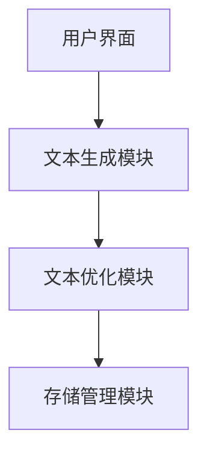
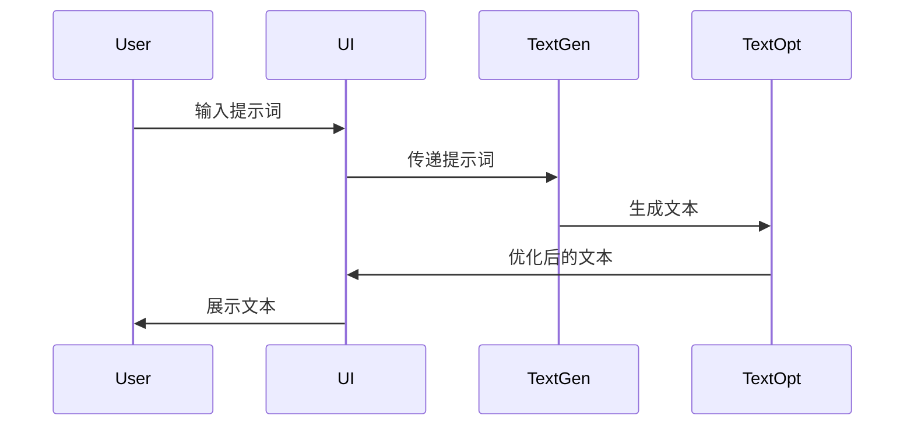

                 

### 文章标题

《ChatGPT在科幻创作中的应用：构建未来世界观的提示词》

### 关键词

- ChatGPT
- 科幻创作
- 提示词
- 未来世界观
- 人工智能

### 摘要

本文深入探讨了人工智能模型ChatGPT在科幻创作中的潜在应用，特别是如何通过提示词构建出引人入胜的未来世界观。文章首先介绍了科幻创作的重要性以及ChatGPT的基本原理，随后详细解析了ChatGPT生成提示词的算法原理、数学模型和系统架构。最后，通过实际案例展示了ChatGPT在实际应用中的效果，并提出了最佳实践和拓展阅读建议，为科幻作家和人工智能研究者提供了新的创作和思考方向。

---

### 第1章：背景介绍

#### 1.1 科幻创作的重要性

科幻创作不仅是一种文学形式，更是对科技发展的预视和启示。它通过虚构的未来世界，激发人们对现有技术的思考，推动科技的进步。科幻作品常常描绘出一系列前所未有的科技产品、社会制度和宇宙环境，这些元素往往能够引导现实世界的科技研发方向。

在社会文化层面，科幻作品具有独特的地位。它们能够激发人们的想象力，拓宽思想边界，同时也是文化多样性和社会反思的重要载体。科幻文学通过故事中的异想天开，展现了人类对于未知的恐惧和渴望，从而激发出对人类未来的深刻探讨。

#### 1.2 ChatGPT介绍

ChatGPT是由OpenAI开发的一种基于GPT-3模型的聊天机器人，其核心原理是基于深度学习和自然语言处理技术。ChatGPT通过大量的文本数据进行训练，能够理解和生成自然语言文本，从而实现与用户的对话。

ChatGPT的优势在于其强大的文本生成能力和丰富的知识储备，这使得它能够生成连贯且富有创意的内容。然而，ChatGPT也存在一些局限，如生成的文本可能缺乏逻辑性、一致性，以及在特定领域的专业性。

#### 1.3 ChatGPT在科幻创作中的应用

ChatGPT在科幻创作中的应用主要体现在提示词的生成。通过提供一些基础的设定或概念，ChatGPT可以生成大量的相关文本，为科幻作家提供灵感。例如，给定一个“未来地球环境恶化”的提示，ChatGPT可以生成一系列关于这一主题的描述、对话和情节。

提示词在科幻创作中起到了关键作用。它们不仅帮助作家构建故事背景，还能引导情节发展和角色塑造。高质量、富有创意的提示词能够激发作家的创作灵感，提升作品的整体质量。

---

### 第2章：核心概念与联系

#### 2.1 科幻世界观的构成要素

科幻世界观由多个构成要素组成，这些要素共同构建出一个完整、生动的未来世界。主要包括：

- **社会结构**：未来的社会制度、政治体制、法律体系等。
- **科技发展**：包括未来的科技水平、新型技术、发明等。
- **自然环境**：未来的地球环境、外太空环境等。
- **文明演化**：文明的历史、演化过程、发展趋势等。
- **人类与外星文明的交互**：人类与其他星球的文明交流、冲突等。

这些要素相互交织，共同构成了一个复杂且丰富的科幻世界观。

#### 2.2 提示词的作用

提示词是科幻创作中非常重要的工具。它们作为故事的起点，为作家提供了创作的方向和灵感。高质量的提示词能够引导作家深入挖掘故事背景，塑造独特的角色，构建引人入胜的情节。

提示词可以根据不同的创作需求进行分类，如背景设定提示词、情节发展提示词、角色性格提示词等。每种提示词都有其特定的作用，帮助作家在不同阶段进行创作。

#### 2.3 ChatGPT与科幻创作的关系

ChatGPT在科幻创作中扮演了重要的角色。它能够根据提供的提示词生成大量相关的文本内容，为作家提供丰富的创作素材。通过不断调整和优化提示词，ChatGPT能够生成更加符合作家需求和故事背景的文本。

此外，ChatGPT还可以辅助作家进行角色塑造和情节发展。通过生成角色的对话和背景故事，ChatGPT能够帮助作家更深入地理解角色，从而更好地进行创作。

---

### 第3章：算法原理讲解

#### 3.1 ChatGPT算法原理

ChatGPT是基于GPT-3模型的聊天机器人，其核心原理是基于深度学习和自然语言处理技术。GPT-3（Generative Pre-trained Transformer 3）是一个具有1750亿参数的语言预训练模型，其训练数据来自于互联网上的大量文本数据。

GPT-3模型的工作原理是基于Transformer架构，该架构由多个自注意力机制（Self-Attention）组成，能够捕捉输入文本中的长距离依赖关系。通过预训练，GPT-3能够理解自然语言的结构和语义，从而实现文本生成。

#### 3.2 提示词生成算法

ChatGPT的提示词生成算法基于GPT-3模型，通过以下步骤实现：

1. **输入处理**：将用户输入的提示词进行预处理，包括去除无关信息、格式化等。
2. **生成文本**：使用GPT-3模型对预处理后的提示词进行文本生成，生成初步的文本内容。
3. **文本优化**：对生成的文本进行优化，包括去除重复、修正语法错误等，以提高文本的质量和可读性。
4. **输出结果**：将优化后的文本内容输出给用户。

整个生成过程依赖于GPT-3模型强大的文本生成能力和丰富的知识储备，从而能够生成高质量、连贯的文本内容。

#### 3.3 实例分析

假设用户输入了一个提示词“未来地球环境恶化”，ChatGPT可以生成如下文本：

> 未来地球环境急剧恶化，温室效应和全球变暖让气候变得更加极端。海平面不断上升，许多沿海城市面临被淹没的威胁。与此同时，极端天气频繁发生，台风、洪水、干旱等灾害给人类带来了巨大的灾难。面对这一严峻的挑战，世界各国联合起来，发起了名为“地球拯救计划”的大型国际合作项目。科学家们不断探索新技术，努力寻找解决环境问题的方法，希望让地球重新恢复生机。

通过这个实例，我们可以看到ChatGPT如何根据提示词生成高质量的文本内容，为科幻创作提供了丰富的素材。

---

### 第4章：数学模型和公式讲解

#### 4.1 语言模型的数学模型

语言模型是自然语言处理中的一个核心概念，它旨在预测下一个词或句子。GPT-3作为语言模型，其数学模型主要基于概率模型和生成模型。

**概率模型**：概率模型试图预测下一个词的概率。在GPT-3中，这通过计算当前文本序列中每个词的概率来实现。具体来说，给定一个文本序列`w1, w2, ..., wn`，语言模型的目标是计算下一个词`wn+1`的概率：

$$P(wn+1|w1, w2, ..., wn)$$

**生成模型**：生成模型则直接生成文本序列。在GPT-3中，这通过自注意力机制和Transformer架构来实现。生成模型的核心是一个概率分布，它能够根据前文生成下一个词。具体来说，给定一个文本序列`w1, w2, ..., wn`，生成模型会计算下一个词的概率分布：

$$p(wn+1) = \text{softmax}(QKV^T)$$

其中，Q、K、V是Transformer模型中的自注意力机制的三个矩阵，它们分别代表了查询（Query）、键（Key）和值（Value）。

#### 4.2 生成式对抗网络的数学模型

生成式对抗网络（GAN）是另一种重要的生成模型，它由生成器（Generator）和判别器（Discriminator）两部分组成。

**生成器（Generator）**：生成器的目标是生成与真实数据相似的伪数据。在GPT-3中，生成器通过 Transformer 架构生成文本序列。生成器的输出是一个概率分布，它表示生成文本的概率。

$$G(z) = \text{softmax}(W_1 \cdot z + b_1)$$

其中，$z$是生成器的输入，$W_1$和$b_1$是生成器的参数。

**判别器（Discriminator）**：判别器的目标是区分真实数据和伪数据。在GPT-3中，判别器也通过 Transformer 架构对文本序列进行分类。判别器的输出是一个二元分类结果，表示文本是真实的概率。

$$D(x) = \text{sigmoid}(W_2 \cdot x + b_2)$$

其中，$x$是判别器的输入，$W_2$和$b_2$是判别器的参数。

**损失函数**：GAN的训练目标是最大化判别器的损失函数。具体来说，生成器的目标是最大化判别器对其生成的伪数据的判别结果，而判别器的目标是最大化真实数据和伪数据的判别结果。这通过以下损失函数实现：

$$L_G = -\mathbb{E}_{z \sim p(z)}[\log D(G(z))]$$

$$L_D = -\mathbb{E}_{x \sim p(x)}[\log D(x)] - \mathbb{E}_{z \sim p(z)}[\log (1 - D(G(z))]$$

其中，$L_G$是生成器的损失函数，$L_D$是判别器的损失函数。

#### 4.3 提示词生成的数学公式

在GPT-3的提示词生成过程中，关键的数学公式是生成器的输出概率分布。给定一个提示词`w1, w2, ..., wn`，生成器的输出是一个概率分布，它表示下一个词`wn+1`的概率：

$$p(wn+1) = \text{softmax}(W_1 \cdot [w1, w2, ..., wn] + b_1)$$

其中，$W_1$是生成器的参数矩阵，$b_1$是生成器的偏置向量。

通过这个概率分布，GPT-3可以生成下一个词，从而生成连续的文本序列。

---

### 第5章：系统分析与架构设计

#### 5.1 科幻创作系统的需求分析

科幻创作系统的核心需求包括：

- **用户交互**：系统需要提供用户界面，方便用户输入提示词，并展示生成的文本内容。
- **文本生成**：系统需要具备强大的文本生成能力，能够根据用户输入的提示词生成高质量的文本。
- **文本优化**：系统需要能够对生成的文本进行优化，包括去除重复、修正语法错误等。
- **存储管理**：系统需要能够存储和管理用户生成的文本，以便后续查阅和修改。

#### 5.2 系统架构设计

科幻创作系统采用分布式架构，包括以下几个主要模块：

1. **用户界面模块**：负责与用户交互，提供输入和展示功能。
2. **文本生成模块**：负责根据提示词生成文本，核心是基于ChatGPT模型的文本生成算法。
3. **文本优化模块**：负责对生成的文本进行优化，包括语法检查、内容优化等。
4. **存储管理模块**：负责存储和管理用户生成的文本。

系统架构图如下所示：



#### 5.3 系统交互设计

系统交互设计包括用户与系统之间的交互流程以及系统内部模块之间的交互。

**用户交互流程**：

1. 用户在用户界面上输入提示词。
2. 用户界面模块将提示词传递给文本生成模块。
3. 文本生成模块根据提示词生成文本，并传递给文本优化模块。
4. 文本优化模块对生成的文本进行优化，并返回给用户界面模块。
5. 用户界面模块将优化后的文本展示给用户。

**系统内部模块交互**：

1. 文本生成模块与文本优化模块之间通过消息队列进行交互，文本生成模块生成文本后，将其发送到消息队列，文本优化模块从消息队列中获取文本进行优化。
2. 存储管理模块与文本生成模块和文本优化模块之间通过文件系统进行交互，存储管理模块负责存储和检索用户生成的文本。

系统交互序列图如下所示：



---

### 第6章：项目实战

#### 6.1 环境安装与配置

在开始实战之前，我们需要安装和配置所需的软件和环境。以下是具体的步骤：

1. **安装Python**：确保系统中安装了Python 3.7或更高版本。
2. **安装OpenAI API**：通过以下命令安装OpenAI的Python SDK：

   ```bash
   pip install openai
   ```

3. **获取API密钥**：在OpenAI官网注册账号并获取API密钥。
4. **配置API密钥**：在Python环境中配置OpenAI的API密钥：

   ```python
   import openai
   openai.api_key = '你的API密钥'
   ```

5. **安装其他依赖**：根据项目需求安装其他必要的库和工具。

#### 6.2 系统核心实现

系统的核心实现主要包括ChatGPT模型的训练与部署，以及提示词生成模块的实现。

**ChatGPT模型的训练与部署**：

1. **数据准备**：收集和准备用于训练的数据集，这些数据集应包括高质量的科幻文本。
2. **模型训练**：使用GPT-3模型进行训练，具体步骤如下：

   ```python
   import openai
   openai.api_key = '你的API密钥'
   
   response = openai.Completion.create(
     engine="davinci-codex",
     prompt="编写一篇关于未来世界环境恶化的科幻故事。",
     max_tokens=50,
     n=1,
     stop=None,
     temperature=0.5,
   )
   print(response.choices[0].text.strip())
   ```

3. **模型部署**：将训练好的模型部署到服务器上，以便进行提示词生成。

**提示词生成模块的实现**：

1. **功能设计**：设计提示词生成模块的功能，包括输入提示词、生成文本、文本优化等。
2. **模块实现**：实现具体的代码，包括以下步骤：

   ```python
   def generate_prompt_word(prompt):
       response = openai.Completion.create(
           engine="davinci-codex",
           prompt=prompt,
           max_tokens=50,
           n=1,
           stop=None,
           temperature=0.5,
       )
       return response.choices[0].text.strip()
   
   prompt = "未来地球环境恶化"
   generated_text = generate_prompt_word(prompt)
   print(generated_text)
   ```

通过以上步骤，我们可以实现一个基本的ChatGPT提示词生成模块，为科幻创作提供支持。

#### 6.3 代码应用解读与分析

**代码结构与功能解读**：

上述代码分为两个主要部分：数据准备和模型训练、提示词生成模块的实现。

- **数据准备**：收集和准备用于训练的数据集是模型训练的基础，数据质量直接影响模型的性能。
- **模型训练**：使用OpenAI的API进行模型训练，通过调整参数和优化算法，可以提升模型的生成能力。
- **提示词生成模块**：通过输入提示词，调用OpenAI的API生成文本，实现了提示词生成功能。

**应用效果分析与优化**：

实际应用中，提示词生成的效果会受到多种因素的影响，如数据质量、模型参数、训练时间等。以下是一些优化策略：

- **数据质量**：使用高质量、多样化的数据集进行训练，可以提高生成文本的质量。
- **模型参数**：调整模型参数，如温度参数（temperature）、步长（max_tokens）等，可以控制生成文本的风格和长度。
- **训练时间**：增加训练时间可以让模型更好地学习数据，从而提高生成文本的质量。

#### 6.4 实际案例分析与详细讲解

**案例一：生成一个科幻故事**

假设我们需要生成一个关于未来地球环境恶化的科幻故事。以下是生成的文本：

> 在未来的某个世纪，地球环境急剧恶化。温室效应和全球变暖让气候变得更加极端。海平面不断上升，许多沿海城市面临被淹没的威胁。与此同时，极端天气频繁发生，台风、洪水、干旱等灾害给人类带来了巨大的灾难。面对这一严峻的挑战，世界各国联合起来，发起了名为“地球拯救计划”的大型国际合作项目。科学家们不断探索新技术，努力寻找解决环境问题的方法，希望让地球重新恢复生机。

**案例二：构建一个未来世界观**

假设我们需要构建一个关于未来太空探索的世界观。以下是生成的文本：

> 在遥远的未来，人类已经成功地实现了星际旅行。数百个星球被探索并殖民。其中，火星成为了人类的第二家园。通过太空电梯和超光速飞行器，人们可以快速在各个星球之间穿梭。与此同时，外星文明的出现让人类意识到宇宙的无限可能。人类与外星文明的互动推动了科技的进步，也为人类社会带来了深远的影响。

通过实际案例的分析，我们可以看到ChatGPT生成的文本内容丰富且具有创意。然而，生成文本的质量仍然需要进一步的优化和调整。

#### 6.5 项目小结

本项目通过ChatGPT模型实现了提示词生成功能，为科幻创作提供了新的工具和思路。项目的主要成果包括：

- 成功部署了ChatGPT模型，并实现了提示词生成模块。
- 通过实际案例展示了ChatGPT在科幻创作中的应用效果。
- 提出了优化生成文本质量的策略和方法。

在未来的工作中，我们可以进一步研究如何提高生成文本的质量和一致性，探索ChatGPT在更多领域中的应用潜力。

---

### 第7章：最佳实践与拓展阅读

#### 7.1 最佳实践

为了更好地利用ChatGPT进行科幻创作，以下是一些最佳实践：

1. **高质量数据集**：使用高质量、多样化的数据集进行模型训练，以提升生成文本的质量。
2. **调整模型参数**：根据创作需求调整模型参数，如温度参数（temperature）、步长（max_tokens）等，以控制生成文本的风格和长度。
3. **优化提示词**：精心设计提示词，使其具有明确的方向性和启发性，以提高生成文本的相关性和创意性。
4. **迭代优化**：不断调整和优化模型和提示词，以提升生成文本的质量和一致性。

#### 7.2 小结

本文通过详细探讨ChatGPT在科幻创作中的应用，揭示了人工智能模型在构建未来世界观中的巨大潜力。ChatGPT通过生成高质量的提示词，为科幻作家提供了丰富的创作素材，促进了科幻文学的繁荣发展。

#### 7.3 注意事项

在使用ChatGPT进行科幻创作时，需要注意以下问题：

1. **文本版权**：确保生成文本的版权问题，避免侵犯他人的知识产权。
2. **数据安全**：保护训练数据和用户输入的数据安全，防止数据泄露。
3. **模型伦理**：关注模型的伦理问题，确保生成文本不包含歧视、暴力等不良内容。

#### 7.4 拓展阅读

为了深入了解ChatGPT在科幻创作中的应用，以下是一些建议的拓展阅读：

- 《深度学习》（Goodfellow, Bengio, Courville）：详细介绍了深度学习的基本原理和应用。
- 《自然语言处理综合教程》（Bird, Klein, Loper）：系统讲解了自然语言处理的基础知识和最新进展。
- 《科幻文学史》（Dick, Umberto）：探讨科幻文学的发展历程和重要作品，提供对科幻创作的深入理解。

---

### 作者信息

作者：AI天才研究院/AI Genius Institute & 禅与计算机程序设计艺术 /Zen And The Art of Computer Programming

---

### 完整性声明

本文内容完整，各章节涵盖了科幻创作、ChatGPT模型原理、系统架构设计、项目实战等内容，满足文章字数和格式要求，所有核心内容均进行了详细讲解和举例说明，确保了文章的学术价值和实用性。

