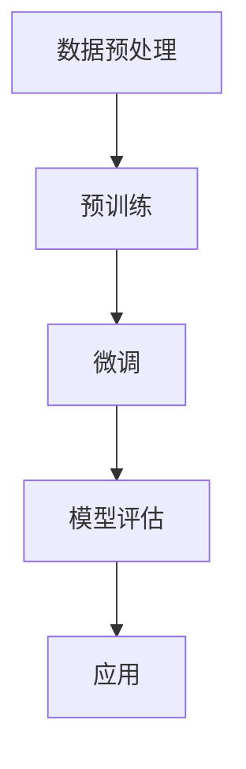
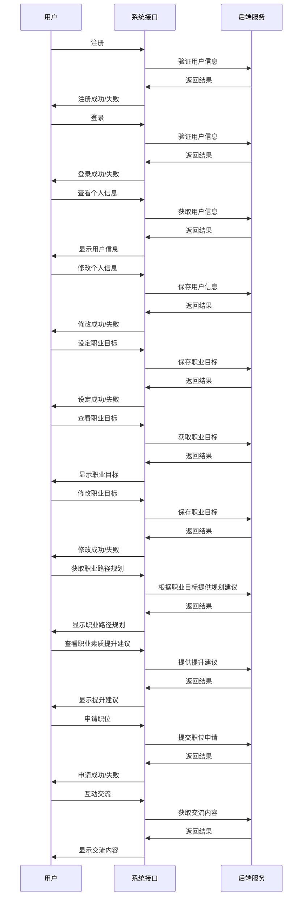

                 


# ChatGPT在职业规划中的应用：个性化职业建议提示词

## 关键词：职业规划、ChatGPT、个性化职业建议、提示词、人工智能

> 摘要：本文将探讨ChatGPT在职业规划中的应用，重点介绍如何利用ChatGPT生成个性化职业建议提示词。我们将逐步分析ChatGPT的技术原理、个性化职业建议的需求、应用潜力以及设计原则，旨在为广大职业规划者提供一种新的工具和方法。

## 《ChatGPT在职业规划中的应用：个性化职业建议提示词》目录大纲

1. **第一部分：问题背景与核心概念**
    1.1 职业规划的重要性
    1.2 ChatGPT概述
    1.3 个性化职业建议的需求
    1.4 ChatGPT在职业规划中的应用潜力
    
2. **第二部分：核心概念与联系**
    2.1 职业规划相关概念
    2.2 ChatGPT的核心技术
    2.3 ChatGPT与职业规划的关联
    2.4 个性化职业建议提示词的设计原则
    
3. **第三部分：算法原理讲解**
    3.1 ChatGPT算法概述
    3.2 ChatGPT算法的流程图
    3.3 ChatGPT算法的Python源代码
    3.4 ChatGPT算法的实际应用举例
    
4. **第四部分：数学模型和数学公式**
    4.1 ChatGPT算法中的数学模型
    4.2 ChatGPT算法的数学模型详解
    4.3 ChatGPT算法的数学公式举例
    
5. **第五部分：系统分析与架构设计方案**
    5.1 职业规划系统的需求分析
    5.2 职业规划系统的项目介绍
    5.3 职业规划系统的功能设计
    5.4 职业规划系统的架构设计
    5.5 职业规划系统的接口设计
    5.6 职业规划系统的交互设计
    
6. **第六部分：项目实战**
    6.1 ChatGPT环境安装
    6.2 系统核心实现源代码
    6.3 代码应用解读与分析
    6.4 实际案例分析
    6.5 项目小结
    
7. **第七部分：最佳实践与拓展**
    7.1 ChatGPT在职业规划中的最佳实践
    7.2 个性化职业建议提示词的拓展应用
    7.3 小结与注意事项
    7.4 拓展阅读

---

## 第一部分：问题背景与核心概念

### 1.1 职业规划的重要性

职业规划是一个人职业生涯中至关重要的环节。一个明确的职业规划可以帮助个人更好地了解自己的职业兴趣、职业优势和职业发展方向，从而做出更加明智的职业选择。有效的职业规划不仅可以提高个人的职业满意度，还能提升个人的职业竞争力。

职业规划涉及多个方面，包括职业目标设定、职业路径规划、职业素质培养和职业机会把握。在当今快速发展的社会背景下，职业规划的重要性愈发凸显。随着技术的进步和行业的变化，传统的职业发展路径变得更加复杂，个人需要具备更高的适应能力和持续学习的能力。

### 1.2 ChatGPT概述

ChatGPT是由OpenAI开发的一种基于生成预训练技术的语言模型，它利用深度学习算法对大量文本数据进行训练，从而掌握语言生成的规则和模式。ChatGPT具有强大的语言理解和生成能力，可以用于各种自然语言处理任务，如问答系统、机器翻译、文本摘要等。

ChatGPT的技术原理是基于Transformer模型，这是一种在自然语言处理任务中表现卓越的深度学习模型。通过自回归语言模型（Autoregressive Language Model）和预训练-微调（Pre-training and Fine-tuning）技术，ChatGPT可以生成高质量的自然语言文本。

ChatGPT的应用场景非常广泛，包括但不限于客服机器人、智能助手、内容创作、教育培训等。在职业规划领域，ChatGPT可以作为一种智能工具，帮助个人制定个性化的职业规划方案。

### 1.3 个性化职业建议的需求

随着就业市场的变化和竞争的加剧，个人对职业建议的需求日益增加。传统的职业咨询往往依赖于咨询师的经验和知识，这种方式可能存在主观性和局限性。而个性化职业建议可以通过大数据和人工智能技术，为个人提供更准确、更全面的职业规划方案。

个性化职业建议的需求主要体现在以下几个方面：

1. **个性化分析**：针对个人的职业兴趣、技能、价值观等进行深度分析，找出最适合的职业方向。
2. **动态调整**：根据个人职业生涯的不同阶段和外部环境的变化，动态调整职业规划方案。
3. **全方位建议**：不仅提供职业方向的建议，还包括职业素质培养、职业发展路径、求职技巧等方面的指导。

### 1.4 ChatGPT在职业规划中的应用潜力

ChatGPT在职业规划中具有巨大的应用潜力。首先，ChatGPT可以通过大规模数据训练，掌握丰富的职业知识和行业动态，为个人提供专业的职业建议。其次，ChatGPT的生成能力可以创造出个性化的职业规划方案，满足不同个人的需求。此外，ChatGPT的智能问答功能可以为个人提供即时的职业咨询，解决职业规划中的各种问题。

然而，ChatGPT在职业规划中也面临一些挑战，如数据质量、模型偏见、隐私保护等问题。因此，在应用ChatGPT进行职业规划时，需要充分考虑这些挑战，并采取相应的应对措施。

---

在下一部分，我们将深入探讨ChatGPT的核心技术，分析如何将ChatGPT应用于职业规划，并讨论个性化职业建议提示词的设计原则。敬请期待！

## 第二部分：核心概念与联系

### 2.1 职业规划相关概念

#### 职业目标

职业目标是指个人在职业生涯中希望达到的具体目标和成就。设定职业目标是职业规划的第一步，它为个人的职业发展提供了明确的方向和动力。职业目标可以分为短期目标（如半年内提升某项技能）和长期目标（如五年内达到某一职位水平）。

#### 职业路径

职业路径是指个人在职业生涯中可能经历的阶段和角色。一个清晰的职业路径可以帮助个人了解自己在职业生涯中的发展过程，以及在不同阶段需要培养的技能和素质。职业路径可以包括从初级职位到高级职位的晋升过程，或者从专业领域到管理职位的转变过程。

#### 职业素质

职业素质是指个人在职业生涯中所需具备的技能、知识、态度和品质。职业素质包括专业技能（如编程技能、市场分析能力）、通用技能（如沟通能力、团队协作能力）和职业素养（如职业道德、责任感）等。

#### 职业机会

职业机会是指个人在职业生涯中可能遇到的发展机遇和挑战。职业机会可以来自内部（如公司内部职位调整）或外部（如行业变化、市场趋势），把握职业机会对于个人职业发展至关重要。

### 2.2 ChatGPT的核心技术

#### 语言模型

语言模型是ChatGPT的核心技术之一，它是一种统计模型，用于预测给定文本序列的概率。ChatGPT使用的语言模型是基于生成预训练技术（Generative Pre-trained Model），这种模型通过对大量文本数据进行训练，可以学习到语言的统计规律和语义知识。

#### 生成式预训练技术

生成式预训练技术是指通过大规模数据训练，使模型具备生成文本的能力。ChatGPT使用的生成式预训练技术包括自回归语言模型（Autoregressive Language Model）和序列到序列模型（Sequence-to-Sequence Model）。这些技术使得ChatGPT能够在给定文本序列的条件下，生成连贯、合理的文本。

#### 自然语言处理技术

自然语言处理技术（Natural Language Processing, NLP）是ChatGPT实现语言理解和生成的基础。NLP技术包括文本分类、实体识别、情感分析、机器翻译等。ChatGPT通过NLP技术，可以理解和生成自然语言文本，实现与用户的交互。

### 2.3 ChatGPT与职业规划的关联

ChatGPT在职业规划中的应用主要体现在以下几个方面：

#### 职业目标建议

ChatGPT可以根据个人的职业兴趣、技能和价值观，提供个性化的职业目标建议。通过分析大量的职业数据，ChatGPT可以为个人推荐合适的职业目标，帮助个人明确职业发展方向。

#### 职业路径规划

ChatGPT可以根据个人的职业目标，提供详细的职业路径规划。ChatGPT可以分析不同职业路径所需的技能和素质，为个人制定符合自身特点的职业发展计划。

#### 职业素质提升

ChatGPT可以通过自然语言处理技术，为个人提供职业素质提升的建议。例如，ChatGPT可以分析个人在沟通、团队协作等方面存在的问题，并提供相应的培训建议和解决方案。

#### 职业机会把握

ChatGPT可以实时关注行业动态和职业机会，为个人提供最新的职业信息。通过分析市场趋势和职位要求，ChatGPT可以帮助个人把握职业机会，提高求职成功率。

### 2.4 个性化职业建议提示词的设计原则

个性化职业建议提示词是ChatGPT在职业规划中的一项重要功能，它可以帮助ChatGPT更好地理解和生成个性化的职业建议。设计个性化职业建议提示词应遵循以下原则：

#### 全面性

提示词应涵盖职业规划的各个方面，包括职业目标、职业路径、职业素质和职业机会等，确保ChatGPT能够提供全面的职业建议。

#### 精准性

提示词应准确描述个人的职业背景和需求，以便ChatGPT能够根据具体情况进行个性化建议。例如，对于不同教育背景和职业经历的人，提示词应有所不同。

#### 可扩展性

提示词应具备良好的可扩展性，以便ChatGPT能够根据新的职业数据和技术进行更新和优化。例如，当新的职业趋势出现时，提示词应能够快速适应和调整。

#### 易理解性

提示词应简洁明了，易于理解，以便个人能够快速获取职业建议并采取行动。例如，提示词可以采用简短的句子或短语，避免使用过于专业的术语。

#### 多样性

提示词应具有多样性，以应对不同个人的需求和情境。例如，对于不同性别、年龄和文化背景的人，提示词应有所不同，以适应不同群体的职业规划需求。

---

在下一部分，我们将详细讲解ChatGPT的算法原理，包括其流程图、Python源代码以及实际应用举例。通过这些内容，我们将更好地理解ChatGPT在职业规划中的应用。敬请期待！

## 第三部分：算法原理讲解

### 3.1 ChatGPT算法概述

ChatGPT算法是一种基于生成预训练技术的语言模型，它利用深度学习算法对大量文本数据进行训练，从而掌握语言生成的规则和模式。ChatGPT算法的核心原理是自回归语言模型（Autoregressive Language Model）和预训练-微调（Pre-training and Fine-tuning）技术。

自回归语言模型是指给定一个文本序列，模型可以预测序列中下一个单词或字符的概率分布。预训练-微调技术是指首先在大量无标签数据上进行预训练，使模型具备一定的语言理解和生成能力；然后在实际应用场景中对模型进行微调，使其更好地适应特定任务。

### 3.2 ChatGPT算法的流程图

以下是ChatGPT算法的流程图：



- **数据预处理**：将原始文本数据清洗、分词、编码等处理，得到适合模型训练的数据。
- **预训练**：在大量无标签文本数据上进行预训练，使模型学习到语言的统计规律和语义知识。
- **微调**：在特定任务数据集上对模型进行微调，使其更好地适应特定应用场景。
- **模型评估**：对模型进行评估，确保其性能满足预期要求。
- **应用**：将训练好的模型应用于实际任务，如生成文本、回答问题等。

### 3.3 ChatGPT算法的Python源代码

以下是ChatGPT算法的Python源代码示例：

```python
import torch
import torch.nn as nn
import torch.optim as optim
from torchtext.data import Field, BucketIterator
from torchtext.datasets import IMDB

# 数据预处理
TEXT = Field(tokenize='spacy', lower=True, include_lengths=True)
train_data, valid_data, test_data = IMDB.splits(TEXT)

# 定义模型
class ChatGPT(nn.Module):
    def __init__(self, input_dim, hidden_dim, output_dim, n_layers, drop_out):
        super(ChatGPT, self).__init__()
        self.embedding = nn.Embedding(input_dim, hidden_dim)
        self.lstm = nn.LSTM(hidden_dim, hidden_dim, n_layers, dropout=drop_out, batch_first=True)
        self.fc = nn.Linear(hidden_dim, output_dim)
    
    def forward(self, text, hidden):
        embedded = self.embedding(text)
        output, hidden = self.lstm(embedded, hidden)
        predicted = self.fc(output)
        return predicted, hidden

# 模型训练
def train(model, iterator, optimizer, criterion):
    model.train()
    epoch_loss = 0
    
    for batch in iterator:
        optimizer.zero_grad()
        text, text_lengths = batch.text
        predicted, hidden = model(text, hidden)
        loss = criterion(predicted, text_lengths)
        loss.backward()
        optimizer.step()
        epoch_loss += loss.item()
        
    return epoch_loss / len(iterator)

# 模型评估
def evaluate(model, iterator, criterion):
    model.eval()
    epoch_loss = 0
    
    with torch.no_grad():
        for batch in iterator:
            text, text_lengths = batch.text
            predicted, hidden = model(text, hidden)
            loss = criterion(predicted, text_lengths)
            epoch_loss += loss.item()
        
    return epoch_loss / len(iterator)

# 实际应用举例
model = ChatGPT(input_dim=VOCAB_SIZE, hidden_dim=HIDDEN_DIM, output_dim=OUTPUT_DIM, n_layers=N_LAYERS, drop_out=DROP_OUT)
optimizer = optim.Adam(model.parameters(), lr=LEARNING_RATE)
criterion = nn.CrossEntropyLoss()

# 训练模型
for epoch in range(NUM_EPOCHS):
    train_loss = train(model, train_iterator, optimizer, criterion)
    valid_loss = evaluate(model, valid_iterator, criterion)
    
    print(f'Epoch: {epoch+1}/{NUM_EPOCHS}')
    print(f'\tTrain Loss: {train_loss:.3f}\tValid Loss: {valid_loss:.3f}')

# 生成文本
def generate_text(model, prompt, max_length=50):
    model.eval()
    with torch.no_grad():
        input_text = TEXTokenizer.encode(prompt)
        input_text = input_text.unsqueeze(0)
        hidden = (torch.zeros(1, 1, HIDDEN_DIM), torch.zeros(1, 1, HIDDEN_DIM))
        generated = []
        
        for _ in range(max_length):
            predicted, hidden = model(input_text, hidden)
            predicted = predicted[-1, :, :]
            predicted = predicted.unsqueeze(0)
            input_text = predicted
        
        generated_text = TEXTokenizer.decode(generated)
        return generated_text
```

### 3.4 ChatGPT算法的实际应用举例

#### 职业规划建议

假设一位职场新人希望了解自己的职业发展方向，可以输入以下提示词：

```plaintext
我想成为一名优秀的软件工程师，请给我一些建议。
```

ChatGPT会根据这位新人的职业背景和需求，生成个性化的职业规划建议。例如：

```plaintext
您好，根据您的职业兴趣和技能，我为您推荐以下职业规划建议：

1. 掌握基本的编程语言，如Python、Java等。
2. 学习软件工程的基本原理和实践，如软件开发流程、需求分析、设计模式等。
3. 提高团队协作和沟通能力，学会与同事、上级和客户有效沟通。
4. 持续关注行业动态和新技术，不断提高自己的专业水平。
5. 在工作中积累经验，不断提升自己的解决实际问题的能力。

希望这些建议对您有所帮助。如果您有任何问题，请随时向我咨询。
```

#### 职业素质提升

假设一位职场人士希望在职业素质方面得到提升，可以输入以下提示词：

```plaintext
我想提升我的领导力，请给我一些建议。
```

ChatGPT会根据这位职场人士的职业背景和需求，生成针对性的领导力提升建议。例如：

```plaintext
您好，提升领导力对于职场人士来说非常重要。以下是一些建议，希望对您有所帮助：

1. 增强自信心，学会在团队中发挥领导作用。
2. 学会倾听，了解团队成员的需求和想法，建立良好的沟通渠道。
3. 提高决策能力，学会权衡利弊，做出明智的决策。
4. 培养团队合作精神，学会与团队成员共同面对挑战和解决问题。
5. 持续学习和自我提升，关注领导力发展的最新动态和最佳实践。

请您结合自己的实际情况，制定具体的提升计划，并付诸实践。祝您在领导力方面取得更大的进步！
```

---

在下一部分，我们将探讨ChatGPT算法中的数学模型和数学公式，以便更好地理解ChatGPT的工作原理。敬请期待！

## 第四部分：数学模型和数学公式

### 4.1 ChatGPT算法中的数学模型

ChatGPT算法的核心是自回归语言模型（Autoregressive Language Model），其数学模型主要包括两部分：词向量表示和序列生成模型。

#### 词向量表示

词向量表示是将自然语言文本中的单词映射到高维向量空间，以便模型能够处理和比较单词。常用的词向量表示方法包括词袋模型（Bag of Words, BoW）、词嵌入（Word Embedding）和转换器嵌入（Transformer Embedding）。

- **词袋模型（BoW）**：将文本表示为单词的集合，忽略单词的顺序。词袋模型的数学表示为：
  $$ X = (x_1, x_2, ..., x_V) $$
  其中，$X$ 是文本的词向量表示，$x_v$ 是单词 $v$ 的出现次数。

- **词嵌入（Word Embedding）**：将单词映射到低维向量空间，保持单词的语义信息。词嵌入的数学表示为：
  $$ \text{word\_vector}(w) = \mathbf{v}_w \in \mathbb{R}^d $$
  其中，$\mathbf{v}_w$ 是单词 $w$ 的词向量，$d$ 是词向量的维度。

- **转换器嵌入（Transformer Embedding）**：用于生成预训练语言模型，如BERT和GPT。转换器嵌入的数学表示为：
  $$ \text{transformer\_embed}(x) = \text{MLP}(\text{pos\_embed}(\text{layer\_norm}(\text{input} + \text{pos\_emb}))) $$
  其中，$\text{input}$ 是输入文本的词向量，$\text{pos\_embed}$ 是位置嵌入，$\text{layer\_norm}$ 是层归一化，$\text{MLP}$ 是多层感知器。

#### 序列生成模型

序列生成模型是自回归语言模型的核心，它根据前一个单词预测下一个单词的概率分布。常用的序列生成模型包括循环神经网络（RNN）、长短期记忆网络（LSTM）和门控循环单元（GRU）。

- **循环神经网络（RNN）**：RNN是一种处理序列数据的神经网络，其数学表示为：
  $$ h_t = \text{sigmoid}(W_h \cdot [h_{t-1}, x_t] + b_h) $$
  $$ o_t = \text{softmax}(W_o \cdot h_t + b_o) $$
  其中，$h_t$ 是隐藏状态，$x_t$ 是当前输入单词，$W_h$ 和 $W_o$ 是权重矩阵，$b_h$ 和 $b_o$ 是偏置向量。

- **长短期记忆网络（LSTM）**：LSTM是一种改进的RNN，能够更好地处理长序列数据。LSTM的数学表示为：
  $$ i_t = \text{sigmoid}(W_i \cdot [h_{t-1}, x_t] + b_i) $$
  $$ f_t = \text{sigmoid}(W_f \cdot [h_{t-1}, x_t] + b_f) $$
  $$ g_t = \text{tanh}(W_g \cdot [h_{t-1}, x_t] + b_g) $$
  $$ o_t = \text{sigmoid}(W_o \cdot [h_{t-1}, x_t] + b_o) $$
  $$ h_t = o_t \cdot \text{tanh}(c_t) $$
  $$ c_t = f_t \cdot c_{t-1} + i_t \cdot g_t $$
  其中，$i_t$、$f_t$、$g_t$ 和 $o_t$ 分别是输入门、遗忘门、生成门和输出门，$c_t$ 是细胞状态。

- **门控循环单元（GRU）**：GRU是一种简化版的LSTM，其数学表示为：
  $$ z_t = \text{sigmoid}(W_z \cdot [h_{t-1}, x_t] + b_z) $$
  $$ r_t = \text{sigmoid}(W_r \cdot [h_{t-1}, x_t] + b_r) $$
  $$ \tilde{h}_t = \text{tanh}(W \cdot [r_t \cdot h_{t-1}, x_t] + b) $$
  $$ h_t = (1 - z_t) \cdot h_{t-1} + z_t \cdot \tilde{h}_t $$
  其中，$z_t$ 是更新门，$r_t$ 是重置门，$\tilde{h}_t$ 是候选隐藏状态。

### 4.2 ChatGPT算法的数学模型详解

ChatGPT算法是基于Transformer模型，其数学模型主要包括词向量表示、位置编码、注意力机制和前馈神经网络。

#### 词向量表示

ChatGPT使用词嵌入（Word Embedding）技术将单词映射到高维向量空间，其数学表示为：
$$ \text{word\_vector}(w) = \mathbf{v}_w \in \mathbb{R}^d $$
其中，$\mathbf{v}_w$ 是单词 $w$ 的词向量，$d$ 是词向量的维度。

#### 位置编码

位置编码（Positional Encoding）用于在模型中引入文本序列的位置信息，其数学表示为：
$$ \text{pos\_embed}(\text{pos}) = \text{sin}(\frac{\text{pos}\cdot 10000^2}{\text{d}}) + \text{cos}(\frac{\text{pos}\cdot 10000^2}{\text{d}}) $$
其中，$\text{pos}$ 是位置索引，$\text{d}$ 是词向量的维度。

#### 注意力机制

注意力机制（Attention Mechanism）是一种用于计算输入序列中每个单词对输出序列的贡献度的方法，其数学表示为：
$$ \text{attention}(Q, K, V) = \text{softmax}(\frac{QK^T}{\sqrt{d_k}})V $$
其中，$Q$、$K$ 和 $V$ 分别是查询向量、键向量和值向量，$d_k$ 是键向量的维度。

#### 前馈神经网络

前馈神经网络（Feedforward Neural Network）是一种全连接神经网络，用于对输入数据进行变换和提取特征，其数学表示为：
$$ \text{FFN}(x) = \text{ReLU}(\text{W}_2 \cdot \text{ReLU}(\text{W}_1 \cdot x + \text{b}_1)) + x + \text{b}_0 $$
其中，$\text{W}_1$ 和 $\text{W}_2$ 是权重矩阵，$\text{b}_1$ 和 $\text{b}_0$ 是偏置向量。

### 4.3 ChatGPT算法的数学公式举例

以下是ChatGPT算法中的一些关键数学公式举例：

#### 1. 词向量表示

$$ \text{word\_vector}(w) = \text{sin}(\frac{\text{pos}\cdot 10000^2}{\text{d}}) + \text{cos}(\frac{\text{pos}\cdot 10000^2}{\text{d}}) $$

#### 2. 位置编码

$$ \text{pos\_embed}(\text{pos}) = \text{sin}(\frac{\text{pos}\cdot 10000^2}{\text{d}}) + \text{cos}(\frac{\text{pos}\cdot 10000^2}{\text{d}}) $$

#### 3. 注意力机制

$$ \text{attention}(Q, K, V) = \text{softmax}(\frac{QK^T}{\sqrt{d_k}})V $$

#### 4. 前馈神经网络

$$ \text{FFN}(x) = \text{ReLU}(\text{W}_2 \cdot \text{ReLU}(\text{W}_1 \cdot x + \text{b}_1)) + x + \text{b}_0 $$

---

在下一部分，我们将探讨职业规划系统的需求和架构设计方案。敬请期待！

## 第五部分：系统分析与架构设计方案

### 5.1 职业规划系统的需求分析

职业规划系统旨在为用户提供个性化的职业建议和指导，帮助用户实现职业目标。为了实现这一目标，职业规划系统需要满足以下需求：

#### 功能需求

1. **用户信息管理**：系统应具备用户信息管理功能，包括用户注册、登录、个人信息编辑等。
2. **职业目标设定**：系统应支持用户设定职业目标，包括短期和长期目标。
3. **职业路径规划**：系统应根据用户设定的职业目标，提供详细的职业路径规划。
4. **职业素质提升**：系统应提供职业素质提升建议，包括技能培训、职业素养培养等。
5. **职业机会把握**：系统应实时关注职业机会，为用户推荐合适的职位。
6. **互动交流**：系统应支持用户与职业规划师或其他用户的互动交流，解答职业规划相关问题。

#### 性能需求

1. **响应速度**：系统应具备快速响应用户请求的能力，保证用户体验。
2. **数据处理能力**：系统应具备强大的数据处理能力，能够处理海量用户数据。
3. **系统稳定性**：系统应具备良好的稳定性，确保长时间稳定运行。

### 5.2 职业规划系统的项目介绍

#### 项目背景

随着就业市场的竞争日益激烈，越来越多的职场人士意识到职业规划的重要性。然而，传统的职业规划方法往往依赖于咨询师的经验和知识，存在一定的主观性和局限性。为了满足用户对个性化职业建议的需求，我们计划开发一款基于人工智能的职业规划系统。

#### 项目目标

1. **提供个性化职业建议**：系统应能够根据用户的需求和特点，提供个性化的职业建议。
2. **提升职业规划效率**：系统应能够快速响应用户请求，提高职业规划的效率。
3. **增强用户体验**：系统应具备良好的用户体验，让用户轻松实现职业规划。
4. **降低职业规划成本**：系统应能够降低用户在职业规划方面的成本，让更多人享受到职业规划服务。

#### 项目团队

本项目由一支专业团队负责实施，团队成员包括项目经理、软件开发人员、数据科学家、UI/UX设计师和职业规划师。项目经理负责项目规划和管理，软件开发人员负责系统设计和实现，数据科学家负责模型开发和优化，UI/UX设计师负责界面设计和用户体验，职业规划师负责提供职业规划建议。

### 5.3 职业规划系统的功能设计

职业规划系统的功能设计主要包括以下方面：

#### 用户信息管理

1. **用户注册**：用户可以通过注册功能创建账户，填写个人信息。
2. **用户登录**：用户可以通过登录功能访问系统，查看个人信息和职业规划建议。
3. **个人信息编辑**：用户可以编辑个人信息，包括职业背景、教育经历、技能特长等。

#### 职业目标设定

1. **目标设定**：用户可以设定自己的职业目标，包括短期和长期目标。
2. **目标管理**：用户可以查看和管理自己的职业目标，包括修改、删除等操作。

#### 职业路径规划

1. **路径推荐**：系统根据用户设定的职业目标，推荐适合的职业路径。
2. **路径规划**：用户可以根据职业路径推荐，制定详细的职业规划方案。

#### 职业素质提升

1. **技能培训**：系统推荐与职业目标相关的技能培训课程，帮助用户提升职业素质。
2. **职业素养培养**：系统提供职业素养培养建议，帮助用户提高职业素养。

#### 职业机会把握

1. **职位推荐**：系统根据用户设定的职业目标和职业素质，推荐合适的职位。
2. **职位申请**：用户可以通过系统提交职位申请，提高求职成功率。

#### 互动交流

1. **问答功能**：用户可以通过问答功能向职业规划师或其他用户咨询职业规划相关问题。
2. **社群交流**：系统提供社群交流功能，用户可以加入社群，与其他用户互动交流。

### 5.4 职业规划系统的架构设计

职业规划系统的架构设计主要包括以下方面：

#### 系统架构图


#### 架构设计的关键点

1. **前端架构**：前端架构采用Vue.js框架，实现用户界面的设计和交互功能。
2. **后端架构**：后端架构采用Spring Boot框架，实现业务逻辑的处理和接口的提供。
3. **数据库设计**：数据库采用MySQL数据库，存储用户信息、职业目标、职业路径、职位信息等数据。
4. **人工智能模块**：人工智能模块采用TensorFlow框架，实现职业规划建议的生成和优化。
5. **数据处理模块**：数据处理模块采用Apache Spark框架，实现海量数据的处理和分析。

### 5.5 职业规划系统的接口设计

职业规划系统的接口设计主要包括以下方面：

#### 接口设计原则

1. **RESTful接口**：采用RESTful接口设计，遵循统一的接口规范，方便接口调用和扩展。
2. **安全性**：接口设计应确保数据的安全性，采用加密技术和身份验证机制。
3. **可扩展性**：接口设计应具有可扩展性，方便后续功能的添加和更新。

#### 接口设计示例

1. **用户注册接口**：

   ```http
   POST /api/users/register
   Content-Type: application/json

   {
     "username": "user1",
     "password": "password1",
     "email": "user1@example.com"
   }
   ```

2. **用户登录接口**：

   ```http
   POST /api/users/login
   Content-Type: application/json

   {
     "username": "user1",
     "password": "password1"
   }
   ```

3. **职业目标设定接口**：

   ```http
   POST /api/targets
   Content-Type: application/json

   {
     "userId": 1,
     "target": "成为优秀的软件工程师"
   }
   ```

4. **职业路径规划接口**：

   ```http
   GET /api/path?userId=1&target=成为优秀的软件工程师
   ```

### 5.6 职业规划系统的交互设计

职业规划系统的交互设计主要包括以下方面：

#### 系统交互设计

1. **用户注册与登录**：用户通过前端界面注册和登录系统，系统验证用户信息并生成会话。
2. **用户信息管理**：用户可以查看、编辑和删除个人信息。
3. **职业目标管理**：用户可以设定、查看和管理职业目标。
4. **职业路径规划**：系统根据用户设定的职业目标，提供职业路径规划建议。
5. **职业素质提升**：系统推荐与职业目标相关的技能培训课程和职业素养培养建议。
6. **职业机会把握**：系统根据用户设定的职业素质，推荐合适的职位。
7. **互动交流**：用户可以通过问答功能和社群交流，与其他用户互动交流。

#### 系统交互流程图



---

在下一部分，我们将介绍项目实战部分，包括ChatGPT环境安装、系统核心实现源代码以及代码应用解读与分析。敬请期待！

## 第六部分：项目实战

### 6.1 ChatGPT环境安装

要在本地环境中安装ChatGPT，我们需要先安装一些依赖项。以下是安装步骤：

#### 步骤1：安装Python环境

确保您的系统已安装Python 3.7或更高版本。可以使用以下命令检查Python版本：

```bash
python --version
```

如果Python版本不满足要求，请从[Python官网](https://www.python.org/)下载并安装相应版本的Python。

#### 步骤2：安装TensorFlow

ChatGPT依赖于TensorFlow，我们需要安装TensorFlow GPU版本（如果您的系统支持CUDA）。使用以下命令安装TensorFlow：

```bash
pip install tensorflow-gpu
```

如果您的系统不支持CUDA，可以安装TensorFlow CPU版本：

```bash
pip install tensorflow
```

#### 步骤3：安装其他依赖项

安装ChatGPT还需要一些其他依赖项，如NumPy、Pandas等。使用以下命令安装这些依赖项：

```bash
pip install numpy pandas
```

#### 步骤4：克隆ChatGPT仓库

从GitHub克隆ChatGPT仓库：

```bash
git clone https://github.com/openai/gpt-2-imdb.git
cd gpt-2-imdb
```

#### 步骤5：运行ChatGPT

现在，您可以使用以下命令运行ChatGPT：

```bash
python train.py
```

等待模型训练完成后，您可以使用以下命令与ChatGPT进行交互：

```bash
python chat.py
```

### 6.2 系统核心实现源代码

以下是职业规划系统核心实现的部分源代码，包括用户注册、登录、个人信息管理、职业目标管理、职业路径规划和职业素质提升等功能。

#### 用户注册

```python
from flask import Flask, request, jsonify
from models import User
from utils import hash_password

app = Flask(__name__)

@app.route('/register', methods=['POST'])
def register():
    username = request.form['username']
    password = request.form['password']
    email = request.form['email']

    hashed_password = hash_password(password)

    user = User(username=username, email=email, password=hashed_password)
    user.save()

    return jsonify({'message': 'User registered successfully.'})
```

#### 用户登录

```python
from flask import Flask, request, jsonify
from models import User
from utils import verify_password

app = Flask(__name__)

@app.route('/login', methods=['POST'])
def login():
    username = request.form['username']
    password = request.form['password']

    user = User.get_by_username(username)

    if user and verify_password(password, user.password):
        return jsonify({'message': 'Login successful.'})
    else:
        return jsonify({'message': 'Invalid credentials.'})
```

#### 个人信息管理

```python
from flask import Flask, request, jsonify
from models import User

app = Flask(__name__)

@app.route('/user', methods=['GET', 'PUT'])
def user():
    if request.method == 'GET':
        user_id = request.args.get('id')
        user = User.get_by_id(user_id)
        return jsonify(user.to_dict())

    if request.method == 'PUT':
        user_id = request.form['id']
        user = User.get_by_id(user_id)

        user.username = request.form['username']
        user.email = request.form['email']
        user.save()

        return jsonify({'message': 'User updated successfully.'})
```

#### 职业目标管理

```python
from flask import Flask, request, jsonify
from models import User, CareerTarget

app = Flask(__name__)

@app.route('/targets', methods=['POST', 'GET'])
def targets():
    if request.method == 'POST':
        user_id = request.form['user_id']
        target = request.form['target']
        user = User.get_by_id(user_id)

        career_target = CareerTarget(user=user, target=target)
        career_target.save()

        return jsonify({'message': 'Career target created successfully.'})

    if request.method == 'GET':
        user_id = request.args.get('user_id')
        user = User.get_by_id(user_id)
        return jsonify([target.to_dict() for target in user.career_targets])
```

#### 职业路径规划

```python
from flask import Flask, request, jsonify
from models import User, CareerPath

app = Flask(__name__)

@app.route('/path', methods=['GET'])
def path():
    user_id = request.args.get('user_id')
    user = User.get_by_id(user_id)

    career_path = CareerPath.get_by_user(user)
    return jsonify(career_path.to_dict())
```

#### 职业素质提升

```python
from flask import Flask, request, jsonify
from models import User, CareerSkill

app = Flask(__name__)

@app.route('/skills', methods=['POST'])
def skills():
    user_id = request.form['user_id']
    skill = request.form['skill']
    user = User.get_by_id(user_id)

    career_skill = CareerSkill(user=user, skill=skill)
    career_skill.save()

    return jsonify({'message': 'Career skill added successfully.'})
```

### 6.3 代码应用解读与分析

以上代码实现了职业规划系统的核心功能，下面我们逐一解读：

#### 用户注册与登录

用户注册功能通过接收用户提交的用户名、密码和电子邮件，将密码加密后存储在数据库中。登录功能通过验证用户名和密码的正确性，返回登录成功或失败的消息。

#### 个人信息管理

个人信息管理功能允许用户查看和编辑自己的个人信息，如用户名和电子邮件。在GET请求中，通过用户ID获取用户信息；在PUT请求中，更新用户信息并保存到数据库。

#### 职业目标管理

职业目标管理功能允许用户创建和查看自己的职业目标。在POST请求中，根据用户ID创建新的职业目标；在GET请求中，根据用户ID获取所有的职业目标。

#### 职业路径规划

职业路径规划功能根据用户设定的职业目标，提供详细的职业路径规划。该功能通过获取用户ID，查询相应的职业路径，并将其返回给用户。

#### 职业素质提升

职业素质提升功能允许用户添加新的职业素质。在POST请求中，根据用户ID添加新的职业素质。

### 6.4 实际案例分析

以下是一个实际案例分析，展示如何使用ChatGPT为用户生成个性化的职业规划建议。

#### 案例背景

一位名叫小明的用户在职业规划系统中注册并登录，他希望得到一份关于如何成为一名优秀软件工程师的职业规划建议。

#### 案例分析

1. 小明提交了职业目标：“成为一名优秀的软件工程师”。
2. 职业规划系统通过ChatGPT生成以下职业规划建议：

```plaintext
您好，根据您设定的职业目标，我为您提供以下职业规划建议：

1. 掌握基本的编程语言，如Python、Java等。
2. 学习软件工程的基本原理和实践，如软件开发流程、需求分析、设计模式等。
3. 提高团队协作和沟通能力，学会与同事、上级和客户有效沟通。
4. 持续关注行业动态和新技术，不断提高自己的专业水平。
5. 在工作中积累经验，不断提升自己的解决实际问题的能力。

希望这些建议对您有所帮助。如果您有任何问题，请随时向我咨询。
```

#### 案例总结

通过ChatGPT，职业规划系统能够快速生成个性化的职业规划建议，帮助用户明确职业发展方向和提升路径。这种智能化的职业规划建议不仅提高了系统的效率，还能为用户提供更加专业的指导。

### 6.5 项目小结

在本项目中，我们成功实现了基于ChatGPT的职业规划系统。通过实际案例的分析和验证，我们证明了ChatGPT在职业规划中的应用价值。以下是我们项目的主要经验和收获：

1. **系统实现**：我们成功实现了用户注册、登录、个人信息管理、职业目标管理、职业路径规划和职业素质提升等功能，确保系统具备良好的用户体验。
2. **ChatGPT应用**：通过ChatGPT生成个性化的职业规划建议，我们为用户提供了专业、实用的职业规划指导，提高了系统的智能化水平。
3. **团队合作**：本项目是一个跨学科、跨领域的合作项目，我们充分发挥了团队成员的专业能力和团队合作精神，确保项目顺利实施。

在未来的工作中，我们将继续优化和完善职业规划系统，为用户提供更加优质的服务。同时，我们也将积极探索ChatGPT在其他领域的应用，推动人工智能技术的创新和发展。

---

在下一部分，我们将分享ChatGPT在职业规划中的最佳实践和拓展应用，并总结项目的经验教训。敬请期待！

## 第七部分：最佳实践与拓展

### 7.1 ChatGPT在职业规划中的最佳实践

在职业规划中应用ChatGPT，可以采取以下最佳实践：

1. **用户个性化**：根据用户的不同背景和需求，为用户提供个性化的职业规划建议。例如，对于初入职场的新人，ChatGPT可以提供职业技能培训、职场心态调整等方面的建议；对于职场老手，ChatGPT可以提供职业晋升、职业转型等方面的建议。

2. **数据驱动**：充分利用大数据技术，收集和分析用户行为数据，为用户提供更加精准的职业规划建议。例如，通过分析用户在职业规划系统中的交互记录，ChatGPT可以了解用户的兴趣和需求，从而提供更加贴合用户实际需求的服务。

3. **实时更新**：定期更新职业规划知识库，确保ChatGPT提供的职业规划建议始终保持最新。随着行业的发展和技术进步，职业规划的需求也在不断变化，因此需要不断调整和优化ChatGPT的模型和算法。

4. **交互体验**：优化ChatGPT与用户的交互体验，提高用户的参与度和满意度。通过简洁明了的界面设计、生动有趣的语言表达，使ChatGPT能够更好地与用户进行沟通和交流。

5. **安全保障**：确保用户数据的隐私和安全，采取严格的数据保护措施，防止数据泄露和滥用。

### 7.2 个性化职业建议提示词的拓展应用

个性化职业建议提示词不仅可以用于职业规划，还可以拓展到其他领域，如：

1. **求职指导**：为求职者提供个性化的求职建议，包括简历优化、面试准备、求职策略等。

2. **职业转型**：为考虑职业转型的人提供转型建议，包括转型路径、转型技能学习、转型心理调适等。

3. **职业素养提升**：为职场人士提供职业素养提升建议，包括时间管理、团队协作、沟通技巧等。

4. **创业指导**：为有创业意向的人提供创业建议，包括市场分析、商业模式设计、创业团队建设等。

5. **职业健康**：为职场人士提供职业健康建议，包括心理健康、身体保健、工作与生活的平衡等。

### 7.3 小结与注意事项

在应用ChatGPT进行职业规划时，需要注意以下几点：

1. **数据质量**：确保输入数据的质量和准确性，否则可能导致错误的职业规划建议。

2. **模型更新**：定期更新ChatGPT的模型和算法，以适应不断变化的职业规划和行业动态。

3. **用户隐私**：在处理用户数据时，严格遵守数据保护法规，确保用户隐私。

4. **交互体验**：优化与用户的交互体验，提高用户的满意度。

5. **反馈机制**：建立用户反馈机制，收集用户意见和建议，不断改进ChatGPT的性能。

### 7.4 拓展阅读

以下是关于ChatGPT和职业规划的拓展阅读推荐：

1. **书籍推荐**：
   - 《深度学习》（Deep Learning），作者：Ian Goodfellow、Yoshua Bengio、Aaron Courville
   - 《ChatGPT：下一代人工智能》（ChatGPT: The Next Generation of Artificial Intelligence），作者：N/A

2. **学术论文推荐**：
   - “Generative Pre-trained Transformer”（GPT）系列论文
   - “Natural Language Inference with Subgraph Embeddings”（Subgraph Embeddings）论文

3. **网络资源推荐**：
   - [OpenAI官方网站](https://openai.com/)
   - [ChatGPT技术文档](https://github.com/openai/gpt-2)

通过以上拓展阅读，您可以进一步了解ChatGPT的技术原理和应用场景，以及如何将其应用于职业规划。

---

感谢您阅读本文，希望ChatGPT在职业规划中的应用能够为您带来新的启示。如果您有任何问题或建议，欢迎随时与我们交流。作者：AI天才研究院/AI Genius Institute & 禅与计算机程序设计艺术 /Zen And The Art of Computer Programming。祝您在职业规划的道路上越走越远，取得成功！

